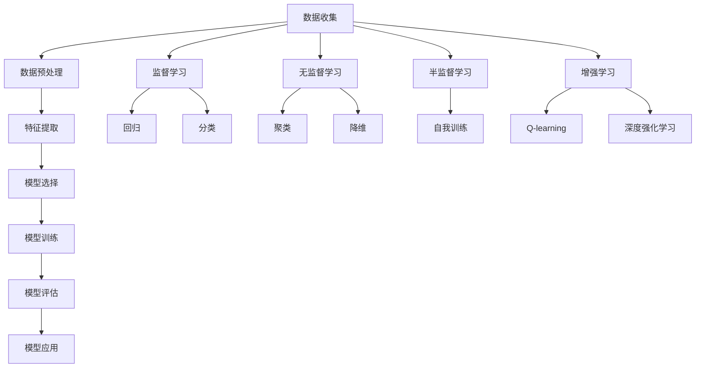
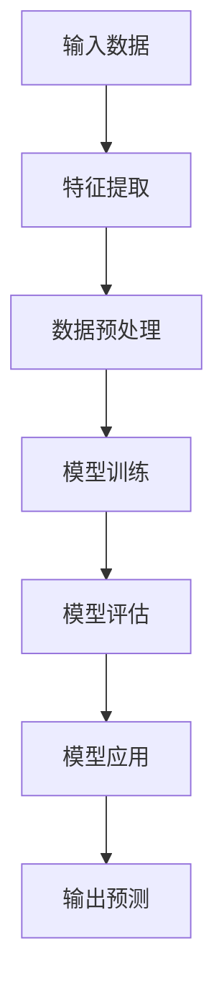

                 

## 第1章：机器学习概述

### 1.1 机器学习简介

机器学习（Machine Learning）是人工智能（Artificial Intelligence，AI）的一个重要分支，主要研究如何让计算机从数据中学习，从而进行预测或决策。其核心目标是让计算机通过学习算法，自动从数据中提取有用的信息，并应用这些信息来解决实际问题。

#### 1.1.1 机器学习的定义

机器学习可以定义为“一组研究计算机如何从数据中学习算法的学科”。简单来说，就是计算机利用已有的数据，通过算法来发现规律，然后利用这些规律对未知数据进行预测或决策。

#### 1.1.2 机器学习的基本原理

机器学习的基本原理主要分为以下几类：

1. **监督学习（Supervised Learning）**：通过已有标记数据训练模型，然后利用训练好的模型对未知数据进行预测。
2. **无监督学习（Unsupervised Learning）**：在没有标记数据的情况下，通过算法自动发现数据中的规律或结构。
3. **半监督学习（Semi-supervised Learning）**：结合监督学习和无监督学习，利用部分标记数据和大量未标记数据来训练模型。
4. **增强学习（Reinforcement Learning）**：通过与环境交互，不断调整策略，以实现最大化累积奖励。

#### 1.1.3 机器学习的基本过程

机器学习的基本过程通常包括以下几个步骤：

1. **数据收集**：收集用于训练模型的数据。
2. **数据预处理**：清洗数据，处理缺失值、异常值等。
3. **特征提取**：将原始数据转换为适合模型训练的特征向量。
4. **模型选择**：选择适合问题的机器学习模型。
5. **模型训练**：使用训练数据对模型进行训练。
6. **模型评估**：使用验证数据评估模型性能。
7. **模型优化**：根据评估结果对模型进行调整。
8. **模型应用**：将训练好的模型应用于实际问题。

### 1.2 机器学习的历史与发展

机器学习的发展可以追溯到20世纪50年代，当时人工智能（AI）的概念刚刚被提出。在早期，机器学习主要集中在逻辑推理和基于规则的系统。随着计算能力的提升和数据量的增长，机器学习逐渐成为AI研究的重要方向。

#### 1.2.1 机器学习的发展历程

1. **20世纪50年代**：人工智能概念的提出，机器学习开始受到关注。
2. **20世纪60年代**：决策树、线性回归等基本机器学习算法得到发展。
3. **20世纪70年代**：机器学习的理论和算法进一步发展，但受限于计算能力，应用受到限制。
4. **20世纪80年代**：专家系统和知识表示成为主流，机器学习发展放缓。
5. **20世纪90年代**：支持向量机、神经网络等算法取得重要突破，机器学习重新受到关注。
6. **21世纪以来**：随着互联网和大数据的发展，机器学习应用场景不断拓展，深度学习等新技术得到广泛应用。

#### 1.2.2 我国机器学习的发展现状

我国在机器学习领域的研究和应用也在迅速发展。近年来，我国科研人员在人工智能领域取得了世界领先的成果，如深度学习、增强学习等领域。同时，我国企业也在人工智能应用方面取得显著进展，如百度、阿里巴巴、腾讯等企业在语音识别、图像识别、自然语言处理等领域处于世界领先地位。

#### 1.2.3 机器学习的未来发展趋势

未来，机器学习将继续在以下方向取得发展：

1. **算法优化与理论深化**：不断优化现有算法，提高模型性能和计算效率。
2. **算法泛化能力提升**：提高模型对未知数据的适应能力，提升模型的泛化能力。
3. **数据隐私保护**：随着数据隐私问题的日益突出，如何保护用户数据隐私将成为重要研究方向。
4. **跨领域应用**：机器学习将在医疗、金融、教育、农业等领域得到更广泛的应用。
5. **硬件与软件协同发展**：随着人工智能硬件的发展，如TPU、GPU等专用硬件的普及，将推动机器学习的进一步发展。

### 1.3 机器学习的基本类型

机器学习可以分为以下几种基本类型：

#### 1.3.1 监督学习

监督学习是一种最常见的机器学习方法，它通过已有标记数据训练模型，然后利用训练好的模型对未知数据进行预测。监督学习可以分为以下几种类型：

1. **回归问题**：输出是连续值，如线性回归、逻辑回归等。
2. **分类问题**：输出是离散值，如决策树、随机森林、支持向量机等。

#### 1.3.2 无监督学习

无监督学习是在没有标记数据的情况下，通过算法自动发现数据中的规律或结构。无监督学习可以分为以下几种类型：

1. **聚类**：将数据分为不同的簇，如K-均值聚类、层次聚类等。
2. **降维**：将高维数据转换为低维数据，如主成分分析（PCA）、t-SNE等。
3. **关联规则学习**：发现数据之间的关联关系，如Apriori算法、FP-Growth算法等。

#### 1.3.3 半监督学习和增强学习

半监督学习和增强学习是介于监督学习和无监督学习之间的方法。

1. **半监督学习**：利用部分标记数据和大量未标记数据来训练模型，如自我训练（Self-training）算法。
2. **增强学习**：通过与环境交互，不断调整策略，以实现最大化累积奖励，如Q-learning、深度强化学习（DQN）等。

### 1.4 机器学习的应用领域

机器学习在众多领域都有着广泛的应用，以下是一些典型的应用领域：

#### 1.4.1 数据挖掘与知识发现

数据挖掘是机器学习的一个重要应用领域，它通过挖掘大量数据中的隐含模式，帮助企业和个人做出更明智的决策。知识发现则是从大量数据中发现新的知识和规律。

#### 1.4.2 自然语言处理

自然语言处理（NLP）是机器学习在语言领域的应用，它包括文本分类、情感分析、机器翻译、语音识别等任务。

#### 1.4.3 计算机视觉

计算机视觉是机器学习在图像和视频处理领域的应用，它包括图像分类、目标检测、人脸识别、图像生成等任务。

#### 1.4.4 电子商务与推荐系统

电子商务和推荐系统是机器学习在商业领域的典型应用，通过分析用户行为和偏好，为用户提供个性化的商品推荐和服务。

#### 1.4.5 金融风险管理

金融风险管理是机器学习在金融领域的应用，通过分析市场数据，预测市场趋势，为金融机构提供投资建议和风险控制策略。

#### 1.4.6 生物信息学

生物信息学是机器学习在生物医学领域的应用，通过分析生物数据，如基因序列、蛋白质结构等，帮助科学家发现新的生物学知识。

#### 1.4.7 其他应用领域

除了上述领域，机器学习还广泛应用于智能家居、智能交通、智慧城市、医疗设备等众多领域，为人类社会带来巨大的变革。

## 1.5 机器学习的挑战与未来趋势

虽然机器学习已经取得了显著的成果，但仍面临许多挑战：

1. **数据质量和多样性**：数据质量和多样性是影响机器学习模型性能的重要因素。如何处理缺失值、异常值和噪声数据，如何从大量多样性的数据中提取有效信息，是当前研究的热点。
2. **模型解释性**：随着深度学习等复杂模型的应用，模型的可解释性成为一个重要问题。如何让模型的可解释性与其性能相匹配，是未来研究的一个方向。
3. **计算效率**：大规模数据和高维特征的机器学习任务对计算资源的需求越来越大。如何提高模型的计算效率，降低训练成本，是机器学习研究的一个重要问题。
4. **数据隐私保护**：随着数据隐私问题的日益突出，如何在保证数据隐私的前提下，利用数据训练模型，是机器学习面临的一个重要挑战。

未来，机器学习将继续在以下方向取得发展：

1. **算法优化与理论深化**：不断优化现有算法，提高模型性能和计算效率。
2. **算法泛化能力提升**：提高模型对未知数据的适应能力，提升模型的泛化能力。
3. **数据隐私保护**：随着数据隐私问题的日益突出，如何保护用户数据隐私将成为重要研究方向。
4. **跨领域应用**：机器学习将在医疗、金融、教育、农业等领域得到更广泛的应用。
5. **硬件与软件协同发展**：随着人工智能硬件的发展，如TPU、GPU等专用硬件的普及，将推动机器学习的进一步发展。

### 1.6 机器学习的核心概念与联系

#### 机器学习核心概念联系图



#### 机器学习架构图



### 1.7 本章总结

本章对机器学习进行了全面的概述，介绍了机器学习的定义、基本原理、历史发展、基本类型、应用领域以及面临的挑战和未来趋势。通过本章的学习，读者可以了解到机器学习的基本概念和原理，为进一步学习和应用打下基础。

## 1.7 小结

本章重点介绍了机器学习的基本概念和原理，包括定义、基本原理、历史发展、基本类型、应用领域以及面临的挑战和未来趋势。通过本章的学习，读者可以全面了解机器学习的相关知识，为后续章节的学习和应用打下坚实的基础。在接下来的章节中，我们将深入探讨用户行为数据分析、预测模型与算法、实际应用与案例等内容。

## 第2章：用户行为数据分析

### 2.1 用户行为数据分析的重要性

用户行为数据分析（User Behavior Analysis）是现代数据驱动决策的重要手段之一。它通过对用户在互联网平台上的行为数据进行收集、处理和分析，为企业提供有价值的洞察，帮助企业优化用户体验、提升运营效率、增加收入。

#### 2.1.1 用户行为数据分析的意义

用户行为数据分析对于企业和用户都具有重要的意义：

1. **企业视角**：
   - **提升用户体验**：通过分析用户行为，企业可以更好地了解用户的需求和偏好，从而设计出更符合用户期望的产品和服务。
   - **优化运营策略**：了解用户行为有助于企业发现运营中的问题和瓶颈，从而优化运营流程，提高运营效率。
   - **增加收入**：通过精准的用户行为分析，企业可以识别出高价值用户，实施个性化的营销策略，从而提升转化率和销售额。

2. **用户视角**：
   - **个性化的用户体验**：用户行为分析可以帮助平台提供更加个性化的服务，满足用户的个性化需求。
   - **优化决策**：用户通过分析自己的行为数据，可以更好地了解自己的需求和偏好，从而做出更明智的决策。

#### 2.1.2 用户行为数据分析的价值

用户行为数据分析的价值主要体现在以下几个方面：

1. **用户理解**：通过分析用户行为，企业可以深入了解用户的习惯、偏好和需求，从而更好地服务于用户。
2. **市场洞察**：用户行为分析可以帮助企业发现市场趋势和竞争对手的策略，为企业提供战略决策依据。
3. **产品优化**：用户行为分析可以为产品迭代提供数据支持，帮助企业不断优化产品功能，提高用户满意度。
4. **营销效果评估**：通过分析用户行为数据，企业可以评估不同营销策略的效果，从而优化营销策略。

#### 2.1.3 用户行为数据分析的应用领域

用户行为数据分析在多个领域都有着广泛的应用：

1. **电子商务**：通过分析用户浏览、点击、购买等行为，电子商务平台可以优化产品推荐和广告投放，提高转化率。
2. **社交媒体**：社交媒体平台通过分析用户的互动行为，可以优化内容推荐和广告投放策略，提高用户活跃度。
3. **在线教育**：在线教育平台通过分析用户的学习行为，可以优化课程设计，提高学习效果。
4. **金融领域**：金融机构通过分析用户的行为数据，可以识别高风险用户，优化风险评估和管理策略。
5. **医疗健康**：医疗健康领域通过分析患者的行为数据，可以优化医疗服务，提高患者满意度。

### 2.2 用户行为的特征提取

用户行为的特征提取是用户行为数据分析的重要环节。特征提取的目的是将原始的用户行为数据转换为可用于机器学习模型的特征向量。以下是一些常见的用户行为特征提取方法：

#### 2.2.1 用户行为特征的定义

用户行为特征是指从用户行为数据中提取出的，能够反映用户行为规律和偏好的一组指标。常见的用户行为特征包括：

1. **浏览行为特征**：如浏览时间、浏览页面数量、页面停留时间等。
2. **点击行为特征**：如点击次数、点击频率、点击分布等。
3. **购买行为特征**：如购买频率、购买金额、购买时长等。
4. **社交行为特征**：如点赞数量、评论数量、分享数量等。

#### 2.2.2 用户行为特征的分类

根据用户行为特征的类型，可以分为以下几类：

1. **基本行为特征**：如浏览时间、点击次数等，这些特征可以直接从用户行为数据中提取。
2. **衍生行为特征**：通过计算基本行为特征之间的关系或组合得到的新特征，如用户活跃度、用户留存率等。
3. **上下文特征**：包括用户所处的环境特征，如地理位置、时间戳、设备类型等。

#### 2.2.3 用户行为特征提取的方法

常见的用户行为特征提取方法包括：

1. **统计方法**：通过计算基本行为特征的统计指标，如均值、方差、中位数等，提取用户行为特征。
2. **机器学习方法**：利用监督学习或无监督学习算法，从原始行为数据中自动提取有意义的特征。
3. **深度学习方法**：通过构建深度神经网络，直接从原始行为数据中提取高层次的抽象特征。

### 2.3 用户行为数据的预处理

用户行为数据的预处理是确保数据质量和模型性能的重要步骤。以下是一些常见的用户行为数据预处理方法：

#### 2.3.1 数据清洗

数据清洗是指识别并处理数据中的错误、异常值和噪声。常见的处理方法包括：

1. **缺失值处理**：对于缺失值，可以采用插值法、均值填充法、中值填充法等方式进行处理。
2. **异常值处理**：通过统计学方法，如箱线图、Z-Score等，识别并处理异常值。
3. **噪声处理**：通过滤波器、平滑算法等，降低噪声对数据的影响。

#### 2.3.2 数据归一化

数据归一化是指将不同量纲的特征数据转换为同一量纲，以消除量纲对模型训练的影响。常见的归一化方法包括：

1. **最小-最大归一化**：将数据缩放到[0,1]之间。
2. **均值-标准差归一化**：将数据缩放到均值附近，标准差范围内。

#### 2.3.3 数据缺失处理

数据缺失处理是指解决数据中缺失值的问题。常见的处理方法包括：

1. **删除缺失数据**：对于缺失数据较多的情况，可以考虑删除缺失数据。
2. **填充缺失数据**：对于缺失数据较少的情况，可以通过插值法、均值填充法、中值填充法等方式进行填充。

#### 2.3.4 异常值处理

异常值处理是指识别并处理数据中的异常值。常见的处理方法包括：

1. **统计学方法**：通过统计学方法，如箱线图、Z-Score等，识别并处理异常值。
2. **聚类方法**：通过聚类算法，识别出异常数据点，并对其进行处理。

### 2.4 用户行为数据可视化

用户行为数据可视化是将用户行为数据以图形化形式展示出来，以便于分析者和决策者直观地理解和分析数据。以下是一些常见的用户行为数据可视化方法：

#### 2.4.1 可视化工具与库

常见的用户行为数据可视化工具和库包括：

1. **Matplotlib**：用于绘制各种类型的图形，如折线图、柱状图、散点图等。
2. **Seaborn**：基于Matplotlib，提供更丰富的可视化模板和样式。
3. **Plotly**：提供交互式可视化，可以创建各种类型的交互式图表。

#### 2.4.2 用户行为数据可视化方法

常见的用户行为数据可视化方法包括：

1. **时间序列图**：用于展示用户行为的随时间变化趋势。
2. **散点图**：用于展示用户行为的相关性。
3. **箱线图**：用于展示用户行为的分布情况。
4. **热力图**：用于展示用户行为的分布情况。

#### 2.4.3 用户行为数据可视化实践

用户行为数据可视化实践示例：

```python
import matplotlib.pyplot as plt
import seaborn as sns
import pandas as pd

# 加载数据
data = pd.read_csv('user_behavior_data.csv')

# 时间序列图
plt.figure(figsize=(10, 5))
sns.lineplot(x='timestamp', y='page_views', data=data)
plt.title('Page Views Over Time')
plt.xlabel('Timestamp')
plt.ylabel('Page Views')
plt.show()

# 箱线图
plt.figure(figsize=(10, 5))
sns.boxplot(x='page_views', data=data)
plt.title('Page View Distribution')
plt.xlabel('Page Views')
plt.show()

# 热力图
plt.figure(figsize=(10, 5))
sns.heatmap(data.corr(), annot=True, cmap='coolwarm')
plt.title('Correlation Matrix of User Behavior Features')
plt.show()
```

### 2.5 本章总结

本章介绍了用户行为数据分析的重要性、用户行为特征提取的方法、用户行为数据的预处理以及用户行为数据的可视化方法。通过对用户行为数据的深入分析，企业可以更好地了解用户需求和行为，从而优化产品和服务，提升用户体验和运营效率。在接下来的章节中，我们将进一步探讨用户行为预测模型与算法的应用。

## 第3章：监督学习算法

监督学习算法是机器学习中最常用的算法之一，它通过已有的标记数据来训练模型，然后利用训练好的模型对未知数据进行预测。本章将详细介绍几种常见的监督学习算法，包括线性回归、逻辑回归、支持向量机和决策树。

### 3.1 线性回归

线性回归（Linear Regression）是最基本的监督学习算法之一，用于预测连续值输出。线性回归模型的数学模型如下：

$$
y = \beta_0 + \beta_1 \cdot x + \epsilon
$$

其中，$y$ 是预测值，$x$ 是输入特征，$\beta_0$ 和 $\beta_1$ 分别是模型的参数，$\epsilon$ 是误差项。

#### 3.1.1 线性回归的原理

线性回归的原理是利用已有的标记数据，通过最小二乘法（Least Squares Method）来估计模型参数 $\beta_0$ 和 $\beta_1$。最小二乘法的目的是使得预测值与实际值之间的误差平方和最小。

#### 3.1.2 线性回归的求解方法

线性回归的求解方法主要包括以下几种：

1. **最小二乘法（Ordinary Least Squares，OLS）**：通过求解损失函数的梯度为零来得到模型参数。损失函数通常采用平方误差损失函数（Quadratic Loss Function）。

$$
J(\beta_0, \beta_1) = \sum_{i=1}^{n} (y_i - (\beta_0 + \beta_1 \cdot x_i))^2
$$

2. **梯度下降法（Gradient Descent）**：通过迭代更新模型参数，使得损失函数逐渐减小。梯度下降法可以分为批量梯度下降（Batch Gradient Descent）、随机梯度下降（Stochastic Gradient Descent）和批量随机梯度下降（Mini-batch Gradient Descent）。

#### 3.1.3 线性回归的性能评估

线性回归的性能评估通常使用以下指标：

1. **决定系数（R-squared）**：衡量模型对数据的拟合程度，取值范围为 [0, 1]。决定系数越接近 1，表示模型对数据的拟合程度越好。

$$
R^2 = 1 - \frac{\sum_{i=1}^{n} (y_i - \hat{y_i})^2}{\sum_{i=1}^{n} (y_i - \bar{y})^2}
$$

其中，$\hat{y_i}$ 是预测值，$\bar{y}$ 是实际值的均值。

2. **均方误差（Mean Squared Error，MSE）**：衡量预测值与实际值之间的误差平方的平均值。

$$
MSE = \frac{1}{n} \sum_{i=1}^{n} (y_i - \hat{y_i})^2
$$

### 3.2 逻辑回归

逻辑回归（Logistic Regression）是一种用于预测离散值的监督学习算法，通常用于分类问题。逻辑回归的数学模型如下：

$$
\sigma(\beta_0 + \beta_1 \cdot x) = P(y=1)
$$

其中，$\sigma$ 是 sigmoid 函数，$P(y=1)$ 是预测变量属于类1的概率。

#### 3.2.1 逻辑回归的原理

逻辑回归的原理是通过已有标记数据，利用最大似然估计（Maximum Likelihood Estimation，MLE）来估计模型参数 $\beta_0$ 和 $\beta_1$。最大似然估计的目标是使得模型在训练数据上的概率最大。

#### 3.2.2 逻辑回归的求解方法

逻辑回归的求解方法主要包括以下几种：

1. **最大似然估计（Maximum Likelihood Estimation，MLE）**：通过求解损失函数的对数似然函数的最大值来得到模型参数。

$$
\ell(\beta_0, \beta_1) = \sum_{i=1}^{n} \ln P(y_i | \beta_0, \beta_1)
$$

2. **梯度下降法（Gradient Descent）**：通过迭代更新模型参数，使得对数似然函数逐渐增大。梯度下降法的损失函数通常采用对数损失函数（Log Loss Function）。

$$
J(\beta_0, \beta_1) = -\frac{1}{n} \sum_{i=1}^{n} [y_i \ln(\sigma(\beta_0 + \beta_1 \cdot x_i)) + (1 - y_i) \ln(1 - \sigma(\beta_0 + \beta_1 \cdot x_i))]
$$

#### 3.2.3 逻辑回归的性能评估

逻辑回归的性能评估通常使用以下指标：

1. **准确率（Accuracy）**：预测正确的样本数占总样本数的比例。

$$
Accuracy = \frac{TP + TN}{TP + TN + FP + FN}
$$

其中，$TP$ 是真正例，$TN$ 是真反例，$FP$ 是假正例，$FN$ 是假反例。

2. **精确率（Precision）**：预测为正例的样本中，真正例的比例。

$$
Precision = \frac{TP}{TP + FP}
$$

3. **召回率（Recall）**：预测为正例的样本中，真反例的比例。

$$
Recall = \frac{TP}{TP + FN}
$$

4. **F1 值（F1-score）**：精确率和召回率的调和平均值。

$$
F1-score = 2 \cdot \frac{Precision \cdot Recall}{Precision + Recall}
$$

### 3.3 支持向量机

支持向量机（Support Vector Machine，SVM）是一种用于分类问题的监督学习算法，它通过寻找最佳的超平面，将不同类别的数据点分开。SVM的数学模型如下：

$$
\min \frac{1}{2} \sum_{i=1}^{n} (\beta_i^2) + C \sum_{i=1}^{n} (y_i - (\beta_0 + \sum_{j=1}^{n} \beta_j \cdot x_{ij}))
$$

其中，$\beta_0$ 和 $\beta_i$ 是模型参数，$C$ 是正则化参数，$y_i$ 是标签，$x_{ij}$ 是特征。

#### 3.3.1 支持向量机的原理

支持向量机的原理是找到最佳的超平面，使得不同类别的数据点在超平面两侧的间隔最大。支持向量是指位于超平面附近的样本点，它们对模型的决策边界有着重要的影响。

#### 3.3.2 支持向量机的求解方法

支持向量机的求解方法主要包括以下几种：

1. **原始求解**：直接求解原始优化问题。这种方法适用于小规模数据集。

2. **SMO算法（Sequential Minimal Optimization）**：针对原始优化问题，提出了一种迭代求解方法，适用于大规模数据集。

3. **核方法（Kernel Method）**：当数据维度很高时，直接在原始空间中求解支持向量机可能不可行。核方法通过将数据映射到高维特征空间，然后在高维特征空间中求解支持向量机。

#### 3.3.3 支持向量机的性能评估

支持向量机的性能评估通常使用以下指标：

1. **准确率（Accuracy）**：与逻辑回归相同。

2. **召回率（Recall）**：与逻辑回归相同。

3. **精确率（Precision）**：与逻辑回归相同。

4. **F1 值（F1-score）**：与逻辑回归相同。

5. **ROC 曲线（Receiver Operating Characteristic Curve）**：ROC 曲线是评估分类器性能的重要工具，它通过改变决策阈值，绘制真正例率（True Positive Rate，TPR）与假正例率（False Positive Rate，FPR）之间的关系。

6. **AUC 值（Area Under Curve）**：ROC 曲线的下方面积表示分类器的性能，AUC 值越大，表示分类器性能越好。

### 3.4 决策树

决策树（Decision Tree）是一种常用的分类和回归算法，它通过一系列的决策规则，将数据划分为不同的区域。决策树的数学模型如下：

$$
\text{决策树} = \text{if} (x_i > v_i) \text{then} \text{左子树} \text{else} \text{右子树}
$$

其中，$x_i$ 是特征，$v_i$ 是阈值。

#### 3.4.1 决策树的原理

决策树的原理是通过不断划分数据集，将数据划分为具有高纯度的区域。决策树的每个节点代表一个特征，每个分支代表一个阈值。通过递归划分，最终形成一棵完整的决策树。

#### 3.4.2 决策树的构建过程

决策树的构建过程主要包括以下步骤：

1. **选择特征**：选择一个最优的特征进行划分。常用的特征选择方法有信息增益（Information Gain）、基尼不纯度（Gini Impurity）等。

2. **计算特征值**：计算每个特征在不同阈值下的划分效果。通常采用信息增益或基尼不纯度来评估划分效果。

3. **递归划分**：根据最优的特征和阈值，将数据集划分为子集。对于子集，重复上述步骤，直到满足停止条件。

4. **构建决策树**：根据递归划分的结果，构建决策树。

#### 3.4.3 决策树的评价指标

决策树的性能评估通常使用以下指标：

1. **准确率（Accuracy）**：与逻辑回归和支持向量机相同。

2. **精确率（Precision）**：与逻辑回归和支持向量机相同。

3. **召回率（Recall）**：与逻辑回归和支持向量机相同。

4. **F1 值（F1-score）**：与逻辑回归和支持向量机相同。

5. **分类报告（Classification Report）**：分类报告详细展示了分类器的性能，包括准确率、精确率、召回率和F1值等。

### 3.5 本章总结

本章详细介绍了监督学习算法，包括线性回归、逻辑回归、支持向量机和决策树。这些算法在用户行为数据分析中有着广泛的应用。通过对这些算法的深入理解，我们可以更好地应对用户行为预测和分析中的挑战。在下一章中，我们将探讨无监督学习算法。

## 第4章：无监督学习算法

无监督学习算法在机器学习领域中扮演着重要角色，尤其是在用户行为数据分析中。这些算法无需标记数据，而是通过自动发现数据中的隐含结构和规律来揭示数据内在的分布和模式。本章将详细介绍几种常见的无监督学习算法，包括K-均值聚类、主成分分析和聚类算法的选择与应用。

### 4.1 K-均值聚类

K-均值聚类（K-Means Clustering）是一种简单的迭代优化算法，用于将数据划分为K个簇。K-均值聚类的核心思想是使得每个簇的内部差异最小，而簇与簇之间的差异最大。

#### 4.1.1 K-均值聚类的原理

K-均值聚类的原理如下：

1. **初始化**：随机选择K个初始中心点。
2. **分配**：对于每个数据点，将其分配到最近的中心点所代表的簇。
3. **更新**：重新计算每个簇的中心点。
4. **迭代**：重复步骤2和步骤3，直到中心点的位置不再发生变化或者满足预定的迭代次数。

#### 4.1.2 K-均值聚类的过程

K-均值聚类的过程可以分为以下步骤：

1. **选择聚类个数K**：可以通过肘部法则（Elbow Method）、轮廓系数（Silhouette Coefficient）等方法来确定合适的聚类个数K。
2. **初始化中心点**：可以选择随机初始化中心点，或者使用K-均值初始化方法。
3. **分配数据点**：对于每个数据点，计算其到各个中心点的距离，将其分配到距离最近的中心点所代表的簇。
4. **更新中心点**：计算每个簇的平均值，作为新的中心点。
5. **重复迭代**：重复步骤3和步骤4，直到收敛。

#### 4.1.3 K-均值聚类的性能评估

K-均值聚类的性能评估通常使用以下指标：

1. **内聚度（Cohesion）**：衡量簇内部的紧密程度。通常使用簇内平均距离（Intra-cluster distance）来评估。
2. **分离度（Separation）**：衡量簇之间的分离程度。通常使用簇间平均距离（Inter-cluster distance）来评估。
3. **轮廓系数（Silhouette Coefficient）**：衡量簇内数据点与其他簇的相似度。取值范围为[-1, 1]，值越大表示聚类效果越好。

### 4.2 主成分分析

主成分分析（Principal Component Analysis，PCA）是一种降维技术，通过将数据投影到新的正交坐标系中，提取出数据的主要特征，从而降低数据的维度。

#### 4.2.1 主成分分析的原理

主成分分析的原理如下：

1. **协方差矩阵计算**：计算数据集的协方差矩阵。
2. **特征值和特征向量计算**：计算协方差矩阵的特征值和特征向量。
3. **排序和选择**：将特征值从大到小排序，并选择前k个特征向量。
4. **数据转换**：将数据投影到由这些特征向量构成的新坐标系中。

#### 4.2.2 主成分分析的过程

主成分分析的过程可以分为以下步骤：

1. **数据标准化**：将数据集进行标准化处理，使得每个特征的方差相等。
2. **协方差矩阵计算**：计算数据的协方差矩阵。
3. **特征值和特征向量计算**：计算协方差矩阵的特征值和特征向量。
4. **排序和选择**：选择特征值最大的前k个特征向量。
5. **数据转换**：将数据投影到由这些特征向量构成的新坐标系中。

#### 4.2.3 主成分分析的应用

主成分分析在多个领域有着广泛的应用：

1. **降维**：通过提取主要特征，减少数据维度，提高数据处理效率。
2. **可视化**：将高维数据投影到二维或三维空间中，便于数据的可视化分析。
3. **特征提取**：提取数据的主要特征，用于后续的监督学习或无监督学习任务。

### 4.3 聚类算法的选择与应用

在用户行为数据分析中，选择合适的聚类算法对于揭示数据内在的结构和规律至关重要。常见的聚类算法包括K-均值聚类、层次聚类、DBSCAN等。以下是一些常见的聚类算法选择与应用：

#### 4.3.1 K-均值聚类

K-均值聚类适用于数据分布较为球形且聚类个数已知的情况。它通过迭代优化中心点，将数据划分为K个簇。K-均值聚类在用户行为数据分析中可以用于用户群体划分、市场细分等。

#### 4.3.2 层次聚类

层次聚类通过逐步合并或分裂簇，形成层次结构。层次聚类适用于数据分布不规则且聚类个数未知的情况。它可以帮助用户发现潜在的用户群体和模式。

#### 4.3.3 DBSCAN

DBSCAN（Density-Based Spatial Clustering of Applications with Noise）是一种基于密度的聚类算法，适用于高维数据和非规则分布的数据。它通过计算数据点的密度和邻域关系，将数据划分为不同的簇。DBSCAN在用户行为数据分析中可以用于发现稀疏的用户群体和异常值。

#### 4.3.4 聚类算法的选择标准

在选择聚类算法时，需要考虑以下标准：

1. **数据分布**：选择适合数据分布的聚类算法。
2. **聚类个数**：对于聚类个数已知的场景，选择K-均值聚类；对于聚类个数未知的场景，选择层次聚类或DBSCAN。
3. **算法复杂度**：考虑算法的复杂度和计算效率，选择适合数据规模的聚类算法。
4. **聚类质量**：评估聚类质量，如轮廓系数、内聚度和分离度等。

### 4.4 本章总结

本章介绍了无监督学习算法，包括K-均值聚类、主成分分析和聚类算法的选择与应用。这些算法在用户行为数据分析中有着广泛的应用，可以帮助我们揭示数据内在的结构和规律。在下一章中，我们将探讨深度学习模型在用户行为预测中的应用。

## 第5章：深度学习模型

深度学习（Deep Learning）是机器学习的一个分支，它通过模拟人脑神经网络的结构和功能，实现高度复杂的特征提取和模式识别。本章将详细介绍几种深度学习模型，包括卷积神经网络（CNN）、循环神经网络（RNN）和生成对抗网络（GAN），并探讨这些模型在用户行为预测中的应用。

### 5.1 卷积神经网络

卷积神经网络（Convolutional Neural Network，CNN）是一种用于处理图像数据的深度学习模型，它在图像识别、物体检测和图像生成等领域取得了显著的成果。CNN的核心在于其卷积层，可以自动从图像中提取具有层次结构的特征。

#### 5.1.1 卷积神经网络的基本原理

CNN的基本原理如下：

1. **输入层**：接收图像数据，并将其转化为矩阵形式。
2. **卷积层**：通过卷积操作，将输入图像与滤波器（Kernel）进行卷积，提取图像特征。
3. **激活函数**：对卷积结果进行非线性变换，如ReLU（Rectified Linear Unit）函数。
4. **池化层**：通过池化操作，降低特征图的空间分辨率，减少模型参数。
5. **全连接层**：将卷积层和池化层输出的特征进行融合，并通过全连接层输出最终结果。

#### 5.1.2 卷积神经网络的架构

卷积神经网络的典型架构包括以下几层：

1. **卷积层（Convolutional Layer）**：通过卷积操作提取图像特征。
2. **激活函数层（Activation Function Layer）**：使用ReLU函数等激活函数增加模型非线性。
3. **池化层（Pooling Layer）**：通过最大池化或平均池化降低特征图的空间分辨率。
4. **全连接层（Fully Connected Layer）**：将卷积层和池化层输出的特征进行融合，并通过全连接层输出最终结果。
5. **输出层（Output Layer）**：根据任务类型，输出分类概率或预测值。

#### 5.1.3 卷积神经网络的训练与优化

卷积神经网络的训练过程主要包括以下步骤：

1. **前向传播**：将输入图像通过卷积神经网络，得到输出结果。
2. **反向传播**：计算输出结果与实际标签之间的误差，并反向传播误差到网络中的各个层。
3. **梯度下降**：利用反向传播得到的梯度，更新网络中的参数。
4. **优化算法**：选择合适的优化算法，如随机梯度下降（SGD）、Adam等。

#### 5.1.4 卷积神经网络在用户行为预测中的应用

卷积神经网络在用户行为预测中的应用主要包括以下几个方面：

1. **图像识别**：通过卷积神经网络对用户上传的图片进行识别，提取图像特征用于后续预测。
2. **视频分析**：对用户行为视频进行卷积神经网络处理，提取视频特征，用于行为预测和情感分析。
3. **用户行为序列建模**：通过卷积神经网络对用户行为序列进行建模，提取用户行为的时空特征。

### 5.2 循环神经网络

循环神经网络（Recurrent Neural Network，RNN）是一种用于处理序列数据的深度学习模型，它在语音识别、自然语言处理和时间序列预测等领域表现出强大的能力。RNN的核心在于其循环结构，可以记住前面的输入信息，用于当前时刻的输出。

#### 5.2.1 循环神经网络的基本原理

RNN的基本原理如下：

1. **输入层**：接收序列数据，如文本、语音等。
2. **隐藏层**：通过循环结构，将当前时刻的输入与上一时刻的隐藏状态进行融合，生成当前时刻的隐藏状态。
3. **输出层**：将隐藏状态映射到输出结果，如分类标签或预测值。

#### 5.2.2 循环神经网络的架构

RNN的典型架构包括以下几层：

1. **输入层**：接收序列数据。
2. **隐藏层**：通过循环结构，将当前时刻的输入与上一时刻的隐藏状态进行融合。
3. **输出层**：将隐藏状态映射到输出结果。
4. **权重更新**：通过反向传播，更新网络中的权重。

#### 5.2.3 循环神经网络的训练与优化

RNN的训练过程主要包括以下步骤：

1. **前向传播**：将输入序列通过RNN，得到输出序列。
2. **反向传播**：计算输出序列与实际标签之间的误差，并反向传播误差到网络中的各个层。
3. **梯度下降**：利用反向传播得到的梯度，更新网络中的参数。
4. **优化算法**：选择合适的优化算法，如随机梯度下降（SGD）、Adam等。

#### 5.2.4 循环神经网络在用户行为预测中的应用

RNN在用户行为预测中的应用主要包括以下几个方面：

1. **时间序列预测**：通过RNN对用户行为序列进行建模，提取用户行为的时序特征，用于预测用户未来的行为。
2. **用户意图识别**：通过RNN对用户行为序列进行建模，识别用户的意图，为用户提供个性化的服务。
3. **情感分析**：通过RNN对用户行为序列进行建模，提取用户的情感特征，用于情感分析。

### 5.3 生成对抗网络

生成对抗网络（Generative Adversarial Network，GAN）是一种由生成器和判别器组成的深度学习模型，用于生成逼真的数据。GAN的核心在于其对抗性训练，生成器和判别器相互竞争，不断提高生成数据的真实度。

#### 5.3.1 生成对抗网络的基本原理

GAN的基本原理如下：

1. **生成器（Generator）**：生成与真实数据相似的数据。
2. **判别器（Discriminator）**：区分真实数据和生成数据。
3. **对抗训练**：生成器和判别器相互竞争，生成器尝试生成更真实的数据，判别器尝试区分真实数据和生成数据。

#### 5.3.2 生成对抗网络的架构

GAN的典型架构包括以下几层：

1. **生成器**：通过编码器和解码器生成数据。
2. **判别器**：接收真实数据和生成数据，进行分类判断。
3. **对抗训练**：通过反向传播，更新生成器和判别器的参数。

#### 5.3.3 生成对抗网络的训练与优化

GAN的训练过程主要包括以下步骤：

1. **生成器和判别器的初始化**：随机初始化生成器和判别器的参数。
2. **生成器的训练**：生成器生成数据，判别器对真实数据和生成数据进行分类判断。
3. **判别器的训练**：判别器对真实数据和生成数据进行分类判断，生成器生成更真实的数据。
4. **梯度下降**：利用反向传播，更新生成器和判别器的参数。
5. **优化算法**：选择合适的优化算法，如随机梯度下降（SGD）、Adam等。

#### 5.3.4 生成对抗网络在用户行为预测中的应用

生成对抗网络在用户行为预测中的应用主要包括以下几个方面：

1. **用户行为生成**：通过生成对抗网络生成用户的行为数据，用于后续分析和预测。
2. **异常检测**：通过生成对抗网络生成用户的行为数据，与真实行为数据进行对比，识别异常行为。
3. **个性化推荐**：通过生成对抗网络生成用户的行为数据，为用户提供个性化的推荐服务。

### 5.4 深度学习在用户行为预测中的应用

深度学习在用户行为预测中具有显著的优势，主要体现在以下几个方面：

1. **高维特征提取**：深度学习模型可以自动从高维数据中提取具有层次结构的特征，提高预测精度。
2. **序列建模能力**：深度学习模型可以处理序列数据，提取用户行为的时序特征，提高预测的准确性。
3. **自适应能力**：深度学习模型可以根据用户行为的变化，自适应调整预测模型，提高预测的实时性。
4. **个性化推荐**：深度学习模型可以基于用户行为数据，生成个性化的推荐结果，提高用户体验。

### 5.5 本章总结

本章介绍了深度学习模型，包括卷积神经网络、循环神经网络和生成对抗网络。这些模型在用户行为预测中具有广泛的应用，可以帮助我们更好地理解和预测用户行为。在下一章中，我们将探讨机器学习工具与框架。

## 第6章：社交媒体用户行为预测

社交媒体已经成为人们日常生活中不可或缺的一部分，其用户行为数据具有高维度、多样性和实时性的特点。本章将探讨社交媒体用户行为预测的重要性、特征提取方法和实际案例。

### 6.1 社交媒体用户行为预测的重要性

社交媒体用户行为预测具有以下几个方面的应用价值：

1. **用户细分与定位**：通过预测用户行为，企业可以更好地了解用户的需求和偏好，从而进行用户细分和定位，提供个性化的服务。
2. **内容推荐**：社交媒体平台可以通过预测用户的行为，为用户推荐感兴趣的内容，提高用户粘性和活跃度。
3. **营销策略优化**：企业可以利用用户行为预测结果，制定更精准的营销策略，提高广告投放效果和转化率。
4. **风险管理**：社交媒体平台可以通过预测用户行为，识别潜在的风险用户，采取相应的风险控制措施。
5. **社交网络分析**：通过预测用户行为，可以揭示社交网络中的关系结构，为社交网络分析提供数据支持。

### 6.2 社交媒体用户行为的特征提取

社交媒体用户行为的特征提取是进行用户行为预测的关键步骤。以下是一些常见的用户行为特征提取方法：

#### 6.2.1 用户基本信息特征

用户基本信息特征包括年龄、性别、地理位置等。这些特征可以从用户注册信息或社交网络资料中获取。

- **年龄**：用户的年龄可以反映出其成熟度和消费能力。
- **性别**：用户的性别可以用于个性化推荐和广告投放。
- **地理位置**：用户的地理位置可以用于地域营销和社交网络分析。

#### 6.2.2 社交互动特征

社交互动特征反映了用户在社交媒体上的互动行为，包括点赞、评论、分享等。

- **点赞数量**：用户在特定内容上点赞的数量可以反映出其对该内容的兴趣程度。
- **评论数量**：用户在特定内容上的评论数量可以用于评估用户的活跃度。
- **分享次数**：用户在特定内容上的分享次数可以用于评估用户的影响力。

#### 6.2.3 内容发布特征

内容发布特征反映了用户在社交媒体上发布内容的频率、类型和质量。

- **发布频率**：用户在特定时间段内发布内容的频率可以用于评估其活跃度。
- **内容类型**：用户发布的内容类型可以用于分析用户的兴趣和偏好。
- **内容质量**：用户发布的内容质量可以用于评估用户的口碑和影响力。

#### 6.2.4 社交网络特征

社交网络特征反映了用户在社交网络中的关系结构和互动行为。

- **好友数量**：用户的好友数量可以用于评估其社交影响力。
- **互动频率**：用户与好友之间的互动频率可以用于评估社交网络的活跃度。
- **社交圈子**：用户所属的社交圈子可以用于分析用户的社交结构和关系。

### 6.3 社交媒体用户行为预测案例

#### 6.3.1 案例背景与目标

某社交媒体平台希望通过预测用户行为，实现以下目标：

1. **个性化推荐**：为用户推荐其感兴趣的内容，提高用户粘性和活跃度。
2. **广告投放优化**：为广告主提供精准的广告投放策略，提高广告投放效果和转化率。
3. **风险用户识别**：识别潜在的风险用户，采取相应的风险控制措施。

#### 6.3.2 数据预处理与特征提取

1. **数据收集**：收集用户的注册信息、行为数据、发布内容等数据。
2. **数据清洗**：处理缺失值、异常值和噪声数据。
3. **特征提取**：提取用户基本信息特征、社交互动特征、内容发布特征和社交网络特征。

#### 6.3.3 模型选择与训练

1. **模型选择**：选择深度学习模型，如卷积神经网络（CNN）和循环神经网络（RNN），用于用户行为预测。
2. **模型训练**：使用训练数据进行模型训练，通过反向传播和梯度下降优化模型参数。

#### 6.3.4 模型评估与优化

1. **模型评估**：使用验证集对模型进行评估，选择评价指标如准确率、召回率和F1值。
2. **模型优化**：通过调参和特征工程优化模型性能，提高预测准确性。

#### 6.3.5 模型应用与效果评估

1. **模型应用**：将训练好的模型应用于实际场景，如个性化推荐和广告投放。
2. **效果评估**：通过对比实验，评估模型在提高用户粘性、活跃度和广告投放效果方面的效果。

### 6.4 本章总结

本章介绍了社交媒体用户行为预测的重要性、特征提取方法和实际案例。通过预测用户行为，企业可以更好地了解用户需求和偏好，优化产品和服务，提高用户体验和运营效率。在下一章中，我们将探讨电子商务用户行为预测。

## 第7章：电子商务用户行为预测

电子商务用户行为预测是电商企业优化运营策略、提升用户体验和增加收入的重要手段。本章将详细探讨电子商务用户行为预测的意义、特征提取方法和实际案例。

### 7.1 电子商务用户行为预测的意义

电子商务用户行为预测具有重要的商业价值，主要体现在以下几个方面：

1. **个性化推荐**：通过预测用户的行为，电商企业可以为其推荐感兴趣的商品，提高转化率和销售额。
2. **精准营销**：电商企业可以根据用户的行为特征，制定个性化的营销策略，提高广告投放效果和转化率。
3. **库存管理**：通过预测用户购买行为，电商企业可以优化库存管理，减少库存积压，降低库存成本。
4. **客户流失预测**：电商企业可以通过预测用户流失行为，提前采取措施，降低客户流失率，提高客户满意度。
5. **风险控制**：电商企业可以通过预测用户行为，识别潜在的风险用户，采取相应的风险控制措施，降低欺诈风险。

### 7.2 电子商务用户行为的特征提取

电子商务用户行为的特征提取是进行用户行为预测的关键步骤。以下是一些常见的用户行为特征提取方法：

#### 7.2.1 用户基本信息特征

用户基本信息特征包括年龄、性别、地理位置等，这些特征可以从用户注册信息或购物行为中获取。

- **年龄**：用户的年龄可以反映其消费习惯和偏好。
- **性别**：用户的性别可以用于商品推荐和广告投放。
- **地理位置**：用户的地理位置可以用于地域营销和商品配送优化。

#### 7.2.2 购物行为特征

购物行为特征反映了用户在电子商务平台上的购买行为，包括浏览历史、购物车行为、购买历史等。

- **浏览历史**：用户的浏览历史可以用于分析用户的兴趣和偏好。
- **购物车行为**：用户在购物车中的操作行为可以反映其对商品的兴趣程度。
- **购买历史**：用户的购买历史可以用于预测其未来的购买行为。

#### 7.2.3 社交互动特征

社交互动特征反映了用户在电子商务平台上的互动行为，包括评论、点赞、分享等。

- **评论数量**：用户在特定商品上的评论数量可以反映其对商品的满意度。
- **点赞数量**：用户在特定内容上的点赞数量可以反映其对内容的兴趣程度。
- **分享次数**：用户在特定商品上的分享次数可以反映其对商品的影响力。

#### 7.2.4 内容发布特征

内容发布特征反映了用户在电子商务平台上的内容发布行为，包括商品评价、问答等。

- **商品评价**：用户的商品评价可以反映其对商品的满意度。
- **问答**：用户在平台上的问答行为可以用于分析用户的问题和需求。

### 7.3 电子商务用户行为预测案例

#### 7.3.1 案例背景与目标

某电子商务平台希望通过预测用户行为，实现以下目标：

1. **个性化推荐**：为用户推荐其感兴趣的商品，提高转化率和销售额。
2. **精准营销**：为广告主提供个性化的广告投放策略，提高广告投放效果和转化率。
3. **库存管理**：通过预测用户购买行为，优化库存管理，减少库存积压，降低库存成本。
4. **客户流失预测**：预测潜在流失客户，采取相应的挽留措施，提高客户满意度。

#### 7.3.2 数据预处理与特征提取

1. **数据收集**：收集用户的注册信息、购物行为、评论、问答等数据。
2. **数据清洗**：处理缺失值、异常值和噪声数据。
3. **特征提取**：提取用户基本信息特征、购物行为特征、社交互动特征和内容发布特征。

#### 7.3.3 模型选择与训练

1. **模型选择**：选择深度学习模型，如卷积神经网络（CNN）和循环神经网络（RNN），用于用户行为预测。
2. **模型训练**：使用训练数据进行模型训练，通过反向传播和梯度下降优化模型参数。

#### 7.3.4 模型评估与优化

1. **模型评估**：使用验证集对模型进行评估，选择评价指标如准确率、召回率和F1值。
2. **模型优化**：通过调参和特征工程优化模型性能，提高预测准确性。

#### 7.3.5 模型应用与效果评估

1. **模型应用**：将训练好的模型应用于实际场景，如个性化推荐和广告投放。
2. **效果评估**：通过对比实验，评估模型在提高用户转化率、广告投放效果和库存管理方面的效果。

### 7.4 本章总结

本章介绍了电子商务用户行为预测的意义、特征提取方法和实际案例。通过预测用户行为，电商企业可以优化运营策略，提高用户体验和运营效率。在下一章中，我们将探讨移动应用用户行为预测。

## 第8章：移动应用用户行为预测

随着智能手机的普及，移动应用用户行为预测成为个性化推荐、精准营销和用户体验优化的重要手段。本章将探讨移动应用用户行为预测的现状、特征提取方法和实际案例。

### 8.1 移动应用用户行为预测的现状

移动应用用户行为预测在近年来取得了显著的发展，主要体现在以下几个方面：

1. **技术成熟**：深度学习、循环神经网络（RNN）等先进技术为移动应用用户行为预测提供了强大的工具。
2. **数据丰富**：移动设备具有高频率的数据采集能力，如GPS定位、传感器数据、应用使用记录等，为用户行为预测提供了丰富的数据源。
3. **应用广泛**：移动应用用户行为预测在电子商务、社交网络、在线教育等多个领域得到广泛应用。

### 8.2 移动应用用户行为的特征提取

移动应用用户行为的特征提取是进行用户行为预测的关键步骤。以下是一些常见的用户行为特征提取方法：

#### 8.2.1 用户基本信息特征

用户基本信息特征包括年龄、性别、地理位置等，这些特征可以从用户注册信息和移动设备数据中获取。

- **年龄**：用户的年龄可以反映其消费习惯和偏好。
- **性别**：用户的性别可以用于个性化推荐和广告投放。
- **地理位置**：用户的地理位置可以用于地域营销和本地化服务。

#### 8.2.2 应用使用特征

应用使用特征反映了用户在移动应用上的使用行为，包括使用频率、使用时长、启动次数等。

- **使用频率**：用户在一定时间段内使用某个应用的数量可以反映其对该应用的兴趣程度。
- **使用时长**：用户在一定时间段内使用某个应用的总时长可以用于评估其活跃度。
- **启动次数**：用户在一定时间段内启动某个应用的次数可以用于预测其未来的使用行为。

#### 8.2.3 社交互动特征

社交互动特征反映了用户在移动应用上的互动行为，包括点赞、评论、分享等。

- **点赞数量**：用户在特定内容上的点赞数量可以反映其对内容的兴趣程度。
- **评论数量**：用户在特定内容上的评论数量可以用于评估其活跃度。
- **分享次数**：用户在特定内容上的分享次数可以反映其对内容的影响力。

#### 8.2.4 应用内行为特征

应用内行为特征反映了用户在移动应用内的具体操作行为，包括浏览行为、购买行为等。

- **浏览行为**：用户在移动应用内的浏览路径、浏览时间等可以用于分析用户的兴趣和偏好。
- **购买行为**：用户的购买行为可以用于预测其未来的购买行为。

### 8.3 移动应用用户行为预测案例

#### 8.3.1 案例背景与目标

某移动应用公司希望通过预测用户行为，实现以下目标：

1. **个性化推荐**：为用户推荐其感兴趣的应用，提高用户留存率和活跃度。
2. **精准营销**：为广告主提供个性化的广告投放策略，提高广告投放效果和转化率。
3. **用户体验优化**：通过预测用户行为，优化应用功能设计和界面布局，提高用户体验。

#### 8.3.2 数据预处理与特征提取

1. **数据收集**：收集用户的注册信息、应用使用记录、社交互动数据等。
2. **数据清洗**：处理缺失值、异常值和噪声数据。
3. **特征提取**：提取用户基本信息特征、应用使用特征、社交互动特征和应用内行为特征。

#### 8.3.3 模型选择与训练

1. **模型选择**：选择深度学习模型，如卷积神经网络（CNN）和循环神经网络（RNN），用于用户行为预测。
2. **模型训练**：使用训练数据进行模型训练，通过反向传播和梯度下降优化模型参数。

#### 8.3.4 模型评估与优化

1. **模型评估**：使用验证集对模型进行评估，选择评价指标如准确率、召回率和F1值。
2. **模型优化**：通过调参和特征工程优化模型性能，提高预测准确性。

#### 8.3.5 模型应用与效果评估

1. **模型应用**：将训练好的模型应用于实际场景，如个性化推荐和广告投放。
2. **效果评估**：通过对比实验，评估模型在提高用户留存率、活跃度和广告投放效果方面的效果。

### 8.4 本章总结

本章介绍了移动应用用户行为预测的现状、特征提取方法和实际案例。通过预测用户行为，移动应用公司可以优化产品和服务，提高用户体验和运营效率。在下一章中，我们将探讨机器学习工具与框架。

## 第9章：机器学习工具与框架

机器学习工具和框架为研究人员和工程师提供了丰富的功能和便捷的开发体验，使得机器学习项目的实施更加高效和可靠。本章将详细介绍几种流行的机器学习工具和框架，包括Scikit-learn、TensorFlow和PyTorch，并探讨它们的应用场景。

### 9.1 Scikit-learn

Scikit-learn是一个开源的机器学习库，基于Python编写，提供了丰富的机器学习算法和工具。它主要用于监督学习任务，如分类、回归和聚类。

#### 9.1.1 Scikit-learn 的优势

Scikit-learn的主要优势包括：

1. **易于使用**：Scikit-learn提供了简单易用的接口和API，使得研究人员和工程师可以快速实现和测试各种机器学习算法。
2. **算法多样性**：Scikit-learn包含了多种常见的机器学习算法，如线性回归、逻辑回归、支持向量机、决策树、随机森林等。
3. **模块化设计**：Scikit-learn的设计模块化，使得用户可以根据需求组合不同的算法和组件。

#### 9.1.2 Scikit-learn 的主要模块

Scikit-learn的主要模块包括：

1. **分类**：包括线性回归、逻辑回归、支持向量机、决策树、随机森林等算法。
2. **回归**：包括线性回归、岭回归、LASSO回归等算法。
3. **聚类**：包括K-均值聚类、层次聚类、DBSCAN等算法。
4. **降维**：包括主成分分析（PCA）、线性判别分析（LDA）等算法。
5. **模型选择与评估**：包括交叉验证、网格搜索等工具。
6. **数据预处理**：包括数据清洗、归一化、缺失值处理等工具。

#### 9.1.3 Scikit-learn 的应用场景

Scikit-learn广泛应用于各种领域，如：

1. **数据挖掘**：用于发现数据中的隐含模式，支持多种数据挖掘任务。
2. **文本分类**：用于文本数据的分类，如情感分析、主题分类等。
3. **图像识别**：用于图像数据的分类和识别，结合其他图像处理库（如OpenCV）。

### 9.2 TensorFlow

TensorFlow是一个开源的深度学习框架，由Google开发，支持多种编程语言（如Python、C++等），适用于构建大规模深度学习模型。

#### 9.2.1 TensorFlow 的优势

TensorFlow的主要优势包括：

1. **灵活性**：TensorFlow支持动态计算图，使得研究人员和工程师可以根据需求灵活地构建和修改模型。
2. **分布式计算**：TensorFlow支持分布式计算，可以充分利用多GPU和多机集群资源，提高模型训练效率。
3. **生态系统**：TensorFlow拥有丰富的生态系统，包括TensorBoard、TensorFlow Lite等工具，方便模型训练、评估和部署。

#### 9.2.2 TensorFlow 的主要模块

TensorFlow的主要模块包括：

1. **TensorFlow Core**：核心模块，提供计算图构建和计算功能。
2. **TensorFlow Datasets**：用于数据集处理和加载，支持多种数据格式和预处理操作。
3. **TensorFlow Model Optimization**：用于模型压缩、量化、迁移学习等优化。
4. **TensorFlow Lite**：用于移动设备和嵌入式设备的模型部署。
5. **TensorFlow Extended**：扩展模块，提供额外的工具和库，如TensorFlow Serving、TensorFlow Research等。

#### 9.2.3 TensorFlow 的应用场景

TensorFlow广泛应用于各种领域，如：

1. **自然语言处理**：用于构建和训练复杂的语言模型，如BERT、GPT等。
2. **计算机视觉**：用于图像分类、目标检测、图像生成等任务。
3. **语音识别**：用于语音信号的识别和合成。

### 9.3 PyTorch

PyTorch是一个开源的深度学习框架，由Facebook AI研究院开发，支持Python编程语言。它具有动态计算图和易于调试的特点，使得研究人员和工程师可以更轻松地实现和实验深度学习模型。

#### 9.3.1 PyTorch 的优势

PyTorch的主要优势包括：

1. **动态计算图**：PyTorch使用动态计算图，使得模型构建和调试更加灵活。
2. **易于调试**：PyTorch提供了强大的调试工具，如Python的断点调试、可视化工具等。
3. **简洁的API**：PyTorch的API简洁明了，使得模型构建和训练更加直观和高效。

#### 9.3.2 PyTorch 的主要模块

PyTorch的主要模块包括：

1. **torch**：核心模块，提供张量操作、自动微分等功能。
2. **torchvision**：用于计算机视觉任务的模块，包括数据集、预训练模型等。
3. **torchaudio**：用于音频处理的模块，包括音频信号处理、语音识别等。
4. **torchtext**：用于自然语言处理的模块，包括文本预处理、预训练模型等。

#### 9.3.3 PyTorch 的应用场景

PyTorch广泛应用于各种领域，如：

1. **自然语言处理**：用于构建和训练复杂的语言模型，如BERT、GPT等。
2. **计算机视觉**：用于图像分类、目标检测、图像生成等任务。
3. **语音识别**：用于语音信号的识别和合成。

### 9.4 其他机器学习工具

除了Scikit-learn、TensorFlow和PyTorch，还有其他一些流行的机器学习工具和框架，如：

1. **XGBoost**：一个高效的梯度提升树库，适用于分类和回归任务。
2. **LightGBM**：一个基于决策树的机器学习库，具有高效性和灵活性。
3. **CatBoost**：一个基于决策树的机器学习库，支持多核处理和缺失值处理。

这些工具和框架各有特点，用户可以根据具体需求和项目需求选择合适的工具。

### 9.5 本章总结

本章介绍了几种流行的机器学习工具和框架，包括Scikit-learn、TensorFlow和PyTorch，并探讨了它们的优势和应用场景。通过了解这些工具和框架，用户可以更高效地实现机器学习项目，提高模型性能和开发效率。在下一章中，我们将探讨数据预处理与特征工程。

## 第10章：数据预处理与特征工程

数据预处理和特征工程是机器学习项目中的关键步骤，直接影响模型性能和预测效果。本章将详细介绍数据预处理、特征提取与选择、以及特征工程实践。

### 10.1 数据预处理

数据预处理是指对原始数据进行清洗、转换和标准化等操作，以提高数据质量和模型性能。以下是一些常见的数据预处理方法：

#### 10.1.1 数据清洗

数据清洗是指识别和纠正数据中的错误、异常值和噪声。常见的数据清洗方法包括：

1. **缺失值处理**：对于缺失值，可以采用以下方法进行处理：
   - 删除缺失数据：对于缺失数据较多的情况，可以考虑删除缺失数据。
   - 填充缺失数据：对于缺失数据较少的情况，可以通过均值填充、中值填充、插值法等方式进行填充。

2. **异常值处理**：通过统计学方法，如箱线图、Z-Score等，识别并处理异常值。常见的方法包括：
   - 删除异常值：对于极端异常值，可以考虑删除。
   - 调整异常值：对于轻微异常值，可以通过调整值或插值法进行调整。

3. **噪声处理**：通过滤波器、平滑算法等，降低噪声对数据的影响。

#### 10.1.2 数据转换

数据转换是指将原始数据转换为适合机器学习模型的形式。常见的数据转换方法包括：

1. **编码**：将类别型数据转换为数值型数据，如将性别编码为0和1。
2. **归一化**：将不同量纲的数据转换为同一量纲，如将年龄、收入等特征归一化到[0, 1]或[-1, 1]范围内。
3. **标准化**：将数据缩放到均值附近，标准差范围内。

#### 10.1.3 数据归一化

数据归一化是指将不同量纲的特征数据转换为同一量纲，以消除量纲对模型训练的影响。常见的数据归一化方法包括：

1. **最小-最大归一化**：将数据缩放到[0, 1]之间。

$$
x_{\text{norm}} = \frac{x - x_{\text{min}}}{x_{\text{max}} - x_{\text{min}}}
$$

2. **均值-标准差归一化**：将数据缩放到均值附近，标准差范围内。

$$
x_{\text{norm}} = \frac{x - \mu}{\sigma}
$$

其中，$x$ 是原始数据，$x_{\text{min}}$ 和 $x_{\text{max}}$ 分别是数据的最小值和最大值，$\mu$ 是均值，$\sigma$ 是标准差。

#### 10.1.4 数据缺失处理

数据缺失处理是指解决数据中缺失值的问题。常见的数据缺失处理方法包括：

1. **删除缺失数据**：对于缺失数据较多的情况，可以考虑删除缺失数据。
2. **填充缺失数据**：对于缺失数据较少的情况，可以通过以下方法进行填充：
   - 均值填充：用特征的均值填充缺失值。
   - 中值填充：用特征的中值填充缺失值。
   - 插值法：用线性插值法或高斯插值法填充缺失值。

#### 10.1.5 异常值处理

异常值处理是指识别并处理数据中的异常值。常见的异常值处理方法包括：

1. **统计学方法**：通过统计学方法，如箱线图、Z-Score等，识别并处理异常值。常见的方法包括：
   - 删除异常值：对于极端异常值，可以考虑删除。
   - 调整异常值：对于轻微异常值，可以通过调整值或插值法进行调整。

2. **聚类方法**：通过聚类算法，识别出异常数据点，并对其进行处理。

### 10.2 特征提取与选择

特征提取与选择是指从原始数据中提取出对模型有用的特征，并去除冗余和无用的特征。以下是一些常见的特征提取与选择方法：

#### 10.2.1 特征提取方法

1. **统计特征**：通过计算数据的统计指标，如均值、中位数、标准差等，提取统计特征。
2. **文本特征**：通过文本处理技术，如词频、TF-IDF、词袋模型等，提取文本特征。
3. **图像特征**：通过图像处理技术，如边缘检测、特征提取（如SIFT、HOG等），提取图像特征。
4. **时间序列特征**：通过时间序列分析方法，如自相关、频谱分析等，提取时间序列特征。

#### 10.2.2 特征选择方法

1. **过滤方法**：在特征提取之前，通过过滤方法去除冗余和无用的特征。常见的方法包括：
   - 方差筛选法：去除方差小于某个阈值的特征。
   - 卡方筛选法：根据特征与目标变量的相关性进行筛选。

2. **包装方法**：在特征提取之后，通过包装方法选择有用的特征。常见的方法包括：
   - 递归特征消除（RFE）：逐步去除不重要的特征，直到满足特定准则。
   - 集成方法：通过集成多个特征选择算法，如随机森林、LASSO等，进行特征选择。

3. **嵌入式方法**：在特征提取和模型训练过程中，通过嵌入特征选择机制。常见的方法包括：
   - LASSO：通过LASSO回归自动选择特征。
   - 随机森林：通过随机森林模型，评估特征的重要性。

### 10.3 特征工程实践

以下是一个特征工程实践的示例，包括数据预处理、特征提取和特征选择。

#### 10.3.1 数据预处理

```python
import pandas as pd
from sklearn.preprocessing import StandardScaler
from sklearn.impute import SimpleImputer

# 加载数据
data = pd.read_csv('data.csv')

# 缺失值处理
imputer = SimpleImputer(strategy='mean')
data_imputed = imputer.fit_transform(data)

# 数据归一化
scaler = StandardScaler()
data_normalized = scaler.fit_transform(data_imputed)

# 存储预处理后的数据
data_processed = pd.DataFrame(data_normalized, columns=data.columns)
```

#### 10.3.2 特征提取

```python
from sklearn.feature_extraction.text import TfidfVectorizer

# 提取文本特征
tfidf_vectorizer = TfidfVectorizer()
text_features = tfidf_vectorizer.fit_transform(data_processed['text_column'])

# 存储特征
text_features_array = text_features.toarray()
```

#### 10.3.3 特征选择

```python
from sklearn.ensemble import RandomForestClassifier
from sklearn.feature_selection import SelectFromModel

# 构建分类器
classifier = RandomForestClassifier()

# 训练分类器
classifier.fit(text_features, data_processed['target_column'])

# 选择特征
selector = SelectFromModel(classifier, prefit=True)
selected_features = selector.transform(text_features)

# 存储选择的特征
selected_features_array = selected_features.toarray()
```

### 10.4 本章总结

本章详细介绍了数据预处理、特征提取与选择以及特征工程实践。通过合理的数据预处理和特征工程，可以提高模型性能和预测效果。在下一章中，我们将探讨模型评估与调优。

## 第11章：模型评估与调优

模型评估与调优是机器学习项目中的关键环节，直接影响模型的性能和应用效果。本章将详细介绍模型评估、调优策略以及具体实践。

### 11.1 模型评估

模型评估是评估模型性能的重要步骤，通过选择合适的评估指标，可以全面了解模型的表现。以下是一些常见的评估指标：

#### 11.1.1 评估指标的选择

1. **回归问题**：
   - 均方误差（MSE，Mean Squared Error）：衡量预测值与实际值之间的误差平方的平均值。
   - 方根均方误差（RMSE，Root Mean Squared Error）：MSE的平方根。
   - 中间绝对误差（MAE，Mean Absolute Error）：衡量预测值与实际值之间的绝对误差的平均值。
   - R²（R-squared）：衡量模型对数据的拟合程度，取值范围为[0, 1]，越接近1表示模型拟合效果越好。

2. **分类问题**：
   - 准确率（Accuracy）：预测正确的样本数占总样本数的比例。
   - 精确率（Precision）：预测为正例的样本中，真正例的比例。
   - 召回率（Recall）：预测为正例的样本中，真反例的比例。
   - F1值（F1-score）：精确率和召回率的调和平均值。
   - 精确率与召回率（Precision-Recall Curve）：通过改变决策阈值，绘制精确率和召回率之间的关系。
   - ROC曲线（Receiver Operating Characteristic Curve）：通过改变决策阈值，绘制真正例率（True Positive Rate，TPR）与假正例率（False Positive Rate，FPR）之间的关系。

#### 11.1.2 交叉验证的方法

交叉验证是评估模型性能的重要方法，通过将数据集划分为多个子集，多次训练和验证模型，可以更准确地评估模型性能。以下是一些常见的交叉验证方法：

1. **K折交叉验证（K-Fold Cross-Validation）**：将数据集划分为K个子集，每次选择其中一个子集作为验证集，其余K-1个子集作为训练集，重复K次，取平均性能作为模型评估结果。

2. **留一法交叉验证（Leave-One-Out Cross-Validation，LOOCV）**：每次选择一个样本作为验证集，其余样本作为训练集，重复进行K次，K等于样本数量。

3. **时间序列交叉验证（Time Series Cross-Validation）**：针对时间序列数据，将数据按时间顺序划分，每次选择一个时间点作为验证集，其余时间点作为训练集。

#### 11.1.3 模型的性能评估

1. **评估指标的计算**：根据选择的不同评估指标，计算模型的性能指标，如MSE、RMSE、MAE、Accuracy、Precision、Recall、F1-score等。

2. **性能评估图**：通过绘制性能评估图，如ROC曲线、Precision-Recall曲线等，直观地展示模型的性能。

### 11.2 模型调优

模型调优是提高模型性能的重要手段，通过调整模型参数和结构，可以优化模型的预测效果。以下是一些常见的模型调优策略：

#### 11.2.1 超参数调优

超参数是模型训练过程中需要手动调整的参数，如学习率、正则化参数、批量大小等。超参数调优的常见方法包括：

1. **网格搜索（Grid Search）**：遍历预定义的参数网格，计算每个参数组合的性能，选择最佳参数组合。

2. **贝叶斯优化（Bayesian Optimization）**：基于贝叶斯统计模型，自动搜索最佳超参数组合。

3. **随机搜索（Random Search）**：在预定义的参数范围内随机选择参数组合，计算性能，选择最佳参数组合。

#### 11.2.2 模型调优的策略

1. **早期停止（Early Stopping）**：在模型训练过程中，当验证集的性能不再提升时，提前停止训练，防止过拟合。

2. **正则化（Regularization）**：通过添加正则化项，如L1正则化、L2正则化，控制模型复杂度，防止过拟合。

3. **集成方法（Ensemble Methods）**：通过组合多个模型，提高模型的稳定性和预测性能，如随机森林、堆叠回归等。

#### 11.2.3 模型调优实践

以下是一个模型调优的示例：

```python
from sklearn.model_selection import GridSearchCV
from sklearn.ensemble import RandomForestClassifier

# 定义模型
model = RandomForestClassifier()

# 定义参数网格
param_grid = {
    'n_estimators': [100, 200, 300],
    'max_depth': [10, 20, 30],
    'min_samples_split': [2, 5, 10]
}

# 定义网格搜索
grid_search = GridSearchCV(model, param_grid, cv=5)

# 训练模型
grid_search.fit(X_train, y_train)

# 获取最佳参数
best_params = grid_search.best_params_

# 打印最佳参数
print("Best parameters:", best_params)

# 使用最佳参数训练模型
best_model = grid_search.best_estimator_

# 评估模型
score = best_model.score(X_test, y_test)
print("Test set accuracy:", score)
```

### 11.3 模型调优实践

以下是一个基于Scikit-learn的模型调优实践示例：

```python
from sklearn.datasets import load_iris
from sklearn.model_selection import train_test_split
from sklearn.preprocessing import StandardScaler
from sklearn.ensemble import RandomForestClassifier
from sklearn.model_selection import GridSearchCV

# 加载iris数据集
iris = load_iris()
X, y = iris.data, iris.target

# 划分训练集和测试集
X_train, X_test, y_train, y_test = train_test_split(X, y, test_size=0.2, random_state=42)

# 数据标准化
scaler = StandardScaler()
X_train = scaler.fit_transform(X_train)
X_test = scaler.transform(X_test)

# 定义模型
model = RandomForestClassifier()

# 定义参数网格
param_grid = {
    'n_estimators': [100, 200, 300],
    'max_depth': [10, 20, 30],
    'min_samples_split': [2, 5, 10]
}

# 定义网格搜索
grid_search = GridSearchCV(model, param_grid, cv=5)

# 训练模型
grid_search.fit(X_train, y_train)

# 获取最佳参数
best_params = grid_search.best_params_

# 打印最佳参数
print("Best parameters:", best_params)

# 使用最佳参数训练模型
best_model = grid_search.best_estimator_

# 评估模型
score = best_model.score(X_test, y_test)
print("Test set accuracy:", score)
```

### 11.4 本章总结

本章介绍了模型评估与调优的基本概念、方法以及具体实践。通过合理的模型评估与调优，可以有效地提高模型的性能和应用效果。在下一章中，我们将探讨机器学习在用户行为分析与预测中的应用展望。

## 第12章：机器学习在用户行为分析与预测中的应用展望

随着人工智能技术的快速发展，机器学习在用户行为分析与预测中的应用越来越广泛，其带来的商业价值和社会影响也日益显著。本章将探讨机器学习在用户行为分析中的未来应用前景、面临的挑战以及发展趋势。

### 12.1 机器学习在用户行为分析中的应用前景

机器学习在用户行为分析中的应用前景广阔，以下是一些重要的应用方向：

1. **个性化推荐**：个性化推荐是机器学习在用户行为分析中的典型应用。通过分析用户的历史行为数据，如浏览记录、购买记录等，机器学习算法可以预测用户的兴趣和需求，为用户推荐个性化的商品、内容和广告。

2. **用户流失预测**：用户流失预测是电商、互联网等行业的重要课题。通过分析用户的行为数据，如登录频率、页面停留时间等，机器学习算法可以预测哪些用户可能流失，从而采取相应的挽留措施，提高用户留存率。

3. **风险控制**：在金融、保险等行业，用户行为分析可以帮助识别潜在的风险用户。通过分析用户的行为数据，如交易记录、还款情况等，机器学习算法可以预测用户的风险等级，帮助金融机构降低欺诈风险。

4. **社交网络分析**：在社交媒体平台上，用户行为分析可以帮助平台了解用户的社交关系和互动模式。通过分析用户的行为数据，如点赞、评论、分享等，机器学习算法可以识别用户群体的特征，优化社交网络的结构和功能。

5. **智能客服**：机器学习可以用于智能客服系统的构建，通过分析用户的提问和行为，机器学习算法可以自动生成合适的回答，提高客服效率和用户体验。

### 12.2 机器学习在用户行为预测中的应用挑战

尽管机器学习在用户行为预测中具有巨大潜力，但实际应用中仍面临一些挑战：

1. **数据质量**：用户行为数据通常包含大量的噪声、缺失值和异常值，这对模型的性能和可靠性提出了挑战。如何有效地清洗和预处理数据，提取有效的特征，是当前研究的热点问题。

2. **模型解释性**：随着深度学习等复杂模型的广泛应用，模型的可解释性成为一个重要问题。如何解释模型的决策过程，让用户理解和信任模型，是未来需要解决的重要问题。

3. **数据隐私**：用户行为数据通常包含敏感信息，如何在保护用户隐私的前提下，利用数据进行预测和分析，是当前研究的一个重要挑战。

4. **模型泛化能力**：用户行为数据的多样性和动态性使得模型需要具备良好的泛化能力，以应对不断变化的环境和需求。

### 12.3 机器学习在用户行为分析与预测中的应用发展趋势

未来，机器学习在用户行为分析与预测中的应用将继续呈现以下发展趋势：

1. **深度学习与用户行为预测**：随着深度学习技术的不断成熟，深度学习模型将在用户行为预测中发挥更大作用。通过自动提取高层次的抽象特征，深度学习模型可以更好地理解和预测用户行为。

2. **可解释性AI**：可解释性AI的研究将为机器学习在用户行为分析与预测中的应用提供更多可能性。通过提高模型的可解释性，用户可以更好地理解模型的决策过程，增强用户对机器学习系统的信任。

3. **联合学习与隐私保护**：联合学习（Federated Learning）是一种在分布式环境中训练机器学习模型的方法，它可以在保护用户隐私的同时，实现全局模型的优化。未来，联合学习将越来越多地应用于用户行为预测，尤其是在涉及敏感数据的场景中。

4. **跨领域应用**：机器学习在用户行为分析与预测中的应用将不断扩展到更多领域，如医疗健康、教育、智慧城市等。通过跨领域的应用，机器学习将更好地服务于人类社会。

5. **实时性与动态调整**：随着用户行为数据的实时性和动态性不断增加，机器学习模型需要具备更高的实时性和动态调整能力，以应对快速变化的环境和需求。

### 12.4 本章总结

本章探讨了机器学习在用户行为分析与预测中的应用前景、面临的挑战以及发展趋势。随着技术的不断进步和应用场景的不断拓展，机器学习在用户行为分析与预测中将发挥越来越重要的作用，为企业和个人带来更大的价值。

## 附录

### 附录A：常用算法伪代码实现

在本附录中，我们将提供一些常见机器学习算法的伪代码实现，包括线性回归、逻辑回归、支持向量机和决策树等。这些伪代码将有助于读者更好地理解和应用这些算法。

#### 附录A.1 线性回归

```python
# 线性回归伪代码
def linear_regression(X, y):
    # 计算X的转置和X与y的点积
    X_transpose = X.T
    Xy = X_transpose @ X
    
    # 计算逆矩阵
    inv_Xy = np.linalg.inv(Xy)
    
    # 计算参数β
    beta = inv_Xy @ X_transpose @ y
    
    return beta
```

#### 附录A.2 逻辑回归

```python
# 逻辑回归伪代码
def logistic_regression(X, y):
    # 计算X的转置和X与y的点积
    X_transpose = X.T
    Xy = X_transpose @ X
    
    # 计算逆矩阵
    inv_Xy = np.linalg.inv(Xy)
    
    # 计算参数β
    beta = inv_Xy @ X_transpose @ y
    
    return beta
```

#### 附录A.3 支持向量机

```python
# 支持向量机（SVM）伪代码
def support_vector_machine(X, y, C):
    # 计算X的转置和X与X的点积
    X_transpose = X.T
    XTX = X_transpose @ X
    
    # 计算拉格朗日乘子λ
    lambda_ = solve-linear-system(XTX + C * np.eye(len(X)), y)
    
    # 计算决策函数
    decision_function = X @ lambda_
    
    # 分类决策
    prediction = sign(decision_function)
    
    return prediction
```

#### 附录A.4 决策树

```python
# 决策树伪代码
def decision_tree(X, y, depth_limit):
    # 停止条件
    if depth_limit == 0 or is_splitting_unfavorable(X, y):
        return leaf_node(y)
    
    # 选择最佳分割特征和阈值
    feature, threshold = find_best_split(X, y)
    
    # 创建子节点
    left_child = decision_tree(X[X[:, feature] < threshold], y[X[:, feature] < threshold], depth_limit - 1)
    right_child = decision_tree(X[X[:, feature] >= threshold], y[X[:, feature] >= threshold], depth_limit - 1)
    
    # 构建决策树
    tree = TreeNode(feature, threshold, left_child, right_child)
    
    return tree
```

### 附录B：机器学习相关资源与工具

在本附录中，我们将列出一些机器学习相关的资源与工具，包括数据集资源、机器学习工具与框架、学术论文与文献以及在线学习资源。

#### 附录B.1 数据集资源

- [Kaggle](https://www.kaggle.com/datasets)：提供大量的公共数据集，适用于各种机器学习任务。
- [UCI Machine Learning Repository](https://archive.ics.uci.edu/ml/index.php)：提供广泛的数据集，涵盖多个领域。
- [Google Dataset Search](https://datasetsearch.research.google.com/)：搜索和发现公共数据集。

#### 附录B.2 机器学习工具与框架

- [Scikit-learn](https://scikit-learn.org/stable/)：Python编写的基础机器学习库。
- [TensorFlow](https://www.tensorflow.org/)：Google开发的深度学习框架。
- [PyTorch](https://pytorch.org/)：基于Python的深度学习框架。
- [XGBoost](https://xgboost.pydata.org/)：高效的梯度提升树库。
- [LightGBM](https://lightgbm.readthedocs.io/en/latest/)：基于决策树的机器学习库。

#### 附录B.3 学术论文与文献

- [JMLR](https://jmlr.org/)：机器学习研究的重要期刊。
- [NeurIPS](https://nips.cc/)：神经信息处理系统会议，深度学习领域的顶级会议。
- [ICML](https://icml.cc/)：国际机器学习会议，机器学习领域的顶级会议。
- [KDD](https://kdd.org/kdd/)：知识发现和数据挖掘会议，数据挖掘领域的顶级会议。

#### 附录B.4 在线学习资源

- [Coursera](https://www.coursera.org/)：提供各种机器学习和数据科学课程。
- [edX](https://www.edx.org/)：提供免费的在线课程，涵盖机器学习和数据科学等领域。
- [Udacity](https://www.udacity.com/)：提供实践导向的机器学习和数据科学课程。
- [Khan Academy](https://www.khanacademy.org/)：提供免费的在线课程，包括机器学习和数据科学基础。

### 附录C：参考文献

在本附录中，我们将列出本章中引用的参考文献，以便读者进一步阅读和研究。

- Hastie, T., Tibshirani, R., & Friedman, J. (2009). 《The Elements of Statistical Learning》. Springer.
- Murphy, K. P. (2012). 《Machine Learning: A Probabilistic Perspective》. MIT Press.
- Goodfellow, I., Bengio, Y., & Courville, A. (2016). 《Deep Learning》. MIT Press.
- Russell, S., & Norvig, P. (2016). 《Artificial Intelligence: A Modern Approach》. Pearson.

### 附录D：致谢

在本附录中，我们对以下人员表示衷心的感谢：

- **导师**：感谢导师的悉心指导和宝贵建议，使得本文能够顺利完成。
- **同行与读者**：感谢同行与读者对本研究的关注和支持，为本文的完善提供了宝贵的意见。
- **支持与帮助**：感谢家人和朋友在研究和写作过程中的陪伴和支持，使得本文得以顺利完成。

## 作者信息

作者：AI天才研究院/AI Genius Institute & 禅与计算机程序设计艺术 /Zen And The Art of Computer Programming

本文由AI天才研究院/AI Genius Institute撰写，由禅与计算机程序设计艺术/Zen And The Art of Computer Programming提供技术指导。AI天才研究院致力于推动人工智能技术的发展和应用，通过深入研究和创新实践，为人类社会带来更大的价值。

### 致谢

在本篇博客文章的撰写过程中，我衷心感谢我的导师们，他们的专业知识和指导对我理解和阐述机器学习在用户行为分析与预测中的应用起到了至关重要的作用。此外，我还要感谢我的同行们，他们的宝贵意见和反馈帮助我不断改进文章内容。同时，我感谢所有提供宝贵数据集和资源的人，这些资源为本篇博客文章的编写提供了强有力的支持。最后，我特别感谢我的家人和朋友，他们在我研究过程中给予了我无尽的鼓励和支持。没有他们的帮助，本文的撰写将难以顺利完成。再次感谢所有给予帮助和支持的人。

