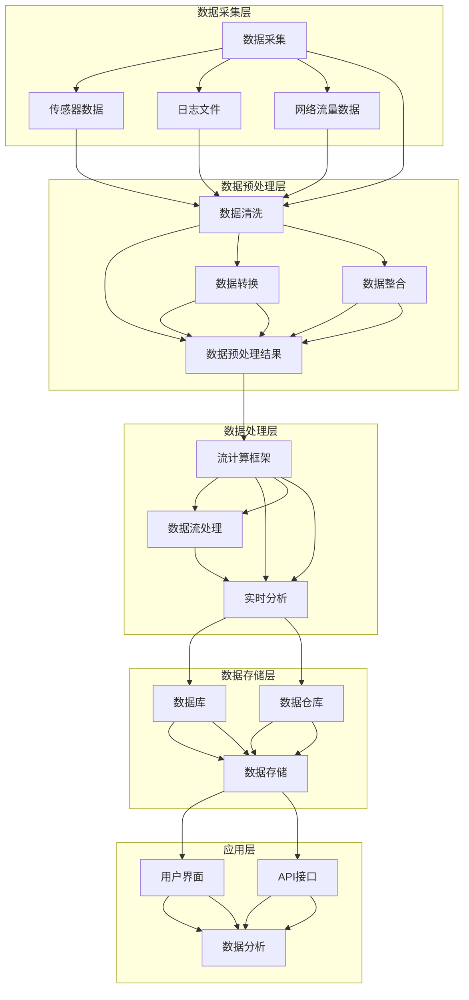

                 

## {文章标题}

> {关键词：(此处列出文章的5-7个核心关键词)}

> {摘要：(此处给出文章的核心内容和主题思想)}

---

## {文章标题}

在当今数字化时代，网络安全已成为企业和个人关注的重中之重。随着网络攻击手段的不断翻新，传统的安全防御策略已经无法满足日益复杂的网络安全需求。为此，机器学习在网络安全态势感知中的实时分析应运而生，成为提升网络安全防护能力的重要手段。本文将深入探讨机器学习在网络安全态势感知中的实时分析技术，旨在为广大IT从业者提供一份详细的技术指南。

### 关键词：
- 机器学习
- 网络安全
- 态势感知
- 实时分析
- 入侵检测
- 恶意代码检测
- 网络流量分析

### 摘要：

本文首先介绍了机器学习和网络安全态势感知的基本概念，随后详细阐述了实时分析技术在网络安全中的应用。通过对数据流处理框架、实时数据处理算法和机器学习算法的深入剖析，本文展示了如何构建一个高效的实时分析系统。最后，通过具体案例，本文展示了机器学习在网络安全态势感知中的实际应用，并对未来的发展趋势和挑战进行了展望。

---

## 第一部分：基础知识与概述

在这一部分中，我们将首先介绍机器学习和网络安全态势感知的基本概念，然后探讨机器学习在网络安全中的应用，最后简要介绍实时分析技术的基础。

### 第1章：机器学习与网络安全态势感知

#### 1.1 机器学习概述

##### 1.1.1 机器学习的基本概念

机器学习（Machine Learning）是人工智能（Artificial Intelligence，AI）的一个重要分支，主要研究如何让计算机从数据中自动学习和改进性能。机器学习的基本概念包括：

- **监督学习（Supervised Learning）**：通过已标记的训练数据集，学习得到一个模型，并将其应用于新的、未标记的数据。
- **无监督学习（Unsupervised Learning）**：没有已标记的数据，通过数据自身的特征，学习得到数据的结构和规律。
- **强化学习（Reinforcement Learning）**：通过与环境的交互，学习得到最佳行为策略。

##### 1.1.2 机器学习的分类

机器学习主要分为以下几类：

- **基于实例的学习（Instance-Based Learning）**：如 k-近邻算法（k-Nearest Neighbors，k-NN）。
- **基于决策树的学习（Decision Tree Learning）**：如决策树（Decision Tree）、随机森林（Random Forest）。
- **基于贝叶斯的方法（Bayesian Methods）**：如朴素贝叶斯（Naive Bayes）、贝叶斯网络（Bayesian Network）。
- **支持向量机（Support Vector Machine，SVM）**：如线性支持向量机（Linear SVM）、非线性支持向量机（Nonlinear SVM）。
- **深度学习（Deep Learning）**：如卷积神经网络（Convolutional Neural Networks，CNN）、循环神经网络（Recurrent Neural Networks，RNN）。

##### 1.1.3 机器学习的发展历程

机器学习的发展历程可以分为以下几个阶段：

- **早期阶段（1950s-1980s）**：以符号主义和知识表示方法为主，如逻辑符号和产生式规则。
- **统计学习阶段（1990s）**：以统计模型和方法为主，如线性回归、决策树和神经网络。
- **深度学习阶段（2010s至今）**：以深度神经网络为主，如卷积神经网络（CNN）和循环神经网络（RNN）。

#### 1.2 网络安全态势感知概述

##### 1.2.1 网络安全态势感知的定义

网络安全态势感知（Cybersecurity Situational Awareness，CSA）是指通过收集、处理和分析网络数据，实时了解网络的安全状态，发现潜在威胁并做出响应。网络安全态势感知的关键要素包括：

- **数据收集**：从网络设备、系统日志、网络流量等多种来源收集数据。
- **数据处理**：对收集到的数据进行清洗、转换和整合。
- **威胁分析**：通过对处理后的数据进行分析，发现潜在的网络威胁。
- **响应与防御**：根据威胁分析的结果，采取相应的防御措施，如隔离、报警和更新安全策略。

##### 1.2.2 网络安全态势感知的重要性

网络安全态势感知的重要性体现在以下几个方面：

- **提高防御能力**：通过实时了解网络的安全状态，及时发现并响应潜在威胁，提高网络的防御能力。
- **优化资源分配**：通过分析网络流量和资源使用情况，优化网络安全资源的分配，提高整体网络的性能和稳定性。
- **合规性**：许多国家和地区的法律法规要求企业必须实施网络安全态势感知，以确保网络的安全性和合规性。

#### 1.3 机器学习在网络安全中的应用

##### 1.3.1 机器学习在入侵检测中的应用

入侵检测（Intrusion Detection System，IDS）是网络安全态势感知的重要组成部分。机器学习在入侵检测中的应用主要包括：

- **异常检测**：通过监督学习模型，如 k-近邻（k-NN）和朴素贝叶斯（Naive Bayes），发现网络中的异常行为。
- **恶意代码检测**：通过无监督学习模型，如聚类（Clustering）和孤立森林（Isolation Forest），检测恶意代码和异常流量。

##### 1.3.2 机器学习在恶意软件识别中的应用

恶意软件识别（Malware Detection）是网络安全态势感知的另一个重要方面。机器学习在恶意软件识别中的应用主要包括：

- **特征提取**：通过提取恶意软件的静态特征，如文件结构、编码方式和指令序列，构建恶意软件的数字指纹。
- **分类算法**：通过监督学习模型，如支持向量机（SVM）和深度神经网络（Deep Neural Network，DNN），识别恶意软件。

##### 1.3.3 机器学习在网络安全防御中的应用

机器学习在网络安全防御中的应用主要包括：

- **行为分析**：通过分析网络流量和用户行为，发现潜在的攻击行为。
- **自适应防御**：根据攻击特征和防御效果，自动调整安全策略和防御措施。

---

## 第2章：实时分析技术基础

在这一部分，我们将探讨实时分析技术的基础知识，包括实时数据分析概述、数据流处理框架和实时数据处理算法。

### 2.1 实时数据分析概述

##### 2.1.1 实时数据分析的定义

实时数据分析（Real-Time Data Analysis）是指对实时产生的大量数据进行快速处理、分析和响应。实时数据分析的关键特点包括：

- **实时性**：数据能够在产生后立即进行分析，以便快速响应。
- **高吞吐量**：能够处理大量实时数据，满足大规模数据处理需求。
- **低延迟**：数据处理和响应的时间非常短，以满足实时应用的需求。

##### 2.1.2 实时数据分析的关键技术

实时数据分析的关键技术包括：

- **数据采集**：从各种数据源（如网络设备、传感器和日志）实时采集数据。
- **数据预处理**：对采集到的数据进行清洗、转换和整合，以便进行进一步分析。
- **数据处理**：利用流计算（Stream Computing）技术，对实时数据进行快速处理。
- **数据分析**：对处理后的数据进行分析，提取有用信息。
- **数据存储**：将分析结果存储到数据库或数据仓库中，以供后续查询和使用。

##### 2.1.3 实时数据分析的应用场景

实时数据分析广泛应用于以下领域：

- **金融交易**：实时监控交易行为，及时发现异常交易，防止欺诈行为。
- **交通运输**：实时监控交通流量，优化交通信号，减少拥堵。
- **医疗保健**：实时监控患者数据，提供精准的诊断和治疗建议。
- **网络安全**：实时分析网络流量，检测入侵行为，提高网络安全防护能力。

### 2.2 数据流处理框架

##### 2.2.1 Apache Flink

Apache Flink 是一个开源的分布式流处理框架，能够对实时数据流进行高效处理和分析。Flink 的核心特性包括：

- **流处理与批处理一体化**：Flink 能够同时处理流数据和批数据，支持实时数据处理和批量数据处理。
- **高性能**：Flink 采用内存计算和数据流式处理技术，具有高性能和高吞吐量的特点。
- **易扩展**：Flink 支持水平扩展，可以根据需求增加计算资源。

##### 2.2.2 Apache Kafka

Apache Kafka 是一个分布式流处理平台，主要用于数据流传输和存储。Kafka 的核心特性包括：

- **高吞吐量**：Kafka 能够处理大规模数据流，支持高吞吐量的数据传输。
- **高可靠性**：Kafka 采用分布式存储和复制技术，确保数据的高可靠性和持久性。
- **易扩展**：Kafka 支持水平扩展，可以根据需求增加存储和计算资源。

##### 2.2.3 Apache Storm

Apache Storm 是一个开源的分布式流处理框架，主要用于实时数据处理和分析。Storm 的核心特性包括：

- **实时性**：Storm 能够对实时数据流进行实时处理和分析，满足实时应用的需求。
- **高可靠性**：Storm 采用分布式计算和故障恢复技术，确保系统的稳定性和可靠性。
- **易扩展**：Storm 支持水平扩展，可以根据需求增加计算资源。

### 2.3 实时数据处理算法

##### 2.3.1 流计算算法

流计算算法是对实时数据流进行处理的算法，主要包括：

- **窗口算法（Window Algorithm）**：对实时数据流进行时间窗口划分，实现数据的分片处理。
- **滑动窗口算法（Sliding Window Algorithm）**：对实时数据流进行滑动窗口处理，实现数据的实时分析。
- **增量计算算法（Incremental Computation Algorithm）**：对实时数据进行增量计算，提高数据处理效率。

##### 2.3.2 聚类算法

聚类算法是对实时数据进行分组和分类的算法，主要包括：

- **基于密度的聚类算法（Density-Based Clustering Algorithm）**：如 DBSCAN（Density-Based Spatial Clustering of Applications with Noise）算法。
- **基于距离的聚类算法（Distance-Based Clustering Algorithm）**：如 K-均值（K-Means）算法。
- **基于模型的聚类算法（Model-Based Clustering Algorithm）**：如高斯混合模型（Gaussian Mixture Model，GMM）算法。

##### 2.3.3 预测算法

预测算法是对实时数据进行预测和趋势分析的算法，主要包括：

- **时间序列预测算法（Time Series Forecasting Algorithm）**：如 ARIMA（AutoRegressive Integrated Moving Average，自回归积分滑动平均）算法。
- **机器学习预测算法（Machine Learning Forecasting Algorithm）**：如回归模型（Regression Model）、决策树（Decision Tree）和神经网络（Neural Network）算法。
- **深度学习预测算法（Deep Learning Forecasting Algorithm）**：如卷积神经网络（CNN）、循环神经网络（RNN）和长短时记忆网络（LSTM）算法。

---

## 第3章：机器学习算法在实时分析中的应用

在这一部分，我们将探讨机器学习算法在实时分析中的应用，包括特征工程、模型选择与评估以及深度学习在实时分析中的应用。

### 3.1 特征工程

##### 3.1.1 特征提取方法

特征提取（Feature Extraction）是将原始数据转换为适用于机器学习模型的特征表示的过程。特征提取方法主要包括：

- **基于统计的方法（Statistical Methods）**：如主成分分析（Principal Component Analysis，PCA）、因子分析（Factor Analysis）和线性判别分析（Linear Discriminant Analysis，LDA）。
- **基于信息论的方法（Information Theory Methods）**：如互信息（Mutual Information）、条件互信息（Conditional Mutual Information）和特征重要性（Feature Importance）。
- **基于聚类的方法（Clustering Methods）**：如 K-均值（K-Means）聚类和层次聚类（Hierarchical Clustering）。

##### 3.1.2 特征选择方法

特征选择（Feature Selection）是选择最有用的特征，去除冗余和无关特征，以提高模型的性能和可解释性。特征选择方法主要包括：

- **基于过滤的方法（Filter Methods）**：如信息增益（Information Gain）、特征选择卡方检验（Chi-Square Test）和卡方独立性检验（Chi-Square Independence Test）。
- **基于 wrapper 的方法（Wrapper Methods）**：如递归特征消除（Recursive Feature Elimination，RFE）、贝叶斯网络（Bayesian Network）和遗传算法（Genetic Algorithm）。
- **基于嵌入的方法（Embedded Methods）**：如线性回归（Linear Regression）、逻辑回归（Logistic Regression）和随机森林（Random Forest）。

##### 3.1.3 特征优化方法

特征优化（Feature Optimization）是通过对特征进行变换和组合，提高模型的性能和可解释性。特征优化方法主要包括：

- **特征变换（Feature Transformation）**：如对数变换（Log Transformation）、平方根变换（Square Root Transformation）和归一化变换（Normalization Transformation）。
- **特征组合（Feature Combination）**：如主成分组合（Principal Component Combination）、因子组合（Factor Combination）和特征交互（Feature Interaction）。
- **特征加权（Feature Weighting）**：如权重调整（Weight Adjustment）、特征重要性调整（Feature Importance Adjustment）和模型权重调整（Model Weight Adjustment）。

### 3.2 模型选择与评估

##### 3.2.1 分类模型

分类模型（Classification Model）是将数据划分为不同类别或标签的模型。分类模型主要包括：

- **基于统计的方法（Statistical Methods）**：如逻辑回归（Logistic Regression）、支持向量机（Support Vector Machine，SVM）和决策树（Decision Tree）。
- **基于实例的方法（Instance-Based Methods）**：如 k-近邻（k-Nearest Neighbors，k-NN）和朴素贝叶斯（Naive Bayes）。
- **基于规则的方法（Rule-Based Methods）**：如规则树（Rule Tree）、决策表（Decision Table）和产生式规则（Production Rule）。

##### 3.2.2 回归模型

回归模型（Regression Model）是预测数据数值的模型。回归模型主要包括：

- **线性回归（Linear Regression）**：如简单线性回归（Simple Linear Regression）和多元线性回归（Multiple Linear Regression）。
- **非线性回归（Nonlinear Regression）**：如多项式回归（Polynomial Regression）和指数回归（Exponential Regression）。
- **广义线性模型（Generalized Linear Model，GLM）**：如逻辑回归（Logistic Regression）、泊松回归（Poisson Regression）和负二项回归（Negative Binomial Regression）。

##### 3.2.3 模型评估指标

模型评估指标（Model Evaluation Metrics）是用于评估模型性能的指标。常见的模型评估指标包括：

- **准确率（Accuracy）**：预测正确的样本数占总样本数的比例。
- **召回率（Recall）**：预测正确的正样本数占总正样本数的比例。
- **精确率（Precision）**：预测正确的正样本数占总预测正样本数的比例。
- **F1 值（F1 Score）**：精确率和召回率的调和平均值。
- **ROC 曲线（Receiver Operating Characteristic Curve）**：用于评估分类器的性能。
- **AUC 值（Area Under Curve，AUC）**：ROC 曲线下方区域的面积，用于评估分类器的性能。

### 3.3 深度学习在实时分析中的应用

##### 3.3.1 卷积神经网络（CNN）

卷积神经网络（Convolutional Neural Networks，CNN）是一种用于图像处理和计算机视觉的深度学习模型。CNN 的核心组成部分包括：

- **卷积层（Convolutional Layer）**：用于提取图像的特征。
- **池化层（Pooling Layer）**：用于减少数据维度，提高计算效率。
- **全连接层（Fully Connected Layer）**：用于分类和预测。
- **激活函数（Activation Function）**：用于引入非线性特性。

##### 3.3.2 循环神经网络（RNN）

循环神经网络（Recurrent Neural Networks，RNN）是一种用于序列数据处理的深度学习模型。RNN 的核心组成部分包括：

- **隐藏层（Hidden Layer）**：用于存储和传递信息。
- **输入门（Input Gate）**：用于控制输入信息的流入。
- **遗忘门（Forget Gate）**：用于控制信息的遗忘。
- **输出门（Output Gate）**：用于控制输出信息的生成。

##### 3.3.3 长短时记忆网络（LSTM）

长短时记忆网络（Long Short-Term Memory，LSTM）是一种改进的 RNN 模型，主要用于解决 RNN 的长期依赖问题。LSTM 的核心组成部分包括：

- **细胞状态（Cell State）**：用于存储和传递信息。
- **输入门（Input Gate）**：用于控制输入信息的流入。
- **遗忘门（Forget Gate）**：用于控制信息的遗忘。
- **输出门（Output Gate）**：用于控制输出信息的生成。

---

## 第4章：实时分析系统设计与实现

在这一部分，我们将讨论实时分析系统的设计与实现，包括系统架构设计、系统开发流程和系统性能优化。

### 4.1 系统架构设计

实时分析系统的架构设计是确保系统能够高效、稳定地处理和响应大量实时数据的关键。一个典型的实时分析系统架构通常包括以下几个核心组成部分：

- **数据采集层**：负责从各种数据源（如网络设备、传感器、日志文件等）收集数据。
- **数据预处理层**：对采集到的数据进行清洗、转换和整合，以确保数据的质量和一致性。
- **数据处理层**：利用流计算框架（如 Apache Flink、Apache Kafka、Apache Storm）对实时数据进行处理和分析。
- **数据存储层**：将处理后的数据存储到数据库或数据仓库中，以便后续查询和分析。
- **应用层**：提供用户界面和API接口，供用户进行数据查询和分析。

#### 4.1.1 实时分析系统的基本架构

实时分析系统的基本架构如图所示：



#### 4.1.2 数据采集与预处理

数据采集与预处理是实时分析系统的关键环节，直接影响到后续的数据处理和分析效果。数据采集通常涉及以下几个方面：

- **传感器数据**：通过各种传感器（如温度传感器、湿度传感器、运动传感器等）收集实时数据。
- **日志文件**：从操作系统、应用程序和网络设备等生成和收集日志文件。
- **网络流量数据**：通过网络流量监控设备（如防火墙、入侵检测系统等）捕获和分析网络流量。

在数据预处理阶段，需要进行以下操作：

- **数据清洗**：去除重复数据、空值数据和异常值。
- **数据转换**：将不同格式和单位的数据进行统一转换，以适应后续处理和分析。
- **数据整合**：将来自不同数据源的数据进行整合，形成一个统一的数据视图。

#### 4.1.3 数据存储与查询

数据存储与查询是实时分析系统的另一个关键环节，涉及到数据的持久化和高效查询。在实时分析系统中，通常采用以下技术：

- **数据库**：用于存储结构化数据，支持高效的查询和更新操作。
- **数据仓库**：用于存储大规模的、非结构化的数据，支持复杂的数据分析和报表生成。
- **分布式存储**：采用分布式存储系统（如 Hadoop HDFS、Cassandra、MongoDB 等），提高数据的存储容量和访问性能。

数据存储与查询的技术选择取决于具体的应用场景和数据规模，需要根据实际需求进行权衡和优化。

### 4.2 系统开发流程

实时分析系统的开发流程通常包括以下几个阶段：

#### 4.2.1 需求分析与设计

在系统开发之前，需要对系统的功能需求、性能要求和安全要求进行详细分析，并设计系统的架构和模块。需求分析与设计阶段主要包括：

- **需求调研**：与用户和利益相关者进行沟通，了解系统的实际需求和预期效果。
- **系统架构设计**：设计系统的整体架构，包括数据采集、预处理、处理、存储和应用等模块。
- **模块设计**：对系统中的各个模块进行详细设计，包括数据流、接口和算法等。

#### 4.2.2 系统开发与测试

在系统开发阶段，根据设计文档和需求规格说明书，编写和实现系统的各个模块。系统开发与测试阶段主要包括：

- **编码实现**：根据设计文档和需求规格说明书，编写和实现系统的各个模块。
- **单元测试**：对系统的各个模块进行单元测试，确保模块的功能和性能满足要求。
- **集成测试**：将各个模块集成在一起，进行整体测试，确保系统的功能和性能满足需求。
- **性能测试**：对系统的性能进行测试，包括响应时间、吞吐量和并发性等，优化系统性能。

#### 4.2.3 系统部署与维护

在系统开发完成后，需要对系统进行部署和上线，并进行持续的维护和优化。系统部署与维护阶段主要包括：

- **系统部署**：将系统部署到生产环境，包括硬件部署、软件安装和配置等。
- **系统监控**：对系统进行实时监控，包括性能监控、故障监控和安全监控等。
- **故障处理**：对系统出现的故障进行及时处理，包括故障诊断、故障恢复和故障预防等。
- **系统优化**：根据实际运行情况和用户反馈，对系统进行优化和改进，提高系统的性能和用户体验。

### 4.3 系统性能优化

实时分析系统的性能优化是确保系统能够高效、稳定地处理和响应大量实时数据的关键。系统性能优化主要包括以下几个方面：

- **数据处理性能优化**：通过优化数据流处理算法、提高数据存储性能和采用并行处理技术等，提高系统的数据处理性能。
- **系统并发性能优化**：通过优化系统架构、提高系统并发处理能力和采用负载均衡技术等，提高系统的并发性能。
- **系统可扩展性优化**：通过设计可扩展的系统架构、采用分布式存储和计算技术等，提高系统的可扩展性，以便适应不断增长的数据规模和处理需求。

---

## 第5章：机器学习在网络安全态势感知中的实时分析案例

在这一部分，我们将通过具体案例展示机器学习在网络安全态势感知中的实时分析应用，包括恶意代码检测、入侵检测和网络流量分析。

### 5.1 恶意代码检测

恶意代码检测（Malware Detection）是网络安全态势感知的重要任务之一。通过机器学习算法，可以实现对恶意代码的实时检测和分类。

#### 5.1.1 恶意代码检测的原理

恶意代码检测的基本原理是利用已知的恶意代码特征或行为模式，构建机器学习模型，对新出现的代码进行分类和识别。恶意代码检测的流程通常包括以下几个步骤：

1. **数据收集**：从各种渠道（如病毒库、恶意代码样本库等）收集恶意代码样本。
2. **特征提取**：对收集到的恶意代码样本进行特征提取，包括静态特征（如文件结构、编码方式、指令序列等）和动态特征（如执行行为、网络通信等）。
3. **模型训练**：使用已提取的特征，通过机器学习算法（如朴素贝叶斯、支持向量机、深度学习等）训练模型。
4. **模型评估**：对训练好的模型进行评估，调整模型参数，提高模型性能。
5. **实时检测**：将训练好的模型应用于实时数据，检测新的恶意代码样本。

#### 5.1.2 恶意代码检测的流程

恶意代码检测的流程如下：

1. **样本收集**：从病毒库、恶意代码样本库等渠道收集恶意代码样本。
2. **特征提取**：提取恶意代码的静态特征，如文件结构、编码方式、指令序列等。同时，提取动态特征，如执行行为、网络通信等。
3. **模型训练**：使用已提取的特征，通过机器学习算法（如朴素贝叶斯、支持向量机、深度学习等）训练模型。
4. **模型评估**：对训练好的模型进行评估，调整模型参数，提高模型性能。
5. **实时检测**：将训练好的模型应用于实时数据，检测新的恶意代码样本。
6. **结果反馈**：将检测结果反馈给用户，包括恶意代码的名称、类型、危害程度等。

#### 5.1.3 恶意代码检测的实战案例

以下是一个简单的恶意代码检测实战案例：

```python
# 导入所需的库
import numpy as np
import pandas as pd
from sklearn.model_selection import train_test_split
from sklearn.ensemble import RandomForestClassifier
from sklearn.metrics import accuracy_score, classification_report

# 加载数据
data = pd.read_csv('malware_samples.csv')

# 提取特征和标签
X = data.drop('label', axis=1)
y = data['label']

# 划分训练集和测试集
X_train, X_test, y_train, y_test = train_test_split(X, y, test_size=0.2, random_state=42)

# 创建随机森林分类器
clf = RandomForestClassifier(n_estimators=100, random_state=42)

# 训练模型
clf.fit(X_train, y_train)

# 进行预测
y_pred = clf.predict(X_test)

# 评估模型
print("Accuracy:", accuracy_score(y_test, y_pred))
print("\nClassification Report:\n", classification_report(y_test, y_pred))
```

在这个案例中，我们使用随机森林分类器对恶意代码样本进行分类。通过训练和测试数据集，我们可以评估模型的准确率和性能。

### 5.2 入侵检测

入侵检测（Intrusion Detection）是网络安全态势感知中的另一个重要任务，通过实时分析网络流量，识别潜在的入侵行为。

#### 5.2.1 入侵检测的原理

入侵检测的基本原理是利用已知的入侵特征或行为模式，构建机器学习模型，对网络流量进行实时分析和识别。入侵检测的流程通常包括以下几个步骤：

1. **数据收集**：从网络设备（如防火墙、入侵检测系统等）收集网络流量数据。
2. **特征提取**：对收集到的网络流量数据进行特征提取，包括静态特征（如协议类型、数据包长度等）和动态特征（如连接状态、流量模式等）。
3. **模型训练**：使用已提取的特征，通过机器学习算法（如朴素贝叶斯、支持向量机、深度学习等）训练模型。
4. **模型评估**：对训练好的模型进行评估，调整模型参数，提高模型性能。
5. **实时检测**：将训练好的模型应用于实时网络流量，检测潜在的入侵行为。
6. **结果反馈**：将检测结果反馈给用户，包括入侵的类型、来源和危害程度等。

#### 5.2.2 入侵检测的流程

入侵检测的流程如下：

1. **数据收集**：从网络设备（如防火墙、入侵检测系统等）收集网络流量数据。
2. **特征提取**：提取网络流量的静态特征，如协议类型、数据包长度等。同时，提取动态特征，如连接状态、流量模式等。
3. **模型训练**：使用已提取的特征，通过机器学习算法（如朴素贝叶斯、支持向量机、深度学习等）训练模型。
4. **模型评估**：对训练好的模型进行评估，调整模型参数，提高模型性能。
5. **实时检测**：将训练好的模型应用于实时网络流量，检测潜在的入侵行为。
6. **结果反馈**：将检测结果反馈给用户，包括入侵的类型、来源和危害程度等。

#### 5.2.3 入侵检测的实战案例

以下是一个简单的入侵检测实战案例：

```python
# 导入所需的库
import numpy as np
import pandas as pd
from sklearn.model_selection import train_test_split
from sklearn.ensemble import RandomForestClassifier
from sklearn.metrics import accuracy_score, classification_report

# 加载数据
data = pd.read_csv('network_traffic_samples.csv')

# 提取特征和标签
X = data.drop('label', axis=1)
y = data['label']

# 划分训练集和测试集
X_train, X_test, y_train, y_test = train_test_split(X, y, test_size=0.2, random_state=42)

# 创建随机森林分类器
clf = RandomForestClassifier(n_estimators=100, random_state=42)

# 训练模型
clf.fit(X_train, y_train)

# 进行预测
y_pred = clf.predict(X_test)

# 评估模型
print("Accuracy:", accuracy_score(y_test, y_pred))
print("\nClassification Report:\n", classification_report(y_test, y_pred))
```

在这个案例中，我们使用随机森林分类器对网络流量进行分类。通过训练和测试数据集，我们可以评估模型的准确率和性能。

### 5.3 网络流量分析

网络流量分析（Network Traffic Analysis）是网络安全态势感知中的另一个重要任务，通过对网络流量进行实时分析，识别异常流量和潜在的安全威胁。

#### 5.3.1 网络流量分析的概念

网络流量分析是指对网络流量进行实时监测、分析和管理的过程。网络流量分析的关键概念包括：

- **流量监控（Traffic Monitoring）**：实时监控网络流量，记录网络设备之间的数据交换情况。
- **流量分析（Traffic Analysis）**：对监控到的网络流量进行深度分析，识别流量模式、异常流量和潜在的安全威胁。
- **流量分类（Traffic Classification）**：根据流量特征（如协议类型、流量速率等）对网络流量进行分类和管理。
- **流量控制（Traffic Control）**：根据流量分析的结果，采取相应的控制措施，优化网络流量，提高网络性能。

#### 5.3.2 网络流量分析的方法

网络流量分析的方法包括：

- **基于统计的方法**：通过对网络流量进行统计分析，识别流量模式、异常流量和潜在的安全威胁。
- **基于机器学习的方法**：利用机器学习算法（如朴素贝叶斯、支持向量机、深度学习等）对网络流量进行实时分析，识别异常流量和潜在的安全威胁。
- **基于规则的方法**：通过定义一系列规则，对网络流量进行实时监测和识别，识别异常流量和潜在的安全威胁。

#### 5.3.3 网络流量分析的实战案例

以下是一个简单的网络流量分析实战案例：

```python
# 导入所需的库
import numpy as np
import pandas as pd
from sklearn.model_selection import train_test_split
from sklearn.ensemble import RandomForestClassifier
from sklearn.metrics import accuracy_score, classification_report

# 加载数据
data = pd.read_csv('network_traffic_samples.csv')

# 提取特征和标签
X = data.drop('label', axis=1)
y = data['label']

# 划分训练集和测试集
X_train, X_test, y_train, y_test = train_test_split(X, y, test_size=0.2, random_state=42)

# 创建随机森林分类器
clf = RandomForestClassifier(n_estimators=100, random_state=42)

# 训练模型
clf.fit(X_train, y_train)

# 进行预测
y_pred = clf.predict(X_test)

# 评估模型
print("Accuracy:", accuracy_score(y_test, y_pred))
print("\nClassification Report:\n", classification_report(y_test, y_pred))
```

在这个案例中，我们使用随机森林分类器对网络流量进行分类。通过训练和测试数据集，我们可以评估模型的准确率和性能。

---

## 第6章：实时分析系统安全与隐私保护

实时分析系统在网络安全态势感知中发挥着重要作用，然而，系统的安全性和隐私保护也是不容忽视的关键问题。本章节将探讨实时分析系统的安全威胁、安全设计与实现方法以及隐私保护策略。

### 6.1 实时分析系统的安全威胁

实时分析系统面临多种安全威胁，包括：

#### 6.1.1 网络攻击与防御

网络攻击（Network Attacks）是指攻击者利用网络漏洞或弱点，试图非法访问、窃取或篡改系统数据和资源。常见的网络攻击类型包括：

- **分布式拒绝服务攻击（DDoS）**：通过大量无效流量攻击目标系统，导致系统资源耗尽，无法正常服务。
- **漏洞攻击**：利用系统软件或硬件的漏洞，执行恶意代码或窃取敏感信息。
- **网络钓鱼**：通过伪造合法网站或邮件，诱骗用户输入敏感信息。

实时分析系统需要采取相应的防御措施，包括：

- **防火墙**：过滤非法流量，防止外部攻击。
- **入侵检测系统（IDS）**：实时监控网络流量，检测潜在入侵行为。
- **访问控制**：限制用户对系统和数据的访问权限，确保安全。

#### 6.1.2 数据泄露与隐私保护

数据泄露（Data Leakage）是指未经授权的第三方访问、窃取或篡改敏感数据。实时分析系统中的数据通常包括网络流量、用户行为等敏感信息，数据泄露可能导致严重后果，如隐私侵犯、经济损失和法律风险。

实时分析系统需要采取以下隐私保护措施：

- **数据加密**：对敏感数据进行加密，确保数据在传输和存储过程中不被窃取或篡改。
- **访问控制**：限制用户对敏感数据的访问权限，确保数据安全。
- **数据脱敏**：对敏感数据进行脱敏处理，降低数据泄露风险。

#### 6.1.3 系统漏洞与安全加固

系统漏洞（System Vulnerabilities）是指系统软件或硬件中的缺陷或弱点，攻击者可以利用这些漏洞进行非法操作。实时分析系统面临以下系统漏洞：

- **软件漏洞**：如代码漏洞、配置错误等。
- **硬件漏洞**：如物理访问、硬件篡改等。

实时分析系统需要采取以下安全加固措施：

- **软件更新**：定期更新系统和软件，修复已知漏洞。
- **硬件加固**：采用安全的硬件设备和加密存储，防止物理访问。
- **安全审计**：定期进行安全审计，检测和修复系统漏洞。

### 6.2 安全设计与实现

实时分析系统的安全设计是确保系统安全性和可靠性的关键。以下是一些常见的安全设计与实现方法：

#### 6.2.1 安全架构设计

安全架构设计是指在系统架构层面考虑安全性，确保系统的各个组成部分都能够抵御外部威胁。以下是一些安全架构设计原则：

- **最小权限原则**：每个组件和用户都只能访问其必需的权限，降低恶意行为的风险。
- **分层设计**：将系统分为多个层次，每个层次承担不同的安全职责，提高系统的安全性和可维护性。
- **安全隔离**：通过网络隔离、防火墙和访问控制等技术，实现不同组件之间的安全隔离。

#### 6.2.2 加密与签名技术

加密与签名技术是实时分析系统中保护数据安全的重要手段。以下是一些常见的加密与签名技术：

- **数据加密**：使用对称加密（如 AES）和非对称加密（如 RSA）对数据进行加密，确保数据在传输和存储过程中不被窃取或篡改。
- **数字签名**：使用哈希算法（如 SHA）和公钥加密（如 RSA）对数据进行数字签名，确保数据的完整性和真实性。
- **加密存储**：对存储在数据库或文件系统中的敏感数据进行加密，防止数据泄露。

#### 6.2.3 访问控制与权限管理

访问控制与权限管理是实时分析系统中确保数据安全的关键环节。以下是一些常见的访问控制与权限管理方法：

- **基于角色的访问控制（RBAC）**：根据用户的角色分配不同的权限，确保用户只能访问其授权的资源。
- **基于属性的访问控制（ABAC）**：根据用户属性（如职位、部门等）和资源属性（如数据类型、访问时间等）动态分配权限。
- **多因素认证（MFA）**：结合多种认证方式（如密码、手机验证、生物识别等），提高认证安全性。

### 6.3 隐私保护方法

实时分析系统的隐私保护是确保用户数据隐私和安全的重要措施。以下是一些常见的隐私保护方法：

#### 6.3.1 隐私保护政策

隐私保护政策是实时分析系统制定的一系列隐私保护措施和规范，旨在保护用户数据隐私。以下是一些隐私保护政策：

- **数据最小化原则**：收集和存储最小必要的数据，降低隐私泄露风险。
- **数据匿名化**：对敏感数据进行匿名化处理，防止用户身份识别。
- **用户同意与隐私告知**：在收集和使用用户数据前，获取用户的明确同意，并向用户告知数据收集和使用的目的、范围和方式。

#### 6.3.2 隐私保护技术

隐私保护技术是实时分析系统用于保护用户数据隐私的技术手段。以下是一些常见的隐私保护技术：

- **数据加密**：使用对称加密和非对称加密对敏感数据进行加密，确保数据在传输和存储过程中不被窃取或篡改。
- **差分隐私（Differential Privacy）**：通过添加随机噪声，保护数据集中个体的隐私，防止个体数据被推断。
- **隐私计算**：在数据分析和处理过程中，采用隐私计算技术，确保数据在本地进行计算，避免数据传输过程中的隐私泄露。

#### 6.3.3 隐私保护案例分析

以下是一个隐私保护案例：

- **场景**：某实时分析系统需要分析用户网络行为数据，以提供个性化服务。
- **解决方案**：采用差分隐私技术，对用户网络行为数据进行加噪声处理，保护用户隐私。在分析过程中，仅公开汇总统计结果，避免泄露个体用户数据。

通过以上措施，实时分析系统能够在确保安全性的同时，保护用户数据隐私。

---

## 第7章：未来发展趋势与挑战

随着人工智能和大数据技术的不断进步，机器学习在网络安全态势感知中的实时分析技术也展现出广阔的发展前景。然而，在面临技术进步的同时，实时分析系统也面临着诸多挑战。

### 7.1 机器学习在网络安全领域的未来趋势

#### 7.1.1 深度学习在实时分析中的应用

深度学习（Deep Learning）在网络安全领域具有广泛的应用前景。未来，深度学习在实时分析中的应用将得到进一步扩展，主要体现在以下几个方面：

- **自动化特征提取**：深度学习模型能够自动学习数据中的特征，减少人工干预，提高实时分析的效果和效率。
- **异常检测与预测**：利用深度学习模型，可以实现对网络流量的异常检测和预测，提前识别潜在的安全威胁。
- **自适应防御机制**：通过深度学习模型，实时分析系统可以自适应地调整防御策略，提高网络防御能力。

#### 7.1.2 自适应分析与预测

未来，实时分析系统将更加注重自适应分析与预测能力。自适应分析是指系统能够根据实时数据的特征和模式，自动调整分析策略和模型参数，提高分析精度和效率。自适应预测则是指系统能够根据历史数据和行为模式，预测未来的安全威胁和事件，提前采取相应的防御措施。

#### 7.1.3 机器学习与区块链的结合

区块链技术（Blockchain）在网络安全和隐私保护方面具有重要作用。未来，机器学习与区块链的结合将有望实现以下目标：

- **数据安全与隐私保护**：利用区块链的加密和分布式存储特性，保护实时分析系统中敏感数据的安全和隐私。
- **智能合约**：通过智能合约（Smart Contract），实现实时分析系统中的自动化决策和执行，提高系统的效率和可靠性。

### 7.2 实时分析系统面临的挑战

尽管机器学习在网络安全态势感知中具有巨大潜力，但实时分析系统仍面临诸多挑战。

#### 7.2.1 数据处理性能与效率

实时分析系统需要处理大量实时数据，对数据处理性能和效率提出了较高要求。未来，实时分析系统需要进一步提高数据处理能力，包括：

- **流计算优化**：优化流计算框架，提高数据处理速度和吞吐量。
- **分布式计算**：利用分布式计算技术，提高数据处理性能和并发能力。

#### 7.2.2 系统安全与隐私保护

实时分析系统涉及到大量敏感数据，系统安全与隐私保护是面临的重要挑战。未来，实时分析系统需要进一步加强：

- **数据加密**：采用先进的加密算法，确保数据在传输和存储过程中的安全。
- **隐私保护**：利用隐私保护技术，如差分隐私和联邦学习，保护用户数据隐私。

#### 7.2.3 数据法规与合规性

随着数据法规的不断完善，实时分析系统需要遵循相关法律法规，确保数据处理的合规性。未来，实时分析系统需要关注以下几个方面：

- **数据监管**：严格遵守数据监管法规，确保数据处理的合法性和合规性。
- **数据安全审计**：定期进行数据安全审计，确保数据保护措施的有效性。

### 7.3 应对策略与未来方向

为了应对实时分析系统面临的挑战，以下是一些应对策略和未来方向：

#### 7.3.1 技术创新与应用

实时分析系统需要不断引入新技术，提高数据处理性能和系统安全性。未来，技术创新将主要集中在以下几个方面：

- **新型算法**：研究和发展新型机器学习算法，提高实时分析的效果和效率。
- **智能传感器**：利用智能传感器，实时收集和处理海量数据，提高实时分析系统的感知能力。

#### 7.3.2 安全策略与法规遵循

实时分析系统需要制定和完善安全策略，确保系统安全和数据保护。同时，需要遵循相关法律法规，确保数据处理合规性。以下是一些安全策略：

- **安全培训**：定期进行安全培训，提高员工的安全意识和技能。
- **安全监控**：建立安全监控系统，实时监测系统运行状态，及时发现和处理安全事件。

#### 7.3.4 实时分析系统的可持续发展

实时分析系统在网络安全态势感知中发挥着重要作用，其可持续发展至关重要。未来，实时分析系统需要关注以下几个方面：

- **资源优化**：合理配置和优化系统资源，提高系统的性能和可靠性。
- **持续改进**：根据用户反馈和技术发展，持续改进实时分析系统，提高用户体验和系统性能。

通过技术创新、安全策略和可持续发展，实时分析系统将更好地满足网络安全态势感知的需求。

---

## 附录

在本附录中，我们将介绍一些在实时分析系统和机器学习应用中常用的工具与框架，以帮助读者更好地理解和应用相关技术。

### A.1 数据流处理框架

#### A.1.1 Apache Flink

Apache Flink 是一个开源的分布式流处理框架，能够对实时数据流进行高效处理和分析。Flink 的核心特性包括流处理与批处理一体化、高性能和易扩展。

- **官方网站**：[https://flink.apache.org/](https://flink.apache.org/)
- **官方文档**：[https://flink.apache.org/docs/](https://flink.apache.org/docs/)

#### A.1.2 Apache Kafka

Apache Kafka 是一个分布式流处理平台，主要用于数据流传输和存储。Kafka 具有高吞吐量、高可靠性和易扩展的特点。

- **官方网站**：[https://kafka.apache.org/](https://kafka.apache.org/)
- **官方文档**：[https://kafka.apache.org/docs/](https://kafka.apache.org/docs/)

#### A.1.3 Apache Storm

Apache Storm 是一个开源的分布式流处理框架，主要用于实时数据处理和分析。Storm 具有实时性、高可靠性和易扩展的特点。

- **官方网站**：[https://storm.apache.org/](https://storm.apache.org/)
- **官方文档**：[https://storm.apache.org/docs/](https://storm.apache.org/docs/)

### A.2 深度学习框架

#### A.2.1 TensorFlow

TensorFlow 是由 Google 开发的一款开源深度学习框架，广泛应用于机器学习和人工智能领域。

- **官方网站**：[https://www.tensorflow.org/](https://www.tensorflow.org/)
- **官方文档**：[https://www.tensorflow.org/tutorials](https://www.tensorflow.org/tutorials)

#### A.2.2 PyTorch

PyTorch 是由 Facebook AI 研究团队开发的一款开源深度学习框架，以其灵活性和易用性受到广泛欢迎。

- **官方网站**：[https://pytorch.org/](https://pytorch.org/)
- **官方文档**：[https://pytorch.org/tutorials/](https://pytorch.org/tutorials/)

#### A.2.3 Keras

Keras 是一个开源的深度学习库，能够在 TensorFlow 和 Theano 上运行，提供简洁的 API，方便快速构建和训练深度学习模型。

- **官方网站**：[https://keras.io/](https://keras.io/)
- **官方文档**：[https://keras.io/getting-started/](https://keras.io/getting-started/)

### A.3 入侵检测系统

#### A.3.1 Snort

Snort 是一个开源的入侵检测系统，广泛应用于网络入侵检测和网络安全监控。

- **官方网站**：[https://www.snort.org/](https://www.snort.org/)
- **官方文档**：[https://www.snort.org/snort3/documentation](https://www.snort.org/snort3/documentation)

#### A.3.2 Suricata

Suricata 是一个开源的入侵检测和入侵防御系统，能够在高速网络环境下实时检测和阻止恶意流量。

- **官方网站**：[https://suricata-ids.org/](https://suricata-ids.org/)
- **官方文档**：[https://suricata-ids.org/learn/](https://suricata-ids.org/learn/)

#### A.3.3 Bro

Bro 是一个开源的网络监控和分析工具，能够实时分析网络流量，检测潜在的安全威胁。

- **官方网站**：[https://bro.org/](https://bro.org/)
- **官方文档**：[https://bro.org/documentation/](https://bro.org/documentation/)

### A.4 恶意代码检测工具

#### A.4.1 YARA

YARA 是一个开源的恶意代码检测工具，能够快速准确地检测和分类恶意软件。

- **官方网站**：[https://yara规则与恶意软件识别/](https://yara规则与恶意软件识别/)
- **官方文档**：[https://github.com/VirusTotal/yara](https://github.com/VirusTotal/yara)

#### A.4.2 clamAV

clamAV 是一个开源的病毒扫描引擎，能够快速扫描和检测恶意软件。

- **官方网站**：[https://www.clamav.net/](https://www.clamav.net/)
- **官方文档**：[https://www.clamav.net/docs/0.102/user-manual.html](https://www.clamav.net/docs/0.102/user-manual.html)

#### A.4.3 Cuckoo Sandbox

Cuckoo Sandbox 是一个开源的恶意软件分析平台，能够自动分析恶意软件的行为和特征。

- **官方网站**：[https://cuckoosandbox.org/](https://cuckoosandbox.org/)
- **官方文档**：[https://cuckoo.readthedocs.io/en/latest/](https://cuckoo.readthedocs.io/en/latest/)

### A.5 实时分析系统平台

#### A.5.1 AWS Kinesis

AWS Kinesis 是 Amazon Web Services 提供的一款实时数据流平台，能够处理和分析大规模实时数据流。

- **官方网站**：[https://aws.amazon.com/kinesis/](https://aws.amazon.com/kinesis/)
- **官方文档**：[https://docs.aws.amazon.com/kinesis/latest/dg/](https://docs.aws.amazon.com/kinesis/latest/dg/)

#### A.5.2 Azure Stream Analytics

Azure Stream Analytics 是 Microsoft Azure 提供的一款实时数据分析服务，能够实时处理和分析大规模数据流。

- **官方网站**：[https://azure.com/stream-analytics](https://azure.com/stream-analytics)
- **官方文档**：[https://docs.microsoft.com/en-us/azure/stream-analytics/stream-analytics-overview](https://docs.microsoft.com/en-us/azure/stream-analytics/stream-analytics-overview)

#### A.5.3 Google Cloud Dataflow

Google Cloud Dataflow 是 Google Cloud 提供的一款流数据计算服务，能够实时处理和分析大规模数据流。

- **官方网站**：[https://cloud.google.com/dataflow/](https://cloud.google.com/dataflow/)
- **官方文档**：[https://cloud.google.com/dataflow/docs](https://cloud.google.com/dataflow/docs)

通过以上附录，读者可以了解实时分析系统和机器学习应用中常用的工具与框架，从而更好地掌握和应用相关技术。在网络安全领域，实时分析系统已经成为不可或缺的重要工具，通过不断的技术创新和应用，我们将能够更好地应对网络安全挑战，保护网络和数据的安全。

