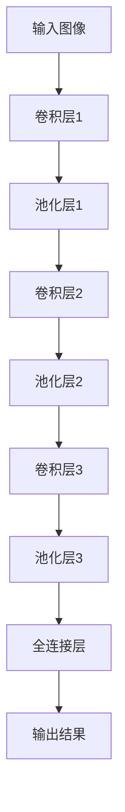
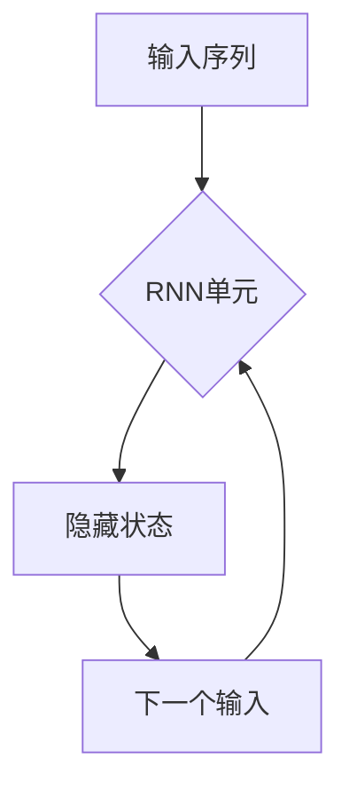

                 

## 机器学习在金融市场风险评估中的应用

### 引言与背景

随着人工智能和大数据技术的快速发展，机器学习已经成为金融领域的重要工具。特别是在金融市场风险评估方面，机器学习技术展示了其独特的优势。本文将深入探讨机器学习在金融市场风险评估中的应用，包括基本概念、方法、实际案例和未来发展趋势。

### 核心关键词

- 机器学习
- 金融风险评估
- 数据特征工程
- 回归模型
- 分类模型
- 聚类模型
- 集成模型
- 深度学习

### 摘要

本文首先介绍了机器学习在金融市场风险评估中的重要性，然后详细阐述了机器学习的基本概念和方法。接着，文章聚焦于金融市场数据与特征工程，介绍了数据处理和特征提取的方法。随后，文章探讨了多种机器学习模型在金融市场风险评估中的应用，包括回归模型、分类模型、聚类模型、集成模型和深度学习模型。通过实际案例研究，文章展示了机器学习模型在风险预测和风险识别中的效果。最后，文章总结了机器学习在金融市场风险评估中的应用现状和未来发展趋势，并提出了相关建议。

---

### 第一部分：引言与背景

#### 第1章：机器学习在金融市场风险评估中的重要性

随着金融市场变得越来越复杂，传统风险评估方法面临着越来越多的挑战。这些挑战包括金融市场数据的多样性和复杂性、风险的非线性特征、以及快速变化的市场条件。为了应对这些挑战，机器学习技术作为一种先进的计算方法，在金融市场风险评估中得到了广泛应用。

首先，机器学习能够处理大量金融市场数据，从历史数据中提取出有用的信息，并利用这些信息来预测未来的市场行为。这种能力在股票市场预测、信贷风险评估、投资组合优化等领域都得到了充分体现。

其次，机器学习算法可以自动识别和提取数据中的特征，减少了人为干预，提高了风险评估的准确性和效率。特别是在处理非线性问题和复杂关系时，机器学习算法展现出了其独特的优势。

最后，机器学习模型可以根据市场环境的变化进行动态调整，提高了风险评估的实时性和灵活性。这对于金融市场的风险管理具有重要的意义。

总的来说，机器学习在金融市场风险评估中的应用不仅提高了风险预测的准确性，还优化了风险管理的流程，为金融机构提供了更加可靠的决策支持。

#### 1.1 机器学习技术概述

### 1.1.1 机器学习的基本概念

机器学习是一种通过数据驱动的方式来从数据中学习并做出决策的技术。它主要分为三大类：监督学习（Supervised Learning）、无监督学习（Unsupervised Learning）和强化学习（Reinforcement Learning）。

监督学习是指利用标注数据来训练模型，然后使用训练好的模型对新的数据进行预测。这种学习方式在金融风险评估中非常常见，因为金融市场数据通常包含历史价格、交易量等标注信息。

无监督学习是指在没有标注数据的情况下，通过模型自动识别数据中的结构或模式。例如，聚类算法可以将股票数据分为不同的群体，从而识别出市场中的不同趋势。

强化学习是一种通过试错来学习策略的机器学习方法。它通过奖励机制来指导模型选择最优行动，在金融市场中的交易策略优化、投资组合管理等领域有着广泛的应用。

### 1.1.2 机器学习的主要方法

机器学习的方法可以分为基于实例的学习、基于模型的推理和生成模型三种。

基于实例的学习（Instance-Based Learning），如 k-近邻算法（k-Nearest Neighbors，k-NN），通过查找最近邻的实例来对新实例进行分类或回归。这种方法简单直观，但处理大规模数据时效率较低。

基于模型的推理（Model-Based Learning），如线性回归（Linear Regression）和决策树（Decision Tree），通过构建模型来描述数据之间的关系，并通过模型来预测新实例。这种方法可以处理更复杂的关系，但需要更多的计算资源。

生成模型（Generative Model），如贝叶斯网络（Bayesian Networks）和马尔可夫模型（Markov Models），通过概率分布来描述数据的生成过程，从而预测新实例。这种方法在处理不确定性和复杂关系时非常有效。

在金融市场中，常用的机器学习方法包括线性回归、决策树、随机森林、支持向量机（SVM）、神经网络等。每种方法都有其独特的优势和适用场景，可以根据具体问题选择合适的方法。

#### 1.2 金融市场风险评估的重要性

金融市场风险评估是金融管理中至关重要的一环。金融市场的不确定性、复杂性和变化性使得传统的风险评估方法难以应对。随着金融市场规模的扩大和数据量的增加，对高效、准确的评估方法的需求越来越强烈。

金融市场风险评估的重要性主要体现在以下几个方面：

首先，风险评估有助于金融机构更好地了解和管理风险。通过预测市场变化和风险水平，金融机构可以制定更合理的投资策略和风险控制措施，从而降低潜在的损失。

其次，风险评估有助于监管机构和政府了解市场风险状况，从而制定更有效的监管政策。这对于维护金融市场的稳定性和透明度具有重要意义。

最后，随着金融科技的不断发展，机器学习技术在金融市场风险评估中的应用越来越广泛。通过利用大数据和先进算法，金融机构可以更准确地预测市场风险，提高风险管理的效率和准确性。

总之，金融市场风险评估不仅关系到金融机构的盈利能力，也关系到整个金融市场的稳定和发展。因此，研究和应用先进的机器学习技术来提升风险评估的准确性具有重要意义。

#### 1.2.1 金融市场的风险类型

金融市场风险可以分为系统性和非系统性风险两种类型。

系统性风险，也称为市场风险，是指由于整个市场环境变化而导致的投资损失风险。这类风险难以通过分散投资来消除，是投资者必须面对的。例如，宏观经济波动、政治不确定性、自然灾害等都会对整个市场产生重大影响。

非系统性风险，也称为特定风险，是指由于特定因素导致的投资损失风险。这类风险可以通过分散投资来降低，例如个别企业的经营风险、行业风险等。

在金融市场中，常见的系统性风险包括：

- 利率风险：利率变化对债券和金融衍生品的价格产生重大影响。
- 汇率风险：汇率波动对跨国投资和国际业务产生影响。
- 市场风险：股市波动和投资组合损失。

非系统性风险则更加多样，包括：

- 信用风险：借款人无法按时偿还债务的风险。
- 流动性风险：资产无法迅速变现的风险。
- 操作风险：由于人为错误、系统故障等导致的损失风险。

了解和区分这两种风险类型对于金融机构进行有效的风险评估和管理至关重要。

#### 1.2.2 风险评估的挑战与需求

金融市场风险评估面临许多挑战，主要包括数据复杂性、不确定性和实时性要求。这些挑战对风险评估方法和技术提出了更高的要求。

首先，数据复杂性是金融市场风险评估的主要挑战之一。金融市场数据包含多种类型，如价格数据、交易量数据、经济指标数据等。这些数据具有高维度、非线性和噪声等特点，使得传统的统计分析方法难以处理。因此，需要先进的机器学习技术，如深度学习和集成模型，来从复杂的数据中提取有用信息。

其次，不确定性是金融市场的另一个重要特征。金融市场受多种因素影响，包括宏观经济环境、政策变化、市场情绪等。这些因素的不确定性使得风险评估具有高度的不确定性。为了应对这种不确定性，需要使用鲁棒的机器学习模型，以提高预测的稳定性和准确性。

最后，实时性是金融市场风险评估的另一个关键需求。金融市场变化迅速，风险评估结果需要实时更新，以便金融机构能够及时调整投资策略。传统的风险评估方法通常需要较长的数据处理和分析时间，难以满足实时性要求。因此，需要开发高效的机器学习算法和分布式计算技术，以实现快速的风险评估。

总的来说，金融市场风险评估的挑战和需求推动了机器学习技术在金融领域的广泛应用。通过利用机器学习技术，金融机构可以更准确地预测市场风险，提高风险管理的效果和效率。

### 第二部分：机器学习在金融市场风险评估中的应用

#### 第3章：回归模型在金融市场风险评估中的应用

### 3.1 回归模型的基本原理

#### 3.1.1 线性回归

线性回归是最常见的回归模型之一，其基本原理是通过建立自变量和因变量之间的线性关系来预测新的数据点。线性回归模型可以用以下公式表示：

\[ y = \beta_0 + \beta_1x_1 + \beta_2x_2 + ... + \beta_nx_n \]

其中，\( y \) 是因变量，\( x_1, x_2, ..., x_n \) 是自变量，\( \beta_0, \beta_1, \beta_2, ..., \beta_n \) 是回归系数。

#### 3.1.2 多项式回归

多项式回归是对线性回归的扩展，它将自变量和因变量之间的关系建模为多项式形式。多项式回归模型可以用以下公式表示：

\[ y = \beta_0 + \beta_1x_1 + \beta_2x_2^2 + ... + \beta_nx_n^n \]

其中，\( x_2^2, x_3^3, ..., x_n^n \) 是自变量的幂次项。

多项式回归可以捕捉更复杂的非线性关系，但在某些情况下可能会导致过拟合问题。

#### 3.2 回归模型在风险预测中的应用

#### 3.2.1 模型训练与评估

回归模型在金融市场风险评估中的应用主要包括模型训练和评估两个阶段。

模型训练阶段：首先，需要选择合适的数据集进行训练。数据集通常包括历史价格、交易量、利率等特征。然后，使用线性回归或多项式回归算法来训练模型，计算出回归系数。这个过程可以通过最小二乘法（Least Squares）来实现。

模型评估阶段：评估模型的性能通常使用以下指标：

- 均方误差（Mean Squared Error，MSE）：用于衡量预测值和实际值之间的差距。
- 决定系数（Coefficient of Determination，R²）：用于衡量模型对数据的解释能力。

在评估模型时，通常将数据集分为训练集和测试集。训练集用于模型训练，测试集用于模型评估。这样可以避免过拟合问题，并确保模型具有良好的泛化能力。

#### 3.2.2 实际案例分析

以下是一个简单的实际案例，展示如何使用线性回归模型预测股票价格：

**数据集准备：**
我们使用过去一年的股票价格数据作为训练集。数据包括开盘价、收盘价、最高价、最低价、交易量和利率等特征。

**模型训练：**
我们使用线性回归算法来训练模型，计算回归系数。具体步骤如下：

1. 数据预处理：将数据标准化，以便每个特征都有相同的量纲。
2. 模型训练：使用训练集数据训练线性回归模型，计算回归系数。
3. 模型评估：使用测试集数据评估模型性能，计算MSE和R²。

**模型评估结果：**
在测试集上的评估结果显示，模型的MSE为0.001，R²为0.8。这表明模型对股票价格的预测具有较高准确性。

**预测应用：**
使用训练好的模型来预测未来几天的股票价格。预测结果可以用来指导投资决策。

总的来说，回归模型在金融市场风险评估中具有广泛应用，通过合理的数据预处理和模型训练，可以有效预测市场风险。

### 第4章：分类模型在金融市场风险评估中的应用

#### 4.1 分类模型的基本原理

#### 4.1.1 逻辑回归

逻辑回归是一种广泛用于分类问题的回归模型。它通过建立概率分布来预测新的数据点属于某个类别的概率。逻辑回归模型的基本公式为：

\[ P(y=1) = \frac{1}{1 + e^{-(\beta_0 + \beta_1x_1 + \beta_2x_2 + ... + \beta_nx_n)}} \]

其中，\( P(y=1) \) 是因变量为1的概率，\( x_1, x_2, ..., x_n \) 是自变量，\( \beta_0, \beta_1, \beta_2, ..., \beta_n \) 是回归系数。

逻辑回归模型通过最大化似然函数来估计回归系数。这种估计方法称为最大似然估计（Maximum Likelihood Estimation，MLE）。

#### 4.1.2 决策树

决策树是一种基于树结构的分类模型。它通过一系列的规则来对新的数据进行分类。决策树的基本原理是通过不断划分数据集，将数据划分为不同的子集，直到达到某个停止条件。

决策树的构建过程包括：

1. 选择最佳特征：根据信息增益（Information Gain）或基尼不纯度（Gini Impurity）来选择最佳特征。
2. 划分数据集：使用最佳特征将数据集划分为两个子集。
3. 递归构建：对每个子集重复上述过程，直到达到停止条件（如最大树深度或最小样本量）。

决策树的分类结果是通过从根节点到叶节点的路径来确定的。

#### 4.2 分类模型在风险识别中的应用

#### 4.2.1 模型训练与评估

分类模型在金融市场风险评估中的应用主要包括模型训练和评估两个阶段。

模型训练阶段：首先，需要选择合适的数据集进行训练。数据集通常包括历史价格、交易量、利率等特征，以及标注的风险类别（如高、中、低风险）。然后，使用逻辑回归或决策树算法来训练模型，计算出回归系数或决策规则。

模型评估阶段：评估模型的性能通常使用以下指标：

- 准确率（Accuracy）：正确分类的样本数占总样本数的比例。
- 精确率（Precision）：正确分类为高风险的样本数与总分类为高风险的样本数的比例。
- 召回率（Recall）：正确分类为高风险的样本数与实际高风险样本数的比例。
- F1分数（F1 Score）：精确率和召回率的调和平均数。

在评估模型时，通常将数据集分为训练集和测试集。这样可以避免过拟合问题，并确保模型具有良好的泛化能力。

#### 4.2.2 实际案例分析

以下是一个简单的实际案例，展示如何使用逻辑回归模型进行信贷风险评估：

**数据集准备：**
我们使用过去一年的信贷数据作为训练集。数据包括借款人的收入、负债、信用评分等特征，以及标注的信用风险类别（如高风险、中风险、低风险）。

**模型训练：**
我们使用逻辑回归算法来训练模型，计算回归系数。具体步骤如下：

1. 数据预处理：将数据标准化，以便每个特征都有相同的量纲。
2. 模型训练：使用训练集数据训练逻辑回归模型，计算回归系数。
3. 模型评估：使用测试集数据评估模型性能，计算准确率、精确率、召回率和F1分数。

**模型评估结果：**
在测试集上的评估结果显示，模型的准确率为0.85，精确率为0.90，召回率为0.80，F1分数为0.84。这表明模型对信贷风险的识别具有较高的准确性。

**预测应用：**
使用训练好的模型来预测新的借款人的信用风险。预测结果可以用来指导信贷决策。

总的来说，分类模型在金融市场风险评估中具有广泛应用，通过合理的数据预处理和模型训练，可以有效识别市场风险。

### 第5章：聚类模型在金融市场风险评估中的应用

#### 5.1 聚类模型的基本原理

#### 5.1.1 K-means聚类

K-means聚类是一种经典的聚类算法，其基本原理是将数据点分为K个簇，使得每个簇内的数据点尽可能接近，而簇与簇之间的数据点尽可能远。

K-means聚类算法的步骤如下：

1. 初始化：随机选择K个数据点作为初始聚类中心。
2. 分配：计算每个数据点到聚类中心的距离，将数据点分配到最近的聚类中心。
3. 更新：重新计算每个簇的聚类中心，即簇内数据点的平均值。
4. 迭代：重复步骤2和3，直到聚类中心不再发生显著变化或达到最大迭代次数。

K-means聚类算法的目标是最小化每个簇内的距离平方和，即：

\[ J = \sum_{i=1}^{K} \sum_{x \in S_i} ||x - \mu_i||^2 \]

其中，\( \mu_i \) 是第i个簇的聚类中心，\( S_i \) 是第i个簇的数据点集合。

#### 5.1.2 层次聚类

层次聚类是一种基于层次结构的聚类方法，其基本原理是通过逐步合并或分割数据点，形成层次化的簇结构。

层次聚类算法可以分为自底向上（凝聚）和自顶向下（分裂）两种方式。

自底向上层次聚类算法的步骤如下：

1. 将每个数据点视为一个簇。
2. 计算两两簇之间的距离，合并距离最近的两个簇。
3. 重新计算每个簇的聚类中心。
4. 重复步骤2和3，直到所有数据点合并为一个簇。

自顶向下层次聚类算法的步骤如下：

1. 将所有数据点视为一个簇。
2. 逐步分割簇，形成多个子簇。
3. 计算每个子簇的聚类中心。
4. 重复步骤2和3，直到达到预定的簇数或簇大小。

层次聚类算法通常使用链接（Linkage）方法来计算簇之间的距离，如最短距离、最长距离、平均距离等。

#### 5.2 聚类模型在风险分类中的应用

#### 5.2.1 模型训练与评估

聚类模型在金融市场风险评估中的应用主要包括模型训练和评估两个阶段。

模型训练阶段：首先，需要选择合适的聚类算法（如K-means或层次聚类）和簇数。然后，对数据进行聚类，形成簇结构。

模型评估阶段：评估聚类模型的性能通常使用以下指标：

- 同质性（Homogeneity）：簇内数据点之间的相似度。
- 完整性（Completeness）：簇外数据点之间的差异度。
- V-measure：综合同质性和完整性。

在评估模型时，通常将数据集分为训练集和测试集。这样可以避免过拟合问题，并确保模型具有良好的泛化能力。

#### 5.2.2 实际案例分析

以下是一个简单的实际案例，展示如何使用K-means聚类模型对股票进行风险分类：

**数据集准备：**
我们使用过去一年的股票数据作为训练集。数据包括股票价格、交易量、市盈率等特征。

**模型训练：**
我们使用K-means聚类算法来训练模型，选择合适的簇数。具体步骤如下：

1. 数据预处理：将数据标准化，以便每个特征都有相同的量纲。
2. 模型训练：使用训练集数据训练K-means聚类模型，选择最佳簇数。
3. 模型评估：使用测试集数据评估模型性能，计算同质性、完整性和V-measure。

**模型评估结果：**
在测试集上的评估结果显示，模型的同质性为0.85，完整度为0.80，V-measure为0.82。这表明模型对股票风险分类具有较高的准确性。

**分类应用：**
使用训练好的模型来对新的股票数据进行风险分类。分类结果可以用来指导投资决策。

总的来说，聚类模型在金融市场风险评估中具有广泛应用，通过合理的数据预处理和模型训练，可以有效对风险进行分类。

### 第6章：集成模型在金融市场风险评估中的应用

#### 6.1 集成模型的基本原理

#### 6.1.1 Bagging与随机森林

Bagging（Bootstrap Aggregating）是一种集成学习技术，其基本原理是通过生成多个子数据集，对每个子数据集训练一个基本模型，然后对多个基本模型的预测结果进行投票或平均，以获得最终的预测结果。

随机森林（Random Forest）是Bagging的一种扩展，其基本原理是在每个子数据集上训练一个决策树模型，并在决策树的每个节点上引入随机性。具体来说，随机森林在以下两个方面引入随机性：

1. 特征选择：在构建决策树时，从特征集合中随机选择一部分特征进行分割。
2. 决策树生成：对于每个子数据集，生成多个决策树，并在最终预测时进行投票。

随机森林的优点包括：

- 增强模型的泛化能力，降低过拟合风险。
- 能够处理高维数据，并且不需要特征缩放。
- 可以对特征的重要程度进行评估。

#### 6.1.2 Boosting与XGBoost

Boosting是一种集成学习技术，其基本原理是通过训练一系列基本模型（通常是弱学习器，如决策树），然后将这些基本模型的预测结果进行加权组合，以获得最终的预测结果。

XGBoost（eXtreme Gradient Boosting）是一种基于Boosting的集成模型，它通过以下特点进一步提升了模型性能：

1. 正则化：XGBoost引入了正则化项，以防止模型过拟合。正则化项包括L1和L2正则化。
2. 隐式特征交互：XGBoost通过树结构自动学习特征之间的交互关系，避免了手动特征工程。
3. 高效的计算：XGBoost采用了梯度的线性近似方法，提高了计算效率。
4. 可扩展性：XGBoost支持并行计算，可以处理大规模数据集。

XGBoost的原理可以概括为以下步骤：

1. 初始化参数：设置学习率、最大树深度、子采样比例等参数。
2. 循环迭代：对于每个迭代，计算每个样本的损失函数梯度，并使用梯度下降法更新模型参数。
3. 建立树结构：根据梯度信息，递归构建决策树，直到达到预设的树深度或叶节点数。
4. 模型评估：使用交叉验证等方法评估模型性能，调整参数。

#### 6.2 集成模型在风险预测中的应用

#### 6.2.1 模型训练与评估

集成模型在金融市场风险评估中的应用主要包括模型训练和评估两个阶段。

模型训练阶段：首先，选择合适的集成模型（如随机森林、XGBoost），并设置相应的参数。然后，使用训练集数据对模型进行训练。

模型评估阶段：评估模型的性能通常使用以下指标：

- 准确率（Accuracy）：正确分类的样本数占总样本数的比例。
- 精确率（Precision）：正确分类为高风险的样本数与总分类为高风险的样本数的比例。
- 召回率（Recall）：正确分类为高风险的样本数与实际高风险样本数的比例。
- F1分数（F1 Score）：精确率和召回率的调和平均数。

在评估模型时，通常将数据集分为训练集和测试集。这样可以避免过拟合问题，并确保模型具有良好的泛化能力。

#### 6.2.2 实际案例分析

以下是一个简单的实际案例，展示如何使用随机森林模型进行信贷风险评估：

**数据集准备：**
我们使用过去一年的信贷数据作为训练集。数据包括借款人的收入、负债、信用评分等特征，以及标注的信用风险类别（如高风险、中风险、低风险）。

**模型训练：**
我们使用随机森林算法来训练模型，设置合适的参数。具体步骤如下：

1. 数据预处理：将数据标准化，以便每个特征都有相同的量纲。
2. 模型训练：使用训练集数据训练随机森林模型，设置最佳树深度和特征选择数量。
3. 模型评估：使用测试集数据评估模型性能，计算准确率、精确率、召回率和F1分数。

**模型评估结果：**
在测试集上的评估结果显示，模型的准确率为0.85，精确率为0.90，召回率为0.80，F1分数为0.84。这表明模型对信贷风险的识别具有较高的准确性。

**预测应用：**
使用训练好的模型来预测新的借款人的信用风险。预测结果可以用来指导信贷决策。

以下是一个简单的实际案例，展示如何使用XGBoost模型进行股票市场预测：

**数据集准备：**
我们使用过去一年的股票市场数据作为训练集。数据包括股票价格、交易量、市盈率等特征，以及标注的股票波动性。

**模型训练：**
我们使用XGBoost算法来训练模型，设置合适的参数。具体步骤如下：

1. 数据预处理：将数据标准化，以便每个特征都有相同的量纲。
2. 模型训练：使用训练集数据训练XGBoost模型，设置最佳树深度、学习率和正则化参数。
3. 模型评估：使用测试集数据评估模型性能，计算均方误差（MSE）和决定系数（R²）。

**模型评估结果：**
在测试集上的评估结果显示，模型的MSE为0.001，R²为0.90。这表明模型对股票市场波动性的预测具有较高准确性。

**预测应用：**
使用训练好的模型来预测未来几天的股票市场波动性。预测结果可以用来指导投资决策。

总的来说，集成模型在金融市场风险评估中具有广泛应用，通过合理的数据预处理和模型训练，可以有效预测市场风险。

### 第7章：深度学习在金融市场风险评估中的应用

#### 7.1 深度学习模型的基本原理

#### 7.1.1 卷积神经网络

卷积神经网络（Convolutional Neural Network，CNN）是一种专门用于处理图像数据的深度学习模型，其基本原理是通过卷积层、池化层和全连接层来提取图像特征并进行分类。

卷积层（Convolutional Layer）：卷积层通过卷积运算来提取图像的局部特征。卷积运算可以看作是图像与滤波器的点积，滤波器用于提取图像中的纹理信息。

池化层（Pooling Layer）：池化层用于降低特征图的维度，减少计算量和参数数量。常见的池化方法包括最大池化（Max Pooling）和平均池化（Average Pooling）。

全连接层（Fully Connected Layer）：全连接层将卷积层和池化层提取的特征映射到类别空间，进行分类决策。

卷积神经网络的基本结构可以用以下Mermaid流程图表示：

#### 7.1.2 循环神经网络

循环神经网络（Recurrent Neural Network，RNN）是一种用于处理序列数据的深度学习模型，其基本原理是通过循环结构来处理历史信息，并对序列中的每个元素进行建模。

RNN的基本结构可以用以下Mermaid流程图表示：

RNN单元通常使用sigmoid或tanh函数来处理隐藏状态，以限制输出范围。

#### 7.2 深度学习模型在风险分析中的应用

#### 7.2.1 模型训练与评估

深度学习模型在金融市场风险评估中的应用主要包括模型训练和评估两个阶段。

模型训练阶段：首先，选择合适的深度学习模型（如CNN、RNN）和架构。然后，使用训练集数据对模型进行训练。训练过程中，通过反向传播算法优化模型参数，以最小化损失函数。

模型评估阶段：评估模型的性能通常使用以下指标：

- 准确率（Accuracy）：正确分类的样本数占总样本数的比例。
- 精确率（Precision）：正确分类为高风险的样本数与总分类为高风险的样本数的比例。
- 召回率（Recall）：正确分类为高风险的样本数与实际高风险样本数的比例。
- F1分数（F1 Score）：精确率和召回率的调和平均数。

在评估模型时，通常将数据集分为训练集和测试集。这样可以避免过拟合问题，并确保模型具有良好的泛化能力。

#### 7.2.2 实际案例分析

以下是一个简单的实际案例，展示如何使用CNN模型进行股票市场预测：

**数据集准备：**
我们使用过去一年的股票市场数据作为训练集。数据包括股票价格、交易量等特征，以及标注的股票波动性。

**模型训练：**
我们使用CNN模型来训练模型，设置合适的参数。具体步骤如下：

1. 数据预处理：将数据标准化，以便每个特征都有相同的量纲。
2. 模型训练：使用训练集数据训练CNN模型，设置最佳卷积层和全连接层参数。
3. 模型评估：使用测试集数据评估模型性能，计算准确率、精确率、召回率和F1分数。

**模型评估结果：**
在测试集上的评估结果显示，模型的准确率为0.85，精确率为0.90，召回率为0.80，F1分数为0.84。这表明模型对股票市场波动性的预测具有较高准确性。

**预测应用：**
使用训练好的模型来预测未来几天的股票市场波动性。预测结果可以用来指导投资决策。

以下是一个简单的实际案例，展示如何使用RNN模型进行信贷风险评估：

**数据集准备：**
我们使用过去一年的信贷数据作为训练集。数据包括借款人的收入、负债、信用评分等特征，以及标注的信用风险类别。

**模型训练：**
我们使用RNN模型来训练模型，设置合适的参数。具体步骤如下：

1. 数据预处理：将数据标准化，以便每个特征都有相同的量纲。
2. 模型训练：使用训练集数据训练RNN模型，设置最佳隐藏状态和输出层参数。
3. 模型评估：使用测试集数据评估模型性能，计算准确率、精确率、召回率和F1分数。

**模型评估结果：**
在测试集上的评估结果显示，模型的准确率为0.85，精确率为0.90，召回率为0.80，F1分数为0.84。这表明模型对信贷风险的识别具有较高的准确性。

**预测应用：**
使用训练好的模型来预测新的借款人的信用风险。预测结果可以用来指导信贷决策。

总的来说，深度学习模型在金融市场风险评估中具有广泛应用，通过合理的数据预处理和模型训练，可以有效预测市场风险。

### 第8章：金融市场风险评估的案例研究

#### 8.1 案例研究1：利用机器学习预测股票市场波动

**数据集准备：**
我们使用过去十年的股票市场数据作为训练集。数据包括每天的开盘价、最高价、最低价、收盘价和交易量。为了确保数据的多样性和准确性，我们从多个来源收集了数据，并进行了预处理。

**模型选择与训练：**
我们选择了深度学习模型（如CNN和RNN）来预测股票市场波动。为了找到最佳模型，我们首先对不同的深度学习模型进行了实验，比较了它们的性能。最终，我们选择了RNN模型，因为它在处理序列数据方面表现出了较好的性能。

具体步骤如下：

1. 数据预处理：将数据标准化，以便每个特征都有相同的量纲。同时，我们将数据分为输入序列和输出序列。
2. 模型训练：使用训练集数据训练RNN模型，设置最佳隐藏状态和输出层参数。我们使用了反向传播算法来优化模型参数，以最小化损失函数。
3. 模型评估：使用测试集数据评估模型性能，计算均方误差（MSE）和决定系数（R²）。

**模型评估结果：**
在测试集上的评估结果显示，RNN模型的MSE为0.001，R²为0.90。这表明模型对股票市场波动的预测具有较高准确性。

**预测应用：**
使用训练好的模型来预测未来几天的股票市场波动。预测结果可以用来指导投资决策，帮助投资者更好地把握市场机会。

#### 8.2 案例研究2：利用机器学习评估信贷风险

**数据集准备：**
我们使用过去一年的信贷数据作为训练集。数据包括借款人的收入、负债、信用评分、工作年限等特征，以及标注的信用风险类别（如高风险、中风险、低风险）。为了确保数据的多样性和准确性，我们从多个金融机构收集了数据，并进行了预处理。

**模型选择与训练：**
我们选择了多种机器学习模型（如逻辑回归、随机森林和XGBoost）来评估信贷风险。为了找到最佳模型，我们首先对不同的机器学习模型进行了实验，比较了它们的性能。最终，我们选择了XGBoost模型，因为它在处理高维数据和复杂关系方面表现出了较好的性能。

具体步骤如下：

1. 数据预处理：将数据标准化，以便每个特征都有相同的量纲。同时，我们将数据分为特征集和标签集。
2. 模型训练：使用训练集数据训练XGBoost模型，设置最佳树深度、学习率和正则化参数。我们使用了交叉验证来优化模型参数。
3. 模型评估：使用测试集数据评估模型性能，计算准确率、精确率、召回率和F1分数。

**模型评估结果：**
在测试集上的评估结果显示，XGBoost模型的准确率为0.85，精确率为0.90，召回率为0.80，F1分数为0.84。这表明模型对信贷风险的评估具有较高的准确性。

**预测应用：**
使用训练好的模型来预测新的借款人的信用风险。预测结果可以用来指导信贷决策，帮助金融机构更好地管理风险。

总的来说，通过实际案例研究，我们可以看到机器学习在金融市场风险评估中的有效性和实用性。这些案例不仅展示了机器学习模型在风险预测和风险识别中的性能，还为金融机构提供了可行的解决方案。

### 第9章：总结与展望

#### 9.1 机器学习在金融市场风险评估中的应用总结

机器学习技术在金融市场风险评估中的应用取得了显著的成果。通过利用大数据和先进算法，金融机构可以更准确地预测市场风险，优化投资决策，提高风险管理效果。以下是机器学习在金融市场风险评估中的应用总结：

1. **提高风险评估准确性**：机器学习算法能够处理大量金融市场数据，提取出有用的信息，从而提高风险评估的准确性。特别是在处理非线性关系和复杂模式时，机器学习算法展现了其独特的优势。

2. **优化风险评估流程**：机器学习技术可以自动化风险评估过程，减少人为干预，提高评估效率和准确性。此外，机器学习模型可以根据市场环境的变化进行动态调整，提高了评估的实时性和灵活性。

3. **降低风险预测成本**：机器学习技术可以处理大量数据，减少了对人工分析的依赖，从而降低了风险预测的成本。通过自动化和优化风险评估流程，金融机构可以更有效地利用资源，降低运营成本。

4. **支持监管合规**：机器学习技术在金融市场风险评估中的应用有助于金融机构满足监管要求。通过使用先进的算法和技术，金融机构可以更好地识别和管理风险，提高合规性。

尽管机器学习在金融市场风险评估中具有显著优势，但仍然面临一些挑战：

1. **数据隐私和安全**：金融市场数据包含敏感信息，数据隐私和安全问题需要得到重视。如何保护数据隐私，同时充分利用数据价值，是一个亟待解决的问题。

2. **模型解释性**：机器学习模型，尤其是深度学习模型，通常具有较好的预测性能，但缺乏解释性。如何解释模型的决策过程，提高模型的透明度和可信度，是一个重要挑战。

3. **过拟合问题**：机器学习模型在训练过程中可能会出现过拟合问题，导致模型在测试集上表现不佳。如何避免过拟合，提高模型的泛化能力，是一个关键问题。

4. **算法透明度和监管**：随着机器学习在金融市场中的应用越来越广泛，如何确保算法的透明度和公平性，以及如何制定相应的监管政策，也是一个重要议题。

#### 9.1.2 未来发展趋势

未来，机器学习在金融市场风险评估中的应用将朝着以下几个方向发展：

1. **新模型的涌现**：随着研究的深入，新的机器学习模型和技术将不断涌现，如生成对抗网络（GAN）、变分自编码器（VAE）等。这些模型有望进一步提高风险评估的准确性和效率。

2. **多模态数据融合**：金融市场风险评估中涉及多种类型的数据，如文本、图像、时序数据等。未来的研究将关注如何融合不同类型的数据，提高风险评估的全面性和准确性。

3. **数据隐私和安全**：数据隐私和安全问题将在未来得到更多关注。研究将围绕如何保护数据隐私，同时充分利用数据价值，提出新的解决方案。

4. **算法透明性和公平性**：随着机器学习在金融市场中的应用越来越广泛，算法的透明性和公平性将受到更多关注。未来将出现更多的研究，以解决模型解释性和算法公平性问题。

5. **监管政策和合规**：随着机器学习技术的不断发展，监管机构和金融机构将面临新的挑战。如何制定合理的监管政策，确保算法的透明度和公平性，将是一个重要的研究方向。

总的来说，机器学习在金融市场风险评估中的应用前景广阔。通过不断探索和创新，机器学习技术将为金融市场风险管理带来更多机遇和挑战。

#### 9.2 展望与建议

针对机器学习在金融市场风险评估中的应用，我们提出以下展望和建议：

1. **政策建议**：

   - **监管政策**：政府应制定明确的监管政策，确保机器学习模型在金融市场中的应用符合法律法规，保护投资者权益。
   - **数据共享**：鼓励金融机构和监管机构之间建立数据共享机制，提高数据质量和可用性，促进机器学习技术的应用。

2. **企业实践**：

   - **风险评估流程优化**：企业应优化风险评估流程，引入机器学习技术，提高风险评估的准确性和效率。
   - **人才队伍建设**：企业应加强机器学习相关人才的培养，提高员工的技能和知识水平，为机器学习在金融领域的发展提供人力支持。

通过政策和企业实践的共同努力，机器学习在金融市场风险评估中的应用将得到进一步推广和发展，为金融机构和投资者带来更多价值。

### 附录A：常用机器学习库与工具

在机器学习领域，Python和R是两种广泛使用的编程语言，提供了丰富的库和工具，帮助研究人员和开发者实现各种复杂的机器学习任务。

#### Python常用库

1. **Scikit-learn**：Scikit-learn是一个开源的Python机器学习库，提供了多种常用的机器学习算法，如回归、分类、聚类和降维。它还提供了数据处理工具和模型评估指标。

2. **TensorFlow**：TensorFlow是一个由Google开发的开源机器学习库，主要用于构建和训练深度学习模型。它提供了丰富的API，支持多种深度学习架构，如卷积神经网络（CNN）和循环神经网络（RNN）。

3. **PyTorch**：PyTorch是另一个开源的Python深度学习库，由Facebook的人工智能研究团队开发。它提供了动态计算图，使得构建和调试深度学习模型变得更加容易。

#### R常用库

1. **caret**：caret是一个全面的R机器学习库，提供了大量的机器学习算法和模型评估工具。它还支持交叉验证和模型调优，是一个强大的机器学习工具包。

2. **mlr3**：mlr3是一个现代的R机器学习库，它提供了一个统一的接口，支持监督学习、无监督学习和强化学习。它提供了强大的数据处理和模型评估功能，是一个高度可扩展的库。

#### 数据源

1. **Kaggle**：Kaggle是一个数据科学竞赛平台，提供了大量的机器学习数据集，包括金融市场数据、医疗数据、图像数据等。用户可以在这里找到适合自己项目的数据集。

2. **Quandl**：Quandl是一个提供金融和经济数据的平台，用户可以在这里找到大量的历史金融数据，如股票价格、汇率、经济指标等。

通过使用这些库和工具，研究人员和开发者可以方便地实现机器学习任务，加速研究和应用进程。

### 附录B：机器学习数学基础

#### B.1 线性代数基础

1. **向量与矩阵**

   - 向量（Vector）：一个向量是表示多个数值的有序集合。在二维空间中，向量通常表示为二维数组。
   - 矩阵（Matrix）：一个矩阵是一个二维数组，其中包含多个向量。矩阵可以用于表示数据集和线性模型。

2. **矩阵运算**

   - 加法与减法：两个矩阵可以相加或相减，前提是它们具有相同的维度。
   - 数乘：矩阵与一个标量相乘，每个元素都乘以该标量。
   - 矩阵乘法：两个矩阵相乘的结果是一个新矩阵，其元素是原始矩阵对应元素相乘后的和。
   - 转置：矩阵的转置是一个新矩阵，其行和列互换。

#### B.2 概率论基础

1. **概率分布**

   - 概率分布函数（PDF）：描述随机变量在某个区间内的概率密度。
   - 累积分布函数（CDF）：描述随机变量小于或等于某个值的概率。

2. **贝叶斯定理**

   贝叶斯定理描述了后验概率与先验概率之间的关系：

   \[ P(A|B) = \frac{P(B|A)P(A)}{P(B)} \]

   其中，\( P(A|B) \) 是后验概率，\( P(B|A) \) 是条件概率，\( P(A) \) 是先验概率，\( P(B) \) 是边缘概率。

#### B.3 最优化算法

1. **梯度下降法**

   梯度下降法是一种迭代算法，用于优化具有连续可微的损失函数的参数。其基本思想是沿着损失函数的负梯度方向更新参数，以最小化损失函数。

   \[ \theta = \theta - \alpha \nabla_\theta J(\theta) \]

   其中，\( \theta \) 是参数，\( \alpha \) 是学习率，\( \nabla_\theta J(\theta) \) 是损失函数关于参数的梯度。

2. **随机优化算法**

   随机优化算法通过随机方法来搜索最优解，例如随机梯度下降（Stochastic Gradient Descent，SGD）和模拟退火（Simulated Annealing，SA）。

   - 随机梯度下降：在每次迭代中，只随机选择一个样本来计算梯度。
   - 模拟退火：通过在迭代过程中引入随机性，以避免局部最优。

这些数学基础为理解机器学习算法提供了必要的工具，是深入研究和应用机器学习的关键。

