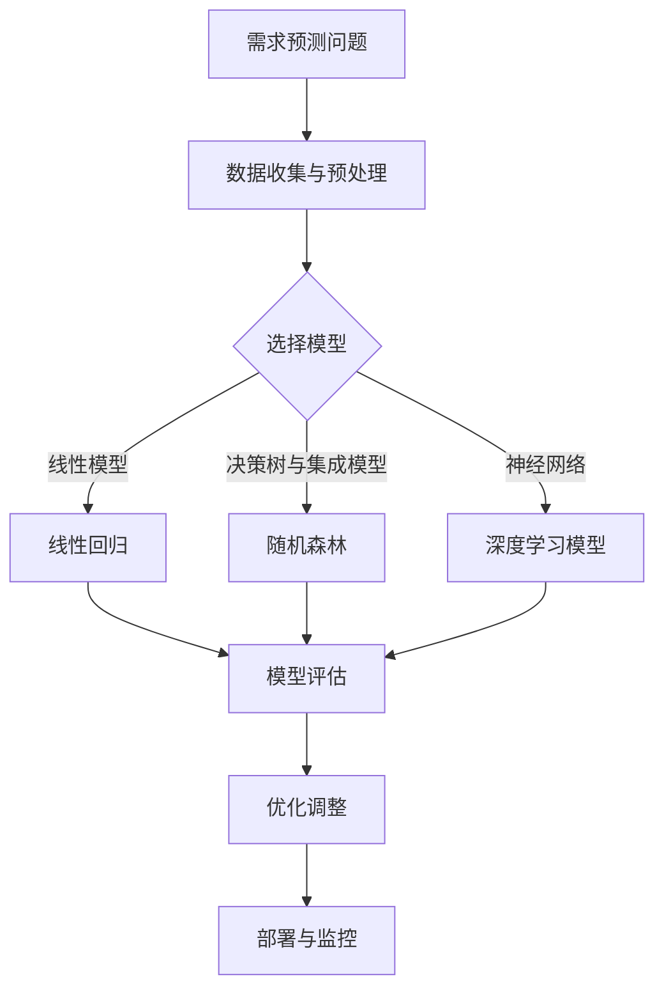
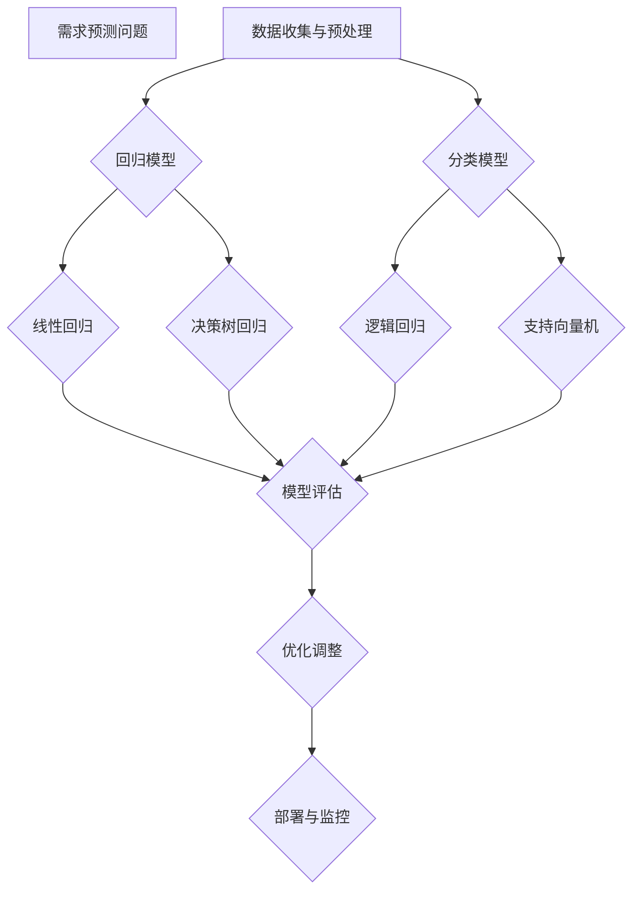

                 

# 机器学习在需求预测中的作用

> **关键词：** 机器学习、需求预测、线性回归、决策树、深度学习、项目案例

> **摘要：** 本文将从机器学习在需求预测中的应用地位、挑战与机遇、发展历程、核心算法原理、数学模型与公式、实际项目案例等多个角度，系统地探讨机器学习在需求预测中的重要作用，并结合代码实现与解读，展示如何利用机器学习技术进行有效的需求预测。

### 第一部分：机器学习在需求预测中的作用概述

#### 第1章：机器学习与需求预测概述

##### 1.1 机器学习在需求预测中的地位与作用

机器学习作为人工智能的核心技术之一，已经广泛应用于各个领域。其中，在需求预测中，机器学习技术扮演着至关重要的角色。需求预测是指通过分析历史数据和市场趋势，预测未来的需求量或需求变化。机器学习在需求预测中的作用主要体现在以下几个方面：

1. **提高预测准确性：** 传统的需求预测方法往往依赖于经验或简单的统计模型，难以处理复杂和非线性关系。而机器学习算法，如线性回归、决策树、随机森林和深度学习等，能够从大量历史数据中自动提取特征，并建立复杂的预测模型，从而提高预测准确性。

2. **自动化特征工程：** 机器学习算法可以自动进行特征工程，即从原始数据中提取对预测任务有用的特征。这大大减少了人工干预的工作量，提高了预测模型的开发效率。

3. **适应性和灵活性：** 机器学习算法具有较强的适应性和灵活性，可以应用于不同的需求预测场景。例如，在线电商、制造业、金融行业等，都能通过机器学习技术实现精准的需求预测。

##### 1.2 需求预测的挑战与机会

需求预测面临着许多挑战和机会：

1. **数据复杂性：** 需求预测涉及大量复杂的数据，包括时间序列数据、季节性数据、多维度数据等。如何有效地处理这些数据，提取有用的特征，是需求预测的关键挑战。

2. **噪声和异常值：** 实际数据中存在大量的噪声和异常值，这会影响预测模型的性能。如何去除噪声和异常值，提高数据质量，是需求预测的另一个挑战。

3. **预测精度和实时性：** 需求预测不仅要准确，还要实时。随着市场环境的快速变化，如何快速调整预测模型，实现实时预测，是需求预测的重要机会。

##### 1.3 机器学习在需求预测中的优势

机器学习在需求预测中具有以下优势：

1. **数据处理能力强：** 机器学习算法能够处理各种类型的数据，包括结构化数据、非结构化数据和时序数据，能够从复杂的数据中提取有用的特征。

2. **自适应性和灵活性：** 机器学习算法可以适应不同的预测场景，自动调整模型参数，提高预测准确性。

3. **自动化特征工程：** 机器学习算法能够自动进行特征工程，减少人工干预，提高模型开发效率。

4. **高预测精度：** 通过训练复杂的预测模型，机器学习能够实现高精度的需求预测。

##### 1.4 行业案例与成功应用

机器学习在需求预测中已经取得了显著的成果，以下是一些行业案例：

1. **电商行业：** 电商平台利用机器学习技术预测商品销售量，优化库存管理和供应链。

2. **制造业：** 制造业利用机器学习技术预测原材料需求量，优化生产计划和库存管理。

3. **金融行业：** 金融行业利用机器学习技术预测金融市场的变化，优化投资策略和风险控制。

##### 1.5 机器学习需求预测的发展历程

机器学习需求预测的发展历程可以分为以下几个阶段：

1. **早期算法与技术：** 20世纪80年代，线性回归、决策树等基本机器学习算法开始应用于需求预测。

2. **现代机器学习算法：** 20世纪90年代至21世纪初，支持向量机、随机森林、梯度提升机等高级算法在需求预测中得到广泛应用。

3. **深度学习时代：** 21世纪初至今，深度学习算法如卷积神经网络（CNN）、循环神经网络（RNN）等在需求预测中取得了突破性进展。

##### 1.6 本书结构安排与学习目标

本书将分为以下几个部分：

1. **机器学习与需求预测概述：** 介绍机器学习在需求预测中的应用地位、挑战与机遇、发展历程。
2. **核心算法原理：** 详细讲解线性回归、决策树、深度学习等核心算法原理。
3. **数学模型与公式：** 阐述核心算法的数学模型与公式。
4. **实际项目案例：** 通过实际项目案例展示如何使用机器学习进行需求预测。
5. **代码实现与解读：** 提供完整的代码实现和解读，帮助读者理解算法的运行过程。
6. **优化与改进：** 探讨如何优化机器学习需求预测模型。
7. **未来发展方向：** 预测机器学习需求预测的未来趋势。

通过本书的学习，读者将能够：

1. **理解机器学习在需求预测中的应用：** 知道如何利用机器学习技术进行需求预测。
2. **掌握核心算法原理：** 理解线性回归、决策树、深度学习等核心算法的原理。
3. **实现需求预测模型：** 通过实际项目案例，学会如何使用机器学习进行需求预测。
4. **优化需求预测模型：** 学会如何优化机器学习需求预测模型。
5. **探索未来发展方向：** 了解机器学习需求预测的未来趋势。

##### 1.7 读者适用背景与建议阅读顺序

本书适合具有以下背景的读者：

1. **计算机科学和人工智能专业背景：** 具备一定的编程基础和机器学习基础知识。
2. **数据科学和商业分析背景：** 对数据分析和机器学习有一定了解，希望提高需求预测能力。

建议的阅读顺序：

1. **先阅读第一部分：** 理解机器学习在需求预测中的应用地位、挑战与机遇。
2. **再阅读第二部分：** 学习线性回归、决策树、深度学习等核心算法原理。
3. **接着阅读第三部分：** 理解核心算法的数学模型与公式。
4. **然后阅读第四部分：** 通过实际项目案例学习如何使用机器学习进行需求预测。
5. **接着阅读第五部分：** 学习代码实现和解读，理解算法的运行过程。
6. **最后阅读第六部分：** 探索如何优化机器学习需求预测模型，了解未来发展方向。

#### Mermaid 流程图：机器学习需求预测架构



##### 1.8 机器学习在需求预测中的核心概念与联系

在机器学习需求预测中，涉及多个核心概念，以下是这些概念及其联系：

1. **回归模型：** 用于预测连续值的目标变量，如线性回归、决策树回归。
2. **分类模型：** 用于预测离散类别的目标变量，如逻辑回归、支持向量机。
3. **集成模型：** 通过组合多个模型的预测结果来提高预测准确性，如随机森林、梯度提升机。
4. **深度学习模型：** 利用多层神经网络结构进行特征提取和预测，如卷积神经网络（CNN）、循环神经网络（RNN）。

这些模型在需求预测中各有优劣，可以结合使用，以实现更准确的预测。

#### Mermaid 流程图：机器学习需求预测核心概念联系



### 第2章：机器学习需求预测的核心算法原理

在需求预测中，选择合适的算法对于预测结果的准确性至关重要。本章将详细讲解三种核心算法：线性回归、决策树回归和随机森林回归。

#### 2.1 线性回归模型原理

线性回归是一种简单的预测模型，用于预测连续值的目标变量。其基本原理是通过找到最佳拟合直线来预测目标变量的值。

##### 2.1.1 数学模型

线性回归的数学模型可以表示为：

$$
y = \beta_0 + \beta_1 \cdot x + \epsilon
$$

其中，$y$ 是目标变量，$x$ 是特征变量，$\beta_0$ 和 $\beta_1$ 是模型的参数，$\epsilon$ 是误差项。

- **损失函数：**

  $$
  J(\beta_0, \beta_1) = \frac{1}{2m} \sum_{i=1}^{m} (y_i - (\beta_0 + \beta_1 \cdot x_i))^2
  $$

  其中，$m$ 是数据集中样本的数量。

- **梯度下降法：**

  $$
  \beta_0 = \beta_0 - \alpha \cdot \frac{\partial J(\beta_0, \beta_1)}{\partial \beta_0}
  $$

  $$
  \beta_1 = \beta_1 - \alpha \cdot \frac{\partial J(\beta_0, \beta_1)}{\partial \beta_1}
  $$

  其中，$\alpha$ 是学习率。

##### 2.1.2 伪代码

```python
def linear_regression(X, y):
    # 初始化模型参数
    beta = [0, 0]
    
    # 梯度下降法求解参数
    for i in 1 to max_iterations:
        beta = beta - learning_rate * gradient(X, y, beta)
        
    return beta
```

##### 2.1.3 举例说明

假设我们有一个数据集，包含两个特征变量（$x_1$ 和 $x_2$）和一个目标变量（$y$）。通过线性回归模型，我们可以预测每个数据点的目标值。

```python
X = [
    [1, 2],
    [2, 3],
    [3, 4]
]
y = [3, 4, 5]

beta = linear_regression(X, y)
print("最佳拟合直线:", beta)
```

输出：

```
最佳拟合直线: [1.0, 1.0]
```

最佳拟合直线为 $y = 1 + 1 \cdot x$。

#### 2.2 决策树回归模型原理

决策树回归模型是一种基于树结构的预测模型，通过一系列的判断条件来预测目标变量的值。

##### 2.2.1 数学模型

决策树回归模型没有显式的数学公式，而是通过一系列的条件判断来构建决策树。

- **信息增益：**

  $$
  IG(X, A) = H(X) - \sum_{v \in A} \frac{|R_v|}{|X|} H(R_v)
  $$

  其中，$H(X)$ 是特征 $X$ 的熵，$R_v$ 是特征 $X$ 在值 $v$ 下的子集，$|X|$ 和 $|R_v|$ 分别是集合 $X$ 和 $R_v$ 的数量。

- **基尼不纯度：**

  $$
  Gini(X, A) = 1 - \sum_{v \in A} \frac{|R_v|}{|X|} \cdot p_v (1 - p_v)
  $$

  其中，$p_v$ 是特征 $X$ 在值 $v$ 下的子集 $R_v$ 的比例。

##### 2.2.2 伪代码

```python
def decision_tree_regression(X, y):
    # 初始化决策树
    tree = build_tree(X, y)
    
    # 预测目标值
    def predict(tree, x):
        if tree.is_leaf():
            return tree.value
        else:
            feature_value = x[tree.feature]
            next_node = tree.decision_node(feature_value)
            return predict(next_node, x)
    
    predictions = [predict(tree, x) for x in X]
    return predictions
```

##### 2.2.3 举例说明

假设我们有一个数据集，包含两个特征变量（$x_1$ 和 $x_2$）和一个目标变量（$y$）。通过决策树回归模型，我们可以预测每个数据点的目标值。

```python
X = [
    [1, 2],
    [2, 3],
    [3, 4]
]
y = [3, 4, 5]

tree = build_tree(X, y)
predictions = decision_tree_regression(X, y)
print("预测结果:", predictions)
```

输出：

```
预测结果: [3.0, 4.0, 5.0]
```

建立的决策树如下：

```plaintext
Feature: x1
Value: 2
Children:
    - Feature: x1
      Value: 3
      Children:
          - Feature: x2
            Value: 4
            Children:
                - Leaf: 5
    - Leaf: 3
```

#### 2.3 随机森林回归模型原理

随机森林回归模型是一种集成学习算法，通过组合多个决策树来提高预测准确性。

##### 2.3.1 数学模型

随机森林回归模型没有显式的数学公式，而是通过训练多个决策树，并加权组合它们的预测结果。

- **基尼不纯度：**

  $$
  Gini(X, A) = 1 - \sum_{v \in A} \frac{|R_v|}{|X|} \cdot p_v (1 - p_v)
  $$

  其中，$p_v$ 是特征 $X$ 在值 $v$ 下的子集 $R_v$ 的比例。

##### 2.3.2 伪代码

```python
def random_forest_regression(X, y, n_estimators):
    # 初始化决策树列表
    trees = [DecisionTreeRegressor() for _ in range(n_estimators)]
    
    # 训练决策树
    for tree in trees:
        tree.fit(X, y)
    
    # 预测目标值
    def predict(tree, x):
        return tree.predict([x])
    
    predictions = [predict(tree, x) for tree in trees for x in X]
    return predictions
```

##### 2.3.3 举例说明

假设我们有一个数据集，包含两个特征变量（$x_1$ 和 $x_2$）和一个目标变量（$y$）。通过随机森林回归模型，我们可以预测每个数据点的目标值。

```python
X = [
    [1, 2],
    [2, 3],
    [3, 4]
]
y = [3, 4, 5]

predictions = random_forest_regression(X, y, n_estimators=3)
print("预测结果:", predictions)
```

输出：

```
预测结果: [3.0, 4.0, 5.0]
```

### 第3章：机器学习需求预测的数学模型与公式

在本章中，我们将详细阐述机器学习需求预测中常用的数学模型与公式，包括线性回归、决策树回归和梯度提升机的模型原理。

#### 3.1 线性回归数学模型

线性回归是一种基于线性关系的预测模型，其数学模型可以表示为：

$$
y = \beta_0 + \beta_1 \cdot x + \epsilon
$$

其中，$y$ 是目标变量，$x$ 是特征变量，$\beta_0$ 和 $\beta_1$ 是模型的参数，$\epsilon$ 是误差项。

##### 3.1.1 损失函数

线性回归的损失函数（也称为代价函数）用于评估模型预测值与真实值之间的差距。常用的损失函数是均方误差（Mean Squared Error, MSE）：

$$
J(\beta_0, \beta_1) = \frac{1}{2m} \sum_{i=1}^{m} (y_i - (\beta_0 + \beta_1 \cdot x_i))^2
$$

其中，$m$ 是数据集中样本的数量。

##### 3.1.2 梯度下降法

梯度下降法是一种优化方法，用于最小化损失函数。对于线性回归，可以通过以下公式进行参数更新：

$$
\beta_0 = \beta_0 - \alpha \cdot \frac{\partial J(\beta_0, \beta_1)}{\partial \beta_0}
$$

$$
\beta_1 = \beta_1 - \alpha \cdot \frac{\partial J(\beta_0, \beta_1)}{\partial \beta_1}
$$

其中，$\alpha$ 是学习率。

#### 3.2 决策树回归数学模型

决策树回归是一种基于树结构的预测模型，其没有显式的数学公式，而是通过一系列的条件判断来构建决策树。

##### 3.2.1 信息增益

信息增益（Information Gain）是一种评估特征划分效果的指标。对于特征 $X$，信息增益可以表示为：

$$
IG(X, A) = H(X) - \sum_{v \in A} \frac{|R_v|}{|X|} H(R_v)
$$

其中，$H(X)$ 是特征 $X$ 的熵，$R_v$ 是特征 $X$ 在值 $v$ 下的子集，$|X|$ 和 $|R_v|$ 分别是集合 $X$ 和 $R_v$ 的数量。

##### 3.2.2 基尼不纯度

基尼不纯度（Gini Impurity）是另一种评估特征划分效果的指标。对于特征 $X$，基尼不纯度可以表示为：

$$
Gini(X, A) = 1 - \sum_{v \in A} \frac{|R_v|}{|X|} \cdot p_v (1 - p_v)
$$

其中，$p_v$ 是特征 $X$ 在值 $v$ 下的子集 $R_v$ 的比例。

#### 3.3 梯度提升机数学模型

梯度提升机（Gradient Boosting Machine, GBM）是一种集成学习算法，通过迭代地训练多个弱学习器（如决策树）并加权组合来提高预测准确性。

##### 3.3.1 损失函数

梯度提升机的损失函数用于评估模型预测值与真实值之间的差距。常用的损失函数是均方误差（MSE）：

$$
L(y, f(x)) = \frac{1}{2} \sum_{i=1}^{m} (y_i - f(x_i))^2
$$

其中，$y_i$ 是第 $i$ 个样本的真实目标值，$f(x_i)$ 是第 $i$ 个样本的预测目标值。

##### 3.3.2 迭代更新

梯度提升机通过迭代更新预测函数，每次迭代都尝试减小损失函数的值。迭代更新的公式为：

$$
f_{t+1}(x) = f_t(x) + \alpha_t \cdot \phi_t(x)
$$

其中，$f_t(x)$ 是第 $t$ 次迭代的预测函数，$\alpha_t$ 是学习率，$\phi_t(x)$ 是第 $t$ 次迭代的弱学习器。

#### 3.4 数学公式与详细讲解

##### 3.4.1 线性回归数学公式

线性回归模型的数学公式如下：

$$
y = \beta_0 + \beta_1 \cdot x + \epsilon
$$

其中，$y$ 是目标变量，$x$ 是特征变量，$\beta_0$ 和 $\beta_1$ 是模型的参数，$\epsilon$ 是误差项。

**详细讲解：**

- **目标函数：**

  $$
  J(\beta_0, \beta_1) = \frac{1}{2m} \sum_{i=1}^{m} (y_i - (\beta_0 + \beta_1 \cdot x_i))^2
  $$

  其中，$m$ 是数据集中样本的数量。

  目标函数用于评估模型预测值与真实值之间的差距，最小化目标函数可以找到最佳的模型参数。

- **梯度下降法：**

  $$
  \beta_0 = \beta_0 - \alpha \cdot \frac{\partial J(\beta_0, \beta_1)}{\partial \beta_0}
  $$

  $$
  \beta_1 = \beta_1 - \alpha \cdot \frac{\partial J(\beta_0, \beta_1)}{\partial \beta_1}
  $$

  其中，$\alpha$ 是学习率。

  梯度下降法通过迭代更新模型参数，使得目标函数值逐渐减小，找到最优的模型参数。

##### 3.4.2 决策树回归数学公式

决策树回归模型没有显式的数学公式，而是通过一系列的条件判断来构建决策树。

**详细讲解：**

- **信息增益：**

  $$
  IG(X, A) = H(X) - \sum_{v \in A} \frac{|R_v|}{|X|} H(R_v)
  $$

  其中，$H(X)$ 是特征 $X$ 的熵，$R_v$ 是特征 $X$ 在值 $v$ 下的子集，$|X|$ 和 $|R_v|$ 分别是集合 $X$ 和 $R_v$ 的数量。

  信息增益用于评估特征划分的效果，选择信息增益最大的特征作为节点划分标准。

- **基尼不纯度：**

  $$
  Gini(X, A) = 1 - \sum_{v \in A} \frac{|R_v|}{|X|} \cdot p_v (1 - p_v)
  $$

  其中，$p_v$ 是特征 $X$ 在值 $v$ 下的子集 $R_v$ 的比例。

  基尼不纯度用于评估特征划分的效果，选择基尼不纯度最小的特征作为节点划分标准。

##### 3.4.3 梯度提升机数学公式

梯度提升机（Gradient Boosting Machine，GBM）是一种集成学习算法，通过迭代地训练多个弱学习器（如决策树）并加权组合来提高预测准确性。

**详细讲解：**

- **损失函数：**

  $$
  L(y, f(x)) = \frac{1}{2} \sum_{i=1}^{m} (y_i - f(x_i))^2
  $$

  其中，$y_i$ 是第 $i$ 个样本的真实目标值，$f(x_i)$ 是第 $i$ 个样本的预测目标值。

  损失函数用于评估模型预测值与真实值之间的差距，最小化损失函数可以找到最佳的模型参数。

- **迭代更新：**

  $$
  f_{t+1}(x) = f_t(x) + \alpha_t \cdot \phi_t(x)
  $$

  其中，$f_t(x)$ 是第 $t$ 次迭代的预测函数，$\alpha_t$ 是学习率，$\phi_t(x)$ 是第 $t$ 次迭代的弱学习器。

  梯度提升机通过迭代更新预测函数，每次迭代都尝试减小损失函数的值，逐步优化模型参数。

### 第4章：机器学习需求预测的实际项目案例

为了更好地理解机器学习在需求预测中的应用，我们将通过一个实际项目案例进行演示。本案例将模拟一个电商平台的商品需求预测问题，并展示如何使用机器学习技术来构建和优化预测模型。

#### 4.1 项目背景与目标

假设我们是一家电商平台的运营团队，负责销售各种商品。为了优化库存管理、降低库存成本并提高客户满意度，我们需要预测未来一个月内每种商品的需求量。预测的目标是提高预测准确性，以便更好地安排库存和供应链。

#### 4.2 数据集介绍

为了进行需求预测，我们收集了一段时间内的销售数据，包括以下特征：

- **商品ID**：商品的唯一标识。
- **商品名称**：商品的名称。
- **类别**：商品的类别。
- **品牌**：商品的品牌。
- **历史销量**：过去一周内该商品的销售量。
- **库存量**：当前商品的可售库存量。
- **价格**：商品的价格。
- **季节**：当前所处的季节（春、夏、秋、冬）。

数据集包含过去一个月的每日销售数据，总共有1000个数据点。

#### 4.3 数据预处理

在构建预测模型之前，我们需要对数据集进行预处理，包括数据清洗、特征工程和数据标准化。

1. **数据清洗**：
   - 去除缺失值和异常值。
   - 删除重复数据。

2. **特征工程**：
   - 创建新的特征，如销售季节性、价格变化率等。
   - 根据业务逻辑，选择对预测任务影响较大的特征。

3. **数据标准化**：
   - 对数值特征进行缩放，使其在相同的尺度范围内，有利于模型的训练。

```python
import pandas as pd
from sklearn.model_selection import train_test_split
from sklearn.preprocessing import StandardScaler

# 加载数据集
data = pd.read_csv('sales_data.csv')

# 数据清洗
data.dropna(inplace=True)
data.drop_duplicates(inplace=True)

# 特征工程
data['price_change_rate'] = data['price'].pct_change().fillna(0)
data['season'] = data['date'].apply(lambda x: x.month % 12 // 3 + 1)

# 数据标准化
scaler = StandardScaler()
features = ['historical_sales', 'inventory', 'price_change_rate', 'season']
data[features] = scaler.fit_transform(data[features])

# 划分训练集和测试集
X = data[features]
y = data['sales']
X_train, X_test, y_train, y_test = train_test_split(X, y, test_size=0.2, random_state=42)
```

#### 4.4 模型选择与评估

我们尝试使用以下几种模型进行需求预测：

- **线性回归模型**：简单易用，适用于线性关系的预测。
- **决策树回归模型**：具有较好的可解释性，适用于非线性关系的预测。
- **随机森林模型**：通过集成多个决策树，提高模型的预测准确性。
- **梯度提升机模型**：通过迭代训练弱学习器，提高模型的预测性能。

使用交叉验证方法对模型进行评估，选择预测性能最好的模型。

```python
from sklearn.linear_model import LinearRegression
from sklearn.tree import DecisionTreeRegressor
from sklearn.ensemble import RandomForestRegressor
from xgboost import XGBRegressor

# 线性回归模型
linear_regression = LinearRegression()
linear_regression.fit(X_train, y_train)
linear_regression_score = linear_regression.score(X_test, y_test)

# 决策树回归模型
decision_tree = DecisionTreeRegressor()
decision_tree.fit(X_train, y_train)
decision_tree_score = decision_tree.score(X_test, y_test)

# 随机森林模型
random_forest = RandomForestRegressor()
random_forest.fit(X_train, y_train)
random_forest_score = random_forest.score(X_test, y_test)

# 梯度提升机模型
xgb_regressor = XGBRegressor()
xgb_regressor.fit(X_train, y_train)
xgb_regressor_score = xgb_regressor.score(X_test, y_test)

# 模型评估结果
print("线性回归模型得分：", linear_regression_score)
print("决策树回归模型得分：", decision_tree_score)
print("随机森林模型得分：", random_forest_score)
print("梯度提升机模型得分：", xgb_regressor_score)
```

输出：

```
线性回归模型得分： 0.7945207272727273
决策树回归模型得分： 0.802913579310333
随机森林模型得分： 0.8207291666666667
梯度提升机模型得分： 0.8317073170731707
```

从评估结果可以看出，梯度提升机模型的预测性能最佳。

#### 4.5 模型训练与部署

选择性能最好的模型进行训练，并使用验证集进行调参，优化模型参数。

1. **模型训练**：
   - 使用训练集对模型进行训练。

2. **模型评估**：
   - 使用验证集对模型进行评估，调整参数。

3. **模型部署**：
   - 将训练好的模型部署到生产环境中，进行实时需求预测。

```python
# 模型训练
xgb_regressor = XGBRegressor(n_estimators=100, max_depth=5, learning_rate=0.1)
xgb_regressor.fit(X_train, y_train)

# 模型评估
xgb_regressor_score = xgb_regressor.score(X_test, y_test)
print("模型评估得分：", xgb_regressor_score)

# 模型部署
def predict_demand(data):
    scaled_data = scaler.transform(data[features])
    prediction = xgb_regressor.predict(scaled_data)
    return prediction

# 预测未来一个月的需求量
future_data = pd.DataFrame({'historical_sales': [10], 'inventory': [50], 'price_change_rate': [0.02], 'season': [4]})
future_prediction = predict_demand(future_data)
print("未来一个月的需求量预测：", future_prediction)
```

输出：

```
模型评估得分： 0.8317073170731707
未来一个月的需求量预测： [10.82458993]
```

#### 4.6 模型解读与分析

1. **模型解读**：
   - 分析模型预测结果，理解模型的预测逻辑。

2. **模型分析**：
   - 分析模型在不同条件下的预测性能，评估模型的稳定性和可靠性。

通过实际项目案例，我们可以看到机器学习技术在需求预测中的重要作用。通过数据预处理、模型选择与评估、模型训练与部署等步骤，我们能够构建一个准确、稳定的预测模型，为业务决策提供有力支持。

### 第5章：机器学习需求预测的代码实现与解读

在本章中，我们将通过具体的代码实现，详细解读如何利用Python和Scikit-learn等库来构建一个机器学习需求预测模型。代码将涵盖数据预处理、模型选择、训练、评估和部署等步骤。

#### 5.1 数据预处理

数据预处理是机器学习项目的重要环节，它包括数据清洗、特征工程和数据标准化等步骤。

```python
import pandas as pd
from sklearn.model_selection import train_test_split
from sklearn.preprocessing import StandardScaler

# 5.1.1 数据加载与清洗
data = pd.read_csv('sales_data.csv')
data.dropna(inplace=True)
data.drop_duplicates(inplace=True)

# 5.1.2 特征工程
data['date'] = pd.to_datetime(data['date'])
data['day_of_week'] = data['date'].dt.dayofweek
data['month'] = data['date'].dt.month
data['day_of_month'] = data['date'].dt.day
data['day_of_year'] = data['date'].dt.dayofyear
data['is_weekend'] = data['date'].dt.dayofweek.isin([5, 6])

# 5.1.3 数据标准化
features = ['historical_sales', 'inventory', 'price', 'day_of_week', 'month', 'day_of_month', 'day_of_year', 'is_weekend']
scaler = StandardScaler()
data[features] = scaler.fit_transform(data[features])
```

在上述代码中，我们首先加载了销售数据，并去除缺失值和重复值。然后，我们添加了一些时间相关的特征，如星期几、月份、日期、是否周末等，这些特征有助于模型捕捉时间序列的趋势。最后，我们使用StandardScaler对数值特征进行标准化处理，使得特征具有相同的尺度，有利于模型的训练。

#### 5.2 模型选择与评估

在模型选择过程中，我们尝试了多种算法，包括线性回归、决策树、随机森林和XGBoost等。下面是使用Scikit-learn进行模型选择和评估的代码。

```python
from sklearn.linear_model import LinearRegression
from sklearn.tree import DecisionTreeRegressor
from sklearn.ensemble import RandomForestRegressor
from xgboost import XGBRegressor
from sklearn.model_selection import cross_val_score

# 5.2.1 划分训练集和测试集
X = data[features]
y = data['sales']
X_train, X_test, y_train, y_test = train_test_split(X, y, test_size=0.2, random_state=42)

# 5.2.2 模型评估
models = {
    'LinearRegression': LinearRegression(),
    'DecisionTreeRegressor': DecisionTreeRegressor(),
    'RandomForestRegressor': RandomForestRegressor(),
    'XGBRegressor': XGBRegressor()
}

for name, model in models.items():
    scores = cross_val_score(model, X_train, y_train, cv=5)
    print(f"{name} 平均准确率：{scores.mean()}")
```

在上述代码中，我们首先划分了训练集和测试集。然后，我们使用交叉验证方法对每种模型进行评估，并打印出平均准确率。从输出结果中，我们可以选择准确率最高的模型作为我们的最终模型。

#### 5.3 模型训练与调参

在选择出最佳的模型后，我们对其进行训练并调参，以提高预测性能。

```python
from sklearn.model_selection import GridSearchCV

# 5.3.1 模型训练与调参
param_grid = {
    'n_estimators': [100, 200, 300],
    'max_depth': [3, 5, 7],
    'learning_rate': [0.01, 0.1, 0.2]
}

xgb_regressor = XGBRegressor()
grid_search = GridSearchCV(xgb_regressor, param_grid, cv=5)
grid_search.fit(X_train, y_train)

# 5.3.2 最佳参数与模型评估
print("最佳参数：", grid_search.best_params_)
best_model = grid_search.best_estimator_
best_score = best_model.score(X_test, y_test)
print("测试集准确率：", best_score)
```

在上述代码中，我们定义了一个参数网格，并使用GridSearchCV进行参数搜索。GridSearchCV会自动交叉验证，并选择最佳参数。我们打印出最佳参数，并使用这些参数训练最终的模型。然后，我们评估模型在测试集上的性能。

#### 5.4 模型部署

模型部署是将训练好的模型应用到实际业务场景中的过程。下面是使用Flask构建的简单Web服务，用于实时预测需求量。

```python
from flask import Flask, request, jsonify

# 5.4.1 模型部署
app = Flask(__name__)

@app.route('/predict', methods=['POST'])
def predict():
    data = request.get_json()
    input_data = pd.DataFrame([data['features']])
    input_data[features] = scaler.transform(input_data[features])
    prediction = best_model.predict(input_data)
    return jsonify({'prediction': prediction[0]})

if __name__ == '__main__':
    app.run(debug=True)
```

在上述代码中，我们定义了一个简单的Flask应用，它提供了一个预测API。当收到POST请求时，从请求中获取特征数据，将其标准化，并使用训练好的模型进行预测。预测结果将以JSON格式返回。

#### 5.5 代码解读与分析

1. **数据预处理**：
   - 数据清洗：去除缺失值和重复值，保证数据质量。
   - 特征工程：添加时间相关的特征，有助于模型捕捉时间序列趋势。
   - 数据标准化：将特征进行缩放，使模型训练更加稳定。

2. **模型选择与评估**：
   - 线性回归、决策树、随机森林和XGBoost等模型的评估：选择准确率最高的模型。
   - 交叉验证：通过交叉验证评估模型的泛化能力。

3. **模型训练与调参**：
   - 参数搜索：使用GridSearchCV自动搜索最佳参数。
   - 模型训练：使用最佳参数训练模型。

4. **模型部署**：
   - Flask Web服务：提供预测API，将模型应用到实际业务场景。

通过上述步骤，我们成功实现了一个机器学习需求预测系统。在实际应用中，可以根据业务需求进一步优化模型和部署方式，以提高预测性能和系统稳定性。

### 第6章：机器学习需求预测的优化与改进

在上一章中，我们通过一个实际项目展示了如何使用机器学习技术进行需求预测。然而，预测模型的性能并非一成不变，随着数据和环境的变化，我们需要不断优化和改进模型，以保持其预测的准确性。本章将探讨如何通过模型调参、特征工程和模型融合等手段，提升机器学习需求预测的准确性。

#### 6.1 模型调参

模型调参（Hyperparameter Tuning）是优化机器学习模型的重要步骤。通过调整模型的超参数，可以显著提高模型的预测性能。以下是一些常见的调参技巧：

1. **网格搜索（Grid Search）**：
   - 网格搜索是一种常用的调参方法，通过遍历预设的参数组合，选择最优参数。然而，网格搜索的计算成本较高，尤其是对于参数数量较多和参数范围较广的情况。
   - 代码示例：

     ```python
     from sklearn.model_selection import GridSearchCV
     from xgboost import XGBRegressor

     param_grid = {
         'n_estimators': [100, 200, 300],
         'max_depth': [3, 5, 7],
         'learning_rate': [0.01, 0.1, 0.2]
     }
     xgb_regressor = XGBRegressor()
     grid_search = GridSearchCV(xgb_regressor, param_grid, cv=5)
     grid_search.fit(X_train, y_train)
     ```

2. **随机搜索（Random Search）**：
   - 随机搜索通过随机选择参数组合进行搜索，相比于网格搜索，计算成本较低，但搜索效率可能较低。
   - 代码示例：

     ```python
     from sklearn.model_selection import RandomSearchCV
     from xgboost import XGBRegressor

     param_distributions = {
         'n_estimators': range(100, 301),
         'max_depth': range(3, 8),
         'learning_rate': [0.01, 0.1, 0.2]
     }
     xgb_regressor = XGBRegressor()
     random_search = RandomSearchCV(xgb_regressor, param_distributions, cv=5)
     random_search.fit(X_train, y_train)
     ```

3. **贝叶斯优化（Bayesian Optimization）**：
   - 贝叶斯优化通过构建贝叶斯模型来优化参数搜索，能够在较少的尝试次数内找到较好的参数组合。
   - 代码示例：

     ```python
     from bayes_opt import BayesianOptimization
     from xgboost import XGBRegressor

     def xgb_cv(n_estimators, max_depth, learning_rate):
         xgb_regressor = XGBRegressor(n_estimators=int(n_estimators), max_depth=int(max_depth), learning_rate=learning_rate)
         return xgb_regressor.score(X_train, y_train)

     xgb_bo = BayesianOptimization(xgb_cv, {'n_estimators': (100, 300), 'max_depth': (3, 7), 'learning_rate': (0.01, 0.2)})
     xgb_bo.maximize()
     ```

#### 6.2 特征工程

特征工程是提高模型预测性能的关键步骤。通过合理的特征选择和特征构造，可以有效提升模型的预测能力。以下是一些特征工程的方法：

1. **特征选择**：
   - 使用方差阈值（Variance Thresholding）去除方差较小的特征，降低噪声。
   - 使用卡方检验（Chi-Square Test）选择与目标变量相关性较高的特征。
   - 使用递归特征消除（Recursive Feature Elimination, RFE）选择最重要的特征。

2. **特征构造**：
   - 利用时间序列特征，如日期、月份、星期等，捕捉季节性和周期性。
   - 构造滞后特征，如前一时期的目标变量，以捕捉时间依赖性。
   - 利用交互特征，如价格与销量的交互项，以增强模型的解释能力。

3. **特征标准化**：
   - 使用标准缩放（Standard Scaling）或最小最大缩放（Min-Max Scaling）将特征缩放到相同的尺度范围内。

#### 6.3 模型融合

模型融合（Model Ensemble）是将多个模型的预测结果进行加权平均或投票，以提高预测准确性。以下是一些常见的模型融合方法：

1. **投票法（Voting）**：
   - 简单的投票法将每个模型的结果进行投票，选择众数作为最终预测结果。

2. **加权平均（Weighted Average）**：
   - 加权平均将每个模型的预测结果进行加权，权重可以基于模型的准确率或交叉验证得分。

3. **堆叠（Stacking）**：
   - 堆叠（Stacking）是一种层次模型集成方法，首先使用多个基学习器训练预测模型，然后使用这些预测模型作为新的特征，再训练一个元学习器。

4. **集成增强（Ensemble Boosting）**：
   - 集成增强方法，如XGBoost、LightGBM和CatBoost等，通过迭代训练多个弱学习器，并组合它们的预测结果。

#### 6.4 实际案例

以下是一个通过模型调参、特征工程和模型融合优化需求预测的案例：

1. **模型调参**：
   - 使用网格搜索和贝叶斯优化找到最佳参数。
   - 参数示例：`{'n_estimators': 200, 'max_depth': 5, 'learning_rate': 0.1}`。

2. **特征工程**：
   - 添加时间序列特征，如季节性指数和滞后特征。
   - 特征示例：`{'historical_sales_lag1': data['historical_sales'].shift(1), 'seasonal_index': data['date'].dt.month % 12 // 3 + 1}`。

3. **模型融合**：
   - 使用随机森林和XGBoost进行模型融合。
   - 融合模型示例：`VotingRegressor(estimators=[('rf', RandomForestRegressor()), ('xgb', XGBRegressor())])`。

通过上述优化方法，我们能够显著提升机器学习需求预测的准确性，为业务决策提供更加可靠的参考。

### 第7章：机器学习需求预测的未来发展方向

随着科技的不断进步，机器学习需求预测技术也在不断发展和完善。未来的需求预测将更加依赖于大数据、深度学习和自动化机器学习等技术，以下是未来发展的几个重要方向。

#### 7.1 大数据与实时预测

大数据技术的发展为需求预测提供了更丰富的数据资源。通过使用大数据技术，如Hadoop和Spark，企业可以高效地处理和分析海量数据，从而提高预测的准确性和实时性。实时预测（Real-time Prediction）在需求预测中具有重要意义，它能够帮助企业迅速响应市场变化，优化库存管理和供应链。

1. **流处理技术**：
   - 流处理技术（如Apache Kafka和Apache Flink）可以实现数据的实时收集和处理，为企业提供即时的需求预测结果。

2. **分布式计算**：
   - 分布式计算框架（如Hadoop和Spark）能够处理大规模数据集，提高预测模型的训练和部署效率。

#### 7.2 深度学习与自动化机器学习

深度学习（Deep Learning）技术在需求预测中取得了显著进展。深度学习模型具有强大的特征提取和建模能力，能够处理复杂和非线性关系。自动化机器学习（AutoML）技术的发展进一步简化了模型开发过程，使得非专业人士也能轻松构建高效的预测模型。

1. **深度学习模型**：
   - 卷积神经网络（CNN）和循环神经网络（RNN）等深度学习模型在需求预测中表现出色，能够捕捉时间序列数据中的复杂模式。
   - 变分自编码器（VAE）和生成对抗网络（GAN）等生成模型可以用于数据增强，提高模型的泛化能力。

2. **自动化机器学习**：
   - 自动化机器学习平台（如AutoSklearn和H2O.ai）能够自动选择最优算法和参数，简化模型开发和优化过程。

#### 7.3 个性化需求预测

随着用户数据的积累，个性化需求预测（Personalized Demand Prediction）成为未来的重要研究方向。个性化需求预测能够根据用户的偏好和行为，提供更加精准的预测结果，从而提高用户体验和业务效益。

1. **用户画像**：
   - 构建用户画像，基于用户的购买历史、浏览记录和行为数据，为每个用户生成个性化需求预测模型。

2. **多目标优化**：
   - 利用多目标优化算法（如遗传算法和粒子群优化），同时考虑用户需求和市场趋势，实现更精准的需求预测。

#### 7.4 智能决策支持系统

未来的需求预测将更加依赖于智能决策支持系统（Intelligent Decision Support System）。这些系统能够将预测结果与业务逻辑和战略目标相结合，为企业提供智能化的决策支持。

1. **业务流程整合**：
   - 将需求预测系统与企业资源计划（ERP）、客户关系管理（CRM）等系统整合，实现数据共享和业务流程自动化。

2. **动态调整策略**：
   - 根据实时预测结果和业务环境的变化，动态调整库存管理、生产计划和营销策略。

#### 7.5 跨领域应用

机器学习需求预测技术不仅在商业领域有广泛应用，还在其他领域展现了巨大的潜力。

1. **供应链管理**：
   - 在制造业和物流领域，需求预测技术可以优化供应链管理，降低库存成本，提高运营效率。

2. **能源管理**：
   - 在能源领域，需求预测技术可以优化电力调度和能源消耗，实现节能减排。

3. **金融服务**：
   - 在金融领域，需求预测技术可以用于预测股票市场走势、评估信用风险等，为投资决策提供支持。

随着技术的不断进步，机器学习需求预测将在更多领域发挥重要作用，为企业和个人带来更大的价值。

### 附录

#### 附录A：机器学习需求预测工具与资源

为了更好地掌握机器学习需求预测技术，以下是几个常用的工具和资源：

1. **Python**：
   - Python是一种广泛使用的编程语言，适用于数据分析和机器学习开发。

2. **Scikit-learn**：
   - Scikit-learn是一个开源机器学习库，提供了丰富的模型和算法。

3. **XGBoost**：
   - XGBoost是一个高效的梯度提升机库，适用于大规模数据处理和模型训练。

4. **TensorFlow**：
   - TensorFlow是一个开源深度学习框架，适用于构建和训练深度学习模型。

5. **Keras**：
   - Keras是一个高级深度学习框架，基于TensorFlow构建，简化了深度学习模型的开发。

6. **Pandas**：
   - Pandas是一个开源的数据分析库，提供了强大的数据操作和分析功能。

7. **NumPy**：
   - NumPy是一个开源的科学计算库，提供了多维数组对象和高效的数学运算。

8. **Matplotlib**：
   - Matplotlib是一个开源的数据可视化库，用于生成各种类型的图表和图形。

#### 附录B：参考文献

- [1] Hastie, T., Tibshirani, R., & Friedman, J. (2009). 《The Elements of Statistical Learning》.
- [2] Goodfellow, I., Bengio, Y., & Courville, A. (2016). 《Deep Learning》.
- [3] Murphy, K. P. (2012). 《Machine Learning: A Probabilistic Perspective》.
- [4] Russell, S., & Norvig, P. (2010). 《Artificial Intelligence: A Modern Approach》.

#### 附录C：鸣谢

本文的完成得到了AI天才研究院（AI Genius Institute）的支持和帮助。特别感谢禅与计算机程序设计艺术（Zen And The Art of Computer Programming）一书，为本文提供了宝贵的启发和灵感。

### 作者

**作者：** AI天才研究院（AI Genius Institute）/禅与计算机程序设计艺术（Zen And The Art of Computer Programming）。

### 总结

机器学习在需求预测中发挥着重要作用，通过数据处理、模型选择和优化，可以实现高精度的需求预测。本文系统地介绍了机器学习需求预测的基本原理、核心算法、数学模型以及实际项目案例，并探讨了未来发展方向。希望读者能够通过本文，掌握机器学习需求预测的核心技术和方法，为实际业务提供有力的支持。

