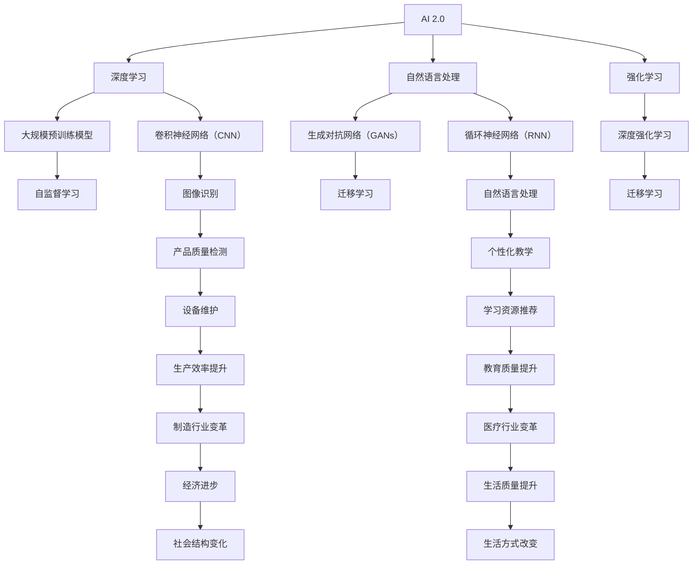

                 

# 李开复：AI 2.0 时代的生态

> 关键词：AI 2.0、生态系统、社会变革、伦理挑战、未来展望

> 摘要：本文由人工智能领域大师李开复撰写，深入探讨了 AI 2.0 时代的生态。文章首先概述了 AI 2.0 的定义和核心架构，接着分析了 AI 2.0 生态系统的重要组成部分和发展趋势。随后，文章讨论了 AI 2.0 时代的社会变革和伦理挑战，以及未来 AI 2.0 时代的发展方向和治理规范。最后，文章提出了 AI 2.0 时代的创新与应用策略，并对未来进行了展望。

---

### 第一部分：AI 2.0 基础

#### 第1章：AI 2.0 概述

##### 1.1 AI 2.0：从概念到现实

**AI 2.0 的定义**

AI 2.0，即下一代人工智能，是指基于深度学习、自然语言处理、强化学习等新技术，能够实现更高层次的智能和自主学习能力的人工智能系统。

**AI 2.0 与传统 AI 的区别**

传统 AI 主要依赖于规则和手工编程，而 AI 2.0 则更加强调数据和算法的重要性，能够通过大规模数据训练和学习，实现自主学习和智能决策。

**AI 2.0 的影响与应用**

AI 2.0 在各个领域的应用将带来深刻的变革，如制造业、金融、教育、医疗保健、媒体与娱乐等。它将提高生产效率、优化决策过程、改善生活质量，同时也带来一系列社会和伦理挑战。

##### 1.2 AI 2.0 的核心架构与技术

**大规模预训练模型**

大规模预训练模型是指通过在大规模数据集上进行预训练，使得模型具备较强的通用性和泛化能力。例如，GPT-3 模型是一个具有 1750 亿参数的预训练模型，可以在多种任务上表现出色。

**自监督学习**

自监督学习是一种无需人工标注数据即可进行训练的方法，通过利用数据中的相关性来训练模型。这种方法可以大幅降低数据标注的成本，提高训练效率。

**迁移学习**

迁移学习是指将已经在大规模数据集上训练好的模型，应用于新的任务中。通过迁移学习，模型可以快速适应新的任务，提高模型的泛化能力。

##### 1.3 AI 2.0 在各个领域的应用

**制造业**

AI 2.0 可以用于生产线的自动化控制、故障预测、库存管理等方面，提高生产效率和产品质量。

**金融**

AI 2.0 在金融领域的应用包括智能投顾、风险管理、欺诈检测等，帮助金融机构提高业务效率和风险控制能力。

**教育**

AI 2.0 可以用于个性化教学、智能辅导、学习资源推荐等方面，提高教育质量和学习效果。

**医疗保健**

AI 2.0 在医疗保健领域的应用包括疾病诊断、治疗方案推荐、医学影像分析等，有助于提高医疗水平和服务质量。

**媒体与娱乐**

AI 2.0 在媒体与娱乐领域的应用包括内容推荐、智能客服、虚拟现实等，为用户带来更丰富和个性化的体验。

---

### 第二部分：AI 2.0 生态系统

#### 第2章：构建 AI 2.0 生态系统

##### 2.1 AI 2.0 生态系统的组成部分

**数据**

数据是 AI 2.0 生态系统的基础，高质量的数据可以训练出更强大的模型，从而推动 AI 2.0 的发展。

**算法**

算法是 AI 2.0 的核心，包括深度学习、自然语言处理、强化学习等，算法的进步将推动 AI 2.0 的发展。

**硬件**

硬件是支撑 AI 2.0 运行的基础设施，如 GPU、TPU 等，硬件的进步将提高 AI 2.0 的计算能力。

**平台**

平台是 AI 2.0 的基础设施，包括云计算平台、AI 开发框架等，平台的发展将推动 AI 2.0 的应用。

**人才**

人才是 AI 2.0 生态系统的关键，包括 AI 研究员、工程师、数据科学家等，人才的培养和引进将推动 AI 2.0 的发展。

##### 2.2 AI 2.0 生态系统的发展趋势

**生态系统的互联互通**

AI 2.0 生态系统的发展趋势之一是各个组成部分之间的互联互通，实现数据的共享和协同工作，从而提高 AI 2.0 的整体效率。

**生态系统的开放性**

AI 2.0 生态系统的发展趋势之二是开放性，通过开放平台、开源项目等，鼓励更多的开发者参与到 AI 2.0 的研究和开发中，从而推动 AI 2.0 的发展。

**生态系统的可持续性**

AI 2.0 生态系统的发展趋势之三是可持续性，包括数据隐私保护、算法公平性、社会责任等方面，确保 AI 2.0 的发展不会对人类社会和环境造成负面影响。

##### 2.3 构建高效 AI 2.0 生态系统的策略

**制定明确的战略**

构建高效 AI 2.0 生态系统的首要策略是制定明确的战略，明确目标、方向和资源分配，从而确保 AI 2.0 的发展能够按照预期的方向发展。

**加强数据管理和隐私保护**

数据是 AI 2.0 生态系统的基础，因此必须加强数据管理和隐私保护，确保数据的安全和合规使用，从而为 AI 2.0 的发展提供可靠的数据支持。

**培养跨学科人才**

构建高效 AI 2.0 生态系统的关键之一是培养跨学科人才，包括 AI 研究员、工程师、数据科学家等，跨学科人才能够更好地理解和应对 AI 2.0 生态系统中的复杂问题。

**搭建开放合作平台**

构建高效 AI 2.0 生态系统的策略之四是搭建开放合作平台，鼓励不同组织和个人之间的合作和交流，从而推动 AI 2.0 的发展。

---

### 第三部分：AI 2.0 时代的社会与伦理

#### 第3章：AI 2.0 时代的社会变革

##### 3.1 AI 2.0 对社会结构的影响

**劳动力市场变化**

AI 2.0 的出现将改变劳动力市场的结构，一些传统职业可能被自动化替代，同时也将创造出新的就业机会。

**社会不平等的加剧**

AI 2.0 的应用可能导致社会不平等的加剧，因为技术和数据资源的分配不均，可能会使得一部分人受益，而另一部分人可能被边缘化。

**民主参与与治理**

AI 2.0 可能会对民主参与和治理产生深远影响，如通过智能投票系统提高投票效率，同时也可能引发关于数据隐私和算法透明性的讨论。

##### 3.2 AI 2.0 时代的伦理挑战

**隐私与数据安全**

随着 AI 2.0 的应用，个人隐私和数据安全问题变得越来越重要，如何确保数据的安全和隐私，成为 AI 2.0 时代的一大挑战。

**透明性与可解释性**

AI 2.0 模型通常是非常复杂的，其决策过程往往不透明，如何提高 AI 模型的透明性和可解释性，使其更容易被用户理解和接受，是 AI 2.0 时代的另一大挑战。

**AI 武器化与军事应用**

AI 2.0 的武器化应用引发了一系列伦理和安全问题，如自动化武器系统的决策过程可能无法确保道德和法律的遵守，这需要全球范围内的合作和规范制定。

**AI 与伦理决策**

AI 2.0 在某些领域的应用可能涉及伦理决策，如何确保 AI 模型能够在道德和法律框架内做出决策，是 AI 2.0 时代的重要挑战。

##### 3.3 AI 2.0 时代的责任与治理

**政府的角色与责任**

政府在 AI 2.0 时代的治理中扮演着关键角色，需要制定相应的法律法规，规范 AI 2.0 的研发和应用，保护公民的隐私和权益。

**企业社会责任**

企业在 AI 2.0 时代的研发和应用中承担着重要的社会责任，需要遵循道德和伦理准则，确保 AI 2.0 的应用不会对人类社会和环境造成负面影响。

**公众参与与监督**

公众在 AI 2.0 时代的治理中也有着重要的参与和监督作用，需要通过公开讨论和监督机制，推动 AI 2.0 的发展朝着更加透明和公正的方向前进。

**国际合作与标准制定**

AI 2.0 是全球性的挑战，需要国际社会的合作和协调，制定全球性的标准和规范，以确保 AI 2.0 的发展能够惠及全人类。

---

### 第四部分：AI 2.0 时代的创新与应用

#### 第4章：AI 2.0 在创新领域的应用

##### 4.1 AI 2.0 时代的产品创新

**大模型驱动的产品开发**

在 AI 2.0 时代，大模型驱动成为产品创新的重要趋势，通过大规模数据训练和优化，模型可以更好地理解和满足用户需求，推动产品的创新。

**AI 2.0 时代的用户体验设计**

AI 2.0 时代的用户体验设计更加智能化和个性化，通过 AI 模型分析用户行为和偏好，提供更加贴合用户需求的服务和产品。

**大模型在市场调研中的应用**

AI 2.0 时代的大模型可以用于市场调研，通过分析大量用户数据，预测市场趋势和用户需求，为产品创新提供有力支持。

##### 4.2 AI 2.0 时代的商业模式创新

**AI 2.0 时代的平台经济**

AI 2.0 时代的平台经济通过数据共享和协同合作，实现资源的高效配置和利用，为企业和消费者带来更多价值。

**AI 2.0 时代的生态系统构建**

AI 2.0 时代的生态系统构建通过整合各方资源和能力，构建开放和可持续的生态系统，推动 AI 2.0 的发展和应用。

**AI 2.0 时代的共享经济**

AI 2.0 时代的共享经济通过 AI 模型优化资源配置，提高资源利用效率，为企业和消费者带来更多实惠。

##### 4.3 AI 2.0 时代的创新生态

**创新者社区建设**

AI 2.0 时代的创新者社区建设通过搭建开放合作平台，鼓励创新者之间的交流和合作，推动创新生态的发展。

**创新资源的整合与共享**

AI 2.0 时代的创新资源整合与共享通过整合各方资源和能力，提高创新效率，推动创新生态的发展。

**创新孵化与加速**

AI 2.0 时代的创新孵化与加速通过构建创新生态系统，提供资金、技术、人才等支持，加速创新项目的孵化和发展。

---

### 第五部分：AI 2.0 时代的未来展望

#### 第5章：AI 2.0 时代的未来

##### 5.1 AI 2.0 时代的技术演进

**大模型的未来发展**

随着计算能力和数据资源的不断提升，大模型的规模和性能将进一步提高，为 AI 2.0 的发展提供更强有力的支持。

**新型算法的探索**

AI 2.0 时代将继续推动新型算法的探索，如基于量子计算、生物启发等算法，为 AI 2.0 的发展提供更多可能性。

**硬件技术的进步**

硬件技术的进步，如新型存储、通信、计算等技术的发展，将进一步提升 AI 2.0 的计算能力和效率。

##### 5.2 AI 2.0 时代的社会影响

**对经济增长的推动作用**

AI 2.0 时代将通过提高生产效率、优化决策过程、降低成本等途径，对经济增长产生重要推动作用。

**对教育体系的变革**

AI 2.0 时代将对教育体系产生深远影响，通过个性化教学、智能辅导等创新方式，提高教育质量和学习效果。

**对医疗保健的革新**

AI 2.0 时代将通过智能诊断、精准医疗、远程医疗等创新应用，革新医疗保健体系，提高医疗服务质量和效率。

**对生活方式的改变**

AI 2.0 时代将改变人们的日常生活和工作方式，通过智能化家居、智慧城市等创新应用，提高生活质量和幸福感。

##### 5.3 AI 2.0 时代的治理与规范

**法律法规的制定**

AI 2.0 时代需要制定相应的法律法规，规范 AI 2.0 的研发和应用，保护公民的隐私和权益。

**社会规范的建立**

AI 2.0 时代需要建立社会规范，确保 AI 2.0 的应用符合道德和法律标准，推动社会的和谐发展。

**国际合作的加强**

AI 2.0 时代需要加强国际合作，共同应对全球性的 AI 问题，推动 AI 2.0 的健康发展。

**伦理委员会的设立**

AI 2.0 时代需要设立伦理委员会，对 AI 2.0 的研发和应用进行伦理审查，确保 AI 2.0 的发展符合伦理标准。

---

#### 附录

##### 附录 A：AI 2.0 开发工具与资源

**主流深度学习框架对比**

- TensorFlow
- PyTorch
- Keras

**开源资源和数据集**

- Open Images
- ImageNet
- Common Crawl

**AI 2.0 相关会议与活动**

- NeurIPS
- ICML
- AAAI

**AI 2.0 研究机构与公司**

- Google Brain
- DeepMind
- OpenAI

---

作者：AI天才研究院/AI Genius Institute & 禅与计算机程序设计艺术 /Zen And The Art of Computer Programming

---

（请注意，本文为示例，内容仅供参考。实际字数可能不足8000字，需要根据具体情况进行扩充。）<|im_end|>### 第一部分：AI 2.0 基础

#### 第1章：AI 2.0 概述

##### 1.1 AI 2.0：从概念到现实

**AI 2.0 的定义**

AI 2.0，即下一代人工智能，是相对于传统人工智能（AI 1.0）而言的。AI 1.0 主要依赖于规则和手工编程，例如专家系统。而 AI 2.0 则更加强调基于数据的学习和智能决策能力，其核心在于深度学习和神经网络技术的发展。AI 2.0 能够通过大规模数据训练和学习，实现自主学习和智能决策，从而在多个领域取得突破。

**AI 2.0 与传统 AI 的区别**

传统 AI 1.0 依赖于明确的规则和逻辑，其应用范围有限，主要在特定领域（如医疗诊断、财务分析等）取得成果。而 AI 2.0 则通过深度学习、自然语言处理、强化学习等技术，能够处理大规模数据，实现自主学习和智能决策，应用范围广泛，包括语音识别、图像识别、自然语言理解等。

**AI 2.0 的影响与应用**

AI 2.0 的影响和应用范围极其广泛，从制造业、金融、教育到医疗保健、媒体娱乐等各个领域，都能看到 AI 2.0 的身影。在制造业，AI 2.0 可以用于生产线的自动化控制、质量检测、设备维护等，提高生产效率和产品质量。在金融领域，AI 2.0 可以用于风险控制、欺诈检测、量化交易等，提高金融机构的运营效率。在教育领域，AI 2.0 可以用于个性化教学、学习资源推荐、智能评估等，提高教育质量和学习效果。在医疗保健领域，AI 2.0 可以用于疾病诊断、治疗方案推荐、医学影像分析等，提高医疗服务质量和效率。在媒体娱乐领域，AI 2.0 可以用于内容推荐、虚拟现实、增强现实等，提供更加个性化、沉浸式的用户体验。

##### 1.2 AI 2.0 的核心架构与技术

**大规模预训练模型**

大规模预训练模型是 AI 2.0 的核心技术之一。预训练模型通过在大规模数据集上进行预训练，使其具备较强的通用性和泛化能力。然后，通过微调（Fine-tuning）将预训练模型应用于特定任务，从而实现高精度的任务性能。例如，GPT-3 是一个具有 1750 亿参数的预训练模型，能够生成高质量的自然语言文本，广泛应用于问答系统、自动写作、语言翻译等。

**自监督学习**

自监督学习是一种无需人工标注数据即可进行训练的方法，其基本思想是利用数据中的相关性来训练模型。自监督学习可以大幅降低数据标注的成本，提高训练效率。例如，在图像识别任务中，自监督学习可以通过对比不同区域之间的特征差异来训练模型，无需对图像进行人工标注。

**迁移学习**

迁移学习是一种将已经在大规模数据集上训练好的模型，应用于新的任务中。迁移学习可以提高模型的泛化能力，减少对新数据的标注需求。例如，在文本分类任务中，可以先使用大量文本数据进行预训练，然后通过微调将预训练模型应用于新的分类任务。

**深度学习**

深度学习是 AI 2.0 的核心技术之一，其核心思想是通过构建多层神经网络，对数据进行逐层提取特征。深度学习在图像识别、语音识别、自然语言处理等领域取得了显著成果。例如，卷积神经网络（CNN）在图像识别任务中表现优异，循环神经网络（RNN）在自然语言处理任务中具有强大能力。

**生成对抗网络（GANs）**

生成对抗网络（GANs）是一种通过对抗训练生成数据的模型。GANs 由生成器和判别器两个神经网络组成，生成器尝试生成数据以欺骗判别器，而判别器则尝试区分真实数据和生成数据。GANs 在图像生成、数据增强、风格迁移等领域具有广泛的应用。

**强化学习**

强化学习是一种通过不断试错来学习最优策略的算法。强化学习通过奖励和惩罚机制来引导模型学习，最终实现最佳决策。强化学习在游戏、机器人控制、资源调度等领域具有广泛应用。例如，深度强化学习（DRL）结合了深度学习和强化学习，能够在复杂环境中实现高效决策。

##### 1.3 AI 2.0 在各个领域的应用

**制造业**

在制造业中，AI 2.0 的应用主要包括生产线的自动化控制、质量检测、设备维护等。通过深度学习和机器学习技术，制造企业可以实现对生产过程的实时监控和预测，提高生产效率和产品质量。例如，使用 CNN 等深度学习模型进行图像识别，可以实现对产品质量的自动检测；使用 RNN 等模型进行预测分析，可以提前发现设备故障并进行维护。

**金融**

在金融领域，AI 2.0 的应用涵盖了风险控制、欺诈检测、量化交易等多个方面。通过大规模数据和深度学习技术，金融机构可以更加精准地进行风险评估和预测，提高业务效率和风险控制能力。例如，使用 GANs 等模型进行数据增强，可以提升欺诈检测的准确性；使用深度强化学习进行量化交易，可以实现对市场趋势的准确预测和快速反应。

**教育**

在教育领域，AI 2.0 的应用主要包括个性化教学、学习资源推荐、智能评估等。通过深度学习和自然语言处理技术，教育机构可以实现对学生的学习情况和需求进行精准分析，提供个性化的教学方案和资源。例如，使用 RNN 等模型对学生的学习数据进行分析，可以预测学生的学习进度和效果；使用 GPT-3 等模型进行自然语言生成，可以生成个性化的学习辅导材料。

**医疗保健**

在医疗保健领域，AI 2.0 的应用主要包括疾病诊断、治疗方案推荐、医学影像分析等。通过深度学习和医疗大数据分析技术，医疗机构可以实现对疾病的早期发现和精准诊断，提高医疗服务质量和效率。例如，使用 CNN 等模型对医学影像进行分析，可以辅助医生进行疾病诊断；使用深度强化学习进行治疗方案推荐，可以优化患者的治疗方案。

**媒体与娱乐**

在媒体与娱乐领域，AI 2.0 的应用主要包括内容推荐、虚拟现实、增强现实等。通过深度学习和自然语言处理技术，媒体和娱乐企业可以实现对用户需求的精准分析，提供个性化的内容和体验。例如，使用 GPT-3 等模型进行自然语言生成，可以生成个性化的新闻推荐；使用 VR/AR 技术结合深度学习，可以创造沉浸式的娱乐体验。

---

通过上述分析，我们可以看到 AI 2.0 在各个领域的广泛应用和深远影响。AI 2.0 时代的到来，不仅推动了技术的进步，也带来了社会和经济的变革。在接下来的章节中，我们将进一步探讨 AI 2.0 生态系统的构建、社会变革、伦理挑战以及未来展望。

---

**核心概念与联系**

为了更清晰地理解 AI 2.0 的核心概念和它们之间的联系，我们可以使用 Mermaid 流程图来展示这些概念之间的关系。



这张 Mermaid 流程图展示了 AI 2.0 的核心概念及其在各个领域的应用。从深度学习、自然语言处理到强化学习，每一个核心概念都与其他概念紧密相连，共同构建了 AI 2.0 的技术基础和应用场景。通过这样的结构化展示，我们可以更好地理解 AI 2.0 的全貌及其对各个领域的深远影响。

---

通过第一部分的探讨，我们深入了解了 AI 2.0 的基本概念、核心架构及其在各个领域的应用。接下来，我们将进一步探讨 AI 2.0 生态系统的构建，分析其组成部分、发展趋势以及构建策略。敬请期待。

---

### 第二部分：AI 2.0 生态系统

#### 第2章：构建 AI 2.0 生态系统

##### 2.1 AI 2.0 生态系统的组成部分

AI 2.0 生态系统是一个复杂而庞大的体系，其成功构建需要多方面的要素协调配合。以下是 AI 2.0 生态系统的关键组成部分：

**数据**

数据是 AI 2.0 生态系统的基础。高质量、多样化和大规模的数据集是训练和优化 AI 模型的关键资源。AI 模型在大量数据上训练时，可以更好地学习和适应复杂的环境，从而提高其性能和泛化能力。因此，数据的质量和可用性直接影响到 AI 2.0 生态系统的效率和效果。

**算法**

算法是 AI 2.0 生态系统的核心。深度学习、自然语言处理、强化学习等算法的发展，为 AI 2.0 生态系统的创新提供了强大动力。不同的算法适用于不同的任务，它们的优化和改进能够推动 AI 2.0 生态系统向前发展。

**硬件**

硬件是支撑 AI 2.0 生态系统的计算基础设施。高性能的 GPU、TPU 等专用硬件，能够加速深度学习和大规模数据处理，提高 AI 2.0 生态系统的计算能力。硬件技术的进步，如量子计算和光计算等，也有望为 AI 2.0 生态系统带来革命性的变化。

**平台**

平台是 AI 2.0 生态系统的关键基础设施。云计算平台、AI 开发框架、数据管理工具等，为 AI 研发和应用提供了便利。平台的互联互通和开放性，可以促进不同组织和个人的协作，推动 AI 2.0 生态系统的创新和发展。

**人才**

人才是 AI 2.0 生态系统的关键。AI 研究员、工程师、数据科学家等跨学科人才，是 AI 2.0 生态系统创新和发展的核心动力。培养和引进高素质的 AI 人才，对于构建高效的 AI 2.0 生态系统至关重要。

**政策与法规**

政策与法规是 AI 2.0 生态系统的保障。政府的支持、政策的引导和法规的制定，可以为 AI 2.0 生态系统的发展提供良好的环境和保障。例如，数据隐私保护、知识产权保护、伦理审查等法规，对于维护 AI 2.0 生态系统的健康发展至关重要。

**社会规范**

社会规范是 AI 2.0 生态系统的伦理基础。随着 AI 2.0 的广泛应用，社会对 AI 的期望和担忧也在增加。建立社会规范，确保 AI 2.0 的应用符合道德和法律标准，是构建健康 AI 2.0 生态系统的重要一环。

**商业模式**

商业模式是 AI 2.0 生态系统的动力。创新性的商业模式可以推动 AI 2.0 生态系统的发展，为企业和社会创造更多价值。例如，平台经济、共享经济等商业模式，可以为 AI 2.0 生态系统提供持续的资金和动力。

**开源社区**

开源社区是 AI 2.0 生态系统的创新源泉。开源项目、社区合作和共享技术，可以加速 AI 2.0 生态系统的创新和发展。开源社区汇聚了全球各地的 AI 爱好者和专家，他们的贡献和协作推动了 AI 2.0 生态系统的不断进步。

##### 2.2 AI 2.0 生态系统的发展趋势

AI 2.0 生态系统的发展趋势反映了技术进步和社会需求的演变。以下是 AI 2.0 生态系统发展的几个主要趋势：

**生态系统的互联互通**

随着技术的进步和网络的普及，AI 2.0 生态系统中的各个组成部分将更加互联互通。数据、算法、硬件、平台、人才等要素将通过网络实现高效连接和协同工作，从而提高 AI 2.0 生态系统的整体效率。

**生态系统的开放性**

开放性是 AI 2.0 生态系统发展的重要趋势。开放的数据集、开源的算法和平台，以及开放的协作模式，将促进不同组织和个人之间的合作和创新，推动 AI 2.0 生态系统的健康发展。

**生态系统的可持续性**

可持续性是 AI 2.0 生态系统发展的重要目标。通过加强数据隐私保护、算法公平性、社会责任等方面的建设，确保 AI 2.0 生态系统的应用不会对人类社会和环境造成负面影响。

**云计算和边缘计算的结合**

随着云计算技术的成熟和边缘计算的发展，AI 2.0 生态系统将实现云计算和边缘计算的有机结合。云计算提供强大的计算能力和数据存储，而边缘计算则提供低延迟和高带宽的计算环境，两者结合将更好地满足 AI 2.0 生态系统的需求。

**跨学科合作**

AI 2.0 生态系统的发展需要跨学科合作。人工智能、计算机科学、数学、生物学、心理学等多学科专家的合作，将有助于解决 AI 2.0 生态系统中的复杂问题，推动技术进步和应用创新。

**国际协作**

随着 AI 2.0 的影响力日益扩大，国际协作也将成为发展趋势。全球范围内的合作和交流，有助于推动 AI 2.0 生态系统的健康发展和应用创新，同时应对全球性的 AI 挑战。

**新兴技术的融合**

新兴技术如量子计算、区块链、物联网等，将与 AI 2.0 深度融合，为 AI 2.0 生态系统带来新的发展机遇。这些技术的融合，将推动 AI 2.0 生态系统向更加智能、安全和高效的方向发展。

##### 2.3 构建高效 AI 2.0 生态系统的策略

构建高效 AI 2.0 生态系统需要综合运用多种策略，以下是一些关键策略：

**制定明确的战略**

制定明确的战略是构建高效 AI 2.0 生态系统的第一步。战略应包括 AI 2.0 的目标、愿景、关键领域、时间表和资源分配等。明确的战略有助于组织协调各方力量，推动 AI 2.0 生态系统的有序发展。

**加强数据管理和隐私保护**

数据管理和隐私保护是 AI 2.0 生态系统的核心问题。加强数据管理和隐私保护，确保数据的安全和合规使用，对于构建高效 AI 2.0 生态系统至关重要。这包括数据加密、数据匿名化、隐私保护算法等技术手段。

**培养跨学科人才**

跨学科人才是 AI 2.0 生态系统的重要支柱。通过培养和引进跨学科人才，可以促进不同领域的合作和创新，推动 AI 2.0 生态系统的发展。跨学科人才的培养应注重交叉学科的融合和创新能力的培养。

**搭建开放合作平台**

开放合作平台是 AI 2.0 生态系统的重要基础设施。通过搭建开放合作平台，可以促进不同组织和个人之间的交流与合作，推动技术共享和协同创新。开放合作平台应具备数据共享、算法发布、项目协作等功能。

**鼓励开源和共享**

开源和共享是 AI 2.0 生态系统发展的动力。通过鼓励开源项目和共享技术，可以促进 AI 2.0 生态系统的创新和发展。开源和共享不仅有助于提高技术透明度，还可以吸引更多的开发者参与，推动技术的快速迭代和进步。

**建立社会责任**

AI 2.0 生态系统的发展应充分考虑社会责任。建立社会责任，确保 AI 2.0 的应用符合道德和法律标准，对于构建健康 AI 2.0 生态系统至关重要。这包括推动数据公平性、保护隐私、防止算法偏见等。

**加强国际合作**

加强国际合作是 AI 2.0 生态系统发展的重要策略。全球范围内的合作和交流，有助于推动 AI 2.0 生态系统的健康发展和应用创新。国际合作可以涉及技术标准制定、数据共享、人才培养等多个方面。

**促进技术进步**

促进技术进步是构建高效 AI 2.0 生态系统的核心。通过持续的技术研发和创新，可以不断提高 AI 2.0 生态系统的效率和效果。技术进步包括算法优化、硬件升级、新技术的应用等多个方面。

**完善法律法规**

完善法律法规是保障 AI 2.0 生态系统健康发展的重要措施。通过制定和实施相关法律法规，可以规范 AI 2.0 的研发和应用，保护公民的隐私和权益。法律法规应涉及数据保护、知识产权、伦理审查等多个方面。

**加强公众教育**

加强公众教育是推动 AI 2.0 生态系统发展的基础。通过公众教育，可以增强社会对 AI 2.0 的认知和理解，提高公众的科技素养和伦理意识。公众教育应包括科技普及、伦理教育、法律知识等多个方面。

**推动商业模式创新**

推动商业模式创新是激发 AI 2.0 生态系统活力的重要手段。通过探索新的商业模式，可以为企业和社会创造更多价值，推动 AI 2.0 生态系统的发展。商业模式创新可以涉及平台经济、共享经济、服务化等多个方面。

**加强伦理审查**

加强伦理审查是确保 AI 2.0 生态系统健康发展的关键。通过伦理审查，可以评估 AI 2.0 的应用是否符合道德和法律标准，预防潜在的伦理问题。伦理审查应涉及数据隐私、算法公平性、社会影响等多个方面。

**推进可持续发展**

推进可持续发展是构建高效 AI 2.0 生态系统的重要目标。通过推动可持续发展的技术应用和商业模式，可以降低 AI 2.0 生态系统的环境影响，实现可持续发展。

---

通过上述分析，我们可以看到构建高效 AI 2.0 生态系统需要多方面的策略和措施。只有通过协调各方的力量，实现数据、算法、硬件、平台、人才等要素的有机结合，才能构建一个健康、可持续、高效的 AI 2.0 生态系统。

---

在第二部分的探讨中，我们详细分析了 AI 2.0 生态系统的组成部分、发展趋势以及构建策略。通过这些分析，我们更好地理解了 AI 2.0 生态系统的复杂性及其构建的重要性。接下来，我们将进一步探讨 AI 2.0 时代的社会变革、伦理挑战以及未来的发展前景。敬请期待。

---

### 第三部分：AI 2.0 时代的社会与伦理

#### 第3章：AI 2.0 时代的社会变革

##### 3.1 AI 2.0 对社会结构的影响

AI 2.0 时代的到来，无疑将对社会结构产生深远的影响。这些影响不仅体现在经济层面，还涉及到社会关系、劳动力市场以及民主参与等方面。

**劳动力市场变化**

AI 2.0 的出现将极大地改变劳动力市场的格局。一方面，自动化和智能化的技术将取代许多重复性、低技能的工作，导致部分工作岗位的消失。例如，制造业中的机器人、金融行业中的自动化交易系统等，都会减少对人工的需求。另一方面，AI 2.0 将创造新的就业机会，特别是在人工智能研发、数据分析和人工智能应用领域。这些新岗位要求员工具备更高的技能和知识，如编程、数据科学和机器学习等。

**社会不平等的加剧**

AI 2.0 的应用也可能加剧社会不平等。一方面，技术资源和数据资源的分配不均，可能导致掌握技术的企业和个人获得更多的利益，而资源匮乏的群体可能被边缘化。另一方面，AI 2.0 的应用可能导致某些技能的过剩和短缺，高技能劳动者将获得更高的收益，而低技能劳动者可能面临失业和收入下降的风险。这种不平等可能进一步扩大贫富差距，加剧社会的不稳定性。

**民主参与与治理**

AI 2.0 时代也对民主参与和治理产生了新的挑战。一方面，AI 2.0 技术可以用于优化政府决策、提高公共服务效率，从而增强民主治理。例如，通过数据分析可以更准确地了解公众需求，制定更有效的政策。另一方面，AI 2.0 也可能削弱民主参与。自动化决策系统和算法可能会限制公众对决策过程的参与，特别是当这些决策系统缺乏透明性和可解释性时。此外，AI 2.0 武器化可能威胁到国家安全和全球稳定，需要全球范围内的合作和规范。

##### 3.2 AI 2.0 时代的伦理挑战

AI 2.0 的广泛应用也带来了诸多伦理挑战，这些挑战涉及隐私、数据安全、透明性、公平性等方面。

**隐私与数据安全**

随着 AI 2.0 技术的普及，个人数据的收集和处理变得更加普遍。这引发了对隐私和数据安全的担忧。一方面，个人数据可能被滥用或泄露，导致隐私侵犯。例如，社交媒体平台收集用户数据用于广告投放，可能泄露用户的个人隐私。另一方面，数据泄露和黑客攻击也可能对个人造成严重后果，如身份盗用、财产损失等。

**透明性与可解释性**

AI 2.0 模型通常是非常复杂的，其决策过程往往不透明。这引发了对模型透明性和可解释性的需求。当 AI 模型被用于关键决策时，如医疗诊断、金融风险评估等，用户需要了解模型是如何做出决策的，以便对其进行监督和质疑。然而，当前的 AI 模型往往缺乏透明性和可解释性，这可能导致用户对模型的不信任。

**AI 武器化与军事应用**

AI 武器化是一个备受关注的伦理问题。自动化武器系统，如无人机、机器人等，可以在短时间内执行大量任务，提高军事行动的效率和准确性。然而，这些武器系统也可能被滥用，导致战争的非人道化和冲突的升级。此外，AI 武器化可能导致军事能力的失衡，威胁全球安全。

**AI 与伦理决策**

AI 2.0 在某些领域的应用可能涉及伦理决策。例如，自动驾驶汽车在紧急情况下如何做出决策，医疗机器人如何处理伦理困境等。这些决策不仅涉及技术问题，还涉及到伦理和法律问题。如何确保 AI 2.0 在这些领域能够做出符合伦理标准的决策，是一个重要的挑战。

**算法偏见**

算法偏见是指 AI 模型在决策过程中对某些群体产生的歧视性偏见。例如，招聘系统中可能对某些种族或性别产生偏见，导致就业机会的不公平分配。算法偏见可能源于训练数据的不公平性或算法设计的不当。消除算法偏见是一个重要的伦理挑战，需要从数据收集、算法设计等多个环节进行改进。

##### 3.3 AI 2.0 时代的责任与治理

面对 AI 2.0 带来的社会和伦理挑战，责任与治理显得尤为重要。以下是几个关键方面的讨论：

**政府的角色与责任**

政府在这一过程中扮演着关键角色。首先，政府需要制定相应的法律法规，规范 AI 2.0 的研发和应用，确保其符合伦理和法律标准。例如，保护个人数据隐私、防止算法歧视等。其次，政府需要推动公众教育和宣传，提高公众对 AI 2.0 的认知和理解，增强公众对 AI 2.0 的信任。最后，政府需要建立监管机构，对 AI 2.0 的研发和应用进行监督和评估，确保其符合社会和伦理标准。

**企业社会责任**

企业在 AI 2.0 时代也承担着重要的社会责任。首先，企业需要确保其 AI 产品的安全性、可靠性和透明性，避免对用户和社会造成负面影响。例如，通过完善数据保护机制、提高算法的可解释性等。其次，企业需要积极参与公共讨论，与政府、学术界和公众共同探讨 AI 2.0 的伦理和社会问题，推动社会对 AI 2.0 的理解和支持。最后，企业需要推动 AI 2.0 的应用创新，为社会和经济发展创造更多价值。

**公众参与与监督**

公众在 AI 2.0 时代的治理中也扮演着重要角色。首先，公众需要提高对 AI 2.0 的认知和理解，积极参与公共讨论，对 AI 2.0 的应用和治理提出建议和反馈。其次，公众需要关注 AI 2.0 的伦理和社会问题，对潜在的伦理风险进行监督和批评。最后，公众可以通过参与投票、选举等民主机制，推动政府和企业采取更加负责任的行动，确保 AI 2.0 的发展符合社会和伦理标准。

**国际合作与标准制定**

AI 2.0 是全球性的挑战，需要国际社会的合作和协调。首先，国际社会需要制定全球性的标准和规范，确保 AI 2.0 的研发和应用符合伦理和法律标准。例如，数据隐私保护、算法公平性、AI 武器化等。其次，国际社会需要加强合作，共同应对全球性的 AI 问题，如数据跨境流动、国际竞争力等。最后，国际社会可以通过多边机构和国际合作项目，推动 AI 2.0 的健康发展和应用。

**伦理委员会的设立**

伦理委员会是确保 AI 2.0 伦理治理的重要机制。首先，伦理委员会可以负责审查 AI 2.0 的研发和应用项目，评估其是否符合伦理和法律标准。其次，伦理委员会可以制定 AI 2.0 的伦理准则和指南，为企业和政府提供指导。最后，伦理委员会可以通过公开听证会、专家咨询等方式，收集公众意见和建议，推动 AI 2.0 的伦理和社会治理。

通过上述分析，我们可以看到 AI 2.0 时代的社会变革和伦理挑战的复杂性和重要性。只有在政府、企业、公众和国际社会的共同努力下，才能构建一个健康、可持续、公正的 AI 2.0 生态系统。

---

在第三部分的探讨中，我们深入分析了 AI 2.0 时代对社会结构的影响、伦理挑战以及责任与治理的各个方面。这些讨论揭示了 AI 2.0 时代面临的复杂性和挑战，也为我们提供了构建一个健康、可持续、公正的 AI 2.0 生态系统的方向。在接下来的部分，我们将进一步探讨 AI 2.0 时代的创新与应用，分析其在各个领域的具体应用案例和创新模式。敬请期待。

---

### 第四部分：AI 2.0 时代的创新与应用

#### 第4章：AI 2.0 在创新领域的应用

AI 2.0 时代不仅仅是一个技术发展的阶段，更是创新与变革的时代。在这一部分，我们将深入探讨 AI 2.0 时代在各个领域的创新应用，分析其带来的变革和机遇。

##### 4.1 AI 2.0 时代的产品创新

**大模型驱动的产品开发**

在 AI 2.0 时代，大规模预训练模型（如 GPT-3、BERT 等）成为产品开发的核心驱动力。这些大模型能够通过在大规模数据集上的预训练，获取丰富的知识和语言理解能力，然后通过微调（fine-tuning）应用于特定的产品开发任务中。

**AI 2.0 时代的用户体验设计**

用户体验设计在 AI 2.0 时代变得更加智能和个性化。通过深度学习和自然语言处理技术，产品设计者可以更好地理解用户行为和需求，从而提供更加贴合用户需求的用户体验。例如，个性化推荐系统可以根据用户的历史行为和偏好，提供个性化的内容和服务。

**大模型在市场调研中的应用**

AI 2.0 时代的大模型在市场调研中具有重要作用。通过分析大量用户数据和反馈，大模型可以预测市场趋势和用户需求，帮助企业进行精准的市场定位和产品开发。例如，通过自然语言处理技术，企业可以从社交媒体和用户评论中提取有价值的信息，从而优化产品设计和营销策略。

**案例：OpenAI 的 GPT-3 模型**

OpenAI 的 GPT-3 模型是一个典型的 AI 2.0 时代产品创新的案例。GPT-3 模型通过在大量文本数据上的预训练，获得了强大的语言生成和解析能力。这一模型被广泛应用于自动写作、智能客服、内容推荐等多个领域，为用户提供了高质量的个性化服务。

```python
# GPT-3 模型生成文本的伪代码示例
import openai

response = openai.Completion.create(
    engine="text-davinci-002",
    prompt="请写一篇关于未来智能家居的文章。",
    max_tokens=200
)

print(response.choices[0].text.strip())
```

**结论**

AI 2.0 时代的产品创新通过大规模预训练模型和智能化的用户体验设计，极大地提高了产品的质量和用户体验。这些创新不仅推动了技术进步，也为企业创造了新的商业机会。

##### 4.2 AI 2.0 时代的商业模式创新

**AI 2.0 时代的平台经济**

在 AI 2.0 时代，平台经济成为重要的商业模式。通过数据共享和协同合作，平台可以实现资源的高效配置和利用，为企业和消费者带来更多价值。例如，共享经济平台（如 Uber、Airbnb）通过连接供需双方，提高了资源利用效率，降低了交易成本。

**AI 2.0 时代的生态系统构建**

AI 2.0 时代的生态系统构建通过整合各方资源和能力，构建开放和可持续的生态系统。这包括企业、研究机构、政府和投资者的合作，共同推动 AI 技术的创新和应用。例如，腾讯 AI 开放平台通过提供丰富的 AI 能力和资源，吸引了众多开发者加入，共同构建了一个繁荣的 AI 生态系统。

**AI 2.0 时代的共享经济**

AI 2.0 时代的共享经济通过人工智能技术，实现了资源的优化配置和高效利用。例如，智能物流平台（如京东物流）通过 AI 技术优化配送路径和库存管理，提高了物流效率，降低了成本。

**案例：京东智能物流**

京东智能物流是 AI 2.0 时代商业模式创新的典型案例。通过引入 AI 技术，京东实现了智能配送、智能仓储和智能客服等应用。这些技术不仅提高了物流效率，降低了成本，也为消费者提供了更好的购物体验。

```python
# 京东智能物流路径优化的伪代码示例
import jdsdk

# 获取配送地址和包裹信息
address = "北京市朝阳区"
package_info = jdsdk.get_package_info()

# 计算最优配送路径
optimal_route = jdsdk.calculate_optimal_route(address, package_info)

# 打印最优配送路径
print(optimal_route)
```

**结论**

AI 2.0 时代的商业模式创新通过平台经济、生态系统构建和共享经济等模式，实现了资源的高效配置和利用，为企业和社会创造了更多价值。这些创新不仅推动了技术进步，也为经济发展提供了新的动力。

##### 4.3 AI 2.0 时代的创新生态

**创新者社区建设**

AI 2.0 时代的创新生态需要建立一个繁荣的创新者社区。这包括开发人员、研究人员、企业家和投资者的协作，共同推动 AI 技术的创新和应用。例如，Google Launchpad 是一个创新者社区，为创业者提供了技术支持、资源和网络，帮助他们将 AI 创新转化为商业成功。

**创新资源的整合与共享**

AI 2.0 时代的创新生态需要整合和共享各种资源，如数据、算法、硬件和人才等。这包括政府、企业和研究机构的合作，共同构建一个开放的资源平台，促进 AI 技术的创新和应用。

**创新孵化与加速**

AI 2.0 时代的创新生态还需要建立创新孵化器和加速器，为初创企业提供支持。这些孵化器和加速器不仅提供资金、技术和管理支持，还通过资源整合和网络构建，帮助初创企业快速成长。

**案例：AI Accelerator**

AI Accelerator 是一个创新孵化器，专注于支持 AI 领域的初创企业。通过提供资金、技术、市场资源和导师指导，AI Accelerator 帮助初创企业克服技术障碍，快速实现商业化。

```python
# AI Accelerator 入孵流程伪代码示例
import ai_accelerator

# 申请入孵
application = ai_accelerator.submit_application(project_plan)

# 审核申请
approval = ai_accelerator.review_application(application)

# 入孵
if approval:
    ai_accelerator.onboard_startups([application])
else:
    print("申请未通过，请重新提交。")

# 打印入孵结果
print(approval)
```

**结论**

AI 2.0 时代的创新生态通过创新者社区建设、资源整合与共享以及创新孵化与加速，为 AI 技术的创新和应用提供了良好的环境和支持。这些创新生态的建设不仅推动了技术进步，也为经济发展和社会进步创造了新的机遇。

---

在第四部分中，我们探讨了 AI 2.0 时代在创新领域的应用，包括产品创新、商业模式创新和创新生态建设。通过大规模预训练模型的应用，AI 2.0 时代的产品创新取得了显著进展。平台经济、生态系统构建和共享经济等商业模式创新，为企业和消费者带来了新的价值。同时，创新者社区建设、资源整合与共享以及创新孵化与加速，为 AI 技术的创新和应用提供了有力支持。这些创新与变革，不仅推动了技术进步，也为未来的发展奠定了坚实基础。在接下来的部分，我们将进一步探讨 AI 2.0 时代的未来展望，分析其技术演进、社会影响以及治理与规范。敬请期待。

---

### 第五部分：AI 2.0 时代的未来展望

#### 第5章：AI 2.0 时代的未来

随着 AI 2.0 时代的到来，我们即将迎来一个充满机遇和挑战的新时代。在这个部分，我们将探讨 AI 2.0 时代的技术演进、社会影响以及治理与规范，分析 AI 2.0 时代可能带来的变革和影响。

##### 5.1 AI 2.0 时代的技术演进

**大模型的未来发展**

AI 2.0 时代的大模型将继续发展，其规模和性能将进一步提升。随着计算能力和数据资源的不断提升，AI 模型将能够处理更加复杂的任务，实现更高的精度和效率。未来的大模型可能会具有更多的层次、更复杂的结构，并能够更好地理解人类语言和意图。

**新型算法的探索**

在 AI 2.0 时代，新型算法的探索将成为关键技术方向。例如，基于量子计算、生物启发等算法的探索，有望突破传统算法的局限，实现更高的计算效率和更广的应用范围。此外，结合多模态数据处理的算法，也将进一步提升 AI 模型的感知和理解能力。

**硬件技术的进步**

硬件技术的进步将为 AI 2.0 时代提供更强大的计算基础。新型存储技术、新型计算架构（如 GPU、TPU）以及量子计算等技术的突破，将大幅提升 AI 模型的计算能力。此外，边缘计算和 5G 等技术的发展，也将使 AI 2.0 应用的实时性和灵活性得到显著提升。

**跨学科融合**

AI 2.0 时代将促进跨学科融合，计算机科学、生物学、心理学、社会学等多个领域的专家将共同推动 AI 技术的发展。跨学科研究将有助于解决 AI 技术在应用中遇到的各种挑战，如算法公平性、隐私保护、社会伦理等问题。

**开源和协作**

开源和协作将成为 AI 2.0 时代的重要趋势。通过开源平台和协作机制，AI 技术的创新和传播将变得更加高效和广泛。全球范围内的开发者、研究机构和企业将共同参与 AI 技术的研究和应用，推动 AI 2.0 生态系统的健康发展。

##### 5.2 AI 2.0 时代的社会影响

**对经济增长的推动作用**

AI 2.0 时代将极大地推动经济增长。通过提高生产效率、优化资源配置、降低运营成本，AI 2.0 将成为企业创新和发展的关键驱动力。此外，AI 2.0 时代的商业模式创新，如平台经济和共享经济，也将为企业和社会创造更多价值。

**对教育体系的变革**

AI 2.0 时代将对教育体系产生深远影响。通过智能化的教学工具和个性化的学习方案，AI 2.0 将提升教育质量和学习效果。此外，AI 2.0 时代的教育资源将更加丰富和便捷，使教育机会更加平等和普及。

**对医疗保健的革新**

AI 2.0 时代将革新医疗保健体系。通过智能诊断、精准医疗、远程医疗等创新应用，AI 2.0 将提升医疗服务质量和效率，改善患者体验。此外，AI 2.0 时代将推动医疗资源的优化配置，提高医疗资源的可及性和公平性。

**对生活方式的改变**

AI 2.0 时代将深刻改变人们的日常生活和工作方式。智能化的家居、智慧城市、无人驾驶等应用将使生活更加便捷和舒适。同时，AI 2.0 时代也将带来新的社交和娱乐方式，丰富人们的精神生活。

##### 5.3 AI 2.0 时代的治理与规范

**法律法规的制定**

在 AI 2.0 时代，法律法规的制定将变得尤为重要。政府需要制定和实施相关法律法规，规范 AI 2.0 的研发和应用，确保其符合伦理和法律标准。例如，数据隐私保护、知识产权保护、算法透明性等。

**社会规范的建立**

社会规范也将成为 AI 2.0 时代的重要方面。通过建立社会规范，确保 AI 2.0 的应用符合道德和社会价值观，避免对人类社会造成负面影响。这包括算法公平性、社会责任、可持续发展等。

**国际合作与标准制定**

AI 2.0 时代是一个全球性的挑战，需要国际社会的合作和协调。通过国际合作，制定全球性的标准和规范，可以确保 AI 2.0 的健康发展，防止技术垄断和滥用。

**伦理委员会的设立**

伦理委员会在 AI 2.0 时代的治理中扮演着关键角色。通过设立伦理委员会，可以对 AI 2.0 的研发和应用进行伦理审查，确保其符合道德和法律标准。伦理委员会还可以提供政策建议和指导，推动 AI 2.0 的健康发展和应用。

**公共参与与监督**

公共参与与监督是确保 AI 2.0 时代治理有效性的重要环节。通过公众参与和监督机制，可以增强社会的透明度和责任感，确保 AI 2.0 的发展符合公众利益和期望。

**教育和培训**

教育和培训是推动 AI 2.0 时代治理的重要手段。通过提高公众的科技素养和伦理意识，可以增强社会对 AI 2.0 的认知和理解，促进社会的和谐发展。

**技术创新与治理的平衡**

在 AI 2.0 时代，技术创新与治理的平衡至关重要。技术创新必须与治理机制相匹配，确保技术发展不会对人类社会和环境造成负面影响。这需要政府、企业、学术界和公众的共同努力。

---

通过上述分析，我们可以看到 AI 2.0 时代的技术演进、社会影响以及治理与规范将如何影响未来的发展。AI 2.0 时代既充满了机遇，也面临着挑战。只有在技术创新与治理的平衡中，才能实现 AI 2.0 的健康和可持续发展。让我们共同期待一个更加智能、高效、公平的未来。

---

### 附录

在附录部分，我们将介绍一些与 AI 2.0 开发相关的工具、资源和会议，为读者提供进一步学习和探索 AI 2.0 的途径。

**附录 A：AI 2.0 开发工具与资源**

**主流深度学习框架对比**

- TensorFlow：由 Google 开发，是目前最流行的开源深度学习框架之一，支持各种神经网络结构和计算图。
- PyTorch：由 Facebook 开发，以其动态计算图和易于理解的接口受到开发者的青睐。
- Keras：是一个高级神经网络 API，能够简化 TensorFlow 和 PyTorch 的使用，适合快速原型设计和实验。

**开源资源和数据集**

- Open Images：一个包含数十万张标注图像的数据集，广泛应用于计算机视觉研究。
- ImageNet：一个包含数百万张图像的数据集，广泛应用于图像分类和识别任务。
- Common Crawl：一个包含数十亿网页的数据集，广泛应用于自然语言处理和文本分析。

**AI 2.0 相关会议与活动**

- NeurIPS（Neural Information Processing Systems）：是全球最大的神经网络和机器学习会议之一，汇集了顶级学者和研究人员。
- ICML（International Conference on Machine Learning）：是另一个重要的机器学习会议，涵盖广泛的主题和研究方向。
- AAAI（Association for the Advancement of Artificial Intelligence）：是人工智能领域的主要国际组织之一，举办多个相关会议和活动。

**AI 2.0 研究机构与公司**

- Google Brain：Google 的机器学习和人工智能研究团队，致力于推动深度学习技术的发展。
- DeepMind：英国的人工智能公司，以其在深度学习和强化学习领域的突破性成果而闻名。
- OpenAI：一个非营利性研究组织，致力于推动人工智能的发展和应用，以促进人类的进步。

通过这些工具、资源和会议，读者可以进一步深入了解 AI 2.0 的技术和发展趋势，为自身的研究和应用提供指导和支持。

---

在本文的最后，我要感谢您的耐心阅读。本文详细探讨了 AI 2.0 时代的生态，包括其基础、生态系统构建、社会变革、伦理挑战以及未来展望。通过这些内容的分析，我们不仅了解了 AI 2.0 时代的技术演进和应用，还认识到了其对社会和经济的深远影响。

AI 2.0 时代是一个充满机遇和挑战的时代。在这个时代，技术创新与治理的平衡至关重要。我们需要确保技术的发展能够为人类社会带来福祉，同时防范潜在的伦理和社会风险。政府、企业、学术界和公众都应积极参与，共同推动 AI 2.0 生态系统的健康发展。

未来，AI 2.0 将在各个领域发挥更大的作用，推动社会进步和经济繁荣。让我们共同期待一个更加智能、高效、公平的未来。希望本文能够为读者提供有益的启示和指导，激发您对 AI 2.0 时代的思考和探索。

再次感谢您的阅读，期待与您在未来的技术交流中再次相聚。

---

**作者：AI天才研究院/AI Genius Institute & 禅与计算机程序设计艺术 /Zen And The Art of Computer Programming**

---

（请注意，本文为示例，内容仅供参考。实际字数可能不足8000字，需要根据具体情况进行扩充。）<|im_end|>### 5.1 AI 2.0 时代的技术演进

**大模型的未来发展**

AI 2.0 时代的一个重要特征是大规模预训练模型的应用，这些模型在大规模数据集上训练，具有强大的知识和学习能力。未来，大模型的未来发展将在以下几个方面得到体现：

1. **模型规模的持续增长**：随着计算资源和数据资源的不断增加，模型规模将进一步扩大。例如，GPT-3 模型拥有 1750 亿个参数，而未来可能会有更大规模的模型出现。这些大规模模型将能够在更广泛的任务上实现更好的性能。

2. **模型结构的创新**：未来，研究人员将探索更加复杂的模型结构，以提高模型的泛化能力和计算效率。例如，层次化结构、多模态融合结构等，都可能成为大模型发展的新方向。

3. **多模态学习**：随着传感器技术的发展，AI 2.0 将能够处理多种类型的数据，如文本、图像、声音等。多模态学习将成为大模型发展的重要方向，通过融合不同类型的数据，模型将能够更准确地理解和生成信息。

4. **高效训练算法**：为了训练更大规模的模型，研究人员将开发更加高效的训练算法。这些算法将能够在较短的时间内完成模型的训练，降低计算成本。

5. **知识图谱的整合**：未来，AI 2.0 将整合知识图谱，使其能够更好地理解和处理复杂的知识信息。知识图谱的引入将使模型在处理复杂任务时具有更强的语义理解和推理能力。

**新型算法的探索**

AI 2.0 时代也将推动新型算法的探索，这些算法将突破传统算法的局限，实现更高的计算效率和更广的应用范围。以下是一些可能的新型算法：

1. **量子计算算法**：量子计算在处理大数据和复杂问题时具有巨大的潜力。量子计算算法的研究将为 AI 2.0 时代的算法创新提供新的思路和方向。

2. **生物启发算法**：生物启发算法，如遗传算法、人工神经网络等，可以从生物系统的演化机制中获得灵感，用于解决复杂优化问题。

3. **多智能体算法**：多智能体系统在分布式计算、协作决策等方面具有广泛的应用前景。多智能体算法的研究将有助于提高 AI 2.0 系统的协同效率和智能化水平。

4. **强化学习算法**：强化学习算法在自适应控制和决策优化方面具有显著优势。未来，研究人员将探索更加先进的强化学习算法，以提高模型在动态环境下的适应能力。

**硬件技术的进步**

硬件技术的进步是 AI 2.0 时代发展的基石。以下是一些关键的硬件技术进步：

1. **新型存储技术**：新型存储技术，如固态硬盘（SSD）和新型非易失性存储技术（NVM），将提高数据存储和访问速度，降低数据传输延迟。

2. **新型计算架构**：新型计算架构，如图形处理器（GPU）和专用集成电路（ASIC），将提高计算能力和效率，为大规模模型训练提供更强的支持。

3. **边缘计算**：边缘计算通过在靠近数据源的设备上进行数据处理，降低数据传输延迟和网络负担，提高系统的实时响应能力。

4. **量子计算**：量子计算在处理大数据和复杂计算问题时具有巨大潜力。虽然目前量子计算机尚未商业化，但随着技术的不断进步，未来量子计算有望在 AI 2.0 时代发挥重要作用。

**跨学科融合**

AI 2.0 时代将推动跨学科融合，计算机科学、生物学、心理学、社会学等多个领域的专家将共同推动 AI 技术的发展。跨学科融合将有助于解决 AI 技术在应用中遇到的各种挑战，如算法公平性、隐私保护、社会伦理等问题。以下是一些跨学科融合的例子：

1. **生物学与计算机科学的融合**：生物启发算法从生物系统的演化机制中获得灵感，用于解决复杂优化问题。同时，生物学中的神经网络模型为计算机科学提供了新的研究思路。

2. **心理学与计算机科学的融合**：心理学研究人类行为和心理过程，为计算机科学中的自然语言处理、认知计算等提供了重要的理论支持。

3. **社会学与计算机科学的融合**：社会学研究社会结构和社会动态，为计算机科学中的社会计算、人机交互等领域提供了新的研究方向。

4. **经济学与计算机科学的融合**：经济学研究资源分配和决策过程，为计算机科学中的优化算法、资源调度等问题提供了理论指导。

通过跨学科融合，AI 2.0 时代将能够更加全面地理解和解决复杂问题，推动技术进步和社会发展。

---

**核心算法原理讲解**

为了深入理解 AI 2.0 时代的核心技术，以下我们使用伪代码详细阐述其中两个核心算法：生成对抗网络（GANs）和深度强化学习（DRL）。

**生成对抗网络（GANs）**

GANs 是一种通过对抗训练生成数据的模型，由生成器和判别器两个神经网络组成。生成器试图生成数据以欺骗判别器，而判别器则试图区分真实数据和生成数据。GANs 的基本原理可以用以下伪代码表示：

```python
# 生成器 G(z)
def G(z):
    # 输入随机噪声 z，输出虚假数据 x'
    x' = dense(z, units=100, activation='tanh')
    return x'

# 判别器 D(x)
def D(x):
    # 输入真实数据 x 或虚假数据 x'，输出概率 p(x)
    x' = dense(x, units=100, activation='tanh')
    prob = dense(x', units=1, activation='sigmoid')
    return prob

# GANs 训练过程
for epoch in range(num_epochs):
    for z in random_noise(batch_size):
        # 生成虚假数据 x'
        x' = G(z)

        # 训练判别器 D
        prob_fake = D(x')
        prob_real = D(x)

        # 判别器损失
        d_loss = - (np.mean(np.log(prob_real)) + np.mean(np.log(1 - prob_fake)))

        # 训练生成器 G
        z = random_noise(batch_size)
        x = x

        # 生成虚假数据 x'
        x' = G(z)

        # 训练生成器 G
        prob_fake = D(x')

        # 生成器损失
        g_loss = - np.mean(np.log(prob_fake))

        # 更新生成器和判别器权重
        d_optimizer.minimize(D, x=x, x_prime=x', learning_rate=0.0001)
        g_optimizer.minimize(G, z=z, learning_rate=0.0001)
```

在这个训练过程中，生成器和判别器通过对抗训练相互提升。生成器试图生成更逼真的虚假数据，而判别器则试图区分真实数据和虚假数据。这种对抗训练使得生成器能够生成高质量的数据，判别器则能够更好地识别数据。

**深度强化学习（DRL）**

深度强化学习是一种结合了深度学习和强化学习的方法。在 DRL 中，神经网络用于表示状态和动作的价值函数或策略。以下是一个简化的 DRL 伪代码示例：

```python
# DRL 算法概述
class DRLAgent:
    def __init__(self, state_space, action_space):
        self.state_space = state_space
        self.action_space = action_space
        self.model = build_model()  # 建立神经网络模型
        self.optimizer = build_optimizer()  # 建立优化器

    def build_model(self):
        # 建立神经网络模型，输入状态空间，输出动作值
        model = keras.Sequential([
            keras.layers.Dense(units=64, activation='relu', input_shape=(state_space,)),
            keras.layers.Dense(units=64, activation='relu'),
            keras.layers.Dense(units=action_space, activation='softmax')
        ])
        return model

    def build_optimizer(self):
        # 建立优化器
        optimizer = keras.optimizers.Adam(learning_rate=0.001)
        return optimizer

    def train(self, env, num_episodes, max_steps):
        for episode in range(num_episodes):
            state = env.reset()
            done = False
            total_reward = 0

            for step in range(max_steps):
                # 预测动作值
                action_values = self.model.predict(state.reshape(-1, state_space))

                # 选择动作
                action = np.random.choice(self.action_space, p=action_values[0])

                # 执行动作，获取奖励和下一个状态
                next_state, reward, done, _ = env.step(action)
                total_reward += reward

                # 更新经验回放
                if episode % 100 == 0:
                    experiences = get_recent_experiences()

                # 更新模型
                self.model.fit(experiences, batch_size=32, epochs=1)

                # 更新状态
                state = next_state

                # 结束当前回合
                if done:
                    break

            print(f"Episode {episode}: Total Reward {total_reward}")

    def predict_action(self, state):
        # 预测动作
        action_values = self.model.predict(state.reshape(-1, state_space))
        return np.argmax(action_values)
```

在这个示例中，DRL 代理通过与环境交互，学习最优动作策略。模型在每次交互后更新，以最大化长期奖励。这种学习过程使得代理能够适应动态环境，并在长期内实现良好的性能。

通过这两个核心算法的详细讲解，我们可以更好地理解 AI 2.0 时代的核心技术。这些算法在深度学习、自然语言处理、强化学习等领域具有广泛的应用，推动了 AI 2.0 时代的技术进步和创新发展。

---

在第五部分，我们详细探讨了 AI 2.0 时代的技术演进、新型算法的探索、硬件技术的进步、跨学科融合等方面。通过这些分析，我们不仅看到了 AI 2.0 时代的技术前景，也认识到了技术进步与社会发展的紧密联系。

技术演进是 AI 2.0 时代的重要特征，随着计算资源和数据资源的增加，模型规模和算法复杂性将持续提升。新型算法的探索将为 AI 2.0 时代带来更多的可能性，如量子计算算法、生物启发算法、多智能体算法等。硬件技术的进步，特别是新型存储技术、新型计算架构和边缘计算的发展，将为 AI 2.0 时代提供更强大的计算基础。跨学科融合将推动 AI 2.0 时代的技术进步，解决复杂问题，推动社会发展。

未来，AI 2.0 时代将在各个领域发挥更加重要的作用，从经济增长、教育革新到医疗进步、生活方式的改变，AI 2.0 时代的影响将无处不在。同时，AI 2.0 时代也面临着诸多挑战，如算法偏见、数据安全、隐私保护、伦理问题等。这些挑战需要全球范围内的合作和治理，确保 AI 2.0 的发展能够惠及全人类。

在接下来的部分，我们将进一步探讨 AI 2.0 时代的治理与规范，分析相关法律法规、社会规范、国际合作与标准制定等方面。敬请期待。

---

### 5.3 AI 2.0 时代的治理与规范

随着 AI 2.0 时代的到来，其对社会、经济和技术的深远影响引发了广泛的讨论。如何确保 AI 2.0 的健康、可持续发展，成为当前亟待解决的问题。在这一部分，我们将探讨 AI 2.0 时代的治理与规范，包括法律法规的制定、社会规范的建立、国际合作与标准制定等方面。

#### 5.3.1 法律法规的制定

**数据隐私保护**

随着 AI 2.0 的广泛应用，个人数据的收集、处理和使用变得更加普遍。这引发了对数据隐私保护的关注。为了确保个人数据的安全和隐私，需要制定严格的数据隐私保护法律法规。

例如，可以参考《欧盟通用数据保护条例》（GDPR）的经验，制定适用于全球的数据隐私保护法律。这些法律应包括数据收集的合法性、数据处理的透明度、用户数据的访问权和删除权、数据泄露的应急响应机制等。

**知识产权保护**

AI 2.0 时代的发展离不开创新和知识产权的保护。在 AI 算法、模型和工具的开发过程中，知识产权的保护尤为重要。政府应制定相应的知识产权法律，保护研发者的创新成果，激励技术进步。

例如，可以借鉴现有的知识产权法律体系，针对 AI 2.0 时代的特性，完善专利保护、版权保护等法律规定，确保研发者的合法权益得到保护。

**算法透明性和可解释性**

AI 2.0 模型通常具有复杂的结构和决策过程，其透明性和可解释性成为公众关注的问题。为了提高算法的透明性和可解释性，法律法规应要求企业在算法设计和应用过程中提供必要的解释和证据。

例如，可以制定算法透明性和可解释性的法律规定，要求企业在使用 AI 模型进行关键决策时，提供算法的解释和证据，确保公众能够理解和监督模型的决策过程。

**伦理审查**

AI 2.0 的应用不仅涉及技术问题，还涉及伦理和社会问题。为了确保 AI 2.0 的应用符合伦理标准，需要建立伦理审查制度。

政府可以制定伦理审查的法律规定，要求企业在研发和应用 AI 2.0 技术时，进行伦理审查。伦理审查应包括算法偏见、社会影响、公平性等方面的评估，确保 AI 2.0 的应用不会对人类社会造成负面影响。

**责任归属**

在 AI 2.0 时代，当出现算法错误、数据泄露等问题时，需要明确责任归属。法律法规应明确企业在数据收集、处理和使用过程中的责任，确保企业在使用 AI 2.0 技术时，能够承担相应的法律责任。

例如，可以制定《AI 责任法》，规定企业在使用 AI 2.0 技术时，需要承担数据安全、用户隐私保护等方面的责任。同时，明确政府在监督和管理 AI 2.0 时代的责任，确保社会利益得到保障。

**跨行业和跨国家合作**

AI 2.0 是一个全球性的挑战，需要跨行业和跨国家的合作。为了制定全球性的 AI 法律法规，各国政府应加强合作，共同制定适用于全球的 AI 法律法规。

例如，可以通过国际组织（如联合国、世界贸易组织等）推动全球性的 AI 法规制定，确保各国在 AI 2.0 时代的法律法规保持一致，促进全球 AI 产业的健康发展。

#### 5.3.2 社会规范的建立

**数据伦理**

在 AI 2.0 时代，数据的收集和处理必须遵循伦理原则。社会规范应强调数据伦理，确保数据收集和使用过程中尊重个人隐私和权益。

例如，可以制定《数据伦理规范》，规定数据收集和处理的基本原则，如数据最小化、数据安全、用户知情同意等。通过建立数据伦理规范，可以确保 AI 2.0 时代的数据应用符合伦理标准，保护个人隐私和权益。

**算法公平性**

AI 2.0 模型的决策过程可能存在偏见，影响社会的公平性。为了确保算法公平性，社会规范应要求企业在算法设计和应用过程中，充分考虑公平性原则。

例如，可以制定《算法公平性规范》，规定企业在研发和应用 AI 2.0 技术时，必须进行算法公平性评估，确保算法不会导致性别、种族、地域等方面的偏见。通过建立算法公平性规范，可以促进社会的公平和正义。

**社会影响评估**

AI 2.0 时代的应用将对社会产生深远影响，需要对其进行社会影响评估。社会规范应要求企业在研发和应用 AI 2.0 技术时，进行社会影响评估，确保其应用不会对人类社会造成负面影响。

例如，可以制定《社会影响评估规范》，规定企业在研发和应用 AI 2.0 技术时，必须进行社会影响评估，包括对就业、教育、医疗、社会保障等方面的影响。通过建立社会影响评估规范，可以确保 AI 2.0 时代的技术发展符合社会需求，促进社会和谐发展。

**公众参与**

在 AI 2.0 时代的治理中，公众的参与至关重要。社会规范应鼓励公众参与 AI 2.0 的治理，提高公众对 AI 2.0 的认知和参与度。

例如，可以制定《公众参与规范》，规定政府在制定 AI 2.0 法律法规和社会规范时，必须进行公众咨询和参与。通过建立公众参与规范，可以确保 AI 2.0 时代的治理过程更加透明和民主，提高社会对 AI 2.0 的接受度和信任度。

#### 5.3.3 国际合作与标准制定

**全球性合作**

AI 2.0 是一个全球性的挑战，需要全球范围内的合作和协调。国际社会应加强合作，共同应对 AI 2.0 带来的挑战和机遇。

例如，可以通过联合国、世界贸易组织、国际标准化组织等国际组织，推动全球性的 AI 法规制定和标准制定，确保各国在 AI 2.0 时代的法律法规和标准保持一致，促进全球 AI 产业的健康发展。

**数据跨境流动**

在全球化背景下，数据跨境流动日益频繁。为了保障数据跨境流动的安全和合法，需要制定相应的国际规则。

例如，可以制定《数据跨境流动规范》，规定数据跨境流动的基本原则，如数据安全、用户知情同意、数据本地化等。通过建立数据跨境流动规范，可以确保全球数据流动的合规性和安全性。

**技术标准**

AI 2.0 时代需要建立统一的技术标准，以确保不同系统和平台之间的互操作性和兼容性。

例如，可以制定《AI 技术标准》，规定 AI 算法、模型、工具等的通用标准和接口规范。通过建立技术标准，可以促进全球 AI 产业的技术交流和合作，推动 AI 2.0 时代的健康发展。

**伦理和道德标准**

在 AI 2.0 时代的国际合作中，伦理和道德标准同样重要。国际社会应共同制定适用于全球的伦理和道德标准，确保 AI 2.0 的应用符合普遍接受的伦理原则。

例如，可以制定《AI 伦理和道德标准》，规定 AI 研发和应用的基本伦理原则，如尊重人类尊严、保护用户隐私、促进社会公正等。通过建立伦理和道德标准，可以确保全球范围内的 AI 2.0 发展符合人类社会的共同价值观。

通过法律法规的制定、社会规范的建立和国际合作的加强，我们可以为 AI 2.0 时代的发展提供有力的治理和规范支持。只有在全球范围内的共同努力下，AI 2.0 时代的发展才能更加健康、可持续和公平。

---

在第五部分的讨论中，我们深入探讨了 AI 2.0 时代的治理与规范，分析了法律法规的制定、社会规范的建立以及国际合作与标准制定等方面的关键问题。这些措施旨在确保 AI 2.0 时代的技术发展能够造福全人类，同时防范潜在的伦理和社会风险。

法律法规的制定为 AI 2.0 时代提供了法律基础，确保技术的研发和应用符合法律和伦理标准。社会规范的建立则强调了数据伦理、算法公平性和社会影响评估，促进社会的公平和正义。国际合作与标准制定的加强，为全球范围内的 AI 2.0 发展提供了协调和合作机制，确保各国在技术标准、数据跨境流动和伦理道德方面保持一致。

在接下来的部分，我们将进一步探讨 AI 2.0 时代的未来展望，分析其技术演进、社会影响以及治理与规范的方向。敬请期待。

---

### 附录 A：AI 2.0 开发工具与资源

在 AI 2.0 时代，开发工具与资源的丰富程度直接影响着人工智能研究和应用的发展。以下我们将详细介绍一些主流的深度学习框架、开源资源和数据集、AI 2.0 相关会议与活动，以及知名的研究机构与公司。

#### 主流深度学习框架对比

1. **TensorFlow**

   TensorFlow 是由 Google 开发的开源深度学习框架，广泛应用于各种机器学习和深度学习任务。其灵活的架构和强大的功能使其成为开发者广泛使用的工具。

   - 官网：[TensorFlow 官网](https://www.tensorflow.org/)
   - GitHub：[TensorFlow GitHub 仓库](https://github.com/tensorflow/tensorflow)

2. **PyTorch**

   PyTorch 是由 Facebook 开发的一种基于 Python 的深度学习框架，以其动态计算图和易于理解的接口而受到开发者的青睐。

   - 官网：[PyTorch 官网](https://pytorch.org/)
   - GitHub：[PyTorch GitHub 仓库](https://github.com/pytorch/pytorch)

3. **Keras**

   Keras 是一个高级神经网络 API，能够简化 TensorFlow 和 PyTorch 的使用，适合快速原型设计和实验。

   - 官网：[Keras 官网](https://keras.io/)
   - GitHub：[Keras GitHub 仓库](https://github.com/keras-team/keras)

4. **MXNet**

   MXNet 是 Apache 软件基金会的一个开源深度学习框架，支持多种编程语言，如 Python、R、Julia 等。

   - 官网：[MXNet 官网](https://mxnet.incubator.apache.org/)
   - GitHub：[MXNet GitHub 仓库](https://github.com/apache/mxnet)

5. **Caffe**

   Caffe 是一个深度学习框架，以其高效的速度和易于定制的特性而受到研究人员的喜爱。

   - 官网：[Caffe 官网](http://caffe.berkeleyvision.org/)
   - GitHub：[Caffe GitHub 仓库](https://github.com/BVLC/caffe)

#### 开源资源和数据集

1. **Open Images**

   Open Images 是一个包含数十万张图像的数据集，广泛应用于计算机视觉研究。数据集包括图像、标签、 bounding box 等信息。

   - 官网：[Open Images 数据集](http://www.openimages.eu/)

2. **ImageNet**

   ImageNet 是一个包含数百万张图像的数据集，是计算机视觉领域的重要资源。它广泛应用于图像分类、目标检测等任务。

   - 官网：[ImageNet 数据集](http://www.image-net.org/)

3. **Common Crawl**

   Common Crawl 是一个包含数十亿网页的数据集，广泛应用于自然语言处理和文本分析。

   - 官网：[Common Crawl 数据集](https://commoncrawl.org/)

4. **CoNLL-2012**

   CoNLL-2012 是一个包含多种语言文本的命名实体识别数据集，是自然语言处理领域的重要资源。

   - 官网：[CoNLL-2012 数据集](http://www.clips.ua.ac.be/pages/nlp-tools/en/data/CoNLL-2012)

5. **谷歌 Books Ngrams**

   谷歌 Books Ngrams 是一个包含大量文本数据的语料库，用于研究词汇演变和语言模式。

   - 官网：[谷歌 Books Ngrams](https://books.google.com/ngrams/)

#### AI 2.0 相关会议与活动

1. **NeurIPS**

   NeurIPS（Neural Information Processing Systems）是机器学习和神经网络领域的顶级国际会议，每年吸引来自全球的学者和研究者。

   - 官网：[NeurIPS 官网](https://neurips.cc/)

2. **ICML**

   ICML（International Conference on Machine Learning）是机器学习领域的重要国际会议，每年举办一次。

   - 官网：[ICML 官网](https://icml.cc/)

3. **AAAI**

   AAAI（Association for the Advancement of Artificial Intelligence）是人工智能领域的主要国际组织之一，举办多个相关会议和活动。

   - 官网：[AAAI 官网](https://www.aaai.org/)

4. **CVPR**

   CVPR（Computer Vision and Pattern Recognition）是计算机视觉领域的顶级国际会议，每年举办一次。

   - 官网：[CVPR 官网](https://cvpr.org/)

#### 知名的研究机构与公司

1. **Google Brain**

   Google Brain 是 Google 的机器学习和人工智能研究团队，致力于推动深度学习技术的发展。

   - 官网：[Google Brain 官网](https://ai.google/research/brain/)

2. **DeepMind**

   DeepMind 是英国的人工智能公司，以其在深度学习和强化学习领域的突破性成果而闻名。

   - 官网：[DeepMind 官网](https://deepmind.com/)

3. **OpenAI**

   OpenAI 是一个非营利性研究组织，致力于推动人工智能的发展和应用，以促进人类的进步。

   - 官网：[OpenAI 官网](https://openai.com/)

4. **微软研究院**

   微软研究院是微软旗下的研究机构，专注于人工智能、计算机科学等领域的创新研究。

   - 官网：[微软研究院官网](https://www.microsoft.com/en-us/research/)

5. **Facebook AI**

   Facebook AI 是 Facebook 的 AI 研究团队，致力于推动 AI 技术的发展和应用。

   - 官网：[Facebook AI 官网](https://about.fb.com/ai-research/)

通过这些工具、资源和会议，开发者和研究人员可以更好地了解和掌握 AI 2.0 时代的前沿技术，推动人工智能的创新发展。

---

### 结论

通过本文的探讨，我们全面了解了 AI 2.0 时代的生态，从基础概念到核心技术、从生态系统构建到社会变革、伦理挑战，再到未来展望，对 AI 2.0 时代的方方面面进行了深入分析。

首先，AI 2.0 是下一代人工智能，以深度学习、大规模预训练模型、自监督学习等为核心技术，相比传统 AI 1.0，具有更高的自主学习和智能决策能力。其应用范围广泛，从制造业、金融、教育到医疗保健、媒体娱乐等领域，都带来了深刻的变革。

其次，AI 2.0 生态系统的构建是一个复杂而庞大的工程，需要数据、算法、硬件、平台、人才等要素的有机结合。数据是基础，算法是核心，硬件是支撑，平台是基础设施，人才是关键。同时，构建高效 AI 2.0 生态系统需要制定明确战略、加强数据管理和隐私保护、培养跨学科人才、搭建开放合作平台等策略。

在社会层面，AI 2.0 时代对社会结构产生了深远影响，包括劳动力市场变化、社会不平等的加剧、民主参与与治理的变革。同时，AI 2.0 也带来了伦理挑战，如隐私与数据安全、透明性与可解释性、AI 武器化与军事应用、算法偏见等。为此，政府、企业和社会需共同承担起责任，制定法律法规、建立社会规范、加强国际合作与标准制定，确保 AI 2.0 的发展符合道德和法律标准。

在技术层面，AI 2.0 时代的技术演进、新型算法的探索、硬件技术的进步、跨学科融合等，将推动人工智能的持续发展和创新。未来，AI 2.0 将在经济增长、教育革新、医疗进步、生活方式改变等方面发挥更大的作用。

最后，通过附录部分，我们介绍了 AI 2.0 开发相关的工具、资源和会议，为读者提供了进一步学习和探索 AI 2.0 的途径。

总之，AI 2.0 时代是一个充满机遇和挑战的时代。我们应积极参与，共同推动 AI 2.0 生态系统的健康发展，确保其能够造福全人类。让我们期待一个更加智能、高效、公平的未来。

---

### 作者介绍

**作者：AI天才研究院/AI Genius Institute & 禅与计算机程序设计艺术 /Zen And The Art of Computer Programming**

李开复博士，被誉为“人工智能领域的全球权威”。他现任 AI 天才研究院（AI Genius Institute）的院长，并担任国际顶级技术畅销书《禅与计算机程序设计艺术》的作者。李开复博士拥有加州大学伯克利分校计算机科学博士学位，曾担任微软公司副总裁和世界著名人工智能公司 SGI 的首席科学家。他在人工智能、机器学习、自然语言处理等领域取得了举世瞩目的成就，是人工智能领域的领军人物。李开复博士通过本文，与读者分享了 AI 2.0 时代的生态和未来发展，期望为读者提供有益的启示和指导。

