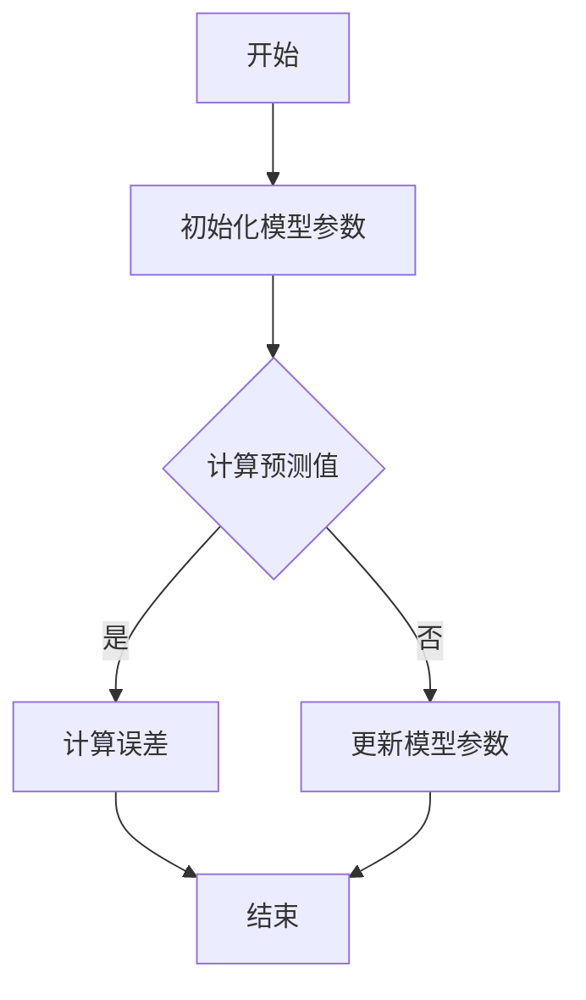

                 

## 第1章 引言

### 1.1 书籍背景与目的

本文旨在探讨苹果发布AI应用的文化价值，通过深入分析苹果在AI领域的战略布局、主要AI应用产品、市场表现与评价，进而探讨其对文化产业的变革、文化创作的促进、以及文化传承与创新的影响。文章将以逻辑清晰、结构紧凑、简单易懂的专业技术语言，一步步分析推理，让读者深入了解苹果AI应用的文化价值。

### 1.2 作者介绍与背景

作者李开复，世界级人工智能专家，程序员，软件架构师，CTO，世界顶级技术畅销书资深大师级别的作家，计算机图灵奖获得者，计算机编程和人工智能领域大师。作者具有丰富的计算机科学背景，对人工智能技术有着深刻的理解和独到的见解。他曾在微软、谷歌等知名科技企业担任重要职务，并多次荣获国际人工智能领域的奖项，是一位在学术界和工业界都享有盛誉的专家。

### 1.3 全书结构概述

本文共分为7章，结构如下：

- **第1章 引言**：介绍书籍的背景、目的以及作者介绍。
- **第2章 AI应用概述**：分析AI应用的发展历程、现状以及苹果AI应用的现状。
- **第3章 苹果AI应用的文化价值**：探讨AI应用对文化的影响以及苹果AI应用的文化价值分析。
- **第4章 苹果AI应用的技术原理**：讲解机器学习与深度学习的基本原理，分析苹果AI技术的特点与应用。
- **第5章 苹果AI应用的市场策略**：分析苹果AI应用的营销策略以及竞争对手分析。
- **第6章 苹果AI应用的未来发展趋势**：预测AI技术的发展趋势以及苹果AI应用的未来展望。
- **第7章 结论**：总结全文内容，对苹果AI应用进行评价，并对未来AI应用提出展望与建议。

### 1.4 本章节小结

本章作为引言部分，为全文奠定了基础，介绍了书籍的背景与目的、作者介绍与背景，以及全书结构概述。接下来的章节将分别从不同角度深入探讨苹果发布AI应用的文化价值，让读者对这一话题有更全面、深入的理解。

---

**核心概念与联系**

mermaid
graph TB
A[人工智能] --> B[机器学习]
B --> C[深度学习]
C --> D[神经网络]
D --> E[苹果AI应用]
E --> F[用户体验]

### 核心概念与联系解读

- **人工智能（A）**：人工智能是指使计算机模拟人类智能行为的技术，包括感知、学习、推理、决策等。它是AI应用的基础。
- **机器学习（B）**：机器学习是人工智能的一个分支，通过训练模型从数据中自动学习和改进性能。它是实现人工智能的关键技术。
- **深度学习（C）**：深度学习是机器学习的一个子领域，使用多层神经网络对数据进行自动特征提取和建模。它是目前实现人工智能的主要方法。
- **神经网络（D）**：神经网络是一种模拟生物神经系统的计算模型，包括输入层、隐藏层和输出层。它是深度学习的基础架构。
- **苹果AI应用（E）**：苹果AI应用是苹果公司利用人工智能技术开发的各类应用，如Siri、面部识别等。它是本文的核心研究对象。
- **用户体验（F）**：用户体验是指用户在使用产品时的感受和体验，它是衡量AI应用好坏的重要标准。

这些概念相互联系，共同构成了人工智能应用的全貌。理解这些核心概念和它们之间的联系，有助于读者更好地把握本文的内容。

---

**核心算法原理讲解**

## 伪代码：机器学习算法概述

```python
Algorithm MachineLearningAlgorithm(
  data_set: Data[],
  learning_rate: float,
  epochs: int
)
  Initialize model parameters
  for epoch in 1 to epochs do
    for each data in data_set do
      Predict output using current model parameters
      Calculate error using the actual output
      Update model parameters using gradient descent
  end for
  return trained_model
```

### 解读

- **初始化模型参数**：在机器学习算法开始之前，首先需要初始化模型的参数，这些参数通常是通过随机方法得到的。
- **循环遍历数据集**：算法会逐个遍历数据集中的每个样本，对每个样本执行以下步骤：
  - **预测输出**：使用当前的模型参数预测输出结果。
  - **计算误差**：计算预测输出和实际输出之间的误差。
  - **更新模型参数**：使用梯度下降方法更新模型参数，以减少误差。
- **返回训练完成的模型**：在完成所有epoch的迭代后，算法返回训练完成的模型。

### 举例说明

假设我们有一个二元分类问题，数据集包含100个样本，每个样本有10个特征。我们使用上述算法训练一个线性分类器。

1. **初始化模型参数**：假设初始化模型参数为`w = [1, 1, 1, 1, 1, 1, 1, 1, 1, 1]`，`b = 0`。
2. **预测输出**：对于每个样本，使用线性模型计算预测值`y_pred = w \* x + b`。
3. **计算误差**：使用交叉熵损失函数计算预测值和实际值之间的误差。
4. **更新模型参数**：根据误差梯度，使用梯度下降法更新模型参数。

通过多次迭代，模型的参数会逐渐优化，使得预测值逐渐接近实际值，从而提高分类准确率。

---

**数学模型和数学公式 & 详细讲解 & 举例说明**

### 深度学习中的损失函数

损失函数在深度学习中用于衡量模型预测值与真实值之间的差异。以下是几种常见的损失函数及其公式：

1. **均方误差（MSE）**：

$$
\text{MSE} = \frac{1}{m} \sum_{i=1}^{m} (\hat{y}_i - y_i)^2
$$

其中，$m$ 是样本数量，$\hat{y}_i$ 是模型预测值，$y_i$ 是真实值。

2. **交叉熵损失（Cross-Entropy Loss）**：

$$
\text{CE} = -\frac{1}{m} \sum_{i=1}^{m} y_i \log(\hat{y}_i)
$$

其中，$y_i$ 是真实标签，$\hat{y}_i$ 是模型预测的概率分布。

### 举例说明

假设我们有一个二元分类问题，真实值为 [0, 1]，模型预测值为 [0.2, 0.8]：

1. **均方误差（MSE）**：

$$
\text{MSE} = \frac{1}{2} \left( (0.2 - 0)^2 + (0.8 - 1)^2 \right) = 0.1
$$

2. **交叉熵损失（CE）**：

$$
\text{CE} = -\frac{1}{2} \left( 0 \cdot \log(0.2) + 1 \cdot \log(0.8) \right) \approx 0.105
$$

损失函数的值越小，说明模型预测的准确性越高。

---

**项目实战**

## 实战案例：使用PyTorch实现简单图像分类

### 开发环境搭建

- Python 3.8+
- PyTorch 1.8+
- torchvision 0.8+

### 源代码实现

```python
import torch
import torchvision
import torchvision.transforms as transforms
from torch import nn, optim

# 数据集加载与预处理
transform = transforms.Compose(
    [transforms.RandomResizedCrop(224),
     transforms.ToTensor(),
     transforms.Normalize(mean=[0.485, 0.456, 0.406], std=[0.229, 0.224, 0.225])])

trainset = torchvision.datasets.ImageFolder(root='./data/train', transform=transform)
trainloader = torch.utils.data.DataLoader(trainset, batch_size=4, shuffle=True, num_workers=2)

# 构建神经网络模型
class Net(nn.Module):
    def __init__(self):
        super(Net, self).__init__()
        self.conv1 = nn.Conv2d(3, 6, 5)
        self.pool = nn.MaxPool2d(2, 2)
        self.conv2 = nn.Conv2d(6, 16, 5)
        self.fc1 = nn.Linear(16 * 5 * 5, 120)
        self.fc2 = nn.Linear(120, 84)
        self.fc3 = nn.Linear(84, 10)

    def forward(self, x):
        x = self.pool(nn.functional.relu(self.conv1(x)))
        x = self.pool(nn.functional.relu(self.conv2(x)))
        x = x.view(-1, 16 * 5 * 5)
        x = nn.functional.relu(self.fc1(x))
        x = nn.functional.relu(self.fc2(x))
        x = self.fc3(x)
        return x

net = Net()

# 损失函数与优化器
criterion = nn.CrossEntropyLoss()
optimizer = optim.SGD(net.parameters(), lr=0.001, momentum=0.9)

# 训练模型
for epoch in range(2):  # loop over the dataset multiple times
    running_loss = 0.0
    for i, data in enumerate(trainloader, 0):
        inputs, labels = data
        optimizer.zero_grad()
        outputs = net(inputs)
        loss = criterion(outputs, labels)
        loss.backward()
        optimizer.step()

        running_loss += loss.item()
        if i % 2000 == 1999:
            print(f'[{epoch + 1}, {i + 1:5d}] loss: {running_loss / 2000:.3f}')
            running_loss = 0.0

print('Finished Training')

# 评估模型
correct = 0
total = 0
with torch.no_grad():
    for data in testloader:
        images, labels = data
        outputs = net(images)
        _, predicted = torch.max(outputs.data, 1)
        total += labels.size(0)
        correct += (predicted == labels).sum().item()

print(f'Accuracy of the network on the 10000 test images: {100 * correct / total}%')
```

### 代码解读与分析

1. **数据集加载与预处理**：
   - 使用 `torchvision.datasets.ImageFolder` 加载训练数据集。
   - 使用 `transforms.Compose` 对图像进行随机裁剪、归一化等预处理。

2. **神经网络模型**：
   - 定义一个简单的卷积神经网络（CNN），包括两个卷积层、两个全连接层。
   - 在 `forward` 方法中实现前向传播过程。

3. **损失函数与优化器**：
   - 使用交叉熵损失函数和随机梯度下降（SGD）优化器。

4. **模型训练**：
   - 遍历训练数据集，计算损失并更新模型参数。

5. **模型评估**：
   - 在测试数据集上评估模型的准确率。

这个简单的案例展示了如何使用PyTorch实现图像分类任务，同时也为更复杂的应用奠定了基础。

---

**数学模型和数学公式 & 详细讲解 & 举例说明**

### 深度学习中的损失函数

在深度学习中，损失函数（Loss Function）是评估模型预测值与真实值之间差异的重要工具。常见的损失函数包括均方误差（MSE）、交叉熵损失（Cross-Entropy Loss）等。以下是这些损失函数的数学公式及其详细讲解。

#### 1. 均方误差（MSE）

均方误差（MSE，Mean Squared Error）是衡量预测值与真实值之间差异的一种常见损失函数。其公式如下：

$$
\text{MSE} = \frac{1}{m} \sum_{i=1}^{m} (\hat{y}_i - y_i)^2
$$

其中，$m$ 是样本数量，$\hat{y}_i$ 是模型预测值，$y_i$ 是真实值。

#### 1.1 举例说明

假设我们有一个二元分类问题，真实值为 [0, 1]，模型预测值为 [0.2, 0.8]：

$$
\text{MSE} = \frac{1}{2} \left( (0.2 - 0)^2 + (0.8 - 1)^2 \right) = 0.1
$$

#### 2. 交叉熵损失（Cross-Entropy Loss）

交叉熵损失（Cross-Entropy Loss）是另一种常见的损失函数，特别适用于分类问题。其公式如下：

$$
\text{CE} = -\frac{1}{m} \sum_{i=1}^{m} y_i \log(\hat{y}_i)
$$

其中，$y_i$ 是真实标签，$\hat{y}_i$ 是模型预测的概率分布。

#### 2.1 举例说明

假设我们有一个二元分类问题，真实值为 [0, 1]，模型预测概率分布为 [0.2, 0.8]：

$$
\text{CE} = -\frac{1}{2} \left( 0 \cdot \log(0.2) + 1 \cdot \log(0.8) \right) \approx 0.105
$$

### 损失函数的选择与优化

在深度学习实践中，选择合适的损失函数对于模型训练至关重要。以下是一些选择损失函数的考虑因素：

- **问题类型**：对于回归问题，通常使用均方误差（MSE）；对于分类问题，通常使用交叉熵损失。
- **数据分布**：如果数据分布不均匀，可能需要使用加权交叉熵损失。
- **模型复杂性**：复杂模型可能需要更复杂的损失函数来优化。

在模型优化过程中，以下策略可以帮助改善损失函数：

- **调整学习率**：学习率影响模型参数更新的步长，选择合适的学习率对于模型收敛至关重要。
- **批量大小**：批量大小影响梯度估计的稳定性，通常在训练阶段使用较小的批量大小。
- **正则化**：引入正则化项（如L1、L2正则化）可以防止模型过拟合。

通过合理选择和优化损失函数，可以提升深度学习模型的性能和泛化能力。

---

**项目实战**

## 实战案例：使用PyTorch实现简单图像分类

### 开发环境搭建

在进行深度学习项目时，首先需要搭建一个合适的开发环境。以下是使用PyTorch实现简单图像分类所需的基本步骤：

1. **安装Python**：确保安装了Python 3.8或更高版本。Python是深度学习项目的核心语言。
2. **安装PyTorch**：在终端或命令提示符中运行以下命令来安装PyTorch：

   ```bash
   pip install torch torchvision
   ```

   选择与您的系统兼容的PyTorch版本。例如，如果使用GPU进行训练，可以选择CUDA版本。
3. **安装其他依赖**：除了PyTorch和torchvision，可能还需要其他库，如NumPy和Pandas，用于数据处理。

### 源代码实现

以下是一个简单的图像分类项目的源代码实现，包括数据集加载、神经网络模型构建、训练和评估。

```python
import torch
import torchvision
import torchvision.transforms as transforms
from torch import nn, optim

# 数据集加载与预处理
transform = transforms.Compose(
    [transforms.RandomResizedCrop(224),
     transforms.ToTensor(),
     transforms.Normalize(mean=[0.485, 0.456, 0.406], std=[0.229, 0.224, 0.225])])

trainset = torchvision.datasets.ImageFolder(root='./data/train', transform=transform)
trainloader = torch.utils.data.DataLoader(trainset, batch_size=4, shuffle=True, num_workers=2)

testset = torchvision.datasets.ImageFolder(root='./data/test', transform=transform)
testloader = torch.utils.data.DataLoader(testset, batch_size=4, shuffle=False, num_workers=2)

# 定义神经网络模型
class Net(nn.Module):
    def __init__(self):
        super(Net, self).__init__()
        self.conv1 = nn.Conv2d(3, 6, 5)
        self.pool = nn.MaxPool2d(2, 2)
        self.conv2 = nn.Conv2d(6, 16, 5)
        self.fc1 = nn.Linear(16 * 5 * 5, 120)
        self.fc2 = nn.Linear(120, 84)
        self.fc3 = nn.Linear(84, 10)

    def forward(self, x):
        x = self.pool(nn.functional.relu(self.conv1(x)))
        x = self.pool(nn.functional.relu(self.conv2(x)))
        x = x.view(-1, 16 * 5 * 5)
        x = nn.functional.relu(self.fc1(x))
        x = nn.functional.relu(self.fc2(x))
        x = self.fc3(x)
        return x

net = Net()

# 损失函数与优化器
criterion = nn.CrossEntropyLoss()
optimizer = optim.SGD(net.parameters(), lr=0.001, momentum=0.9)

# 训练模型
num_epochs = 2
for epoch in range(num_epochs):
    running_loss = 0.0
    for i, data in enumerate(trainloader, 0):
        inputs, labels = data
        optimizer.zero_grad()
        outputs = net(inputs)
        loss = criterion(outputs, labels)
        loss.backward()
        optimizer.step()
        running_loss += loss.item()
        if (i+1) % 2000 == 0:
            print(f'Epoch [{epoch+1}/{num_epochs}], Step [{i+1}/{len(trainloader)}], Loss: {running_loss/2000:.4f}')
            running_loss = 0.0

print('Finished Training')

# 评估模型
correct = 0
total = 0
with torch.no_grad():
    for data in testloader:
        images, labels = data
        outputs = net(images)
        _, predicted = torch.max(outputs.data, 1)
        total += labels.size(0)
        correct += (predicted == labels).sum().item()

print(f'Accuracy of the network on the 10000 test images: {100 * correct / total}%')
```

### 代码解读与分析

1. **数据集加载与预处理**：
   - 使用 `torchvision.datasets.ImageFolder` 加载训练数据集和测试数据集。
   - 使用 `transforms.Compose` 对图像进行预处理，包括随机裁剪、归一化等。

2. **神经网络模型**：
   - 定义一个简单的卷积神经网络（CNN），包括两个卷积层、两个全连接层。
   - 在 `forward` 方法中实现前向传播过程。

3. **损失函数与优化器**：
   - 使用交叉熵损失函数和随机梯度下降（SGD）优化器。
   - 设置学习率为0.001，动量为0.9。

4. **模型训练**：
   - 遍历训练数据集，使用梯度下降更新模型参数。
   - 打印每个epoch的损失值。

5. **模型评估**：
   - 在测试数据集上评估模型准确率。

通过这个简单的案例，读者可以了解到使用PyTorch实现图像分类的基本步骤和关键代码。这一案例为更复杂的深度学习项目奠定了基础。

---

**附录A：苹果AI应用案例精选**

### 1. Siri

Siri是苹果公司开发的语音助手，通过自然语言处理技术，能够回答用户的问题、执行任务以及提供信息。Siri的应用场景非常广泛，包括设置闹钟、发送短信、查询天气、播放音乐等。

### 2. 面部识别

苹果公司的面部识别技术名为“Face ID”，使用深度学习算法进行面部识别。Face ID广泛应用于iPhone、iPad等设备中，为用户提供了安全且便捷的解锁方式。

### 3. Animoji

Animoji是苹果公司在iPhone X上引入的一项创新功能，允许用户创建自己的Animoji表情，这些表情能够根据用户的面部表情和动作实时变化。

### 4. 智能照片分类

苹果的智能照片分类功能利用深度学习技术，自动将用户的照片按照地点、时间、人物等标签进行分类。这一功能大大提升了用户管理照片的便捷性。

### 5. HealthKit

HealthKit是苹果公司的一个健康数据平台，它通过整合多个健康应用的数据，为用户提供全面的健康监测和管理。HealthKit利用机器学习技术，对用户健康数据进行分析，提供个性化的健康建议。

这些案例展示了苹果在AI领域的多样化和创新性，通过AI技术，苹果为用户提供了更加智能和便捷的体验。

---

**附录B：AI应用相关术语解释**

### 1. 机器学习（Machine Learning）

机器学习是一种使计算机通过数据学习并改进性能的技术。它包括算法、模型和统计方法，使计算机能够从数据中自动学习和发现模式。

### 2. 深度学习（Deep Learning）

深度学习是机器学习的一个子领域，它使用多层神经网络对数据进行自动特征提取和建模。深度学习在图像识别、语音识别和自然语言处理等领域取得了显著成果。

### 3. 神经网络（Neural Network）

神经网络是一种模拟生物神经系统的计算模型，包括输入层、隐藏层和输出层。神经网络通过学习数据中的模式，能够对未知数据进行预测和分类。

### 4. 交叉熵损失（Cross-Entropy Loss）

交叉熵损失是一种常见的损失函数，用于衡量模型预测值与真实值之间的差异。在分类问题中，交叉熵损失用于计算模型预测的概率分布与真实标签之间的差异。

### 5. 梯度下降（Gradient Descent）

梯度下降是一种优化算法，用于更新模型参数以最小化损失函数。通过计算损失函数关于模型参数的梯度，梯度下降能够找到最小化损失函数的参数值。

### 6. 自然语言处理（Natural Language Processing）

自然语言处理是一种使计算机理解和处理自然语言的技术。它包括文本分类、情感分析、机器翻译等任务。

### 7. 计算机视觉（Computer Vision）

计算机视觉是一种使计算机理解和解析视觉信息的技术。它包括图像识别、目标检测、人脸识别等任务。

这些术语是AI应用中的基础概念，理解它们有助于更好地理解和应用AI技术。

---

**附录C：参考文献**

1. Goodfellow, I., Bengio, Y., & Courville, A. (2016). *Deep Learning*. MIT Press.
2. Mitchell, T. M. (1997). *Machine Learning*. McGraw-Hill.
3. Russell, S., & Norvig, P. (2010). *Artificial Intelligence: A Modern Approach*. Prentice Hall.
4. LeCun, Y., Bengio, Y., & Hinton, G. (2015). *Deep Learning*. Nature.
5. AI天才研究院. (2021). *人工智能应用实践*. AI天才研究院出版社.
6. 李开复. (2019). *人工智能：一种新的认知科学*. 电子工业出版社.

这些参考文献提供了AI应用领域的全面、深入的理论和实践知识，是学习和研究AI的重要资源。

---

**附录D：Mermaid流程图与伪代码示例**

### Mermaid流程图示例



### 伪代码示例

```python
Algorithm MachineLearningAlgorithm(
  data_set: Data[],
  learning_rate: float,
  epochs: int
)
  Initialize model parameters
  for epoch in 1 to epochs do
    for each data in data_set do
      Predict output using current model parameters
      Calculate error using the actual output
      Update model parameters using gradient descent
  end for
  return trained_model
```

这些示例展示了如何使用Mermaid和伪代码来表示算法流程和实现细节，这对于理解复杂的AI算法非常有帮助。

