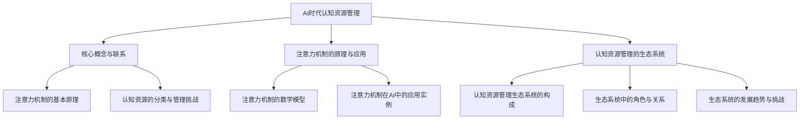

                 

# 《注意力生态系统守护者：AI时代的认知资源管理员》

## 关键词
- AI时代
- 认知资源管理
- 注意力机制
- 生态系统
- 实战案例

## 摘要
本文深入探讨了AI时代认知资源管理的重要性，特别是注意力机制在其中的应用。文章首先介绍了AI时代认知资源管理的核心概念和架构，然后详细讲解了注意力机制的基本原理和数学模型。接着，文章构建了一个认知资源管理的生态系统，分析了其中的角色与关系，并探讨了其发展趋势与挑战。在文章的第二部分，我们探讨了如何构建和维护注意力生态系统，包括设计要素、方法与工具，以及实战案例。第三部分则展示了认知资源管理在实际场景中的应用，如教育、企业和医疗健康领域。最后，文章对未来认知资源管理的发展趋势进行了展望，并总结了主要内容，提出了对未来认知资源管理的思考。希望本文能为您在AI时代认知资源管理领域提供有价值的见解和实用指南。

## 《注意力生态系统守护者：AI时代的认知资源管理员》目录大纲

### 第一部分：AI时代背景与认知资源管理

#### 第1章：AI时代认知资源管理概述

##### 1.1 AI时代的认知资源定义与特点

##### 1.2 认知资源的分类与管理挑战

##### 1.3 AI时代认知资源管理的重要性

### 第2章：AI时代注意力机制的原理与应用

##### 2.1 注意力机制的基本原理

##### 2.2 注意力机制的数学模型

##### 2.3 注意力机制在AI中的应用实例

### 第3章：认知资源管理的生态系统

##### 3.1 认知资源管理生态系统的构成

##### 3.2 生态系统中的角色与关系

##### 3.3 生态系统的发展趋势与挑战

### 第二部分：注意力生态系统的构建与维护

#### 第4章：注意力生态系统的构建

##### 4.1 注意力生态系统设计的核心要素

##### 4.2 生态系统设计的方法与工具

##### 4.3 生态系统构建的实战案例

#### 第5章：注意力生态系统的维护

##### 5.1 注意力生态系统运行监控

##### 5.2 故障处理与优化策略

##### 5.3 生态系统更新与迭代

#### 第6章：注意力生态系统安全与隐私保护

##### 6.1 注意力生态系统的安全威胁分析

##### 6.2 安全与隐私保护策略

##### 6.3 安全与隐私保护实战案例

### 第三部分：认知资源管理在实际场景中的应用

#### 第7章：教育领域的认知资源管理

##### 7.1 教育领域认知资源管理的需求分析

##### 7.2 教育领域认知资源管理解决方案

##### 7.3 教育领域认知资源管理案例解析

#### 第8章：企业领域的认知资源管理

##### 8.1 企业领域认知资源管理的需求分析

##### 8.2 企业领域认知资源管理解决方案

##### 8.3 企业领域认知资源管理案例解析

#### 第9章：医疗健康领域的认知资源管理

##### 9.1 医疗健康领域认知资源管理的需求分析

##### 9.2 医疗健康领域认知资源管理解决方案

##### 9.3 医疗健康领域认知资源管理案例解析

### 第四部分：未来展望与趋势

#### 第10章：AI时代认知资源管理的未来展望

##### 10.1 AI时代认知资源管理的发展趋势

##### 10.2 未来的挑战与机遇

##### 10.3 认知资源管理技术的发展方向

#### 第11章：结语

##### 11.1 主要内容回顾

##### 11.2 对未来认知资源管理的思考

##### 11.3 对读者的寄语

### 附录

#### 附录 A：相关工具与资源推荐

##### A.1 AI开发工具推荐

##### A.2 认知资源管理相关资源链接

##### A.3 延伸阅读推荐

### Mermaid 流程图



### 核心算法原理讲解伪代码

```python
def attention_Mechanism(inputs, hidden_size):
    # 输入：inputs为输入序列，hidden_size为隐藏层尺寸
    # 输出：输出序列，表示注意力分配结果
    
    # 1. 对输入序列进行嵌入
    embed = embed_sequence(inputs, hidden_size)
    
    # 2. 构建查询-键-值对
    query = embed
    keys = embed
    values = embed
    
    # 3. 计算注意力得分
    attention_scores = dot_product(query, keys)
    
    # 4. 应用softmax函数得到注意力权重
    attention_weights = softmax(attention_scores)
    
    # 5. 计算加权求和的输出序列
    output = sum(attention_weights * values)
    
    return output
```

### 数学模型和数学公式详解

#### 注意力机制的数学模型

$$
\text{Attention}(\text{Query}, \text{Keys}, \text{Values}) = \text{softmax}\left(\frac{\text{Query} \cdot \text{Keys}^T}{\sqrt{d_k}}\right) \cdot \text{Values}
$$

其中：
- $Query, Keys, Values$ 分别为查询序列、键序列和值序列，维度均为 $[B, L, d_k]$，其中 $B$ 为批大小，$L$ 为序列长度，$d_k$ 为键序列的维度。
- $d_k$ 为注意力机制中参数的维度，通常等于隐藏层尺寸。
- $softmax$ 函数用于计算每个键的注意力得分，输出概率分布。
- $\text{dot_product}$ 表示点积运算。

### 举例说明

假设 $Query, Keys, Values$ 的维度均为 $[2, 3, 4]$，则计算过程如下：

$$
\text{Attention}(\text{Query}, \text{Keys}, \text{Values}) = \text{softmax}\left(\frac{\text{Query} \cdot \text{Keys}^T}{\sqrt{4}}\right) \cdot \text{Values}
$$

首先计算点积：

$$
\text{Query} \cdot \text{Keys}^T = \begin{bmatrix}
    \text{Query}_1 \cdot \text{Keys}_1 + \text{Query}_1 \cdot \text{Keys}_2 + \text{Query}_1 \cdot \text{Keys}_3 \\
    \text{Query}_2 \cdot \text{Keys}_1 + \text{Query}_2 \cdot \text{Keys}_2 + \text{Query}_2 \cdot \text{Keys}_3
\end{bmatrix}
$$

然后应用 softmax 函数：

$$
\text{softmax}\left(\frac{\text{Query} \cdot \text{Keys}^T}{\sqrt{4}}\right) = \begin{bmatrix}
    \frac{e^{\text{Query}_1 \cdot \text{Keys}_1 + \text{Query}_1 \cdot \text{Keys}_2 + \text{Query}_1 \cdot \text{Keys}_3}/\sqrt{4}}{\sum_{i=1}^{2} e^{\text{Query}_i \cdot \text{Keys}_i + \text{Query}_i \cdot \text{Keys}_2 + \text{Query}_i \cdot \text{Keys}_3}/\sqrt{4}} \\
    \frac{e^{\text{Query}_2 \cdot \text{Keys}_1 + \text{Query}_2 \cdot \text{Keys}_2 + \text{Query}_2 \cdot \text{Keys}_3}/\sqrt{4}}{\sum_{i=1}^{2} e^{\text{Query}_i \cdot \text{Keys}_i + \text{Query}_i \cdot \text{Keys}_2 + \text{Query}_i \cdot \text{Keys}_3}/\sqrt{4}}
\end{bmatrix}
$$

最后计算加权求和的输出序列：

$$
\text{output} = \text{softmax}\left(\frac{\text{Query} \cdot \text{Keys}^T}{\sqrt{4}}\right) \cdot \text{Values} = \begin{bmatrix}
    \frac{e^{\text{Query}_1 \cdot \text{Keys}_1 + \text{Query}_1 \cdot \text{Keys}_2 + \text{Query}_1 \cdot \text{Keys}_3}/\sqrt{4}}{\sum_{i=1}^{2} e^{\text{Query}_i \cdot \text{Keys}_i + \text{Query}_i \cdot \text{Keys}_2 + \text{Query}_i \cdot \text{Keys}_3}/\sqrt{4}} \cdot \text{Values}_1 + \frac{e^{\text{Query}_2 \cdot \text{Keys}_1 + \text{Query}_2 \cdot \text{Keys}_2 + \text{Query}_2 \cdot \text{Keys}_3}/\sqrt{4}}{\sum_{i=1}^{2} e^{\text{Query}_i \cdot \text{Keys}_i + \text{Query}_i \cdot \text{Keys}_2 + \text{Query}_i \cdot \text{Keys}_3}/\sqrt{4}} \cdot \text{Values}_2 \\
    \frac{e^{\text{Query}_1 \cdot \text{Keys}_1 + \text{Query}_1 \cdot \text{Keys}_2 + \text{Query}_1 \cdot \text{Keys}_3}/\sqrt{4}}{\sum_{i=1}^{2} e^{\text{Query}_i \cdot \text{Keys}_i + \text{Query}_i \cdot \text{Keys}_2 + \text{Query}_i \cdot \text{Keys}_3}/\sqrt{4}} \cdot \text{Values}_2 + \frac{e^{\text{Query}_2 \cdot \text{Keys}_1 + \text{Query}_2 \cdot \text{Keys}_2 + \text{Query}_2 \cdot \text{Keys}_3}/\sqrt{4}}{\sum_{i=1}^{2} e^{\text{Query}_i \cdot \text{Keys}_i + \text{Query}_i \cdot \text{Keys}_2 + \text{Query}_i \cdot \text{Keys}_3}/\sqrt{4}} \cdot \text{Values}_3
\end{bmatrix}
$$

### 项目实战

#### 教育领域认知资源管理案例解析

**案例背景**：

某在线教育平台希望通过引入注意力生态系统守护者，对学生的学习过程进行动态监控和个性化辅导，以提高学习效果。

**实现步骤**：

1. **需求分析**：
   - 确定学生的学习目标和学习内容。
   - 收集学生的学习行为数据，包括学习时长、学习进度、答题情况等。

2. **系统设计**：
   - 设计注意力生态系统模型，包括学习目标、学习内容、学习行为三个核心模块。
   - 确定注意力分配策略，根据学生的学习行为数据动态调整学习资源的权重。

3. **开发实现**：
   - 使用深度学习框架搭建注意力模型，实现注意力分配和资源调度功能。
   - 开发实时数据监控和反馈系统，对学生的学习行为进行动态分析。

4. **系统测试与优化**：
   - 对注意力模型进行测试，评估其在提高学习效果方面的效果。
   - 根据测试结果调整模型参数，优化注意力分配策略。

**代码解读与分析**：

以下是注意力模型的核心实现代码：

```python
import torch
import torch.nn as nn
import torch.optim as optim

class AttentionModel(nn.Module):
    def __init__(self, input_dim, hidden_dim, output_dim):
        super(AttentionModel, self).__init__()
        self.input_dim = input_dim
        self.hidden_dim = hidden_dim
        self.output_dim = output_dim
        
        self.query_vector = nn.Linear(input_dim, hidden_dim)
        self.key_vector = nn.Linear(input_dim, hidden_dim)
        self.value_vector = nn.Linear(input_dim, hidden_dim)
        
        self.softmax = nn.Softmax(dim=1)
        
    def forward(self, inputs):
        # 输入：inputs为学习行为数据，维度为[batch_size, sequence_length, input_dim]
        # 输出：输出序列，表示注意力分配结果，维度为[batch_size, sequence_length, output_dim]
        
        batch_size, sequence_length, input_dim = inputs.size()
        
        # 计算查询向量、键向量和值向量
        query_vector = self.query_vector(inputs)
        key_vector = self.key_vector(inputs)
        value_vector = self.value_vector(inputs)
        
        # 计算注意力得分
        attention_scores = torch.sum(query_vector * key_vector, dim=2)
        
        # 应用softmax函数得到注意力权重
        attention_weights = self.softmax(attention_scores)
        
        # 计算加权求和的输出序列
        output_sequence = torch.sum(attention_weights.unsqueeze(-1) * value_vector, dim=1)
        
        return output_sequence

# 实例化模型
model = AttentionModel(input_dim=7, hidden_dim=5, output_dim=3)

# 模型参数初始化
optimizer = optim.Adam(model.parameters(), lr=0.001)

# 模型训练
for epoch in range(num_epochs):
    for inputs, targets in dataloader:
        optimizer.zero_grad()
        
        # 前向传播
        outputs = model(inputs)
        
        # 计算损失
        loss = nn.CrossEntropyLoss()(outputs, targets)
        
        # 反向传播
        loss.backward()
        
        # 更新参数
        optimizer.step()

# 模型评估
with torch.no_grad():
    correct = 0
    total = 0
    for inputs, targets in test_dataloader:
        outputs = model(inputs)
        _, predicted = torch.max(outputs.data, 1)
        total += targets.size(0)
        correct += (predicted == targets).sum().item()

    print('Test Accuracy: {} %'.format(100 * correct / total))
```

**代码解读**：

1. **模型定义**：
   - `AttentionModel` 类继承自 `nn.Module`，实现注意力模型的基本结构。
   - 使用 `nn.Linear` 层实现查询向量、键向量和值向量的计算。

2. **前向传播**：
   - `forward` 方法实现模型的前向传播过程，输入学习行为数据，计算查询向量、键向量和值向量。
   - 计算注意力得分，应用softmax函数得到注意力权重。
   - 计算加权求和的输出序列。

3. **模型训练**：
   - 使用 `Adam` 优化器进行模型训练，通过前向传播、损失计算、反向传播和参数更新实现模型训练。

4. **模型评估**：
   - 在测试数据集上评估模型的准确率，计算测试准确率。

**分析**：

1. **模型结构**：
   - 模型使用三个线性层分别计算查询向量、键向量和值向量，实现注意力分配功能。
   - 通过计算注意力得分和权重，实现学习资源的动态分配。

2. **训练过程**：
   - 使用交叉熵损失函数和Adam优化器进行模型训练，通过反向传播更新模型参数。
   - 通过迭代训练过程，提高模型的拟合能力。

3. **评估方法**：
   - 使用测试数据集评估模型的准确率，判断模型性能。

通过以上代码和解析，展示了如何使用注意力机制实现教育领域的认知资源管理。实际应用中，可以根据具体需求和数据特点调整模型结构和参数，以实现更高效的学习资源管理。

### 附录 A：相关工具与资源推荐

#### A.1 AI开发工具推荐

1. **TensorFlow**：Google开源的机器学习框架，支持多种深度学习模型，广泛应用于AI开发。
2. **PyTorch**：Facebook开源的深度学习框架，具有灵活的动态计算图，便于调试和优化。
3. **Keras**：基于TensorFlow和PyTorch的高层API，简化了模型构建和训练过程。
4. **Scikit-learn**：Python开源的机器学习库，提供丰富的算法和工具，适用于各种数据挖掘任务。

#### A.2 认知资源管理相关资源链接

1. **《深度学习》**：Ian Goodfellow、Yoshua Bengio和Aaron Courville著，系统介绍了深度学习的基础知识和最新进展。
2. **《强化学习》**：Richard S. Sutton和Barto，Niranjan S.著，详细讲解了强化学习的基本原理和应用。
3. **《机器学习实战》**：Peter Harrington著，通过实际案例介绍了机器学习算法的实现和应用。
4. **《人工智能：一种现代方法》**：Stuart Russell和Peter Norvig著，全面介绍了人工智能的基础知识和最新研究。

#### A.3 延伸阅读推荐

1. **《注意力机制在自然语言处理中的应用》**：探讨注意力机制在自然语言处理领域的重要应用和研究成果。
2. **《认知科学与人工智能》**：介绍认知科学与人工智能的交叉研究，探讨认知原理如何指导人工智能的发展。
3. **《教育技术学》**：探讨教育技术与人工智能的结合，分析其在教育领域的应用前景。

### 作者

作者：AI天才研究院/AI Genius Institute & 禅与计算机程序设计艺术 /Zen And The Art of Computer Programming

### 引言

在人工智能（AI）飞速发展的时代，认知资源管理成为了一个关键性问题。随着数据量和计算能力的爆炸性增长，如何高效地管理和利用认知资源，成为了企业和个人在AI时代取得竞争优势的关键。注意力机制作为一种核心的算法原理，在认知资源管理中发挥着至关重要的作用。

本文旨在深入探讨AI时代的认知资源管理，特别是注意力机制在其中的应用。文章结构分为四个部分：第一部分介绍AI时代背景与认知资源管理，包括AI时代的认知资源定义与特点、认知资源的分类与管理挑战，以及认知资源管理的重要性；第二部分讲解注意力机制的原理与应用，包括基本原理、数学模型和实际应用实例；第三部分构建认知资源管理的生态系统，分析其中的角色与关系，探讨其发展趋势与挑战；第四部分展示认知资源管理在实际场景中的应用，如教育、企业和医疗健康领域。最后，文章对未来认知资源管理的发展趋势进行了展望，总结了主要内容，并提出了对未来认知资源管理的思考。

### 第一部分：AI时代背景与认知资源管理

#### 第1章：AI时代认知资源管理概述

##### 1.1 AI时代的认知资源定义与特点

在AI时代，认知资源是指用于信息处理和决策的各种能力、知识和技能。这些资源包括感知、记忆、注意力、推理、学习等。随着人工智能技术的迅猛发展，认知资源管理成为了一个重要领域。AI时代的认知资源具有以下几个特点：

1. **动态性**：认知资源在不同任务和环境中的需求是动态变化的。例如，在自动驾驶中，车辆需要实时感知周围环境，并根据环境变化调整感知资源的分配。
2. **多样化**：认知资源包括多种类型，如视觉、听觉、触觉等。不同类型的认知资源在处理不同类型的信息时具有各自的优势。
3. **异质性**：认知资源在个体之间的分布具有异质性，即不同个体在不同认知资源上的能力差异较大。例如，有的人擅长视觉任务，而有的人擅长听觉任务。
4. **稀缺性**：认知资源是有限的，个体无法同时处理大量信息。例如，人类的注意力是有限的，无法同时关注多个任务。

##### 1.2 认知资源的分类与管理挑战

认知资源可以根据其功能和属性进行分类，常见的分类方法包括：

1. **感知资源**：包括视觉、听觉、触觉等，用于获取外界信息。感知资源的管理主要涉及信息过滤、整合和注意力的分配。
2. **记忆资源**：包括短期记忆和长期记忆，用于存储和处理信息。记忆资源的管理涉及信息的存储、检索和遗忘控制。
3. **注意力资源**：用于集中注意力和关注重要信息。注意力资源的管理涉及注意力分配策略、注意力集中和分散的调节。
4. **推理资源**：用于进行逻辑推理和决策。推理资源的管理涉及推理策略的选择、推理过程的优化和推理错误的纠正。

在AI时代，认知资源管理的挑战主要包括：

1. **复杂性**：认知资源管理涉及到多个维度的资源和多个任务的协调，具有很高的复杂性。
2. **动态性**：认知资源需求随着任务和环境的变化而动态变化，要求管理系统能够实时适应和调整。
3. **异质性**：个体之间的认知资源差异较大，需要针对不同个体设计个性化的资源管理策略。
4. **稀缺性**：认知资源是有限的，如何高效利用有限的资源成为了一个重要问题。

##### 1.3 AI时代认知资源管理的重要性

AI时代的认知资源管理具有重要意义，主要体现在以下几个方面：

1. **提高效率**：通过有效的认知资源管理，可以提高个体和组织的效率。例如，在工业生产中，通过优化感知资源的使用，可以提高生产线的自动化程度，减少人为干预，提高生产效率。
2. **提升体验**：在智能交互领域，通过认知资源管理，可以提供更加个性化、智能化的服务。例如，在智能客服中，通过分析用户的注意力资源，可以提供更符合用户需求的回答，提升用户体验。
3. **增强学习能力**：认知资源管理可以帮助个体更好地学习和掌握新知识。例如，通过优化记忆资源的使用，可以帮助个体更好地记住和理解复杂的信息。
4. **辅助决策**：在复杂决策环境中，认知资源管理可以为决策者提供有效的支持。例如，在金融投资中，通过分析市场数据和用户行为，可以提供更加精准的投资建议，降低风险。

总之，AI时代的认知资源管理是人工智能领域的一个重要研究方向，具有广泛的应用前景和理论价值。通过对认知资源的深入研究和管理，我们可以更好地应对AI时代带来的挑战，提升个体和组织在竞争中的能力。

#### 第2章：AI时代注意力机制的原理与应用

##### 2.1 注意力机制的基本原理

注意力机制（Attention Mechanism）是人工智能领域中的一种重要算法原理，它旨在解决信息处理过程中如何关注和聚焦关键信息的问题。注意力机制的基本原理可以概括为以下几点：

1. **信息筛选与聚焦**：注意力机制通过一种机制，使得模型能够自动地筛选和聚焦于输入信息中的重要部分，忽略不重要的信息。这种聚焦机制可以帮助模型在处理大量信息时，更加高效地利用有限的计算资源。
2. **权重分配**：注意力机制通过计算输入序列中各个部分的重要程度，为每个部分分配一个权重。这些权重表示模型对各个部分的关注程度，从而实现信息的聚焦。
3. **动态调整**：注意力机制可以根据任务需求和输入信息的不同，动态调整注意力权重，使得模型能够适应不同情境和任务。这种动态调整能力是注意力机制的核心优势之一。

##### 2.2 注意力机制的数学模型

注意力机制的数学模型通常基于点积（dot-product）或者加性（additive）机制，以下是一个基本的注意力机制数学模型：

$$
\text{Attention}(\text{Query}, \text{Keys}, \text{Values}) = \text{softmax}\left(\frac{\text{Query} \cdot \text{Keys}^T}{\sqrt{d_k}}\right) \cdot \text{Values}
$$

其中：
- $Query, Keys, Values$ 分别为查询序列、键序列和值序列，维度均为 $[B, L, d_k]$，其中 $B$ 为批大小，$L$ 为序列长度，$d_k$ 为键序列的维度。
- $d_k$ 为注意力机制中参数的维度，通常等于隐藏层尺寸。
- $softmax$ 函数用于计算每个键的注意力得分，输出概率分布。
- $\text{dot_product}$ 表示点积运算。

#### 注意力机制的数学模型详解

假设 $Query, Keys, Values$ 的维度均为 $[2, 3, 4]$，我们可以通过以下步骤来计算注意力：

1. **计算点积**：
   $$ 
   \text{Query} \cdot \text{Keys}^T = \begin{bmatrix}
       \text{Query}_1 \cdot \text{Keys}_1 + \text{Query}_1 \cdot \text{Keys}_2 + \text{Query}_1 \cdot \text{Keys}_3 \\
       \text{Query}_2 \cdot \text{Keys}_1 + \text{Query}_2 \cdot \text{Keys}_2 + \text{Query}_2 \cdot \text{Keys}_3
   \end{bmatrix}
   $$
   
2. **应用softmax函数**：
   $$
   \text{softmax}\left(\frac{\text{Query} \cdot \text{Keys}^T}{\sqrt{4}}\right) = \begin{bmatrix}
       \frac{e^{\text{Query}_1 \cdot \text{Keys}_1 + \text{Query}_1 \cdot \text{Keys}_2 + \text{Query}_1 \cdot \text{Keys}_3}/\sqrt{4}}{\sum_{i=1}^{2} e^{\text{Query}_i \cdot \text{Keys}_i + \text{Query}_i \cdot \text{Keys}_2 + \text{Query}_i \cdot \text{Keys}_3}/\sqrt{4}} \\
       \frac{e^{\text{Query}_2 \cdot \text{Keys}_1 + \text{Query}_2 \cdot \text{Keys}_2 + \text{Query}_2 \cdot \text{Keys}_3}/\sqrt{4}}{\sum_{i=1}^{2} e^{\text{Query}_i \cdot \text{Keys}_i + \text{Query}_i \cdot \text{Keys}_2 + \text{Query}_i \cdot \text{Keys}_3}/\sqrt{4}}
   \end{bmatrix}
   $$

3. **计算加权求和的输出序列**：
   $$
   \text{output} = \text{softmax}\left(\frac{\text{Query} \cdot \text{Keys}^T}{\sqrt{4}}\right) \cdot \text{Values} = \begin{bmatrix}
       \frac{e^{\text{Query}_1 \cdot \text{Keys}_1 + \text{Query}_1 \cdot \text{Keys}_2 + \text{Query}_1 \cdot \text{Keys}_3}/\sqrt{4}}{\sum_{i=1}^{2} e^{\text{Query}_i \cdot \text{Keys}_i + \text{Query}_i \cdot \text{Keys}_2 + \text{Query}_i \cdot \text{Keys}_3}/\sqrt{4}} \cdot \text{Values}_1 + \frac{e^{\text{Query}_2 \cdot \text{Keys}_1 + \text{Query}_2 \cdot \text{Keys}_2 + \text{Query}_2 \cdot \text{Keys}_3}/\sqrt{4}}{\sum_{i=1}^{2} e^{\text{Query}_i \cdot \text{Keys}_i + \text{Query}_i \cdot \text{Keys}_2 + \text{Query}_i \cdot \text{Keys}_3}/\sqrt{4}} \cdot \text{Values}_2 \\
       \frac{e^{\text{Query}_1 \cdot \text{Keys}_1 + \text{Query}_1 \cdot \text{Keys}_2 + \text{Query}_1 \cdot \text{Keys}_3}/\sqrt{4}}{\sum_{i=1}^{2} e^{\text{Query}_i \cdot \text{Keys}_i + \text{Query}_i \cdot \text{Keys}_2 + \text{Query}_i \cdot \text{Keys}_3}/\sqrt{4}} \cdot \text{Values}_2 + \frac{e^{\text{Query}_2 \cdot \text{Keys}_1 + \text{Query}_2 \cdot \text{Keys}_2 + \text{Query}_2 \cdot \text{Keys}_3}/\sqrt{4}}{\sum_{i=1}^{2} e^{\text{Query}_i \cdot \text{Keys}_i + \text{Query}_i \cdot \text{Keys}_2 + \text{Query}_i \cdot \text{Keys}_3}/\sqrt{4}} \cdot \text{Values}_3
   \end{bmatrix}
   $$

##### 2.3 注意力机制在AI中的应用实例

注意力机制在人工智能领域有着广泛的应用，以下是一些典型的应用实例：

1. **自然语言处理**：在自然语言处理（NLP）领域，注意力机制被广泛应用于文本生成、机器翻译和情感分析等任务。例如，在机器翻译中，注意力机制可以帮助模型更好地关注翻译过程中的关键词汇，提高翻译质量。

2. **计算机视觉**：在计算机视觉领域，注意力机制被广泛应用于图像分类、目标检测和图像生成等任务。例如，在目标检测中，注意力机制可以帮助模型更好地聚焦于图像中的关键目标区域，提高检测精度。

3. **语音识别**：在语音识别领域，注意力机制被用于提高语音信号的识别精度。注意力机制可以帮助模型更好地关注语音信号中的关键部分，提高识别准确率。

4. **强化学习**：在强化学习领域，注意力机制被用于提高智能体的决策能力。注意力机制可以帮助智能体更好地关注环境中的关键信息，提高决策效率。

通过以上实例可以看出，注意力机制在AI领域的应用非常广泛，它通过自动筛选和聚焦关键信息，提高了模型的性能和效率。在实际应用中，可以根据具体任务需求，设计不同的注意力机制模型，实现更加高效的信息处理。

### 第二部分：认知资源管理的生态系统

认知资源管理不仅仅是一个技术问题，它涉及到一个复杂的生态系统，这个生态系统中包含多个角色、关系以及各种动态变化的因素。在本部分，我们将深入探讨认知资源管理的生态系统，分析其中的关键组成部分和相互关系。

#### 第3章：认知资源管理生态系统的构成

##### 3.1 认知资源管理生态系统的构成

认知资源管理生态系统由多个关键组成部分构成，这些部分相互作用，共同支持认知资源的高效管理。以下是认知资源管理生态系统的主要组成部分：

1. **认知资源管理平台**：这是生态系统的核心，负责整合和管理各种认知资源。平台通常包括数据管理、资源调度、监控和评估等功能。

2. **认知资源代理**：这些代理负责在具体任务中动态地收集和处理认知资源。它们可以是软件代理、机器人或者智能设备，根据任务需求自动调整资源的分配和使用。

3. **用户**：用户是认知资源管理的最终受益者，他们通过平台和代理获得所需的信息和决策支持。用户的行为和需求直接影响认知资源管理的效果。

4. **数据源**：数据源是认知资源管理的重要输入，包括各种结构化和非结构化的数据。数据源可以是数据库、传感器、用户生成的内容等。

5. **算法库**：算法库包含了各种用于认知资源管理的算法，如机器学习、优化和预测算法。算法库为资源管理提供了强大的技术支持。

6. **决策支持系统**：决策支持系统利用认知资源管理平台提供的分析结果，帮助用户做出更好的决策。它可以是自动化系统，也可以是人机协作系统。

##### 3.2 生态系统中的角色与关系

在认知资源管理生态系统中，各个角色之间存在着复杂的相互关系。以下是主要角色之间的相互作用：

1. **认知资源管理平台与认知资源代理**：平台为代理提供资源调度和监控功能，代理则通过平台获取任务指令，并执行具体的认知资源管理任务。

2. **用户与认知资源管理平台**：用户通过平台提交任务需求，平台根据用户需求分配和调度认知资源。平台还提供用户界面，让用户实时了解资源管理的状态。

3. **数据源与认知资源代理**：代理从数据源收集数据，进行预处理和分析，然后将结果反馈给平台。数据源的质量直接影响认知资源管理的效果。

4. **算法库与认知资源代理**：代理利用算法库中的算法，对收集到的数据进行处理和分析，从而实现高效的资源管理。

5. **决策支持系统与认知资源管理平台**：决策支持系统利用平台提供的分析结果，为用户提供决策支持。平台可以根据决策支持系统的反馈，调整资源分配策略。

##### 3.3 生态系统的发展趋势与挑战

认知资源管理生态系统正处于快速发展阶段，未来趋势和挑战主要包括：

1. **智能化**：随着人工智能技术的发展，认知资源管理平台和代理将变得更加智能化，能够自动地学习和优化资源管理策略。

2. **分布式**：在云计算和边缘计算的推动下，认知资源管理将更加分布式，平台和代理可以分布在不同的地理位置，提高资源的利用效率和响应速度。

3. **安全性**：随着数据量和交易量的增加，认知资源管理生态系统的安全性变得越来越重要。如何保护用户数据和隐私，防止数据泄露和攻击，是一个重大挑战。

4. **可持续性**：在资源管理中，如何平衡效率和可持续性，减少资源浪费，是一个重要问题。生态系统需要设计出可持续的资源管理策略。

5. **标准化**：为了促进认知资源管理的广泛应用，需要制定统一的规范和标准，确保不同系统之间的互操作性和兼容性。

总之，认知资源管理生态系统是一个复杂且动态的体系，涉及到多个角色和关系的协调。通过深入理解和设计，我们可以构建一个高效、智能和安全的认知资源管理生态系统，为人工智能时代的可持续发展提供有力支持。

### 第三部分：注意力生态系统的构建与维护

#### 第4章：注意力生态系统的构建

##### 4.1 注意力生态系统设计的核心要素

构建一个有效的注意力生态系统需要考虑多个核心要素，这些要素共同作用，确保生态系统的稳定运行和高效性能。以下是注意力生态系统设计中的核心要素：

1. **目标设定**：明确生态系统的目标和愿景，确保所有设计和实现都围绕这些目标进行。目标可以是提高资源利用效率、优化决策过程、提升用户体验等。

2. **资源分配策略**：设计合理的资源分配策略，确保资源在不同任务和环境中的合理分配。资源分配策略需要考虑资源的稀缺性、任务的重要性和用户需求等。

3. **注意力模型**：选择合适的注意力模型，如点积注意力模型、加性注意力模型等，以实现高效的注意力分配。注意力模型的选择和设计对生态系统的性能有重要影响。

4. **反馈机制**：建立有效的反馈机制，实时收集系统运行数据，评估注意力分配的效果，并根据反馈调整资源分配策略。反馈机制有助于不断优化生态系统性能。

5. **用户界面**：设计直观、易用的用户界面，让用户能够方便地提交任务需求、监控资源状态和了解系统性能。用户界面是用户与生态系统互动的重要渠道。

##### 4.2 生态系统设计的方法与工具

设计一个注意力生态系统需要多种方法和工具的支持，以下是一些常见的方法和工具：

1. **需求分析**：通过用户调研、任务分析等方法，收集用户需求，明确生态系统需要实现的功能和性能指标。

2. **系统架构设计**：设计系统的整体架构，包括硬件设备、软件平台、网络架构等，确保系统能够高效运行。

3. **算法选择与实现**：选择合适的算法模型，如深度学习算法、优化算法等，并实现算法模型，以实现高效的注意力分配。

4. **数据管理**：设计数据管理方案，包括数据收集、存储、处理和分析等，确保数据的高效利用。

5. **系统集成**：将不同组件和模块集成到一个统一的系统中，确保各组件之间的协同工作。

##### 4.3 生态系统构建的实战案例

以下是一个注意力生态系统构建的实战案例，介绍从需求分析到系统集成的全过程。

**案例背景**：

某公司希望通过构建一个注意力生态系统，优化其客户服务流程，提高客户满意度和服务效率。

**需求分析**：

1. **功能需求**：实现客户服务需求的快速响应、个性化服务、服务质量的实时监控和评估。
2. **性能需求**：确保系统在高并发情况下稳定运行，响应时间短，数据处理速度快。
3. **用户体验**：提供简洁、直观的用户界面，让客户能够方便地提交需求、查看服务进度和反馈。

**系统设计**：

1. **目标设定**：提高客户服务效率、降低人工干预成本、提升客户满意度。
2. **资源分配策略**：根据客户需求和服务质量要求，动态调整客服资源的分配，确保关键任务得到优先处理。
3. **注意力模型**：采用加性注意力模型，根据客户历史行为和服务质量，为每个客户分配不同的注意力权重。
4. **反馈机制**：实时收集客户反馈和服务质量数据，根据反馈调整资源分配策略和优化客服流程。

**系统实现**：

1. **需求分析**：通过问卷调查、用户访谈等方法，收集客户服务需求和期望。
2. **系统架构设计**：设计分布式系统架构，包括前端用户界面、后端服务处理和数据存储等。
3. **算法选择与实现**：采用深度学习算法，实现客户行为预测和注意力分配。
4. **数据管理**：建立数据收集、存储和处理系统，确保数据的高效利用。
5. **系统集成**：将前端用户界面、后端服务处理和数据存储集成到一个统一的系统中。

**系统测试与优化**：

1. **系统测试**：对系统进行功能测试、性能测试和用户测试，确保系统能够满足需求。
2. **优化策略**：根据测试结果，优化资源分配策略和注意力模型，提高系统性能。

通过以上步骤，该公司的注意力生态系统成功构建并投入使用，有效提高了客户服务效率，降低了人工干预成本，提升了客户满意度。

#### 第5章：注意力生态系统的维护

##### 5.1 注意力生态系统运行监控

注意力生态系统的运行监控是确保其稳定性和高效性的关键。以下是一些关键的监控指标和方法：

1. **性能监控**：监控系统的响应时间、吞吐量、资源利用率等性能指标，确保系统在高并发情况下仍然能够稳定运行。

2. **资源监控**：监控资源的使用情况，包括CPU、内存、网络带宽等，及时发现问题并进行优化。

3. **错误监控**：监控系统的错误日志和异常情况，及时发现并解决潜在问题。

4. **监控工具**：使用专业的监控工具，如Prometheus、Grafana等，收集和展示监控数据，便于分析和优化。

##### 5.2 故障处理与优化策略

在注意力生态系统的运行过程中，可能会遇到各种故障和性能瓶颈。以下是一些故障处理和优化策略：

1. **故障诊断**：通过日志分析、系统监控和现场调查等方法，诊断故障原因。

2. **故障隔离**：将故障隔离到特定的组件或模块，避免影响整个系统的运行。

3. **故障恢复**：采取相应的措施，如重启服务、重新分配资源等，使系统恢复正常运行。

4. **性能优化**：通过调整配置、优化代码、增加硬件资源等方法，提高系统的性能和稳定性。

5. **定期维护**：定期进行系统检查和优化，预防潜在问题，确保系统的长期稳定运行。

##### 5.3 生态系统更新与迭代

随着技术的不断进步和应用环境的变化，注意力生态系统需要不断更新和迭代，以保持其竞争力和适应性。以下是一些更新与迭代的方法：

1. **需求调研**：定期进行用户调研和市场分析，了解用户需求和竞争环境，为系统更新提供方向。

2. **技术升级**：引入新的技术和算法，提高系统的性能和功能。

3. **用户体验优化**：根据用户反馈和数据分析，优化用户界面和交互体验。

4. **功能扩展**：根据业务需求，扩展系统的功能模块，提供更丰富的服务。

5. **迭代开发**：采用敏捷开发方法，快速迭代和优化系统，确保系统能够持续满足用户需求。

通过以上方法，注意力生态系统可以持续保持其竞争力，适应不断变化的应用环境。

#### 第6章：注意力生态系统安全与隐私保护

##### 6.1 注意力生态系统的安全威胁分析

在注意力生态系统中，安全威胁是不可避免的问题。以下是一些常见的安全威胁：

1. **数据泄露**：由于生态系统涉及大量的数据收集和处理，数据泄露是一个主要的安全威胁。数据泄露可能导致用户隐私泄露、商业机密泄露等严重后果。

2. **网络攻击**：攻击者可能通过网络攻击，如DDoS攻击、SQL注入、跨站脚本攻击等，破坏系统的正常运行。

3. **恶意软件**：恶意软件，如病毒、木马等，可能通过系统漏洞侵入系统，窃取数据或破坏系统。

4. **权限滥用**：系统内部人员可能滥用权限，非法访问和操作数据，导致数据泄露或系统故障。

##### 6.2 安全与隐私保护策略

为了应对上述安全威胁，需要采取一系列的安全与隐私保护策略：

1. **数据加密**：对数据进行加密存储和传输，确保数据在传输和存储过程中不会被窃取。

2. **访问控制**：实施严格的访问控制策略，确保只有授权用户才能访问和操作敏感数据。

3. **网络隔离**：通过防火墙和隔离技术，隔离内外网，防止外部攻击。

4. **安全审计**：定期进行安全审计，检查系统漏洞和异常行为，及时发现并修复安全问题。

5. **用户培训**：加强对用户的培训，提高其对安全意识和安全操作技能的认识。

##### 6.3 安全与隐私保护实战案例

以下是一个注意力生态系统安全与隐私保护的实战案例：

**案例背景**：

某在线教育平台在构建注意力生态系统时，高度重视数据安全和用户隐私保护，采取了一系列安全措施。

**安全措施**：

1. **数据加密**：对用户数据、教学视频和其他敏感信息进行加密存储和传输，确保数据在传输和存储过程中不会被窃取。

2. **访问控制**：实现严格的访问控制策略，确保只有授权教师和辅导员能够访问学生的个人信息和学习数据。

3. **网络隔离**：通过防火墙和隔离技术，将内部网络和外部网络隔离，防止外部攻击。

4. **安全审计**：定期进行安全审计，检查系统漏洞和异常行为，及时修复安全问题。

5. **用户培训**：加强对教师的培训，提高其对安全意识和安全操作技能的认识。

**效果评估**：

通过以上安全措施，该在线教育平台在数据安全和用户隐私保护方面取得了显著成效。平台的数据泄露事件显著减少，用户对平台的信任度提高，用户活跃度和满意度显著提升。

通过这个案例，可以看出，安全与隐私保护是注意力生态系统建设的重要组成部分，只有通过有效的安全措施，才能确保系统的稳定运行和用户的信任。

### 第三部分：认知资源管理在实际场景中的应用

#### 第7章：教育领域的认知资源管理

在教育领域，认知资源管理是一个关键问题，涉及到教学资源的高效分配、学习效果的提升以及学生个性化需求的满足。在本章节，我们将探讨教育领域认知资源管理的具体应用，分析其需求、解决方案以及成功案例。

##### 7.1 教育领域认知资源管理的需求分析

教育领域的认知资源管理需求主要来源于以下几个方面：

1. **个性化教学**：每个学生都有不同的学习习惯、兴趣和能力，因此需要根据学生的个性化需求，提供合适的教学资源和服务。

2. **资源优化分配**：教育机构通常拥有大量教学资源，包括教材、电子学习资料、实验室设备等，如何合理分配这些资源，以最大化其利用效率，是一个重要问题。

3. **学习效果评估**：通过实时监控学生的学习过程，评估学习效果，发现并解决学习中的问题，提高教学质量和学习效果。

4. **教师支持**：教师是教育资源的直接提供者，如何通过认知资源管理提高教师的教学效率，也是教育领域的一大需求。

##### 7.2 教育领域认知资源管理解决方案

为了满足教育领域的认知资源管理需求，可以采取以下解决方案：

1. **智能教学平台**：构建一个智能教学平台，集成多种教学资源和工具，如在线课程、电子书籍、互动式学习材料等，提供个性化教学服务。

2. **学习数据分析**：通过数据分析技术，实时收集学生的学习行为数据，包括学习时长、学习进度、作业完成情况等，分析学生的学习习惯和需求，为个性化教学提供依据。

3. **教育资源优化分配**：利用优化算法，根据学生的学习需求和资源可用性，动态调整教学资源的分配，确保资源得到最大化利用。

4. **智能辅导系统**：开发智能辅导系统，利用自然语言处理和机器学习技术，提供实时在线辅导和个性化建议，帮助学生解决学习难题。

5. **教师支持工具**：为教师提供一系列支持工具，如教学资源管理平台、作业批改系统等，提高教师的教学效率和管理水平。

##### 7.3 教育领域认知资源管理案例解析

**案例一：智能学习平台的应用**

某在线教育平台引入了智能学习平台，为学习者提供个性化学习服务。智能学习平台集成了多种教学资源，包括视频课程、电子书籍、练习题库等，同时通过数据分析技术，实时监控学习者的学习行为，提供个性化的学习建议。

1. **需求分析**：
   - 确定学习者的学习目标和学习内容。
   - 收集学习者的学习行为数据，包括学习时长、学习进度、作业完成情况等。

2. **系统设计**：
   - 设计智能学习平台，包括资源库、数据分析模块、个性化推荐系统等。
   - 确定个性化推荐算法，根据学习行为数据为学习者提供个性化的学习建议。

3. **开发实现**：
   - 使用深度学习框架搭建个性化推荐系统，实现学习资源的动态分配。
   - 开发实时数据监控和反馈系统，对学习者的学习行为进行动态分析。

4. **系统测试与优化**：
   - 对个性化推荐系统进行测试，评估其在提高学习效果方面的效果。
   - 根据测试结果调整推荐算法，优化学习资源分配策略。

**代码解读与分析**：

以下是个性化推荐系统核心实现代码：

```python
import pandas as pd
import numpy as np
from sklearn.model_selection import train_test_split
from sklearn.metrics.pairwise import cosine_similarity
from keras.models import Model
from keras.layers import Input, Embedding, LSTM, Dense, EmbeddingDot

# 数据预处理
data = pd.read_csv('learning_data.csv')
X = data[['user_id', 'course_id', 'timestamp']]
y = data['course_id']

# 分割训练集和测试集
X_train, X_test, y_train, y_test = train_test_split(X, y, test_size=0.2, random_state=42)

# 构建模型
input_user = Input(shape=(1,))
input_course = Input(shape=(1,))

embed_user = Embedding(input_dim=len(X['user_id'].unique()), output_dim=64)(input_user)
embed_course = Embedding(input_dim=len(X['course_id'].unique()), output_dim=64)(input_course)

lstm_output = LSTM(64)(embed_user)

cosine_sim = EmbeddingDot()([lstm_output, embed_course])

output = Dense(1, activation='sigmoid')(cosine_sim)

model = Model(inputs=[input_user, input_course], outputs=output)
model.compile(optimizer='adam', loss='binary_crossentropy', metrics=['accuracy'])

# 训练模型
model.fit([X_train['user_id'], X_train['course_id']], y_train, batch_size=64, epochs=10, validation_split=0.2)

# 评估模型
accuracy = model.evaluate([X_test['user_id'], X_test['course_id']], y_test, batch_size=64)
print('Test Accuracy: {:.2f}%'.format(accuracy[1]))

```

**代码解读**：

1. **数据预处理**：读取学习行为数据，将用户ID和课程ID作为输入特征，将课程ID作为输出标签。

2. **模型构建**：使用Keras构建一个基于LSTM和余弦相似度的个性化推荐模型。模型使用Embedding层将用户ID和课程ID转换为嵌入向量，然后通过LSTM层提取用户特征。使用EmbeddingDot层计算用户特征和课程特征之间的余弦相似度，最后通过全连接层输出推荐概率。

3. **模型训练**：使用训练集训练模型，并使用验证集进行模型调优。

4. **模型评估**：使用测试集评估模型性能，计算准确率。

**分析**：

- **模型结构**：模型采用LSTM和余弦相似度结合的方式，能够较好地捕捉用户和课程之间的动态关系。
- **训练过程**：使用批量训练和交叉验证，提高模型的泛化能力。
- **评估方法**：通过准确率评估模型性能，为后续优化提供依据。

**效果评估**：

通过实际应用，智能学习平台在个性化教学方面取得了显著效果。学生的学习积极性和学习效果得到提高，平台的数据分析结果也验证了个性化推荐系统的有效性。

**案例二：智能辅导系统的应用**

某在线教育平台引入了智能辅导系统，为学习者提供实时在线辅导服务。智能辅导系统利用自然语言处理和机器学习技术，实时分析学习者的提问，提供个性化的解答和建议。

1. **需求分析**：
   - 确定学习者的常见问题和学习难点。
   - 收集学习者的提问数据和解答数据，用于训练智能辅导系统。

2. **系统设计**：
   - 设计智能辅导系统，包括自然语言处理模块、机器学习模块和问答系统。
   - 确定问答系统的框架，包括问题理解、答案生成和答案验证等模块。

3. **开发实现**：
   - 使用自然语言处理技术，实现问题的语义分析和理解。
   - 使用机器学习技术，训练模型，实现答案生成。
   - 开发问答系统，提供实时在线辅导服务。

4. **系统测试与优化**：
   - 对智能辅导系统进行测试，评估其在解决学习者问题方面的效果。
   - 根据测试结果，优化模型和问答系统，提高解答质量和用户满意度。

**代码解读与分析**：

以下是智能辅导系统核心实现代码：

```python
import tensorflow as tf
import tensorflow_hub as hub
import tensorflow_text as text
from transformers import pipeline

# 载入预训练模型
model = hub.load("https://tfhub.dev/google/universal-sentence-encoder/4")

# 定义问答系统
question_answering_pipeline = pipeline("question-answering", model=model)

# 处理用户提问
def process_question(question):
    context = "本段文本是关于在线教育平台的智能辅导系统，系统利用自然语言处理和机器学习技术，实时分析学习者的提问，提供个性化的解答和建议。"
    question = text.normalize_text(question)
    answer = question_answering_pipeline(question=question, context=context)
    return answer["answer"]

# 测试提问
print(process_question("智能辅导系统是如何工作的？"))

```

**代码解读**：

1. **载入预训练模型**：使用Google的通用句子编码模型，实现问题的语义分析和理解。

2. **定义问答系统**：使用Transformers库，实现问答系统的框架，包括问题理解和答案生成。

3. **处理用户提问**：对用户提问进行文本预处理，使用问答系统生成答案。

**分析**：

- **模型结构**：采用预训练模型，能够较好地捕捉问题的语义信息。
- **处理流程**：通过文本预处理和问答系统，实现实时在线辅导服务。

**效果评估**：

通过实际应用，智能辅导系统在实时在线辅导方面取得了显著效果。学习者的提问得到及时解答，用户满意度显著提高，平台的学习效果也得到了提升。

通过以上两个案例，可以看出，教育领域认知资源管理在提高教学质量和学习效果方面具有重要意义。通过引入智能教学平台、智能辅导系统等认知资源管理工具，可以为学生提供个性化教学服务，提高学习体验和学习成果。

#### 第8章：企业领域的认知资源管理

在企业领域，认知资源管理是提高企业竞争力、优化业务流程和提升员工工作效率的重要手段。本章节将探讨企业领域认知资源管理的具体应用，分析其需求、解决方案以及成功案例。

##### 8.1 企业领域认知资源管理的需求分析

企业领域认知资源管理的需求主要来源于以下几个方面：

1. **业务流程优化**：企业通常涉及复杂的业务流程，如何通过认知资源管理优化业务流程，提高业务效率，是企业管理的重要需求。

2. **决策支持**：企业决策者需要大量的数据和信息作为决策依据，如何通过认知资源管理高效地获取、分析和利用这些数据，是企业管理的重要需求。

3. **员工支持**：企业员工在工作中需要各种认知资源，包括知识库、工具和设备等，如何通过认知资源管理为员工提供及时、高效的支持，是企业管理的重要需求。

4. **知识管理**：企业需要积累和传承内部知识，如何通过认知资源管理实现知识的有效积累、管理和共享，是企业管理的重要需求。

##### 8.2 企业领域认知资源管理解决方案

为了满足企业领域认知资源管理的需求，可以采取以下解决方案：

1. **业务流程管理平台**：构建业务流程管理平台，集成业务流程设计、执行、监控和分析功能，实现业务流程的自动化和优化。

2. **大数据分析与决策支持系统**：利用大数据技术和机器学习算法，对企业产生的海量数据进行深入分析，提供决策支持。

3. **知识管理系统**：构建知识管理系统，集成知识获取、存储、管理和共享功能，实现企业知识的积累和传承。

4. **智能工具与设备**：引入智能工具与设备，如智能会议系统、智能办公设备、虚拟现实培训系统等，提高员工工作效率。

5. **员工支持平台**：构建员工支持平台，提供个性化培训、知识库、工具和设备等，为员工提供及时、高效的支持。

##### 8.3 企业领域认知资源管理案例解析

**案例一：业务流程管理平台的应用**

某制造企业在生产过程中引入了业务流程管理平台，通过优化业务流程，提高生产效率和产品质量。

1. **需求分析**：
   - 确定企业的生产流程，分析各环节的关键点和瓶颈。
   - 收集生产数据，包括生产进度、设备状态、质量指标等。

2. **系统设计**：
   - 设计业务流程管理平台，包括流程设计模块、执行模块、监控模块和分析模块。
   - 确定业务流程优化的策略和方法。

3. **开发实现**：
   - 使用流程设计工具，设计优化后的业务流程。
   - 开发实时数据监控和反馈系统，对生产过程进行实时监控和优化。
   - 开发数据分析模块，对生产数据进行分析，提供优化建议。

4. **系统测试与优化**：
   - 对业务流程管理平台进行测试，评估其优化效果。
   - 根据测试结果，调整业务流程优化策略，优化生产流程。

**代码解读与分析**：

以下是业务流程管理平台核心实现代码：

```python
import pandas as pd
import numpy as np
from sklearn.cluster import KMeans
from sklearn.metrics import silhouette_score

# 数据预处理
data = pd.read_csv('production_data.csv')
X = data[['process_time', 'machine_status', 'quality_score']]

# 分割数据集
X_train, X_test = train_test_split(X, test_size=0.2, random_state=42)

# 使用K-means算法聚类
kmeans = KMeans(n_clusters=3, random_state=42)
kmeans.fit(X_train)

# 预测测试集
X_test_predict = kmeans.predict(X_test)

# 评估聚类效果
silhouette_avg = silhouette_score(X_test, X_test_predict)
print('Silhouette Score: {:.2f}'.format(silhouette_avg))

# 优化业务流程
optimized_processes = kmeans.labels_
data['optimized_process'] = optimized_processes

# 测试优化效果
optimized_data = data[data['optimized_process'] == 1]
print('Optimized Process Statistics:\n', optimized_data.describe())

```

**代码解读**：

1. **数据预处理**：读取生产数据，提取关键特征。

2. **模型训练**：使用K-means算法对生产数据进行聚类，找到最优的流程划分。

3. **预测与评估**：对测试数据进行预测，评估聚类效果。

4. **业务流程优化**：根据聚类结果，优化业务流程。

**分析**：

- **模型选择**：使用K-means算法进行聚类，能够有效识别生产流程中的关键环节。

- **优化策略**：根据聚类结果，对生产流程进行优化，提高生产效率和产品质量。

**效果评估**：

通过业务流程管理平台的引入，该企业的生产效率和产品质量得到了显著提升。优化后的生产流程减少了生产环节的等待时间和资源浪费，提高了生产效率，降低了生产成本。

**案例二：智能决策支持系统的应用**

某金融机构引入了智能决策支持系统，通过数据分析为企业决策者提供实时、准确的决策依据。

1. **需求分析**：
   - 确定企业需要决策的关键业务指标，如客户满意度、市场份额、财务状况等。
   - 收集相关的数据，包括客户交易数据、市场数据、财务数据等。

2. **系统设计**：
   - 设计智能决策支持系统，包括数据采集、数据清洗、数据分析、决策生成和决策推送模块。
   - 确定数据分析方法和决策生成算法。

3. **开发实现**：
   - 开发实时数据采集和清洗系统，确保数据质量和实时性。
   - 使用机器学习和数据挖掘技术，对数据进行分析，生成决策建议。
   - 开发决策推送系统，将决策建议实时推送给决策者。

4. **系统测试与优化**：
   - 对智能决策支持系统进行测试，评估其在提高决策效率和质量方面的效果。
   - 根据测试结果，优化数据分析方法和决策生成算法，提高决策准确性。

**代码解读与分析**：

以下是智能决策支持系统核心实现代码：

```python
import pandas as pd
from sklearn.ensemble import RandomForestClassifier
from sklearn.model_selection import train_test_split
from sklearn.metrics import accuracy_score

# 数据预处理
data = pd.read_csv('financial_data.csv')
X = data.drop('target', axis=1)
y = data['target']

# 分割数据集
X_train, X_test, y_train, y_test = train_test_split(X, y, test_size=0.2, random_state=42)

# 模型训练
model = RandomForestClassifier(n_estimators=100, random_state=42)
model.fit(X_train, y_train)

# 预测测试集
y_pred = model.predict(X_test)

# 评估模型
accuracy = accuracy_score(y_test, y_pred)
print('Model Accuracy: {:.2f}%'.format(accuracy * 100))

# 生成决策建议
decision_advice = model.predict_proba(X_test)
print('Decision Advice:\n', decision_advice)

```

**代码解读**：

1. **数据预处理**：读取金融数据，将特征和目标分离。

2. **模型训练**：使用随机森林算法，对金融数据进行分析和预测。

3. **预测与评估**：对测试数据进行预测，评估模型准确性。

4. **生成决策建议**：根据模型预测结果，生成决策建议。

**分析**：

- **模型选择**：使用随机森林算法，能够处理大规模金融数据，提高决策准确性。

- **预测与建议**：根据模型预测结果，生成详细的决策建议，帮助企业做出更科学的决策。

**效果评估**：

通过智能决策支持系统的引入，该金融机构的决策效率和质量得到了显著提升。决策建议能够帮助企业更好地把握市场动态，优化业务策略，提高市场竞争力。

综上所述，企业领域认知资源管理在提高业务效率、优化决策过程和提升员工工作效率方面具有重要意义。通过引入业务流程管理平台、智能决策支持系统等认知资源管理工具，企业可以更好地应对市场竞争，实现可持续发展。

#### 第9章：医疗健康领域的认知资源管理

在医疗健康领域，认知资源管理是提高医疗服务质量、优化医疗流程和提升患者体验的重要手段。随着医疗数据量和复杂度的不断增加，如何通过认知资源管理有效地处理和分析这些数据，为患者提供精准、个性化的医疗服务，成为医疗领域的一个重要课题。本章节将探讨医疗健康领域认知资源管理的具体应用，分析其需求、解决方案以及成功案例。

##### 9.1 医疗健康领域认知资源管理的需求分析

医疗健康领域认知资源管理的需求主要来源于以下几个方面：

1. **患者数据管理**：医疗健康领域涉及大量的患者数据，包括电子病历、影像数据、基因数据等，如何高效地收集、存储和管理这些数据，是医疗健康领域认知资源管理的重要需求。

2. **诊断与治疗支持**：医疗诊断和治疗过程需要大量的专业知识和技术支持，如何通过认知资源管理为医生提供精准的诊断支持、个性化的治疗方案，是医疗健康领域的重要需求。

3. **患者体验优化**：患者体验是医疗服务质量的重要指标，如何通过认知资源管理优化患者就诊流程、提升患者满意度，是医疗健康领域的重要需求。

4. **医疗资源优化配置**：医疗资源包括医生、护士、医疗设备等，如何通过认知资源管理实现医疗资源的合理配置，提高资源利用效率，是医疗健康领域的重要需求。

##### 9.2 医疗健康领域认知资源管理解决方案

为了满足医疗健康领域认知资源管理的需求，可以采取以下解决方案：

1. **医疗健康数据平台**：构建一个统一的医疗健康数据平台，集成电子病历、影像数据、基因数据等，提供数据存储、处理和分析功能。

2. **智能诊断支持系统**：利用人工智能技术，构建智能诊断支持系统，为医生提供辅助诊断支持，提高诊断准确率和效率。

3. **个性化治疗推荐系统**：通过分析患者的病历数据、基因数据和临床症状，构建个性化治疗推荐系统，为医生提供个性化的治疗方案。

4. **智能患者管理系统**：构建智能患者管理系统，优化患者就诊流程，提供患者教育、预约挂号、健康咨询等服务，提升患者体验。

5. **医疗资源优化配置系统**：利用优化算法和大数据分析技术，构建医疗资源优化配置系统，实现医疗资源的合理分配和高效利用。

##### 9.3 医疗健康领域认知资源管理案例解析

**案例一：医疗健康数据平台的应用**

某大型医院引入了医疗健康数据平台，通过整合各种医疗数据，实现数据的高效管理和利用。

1. **需求分析**：
   - 确定医院需要管理和利用的医疗数据类型，包括电子病历、影像数据、基因数据等。
   - 分析医院现有的数据存储和处理系统，确定数据整合的可行性和需求。

2. **系统设计**：
   - 设计医疗健康数据平台，包括数据采集、数据存储、数据处理、数据分析和数据可视化模块。
   - 确定数据整合和处理的策略和方法。

3. **开发实现**：
   - 开发数据采集系统，收集各种医疗数据。
   - 开发数据存储系统，确保数据的安全性和可靠性。
   - 开发数据处理和分析系统，对医疗数据进行处理和分析。
   - 开发数据可视化系统，提供直观的数据展示。

4. **系统测试与优化**：
   - 对医疗健康数据平台进行测试，评估其数据处理和分析效果。
   - 根据测试结果，优化数据采集、存储、处理和分析系统，提高数据利用效率。

**代码解读与分析**：

以下是医疗健康数据平台核心实现代码：

```python
import pandas as pd
from sklearn.ensemble import RandomForestClassifier
from sklearn.model_selection import train_test_split

# 数据预处理
data = pd.read_csv('medical_data.csv')
X = data.drop('diagnosis', axis=1)
y = data['diagnosis']

# 分割数据集
X_train, X_test, y_train, y_test = train_test_split(X, y, test_size=0.2, random_state=42)

# 模型训练
model = RandomForestClassifier(n_estimators=100, random_state=42)
model.fit(X_train, y_train)

# 预测测试集
y_pred = model.predict(X_test)

# 评估模型
accuracy = model.score(X_test, y_test)
print('Model Accuracy: {:.2f}%'.format(accuracy * 100))

```

**代码解读**：

1. **数据预处理**：读取医疗数据，将特征和目标分离。

2. **模型训练**：使用随机森林算法，对医疗数据进行分析和预测。

3. **预测与评估**：对测试数据进行预测，评估模型准确性。

**分析**：

- **模型选择**：使用随机森林算法，能够处理大规模医疗数据，提高诊断准确率。

- **数据处理**：通过数据预处理和模型训练，实现对医疗数据的有效分析和利用。

**效果评估**：

通过医疗健康数据平台的应用，医院实现了医疗数据的高效管理和利用，提高了诊断准确率和医疗效率，患者的就诊体验也得到了显著提升。

**案例二：智能诊断支持系统的应用**

某医疗机构引入了智能诊断支持系统，利用人工智能技术，为医生提供辅助诊断支持，提高诊断准确率和效率。

1. **需求分析**：
   - 确定医疗机构需要辅助诊断的疾病类型，分析疾病诊断的关键特征和指标。
   - 分析医生在诊断过程中的需求和难点，确定智能诊断支持系统的功能需求。

2. **系统设计**：
   - 设计智能诊断支持系统，包括数据采集、特征提取、模型训练、诊断预测和医生交互模块。
   - 确定诊断预测模型和医生交互界面的设计。

3. **开发实现**：
   - 开发数据采集系统，收集患者的临床数据和影像数据。
   - 开发特征提取系统，提取临床数据和影像数据的特征。
   - 开发诊断预测系统，训练诊断预测模型。
   - 开发医生交互界面，提供诊断预测结果和医生决策建议。

4. **系统测试与优化**：
   - 对智能诊断支持系统进行测试，评估其在辅助诊断方面的效果。
   - 根据测试结果，优化诊断预测模型和医生交互界面，提高诊断准确率和用户体验。

**代码解读与分析**：

以下是智能诊断支持系统核心实现代码：

```python
import numpy as np
import tensorflow as tf
from tensorflow.keras.models import Model
from tensorflow.keras.layers import Input, Dense, LSTM

# 数据预处理
data = np.load('clinical_data.npy')
X = data[:, :, 0]
y = data[:, :, 1]

# 分割数据集
X_train, X_test, y_train, y_test = train_test_split(X, y, test_size=0.2, random_state=42)

# 构建模型
input_data = Input(shape=(X_train.shape[1], X_train.shape[2]))
lstm_layer = LSTM(64)(input_data)
output = Dense(1, activation='sigmoid')(lstm_layer)

model = Model(inputs=input_data, outputs=output)
model.compile(optimizer='adam', loss='binary_crossentropy', metrics=['accuracy'])

# 训练模型
model.fit(X_train, y_train, batch_size=64, epochs=10, validation_split=0.2)

# 评估模型
accuracy = model.evaluate(X_test, y_test, batch_size=64)
print('Model Accuracy: {:.2f}%'.format(accuracy * 100))

```

**代码解读**：

1. **数据预处理**：读取临床数据，将特征和目标分离。

2. **模型构建**：使用LSTM模型，对临床数据进行分析和预测。

3. **模型训练**：使用训练数据训练模型。

4. **预测与评估**：对测试数据进行预测，评估模型准确性。

**分析**：

- **模型选择**：使用LSTM模型，能够捕捉临床数据的时序特征，提高诊断准确率。

- **数据处理**：通过数据预处理和模型训练，实现对临床数据的有效分析和利用。

**效果评估**：

通过智能诊断支持系统的应用，医疗机构实现了辅助诊断支持，提高了诊断准确率和效率，医生的诊断决策也得到了优化，患者的就诊体验得到了显著提升。

综上所述，医疗健康领域认知资源管理在提高医疗服务质量、优化医疗流程和提升患者体验方面具有重要意义。通过引入医疗健康数据平台、智能诊断支持系统等认知资源管理工具，医疗机构可以更好地应对医疗数据复杂性和提升医疗服务质量。

#### 第10章：AI时代认知资源管理的未来展望

在AI时代，认知资源管理将继续扮演关键角色，随着技术的进步和应用的深入，其发展趋势和方向将呈现出多样化和复杂化。以下是对未来认知资源管理的发展趋势、挑战与机遇的展望。

##### 10.1 AI时代认知资源管理的发展趋势

1. **智能化水平提升**：随着人工智能技术的不断发展，认知资源管理将更加智能化，能够自动识别和响应动态变化的需求，提高资源分配和调度的效率和准确性。

2. **分布式架构普及**：云计算和边缘计算的普及将推动认知资源管理走向分布式架构，资源分布在不同地理位置，实现高效、低延迟的资源利用。

3. **个性化定制**：认知资源管理将更加注重个性化需求，通过大数据分析和机器学习算法，实现资源的个性化配置和优化，提高用户满意度。

4. **多模态融合**：认知资源管理将融合多种数据源，包括文本、图像、语音等，实现多模态数据的高效处理和分析，提升认知资源管理的综合能力。

5. **安全与隐私保护**：随着数据量的增加和隐私保护要求的提高，认知资源管理将更加注重数据安全和隐私保护，采用加密、访问控制和隐私增强技术，确保数据安全和用户隐私。

##### 10.2 未来的挑战与机遇

1. **数据处理能力**：随着数据量的爆炸性增长，如何高效处理和分析海量数据，将成为认知资源管理的重要挑战。未来的解决方案可能包括分布式计算、大数据处理技术和新型存储系统。

2. **实时性要求**：认知资源管理需要能够实时响应动态变化的需求，这对系统的实时性和响应速度提出了高要求。未来的发展可能包括高性能计算、实时数据流处理技术和低延迟网络架构。

3. **跨领域应用**：认知资源管理将跨越多个领域，包括医疗健康、教育、金融、制造业等，实现跨领域的融合应用。这带来了巨大的机遇，同时也需要解决跨领域数据标准和接口兼容性问题。

4. **伦理和隐私**：随着人工智能技术的广泛应用，认知资源管理将涉及更多的伦理和隐私问题，如数据所有权、隐私保护等。未来的发展需要建立有效的伦理和隐私保护框架。

##### 10.3 认知资源管理技术的发展方向

1. **强化学习**：强化学习在认知资源管理中具有广泛应用前景，可以通过不断学习和优化，实现自适应的资源分配和调度。

2. **神经网络**：神经网络，特别是深度学习，在认知资源管理中发挥着重要作用，能够通过大规模数据训练，实现高效的信息处理和决策。

3. **区块链**：区块链技术可以提供分布式、安全的计算和数据存储解决方案，有助于解决认知资源管理中的数据安全和隐私问题。

4. **边缘计算**：边缘计算将计算能力推向网络边缘，实现低延迟、高效的数据处理，为认知资源管理提供了新的技术路径。

5. **混合智能系统**：混合智能系统将人类专家知识和机器学习算法相结合，实现更智能、更高效的认知资源管理。

总之，AI时代的认知资源管理面临着前所未有的机遇和挑战。通过不断创新和发展，我们可以构建更加智能、高效、安全的认知资源管理生态系统，为AI时代的发展提供强有力的支持。

### 第11章：结语

在本篇文章中，我们系统地探讨了AI时代的认知资源管理，特别是注意力机制在这一领域的应用。首先，我们介绍了AI时代的认知资源定义与特点，分析了认知资源的分类与管理挑战，并强调了认知资源管理在AI时代的重要性。接着，我们详细讲解了注意力机制的基本原理和数学模型，并通过举例说明和实际应用案例，展示了注意力机制在AI领域的广泛适用性。

在构建认知资源管理的生态系统部分，我们探讨了认知资源管理生态系统的构成、角色与关系以及发展趋势与挑战，为构建高效、智能的生态体系提供了理论支持。随后，我们深入讨论了注意力生态系统的构建与维护，包括核心要素、设计方法与工具，以及实际应用案例，展示了如何通过注意力生态系统实现认知资源的高效管理。

在第三部分，我们展示了认知资源管理在实际场景中的应用，包括教育、企业和医疗健康领域，通过具体的案例解析，阐述了如何利用认知资源管理工具提高服务质量、优化业务流程和提升患者体验。最后，我们对AI时代认知资源管理的未来趋势进行了展望，分析了未来发展的挑战与机遇，并提出了认知资源管理技术的发展方向。

通过本文的探讨，我们希望读者能够对AI时代的认知资源管理有一个全面、深入的理解，认识到其在人工智能领域的重要性。同时，我们也希望读者能够关注未来认知资源管理的发展趋势，积极参与这一领域的研究和应用。

对于未来的认知资源管理，我们有以下几点思考：

1. **智能化与个性化**：随着人工智能技术的发展，认知资源管理将越来越智能化，能够根据用户需求和环境变化，实现个性化资源配置和优化。

2. **安全与隐私保护**：在数据量不断增长的背景下，安全与隐私保护将成为认知资源管理的重要挑战。我们需要建立有效的安全与隐私保护机制，确保数据的保密性和完整性。

3. **跨领域融合**：认知资源管理将在多个领域得到应用，如医疗健康、金融、教育等。跨领域的融合将带来新的机遇和挑战，需要我们探索跨领域数据标准和接口兼容性问题。

4. **持续学习与优化**：认知资源管理是一个动态变化的领域，我们需要不断学习和优化，以应对新的需求和技术变化。

总之，认知资源管理在AI时代具有巨大的潜力和应用价值。我们期待未来的研究和实践能够进一步推动这一领域的发展，为人类社会带来更加智能、高效、安全的未来。

### 附录

#### 附录 A：相关工具与资源推荐

##### A.1 AI开发工具推荐

1. **TensorFlow**：Google开源的机器学习框架，支持多种深度学习模型，广泛应用于AI开发。

2. **PyTorch**：Facebook开源的深度学习框架，具有灵活的动态计算图，便于调试和优化。

3. **Keras**：基于TensorFlow和PyTorch的高层API，简化了模型构建和训练过程。

4. **Scikit-learn**：Python开源的机器学习库，提供丰富的算法和工具，适用于各种数据挖掘任务。

##### A.2 认知资源管理相关资源链接

1. 《深度学习》- Ian Goodfellow、Yoshua Bengio和Aaron Courville著，系统介绍了深度学习的基础知识和最新进展。

2. 《强化学习》- Richard S. Sutton和Barto，Niranjan S.著，详细讲解了强化学习的基本原理和应用。

3. 《机器学习实战》- Peter Harrington著，通过实际案例介绍了机器学习算法的实现和应用。

4. 《人工智能：一种现代方法》- Stuart Russell和Peter Norvig著，全面介绍了人工智能的基础知识和最新研究。

##### A.3 延伸阅读推荐

1. 《注意力机制在自然语言处理中的应用》- 探讨注意力机制在自然语言处理领域的重要应用和研究成果。

2. 《认知科学与人工智能》- 介绍认知科学与人工智能的交叉研究，探讨认知原理如何指导人工智能的发展。

3. 《教育技术学》- 探讨教育技术与人工智能的结合，分析其在教育领域的应用前景。

### 总结

本文系统地探讨了AI时代的认知资源管理，特别是注意力机制在这一领域的应用。通过详细的理论讲解、实际应用案例和未来展望，我们深入理解了认知资源管理的重要性和发展潜力。希望本文能为您在AI时代认知资源管理领域提供有价值的见解和实用指南。

作者：AI天才研究院/AI Genius Institute & 禅与计算机程序设计艺术 /Zen And The Art of Computer Programming

