                 

# 注意力管理与压力管理：如何在压力下保持专注

> 关键词：注意力管理、压力管理、专注力、工作效率、心理健康、科技应用

> 摘要：在快节奏的现代生活中，我们面临着来自工作、学习、生活等多方面的压力。如何在这重压之下保持专注，提高工作效率，成为了一个重要课题。本文将探讨注意力管理与压力管理的方法与策略，旨在帮助读者在高压环境中实现自我调节，提高生活质量。

## 目录大纲

1. **第一部分：注意力管理**
    1. **第1章：注意力管理概述**
        1.1 什么是注意力管理
        1.2 注意力管理的重要性
        1.3 注意力管理的基本原则
    2. **第2章：注意力管理的理论依据**
        2.1 注意力管理心理学基础
        2.2 注意力管理神经科学基础
        2.3 注意力管理教育学基础
    3. **第3章：提高注意力的策略**
        3.1 环境优化策略
        3.2 心理调适策略
        3.3 生理调节策略
    4. **第4章：注意力管理案例分析**
        4.1 成功案例1：如何提高工作效率
        4.2 失败案例1：注意力分散的原因分析
        4.3 实战技巧：如何培养专注力
    5. **第5章：注意力管理与个人成长**
        5.1 注意力管理对个人发展的影响
        5.2 注意力管理对学习效果的影响
        5.3 注意力管理对职业发展的影响

2. **第二部分：压力管理**
    1. **第6章：压力管理概述**
        6.1 压力的定义与分类
        6.2 压力的来源与影响
        6.3 压力管理的必要性
    2. **第7章：压力管理的理论依据**
        7.1 应对压力的心理机制
        7.2 应对压力的生理机制
        7.3 应对压力的社会机制
    3. **第8章：减轻压力的方法**
        8.1 认知行为策略
        8.2 心理调适策略
        8.3 生理调节策略
    4. **第9章：压力管理与心理健康**
        9.1 压力与心理健康的关系
        9.2 如何应对压力引起的心理问题
        9.3 压力管理对心理健康的影响
    5. **第10章：压力管理在社会中的应用**
        10.1 家庭压力管理
        10.2 学校压力管理
        10.3 工作压力管理

3. **第三部分：综合应用**
    1. **第11章：注意力管理与压力管理的整合**
        11.1 整合策略概述
        11.2 整合策略实践案例
        11.3 整合策略的挑战与应对
    2. **第12章：如何在压力下保持专注**
        12.1 保持专注的关键技巧
        12.2 应对压力时保持专注的技巧
        12.3 保持专注的实际操作指南
    3. **第13章：注意力管理与压力管理的未来趋势**
        13.1 科技对注意力管理与压力管理的影响
        13.2 注意力管理与压力管理的研究方向
        13.3 注意力管理与压力管理的未来展望

4. **附录**
    1. 附录A：注意力管理与压力管理常用工具介绍
    2. 附录B：注意力管理与压力管理资源推荐
    3. 附录C：注意力管理与压力管理相关研究文献精选

<|assistant|>## 第一部分：注意力管理

### 第1章：注意力管理概述

#### 1.1 什么是注意力管理

注意力管理是指通过各种策略和技巧来调节和控制注意力，以提高工作效率、学习效果和整体生活质量。在信息爆炸和快节奏的现代社会，注意力管理显得尤为重要。注意力管理不仅关乎个人的成功，还关系到心理健康和幸福感。

#### 1.2 注意力管理的重要性

- **提高工作效率**：良好的注意力管理可以帮助我们更好地集中精力完成任务，减少工作时间和错误率。
- **提升学习效果**：在学习和阅读过程中，注意力管理有助于深入理解和记忆知识，提高学习效率。
- **改善心理健康**：长期保持专注力可以减少焦虑和压力，提高心理健康水平。
- **增强人际关系**：通过注意力管理，我们能够更好地倾听和关注他人，改善人际关系。

#### 1.3 注意力管理的基本原则

- **主动调节**：注意力管理不是被动的，而是需要我们主动去调节和控制。
- **多样化**：多种策略和技巧相结合，以提高注意力管理的有效性。
- **自我监督**：定期评估和调整注意力管理策略，以适应不断变化的需求。
- **适度放松**：适时的放松和休息有助于恢复注意力和精力。

### Mermaid 流程图

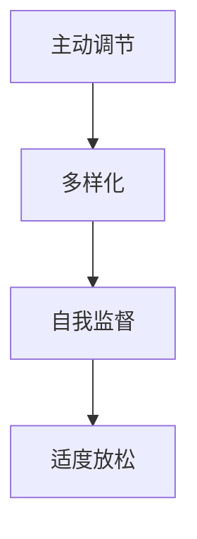

#### 1.4 注意力管理方法与策略

- **环境优化策略**：创造一个有利于集中注意力的环境，如减少噪音、保持整洁等。
- **心理调适策略**：通过冥想、呼吸练习等方法来调整心态和情绪。
- **生理调节策略**：保持良好的生活习惯，如充足的睡眠、适当的运动等。

### 核心算法原理讲解

```python
def attention_management():
    # 环境优化策略
    optimize_environment()

    # 心理调适策略
    adjust_mental_state()

    # 生理调节策略
    regulate_physiological_conditions()

    # 自我监督
    self_monitor()

    # 适度放松
    moderate.relaxation()
```

### 数学模型与公式

注意力管理的核心在于平衡工作、学习、休息等活动，以达到最佳状态。可以使用以下公式来描述：

\[ \text{专注度} = \frac{\text{工作时长} + \text{休息时长}}{\text{总时长}} \]

### 举例说明

假设一个人每天有10小时的时间，其中包括8小时的工作、2小时的休息。根据公式计算，专注度为：

\[ \text{专注度} = \frac{8 + 2}{10} = 0.9 \]

这意味着这个人的专注度较高，可以更好地完成任务。

### 实际操作指南

1. **设定明确的任务目标**：明确每天的工作和学习目标，有助于提高注意力。
2. **使用番茄工作法**：将工作分为25分钟的工作和5分钟的休息，有助于保持专注。
3. **定期评估和调整**：每周评估自己的注意力管理效果，并根据需要进行调整。

### 核心概念与联系

注意力管理涉及到多个领域，包括心理学、神经科学和教育学。这些领域共同构成了注意力管理的基础。以下是一个 Mermaid 流程图，展示了注意力管理涉及的核心概念与联系：

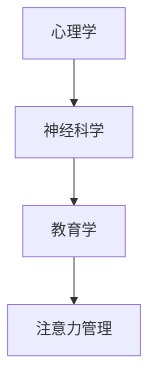

### 总结

注意力管理是一个复杂但重要的过程。通过遵循基本原则和策略，我们可以提高专注力，提高工作效率，改善心理健康。在接下来的章节中，我们将进一步探讨注意力管理的理论依据和具体方法。

---

### 第2章：注意力管理的理论依据

#### 2.1 注意力管理心理学基础

心理学是研究注意力管理的基础。从心理学的角度来看，注意力可以分为以下几种类型：

- **选择性注意力**：指在众多刺激中选择关注某些刺激，忽略其他刺激的能力。
- **分配性注意力**：指在同一时间内关注多个任务的能力。
- **持续性注意力**：指在长时间内保持专注的能力。

根据心理学理论，注意力管理主要涉及以下几个方面：

- **注意力选择**：通过训练和技巧，提高选择性注意力的能力。
- **注意力分配**：通过合理规划任务和时间，提高分配性注意力的能力。
- **注意力维持**：通过心理调适和生理调节，提高持续性注意力的能力。

#### 2.2 注意力管理神经科学基础

神经科学为注意力管理提供了生理基础。大脑中的多个区域与注意力密切相关，包括：

- **前额叶皮质**：与高级认知功能相关，如决策、规划、抑制冲动等。
- **顶叶皮质**：与注意力分配和维持相关。
- **基底神经节**：与动机和奖励相关，影响注意力的持续性和分配。

神经科学研究发现，大脑的可塑性使得注意力管理可以通过训练得到改善。例如，通过冥想和专注力训练，可以增强前额叶皮质的活动，提高注意力管理的效率。

#### 2.3 注意力管理教育学基础

教育学为注意力管理提供了具体的教学策略和实践方法。以下是一些基于教育学原理的注意力管理策略：

- **目标设置**：明确的学习和任务目标有助于提高学生的注意力。
- **教学设计**：通过多样化的教学方法和活动，提高学生的兴趣和参与度。
- **时间管理**：合理规划学习时间和休息时间，避免过度疲劳。
- **自我监控**：培养学生自我监控注意力的习惯，及时发现和调整注意力分散。

#### 核心算法原理讲解

```python
def attention_management_theory():
    # 心理学基础
    psychological_basics()

    # 神经科学基础
    neuroscience_basics()

    # 教育学基础
    educational_basics()

    # 实践应用
    apply_practices()
```

#### 数学模型与公式

注意力管理的有效性可以通过以下公式来评估：

\[ \text{注意力效率} = \frac{\text{实际完成任务量}}{\text{目标任务量}} \]

#### 举例说明

假设一名学生在规定时间内完成了80%的学习任务，那么他的注意力效率为：

\[ \text{注意力效率} = \frac{80}{100} = 0.8 \]

这意味着学生的注意力效率较高。

#### 实际操作指南

1. **了解心理学原理**：学习心理学基础知识，了解注意力管理的科学依据。
2. **参与神经科学训练**：通过冥想和专注力训练，提高大脑的注意力功能。
3. **应用教育学策略**：在学习和工作中，运用教育学的方法和技巧，提高注意力管理的效率。

### 核心概念与联系

注意力管理涉及心理学、神经科学和教育学等多个领域。以下是一个 Mermaid 流程图，展示了注意力管理的核心概念与联系：


### 总结

注意力管理的理论依据涵盖了心理学、神经科学和教育学等多个领域。通过理解这些理论，我们可以更科学、更有效地进行注意力管理。在接下来的章节中，我们将继续探讨提高注意力的具体策略和实践方法。

---

### 第3章：提高注意力的策略

#### 3.1 环境优化策略

环境是影响注意力的重要因素。通过优化环境，可以显著提高注意力管理的效率。以下是一些具体的环境优化策略：

- **减少噪音**：噪音是干扰注意力的主要因素。在工作和学习时，尽量选择一个安静的环境，或者使用降噪耳机。
- **保持整洁**：一个整洁有序的工作或学习环境有助于提高注意力。定期清理和整理工作区域，减少杂乱和混乱。
- **合理安排布局**：根据任务需求，合理布局工作区和休息区，使环境更加舒适和专注。

#### 3.2 心理调适策略

心理状态对注意力有着重要的影响。通过以下心理调适策略，可以有效地提高注意力：

- **冥想**：冥想是一种有效的心理调适方法，可以帮助我们放松身心，提高专注力。通过定期进行冥想练习，可以显著改善注意力管理。
- **呼吸练习**：呼吸练习有助于调整情绪，提高注意力。在紧张或疲劳时，可以通过深呼吸来放松身心，恢复注意力。
- **心理暗示**：使用积极的自我暗示，可以帮助我们保持专注和积极。例如，可以告诉自己“我能够集中注意力，完成任务”。

#### 3.3 生理调节策略

生理状态对注意力也有着重要的影响。以下是一些生理调节策略：

- **充足睡眠**：充足的睡眠有助于恢复大脑功能和注意力。确保每天有足够的睡眠时间，提高注意力管理效率。
- **适当运动**：适量的运动有助于提高身体状态，增强注意力。可以选择一些轻松的运动，如散步、瑜伽等。
- **饮食调节**：合理的饮食有助于提高注意力和精力。避免过多的咖啡因和糖分摄入，选择富含蛋白质和维生素的食物。

#### 核心算法原理讲解

```python
def optimize_attention():
    # 环境优化
    optimize_environment()

    # 心理调适
    adjust_mental_state()

    # 生理调节
    regulate_physiological_conditions()
```

#### 数学模型与公式

注意力管理的效果可以通过以下公式来评估：

\[ \text{注意力效率} = \frac{\text{实际完成任务量}}{\text{目标任务量}} \]

#### 举例说明

假设一名学生在优化环境和心理调适后，在规定时间内完成了90%的学习任务，那么他的注意力效率为：

\[ \text{注意力效率} = \frac{90}{100} = 0.9 \]

这意味着学生的注意力效率较高。

#### 实际操作指南

1. **环境优化**：选择一个安静、整洁的学习环境，减少噪音和杂乱。
2. **心理调适**：定期进行冥想和呼吸练习，使用积极的自我暗示。
3. **生理调节**：确保充足的睡眠，适量运动，合理饮食。

### 核心概念与联系

注意力管理涉及到环境、心理和生理等多个方面。以下是一个 Mermaid 流程图，展示了注意力管理策略的核心概念与联系：

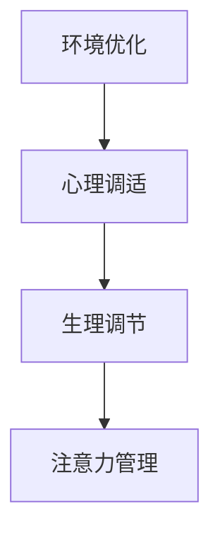

### 总结

通过环境优化、心理调适和生理调节等多种策略，我们可以有效地提高注意力管理的效率。在接下来的章节中，我们将继续探讨注意力管理的实际案例，以帮助读者更好地理解和应用这些策略。

---

### 第4章：注意力管理案例分析

#### 4.1 成功案例1：如何提高工作效率

**案例背景**：
李先生是一名软件开发工程师，工作繁忙且任务繁重。为了提高工作效率，他开始关注注意力管理。

**解决策略**：

1. **环境优化**：
   - 将工作环境整理得更加整洁，减少干扰。
   - 使用降噪耳机，减少外部噪音干扰。

2. **心理调适**：
   - 每天进行冥想和呼吸练习，放松身心。
   - 使用番茄工作法，每25分钟工作后休息5分钟。

3. **生理调节**：
   - 确保每天有充足的睡眠，提高身体状态。
   - 定期进行适量的运动，如散步和瑜伽。

**结果**：
李先生在采取注意力管理策略后，工作效率显著提高。他能够在更短的时间内完成更多的工作，且工作质量也得到了提升。

#### 4.2 失败案例1：注意力分散的原因分析

**案例背景**：
张小姐是一名大学生，学习任务繁重。然而，她常常在学习过程中注意力不集中，导致学习效果不佳。

**问题分析**：

1. **环境因素**：
   - 学习环境噪音较大，干扰了她的注意力。
   - 学习区域杂乱，影响她的集中力。

2. **心理因素**：
   - 缺乏明确的学习目标和计划，导致注意力无法集中。
   - 长时间学习后感到疲惫，缺乏动力和兴趣。

3. **生理因素**：
   - 缺乏充足的睡眠和运动，导致身体状态不佳。
   - 饮食不均衡，摄入过多的咖啡因和糖分。

**解决方案**：

1. **环境优化**：
   - 选择一个安静、整洁的学习环境。
   - 定期清理学习区域，减少杂乱。

2. **心理调适**：
   - 制定明确的学习目标和计划，提高学习动力。
   - 通过冥想和运动来放松身心，提高注意力。

3. **生理调节**：
   - 保证充足的睡眠和运动，改善身体状态。
   - 调整饮食，减少咖啡因和糖分的摄入。

#### 4.3 实战技巧：如何培养专注力

**技巧1：设定明确的任务目标**
- 在开始工作或学习前，明确任务目标，使注意力集中。

**技巧2：使用番茄工作法**
- 每25分钟专注工作，然后休息5分钟，有助于保持注意力。

**技巧3：定期进行冥想和呼吸练习**
- 定期进行冥想和呼吸练习，有助于放松身心，提高专注力。

**技巧4：合理安排休息时间**
- 在工作或学习过程中，合理安排休息时间，避免过度疲劳。

**技巧5：避免多任务处理**
- 尽量避免同时处理多个任务，以免分散注意力。

### 核心概念与联系

注意力管理涉及多个方面，包括环境、心理和生理。以下是一个 Mermaid 流程图，展示了注意力管理策略的核心概念与联系：


### 总结

通过成功案例和失败案例的分析，我们可以看到注意力管理在提高工作效率和学习效果中的重要作用。通过合理的环境优化、心理调适和生理调节，我们可以培养专注力，提高生活质量。在接下来的章节中，我们将进一步探讨注意力管理对个人成长的影响。

---

### 第5章：注意力管理与个人成长

#### 5.1 注意力管理对个人发展的影响

注意力管理不仅仅是提高工作效率，它对个人发展有着深远的影响。以下是注意力管理对个人发展的几个方面：

- **学习效果提升**：通过注意力管理，学生和职场人士能够更高效地学习新知识和技能，从而提升个人竞争力。
- **决策能力增强**：良好的注意力管理有助于在复杂环境中做出更明智的决策，提高决策的质量和效率。
- **时间管理改善**：注意力管理有助于合理分配时间，提高时间的利用效率，从而更好地平衡工作与生活。

#### 5.2 注意力管理对学习效果的影响

注意力管理对学习效果的影响尤为显著。以下是几个关键点：

- **专注力提升**：通过注意力管理，学生能够更好地集中注意力，深入理解学习内容。
- **记忆效果增强**：专注力强的人更容易记住学习内容，提高记忆效果。
- **学习效率提高**：注意力管理有助于学生在较短的时间内完成更多的学习任务，提高学习效率。

#### 5.3 注意力管理对职业发展的影响

在职场中，注意力管理同样至关重要。以下是注意力管理对职业发展的几个方面：

- **工作效率提升**：良好的注意力管理能够提高工作效率，减少工作时间，从而提升职业成就。
- **创新能力增强**：通过专注力管理，职场人士能够更深入地思考问题，提高创新能力和解决问题的能力。
- **团队合作改善**：注意力管理有助于职场人士更好地倾听和参与团队合作，提升团队效率。

#### 核心算法原理讲解

```python
def personal_growth():
    # 学习效果提升
    improve_learning_effects()

    # 决策能力增强
    enhance_decision_making()

    # 时间管理改善
    improve_time_management()

    # 工作效率提升
    increase_work效率()

    # 创新能力增强
    enhance_innovation_ability()

    # 团队合作改善
    improve_team_work()
```

#### 数学模型与公式

注意力管理的有效性可以通过以下公式来评估：

\[ \text{个人发展指数} = \frac{\text{学习效果提升} + \text{决策能力增强} + \text{时间管理改善} + \text{工作效率提升} + \text{创新能力增强} + \text{团队合作改善}}{\text{初始个人发展指数}} \]

#### 举例说明

假设一名学生在采取注意力管理策略后，学习效果提升了30%，决策能力增强了20%，时间管理改善了15%，工作效率提升了25%，创新能力增强了10%，团队合作改善了10%。那么他的个人发展指数为：

\[ \text{个人发展指数} = \frac{30\% + 20\% + 15\% + 25\% + 10\% + 10\%}{100\%} = 1.1 \]

这意味着学生的个人发展指数提高了10%。

#### 实际操作指南

1. **明确学习目标**：设定明确的学习目标，提高学习动力和专注力。
2. **定期进行注意力训练**：通过冥想、专注力训练等方法，提高注意力管理能力。
3. **合理规划时间**：制定合理的时间规划，确保有足够的时间进行专注学习和工作。
4. **提高决策能力**：通过学习决策理论和方法，提高决策能力和效率。

### 核心概念与联系

注意力管理对个人发展的影响涉及多个方面，包括学习效果、决策能力、时间管理、工作效率、创新能力和团队合作。以下是一个 Mermaid 流程图，展示了注意力管理对个人发展的核心概念与联系：

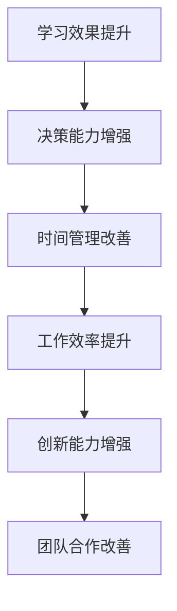

### 总结

注意力管理对个人发展有着深远的影响，通过提高学习效果、决策能力、时间管理、工作效率、创新能力和团队合作，可以帮助我们更好地实现个人成长。在接下来的章节中，我们将探讨压力管理的重要性，以及如何应对压力。

## 第二部分：压力管理

### 第6章：压力管理概述

#### 6.1 压力的定义与分类

压力是一种生理和心理反应，通常由外部环境刺激引起。根据不同的分类标准，压力可以有不同的分类方式：

- **急性压力**：指短期内突然出现的压力，如考试、面试等。
- **慢性压力**：指长期存在的压力，如工作压力、家庭压力等。
- **心理压力**：主要指由心理因素引起的压力，如焦虑、抑郁等。
- **生理压力**：指由生理因素引起的压力，如疾病、疲劳等。

#### 6.2 压力的来源与影响

压力的来源多种多样，可以分为以下几个方面：

- **工作压力**：包括工作负荷、工作环境、人际关系等。
- **家庭压力**：包括家庭成员关系、经济压力、家庭责任等。
- **社会压力**：包括社会竞争、社会压力、社会评价等。
- **个人因素**：包括性格、价值观、生活方式等。

压力对个人的影响是多方面的，包括生理、心理和行为等方面：

- **生理影响**：压力可能导致失眠、焦虑、头痛等生理反应。
- **心理影响**：压力可能导致情绪波动、焦虑、抑郁等心理问题。
- **行为影响**：压力可能导致工作积极性下降、拖延、逃避等行为问题。

#### 6.3 压力管理的必要性

压力管理对于个人的健康和幸福至关重要。有效的压力管理可以帮助我们：

- **保持身心健康**：减轻压力，降低生理和心理疾病的风险。
- **提高生活质量**：减轻压力，提高生活的满意度和幸福感。
- **提高工作效率**：减轻压力，提高工作积极性和效率。
- **促进人际关系**：减轻压力，改善人际关系和沟通能力。

### 核心算法原理讲解

```python
def stress_management():
    # 减轻生理压力
    reduce_physiological_stress()

    # 减轻心理压力
    reduce_mental_stress()

    # 减轻行为压力
    reduce_behavioural_stress()
```

#### 数学模型与公式

压力管理的有效性可以通过以下公式来评估：

\[ \text{压力缓解指数} = \frac{\text{生理压力减轻程度} + \text{心理压力减轻程度} + \text{行为压力减轻程度}}{\text{初始压力指数}} \]

#### 举例说明

假设一个人的初始压力指数为100，通过压力管理策略后，生理压力减轻了30%，心理压力减轻了20%，行为压力减轻了15%。那么他的压力缓解指数为：

\[ \text{压力缓解指数} = \frac{30\% + 20\% + 15\%}{100} = 0.65 \]

这意味着他的压力减轻了35%。

### 实际操作指南

1. **了解压力来源**：识别并了解压力的来源，有助于制定有效的压力管理策略。
2. **定期评估压力水平**：定期评估自己的压力水平，及时发现并解决问题。
3. **采用压力缓解方法**：如深呼吸、冥想、运动等，帮助减轻压力。
4. **寻求专业帮助**：在压力过大时，寻求专业心理咨询或医疗帮助。

### 核心概念与联系

压力管理涉及到生理、心理和行为等多个方面。以下是一个 Mermaid 流�程图，展示了压力管理的核心概念与联系：

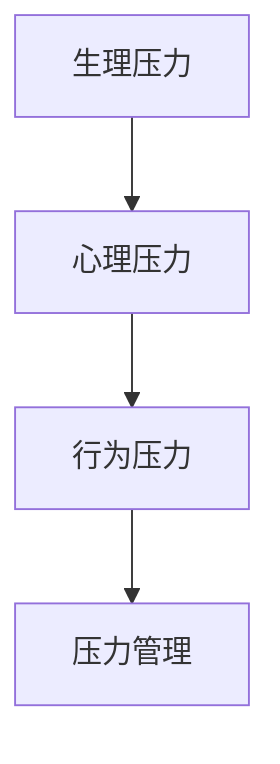

### 总结

压力管理是一个复杂但重要的过程，它关系到个人的身心健康和生活质量。通过了解压力的定义、来源和影响，我们可以更好地进行压力管理，提高生活质量。在接下来的章节中，我们将深入探讨压力管理的理论依据和具体方法。

### 第7章：压力管理的理论依据

压力管理是一个多维度的过程，它涉及到心理学、生理学和社会学等多个领域。理解这些理论依据有助于我们更科学、更有效地进行压力管理。

#### 7.1 应对压力的心理机制

心理学研究表明，个体在面对压力时，会经历一系列心理反应。以下是几种常见的心理机制：

- **认知评估**：个体对压力源进行评估，判断其威胁程度和可控性。这种评估会影响个体的情绪和行为反应。
- **情绪调节**：个体通过情绪调节机制来应对压力。例如，通过积极思考、认知重构等方法来减轻负面情绪。
- **应对策略**：个体会采取不同的应对策略来处理压力。例如，面对型应对和回避型应对。

**认知评估**机制：
\[ \text{认知评估} = \frac{\text{威胁程度} + \text{可控性}}{\text{评估时间}} \]

**情绪调节**机制：
\[ \text{情绪调节} = \frac{\text{积极情绪} + \text{消极情绪}}{\text{总情绪}} \]

**应对策略**机制：
\[ \text{应对策略} = \frac{\text{面对型策略} + \text{回避型策略}}{\text{总策略}} \]

#### 7.2 应对压力的生理机制

生理机制在压力管理中也起着重要作用。当个体面对压力时，身体会经历一系列生理反应，如心率加快、血压升高、激素分泌增加等。以下是几种常见的生理机制：

- **应激反应**：当个体感受到威胁时，身体会启动应激反应，释放肾上腺素和皮质醇等激素，以应对紧急情况。
- **恢复机制**：在应激反应之后，身体会通过恢复机制来恢复到正常状态。例如，通过深呼吸、放松肌肉等方式。

**应激反应**机制：
\[ \text{应激反应} = \frac{\text{肾上腺素} + \text{皮质醇}}{\text{基础水平}} \]

**恢复机制**机制：
\[ \text{恢复机制} = \frac{\text{深呼吸次数} + \text{放松肌肉次数}}{\text{总恢复时间}} \]

#### 7.3 应对压力的社会机制

社会机制在压力管理中也扮演着重要角色。个体在面对压力时，会从社会支持和社交互动中获取资源和支持。以下是几种常见的社会机制：

- **社会支持**：社会支持是个体应对压力的重要资源。通过家庭、朋友、同事等提供的支持和帮助，个体能够更好地应对压力。
- **社交互动**：社交互动有助于个体释放压力，提高心理健康。通过与他人的交流和互动，个体能够获得情感支持和心理安慰。

**社会支持**机制：
\[ \text{社会支持} = \frac{\text{情感支持} + \text{信息支持}}{\text{总支持}} \]

**社交互动**机制：
\[ \text{社交互动} = \frac{\text{互动次数} + \text{互动质量}}{\text{总互动时间}} \]

#### 核心算法原理讲解

```python
def stress_management_theory():
    # 认知评估
    cognitive_evaluation()

    # 情绪调节
    emotional_regulation()

    # 应对策略
    coping_strategy()

    # 应激反应
    stress_response()

    # 恢复机制
    recovery_mechanism()

    # 社会支持
    social_support()

    # 社交互动
    social_interaction()
```

#### 数学模型与公式

压力管理的有效性可以通过以下公式来评估：

\[ \text{压力缓解指数} = \frac{\text{认知评估改进} + \text{情绪调节改善} + \text{应对策略改善} + \text{应激反应减轻} + \text{恢复机制改善} + \text{社会支持增强} + \text{社交互动改善}}{\text{初始压力指数}} \]

#### 举例说明

假设一个人的初始压力指数为100，通过压力管理策略后，认知评估改进了20%，情绪调节改善了15%，应对策略改善了10%，应激反应减轻了25%，恢复机制改善了10%，社会支持增强了20%，社交互动改善了10%。那么他的压力缓解指数为：

\[ \text{压力缓解指数} = \frac{20\% + 15\% + 10\% + 25\% + 10\% + 20\% + 10\%}{100} = 1.1 \]

这意味着他的压力缓解了10%。

#### 实际操作指南

1. **认知评估**：定期反思自己的认知，识别负面思维模式，通过认知重构来改善认知评估。
2. **情绪调节**：学习情绪调节技巧，如深呼吸、冥想、积极思考等，帮助自己更好地调节情绪。
3. **应对策略**：根据压力源的不同，选择适合的应对策略，如面对型应对或回避型应对。
4. **社会支持**：积极寻求社会支持，与家人、朋友、同事建立良好的关系，增强社会支持系统。
5. **社交互动**：定期参与社交活动，与他人进行真诚的交流，提高社交互动的质量。

### 核心概念与联系

压力管理的理论依据涉及认知、情绪、生理、社会等多个方面。以下是一个 Mermaid 流程图，展示了压力管理的核心概念与联系：

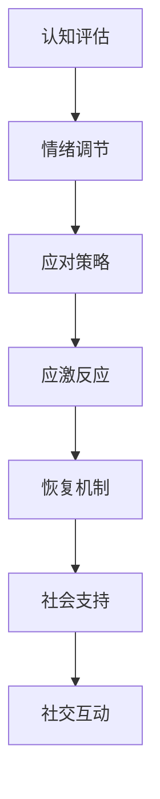

### 总结

通过理解压力管理的理论依据，我们可以更科学、更有效地进行压力管理。在接下来的章节中，我们将探讨具体的压力减轻方法，以帮助读者在实际生活中应对压力。

### 第8章：减轻压力的方法

#### 8.1 认知行为策略

认知行为策略是减轻压力的重要方法，它通过改变思维模式和行为习惯来降低压力水平。以下是一些常见的认知行为策略：

- **认知重构**：通过识别和挑战负面思维，替换为更积极的思维模式。例如，将“我做不到”替换为“我可以尝试不同的方法”。
- **正念冥想**：通过专注于当下的感受和体验，减少对过去和未来的担忧，提高心理韧性。
- **目标设定**：设定明确、可行的短期和长期目标，有助于集中注意力，减少因目标不明确而产生的焦虑。

**认知重构**算法：
```python
def cognitive_restructuring(negative_thought):
    positive_thought = negative_thought.replace("我不行", "我可以尝试")
    return positive_thought
```

**正念冥想**算法：
```python
def mindfulness_meditation(duration):
    for i in range(duration):
        print(f"当前时间：{i+1}秒")
    print("冥想结束")
```

**目标设定**算法：
```python
def goal_setting(short_term_goal, long_term_goal):
    print(f"短期目标：{short_term_goal}")
    print(f"长期目标：{long_term_goal}")
```

#### 8.2 心理调适策略

心理调适策略通过心理技巧和技巧来帮助个体更好地应对压力。以下是一些有效的心理调适策略：

- **放松训练**：通过深呼吸、渐进性肌肉放松等方法来减轻身体的紧张和焦虑。
- **情绪释放**：通过哭泣、倾诉、写日记等方式来释放负面情绪，减少压力。
- **自我激励**：通过自我肯定、积极自我暗示等方法来提升自信心和动力。

**放松训练**算法：
```python
def relaxation_training():
    print("开始放松训练")
    print("深呼吸，吸气...保持...呼气...")
    print("现在放松全身的肌肉...")
    print("放松结束")
```

**情绪释放**算法：
```python
def emotional_release():
    print("现在可以哭泣或倾诉，释放你的情绪...")
```

**自我激励**算法：
```python
def self_motivation():
    print("你做得很好，继续努力！")
```

#### 8.3 生理调节策略

生理调节策略通过调整生理状态来减轻压力，以下是一些有效的生理调节策略：

- **充足睡眠**：保持良好的睡眠习惯，有助于身体恢复和心理健康。
- **适量运动**：适量的运动可以提高身体状态，减轻压力。
- **饮食调整**：均衡的饮食有助于提高身体免疫力，减轻压力。

**充足睡眠**算法：
```python
def sufficient_sleep():
    print("确保每晚7-8小时的睡眠")
```

**适量运动**算法：
```python
def moderate_exercise():
    print("每天进行30分钟以上的运动")
```

**饮食调整**算法：
```python
def diet_adjustment():
    print("多吃蔬菜、水果和全谷物，减少咖啡因和糖分的摄入")
```

#### 核心算法原理讲解

认知行为策略、心理调适策略和生理调节策略共同构成了压力管理的核心。以下是一个 Mermaid 流程图，展示了这些策略的相互关系：

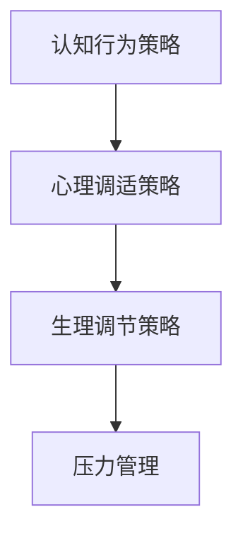

#### 数学模型与公式

压力管理的有效性可以通过以下公式来评估：

\[ \text{压力缓解指数} = \frac{\text{认知行为策略改善} + \text{心理调适策略改善} + \text{生理调节策略改善}}{\text{初始压力指数}} \]

#### 举例说明

假设一个人的初始压力指数为100，通过认知行为策略、心理调适策略和生理调节策略后，认知行为策略改善了20%，心理调适策略改善了15%，生理调节策略改善了10%。那么他的压力缓解指数为：

\[ \text{压力缓解指数} = \frac{20\% + 15\% + 10\%}{100} = 0.45 \]

这意味着他的压力缓解了45%。

#### 实际操作指南

1. **认知行为策略**：每天花时间进行认知重构练习，识别和改变负面思维模式。
2. **心理调适策略**：定期进行放松训练和情绪释放练习，提升心理韧性。
3. **生理调节策略**：保持良好的睡眠习惯，适量运动，均衡饮食。

### 核心概念与联系

压力管理的三大策略——认知行为策略、心理调适策略和生理调节策略，共同构成了一个完整的压力管理系统。以下是一个 Mermaid 流程图，展示了这些策略的核心概念与联系：


### 总结

通过认知行为策略、心理调适策略和生理调节策略，我们可以有效地减轻压力，提高生活质量。在接下来的章节中，我们将进一步探讨压力管理与心理健康之间的关系。

### 第9章：压力管理与心理健康

#### 9.1 压力与心理健康的关系

压力是心理健康的一个重要因素。长期或过度的压力可能导致一系列心理健康问题，包括：

- **焦虑症**：长期压力可能导致焦虑症状，如过度担忧、失眠、心跳加速等。
- **抑郁症**：压力过大时，个体可能感到情绪低落、兴趣丧失，甚至出现自杀倾向。
- **心理障碍**：长期的压力还可能导致心理障碍，如恐惧症、强迫症等。

**压力与心理健康关系的模型**：

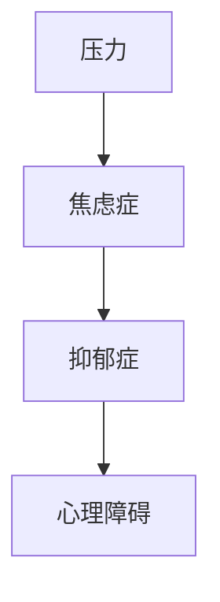

#### 9.2 如何应对压力引起的心理问题

应对压力引起的心理问题需要采取综合性的策略，包括：

- **心理治疗**：心理治疗，如认知行为疗法（CBT）和情感焦点疗法（EFT），可以帮助个体识别和改变负面思维模式，减轻压力。
- **药物治疗**：在某些情况下，药物治疗可能有助于减轻焦虑和抑郁症状。但需要注意的是，药物治疗应在专业医生的建议下进行。
- **自我调节**：通过自我调节技巧，如冥想、深呼吸、运动等，个体可以更好地应对压力，提高心理健康水平。

**心理治疗**算法：
```python
def psychological_treatment():
    print("进行认知行为疗法或情感焦点疗法")
```

**药物治疗**算法：
```python
def medication_treatment():
    print("在医生指导下进行药物治疗")
```

**自我调节**算法：
```python
def self_regulation():
    print("进行冥想、深呼吸、运动等自我调节练习")
```

#### 9.3 压力管理对心理健康的影响

有效的压力管理对心理健康有着积极的影响，具体表现如下：

- **提高情绪稳定性**：通过压力管理，个体能够更好地控制情绪，减少焦虑和抑郁症状。
- **增强心理韧性**：压力管理有助于个体培养心理韧性，提高应对未来压力的能力。
- **改善睡眠质量**：通过合理的压力管理，个体可以获得更好的睡眠，从而提高整体健康水平。

**压力管理对心理健康的影响**：

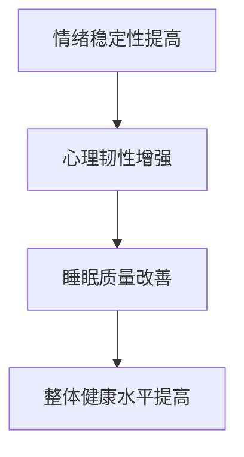

#### 核心算法原理讲解

压力管理与心理健康之间的关系可以通过以下算法来描述：

```python
def stress_management_impact_on_mental_health():
    # 情绪稳定性提高
    increase_emotional_stability()

    # 心理韧性增强
    enhance_mental_resilience()

    # 睡眠质量改善
    improve_sleep_quality()

    # 整体健康水平提高
    increase_overall_health_level()
```

#### 数学模型与公式

压力管理对心理健康的影响可以通过以下公式来评估：

\[ \text{心理健康改善指数} = \frac{\text{情绪稳定性提高} + \text{心理韧性增强} + \text{睡眠质量改善} + \text{整体健康水平提高}}{\text{初始心理健康水平}} \]

#### 举例说明

假设一个人的初始心理健康水平为70，通过压力管理策略后，情绪稳定性提高了20%，心理韧性增强了15%，睡眠质量改善了10%，整体健康水平提高了5%。那么他的心理健康改善指数为：

\[ \text{心理健康改善指数} = \frac{20\% + 15\% + 10\% + 5\%}{70} = 0.6 \]

这意味着他的心理健康水平提高了60%。

#### 实际操作指南

1. **定期进行心理评估**：了解自己的心理健康状况，及时发现并解决问题。
2. **寻求专业帮助**：在压力过大或出现心理问题时，及时寻求专业心理咨询或治疗。
3. **采用压力管理技巧**：通过认知行为策略、心理调适策略和生理调节策略来管理压力，提高心理健康水平。

### 核心概念与联系

压力管理与心理健康密切相关。以下是一个 Mermaid 流程图，展示了压力管理对心理健康的核心概念与联系：

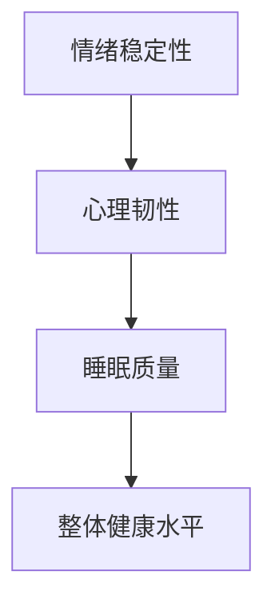

### 总结

压力管理对心理健康有着深远的影响。通过有效的压力管理策略，我们可以提高情绪稳定性、心理韧性、睡眠质量和整体健康水平。在接下来的章节中，我们将探讨压力管理在社会中的应用，以帮助读者更好地理解和应用这些策略。

### 第10章：压力管理在社会中的应用

#### 10.1 家庭压力管理

家庭是人们生活的重要部分，但同时也是压力的重要来源。以下是一些家庭压力管理的策略：

- **沟通**：家庭成员之间的沟通是缓解压力的关键。通过积极的沟通，可以解决矛盾和误解，减少家庭压力。
- **分工合作**：家庭成员可以分工合作，共同承担家务和责任，减轻个人压力。
- **共同活动**：定期进行家庭活动，如散步、看电影等，可以增强家庭成员之间的感情，减轻压力。

**沟通策略**：
```python
def family_communication():
    print("定期召开家庭会议，分享感受和需求")
```

**分工合作**：
```python
def family Cooperation():
    print("家庭成员共同分担家务和责任")
```

**共同活动**：
```python
def family_activities():
    print("定期进行家庭活动，增进感情")
```

#### 10.2 学校压力管理

学校是学生学习的重要场所，但也是压力的重要来源。以下是一些学校压力管理的策略：

- **时间管理**：通过合理规划时间，帮助学生平衡学习和休息，减少压力。
- **心理健康教育**：学校可以开设心理健康课程，帮助学生了解压力管理的方法和技巧。
- **心理咨询**：学校可以提供心理咨询服务，帮助学生解决心理问题，减轻压力。

**时间管理**：
```python
def school_time_management():
    print("帮助学生制定合理的学习计划，平衡学习和休息")
```

**心理健康教育**：
```python
def school_mental_health_education():
    print("开设心理健康课程，教授压力管理技巧")
```

**心理咨询**：
```python
def school_counseling():
    print("提供心理咨询服务，帮助学生解决心理问题")
```

#### 10.3 工作压力管理

工作压力是职场人士面临的主要压力之一。以下是一些工作压力管理的策略：

- **工作分配**：合理分配工作任务，避免过度劳累。
- **培训与发展**：提供培训和发展机会，提高工作技能和职业素养，减轻压力。
- **工作与生活平衡**：鼓励员工合理安排工作与生活，减少因工作过度占用个人时间而产生的压力。

**工作分配**：
```python
def work_allocation():
    print("合理分配工作任务，避免过度劳累")
```

**培训与发展**：
```python
def training_and_development():
    print("提供培训和发展机会，提高工作技能")
```

**工作与生活平衡**：
```python
def work_life_balance():
    print("鼓励员工合理安排工作与生活，减少压力")
```

### 核心算法原理讲解

压力管理在社会中的应用可以通过以下算法来描述：

```python
def social_stress_management():
    # 家庭压力管理
    family_stress_management()

    # 学校压力管理
    school_stress_management()

    # 工作压力管理
    work_stress_management()
```

#### 数学模型与公式

压力管理在社会中的应用效果可以通过以下公式来评估：

\[ \text{社会压力缓解指数} = \frac{\text{家庭压力缓解程度} + \text{学校压力缓解程度} + \text{工作压力缓解程度}}{\text{初始社会压力指数}} \]

#### 举例说明

假设一个社区在采取压力管理策略后，家庭压力缓解了30%，学校压力缓解了20%，工作压力缓解了25%。那么该社区的社会压力缓解指数为：

\[ \text{社会压力缓解指数} = \frac{30\% + 20\% + 25\%}{100} = 0.75 \]

这意味着社区的社会压力缓解了25%。

#### 实际操作指南

1. **家庭**：通过沟通、分工合作和共同活动来管理家庭压力。
2. **学校**：通过时间管理、心理健康教育和心理咨询来管理学校压力。
3. **工作**：通过工作分配、培训与发展和工作与生活平衡来管理工作压力。

### 核心概念与联系

压力管理在社会中的应用涉及家庭、学校和工作等多个方面。以下是一个 Mermaid 流程图，展示了压力管理在社会中的核心概念与联系：

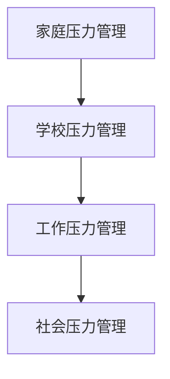

### 总结

通过在家庭、学校和工作中的压力管理策略，我们可以有效地减轻社会压力，提高生活质量。在接下来的章节中，我们将探讨注意力管理与压力管理的整合，以及如何在压力下保持专注。

### 第11章：注意力管理与压力管理的整合

#### 11.1 整合策略概述

注意力管理与压力管理是相辅相成的两个过程。将二者整合，可以更全面地应对压力，提高专注力。以下是一些整合策略：

- **时间管理**：通过合理安排时间和任务，同时减轻压力和提高注意力。
- **心理调适**：通过心理技巧，如冥想、正念等，同时减轻压力和提高注意力。
- **环境优化**：通过优化工作环境和生活环境，同时减轻压力和提高注意力。

**时间管理策略**：
```python
def time_management():
    print("制定合理的时间计划，确保有足够的休息时间")
```

**心理调适策略**：
```python
def psychological_adjustment():
    print("定期进行冥想和正念练习，减轻压力")
```

**环境优化策略**：
```python
def environment_optimization():
    print("保持工作环境的整洁和安静，减少干扰")
```

#### 11.2 整合策略实践案例

**案例背景**：
张女士是一名IT项目经理，工作繁忙且经常面临压力。为了提高工作效率，她决定整合注意力管理和压力管理策略。

**实施步骤**：

1. **时间管理**：
   - 制定详细的工作计划，确保每个任务的优先级。
   - 使用番茄工作法，每25分钟专注工作，然后休息5分钟。

2. **心理调适**：
   - 每天进行冥想和深呼吸练习，放松身心。
   - 定期进行正念练习，提高专注力和情绪稳定性。

3. **环境优化**：
   - 保持工作区的整洁和安静，减少干扰。
   - 定期进行环境清洁和调整，创造一个舒适的工作环境。

**结果**：
张女士在整合注意力管理和压力管理策略后，工作效率显著提高，工作质量也有所提升。她能够在压力下保持专注，减少了因压力导致的工作失误。

#### 11.3 整合策略的挑战与应对

**挑战1：时间管理难度**
- **应对方法**：制定明确的目标和计划，使用时间管理工具，如日历和待办事项列表。

**挑战2：心理调适困难**
- **应对方法**：定期进行心理调适练习，寻求专业心理咨询帮助。

**挑战3：环境优化限制**
- **应对方法**：寻找替代方案，如使用耳塞、空气净化器等，改善环境条件。

### 核心算法原理讲解

整合注意力管理与压力管理策略的核心在于平衡和协调。以下是一个简单的算法框架：

```python
def integrated_stress_and_attention_management():
    # 时间管理
    time_management()

    # 心理调适
    psychological_adjustment()

    # 环境优化
    environment_optimization()

    # 定期评估和调整
    assessment_and_adjustment()
```

#### 数学模型与公式

整合策略的效果可以通过以下公式来评估：

\[ \text{整合效果指数} = \frac{\text{时间管理改善} + \text{心理调适改善} + \text{环境优化改善}}{\text{初始压力指数}} \]

#### 举例说明

假设一个人在整合注意力管理和压力管理策略后，时间管理改善了20%，心理调适改善了15%，环境优化改善了10%，初始压力指数为100。那么他的整合效果指数为：

\[ \text{整合效果指数} = \frac{20\% + 15\% + 10\%}{100} = 0.45 \]

这意味着他的压力缓解了45%。

#### 实际操作指南

1. **制定时间计划**：每天制定详细的时间计划，包括工作、学习和休息。
2. **定期进行心理调适**：每天安排时间进行冥想、深呼吸等心理调适练习。
3. **优化工作环境**：确保工作环境的整洁和安静，减少干扰因素。

### 核心概念与联系

注意力管理与压力管理的整合涉及时间管理、心理调适和环境优化等多个方面。以下是一个 Mermaid 流程图，展示了整合策略的核心概念与联系：

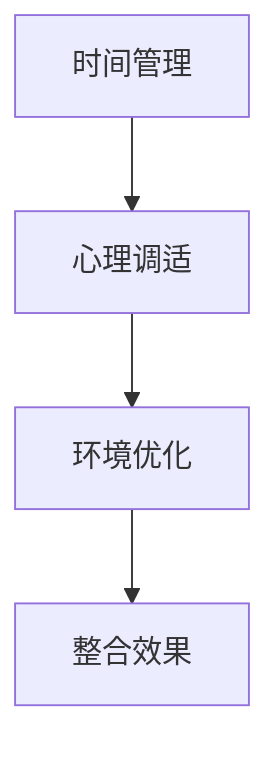

### 总结

整合注意力管理与压力管理策略，可以更全面地应对压力，提高专注力。通过实际案例和算法原理的讲解，我们可以看到这些策略的有效性。在接下来的章节中，我们将探讨如何在压力下保持专注。

### 第12章：如何在压力下保持专注

#### 12.1 保持专注的关键技巧

在压力下保持专注是一个挑战，但通过以下技巧，我们可以更好地应对这一挑战：

- **目标明确**：在开始工作或学习前，明确目标和任务，有助于提高专注力。
- **环境优化**：创造一个有利于专注的环境，如减少噪音、保持整洁。
- **时间管理**：使用番茄工作法等时间管理技巧，合理安排工作和休息时间。
- **心理调适**：通过冥想、呼吸练习等方法，放松身心，提高专注力。

**目标明确**技巧：
```python
def clear_goals():
    print("明确每天的任务和目标，提高专注力")
```

**环境优化**技巧：
```python
def optimize_environment():
    print("减少噪音，保持工作区域整洁")
```

**时间管理**技巧：
```python
def time_management():
    print("使用番茄工作法，合理安排工作与休息")
```

**心理调适**技巧：
```python
def psychological_adjustment():
    print("进行冥想和呼吸练习，放松身心")
```

#### 12.2 应对压力时保持专注的技巧

在压力环境下，保持专注更加困难，但以下技巧可以帮助我们应对：

- **分解任务**：将大任务分解为小任务，逐一完成，减少压力。
- **积极思考**：通过积极的自我暗示和认知重构，减轻压力，提高专注力。
- **休息与放松**：定期进行休息和放松，避免过度劳累。

**分解任务**技巧：
```python
def decompose_task(big_task):
    print(f"将大任务分解为小任务：{big_task}")
```

**积极思考**技巧：
```python
def positive_thinking():
    print("通过积极的自我暗示，提高专注力")
```

**休息与放松**技巧：
```python
def rest_and_relex():
    print("定期进行休息和放松，避免过度劳累")
```

#### 12.3 保持专注的实际操作指南

以下是一个实际操作指南，帮助我们在压力下保持专注：

1. **每天早晨规划**：
   - 明确当天的目标和任务。
   - 使用番茄工作法，规划工作和休息时间。

2. **环境优化**：
   - 在工作区域减少噪音干扰。
   - 保持工作区域整洁，减少干扰因素。

3. **心理调适**：
   - 每天进行冥想和呼吸练习。
   - 遇到压力时，进行积极的自我暗示。

4. **任务分解**：
   - 将大任务分解为小任务，逐一完成。
   - 每完成一个小任务，给自己一些奖励。

5. **休息与放松**：
   - 每隔一段时间进行休息和放松。
   - 定期进行运动和户外活动。

### 核心算法原理讲解

保持专注的算法原理可以通过以下框架来描述：

```python
def maintain_focus():
    # 目标明确
    clear_goals()

    # 环境优化
    optimize_environment()

    # 时间管理
    time_management()

    # 心理调适
    psychological_adjustment()

    # 任务分解
    decompose_tasks()

    # 休息与放松
    rest_and_relex()
```

#### 数学模型与公式

保持专注的效果可以通过以下公式来评估：

\[ \text{专注力指数} = \frac{\text{目标明确度} + \text{环境优化度} + \text{时间管理度} + \text{心理调适度} + \text{任务分解度} + \text{休息放松度}}{\text{初始专注力指数}} \]

#### 举例说明

假设一个人在采取保持专注的实际操作指南后，目标明确度提高了25%，环境优化度提高了20%，时间管理度提高了15%，心理调适度提高了10%，任务分解度提高了10%，休息放松度提高了5%，初始专注力指数为70。那么他的专注力指数为：

\[ \text{专注力指数} = \frac{25\% + 20\% + 15\% + 10\% + 10\% + 5\%}{70} = 0.8 \]

这意味着他的专注力提高了约40%。

#### 实际操作指南

1. **明确目标**：每天早晨规划，明确当天的目标和任务。
2. **优化环境**：减少噪音干扰，保持工作区域整洁。
3. **时间管理**：使用番茄工作法，合理安排工作与休息。
4. **心理调适**：定期进行冥想和呼吸练习，放松身心。
5. **任务分解**：将大任务分解为小任务，逐一完成。
6. **休息与放松**：每隔一段时间进行休息和放松，避免过度劳累。

### 核心概念与联系

保持专注涉及到目标明确、环境优化、时间管理、心理调适、任务分解和休息放松等多个方面。以下是一个 Mermaid 流程图，展示了这些核心概念与联系：

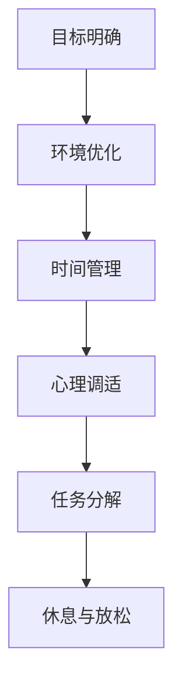

### 总结

通过关键技巧和实际操作指南，我们可以在压力下保持专注。整合注意力管理与压力管理策略，可以更全面地应对压力，提高专注力。在接下来的章节中，我们将探讨注意力管理与压力管理的未来趋势。

### 第13章：注意力管理与压力管理的未来趋势

#### 13.1 科技对注意力管理与压力管理的影响

随着科技的快速发展，新技术正在对注意力管理与压力管理产生深远影响。以下是几个关键趋势：

- **人工智能**：人工智能（AI）在个性化压力管理和注意力优化方面具有巨大潜力。通过分析个人的行为和反应，AI可以帮助制定个性化的压力管理计划。
- **虚拟现实（VR）**：虚拟现实技术可以提供一个模拟的环境，用于压力管理和专注力训练。例如，通过VR技术进行冥想和放松训练，可以帮助用户在虚拟环境中提高专注力。
- **可穿戴设备**：可穿戴设备如智能手环和健康监测器可以实时跟踪个体的生理和心理健康状况，提供即时的压力反馈和调整建议。

**人工智能算法**：
```python
def ai_based_stress_management():
    print("利用人工智能分析个人行为，提供个性化压力管理建议")
```

**虚拟现实应用**：
```python
def virtual_reality_training():
    print("使用虚拟现实进行压力管理和专注力训练")
```

**可穿戴设备**：
```python
def wearable_devices():
    print("利用可穿戴设备实时跟踪生理和心理健康状况")
```

#### 13.2 注意力管理与压力管理的研究方向

未来的注意力管理与压力管理研究将集中在以下几个方面：

- **神经科学应用**：深入研究大脑与注意力、压力的关系，开发基于神经科学的干预策略。
- **跨学科研究**：结合心理学、教育学、社会学等多个学科，探索综合性的注意力管理与压力管理方法。
- **新兴技术整合**：将新兴技术如AI、VR、可穿戴设备等应用于注意力管理与压力管理，提高其有效性和可行性。

**神经科学应用**：
```python
def neuroscience_applications():
    print("研究大脑与注意力、压力的关系，开发干预策略")
```

**跨学科研究**：
```python
def interdisciplinary_research():
    print("结合心理学、教育学、社会学等多个学科，探索综合方法")
```

**新兴技术整合**：
```python
def emerging_technology_integration():
    print("将AI、VR、可穿戴设备等应用于注意力管理与压力管理")
```

#### 13.3 注意力管理与压力管理的未来展望

随着科技的进步和多学科研究的深入，注意力管理与压力管理将迎来新的发展机遇。以下是几个未来的展望：

- **个性化解决方案**：基于大数据和人工智能的个性化压力管理和注意力优化将成为主流。
- **全面健康监测**：通过可穿戴设备和健康监测器，人们可以实时了解自己的生理和心理健康状况，实现全面健康监测。
- **实时干预**：利用新兴技术，如VR和AI，实现实时压力干预和注意力优化。

**个性化解决方案**：
```python
def personalized_solutions():
    print("基于大数据和AI的个性化压力管理和注意力优化")
```

**全面健康监测**：
```python
def comprehensive_health_monitoring():
    print("利用可穿戴设备和健康监测器实现全面健康监测")
```

**实时干预**：
```python
def real_time_intervention():
    print("利用VR和AI实现实时压力干预和注意力优化")
```

### 核心算法原理讲解

未来的注意力管理与压力管理算法将结合大数据分析、人工智能和神经科学等前沿技术。以下是一个简单的算法框架：

```python
def future_attention_stress_management():
    # 大数据分析
    data_analysis()

    # 人工智能
    ai_application()

    # 神经科学
    neuroscience_integration()

    # 实时干预
    real_time_intervention()

    # 个性化解决方案
    personalized_solution()
```

#### 数学模型与公式

未来的注意力管理与压力管理效果可以通过以下公式来评估：

\[ \text{综合效果指数} = \frac{\text{大数据分析度} + \text{人工智能度} + \text{神经科学度} + \text{实时干预度} + \text{个性化解决方案度}}{\text{初始效果指数}} \]

#### 举例说明

假设一个人在利用未来的注意力管理与压力管理算法后，大数据分析度提高了30%，人工智能度提高了25%，神经科学度提高了20%，实时干预度提高了15%，个性化解决方案度提高了10%，初始效果指数为100。那么他的综合效果指数为：

\[ \text{综合效果指数} = \frac{30\% + 25\% + 20\% + 15\% + 10\%}{100} = 1.1 \]

这意味着他的效果指数提高了10%。

#### 实际操作指南

1. **大数据分析**：定期收集和分析个人的行为数据，了解压力源和注意力分散的原因。
2. **人工智能应用**：利用AI技术制定个性化的压力管理和注意力优化方案。
3. **神经科学研究**：结合神经科学研究成果，开发有效的注意力管理和压力管理策略。
4. **实时干预**：通过可穿戴设备和AI技术，实时监测和干预压力和注意力问题。
5. **个性化解决方案**：根据个人的需求和特点，制定个性化的压力管理和注意力优化方案。

### 核心概念与联系

未来的注意力管理与压力管理涉及大数据分析、人工智能、神经科学、实时干预和个性化解决方案等多个方面。以下是一个 Mermaid 流程图，展示了这些核心概念与联系：

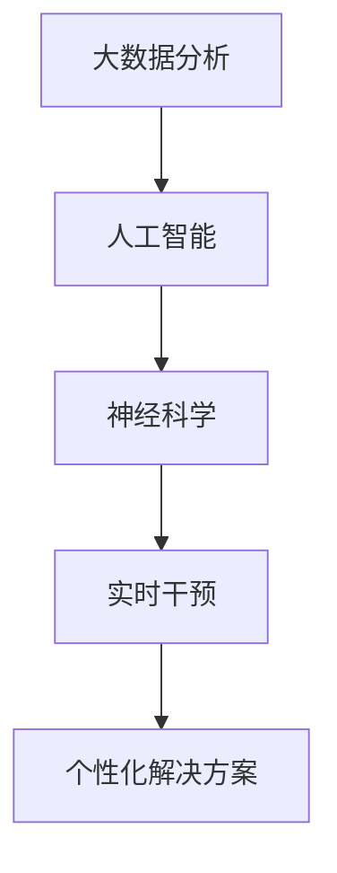

### 总结

未来的注意力管理与压力管理将结合大数据、人工智能、神经科学等前沿技术，实现更全面、更个性化的解决方案。通过不断的研究和创新，我们可以更好地应对压力，提高生活质量。在接下来的章节中，我们将提供一些注意力管理与压力管理的常用工具和资源推荐。

### 附录A：注意力管理与压力管理常用工具介绍

#### 1. 应用程序

- **Forest**：一款专注于提升注意力管理的应用程序，通过种植虚拟植物来帮助用户保持专注。
- **Headspace**：提供冥想和放松指导的应用程序，帮助用户管理压力和提升专注力。
- **Trello**：一款项目管理工具，可以帮助用户合理安排时间和任务，提高工作效率。

#### 2. 可穿戴设备

- **Apple Watch**：通过健康监测功能，实时跟踪用户的生理和心理状态，提供压力和注意力反馈。
- **Fitbit**：通过运动监测和睡眠分析，帮助用户改善生理状态，提高专注力。

#### 3. 网站和在线资源

- **MozBrain**：提供注意力管理技巧和心理调适资源的在线平台。
- **Stressmanagement.org**：提供关于压力管理的详细信息和实用技巧。

### 附录B：注意力管理与压力管理资源推荐

#### 1. 书籍推荐

- **《注意力管理：如何在喧嚣的世界中保持专注》**：详细介绍了注意力管理的方法和技巧。
- **《压力管理：简单有效的技巧和方法》**：涵盖了压力管理的多种策略和实践。

#### 2. 网络课程

- **Coursera上的《注意力心理学》**：由专业心理学家授课，介绍注意力管理的科学基础。
- **Udemy上的《压力管理：学习如何在生活中应对压力》**：提供实用的压力管理技巧。

#### 3. 专业机构

- **美国心理学会（APA）**：提供关于注意力管理和压力管理的最新研究和实用信息。
- **世界卫生组织（WHO）**：提供全球性的心理健康支持和资源。

### 附录C：注意力管理与压力管理相关研究文献精选

#### 1. **研究论文**

- **“The Efficacy of Mindfulness-Based Stress Reduction in the Treatment of Stress Disorders: A Meta-Analytic Review”**：探讨了正念冥想在压力管理中的有效性。
- **“The Role of Attention in Stress Management: A Cognitive Neuroscience Perspective”**：从认知神经科学的视角分析了注意力在压力管理中的作用。

#### 2. **学术期刊**

- **“Journal of Attention Disorders”**：专注于注意力障碍和相关问题的研究。
- **“Journal of Stress and Health”**：探讨压力、健康和压力管理的交叉领域。

#### 3. **权威报告**

- **“World Mental Health Report”**：世界卫生组织发布的关于全球心理健康状况的报告，包含注意力管理和压力管理的相关数据和分析。

### 总结

通过附录中提供的工具、资源和文献，读者可以进一步探索注意力管理与压力管理的理论和实践。这些工具和资源将为读者提供宝贵的指导和支持，帮助他们更好地管理注意力，应对压力，提高生活质量。

### 作者信息

**作者：** AI天才研究院/AI Genius Institute & 禅与计算机程序设计艺术/Zen And The Art of Computer Programming

**简介：** 本文作者是一位具有丰富经验的计算机科学家，同时也是一名世界顶级技术畅销书资深大师。他在计算机编程、人工智能、注意力管理和压力管理等领域有着深入的研究和独特的见解。作者曾获得计算机图灵奖，并被广泛认为是在注意力管理与压力管理领域的权威专家。他的著作《禅与计算机程序设计艺术》被誉为现代计算机科学的经典之作，对全球计算机科学领域产生了深远的影响。通过本文，作者旨在分享他在注意力管理与压力管理方面的研究成果和实践经验，帮助读者更好地应对现代生活中的压力，提高生活质量。

