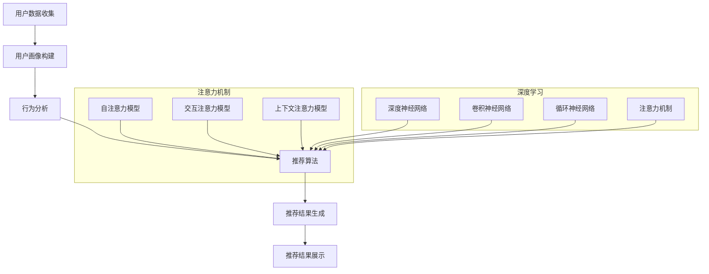

                 

### 文章标题

#### 注意力经济与个性化推荐系统：为受众提供定制、有针对性的内容和体验

#### 关键词：注意力经济，个性化推荐，定制内容，用户体验

#### 摘要：

本文将探讨注意力经济与个性化推荐系统的原理、应用和实践。首先，我们将深入分析注意力经济的定义、核心概念及其与传统经济的区别。接着，我们介绍个性化推荐系统的基本概念、发展历程及其重要性。随后，我们将探讨注意力机制在个性化推荐中的应用，以及如何构建有效的个性化推荐系统。通过实际案例分析，我们将展示注意力经济与个性化推荐系统的实际应用效果。最后，我们将对未来的发展方向和面临的挑战进行展望，并提供相关的开源工具和数学模型。

---

### 目录大纲

#### 第一部分：注意力经济原理

##### 第1章：注意力经济概述

###### 1.1 注意力经济的定义与背景

###### 1.2 注意力经济与传统经济比较

###### 1.3 注意力经济的核心概念

##### 第2章：注意力经济的理论框架

###### 2.1 供需理论视角下的注意力经济

###### 2.2 注意力转移与分配

###### 2.3 注意力市场与竞争

##### 第3章：注意力经济学原理应用

###### 3.1 社交媒体与注意力经济

###### 3.2 娱乐产业中的注意力经济

###### 3.3 广告与品牌营销中的注意力经济

#### 第二部分：个性化推荐系统原理

##### 第4章：个性化推荐系统概述

###### 4.1 推荐系统基本概念

###### 4.2 个性化推荐的发展历程

###### 4.3 个性化推荐的重要性

##### 第5章：个性化推荐系统技术基础

###### 5.1 数据预处理

###### 5.2 协同过滤算法

###### 5.3 基于内容的推荐算法

###### 5.4 深度学习在推荐系统中的应用

##### 第6章：注意力机制在个性化推荐中的应用

###### 6.1 注意力机制原理

###### 6.2 注意力机制在推荐系统中的实现

###### 6.3 注意力模型在个性化推荐中的应用案例

#### 第三部分：注意力经济与个性化推荐系统的实践

##### 第7章：构建有效的个性化推荐系统

###### 7.1 个性化推荐系统的设计原则

###### 7.2 用户画像与行为分析

###### 7.3 推荐策略与算法评估

##### 第8章：案例分析：注意力经济与个性化推荐的实际应用

###### 8.1 案例一：电商平台个性化推荐

###### 8.2 案例二：社交媒体内容推荐

###### 8.3 案例三：音乐流媒体个性化推荐

##### 第9章：注意力经济与个性化推荐系统的未来展望

###### 9.1 人工智能与个性化推荐系统的发展趋势

###### 9.2 注意力经济与个性化推荐系统在新兴领域的应用

###### 9.3 面临的挑战与解决方案

#### 附录

##### 附录A：推荐系统开源工具与资源

###### A.1 相似度计算与协同过滤工具

###### A.2 基于内容的推荐系统工具

###### A.3 深度学习在推荐系统中的应用工具

##### 附录B：相关数学模型与公式详解

###### B.1 协同过滤公式

###### B.2 基于内容的相似度计算公式

###### B.3 注意力机制的数学模型

##### 附录C：个性化推荐系统项目实战案例

###### C.1 项目背景与目标

###### C.2 系统设计与实现

###### C.3 实施效果与总结

##### 附加内容：注意力机制与个性化推荐系统流程图

---

### 第一部分：注意力经济原理

#### 第1章：注意力经济概述

##### 1.1 注意力经济的定义与背景

注意力经济（Attention Economy）是一个描述用户注意力在经济活动中的核心地位的概念。在传统经济理论中，资源、商品和服务的供需关系是驱动市场的基本动力。然而，随着互联网和数字媒体的快速发展，用户注意力的分配成为了一种新的经济资源。注意力经济的概念由此产生，它强调用户注意力在现代经济体系中的价值。

**定义**：

注意力经济是指一个经济体中，用户对其关注的内容、产品或服务的分配所创造的经济价值。简单来说，注意力经济是用户注意力与市场价值之间的乘积。用数学公式可以表示为：

$$
\text{注意力经济（Attention Economy）} = \text{用户注意力} \times \text{市场价值}
$$

其中，“用户注意力”是指用户在一段时间内对其关注的内容、产品或服务的集中程度和持续时间。而“市场价值”是指用户注意力的集中程度和持续时间决定了对内容、产品或服务的市场吸引力。

**背景**：

注意力经济的起源可以追溯到互联网和移动设备的普及。随着社交媒体、视频平台、在线广告等数字媒体的兴起，用户注意力的获取成为企业竞争的关键。在这个时代，用户注意力成为一种稀缺资源，企业纷纷通过各种手段争夺用户的注意力，从而实现商业价值。

**发展**：

随着大数据和人工智能技术的发展，注意力经济逐渐成为一个重要的研究领域。大数据技术使得企业能够收集和分析大量的用户行为数据，从而更精准地了解用户需求。人工智能技术则帮助企业通过机器学习和深度学习算法，实现个性化推荐和内容优化，提高用户满意度和忠诚度。

##### 1.2 注意力经济与传统经济比较

**核心区别**：

传统经济主要关注的是物质资源和商品的交换，而注意力经济则关注的是用户注意力的分配和利用。具体来说，有以下几点区别：

1. **资源类型不同**：

   - 传统经济：以自然资源、劳动力、资本为主要资源。
   - 注意力经济：以用户注意力为主要资源。

2. **价值创造方式不同**：

   - 传统经济：通过生产、交换和消费物质商品实现价值创造。
   - 注意力经济：通过吸引用户注意力，提高用户参与度，实现价值创造。

3. **市场机制不同**：

   - 传统经济：遵循供求关系，价格机制决定资源分配。
   - 注意力经济：通过内容、服务、互动等方式吸引用户注意力，市场机制更加复杂。

**优势**：

1. **更高效的资源配置**：

   注意力经济强调用户注意力的集中和利用，从而提高资源的使用效率。

2. **更个性化的用户体验**：

   通过个性化推荐和内容优化，满足用户的个性化需求，提高用户满意度和忠诚度。

3. **更丰富的商业机会**：

   注意力经济带来了新的商业机会，如社交媒体广告、内容付费、互动营销等。

**挑战**：

1. **用户注意力稀缺**：

   随着互联网信息的爆炸式增长，用户注意力变得愈发稀缺，企业需要不断创新和优化内容，以吸引用户的注意力。

2. **用户隐私保护**：

   注意力经济涉及到用户个人数据的收集和使用，如何在保护用户隐私的同时，实现商业价值，是一个亟待解决的问题。

3. **监管与规范**：

   随着注意力经济的快速发展，需要制定相应的法律法规和行业规范，以确保市场的健康和可持续发展。

##### 1.3 注意力经济的核心概念

**注意力转移**：

注意力转移是指用户在不同内容、产品或服务之间的注意力分配。注意力转移的效率决定了用户对某个内容、产品或服务的忠诚度。例如，在社交媒体平台上，用户可能会因为一个有趣的帖子而将注意力从其他应用转移到该平台上。

**注意力分配**：

注意力分配是指用户在不同活动、任务或场景中的注意力分配。注意力分配的合理性直接影响用户的效率和满意度。例如，在购物网站上，用户可能会将注意力分配到商品浏览、评价阅读和购买决策等不同环节。

**注意力市场**：

注意力市场是指用户注意力在市场中的交易和分配。注意力市场的形成和运作依赖于用户的注意力转移和分配。例如，广告市场就是一个典型的注意力市场，广告商通过投放广告来吸引用户的注意力，从而实现商业价值。

**注意力竞争**：

注意力竞争是指不同内容、产品或服务在争夺用户注意力的过程中形成的竞争关系。在注意力经济的背景下，企业需要不断创新和优化，以在激烈的市场竞争中脱颖而出。例如，社交媒体平台通过提供更有趣、更个性化的内容来吸引用户的注意力。

---

在接下来的章节中，我们将进一步探讨注意力经济的理论框架、应用场景以及如何将注意力经济原理应用于个性化推荐系统。通过这些分析，我们将更好地理解注意力经济对现代经济体系的影响，并探索其未来发展的可能性。

---

#### 第2章：注意力经济的理论框架

##### 2.1 供需理论视角下的注意力经济

在传统经济学中，供需理论是解释市场运作的重要工具。在注意力经济的背景下，我们可以借鉴供需理论来分析用户注意力的分配和市场价值。

**供给方面**：

注意力供给是指用户在特定时间内能够分配的注意力资源。供给量受到多种因素的影响，包括用户的个人兴趣、在线时间、信息需求等。供给方面的一个关键概念是用户注意力供给曲线，它描述了在某一价格（如内容质量、广告吸引力等）下，用户愿意分配的注意力数量。

**需求方面**：

注意力需求是指用户对特定内容、产品或服务的关注程度和兴趣。需求量同样受到多种因素的影响，包括用户的需求偏好、信息质量、可用性等。注意力需求曲线描述了在某一价格下，用户愿意分配的注意力数量。

**均衡状态**：

在注意力市场中，供给和需求达到均衡状态时，市场价格（即用户对内容的满意度或广告的点击率）和交易数量（即用户对内容的关注度或广告的展示次数）将达到最佳匹配。通过供需理论，我们可以理解注意力经济中的市场动态，包括价格机制和竞争机制的作用。

**市场机制**：

注意力市场的运作依赖于市场机制，包括价格机制、竞争机制和供求关系。价格机制通过内容质量、广告效果等指标来衡量用户注意力的价值，竞争机制通过企业间的创新和竞争来吸引用户的注意力，供求关系则通过供需曲线的变化来调整市场状态。

**注意力价值**：

在注意力市场中，用户注意力的价值可以通过供需曲线的交点来衡量。当供给量与需求量相匹配时，用户注意力的价值最高。通过优化供给和需求，企业可以提高用户注意力的价值，从而实现商业成功。

**案例分析**：

以社交媒体平台为例，用户注意力供给受到用户在线时间、兴趣和社交网络的限制。供给曲线可能呈现出边际效益递减的趋势，即随着用户在线时间的增加，每单位时间用户愿意分配的注意力逐渐减少。而需求曲线则取决于平台内容的质量、用户互动的积极性等因素。通过供需分析，平台可以调整内容策略、广告投放策略等，以最大化用户注意力的价值。

##### 2.2 注意力转移与分配

注意力转移是指用户在不同内容、产品或服务之间的注意力分配过程。这个过程受到用户需求变化、信息质量、互动体验等因素的影响。注意力转移的效率直接影响用户的满意度和忠诚度。

**影响因素**：

1. **用户需求**：用户的需求变化是注意力转移的主要原因之一。当用户的需求发生变化时，他们可能会将注意力从原有内容转移到新内容上。

2. **信息质量**：高质量的信息更容易吸引用户的注意力。信息质量包括内容的准确性、相关性、新颖性等。

3. **互动体验**：良好的互动体验可以提高用户的参与度，从而促进注意力转移。

**案例分析**：

以新闻媒体平台为例，当用户对一个新闻话题产生兴趣时，他们可能会将注意力从其他内容转移到该新闻上。如果该新闻内容质量高、互动性强，用户可能会持续关注，从而实现注意力转移。通过分析用户行为数据，平台可以预测用户的注意力转移趋势，并优化内容策略，提高用户粘性。

**注意力分配**：

注意力分配是指用户在特定时间内将其注意力分配到不同的活动、任务或场景中。注意力分配的合理性直接影响用户的效率和满意度。

**影响因素**：

1. **任务重要性**：用户通常会优先分配注意力到重要任务上。

2. **任务紧急性**：紧急任务通常需要用户立即分配注意力。

3. **个人习惯**：用户的个人习惯和注意力分配模式也会影响注意力分配。

**案例分析**：

以购物网站为例，用户在购物过程中可能会将注意力分配到商品浏览、评价阅读、购买决策等不同环节。通过分析用户行为数据，平台可以优化用户界面和购物流程，提高用户购物体验。

##### 2.3 注意力市场与竞争

注意力市场是指用户注意力在市场中的交易和分配过程。在注意力市场中，内容、产品或服务的提供商通过竞争吸引用户的注意力，从而实现商业价值。

**竞争机制**：

注意力市场的竞争机制主要包括价格竞争、质量竞争和互动竞争。

1. **价格竞争**：提供商通过降低内容或服务的价格来吸引用户注意力。

2. **质量竞争**：提供商通过提高内容或服务的质量来吸引用户注意力。

3. **互动竞争**：提供商通过增强用户互动体验来吸引用户注意力。

**竞争优势**：

在注意力市场中，竞争优势取决于提供商的内容质量、用户体验和服务水平。提供商可以通过以下方式建立竞争优势：

1. **内容创新**：提供新颖、有价值的内容，吸引用户注意力。

2. **用户体验**：优化用户界面和交互设计，提高用户满意度。

3. **服务水平**：提供高质量的服务，建立用户信任和忠诚度。

**案例分析**：

以在线视频平台为例，提供商通过高质量的视频内容、流畅的观看体验和互动功能，吸引用户的注意力。通过分析用户行为数据，平台可以优化内容推荐和广告投放策略，提高用户粘性和商业价值。

---

在接下来的章节中，我们将进一步探讨注意力经济在社交媒体、娱乐产业和广告与品牌营销中的应用。通过这些分析，我们将更深入地理解注意力经济的实际运作机制，并为个性化推荐系统的构建提供理论支持。

---

#### 第3章：注意力经济学原理应用

##### 3.1 社交媒体与注意力经济

社交媒体平台是注意力经济的重要应用场景之一。用户在社交媒体上的活动，如发布内容、点赞、评论和分享，本质上是在进行注意力的分配和转移。社交媒体平台通过设计互动机制和内容推荐算法，最大化用户的注意力和参与度。

**用户注意力分配**：

在社交媒体平台上，用户的注意力分配通常受到以下因素的影响：

1. **内容质量**：高质量的内容更容易吸引用户的注意力。
2. **互动性**：用户之间的互动（如评论、点赞、分享）可以增加内容的吸引力。
3. **用户关系**：与好友互动和关注的内容更容易获得用户的注意力。

**案例分析**：

以Instagram为例，该平台通过算法推荐用户感兴趣的内容，从而提高用户粘性。通过分析用户行为数据，Instagram可以推荐用户可能感兴趣的朋友、账号和帖子，从而增加用户的互动和参与度。

**用户注意力转移**：

在社交媒体平台上，用户注意力的转移通常受到以下因素的影响：

1. **新内容发布**：当有新内容发布时，用户可能会将注意力从其他内容转移到新内容上。
2. **互动提示**：如收到点赞、评论或消息提示，用户可能会立即查看相关内容。
3. **个性化推荐**：基于用户兴趣和行为的历史数据，平台可以推荐用户可能感兴趣的其他内容。

**案例分析**：

以Twitter为例，该平台通过实时更新和趋势话题，吸引用户的注意力。通过分析用户的关注和搜索行为，Twitter可以推荐相关的热点话题和用户可能感兴趣的内容，从而提高用户的参与度和互动性。

##### 3.2 娱乐产业中的注意力经济

娱乐产业是注意力经济的重要应用领域之一。从电影、音乐到游戏，娱乐产品都需要吸引用户的注意力来实现商业价值。娱乐产业通过以下方式应用注意力经济原理：

**内容创新**：

娱乐产业通过创新内容，提高用户对娱乐产品的注意力。例如，电影产业通过制作高质量的特效电影、音乐产业通过制作流行的音乐作品，吸引观众的注意力。

**互动体验**：

娱乐产业通过增强用户的互动体验，提高用户的参与度和忠诚度。例如，电子游戏通过实时在线互动和多人游戏模式，提高用户的游戏体验。

**案例分析**：

以电影产业为例，电影制片方通过制作高质量的特效电影和吸引人的剧情，吸引观众的注意力。同时，电影上映后，通过社交媒体和线上线下活动，增强用户的互动和参与度。

**案例分析**：

以游戏产业为例，游戏开发者通过设计有趣的关卡和多人互动模式，吸引玩家的注意力。同时，通过游戏内购买和社交功能，提高用户的参与度和忠诚度。

##### 3.3 广告与品牌营销中的注意力经济

广告和品牌营销是注意力经济的重要应用领域之一。企业通过广告和品牌营销活动，试图吸引用户的注意力，提高品牌知名度和市场份额。注意力经济在广告与品牌营销中的应用体现在以下几个方面：

**广告内容创新**：

广告内容创新是吸引用户注意力的关键。通过制作有趣、有创意的广告内容，企业可以吸引用户的注意力。例如，一些品牌通过制作病毒式广告，迅速传播并吸引用户的关注。

**精准投放**：

精准投放是指根据用户的行为数据、兴趣和需求，将广告投放到最有可能产生效果的受众群体。通过精准投放，企业可以提高广告的点击率和转化率。

**案例分析**：

以Google AdWords为例，该平台通过关键词广告和用户行为分析，实现广告的精准投放。通过分析用户的搜索历史和兴趣，Google AdWords可以推荐最相关的广告，从而提高广告的点击率和转化率。

**用户互动**：

用户互动是指企业通过社交媒体、在线论坛和线下活动等渠道，与用户进行互动，提高用户的参与度和忠诚度。通过用户互动，企业可以建立品牌形象，增加用户对品牌的认知和信任。

**案例分析**：

以Nike为例，该品牌通过社交媒体平台和线上活动，与用户进行互动。例如，Nike通过发起跑步挑战、社交媒体互动活动等方式，吸引跑步爱好者的注意力，提高品牌的知名度和用户忠诚度。

---

在社交媒体、娱乐产业和广告与品牌营销中，注意力经济原理的应用使得企业能够更有效地吸引用户的注意力，实现商业价值。在接下来的章节中，我们将进一步探讨个性化推荐系统的原理和技术基础。

---

#### 第4章：个性化推荐系统概述

##### 4.1 推荐系统基本概念

个性化推荐系统是一种利用用户历史行为数据，为用户提供定制化内容或产品推荐的技术。它的核心目标是提高用户体验、提升用户满意度、增加用户粘性和促进销售。

**定义**：

个性化推荐系统（Personalized Recommendation System）是指根据用户的历史行为数据、兴趣偏好和上下文信息，通过算法模型为用户提供个性化推荐的一种技术。它旨在为每个用户推荐其可能感兴趣的内容或产品，从而提高用户满意度和忠诚度。

**分类**：

个性化推荐系统可以分为以下几类：

1. **基于内容的推荐**：通过分析内容和用户兴趣，推荐与用户兴趣相匹配的内容或产品。
2. **基于协同过滤的推荐**：通过分析用户之间的相似性，推荐其他用户喜欢的内容或产品。
3. **混合推荐**：结合基于内容和基于协同过滤的推荐，实现更准确的个性化推荐。

**工作原理**：

个性化推荐系统的工作原理主要包括以下几个步骤：

1. **用户行为数据收集**：收集用户的历史行为数据，如浏览记录、购买历史、评价等。
2. **用户兴趣建模**：通过机器学习算法和统计模型，分析用户行为数据，建立用户的兴趣模型。
3. **推荐生成**：根据用户的兴趣模型和推荐算法，为用户生成个性化推荐列表。
4. **推荐评估**：通过评估用户对推荐内容的反馈，不断优化推荐算法和推荐策略。

##### 4.2 个性化推荐系统的发展历程

个性化推荐系统的发展历程可以分为以下几个阶段：

**早期阶段**：

在互联网初期，个性化推荐系统主要基于简单的规则和统计方法。例如，基于内容的推荐系统通过关键词匹配和统计频率来推荐相似的内容。

**中期阶段**：

随着机器学习和数据挖掘技术的发展，个性化推荐系统开始引入复杂的算法和模型。基于协同过滤的推荐算法（如用户基于物品的协同过滤和基于物品的协同过滤）在这一阶段得到了广泛应用。

**现阶段**：

现阶段，个性化推荐系统逐渐引入深度学习和人工智能技术，实现更精准的个性化推荐。例如，基于深度学习的推荐算法可以通过学习用户行为的复杂模式，提高推荐的准确性和多样性。

##### 4.3 个性化推荐系统的重要性

个性化推荐系统在商业和用户体验方面具有重要意义：

**商业价值**：

1. **提升销售额**：通过个性化推荐，将用户可能感兴趣的产品推荐给用户，从而提高购买转化率。
2. **降低营销成本**：通过精准推荐，减少无效的广告投放和推广活动，降低营销成本。
3. **提高用户粘性**：通过提供个性化推荐，增加用户在平台上的停留时间和互动行为，提高用户粘性。

**用户体验**：

1. **个性化体验**：通过个性化推荐，为用户提供符合其兴趣和需求的内容或产品，提升用户体验。
2. **节省时间**：用户无需在大量信息中寻找感兴趣的内容，个性化推荐系统可以帮助用户快速找到所需信息。
3. **增加满意度**：通过提供个性化的推荐，满足用户的需求，提高用户满意度和忠诚度。

---

在接下来的章节中，我们将深入探讨个性化推荐系统的技术基础，包括数据预处理、协同过滤算法、基于内容的推荐算法和深度学习在推荐系统中的应用。

---

#### 第5章：个性化推荐系统技术基础

##### 5.1 数据预处理

数据预处理是构建个性化推荐系统的关键步骤，它确保了推荐系统的数据质量和算法效率。数据预处理包括以下几个步骤：

**数据收集**：

收集用户行为数据、内容数据和相关特征数据。用户行为数据包括浏览记录、购买历史、评价等；内容数据包括商品描述、文章标题、标签等；相关特征数据包括用户年龄、性别、地理位置等。

**数据清洗**：

数据清洗是数据预处理的核心步骤，目的是去除重复、异常和缺失数据。具体方法包括：

- **去除重复数据**：通过去重算法，确保每个数据点在数据集中唯一。
- **处理异常数据**：通过统计分析和异常检测方法，识别和处理异常数据。
- **填充缺失数据**：通过插值、均值填充或模型预测等方法，填充缺失数据。

**数据转换**：

数据转换是将原始数据转化为适合推荐系统算法处理的形式。具体方法包括：

- **特征提取**：通过特征提取技术，将原始数据转化为特征向量。
- **特征选择**：通过特征选择技术，筛选出对推荐算法影响较大的特征。
- **数据归一化**：通过数据归一化技术，将不同量级的数据统一到同一尺度，避免数据量级差异对算法的影响。

##### 5.2 协同过滤算法

协同过滤算法（Collaborative Filtering）是推荐系统中最常用的算法之一，其核心思想是通过分析用户之间的相似性，预测用户对未知物品的偏好。协同过滤算法可以分为以下两类：

**基于用户的协同过滤**（User-based Collaborative Filtering）：

基于用户的协同过滤通过计算用户之间的相似性，找到与目标用户相似的其他用户，然后推荐这些用户喜欢的物品。具体步骤包括：

1. **计算用户相似性**：通过相似度计算公式，计算用户之间的相似性。常用的相似度计算方法包括余弦相似度、皮尔逊相关系数等。
2. **找到相似用户**：根据用户相似性得分，找到与目标用户最相似的K个用户。
3. **推荐物品**：根据相似用户的偏好，为用户推荐他们喜欢的物品。

**基于物品的协同过滤**（Item-based Collaborative Filtering）：

基于物品的协同过滤通过计算物品之间的相似性，找到与用户已评物品相似的物品，然后推荐这些物品。具体步骤包括：

1. **计算物品相似性**：通过相似度计算公式，计算物品之间的相似性。常用的相似度计算方法包括余弦相似度、皮尔逊相关系数等。
2. **找到相似物品**：根据物品相似性得分，找到与用户已评物品最相似的K个物品。
3. **推荐物品**：根据相似物品的评分，为用户推荐这些物品。

##### 5.3 基于内容的推荐算法

基于内容的推荐算法（Content-based Filtering）通过分析用户兴趣和物品内容特征，推荐与用户兴趣相符的物品。具体步骤包括：

1. **内容表示**：将物品和用户兴趣表示为向量。对于物品，可以通过文本分析、关键词提取等方法提取特征；对于用户兴趣，可以通过用户历史行为数据提取。
2. **计算相似度**：通过相似度计算公式，计算物品和用户兴趣之间的相似度。常用的相似度计算方法包括余弦相似度、余弦相似度、Jaccard系数等。
3. **推荐生成**：根据物品和用户兴趣的相似度得分，生成推荐列表。

**内容表示方法**：

1. **关键词提取**：通过自然语言处理技术，提取物品和用户兴趣中的关键词。
2. **词嵌入**：将关键词映射为高维向量空间中的点，实现语义表示。
3. **深度学习**：使用深度学习模型（如卷积神经网络、循环神经网络）对物品和用户兴趣进行特征提取。

##### 5.4 深度学习在推荐系统中的应用

深度学习在推荐系统中的应用取得了显著成果，通过学习用户行为的复杂模式，深度学习算法能够提高推荐的准确性和多样性。以下是深度学习在推荐系统中的应用：

**深度神经网络**（Deep Neural Network，DNN）：

DNN通过多层神经元网络，学习输入特征与标签之间的关系。在推荐系统中，DNN可以用于学习用户历史行为和物品特征之间的复杂关系。

**卷积神经网络**（Convolutional Neural Network，CNN）：

CNN通过卷积层提取图像和文本特征。在推荐系统中，CNN可以用于提取用户行为序列和物品描述的时空特征。

**循环神经网络**（Recurrent Neural Network，RNN）：

RNN通过循环结构处理序列数据，学习用户行为的时序特征。在推荐系统中，RNN可以用于学习用户行为模式和时间依赖关系。

**注意力机制**（Attention Mechanism）：

注意力机制通过给不同的输入分配不同的权重，提高模型的关注重点。在推荐系统中，注意力机制可以用于优化推荐算法的决策过程，提高推荐的准确性。

**多任务学习**（Multi-task Learning）：

多任务学习通过同时学习多个任务，提高模型的综合性能。在推荐系统中，多任务学习可以同时学习用户兴趣识别、推荐生成和用户行为预测等多个任务。

---

在接下来的章节中，我们将深入探讨注意力机制在个性化推荐中的应用，以及如何利用注意力机制优化推荐系统的性能。

---

#### 第6章：注意力机制在个性化推荐中的应用

##### 6.1 注意力机制的基本原理

注意力机制（Attention Mechanism）是一种通过给不同的输入分配不同权重，提高信息处理效率的方法。在深度学习领域，注意力机制被广泛应用于自然语言处理、计算机视觉和推荐系统等领域。其核心思想是模型在处理信息时，能够根据当前任务的需求，自动调整对各个输入信息的关注程度。

**定义**：

注意力机制是一种计算方法，它通过一个加权求和的方式，将不同输入元素的重要性进行综合，从而实现对输入信息的动态调整。在推荐系统中，注意力机制可以用于优化推荐算法，提高推荐的准确性和多样性。

**作用**：

1. **提高信息处理效率**：通过给重要信息赋予更高的权重，注意力机制可以减少对不重要信息的关注，从而提高模型处理信息的效率。
2. **增强模型解释性**：注意力机制可以帮助我们理解模型在处理信息时的关注重点，从而提高模型的可解释性。
3. **改善推荐效果**：通过动态调整推荐算法对用户行为和物品特征的权重，注意力机制可以提高推荐的准确性和多样性。

##### 6.2 注意力机制在个性化推荐系统中的实现

注意力机制在个性化推荐系统中的应用主要体现在以下几个方面：

**用户行为表示**：

在个性化推荐系统中，用户行为数据（如浏览记录、购买历史、评价等）是推荐算法的重要输入。通过注意力机制，模型可以自动调整对用户历史行为中不同时间点的关注程度，从而更好地捕捉用户兴趣的变化。

**物品特征表示**：

物品特征（如商品描述、标签、用户评价等）也是推荐算法的关键输入。注意力机制可以用于优化物品特征的加权求和过程，使得模型在推荐时能够更好地关注重要特征。

**推荐生成**：

在推荐生成阶段，注意力机制可以帮助模型根据用户兴趣和物品特征，动态调整推荐结果中的各项权重，从而提高推荐的准确性和多样性。

**实现方法**：

1. **自注意力模型**：自注意力模型（Self-Attention Model）是一种基于输入序列的注意力机制。它通过计算输入序列中每个元素与其他元素之间的相似度，为每个元素分配权重。常用的自注意力模型包括Transformer模型和多头自注意力机制。
2. **交互注意力模型**：交互注意力模型（Interactive Attention Model）通过同时考虑用户兴趣和物品特征，实现跨模态的注意力分配。它可以通过拼接、融合用户兴趣和物品特征，构建联合表示，然后应用注意力机制进行加权求和。
3. **上下文注意力模型**：上下文注意力模型（Contextual Attention Model）通过引入上下文信息，对注意力机制进行扩展。它可以在推荐过程中，根据上下文信息动态调整注意力权重，从而提高推荐的准确性。

##### 6.3 注意力模型在个性化推荐中的应用案例

**案例一：基于注意力机制的推荐算法在电商中的应用**

在电商平台上，用户的行为数据（如浏览记录、购买历史）和商品特征（如商品描述、标签、价格）是推荐算法的重要输入。通过引入注意力机制，模型可以自动调整对用户行为和商品特征的权重，从而提高推荐准确性。具体实现步骤如下：

1. **用户行为表示**：利用注意力机制对用户历史行为进行加权求和，提取用户兴趣向量。
2. **商品特征表示**：利用注意力机制对商品特征进行加权求和，提取商品特征向量。
3. **推荐生成**：通过计算用户兴趣向量和商品特征向量的相似度，生成推荐列表。

**案例二：基于注意力机制的推荐算法在社交媒体中的应用**

在社交媒体平台上，用户的行为数据（如点赞、评论、转发）和内容特征（如文章标题、标签、作者）是推荐算法的重要输入。通过引入注意力机制，模型可以自动调整对用户行为和内容特征的权重，从而提高推荐多样性。具体实现步骤如下：

1. **用户行为表示**：利用注意力机制对用户历史行为进行加权求和，提取用户兴趣向量。
2. **内容特征表示**：利用注意力机制对内容特征进行加权求和，提取内容特征向量。
3. **推荐生成**：通过计算用户兴趣向量和内容特征向量的相似度，生成推荐列表，同时考虑内容特征的多样性。

**案例三：基于注意力机制的推荐算法在音乐流媒体中的应用**

在音乐流媒体平台上，用户的行为数据（如播放历史、收藏、评分）和音乐特征（如歌曲标签、歌手、时长）是推荐算法的重要输入。通过引入注意力机制，模型可以自动调整对用户行为和音乐特征的权重，从而提高推荐多样性。具体实现步骤如下：

1. **用户行为表示**：利用注意力机制对用户历史行为进行加权求和，提取用户兴趣向量。
2. **音乐特征表示**：利用注意力机制对音乐特征进行加权求和，提取音乐特征向量。
3. **推荐生成**：通过计算用户兴趣向量和音乐特征向量的相似度，生成推荐列表，同时考虑音乐特征的多样性。

---

在接下来的章节中，我们将探讨如何构建有效的个性化推荐系统，包括设计原则、用户画像和行为分析，以及推荐策略和算法评估。

---

#### 第7章：构建有效的个性化推荐系统

##### 7.1 个性化推荐系统的设计原则

构建有效的个性化推荐系统需要遵循一系列设计原则，以确保推荐系统的准确性和可靠性。以下是一些关键设计原则：

**用户体验**：

用户体验是推荐系统设计的重要原则。推荐系统应该提供简单易用的界面，快速响应用户请求，并提供有价值的推荐。以下是具体措施：

- **快速响应**：优化算法和数据结构，确保推荐系统能够快速响应用户请求，减少用户等待时间。
- **直观界面**：设计直观的界面，使用户能够轻松浏览和操作推荐内容。
- **个性化展示**：根据用户的兴趣和行为，为每个用户展示个性化的推荐内容。

**可扩展性**：

可扩展性是推荐系统设计的关键原则。随着用户数量和数据规模的增加，推荐系统应该能够高效地扩展，以应对不断增长的需求。以下是具体措施：

- **分布式架构**：采用分布式架构，将推荐系统的处理任务分散到多个节点，提高系统的处理能力和可靠性。
- **增量更新**：实现增量更新机制，仅更新与用户行为变化相关的部分数据，减少系统负载。

**实时性**：

实时性是推荐系统设计的重要原则。推荐系统应该能够实时响应用户行为的变化，更新推荐结果。以下是具体措施：

- **实时数据流处理**：采用实时数据流处理技术（如Apache Kafka、Apache Flink），处理用户行为的实时数据，生成实时推荐结果。
- **动态调整**：根据用户行为的实时变化，动态调整推荐算法和策略，提高推荐的准确性。

**多样性**：

多样性是推荐系统设计的重要原则。推荐系统应该能够提供多样化的推荐内容，防止用户产生疲劳感。以下是具体措施：

- **多维度推荐**：从不同维度（如内容、用户、时间等）生成推荐，提供多样化的内容。
- **多样性算法**：采用多样性算法（如随机游走、层叠抽样等），确保推荐内容不重复、不单调。

**数据隐私和安全**：

数据隐私和安全是推荐系统设计的重要原则。推荐系统应该保护用户的隐私数据，防止数据泄露和滥用。以下是具体措施：

- **数据加密**：对用户数据进行加密存储和传输，确保数据安全。
- **隐私保护**：采用隐私保护技术（如差分隐私、同态加密等），保护用户隐私。

##### 7.2 用户画像与行为分析

用户画像（User Profiling）和行为分析（Behavior Analysis）是构建个性化推荐系统的核心步骤。通过构建用户画像和行为分析，推荐系统可以更好地理解用户需求和兴趣，提供更精准的推荐。

**用户画像**：

用户画像是对用户特征和需求的综合描述。它包括以下几个方面的内容：

- **基础信息**：如用户年龄、性别、地理位置、职业等。
- **兴趣偏好**：如用户喜欢的电影类型、音乐风格、阅读偏好等。
- **行为特征**：如用户浏览记录、购买历史、评论内容等。
- **社交网络**：如用户的好友关系、互动行为等。

**构建用户画像的方法**：

- **数据收集**：通过用户注册、浏览、购买等行为数据，收集用户的基础信息、兴趣偏好和行为特征。
- **特征提取**：利用数据挖掘和机器学习技术，从原始数据中提取有用的特征，构建用户画像。

**行为分析**：

行为分析是对用户行为数据进行分析，提取用户行为模式和兴趣点。通过行为分析，推荐系统可以更好地理解用户需求，提供更精准的推荐。行为分析包括以下几个步骤：

- **数据预处理**：对用户行为数据（如浏览记录、购买历史等）进行清洗、去重和特征提取。
- **模式识别**：利用聚类、分类、关联规则等机器学习算法，识别用户行为模式。
- **兴趣点提取**：根据用户行为模式，提取用户的兴趣点，如喜欢的商品类别、经常浏览的页面等。

**用户画像与行为分析的应用**：

- **用户分类**：根据用户画像和行为分析结果，将用户划分为不同的类别，如高价值用户、新用户、潜在流失用户等。
- **个性化推荐**：根据用户画像和行为分析结果，为每个用户生成个性化的推荐列表，提高推荐准确性。
- **用户行为预测**：根据用户画像和行为分析结果，预测用户的行为和需求，提前进行干预和优化。

##### 7.3 推荐策略与算法评估

推荐策略和算法评估是构建个性化推荐系统的重要环节。通过推荐策略和算法评估，可以确保推荐系统的性能和效果。

**推荐策略**：

推荐策略是指推荐系统在生成推荐时采用的方法和规则。一个有效的推荐策略应该综合考虑用户需求、内容质量和系统资源等因素。以下是几种常见的推荐策略：

- **基于内容的推荐**：通过分析用户兴趣和物品特征，推荐与用户兴趣相符的物品。
- **基于协同过滤的推荐**：通过计算用户之间的相似性，推荐其他用户喜欢的物品。
- **混合推荐**：结合基于内容和基于协同过滤的推荐，提高推荐的准确性和多样性。

**算法评估**：

算法评估是指对推荐系统算法性能的评估和优化。以下是几种常用的算法评估方法：

- **准确率（Accuracy）**：评估推荐算法在预测用户偏好时的准确性。准确率越高，表示推荐算法的性能越好。
- **召回率（Recall）**：评估推荐算法能够召回多少用户感兴趣的物品。召回率越高，表示推荐算法的覆盖面越广。
- **精确率（Precision）**：评估推荐算法推荐的物品中有多少是用户感兴趣的。精确率越高，表示推荐算法的准确性越高。
- **F1值（F1 Score）**：综合考虑准确率和召回率，平衡推荐算法的性能。

**评估方法**：

- **A/B测试**：通过将用户随机分配到不同的推荐策略或算法版本，比较不同版本的性能差异。
- **交叉验证**：将数据集划分为训练集和验证集，对训练集进行模型训练，对验证集进行模型评估。
- **在线评估**：在实际系统中实时评估推荐算法的性能，根据用户反馈进行优化。

**优化方法**：

- **模型优化**：通过调整模型参数，提高推荐算法的性能。
- **数据预处理**：优化数据预处理方法，提高数据质量和特征提取效果。
- **策略调整**：根据用户反馈和评估结果，调整推荐策略，提高用户满意度。

---

在接下来的章节中，我们将通过实际案例分析，展示注意力经济与个性化推荐系统在不同场景中的实际应用效果。

---

#### 第8章：案例分析：注意力经济与个性化推荐的实际应用

##### 8.1 案例一：电商平台个性化推荐

**背景**：

电商平台希望通过个性化推荐系统，提高用户购买转化率和销售额。个性化推荐系统需要根据用户的历史行为和兴趣，为用户推荐符合其需求的商品。

**应用**：

1. **用户画像构建**：通过收集用户的基础信息（如年龄、性别、地理位置等）和购买历史数据，构建用户画像。用户画像包括用户的兴趣偏好、消费习惯、购买力等。

2. **行为分析**：对用户的历史行为数据进行分析，提取用户的行为模式。例如，分析用户经常浏览的商品类别、购买频率、评价等。

3. **推荐算法**：采用基于内容的推荐算法和协同过滤算法，结合用户画像和行为分析结果，为用户推荐符合其需求的商品。

4. **推荐展示**：将推荐结果以卡片、列表等形式展示在用户界面上，同时考虑推荐内容的多样性，避免重复和单调。

**效果**：

通过个性化推荐系统的应用，电商平台实现了以下效果：

- **用户购买转化率提高**：个性化推荐系统能够根据用户兴趣和需求推荐商品，提高用户的购买意愿和转化率。
- **销售额增加**：个性化推荐系统提高了用户的购物体验，增加了用户的购物时间和购买频次，从而提高了销售额。
- **用户满意度提升**：个性化推荐系统为用户提供了更加精准和个性化的购物体验，提高了用户满意度。

**挑战**：

- **数据隐私保护**：在个性化推荐系统中，需要对用户行为数据进行收集和分析，如何在保护用户隐私的同时，实现个性化推荐是一个重要挑战。
- **算法公平性**：个性化推荐系统可能会导致某些用户群体受到不公平对待，例如对某些商品或品牌的偏见。因此，需要确保算法的公平性。

##### 8.2 案例二：社交媒体内容推荐

**背景**：

社交媒体平台希望通过个性化内容推荐，提高用户参与度和活跃度。个性化推荐系统需要根据用户的历史行为和兴趣，为用户推荐符合其兴趣的内容。

**应用**：

1. **用户画像构建**：通过收集用户的基础信息（如年龄、性别、地理位置等）和社交行为数据（如点赞、评论、转发等），构建用户画像。用户画像包括用户的兴趣偏好、社交圈子、活跃时间等。

2. **行为分析**：对用户的历史行为数据进行分析，提取用户的行为模式。例如，分析用户经常浏览的内容类型、互动频率、点赞和评论的习惯等。

3. **推荐算法**：采用基于内容的推荐算法、协同过滤算法和注意力机制，结合用户画像和行为分析结果，为用户推荐符合其兴趣的内容。

4. **推荐展示**：将推荐结果以卡片、列表等形式展示在用户界面上，同时考虑推荐内容的多样性和时效性。

**效果**：

通过个性化内容推荐系统的应用，社交媒体平台实现了以下效果：

- **用户参与度提高**：个性化推荐系统能够根据用户兴趣推荐相关内容，提高用户的浏览、点赞和评论行为。
- **活跃度增加**：个性化推荐系统吸引了更多用户在平台上互动，增加了平台的活跃度。
- **用户满意度提升**：个性化推荐系统为用户提供了更加符合其兴趣和需求的内容，提高了用户满意度。

**挑战**：

- **信息过载**：个性化推荐系统可能会推荐大量内容给用户，导致用户产生信息过载。因此，需要优化推荐算法，避免过度推荐。
- **内容质量**：个性化推荐系统需要确保推荐内容的质量，避免推荐低质量或不当内容。

##### 8.3 案例三：音乐流媒体个性化推荐

**背景**：

音乐流媒体平台希望通过个性化推荐，提高用户的听歌体验和平台粘性。个性化推荐系统需要根据用户的历史听歌行为和兴趣，为用户推荐符合其喜好的音乐。

**应用**：

1. **用户画像构建**：通过收集用户的基础信息（如年龄、性别、地理位置等）和听歌历史数据（如播放记录、收藏、分享等），构建用户画像。用户画像包括用户的音乐偏好、听歌习惯、活跃时间等。

2. **行为分析**：对用户的历史听歌数据进行分析，提取用户的行为模式。例如，分析用户经常播放的音乐风格、歌手、专辑等。

3. **推荐算法**：采用基于内容的推荐算法、协同过滤算法和注意力机制，结合用户画像和行为分析结果，为用户推荐符合其音乐喜好的歌曲。

4. **推荐展示**：将推荐结果以播放列表、单曲推荐等形式展示在用户界面上，同时考虑推荐歌曲的多样性和个性化。

**效果**：

通过个性化音乐推荐系统的应用，音乐流媒体平台实现了以下效果：

- **用户听歌体验提升**：个性化推荐系统能够根据用户喜好推荐相关音乐，提高用户的听歌体验。
- **平台粘性增加**：个性化推荐系统吸引了更多用户在平台上长期停留和互动，增加了平台的粘性。
- **用户满意度提升**：个性化推荐系统为用户提供了更加个性化、符合其音乐喜好的推荐，提高了用户满意度。

**挑战**：

- **推荐多样性**：个性化推荐系统需要确保推荐内容的多样性，避免用户产生疲劳感。
- **数据质量和特征提取**：音乐流媒体平台需要保证数据质量和特征提取效果，以提高推荐准确性。

---

通过以上案例分析，我们可以看到注意力经济与个性化推荐系统在实际应用中的显著效果。在接下来的章节中，我们将对注意力经济与个性化推荐系统的未来发展方向和面临的挑战进行展望。

---

#### 第9章：注意力经济与个性化推荐系统的未来展望

##### 9.1 人工智能与个性化推荐系统的发展趋势

随着人工智能技术的不断进步，个性化推荐系统正朝着更智能化、更精准化的方向发展。以下是一些关键发展趋势：

**深度学习与多模态数据融合**：

深度学习技术（如卷积神经网络、循环神经网络、自注意力机制等）在推荐系统中的应用越来越广泛。未来，深度学习将进一步与多模态数据融合，例如结合用户行为、社交网络、上下文信息等，实现更加精准的推荐。

**增强学习与强化推荐**：

增强学习技术（如Q-Learning、策略梯度等）在推荐系统中的应用有望实现更加智能的推荐策略。通过学习用户反馈和历史数据，增强学习技术可以不断优化推荐策略，提高推荐效果。

**个性化推荐系统的可解释性**：

随着用户对隐私和数据安全意识的增强，推荐系统的可解释性成为一个重要趋势。未来，个性化推荐系统将更加注重可解释性，提供透明的推荐理由和决策过程，增加用户信任。

**实时推荐与动态调整**：

实时推荐技术将进一步提高推荐系统的响应速度和灵活性。通过实时分析用户行为和反馈，推荐系统可以实现动态调整，提供更符合当前用户需求的推荐。

##### 9.2 注意力经济与个性化推荐系统在新兴领域的应用

注意力经济与个性化推荐系统在新兴领域具有广泛的应用前景。以下是一些关键领域：

**健康医疗领域**：

在健康医疗领域，个性化推荐系统可以用于提供个性化的健康建议、健康监测和疾病预防。通过分析用户的生活习惯、健康数据和行为模式，推荐系统可以为用户提供定制化的健康方案。

**教育领域**：

在教育领域，个性化推荐系统可以用于提供个性化的学习体验和课程推荐。通过分析学生的学习行为、成绩和兴趣，推荐系统可以为每个学生制定个性化的学习计划。

**金融领域**：

在金融领域，个性化推荐系统可以用于提供个性化的投资建议、风险控制和理财产品推荐。通过分析用户的财务状况、投资偏好和行为模式，推荐系统可以为用户提供个性化的金融决策支持。

##### 9.3 面临的挑战与解决方案

尽管注意力经济与个性化推荐系统在多个领域取得了显著成果，但未来仍面临一系列挑战：

**数据隐私与安全**：

个性化推荐系统需要对用户的隐私数据进行收集和分析，如何在保护用户隐私的同时实现个性化推荐是一个重要挑战。解决方案包括采用数据加密、差分隐私和隐私保护算法等。

**算法公平性与可解释性**：

个性化推荐系统的算法公平性和可解释性也是一个重要挑战。未来，需要开发更加公平和透明的算法，提供透明的推荐理由和决策过程，增加用户信任。

**数据质量和特征提取**：

数据质量和特征提取对于个性化推荐系统的性能至关重要。未来，需要优化数据收集和预处理方法，提高数据质量和特征提取效果。

**平衡推荐多样性与准确性**：

个性化推荐系统需要在推荐多样性和准确性之间找到平衡。未来，需要开发更加多样化的推荐算法，确保推荐内容的多样性和个性化。

---

在未来的发展中，注意力经济与个性化推荐系统将继续发挥重要作用，为用户提供更加定制化和有针对性的内容和体验。通过不断优化和改进，我们可以期待个性化推荐系统在未来带来更多的商业和社会价值。

---

### 附录A：推荐系统开源工具与资源

在构建个性化推荐系统时，开源工具和资源可以极大地简化开发过程，提高开发效率。以下是一些常用的开源工具和资源：

#### A.1 相似度计算与协同过滤工具

**LibRec**：LibRec是一个开源的推荐系统库，提供多种协同过滤算法的实现，包括基于用户的协同过滤（User-Based Collaborative Filtering）和基于物品的协同过滤（Item-Based Collaborative Filtering）。

- **官方网站**：[LibRec](https://github.com/librec/librec)
- **适用场景**：用于实现基本的协同过滤推荐算法，适用于中小规模数据集。

**Surprise**：Surprise是一个基于Python的推荐系统库，提供多种协同过滤算法的实现，包括矩阵分解（Matrix Factorization）和基于模型的协同过滤（Model-Based Collaborative Filtering）。

- **官方网站**：[Surprise](https://surprise.readthedocs.io/)
- **适用场景**：适用于各种规模的数据集，支持多种评价指标和算法评估。

#### A.2 基于内容的推荐系统工具

**TextRank**：TextRank是一个基于内容分析的推荐系统库，用于基于文本的推荐。它通过计算文档之间的相似度来实现推荐。

- **官方网站**：[TextRank](https://textrank.github.io/)
- **适用场景**：适用于基于文本的推荐任务，如新闻推荐、文章推荐等。

**Caser**：Caser是一个基于内容的个性化推荐系统框架，提供多种基于内容的推荐算法实现，包括基于文本的相似度计算和基于词嵌入的推荐算法。

- **官方网站**：[Caser](https://github.com/zhenghaotian/CASER)
- **适用场景**：适用于基于文本的推荐任务，支持多种自然语言处理技术。

#### A.3 深度学习在推荐系统中的应用工具

**PyTorch Rec**：PyTorch Rec是PyTorch生态中的推荐系统库，提供多种深度学习推荐算法的实现，包括基于序列的推荐（Sequence-Based Recommendation）和基于注意力机制的推荐（Attention-Based Recommendation）。

- **官方网站**：[PyTorch Rec](https://pytorch.org/tutorials/reinforcement_learning/reinforcement_learning_1_q_learning.html)
- **适用场景**：适用于各种规模的数据集，支持多种深度学习技术。

**TensorFlow Recommenders**：TensorFlow Recommenders是TensorFlow生态中的推荐系统库，提供多种深度学习推荐算法的实现，包括基于图神经网络的推荐（Graph-Based Recommendation）和基于注意力机制的推荐。

- **官方网站**：[TensorFlow Recommenders](https://github.com/tensorflow/recommenders)
- **适用场景**：适用于大规模数据集，支持多种深度学习和图神经网络技术。

通过这些开源工具和资源，开发人员可以快速构建和优化个性化推荐系统，提高推荐效果和用户体验。

---

### 附录B：相关数学模型与公式详解

在个性化推荐系统中，数学模型和公式是算法实现的核心。以下是对几个关键数学模型和公式的详细解释：

#### B.1 协同过滤公式

协同过滤算法的核心在于预测用户对未知物品的评分。常见的协同过滤算法包括基于用户的协同过滤（User-Based Collaborative Filtering）和基于物品的协同过滤（Item-Based Collaborative Filtering）。

**基于用户的协同过滤**：

公式：

$$
r_{ui} = \sum_{j \in N_i} w_{uj} r_{ji}
$$

其中，$r_{ui}$表示用户$u$对物品$i$的预测评分，$N_i$表示与物品$i$相似的物品集合，$w_{uj}$表示用户$u$与用户$j$的相似度，$r_{ji}$表示用户$j$对物品$i$的评分。

**基于物品的协同过滤**：

公式：

$$
r_{ui} = \sum_{j \in N_u} w_{ij} r_{uj}
$$

其中，$r_{ui}$表示用户$u$对物品$i$的预测评分，$N_u$表示与用户$u$相似的用户集合，$w_{ij}$表示物品$i$与物品$j$的相似度，$r_{uj}$表示用户$u$对物品$j$的评分。

#### B.2 基于内容的相似度计算公式

基于内容的推荐算法通过分析物品内容和用户兴趣的相似度来生成推荐。常见的相似度计算方法包括余弦相似度、Jaccard系数等。

**余弦相似度**：

公式：

$$
\text{similarity}(p_i, p_j) = \frac{\sum_{k=1}^{n} w_{ik} w_{jk}}{\sqrt{\sum_{k=1}^{n} w_{ik}^2 \sum_{k=1}^{n} w_{jk}^2}}
$$

其中，$p_i$和$p_j$分别表示物品$i$和物品$j$的特征向量，$w_{ik}$和$w_{jk}$分别表示特征$k$在物品$i$和物品$j$中的权重，$n$表示特征的数量。

**Jaccard系数**：

公式：

$$
\text{similarity}(p_i, p_j) = \frac{|A \cap B|}{|A \cup B|}
$$

其中，$A$和$B$分别表示物品$i$和物品$j$的特征集合，$|A|$和$|B|$分别表示集合$A$和$B$的大小，$A \cap B$表示集合$A$和$B$的交集，$A \cup B$表示集合$A$和$B$的并集。

#### B.3 注意力机制的数学模型

注意力机制在推荐系统中用于优化推荐算法的决策过程，提高推荐的准确性和多样性。一个基本的注意力机制可以表示为：

公式：

$$
\text{Attention}(Q, K, V) = \text{softmax}\left(\frac{QK^T}{\sqrt{d_k}}\right)V
$$

其中，$Q$、$K$和$V$分别表示查询向量、键向量和值向量，$d_k$表示键向量的维度，$\text{softmax}$函数用于计算注意力权重，$V$表示注意力机制的输出。

通过引入注意力机制，推荐算法可以自动调整对输入特征的权重，从而提高推荐的准确性和多样性。

---

### 附录C：个性化推荐系统项目实战案例

#### C.1 项目背景与目标

**项目背景**：

某电商平台希望通过构建个性化推荐系统，提高用户的购物体验和购买转化率。个性化推荐系统需要根据用户的历史行为和兴趣，为用户推荐符合其需求的商品。

**项目目标**：

- 提高用户购买转化率。
- 增加用户在平台上的停留时间和互动行为。
- 提供个性化的购物体验。

#### C.2 系统设计与实现

**系统架构**：

个性化推荐系统采用分布式架构，主要包括以下几个模块：

1. **用户画像模块**：收集并处理用户的基础信息（如年龄、性别、地理位置等）和购买历史数据（如浏览记录、购买记录、评价等），构建用户画像。
2. **行为分析模块**：对用户的行为数据进行分析，提取用户的行为模式，如用户的浏览习惯、购买偏好等。
3. **推荐算法模块**：采用基于内容的推荐算法和协同过滤算法，结合用户画像和行为分析结果，生成个性化的推荐列表。
4. **推荐结果展示模块**：将推荐结果以卡片、列表等形式展示在用户界面上，同时考虑推荐内容的多样性和个性化。

**数据预处理**：

1. **数据收集**：收集用户的基础信息和购买历史数据。
2. **数据清洗**：去除重复数据、异常数据和缺失数据。
3. **特征提取**：提取用户画像和行为特征，如用户的浏览记录、购买记录、评价等。

**推荐算法实现**：

1. **基于内容的推荐算法**：通过分析用户的行为数据和商品特征，计算用户兴趣向量，生成推荐列表。
2. **基于协同过滤的推荐算法**：通过计算用户之间的相似性，推荐其他用户喜欢的商品。
3. **混合推荐算法**：结合基于内容和基于协同过滤的推荐算法，提高推荐的准确性和多样性。

**推荐结果评估**：

1. **准确率**：评估推荐算法在预测用户偏好时的准确性。
2. **召回率**：评估推荐算法能够召回多少用户感兴趣的物品。
3. **精确率**：评估推荐算法推荐的物品中有多少是用户感兴趣的。

#### C.3 实施效果与总结

**实施效果**：

通过个性化推荐系统的实施，电商平台实现了以下效果：

- **用户购买转化率提高**：个性化推荐系统能够根据用户兴趣和需求推荐商品，提高了用户的购买意愿和转化率。
- **用户满意度提升**：个性化推荐系统为用户提供了更加个性化的购物体验，提高了用户满意度。
- **平台活跃度增加**：个性化推荐系统吸引了更多用户在平台上互动，增加了平台的活跃度。

**总结**：

个性化推荐系统在电商平台的实际应用中取得了显著效果。通过结合用户画像、行为分析和推荐算法，个性化推荐系统为用户提供了更加精准和个性化的购物体验，提高了用户满意度和平台活跃度。未来，可以通过不断优化和改进推荐算法，进一步提升推荐效果。

---

### 附加内容：注意力机制与个性化推荐系统流程图

以下是一个简化的注意力机制与个性化推荐系统的流程图，展示了从用户数据收集、推荐生成到推荐展示的整个过程。

这个流程图展示了注意力机制与个性化推荐系统的主要组成部分，包括用户数据收集、用户画像构建、行为分析、推荐算法、推荐结果生成和推荐结果展示。注意力机制和深度学习技术在其中起到关键作用，帮助系统实现更加精准和个性化的推荐。通过这个流程图，我们可以更直观地理解个性化推荐系统的整体架构和工作原理。

