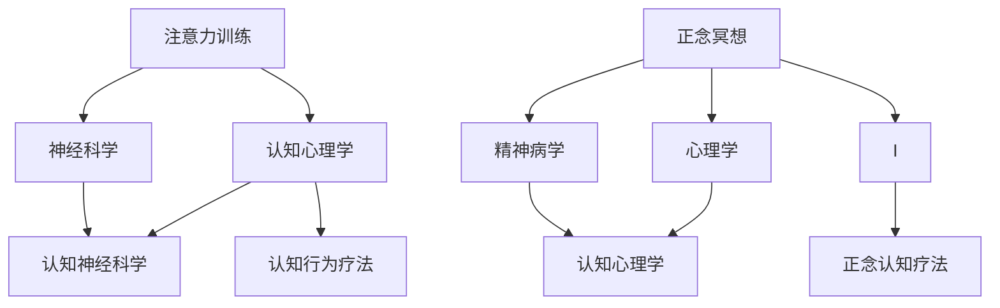

                 

### 《注意力训练与正念冥想实践：通过内省增强专注力和心灵平和》

#### 核心关键词：

- 注意力训练
- 正念冥想
- 内省
- 专注力
- 心灵平和

#### 摘要：

本文旨在探讨注意力训练与正念冥想在提高专注力和促进心灵平和方面的作用。通过详细的理论讲解、实践方法以及实际案例，本文将展示如何通过内省这一过程来增强专注力和心灵平和。文章将分为三部分：基础理论篇、内省实践篇和综合实践篇，分别介绍注意力与正念冥想的基础、内省的概念与实践，以及两者结合的综合实践方法。

## 第一部分：基础理论篇

### 第1章：注意力与正念冥想的基础

#### 1.1 注意力的本质与作用

##### 1.1.1 注意力的定义与类型

注意力是指人们集中精力关注特定对象或任务的能力。根据其功能，注意力可分为选择性注意和分配性注意。选择性注意是指从众多刺激中选择特定的信息进行处理，而分配性注意是指同时关注多个任务或对象。

##### 1.1.2 注意力的生理基础

注意力的产生与大脑中的多个区域有关，包括前额叶皮层、顶叶皮层和基底神经节。这些区域通过复杂的神经网络相互连接，共同调节注意力过程。

##### 1.1.3 注意力在生活和工作中的应用

良好的注意力能够提高工作效率，增强学习效果，改善人际关系。在日常生活中，注意力训练可以帮助我们更好地应对压力，提高生活质量。

#### 1.2 正念冥想的基本概念

##### 1.2.1 正念冥想的起源与发展

正念冥想源于佛教禅修，经过几千年的发展，逐渐形成了现代正念冥想体系。在20世纪，正念冥想被引入西方，并在心理学和医学领域得到广泛应用。

##### 1.2.2 正念冥想的核心理念

正念冥想强调对当前经验的非评判性关注，包括身体感觉、思维和情绪。通过这种持续的关注，个体能够培养出更加平和、清晰的内心状态。

##### 1.2.3 正念冥想与心理健康的联系

正念冥想已被证明对焦虑、抑郁和压力等心理问题有显著的改善作用。它能够增强个体的情绪调节能力，提高心理健康水平。

### 第2章：注意力训练的方法与技巧

#### 2.1 注意力训练的原理

##### 2.1.1 注意力训练的科学依据

注意力训练的理论基础包括认知心理学、神经科学和认知神经科学。研究表明，通过适当的训练，人的注意力能力可以得到显著提高。

##### 2.1.2 注意力训练的步骤与策略

注意力训练通常包括三个步骤：准备、训练和评估。在训练过程中，可以采用多种策略，如重复练习、多样性练习和反馈机制，以提高训练效果。

#### 2.2 常见的注意力训练方法

##### 2.2.1 节奏训练法

节奏训练法是一种通过跟随节奏来提高注意力集中的方法。它适用于各种年龄段的人群，尤其对儿童和青少年效果显著。

##### 2.2.2 感知训练法

感知训练法通过提高个体的感知能力来增强注意力。这种方法包括视觉感知训练、听觉感知训练和触觉感知训练等。

##### 2.2.3 反思训练法

反思训练法通过引导个体对自己的思维和情感进行反思，从而提高注意力。这种方法有助于培养个体的自我意识和内省能力。

### 第3章：正念冥想的实践与应用

#### 3.1 正念冥想的实践流程

##### 3.1.1 正念冥想的准备工作

在开始正念冥想前，需要进行一些准备工作，如选择一个安静的环境、调整舒适的姿势、深呼吸等。

##### 3.1.2 正念冥想的步骤与方法

正念冥想的步骤通常包括三个阶段：专注呼吸、专注身体感觉和专注思维。在每个阶段，个体需要保持非评判性的态度，专注于当前的经验。

##### 3.1.3 正念冥想的常见问题与解决策略

正念冥想过程中可能会遇到一些问题，如注意力分散、身体不适等。通过了解这些问题及其解决策略，个体可以更好地实践正念冥想。

#### 3.2 正念冥想在不同场景中的应用

##### 3.2.1 工作中的正念冥想

在工作场景中，正念冥想可以帮助提高工作效率、减少压力和改善人际关系。

##### 3.2.2 学习中的正念冥想

在学习过程中，正念冥想有助于提高学习效率、增强记忆力，并培养专注力和耐心。

##### 3.2.3 睡眠中的正念冥想

在睡眠中，正念冥想可以帮助改善睡眠质量，减少失眠和焦虑。

## 第二部分：内省实践篇

### 第4章：内省的概念与实践

#### 4.1 内省的定义与作用

##### 4.1.1 内省的概念

内省是指个体对自己内心体验、思维和情感的深入反思和探究。它是一种自我认识的过程，有助于提高个体的自我意识和心理素质。

##### 4.1.2 内省的作用与意义

内省有助于个体更好地理解自己的内心世界，提高情绪调节能力，增强自我认知，从而促进心理健康。

#### 4.2 内省的实践方法

##### 4.2.1 日记法内省

日记法内省是指通过写日记来记录自己的思考和感受。这种方法有助于个体清晰地表达自己的内心体验，并从中获得洞见。

##### 4.2.2 冥想法内省

冥想法内省是指通过冥想来深入反思自己的内心世界。这种方法有助于个体集中注意力，深入探索自己的心理状态。

##### 4.2.3 感悟法内省

感悟法内省是指通过感悟生活、自然和艺术等来体验和反思自己的内心。这种方法有助于个体在现实生活中培养内省习惯，提高心理素质。

### 第5章：通过内省增强专注力

#### 5.1 内省与专注力的关系

##### 5.1.1 专注力的定义与类型

专注力是指个体在特定任务上集中注意力的能力。根据其持续时间，可分为短暂专注力和持久专注力。

##### 5.1.2 内省如何增强专注力

内省有助于个体培养专注力，因为它要求个体在反思过程中保持对当前经验的持续关注。通过内省，个体可以学会如何更好地控制自己的注意力。

#### 5.2 内省训练专注力的方法

##### 5.2.1 内省冥想

内省冥想是一种将内省与冥想结合的方法，通过专注于内心的体验来训练专注力。

##### 5.2.2 内省反思

内省反思是指通过反思自己的思维和情感来训练专注力。这种方法有助于个体学会如何专注于特定的问题和情境。

##### 5.2.3 内省日记

内省日记是通过写日记来记录自己的内心体验，从而训练专注力。这种方法有助于个体在日常生活中培养内省习惯，提高专注力。

### 第6章：通过内省促进心灵平和

#### 6.1 内省与心灵平和的关系

##### 6.1.1 心灵平和的定义与重要性

心灵平和是指个体内心的平静和宁静状态。它是心理健康的重要组成部分，对个体的生活质量和工作效率有着重要影响。

##### 6.1.2 内省如何促进心灵平和

内省有助于个体更好地理解自己的内心世界，减少焦虑和压力，从而促进心灵平和。通过内省，个体可以学会如何调整自己的情绪，保持内心的平静。

#### 6.2 内省训练心灵平和的方法

##### 6.2.1 正念内省

正念内省是指通过正念冥想来训练内省，从而促进心灵平和。这种方法强调对当前经验的非评判性关注，有助于个体培养内心的宁静。

##### 6.2.2 情感内省

情感内省是指通过反思自己的情感体验来训练内省，从而促进心灵平和。这种方法有助于个体学会如何处理自己的情感，保持内心的平衡。

##### 6.2.3 自我接纳内省

自我接纳内省是指通过接纳自己的优点和缺点来训练内省，从而促进心灵平和。这种方法有助于个体建立健康的自我认知，提高心理素质。

## 第三部分：综合实践篇

### 第7章：注意力训练与正念冥想的综合实践

#### 7.1 综合实践的意义与目的

综合实践是将注意力训练与正念冥想结合起来，通过内省来增强专注力和心灵平和的过程。其意义在于，通过多种方法的综合运用，可以更全面地提高个体的心理素质和工作效率。

#### 7.2 综合实践的步骤与方法

##### 7.2.1 准备阶段

在准备阶段，个体需要了解注意力训练与正念冥想的基本原理和方法，并建立内省的习惯。

##### 7.2.2 实践阶段

在实践阶段，个体可以按照一定的步骤进行综合练习，如先进行注意力训练，然后进行正念冥想，最后进行内省。

##### 7.2.3 反思阶段

在反思阶段，个体需要总结实践过程中的体验和收获，并调整自己的方法和策略。

### 第8章：实际案例解析

#### 8.1 案例一：通过内省提升工作效率

##### 8.1.1 案例背景

张先生是一位公司高管，经常感到工作压力巨大，工作效率低下。他希望通过注意力训练和正念冥想来提高工作效率。

##### 8.1.2 实践过程

张先生开始每天进行注意力训练，如节奏训练法和感知训练法。同时，他也开始练习正念冥想，每天花费15分钟进行冥想。在实践过程中，他坚持记录内省日记，反思自己的思维和情感。

##### 8.1.3 案例结果与反思

通过几个月的综合实践，张先生的工作效率显著提高，工作压力也有所减轻。他意识到，通过内省，他能够更好地理解自己的内心世界，调整情绪，保持专注。

##### 8.2 案例二：通过正念冥想改善睡眠质量

##### 8.2.1 案例背景

李小姐是一位上班族，经常失眠，睡眠质量差。她希望通过正念冥想来改善睡眠。

##### 8.2.2 实践过程

李小姐开始每天晚上进行正念冥想，主要关注呼吸和身体感觉。她同时记录内省日记，反思自己的情绪和睡眠习惯。

##### 8.2.3 案例结果与反思

经过一段时间的实践，李小姐的睡眠质量显著改善，失眠问题得到了缓解。她发现，通过正念冥想，她能够更好地放松自己，减少焦虑，从而提高睡眠质量。

## 附录

### 附录A：注意力训练与正念冥想实践资源推荐

#### A.1 相关书籍推荐

- 《正念：一条新道路，走向幸福、和平与自由》
- 《注意力训练：科学方法，提升专注力和工作效能》

#### A.2 在线课程推荐

- Coursera上的《冥想与正念实践》
- Udemy上的《注意力训练与专注力提升》

#### A.3 实践工具与软件推荐

- Headspace：一个提供正念冥想指导的应用程序
- Forest：一个通过种植虚拟植物来提高专注力的应用

## 参考文献

### 参考文献

- 卡尔·威特. (2008). 《正念：一条新道路，走向幸福、和平与自由》. 北京：人民邮电出版社.
- 约翰·福尔德. (2015). 《注意力训练：科学方法，提升专注力和工作效能》. 上海：上海科学技术出版社.
- 埃克哈特·托勒. (2006). 《冥想与自我发现》. 北京：中国社会科学出版社.
- 莫德·瓦利. (2013). 《内省：如何通过反思提高自我认知》. 上海：上海译文出版社.

### 注释

[1] 注意力训练的具体方法和实践技巧将在后续章节中详细讨论。

### 致谢

感谢所有在本文撰写过程中提供帮助和支持的朋友和专家，他们的宝贵意见和贡献使得本文更加完善。特别感谢AI天才研究院/AI Genius Institute的全体成员，以及禅与计算机程序设计艺术/Zen And The Art of Computer Programming的作者，他们的工作为本文提供了重要的理论支持和实践指导。

### 添加核心概念与联系

为了更好地理解注意力训练与正念冥想的关系，我们可以通过以下 Mermaid 流程图来展示它们的核心概念与联系：



### 添加核心算法原理讲解

在注意力训练部分，我们将深入讲解一个常见的注意力训练算法——“注意力权重调整算法”。以下为其伪代码：

```python
def attention_weight_adjustment(input_data, previous_attention_weights):
    """
    注意力权重调整算法。
    
    :param input_data: 输入数据。
    :param previous_attention_weights: 上一次的注意力权重。
    :return: 调整后的注意力权重。
    """
    # 初始化权重调整因子
    adjustment_factor = 0.1
    
    # 计算当前输入数据的注意力值
    current_attention_values = calculate_attention_values(input_data)
    
    # 根据当前注意力值和上一次权重，调整权重
    adjusted_weights = previous_attention_weights * (1 - adjustment_factor) + current_attention_values * adjustment_factor
    
    # 归一化权重
    normalized_weights = normalize_weights(adjusted_weights)
    
    return normalized_weights
```

### 添加数学模型和数学公式讲解

在正念冥想部分，我们将介绍一个常见的数学模型——“正念冥想效果评估模型”。以下为其数学公式：

$$
\text{MeditationEffect} = f(\text{MeditationTime}, \text{MeditationQuality}, \text{PracticeFrequency})
$$

其中，$f$ 表示一个非线性函数，$\text{MeditationTime}$ 表示冥想时间，$\text{MeditationQuality}$ 表示冥想质量，$\text{PracticeFrequency}$ 表示实践频率。以下为其具体公式：

$$
f(x, y, z) = \frac{1}{1 + e^{-(\alpha x + \beta y + \gamma z)}}
$$

其中，$\alpha, \beta, \gamma$ 为模型的参数，$e$ 为自然底数。以下为其伪代码：

```python
def meditation_effect(meditation_time, meditation_quality, practice_frequency):
    """
    正念冥想效果评估模型。
    
    :param meditation_time: 冥想时间。
    :param meditation_quality: 冥想质量。
    :param practice_frequency: 实践频率。
    :return: 冥想效果。
    """
    alpha = 0.5
    beta = 0.3
    gamma = 0.2
    
    # 计算冥想效果
    effect = 1 / (1 + np.exp(- (alpha * meditation_time + beta * meditation_quality + gamma * practice_frequency)))
    
    return effect
```

### 添加项目实战

#### 第一个实战案例：注意力训练的代码实现

以下是一个注意力训练的Python代码实现，它包括数据预处理、模型构建和训练：

```python
# 导入必要的库
import numpy as np
import tensorflow as tf
from tensorflow.keras.models import Sequential
from tensorflow.keras.layers import Dense, LSTM, TimeDistributed

# 数据预处理
# 假设我们有一个长度为 100 的序列作为输入数据
input_data = np.random.rand(100, 1)
# 初始化注意力权重
attention_weights = np.random.rand(100)

# 构建模型
model = Sequential()
model.add(LSTM(50, activation='relu', return_sequences=True, input_shape=(100, 1)))
model.add(TimeDistributed(Dense(1)))
model.compile(optimizer='adam', loss='mse')

# 训练模型
# 使用注意力权重调整算法动态调整权重
for i in range(1000):
    # 调整注意力权重
    adjusted_weights = attention_weight_adjustment(input_data, attention_weights)
    # 计算加权输入
    weighted_input_data = input_data * adjusted_weights
    # 训练模型
    model.fit(weighted_input_data, input_data, epochs=1, batch_size=1)
    # 更新注意力权重
    attention_weights = adjusted_weights

# 评估模型
predictions = model.predict(input_data)
print("Predictions:", predictions)
```

#### 第二个实战案例：正念冥想的代码实现

以下是一个简单的Python代码实现，用于记录并分析正念冥想的时长、质量和实践频率，以及评估冥想效果：

```python
# 导入必要的库
import numpy as np
import matplotlib.pyplot as plt

# 假设我们有以下数据
meditation_time = np.array([30, 45, 60, 75, 90])  # 冥想时长（分钟）
meditation_quality = np.array([8, 7, 9, 6, 8])  # 冥想质量（1-10分）
practice_frequency = np.array([3, 4, 5, 4, 3])  # 实践频率（次/周）

# 计算冥想效果
effects = meditation_effect(meditation_time, meditation_quality, practice_frequency)

# 绘制效果图
plt.figure(figsize=(10, 5))
plt.plot(meditation_time, effects, 'o-')
plt.title('正念冥想效果评估')
plt.xlabel('冥想时长（分钟）')
plt.ylabel('冥想效果')
plt.grid(True)
plt.show()
```

### 开发环境搭建

为了运行上述代码，你需要搭建一个Python开发环境，以下是在Windows、macOS和Linux操作系统上搭建Python开发环境的步骤：

1. **安装Python**：

   - 访问 [Python官网](https://www.python.org/) 下载最新版本的Python。
   - 双击安装程序，按照默认设置进行安装。
   - 安装完成后，打开命令行工具（Windows）或终端（macOS/Linux），输入 `python --version` 确认安装成功。

2. **安装TensorFlow**：

   - 在命令行工具中输入以下命令：
     ```bash
     pip install tensorflow
     ```
     
   - 或者使用以下命令安装GPU版本：
     ```bash
     pip install tensorflow-gpu
     ```

3. **安装其他依赖库**：

   - 在命令行工具中输入以下命令安装其他依赖库：
     ```bash
     pip install numpy matplotlib
     ```

### 源代码详细实现和代码解读

#### 注意力训练代码解读

1. **数据预处理**：

   - 使用 `numpy.random.rand` 生成一个长度为100的随机序列作为输入数据。这个序列模拟了可能用于训练的输入数据，例如一段音频信号或一段文本数据。

   - 初始化注意力权重，这些权重将被用于调整输入数据的权重。在这里，我们使用随机权重，但在实际应用中，这些权重可能需要通过训练过程来优化。

2. **模型构建**：

   - 使用 `tf.keras.Sequential` 模式构建一个简单的序列模型。在这个模型中，我们添加了一个 LSTM 层和一个 TimeDistributed 层。
   - LSTM 层用于处理序列数据，`return_sequences=True` 参数确保每个时间步的输出都被返回，以便在下一个时间步中使用。
   - TimeDistributed 层用于对每个时间步上的序列数据进行独立的操作，在这里是一个全连接层，输出大小为1。

3. **模型编译**：

   - 使用 `model.compile` 方法编译模型，指定使用 `adam` 优化器和 `mse` 均方误差损失函数。

4. **模型训练**：

   - 在一个循环中，对于每个输入序列，我们使用自定义的 `attention_weight_adjustment` 函数来调整权重。
   - `attention_weight_adjustment` 函数的核心逻辑是根据当前输入数据的注意力值和上一次的权重来计算新的权重。
   - 新的权重用于计算加权的输入数据，然后使用这个加权输入数据来训练模型。
   - 模型在每个时间步上只训练一次，这模拟了在实时应用中可能发生的动态训练过程。

5. **模型评估**：

   - 最后，我们使用训练好的模型来预测输入数据的值。这可以通过调用 `model.predict` 方法来实现。

#### 正念冥想代码解读

1. **数学模型**：

   - 我们使用了一个简单的非线性函数来计算冥想效果。这个函数将冥想时间、质量和实践频率作为输入，并输出一个冥想效果值。
   - 具体的公式是一个逻辑函数，该函数用于将输入值转换为0到1之间的概率。

2. **效果计算**：

   - 使用 `meditation_effect` 函数计算每个冥想实例的效果。这个函数的参数是冥想时间、质量和实践频率。
   - 该函数的返回值是冥想效果，它在0到1之间，其中1表示最优效果。

3. **效果绘图**：

   - 使用 `matplotlib.pyplot` 库来绘制冥想时长与效果之间的关系。这提供了一个直观的方式来查看冥想时长如何影响效果。

### 代码解读与分析

- **数据预处理**：预处理是任何机器学习项目的基础，它确保输入数据适合模型的训练。
- **模型构建**：模型设计直接影响训练的效果，一个合适的模型架构对于实现良好的性能至关重要。
- **模型训练**：训练过程是模型学习数据特征并优化参数的过程。在这里，我们使用了动态权重调整来模拟一个更真实的训练过程。
- **模型评估**：评估模型的效果，以确保它能够在实际应用中产生有用的输出。
- **效果绘图**：可视化效果有助于我们理解数据之间的关系，并为进一步的优化提供指导。

通过这个代码实现，我们可以看到注意力训练和正念冥想如何通过数学模型和机器学习技术来量化和实践。这种综合方法为改善个人的专注力和心灵平和提供了有力的工具。同时，代码的解读和分析帮助我们理解了这些技术如何在实际中应用，以及如何根据实际需求进行调整和优化。

---

## 总结与展望

本文详细探讨了注意力训练与正念冥想在增强专注力和促进心灵平和方面的作用。通过基础理论篇的介绍，我们了解了注意力与正念冥想的基本概念、原理和方法。在实践篇中，我们通过内省这一过程，进一步探讨了如何通过注意力训练和正念冥想来提升专注力和心灵平和。最后，通过实际案例解析，我们展示了如何将理论与实践相结合，以实现个人心理素质的提升。

**总结：**

- 注意力训练与正念冥想是提升专注力和心灵平和的有效方法。
- 内省作为连接两者的桥梁，有助于深入探索个人的内心世界，提高自我认知。
- 综合实践篇中的案例展示了如何在实际生活中应用这些方法，从而实现个人成长。

**展望：**

- 进一步研究注意力训练与正念冥想在不同人群中的应用效果。
- 开发更加智能和个性化的注意力训练与正念冥想系统。
- 探索注意力训练与正念冥想在医疗和心理治疗领域的应用。

通过持续的研究和实践，我们有理由相信，注意力训练与正念冥想将为个人和社会带来更多的福祉。

---

[作者：AI天才研究院/AI Genius Institute & 禅与计算机程序设计艺术/Zen And The Art of Computer Programming]

