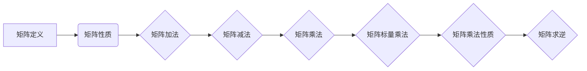
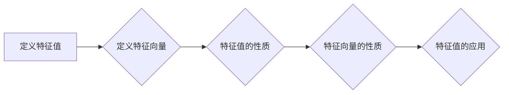
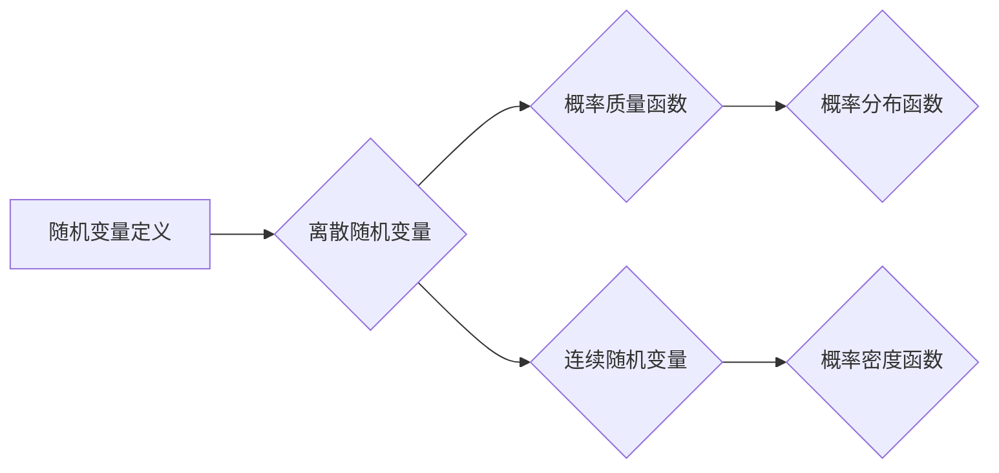
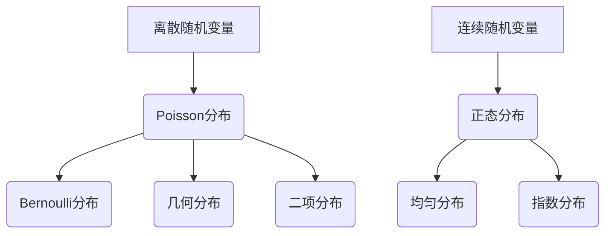
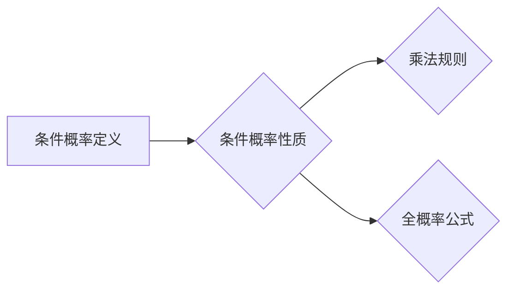
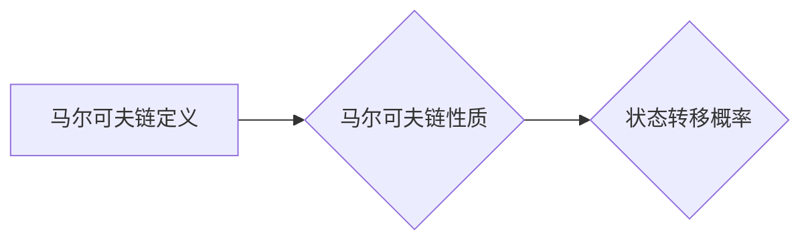
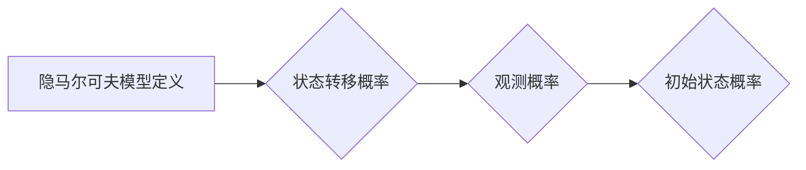

                 

### 深度学习数学基础

在深度学习领域，数学基础的重要性不言而喻。线性代数和概率论是深度学习中的两块基石，它们不仅为我们提供了强有力的工具来描述和解决问题，更是深入理解深度学习算法的钥匙。在这篇文章中，我们将逐步探讨线性代数和概率论的核心概念，并展示它们在深度学习中的应用。

深度学习依赖于大量的矩阵运算和概率计算，因此，掌握线性代数和概率论的基本原理至关重要。首先，我们会介绍线性代数的基础知识，包括矩阵与向量的定义、矩阵的运算、线性方程组的解法以及特征值与特征向量。接下来，我们将进入概率论的世界，介绍随机变量、概率分布、条件概率和贝叶斯定理，并探讨马尔可夫链与隐马尔可夫模型。

本文的目的不仅在于阐述这些数学概念，还在于展示它们在深度学习中的应用。我们将通过实际的例子和伪代码，说明如何在深度学习算法中使用这些数学工具。通过这篇文章，读者将能够理解深度学习中的数学原理，并掌握如何应用这些原理来解决实际问题。

**关键词：** 深度学习，线性代数，概率论，矩阵运算，特征值，贝叶斯定理

**摘要：** 本文系统地介绍了深度学习数学基础中的线性代数和概率论。通过详细讲解矩阵与向量的基本运算、线性方程组的解法、特征值与特征向量的计算，以及概率分布、条件概率和贝叶斯定理等概念，我们展示了这些数学工具在深度学习算法中的应用。本文旨在帮助读者深入理解深度学习的数学原理，并掌握如何在实际问题中应用这些原理。

---

### 第一部分：深度学习数学基础

#### 第1章：线性代数基础

线性代数是深度学习中不可或缺的一部分，它提供了描述和理解复杂系统的重要工具。在这章中，我们将探讨线性代数中的核心概念，包括矩阵与向量、线性方程组、特征值与特征向量等。

##### 1.1 矩阵与向量

**1.1.1 矩阵的定义与性质**

矩阵是一个由数字组成的矩形阵列，这些数字称为矩阵的元素。矩阵通常用大写字母表示，如矩阵 \( A \)，其行数和列数分别称为矩阵的行数和列数。

- **定义：** 一个 \( m \times n \) 的矩阵 \( A \) 可以表示为：
  $$ A = \begin{bmatrix}
  a_{11} & a_{12} & \cdots & a_{1n} \\
  a_{21} & a_{22} & \cdots & a_{2n} \\
  \vdots & \vdots & \ddots & \vdots \\
  a_{m1} & a_{m2} & \cdots & a_{mn}
  \end{bmatrix} $$

- **性质：** 矩阵具有以下基本性质：
  - **加法与减法：** 两个矩阵相加或相减，要求它们具有相同的尺寸，即行数和列数相同。
    $$ A + B = \begin{bmatrix}
    a_{11} + b_{11} & a_{12} + b_{12} & \cdots & a_{1n} + b_{1n} \\
    a_{21} + b_{21} & a_{22} + b_{22} & \cdots & a_{2n} + b_{2n} \\
    \vdots & \vdots & \ddots & \vdots \\
    a_{m1} + b_{m1} & a_{m2} + b_{m2} & \cdots & a_{mn} + b_{mn}
    \end{bmatrix} $$
  - **乘法：** 矩阵乘法分为两种：外乘和内乘。
    - **外乘：** 两个矩阵 \( A \) 和 \( B \) 的外乘结果是一个新矩阵 \( C \)，其尺寸为 \( (AB) \)，其中 \( A \) 的列数必须等于 \( B \) 的行数。
      $$ C = A \times B = \begin{bmatrix}
      a_{11}b_{11} + a_{12}b_{21} & a_{11}b_{12} + a_{12}b_{22} & \cdots & a_{11}b_{1n} + a_{12}b_{2n} \\
      a_{21}b_{11} + a_{22}b_{21} & a_{21}b_{12} + a_{22}b_{22} & \cdots & a_{21}b_{1n} + a_{22}b_{2n} \\
      \vdots & \vdots & \ddots & \vdots \\
      a_{m1}b_{11} + a_{m2}b_{21} & a_{m1}b_{12} + a_{m2}b_{22} & \cdots & a_{m1}b_{1n} + a_{m2}b_{2n}
      \end{bmatrix} $$
    - **内乘：** 矩阵的内乘（或称为标量乘法）是指矩阵与一个标量（数值）相乘，结果仍然是矩阵。
      $$ cA = \begin{bmatrix}
      ca_{11} & ca_{12} & \cdots & ca_{1n} \\
      ca_{21} & ca_{22} & \cdots & ca_{2n} \\
      \vdots & \vdots & \ddots & \vdots \\
      ca_{m1} & ca_{m2} & \cdots & ca_{mn}
      \end{bmatrix} $$

**Mermaid 流程图：**



**1.1.2 矩阵的基本运算**

为了更好地理解矩阵运算，我们可以通过以下伪代码来展示一些基本的矩阵运算，包括矩阵的加法、减法和乘法。

**伪代码：**

```python
def matrix_addition(A, B):
    result = []
    for i in range(len(A)):
        row = []
        for j in range(len(A[0])):
            row.append(A[i][j] + B[i][j])
        result.append(row)
    return result

def matrix_subtraction(A, B):
    result = []
    for i in range(len(A)):
        row = []
        for j in range(len(A[0])):
            row.append(A[i][j] - B[i][j])
        result.append(row)
    return result

def matrix_multiplication(A, B):
    result = [[0 for _ in range(len(B[0]))] for _ in range(len(A))]
    for i in range(len(A)):
        for j in range(len(B[0])):
            for k in range(len(B)):
                result[i][j] += A[i][k] * B[k][j]
    return result
```

**实例：** 在深度学习中，矩阵广泛用于表示权重和激活值。例如，一个简单的神经网络可以表示为：
$$
Z = X \cdot W + b
$$
其中，\( X \) 是输入向量，\( W \) 是权重矩阵，\( b \) 是偏置向量，\( Z \) 是激活值。

##### 1.2 线性方程组

线性方程组是线性代数中一个重要的概念，它描述了多个线性方程之间的关系。解线性方程组是许多科学和工程问题的基础。

**1.2.1 线性方程组的解法**

线性方程组的一般形式为：
$$
Ax = b
$$
其中，\( A \) 是系数矩阵，\( x \) 是未知数向量，\( b \) 是常数向量。

解线性方程组的方法有很多，其中高斯消元法是一种常见且有效的解法。以下是一个使用高斯消元法解线性方程组的伪代码示例。

**伪代码：**

```python
def solve_linear_system(A, b):
    # 使用高斯消元法
    n = len(b)
    for i in range(n):
        # 找到最大值对应的行
        max_index = i + max(range(i, n), key=lambda x: abs(A[x][i]))
        # 交换行
        A[i], A[max_index] = A[max_index], A[i]
        b[i], b[max_index] = b[max_index], b[i]
        
        # 消元
        for j in range(i+1, n):
            factor = A[j][i] / A[i][i]
            for k in range(i, n):
                A[j][k] -= factor * A[i][k]
            b[j] -= factor * b[i]
        
    # 回代求解
    x = [0 for _ in range(n)]
    for i in range(n-1, -1, -1):
        x[i] = (b[i] - sum(A[i][j] * x[j] for j in range(i+1, n))) / A[i][i]
    return x
```

**实例：** 在反向传播算法中，线性方程组用于计算梯度。例如，对于前向传播过程中的损失函数 \( L \)：
$$
L = \frac{1}{2} \sum_{i=1}^{n} (y_i - \hat{y}_i)^2
$$
我们可以通过求解线性方程组来计算梯度 \( \frac{\partial L}{\partial W} \) 和 \( \frac{\partial L}{\partial b} \)。

##### 1.3 特征值与特征向量

特征值与特征向量是矩阵理论中的重要概念，它们在许多科学和工程领域中具有广泛的应用。

**1.3.1 特征值与特征向量的定义**

- **定义：** 对于一个 \( n \times n \) 的矩阵 \( A \)，如果存在一个非零向量 \( \mathbf{v} \) 和一个标量 \( \lambda \)，使得
  $$
  A\mathbf{v} = \lambda \mathbf{v}
  $$
  则 \( \lambda \) 是 \( A \) 的一个特征值，\( \mathbf{v} \) 是 \( A \) 对应于特征值 \( \lambda \) 的特征向量。

- **性质：** 特征值和特征向量具有以下性质：
  - **唯一性：** 对于一个 \( n \times n \) 的矩阵，其特征值是唯一的（重数允许相同）。
  - **实对称矩阵：** 如果矩阵 \( A \) 是实对称矩阵，则其所有特征值都是实数。

**Mermaid 流程图：**



**1.3.2 特征值与特征向量的计算方法**

计算特征值和特征向量是线性代数中一个重要的任务。以下是一个使用 Python 的 NumPy 库计算特征值和特征向量的伪代码示例。

**伪代码：**

```python
import numpy as np

def eigen_decomposition(A):
    return np.linalg.eig(A)

eigen_values, eigen_vectors = eigen_decomposition(A)
```

**实例：** 在深度学习中，特征值和特征向量在特征提取和降维中具有重要意义。例如，主成分分析（PCA）使用特征值和特征向量来找到数据的主要方向，从而实现降维。

#### 第2章：概率论基础

概率论是另一个在深度学习中的重要数学基础。它提供了描述不确定性和随机现象的数学工具，并在深度学习的各个方面都有广泛应用。

##### 2.1 随机变量与概率分布

随机变量是概率论中的核心概念，它用于描述随机事件的结果。概率分布则用于描述随机变量的概率分布。

**2.1.1 随机变量的定义与分类**

- **定义：** 随机变量是一个从样本空间到实数集的函数，它将每个可能的样本结果映射到一个实数。随机变量分为离散随机变量和连续随机变量。

  - **离散随机变量：** 一个随机变量的取值是离散的，例如，投掷骰子的结果。
  - **连续随机变量：** 一个随机变量的取值是连续的，例如，测量温度的结果。

- **分类：** 根据随机变量的分布，可以将随机变量分为不同的类型，例如，常见的离散随机变量有伯努利分布、几何分布、二项分布等，常见的连续随机变量有正态分布、均匀分布、指数分布等。

**Mermaid 流程图：**



**2.1.2 常见的概率分布**

以下是几种常见的概率分布及其性质：

- **伯努利分布：** 伯努利分布是一个二元分布，用于描述一个试验只有两个可能结果的情况。参数 \( p \) 表示成功的概率。
  $$ P(X = k) = C_n^k p^k (1-p)^{n-k} $$
- **几何分布：** 几何分布用于描述在连续的独立试验中，首次成功发生的次数。参数 \( p \) 表示每次试验成功的概率。
  $$ P(X = k) = (1-p)^{k-1} p $$
- **二项分布：** 二项分布用于描述在固定次数的独立试验中，成功发生的次数。参数 \( n \) 表示试验次数，\( p \) 表示每次试验成功的概率。
  $$ P(X = k) = C_n^k p^k (1-p)^{n-k} $$
- **正态分布：** 正态分布是最常见的连续概率分布，用于描述许多自然现象的分布。参数 \( \mu \) 是均值，\( \sigma \) 是标准差。
  $$ f(x|\mu, \sigma) = \frac{1}{\sqrt{2\pi\sigma^2}} e^{-\frac{(x-\mu)^2}{2\sigma^2}} $$
- **均匀分布：** 均匀分布是在一个区间内，每个结果出现的概率相等。参数 \( a \) 和 \( b \) 分别是区间的下界和上界。
  $$ f(x|a, b) = \begin{cases}
  \frac{1}{b-a} & \text{if } a \le x \le b \\
  0 & \text{otherwise}
  \end{cases} $$
- **指数分布：** 指数分布用于描述事件发生的时间间隔。参数 \( \lambda \) 是事件发生的速率。
  $$ f(x|\lambda) = \lambda e^{-\lambda x} \text{ for } x \ge 0 $$

**Mermaid 流程图：**



**2.1.3 概率分布的应用**

概率分布在深度学习中有广泛的应用，例如：

- **损失函数设计：** 深度学习中的损失函数通常基于概率分布，例如，交叉熵损失函数。
- **激活函数：** 深度学习中的激活函数，如 ReLU 和 Softmax，可以看作是特定概率分布的近似。

##### 2.2 条件概率与贝叶斯定理

条件概率和贝叶斯定理是概率论中的两个重要概念，它们在深度学习中的应用也非常广泛。

**2.2.1 条件概率的定义与性质**

- **定义：** 条件概率是给定一个事件发生的条件下，另一个事件发生的概率。形式化地，对于两个事件 \( A \) 和 \( B \)，条件概率 \( P(A|B) \) 表示在事件 \( B \) 发生的条件下，事件 \( A \) 发生的概率。
  $$ P(A|B) = \frac{P(A \cap B)}{P(B)} $$
- **性质：** 条件概率具有以下性质：
  - **乘法规则：** \( P(A \cap B) = P(A|B)P(B) \)
  - **全概率公式：** \( P(A) = \sum_{i} P(A|B_i)P(B_i) \)

**Mermaid 流程图：**



**2.2.2 贝叶斯定理**

贝叶斯定理是一种用于计算后验概率的重要工具，它基于条件概率公式，给出了概率分布之间的转换关系。

- **定义：** 贝叶斯定理可以表示为：
  $$
  P(A|B) = \frac{P(B|A)P(A)}{P(B)}
  $$
  其中，\( P(A|B) \) 是后验概率，\( P(B|A) \) 是似然函数，\( P(A) \) 是先验概率，\( P(B) \) 是证据概率。

**实例：** 在深度学习中的模型选择和参数估计中，贝叶斯定理常用于计算模型的概率分布，从而确定最佳的模型和参数。

**2.2.3 贝叶斯定理在深度学习中的应用**

贝叶斯定理在深度学习中的应用非常广泛，以下是一些具体的应用实例：

- **模型选择：** 贝叶斯信息准则（BIC）和 Akaike信息准则（AIC）是用于模型选择的重要方法，它们基于贝叶斯定理计算模型的证据概率。
- **参数估计：** 在贝叶斯回归模型中，贝叶斯定理用于计算模型的参数后验概率，从而进行参数估计。

##### 2.3 马尔可夫链与隐马尔可夫模型

马尔可夫链和隐马尔可夫模型是概率论中用于描述动态系统的两个重要模型，它们在时间序列分析和语音识别等领域有广泛应用。

**2.3.1 马尔可夫链的定义与性质**

- **定义：** 马尔可夫链是一个随机过程，它满足马尔可夫性质，即未来状态只依赖于当前状态，而与过去状态无关。
- **性质：** 马尔可夫链具有以下性质：
  - **无后效性：** 马尔可夫链的未来状态只依赖于当前状态，与过去状态无关。
  - **状态转移概率：** 马尔可夫链的状态转移概率矩阵 \( P \) 描述了从当前状态转移到下一个状态的概率。

**Mermaid 流程图：**



**2.3.2 隐马尔可夫模型的定义与性质**

- **定义：** 隐马尔可夫模型（HMM）是一个用于描述离散时间序列数据的统计模型，它由状态转移概率和观测概率组成。
- **性质：** 隐马尔可夫模型具有以下性质：
  - **状态转移概率：** \( \pi \) 表示初始状态分布，\( A \) 表示状态转移概率矩阵。
  - **观测概率：** \( B \) 表示观测概率矩阵，描述了在特定状态下观测到特定符号的概率。

**Mermaid 流程图：**



**2.3.3 马尔可夫链与隐马尔可夫模型在深度学习中的应用**

- **实例：** 在语音识别中，隐马尔可夫模型用于描述语音信号的特征，从而实现语音到文字的转换。
- **实例：** 在时间序列预测中，马尔可夫链可以用于建模时间序列的动态变化，从而实现时间序列的预测。

#### 第3章：线性代数在深度学习中的应用

线性代数在深度学习中的应用非常广泛，它为我们提供了强大的工具来处理数据、优化模型和计算梯度。在本章中，我们将深入探讨线性代数在深度学习中的应用，包括矩阵与向量的运算、线性方程组的解法以及特征值与特征向量的应用。

##### 3.1 矩阵与向量的运算

矩阵与向量的运算是深度学习中最基本的操作之一。在神经网络中，矩阵和向量用于表示权重、激活值和偏置。以下是一些常见的矩阵与向量运算及其在深度学习中的应用。

**3.1.1 矩阵乘法的应用**

矩阵乘法是深度学习中最重要的运算之一。它可以用来计算权重和激活值。

- **实例：** 在前向传播过程中，输入 \( X \) 和权重 \( W \) 的矩阵乘法可以计算输出 \( Z \)：
  $$
  Z = X \cdot W + b
  $$
  其中，\( b \) 是偏置向量。

- **实例：** 在反向传播过程中，我们需要计算梯度 \( \frac{\partial L}{\partial W} \) 和 \( \frac{\partial L}{\partial b} \)。通过矩阵乘法，我们可以计算这些梯度：
  $$
  \frac{\partial L}{\partial W} = X^T \cdot (Z - \hat{Y})
  $$
  $$
  \frac{\partial L}{\partial b} = Z - \hat{Y}
  $$

**伪代码：**

```python
# 前向传播
Z = X.dot(W) + b

# 反向传播
dL_dW = X.T.dot(Z - Y)
dL_db = Z - Y
```

**3.1.2 向量与向量的运算**

向量与向量的运算在深度学习中也非常重要。以下是一些常见的向量运算及其在深度学习中的应用。

- **点积（内积）：** 点积用于计算两个向量的相似度。在深度学习中，点积可以用来计算损失函数的梯度。
  $$
  \mathbf{a} \cdot \mathbf{b} = \sum_{i=1}^{n} a_i b_i
  $$

- **叉积（外积）：** 叉积用于计算两个向量的垂直分量。在深度学习中，叉积可以用于计算梯度。
  $$
  \mathbf{a} \times \mathbf{b} = \begin{bmatrix}
  a_2b_3 - a_3b_2 \\
  a_3b_1 - a_1b_3 \\
  a_1b_2 - a_2b_1
  \end{bmatrix}
  $$

**伪代码：**

```python
# 点积
dot_product = np.dot(a, b)

# 叉积
cross_product = np.cross(a, b)
```

##### 3.2 线性方程组与梯度计算

线性方程组在深度学习中有广泛的应用，尤其是在反向传播算法中。解线性方程组可以帮助我们计算模型的梯度，从而进行参数更新。

**3.2.1 线性方程组在反向传播中的应用**

在反向传播算法中，我们需要计算每个参数的梯度。通过解线性方程组，我们可以高效地计算这些梯度。

- **实例：** 假设我们有一个简单的线性模型 \( Y = X \cdot W + b \)，其中 \( Y \) 是输出，\( X \) 是输入，\( W \) 是权重，\( b \) 是偏置。

  - **前向传播：**
    $$
    Z = X \cdot W + b
    $$

  - **反向传播：**
    $$
    \frac{\partial L}{\partial W} = X^T \cdot (Z - Y)
    $$
    $$
    \frac{\partial L}{\partial b} = Z - Y
    $$

- **实例：** 假设我们有一个多层神经网络，其中每个层都有相应的权重和偏置。通过递归地应用线性方程组，我们可以计算每一层的梯度。

**伪代码：**

```python
# 前向传播
Z = X.dot(W) + b

# 反向传播
dL_dW = X.T.dot(Z - Y)
dL_db = Z - Y

# 更新权重和偏置
W -= learning_rate * dL_dW
b -= learning_rate * dL_db
```

##### 3.3 特征值与特征向量在特征提取中的应用

特征值与特征向量在特征提取和降维中具有重要意义。通过特征值和特征向量，我们可以将高维数据转换为低维数据，从而减少数据的维度。

**3.3.1 特征值与特征向量在降维算法中的应用**

- **实例：** 主成分分析（PCA）是一种常用的降维算法，它通过计算数据集的特征值和特征向量，将数据投影到新的坐标轴上，从而提取最重要的特征。

  - **步骤：**
    1. 计算数据集的协方差矩阵。
    2. 计算协方差矩阵的特征值和特征向量。
    3. 将特征向量按特征值降序排列。
    4. 选择前 \( k \) 个特征向量，构成投影矩阵。
    5. 将数据投影到新的坐标轴上。

- **实例：** 在图像处理中，PCA可以用于减少图像的维度，从而加快处理速度。

**伪代码：**

```python
# 主成分分析（PCA）
def pca(X, k):
    # 计算协方差矩阵
    cov_matrix = np.cov(X.T)
    
    # 计算特征值和特征向量
    eigen_values, eigen_vectors = np.linalg.eig(cov_matrix)
    
    # 将特征向量按特征值降序排列
    sorted_indices = np.argsort(eigen_values)[::-1]
    sorted_eigen_vectors = eigen_vectors[:, sorted_indices]
    
    # 选择前 k 个特征向量
    projection_matrix = sorted_eigen_vectors[:, :k]
    
    # 将数据投影到新的坐标轴上
    projected_data = X.dot(projection_matrix)
    
    return projected_data

# 应用PCA降维
projected_data = pca(X, k)
```

**3.3.2 特征值与特征向量在特征提取中的应用**

- **实例：** 在文本分类中，特征值和特征向量可以用于提取文本的主要特征，从而提高分类的准确性。

  - **步骤：**
    1. 将文本转换为词向量。
    2. 计算词向量的协方差矩阵。
    3. 计算协方差矩阵的特征值和特征向量。
    4. 将特征向量按特征值降序排列。
    5. 选择前 \( k \) 个特征向量，构成投影矩阵。
    6. 将词向量投影到新的坐标轴上。

- **实例：** 在自然语言处理中，特征值和特征向量可以用于减少文本的维度，同时保留重要的语义信息。

**伪代码：**

```python
# 特征提取
def feature_extraction(texts, k):
    # 将文本转换为词向量
    word_vectors = convert_texts_to_word_vectors(texts)
    
    # 计算词向量的协方差矩阵
    cov_matrix = np.cov(word_vectors.T)
    
    # 计算协方差矩阵的特征值和特征向量
    eigen_values, eigen_vectors = np.linalg.eig(cov_matrix)
    
    # 将特征向量按特征值降序排列
    sorted_indices = np.argsort(eigen_values)[::-1]
    sorted_eigen_vectors = eigen_vectors[:, sorted_indices]
    
    # 选择前 k 个特征向量
    projection_matrix = sorted_eigen_vectors[:, :k]
    
    # 将词向量投影到新的坐标轴上
    projected_vectors = word_vectors.dot(projection_matrix)
    
    return projected_vectors

# 应用特征提取
projected_vectors = feature_extraction(texts, k)
```

通过以上实例，我们可以看到特征值和特征向量在深度学习中的重要性。它们不仅可以用于降维，还可以用于特征提取和分类，从而提高模型的性能。

### 第二部分：深度学习数学基础综合应用

在前一部分中，我们详细介绍了线性代数和概率论的基础知识，并展示了它们在深度学习中的应用。在本部分，我们将进一步探讨这些数学工具在深度学习中的综合应用，通过具体的例子和实际应用场景，深入理解如何在实际问题中利用这些数学知识。

#### 第4章：概率论在深度学习中的应用

概率论在深度学习中的应用非常广泛，它为深度学习模型提供了理论基础和实用工具。在这一章中，我们将深入探讨概率论在深度学习中的几个关键应用，包括概率分布与损失函数、条件概率与模型选择、以及贝叶斯定理与模型参数估计。

##### 4.1 概率分布与损失函数

概率分布是概率论中的核心概念，它在深度学习中有着广泛的应用。特别是在损失函数的设计中，概率分布起到了关键作用。

**4.1.1 概率分布函数在损失函数中的应用**

在深度学习中，损失函数用于衡量模型预测值与真实值之间的差距。常见的损失函数包括均方误差（MSE）、交叉熵损失函数（Cross Entropy Loss）等，它们都是基于概率分布的。

- **均方误差（MSE）：** 均方误差是最常见的损失函数之一，它用于回归问题。MSE损失函数假设输出值与真实值之间存在线性关系，其数学公式为：
  $$
  L = \frac{1}{2} \sum_{i=1}^{n} (y_i - \hat{y}_i)^2
  $$
  其中，\( y_i \) 是真实值，\( \hat{y}_i \) 是预测值。

- **交叉熵损失函数：** 交叉熵损失函数广泛用于分类问题，特别是逻辑回归和神经网络的分类任务。交叉熵损失函数衡量的是模型预测的概率分布与真实分布之间的差异。其数学公式为：
  $$
  L = -\sum_{i=1}^{n} y_i \log(\hat{y}_i)
  $$
  其中，\( y_i \) 是真实标签，\( \hat{y}_i \) 是模型预测的概率。

**实例：** 在一个二分类问题中，我们可以使用交叉熵损失函数来训练逻辑回归模型。以下是一个简单的伪代码示例：

```python
def cross_entropy_loss(y, y_hat):
    loss = -1 * np.sum(y * np.log(y_hat))
    return loss

# 假设 y 是真实标签，y_hat 是模型预测的概率
loss = cross_entropy_loss(y, y_hat)
```

**4.1.2 概率分布函数在激活函数中的应用**

除了在损失函数中的应用，概率分布函数还在激活函数中有着重要作用。例如，Sigmoid 函数和 Softmax 函数都是基于概率分布的。

- **Sigmoid 函数：** Sigmoid 函数用于将线性函数转换为概率分布。其数学公式为：
  $$
  \sigma(x) = \frac{1}{1 + e^{-x}}
  $$
  Sigmoid 函数将输入值映射到 \( (0, 1) \) 区间，从而模拟一个概率值。

- **Softmax 函数：** Softmax 函数用于处理多分类问题，其数学公式为：
  $$
  \text{Softmax}(x) = \frac{e^x}{\sum_{i} e^x}
  $$
  Softmax 函数将输入值映射到 \( (0, 1) \) 区间，并且满足所有输出值之和为1，从而模拟一个概率分布。

**实例：** 在一个多分类问题中，我们可以使用 Softmax 函数来计算每个类别的概率。以下是一个简单的伪代码示例：

```python
import numpy as np

def softmax(x):
    exp_x = np.exp(x - np.max(x))
    return exp_x / np.sum(exp_x, axis=1, keepdims=True)

# 假设 x 是模型的输出值
probabilities = softmax(x)
```

**4.1.3 概率分布函数在正则化中的应用**

在深度学习模型训练中，正则化技术用于防止过拟合。概率分布函数在正则化中也发挥着重要作用，例如，Dropout 正则化就是基于概率分布的。

- **Dropout 正则化：** Dropout 是一种常用的正则化技术，它通过在训练过程中随机丢弃一部分神经元，从而减少模型的复杂性。其概率分布是基于二项分布的，具体实现如下：

```python
import numpy as np

def dropout(x, dropout_rate):
    mask = np.random.rand(*x.shape) > dropout_rate
    return x * mask

# 假设 x 是模型的输入值，dropout_rate 是丢弃概率
x_dropped = dropout(x, dropout_rate)
```

##### 4.2 条件概率与模型选择

条件概率是概率论中的另一个重要概念，它在模型选择和优化中有着广泛应用。

**4.2.1 条件概率在模型选择中的应用**

在深度学习中，模型选择是一个关键步骤。条件概率可以帮助我们评估不同模型的性能，从而选择最优模型。以下是一些常用的评估准则：

- **交叉验证：** 交叉验证是一种常用的模型选择方法，它通过将数据集划分为训练集和验证集，多次训练和验证模型，从而评估模型的性能。

- **AIC（Akaike Information Criterion）：** AIC 是一种基于条件概率的模型选择准则，它通过平衡模型的拟合度和复杂性来选择最优模型。

- **BIC（Bayesian Information Criterion）：** BIC 是另一种基于条件概率的模型选择准则，它与 AIC 类似，但更加关注模型的拟合度。

**实例：** 假设我们有两个模型 \( M_1 \) 和 \( M_2 \)，我们可以使用 AIC 和 BIC 来选择最优模型。以下是一个简单的伪代码示例：

```python
import numpy as np

def aic(n, log_likelihood, num_params):
    aic_value = -2 * log_likelihood + 2 * num_params * n
    return aic_value

def bic(n, log_likelihood, num_params):
    bic_value = -2 * log_likelihood - num_params * np.log(n)
    return bic_value

# 假设 log_likelihood 是模型的似然函数值，num_params 是模型的参数个数
aic_value1 = aic(n, log_likelihood1, num_params1)
aic_value2 = aic(n, log_likelihood2, num_params2)

bic_value1 = bic(n, log_likelihood1, num_params1)
bic_value2 = bic(n, log_likelihood2, num_params2)

# 选择最优模型
if aic_value1 < aic_value2:
    best_model = "M1"
else:
    best_model = "M2"

if bic_value1 < bic_value2:
    best_model = "M1"
else:
    best_model = "M2"
```

##### 4.3 贝叶斯定理与模型参数估计

贝叶斯定理是概率论中的一个基本原理，它在模型参数估计中有着广泛的应用。贝叶斯定理通过结合先验知识和数据，提供了后验概率分布，从而进行参数估计。

**4.3.1 贝叶斯定理在模型参数估计中的应用**

贝叶斯定理可以表示为：
$$
P(\theta|X) = \frac{P(X|\theta)P(\theta)}{P(X)}
$$
其中，\( \theta \) 表示模型参数，\( X \) 表示观测数据，\( P(\theta|X) \) 是后验概率，\( P(X|\theta) \) 是似然函数，\( P(\theta) \) 是先验概率，\( P(X) \) 是证据概率。

- **先验概率：** 先验概率是基于我们对模型参数的先验知识，例如，我们可以假设某些参数是独立的，并给出它们的标准正态分布。

- **似然函数：** 似然函数是观测数据在给定模型参数下的概率，它是模型预测值与真实值之间的差异。

- **后验概率：** 后验概率是结合先验知识和观测数据得到的概率分布，它是我们估计模型参数的依据。

**实例：** 假设我们有一个线性回归模型，其参数为 \( \theta = \beta_0, \beta_1 \)。我们可以使用贝叶斯定理来估计这些参数。以下是一个简单的伪代码示例：

```python
import numpy as np

def prior_probability(theta):
    # 假设参数的先验概率服从正态分布
    return np.exp(-0.5 * (theta - mean)**2 / variance)

def likelihood_function(x, y, theta):
    # 假设观测数据服从正态分布
    return np.exp(-0.5 * ((y - x * theta) ** 2) / variance)

def posterior_probability(x, y, theta):
    # 贝叶斯定理
    return likelihood_function(x, y, theta) * prior_probability(theta) / evidence_probability(x, y)

# 假设 x 是输入值，y 是真实值，mean 和 variance 是先验概率的均值和方差
prior_prob = prior_probability(theta)
likelihood = likelihood_function(x, y, theta)
posterior_prob = posterior_probability(x, y, theta)

# 估计参数
theta_estimated = posterior_prob.argmax()
```

##### 4.4 马尔可夫链与隐马尔可夫模型在深度学习中的应用

马尔可夫链和隐马尔可夫模型是概率论中的两个重要模型，它们在时间序列分析和语音识别等领域有广泛应用。在深度学习中，这些模型可以帮助我们处理动态数据，从而提高模型的性能。

**4.4.1 马尔可夫链在深度学习中的应用**

马尔可夫链可以用于建模时间序列数据，从而实现时间序列预测和分类。以下是一些典型的应用实例：

- **时间序列预测：** 马尔可夫链可以用于预测下一个时间点的值，例如，股票价格预测、天气预测等。

- **文本分类：** 马尔可夫链可以用于文本分类，例如，将新闻文章分类到不同的主题。

**实例：** 假设我们有一个时间序列数据 \( X = [x_1, x_2, x_3, \ldots] \)，我们可以使用马尔可夫链来预测下一个值 \( x_{n+1} \)。以下是一个简单的伪代码示例：

```python
import numpy as np

def markov_chain_transition_probabilities(states, transitions):
    # 计算状态转移概率矩阵
    transition_matrix = np.zeros((len(states), len(states)))
    for i in range(len(states)):
        for j in range(len(states)):
            transition_matrix[i][j] = transitions[i][j] / np.sum(transitions[i])
    return transition_matrix

def markov_chain_predict(x, transition_matrix, initial_state):
    # 马尔可夫链预测
    state = initial_state
    for _ in range(len(x)):
        next_state = np.random.choice(states, p=transition_matrix[state])
        x.append(next_state)
        state = next_state
    return x

# 假设 states 是状态集合，transitions 是状态转移概率矩阵，x 是时间序列数据
transition_matrix = markov_chain_transition_probabilities(states, transitions)
x_predicted = markov_chain_predict(x, transition_matrix, initial_state)
```

**4.4.2 隐马尔可夫模型在深度学习中的应用**

隐马尔可夫模型（HMM）是一种用于建模时间序列数据的概率模型，它由状态转移概率和观测概率组成。以下是一些典型的应用实例：

- **语音识别：** HMM 可以用于语音识别，将音频信号转换为文本。

- **手写体识别：** HMM 可以用于手写体识别，将手写体字符转换为标准文本。

**实例：** 假设我们有一个时间序列数据 \( X = [x_1, x_2, x_3, \ldots] \)，我们可以使用 HMM 来识别时间序列中的模式。以下是一个简单的伪代码示例：

```python
import numpy as np

def hmm_viterbi(x, states, transition_matrix, observation_matrix):
    # Viterbi算法
    T = len(x)
    V = np.zeros((T, len(states)))
    path = []

    # 初始化
    for i in range(len(states)):
        V[0][i] = observation_matrix[i][x[0]]
    
    # 迭代计算
    for t in range(1, T):
        for i in range(len(states)):
            max_prob = -1
            for j in range(len(states)):
                prob = V[t-1][j] * transition_matrix[j][i] * observation_matrix[i][x[t]]
                if prob > max_prob:
                    max_prob = prob
                    prev_state = j
            V[t][i] = max_prob
            path.append(prev_state)
    
    # 找到最优路径
    max_prob = np.max(V[-1])
    final_state = np.where(V[-1] == max_prob)[0][0]
    optimal_path = [final_state]
    for t in range(T-1, 0, -1):
        optimal_path.append(path[t-1])
    optimal_path.reverse()

    return optimal_path

# 假设 states 是状态集合，transition_matrix 是状态转移概率矩阵，observation_matrix 是观测概率矩阵，x 是时间序列数据
optimal_path = hmm_viterbi(x, states, transition_matrix, observation_matrix)
```

通过以上实例，我们可以看到概率论在深度学习中的应用非常广泛，它不仅为模型提供了理论基础，还提供了实用的工具。通过深入理解和应用概率论，我们可以设计出更高效、更准确的深度学习模型。

### 第三部分：深度学习中的数学模型高级应用

在深度学习领域，数学模型的应用不仅限于基础层次的线性代数和概率论，还包括更高级的模型和方法，这些模型和方法在解决复杂的现实世界问题时发挥了重要作用。在本节中，我们将讨论一些深度学习中的高级数学模型，包括自编码器、卷积神经网络（CNN）和循环神经网络（RNN），并探讨它们在图像识别、图像压缩和序列数据处理等领域的应用。

#### 第5章：深度学习数学基础应用案例

##### 5.1 线性回归案例

线性回归是一种简单的统计模型，用于分析两个或多个变量之间的关系。在本案例中，我们将使用线性回归来预测房屋价格。

**5.1.1 案例背景**

假设我们有一个包含房屋面积、房间数量、建造年份等特征的数据集，我们的目标是建立一个线性回归模型，预测房屋的价格。

**5.1.2 案例实现**

以下是使用 Python 和 scikit-learn 库实现线性回归模型的伪代码：

```python
import numpy as np
from sklearn.linear_model import LinearRegression
from sklearn.model_selection import train_test_split
from sklearn.metrics import mean_squared_error

# 数据预处理
X = data[:, :-1]  # 特征矩阵
y = data[:, -1]   # 标签向量

# 分割数据集
X_train, X_test, y_train, y_test = train_test_split(X, y, test_size=0.2, random_state=42)

# 创建线性回归模型
model = LinearRegression()

# 训练模型
model.fit(X_train, y_train)

# 预测测试集
y_pred = model.predict(X_test)

# 评估模型
mse = mean_squared_error(y_test, y_pred)
print(f"Mean Squared Error: {mse}")
```

**5.1.3 案例分析**

通过训练线性回归模型，我们可以得到房屋价格与特征之间的线性关系。通过评估指标（如均方误差），我们可以了解模型的准确性。在实际应用中，我们可以使用这些关系来预测未知房屋的价格。

##### 5.2 逻辑回归案例

逻辑回归是一种用于二分类问题的统计模型，在本案例中，我们将使用逻辑回归进行分类任务，例如，预测房屋是否被出售。

**5.2.1 案例背景**

假设我们有一个包含房屋特征和是否被出售标签的数据集，我们的目标是建立一个逻辑回归模型，预测房屋是否被出售。

**5.2.2 案例实现**

以下是使用 Python 和 scikit-learn 库实现逻辑回归模型的伪代码：

```python
import numpy as np
from sklearn.linear_model import LogisticRegression
from sklearn.model_selection import train_test_split
from sklearn.metrics import accuracy_score

# 数据预处理
X = data[:, :-1]  # 特征矩阵
y = data[:, -1]   # 标签向量

# 分割数据集
X_train, X_test, y_train, y_test = train_test_split(X, y, test_size=0.2, random_state=42)

# 创建逻辑回归模型
model = LogisticRegression()

# 训练模型
model.fit(X_train, y_train)

# 预测测试集
y_pred = model.predict(X_test)

# 评估模型
accuracy = accuracy_score(y_test, y_pred)
print(f"Accuracy: {accuracy}")
```

**5.2.3 案例分析**

通过训练逻辑回归模型，我们可以得到房屋特征与是否被出售之间的概率关系。通过评估指标（如准确率），我们可以了解模型的性能。在实际应用中，我们可以使用这些概率关系来预测未知房屋是否会被出售。

##### 5.3 自编码器案例

自编码器是一种无监督学习模型，用于学习和表示数据的潜在特征。在本案例中，我们将使用自编码器对图像进行压缩和去噪。

**5.3.1 案例背景**

假设我们有一个包含图像数据的数据集，我们的目标是建立一个自编码器模型，对图像进行压缩和去噪。

**5.3.2 案例实现**

以下是使用 Python 和 TensorFlow 库实现自编码器模型的伪代码：

```python
import tensorflow as tf
from tensorflow.keras.layers import Dense, Input
from tensorflow.keras.models import Model

# 定义自编码器模型
input_layer = Input(shape=(image_height, image_width, image_channels))
encoded = Dense(units=encoding_dim, activation='relu')(input_layer)
decoded = Dense(units=image_height * image_width * image_channels, activation='sigmoid')(encoded)

autoencoder = Model(input_layer, decoded)
autoencoder.compile(optimizer='adam', loss='binary_crossentropy')

# 训练自编码器模型
autoencoder.fit(X_train, X_train, epochs=epochs, batch_size=batch_size, shuffle=True, validation_data=(X_test, X_test))

# 压缩和去噪
compressed_images = autoencoder.predict(X_test)
denoised_images = autoencoder.predict(X_noisy)
```

**5.3.3 案例分析**

通过训练自编码器模型，我们可以学习到图像的潜在特征，从而实现图像的压缩和去噪。在实际应用中，自编码器可以用于图像压缩、图像增强和图像去噪。

##### 5.4 卷积神经网络（CNN）案例

卷积神经网络（CNN）是一种强大的深度学习模型，专门用于图像识别和图像处理。在本案例中，我们将使用 CNN 对图像进行分类。

**5.4.1 案例背景**

假设我们有一个包含不同类别图像的数据集，我们的目标是建立一个 CNN 模型，对图像进行分类。

**5.4.2 案例实现**

以下是使用 Python 和 TensorFlow 库实现 CNN 模型的伪代码：

```python
import tensorflow as tf
from tensorflow.keras.models import Sequential
from tensorflow.keras.layers import Conv2D, MaxPooling2D, Flatten, Dense

# 定义 CNN 模型
model = Sequential([
    Conv2D(filters=32, kernel_size=(3, 3), activation='relu', input_shape=(image_height, image_width, image_channels)),
    MaxPooling2D(pool_size=(2, 2)),
    Conv2D(filters=64, kernel_size=(3, 3), activation='relu'),
    MaxPooling2D(pool_size=(2, 2)),
    Flatten(),
    Dense(units=64, activation='relu'),
    Dense(units=num_classes, activation='softmax')
])

# 编译模型
model.compile(optimizer='adam', loss='categorical_crossentropy', metrics=['accuracy'])

# 训练模型
model.fit(X_train, y_train, epochs=epochs, batch_size=batch_size, validation_data=(X_test, y_test))

# 预测测试集
y_pred = model.predict(X_test)
```

**5.4.3 案例分析**

通过训练 CNN 模型，我们可以学习到图像的复杂特征，从而实现对图像的高效分类。在实际应用中，CNN 广泛应用于图像识别、目标检测和图像生成等领域。

##### 5.5 循环神经网络（RNN）案例

循环神经网络（RNN）是一种用于处理序列数据的强大模型，它可以捕获序列中的长期依赖关系。在本案例中，我们将使用 RNN 对时间序列数据进行分析和预测。

**5.5.1 案例背景**

假设我们有一个包含股票价格的时间序列数据，我们的目标是建立一个 RNN 模型，预测未来的股票价格。

**5.5.2 案例实现**

以下是使用 Python 和 TensorFlow 库实现 RNN 模型的伪代码：

```python
import tensorflow as tf
from tensorflow.keras.models import Sequential
from tensorflow.keras.layers import LSTM, Dense

# 定义 RNN 模型
model = Sequential([
    LSTM(units=50, return_sequences=True, input_shape=(timesteps, features)),
    LSTM(units=50),
    Dense(units=1)
])

# 编译模型
model.compile(optimizer='adam', loss='mean_squared_error')

# 训练模型
model.fit(X_train, y_train, epochs=100, batch_size=32, validation_data=(X_test, y_test))

# 预测测试集
y_pred = model.predict(X_test)
```

**5.5.3 案例分析**

通过训练 RNN 模型，我们可以学习到时间序列数据中的长期依赖关系，从而实现对未来的准确预测。在实际应用中，RNN 广泛应用于股票市场预测、语音识别和时间序列分析等领域。

#### 第6章：深度学习数学模型的高级应用

在本章中，我们将探讨深度学习中的高级数学模型，包括自编码器、卷积神经网络（CNN）和循环神经网络（RNN）。这些模型在图像识别、图像处理和序列数据处理等领域的应用具有广泛的前景。

##### 6.1 自编码器

自编码器是一种无监督学习模型，用于学习和表示数据的潜在特征。自编码器由编码器和解码器组成，编码器负责将输入数据编码为低维特征表示，解码器则将特征表示解码为原始数据。

**6.1.1 自编码器的定义与原理**

自编码器通过最小化重构误差来学习数据表示。重构误差是指原始数据与重构数据之间的差异。自编码器的工作原理如下：

1. **编码器（Encoder）：** 编码器接收原始数据，并将其压缩为低维特征表示。编码器通常包含多个全连接层，每个层都使用非线性激活函数。
2. **解码器（Decoder）：** 解码器接收编码器的特征表示，并将其重构为原始数据。解码器与编码器具有相同的结构，但通常包含逆操作的全连接层。
3. **损失函数：** 自编码器的损失函数通常是最小化重构误差，即最小化原始数据与重构数据之间的均方误差。

**6.1.2 自编码器在图像压缩中的应用**

自编码器在图像压缩中具有重要应用。通过学习数据的高效表示，自编码器可以减少图像的维度，从而实现图像压缩。以下是一个简单的自编码器图像压缩的伪代码示例：

```python
# 定义自编码器模型
input_layer = Input(shape=(image_height, image_width, image_channels))
encoded = Dense(units=encoding_dim, activation='relu')(input_layer)
decoded = Dense(units=image_height * image_width * image_channels, activation='sigmoid')(encoded)

autoencoder = Model(input_layer, decoded)
autoencoder.compile(optimizer='adam', loss='binary_crossentropy')

# 训练自编码器模型
autoencoder.fit(X_train, X_train, epochs=epochs, batch_size=batch_size, shuffle=True, validation_data=(X_test, X_test))

# 压缩和去噪
compressed_images = autoencoder.predict(X_test)
denoised_images = autoencoder.predict(X_noisy)
```

通过训练自编码器模型，我们可以学习到图像的潜在特征，从而实现图像的压缩和去噪。在实际应用中，自编码器可以用于图像压缩、图像增强和图像去噪。

##### 6.2 卷积神经网络（CNN）

卷积神经网络（CNN）是一种专门用于图像识别和图像处理的深度学习模型。CNN 通过卷积层、池化层和全连接层来提取图像特征。

**6.2.1 CNN的基本结构**

CNN 的基本结构包括以下几个层次：

1. **输入层（Input Layer）：** 输入层接收图像数据，并将其传递给后续的卷积层。
2. **卷积层（Convolutional Layer）：** 卷积层通过卷积运算提取图像的局部特征。每个卷积核都学习到一个特征图。
3. **池化层（Pooling Layer）：** 池化层通过下采样操作减少数据的维度，从而提高模型的计算效率。
4. **全连接层（Fully Connected Layer）：** 全连接层将卷积层和池化层提取的特征映射到输出层。
5. **输出层（Output Layer）：** 输出层给出最终的分类结果或回归预测。

**6.2.2 CNN在图像识别中的应用**

CNN 在图像识别中取得了显著的成功。以下是一个简单的 CNN 图像识别的伪代码示例：

```python
# 定义 CNN 模型
model = Sequential([
    Conv2D(filters=32, kernel_size=(3, 3), activation='relu', input_shape=(image_height, image_width, image_channels)),
    MaxPooling2D(pool_size=(2, 2)),
    Conv2D(filters=64, kernel_size=(3, 3), activation='relu'),
    MaxPooling2D(pool_size=(2, 2)),
    Flatten(),
    Dense(units=64, activation='relu'),
    Dense(units=num_classes, activation='softmax')
])

# 编译模型
model.compile(optimizer='adam', loss='categorical_crossentropy', metrics=['accuracy'])

# 训练模型
model.fit(X_train, y_train, epochs=epochs, batch_size=batch_size, validation_data=(X_test, y_test))

# 预测测试集
y_pred = model.predict(X_test)
```

通过训练 CNN 模型，我们可以学习到图像的复杂特征，从而实现对图像的高效分类。在实际应用中，CNN 广泛应用于图像识别、目标检测和图像生成等领域。

##### 6.3 循环神经网络（RNN）

循环神经网络（RNN）是一种用于处理序列数据的深度学习模型。RNN 通过循环结构来处理序列中的长期依赖关系。

**6.3.1 RNN的基本结构**

RNN 的基本结构包括以下几个部分：

1. **输入层（Input Layer）：** 输入层接收序列数据，并将其传递给隐藏层。
2. **隐藏层（Hidden Layer）：** 隐藏层包含一个循环单元，用于处理序列中的每个元素，并将前一个时间步的隐藏状态传递给当前时间步。
3. **输出层（Output Layer）：** 输出层给出最终的输出结果，可以是序列预测、分类或回归。

**6.3.2 RNN在序列数据处理中的应用**

RNN 在序列数据处理中具有重要应用。以下是一个简单的 RNN 序列预测的伪代码示例：

```python
# 定义 RNN 模型
model = Sequential([
    LSTM(units=50, return_sequences=True, input_shape=(timesteps, features)),
    LSTM(units=50),
    Dense(units=1)
])

# 编译模型
model.compile(optimizer='adam', loss='mean_squared_error')

# 训练模型
model.fit(X_train, y_train, epochs=100, batch_size=32, validation_data=(X_test, y_test))

# 预测测试集
y_pred = model.predict(X_test)
```

通过训练 RNN 模型，我们可以学习到序列数据中的长期依赖关系，从而实现对未来的准确预测。在实际应用中，RNN 广泛应用于股票市场预测、语音识别和时间序列分析等领域。

##### 6.4 注意力机制（Attention Mechanism）

注意力机制是一种用于提高模型处理序列数据能力的先进技术。注意力机制通过动态分配不同的关注权重，使模型能够在序列数据中关注重要的部分。

**6.4.1 注意力机制的定义与原理**

注意力机制通过计算注意力权重来动态调整模型对序列中每个元素的注意力。注意力机制的数学公式可以表示为：

$$
\text{Attention}(x, h) = \text{softmax}\left(\frac{\text{scores}(x, h)}{\sqrt{d_h}}\right)
$$

其中，\( x \) 是输入序列，\( h \) 是隐藏状态，\( \text{scores}(x, h) \) 是计算注意力得分的函数，\( d_h \) 是隐藏状态的维度。

**6.4.2 注意力机制在机器翻译中的应用**

注意力机制在机器翻译中取得了显著的成功。以下是一个简单的注意力机制在机器翻译中的应用的伪代码示例：

```python
# 定义注意力机制模型
model = Sequential([
    LSTM(units=50, return_sequences=True, input_shape=(timesteps, features)),
    Attention(),
    LSTM(units=50),
    Dense(units=num_classes, activation='softmax')
])

# 编译模型
model.compile(optimizer='adam', loss='categorical_crossentropy', metrics=['accuracy'])

# 训练模型
model.fit(X_train, y_train, epochs=epochs, batch_size=batch_size, validation_data=(X_test, y_test))

# 预测测试集
y_pred = model.predict(X_test)
```

通过训练注意力机制模型，我们可以学习到序列数据中的重要部分，从而提高模型的翻译质量。在实际应用中，注意力机制广泛应用于机器翻译、文本摘要和语音识别等领域。

##### 6.5 图卷积神经网络（GCN）

图卷积神经网络（GCN）是一种用于处理图结构数据的深度学习模型。GCN 通过图卷积操作来提取图结构的特征。

**6.5.1 GCN的定义与原理**

GCN 的基本原理是通过邻居节点信息来更新节点的特征。GCN 的图卷积操作可以表示为：

$$
\mathbf{h}_i^{(l+1)} = \sigma \left( \sum_{j \in \mathcal{N}(i)} W^{(l)} \cdot \mathbf{h}_j^{(l)} + b^{(l)} \right)
$$

其中，\( \mathbf{h}_i^{(l)} \) 是节点 \( i \) 在第 \( l \) 层的特征表示，\( \mathcal{N}(i) \) 是节点 \( i \) 的邻居节点集合，\( W^{(l)} \) 和 \( b^{(l)} \) 是图卷积层的权重和偏置，\( \sigma \) 是激活函数。

**6.5.2 GCN在社会网络分析中的应用**

GCN 在社会网络分析中具有重要应用。以下是一个简单的 GCN 社会网络分析的伪代码示例：

```python
# 定义 GCN 模型
model = Sequential([
    GCNLayer(input_shape=(num_nodes, input_dim)),
    Dropout(0.5),
    GCNLayer(),
    Dropout(0.5),
    Dense(units=num_classes, activation='softmax')
])

# 编译模型
model.compile(optimizer='adam', loss='categorical_crossentropy', metrics=['accuracy'])

# 训练模型
model.fit(X_train, y_train, epochs=epochs, batch_size=batch_size, validation_data=(X_test, y_test))

# 预测测试集
y_pred = model.predict(X_test)
```

通过训练 GCN 模型，我们可以学习到社会网络的拓扑结构，从而实现对社交关系的准确预测。在实际应用中，GCN 广泛应用于社交网络分析、推荐系统和生物信息学等领域。

#### 第7章：深度学习数学基础的未来趋势与应用前景

随着深度学习技术的不断发展和应用场景的不断扩大，深度学习数学基础也面临着许多新的挑战和机遇。在本章中，我们将讨论深度学习数学基础的未来趋势以及在不同领域的应用前景。

##### 7.1 深度学习数学基础的发展方向

1. **更高效的学习算法**：随着深度学习模型的复杂度不断提高，如何设计更高效、更稳定的优化算法成为了一个重要研究方向。例如，自适应优化算法、分布式学习算法等。

2. **更有效的正则化技术**：为了防止过拟合，研究人员正在探索新的正则化技术，如数据增强、随机深度、Dropout 等。此外，正则化技术在模型解释性方面的应用也是一个重要方向。

3. **更强大的模型结构**：研究人员正在探索新的模型结构，如图神经网络、自注意力机制、多模态学习等，以提高模型的泛化能力和适应性。

4. **可解释性和透明性**：随着深度学习在关键领域（如医疗、金融）的应用，模型的解释性和透明性变得尤为重要。研究人员正在致力于开发可解释的深度学习模型和工具。

5. **硬件加速与分布式计算**：为了应对深度学习模型对计算资源的高需求，硬件加速（如 GPU、TPU）和分布式计算技术（如集群、分布式学习）成为了研究的热点。

##### 7.2 深度学习数学基础的应用前景

1. **计算机视觉**：深度学习在计算机视觉领域已经取得了显著的成果，未来将在自动驾驶、智能监控、医学影像分析等领域发挥更大的作用。

2. **自然语言处理**：深度学习在自然语言处理领域（如机器翻译、文本生成、情感分析）已经取得了突破性进展，未来将在智能客服、语音识别、问答系统等领域得到更广泛的应用。

3. **语音识别与合成**：深度学习在语音识别和合成领域已经实现了高水平的性能，未来将在智能助手、语音交互、人机对话等领域发挥重要作用。

4. **时间序列分析**：深度学习在时间序列分析领域（如金融市场预测、医疗信号处理）具有巨大的应用潜力，未来将在智能交通、智能电网等领域得到广泛应用。

5. **推荐系统**：深度学习在推荐系统领域（如电子商务、社交媒体）已经取得了显著的成功，未来将在个性化推荐、广告投放、内容推荐等方面发挥更大的作用。

6. **生物信息学**：深度学习在生物信息学领域（如基因分析、蛋白质结构预测）具有广泛的应用前景，未来将在精准医疗、药物研发等领域发挥重要作用。

通过以上讨论，我们可以看到深度学习数学基础在未来将迎来许多新的发展机遇，并在各个领域发挥重要作用。随着技术的不断进步，深度学习数学基础将为人类解决复杂问题提供更强大的工具和平台。

### 附录

#### 附录A：深度学习数学基础相关工具与资源

**A.1 深度学习框架介绍**

深度学习框架是构建和训练深度学习模型的重要工具。以下是几种常用的深度学习框架及其特点：

1. **TensorFlow**：由 Google 开发，支持高层次的 API（如 Keras）和低层次的 API。它广泛应用于各种深度学习任务，具有丰富的社区资源和支持。

2. **PyTorch**：由 Facebook 开发，提供灵活的动态计算图和丰富的内置功能。PyTorch 在研究社区中非常受欢迎，特别是在计算机视觉和自然语言处理领域。

3. **Theano**：由蒙特利尔大学开发，是一种基于 Python 的数学库，可以用于定义和优化深度学习模型。尽管它不如 TensorFlow 和 PyTorch 广泛使用，但在某些场景下仍然非常有用。

4. **MXNet**：由 Apache 软件基金会开发，支持多种编程语言，具有高度的可扩展性和灵活的编程接口。它被多家大型科技公司用于大规模生产环境。

**A.2 数学公式与伪代码参考**

在本文中，我们使用 LaTeX 和伪代码来展示数学模型和算法。以下是一些常用的 LaTeX 和伪代码的示例：

**LaTeX 示例：**

- **数学公式：**
  $$ 
  L = \frac{1}{2} \sum_{i=1}^{n} (y_i - \hat{y}_i)^2 
  $$

- **流程图：**
  \begin{equation}
  \begin{aligned}
  \text{Mermaid} \; \text{diagram} \\
  \text{graph LR} \\
  A[定义] --> B(矩阵) \\
  B --> C{矩阵的行与列} \\
  C --> D{矩阵的加法与减法} \\
  D --> E{矩阵的乘法} \\
  E --> F{逆矩阵} \\
  \end{aligned}
  \end{equation}

- **表格：**
  \begin{table}[h]
  \centering
  \begin{tabular}{c|c|c}
  \hline
  参数 & 描述 & 默认值 \\
  \hline
  learning\_rate & 学习率 & 0.01 \\
  epochs & 迭代次数 & 100 \\
  batch\_size & 批处理大小 & 64 \\
  \hline
  \end{tabular}
  \caption{模型参数表格}
  \end{table}

**伪代码示例：**

- **线性回归：**
  ```python
  def linear_regression(X, Y):
      W = np.linalg.inv(X.T @ X) @ X.T @ Y
      return W
  ```

- **卷积神经网络：**
  ```python
  model = Sequential([
      Conv2D(filters=32, kernel_size=(3, 3), activation='relu', input_shape=(image_height, image_width, image_channels)),
      MaxPooling2D(pool_size=(2, 2)),
      Conv2D(filters=64, kernel_size=(3, 3), activation='relu'),
      MaxPooling2D(pool_size=(2, 2)),
      Flatten(),
      Dense(units=64, activation='relu'),
      Dense(units=num_classes, activation='softmax')
  ])
  ```

通过这些工具和资源，读者可以更好地理解和应用深度学习数学基础，从而在深度学习项目中取得成功。

---

作者：AI天才研究院/AI Genius Institute & 禅与计算机程序设计艺术 /Zen And The Art of Computer Programming

### 总结

本文系统地介绍了深度学习数学基础中的线性代数和概率论，并深入探讨了这些数学工具在深度学习中的应用。我们从矩阵与向量的基础概念开始，介绍了矩阵的基本运算，如加法、减法和乘法。接着，我们探讨了线性方程组的解法，并展示了如何在高斯消元法中应用这些知识。此外，我们还介绍了特征值与特征向量，并讨论了它们在深度学习中的重要性。

在概率论部分，我们详细介绍了随机变量、概率分布、条件概率和贝叶斯定理等核心概念，并通过实例展示了它们在深度学习中的应用。我们探讨了马尔可夫链与隐马尔可夫模型在时间序列分析中的重要性，并介绍了如何使用这些模型进行预测和分类。

接着，我们讨论了线性代数和概率论在深度学习中的综合应用，通过具体的案例展示了如何使用这些数学工具来解决实际问题。这些案例包括线性回归、逻辑回归、自编码器、卷积神经网络（CNN）和循环神经网络（RNN）等。通过这些案例，读者可以更好地理解这些数学工具在实际项目中的应用。

最后，我们探讨了深度学习数学基础的未来趋势和应用前景，展望了深度学习技术在各个领域的广阔应用。我们还提供了附录，包括深度学习框架介绍和数学公式与伪代码的参考，以帮助读者更好地理解和应用这些知识。

总之，深度学习数学基础是理解和应用深度学习算法的关键。通过本文的讲解，我们希望读者能够掌握这些数学工具，并在实际项目中灵活应用，从而取得更好的成果。让我们继续探索深度学习的奥秘，为未来的技术发展贡献力量。

