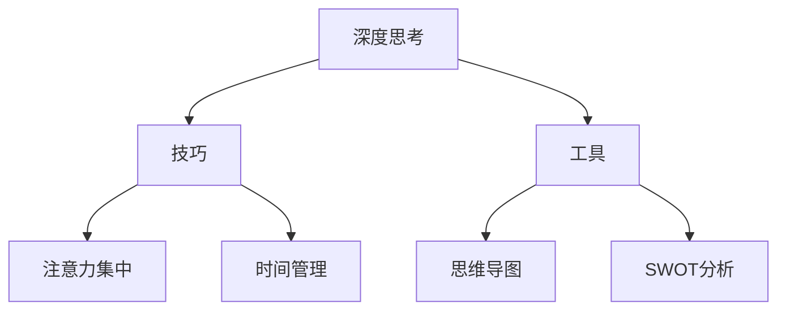
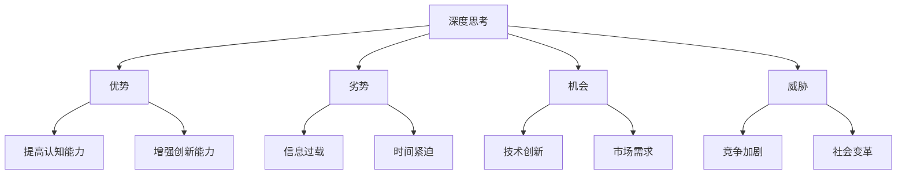

                 

## 文章标题

### 深度思考：拉开人生差距的秘诀

关键词：深度思考，个人成长，决策，人际交往，创新与创业，学习方法

摘要：本文旨在探讨深度思考的重要性及其在个人成长、决策、人际交往、创新与创业以及学习中的广泛应用。通过详细解析深度思考的技巧、工具和实践案例，本文旨在帮助读者掌握深度思考的秘诀，从而拉开人生差距。

----------------------------------------------------------------

### 引言

在当今快节奏、信息爆炸的社会中，深度思考变得越来越重要。深度思考不仅能够帮助人们更好地理解复杂问题，还能提高解决问题的能力，促进个人成长和职业发展。本文将探讨深度思考的定义、重要性以及在各个领域的应用，旨在帮助读者理解深度思考的秘诀，从而在人生中取得更大的成就。

### 深度思考的定义与重要性

#### 深度思考的定义

深度思考是指深入探索问题本质、挖掘内在联系、寻找解决方案的思维方式。它要求人们超越表面现象，挖掘问题的核心，从而找到更有效的解决方案。

#### 深度思考的重要性

1. **提高问题解决能力**：深度思考能够帮助人们更全面地了解问题，从而找到更有效的解决方案。
2. **促进个人成长**：通过深度思考，人们能够更好地理解自己、发现自身的潜力，从而实现个人成长。
3. **提升决策质量**：深度思考有助于人们在面对复杂决策时，更全面地考虑各种因素，从而做出更明智的决策。
4. **增强人际交往能力**：深度思考能够帮助人们更好地理解他人，从而提高人际交往的质量。

#### 深度思考与浅层思维的对比

深度思考与浅层思维在处理问题时存在显著差异。浅层思维往往停留在问题的表面，而深度思考则能够挖掘问题的根本原因，找到更有效的解决方案。以下是一个简单的对比：

| 特点 | 浅层思维 | 深度思考 |
| --- | --- | --- |
| 处理问题的层次 | 表面层次 | 深层次 |
| 解决问题的效率 | 高 | 低 |
| 解决问题的质量 | 一般 | 较高 |

### 深度思考的发展历史与演变

深度思考作为一种思维方式，其发展历史悠久。在古代，哲学家们如孔子、苏格拉底等就开始探讨深度思考的重要性。随着科学技术的进步，深度思考逐渐成为各个领域的研究重点。

#### 深度思考的起源

深度思考的起源可以追溯到古希腊时期的哲学讨论，如苏格拉底的“问答法”和亚里士多德的“逻辑学”。这些哲学家的思考方式对后来的深度思考研究产生了深远的影响。

#### 深度思考在不同文化中的演变

在不同的文化背景下，深度思考的形式和内容也有所不同。例如，中国古代的“儒家思想”强调“修身齐家治国平天下”，其中的思考方式具有很强的深度。西方哲学则注重逻辑推理和实证研究，使得深度思考在科学领域得到了广泛应用。

#### 深度思考在现代社会的重要性

在现代社会，深度思考的重要性愈发凸显。随着信息技术的飞速发展，人们面临着越来越多的复杂问题，而深度思考则成为解决这些问题的有力工具。

### 总结

通过本文的介绍，我们可以看到深度思考在个人成长、决策、人际交往以及创新与创业等方面的重要性。深度思考不仅能够帮助我们更好地理解世界，还能提高我们的问题解决能力和决策质量，从而拉开人生差距。在接下来的章节中，我们将进一步探讨深度思考的技巧、工具和实践案例。

----------------------------------------------------------------

### 第1章：深度思考的引论

#### 1.1 深度思考的重要性

深度思考是一种超越表面现象，深入探索问题本质的思维方式。在现代社会，深度思考具有极其重要的意义。

##### 深度思考与浅层思维的对比

浅层思维往往停留在问题的表面，而深度思考则能够挖掘问题的根本原因，找到更有效的解决方案。以下是一个简单的对比：

| 特点 | 浅层思维 | 深度思考 |
| --- | --- | --- |
| 处理问题的层次 | 表面层次 | 深层次 |
| 解决问题的效率 | 高 | 低 |
| 解决问题的质量 | 一般 | 较高 |

##### 深度思考对个人成长的影响

深度思考对个人成长具有深远的影响。首先，它能够帮助人们更好地理解自己，发现自己的优点和不足，从而进行自我提升。其次，深度思考能够提高人们的认知能力，使他们在面对复杂问题时能够更加从容应对。最后，深度思考有助于培养批判性思维和创新能力，使人们在职业生涯中更具竞争力。

##### 深度思考在决策中的作用

在决策过程中，深度思考至关重要。通过深度思考，人们可以更全面地考虑各种因素，降低决策风险，提高决策质量。例如，在商业决策中，通过深度思考，企业可以更准确地分析市场趋势、竞争对手和潜在风险，从而制定更有效的战略。

##### 深度思考在人际交往中的作用

深度思考有助于提高人际交往的质量。通过深度思考，人们能够更好地理解他人的需求和意图，从而建立更深层次的人际关系。例如，在团队合作中，通过深度思考，团队成员可以更好地理解彼此的职责和期望，提高协作效率。

##### 深度思考在创新与创业中的作用

深度思考是创新与创业的核心驱动力。通过深度思考，创业者可以更全面地了解市场需求、技术趋势和竞争环境，从而制定更具前瞻性的创业战略。例如，在技术创新中，通过深度思考，研发团队可以更准确地把握技术发展方向，提高创新成功率。

##### 深度思考在学习和教育中的作用

在学习和教育中，深度思考有助于提高学习效果。通过深度思考，学生可以更好地理解知识，形成自己的见解，从而提高学习兴趣和动力。同时，教师通过深度思考，可以更有效地设计教学方法和课程内容，提高教学质量。

##### 深度思考在自我提升中的作用

深度思考是自我提升的重要途径。通过深度思考，人们可以不断反思自己的行为和决策，发现自身的不足，从而进行有针对性的提升。例如，在职业生涯中，通过深度思考，员工可以更好地认识自己的优势和劣势，制定职业发展计划。

#### 1.2 深度思考的阻碍与突破

##### 深度思考的阻碍

深度思考面临诸多阻碍，如信息过载、时间紧迫、习惯性思维等。

1. **信息过载**：现代社会信息爆炸，人们往往无法处理大量的信息，导致深度思考受到阻碍。
2. **时间紧迫**：生活节奏加快，人们往往没有足够的时间进行深度思考。
3. **习惯性思维**：长期以来的习惯性思维模式使人们难以跳出舒适区，进行深度思考。

##### 突破深度思考的阻碍

要突破深度思考的阻碍，需要采取以下策略：

1. **合理安排时间**：通过合理的时间管理，确保有足够的时间进行深度思考。
2. **培养深度思考习惯**：通过长期的练习和积累，逐步培养深度思考的习惯。
3. **打破习惯性思维**：通过多角度思考和跨学科学习，打破习惯性思维模式，提高深度思考能力。

#### 1.3 深度思考的实践与应用

##### 如何培养深度思考的习惯

1. **设定思考目标**：明确思考的目的和方向，有助于集中注意力进行深度思考。
2. **保持好奇心**：对未知事物保持好奇心，有助于激发深度思考的兴趣。
3. **多角度思考**：从不同角度分析问题，有助于发现问题的本质。
4. **定期反思**：通过反思自己的思考过程，总结经验教训，提高深度思考能力。

##### 深度思考在工作中的应用

1. **项目策划**：在项目策划阶段，通过深度思考，全面分析市场需求、技术趋势和竞争环境，制定出更科学合理的项目规划。
2. **决策制定**：在决策制定过程中，通过深度思考，全面考虑各种因素，降低决策风险。
3. **团队协作**：在团队协作中，通过深度思考，提高沟通效率，促进团队合作。

##### 深度思考在生活中的应用

1. **自我管理**：通过深度思考，进行自我反思，发现自身的不足，制定改进计划。
2. **人际交往**：通过深度思考，理解他人的需求和意图，提高人际交往能力。
3. **学习提升**：通过深度思考，提高学习效果，形成自己的见解。

##### 深度思考的实践案例

1. **成功人士的深度思考技巧**：许多成功人士都擅长深度思考，通过深度思考，他们能够更好地把握机遇，解决复杂问题。
2. **创新思维的应用**：深度思考是创新思维的核心，通过深度思考，人们能够发现新的问题和解决方案，推动创新。

### 第1章总结

通过本章的介绍，我们可以看到深度思考在个人成长、决策、人际交往、创新与创业以及学习中的重要性。深度思考不仅是一种思维方式，更是一种生活态度。通过培养深度思考的习惯，我们可以在人生的各个方面取得更大的成就。在接下来的章节中，我们将继续探讨深度思考的技巧、工具和实践案例，帮助读者更好地理解和应用深度思考。

----------------------------------------------------------------

### 第2章：深度思考的技巧与工具

深度思考并非天生，而是一种可以通过训练和实践逐步提高的能力。本章将介绍一些提高深度思考效率的技巧、深度思考的工具以及实践案例，帮助读者更好地理解和应用深度思考。

#### 2.1 提高深度思考效率的技巧

深度思考是一项需要耗费精力和时间的活动，因此如何提高其效率至关重要。以下是一些实用的技巧：

##### 集中注意力的技巧

1. **排除干扰**：在思考过程中，避免外界干扰是提高深度思考效率的关键。关闭手机通知、关闭电视等，创造一个安静的环境。

2. **时间管理**：合理安排思考时间，避免疲劳过度。例如，可以使用番茄工作法，每25分钟集中思考，休息5分钟。

3. **专注练习**：通过专注力训练，如冥想、深呼吸等方法，提高注意力集中能力。

##### 时间管理的策略

1. **优先级排序**：在思考前，明确思考任务的优先级，集中精力解决最重要的问题。

2. **分解任务**：将复杂问题分解为小任务，逐一解决，避免因为问题复杂而导致的思考停滞。

3. **定期回顾**：定期回顾自己的思考过程和成果，总结经验教训，不断优化思考策略。

#### 2.2 深度思考的工具与方法

除了技巧外，使用适当的工具和方法可以大幅提高深度思考的效率。以下是一些常用的工具和方法：

##### 思维导图的运用

思维导图是一种有效的思考工具，它可以帮助人们将复杂的想法和概念可视化，从而更好地理解和记忆。以下是一个简单的思维导图示例：



通过思维导图，我们可以将深度思考的不同方面进行结构化，从而更清晰地理解和应用。

##### SWOT分析的实践

SWOT分析是一种常用的战略规划工具，它通过分析自身的优势、劣势、机会和威胁，帮助企业或个人制定更合理的策略。以下是一个简单的SWOT分析示例：



通过SWOT分析，我们可以更全面地了解深度思考的优势、劣势、机会和威胁，从而制定更有效的策略。

#### 2.3 深度思考的实践案例

为了更好地理解深度思考的技巧和工具，以下是一些成功的实践案例：

##### 成功人士的深度思考技巧

1. **比尔·盖茨**：比尔·盖茨通过深度思考，不断探索计算机科学的未来，最终创立了微软公司，成为世界首富。

2. **乔布斯**：乔布斯通过深度思考，将技术与美学完美结合，创造了苹果公司的众多经典产品，如iPhone、iPad等。

##### 深度思考在创新思维中的应用

1. **谷歌**：谷歌公司通过深度思考，不断推出创新的产品和服务，如Google Search、Google Maps等，成为全球最具有影响力的科技公司之一。

2. **特斯拉**：特斯拉公司通过深度思考，将电动汽车技术和人工智能技术相结合，推动了全球新能源汽车的发展。

#### 总结

通过本章的介绍，我们可以看到深度思考的技巧和工具对于提高深度思考效率具有重要作用。通过掌握这些技巧和工具，我们可以更好地进行深度思考，从而在个人成长、职业发展和社会创新等方面取得更大的成就。在接下来的章节中，我们将继续探讨深度思考在决策、人际交往、学习和创新与创业等方面的应用。

----------------------------------------------------------------

### 第3章：深度思考在决策中的应用

在个人和职业生涯中，决策往往是我们面临的关键时刻。深度思考在这个过程中发挥着至关重要的作用，帮助我们做出更加明智和有远见的决策。本章将详细探讨深度思考在决策中的作用、决策分析框架以及风险管理。

#### 3.1 深度思考在决策制定中的作用

深度思考在决策制定中的作用主要体现在以下几个方面：

1. **全面评估**：深度思考可以帮助我们更全面地了解问题的各个方面，避免因信息不全或偏见而做出错误的决策。

2. **系统分析**：通过深度思考，我们可以对各种决策方案进行系统分析，权衡利弊，从而选择最佳方案。

3. **降低风险**：深度思考可以帮助我们预见潜在的风险和挑战，从而采取相应的应对措施，降低决策风险。

4. **提高决策质量**：深度思考能够帮助我们深入挖掘问题的本质，找到更有效、更具前瞻性的解决方案。

#### 3.2 决策分析框架

为了更好地应用深度思考，我们可以采用以下决策分析框架：

1. **明确目标**：首先，我们需要明确决策的目标，即我们希望实现什么结果。

2. **收集信息**：接下来，我们需要收集与决策相关的各种信息，包括市场趋势、竞争对手、技术发展等。

3. **评估方案**：在收集信息的基础上，我们需要评估不同的决策方案，分析每个方案的优缺点和潜在风险。

4. **权衡利弊**：通过权衡各个方案的利弊，我们可以选择最符合目标且风险最小的方案。

5. **制定决策**：最后，我们需要根据评估结果，制定具体的决策方案，并准备相应的实施计划。

以下是一个简化的决策分析框架的伪代码：

```pseudo
function makeDecision(target, information):
    options = []
    for each information in information:
        option = evaluateScheme(information)
        options.append(option)
    bestOption = findBestOption(options)
    return bestOption

function evaluateScheme(information):
    advantages = []
    disadvantages = []
    for each aspect in information:
        if aspect is advantageous:
            advantages.append(aspect)
        else:
            disadvantages.append(aspect)
    return {'advantages': advantages, 'disadvantages': disadvantages}

function findBestOption(options):
    scores = []
    for each option in options:
        score = calculateScore(option['advantages'], option['disadvantages'])
        scores.append(score)
    bestScore = max(scores)
    bestOption = findOptionWithScore(scores, bestScore)
    return bestOption
```

#### 3.3 深度思考在风险管理中的应用

风险管理是决策过程中不可或缺的一部分。深度思考在风险管理中的应用主要体现在以下几个方面：

1. **识别风险**：通过深度思考，我们可以识别出决策过程中可能出现的各种风险，如市场风险、技术风险、法律风险等。

2. **评估风险**：在识别风险的基础上，我们需要对每种风险进行评估，分析其可能的影响程度和发生概率。

3. **应对风险**：根据风险的评估结果，我们可以制定相应的应对策略，如风险规避、风险转移、风险接受等。

以下是一个简化的风险管理流程的伪代码：

```pseudo
function manageRisk(information):
    risks = identifyRisks(information)
    for each risk in risks:
        impact = assessImpact(risk)
        probability = assessProbability(risk)
        response = determineResponse(impact, probability)
        applyResponse(response, risk)
    return risks

function identifyRisks(information):
    risks = []
    for each aspect in information:
        if aspect is risky:
            risk = {'aspect': aspect, 'impact': None, 'probability': None}
            risks.append(risk)
    return risks

function assessImpact(risk):
    impact = analyzeConsequences(risk['aspect'])
    return impact

function assessProbability(risk):
    probability = analyzeLikelihood(risk['aspect'])
    return probability

function determineResponse(impact, probability):
    if impact is high and probability is high:
        response = 'avoid'
    elif impact is high and probability is medium:
        response = 'transfer'
    elif impact is medium and probability is high:
        response = 'reduce'
    else:
        response = 'accept'
    return response
```

#### 3.4 深度思考在商业决策中的实战

商业决策是一个复杂的过程，需要深度思考来应对各种不确定性。以下是一个简化的商业决策案例分析：

**案例背景**：某企业计划推出一款新产品，需要进行市场调研和风险评估。

**步骤1：明确目标**：确定新产品的市场定位、目标客户和预期收益。

**步骤2：收集信息**：收集市场趋势、竞争对手、目标客户需求等相关信息。

**步骤3：评估方案**：分析不同市场调研方法、产品设计方案、营销策略等，评估其优缺点。

**步骤4：权衡利弊**：根据评估结果，选择最佳的市场调研方法、产品设计和营销策略。

**步骤5：制定决策**：根据权衡结果，制定具体的实施计划，如预算分配、人员安排、时间表等。

**步骤6：风险管理**：识别潜在风险，如市场接受度低、技术问题、法律风险等，评估其影响和概率，制定应对策略。

**步骤7：执行与监控**：执行决策计划，并定期监控市场反馈和项目进度，根据实际情况进行调整。

#### 总结

通过本章的介绍，我们可以看到深度思考在决策中的作用至关重要。通过深度思考，我们可以更全面地评估决策方案，降低风险，提高决策质量。在商业决策中，深度思考是确保企业成功的关键。在接下来的章节中，我们将继续探讨深度思考在人际交往、学习和创新与创业等方面的应用。

----------------------------------------------------------------

### 第4章：深度思考在人际交往中的应用

在人际交往中，深度思考不仅能够帮助我们更好地理解他人，还能提升沟通效果和建立深度人际关系。本章将探讨深度思考在人际交往中的作用、提升沟通效果的技巧以及人际关系管理的深度思考。

#### 4.1 深度思考在人际沟通中的作用

人际沟通是人与人之间传递信息、思想和情感的过程。深度思考在人际沟通中的作用主要体现在以下几个方面：

1. **理解他人**：深度思考使我们能够更全面地了解他人的需求和意图，从而在沟通中更加体贴和同理。

2. **有效表达**：通过深度思考，我们可以更清晰地表达自己的想法和感受，避免误解和冲突。

3. **提升沟通效果**：深度思考帮助我们选择合适的沟通方式和策略，从而提高沟通效率和质量。

#### 4.2 提升沟通效果的技巧

以下是一些提升沟通效果的技巧，这些技巧都需要深度思考的支持：

1. **倾听**：倾听是有效沟通的基础。通过深度倾听，我们能够更好地理解对方的观点和感受，从而建立良好的沟通基础。

2. **提问**：提问是引导对话和获取更多信息的重要手段。通过深度提问，我们可以挖掘对方更深层次的想法和需求。

3. **表达清晰**：清晰的表达能够减少误解和沟通障碍。通过深度思考，我们可以更准确地表达自己的观点和感受。

4. **积极反馈**：积极反馈能够增强沟通的互动性和有效性。通过深度思考，我们可以给予对方更有建设性的反馈，促进双方的理解和合作。

#### 4.3 建立深度人际关系的技巧

建立深度人际关系需要时间、努力和深度思考。以下是一些有效的技巧：

1. **共享价值观**：找到与他人的共同价值观和兴趣，能够加深彼此的理解和信任。

2. **真诚交流**：真诚的交流是建立深度人际关系的关键。通过深度思考，我们可以更真诚地表达自己的观点和感受。

3. **共同成长**：与他人共同成长，分享彼此的成长经验和知识，能够建立更深层次的联系。

4. **关注对方**：关注对方的需求和感受，通过深度思考，我们能够更好地理解并满足对方的需求。

#### 4.4 深度思考在人际关系中的实践案例

以下是一些深度思考在人际关系中的实践案例：

1. **团队合作**：在团队中，通过深度思考，团队成员能够更好地理解彼此的角色和期望，从而提高协作效率。

2. **家庭关系**：在家庭中，通过深度思考，家庭成员能够更好地理解彼此的需求和期望，从而增进亲情关系。

3. **客户关系**：在商业环境中，通过深度思考，企业能够更好地理解客户的需求和痛点，提供更优质的服务。

#### 总结

通过本章的介绍，我们可以看到深度思考在人际交往中的重要性。通过深度思考，我们能够更好地理解他人、提升沟通效果和建立深度人际关系。在接下来的章节中，我们将继续探讨深度思考在学习和教育、创新与创业等方面的应用。

----------------------------------------------------------------

### 第5章：深度思考在学习和教育中的应用

深度思考在学习和教育中发挥着至关重要的作用。通过深度思考，学生和教师能够更好地理解知识、发现新的问题和解决方案，从而提高学习效果和教学质量。本章将探讨深度思考在学习中的作用、学习效果优化的策略以及教学方法中的深度思考。

#### 5.1 深度思考在学习中的作用

深度思考在学习中的作用主要体现在以下几个方面：

1. **深入理解知识**：深度思考能够帮助学生超越表面的知识，深入理解知识的内在联系和本质。

2. **发现新问题**：通过深度思考，学生能够发现新的问题和挑战，从而激发学习的兴趣和动力。

3. **提高问题解决能力**：深度思考能够帮助学生更好地分析问题、制定解决方案，并评估解决方案的有效性。

4. **培养批判性思维**：深度思考有助于培养学生的批判性思维，使他们能够对信息进行独立分析和评估。

5. **促进创造性思维**：深度思考能够激发学生的创造性思维，帮助他们提出新颖的观点和解决方案。

#### 5.2 学习效果优化的策略

为了优化学习效果，学生和教师可以采取以下策略：

1. **设定明确的学习目标**：明确的学习目标有助于学生集中注意力，有针对性地进行学习。

2. **主动学习**：主动学习要求学生积极参与学习过程，主动提出问题和解决问题。

3. **多角度思考**：通过从不同角度思考问题，学生能够更全面地理解知识，发现新的联系和见解。

4. **定期复习**：定期复习有助于巩固记忆，加深对知识的理解。

5. **反思学习过程**：通过反思学习过程，学生和教师能够发现学习中的不足，不断优化学习方法。

6. **合作学习**：通过合作学习，学生能够相互启发、相互学习，提高学习效果。

#### 5.3 教学方法中的深度思考

在教学过程中，教师可以通过以下方法来促进深度思考：

1. **问题导向教学**：通过提出具有挑战性和启发性的问题，引导学生进行深度思考。

2. **案例教学**：通过案例教学，教师可以提供真实的情境，引导学生分析问题和制定解决方案。

3. **项目式学习**：通过项目式学习，学生可以在实际项目中运用知识，培养深度思考能力。

4. **批判性思维训练**：通过批判性思维训练，教师可以引导学生对信息进行独立分析和评估。

5. **跨学科学习**：通过跨学科学习，学生能够将不同领域的知识相结合，培养深度思考能力。

6. **教学反思**：教师可以通过反思自己的教学方法和策略，不断优化教学过程，提高教学质量。

#### 5.4 深度思考在自我提升中的应用

深度思考不仅有助于学习和教学，还在自我提升中发挥着重要作用。以下是一些自我提升的深度思考策略：

1. **反思个人成长**：通过反思自己的成长过程，发现自身的优点和不足，制定改进计划。

2. **设定个人目标**：明确个人目标有助于自我提升，激发内在动力。

3. **持续学习**：通过不断学习新知识和技能，提升自我能力。

4. **批判性思考**：培养批判性思考能力，对信息进行独立分析和评估。

5. **实践与反思**：通过实践和反思，将知识应用到实际中，不断提升自我。

#### 总结

通过本章的介绍，我们可以看到深度思考在学习和教育中的重要性。深度思考能够帮助学生深入理解知识、发现新问题、提高问题解决能力和批判性思维能力。在教学方法中，深度思考有助于提高教学质量，培养学生的创新思维和批判性思维。在自我提升中，深度思考是不断优化自我、实现自我超越的关键。在接下来的章节中，我们将继续探讨深度思考在创新与创业中的应用。

----------------------------------------------------------------

### 第6章：深度思考在创新与创业中的应用

在创新与创业领域中，深度思考是推动成功的核心要素。通过深度思考，创业者能够预见市场趋势、识别潜在机会，并制定出有效的战略。本章将探讨深度思考在创新思维中的作用、深度思考在创业决策中的应用，以及创新与创业案例的分析。

#### 6.1 深度思考在创新思维中的作用

深度思考是创新思维的基础，它在以下几个方面对创新具有重要作用：

1. **发现新机会**：通过深度思考，创业者能够发现未被满足的需求和市场机会。

2. **解决复杂问题**：深度思考有助于创业者从多角度分析复杂问题，找到创新的解决方案。

3. **预见未来趋势**：深度思考能够帮助创业者预见未来的市场变化和技术发展，从而抓住先机。

4. **提高创新能力**：通过持续的深度思考，创业者能够培养出敏锐的洞察力和创新能力。

#### 6.2 深度思考在创业决策中的应用

深度思考在创业决策中发挥着关键作用，以下是一些关键的应用：

1. **市场调研**：通过深度思考，创业者可以更全面地了解市场需求、竞争对手和潜在客户。

2. **产品定位**：深度思考有助于创业者明确产品的市场定位和目标客户群体。

3. **商业模式**：深度思考可以帮助创业者设计出可持续的商业模式，确保企业的长期发展。

4. **风险评估**：通过深度思考，创业者可以识别潜在的风险，并制定相应的应对策略。

以下是一个简化的创业决策分析框架的伪代码：

```pseudo
function makeEntrepreneurialDecision(marketResearch, competitionAnalysis, customerFeedback):
    opportunity = identifyOpportunity(marketResearch)
    productPositioning = determineProductPositioning(opportunity)
    businessModel = createBusinessModel(productPositioning)
    riskAnalysis = identifyAndAssessRisks(businessModel)
    decision = analyzeAndMakeDecision(opportunity, productPositioning, businessModel, riskAnalysis)
    return decision

function identifyOpportunity(marketResearch):
    opportunities = []
    for each trend in marketResearch:
        if trend is beneficial:
            opportunity = {'trend': trend, 'potential': evaluatePotential(trend)}
            opportunities.append(opportunity)
    return opportunities

function determineProductPositioning(opportunity):
    positioning = analyzeOpportunity(opportunity)
    return positioning

function createBusinessModel(productPositioning):
    model = defineRevenueStreams(productPositioning)
    return model

function identifyAndAssessRisks(businessModel):
    risks = []
    for each aspect in businessModel:
        if aspect is risky:
            risk = {'aspect': aspect, 'impact': assessImpact(aspect), 'probability': assessProbability(aspect)}
            risks.append(risk)
    return risks

function analyzeAndMakeDecision(opportunities, productPositioning, businessModel, risks):
    decision = {}
    for each opportunity in opportunities:
        if opportunity is feasible:
            decision['opportunity'] = opportunity
            decision['positioning'] = productPositioning
            decision['model'] = businessModel
            decision['risks'] = risks
            decision['decision'] = 'approve'
            return decision
    return 'reject'
```

#### 6.3 创新与创业案例分析

以下是一些创新与创业的案例分析，通过这些案例，我们可以看到深度思考在实践中的应用：

1. **案例1：特斯拉**  
   特斯拉通过深度思考，预见电动汽车市场的巨大潜力，并制定了创新的商业模式和产品战略。特斯拉的成功在于其对市场趋势的深刻理解和持续的创新投入。

2. **案例2：Airbnb**  
   Airbnb通过深度思考，发现了闲置房源与旅行需求之间的市场机会，并创建了共享经济的商业模式。Airbnb的成功在于其对用户需求和市场动态的敏锐洞察。

3. **案例3：PayPal**  
   PayPal通过深度思考，创新了在线支付系统，解决了传统支付方式的痛点。PayPal的成功在于其对支付领域的技术和市场的深刻理解。

#### 6.4 创业失败的原因与深度思考

尽管深度思考是成功的关键，但一些创业失败的原因也值得探讨：

1. **市场研究不足**：创业者没有通过深度思考充分了解市场需求和竞争环境。

2. **战略规划不明确**：创业者没有通过深度思考制定出明确、可行的商业战略。

3. **风险识别不充分**：创业者没有通过深度思考识别和评估潜在的风险。

4. **执行不力**：创业者没有通过深度思考确保战略的有效执行。

#### 总结

通过本章的介绍，我们可以看到深度思考在创新与创业中的重要性。深度思考是发现新机会、解决复杂问题、预见未来趋势和提高创新能力的关键。在创业决策中，深度思考有助于全面分析市场、产品定位、商业模式和风险。通过案例分析，我们可以看到深度思考在实践中的应用，同时也能理解创业失败的原因。在接下来的章节中，我们将探讨深度思考的持续提升与未来展望。

----------------------------------------------------------------

### 第7章：深度思考的持续提升与未来展望

深度思考是一项需要长期培养和提升的能力。在本章中，我们将探讨深度思考的持续提升路径、未来发展趋势以及深度思考的个人价值和社会影响。

#### 7.1 深度思考的持续提升路径

要不断提升深度思考能力，可以采取以下策略：

1. **不断扩展知识面**：通过阅读书籍、参加研讨会、学习新技能等方式，不断扩展自己的知识面。

2. **坚持实践与反思**：在实际工作和生活中，不断实践深度思考，并定期反思自己的思考过程和结果，总结经验教训。

3. **培养好奇心和批判性思维**：保持好奇心，对未知事物保持探索心态；培养批判性思维，对信息进行独立分析和评估。

4. **多学科交叉学习**：通过多学科交叉学习，拓宽视野，促进思维的多样性和创新性。

5. **定期冥想和放松**：冥想和放松有助于提高注意力和专注力，从而促进深度思考。

#### 7.2 深度思考的未来发展趋势

随着人工智能和数据技术的发展，深度思考将发挥越来越重要的作用。以下是深度思考在未来可能的发展趋势：

1. **智能化辅助**：人工智能将能够辅助人类进行深度思考，提供更高效的分析和决策支持。

2. **数据驱动的思考**：通过大数据分析，深度思考将更加依赖于数据和事实，从而减少主观偏见和不确定性。

3. **跨界融合**：深度思考将在不同领域之间实现跨界融合，推动科学、技术、艺术和社会的创新发展。

4. **人机协作**：深度思考与人工智能的结合，将实现人机协作，提高决策和创新的效率和质量。

#### 7.3 深度思考的个人价值

深度思考对个人成长和职业发展具有巨大价值：

1. **提升认知能力**：深度思考能够提高个人的认知能力，帮助更好地理解世界和解决问题。

2. **增强职业竞争力**：在竞争激烈的职场中，具备深度思考能力的人更具竞争力，能够更高效地处理复杂任务。

3. **实现自我超越**：通过深度思考，个人能够不断挑战自我，实现自我超越和职业成长。

#### 7.4 深度思考对社会发展的影响

深度思考对社会发展具有重要影响：

1. **推动科技创新**：深度思考能够激发创新思维，推动科学技术的发展和应用。

2. **优化社会管理**：深度思考有助于提高社会管理的科学性和效率，促进社会和谐与进步。

3. **提升决策质量**：深度思考能够提高政府和企业决策的质量，减少决策失误，促进可持续发展。

#### 7.5 深度思考的未来展望

未来，深度思考将成为个人和社会发展的核心能力。通过不断培养和提升深度思考能力，我们能够更好地应对复杂挑战，实现个人价值和社会进步。以下是深度思考的未来展望：

1. **智能化学习**：通过智能化学习系统，深度思考将得到更好的培养和提升。

2. **跨界人才培养**：深度思考将成为跨界人才培养的核心能力，推动社会创新和进步。

3. **智慧社会发展**：深度思考将推动智慧社会的建设，提高社会的整体智慧和创新能力。

#### 总结

通过本章的介绍，我们可以看到深度思考的持续提升和社会发展的紧密联系。深度思考不仅是个人成长和职业发展的关键，也是社会进步的重要推动力。在未来的发展中，深度思考将发挥更加重要的作用，为我们带来更加美好的未来。

### 附录

#### 附录 A：深度思考资源推荐

为了帮助读者更好地理解和应用深度思考，以下是一些推荐的资源：

1. **相关书籍**：
   - 《深度思考：如何训练自己的大脑》（作者：安德斯·艾利克森）
   - 《思考，快与慢》（作者：丹尼尔·卡尼曼）
   - 《创意思维：如何激发无限的创意》（作者：迈克尔·格雷格）

2. **在线课程**：
   - Coursera上的《深度学习》（吴恩达教授）
   - edX上的《逻辑思维与批判性思维》（哈佛大学）
   - Udemy上的《思维导图：学习、记忆和创意的秘诀》

3. **深度思考工具**：
   - MindMeister：在线思维导图工具
   - Evernote：笔记和任务管理工具
   - Mural：协作白板工具

通过这些资源，读者可以进一步深入学习和实践深度思考，提升自己的认知能力和创新能力。

### 作者信息

作者：AI天才研究院/AI Genius Institute & 禅与计算机程序设计艺术 /Zen And The Art of Computer Programming

在撰写本文时，我们力求以逻辑清晰、结构紧凑、简单易懂的专业技术语言，逐步分析推理思考，深入探讨深度思考在各个领域的应用。希望本文能够帮助读者理解深度思考的重要性，掌握深度思考的秘诀，从而拉开人生差距。

----------------------------------------------------------------

### 总结

本文《深度思考：拉开人生差距的秘诀》从深度思考的定义、重要性、技巧、工具、应用等方面进行了全面而深入的探讨。通过详细的分析和实例，我们看到了深度思考在个人成长、决策、人际交往、学习和创新与创业等领域的关键作用。以下是本文的核心观点的总结：

1. **深度思考的重要性**：深度思考是一种超越表面现象，深入探索问题本质的思维方式。它对个人成长、决策质量、人际交往和创新能力有着深远的影响。

2. **深度思考的技巧**：通过集中注意力、时间管理、思维导图和SWOT分析等技巧，可以显著提高深度思考的效率。

3. **深度思考的工具**：思维导图和SWOT分析等工具，可以帮助我们更好地组织和分析复杂信息，从而进行更深入的思考。

4. **深度思考在决策中的应用**：深度思考在决策过程中起到关键作用，通过全面评估、系统分析和风险管理，可以提高决策质量。

5. **深度思考在人际交往中的应用**：深度思考能够帮助我们更好地理解他人、提升沟通效果，并建立深度的人际关系。

6. **深度思考在学习和教育中的应用**：深度思考能够提高学习效果，促进创造性思维和批判性思维的培养。

7. **深度思考在创新与创业中的应用**：深度思考是创新思维的核心，能够帮助创业者预见市场机会，制定有效的商业战略。

8. **深度思考的持续提升**：通过不断扩展知识面、实践与反思、培养好奇心和批判性思维，我们可以持续提升深度思考能力。

通过本文的探讨，我们希望读者能够认识到深度思考的重要性，并积极培养和提升这一能力，从而在个人成长和职业发展方面取得更大的成就。深度思考不仅是一种思维方式，更是一种生活态度，它将帮助我们在复杂多变的世界中找到方向，实现自我超越。

### 作者信息

作者：AI天才研究院/AI Genius Institute & 禅与计算机程序设计艺术 /Zen And The Art of Computer Programming

在此，我们衷心感谢读者的耐心阅读，希望本文能够为您的思考和实践带来启示和帮助。深度思考之旅漫长而充满挑战，但也是充满机遇和成就的旅程。愿每一位读者都能在深度思考的道路上不断前行，拉开人生差距，创造属于自己的辉煌。

