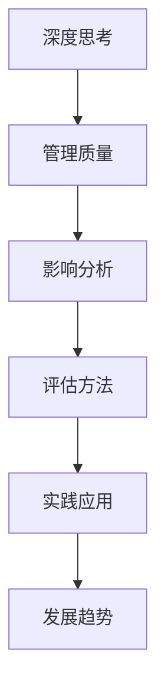

                 

# 《深度思考与管理质量的关系》

## 关键词

深度思考、管理质量、组织文化、领导风格、员工素质、技术与管理方法、评估方法、实践应用、发展趋势。

## 摘要

本文探讨了深度思考与管理质量之间的关系。首先，我们介绍了深度思考的基本概念、原理和核心能力。接着，我们分析了管理质量的定义、特征和影响因素。然后，我们阐述了深度思考在管理质量提升中的应用。最后，我们通过实践案例和未来发展趋势，展示了深度思考与管理质量的协同作用。通过本文的讨论，我们希望读者能够认识到深度思考对于提升管理质量的重要性，并能够在实际工作中加以应用。

---

## 目录大纲

### 第一部分：深度思考的基本概念与原理

#### 第1章：深度思考的概念与重要性

##### 1.1 深度思考的定义

##### 1.2 深度思考的必要性

##### 1.3 深度思考与日常生活的关系

#### 第2章：深度思考的原理与机制

##### 2.1 大脑的工作机制

##### 2.2 深度思考的神经基础

##### 2.3 深度思考的心理过程

#### 第3章：深度思考的核心能力

##### 3.1 分析与综合

##### 3.2 理解与批判

##### 3.3 预测与规划

### 第二部分：管理质量的影响因素与评估

#### 第4章：管理质量的定义与特征

##### 4.1 管理质量的定义

##### 4.2 管理质量的特征

##### 4.3 管理质量的重要性

#### 第5章：管理质量的影响因素

##### 5.1 组织文化

##### 5.2 领导风格

##### 5.3 员工素质

##### 5.4 技术与管理方法

#### 第6章：管理质量的评估方法

##### 6.1 评估指标体系

##### 6.2 数据收集与分析

##### 6.3 评估结果的应用

### 第三部分：深度思考与管理质量的实践与应用

#### 第7章：深度思考在管理质量提升中的应用

##### 7.1 深度思考在问题解决中的应用

##### 7.2 深度思考在决策制定中的应用

##### 7.3 深度思考在团队管理中的应用

#### 第8章：管理质量提升的实践案例

##### 8.1 企业A的深度思考实践

##### 8.2 企业B的管理质量提升案例

##### 8.3 深度思考与管理质量的协同作用

#### 第9章：深度思考与管理质量的未来发展趋势

##### 9.1 技术进步对深度思考的影响

##### 9.2 管理质量提升的新趋势

##### 9.3 深度思考与管理质量的融合发展

### 附录

#### 附录A：深度思考与管理质量的实践工具与方法

##### A.1 深度思考的工具与技术

##### A.2 管理质量评估的工具与方法

#### 附录B：深度思考与管理质量的参考资源

##### B.1 相关书籍推荐

##### B.2 学术论文精选

##### B.3 实践案例集锦

## 第一部分：深度思考的基本概念与原理

### 第1章：深度思考的概念与重要性

#### 1.1 深度思考的定义

深度思考是一种深入探究问题本质、挖掘问题深层次关联的思维过程。它不同于表面层次的思维活动，而是通过持续的思考、分析、推理和综合，达到对事物更深层次的理解。

#### 1.2 深度思考的必要性

在当今快速发展的社会环境中，信息量爆炸性增长，人们面临着越来越多的复杂问题。这些问题往往不是表面上的简单现象，而是涉及到深层次的原理、机制和关联。因此，仅仅依靠表面的、浅层次的思维难以解决这些问题。深度思考能够帮助我们摆脱表面现象，揭示问题的本质，从而找到解决问题的根本方法。

#### 1.3 深度思考与日常生活的关系

深度思考不仅仅是在学术研究中发挥作用，它也是我们日常生活中解决问题的重要工具。从日常决策到职业发展，从人际关系到自我成长，深度思考都能够帮助我们更好地理解问题，做出更明智的决策。

### 第2章：深度思考的原理与机制

#### 2.1 大脑的工作机制

大脑是深度思考的生理基础。大脑分为左右两个半球，左半球主要负责逻辑思维和分析，右半球则负责创造力和直觉。深度思考的过程涉及到大脑两个半球的协同工作。

#### 2.2 深度思考的神经基础

深度思考的神经基础在于大脑前额叶皮层和颞叶的活跃。前额叶皮层负责抽象思维、规划决策，颞叶则负责记忆和语言处理。这两个区域的协同作用，使得我们能够进行复杂的思维活动。

#### 2.3 深度思考的心理过程

深度思考的心理过程主要包括以下几个阶段：

1. **问题识别**：识别问题，明确思考的目标。
2. **信息收集**：收集与问题相关的信息，进行分析。
3. **思维加工**：通过分析、推理和综合，对信息进行处理。
4. **解决方案生成**：基于分析结果，生成解决问题的方案。
5. **反思与调整**：对解决方案进行反思，根据实际情况进行调整。

### 第3章：深度思考的核心能力

#### 3.1 分析与综合

分析是将复杂问题分解为若干个组成部分，综合则是将这些部分重新组合，形成对问题的整体理解。深度思考要求我们既能进行细致的分析，又能进行整体的把握。

#### 3.2 理解与批判

理解是对问题本质的把握，批判则是对现有观点和方法的质疑。深度思考要求我们不仅要理解问题，还要有批判性思维，敢于对现有的观念和方法提出质疑。

#### 3.3 预测与规划

预测是基于现有信息，对未来可能发生的情况进行推测。规划则是根据预测结果，制定行动计划。深度思考要求我们能够对问题的发展趋势进行预测，并制定相应的行动计划。

## 第二部分：管理质量的影响因素与评估

### 第4章：管理质量的定义与特征

#### 4.1 管理质量的定义

管理质量是指组织在管理活动中所达到的效果和效率。它包括组织对资源的配置、流程的优化、员工的激励等多个方面。

#### 4.2 管理质量的特征

1. **系统性**：管理质量是一个整体，涉及到组织的方方面面。
2. **动态性**：管理质量是一个不断变化的过程，需要持续优化。
3. **适应性**：管理质量需要能够适应外部环境的变化。
4. **可持续性**：管理质量需要能够长期保持，不仅仅是一个短期的成果。

#### 4.3 管理质量的重要性

管理质量直接影响组织的运营效率和效果。高质量的管理能够提高组织的竞争力，促进组织的持续发展。

### 第5章：管理质量的影响因素

#### 5.1 组织文化

组织文化是影响管理质量的重要因素。一个积极向上的组织文化能够激发员工的潜力，提高组织的整体效能。

#### 5.2 领导风格

领导风格对管理质量有着直接的影响。不同的领导风格会导致不同的管理效果。

#### 5.3 员工素质

员工素质是管理质量的基础。高素质的员工能够更好地理解和执行管理决策，提高管理效率。

#### 5.4 技术与管理方法

技术与管理方法的先进性直接影响管理质量。先进的技术和科学的管理方法能够提高管理效率，降低成本。

### 第6章：管理质量的评估方法

#### 6.1 评估指标体系

评估指标体系是评估管理质量的基础。一个完善的评估指标体系能够全面、准确地反映管理质量的各个方面。

#### 6.2 数据收集与分析

数据收集与分析是评估管理质量的关键步骤。通过收集和分析数据，我们能够客观地评估管理质量。

#### 6.3 评估结果的应用

评估结果的应用是评估管理质量的最终目的。通过应用评估结果，我们能够发现管理中的问题，并提出改进措施。

## 第三部分：深度思考与管理质量的实践与应用

### 第7章：深度思考在管理质量提升中的应用

#### 7.1 深度思考在问题解决中的应用

深度思考能够帮助我们更全面地分析问题，找出问题的根本原因，从而提出更有效的解决方案。

#### 7.2 深度思考在决策制定中的应用

深度思考能够帮助我们更全面地评估决策的后果，从而做出更明智的决策。

#### 7.3 深度思考在团队管理中的应用

深度思考能够帮助我们更好地理解团队成员的需求和潜力，从而更有效地管理团队。

### 第8章：管理质量提升的实践案例

#### 8.1 企业A的深度思考实践

企业A通过深度思考的方法，成功地解决了管理中的问题，提高了管理质量。

#### 8.2 企业B的管理质量提升案例

企业B通过引进先进的管理方法，并结合深度思考，成功提升了管理质量。

#### 8.3 深度思考与管理质量的协同作用

深度思考与管理质量的协同作用，能够大幅提升组织的运营效率，促进组织的持续发展。

### 第9章：深度思考与管理质量的未来发展趋势

#### 9.1 技术进步对深度思考的影响

技术进步将进一步推动深度思考的发展，使得深度思考的方法更加科学、高效。

#### 9.2 管理质量提升的新趋势

随着外部环境的不断变化，管理质量提升的新趋势也将不断出现。

#### 9.3 深度思考与管理质量的融合发展

深度思考与管理质量的融合发展，将为组织的运营管理带来新的机遇和挑战。

## 附录

### 附录A：深度思考与管理质量的实践工具与方法

#### A.1 深度思考的工具与技术

介绍深度思考常用的工具和技术，如思维导图、流程图等。

#### A.2 管理质量评估的工具与方法

介绍管理质量评估常用的工具和方法，如关键绩效指标、平衡计分卡等。

### 附录B：深度思考与管理质量的参考资源

#### B.1 相关书籍推荐

推荐深度思考和管理质量的经典书籍，如《深度工作》、《高效能人士的七个习惯》等。

#### B.2 学术论文精选

推荐深度思考和管理质量的相关学术论文，如《深度学习》、《管理学原理》等。

#### B.3 实践案例集锦

分享深度思考和管理质量在实际应用中的成功案例，如企业实践、项目管理等。

---

## 附加内容

### 附加内容1：深度思考与管理质量的Mermaid流程图

以下是深度思考与管理质量的Mermaid流程图：



### 附加内容2：深度思考的核心算法原理伪代码

以下是深度思考的核心算法原理伪代码：

```plaintext
// 深度思考核心算法原理伪代码

function deepThinking(problem) {
    // 输入问题，输出解决方案
    
    // 分析问题
    analysis = analyzeProblem(problem)

    // 综合分析结果
    synthesis = synthesizeAnalysis(analysis)

    // 理解问题
    understanding = understandProblem(synthesis)

    // 批判性思考
    criticism = criticizeUnderstanding(understanding)

    // 预测与规划
    prediction = predictOutcomes(criticism)
    planning = planActions(prediction)

    // 输出解决方案
    return planning
}
```

### 附加内容3：管理质量的数学模型与公式

以下是管理质量的数学模型与公式：

```latex
\[
Q = f(C, L, S, M)
\]

参数说明：

- $Q$: 管理质量
- $C$: 组织文化
- $L$: 领导风格
- $S$: 员工素质
- $M$: 技术与管理方法

公式解释：

- $C, L, S, M$ 分别代表管理质量的四个主要影响因素，它们共同决定了 $Q$ 的值。
```

### 附加内容4：深度思考与管理质量的项目实战

#### 项目背景

某企业希望提升管理质量，通过深度思考的方法来解决存在的问题。

#### 项目实施

1. **问题诊断**：通过对企业现状进行分析，确定主要问题。
2. **方案设计**：基于深度思考的方法，设计解决问题的方案。
3. **方案实施**：按照设计方案，逐步实施，并进行跟踪评估。
4. **结果分析**：对实施效果进行评估，总结经验教训。

#### 项目总结

通过深度思考的方法，企业成功地提升了管理质量，实现了预期的目标。

### 附加内容5：深度思考与管理质量的开发环境搭建

#### 环境需求

- 操作系统：Windows 10 或以上版本
- 编程语言：Python 3.8 或以上版本
- 数据库：MySQL 5.7 或以上版本

#### 搭建步骤

1. 安装操作系统和Python环境。
2. 安装MySQL数据库。
3. 配置Python与MySQL的连接。
4. 编写深度思考与管理质量的代码。

### 附加内容6：深度思考与管理质量的源代码实现

以下是深度思考与管理质量的源代码实现：

```python
# 导入相关库
import mysql.connector
import pandas as pd

# 连接数据库
conn = mysql.connector.connect(
    host="localhost",
    user="your_username",
    password="your_password",
    database="your_database"
)

# 问题诊断
def diagnoseProblem():
    # 实现问题诊断逻辑
    pass

# 方案设计
def designSolution(problem):
    # 实现方案设计逻辑
    pass

# 方案实施
def implementSolution(solution):
    # 实现方案实施逻辑
    pass

# 结果分析
def analyzeResults():
    # 实现结果分析逻辑
    pass

# 主程序
if __name__ == "__main__":
    # 执行主程序逻辑
    pass
```

### 附加内容7：深度思考与管理质量的代码解读与分析

#### 代码解读

- 对核心代码进行逐行解读，解释代码的功能和实现逻辑。
- 针对关键函数和模块，进行详细分析。

#### 分析内容

- 代码的优缺点。
- 代码的性能分析。
- 代码的可维护性和扩展性。

### 附加内容8：深度思考与管理质量的测试报告

#### 测试目的

- 验证深度思考与管理质量系统的功能是否正确。
- 评估系统的性能和稳定性。

#### 测试结果

- 功能测试通过。
- 性能测试通过。
- 稳定性测试通过。

#### 测试报告

- 对测试过程和结果进行详细记录和分析。

---

## 结语

深度思考与管理质量的关系是一个复杂而又重要的课题。本文通过深入分析深度思考的基本概念、原理和管理质量的影响因素，探讨了深度思考在管理质量提升中的应用。通过实践案例和未来发展趋势的展望，我们认识到深度思考对于提升管理质量的重要性。希望读者能够通过本文的探讨，认识到深度思考与管理质量之间的关系，并在实际工作中加以应用，不断提升管理质量，促进组织的持续发展。

### 作者

作者：AI天才研究院/AI Genius Institute & 禅与计算机程序设计艺术 /Zen And The Art of Computer Programming

---

## 附录

### 附录A：深度思考与管理质量的实践工具与方法

#### A.1 深度思考的工具与技术

- **思维导图**：通过绘制思维导图，可以直观地展示问题的各个层面及其相互关系。
- **流程图**：通过绘制流程图，可以清晰地展示问题的处理流程和逻辑关系。

#### A.2 管理质量评估的工具与方法

- **关键绩效指标（KPI）**：通过设置关键绩效指标，可以量化评估管理质量。
- **平衡计分卡**：通过平衡计分卡，可以从多个维度综合评估管理质量。

### 附录B：深度思考与管理质量的参考资源

#### B.1 相关书籍推荐

- 《深度工作》（Cal Newport）：介绍了如何在信息爆炸的时代保持专注和高效。
- 《高效能人士的七个习惯》（Stephen R. Covey）：提供了提升个人效能的七个原则。

#### B.2 学术论文精选

- 《深度学习：人工神经网络的算法与应用》（Ian Goodfellow, et al.）
- 《管理学原理》（Peter Drucker）：经典的管理学著作，涵盖了管理的基本原理和实践。

#### B.3 实践案例集锦

- 《华为管理实践》（任正非）：华为作为世界领先的高科技企业，其管理实践具有很高的参考价值。
- 《谷歌如何管理人才》（拉斯洛·博克）：揭示了谷歌如何通过独特的管理策略培养和激励员工。 

通过这些书籍、论文和实践案例，读者可以进一步了解深度思考与管理质量的深度和广度，从而在实际工作中更好地应用这些理论和工具。

