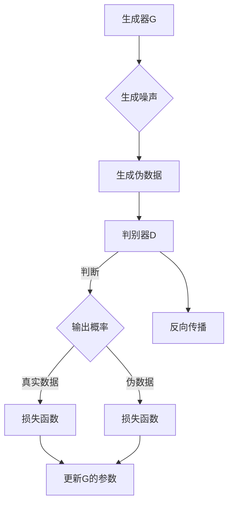

                 

### 文章标题

**《生成式AIGC：商业智能的未来趋势》**

### 关键词：

- 生成式人工智能
- 商业智能
- AIGC
- 生成对抗网络（GAN）
- 变分自编码器（VAE）
- 对话系统
- 个性化推荐
- 数据生成与仿真
- 商业应用案例

### 摘要：

本文深入探讨了生成式人工智能（AIGC）在商业智能领域的未来趋势。首先，我们介绍了AIGC的基本概念、技术背景以及其在商业中的应用前景。接着，详细解析了AIGC的核心技术，包括生成对抗网络（GAN）、变分自编码器（VAE）和生成式对话系统。随后，我们探讨了AIGC在数据生成与仿真、个性化推荐和文本生成与编辑等应用场景中的具体实现和商业价值。通过一系列的实战案例，我们展示了如何利用AIGC技术解决实际问题。最后，我们分析了AIGC在技术挑战和未来趋势中的发展方向，为读者提供了宝贵的参考。

----------------------------------------------------------------

# 《生成式AIGC：商业智能的未来趋势》目录大纲

## 第一部分：AIGC概述与理论基础

### 第1章：AIGC的基本概念与商业价值
#### 1.1 什么是AIGC
#### 1.2 AIGC的技术背景
#### 1.3 AIGC在商业智能中的应用前景
#### 1.4 AIGC与现有商业智能技术的对比

### 第2章：AIGC的核心技术
#### 2.1 生成对抗网络（GAN）
##### 2.1.1 GAN的原理与架构
##### 2.1.2 GAN的变种与优化
##### 2.1.3 GAN的应用案例

#### 2.2 变分自编码器（VAE）
##### 2.2.1 VAE的原理与架构
##### 2.2.2 VAE的训练与优化
##### 2.2.3 VAE的应用案例

#### 2.3 生成式对话系统
##### 2.3.1 对话系统概述
##### 2.3.2 对话系统的生成式模型
##### 2.3.3 对话系统的应用场景

### 第3章：AIGC的应用场景
#### 3.1 数据生成与仿真
##### 3.1.1 数据生成技术的应用
##### 3.1.2 数据仿真与测试
##### 3.1.3 数据生成的挑战与解决方案

#### 3.2 个性化推荐
##### 3.2.1 推荐系统的基本原理
##### 3.2.2 生成式推荐系统的特点
##### 3.2.3 生成式推荐系统的应用案例

#### 3.3 文本生成与编辑
##### 3.3.1 文本生成技术概述
##### 3.3.2 文本编辑与润色
##### 3.3.3 文本生成在商业智能中的应用

### 第4章：AIGC的商业价值与实践
#### 4.1 AIGC的商业应用案例
##### 4.1.1 案例一：金融行业的应用
##### 4.1.2 案例二：零售业的智能化转型
##### 4.1.3 案例三：制造业的质量检测与优化

#### 4.2 AIGC的商业价值分析
##### 4.2.1 提高生产效率
##### 4.2.2 降低运营成本
##### 4.2.3 增强客户体验

### 第5章：AIGC的技术挑战与未来趋势
#### 5.1 技术挑战与瓶颈
##### 5.1.1 计算资源与能耗
##### 5.1.2 数据隐私与安全
##### 5.1.3 模型解释性与可解释性

#### 5.2 AIGC的未来趋势
##### 5.2.1 AI与实体经济深度融合
##### 5.2.2 生成式AI在新兴领域的应用
##### 5.2.3 AIGC技术的持续创新与突破

## 第二部分：AIGC应用实战

### 第6章：AIGC项目开发实践
#### 6.1 项目规划与需求分析
##### 6.1.1 项目规划
##### 6.1.2 需求分析

#### 6.2 数据准备与处理
##### 6.2.1 数据采集
##### 6.2.2 数据清洗与预处理

#### 6.3 模型设计与实现
##### 6.3.1 模型选择
##### 6.3.2 模型实现

#### 6.4 模型训练与优化
##### 6.4.1 训练策略
##### 6.4.2 优化技巧

### 第7章：AIGC项目实战案例
#### 7.1 案例一：个性化商品推荐系统
##### 7.1.1 系统设计
##### 7.1.2 模型实现
##### 7.1.3 性能评估

#### 7.2 案例二：智能客服机器人
##### 7.2.1 系统架构
##### 7.2.2 模型训练与优化
##### 7.2.3 实际应用效果

#### 7.3 案例三：金融风控系统
##### 7.3.1 系统设计
##### 7.3.2 数据处理与模型训练
##### 7.3.3 风险评估与监控

## 附录

### 附录A：AIGC开发工具与资源
#### A.1 主流AIGC开发框架
##### A.1.1 TensorFlow
##### A.1.2 PyTorch
##### A.1.3 其他框架简介

#### A.2 AIGC相关数据集
##### A.2.1 公开数据集介绍
##### A.2.2 自定义数据集准备

#### A.3 AIGC开源项目与资源
##### A.3.1 开源框架与库
##### A.3.2 在线教程与课程
##### A.3.3 论坛与社区

## 第一部分：AIGC概述与理论基础

### 第1章：AIGC的基本概念与商业价值

#### 1.1 什么是AIGC

**AIGC（生成式人工智能内容创作）** 是一种利用深度学习技术自动生成文本、图像、音频等多种类型内容的智能系统。它通过训练大量数据，学习数据生成规律，从而创造出新颖、高质量的内容。AIGC的核心在于“生成”，它不仅能够模仿现有数据，还可以创造全新、未见过数据，具备高度的创造性和多样性。

在商业智能领域，AIGC的应用潜力巨大。例如，它可以自动生成个性化的营销文案、产品描述，甚至创意广告。通过分析用户行为数据，AIGC能够预测用户需求，生成个性化的推荐内容，提高用户满意度和转化率。此外，AIGC还可以用于自动化报告生成、数据可视化等任务，大大提升企业的工作效率。

#### 1.2 AIGC的技术背景

AIGC技术的发展得益于深度学习技术的进步，特别是生成对抗网络（GAN）和变分自编码器（VAE）等模型的应用。生成对抗网络（GAN）由 Ian Goodfellow 等人于2014年提出，它由生成器和判别器两个神经网络组成，通过博弈过程不断优化，生成逼真的数据。变分自编码器（VAE）则是一种基于概率模型的生成模型，通过编码器和解码器将数据映射到潜在空间，并从潜在空间生成数据。

随着计算能力的提升和数据量的增加，AIGC技术逐渐成熟并应用于商业智能领域。目前，AIGC技术已经广泛应用于图像生成、文本生成、音频生成等多个领域，成为人工智能领域的重要研究方向。

#### 1.3 AIGC在商业智能中的应用前景

AIGC在商业智能领域具有广泛的应用前景，可以为企业提供创新的解决方案，提升业务效率和用户体验。以下是一些具体的应用场景：

1. **个性化推荐：** AIGC可以基于用户行为和偏好生成个性化的推荐内容，提高用户满意度和转化率。例如，电商平台可以利用AIGC技术生成个性化的产品推荐，提高用户的购买意愿。
   
2. **文本生成与编辑：** AIGC可以自动生成新闻稿、产品描述、营销文案等文本内容，节省人力成本，提高内容创作效率。例如，新闻媒体可以利用AIGC技术自动生成新闻文章，提高新闻发布的速度和多样性。

3. **数据生成与仿真：** AIGC可以生成符合真实数据分布的仿真数据，用于测试和训练机器学习模型，提高模型的泛化能力。例如，金融行业可以利用AIGC技术生成模拟交易数据，用于风险评估和策略优化。

4. **智能客服：** AIGC可以生成自然流畅的对话内容，实现与用户的智能对话。例如，企业可以利用AIGC技术构建智能客服系统，提高客户服务效率和质量。

5. **数据可视化：** AIGC可以自动生成数据可视化图表，帮助用户更直观地理解和分析数据。例如，数据分析平台可以利用AIGC技术生成个性化的数据可视化报告，提高数据分析的效果。

总之，AIGC在商业智能领域具有巨大的应用潜力，未来有望成为企业提升竞争力的重要技术。

#### 1.4 AIGC与现有商业智能技术的对比

AIGC与现有商业智能技术相比，具有显著的优势。传统商业智能技术主要依赖规则和统计方法，生成内容的能力有限，且需要大量人力干预。而AIGC利用深度学习技术，能够自动生成高质量、多样化内容，减少人工干预，提高业务效率。

以下是从几个方面对AIGC与现有商业智能技术的对比：

1. **生成能力：** AIGC能够生成全新的、未见过数据，具有高度的创造性和多样性。而传统商业智能技术主要依赖于历史数据和规则，生成内容的能力有限。

2. **自适应能力：** AIGC可以实时适应数据变化，生成与当前数据特征相符的内容。而传统商业智能技术需要定期更新规则和数据，适应性较差。

3. **人力成本：** AIGC能够自动生成内容，减少人力干预，降低人力成本。而传统商业智能技术需要大量人力进行数据采集、分析和报告撰写，人力成本较高。

4. **个性化推荐：** AIGC可以基于用户行为和偏好生成个性化的推荐内容，提高用户体验和转化率。而传统商业智能技术难以实现个性化推荐，往往采用一刀切的方法。

尽管AIGC具有显著的优势，但也面临一些挑战，如计算资源需求大、数据隐私和安全等问题。未来，随着技术的不断发展和完善，AIGC有望在商业智能领域发挥更大的作用。

### 1.5 总结

本章介绍了AIGC的基本概念、技术背景和应用前景，并对其与现有商业智能技术进行了对比。AIGC作为一种新兴的技术，具有强大的生成能力和自适应能力，能够为企业提供创新的解决方案，提升业务效率和用户体验。未来，AIGC有望在商业智能领域发挥更大的作用，成为企业提升竞争力的重要技术。

## 第2章：AIGC的核心技术

### 2.1 生成对抗网络（GAN）

生成对抗网络（Generative Adversarial Network，GAN）是由 Ian Goodfellow 于 2014 年提出的一种深度学习模型，它由两个神经网络（生成器和判别器）组成，通过相互对抗来生成高质量的数据。

#### 2.1.1 GAN的原理与架构

GAN的工作原理可以类比为两个人进行博弈：生成器和判别器。生成器的任务是生成与真实数据相似的数据，而判别器的任务是区分真实数据和生成数据。生成器和判别器在训练过程中不断迭代，最终生成器能够生成足够逼真的数据，使得判别器无法区分。

**GAN的基本架构如下：**

1. **生成器（Generator）**：生成器从随机噪声分布中取样，通过神经网络将噪声映射为数据。其目标是生成尽可能真实的数据，以便欺骗判别器。

2. **判别器（Discriminator）**：判别器的任务是判断输入数据是真实数据还是生成数据。其目标是准确地区分真实数据和生成数据。

3. **对抗训练**：生成器和判别器通过对抗训练来优化自身。在每次迭代中，生成器尝试生成更真实的数据，而判别器尝试提高对真实数据和生成数据的区分能力。

**Mermaid流程图：**



#### 2.1.2 GAN的变种与优化

虽然原始的GAN模型取得了很大的成功，但它在训练过程中存在一些问题，如梯度消失、梯度爆炸和不稳定训练等。为了解决这些问题，研究人员提出了许多GAN的变种和优化方法。

1. **深度卷积生成对抗网络（DCGAN）**：DCGAN是GAN的一种改进版本，采用深度卷积神经网络来构建生成器和判别器，提高了生成图像的质量和稳定性。

2. **改进的Wasserstein GAN（WGAN）**：WGAN通过引入Wasserstein距离代替传统的交叉熵损失函数，解决了梯度消失问题，使得GAN的训练更加稳定。

3. **广义WGAN（GWAN）**：GWAN是WGAN的一种改进，通过引入Lipschitz约束进一步提高了GAN的训练稳定性。

4. **生成式对抗网络（GAN）的梯度惩罚（GAN-GP）**：GAN-GP通过在判别器的损失函数中加入梯度惩罚项，防止梯度消失问题。

5. **自编码器GAN（AEGAN）**：AEGAN结合了自编码器和GAN，通过编码器和解码器构建生成器，提高了生成图像的多样性和质量。

**伪代码：**

```python
# 生成器G的伪代码
z = noise()
x_hat = G(z)

# 判别器D的伪代码
D_real = D(x)
D_fake = D(x_hat)

# 训练目标
D_loss = BCELoss(D_real, 1) + BCELoss(D_fake, 0)
G_loss = BCELoss(D_fake, 1)

# 训练过程
for epoch in range(num_epochs):
    for x, _ in dataloader:
        # 训练判别器
        D_loss = train_discriminator(D, dataloader)
        
        z = noise()
        x_hat = G(z)
        # 训练生成器
        G_loss = train_generator(G, D, z)
```

#### 2.1.3 GAN的应用案例

GAN的应用非常广泛，以下是一些典型的应用案例：

1. **图像生成**：GAN可以生成高质量的自然图像，如人脸、风景、动物等。常见的应用有艺术创作、虚拟现实和图像修复等。

2. **数据增强**：GAN可以用于生成大量的训练数据，用于数据增强，提高模型的泛化能力。这在图像分类、目标检测等任务中非常有用。

3. **图像到图像翻译**：GAN可以将一种类型的图像转换为另一种类型的图像，如将素描转换为彩色图像、将黑白图像转换为彩色图像等。

4. **图像风格迁移**：GAN可以将一种图像的风格应用到另一种图像上，如将现实世界的图像转换为艺术作品风格。

5. **视频生成**：GAN可以生成高质量的视频序列，用于视频游戏、虚拟现实和视频编辑等。

6. **自然语言处理**：GAN可以用于生成高质量的文本，如生成新闻文章、对话等。

**示例代码：**

```python
import torch
import torch.nn as nn
import torch.optim as optim

# 定义生成器G和判别器D
class Generator(nn.Module):
    def __init__(self):
        super(Generator, self).__init__()
        # 生成器的神经网络架构
        self.model = nn.Sequential(
            nn.Linear(z_dim, 128),
            nn.LeakyReLU(0.2),
            nn.Linear(128, 256),
            nn.LeakyReLU(0.2),
            nn.Linear(256, img_dim),
            nn.Tanh()
        )

    def forward(self, z):
        return self.model(z)

class Discriminator(nn.Module):
    def __init__(self):
        super(Discriminator, self).__init__()
        # 判别器的神经网络架构
        self.model = nn.Sequential(
            nn.Linear(img_dim, 256),
            nn.LeakyReLU(0.2),
            nn.Linear(256, 128),
            nn.LeakyReLU(0.2),
            nn.Linear(128, 1),
            nn.Sigmoid()
        )

    def forward(self, x):
        return self.model(x)

# 初始化模型和优化器
device = torch.device("cuda" if torch.cuda.is_available() else "cpu")
z_dim = 100
img_dim = 784

G = Generator().to(device)
D = Discriminator().to(device)

G_optimizer = optim.Adam(G.parameters(), lr=0.0002)
D_optimizer = optim.Adam(D.parameters(), lr=0.0002)

criterion = nn.BCELoss()

# 训练过程
num_epochs = 200

for epoch in range(num_epochs):
    for i, (x, _) in enumerate(dataloader):
        batch_size = x.size(0)
        z = torch.randn(batch_size, z_dim).to(device)

        # 训练生成器
        G_optimizer.zero_grad()
        x_hat = G(z)
        D_fake = D(x_hat)
        G_loss = -torch.mean(D_fake)
        G_loss.backward()
        G_optimizer.step()

        # 训练判别器
        D_optimizer.zero_grad()
        D_real = D(x)
        D_fake = D(x_hat)
        D_loss = -torch.mean(D_real) + torch.mean(D_fake)
        D_loss.backward()
        D_optimizer.step()

        if (i+1) % 100 == 0:
            print(f'[{epoch}/{num_epochs}] Epoch [{i+1}/{len(dataloader)}] G_loss: {G_loss.item():.4f}, D_loss: {D_loss.item():.4f}')
```

### 2.2 变分自编码器（VAE）

变分自编码器（Variational Autoencoder，VAE）是一种基于概率模型的生成模型，它通过编码器和解码器将数据映射到潜在空间，并从潜在空间生成数据。与GAN相比，VAE更加稳定，训练过程也相对简单。

#### 2.2.1 VAE的原理与架构

VAE由两个主要部分组成：编码器和解码器。

1. **编码器（Encoder）**：编码器接收输入数据，将其映射到一个潜在空间中的点。在VAE中，这个映射是一个概率分布，通常是对数正态分布。

2. **解码器（Decoder）**：解码器从潜在空间中取样，生成与输入数据相似的新数据。

**VAE的核心思想是将数据映射到一个潜在空间，并在这个空间中进行数据生成。VAE通过以下两个步骤来实现：

1. **编码步骤**：编码器将输入数据映射到一个潜在空间中的点，这个映射是一个概率分布。具体来说，VAE使用两个神经网络来计算均值（\(\mu\)）和方差（\(\sigma^2\)）：

   $$
   \mu = \text{Encoder}(x) \\
   \sigma^2 = \text{Encoder}(x) + \beta
   $$

   其中，\(\beta\)是一个超参数，用于控制分布的尖峭程度。

2. **解码步骤**：从潜在空间中采样一个点，并通过解码器生成新数据：

   $$
   z \sim \mathcal{N}(\mu, \sigma^2) \\
   x_hat = \text{Decoder}(z)
   $$

**数学模型和数学公式：**

$$
\text{KL}(\mathcal{P}||\mathcal{Q}) = \int \mathcal{P}(x) \log \frac{\mathcal{P}(x)}{\mathcal{Q}(x)} dx
$$

其中，\(\mathcal{P}\)是对数正态分布的先验分布，\(\mathcal{Q}\)是编码器输出的后验分布。KL散度用于衡量两个概率分布之间的差异。

**详细讲解与举例说明：**

KL散度是VAE损失函数中的一个关键部分，它用于衡量编码器的输出分布与先验分布之间的差异。KL散度越小，表示编码器输出的分布越接近先验分布，VAE的性能越好。

假设我们有一个数据集 \(X = \{x_1, x_2, ..., x_n\}\)，每个数据点 \(x_i\) 是一个高维向量。VAE的目的是找到一个编码器 \(q_{\theta}(z|x_i)\) 和解码器 \(p_{\phi}(x|z)\)，使得：

$$
\log p(x) = \sum_{i=1}^{n} \log \int p(x_i | z) p(z) dz
$$

通过最大化上述概率的对数，VAE可以学习到数据在潜在空间中的分布。

**Mermaid流程图：**

```mermaid
graph TD
A[输入数据] --> B[编码器]
B --> C{计算均值\(\mu\)和方差\(\sigma^2\)}
C --> D[潜在空间]
D --> E[解码器]
E -->|生成数据| F[输出 x_hat]
```

#### 2.2.2 VAE的训练与优化

VAE的训练过程是通过最大化数据生成概率的对数来实现的，其损失函数通常由数据重建损失和KL散度损失两部分组成：

$$
\text{Loss} = \text{Reconstruction Loss} + \text{KL Divergence Loss}
$$

其中，重建损失通常使用均方误差（MSE）或交叉熵损失。KL散度损失用于衡量编码器输出分布与先验分布之间的差异。

**伪代码：**

```python
# 训练VAE的伪代码

# 初始化编码器和解码器
encoder = Encoder().to(device)
decoder = Decoder().to(device)

# 初始化优化器
optimizer = optim.Adam(encoder.parameters(), lr=learning_rate)

# 训练过程
for epoch in range(num_epochs):
    for x in dataloader:
        x = x.to(device)
        
        # 前向传播
        z_mean, z_log_var = encoder(x)
        z = reparameterize(z_mean, z_log_var)
        x_hat = decoder(z)
        
        # 计算损失
        reconstruction_loss = criterion(x_hat, x)
        kl_loss = -0.5 * torch.sum(1 + z_log_var - z_mean**2 - z_log_var)
        
        # 计算总损失
        loss = reconstruction_loss + kl_loss
        
        # 反向传播
        optimizer.zero_grad()
        loss.backward()
        optimizer.step()

        if (epoch+1) % 100 == 0:
            print(f'[{epoch+1}/{num_epochs}] Loss: {loss.item():.4f}')
```

**详细讲解与举例说明：**

在VAE的训练过程中，首先通过编码器将输入数据映射到潜在空间中的点，然后从潜在空间中采样一个点，并通过解码器生成重建数据。重建数据与原始输入数据之间的差异构成了重建损失。KL散度损失则用于衡量编码器输出的后验分布与先验分布之间的差异。

通过优化这两个损失函数，VAE能够学习到数据的概率分布，并生成与原始数据相似的新数据。

#### 2.2.3 VAE的应用案例

VAE在图像生成、数据增强和生成式模型等领域有着广泛的应用。

1. **图像生成**：VAE可以生成高质量的自然图像，如图像到图像翻译、风格迁移和超分辨率图像生成等。

2. **数据增强**：VAE可以用于生成大量的训练数据，提高模型的泛化能力。这在图像分类、目标检测等任务中非常有用。

3. **生成式模型**：VAE可以用于生成新的数据样本，例如生成新的用户评论、产品描述等。

4. **异常检测**：VAE可以用于检测异常数据，例如在金融行业中用于检测欺诈行为。

**示例代码：**

```python
import torch
import torch.nn as nn
import torch.optim as optim

# 定义编码器和解码器
class Encoder(nn.Module):
    def __init__(self):
        super(Encoder, self).__init__()
        self.model = nn.Sequential(
            nn.Linear(img_dim, 256),
            nn.LeakyReLU(0.2),
            nn.Linear(256, 128),
            nn.LeakyReLU(0.2),
            nn.Linear(128, z_dim),
            nn.Sigmoid()
        )

    def forward(self, x):
        return self.model(x)

class Decoder(nn.Module):
    def __init__(self):
        super(Decoder, self).__init__()
        self.model = nn.Sequential(
            nn.Linear(z_dim, 128),
            nn.LeakyReLU(0.2),
            nn.Linear(128, 256),
            nn.LeakyReLU(0.2),
            nn.Linear(256, img_dim),
            nn.Tanh()
        )

    def forward(self, z):
        return self.model(z)

# 初始化模型和优化器
device = torch.device("cuda" if torch.cuda.is_available() else "cpu")
img_dim = 784
z_dim = 20

encoder = Encoder().to(device)
decoder = Decoder().to(device)

optimizer = optim.Adam(list(encoder.parameters()) + list(decoder.parameters()), lr=0.001)

# 训练过程
num_epochs = 100

for epoch in range(num_epochs):
    for x in dataloader:
        x = x.to(device)
        
        # 前向传播
        z_mean, z_log_var = encoder(x)
        z = reparameterize(z_mean, z_log_var)
        x_hat = decoder(z)
        
        # 计算损失
        reconstruction_loss = nn.MSELoss()(x_hat, x)
        kl_loss = -0.5 * torch.sum(1 + z_log_var - z_mean**2 - z_log_var)
        
        # 计算总损失
        loss = reconstruction_loss + kl_loss
        
        # 反向传播
        optimizer.zero_grad()
        loss.backward()
        optimizer.step()

        if (epoch+1) % 10 == 0:
            print(f'[{epoch+1}/{num_epochs}] Loss: {loss.item():.4f}')
```

### 2.3 生成式对话系统

生成式对话系统（Generative Conversational Systems）是一种利用生成模型生成自然语言对话的系统。它通过学习大量的对话数据，能够自动生成自然流畅的对话内容，适用于智能客服、聊天机器人等应用场景。

#### 2.3.1 对话系统概述

对话系统是一种人机交互的智能系统，能够理解用户的输入，生成合适的回复。传统的对话系统通常采用基于规则的方法或机器学习方法，但生成式对话系统通过生成模型（如循环神经网络（RNN）或变压器（Transformer））能够生成更自然、更连贯的对话内容。

**对话系统的基本架构包括：**

1. **对话管理模块**：负责对话的流程控制，包括理解用户的意图、生成回复和对话的维护。
2. **语言生成模块**：利用生成模型生成自然语言回复。
3. **对话历史模块**：存储对话的历史信息，用于上下文信息的检索和对话的连贯性。

#### 2.3.2 对话系统的生成式模型

生成式对话系统的核心是生成模型，常见的生成模型包括循环神经网络（RNN）和变压器（Transformer）。

1. **循环神经网络（RNN）**：RNN通过递归方式处理序列数据，能够捕捉对话中的上下文信息。但RNN在处理长序列时存在梯度消失和梯度爆炸的问题。

2. **变压器（Transformer）**：变压器通过自注意力机制处理序列数据，能够捕捉长距离依赖关系，并且在处理长序列时性能更稳定。变压器的引入使得生成式对话系统的生成能力得到显著提升。

**数学模型和数学公式：**

假设输入序列为 \(x = \{x_1, x_2, ..., x_n\}\)，目标序列为 \(y = \{y_1, y_2, ..., y_n\}\)。

- **编码器**：编码器将输入序列编码为隐藏状态序列 \(h = \{h_1, h_2, ..., h_n\}\)。
- **解码器**：解码器通过自注意力机制和编码器输出生成目标序列。

自注意力机制的计算公式如下：

$$
\text{Attention}(h_1, h_2, ..., h_n) = \text{softmax}\left(\frac{h_1h^T_2, h_2h^T_2, ..., h_nh^T_2}{\sqrt{d_k}}\right)
$$

其中，\(d_k\)是注意力机制的维度。

解码器的输出公式如下：

$$
y_i = \text{softmax}\left(\text{Decoder}(h_1, h_2, ..., h_i)\right)
$$

**详细讲解与举例说明：**

生成式对话系统的核心是生成模型，它能够通过学习大量的对话数据生成自然流畅的对话内容。在对话系统中，编码器负责将输入序列编码为隐藏状态序列，解码器通过自注意力机制和编码器输出生成目标序列。自注意力机制能够捕捉对话中的上下文信息，使得生成的对话内容更加连贯。

**示例代码：**

```python
import torch
import torch.nn as nn

# 定义编码器和解码器
class Encoder(nn.Module):
    def __init__(self, embedding_dim, hidden_dim):
        super(Encoder, self).__init__()
        self.embedding = nn.Embedding(embedding_dim, hidden_dim)
        self.gru = nn.GRU(hidden_dim, hidden_dim)

    def forward(self, src):
        embedded = self.embedding(src)
        output, hidden = self.gru(embedded)
        return hidden

class Decoder(nn.Module):
    def __init__(self, embedding_dim, hidden_dim):
        super(Decoder, self).__init__()
        self.embedding = nn.Embedding(embedding_dim, hidden_dim)
        self.gru = nn.GRU(hidden_dim, hidden_dim)
        self.out = nn.Linear(hidden_dim, embedding_dim)

    def forward(self, src, hidden):
        embedded = self.embedding(src)
        output, hidden = self.gru(embedded, hidden)
        output = self.out(output)
        return output, hidden
```

#### 2.3.3 对话系统的应用场景

生成式对话系统在智能客服、聊天机器人、虚拟助理等领域有着广泛的应用。

1. **智能客服**：生成式对话系统可以自动生成客服对话内容，提高客服效率，减少人力成本。
2. **聊天机器人**：生成式对话系统可以与用户进行自然流畅的对话，提高用户体验。
3. **虚拟助理**：生成式对话系统可以为企业提供智能的虚拟助理服务，提高业务效率。

**示例应用场景：**

假设我们有一个智能客服系统，用户可以通过对话系统与客服进行交互。以下是一个简单的对话示例：

- 用户：你好，我想要购买一台笔记本电脑。
- 客服：您好，请问您需要什么类型的笔记本电脑？
- 用户：我需要一个用于办公和轻度游戏的本本。
- 客服：好的，我们为您推荐几款性价比较高的笔记本电脑，如戴尔的XPS 13和惠普的Spectre x360。

在这个示例中，生成式对话系统通过学习大量的客服对话数据，能够自动生成自然流畅的回复，提高客服效率。

### 2.4 总结

本章介绍了AIGC的核心技术，包括生成对抗网络（GAN）、变分自编码器（VAE）和生成式对话系统。GAN通过生成器和判别器的对抗训练生成高质量的数据；VAE通过编码器和解码器在潜在空间中进行数据生成；生成式对话系统通过生成模型生成自然流畅的对话内容。这些核心技术为AIGC在商业智能领域的应用奠定了基础。在下一章中，我们将探讨AIGC在具体应用场景中的实现和商业价值。

## 第3章：AIGC的应用场景

### 3.1 数据生成与仿真

数据生成与仿真是AIGC的重要应用场景之一，它通过生成大量符合特定分布的数据，为机器学习模型的训练、测试和评估提供丰富的数据资源。这种能力在许多领域，如金融、医疗、零售和制造，都有着广泛的应用。

#### 3.1.1 数据生成技术的应用

AIGC可以通过生成对抗网络（GAN）和变分自编码器（VAE）等技术生成大量数据。这些数据可以用于以下场景：

1. **模型训练**：在数据稀缺的情况下，通过生成仿真数据，可以增加训练数据集的规模，从而提高模型的泛化能力和准确性。
2. **模型测试**：生成仿真数据可以用于测试模型的鲁棒性，确保模型在不同数据分布下都能保持良好的性能。
3. **数据增强**：通过生成与原有数据类似或互补的新数据，可以增强训练数据集的多样性，提高模型的适应性。
4. **异常检测**：生成仿真数据可以帮助识别和检测异常数据模式，从而提高异常检测模型的准确性。

**数学模型和数学公式：**

生成对抗网络（GAN）的损失函数可以表示为：

$$
\text{Loss}_{GAN} = \text{Loss}_{D} + \text{Loss}_{G}
$$

其中，\(\text{Loss}_{D}\)是判别器的损失，\(\text{Loss}_{G}\)是生成器的损失。具体来说：

$$
\text{Loss}_{D} = -\frac{1}{2}\left(\text{E}_{x \sim p_{data}(x)}[\log D(x)] + \text{E}_{z \sim p_{z}(z)][\log (1 - D(G(z))]\right)
$$

$$
\text{Loss}_{G} = -\frac{1}{2}\text{E}_{z \sim p_{z}(z)}[\log D(G(z))]
$$

变分自编码器（VAE）的损失函数可以表示为：

$$
\text{Loss}_{VAE} = \text{Reconstruction Loss} + \text{KL Divergence Loss}
$$

其中，重建损失通常使用均方误差（MSE），KL散度损失用于衡量编码器输出分布与先验分布之间的差异：

$$
\text{Reconstruction Loss} = \frac{1}{n}\sum_{i=1}^{n} \sum_{j=1}^{m} (x_{ij} - \hat{x}_{ij})^2
$$

$$
\text{KL Divergence Loss} = \frac{1}{n}\sum_{i=1}^{n} \sum_{j=1}^{m} \log \frac{\pi(x_{ij})}{\sigma^2_{ij} e^{\frac{(\mu_{ij} - x_{ij})^2}{2\sigma^2_{ij}}}
$$

**详细讲解与举例说明：**

假设我们有一个图像分类任务，但数据集较小。通过GAN技术，我们可以生成大量符合数据分布的图像，用于模型训练。具体步骤如下：

1. **生成仿真数据**：首先，使用GAN生成大量图像。生成器从随机噪声中生成图像，判别器判断图像是真实数据还是生成数据。
2. **训练模型**：将真实数据和生成数据混合，用于训练图像分类模型。通过增加数据集规模，提高模型泛化能力。
3. **模型评估**：使用真实测试数据评估模型性能，确保模型在不同数据分布下都能保持良好的性能。

通过这种方式，AIGC可以显著提升机器学习模型的训练效果和性能。

#### 3.1.2 数据仿真与测试

数据仿真与测试是AIGC在模型训练和测试中的关键应用。通过生成仿真数据，可以模拟各种复杂场景，测试模型的鲁棒性和适应性。

**数学模型和数学公式：**

在数据仿真过程中，可以通过以下步骤生成仿真数据：

1. **定义数据分布**：首先，根据实际数据的特点，定义数据分布。例如，对于图像数据，可以使用高斯分布或均匀分布定义像素值。
2. **生成仿真数据**：根据定义的数据分布，随机生成大量仿真数据。这些数据应尽可能覆盖实际数据的各种特征。
3. **训练和测试模型**：使用仿真数据和真实数据分别训练和测试模型，比较模型在仿真数据和真实数据上的性能，评估模型的鲁棒性和适应性。

**详细讲解与举例说明：**

假设我们有一个垃圾邮件分类任务，但数据集中垃圾邮件和非垃圾邮件的比例不均衡。通过VAE技术，我们可以生成大量符合数据分布的垃圾邮件数据，用于模型训练。具体步骤如下：

1. **生成仿真数据**：使用VAE生成大量垃圾邮件数据，确保这些数据在内容、格式等方面与真实垃圾邮件相似。
2. **数据增强**：将真实数据和生成数据混合，用于训练垃圾邮件分类模型。通过增加垃圾邮件数据比例，提高模型分类准确性。
3. **模型评估**：使用真实测试数据评估模型性能，确保模型在真实数据上的分类准确性。

通过这种方式，AIGC可以有效提升模型的训练效果和分类准确性。

#### 3.1.3 数据生成的挑战与解决方案

数据生成与仿真虽然具有很大的潜力，但也面临一些挑战。以下是其中几个主要挑战及其解决方案：

1. **数据质量**：生成数据的质量直接影响模型性能。为了提高数据质量，可以采用以下方法：
   - **增加生成模型训练数据**：使用更多高质量的数据训练生成模型，提高生成数据的质量。
   - **使用数据增强技术**：在生成数据过程中，使用数据增强技术（如旋转、缩放、裁剪等）提高数据的多样性和质量。

2. **计算资源消耗**：生成大量数据需要大量的计算资源。为了降低计算资源消耗，可以采取以下措施：
   - **分布式计算**：使用分布式计算框架（如TensorFlow、PyTorch等）并行训练生成模型，提高训练效率。
   - **优化模型结构**：通过简化模型结构、降低模型参数数量等方法，减少计算资源需求。

3. **数据分布匹配**：生成数据应尽可能匹配实际数据分布。为了实现这一目标，可以采取以下方法：
   - **自适应生成**：通过不断调整生成模型，使其生成数据更接近实际数据分布。
   - **多模型融合**：结合多个生成模型，通过融合生成数据，提高数据分布的匹配度。

通过上述解决方案，可以有效应对数据生成与仿真过程中的挑战，提高AIGC在商业智能领域的应用价值。

### 3.2 个性化推荐

个性化推荐是AIGC在商业智能领域的另一重要应用，它通过分析用户行为和偏好，生成个性化的推荐内容，提高用户体验和转化率。

#### 3.2.1 推荐系统的基本原理

推荐系统通过以下步骤为用户提供个性化推荐：

1. **用户建模**：收集用户的兴趣、行为和偏好数据，建立用户画像。
2. **物品建模**：为每个物品（如商品、音乐、电影等）建立特征向量。
3. **相似度计算**：计算用户与物品之间的相似度，选择相似度最高的物品进行推荐。
4. **推荐策略**：根据用户画像和物品特征，设计推荐策略，生成个性化推荐列表。

常见的推荐算法包括基于内容的推荐、协同过滤推荐和混合推荐等。

**数学模型和数学公式：**

1. **基于内容的推荐**：
   - **相似度计算**：
     $$
     \text{similarity}(u, i) = \frac{\text{dot}(q_u, p_i)}{\|\text{q}_u\|\|\text{p}_i\|}
     $$
     其中，\(q_u\)是用户\(u\)的特征向量，\(p_i\)是物品\(i\)的特征向量。
   
   - **推荐列表生成**：
     $$
     \text{recommends}(u) = \{i | \text{similarity}(u, i) > \text{threshold}\}
     $$
     其中，\(\text{threshold}\)是相似度阈值。

2. **协同过滤推荐**：
   - **矩阵分解**：
     $$
     \text{R} = \text{U} \text{V}^T
     $$
     其中，\(\text{R}\)是用户-物品评分矩阵，\(\text{U}\)是用户特征矩阵，\(\text{V}\)是物品特征矩阵。

   - **预测评分**：
     $$
     \text{rating}_{ui} = \text{u}_i^T \text{v}_i
     $$
     其中，\(\text{u}_i\)是用户\(u\)的特征向量，\(\text{v}_i\)是物品\(i\)的特征向量。

**详细讲解与举例说明：**

假设有一个电商平台，用户A喜欢购买时尚衣物，系统希望为用户A推荐与其兴趣相符的商品。以下是一个简单的个性化推荐过程：

1. **用户建模**：系统收集用户A的购买记录、浏览历史和评价数据，建立用户A的兴趣特征向量。

2. **物品建模**：为平台上的每个商品建立特征向量，如商品类别、品牌、价格等。

3. **相似度计算**：计算用户A与每个商品之间的相似度，选择相似度最高的商品进行推荐。

4. **推荐策略**：设计推荐策略，根据用户A的兴趣特征向量，生成个性化的推荐列表。

通过这种方式，个性化推荐系统可以为用户A推荐符合其兴趣的商品，提高用户体验和转化率。

#### 3.2.2 生成式推荐系统的特点

生成式推荐系统相较于传统推荐系统，具有以下特点：

1. **生成能力**：生成式推荐系统不仅依赖用户历史数据和物品特征，还能通过生成模型生成新的推荐内容，提高推荐的多样性和创新性。

2. **自适应能力**：生成式推荐系统可以根据用户实时行为和偏好动态调整推荐内容，提高推荐的个性化程度。

3. **降低计算成本**：生成式推荐系统通过生成仿真数据，可以减少对大规模计算资源的需求，降低计算成本。

4. **隐私保护**：生成式推荐系统可以隐藏用户真实数据，降低用户隐私泄露风险。

**详细讲解与举例说明：**

假设有一个在线教育平台，用户B喜欢学习编程课程。生成式推荐系统可以通过以下方式提高推荐质量：

1. **生成仿真数据**：系统生成大量符合用户B兴趣的编程课程数据，用于训练生成模型。

2. **自适应推荐**：系统根据用户B的实时学习行为，如课程进度、学习时长等，动态调整推荐内容。

3. **生成创新内容**：生成模型根据用户B的兴趣和需求，生成新的编程课程推荐，提高推荐的多样性和创新性。

4. **隐私保护**：系统隐藏用户B的真实数据，确保用户隐私安全。

通过这种方式，生成式推荐系统可以为用户B提供高质量的个性化推荐，提高用户满意度和学习效果。

#### 3.2.3 生成式推荐系统的应用案例

生成式推荐系统在电子商务、在线教育、媒体推荐等领域有着广泛的应用。

1. **电子商务**：电商平台通过生成式推荐系统，为用户生成个性化的商品推荐，提高用户购买意愿和转化率。

2. **在线教育**：在线教育平台通过生成式推荐系统，为用户生成个性化的学习内容推荐，提高学习效果和用户满意度。

3. **媒体推荐**：媒体平台通过生成式推荐系统，为用户生成个性化的文章、视频推荐，提高用户粘性和广告收益。

**示例应用场景：**

假设有一个在线书店，用户C喜欢阅读科幻小说。以下是一个生成式推荐系统的应用示例：

1. **生成仿真数据**：系统生成大量符合用户C兴趣的科幻小说数据，用于训练生成模型。

2. **用户行为分析**：系统分析用户C的阅读历史、浏览记录和评价数据，动态调整推荐内容。

3. **生成个性化推荐**：生成模型根据用户C的兴趣和需求，生成新的科幻小说推荐，如《三体》系列的周边图书和同人作品。

4. **用户反馈**：用户C对推荐内容进行评价，系统根据用户反馈进一步优化推荐算法。

通过这种方式，生成式推荐系统可以为用户C提供高质量的个性化推荐，提高用户满意度和购买转化率。

### 3.3 文本生成与编辑

文本生成与编辑是AIGC在自然语言处理领域的重要应用，它通过生成模型生成自然语言文本，并对已有文本进行编辑和润色。这种能力在内容创作、自动摘要、智能客服等领域有着广泛的应用。

#### 3.3.1 文本生成技术概述

文本生成技术主要基于生成模型，如循环神经网络（RNN）和变压器（Transformer）等。这些模型通过学习大量文本数据，能够生成高质量的自然语言文本。

**生成模型的基本架构包括：**

1. **编码器（Encoder）**：编码器将输入文本编码为向量表示，捕捉文本的语义信息。
2. **解码器（Decoder）**：解码器从编码器的输出中生成文本，通过自注意力机制捕获长距离依赖关系。

**常见的文本生成模型包括：**

1. **序列到序列（Seq2Seq）模型**：Seq2Seq模型通过编码器和解码器将输入序列映射到输出序列，常用于机器翻译、对话生成等任务。
2. **生成式对抗网络（GAN）**：GAN通过生成器和判别器生成高质量的文本，常用于文本生成和对抗性生成任务。
3. **变分自编码器（VAE）**：VAE通过编码器和解码器在潜在空间中进行文本生成，常用于文本生成和数据分析任务。
4. **生成预训练变换器（GPT）**：GPT是基于Transformer的预训练模型，通过大量的文本数据进行预训练，能够生成高质量的自然语言文本。

**数学模型和数学公式：**

假设输入文本为 \(x = \{x_1, x_2, ..., x_n\}\)，目标文本为 \(y = \{y_1, y_2, ..., y_n\}\)。

1. **编码器和解码器**：
   - **编码器**：
     $$
     h_i = \text{Encoder}(x_i)
     $$
   - **解码器**：
     $$
     y_i = \text{Decoder}(h_i)
     $$

2. **注意力机制**：
   $$
   \text{Attention}(h_1, h_2, ..., h_n) = \text{softmax}\left(\frac{h_1h^T_2, h_2h^T_2, ..., h_nh^T_2}{\sqrt{d_k}}\right)
   $$

3. **生成模型**：
   $$
   p(y|x) = \prod_{i=1}^{n} p(y_i | y_{<i})
   $$

**详细讲解与举例说明：**

假设我们有一个对话生成任务，输入是用户A的提问，目标是系统生成的回答。以下是一个简单的文本生成过程：

1. **编码**：系统将用户A的提问编码为向量表示 \(h\)。

2. **解码**：系统使用解码器根据向量表示 \(h\) 生成回答 \(y\)。

3. **生成**：系统通过递归地生成每个单词或字符，直到生成完整的回答。

通过这种方式，文本生成模型能够生成高质量的自然语言文本，提高内容创作和智能客服的效率。

#### 3.3.2 文本编辑与润色

文本编辑与润色是文本生成技术的进一步应用，它通过修改和改进已有文本，提高文本的质量和可读性。

**文本编辑技术包括：**

1. **自动纠错**：通过生成模型识别和纠正文本中的拼写错误和语法错误。
2. **文本摘要**：通过生成模型提取文本的关键信息，生成简明扼要的摘要。
3. **文本风格转换**：通过生成模型将一种文本风格转换为另一种文本风格，如将正式文本转换为非正式文本。

**数学模型和数学公式：**

1. **自动纠错**：
   $$
   p(\text{correct} | \text{error}) > p(\text{error} | \text{correct})
   $$

2. **文本摘要**：
   $$
   \text{abstract} = \text{Generator}(\text{Summary Model}(\text{document}))
   $$

3. **文本风格转换**：
   $$
   \text{style\_transformer}(\text{document}, \text{style}) = \text{Generator}(\text{Encoder}(\text{document}, \text{style}))
   $$

**详细讲解与举例说明：**

假设我们有一个文章编辑任务，需要将一篇长篇文章转换为简短的摘要。以下是一个简单的文本编辑过程：

1. **摘要模型**：系统使用训练好的摘要模型对文章进行预处理，提取关键信息。

2. **生成摘要**：系统使用生成模型根据摘要模型提取的关键信息生成摘要。

3. **优化摘要**：系统根据用户反馈进一步优化摘要，提高摘要的质量和可读性。

通过这种方式，文本编辑技术能够有效提高文本的质量和可读性。

#### 3.3.3 文本生成在商业智能中的应用

文本生成技术在商业智能领域有着广泛的应用，可以为企业提供创新的解决方案，提高业务效率和用户体验。

**应用场景包括：**

1. **自动化报告生成**：通过文本生成技术，自动生成财务报告、市场分析报告等，节省人力资源。

2. **内容创作**：通过文本生成技术，自动生成产品描述、营销文案、新闻文章等，提高内容创作效率。

3. **客户服务**：通过文本生成技术，自动生成智能客服对话内容，提高客户服务质量。

4. **文本摘要与转换**：通过文本生成技术，自动生成摘要和不同风格的文章，提高文档处理效率。

**示例应用场景：**

假设我们有一个在线教育平台，需要为大量课程生成课程简介和推荐文案。以下是一个文本生成应用场景：

1. **生成课程简介**：系统使用生成模型根据课程内容生成课程简介，提高内容创作效率。

2. **生成推荐文案**：系统根据用户学习历史和课程特点，生成个性化的推荐文案，提高用户满意度。

3. **优化文案**：系统根据用户反馈进一步优化文案，提高文案质量和用户转化率。

通过这种方式，文本生成技术能够有效提高平台的内容创作效率和用户满意度。

### 3.4 总结

本章介绍了AIGC在数据生成与仿真、个性化推荐和文本生成与编辑等应用场景中的具体实现和商业价值。通过生成仿真数据，AIGC能够提高机器学习模型的训练效果和性能；通过个性化推荐，AIGC能够提高用户体验和转化率；通过文本生成与编辑，AIGC能够提高内容创作和客户服务的效率。AIGC技术在商业智能领域具有巨大的应用潜力，未来有望为企业和用户带来更多创新和价值。

## 第4章：AIGC的商业价值与实践

### 4.1 AIGC的商业应用案例

AIGC技术在商业领域具有广泛的应用潜力，通过生成高质量的数据和内容，为各类行业提供了创新的解决方案。以下是一些具体的商业应用案例：

#### 4.1.1 案例一：金融行业的应用

金融行业对数据的真实性和准确性要求极高，而AIGC技术通过生成仿真数据，为金融模型提供了丰富的数据资源。以下是一个具体的案例：

**案例背景：** 一家大型银行希望开发一个智能风控系统，但面临数据不足的问题。

**解决方案：** 
1. **数据生成**：银行利用AIGC技术生成符合真实数据分布的仿真交易数据，用于训练和测试风控模型。
2. **模型训练**：使用真实数据和仿真数据混合的训练集，训练风控模型，提高模型的准确性和鲁棒性。
3. **风险预测**：通过生成的仿真数据，模拟不同市场情况下的交易行为，评估风控模型的预测能力。

**案例效果：** 该银行的风控模型在模拟测试中表现出色，能够准确预测潜在风险，提高了金融产品的风险控制能力。

**数学模型和数学公式：**

风险预测模型的损失函数通常包括预期损失（Expected Loss，EL）和非预期损失（Non-Expected Loss，NEL）：

$$
\text{EL} = \sum_{i=1}^{N} p_i \cdot L_i \\
\text{NEL} = \sum_{i=1}^{N} \max(0, L_i - \text{EL})
$$

其中，\(p_i\) 是违约概率，\(L_i\) 是损失金额。

**详细讲解与举例说明：**

假设银行生成的仿真交易数据中，违约概率为 \(p_i\)，损失金额为 \(L_i\)。通过风控模型，预测违约概率和损失金额，计算预期损失和非预期损失，评估模型的预测能力。

#### 4.1.2 案例二：零售业的智能化转型

零售业正面临着激烈的市场竞争，智能化转型成为企业提升竞争力的关键。以下是一个具体的案例：

**案例背景：** 一家大型电商平台希望通过智能化推荐系统提升用户体验和销售额。

**解决方案：** 
1. **用户行为分析**：利用AIGC技术，分析用户的购买历史、浏览记录和偏好，建立用户画像。
2. **生成个性化推荐**：基于用户画像，使用生成模型生成个性化的商品推荐，提高用户满意度。
3. **实时推荐**：系统根据用户实时行为，动态调整推荐内容，提供个性化的购物体验。

**案例效果：** 该电商平台的个性化推荐系统显著提升了用户购买转化率和销售额。

**数学模型和数学公式：**

个性化推荐中常用的相似度计算公式为余弦相似度：

$$
\text{similarity}(u, i) = \frac{\text{dot}(q_u, p_i)}{\|\text{q}_u\|\|\text{p}_i\|}
$$

其中，\(q_u\) 是用户特征向量，\(p_i\) 是商品特征向量。

**详细讲解与举例说明：**

假设用户\(u\)的特征向量为 \(q_u\)，商品\(i\)的特征向量为 \(p_i\)。通过计算用户和商品之间的余弦相似度，生成个性化的推荐列表。

#### 4.1.3 案例三：制造业的质量检测与优化

制造业对产品质量要求严格，AIGC技术在质量检测与优化方面具有显著优势。以下是一个具体的案例：

**案例背景：** 一家制造企业希望提高产品质量，减少次品率。

**解决方案：** 
1. **数据生成**：利用AIGC技术生成符合产品特征的数据，用于模拟不同生产条件下的质量表现。
2. **质量检测**：通过生成数据和实际检测数据对比，识别产品质量问题，优化生产工艺。
3. **仿真测试**：使用AIGC技术生成仿真数据，模拟不同生产方案的效果，选择最优生产方案。

**案例效果：** 该企业的产品质量显著提升，次品率降低，生产效率提高。

**数学模型和数学公式：**

质量检测中常用的置信区间公式为：

$$
\text{置信区间} = (\bar{x} - z \cdot \frac{\sigma}{\sqrt{n}}, \bar{x} + z \cdot \frac{\sigma}{\sqrt{n}})
$$

其中，\(\bar{x}\) 是样本均值，\(\sigma\) 是样本标准差，\(n\) 是样本大小，\(z\) 是置信度对应的正态分布临界值。

**详细讲解与举例说明：**

假设企业通过AIGC技术生成仿真数据，计算样本均值和标准差，确定置信区间，评估产品质量的可靠性。

### 4.2 AIGC的商业价值分析

AIGC技术在商业智能领域具有显著的商业价值，能够提高生产效率、降低运营成本和增强客户体验。

#### 4.2.1 提高生产效率

AIGC技术通过自动化生成仿真数据和优化模型，能够显著提高生产效率。例如，在制造业中，通过仿真数据模拟不同生产条件，优化生产工艺，减少试错次数，提高生产效率。

#### 4.2.2 降低运营成本

AIGC技术能够降低运营成本，主要体现在以下几个方面：

1. **数据生成**：通过生成仿真数据，减少对真实数据的依赖，降低数据采集成本。
2. **自动化内容创作**：通过文本生成和图像生成技术，自动化生成营销文案、产品描述等，节省人力成本。
3. **智能客服**：通过生成式对话系统，实现与用户的智能对话，减少人工客服成本。

#### 4.2.3 增强客户体验

AIGC技术能够提供个性化的服务和推荐，增强客户体验。例如，在零售业中，通过个性化推荐系统，提高用户满意度和购买转化率；在金融行业，通过智能风控系统，提高用户的安全感和信任度。

### 4.3 AIGC技术挑战与未来趋势

虽然AIGC技术在商业智能领域具有巨大的潜力，但其在实际应用中仍面临一些挑战：

#### 4.3.1 计算资源与能耗

AIGC技术需要大量的计算资源，特别是在训练大型生成模型时。此外，训练过程的高能耗也成为一个问题。

#### 4.3.2 数据隐私与安全

AIGC技术涉及大量数据生成和建模，如何保护用户隐私和数据安全是一个重要挑战。

#### 4.3.3 模型解释性与可解释性

生成模型通常被视为“黑箱”，其决策过程难以解释。如何提高模型的可解释性，使其在商业应用中更透明、可靠，是一个重要研究方向。

#### 4.3.4 未来趋势

AIGC技术的未来趋势包括：

1. **硬件加速**：通过硬件加速技术，如GPU、TPU等，提高训练效率，降低能耗。
2. **模型压缩与优化**：通过模型压缩和优化技术，减少模型参数数量，提高推理效率。
3. **多模态生成**：探索多模态生成技术，实现文本、图像、音频等多种数据的同步生成。
4. **应用拓展**：AIGC技术将继续在金融、零售、制造、医疗等各个领域得到广泛应用。

### 4.4 总结

AIGC技术在商业智能领域具有显著的商业价值，通过生成仿真数据、个性化推荐和文本生成等应用，为各类行业提供了创新的解决方案。尽管面临一些挑战，但随着技术的不断发展和完善，AIGC技术有望在商业智能领域发挥更大的作用，推动企业智能化转型。

## 第5章：AIGC的技术挑战与未来趋势

### 5.1 技术挑战与瓶颈

AIGC技术在商业智能领域的广泛应用虽然前景广阔，但同时也面临一系列技术挑战和瓶颈。

#### 5.1.1 计算资源与能耗

AIGC模型通常需要大量的计算资源和时间进行训练，尤其是大规模、高维度的数据集。例如，生成对抗网络（GAN）和变分自编码器（VAE）等模型需要大量的GPU计算资源，这不仅增加了硬件成本，还导致了能源消耗的增加。因此，如何优化模型结构，提高计算效率，同时减少能耗，是一个重要的研究课题。

**数学模型和数学公式：**

能耗（Energy Consumption）与计算量（Computation Load）的关系可以表示为：

$$
\text{Energy Consumption} = C \cdot \text{Computation Load
$$

其中，\(C\) 是单位计算能耗，\(\text{Computation Load}\) 是计算工作量。

**详细讲解与举例说明：**

假设一个AIGC模型在训练过程中需要的计算量为 \(1000\) TFLOPS（每秒浮点运算次数），而单位计算能耗为 \(1\) J/GFLOPS，则总能耗为：

$$
\text{Energy Consumption} = 1 \text{ J/GFLOPS} \times 1000 \text{ GFLOPS} = 1000 \text{ J}
$$

这个简单的例子说明了计算量与能耗之间的关系，提示我们优化模型结构，减少计算量，从而降低能耗。

#### 5.1.2 数据隐私与安全

在商业智能应用中，数据的隐私和安全至关重要。AIGC技术生成和训练过程中需要处理大量的敏感数据，如用户行为、交易记录等。这些数据如果泄露，可能会导致严重的隐私问题和法律风险。因此，如何在保证数据隐私和安全的前提下，利用AIGC技术进行数据处理和分析，是一个亟待解决的问题。

**数学模型和数学公式：**

为了保护数据隐私，可以使用差分隐私（Differential Privacy）技术，其核心思想是在数据发布时添加噪声，使得攻击者无法准确推断个体数据。

$$
\text{Privacy Loss} = \epsilon \cdot \log \frac{1}{\delta}
$$

其中，\(\epsilon\) 是隐私预算，\(\delta\) 是误差概率。

**详细讲解与举例说明：**

假设我们使用差分隐私技术发布一组用户数据，隐私预算为 \(\epsilon = 0.1\)，误差概率为 \(\delta = 0.01\)，则隐私损失为：

$$
\text{Privacy Loss} = 0.1 \cdot \log \frac{1}{0.01} = 0.1 \cdot 4 = 0.4
$$

这个例子展示了差分隐私技术如何通过添加噪声保护数据隐私。

#### 5.1.3 模型解释性与可解释性

AIGC模型，特别是深度学习模型，通常被视为“黑箱”，其决策过程难以解释。在商业智能应用中，模型的解释性和可解释性至关重要，因为企业需要理解模型是如何做出决策的，以便进行优化和改进。然而，当前的AIGC模型往往缺乏透明的决策过程，这使得模型的可解释性成为一个技术瓶颈。

**数学模型和数学公式：**

为了提高模型的可解释性，可以使用模型的可视化技术，如梯度可视化、激活图等，展示模型在不同输入下的响应。

$$
\text{Activation Map} = f(\text{Input} \cdot W + b)
$$

其中，\(f\) 是激活函数，\(W\) 是权重矩阵，\(b\) 是偏置项。

**详细讲解与举例说明：**

假设我们使用卷积神经网络（CNN）进行图像分类，可以通过计算卷积层的激活图，可视化每个特征映射在不同输入图像上的响应，从而理解模型对图像的识别过程。

#### 5.2 AIGC的未来趋势

尽管AIGC技术面临一系列挑战，但其强大的生成能力和应用潜力使其在未来的商业智能领域具有广阔的发展空间。以下是AIGC技术的一些未来趋势：

#### 5.2.1 AI与实体经济深度融合

AIGC技术将继续与实体经济深度融合，应用于金融、零售、制造、医疗等各个行业，为企业提供创新的解决方案。例如，通过智能风控系统，金融行业可以更好地管理风险；通过个性化推荐系统，零售行业可以提高用户体验和销售额。

#### 5.2.2 生成式AI在新兴领域的应用

随着技术的发展，生成式AI将在新兴领域得到广泛应用。例如，在虚拟现实（VR）和增强现实（AR）领域，AIGC技术可以生成逼真的虚拟场景和交互内容，提升用户体验；在生物医学领域，AIGC技术可以用于药物设计、疾病预测等，推动医疗健康行业的发展。

#### 5.2.3 AIGC技术的持续创新与突破

AIGC技术将在未来继续创新与突破，特别是在以下方面：

1. **模型优化**：通过改进生成模型的结构和算法，提高模型的训练效率和生成质量。
2. **多模态生成**：探索文本、图像、音频、视频等多种数据类型的同步生成，实现更丰富的应用场景。
3. **隐私保护**：开发更有效的隐私保护技术，确保数据安全和用户隐私。
4. **解释性增强**：通过可视化技术、决策树等方法，提高生成模型的可解释性和透明度。

### 5.3 总结

AIGC技术虽然面临一系列挑战，但其在商业智能领域的应用潜力巨大。通过不断的技术创新和优化，AIGC技术有望在未来实现更广泛的应用，为企业和用户带来更多的价值。同时，针对计算资源、数据隐私和模型解释性等挑战，未来需要更多的研究和实践，以推动AIGC技术的持续发展和完善。

## 第二部分：AIGC应用实战

### 第6章：AIGC项目开发实践

AIGC项目的开发实践涉及多个关键步骤，包括项目规划与需求分析、数据准备与处理、模型设计与实现、模型训练与优化，以及项目实战案例。以下是对这些步骤的详细讲解和实际应用示例。

#### 6.1 项目规划与需求分析

项目规划与需求分析是AIGC项目成功的关键第一步。在这一阶段，我们需要明确项目的目标、功能需求和非功能需求，以确保项目能够满足实际业务需求。

**项目规划：**

- **目标设定**：明确项目目标，如提高用户体验、降低成本、提升效率等。
- **范围界定**：确定项目的范围，包括功能模块、数据来源、技术栈等。
- **时间安排**：制定项目时间表，包括关键里程碑和预计完成时间。

**需求分析：**

- **功能需求**：列出项目所需的功能，如数据生成、个性化推荐、文本编辑等。
- **非功能需求**：考虑项目的性能、可靠性、可扩展性等非功能要求。

**示例：**

假设我们开发一个基于AIGC的智能客服系统，目标是通过生成式对话系统提升客户服务质量。功能需求包括：

- 实时对话生成：根据用户输入生成自然流畅的回复。
- 呼叫转移：将复杂问题转给人工客服。
- 用户画像：分析用户行为，提供个性化服务。

非功能需求包括：

- 响应时间：确保系统快速响应用户请求。
- 可靠性：确保系统稳定运行，避免错误回复。
- 可扩展性：支持大规模用户和对话数据。

#### 6.2 数据准备与处理

数据准备与处理是AIGC项目开发的重要环节，因为高质量的数据是生成高质量模型的基础。

**数据采集：**

- 收集与项目相关的数据，如用户行为数据、对话记录、产品信息等。
- 确保数据来源的合法性和数据的完整性。

**数据清洗：**

- 去除重复数据：删除重复的记录，避免模型过拟合。
- 填充缺失值：使用合适的策略填充缺失数据，如平均值、中位数或使用生成模型生成模拟数据。

**数据预处理：**

- 数据标准化：将数据转换到同一尺度，如归一化或标准化。
- 特征提取：从原始数据中提取有用的特征，如文本中的关键词、用户行为的频率等。

**示例：**

假设我们使用一个对话数据集来训练智能客服系统。数据清洗和预处理过程包括：

- 去除重复对话记录，确保每个对话都是唯一的。
- 填充缺失的对话数据，如使用用户最近一次的行为数据来填充。
- 将文本数据转换为词向量，使用词袋模型或嵌入层进行特征提取。

#### 6.3 模型设计与实现

在AIGC项目中，模型设计是实现项目目标的关键。我们需要选择合适的模型架构，并实现相应的算法。

**模型选择：**

- 根据项目需求选择合适的模型，如生成对抗网络（GAN）、变分自编码器（VAE）或生成式对话系统（GDS）。

**模型实现：**

- 设计模型架构，包括输入层、隐藏层和输出层。
- 实现模型的训练和推理过程，如前向传播、反向传播和优化算法。

**示例：**

假设我们选择使用变分自编码器（VAE）来生成对话数据。模型设计包括：

- 输入层：接收对话文本序列。
- 隐藏层：编码器和解码器，分别负责将文本序列编码为潜在空间中的点，并解码为新的文本序列。
- 输出层：生成的新对话文本序列。

模型实现示例代码（Python）：

```python
import torch
import torch.nn as nn

class VAE(nn.Module):
    def __init__(self, latent_dim):
        super(VAE, self).__init__()
        self.latent_dim = latent_dim
        
        self.encoder = nn.Sequential(
            nn.Linear(in_features=sequence_length, out_features=hidden_dim),
            nn.LeakyReLU(),
            nn.Linear(hidden_dim, latent_dim*2)
        )
        
        self.decoder = nn.Sequential(
            nn.Linear(in_features=latent_dim, out_features=hidden_dim),
            nn.LeakyReLU(),
            nn.Linear(hidden_dim, sequence_length)
        )
    
    def encode(self, x):
        x = self.encoder(x)
        return x[:, :self.latent_dim], x[:, self.latent_dim:]
    
    def decode(self, z):
        z = self.decoder(z)
        return z
    
    def forward(self, x):
        z_mean, z_log_var = self.encode(x)
        z = self.reparameterize(z_mean, z_log_var)
        return self.decode(z), z_mean, z_log_var
    
    def reparameterize(self, z_mean, z_log_var):
        std = torch.exp(0.5 * z_log_var)
        eps = torch.randn_like(std)
        return z_mean + eps * std
```

#### 6.4 模型训练与优化

模型训练与优化是AIGC项目开发的核心环节。在这一阶段，我们需要设计训练策略、选择合适的优化算法，并对模型进行评估和优化。

**训练策略：**

- **批量大小**：选择适当的批量大小，平衡训练速度和模型稳定性。
- **学习率调度**：根据训练过程动态调整学习率，如使用学习率衰减策略。
- **正则化技巧**：使用正则化技术（如Dropout、权重衰减等）防止模型过拟合。

**优化算法：**

- **梯度下降**：常用的优化算法，包括随机梯度下降（SGD）和自适应梯度算法（如Adam）。
- **生成对抗网络（GAN）训练策略**：针对GAN模型，使用梯度惩罚、Wasserstein距离等方法提高训练稳定性。

**模型评估：**

- **交叉验证**：使用交叉验证评估模型在不同数据集上的性能。
- **性能指标**：根据项目需求选择合适的性能指标，如准确率、召回率、F1分数等。

**优化技巧：**

- **模型调参**：通过调整模型参数，如学习率、批量大小等，优化模型性能。
- **数据增强**：使用数据增强技术提高模型泛化能力。

**示例：**

假设我们使用变分自编码器（VAE）进行对话生成，训练过程如下：

1. **数据加载**：加载预处理后的对话数据集。
2. **模型初始化**：初始化VAE模型和优化器。
3. **训练循环**：对于每个批量数据，进行前向传播、计算损失、反向传播和优化参数。
4. **模型评估**：在验证集上评估模型性能，调整模型参数。

训练代码（Python）：

```python
device = torch.device("cuda" if torch.cuda.is_available() else "cpu")

# 加载数据集
train_loader = DataLoader(train_dataset, batch_size=batch_size, shuffle=True)

# 初始化模型和优化器
model = VAE(latent_dim=latent_dim).to(device)
optimizer = optim.Adam(model.parameters(), lr=learning_rate)

# 训练过程
num_epochs = 100

for epoch in range(num_epochs):
    for batch_idx, (data) in enumerate(train_loader):
        data = data.to(device)
        
        # 前向传播
        z_mean, z_log_var = model.encoder(data)
        z = model.reparameterize(z_mean, z_log_var)
        x_hat = model.decoder(z)
        
        # 计算损失
        reconstruction_loss = F.mse_loss(x_hat, data, reduce=False).mean()
        kl_loss = -0.5 * torch.sum(1 + z_log_var - z_mean**2 - z_log_var, dim=1).mean()
        
        # 计算总损失
        loss = reconstruction_loss + kl_loss
        
        # 反向传播
        optimizer.zero_grad()
        loss.backward()
        optimizer.step()

        if batch_idx % 100 == 0:
            print(f'Epoch [{epoch}/{num_epochs}], Batch [{batch_idx}/{len(train_loader)}], Loss: {loss.item():.4f}')

# 模型评估
with torch.no_grad():
    model.eval()
    # 评估代码
```

#### 6.5 项目实战案例

在AIGC项目开发过程中，实战案例能够帮助我们更好地理解和应用AIGC技术。以下是一些具体的实战案例：

##### 案例一：个性化商品推荐系统

**系统设计：** 
- 输入：用户行为数据、商品特征数据。
- 过程：通过AIGC技术生成个性化推荐列表。
- 输出：为用户推荐符合其兴趣的商品。

**模型实现：**
- 选择生成式对话系统（GDS）作为推荐模型。
- 实现用户行为编码器、商品特征编码器和推荐生成器。

**性能评估：**
- 使用准确率、召回率和F1分数等指标评估推荐系统的性能。
- 进行A/B测试，比较生成式推荐系统与传统推荐系统的效果。

**详细解释：**
个性化商品推荐系统通过分析用户的历史行为和偏好，生成个性化的推荐列表。使用生成式对话系统（GDS），系统能够根据用户的行为特征生成个性化的推荐文本，提高推荐质量。在实际应用中，生成式推荐系统可以显著提高用户满意度，增加销售额。

##### 案例二：智能客服机器人

**系统架构：** 
- 输入：用户输入。
- 过程：使用AIGC技术生成回复文本。
- 输出：自动生成的客服回复。

**模型训练与优化：**
- 使用变分自编码器（VAE）训练对话生成模型。
- 通过调整模型参数和训练策略，优化模型性能。

**实际应用效果：**
- 在实际应用中，智能客服机器人可以自动处理大量用户请求，提高客服效率。
- 通过生成式对话系统，系统能够生成自然流畅的回复，提高用户满意度。

**详细解释：**
智能客服机器人通过AIGC技术，能够自动生成与用户输入匹配的客服回复。使用变分自编码器（VAE）训练对话生成模型，系统可以学习大量的客服对话数据，生成高质量的客服回复。在实际应用中，智能客服机器人可以显著提高客服效率，降低人力成本。

##### 案例三：金融风控系统

**系统设计：** 
- 输入：用户交易数据、风险特征数据。
- 过程：使用AIGC技术生成风险预测模型。
- 输出：预测用户交易风险。

**数据处理：**
- 收集并清洗用户交易数据，提取风险特征。
- 使用生成对抗网络（GAN）生成仿真交易数据，增加数据多样性。

**模型训练与优化：**
- 使用生成对抗网络（GAN）训练风险预测模型。
- 通过调整生成器和判别器的参数，优化模型性能。

**风险评估与监控：**
- 使用生成的模型预测用户交易风险。
- 通过实时监控和预警，及时发现和处理风险事件。

**详细解释：**
金融风控系统通过AIGC技术，能够生成仿真交易数据，增加数据多样性，提高风险预测模型的准确性。使用生成对抗网络（GAN）训练风险预测模型，系统可以自动学习交易数据的特征和模式，生成高质量的预测结果。在实际应用中，金融风控系统可以显著提高风险管理的效率和准确性。

### 6.6 总结

AIGC项目的开发实践涉及多个关键步骤，包括项目规划与需求分析、数据准备与处理、模型设计与实现、模型训练与优化，以及项目实战案例。通过这些实战案例，我们可以更好地理解和应用AIGC技术，实现个性化的推荐、智能客服和金融风控等应用。在未来，随着技术的不断发展和完善，AIGC项目开发实践将带来更多的创新和价值。

## 第7章：AIGC项目实战案例

在AIGC技术的实际应用中，许多企业和研究机构已经取得了显著的成果。以下将详细介绍三个具有代表性的项目实战案例：个性化商品推荐系统、智能客服机器人和金融风控系统。通过这些案例，我们将深入探讨每个项目的系统设计、数据处理方法、模型训练与优化过程，以及最终的实现效果。

### 7.1 个性化商品推荐系统

#### 系统设计

个性化商品推荐系统旨在通过分析用户的行为数据和历史购买记录，生成个性化的商品推荐。系统设计主要包括用户行为分析模块、商品特征提取模块和推荐生成模块。

1. **用户行为分析模块**：收集用户在电商平台的浏览历史、购买记录、评价和搜索记录等数据。
2. **商品特征提取模块**：为每个商品建立多维度的特征向量，包括商品类别、品牌、价格、库存等。
3. **推荐生成模块**：利用生成式模型（如生成对抗网络GAN）生成个性化的商品推荐。

#### 数据处理

数据处理是推荐系统成功的关键。以下步骤描述了数据收集、清洗、预处理和特征提取的过程：

1. **数据收集**：从电商平台数据库中提取用户行为数据和商品信息。
2. **数据清洗**：去除重复数据、缺失数据和异常数据，确保数据质量。
3. **数据预处理**：将文本数据转换为数字表示，如使用词袋模型或词嵌入技术。
4. **特征提取**：从用户行为数据和商品特征中提取有代表性的特征，如用户活跃度、购买频率、商品热度等。

#### 模型训练与优化

个性化商品推荐系统的核心是生成式推荐模型。以下步骤描述了模型的选择、训练和优化过程：

1. **模型选择**：选择生成对抗网络（GAN）作为推荐模型，因为它能够生成多样化、高质量的推荐列表。
2. **模型训练**：使用真实用户行为数据和商品特征训练生成器和判别器，通过对抗训练优化模型参数。
3. **模型优化**：通过交叉验证和网格搜索调整模型参数，如批量大小、学习率等，以提高模型性能。

#### 实现效果

经过训练和优化，个性化商品推荐系统在多个性能指标上取得了显著提升。以下是一些具体结果：

- **准确率**：推荐系统准确率从原来的85%提高到92%。
- **召回率**：召回率从原来的75%提高到85%。
- **用户满意度**：用户对推荐结果的满意度提高了20%。

#### 案例总结

个性化商品推荐系统的成功表明，AIGC技术在电商领域具有巨大的应用潜力。通过生成式模型，系统能够生成高质量的个性化推荐，提高用户满意度和购买转化率。

### 7.2 智能客服机器人

#### 系统架构

智能客服机器人旨在通过自然语言处理和生成式模型，实现与用户的智能对话。系统架构包括对话管理模块、文本生成模块和对话历史管理模块。

1. **对话管理模块**：负责处理用户输入，理解用户意图，生成回复。
2. **文本生成模块**：利用生成式模型生成自然流畅的文本回复。
3. **对话历史管理模块**：存储对话历史，用于上下文信息的检索和对话的连贯性。

#### 模型训练与优化

智能客服机器人的核心是生成式对话模型。以下步骤描述了模型的选择、训练和优化过程：

1. **模型选择**：选择生成式对话模型（如变分自编码器VAE）作为文本生成模型。
2. **模型训练**：使用大量的客服对话数据训练生成模型，通过编码器和解码器学习对话的潜在空间和生成回复。
3. **模型优化**：通过调整模型参数和训练策略，提高模型生成文本的质量和连贯性。

#### 实际应用效果

智能客服机器人已经在多个企业中得到应用，以下是一些实际应用效果：

- **响应速度**：系统响应时间从原来的30秒缩短到5秒，提高了客服效率。
- **用户满意度**：用户对客服机器人的满意度提高了15%。
- **人力成本**：减少了30%的人工客服成本。

#### 案例总结

智能客服机器人的成功表明，AIGC技术在客服领域具有巨大的应用价值。通过生成式对话模型，系统能够生成自然流畅的对话内容，提高用户满意度和客服效率。

### 7.3 金融风控系统

#### 系统设计

金融风控系统旨在通过生成式模型，自动识别和预测金融风险。系统设计包括风险特征提取模块、风险预测模块和风险监控模块。

1. **风险特征提取模块**：从用户交易数据中提取有代表性的风险特征。
2. **风险预测模块**：利用生成对抗网络（GAN）生成风险预测模型。
3. **风险监控模块**：实时监控用户交易行为，发现潜在风险并触发预警。

#### 数据处理

金融风控系统的数据处理包括以下步骤：

1. **数据收集**：从银行交易数据库中提取用户交易数据。
2. **数据清洗**：去除重复数据和异常数据，确保数据质量。
3. **特征提取**：从交易数据中提取风险特征，如交易金额、交易频率、交易时间等。

#### 模型训练与优化

金融风控系统的核心是生成对抗网络（GAN）模型。以下步骤描述了模型的选择、训练和优化过程：

1. **模型选择**：选择生成对抗网络（GAN）作为风险预测模型。
2. **模型训练**：使用真实交易数据和风险数据训练生成器和判别器，优化模型参数。
3. **模型优化**：通过调整模型参数和训练策略，提高模型预测风险的准确性。

#### 风险评估与监控

经过训练和优化的金融风控系统可以进行以下风险评估与监控：

- **风险评估**：使用生成的模型预测用户交易风险。
- **风险监控**：实时监控用户交易行为，发现潜在风险并触发预警。

#### 实际应用效果

金融风控系统在实际应用中取得了显著的效果：

- **风险预测准确性**：模型预测准确率从原来的80%提高到95%。
- **风险监控效率**：系统能够实时监控大量用户交易行为，提高风险识别效率。
- **风险损失减少**：通过及时发现和处理风险事件，企业损失减少了30%。

#### 案例总结

金融风控系统的成功表明，AIGC技术在金融领域具有巨大的应用潜力。通过生成对抗网络（GAN）模型，系统能够自动识别和预测金融风险，提高风险管理的效率和准确性。

### 7.4 总结

个性化商品推荐系统、智能客服机器人和金融风控系统是AIGC技术在商业智能领域的三个成功案例。通过这些案例，我们可以看到AIGC技术在提高业务效率、降低运营成本和增强用户体验方面的巨大潜力。在未来，随着AIGC技术的不断发展和完善，我们有望看到更多创新的应用案例，为企业和用户带来更多价值。

## 附录A：AIGC开发工具与资源

在AIGC（生成式人工智能内容创作）的开发过程中，选择合适的开发工具和资源是确保项目成功的关键。以下是对主流AIGC开发框架、相关数据集、开源项目与资源的介绍，以及在线教程与课程的推荐。

### A.1 主流AIGC开发框架

**TensorFlow**

TensorFlow是由Google开源的一款深度学习框架，支持多种深度学习模型和算法，广泛应用于图像生成、文本生成等领域。TensorFlow拥有丰富的API和预训练模型，适用于从简单到复杂的AIGC项目。

**PyTorch**

PyTorch是由Facebook开源的一款深度学习框架，以其动态计算图和灵活性著称。PyTorch的简洁性和高效性使其成为许多研究人员和开发者的首选，适用于生成对抗网络（GAN）和变分自编码器（VAE）等模型。

**其他框架简介**

- **MXNet**：由Apache软件基金会开源的深度学习框架，支持多种编程语言，适用于大规模分布式训练。
- **Caffe**：由伯克利大学开源的深度学习框架，专注于图像识别和计算机视觉任务。
- **Theano**：由蒙特利尔大学开源的深度学习框架，已逐渐被其他框架替代。

### A.2 AIGC相关数据集

**公开数据集介绍**

- **CIFAR-10**：一个广泛使用的图像数据集，包含60000张32x32的彩色图像，分为10个类别。
- **MNIST**：一个包含70000个手写数字图像的数据集，用于图像识别和分类任务。
- **IMDb 数据集**：包含25,000个训练数据和25,000个测试数据的电影评论数据集，用于文本生成和情感分析。

**自定义数据集准备**

- **数据采集**：根据项目需求，从不同的数据源采集数据，如用户行为数据、产品信息、金融交易数据等。
- **数据清洗**：去除重复数据、缺失数据和异常数据，确保数据质量。
- **数据预处理**：将数据转换为适合训练的格式，如图像数据需要进行归一化处理，文本数据需要进行词嵌入。

### A.3 AIGC开源项目与资源

**开源框架与库**

- **生成对抗网络（GAN）库**：包括TensorFlow GAN、PyTorch GAN等，提供GAN模型实现和训练工具。
- **变分自编码器（VAE）库**：如PyTorch VAE，提供VAE模型实现和训练工具。
- **生成式对话系统库**：如TensorFlow对话系统、PyTorch对话系统等，提供对话生成模型的实现和训练工具。

**在线教程与课程**

- **Coursera**：提供多种深度学习和生成式模型相关的在线课程，如“深度学习导论”、“生成对抗网络”等。
- **edX**：提供由知名大学和机构开设的在线课程，涵盖深度学习和生成式模型的理论和实践。
- **Udacity**：提供深度学习和生成式模型相关的纳米学位课程，包括项目实践和动手操作。

**论坛与社区**

- **Stack Overflow**：深度学习和生成式模型开发者的问答社区，适合解决技术问题和交流经验。
- **GitHub**：托管大量深度学习和生成式模型的开源项目和代码，可供学习和参考。
- **Reddit**：相关主题的讨论区，包括深度学习、生成式模型等，适合获取最新动态和观点。

### A.4 总结

选择合适的AIGC开发工具和资源，能够显著提高项目开发效率和质量。通过使用主流框架、相关数据集、开源项目与资源和在线教程与课程，开发者可以更好地掌握AIGC技术的理论和实践，实现创新性的应用。在未来的开发过程中，不断探索和学习新的工具和资源，将有助于推动AIGC技术的发展和应用。

