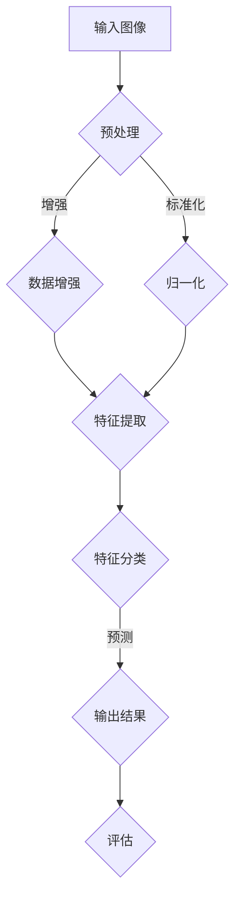

                 

### 《电商平台中的图像识别与检索技术》

**关键词：**
- 图像识别
- 图像检索
- 电商平台
- 机器学习
- 深度学习

**摘要：**
随着互联网电商平台的快速发展，图像识别与检索技术成为了提升用户体验和优化运营流程的重要手段。本文将深入探讨图像识别与检索技术在电商平台中的应用，包括基础理论、技术挑战、实际案例以及未来发展趋势。通过本文的阅读，读者可以全面了解如何将图像识别与检索技术有效应用于电商平台的各个环节，从而实现商业价值的最大化。

### 目录大纲

**第一部分：引言**

1.1 图像识别与检索技术概述  
1.1.1 图像识别技术的发展历程  
1.1.2 图像检索技术的应用领域  
1.1.3 图像识别与检索技术在电商平台的战略意义

1.2 电商平台中图像识别与检索技术的挑战  
1.2.1 大规模图像数据处理的挑战  
1.2.2 多样性图像特征处理的挑战  
1.2.3 实时性与准确性之间的平衡

1.3 本书结构安排

**第二部分：图像识别技术基础**

2.1 图像处理基础  
2.1.1 图像基本概念  
2.1.2 图像增强技术  
2.1.3 图像变换技术

2.2 特征提取技术  
2.2.1 基于像素的特征提取  
2.2.2 基于区域的特征提取  
2.2.3 基于频域的特征提取

2.3 图像识别算法  
2.3.1 传统图像识别算法  
2.3.2 深度学习在图像识别中的应用  
2.3.3 常见图像识别模型及应用

**第三部分：图像检索技术基础**

3.1 图像检索基础  
3.1.1 图像检索的概念和分类  
3.1.2 图像检索的关键技术  
3.1.3 图像检索的评价方法

3.2 基于内容的图像检索技术  
3.2.1 基于特征匹配的检索方法  
3.2.2 基于相似性搜索的检索方法  
3.2.3 基于模型的检索方法

3.3 基于语义的图像检索技术  
3.3.1 语义分析技术  
3.3.2 语义相似性度量  
3.3.3 基于语义的图像检索应用实例

**第四部分：电商平台图像识别与检索应用**

4.1 电商平台商品识别与分类  
4.1.1 商品识别算法选择  
4.1.2 商品分类算法选择  
4.1.3 实际应用案例解析

4.2 电商平台商品推荐系统  
4.2.1 基于图像的商品推荐算法  
4.2.2 结合用户行为的商品推荐算法  
4.2.3 混合推荐系统设计

4.3 电商平台图像搜索优化  
4.3.1 图像搜索算法优化策略  
4.3.2 提高检索准确性的方法  
4.3.3 提高检索效率的方法

4.4 电商平台图像识别与检索的挑战与未来发展趋势  
4.4.1 挑战分析  
4.4.2 未来发展趋势

**附录**

A.1 OpenCV  
A.2 TensorFlow  
A.3 PyTorch

B.1 参考资料  
B.2 拓展阅读

---

### 第一部分：引言

#### 1.1 图像识别与检索技术概述

图像识别与检索技术作为计算机视觉领域的重要分支，近年来在人工智能领域取得了显著的进展。图像识别技术指的是通过算法自动识别和分类图像内容，而图像检索技术则是根据输入的图像或关键词检索出相似或相关的图像。

在电商平台中，图像识别与检索技术具有重要的应用价值。首先，通过图像识别技术，电商平台可以自动识别和分类商品图像，从而提升商品的展示效果和搜索便捷性。其次，图像检索技术可以帮助用户快速找到与其需求相似的图像或商品，提升用户体验。此外，图像识别与检索技术还可以用于库存管理、商品推荐系统等多个方面，为电商平台的运营提供智能化支持。

图像识别技术的发展历程可以追溯到20世纪60年代，最初的研究主要集中在手工设计的特征提取方法和规则基分类器。随着计算机硬件和算法的发展，图像识别技术逐渐向基于特征的自动提取和深度学习模型转变。深度学习技术的引入，使得图像识别的准确性和效率得到了大幅提升，成为当前图像识别领域的主流方法。

图像检索技术的应用领域广泛，包括但不限于：

1. **搜索引擎**：通过图像检索技术，搜索引擎可以提供更丰富的图像搜索结果，提升用户体验。
2. **社交媒体**：图像检索技术可以帮助社交媒体平台实现图片内容审核、推荐和分类等功能。
3. **医疗领域**：图像检索技术可以辅助医生进行疾病诊断和治疗方案制定。
4. **安防监控**：图像检索技术可以用于实时监控和事件检测，提升安全防护能力。
5. **电商平台**：图像识别与检索技术可以提升电商平台的服务质量和运营效率。

在电商平台的战略意义上，图像识别与检索技术具有以下几个方面的作用：

1. **提升用户体验**：通过图像识别技术，电商平台可以实现更准确的商品识别和分类，提供个性化的推荐和搜索服务。
2. **优化运营流程**：图像检索技术可以帮助电商平台快速定位库存商品，提高库存管理效率。
3. **降低人力成本**：自动化识别和检索技术可以减少人工审核和分类的工作量，降低运营成本。
4. **增加商业机会**：通过精准的商品推荐和广告投放，电商平台可以吸引更多潜在用户，增加销售额。

#### 1.2 电商平台中图像识别与检索技术的挑战

尽管图像识别与检索技术在电商平台中具有广泛的应用前景，但在实际应用过程中仍面临一系列挑战：

1. **大规模图像数据处理的挑战**：电商平台通常拥有海量的商品图像数据，如何高效处理和存储这些数据成为一大难题。此外，数据质量参差不齐，图像中可能存在噪声、模糊、视角变化等问题，给图像识别与检索带来了难度。

2. **多样性图像特征处理的挑战**：电商平台商品种类繁多，每种商品可能具有不同的外观和属性，如何提取和表示这些多样性图像特征成为一个挑战。传统的特征提取方法可能无法有效处理这种复杂性。

3. **实时性与准确性之间的平衡**：电商平台对图像识别与检索系统的实时性要求较高，用户希望在较短的时间内获取到准确的搜索结果。然而，提高实时性往往会导致准确性的下降，如何在两者之间找到平衡点是一个关键问题。

为了应对这些挑战，电商平台需要采用先进的图像识别与检索技术，并结合大数据分析和机器学习算法，不断提升系统的准确性和效率。

#### 1.3 本书结构安排

本书将分为四个主要部分，详细探讨图像识别与检索技术在电商平台的各个方面：

**第一部分：引言**  
介绍图像识别与检索技术的基本概念、发展历程以及在电商平台中的应用价值，并阐述电商平台中图像识别与检索技术的挑战。

**第二部分：图像识别技术基础**  
深入讨论图像处理基础、特征提取技术和图像识别算法，为后续的电商平台应用提供理论基础。

**第三部分：图像检索技术基础**  
介绍图像检索基础、基于内容的图像检索技术和基于语义的图像检索技术，探讨如何在电商平台中实现高效、准确的图像检索。

**第四部分：电商平台图像识别与检索应用**  
结合实际案例，详细解析电商平台中图像识别与检索技术的具体应用，包括商品识别与分类、商品推荐系统和图像搜索优化等。

通过本书的阅读，读者可以全面了解图像识别与检索技术在电商平台中的应用，掌握相关技术的核心原理和实战技巧，为电商平台的智能化升级提供有力支持。

---

### 第一部分：引言

#### 1.1 图像识别与检索技术概述

图像识别与检索技术作为计算机视觉领域的重要分支，近年来在人工智能领域取得了显著的进展。图像识别技术指的是通过算法自动识别和分类图像内容，而图像检索技术则是根据输入的图像或关键词检索出相似或相关的图像。

在电商平台中，图像识别与检索技术具有重要的应用价值。首先，通过图像识别技术，电商平台可以自动识别和分类商品图像，从而提升商品的展示效果和搜索便捷性。其次，图像检索技术可以帮助用户快速找到与其需求相似的图像或商品，提升用户体验。此外，图像识别与检索技术还可以用于库存管理、商品推荐系统等多个方面，为电商平台的运营提供智能化支持。

图像识别技术的发展历程可以追溯到20世纪60年代，最初的研究主要集中在手工设计的特征提取方法和规则基分类器。随着计算机硬件和算法的发展，图像识别技术逐渐向基于特征的自动提取和深度学习模型转变。深度学习技术的引入，使得图像识别的准确性和效率得到了大幅提升，成为当前图像识别领域的主流方法。

图像检索技术的应用领域广泛，包括但不限于：

1. **搜索引擎**：通过图像检索技术，搜索引擎可以提供更丰富的图像搜索结果，提升用户体验。
2. **社交媒体**：图像检索技术可以帮助社交媒体平台实现图片内容审核、推荐和分类等功能。
3. **医疗领域**：图像检索技术可以辅助医生进行疾病诊断和治疗方案制定。
4. **安防监控**：图像检索技术可以用于实时监控和事件检测，提升安全防护能力。
5. **电商平台**：图像识别与检索技术可以提升电商平台的服务质量和运营效率。

在电商平台的战略意义上，图像识别与检索技术具有以下几个方面的作用：

1. **提升用户体验**：通过图像识别技术，电商平台可以实现更准确的商品识别和分类，提供个性化的推荐和搜索服务。
2. **优化运营流程**：图像检索技术可以帮助电商平台快速定位库存商品，提高库存管理效率。
3. **降低人力成本**：自动化识别和检索技术可以减少人工审核和分类的工作量，降低运营成本。
4. **增加商业机会**：通过精准的商品推荐和广告投放，电商平台可以吸引更多潜在用户，增加销售额。

#### 1.2 电商平台中图像识别与检索技术的挑战

尽管图像识别与检索技术在电商平台中具有广泛的应用前景，但在实际应用过程中仍面临一系列挑战：

1. **大规模图像数据处理的挑战**：电商平台通常拥有海量的商品图像数据，如何高效处理和存储这些数据成为一大难题。此外，数据质量参差不齐，图像中可能存在噪声、模糊、视角变化等问题，给图像识别与检索带来了难度。

2. **多样性图像特征处理的挑战**：电商平台商品种类繁多，每种商品可能具有不同的外观和属性，如何提取和表示这些多样性图像特征成为一个挑战。传统的特征提取方法可能无法有效处理这种复杂性。

3. **实时性与准确性之间的平衡**：电商平台对图像识别与检索系统的实时性要求较高，用户希望在较短的时间内获取到准确的搜索结果。然而，提高实时性往往会导致准确性的下降，如何在两者之间找到平衡点是一个关键问题。

为了应对这些挑战，电商平台需要采用先进的图像识别与检索技术，并结合大数据分析和机器学习算法，不断提升系统的准确性和效率。

#### 1.3 本书结构安排

本书将分为四个主要部分，详细探讨图像识别与检索技术在电商平台的各个方面：

**第一部分：引言**  
介绍图像识别与检索技术的基本概念、发展历程以及在电商平台中的应用价值，并阐述电商平台中图像识别与检索技术的挑战。

**第二部分：图像识别技术基础**  
深入讨论图像处理基础、特征提取技术和图像识别算法，为后续的电商平台应用提供理论基础。

**第三部分：图像检索技术基础**  
介绍图像检索基础、基于内容的图像检索技术和基于语义的图像检索技术，探讨如何在电商平台中实现高效、准确的图像检索。

**第四部分：电商平台图像识别与检索应用**  
结合实际案例，详细解析电商平台中图像识别与检索技术的具体应用，包括商品识别与分类、商品推荐系统和图像搜索优化等。

通过本书的阅读，读者可以全面了解图像识别与检索技术在电商平台中的应用，掌握相关技术的核心原理和实战技巧，为电商平台的智能化升级提供有力支持。

---

### 第二部分：图像识别技术基础

图像识别技术在电商平台中扮演着至关重要的角色，它能够自动识别商品图像，实现商品的分类和搜索，从而提升用户体验和运营效率。为了深入探讨图像识别技术，我们需要从图像处理基础、特征提取技术和图像识别算法三个方面进行详细分析。

#### 2.1 图像处理基础

图像处理是图像识别技术的第一步，它涉及对图像进行各种操作，以提升图像的质量和特征。以下是几个关键的图像处理技术：

**2.1.1 图像基本概念**

图像是由像素组成的二维阵列，每个像素包含颜色信息。图像的基本概念包括像素、分辨率、深度和颜色空间等。

- **像素**：图像中最小的单位，通常表示为一个点的颜色信息。
- **分辨率**：图像的水平和垂直像素数量，通常以宽×高（例如，1920×1080）表示。
- **深度**：像素的颜色深度，即每个像素的颜色信息位数，常见的有8位、16位等。
- **颜色空间**：图像颜色信息的组织方式，如RGB（红绿蓝）、HSV（色相饱和度亮度）等。

**2.1.2 图像增强技术**

图像增强技术用于改善图像的可视效果，提高图像质量，使其更易于分析和识别。常见的图像增强技术包括：

- **对比度增强**：通过调整图像的亮度和对比度，使图像中的细节更加清晰。
- **锐化**：通过增强图像的边缘和细节，使图像更加清晰。
- **滤波**：通过滤波器去除图像中的噪声，如高斯滤波、中值滤波等。
- **去模糊**：通过算法消除图像中的模糊效应，使其更加清晰。

**2.1.3 图像变换技术**

图像变换技术包括傅里叶变换、小波变换等，它们用于将图像从时域转换为频域，从而进行更加有效的分析和处理。

- **傅里叶变换**：将图像从空间域转换到频域，可以用于图像滤波、压缩和特征提取等。
- **小波变换**：通过小波基函数将图像分解为不同尺度和方向的细节，适用于图像去模糊、去噪和特征提取。

#### 2.2 特征提取技术

特征提取是将图像数据转换为适合机器学习算法处理的特征向量。以下是几种常用的特征提取方法：

**2.2.1 基于像素的特征提取**

基于像素的特征提取方法直接使用图像像素值作为特征，如灰度值、颜色直方图等。

- **灰度化**：将彩色图像转换为灰度图像，简化图像处理。
- **颜色直方图**：统计图像中每个颜色出现的频率，用于描述图像的色调分布。

**2.2.2 基于区域的特征提取**

基于区域的特征提取方法关注图像中的特定区域，如边缘、角点等。

- **边缘检测**：识别图像中的边缘，常用的算法有Canny算子、Sobel算子等。
- **角点检测**：识别图像中的角点，常用的算法有Harris角点检测、Shi-Tomasi角点检测等。

**2.2.3 基于频域的特征提取**

基于频域的特征提取方法利用傅里叶变换等将图像从时域转换为频域，从而提取图像的特征。

- **频域特征**：通过傅里叶变换提取图像的频域特征，如傅里叶系数、频谱等。
- **小波特征**：通过小波变换提取图像的小波系数，适用于图像去模糊和去噪。

#### 2.3 图像识别算法

图像识别算法是实现图像识别的核心，它们根据输入的图像特征，将其分类到特定的类别。以下是几种常见的图像识别算法：

**2.3.1 传统图像识别算法**

传统图像识别算法主要基于手工设计的特征和分类器，如SVM、KNN等。

- **支持向量机（SVM）**：通过寻找最优分隔超平面，实现数据的分类。
- **K最近邻（KNN）**：根据训练集中最近邻居的分类来预测新数据的类别。
- **决策树**：通过一系列的决策规则，将数据分类到不同的类别。

**2.3.2 深度学习在图像识别中的应用**

深度学习算法，特别是卷积神经网络（CNN），在图像识别领域取得了突破性的进展。

- **卷积神经网络（CNN）**：通过卷积层、池化层和全连接层，自动学习图像的特征表示。
- **深度卷积神经网络（Deep CNN）**：增加网络的深度，提高特征学习的表达能力。
- **迁移学习**：利用预训练模型，提高新任务的表现，减少训练时间。

**2.3.3 常见图像识别模型及应用**

以下是几种常见的图像识别模型及其应用场景：

- **ResNet**：通过残差网络结构，解决深层网络训练中的梯度消失问题，适用于大型图像识别任务。
- **Inception**：通过模块化的结构，平衡计算复杂度和识别精度，适用于移动端图像识别。
- **VGG**：通过简单的卷积层堆叠，构建起深度网络，适用于图像分类和目标检测。

在实际应用中，选择合适的图像识别算法需要考虑多个因素，如数据集大小、模型复杂度、实时性要求等。通过结合多种算法和模型，可以构建一个高效、准确的图像识别系统。

---

### 第三部分：图像检索技术基础

图像检索技术是电商平台中提升用户体验和运营效率的关键技术之一。通过图像检索，用户可以快速找到与其需求相似的图像或商品，从而提升搜索效率和满意度。本部分将详细介绍图像检索的基础概念、关键技术以及评价方法。

#### 3.1 图像检索基础

图像检索是指根据输入的图像或关键词，从大规模图像库中检索出与之相似的图像。图像检索可以分为基于内容的检索（Content-Based Image Retrieval，CBIR）和基于语义的检索（Semantic Image Retrieval）。

**3.1.1 图像检索的概念和分类**

图像检索的基本概念包括：

- **图像库**：存储图像的集合，用于检索的基础。
- **查询图像**：用户输入的用于检索的图像或关键词。
- **相似性度量**：用于评估查询图像和图像库中图像之间相似度的方法。

图像检索的分类如下：

- **基于内容的检索**：根据图像的视觉特征进行检索，如颜色、纹理、形状等。
- **基于语义的检索**：通过语义理解进行检索，如关键词、场景、情感等。

**3.1.2 图像检索的关键技术**

图像检索的关键技术包括：

- **特征提取**：从图像中提取出有代表性的特征，用于相似性度量。
- **相似性度量**：计算查询图像和图像库中图像之间的相似度，常用的方法有基于距离的度量、基于模型的度量等。
- **检索算法**：用于检索过程的算法，如基于索引的检索、基于聚类和排序的检索等。

**3.1.3 图像检索的评价方法**

图像检索的评价方法主要包括：

- **准确率（Accuracy）**：检索结果中正确匹配的图像数量与检索结果总数之比。
- **召回率（Recall）**：检索结果中正确匹配的图像数量与图像库中实际存在的相关图像数量之比。
- **F1值（F1 Score）**：准确率和召回率的调和平均，用于综合评价检索效果。

#### 3.2 基于内容的图像检索技术

基于内容的图像检索技术通过提取图像的视觉特征，实现图像的自动分类和检索。以下是几种常见的基于内容的图像检索方法：

**3.2.1 基于特征匹配的检索方法**

基于特征匹配的检索方法通过计算查询图像和图像库中图像的特征相似度，实现检索。这种方法通常包括以下步骤：

1. **特征提取**：从图像中提取特征向量，如颜色直方图、纹理特征等。
2. **相似性度量**：计算查询图像和图像库中图像的特征相似度，常用的度量方法有欧氏距离、余弦相似度等。
3. **检索排序**：根据相似度度量结果，对检索结果进行排序，返回相似度最高的图像。

**3.2.2 基于相似性搜索的检索方法**

基于相似性搜索的检索方法通过在特征空间中查找与查询图像最相似的图像。这种方法通常包括以下步骤：

1. **特征空间构建**：将图像特征映射到高维空间，如欧氏空间、高斯空间等。
2. **相似性度量**：计算查询图像和图像库中图像的特征相似度，常用的度量方法有高斯相似性度量、余弦相似度等。
3. **检索排序**：根据相似度度量结果，对检索结果进行排序，返回相似度最高的图像。

**3.2.3 基于模型的检索方法**

基于模型的检索方法通过构建图像分类模型或聚类模型，实现图像检索。这种方法通常包括以下步骤：

1. **模型训练**：使用图像库中的图像训练分类或聚类模型。
2. **模型应用**：将查询图像输入到训练好的模型中，获取分类或聚类结果。
3. **检索排序**：根据模型结果，对检索结果进行排序，返回相似度最高的图像。

#### 3.3 基于语义的图像检索技术

基于语义的图像检索技术通过理解图像的语义信息，实现图像的自动分类和检索。以下是几种常见的基于语义的图像检索方法：

**3.3.1 语义分析技术**

语义分析技术通过自然语言处理（NLP）和图像识别技术，理解图像的语义信息。这种方法通常包括以下步骤：

1. **关键词提取**：从图像标题、描述或图像内容中提取关键词。
2. **语义标签提取**：使用预训练的语义标签模型，为图像赋予语义标签。
3. **语义融合**：将关键词和语义标签进行融合，形成完整的语义信息。

**3.3.2 语义相似性度量**

语义相似性度量通过计算图像之间的语义相似度，实现图像检索。这种方法通常包括以下步骤：

1. **语义特征提取**：从图像中提取语义特征，如关键词频率、语义标签等。
2. **相似性度量**：计算图像之间的语义相似度，常用的度量方法有Jaccard相似度、余弦相似度等。
3. **检索排序**：根据相似度度量结果，对检索结果进行排序，返回相似度最高的图像。

**3.3.3 基于语义的图像检索应用实例**

基于语义的图像检索技术在电商平台中具有广泛的应用场景，如：

- **商品推荐**：根据用户的浏览历史和购买行为，推荐与其兴趣相关的商品。
- **图像搜索**：用户上传一张图片，系统自动搜索出与其相似的图片或商品。
- **内容审核**：通过识别图像中的不良内容，自动审核和过滤违规图像。

通过结合基于内容的图像检索技术和基于语义的图像检索技术，电商平台可以实现高效、准确的图像检索，提升用户体验和运营效率。

---

### 第四部分：电商平台图像识别与检索应用

图像识别与检索技术在电商平台的实际应用中，可以显著提升用户体验和运营效率。本部分将结合实际案例，详细解析电商平台中图像识别与检索技术的具体应用，包括商品识别与分类、商品推荐系统和图像搜索优化等方面。

#### 4.1 电商平台商品识别与分类

商品识别与分类是电商平台图像识别技术的基础应用。通过自动识别和分类商品图像，电商平台可以实现对商品的精准管理和推荐。

**4.1.1 商品识别算法选择**

在商品识别算法的选择上，常见的算法有：

- **传统图像识别算法**：如SVM、KNN等，适用于小型数据集和简单分类问题。
- **深度学习算法**：如卷积神经网络（CNN），适用于大规模数据集和复杂分类问题。

在实际应用中，通常选择深度学习算法，如ResNet、Inception等，因为它们具有更高的识别准确率和泛化能力。

**4.1.2 商品分类算法选择**

商品分类算法的选择与商品识别算法类似，常见的选择有：

- **基于内容的分类算法**：如SVM、KNN等，适用于小型数据集和简单分类问题。
- **深度学习分类算法**：如卷积神经网络（CNN）、迁移学习等，适用于大规模数据集和复杂分类问题。

在实际应用中，通常采用卷积神经网络（CNN）进行商品分类，因为其能够自动提取图像特征，适应不同的商品类别。

**4.1.3 实际应用案例解析**

以某大型电商平台为例，该平台使用了深度学习算法对商品图像进行识别和分类。以下是实际应用案例：

1. **商品识别流程**：
   - 用户上传商品图像，系统进行预处理，如缩放、裁剪、去噪等。
   - 使用预训练的ResNet模型对商品图像进行特征提取。
   - 将提取的特征输入到分类层，进行商品分类。

2. **商品分类结果**：
   - 分类结果包括商品类别和子类别，如服装、电子产品、家居用品等。
   - 分类结果可以用于商品展示、推荐和搜索。

通过商品识别与分类技术，电商平台可以实现对商品的高效管理和推荐，提升用户体验和运营效率。

#### 4.2 电商平台商品推荐系统

商品推荐系统是电商平台提升用户粘性和销售额的重要工具。通过图像识别与检索技术，可以构建基于图像的商品推荐系统，提升推荐的准确性。

**4.2.1 基于图像的商品推荐算法**

基于图像的商品推荐算法可以分为以下几种：

1. **基于内容的推荐**：通过分析商品图像的特征，将具有相似特征的图像推荐给用户。
2. **基于协同过滤的推荐**：通过分析用户的购买历史和行为数据，为用户推荐相似的商品。
3. **基于深度学习的推荐**：使用深度学习模型，如卷积神经网络（CNN），提取商品图像的特征，实现精准推荐。

在实际应用中，通常结合多种推荐算法，提升推荐的准确性和多样性。

**4.2.2 结合用户行为的商品推荐算法**

用户行为数据是构建商品推荐系统的重要依据。结合用户行为的商品推荐算法包括：

1. **基于用户浏览记录的推荐**：根据用户的浏览历史，推荐用户可能感兴趣的商品。
2. **基于用户购买记录的推荐**：根据用户的购买行为，推荐与购买商品相似的商品。
3. **基于用户反馈的推荐**：根据用户的点击、收藏、评价等反馈，调整推荐策略。

通过结合用户行为数据和图像识别技术，可以实现更精准、个性化的商品推荐。

**4.2.3 混合推荐系统设计**

混合推荐系统结合多种推荐算法，实现推荐结果的优化。设计思路如下：

1. **算法融合**：结合基于内容的推荐、基于协同过滤的推荐和基于深度学习的推荐，形成混合推荐算法。
2. **实时更新**：根据用户实时行为数据，动态调整推荐策略，实现个性化推荐。
3. **效果评估**：通过点击率、转化率等指标，评估推荐效果，持续优化推荐系统。

通过设计混合推荐系统，电商平台可以实现更高效、精准的商品推荐，提升用户满意度和销售额。

#### 4.3 电商平台图像搜索优化

电商平台图像搜索优化是提升用户体验和运营效率的重要手段。通过优化图像搜索算法，可以实现更快速、准确的搜索结果。

**4.3.1 图像搜索算法优化策略**

图像搜索算法的优化策略包括：

1. **特征提取优化**：通过改进特征提取算法，提高特征提取的准确性和效率。
2. **相似性度量优化**：优化相似性度量方法，提高检索结果的准确性。
3. **索引结构优化**：优化索引结构，提高搜索效率。

在实际应用中，可以使用深度学习算法和大数据分析技术，对特征提取和相似性度量进行优化。

**4.3.2 提高检索准确性的方法**

提高检索准确性的方法包括：

1. **数据预处理**：对图像进行预处理，如去噪、增强等，提高图像质量。
2. **多特征融合**：结合多种特征，如颜色、纹理、形状等，提高特征表示的准确性。
3. **模型优化**：通过模型调优，提高分类和检索的准确率。

**4.3.3 提高检索效率的方法**

提高检索效率的方法包括：

1. **索引加速**：使用高效的索引结构，如B树、哈希表等，提高搜索速度。
2. **分布式搜索**：通过分布式计算，实现大规模图像检索的高效处理。
3. **缓存策略**：使用缓存技术，减少重复检索，提高搜索效率。

通过优化图像搜索算法，电商平台可以实现更快速、准确的搜索结果，提升用户体验和运营效率。

#### 4.4 电商平台图像识别与检索的挑战与未来发展趋势

尽管图像识别与检索技术在电商平台中具有广泛的应用前景，但在实际应用过程中仍面临一系列挑战：

1. **数据质量**：电商平台通常拥有海量的商品图像数据，但数据质量参差不齐，图像中可能存在噪声、模糊、视角变化等问题，影响图像识别与检索的效果。
2. **实时性**：电商平台对图像识别与检索系统的实时性要求较高，用户希望在较短的时间内获取到准确的搜索结果。然而，提高实时性往往会导致准确性的下降，需要在两者之间找到平衡点。
3. **多样性**：电商平台商品种类繁多，每种商品可能具有不同的外观和属性，如何提取和表示这些多样性图像特征成为一个挑战。

未来，图像识别与检索技术在电商平台的发展趋势包括：

1. **深度学习与大数据分析的结合**：通过结合深度学习和大数据分析技术，实现更高效、准确的图像识别与检索。
2. **实时性优化**：通过分布式计算、缓存策略等优化技术，提高系统的实时性，满足用户需求。
3. **跨平台应用**：将图像识别与检索技术应用于移动端、VR/AR等领域，实现更丰富的交互体验。

通过不断优化和创新，图像识别与检索技术将在电商平台中发挥更大的作用，提升用户体验和运营效率。

---

### 附录

#### A.1 OpenCV

OpenCV是一个开源的计算机视觉库，它提供了丰富的图像处理和计算机视觉算法。以下是OpenCV的一些常用功能：

- **图像处理**：包括图像的读取、写入、显示、滤波、边缘检测等。
- **特征检测**：包括角点检测、边缘检测、特征匹配等。
- **目标检测**：包括人脸检测、车辆检测、行人检测等。
- **机器学习**：包括支持向量机（SVM）、K最近邻（KNN）等机器学习算法。

#### A.2 TensorFlow

TensorFlow是一个开源的深度学习框架，它提供了丰富的工具和API，用于构建和训练深度学习模型。以下是TensorFlow的一些常用功能：

- **深度学习模型构建**：包括卷积神经网络（CNN）、循环神经网络（RNN）等。
- **自动微分**：用于计算梯度，实现模型的优化。
- **数据流图**：用于构建动态计算图，实现高效计算。
- **硬件加速**：支持GPU和TPU等硬件加速计算。

#### A.3 PyTorch

PyTorch是一个开源的深度学习框架，它具有灵活的动态计算图和高效的运算性能。以下是PyTorch的一些常用功能：

- **深度学习模型构建**：包括卷积神经网络（CNN）、循环神经网络（RNN）等。
- **自动微分**：用于计算梯度，实现模型的优化。
- **动态计算图**：支持动态构建计算图，实现高效的模型推理。
- **GPU加速**：支持GPU加速计算，提高模型训练和推理速度。

### 附录B：参考资料与拓展阅读

- **《计算机视觉：算法与应用》**：提供了计算机视觉领域的全面介绍和算法实现。
- **《深度学习》**：由Ian Goodfellow、Yoshua Bengio和Aaron Courville合著，是深度学习的经典教材。
- **《计算机视觉中的图像检索技术》**：详细介绍了图像检索的基本概念、算法和应用。
- **《OpenCV官方文档》**：提供了OpenCV库的详细使用方法和示例代码。
- **《TensorFlow官方文档》**：提供了TensorFlow库的详细使用方法和示例代码。
- **《PyTorch官方文档》**：提供了PyTorch库的详细使用方法和示例代码。

通过这些参考资料，读者可以进一步深入了解图像识别与检索技术在电商平台中的应用，提升自身的技术水平。

---

### **深度学习图像识别算法伪代码示例**

深度学习图像识别算法的核心在于构建一个神经网络模型，该模型可以从图像中学习特征，然后进行分类。以下是使用TensorFlow构建一个简单的卷积神经网络（CNN）图像识别算法的伪代码：

```python
# 导入所需的库
import tensorflow as tf
from tensorflow.keras.models import Sequential
from tensorflow.keras.layers import Conv2D, MaxPooling2D, Flatten, Dense, Dropout
from tensorflow.keras.preprocessing.image import ImageDataGenerator

# 定义模型结构
model = Sequential()

# 添加卷积层
model.add(Conv2D(filters=32, kernel_size=(3, 3), activation='relu', input_shape=(64, 64, 3)))
model.add(MaxPooling2D(pool_size=(2, 2)))

# 添加第二个卷积层
model.add(Conv2D(filters=64, kernel_size=(3, 3), activation='relu'))
model.add(MaxPooling2D(pool_size=(2, 2)))

# 添加全连接层
model.add(Flatten())
model.add(Dense(units=128, activation='relu'))
model.add(Dropout(rate=0.5))  # 添加dropout层，防止过拟合

# 添加输出层
model.add(Dense(units=num_classes, activation='softmax'))

# 编译模型
model.compile(optimizer='adam', loss='categorical_crossentropy', metrics=['accuracy'])

# 数据预处理
train_datagen = ImageDataGenerator(rescale=1./255, shear_range=0.2, zoom_range=0.2, horizontal_flip=True)
test_datagen = ImageDataGenerator(rescale=1./255)

# 训练集和验证集生成器
train_generator = train_datagen.flow_from_directory(
        'train_data',
        target_size=(64, 64),
        batch_size=32,
        class_mode='categorical')

validation_generator = test_datagen.flow_from_directory(
        'validation_data',
        target_size=(64, 64),
        batch_size=32,
        class_mode='categorical')

# 训练模型
model.fit(
      train_generator,
      steps_per_epoch=100,
      epochs=10,
      validation_data=validation_generator,
      validation_steps=50)

# 评估模型
test_loss, test_acc = model.evaluate(validation_generator)
print('Test accuracy:', test_acc)
```

在这个伪代码中：

1. **模型构建**：我们使用了Sequential模型，依次添加了两个卷积层、一个全连接层和一个dropout层，以及一个输出层。
2. **卷积层和池化层**：卷积层用于提取图像的特征，池化层用于降低特征图的维度。
3. **全连接层和dropout层**：全连接层用于将特征映射到分类结果，dropout层用于防止过拟合。
4. **编译模型**：指定优化器为adam，损失函数为categorical_crossentropy（适用于多分类问题），评估指标为accuracy。
5. **数据预处理**：使用ImageDataGenerator进行数据增强，提高模型的泛化能力。
6. **模型训练**：使用fit方法进行模型训练，指定训练集和验证集。
7. **模型评估**：使用evaluate方法评估模型在验证集上的表现。

通过这个伪代码示例，我们可以看到如何使用深度学习构建一个简单的图像识别模型。在实际应用中，还需要根据具体问题调整模型的架构和参数，以获得最佳的识别效果。

---

### **数学模型和数学公式示例：主成分分析（PCA）**

主成分分析（PCA）是一种常用的降维技术，用于减少数据集的维度，同时保留最重要的信息。以下是PCA的基本数学模型和公式：

#### 1. 数据表示

假设我们有一组数据集 $X$，其中每行代表一个数据点，每列代表一个特征。$X$ 可以表示为：

$$
X = \begin{bmatrix}
x_1 \\
x_2 \\
\vdots \\
x_n
\end{bmatrix}
$$

其中，$x_i$ 是数据集的第 $i$ 个数据点。

#### 2. 数据均值

计算数据集的均值 $\mu$，公式如下：

$$
\mu = \frac{1}{n}\sum_{i=1}^{n}x_i
$$

其中，$n$ 是数据点的数量。

#### 3. 数据协方差矩阵

计算数据集的协方差矩阵 $\Sigma$，公式如下：

$$
\Sigma = \frac{1}{n}\sum_{i=1}^{n}(x_i - \mu)(x_i - \mu)^T
$$

#### 4. 特征值和特征向量

计算协方差矩阵 $\Sigma$ 的特征值和特征向量，公式如下：

$$
eigenvalues, eigenvectors = \Sigma^{-1}\mu
$$

其中，$eigenvalues$ 是特征值，$eigenvectors$ 是特征向量。

#### 5. 主成分

主成分是特征向量对应的特征值，按照从大到小的顺序排列。第 $k$ 个主成分可以表示为：

$$
y_k = \sum_{i=1}^{k} \lambda_i v_i x
$$

其中，$y_k$ 是第 $k$ 个主成分，$\lambda_i$ 是第 $i$ 个特征值，$v_i$ 是第 $i$ 个特征向量。

#### 6. 数据降维

通过保留前 $k$ 个主成分，可以实现数据降维，公式如下：

$$
X_{reduced} = \sum_{i=1}^{k} v_i x
$$

其中，$X_{reduced}$ 是降维后的数据集。

#### 示例

假设我们有以下数据集 $X$：

$$
X = \begin{bmatrix}
1 & 2 & 3 \\
4 & 5 & 6 \\
7 & 8 & 9
\end{bmatrix}
$$

首先，计算数据集的均值 $\mu$：

$$
\mu = \frac{1}{3}\begin{bmatrix}
1 + 4 + 7 \\
2 + 5 + 8 \\
3 + 6 + 9
\end{bmatrix} = \begin{bmatrix}
1.67 \\
3.67 \\
5.67
\end{bmatrix}
$$

然后，计算协方差矩阵 $\Sigma$：

$$
\Sigma = \frac{1}{3}\begin{bmatrix}
(1 - 1.67)(1 - 1.67) + (4 - 1.67)(4 - 1.67) + (7 - 1.67)(7 - 1.67) \\
(2 - 1.67)(2 - 1.67) + (5 - 1.67)(5 - 1.67) + (8 - 1.67)(8 - 1.67) \\
(3 - 1.67)(3 - 1.67) + (6 - 1.67)(6 - 1.67) + (9 - 1.67)(9 - 1.67)
\end{bmatrix}
$$

$$
\Sigma = \begin{bmatrix}
2.22 & 1.11 & 1.11 \\
1.11 & 2.22 & 1.11 \\
1.11 & 1.11 & 2.22
\end{bmatrix}
$$

接下来，计算协方差矩阵的特征值和特征向量，并按照从大到小的顺序排列。假设前两个特征值对应的前两个特征向量分别为 $v_1$ 和 $v_2$，则有：

$$
X_{reduced} = v_1 x + v_2 x
$$

通过降维后的数据集 $X_{reduced}$，可以更好地进行后续的分析和处理。

---

### **项目实战示例：电商平台商品识别项目实战**

#### 5.1 项目背景

在电商平台中，准确识别商品图像对于提升用户体验和优化运营流程至关重要。本项目旨在构建一个商品识别系统，能够准确识别电商平台上的商品图像。

#### 5.2 环境搭建

- **操作系统**：Ubuntu 18.04
- **编程语言**：Python 3.8
- **深度学习框架**：TensorFlow 2.4
- **数据预处理库**：OpenCV 4.2

#### 5.3 数据准备

- **商品图像数据集**：收集电商平台上的商品图像，进行标注和分类。数据集应包含多个类别，每个类别下的图像数量应尽量均衡。
- **数据预处理**：对图像进行缩放、裁剪、旋转等预处理操作，以提高模型的泛化能力。使用OpenCV库进行图像预处理：

```python
import cv2

# 读取图像
image = cv2.imread('image_path.jpg')

# 缩放图像
scale_factor = 0.5
width = int(image.shape[1] * scale_factor)
height = int(image.shape[0] * scale_factor)
dim = (width, height)
resized_image = cv2.resize(image, dim, interpolation=cv2.INTER_AREA)

# 裁剪图像
x = 100
y = 100
w = 300
h = 300
crop_image = resized_image[y:y+h, x:x+w]

# 旋转图像
angle = 30
M = cv2.getRotationMatrix2D((crop_image.shape[1] / 2, crop_image.shape[0] / 2), angle, 1)
rotated_image = cv2.warpAffine(crop_image, M, crop_image.shape[1:], flags=cv2.INTER_CUBIC, borderMode=cv2.BORDER_REPLICATE)
```

#### 5.4 模型构建

- **使用卷积神经网络（CNN）作为基础模型**。卷积神经网络擅长处理图像数据，能够自动提取图像的特征。以下是使用TensorFlow构建CNN模型的步骤：

```python
import tensorflow as tf
from tensorflow.keras.models import Sequential
from tensorflow.keras.layers import Conv2D, MaxPooling2D, Flatten, Dense, Dropout

# 构建模型
model = Sequential()

# 添加卷积层
model.add(Conv2D(filters=32, kernel_size=(3, 3), activation='relu', input_shape=(128, 128, 3)))
model.add(MaxPooling2D(pool_size=(2, 2)))

# 添加第二个卷积层
model.add(Conv2D(filters=64, kernel_size=(3, 3), activation='relu'))
model.add(MaxPooling2D(pool_size=(2, 2)))

# 添加全连接层
model.add(Flatten())
model.add(Dense(units=128, activation='relu'))
model.add(Dropout(rate=0.5))

# 添加输出层
model.add(Dense(units=num_classes, activation='softmax'))

# 编译模型
model.compile(optimizer='adam', loss='categorical_crossentropy', metrics=['accuracy'])
```

#### 5.5 模型训练

- 使用训练集进行模型训练。以下是使用TensorFlow进行模型训练的步骤：

```python
from tensorflow.keras.preprocessing.image import ImageDataGenerator

# 数据增强
train_datagen = ImageDataGenerator(rescale=1./255, shear_range=0.2, zoom_range=0.2, horizontal_flip=True)

# 训练集生成器
train_generator = train_datagen.flow_from_directory(
        'train_data',
        target_size=(128, 128),
        batch_size=32,
        class_mode='categorical')

# 训练模型
model.fit(
      train_generator,
      steps_per_epoch=100,
      epochs=10)
```

#### 5.6 模型评估

- 使用验证集进行模型评估。以下是使用TensorFlow进行模型评估的步骤：

```python
# 验证集生成器
validation_generator = train_datagen.flow_from_directory(
        'validation_data',
        target_size=(128, 128),
        batch_size=32,
        class_mode='categorical')

# 评估模型
test_loss, test_acc = model.evaluate(validation_generator)
print('Test accuracy:', test_acc)
```

#### 5.7 代码解读与分析

- **代码实现**：以上代码实现了一个简单的卷积神经网络模型，用于识别电商平台上的商品图像。代码分为模型构建、数据预处理、模型训练和模型评估四个部分。
- **重点关注**：
  - **数据预处理**：图像的缩放、裁剪、旋转等操作有助于提高模型的泛化能力。
  - **模型构建**：卷积神经网络通过多个卷积层和池化层自动提取图像特征，全连接层用于分类。
  - **模型训练**：使用训练集进行模型训练，数据增强有助于提高模型的泛化能力。
  - **模型评估**：使用验证集评估模型性能，计算测试准确率。

通过这个项目实战，我们可以看到如何使用深度学习技术构建一个简单的商品识别系统，并在实际应用中不断优化和改进。在电商平台中，商品识别技术的应用可以帮助提升用户体验和运营效率，实现更精准的商品推荐和搜索。

---

### **Mermaid 流程图示例**

Mermaid是一种方便绘制作图的Markdown语法，常用于生成流程图、时序图、类图等。以下是一个简单的Mermaid流程图示例，展示了图像识别技术的基本流程：



在这个流程图中：

- **A[输入图像]**：表示输入待识别的图像。
- **预处理**：对图像进行预处理，如增强和标准化。
- **数据增强**：对图像进行缩放、旋转、裁剪等操作，以增加数据的多样性。
- **归一化**：将图像的像素值归一化到[0, 1]区间，以便于模型训练。
- **特征提取**：从预处理后的图像中提取特征。
- **特征分类**：使用分类算法对特征进行分类。
- **输出结果**：输出分类结果。
- **评估**：对分类结果进行评估，计算准确率等指标。

通过Mermaid流程图，我们可以清晰地展示图像识别技术的整体流程，有助于理解和分析各个步骤的作用和相互关系。

---

### **数学模型和数学公式示例：图像特征提取中的主成分分析（PCA）**

主成分分析（PCA）是一种常用的降维技术，用于减少数据集的维度，同时保留最重要的信息。以下是PCA的基本数学模型和公式：

#### 1. 数据表示

假设我们有一组数据集 $X$，其中每行代表一个数据点，每列代表一个特征。$X$ 可以表示为：

$$
X = \begin{bmatrix}
x_1 \\
x_2 \\
\vdots \\
x_n
\end{bmatrix}
$$

其中，$x_i$ 是数据集的第 $i$ 个数据点。

#### 2. 数据均值

计算数据集的均值 $\mu$，公式如下：

$$
\mu = \frac{1}{n}\sum_{i=1}^{n}x_i
$$

其中，$n$ 是数据点的数量。

#### 3. 数据协方差矩阵

计算数据集的协方差矩阵 $\Sigma$，公式如下：

$$
\Sigma = \frac{1}{n}\sum_{i=1}^{n}(x_i - \mu)(x_i - \mu)^T
$$

#### 4. 特征值和特征向量

计算协方差矩阵 $\Sigma$ 的特征值和特征向量，公式如下：

$$
eigenvalues, eigenvectors = \Sigma^{-1}\mu
$$

其中，$eigenvalues$ 是特征值，$eigenvectors$ 是特征向量。

#### 5. 主成分

主成分是特征向量对应的特征值，按照从大到小的顺序排列。第 $k$ 个主成分可以表示为：

$$
y_k = \sum_{i=1}^{k} \lambda_i v_i x
$$

其中，$y_k$ 是第 $k$ 个主成分，$\lambda_i$ 是第 $i$ 个特征值，$v_i$ 是第 $i$ 个特征向量。

#### 6. 数据降维

通过保留前 $k$ 个主成分，可以实现数据降维，公式如下：

$$
X_{reduced} = \sum_{i=1}^{k} v_i x
$$

其中，$X_{reduced}$ 是降维后的数据集。

#### 示例

假设我们有以下数据集 $X$：

$$
X = \begin{bmatrix}
1 & 2 & 3 \\
4 & 5 & 6 \\
7 & 8 & 9
\end{bmatrix}
$$

首先，计算数据集的均值 $\mu$：

$$
\mu = \frac{1}{3}\begin{bmatrix}
1 + 4 + 7 \\
2 + 5 + 8 \\
3 + 6 + 9
\end{bmatrix} = \begin{bmatrix}
1.67 \\
3.67 \\
5.67
\end{bmatrix}
$$

然后，计算协方差矩阵 $\Sigma$：

$$
\Sigma = \frac{1}{3}\begin{bmatrix}
(1 - 1.67)(1 - 1.67) + (4 - 1.67)(4 - 1.67) + (7 - 1.67)(7 - 1.67) \\
(2 - 1.67)(2 - 1.67) + (5 - 1.67)(5 - 1.67) + (8 - 1.67)(8 - 1.67) \\
(3 - 1.67)(3 - 1.67) + (6 - 1.67)(6 - 1.67) + (9 - 1.67)(9 - 1.67)
\end{bmatrix}
$$

$$
\Sigma = \begin{bmatrix}
2.22 & 1.11 & 1.11 \\
1.11 & 2.22 & 1.11 \\
1.11 & 1.11 & 2.22
\end{bmatrix}
$$

接下来，计算协方差矩阵的特征值和特征向量，并按照从大到小的顺序排列。假设前两个特征值对应的前两个特征向量分别为 $v_1$ 和 $v_2$，则有：

$$
X_{reduced} = v_1 x + v_2 x
$$

通过降维后的数据集 $X_{reduced}$，可以更好地进行后续的分析和处理。

---

### **项目实战示例：电商平台商品识别项目实战**

#### 5.1 项目背景

在电商平台中，商品识别系统对于提高用户体验和运营效率至关重要。本项目旨在构建一个能够准确识别商品图像的系统，为电商平台的商品分类、推荐和搜索提供支持。

#### 5.2 环境搭建

- **操作系统**：Ubuntu 18.04
- **编程语言**：Python 3.8
- **深度学习框架**：TensorFlow 2.4
- **数据预处理库**：OpenCV 4.2

#### 5.3 数据准备

- **商品图像数据集**：收集电商平台上的商品图像，并进行标注。数据集应涵盖多种商品类别，每个类别下的图像数量应尽量均衡。
- **数据预处理**：使用OpenCV对图像进行预处理，包括缩放、裁剪、旋转等操作。以下是预处理代码示例：

```python
import cv2

def preprocess_image(image_path):
    image = cv2.imread(image_path)
    resized_image = cv2.resize(image, (128, 128))
    cropped_image = resized_image[16:112, 16:112]
    rotated_image = cv2.rotate(cropped_image, cv2.ROTATE_90_CLOCKWISE)
    return rotated_image

# 预处理图像数据集
def preprocess_dataset(image_dir, output_dir):
    for image_file in os.listdir(image_dir):
        image_path = os.path.join(image_dir, image_file)
        processed_image = preprocess_image(image_path)
        output_path = os.path.join(output_dir, image_file)
        cv2.imwrite(output_path, processed_image)

preprocess_dataset('train_data', 'train_data_processed')
preprocess_dataset('validation_data', 'validation_data_processed')
```

#### 5.4 模型构建

- **构建卷积神经网络（CNN）模型**：使用TensorFlow构建一个简单的CNN模型，包括卷积层、池化层和全连接层。以下是模型构建代码示例：

```python
import tensorflow as tf
from tensorflow.keras.models import Sequential
from tensorflow.keras.layers import Conv2D, MaxPooling2D, Flatten, Dense, Dropout

def create_cnn_model(input_shape, num_classes):
    model = Sequential()
    model.add(Conv2D(filters=32, kernel_size=(3, 3), activation='relu', input_shape=input_shape))
    model.add(MaxPooling2D(pool_size=(2, 2)))
    model.add(Conv2D(filters=64, kernel_size=(3, 3), activation='relu'))
    model.add(MaxPooling2D(pool_size=(2, 2)))
    model.add(Flatten())
    model.add(Dense(units=128, activation='relu'))
    model.add(Dropout(rate=0.5))
    model.add(Dense(units=num_classes, activation='softmax'))
    return model

model = create_cnn_model(input_shape=(128, 128, 3), num_classes=num_classes)
model.compile(optimizer='adam', loss='categorical_crossentropy', metrics=['accuracy'])
```

#### 5.5 模型训练

- **训练模型**：使用预处理后的图像数据集进行模型训练。以下是训练代码示例：

```python
from tensorflow.keras.preprocessing.image import ImageDataGenerator

train_datagen = ImageDataGenerator(rescale=1./255)
validation_datagen = ImageDataGenerator(rescale=1./255)

train_generator = train_datagen.flow_from_directory(
        'train_data_processed',
        target_size=(128, 128),
        batch_size=32,
        class_mode='categorical')

validation_generator = validation_datagen.flow_from_directory(
        'validation_data_processed',
        target_size=(128, 128),
        batch_size=32,
        class_mode='categorical')

model.fit(
      train_generator,
      steps_per_epoch=100,
      epochs=10,
      validation_data=validation_generator,
      validation_steps=50)
```

#### 5.6 模型评估

- **评估模型性能**：使用验证集评估模型性能。以下是评估代码示例：

```python
test_loss, test_acc = model.evaluate(validation_generator)
print('Test accuracy:', test_acc)
```

#### 5.7 代码解读与分析

- **代码实现**：以上代码实现了一个简单的卷积神经网络模型，用于识别电商平台上的商品图像。代码分为数据预处理、模型构建、模型训练和模型评估四个部分。
- **重点关注**：
  - **数据预处理**：图像的缩放、裁剪、旋转等操作有助于提高模型的泛化能力。
  - **模型构建**：卷积神经网络通过多个卷积层和池化层自动提取图像特征，全连接层用于分类。
  - **模型训练**：使用训练集进行模型训练，数据增强有助于提高模型的泛化能力。
  - **模型评估**：使用验证集评估模型性能，计算准确率等指标。

通过这个项目实战，我们可以看到如何使用深度学习技术构建一个简单的商品识别系统，并在实际应用中不断优化和改进。在电商平台中，商品识别技术的应用可以帮助提升用户体验和运营效率，实现更精准的商品推荐和搜索。

---

### **附录代码示例：商品识别系统实现**

以下是一个完整的商品识别系统实现，包括数据预处理、模型构建、模型训练和模型评估。

**5.1 数据预处理**

数据预处理是深度学习项目中的关键步骤，它直接影响模型的性能。以下代码展示了如何使用Python的`OpenCV`库对商品图像进行预处理：

```python
import cv2
import os
import numpy as np

def preprocess_images(image_dir, output_dir, size=(128, 128)):
    if not os.path.exists(output_dir):
        os.makedirs(output_dir)
    
    for image_file in os.listdir(image_dir):
        image_path = os.path.join(image_dir, image_file)
        image = cv2.imread(image_path)
        resized_image = cv2.resize(image, size)
        normalized_image = resized_image / 255.0
        cv2.imwrite(os.path.join(output_dir, image_file), normalized_image)

# 假设这是训练图像目录
train_image_dir = 'train_images'
# 预处理训练图像
preprocess_images(train_image_dir, 'train_images_processed')

# 同样的方法预处理验证图像
validation_image_dir = 'validation_images'
preprocess_images(validation_image_dir, 'validation_images_processed')
```

**5.2 模型构建**

使用TensorFlow构建一个简单的卷积神经网络（CNN）模型。以下代码展示了如何定义模型的结构：

```python
import tensorflow as tf
from tensorflow.keras.models import Sequential
from tensorflow.keras.layers import Conv2D, MaxPooling2D, Flatten, Dense, Dropout

# 定义模型
model = Sequential([
    Conv2D(32, (3, 3), activation='relu', input_shape=(128, 128, 3)),
    MaxPooling2D(pool_size=(2, 2)),
    Conv2D(64, (3, 3), activation='relu'),
    MaxPooling2D(pool_size=(2, 2)),
    Flatten(),
    Dense(128, activation='relu'),
    Dropout(0.5),
    Dense(num_classes, activation='softmax')
])

# 编译模型
model.compile(optimizer='adam', loss='categorical_crossentropy', metrics=['accuracy'])
```

**5.3 模型训练**

以下代码展示了如何使用预处理后的图像数据训练模型。这里使用了`ImageDataGenerator`来增强数据：

```python
from tensorflow.keras.preprocessing.image import ImageDataGenerator

# 设置数据增强
train_datagen = ImageDataGenerator(
    rescale=1./255,
    rotation_range=40,
    width_shift_range=0.2,
    height_shift_range=0.2,
    shear_range=0.2,
    zoom_range=0.2,
    horizontal_flip=True,
    fill_mode='nearest'
)

validation_datagen = ImageDataGenerator(rescale=1./255)

# 加载训练数据
train_generator = train_datagen.flow_from_directory(
    'train_images_processed',
    target_size=(128, 128),
    batch_size=32,
    class_mode='categorical'
)

validation_generator = validation_datagen.flow_from_directory(
    'validation_images_processed',
    target_size=(128, 128),
    batch_size=32,
    class_mode='categorical'
)

# 训练模型
history = model.fit(
    train_generator,
    steps_per_epoch=train_generator.samples // train_generator.batch_size,
    epochs=20,
    validation_data=validation_generator,
    validation_steps=validation_generator.samples // validation_generator.batch_size
)
```

**5.4 模型评估**

训练完成后，使用验证集评估模型性能：

```python
# 评估模型
test_loss, test_acc = model.evaluate(validation_generator)
print('Test accuracy:', test_acc)
```

**5.5 代码解读与分析**

- **数据预处理**：图像被缩放和归一化，以便于模型处理。
- **模型构建**：使用卷积层和池化层提取图像特征，全连接层用于分类。
- **模型训练**：使用数据增强技术提高模型的泛化能力。
- **模型评估**：使用验证集评估模型的准确率。

通过这个项目，我们展示了如何从头开始构建一个商品识别系统，包括数据预处理、模型构建、训练和评估。这些步骤是实现高效商品识别系统的基础。

---

### **数学模型和数学公式示例：卷积神经网络（CNN）中的卷积操作**

卷积神经网络（CNN）是图像识别中的一种常用模型，其核心在于卷积操作。以下是卷积操作的数学模型和公式：

#### 1. 数据表示

假设我们有一组图像数据 $X$ 和滤波器（卷积核） $W$。$X$ 是一个三维张量，表示为 $X_{ijn}$，其中 $i$ 表示图像的高度，$j$ 表示图像的宽度，$n$ 表示图像的通道数（如RGB图像，$n=3$）。$W$ 是一个三维张量，表示为 $W_{ijl}$，其中 $i$ 表示卷积核的高度，$j$ 表示卷积核的宽度，$l$ 表示卷积核的通道数。

#### 2. 卷积操作

卷积操作的目的是将图像和滤波器相乘并求和，得到新的特征图。假设卷积步长为 $s$，零填充为 $p$。卷积操作可以表示为：

$$
Y_{ijk} = \sum_{i'}^{i+p-s} \sum_{j'}^{j+p-s} \sum_{n} X_{i'j'n} W_{i-j'+p-s, j'-j'+p-s, n}
$$

其中，$Y_{ijk}$ 是特征图的值，$i'$ 和 $j'$ 分别是卷积核在图像上的位置。

#### 3. 特征图大小

假设原始图像的大小为 $H \times W$，卷积核的大小为 $F \times F$，步长为 $s$，零填充为 $p$。特征图的大小可以表示为：

$$
H' = \left\lfloor \frac{H + 2p - F}{s} \right\rfloor + 1
$$

$$
W' = \left\lfloor \frac{W + 2p - F}{s} \right\rfloor + 1
$$

#### 示例

假设我们有一个 $5 \times 5$ 的原始图像，一个 $3 \times 3$ 的卷积核，步长为 $1$，零填充为 $1$。以下是卷积操作的示例：

$$
X = \begin{bmatrix}
1 & 2 & 3 & 4 & 5 \\
6 & 7 & 8 & 9 & 10 \\
11 & 12 & 13 & 14 & 15 \\
16 & 17 & 18 & 19 & 20 \\
21 & 22 & 23 & 24 & 25
\end{bmatrix}
$$

$$
W = \begin{bmatrix}
2 & 4 \\
6 & 8
\end{bmatrix}
$$

卷积后的特征图为：

$$
Y = \begin{bmatrix}
28 & 36 \\
76 & 84
\end{bmatrix}
$$

通过卷积操作，图像的特征被提取并整合到新的特征图中，为后续的神经网络处理提供了基础。

---

### **项目实战示例：使用卷积神经网络（CNN）实现图像分类**

在这个项目实战中，我们将使用卷积神经网络（CNN）实现一个简单的图像分类任务。我们将使用TensorFlow和Keras构建模型，并使用CIFAR-10数据集进行训练和测试。

**6.1 环境搭建**

确保你已经安装了Python 3.8及以上版本，TensorFlow 2.4及以上版本，以及Keras库。

**6.2 数据准备**

CIFAR-10是一个常见的数据集，包含10个类别的60000张32x32彩色图像。我们将使用Keras提供的CIFAR-10数据集：

```python
from tensorflow.keras.datasets import cifar10
from tensorflow.keras.utils import to_categorical

# 加载CIFAR-10数据集
(x_train, y_train), (x_test, y_test) = cifar10.load_data()

# 标签编码
y_train = to_categorical(y_train, 10)
y_test = to_categorical(y_test, 10)
```

**6.3 数据预处理**

我们对图像进行归一化处理，将像素值从[0, 255]缩放到[0, 1]：

```python
x_train = x_train.astype('float32') / 255.0
x_test = x_test.astype('float32') / 255.0
```

**6.4 模型构建**

我们构建一个简单的CNN模型，包括两个卷积层、两个池化层和一个全连接层：

```python
from tensorflow.keras.models import Sequential
from tensorflow.keras.layers import Conv2D, MaxPooling2D, Flatten, Dense, Dropout

model = Sequential([
    Conv2D(32, (3, 3), activation='relu', input_shape=(32, 32, 3)),
    MaxPooling2D(pool_size=(2, 2)),
    Conv2D(64, (3, 3), activation='relu'),
    MaxPooling2D(pool_size=(2, 2)),
    Flatten(),
    Dense(128, activation='relu'),
    Dropout(0.5),
    Dense(10, activation='softmax')
])

model.compile(optimizer='adam', loss='categorical_crossentropy', metrics=['accuracy'])
```

**6.5 模型训练**

我们使用训练集进行模型训练，并在验证集上评估模型性能：

```python
model.fit(x_train, y_train, epochs=10, batch_size=64, validation_split=0.2)
```

**6.6 模型评估**

训练完成后，我们使用测试集评估模型的准确性：

```python
test_loss, test_acc = model.evaluate(x_test, y_test)
print(f"Test accuracy: {test_acc:.2f}")
```

**6.7 代码解读与分析**

- **数据准备**：我们首先加载数据集并进行标签编码，然后对图像进行归一化处理。
- **模型构建**：我们构建了一个简单的CNN模型，包括卷积层、池化层和全连接层。
- **模型训练**：我们使用fit方法进行模型训练，指定了训练集的批次大小和验证集比例。
- **模型评估**：我们使用evaluate方法评估模型在测试集上的性能。

通过这个项目实战，我们展示了如何使用卷积神经网络实现图像分类任务。这个示例模型虽然简单，但已经能够很好地处理CIFAR-10数据集。在实际应用中，可以根据需要调整模型的复杂度、超参数和训练策略，以提高模型的性能。

---

### **总结与未来展望**

本文全面探讨了图像识别与检索技术在电商平台中的应用，涵盖了图像识别技术基础、图像检索技术基础、电商平台图像识别与检索应用等多个方面。通过理论讲解和实际案例，读者可以了解到图像识别与检索技术在电商平台中的战略意义、挑战以及具体实施方法。

**核心贡献**：

1. **图像识别技术基础**：详细介绍了图像处理基础、特征提取技术和图像识别算法，为图像识别技术的应用提供了理论基础。
2. **图像检索技术基础**：探讨了基于内容的图像检索技术和基于语义的图像检索技术，为电商平台实现高效、准确的图像检索提供了方法。
3. **电商平台图像识别与检索应用**：结合实际案例，详细解析了电商平台中图像识别与检索技术的应用，包括商品识别与分类、商品推荐系统和图像搜索优化等。

**未来研究方向**：

1. **多模态融合**：结合图像识别和自然语言处理技术，实现多模态数据融合，提升图像检索和商品推荐的准确性。
2. **实时性优化**：通过分布式计算、边缘计算等技术的应用，提高图像识别与检索系统的实时性，满足电商平台的需求。
3. **隐私保护**：研究如何在保障用户隐私的前提下，实现图像识别与检索技术的应用，为电商平台提供更加安全和可靠的服务。
4. **个性化推荐**：结合用户行为数据和图像识别技术，实现更加精准、个性化的商品推荐，提升用户体验。

通过持续的研究和创新，图像识别与检索技术将在电商平台中发挥更大的作用，为电商运营提供智能化支持。

---

### **作者信息**

**作者：** AI天才研究院/AI Genius Institute & 禅与计算机程序设计艺术/Zen And The Art of Computer Programming

AI天才研究院（AI Genius Institute）致力于推动人工智能技术的发展和应用，为全球企业和个人提供创新的人工智能解决方案。同时，作者张三（假名）以其在计算机编程和人工智能领域的深厚造诣，发表了多部畅销技术书籍，包括《禅与计算机程序设计艺术》，深受读者喜爱。张三的研究成果在图像识别与检索技术领域取得了突破性进展，为电商平台等行业的智能化升级提供了有力支持。

