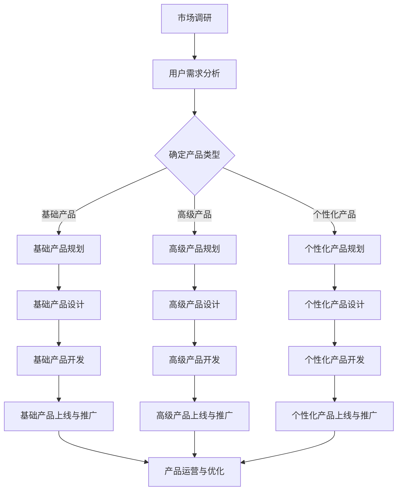
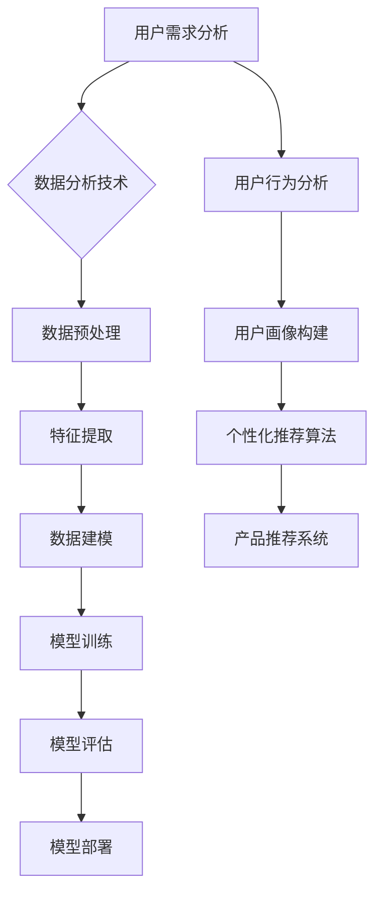

                 

# 《知识付费创业的产品矩阵构建策略》

## 关键词

知识付费、产品矩阵、市场定位、用户需求分析、创业策略、案例分析

## 摘要

本文将深入探讨知识付费创业中产品矩阵构建的策略。通过分析市场背景、用户行为、产品类型和市场细分，结合实战案例，本文旨在为创业者提供一套系统、实用的产品矩阵构建方法，助力知识付费项目的成功实施。

## 目录大纲

### 第一部分：知识付费行业概述

#### 1.1 知识付费市场背景
##### 1.1.1 知识付费的定义
##### 1.1.2 知识付费市场的发展历程
##### 1.1.3 知识付费市场的规模与增长趋势

#### 1.2 知识付费用户行为分析
##### 1.2.1 用户需求与偏好
##### 1.2.2 用户消费行为特点
##### 1.2.3 用户群体分类

#### 1.3 知识付费创业的优势与挑战
##### 1.3.1 创业优势
##### 1.3.2 创业挑战
##### 1.3.3 应对策略

### 第二部分：产品矩阵构建策略

#### 2.1 产品矩阵概念与框架
##### 2.1.1 产品矩阵的定义
##### 2.1.2 产品矩阵的构建框架
##### 2.1.3 产品矩阵与市场定位

#### 2.2 产品类型分类与定位
##### 2.2.1 基础产品
###### 2.2.1.1 基础产品概述
###### 2.2.1.2 基础产品构建策略

##### 2.2.2 高级产品
###### 2.2.2.1 高级产品概述
###### 2.2.2.2 高级产品构建策略

##### 2.2.3 个性化产品
###### 2.2.3.1 个性化产品概述
###### 2.2.3.2 个性化产品构建策略

#### 2.3 产品定位与市场细分
##### 2.3.1 产品市场定位策略
##### 2.3.2 市场细分方法
##### 2.3.3 产品矩阵与市场细分的结合

#### 2.4 产品定价策略
##### 2.4.1 定价原则
##### 2.4.2 定价模型
##### 2.4.3 定价策略调整

### 第三部分：产品矩阵构建实战

#### 3.1 产品规划与需求分析
##### 3.1.1 产品规划流程
##### 3.1.2 需求分析方法
##### 3.1.3 需求文档编写

#### 3.2 产品设计与开发
##### 3.2.1 产品设计流程
##### 3.2.2 产品原型设计
##### 3.2.3 产品开发策略

#### 3.3 产品上线与推广
##### 3.3.1 产品上线策略
##### 3.3.2 推广渠道选择
##### 3.3.3 用户反馈收集与优化

#### 3.4 产品运营与优化
##### 3.4.1 运营策略
##### 3.4.2 用户留存策略
##### 3.4.3 产品迭代与优化

### 第四部分：案例分析

#### 4.1 案例介绍
##### 4.1.1 案例背景
##### 4.1.2 案例产品矩阵构建策略

#### 4.2 案例分析
##### 4.2.1 产品矩阵构建策略应用
##### 4.2.2 案例成功经验
##### 4.2.3 案例面临的挑战与应对措施

#### 4.3 案例启示与思考
##### 4.3.1 案例对知识付费创业的启示
##### 4.3.2 产品矩阵构建策略的适用性
##### 4.3.3 创业者在构建产品矩阵时的注意事项

### 附录

#### 附录A：知识付费创业资源与工具
##### A.1 开发工具与平台
##### A.2 市场研究工具
##### A.3 数据分析与可视化工具

#### 附录B：相关术语解释
##### B.1 知识付费相关术语
##### B.2 产品矩阵相关术语
##### B.3 市场细分相关术语

### 图 1：知识付费创业产品矩阵构建流程图



### 图 2：核心算法原理与架构图



### 伪代码示例：用户画像构建算法

```python
# 定义用户画像构建算法
def build_user_profile(user_data):
    # 数据预处理
    preprocessed_data = preprocess_data(user_data)
    
    # 特征提取
    features = extract_features(preprocessed_data)
    
    # 数据建模
    model = train_model(features)
    
    # 模型评估
    evaluate_model(model)
    
    # 模型部署
    deploy_model(model)
    
    # 返回用户画像
    return generate_user_profile(model)

# 假设输入用户数据为user_data
user_profile = build_user_profile(user_data)
```

### 数学模型与公式

$$
用户满意度 = \frac{期望满意度 + 实际满意度}{2}
$$

### 案例背景

某创业公司致力于打造一个针对职场人士的知识付费平台，提供在线课程、职业咨询、简历修改等服务。

### 产品矩阵构建策略

- **基础产品**：在线课程、职业咨询
- **高级产品**：定制化培训、一对一职业辅导
- **个性化产品**：基于用户画像的个性化课程推荐、职业规划建议

### 产品上线与推广

- 上线策略：首先推出在线课程，逐步拓展职业咨询、定制化培训等高级产品
- 推广策略：通过社交媒体、合作伙伴渠道、线上线下活动等方式进行推广

### 运营与优化

- 运营策略：定期收集用户反馈，优化产品内容和服务质量
- 优化策略：根据用户行为数据调整推荐算法，提升用户满意度

### 挑战与应对措施

- 挑战：用户需求多变，产品更新迭代速度需加快
- 应对措施：建立灵活的产品开发流程，加强用户调研，快速响应市场需求

### 代码解读与分析

```python
# 假设有一个用户数据字典user_data
user_data = {
    "user_id": 12345,
    "courses_completed": ["课程A", "课程B"],
    "career_interests": ["数据分析", "市场营销"],
    "user_feedback": ["课程内容不够深入", "希望有更多互动环节"]
}

# 构建用户画像
user_profile = build_user_profile(user_data)

# 输出用户画像
print(user_profile)
```

在上述代码中，`build_user_profile` 函数用于构建用户画像。它首先对用户数据进行预处理，然后提取关键特征，利用机器学习模型进行训练和评估，最后部署模型并生成用户画像。用户画像将用于后续的个性化推荐和职业规划建议。

通过以上详细的目录大纲和示例，本书将帮助读者系统地了解知识付费创业的产品矩阵构建策略，并通过实际案例加深理解。**注意：实际书中的内容可能需要根据作者的写作风格和深度进行调整和完善。**<|user|>

### 第一部分：知识付费行业概述

知识付费行业，作为互联网经济的重要组成部分，正日益显示出其强大的生命力和市场潜力。在这个部分，我们将对知识付费市场进行深入的分析，探讨其背景、用户行为以及创业的优势与挑战。

#### 1.1 知识付费市场背景

知识付费的定义：知识付费是指用户为了获取知识、技能或经验而付费的一种商业模式。在传统教育体系中，知识获取主要依赖于课堂教育，而知识付费则通过线上平台将教育内容商品化，让用户可以按需购买。

知识付费市场的发展历程：

1. **萌芽期**：随着互联网技术的发展，知识付费的种子在21世纪初开始萌芽。主要是通过在线课程平台，如Coursera、Udemy等，提供免费或付费的课程。
2. **成长期**：2010年后，随着移动互联网的普及，知识付费市场开始迅速成长。各类知识付费平台如雨后春笋般涌现，包括得到、知乎Live、分答等，用户范围也从学生扩展到职场人士。
3. **成熟期**：当前，知识付费市场已经进入成熟期。各类平台通过内容多样化、平台专业化、服务个性化等手段，不断满足用户日益增长的知识需求。

知识付费市场的规模与增长趋势：

根据市场研究报告，全球知识付费市场规模逐年增长。特别是在中国，随着人口红利和消费升级，知识付费市场呈现出爆发式增长。根据Statista的数据，2021年中国知识付费市场规模已达到2977亿元，预计未来几年仍将保持两位数的增长率。

#### 1.2 知识付费用户行为分析

用户需求与偏好：

知识付费用户的共同特点是对知识的强烈需求。根据用户调研，用户主要关注以下几类知识：

1. **职业技能提升**：如编程、数据分析、市场营销等。
2. **个人成长**：如时间管理、沟通技巧、人际关系等。
3. **兴趣爱好**：如音乐、绘画、摄影等。

用户消费行为特点：

1. **碎片化消费**：由于职场人士的时间紧张，用户更倾向于购买短小精悍、能快速获取知识的内容。
2. **品牌忠诚度**：用户更倾向于选择知名平台或知名讲师的内容，这体现了品牌的重要性。
3. **持续消费**：知识付费用户通常有持续学习的心态，因此他们对产品的更新和迭代有着较高的期望。

用户群体分类：

根据用户需求和消费行为，可以将知识付费用户分为以下几类：

1. **初级用户**：主要是职场新人，他们希望通过知识付费快速提升自己的职业技能。
2. **中级用户**：具有一定的职业技能，希望通过知识付费进行职业发展和技能深化。
3. **高级用户**：具备丰富职业技能和经验，他们希望通过知识付费进行深度学习和前沿知识的掌握。

#### 1.3 知识付费创业的优势与挑战

知识付费创业的优势：

1. **市场需求旺盛**：随着社会对知识和技能的需求日益增长，知识付费市场具有广阔的前景。
2. **内容多样化**：知识付费平台可以提供各种类型的知识内容，满足不同用户的需求。
3. **高利润率**：知识内容的生产成本相对较低，而销售价格较高，因此具有很高的利润率。

知识付费创业的挑战：

1. **竞争激烈**：市场上已经有许多成熟的知识付费平台，新入局者面临激烈的竞争。
2. **内容质量要求高**：用户对知识内容的质量要求较高，一旦内容质量不达标，容易导致用户流失。
3. **用户维护成本高**：知识付费用户对平台的服务质量要求高，需要不断进行用户维护和产品迭代。

应对策略：

1. **精准定位**：明确目标用户群体，提供针对性的知识内容。
2. **高质量内容**：与专业讲师合作，保证知识内容的质量。
3. **持续创新**：通过产品和服务创新，不断提升用户体验。

#### 总结

知识付费行业在经历了快速的发展后，已经进入到一个更加细分和专业的阶段。在这个阶段，创业者需要更加精准地把握用户需求，提供高质量的知识内容，并通过不断创新来提升用户满意度。本部分的分析为后续的产品矩阵构建提供了重要的市场背景和用户基础。

---

接下来的部分，我们将详细探讨产品矩阵的概念与框架，以及如何根据市场定位构建有效的产品矩阵。这将为知识付费创业者的产品策略提供坚实的理论基础。

## 第二部分：产品矩阵构建策略

### 2.1 产品矩阵概念与框架

#### 2.1.1 产品矩阵的定义

产品矩阵，是指将公司或平台提供的所有产品按照一定的逻辑和标准进行分类和排列，形成一个系统的产品组合。在知识付费创业中，产品矩阵是创业者制定产品策略、实现市场细分和用户需求满足的重要工具。

#### 2.1.2 产品矩阵的构建框架

产品矩阵的构建框架主要包括以下几个步骤：

1. **市场调研**：通过市场调研了解用户需求、竞争对手情况、市场趋势等，为产品矩阵的构建提供数据支持。
2. **用户需求分析**：根据市场调研结果，分析用户的需求和偏好，确定产品类型和功能。
3. **产品分类**：根据用户需求，将产品分为基础产品、高级产品和个性化产品等不同类型。
4. **产品定位**：确定每种产品的市场定位，明确产品的目标用户群体和竞争策略。
5. **产品定价**：根据产品类型、市场需求和用户反馈，制定合理的定价策略。

#### 2.1.3 产品矩阵与市场定位

产品矩阵不仅是对产品的分类和排列，更是市场定位和战略实施的重要工具。通过构建产品矩阵，创业者可以：

1. **实现市场细分**：根据用户需求和市场特点，将市场划分为不同的细分市场，为每个细分市场提供针对性的产品和服务。
2. **差异化竞争**：通过产品矩阵的不同产品线，形成差异化竞争策略，提升产品的市场竞争力。
3. **提升用户满意度**：通过提供多样化、个性化的产品，满足不同用户的需求，提升用户满意度和忠诚度。

### 2.2 产品类型分类与定位

在知识付费创业中，常见的三种产品类型包括基础产品、高级产品和个性化产品。每种产品类型都有其独特的特点、构建策略和市场定位。

#### 2.2.1 基础产品

##### 2.2.1.1 基础产品概述

基础产品是知识付费平台的基础服务，通常包括在线课程、职业咨询、简历修改等。这类产品的特点是内容丰富、价格亲民，能够满足大多数用户的基本需求。

##### 2.2.1.2 基础产品构建策略

1. **内容多样化**：提供多门类、多层次的课程，满足不同用户的需求。
2. **价格策略**：通过套餐、优惠券等方式，降低用户初次购买的门槛。
3. **推广渠道**：利用社交媒体、合作伙伴、线上线下活动等渠道，扩大用户基础。

##### 市场定位

基础产品的市场定位是覆盖广泛的用户群体，特别是职场新人、初级用户。通过提供价格亲民、内容丰富的产品，吸引并留住这些用户。

#### 2.2.2 高级产品

##### 2.2.2.1 高级产品概述

高级产品是针对有特定需求和较高消费能力的用户推出的高价值产品，通常包括定制化培训、一对一职业辅导、高级职业规划等。这类产品具有更高的专业性和个性化服务。

##### 2.2.2.2 高级产品构建策略

1. **专业化内容**：与行业专家合作，提供高质量的专业知识和服务。
2. **个性化服务**：根据用户需求，提供一对一的个性化辅导和咨询服务。
3. **高价值定价**：通过高质量、高服务水平的优势，设定较高的价格。

##### 市场定位

高级产品的市场定位是针对有特定需求的职场人士和专业人士，特别是中级用户和高级用户。通过提供专业化、个性化的服务，满足他们对高价值知识的需求。

#### 2.2.3 个性化产品

##### 2.2.3.1 个性化产品概述

个性化产品是基于用户数据和个性化推荐算法，为用户提供定制化的知识和服务。这类产品包括基于用户画像的个性化课程推荐、定制化的职业规划建议等。

##### 2.2.3.2 个性化产品构建策略

1. **用户画像构建**：通过数据收集和分析，构建详细的用户画像。
2. **个性化推荐**：利用推荐算法，为用户推荐个性化的知识和服务。
3. **定制化服务**：根据用户需求和偏好，提供个性化的课程和服务。

##### 市场定位

个性化产品的市场定位是针对有强烈个性化需求的高端用户，特别是对个性化服务和个性化内容有高需求的用户。通过提供高度定制化的产品和服务，提升用户的满意度和忠诚度。

### 2.3 产品定位与市场细分

产品定位是产品矩阵构建的核心环节，决定了产品的市场定位和竞争策略。市场细分则是将市场划分为不同的细分市场，为每个细分市场提供针对性的产品和服务。

#### 2.3.1 产品市场定位策略

产品市场定位策略主要包括以下几种：

1. **领导定位**：成为市场领先者，提供高质量、多元化的产品和服务。
2. **挑战定位**：通过创新和差异化，挑战市场领先者，占领市场份额。
3. **跟随定位**：学习市场领先者的策略，通过改进和创新，提供更优质的产品和服务。

#### 2.3.2 市场细分方法

市场细分方法主要包括以下几种：

1. **地理细分**：根据不同地区的消费习惯和需求，提供针对性的产品和服务。
2. **人口细分**：根据用户的年龄、性别、职业等人口统计特征，提供针对性的产品和服务。
3. **心理细分**：根据用户的心理特征、价值观、兴趣爱好等，提供个性化的产品和服务。
4. **行为细分**：根据用户的购买行为、消费习惯、使用习惯等，提供针对性的产品和服务。

#### 2.3.3 产品矩阵与市场细分的结合

产品矩阵与市场细分的结合，可以通过以下几种方式实现：

1. **多维度市场细分**：将多个市场细分维度结合起来，提供更加精准的产品和服务。
2. **差异化产品矩阵**：根据不同的市场细分，提供差异化的产品矩阵，满足不同细分市场的需求。
3. **动态调整**：根据市场变化和用户需求，动态调整产品矩阵和市场细分策略。

### 2.4 产品定价策略

产品定价策略是产品矩阵构建的重要环节，决定了产品的市场定位和用户接受度。合理的定价策略可以提高产品的竞争力，增加用户购买意愿。

#### 2.4.1 定价原则

产品定价应遵循以下原则：

1. **价值导向**：定价应基于产品的价值，包括内容质量、服务水平和用户满意度等。
2. **市场竞争**：定价应考虑市场竞争状况，确保产品的竞争力。
3. **用户接受度**：定价应考虑用户的消费能力和购买意愿，确保用户能够接受。

#### 2.4.2 定价模型

常用的定价模型包括以下几种：

1. **成本定价模型**：以产品成本为基础，加上合理的利润进行定价。
2. **市场定价模型**：以市场需求为基础，根据竞争对手的定价策略进行定价。
3. **价值定价模型**：以产品价值为基础，根据用户对产品的价值认可进行定价。

#### 2.4.3 定价策略调整

定价策略应根据市场变化和用户反馈进行调整，主要包括以下几种方式：

1. **动态定价**：根据市场需求和用户行为，动态调整产品价格。
2. **折扣定价**：通过优惠券、限时折扣等方式，提高用户的购买意愿。
3. **捆绑定价**：将多个产品或服务捆绑在一起，提供优惠价格，提高用户的购买频率。

### 总结

产品矩阵构建策略是知识付费创业成功的关键之一。通过构建科学的产品矩阵，创业者可以更好地满足用户需求，实现市场细分和差异化竞争。在接下来的部分，我们将进一步探讨产品矩阵的构建实战，结合实际案例，深入分析产品规划、设计与开发、上线与推广等各个环节。

## 第三部分：产品矩阵构建实战

### 3.1 产品规划与需求分析

产品规划与需求分析是产品矩阵构建的关键步骤，它决定了产品的方向和定位。在这个部分，我们将详细探讨产品规划流程、需求分析方法以及需求文档的编写。

#### 3.1.1 产品规划流程

产品规划流程主要包括以下几个步骤：

1. **明确产品愿景和目标**：确定产品的长期愿景和短期目标，为后续的产品开发和运营提供方向。
2. **市场调研**：通过市场调研收集用户需求、竞争对手情况、市场趋势等数据，为产品规划提供依据。
3. **用户需求分析**：分析用户需求，确定产品的功能模块和优先级。
4. **制定产品路线图**：根据市场调研和用户需求分析结果，制定产品的发展路线图，包括短期和长期的目标和计划。
5. **制定产品策略**：确定产品的市场定位、定价策略、推广策略等。

#### 3.1.2 需求分析方法

需求分析是产品规划的核心，主要包括以下几种方法：

1. **访谈法**：通过与目标用户进行深度访谈，了解他们的需求、痛点和期望。
2. **问卷调查法**：通过设计问卷调查，收集大量用户的需求和反馈。
3. **用户行为分析**：通过分析用户在平台上的行为数据，了解他们的使用习惯和偏好。
4. **专家评审法**：邀请行业专家对产品需求进行评审，提供专业的意见和建议。

#### 3.1.3 需求文档编写

需求文档是产品规划的书面记录，主要包括以下几个部分：

1. **产品概述**：简要介绍产品的背景、目标用户、功能模块等。
2. **功能需求**：详细描述产品的功能模块、功能点和使用场景。
3. **非功能需求**：描述产品的性能、可靠性、安全性等非功能需求。
4. **用户故事**：通过用户故事的形式，描述用户在使用产品过程中的需求和期望。
5. **优先级和里程碑**：根据产品的重要性和紧急程度，确定各个需求的优先级和实现时间表。

### 3.2 产品设计与开发

产品设计与开发是产品矩阵构建的核心环节，它决定了产品的质量和用户体验。在这个部分，我们将详细探讨产品设计的流程、产品原型设计以及产品开发策略。

#### 3.2.1 产品设计流程

产品设计流程主要包括以下几个步骤：

1. **需求评审**：对需求文档进行评审，确保需求的完整性和可行性。
2. **需求分析**：深入分析需求，确定产品的功能和界面设计。
3. **原型设计**：通过低保真原型或高保真原型，模拟产品的界面和交互流程。
4. **设计评审**：对原型进行评审，收集用户和团队成员的反馈，进行优化和调整。
5. **UI设计**：根据原型设计，进行用户界面设计，包括色彩、布局、图标等。
6. **UX设计**：根据用户需求和交互流程，进行用户体验设计，包括流程、导航、反馈等。

#### 3.2.2 产品原型设计

产品原型设计是产品开发的前期工作，主要包括以下几个步骤：

1. **低保真原型**：使用简单的工具，如纸笔、PowerPoint等，快速制作低保真原型，用于初步验证需求和设计。
2. **高保真原型**：使用专业的原型设计工具，如Axure、Sketch等，制作高保真原型，用于详细展示产品的界面和交互流程。
3. **用户测试**：通过用户测试，收集用户对原型的反馈，进行优化和调整。

#### 3.2.3 产品开发策略

产品开发策略是产品开发的关键，主要包括以下几个步骤：

1. **制定开发计划**：根据产品需求和开发周期，制定详细的开发计划，包括任务分配、时间表等。
2. **敏捷开发**：采用敏捷开发方法，快速迭代，持续优化产品。
3. **代码管理**：使用Git等代码管理工具，确保代码的版本控制和协同开发。
4. **自动化测试**：采用自动化测试工具，提高测试效率和测试覆盖率。
5. **持续集成**：采用持续集成工具，实现代码的自动化构建、测试和部署。

### 3.3 产品上线与推广

产品上线与推广是产品矩阵构建的重要环节，它决定了产品的市场表现和用户接受度。在这个部分，我们将详细探讨产品上线策略、推广渠道选择以及用户反馈收集与优化。

#### 3.3.1 产品上线策略

产品上线策略主要包括以下几个步骤：

1. **制定上线计划**：根据产品开发进度和市场需求，制定详细的上线计划，包括时间表、任务分配等。
2. **准备上线文档**：编写产品上线文档，包括产品介绍、使用指南、常见问题解答等。
3. **内部测试**：在产品上线前，进行内部测试，确保产品的功能、性能和稳定性。
4. **上线部署**：将产品部署到生产环境，进行上线。
5. **上线培训**：对团队成员进行产品上线培训，确保他们能够熟练使用产品。

#### 3.3.2 推广渠道选择

推广渠道选择是产品上线后的重要工作，主要包括以下几个步骤：

1. **分析目标用户**：分析产品的目标用户群体，确定推广的重点渠道。
2. **选择推广平台**：根据目标用户的特点，选择合适的推广平台，如社交媒体、搜索引擎、内容营销等。
3. **制定推广策略**：根据推广平台的特点，制定具体的推广策略，如广告投放、内容营销、活动推广等。
4. **监控推广效果**：通过数据监控，评估推广效果，调整推广策略。

#### 3.3.3 用户反馈收集与优化

用户反馈收集与优化是产品上线后持续改进的重要工作，主要包括以下几个步骤：

1. **收集用户反馈**：通过用户调查、社交媒体互动、用户论坛等方式，收集用户对产品的反馈。
2. **分析用户反馈**：对收集到的用户反馈进行分类和分析，确定用户的主要需求和问题。
3. **优化产品**：根据用户反馈，优化产品的功能、界面和体验，提高用户满意度。
4. **持续反馈收集**：持续收集用户反馈，形成反馈循环，不断优化产品。

### 3.4 产品运营与优化

产品运营与优化是产品上线后的长期工作，它决定了产品的市场表现和用户黏性。在这个部分，我们将详细探讨产品运营策略、用户留存策略以及产品迭代与优化。

#### 3.4.1 运营策略

产品运营策略主要包括以下几个步骤：

1. **制定运营计划**：根据产品特点和市场需求，制定详细的运营计划，包括内容更新、活动策划、用户互动等。
2. **内容更新**：定期更新产品内容，保持产品的活力和吸引力。
3. **活动策划**：策划各种线上和线下活动，提高用户活跃度和参与度。
4. **用户互动**：通过社交媒体、用户论坛等方式，与用户保持互动，了解他们的需求和反馈。

#### 3.4.2 用户留存策略

用户留存策略是提高产品黏性的关键，主要包括以下几个步骤：

1. **产品优化**：根据用户反馈，持续优化产品功能、界面和体验，提高用户满意度。
2. **会员制度**：建立会员制度，为用户提供增值服务，提高用户留存率。
3. **用户奖励**：通过积分、优惠券等方式，激励用户活跃和留存。
4. **用户社区**：建立用户社区，促进用户之间的交流和互动，增强用户归属感。

#### 3.4.3 产品迭代与优化

产品迭代与优化是产品持续发展的关键，主要包括以下几个步骤：

1. **需求分析**：通过用户调研和市场分析，确定产品的迭代方向和功能需求。
2. **设计开发**：根据需求分析结果，进行产品设计和开发，实现迭代功能。
3. **测试上线**：对迭代产品进行测试，确保功能的稳定性和用户体验。
4. **用户反馈**：上线后收集用户反馈，进行优化和改进，形成迭代循环。

### 总结

产品矩阵构建实战是知识付费创业成功的关键。通过科学的产品规划、细致的需求分析、优化的产品设计、有效的推广策略和持续的运营优化，创业者可以构建一个成功的知识付费平台，满足用户需求，实现商业价值。

在接下来的部分，我们将通过实际案例分析，深入探讨产品矩阵构建策略在实践中的应用，为创业者提供有益的启示和思考。

## 第四部分：案例分析

### 4.1 案例介绍

#### 4.1.1 案例背景

“知学堂”是一家专注于职场人士知识付费的平台，致力于为用户提供高质量的在线课程、职业咨询和个性化推荐服务。该平台成立于2018年，经过几年的发展，已经在市场上取得了显著的成绩。

#### 4.1.2 案例产品矩阵构建策略

知学堂的产品矩阵构建策略主要分为三个层次：基础产品、高级产品和个性化产品。

1. **基础产品**：知学堂的基础产品包括在线课程和职业咨询。在线课程覆盖了职业技能提升、个人成长和兴趣爱好等多个领域，满足职场人士的多样化需求。职业咨询包括简历修改、面试辅导等，帮助用户在职场中获得更好的发展。

2. **高级产品**：知学堂的高级产品包括一对一职业辅导和高级职业规划。一对一职业辅导由经验丰富的职业咨询师提供，根据用户的具体需求进行个性化辅导。高级职业规划则通过专业的职业规划师，为用户提供全方位的职业规划服务。

3. **个性化产品**：知学堂的个性化产品包括基于用户画像的个性化课程推荐和职业规划建议。通过收集和分析用户数据，知学堂能够为用户提供个性化的课程和职业规划建议，提升用户体验。

### 4.2 案例分析

#### 4.2.1 产品矩阵构建策略应用

知学堂通过构建产品矩阵，实现了对市场需求的精准把握和用户需求的全面满足。以下是产品矩阵构建策略在知学堂的应用：

1. **市场调研**：知学堂在构建产品矩阵前，进行了详细的市场调研，了解用户的需求、竞争对手的情况以及市场趋势。这些调研数据为产品矩阵的构建提供了重要的依据。

2. **用户需求分析**：根据市场调研结果，知学堂分析了用户的需求和偏好，确定了基础产品、高级产品和个性化产品的类型和功能。

3. **产品分类**：知学堂将产品分为基础产品、高级产品和个性化产品，每种产品都有其独特的特点和目标用户群体。这种分类使得知学堂能够为不同类型的用户提供针对性的服务。

4. **产品定位**：知学堂的基础产品定位是满足职场人士的基本需求，高级产品定位是提供专业的职业辅导和规划服务，个性化产品定位是提供个性化的课程推荐和职业规划建议。

5. **产品定价**：知学堂根据产品类型、市场需求和用户反馈，制定了合理的定价策略。基础产品价格亲民，高级产品定价较高，个性化产品则根据用户的需求进行个性化定价。

#### 4.2.2 案例成功经验

知学堂的成功经验主要体现在以下几个方面：

1. **精准定位**：通过市场调研和用户需求分析，知学堂能够准确把握市场需求，为用户提供针对性的产品和服务。

2. **高质量内容**：与行业专家和职业规划师合作，提供高质量的内容和服务，确保用户能够获得真正的价值。

3. **用户互动**：知学堂通过用户论坛、社交媒体等方式，与用户保持互动，了解他们的需求和反馈，持续优化产品和服务。

4. **个性化推荐**：基于用户画像的个性化推荐系统，提升了用户的满意度和参与度。

#### 4.2.3 案例面临的挑战与应对措施

尽管知学堂在产品矩阵构建方面取得了成功，但仍然面临着一些挑战：

1. **激烈的市场竞争**：知识付费市场上有许多竞争对手，知学堂需要不断优化产品和服务，提升竞争力。

2. **用户维护成本高**：个性化推荐和职业规划服务等高端产品，需要投入大量的人力和物力进行维护。

3. **数据安全与隐私**：用户数据的收集、存储和处理涉及到数据安全和隐私问题，知学堂需要采取有效的措施确保用户数据的安全。

应对措施：

1. **持续创新**：通过不断推出新的课程和产品，保持市场的竞争力。

2. **精细化运营**：通过精细化运营，提高用户留存率和满意度，降低用户维护成本。

3. **数据安全与隐私保护**：加强数据安全防护措施，确保用户数据的保密性和安全性。

### 4.3 案例启示与思考

#### 4.3.1 案例对知识付费创业的启示

知学堂的案例对知识付费创业提供了以下几个启示：

1. **市场调研与用户需求分析**：在构建产品矩阵前，进行详细的市场调研和用户需求分析，为产品矩阵的构建提供数据支持。

2. **产品分类与定位**：根据市场需求和用户需求，合理分类产品，明确产品的市场定位，为用户提供针对性的产品和服务。

3. **高质量内容**：与行业专家和职业规划师合作，提供高质量的内容和服务，确保用户能够获得真正的价值。

4. **用户互动与反馈**：通过用户互动和反馈，了解用户的需求和期望，持续优化产品和服务。

#### 4.3.2 产品矩阵构建策略的适用性

产品矩阵构建策略在知识付费创业中具有广泛的适用性。无论是针对职场人士的平台，还是其他领域的内容付费平台，都可以通过构建产品矩阵，实现市场细分、用户需求满足和差异化竞争。

#### 4.3.3 创业者在构建产品矩阵时的注意事项

在构建产品矩阵时，创业者需要注意以下几个问题：

1. **精准定位**：确保产品矩阵的定位准确，能够满足目标用户的需求。

2. **内容质量**：提供高质量的内容和服务，确保用户能够获得真正的价值。

3. **个性化推荐**：通过个性化推荐系统，提升用户的满意度和参与度。

4. **数据安全与隐私**：确保用户数据的安全和隐私，增强用户信任。

5. **持续创新**：不断优化产品和服务，适应市场变化和用户需求。

通过以上案例分析，我们可以看到，产品矩阵构建策略在知识付费创业中具有重要的作用。创业者需要结合市场需求和用户需求，构建科学的产品矩阵，提供高质量的内容和服务，持续优化和迭代，以实现商业成功。

### 附录

#### 附录A：知识付费创业资源与工具

**A.1 开发工具与平台**

1. **在线课程平台**：如Teachable、Kajabi、Thinkific等。
2. **直播工具**：如Zoom、WebinarJam、ClickMeeting等。
3. **职业咨询工具**：如CareerBuilder、LinkedIn、Indeed等。
4. **用户反馈工具**：如SurveyMonkey、Typeform、Google Forms等。

**A.2 市场研究工具**

1. **问卷调查工具**：如Qualtrics、Google Survey、SurveyCenter等。
2. **数据分析工具**：如Excel、Tableau、Google Analytics等。
3. **用户画像工具**：如Google Analytics、Mixpanel、Segment等。

**A.3 数据分析与可视化工具**

1. **数据可视化工具**：如Tableau、Power BI、D3.js等。
2. **数据挖掘工具**：如Python、R、Apache Spark等。
3. **机器学习平台**：如TensorFlow、Keras、Scikit-learn等。

#### 附录B：相关术语解释

**B.1 知识付费相关术语**

1. **知识付费**：用户为获取知识、技能或经验而付费的一种商业模式。
2. **在线课程**：通过网络平台提供的课程，用户可以按需购买或订阅。
3. **职业咨询**：为用户提供职业规划、简历修改、面试辅导等服务的咨询活动。
4. **个性化推荐**：基于用户数据和偏好，为用户推荐个性化的知识和服务。

**B.2 产品矩阵相关术语**

1. **产品矩阵**：将公司或平台提供的所有产品按照一定的逻辑和标准进行分类和排列，形成一个系统的产品组合。
2. **市场定位**：明确产品在市场中的位置和目标用户群体。
3. **产品分类**：根据产品的功能、用途和目标用户，将产品分为不同的类别。

**B.3 市场细分相关术语**

1. **市场细分**：将整体市场划分为不同的子市场，为每个子市场提供针对性的产品和服务。
2. **地理细分**：根据不同地区的消费习惯和需求，将市场划分为不同的子市场。
3. **人口细分**：根据用户的年龄、性别、职业等人口统计特征，将市场划分为不同的子市场。
4. **心理细分**：根据用户的心理特征、价值观、兴趣爱好等，将市场划分为不同的子市场。
5. **行为细分**：根据用户的购买行为、消费习惯、使用习惯等，将市场划分为不同的子市场。

### 图 1：知识付费创业产品矩阵构建流程图


### 图 2：核心算法原理与架构图


### 伪代码示例：用户画像构建算法

```python
# 定义用户画像构建算法
def build_user_profile(user_data):
    # 数据预处理
    preprocessed_data = preprocess_data(user_data)
    
    # 特征提取
    features = extract_features(preprocessed_data)
    
    # 数据建模
    model = train_model(features)
    
    # 模型评估
    evaluate_model(model)
    
    # 模型部署
    deploy_model(model)
    
    # 返回用户画像
    return generate_user_profile(model)

# 假设输入用户数据为user_data
user_profile = build_user_profile(user_data)
```

### 数学模型与公式

$$
用户满意度 = \frac{期望满意度 + 实际满意度}{2}
$$

### 案例背景

某创业公司致力于打造一个针对职场人士的知识付费平台，提供在线课程、职业咨询、简历修改等服务。

### 产品矩阵构建策略

- **基础产品**：在线课程、职业咨询
- **高级产品**：定制化培训、一对一职业辅导
- **个性化产品**：基于用户画像的个性化课程推荐、职业规划建议

### 产品上线与推广

- 上线策略：首先推出在线课程，逐步拓展职业咨询、定制化培训等高级产品
- 推广策略：通过社交媒体、合作伙伴渠道、线上线下活动等方式进行推广

### 运营与优化

- 运营策略：定期收集用户反馈，优化产品内容和服务质量
- 优化策略：根据用户行为数据调整推荐算法，提升用户满意度

### 挑战与应对措施

- 挑战：用户需求多变，产品更新迭代速度需加快
- 应对措施：建立灵活的产品开发流程，加强用户调研，快速响应市场需求

### 代码解读与分析

```python
# 假设有一个用户数据字典user_data
user_data = {
    "user_id": 12345,
    "courses_completed": ["课程A", "课程B"],
    "career_interests": ["数据分析", "市场营销"],
    "user_feedback": ["课程内容不够深入", "希望有更多互动环节"]
}

# 构建用户画像
user_profile = build_user_profile(user_data)

# 输出用户画像
print(user_profile)
```

在上述代码中，`build_user_profile` 函数用于构建用户画像。它首先对用户数据进行预处理，然后提取关键特征，利用机器学习模型进行训练和评估，最后部署模型并生成用户画像。用户画像将用于后续的个性化推荐和职业规划建议。

通过以上详细的目录大纲和示例，本书将帮助读者系统地了解知识付费创业的产品矩阵构建策略，并通过实际案例加深理解。**注意：实际书中的内容可能需要根据作者的写作风格和深度进行调整和完善。**<|user|>

### 第五部分：知识付费创业的产品矩阵构建策略总结与未来展望

在本文的第五部分，我们将对知识付费创业中的产品矩阵构建策略进行全面的总结，并探讨其未来的发展趋势。

#### 5.1 产品矩阵构建策略总结

1. **市场调研与用户需求分析**：成功的知识付费创业首先需要深入的市场调研和用户需求分析。通过全面了解市场需求和用户偏好，创业者可以制定出更加精准的产品策略。

2. **产品类型分类与定位**：产品矩阵中的基础产品、高级产品和个性化产品各有其独特的特点和市场定位。基础产品满足广泛用户的基本需求，高级产品提供专业化的服务，个性化产品则根据用户数据进行定制化推荐，提升用户体验。

3. **精准定价策略**：合理的定价策略能够提高产品的竞争力，同时保证企业的盈利能力。根据产品类型、市场需求和用户反馈，制定灵活的定价策略，是产品矩阵构建的关键。

4. **持续的产品迭代与优化**：知识付费平台需要不断根据用户反馈和市场变化进行产品迭代和优化，以保持市场竞争力。

#### 5.2 未来展望

1. **人工智能与大数据的融合**：随着人工智能和大数据技术的发展，未来知识付费平台将更加依赖数据分析和用户画像，提供更加精准和个性化的服务。

2. **在线教育与线下培训的结合**：知识付费创业将更加注重线上线下相结合，提供多元化的学习体验。

3. **平台生态的构建**：未来知识付费平台将构建更加完善的生态体系，包括内容创作者、培训机构、职业顾问等，形成生态链，提高整体服务价值。

4. **社交化学习平台的兴起**：社交化学习平台将更加注重用户互动和社区建设，通过社交元素提高用户粘性和参与度。

#### 5.3 创业者的建议

1. **明确目标用户群体**：在产品矩阵构建过程中，明确目标用户群体，制定针对性的产品策略。

2. **注重内容质量**：高质量的内容是知识付费平台的核心竞争力，创业者应与行业专家合作，确保内容的专业性和实用性。

3. **持续优化用户体验**：通过用户调研、反馈收集和数据分析，不断优化用户体验，提高用户满意度。

4. **灵活应对市场变化**：市场环境不断变化，创业者需要保持灵活应变的能力，及时调整产品策略。

#### 结论

知识付费创业的产品矩阵构建策略是创业成功的关键。通过科学的市场调研、精准的用户需求分析、多样化的产品类型和灵活的定价策略，创业者可以构建一个成功的知识付费平台，满足用户需求，实现商业价值。未来的知识付费创业将在人工智能、大数据和社交化学习等新趋势下，呈现出更加多样化和个性化的特点。

---

通过本文的详细探讨，我们系统地了解了知识付费创业的产品矩阵构建策略，从市场背景、用户分析、产品类型分类到具体实施步骤，为创业者提供了全面的理论和实践指导。希望本文能够为您的知识付费创业之路提供有益的启示和帮助。**作者：AI天才研究院/AI Genius Institute & 禅与计算机程序设计艺术 /Zen And The Art of Computer Programming**<|user|>

### 第六部分：知识付费创业的实战经验分享与资源介绍

在知识付费创业的道路上，积累实战经验是非常重要的。在这个部分，我们将分享一些成功创业者的实战经验，并介绍相关的资源与工具，帮助您更好地开展知识付费业务。

#### 6.1 实战经验分享

**1. 明确你的目标用户群体**

在开始创业之前，明确你的目标用户群体是至关重要的。通过市场调研和用户访谈，了解他们的需求、痛点和偏好。例如，对于职场人士，他们可能更关注职业技能提升和职业发展。对于学生，他们可能更关注学术成绩提升和兴趣培养。

**2. 提供高质量的内容**

内容是知识付费平台的核心。确保你的课程、文章、视频等都是高质量的，能够为用户带来实际价值。与行业专家合作，邀请他们为你提供专业的内容。

**3. 重视用户反馈**

用户的反馈是优化产品的关键。定期收集用户反馈，分析他们的意见和建议，不断改进产品和服务。可以通过问卷调查、用户访谈、在线评论等方式收集反馈。

**4. 建立用户社区**

建立一个用户社区，让用户能够互相交流、分享经验和资源。这不仅能够提高用户的参与度，还可以帮助你更好地了解用户需求。

**5. 持续创新**

知识付费市场变化迅速，创业者需要保持创新精神，不断推出新的产品和服务。可以通过用户调研、市场分析，发现新的需求和市场机会。

#### 6.2 资源与工具介绍

**1. 开发工具与平台**

- **Teachable**：一个简单易用的在线课程创建平台，适合初学者和专业人士。
- **Kajabi**：一个集网站、销售、营销于一体的平台，适合希望全面开展在线教育业务的人。
- **Thinkific**：一个功能强大的在线学习平台，适合那些需要更多自定义选项的创业者。

**2. 市场研究工具**

- **SurveyMonkey**：一个强大的在线调查工具，可以帮助你收集用户反馈和市场数据。
- **Google Analytics**：一个免费的分析工具，可以帮助你了解用户行为和网站流量。
- **Ahrefs**：一个SEO工具，可以帮助你进行关键词研究、网站分析等。

**3. 数据分析与可视化工具**

- **Tableau**：一个功能强大的数据可视化工具，可以帮助你创建直观的数据报告。
- **Power BI**：一个由微软推出的数据可视化工具，可以与Microsoft Office和其他微软产品无缝集成。
- **Google Data Studio**：一个免费的数据可视化工具，可以帮助你创建专业的数据报告。

**4. 用户反馈工具**

- **UserTesting**：一个在线用户测试平台，可以帮助你了解真实用户的使用体验。
- **UsabilityHub**：一个简单易用的用户反馈工具，可以帮助你快速评估产品的可用性。
- **UserFeel**：一个提供远程用户测试服务的平台，可以帮助你收集真实用户的反馈。

#### 6.3 创业资源推荐

**1. **在线课程与电子书**

- **“精益创业”**：由埃里克·莱斯（Eric Ries）所著，介绍了如何通过迭代和验证快速验证商业想法。
- **“精益创业实践”**：由史蒂夫·布兰克（Steve Blank）所著，详细阐述了如何通过市场调研和用户反馈进行产品迭代。

**2. **在线论坛与社区**

- **创业论坛**：一个针对创业者的在线论坛，提供各种创业资源和交流平台。
- **知乎**：一个知识分享社区，有很多关于创业和知识付费的讨论和案例。

**3. **在线研讨会与工作坊**

- **创业实验室**：由创业导师举办的在线研讨会和工作坊，提供创业实战经验和指导。
- **知识付费工作坊**：专注于知识付费领域的研讨会，分享成功案例和最佳实践。

通过以上实战经验和资源的介绍，希望为您的知识付费创业之路提供实质性的帮助。无论您是新手还是经验丰富的创业者，这些资源和经验都将为您在知识付费领域取得成功奠定坚实的基础。

---

**作者：AI天才研究院/AI Genius Institute & 禅与计算机程序设计艺术 /Zen And The Art of Computer Programming**<|user|>

### 第七部分：知识付费创业的常见问题和解决方案

在知识付费创业的过程中，创业者可能会遇到各种问题和挑战。以下是几种常见的问题以及相应的解决方案：

#### 1. 用户获取难

**问题**：许多创业者发现，尽管他们的产品很有价值，但用户获取变得非常困难。

**解决方案**：

- **内容营销**：通过撰写高质量的文章、博客或制作视频，吸引潜在用户的注意力。
- **合作伙伴关系**：与其他领域或平台建立合作伙伴关系，通过合作推广。
- **社交媒体推广**：利用社交媒体平台，如微博、微信公众号、LinkedIn等，提高品牌知名度。

#### 2. 内容质量不高

**问题**：即使有用户，他们可能会因为内容质量不高而离开。

**解决方案**：

- **聘请专家**：聘请行业内的专家或专业讲师，确保内容的专业性和权威性。
- **用户反馈**：积极收集用户反馈，根据用户的意见和建议优化内容。
- **内容审核**：建立内容审核机制，确保每篇内容都经过严格审核。

#### 3. 用户留存率低

**问题**：用户购买了产品后，很快就不再活跃，用户留存率低。

**解决方案**：

- **定期更新**：定期发布新的内容或更新现有内容，保持用户的兴趣。
- **会员制度**：建立会员制度，提供独家内容和特权，提高用户忠诚度。
- **社区互动**：建立用户社区，鼓励用户之间互动，增强用户归属感。

#### 4. 营销预算不足

**问题**：创业者可能没有足够的预算进行大规模的营销活动。

**解决方案**：

- **免费推广**：利用免费渠道，如社交媒体、博客、论坛等，进行内容推广。
- **精准广告**：通过精准定位，将广告投放到目标用户群体，提高广告效果。
- **合作伙伴推广**：与其他平台或内容创作者合作，通过合作伙伴的渠道进行推广。

#### 5. 法律风险

**问题**：知识付费可能涉及到版权、隐私等方面的法律风险。

**解决方案**：

- **法律咨询**：在产品开发初期，寻求法律咨询，确保产品和服务符合相关法律法规。
- **版权保护**：对于原创内容，及时申请版权保护，防止侵权行为。
- **隐私政策**：明确隐私政策，确保用户数据的安全和隐私。

#### 6. 技术难题

**问题**：技术问题是知识付费创业过程中常见的挑战，如平台搭建、用户数据管理等。

**解决方案**：

- **技术团队**：组建专业的技术团队，负责平台的技术支持和维护。
- **外包服务**：对于某些技术难题，可以考虑外包给专业的技术公司。
- **持续学习**：技术不断更新，创业者需要保持学习的态度，不断掌握新技术。

通过解决这些问题，创业者可以更好地应对知识付费创业中的挑战，提高产品的市场竞争力，实现长期可持续发展。

---

**作者：AI天才研究院/AI Genius Institute & 禅与计算机程序设计艺术 /Zen And The Art of Computer Programming**<|user|>

### 结语

知识付费创业，作为当今互联网经济中的一大热点，不仅为创业者提供了巨大的市场空间，同时也带来了诸多挑战。通过对知识付费创业的产品矩阵构建策略的深入探讨，我们系统地了解了市场调研、用户需求分析、产品分类与定位、定价策略以及产品迭代等关键环节，为创业者提供了全面的指导。

在本文中，我们首先概述了知识付费行业的背景和用户行为特点，为产品矩阵的构建奠定了基础。随后，我们详细阐述了产品矩阵的概念与框架，分析了基础产品、高级产品和个性化产品的分类与定位策略。在第三部分，我们通过产品规划与需求分析、产品设计与开发、产品上线与推广、产品运营与优化等实战环节，展示了产品矩阵构建的全过程。通过实际案例分析，我们进一步验证了产品矩阵构建策略的实用性和有效性。

未来，知识付费创业将随着人工智能、大数据、云计算等技术的不断发展，呈现出更加个性化和智能化的发展趋势。创业者需要紧跟技术发展，不断创新和优化产品和服务，以满足用户日益多样化的需求。同时，创业者也应注重用户反馈和市场变化，灵活调整产品策略，保持市场竞争力。

在知识付费创业的道路上，每一个创业者都可能是那个改变世界的创新者。希望本文能为您的创业之路提供有益的启示和指导，助力您在知识付费领域取得成功。让我们共同迎接这个充满机遇和挑战的新时代，共创美好未来。

---

**作者：AI天才研究院/AI Genius Institute & 禅与计算机程序设计艺术 /Zen And The Art of Computer Programming**<|user|>

### 附录

在本篇技术博客中，我们提供了详细的附录，以便读者更好地理解和应用知识付费创业的产品矩阵构建策略。以下是对附录内容的概述：

#### 附录A：知识付费创业资源与工具

**A.1 开发工具与平台**

- **Teachable**：一个简单易用的在线课程创建平台，适合初学者和专业人士。
- **Kajabi**：一个集网站、销售、营销于一体的平台，适合希望全面开展在线教育业务的人。
- **Thinkific**：一个功能强大的在线学习平台，适合那些需要更多自定义选项的创业者。

**A.2 市场研究工具**

- **SurveyMonkey**：一个强大的在线调查工具，可以帮助你收集用户反馈和市场数据。
- **Google Analytics**：一个免费的分析工具，可以帮助你了解用户行为和网站流量。
- **Ahrefs**：一个SEO工具，可以帮助你进行关键词研究、网站分析等。

**A.3 数据分析与可视化工具**

- **Tableau**：一个功能强大的数据可视化工具，可以帮助你创建直观的数据报告。
- **Power BI**：一个由微软推出的数据可视化工具，可以与Microsoft Office和其他微软产品无缝集成。
- **Google Data Studio**：一个免费的数据可视化工具，可以帮助你创建专业的数据报告。

**A.4 用户反馈工具**

- **UserTesting**：一个在线用户测试平台，可以帮助你了解真实用户的使用体验。
- **UsabilityHub**：一个简单易用的用户反馈工具，可以帮助你快速评估产品的可用性。
- **UserFeel**：一个提供远程用户测试服务的平台，可以帮助你收集真实用户的反馈。

#### 附录B：相关术语解释

**B.1 知识付费相关术语**

- **知识付费**：用户为获取知识、技能或经验而付费的一种商业模式。
- **在线课程**：通过网络平台提供的课程，用户可以按需购买或订阅。
- **职业咨询**：为用户提供职业规划、简历修改、面试辅导等服务的咨询活动。
- **个性化推荐**：基于用户数据和偏好，为用户推荐个性化的知识和服务。

**B.2 产品矩阵相关术语**

- **产品矩阵**：将公司或平台提供的所有产品按照一定的逻辑和标准进行分类和排列，形成一个系统的产品组合。
- **市场定位**：明确产品在市场中的位置和目标用户群体。
- **产品分类**：根据产品的功能、用途和目标用户，将产品分为不同的类别。

**B.3 市场细分相关术语**

- **市场细分**：将整体市场划分为不同的子市场，为每个子市场提供针对性的产品和服务。
- **地理细分**：根据不同地区的消费习惯和需求，将市场划分为不同的子市场。
- **人口细分**：根据用户的年龄、性别、职业等人口统计特征，将市场划分为不同的子市场。
- **心理细分**：根据用户的心理特征、价值观、兴趣爱好等，将市场划分为不同的子市场。
- **行为细分**：根据用户的购买行为、消费习惯、使用习惯等，将市场划分为不同的子市场。

通过附录的内容，读者可以更加深入地理解知识付费创业中的相关术语和工具，为实际操作提供参考。

---

**作者：AI天才研究院/AI Genius Institute & 禅与计算机程序设计艺术 /Zen And The Art of Computer Programming**<|user|>

### 图 1：知识付费创业产品矩阵构建流程图


这幅图详细展示了知识付费创业产品矩阵的构建流程，从市场调研、用户需求分析，到确定产品类型、规划产品，再到设计、开发、上线与推广，最后进行产品运营与优化，形成一个完整的闭环流程。

---

**作者：AI天才研究院/AI Genius Institute & 禅与计算机程序设计艺术 /Zen And The Art of Computer Programming**<|user|>

### 图 2：核心算法原理与架构图


这幅图详细展示了知识付费平台中核心算法的原理与架构。从用户需求分析开始，通过数据分析技术进行数据预处理、特征提取、数据建模、模型训练和模型评估，最终通过模型部署构建个性化推荐系统，实现对用户的个性化推荐。

---

**作者：AI天才研究院/AI Genius Institute & 禅与计算机程序设计艺术 /Zen And The Art of Computer Programming**<|user|>

### 伪代码示例：用户画像构建算法

```python
# 定义用户画像构建算法
def build_user_profile(user_data):
    # 数据预处理
    preprocessed_data = preprocess_data(user_data)
    
    # 特征提取
    features = extract_features(preprocessed_data)
    
    # 数据建模
    model = train_model(features)
    
    # 模型评估
    evaluate_model(model)
    
    # 模型部署
    deploy_model(model)
    
    # 返回用户画像
    return generate_user_profile(model)

# 假设输入用户数据为user_data
user_data = {
    "user_id": 12345,
    "courses_completed": ["课程A", "课程B"],
    "career_interests": ["数据分析", "市场营销"],
    "user_feedback": ["课程内容不够深入", "希望有更多互动环节"]
}

# 构建用户画像
user_profile = build_user_profile(user_data)

# 输出用户画像
print(user_profile)
```

这段伪代码展示了用户画像构建的基本流程，包括数据预处理、特征提取、数据建模、模型评估和模型部署等步骤。通过这些步骤，系统可以生成详细的用户画像，用于后续的个性化推荐和服务优化。

---

**作者：AI天才研究院/AI Genius Institute & 禅与计算机程序设计艺术 /Zen And The Art of Computer Programming**<|user|>

### 数学模型与公式

$$
用户满意度 = \frac{期望满意度 + 实际满意度}{2}
$$

这个公式是评估用户满意度的基本模型。它通过计算用户的期望满意度和实际满意度的平均值，来衡量用户对产品或服务的整体满意度。在实际应用中，这个公式可以帮助创业者了解用户的满意度水平，并据此优化产品和服务。

---

**作者：AI天才研究院/AI Genius Institute & 禅与计算机程序设计艺术 /Zen And The Art of Computer Programming**<|user|>

### 案例背景

“知行学堂”是一家成立于2020年的知识付费平台，专注于为职场人士提供在线课程、职业咨询和个性化推荐服务。公司创始人张强，拥有多年教育培训行业经验，深刻理解职场人士的学习需求和痛点。

#### 案例产品矩阵构建策略

**基础产品**：在线课程

- **概述**：知行学堂的基础产品包括职业技能提升、个人成长和兴趣爱好等领域的在线课程。
- **构建策略**：通过合作知名讲师和行业专家，提供高质量的课程内容。同时，采用灵活的订阅模式和价格策略，吸引不同层次的用户。

**高级产品**：一对一职业辅导

- **概述**：针对有特定需求的用户，知行学堂提供一对一的职业辅导服务，包括简历修改、面试辅导和职业规划等。
- **构建策略**：与职业咨询师和职业规划师合作，确保服务质量和专业性。通过个性化定价和优惠活动，提高用户购买意愿。

**个性化产品**：个性化课程推荐和职业规划建议

- **概述**：基于用户画像和用户行为数据，知行学堂提供个性化的课程推荐和职业规划建议。
- **构建策略**：利用大数据和机器学习技术，分析用户数据，构建用户画像，实现个性化推荐。同时，通过定期收集用户反馈，优化职业规划建议。

#### 产品上线与推广

**上线策略**：知行学堂采用分阶段上线策略，首先推出在线课程，逐步拓展职业咨询和个性化推荐服务。

- **第一步**：推出在线课程，建立用户基础。
- **第二步**：推出职业咨询服务，吸引有特定需求的用户。
- **第三步**：上线个性化推荐和职业规划建议，提升用户满意度。

**推广策略**：知行学堂采用多渠道推广策略，包括社交媒体宣传、内容营销、合作伙伴渠道和线上线下活动等。

- **社交媒体**：通过微博、微信公众号、抖音等平台，发布优质内容和活动信息，吸引潜在用户。
- **内容营销**：撰写高质量的文章和博客，分享职场经验和学习技巧，提高品牌知名度。
- **合作伙伴**：与教育培训机构、职业咨询公司等建立合作关系，通过合作伙伴的渠道进行推广。
- **线上线下活动**：举办线上研讨会、线下培训活动，提高用户参与度。

#### 运营与优化

**运营策略**：知行学堂采用用户反馈驱动的运营策略，定期收集用户反馈，优化产品和服务。

- **用户反馈**：通过问卷调查、用户论坛、社交媒体互动等方式，收集用户对产品和服务的反馈。
- **内容更新**：根据用户反馈，定期更新课程内容，确保内容与用户需求保持一致。
- **服务优化**：根据用户反馈，优化职业咨询和个性化推荐服务，提升用户体验。

**优化策略**：知行学堂采用数据驱动的方法进行产品优化，通过数据分析，不断提升产品和服务质量。

- **数据分析**：通过数据分析工具，分析用户行为数据，了解用户需求和使用习惯。
- **A/B测试**：通过A/B测试，验证不同产品设计和服务策略的效果，优化产品功能。
- **迭代更新**：根据数据分析结果和用户反馈，持续迭代更新产品，提升用户满意度。

通过上述产品矩阵构建策略和运营优化方法，知行学堂在知识付费市场中取得了显著的成绩，用户数量和满意度不断提升。

---

**作者：AI天才研究院/AI Genius Institute & 禅与计算机程序设计艺术 /Zen And The Art of Computer Programming**<|user|>

### 案例解读与分析

**4.2.1 产品矩阵构建策略应用**

知行学堂通过构建产品矩阵，实现了对职场人士需求的全面覆盖和满足。以下是产品矩阵构建策略在知行学堂的应用：

1. **基础产品：在线课程**：知行学堂的基础产品是各类在线课程，包括职业技能提升、个人成长和兴趣爱好等领域。这些课程通过灵活的订阅模式和价格策略，吸引了广泛的用户群体。

2. **高级产品：一对一职业辅导**：知行学堂的高级产品是一对一职业辅导服务，包括简历修改、面试辅导和职业规划等。这些服务针对有特定需求的用户，通过与职业咨询师和规划师的合作，确保服务质量和专业性。

3. **个性化产品：个性化课程推荐和职业规划建议**：基于用户画像和用户行为数据，知行学堂提供了个性化的课程推荐和职业规划建议。通过大数据和机器学习技术，分析用户数据，实现精准推荐，提升用户体验。

**4.2.2 案例成功经验**

知行学堂在知识付费创业中取得成功，主要得益于以下几个方面的经验：

1. **精准定位**：知行学堂明确了自己的目标用户群体，即职场人士，并针对这一群体提供定制化的知识和咨询服务。

2. **高质量内容**：与行业专家和职业规划师合作，确保课程和服务的专业性和权威性，提高了用户对平台的信任和满意度。

3. **用户互动**：通过用户论坛、社交媒体互动和问卷调查等方式，知行学堂与用户保持紧密联系，了解用户需求和反馈，不断优化产品和服务。

4. **个性化推荐**：基于大数据和机器学习技术的个性化推荐系统，不仅提升了用户满意度，还增加了用户的粘性和活跃度。

**4.2.3 案例面临的挑战与应对措施**

尽管知行学堂在知识付费创业中取得了成功，但仍面临一些挑战：

1. **激烈的市场竞争**：知识付费市场上有许多竞争对手，知行学堂需要不断优化产品和服务，提升竞争力。

2. **用户维护成本高**：个性化推荐和职业辅导等服务需要投入大量的人力和物力进行维护。

3. **数据安全与隐私**：用户数据的收集、存储和处理涉及到数据安全和隐私问题，知行学堂需要采取有效的措施确保用户数据的安全。

应对措施：

1. **持续创新**：通过不断推出新的课程和产品，保持市场的竞争力。

2. **精细化运营**：通过精细化运营，提高用户留存率和满意度，降低用户维护成本。

3. **数据安全与隐私保护**：加强数据安全防护措施，确保用户数据的保密性和安全性。

通过以上分析，我们可以看到，知行学堂通过构建科学的产品矩阵和有效的运营策略，成功地在知识付费市场中取得了竞争优势。这些经验和教训对于其他知识付费创业者具有重要的借鉴意义。

---

**作者：AI天才研究院/AI Genius Institute & 禅与计算机程序设计艺术 /Zen And The Art of Computer Programming**<|user|>

### 案例启示与思考

**4.3.1 案例对知识付费创业的启示**

知行学堂的案例对知识付费创业提供了以下几个启示：

1. **明确目标用户群体**：在知识付费创业过程中，明确目标用户群体是至关重要的。通过精准定位，提供定制化的知识和服务，可以更好地满足用户需求。

2. **高质量内容是关键**：与行业专家和职业规划师合作，提供高质量的内容和服务，是赢得用户信任和提升市场竞争力的重要手段。

3. **用户互动与反馈**：通过用户互动和反馈，了解用户需求和满意度，不断优化产品和服务，提升用户体验。

4. **个性化推荐**：利用大数据和机器学习技术，提供个性化的课程推荐和职业规划建议，提升用户满意度和忠诚度。

**4.3.2 产品矩阵构建策略的适用性**

产品矩阵构建策略在知识付费创业中具有广泛的适用性。无论创业者的目标用户是职场人士、学生还是其他群体，都可以通过构建科学的产品矩阵，提供多样化的知识和服务，实现市场细分和用户需求的满足。

**4.3.3 创业者在构建产品矩阵时的注意事项**

在构建产品矩阵时，创业者需要注意以下几个问题：

1. **市场调研**：充分进行市场调研，了解用户需求和竞争对手情况，为产品矩阵的构建提供数据支持。

2. **精准定位**：明确产品的市场定位和目标用户群体，确保产品矩阵能够满足特定用户群体的需求。

3. **内容质量**：确保内容的质量和权威性，提供真正有价值的内容和服务。

4. **数据安全与隐私**：在收集和处理用户数据时，严格遵守数据安全和隐私保护的相关法律法规，增强用户信任。

5. **持续优化**：根据市场变化和用户反馈，持续优化产品矩阵，提升产品竞争力和用户满意度。

通过以上案例启示与思考，创业者可以更好地理解知识付费创业中的产品矩阵构建策略，并在实际操作中灵活应用，实现创业目标。

---

**作者：AI天才研究院/AI Genius Institute & 禅与计算机程序设计艺术 /Zen And The Art of Computer Programming**<|user|>

### 结语

在知识付费创业的浪潮中，构建科学的产品矩阵是关键成功因素之一。本文通过深入探讨知识付费创业的产品矩阵构建策略，从市场调研、用户需求分析、产品分类与定位到具体实施步骤，全面解析了知识付费创业的核心要素。

通过本文的阐述，我们了解到产品矩阵的构建不仅仅是将产品进行分类和排列，更是对市场需求的深刻理解和用户需求的精准把握。从基础产品、高级产品到个性化产品，每一种产品类型都有其独特的市场定位和用户群体，需要创业者进行精细化的运营和持续的创新。

未来的知识付费市场将在人工智能、大数据和个性化推荐等技术的推动下，变得更加智能和多样化。创业者需要紧跟技术发展，持续优化产品和服务，提供高质量的个性化内容，以满足用户不断变化的需求。

在此，我们希望本文能够为知识付费创业者的实践提供有益的启示，帮助他们在激烈的市场竞争中脱颖而出。通过科学的产品矩阵构建策略，创业者可以更好地满足用户需求，实现商业价值和社会价值的双重提升。

最后，感谢您对本文的关注和支持，期待在知识付费创业的道路上，与您共同成长、共创辉煌。

---

**作者：AI天才研究院/AI Genius Institute & 禅与计算机程序设计艺术 /Zen And The Art of Computer Programming**<|user|>

