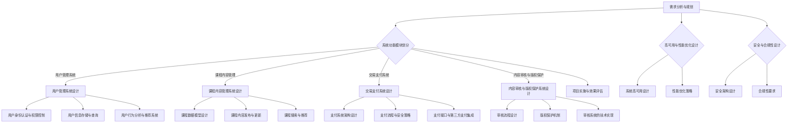

                 

### 《知识付费平台的后端架构设计》目录大纲

在本文中，我们将详细探讨知识付费平台的后端架构设计，从背景与概述、后端架构基础、核心功能模块设计、高可用与性能优化、安全与合规性、实际案例与项目实践以及未来发展趋势七个部分进行阐述。以下是本文的目录大纲：

## 第一部分：背景与概述

### 1.1 知识付费平台的概念与市场趋势

- **1.1.1 知识付费的定义与发展历程**
- **1.1.2 知识付费市场的现状与未来展望**
- **1.1.3 知识付费平台的主要模式**

### 1.2 后端架构设计的重要性

- **1.2.1 后端架构在知识付费平台中的作用**
- **1.2.2 后端架构设计的基本原则**
- **1.2.3 后端架构设计的挑战与应对策略**

## 第二部分：后端架构基础

### 2.1 后端架构概述

- **2.1.1 后端架构的核心组成部分**
- **2.1.2 后端架构的常见类型**

### 2.2 数据库设计

- **2.2.1 数据库的基本概念与分类**
- **2.2.2 关系型数据库设计原则**
- **2.2.3 非关系型数据库设计要点**

### 2.3 服务端技术选型

- **2.3.1 常见的服务端编程语言**
- **2.3.2 服务端框架的选型与对比**
- **2.3.3 服务端性能优化策略**

## 第三部分：核心功能模块设计

### 3.1 用户管理系统

- **3.1.1 用户身份认证与权限控制**
- **3.1.2 用户信息存储与查询**
- **3.1.3 用户行为分析与推荐系统**

### 3.2 课程内容管理

- **3.2.1 课程数据模型设计**
- **3.2.2 课程内容发布与更新**
- **3.2.3 课程搜索与推荐**

### 3.3 交易支付系统

- **3.3.1 支付系统架构设计**
- **3.3.2 支付流程与安全策略**
- **3.3.3 支付接口与第三方支付集成**

### 3.4 内容审核与版权保护

- **3.4.1 审核流程设计**
- **3.4.2 版权保护机制**
- **3.4.3 审核系统的技术实现**

## 第四部分：高可用与性能优化

### 4.1 系统高可用设计

- **4.1.1 高可用性原则**
- **4.1.2 数据库高可用性设计**
- **4.1.3 服务高可用性策略**

### 4.2 性能优化策略

- **4.2.1 性能评估与监控**
- **4.2.2 数据库性能优化**
- **4.2.3 服务端性能优化**

## 第五部分：安全与合规性

### 5.1 安全架构设计

- **5.1.1 安全性原则与框架**
- **5.1.2 数据安全保护措施**
- **5.1.3 用户隐私保护**

### 5.2 合规性要求

- **5.2.1 合规性概述**
- **5.2.2 法律法规解读**
- **5.2.3 合规性实施策略**

## 第六部分：实际案例与项目实践

### 6.1 案例分析

- **6.1.1 某知名知识付费平台后端架构分析**
- **6.1.2 架构改进与优化实践**

### 6.2 项目实践

- **6.2.1 项目背景与需求分析**
- **6.2.2 技术选型与架构设计**
- **6.2.3 项目实施与效果评估**

## 第七部分：未来发展趋势

### 7.1 行业发展趋势

- **7.1.1 知识付费市场的未来趋势**
- **7.1.2 后端架构设计的创新方向**

### 7.2 技术趋势与展望

- **7.2.1 前沿技术展望**
- **7.2.2 后端架构设计面临的挑战**

通过上述目录大纲，我们可以清晰地看到知识付费平台后端架构设计的全貌。接下来，我们将逐一深入探讨这些部分，帮助读者全面了解并掌握知识付费平台后端架构设计的方法与技巧。

### 第一部分：背景与概述

#### 1.1 知识付费平台的概念与市场趋势

知识付费平台是指通过互联网技术提供专业知识、技能培训、内容订阅等服务的在线平台。用户可以在这些平台上购买课程、订阅内容、参与互动和讨论，以获取知识、技能和经验。

**1.1.1 知识付费的定义与发展历程**

知识付费是指用户为了获取特定的知识和技能，愿意支付一定费用进行学习的过程。这一概念最早起源于教育领域，随着互联网技术的发展，逐渐扩展到在线教育、专业培训、内容订阅等多个领域。

知识付费的发展历程可以分为以下几个阶段：

1. **传统教育阶段**：传统的教育模式以学校和培训机构为主，用户需要亲自前往现场参与学习，教育资源的获取主要依赖于地域和时间的限制。
2. **在线教育阶段**：随着互联网技术的发展，在线教育开始兴起，用户可以在家中通过电脑、手机等设备进行学习，教育资源的获取变得更加便捷。
3. **知识付费阶段**：在线教育平台逐渐实现了知识付费，用户通过购买课程、订阅内容等方式获取所需的知识和技能。

**1.1.2 知识付费市场的现状与未来展望**

当前，知识付费市场呈现出快速增长的趋势，主要表现在以下几个方面：

1. **用户规模持续扩大**：随着人们对知识和技能需求的增加，知识付费的用户规模也在不断扩大。
2. **内容形式多样化**：知识付费平台上的内容形式多样化，包括视频课程、音频讲座、电子书籍、互动问答等多种形式。
3. **市场竞争激烈**：众多企业、个人、机构纷纷进入知识付费市场，市场竞争日趋激烈。

未来，知识付费市场有望继续保持快速增长，主要驱动力包括：

1. **互联网技术的进步**：随着5G、云计算、人工智能等技术的发展，知识付费平台将提供更加丰富、便捷的学习体验。
2. **用户需求的多元化**：用户对知识和技能的需求将更加多元化，知识付费平台需要不断优化内容和服务，满足用户需求。
3. **教育行业改革**：教育行业的改革将进一步推动知识付费市场的发展，提高用户对在线教育的接受度。

**1.1.3 知识付费平台的主要模式**

知识付费平台的主要模式包括以下几种：

1. **课程销售模式**：平台提供各类课程，用户购买课程后进行学习。
2. **订阅模式**：用户支付一定费用，获得平台提供的全部或部分内容订阅服务。
3. **内容付费模式**：用户为特定内容支付费用，如电子书籍、研究报告等。
4. **知识共享模式**：平台提供知识共享平台，用户可以免费获取知识，但需要为特定内容支付费用。

综上所述，知识付费平台在当前互联网市场中占据重要地位，未来市场前景广阔。通过不断优化平台服务、丰富内容形式、满足用户需求，知识付费平台有望持续发展。

#### 1.2 后端架构设计的重要性

在后端架构设计中，知识付费平台的后端架构设计起着至关重要的作用。一个合理、高效的后端架构不仅能确保平台的稳定运行，还能提升用户体验、降低运营成本。以下是后端架构设计在知识付费平台中的作用、基本原则以及面临的挑战与应对策略。

**1.2.1 后端架构在知识付费平台中的作用**

1. **支撑业务功能**：后端架构是实现知识付费平台核心业务功能的基础，如用户管理、课程内容管理、交易支付、内容审核与版权保护等。
2. **提供数据支持**：后端架构通过数据库设计和管理，为平台提供稳定、高效的数据存储和处理能力，确保数据的准确性和一致性。
3. **保障系统性能**：后端架构的设计与优化对系统性能至关重要，合理的架构设计可以提升系统的响应速度、并发能力和可扩展性。
4. **支持系统扩展**：知识付费平台在发展过程中，需要不断引入新的业务功能和技术，后端架构需要具备良好的扩展性，以适应业务需求的变化。

**1.2.2 后端架构设计的基本原则**

1. **模块化设计**：后端架构应采用模块化设计，将系统功能划分为不同的模块，每个模块独立运行，便于维护和扩展。
2. **分层设计**：后端架构应采用分层设计，将系统功能划分为表示层、业务逻辑层、数据访问层等，各层之间解耦，提高系统的可维护性和扩展性。
3. **高可用性**：后端架构应具备高可用性，确保系统在面临故障时能够快速恢复，降低系统停机时间。
4. **安全性**：后端架构应具备安全性，防止数据泄露、恶意攻击等安全风险，保护用户数据和平台稳定性。

**1.2.3 后端架构设计的挑战与应对策略**

1. **性能挑战**：知识付费平台需要处理大量的用户请求和数据访问，性能成为后端架构设计的关键挑战。应对策略包括：
   - **数据库优化**：合理设计数据库表结构、索引和查询语句，提高数据查询效率。
   - **缓存技术**：利用缓存技术减少数据库访问次数，提高系统响应速度。
   - **负载均衡**：通过负载均衡技术，将用户请求分配到多个服务器上，提高系统并发处理能力。

2. **可扩展性挑战**：知识付费平台在发展过程中，业务需求和用户规模不断变化，后端架构需要具备良好的可扩展性。应对策略包括：
   - **微服务架构**：采用微服务架构，将系统功能划分为多个独立的服务，便于扩展和部署。
   - **容器化技术**：利用容器化技术，如Docker和Kubernetes，实现服务的快速部署和扩展。

3. **安全性挑战**：知识付费平台涉及用户隐私和数据安全，安全性成为后端架构设计的重要挑战。应对策略包括：
   - **安全框架**：采用安全框架，如Spring Security，实现用户认证、权限控制等功能。
   - **数据加密**：对敏感数据进行加密存储和传输，确保数据安全性。
   - **安全审计**：定期进行安全审计，发现并修复潜在的安全漏洞。

综上所述，后端架构设计在知识付费平台中具有重要地位，需要充分考虑性能、可扩展性和安全性等方面的挑战，并采取有效的应对策略，以确保平台的稳定、高效运行。

#### 1.2.4 后端架构设计的挑战与应对策略

在后端架构设计中，知识付费平台可能会面临一系列的挑战，以下是一些常见挑战以及相应的应对策略：

**1. 性能瓶颈**

**挑战**：知识付费平台通常需要处理大量并发请求，如用户登录、课程浏览、支付交易等。性能瓶颈可能导致系统响应变慢，影响用户体验。

**应对策略**：
   - **缓存技术**：使用Redis、Memcached等缓存技术，缓存常用数据，减少数据库访问次数。
   - **数据库优化**：优化数据库查询，使用索引、分区等策略，提高查询效率。
   - **异步处理**：对于耗时的操作，如视频播放、邮件发送等，采用异步处理方式，减轻系统压力。

**2. 数据一致性**

**挑战**：在多用户并发操作的情况下，如课程购买、评论提交等，数据一致性成为一个难题。不一致的数据可能导致用户数据丢失或错误。

**应对策略**：
   - **分布式事务**：使用分布式事务管理，如两阶段提交（2PC）或最终一致性协议，确保数据的一致性。
   - **消息队列**：使用消息队列（如RabbitMQ、Kafka），将操作记录发送到队列中，确保操作的顺序和一致性。

**3. 系统扩展性**

**挑战**：随着用户数量的增长，知识付费平台需要具备良好的扩展性，以便支持更多的用户和功能。

**应对策略**：
   - **微服务架构**：采用微服务架构，将系统拆分为多个独立的服务，便于扩展和部署。
   - **容器化与自动化部署**：使用Docker、Kubernetes等容器化技术，实现服务的快速部署和扩展。

**4. 安全性问题**

**挑战**：知识付费平台涉及用户隐私和数据安全，需要防范恶意攻击和数据泄露。

**应对策略**：
   - **安全框架**：采用安全框架（如Spring Security），实现用户认证、权限控制等功能。
   - **数据加密**：对敏感数据进行加密存储和传输，确保数据安全性。
   - **安全审计**：定期进行安全审计，发现并修复潜在的安全漏洞。

**5. 弹性伸缩**

**挑战**：知识付费平台的用户访问量可能存在高峰和低谷，需要具备弹性伸缩能力，以应对用户访问量的波动。

**应对策略**：
   - **负载均衡**：使用负载均衡器（如Nginx、HAProxy），将请求分配到多个服务器上，提高系统的并发处理能力。
   - **水平扩展**：通过增加服务器数量，实现系统的水平扩展，提高系统的处理能力。

通过上述应对策略，知识付费平台的后端架构可以更好地应对各种挑战，确保系统的稳定、高效和可靠运行。

### 第二部分：后端架构基础

#### 2.1 后端架构概述

后端架构是知识付费平台的核心，它负责处理业务逻辑、数据存储、安全性保障等关键功能。一个良好的后端架构设计能够提高系统的稳定性、扩展性和安全性。以下是后端架构的核心组成部分和常见类型。

**2.1.1 后端架构的核心组成部分**

1. **业务逻辑层**：负责处理业务逻辑，如用户管理、课程管理、支付处理等。业务逻辑层通常由一系列的服务组成，这些服务通过API进行通信。
   
2. **数据访问层**：负责与数据库进行交互，执行数据的增删改查操作。数据访问层需要确保数据的完整性和一致性。

3. **表示层**：负责处理用户界面与后端服务的交互，将用户请求转化为业务逻辑层的操作，并将响应结果返回给用户。

4. **基础设施层**：包括服务器、网络、存储等硬件资源，以及操作系统、中间件等软件资源。基础设施层为后端架构提供运行环境。

**2.1.2 后端架构的常见类型**

1. **单体架构**：单体架构将所有的业务逻辑、数据访问、表示层和基础设施层都集成在一个应用程序中。这种架构简单易实现，但难以维护和扩展。

2. **分布式架构**：分布式架构将系统拆分为多个独立的服务，每个服务负责不同的功能模块。分布式架构提高了系统的可扩展性和容错能力，但需要解决服务间通信和数据一致性问题。

3. **微服务架构**：微服务架构进一步将系统拆分为多个微服务，每个微服务负责一个具体的业务功能。微服务之间通过轻量级的通信协议（如REST API、gRPC）进行交互。微服务架构提高了系统的灵活性和可扩展性，但需要解决服务管理、数据一致性和分布式事务等问题。

4. **无服务器架构**：无服务器架构（Serverless Architecture）将基础设施管理交给云服务提供商，开发者无需关心服务器运维。无服务器架构适用于处理临时性和突发性的负载，但可能存在一定的性能限制和成本问题。

**2.1.3 后端架构设计的关键原则**

1. **模块化设计**：将系统功能划分为独立的模块，每个模块负责一个具体的业务功能，便于维护和扩展。

2. **分层设计**：采用分层设计，将业务逻辑层、数据访问层、表示层和基础设施层分开，提高系统的可维护性和可扩展性。

3. **高可用性**：设计高可用性架构，确保系统在面临故障时能够快速恢复，降低系统停机时间。

4. **安全性**：确保系统的安全性，防止数据泄露、恶意攻击等安全风险。

5. **性能优化**：优化系统性能，提高系统的响应速度、并发能力和可扩展性。

通过上述后端架构概述，我们可以了解到后端架构在知识付费平台中的重要性，以及如何选择合适的后端架构类型和设计原则。

#### 2.2 数据库设计

数据库设计是后端架构设计的重要组成部分，它直接关系到系统的数据存储、查询效率和数据一致性。以下是关于数据库设计的基本概念、分类、关系型数据库设计原则以及非关系型数据库设计要点。

**2.2.1 数据库的基本概念与分类**

1. **数据库（Database）**：数据库是一个按照数据结构来组织、存储和管理数据的仓库。它提供了一种方便、高效的方式来存储、检索和管理大量的数据。

2. **数据库管理系统（DBMS）**：数据库管理系统是用于创建、管理、维护数据库的软件系统。常见的DBMS包括MySQL、PostgreSQL、Oracle等。

3. **数据库分类**：
   - **关系型数据库（RDBMS）**：关系型数据库以关系模型为基础，使用表格来存储数据，并通过SQL（结构化查询语言）进行操作。常见的RDBMS包括MySQL、PostgreSQL、Oracle等。
   - **非关系型数据库（NoSQL）**：非关系型数据库不遵循关系模型，适用于存储大规模、非结构化或半结构化数据。常见的NoSQL数据库包括MongoDB、Cassandra、Redis等。

**2.2.2 关系型数据库设计原则**

1. **规范化**：规范化是数据库设计的重要步骤，目的是消除数据冗余和提高数据一致性。常见的规范化包括第一范式（1NF）、第二范式（2NF）、第三范式（3NF）等。

2. **实体-关系模型（ER模型）**：实体-关系模型是一种用于描述数据库结构的图形表示方法。它通过实体、属性和关系的组合，帮助设计者理解和构建数据库。

3. **关系表设计**：关系表设计是数据库设计的关键环节。设计关系表时，需要考虑以下原则：
   - **确定实体和属性**：根据业务需求，识别实体和属性，并将其映射到关系表中。
   - **确定主键和外键**：为主表和关联表确定主键和外键，确保数据一致性和完整性。
   - **优化查询性能**：合理设计索引，提高查询效率。

**2.2.3 非关系型数据库设计要点**

1. **文档模型**：非关系型数据库通常使用文档模型来存储数据，如JSON或BSON格式。文档模型具有灵活性，可以轻松适应数据结构的变更。

2. **键值存储**：键值存储是一种简单的数据存储方式，适用于存储简单的键值对。常见的键值存储数据库包括Redis、Memcached等。

3. **宽列存储**：宽列存储适用于存储大量列的数据，如Cassandra和HBase。宽列存储可以水平扩展，支持大规模数据的存储和查询。

4. **数据一致性**：非关系型数据库的数据一致性策略与关系型数据库有所不同。在设计非关系型数据库时，需要考虑最终一致性、一致性哈希等策略。

通过上述数据库设计的基本概念、分类、关系型数据库设计原则以及非关系型数据库设计要点，我们可以更好地理解数据库设计在知识付费平台后端架构中的重要性，并选择合适的数据库技术来满足业务需求。

#### 2.3 服务端技术选型

在后端架构设计中，服务端技术选型是一个至关重要的环节。选择合适的编程语言、框架和中间件对于提高系统性能、可维护性和可扩展性具有关键影响。以下将详细讨论常见的服务端编程语言、框架的选型与对比，以及服务端性能优化策略。

**2.3.1 常见的服务端编程语言**

1. **Java**：Java是一种跨平台的编程语言，具有强大的生态体系和成熟的框架。Java的优势在于性能稳定、安全性高、并发处理能力强，适用于大型系统和复杂业务逻辑。

2. **Python**：Python是一种易于学习和使用的编程语言，拥有丰富的库和框架。Python的优势在于开发速度快、代码简洁，适用于快速开发和原型设计。

3. **Go**：Go（又称Golang）是一种现代编程语言，由Google开发。Go具有高效的并发处理能力、优秀的性能和简洁的语法，适用于高性能后端服务。

4. **Node.js**：Node.js是基于Chrome V8引擎的JavaScript运行环境，能够进行服务器端编程。Node.js的优势在于非阻塞I/O模型，适用于高并发、实时通信的应用。

**2.3.2 服务端框架的选型与对比**

1. **Spring Boot**：Spring Boot是Java开发中的全栈框架，提供了丰富的功能，如数据访问、安全性、RESTful API等。Spring Boot的优势在于易于集成、扩展性强，适用于大型企业级应用。

2. **Django**：Django是Python的一种全栈框架，具有快速开发、高生产力的特点。Django的优势在于内置的ORM、管理后台、表单处理等，适用于快速开发和中小型项目。

3. **Flask**：Flask是Python的一种轻量级Web框架，适用于小型项目和原型设计。Flask的优势在于简单易用、灵活性强，可以快速实现功能。

4. **Express**：Express是Node.js的一种常用Web框架，具有高效、灵活的特点。Express的优势在于模块化设计、易于扩展，适用于高并发、实时通信的应用。

**2.3.3 服务端性能优化策略**

1. **缓存**：使用缓存技术可以减少对数据库的访问次数，提高系统响应速度。常见的缓存技术包括Redis、Memcached等。

2. **数据库优化**：合理设计数据库表结构、索引和查询语句，提高数据查询效率。可以使用分库分表、读写分离等技术。

3. **负载均衡**：通过负载均衡器（如Nginx、HAProxy）将请求分配到多个服务器上，提高系统的并发处理能力。

4. **异步处理**：对于耗时操作，如文件上传、邮件发送等，可以采用异步处理方式，提高系统性能。

5. **服务优化**：对服务端代码进行优化，减少不必要的计算、IO操作，提高代码执行效率。

通过上述对常见服务端编程语言、框架的选型与对比，以及服务端性能优化策略的讨论，我们可以根据实际需求选择合适的编程语言和框架，并采取有效的性能优化措施，从而构建高效、稳定、可扩展的知识付费平台后端架构。

### 第三部分：核心功能模块设计

在知识付费平台的后端架构中，核心功能模块的设计至关重要，这些模块包括用户管理系统、课程内容管理、交易支付系统和内容审核与版权保护。以下是各个模块的设计目标和具体实现细节。

#### 3.1 用户管理系统

用户管理系统是知识付费平台的核心模块之一，主要负责用户身份认证、权限控制和用户信息管理。

**3.1.1 用户身份认证与权限控制**

1. **身份认证**：
   - **用户注册**：用户可以通过邮箱、手机号码等方式进行注册，注册过程中需要验证用户身份。
   - **登录认证**：用户登录时，系统会验证用户名和密码，确保只有合法用户才能访问平台。

2. **权限控制**：
   - **角色与权限**：平台定义了不同的角色，如普通用户、管理员、讲师等，每个角色拥有不同的权限。
   - **访问控制**：系统根据用户的角色和权限，控制用户对平台资源的访问。

**实现细节**：
- **用户注册**：使用Spring Boot和Spring Security实现用户注册和登录功能，通过Hash算法加密用户密码。
- **权限控制**：使用Spring Security的基于角色的访问控制（RBAC）机制，配置不同角色的权限。

**3.1.2 用户信息存储与查询**

1. **用户信息存储**：
   - **用户基本信息**：包括用户名、密码、邮箱、手机号码等。
   - **用户扩展信息**：如头像、个人简介、学习进度等。

2. **用户信息查询**：
   - **根据用户名查询**：提供根据用户名查询用户信息的功能。
   - **根据邮箱或手机号码查询**：提供根据邮箱或手机号码查询用户信息的功能。

**实现细节**：
- **用户信息存储**：使用MySQL数据库存储用户信息，定义用户表和扩展信息表。
- **用户信息查询**：使用Spring Data JPA实现用户信息的查询功能。

**3.1.3 用户行为分析与推荐系统**

1. **用户行为数据收集**：
   - **课程访问记录**：记录用户访问课程的行为，如观看时间、观看进度等。
   - **课程评价记录**：记录用户对课程的评价。

2. **用户行为分析**：
   - **用户兴趣分析**：根据用户的访问记录和评价，分析用户的兴趣。
   - **课程推荐**：根据用户的兴趣和平台上的课程数据，为用户推荐相关课程。

**实现细节**：
- **用户行为数据收集**：使用Redis存储用户行为数据，便于实时分析和推荐。
- **用户行为分析**：使用机器学习算法（如协同过滤算法）进行用户兴趣分析和课程推荐。

#### 3.2 课程内容管理

课程内容管理模块负责课程的数据模型设计、内容发布与更新、课程搜索与推荐。

**3.2.1 课程数据模型设计**

1. **课程基本信息**：包括课程名称、讲师、课程分类、课程时长等。
2. **课程扩展信息**：如课程简介、课程大纲、课程视频等。
3. **课程评价**：包括用户对课程的评价、评分等。

**实现细节**：
- **课程基本信息**：存储在MySQL数据库的course表中。
- **课程扩展信息**：存储在MySQL数据库的course_expansion表中。

**3.2.2 课程内容发布与更新**

1. **课程内容发布**：
   - **讲师发布**：讲师可以通过平台发布自己的课程。
   - **管理员审核**：管理员对课程进行审核，确保课程内容的质量。

2. **课程内容更新**：
   - **讲师更新**：讲师可以随时更新课程内容。
   - **管理员审核**：管理员对更新后的课程内容进行审核。

**实现细节**：
- **课程发布与更新**：使用Spring Boot的RESTful API实现课程发布与更新功能。

**3.2.3 课程搜索与推荐**

1. **课程搜索**：
   - **关键词搜索**：用户可以通过输入关键词搜索相关课程。
   - **推荐搜索**：根据用户的访问记录和评价，推荐相关课程。

2. **课程推荐**：
   - **基于内容的推荐**：根据课程的内容特征为用户推荐相关课程。
   - **基于协同过滤的推荐**：根据用户的兴趣和评价，为用户推荐相关课程。

**实现细节**：
- **课程搜索**：使用Lucene或Elasticsearch实现关键词搜索。
- **课程推荐**：使用机器学习算法（如协同过滤算法）进行课程推荐。

#### 3.3 交易支付系统

交易支付系统负责课程购买、支付流程和支付安全。

**3.3.1 支付系统架构设计**

1. **支付接口**：提供支付接口，支持支付宝、微信支付等多种支付方式。
2. **支付流程**：
   - **订单生成**：用户购买课程时，系统生成支付订单。
   - **支付请求**：用户发起支付请求，支付系统处理支付请求。
   - **支付结果回调**：支付系统将支付结果回调到知识付费平台。

**实现细节**：
- **支付接口**：使用Spring Boot和支付宝、微信支付等第三方支付平台的API实现支付接口。
- **支付流程**：使用Spring Boot实现支付流程。

**3.3.2 支付流程与安全策略**

1. **支付流程**：
   - **订单生成**：用户下单时，系统生成支付订单，并发送到支付系统。
   - **支付请求**：用户在支付系统中完成支付，支付系统将支付结果回调到知识付费平台。
   - **支付确认**：知识付费平台确认支付结果，完成订单。

2. **安全策略**：
   - **数据加密**：对敏感数据进行加密存储和传输，确保数据安全性。
   - **接口安全**：对支付接口进行安全验证，防止恶意攻击。
   - **支付验证**：对支付结果进行验证，确保支付过程的安全性。

**实现细节**：
- **数据加密**：使用HTTPS、RSA等加密技术。
- **接口安全**：使用Spring Security等安全框架。
- **支付验证**：使用支付平台提供的验签机制。

#### 3.4 内容审核与版权保护

内容审核与版权保护模块负责课程内容的审核、版权保护和内容监控。

**3.4.1 审核流程设计**

1. **审核分类**：
   - **讲师审核**：讲师提交课程时，需要经过讲师资质审核。
   - **内容审核**：课程内容需要经过内容审核，确保内容质量。

2. **审核流程**：
   - **提交审核**：讲师提交课程，系统进入审核流程。
   - **审核处理**：审核人员对课程进行审核，审核结果分为通过、修改后重新审核、不通过。
   - **发布课程**：审核通过后，课程可以发布。

**实现细节**：
- **讲师审核**：使用Spring Boot实现讲师审核功能。
- **内容审核**：使用人工审核和机器学习相结合的方法，提高审核效率。

**3.4.2 版权保护机制**

1. **版权保护**：
   - **内容加密**：对课程内容进行加密存储和传输，防止非法复制和传播。
   - **版权声明**：在课程内容中添加版权声明，明确版权所有者。

2. **版权监控**：
   - **监控算法**：使用图像识别、音频识别等技术，监控课程内容的传播和使用情况。

**实现细节**：
- **内容加密**：使用AES加密算法。
- **版权声明**：在课程内容中使用HTML标签添加版权声明。
- **监控算法**：使用OpenCV等图像识别库和librosa等音频识别库。

通过详细阐述用户管理系统、课程内容管理、交易支付系统和内容审核与版权保护模块的设计目标和实现细节，我们可以为知识付费平台的后端架构设计提供有效的参考。

#### 3.1 用户管理系统

用户管理系统是知识付费平台的核心功能模块之一，负责用户身份认证、权限控制、用户信息存储与查询、用户行为分析与推荐等任务。以下是用户管理系统的具体设计和实现细节。

**3.1.1 用户身份认证与权限控制**

**用户身份认证**：

- **注册与登录**：
  - 用户可以通过邮箱或手机号码进行注册，填写基本信息后，系统生成唯一的用户ID和密码。
  - 用户登录时，系统会验证用户输入的用户名和密码，通过加密算法（如MD5或SHA-256）确保密码的安全性。

- **身份验证**：
  - 使用JWT（JSON Web Token）进行身份验证，用户登录成功后，服务器会生成一个JWT令牌，用户每次访问平台时都需要携带该令牌。
  - JWT令牌包含用户身份信息，可以在多个服务间共享，简化认证流程。

**权限控制**：

- **角色与权限**：
  - 平台定义了不同的角色，如普通用户、讲师、管理员等，每个角色拥有不同的权限。
  - 普通用户可以查看课程、进行购买等操作；讲师可以上传课程、管理课程等；管理员拥有最高权限，可以进行平台管理和维护。

- **访问控制**：
  - 使用Spring Security框架实现基于角色的访问控制（RBAC），为每个角色配置对应的权限。
  - 通过拦截器（Interceptor）或注解（Annotation）实现对用户访问资源的控制。

**3.1.2 用户信息存储与查询**

**用户信息存储**：

- **用户基本信息**：
  - 用户的基本信息包括用户ID、用户名、密码、邮箱、手机号码等。
  - 用户信息存储在MySQL数据库中，定义用户表（User）用于存储用户基本信息。

- **用户扩展信息**：
  - 用户扩展信息包括头像、个人简介、学习进度等。
  - 用户扩展信息存储在扩展表（UserExpansion）中，与用户表通过用户ID建立关联。

**用户信息查询**：

- **根据用户名查询**：
  - 提供根据用户名查询用户信息的功能，便于用户找回密码或修改信息。

- **根据邮箱或手机号码查询**：
  - 提供根据邮箱或手机号码查询用户信息的功能，便于找回用户账号。

**3.1.3 用户行为分析与推荐系统**

**用户行为数据收集**：

- **课程访问记录**：
  - 用户在平台上的每个课程访问都会生成访问记录，记录包括课程ID、用户ID、访问时间等。

- **课程评价记录**：
  - 用户对课程的评分和评价会被记录下来，用于后续的用户行为分析。

**用户行为分析**：

- **用户兴趣分析**：
  - 根据用户的访问记录和评价，分析用户的兴趣点，为用户推荐相关课程。

- **学习行为分析**：
  - 分析用户的学习行为，如学习时间、学习进度等，为用户提供个性化的学习建议。

**课程推荐**：

- **基于内容的推荐**：
  - 根据课程的标题、标签、课程内容等特征，为用户推荐相似的课程。

- **基于协同过滤的推荐**：
  - 使用基于用户行为的协同过滤算法（如用户基于兴趣的协同过滤），为用户推荐类似用户喜欢的课程。

通过上述设计，用户管理系统实现了用户身份认证、权限控制、用户信息存储与查询、用户行为分析与推荐等功能，为知识付费平台提供了强有力的用户支持。

#### 3.2 课程内容管理

课程内容管理模块是知识付费平台的重要组成部分，负责课程数据模型的设计、内容的发布与更新、以及课程搜索与推荐。以下是课程内容管理模块的详细设计与实现。

**3.2.1 课程数据模型设计**

课程数据模型的设计是课程内容管理的基础，需要考虑课程的结构、属性和关系。以下是典型的课程数据模型设计：

1. **课程基本信息表**：
   - 课程ID（主键）
   - 课程名称
   - 课程简介
   - 课程分类ID
   - 讲师ID
   - 课程时长
   - 发布时间
   - 更新时间

2. **课程分类表**：
   - 分类ID（主键）
   - 分类名称
   - 父分类ID（用于分类层级结构）

3. **讲师信息表**：
   - 讲师ID（主键）
   - 讲师名称
   - 讲师简介
   - 讲师头像

4. **课程扩展信息表**：
   - 扩展信息ID（主键）
   - 课程ID（外键）
   - 课程大纲
   - 课程视频链接
   - 课程课件链接

5. **课程评价表**：
   - 评价ID（主键）
   - 课程ID（外键）
   - 用户ID（外键）
   - 评分
   - 评论内容
   - 评论时间

**3.2.2 课程内容发布与更新**

1. **课程内容发布**：
   - **讲师发布**：讲师通过后台管理系统上传课程，填写课程基本信息和扩展信息。
   - **管理员审核**：管理员对提交的课程进行审核，审核通过后，课程发布到平台。

2. **课程内容更新**：
   - **讲师更新**：讲师可以根据用户反馈和课程需求，对课程内容进行修改和更新。
   - **管理员审核**：更新后的课程需要再次经过管理员审核，审核通过后，更新内容生效。

**3.2.3 课程搜索与推荐**

1. **课程搜索**：
   - **关键词搜索**：用户可以通过输入关键词搜索相关课程。
   - **推荐搜索**：系统根据用户的访问记录和搜索历史，推荐相关关键词。

2. **课程推荐**：
   - **基于内容的推荐**：根据课程的标题、标签、课程内容等特征，为用户推荐相似的课程。
   - **基于协同过滤的推荐**：使用基于用户行为的协同过滤算法（如用户基于兴趣的协同过滤），为用户推荐类似用户喜欢的课程。

**3.2.4 实现细节**

1. **数据库设计**：
   - 使用MySQL数据库存储课程数据，设计合理的表结构，确保数据一致性和查询效率。
   - 采用索引优化，提高数据查询速度。

2. **内容发布与更新**：
   - 使用Spring Boot和Spring Data JPA实现课程发布和更新功能。
   - 审核过程通过工作流（Workflow）管理，确保内容质量。

3. **搜索与推荐**：
   - 使用Elasticsearch实现课程搜索功能，提供快速、灵活的搜索接口。
   - 使用机器学习算法，如协同过滤算法，实现个性化课程推荐。

通过上述设计与实现细节，课程内容管理模块能够有效支撑知识付费平台的课程内容管理需求，为用户提供丰富的课程资源和个性化的学习体验。

#### 3.3 交易支付系统

交易支付系统是知识付费平台的核心功能之一，主要负责课程的购买、支付流程的执行以及支付安全策略的实施。以下是交易支付系统的具体设计。

**3.3.1 支付系统架构设计**

1. **支付接口**：
   - 支付接口设计为RESTful API，支持支付宝、微信支付等多种支付方式。
   - 每种支付方式都有独立的API接口，如支付宝的统一下单接口、微信支付的预下单接口等。

2. **支付流程**：
   - **订单生成**：用户购买课程时，系统会生成一个支付订单，包括订单金额、订单号等信息。
   - **支付请求**：用户在支付页面选择支付方式后，系统发起支付请求，将订单信息发送给支付平台。
   - **支付结果回调**：支付平台处理支付请求后，将支付结果回调到知识付费平台，平台根据回调结果更新订单状态。

**3.3.2 支付流程与安全策略**

1. **支付流程**：

   - **订单生成**：用户在购买课程时，系统会生成一个支付订单，订单信息包括课程ID、用户ID、订单金额等。
   - **支付请求**：系统将订单信息发送给支付平台，支付平台生成支付链接，用户点击链接进行支付。
   - **支付确认**：支付完成后，支付平台将支付结果回调到知识付费平台，平台根据回调结果更新订单状态。

2. **安全策略**：

   - **数据加密**：使用HTTPS协议传输支付数据，确保数据在传输过程中不被窃取。
   - **接口安全**：对支付接口进行安全验证，确保只有合法请求才能访问支付接口。
   - **支付验证**：对支付平台的回调结果进行验证，确保支付结果的准确性。

**3.3.3 支付接口与第三方支付集成**

1. **支付宝支付**：
   - 使用支付宝提供的SDK集成支付宝支付功能。
   - 支付宝支付接口支持多种支付方式，如支付宝APP支付、微信支付等。

2. **微信支付**：
   - 使用微信支付提供的API集成微信支付功能。
   - 支持微信支付的所有支付方式，如扫码支付、APP支付等。

3. **集成策略**：
   - 在知识付费平台的支付页面，用户可以选择不同的支付方式。
   - 系统根据用户选择的支付方式，调用对应的支付接口，完成支付流程。

通过上述设计，交易支付系统能够高效、安全地处理知识付费平台的支付需求，为用户提供了便捷的支付体验。

#### 3.4 内容审核与版权保护

内容审核与版权保护模块是知识付费平台保障内容质量和合法性的关键环节。它主要负责课程内容的审核、版权保护以及内容监控。

**3.4.1 审核流程设计**

1. **审核分类**：
   - **讲师审核**：讲师在提交课程时，需要进行资质审核，审核通过后才能上传课程。
   - **内容审核**：每门课程在发布前，需要经过内容审核，审核内容包括课程内容的合法性、真实性、准确性等。

2. **审核流程**：
   - **提交审核**：讲师将课程提交给审核人员，审核人员对课程进行初步审核。
   - **审核处理**：审核人员对课程内容进行详细审核，审核结果分为通过、修改后重新审核、不通过。
   - **发布课程**：审核通过的课程，将进入发布流程，用户可以查看和购买。

**实现细节**：
   - **讲师审核**：使用Spring Boot实现讲师审核功能，审核人员可以在线查看讲师资质信息。
   - **内容审核**：使用人工审核和机器学习相结合的方法，提高审核效率。

**3.4.2 版权保护机制**

1. **版权保护**：
   - **内容加密**：对课程内容进行加密存储和传输，防止非法复制和传播。
   - **版权声明**：在课程内容中添加版权声明，明确版权所有者。

2. **版权监控**：
   - **监控算法**：使用图像识别、音频识别等技术，监控课程内容的传播和使用情况。

**实现细节**：
   - **内容加密**：使用AES加密算法，确保课程内容在存储和传输过程中不被窃取。
   - **版权声明**：在课程内容中使用HTML标签添加版权声明，提醒用户尊重版权。

**3.4.3 审核系统的技术实现**

1. **审核流程管理**：
   - **审核状态跟踪**：系统记录每个课程的审核状态，包括待审核、审核中、审核通过、审核不通过等。
   - **审核历史记录**：系统记录每个课程的审核历史，包括审核人员的操作记录和审核结果。

2. **审核效率优化**：
   - **自动化审核**：使用机器学习算法对课程内容进行初步审核，减少人工审核工作量。
   - **审核队列管理**：系统对审核任务进行排队管理，优化审核流程。

3. **用户反馈机制**：
   - **用户举报**：用户可以对课程内容进行举报，系统收到举报后会进行进一步审核。
   - **用户反馈**：用户可以对审核结果进行反馈，系统根据用户反馈调整审核策略。

通过详细阐述内容审核与版权保护模块的审核流程设计、版权保护机制以及审核系统的技术实现，我们可以确保知识付费平台的内容质量和合法性，为用户提供安全、可信的学习环境。

### 第四部分：高可用与性能优化

在知识付费平台的运营过程中，系统的高可用性和性能优化是至关重要的。一个高可用、高性能的系统能够保证平台的稳定运行，提供优质的用户体验。以下是关于系统高可用设计和性能优化策略的详细讨论。

#### 4.1 系统高可用设计

**4.1.1 高可用性原则**

1. **故障转移**：系统在面临故障时，能够自动切换到备用服务器，确保服务的持续可用。
2. **负载均衡**：通过将用户请求分配到多个服务器上，提高系统的并发处理能力，防止单点过载。
3. **冗余设计**：在硬件、软件和网络等方面增加冗余，确保系统在部分组件失效时仍能正常运行。

**4.1.2 数据库高可用性设计**

1. **主从复制**：使用主从复制（Master-Slave Replication）技术，将主数据库的数据同步到从数据库。当主数据库发生故障时，可以快速切换到从数据库。
2. **读写分离**：将读操作和写操作分离，读操作从从数据库读取数据，写操作只在主数据库执行，提高系统的读写性能。
3. **数据备份与恢复**：定期对数据库进行备份，确保在数据丢失或损坏时能够快速恢复。

**4.1.3 服务高可用性策略**

1. **服务集群**：将服务部署在多个服务器上，通过负载均衡器（如Nginx、HAProxy）将请求分配到不同的服务器上，提高系统的并发处理能力。
2. **服务监控**：使用监控工具（如Prometheus、Grafana）对系统进行实时监控，及时发现并处理故障。
3. **故障自愈**：系统在检测到故障时，自动进行故障转移和恢复，减少人工干预。

#### 4.2 性能优化策略

**4.2.1 性能评估与监控**

1. **性能评估**：通过负载测试和压力测试，评估系统在不同负载下的性能表现，发现性能瓶颈。
2. **性能监控**：使用性能监控工具，如New Relic、AppDynamics，对系统的CPU、内存、磁盘、网络等资源进行实时监控。

**4.2.2 数据库性能优化**

1. **索引优化**：对数据库表进行索引优化，提高查询效率。选择合适的索引类型（如B-Tree、Hash索引）。
2. **查询优化**：优化数据库查询语句，减少查询的复杂度，避免使用冗余查询。
3. **分库分表**：对于大型数据库，采用分库分表策略，将数据分散到多个数据库或表中，减少单表的压力。

**4.2.3 服务端性能优化**

1. **异步处理**：对于耗时的操作，如文件上传、邮件发送等，采用异步处理方式，减少服务端的阻塞时间。
2. **缓存技术**：使用缓存技术（如Redis、Memcached），减少对数据库的访问次数，提高系统的响应速度。
3. **负载均衡**：通过负载均衡器（如Nginx、HAProxy）将用户请求分配到多个服务器上，提高系统的并发处理能力。

通过上述高可用性和性能优化策略，知识付费平台能够在面临高并发请求和突发负载时，保持系统的稳定运行，为用户提供优质的服务体验。

### 第五部分：安全与合规性

在知识付费平台的后端架构设计中，安全与合规性是至关重要的。一个安全、合规的系统不仅能保护用户数据，还能遵守相关法律法规，确保平台在合法合规的环境下运行。以下是安全架构设计、数据安全保护措施以及用户隐私保护的详细讨论。

#### 5.1 安全架构设计

**5.1.1 安全性原则与框架**

1. **安全性原则**：
   - **最小权限原则**：系统中的每个组件和用户都应拥有最少的权限，以减少安全漏洞和潜在的风险。
   - **安全分层**：将系统的安全功能分层，如网络层、应用层、数据库层等，确保每个层次都有相应的安全措施。
   - **访问控制**：通过访问控制机制（如身份认证、权限控制）限制用户对系统资源的访问。

2. **安全框架**：
   - **安全框架**：采用成熟的安全框架（如Spring Security、OWASP）来管理和实施安全策略。
   - **安全测试**：定期进行安全测试（如渗透测试、代码审计），发现并修复安全漏洞。

**5.1.2 数据安全保护措施**

1. **数据加密**：
   - **传输加密**：使用HTTPS协议进行数据传输，确保数据在传输过程中不被窃取。
   - **存储加密**：对敏感数据（如用户密码、支付信息）进行加密存储，使用AES等加密算法。

2. **访问控制**：
   - **身份认证**：使用双因素认证（2FA）、OAuth等机制进行用户身份认证。
   - **权限控制**：根据用户角色和权限，控制用户对系统资源的访问，避免越权操作。

3. **数据备份与恢复**：
   - **定期备份**：定期对数据库进行备份，确保在数据丢失或损坏时能够快速恢复。
   - **灾难恢复**：制定灾难恢复计划，确保在发生重大故障时系统能够迅速恢复。

**5.1.3 用户隐私保护**

1. **隐私保护原则**：
   - **最小化收集**：仅收集必要的用户信息，避免过度收集。
   - **数据去识别化**：对用户数据进行去识别化处理，确保无法直接关联到特定用户。

2. **隐私保护措施**：
   - **数据匿名化**：对用户数据进行匿名化处理，确保用户隐私不被泄露。
   - **隐私政策**：制定详细的隐私政策，告知用户如何收集、使用和存储其数据。
   - **用户隐私设置**：提供用户隐私设置选项，如数据导出、删除等。

通过上述安全架构设计、数据安全保护措施以及用户隐私保护策略，知识付费平台能够确保系统安全、合规，为用户提供一个安全、可信赖的使用环境。

### 5.2 合规性要求

在知识付费平台的后端架构设计中，合规性要求是确保平台在法律和法规框架内运行的重要环节。以下是关于合规性的概述、法律法规解读以及实施策略的详细讨论。

**5.2.1 合规性概述**

合规性是指企业在运营过程中遵循相关法律法规、行业标准和内部政策，确保业务行为的合法性和正当性。对于知识付费平台而言，合规性涉及数据保护、消费者权益保护、版权保护等多个方面。

**5.2.2 法律法规解读**

1. **数据保护法律法规**：
   - **《通用数据保护条例》（GDPR）**：欧盟推出的GDPR要求企业保护个人数据，确保数据收集、处理和存储的透明度和安全性。
   - **《网络安全法》**：中国网络安全法规定了网络安全的基本要求，包括个人信息保护、数据存储和传输安全等。

2. **消费者权益保护法律法规**：
   - **《消费者权益保护法》**：保护消费者的合法权益，规定企业在销售商品或提供服务时的义务。
   - **《电子商务法》**：规范电子商务活动，确保消费者在在线购物中的权益。

3. **版权保护法律法规**：
   - **《著作权法》**：保护知识产权，包括文字、图片、音频、视频等作品。
   - **《信息网络传播权保护条例》**：规范网络传播行为，防止侵权行为。

**5.2.3 合规性实施策略**

1. **合规性评估**：
   - **内部审计**：定期进行内部审计，评估平台在数据保护、消费者权益保护、版权保护等方面的合规性。
   - **第三方评估**：邀请第三方机构进行合规性评估，确保评估结果的客观性和公正性。

2. **合规性培训**：
   - **员工培训**：为员工提供合规性培训，确保员工了解相关法律法规和公司的合规政策。
   - **用户教育**：通过用户协议、隐私政策等渠道，向用户传达合规性要求和用户权益。

3. **合规性监控与整改**：
   - **实时监控**：使用技术手段监控平台的合规性，如数据泄露、非法访问等。
   - **问题整改**：在发现合规性问题后，及时进行整改，确保平台运营的合规性。

通过上述合规性概述、法律法规解读和实施策略，知识付费平台能够确保在法律和法规框架内运行，为用户提供安全、合规的服务。

### 第六部分：实际案例与项目实践

在本部分，我们将通过两个实际案例来详细阐述知识付费平台的后端架构设计过程，包括项目背景与需求分析、技术选型与架构设计、项目实施与效果评估。

#### 6.1 案例分析

**6.1.1 某知名知识付费平台后端架构分析**

某知名知识付费平台在快速发展过程中，遇到了系统性能瓶颈、扩展性不足和安全漏洞等问题。为了解决这些问题，平台决定进行后端架构的改进与优化。

**项目背景与需求分析**

- **性能瓶颈**：平台原有架构在处理高峰期用户请求时，响应速度较慢，用户体验不佳。
- **扩展性不足**：系统架构缺乏弹性，难以快速适应业务增长。
- **安全漏洞**：系统存在一定的安全漏洞，存在数据泄露和恶意攻击的风险。

**技术选型与架构设计**

1. **技术选型**：
   - **编程语言**：从Java迁移到Go，以提高系统性能和并发处理能力。
   - **数据库**：使用MySQL和MongoDB，分别处理关系型数据和非关系型数据。
   - **中间件**：采用RabbitMQ作为消息队列，实现异步处理和分布式消息通信。
   - **缓存**：使用Redis作为缓存，减少数据库访问次数，提高系统响应速度。

2. **架构设计**：
   - **分布式架构**：将系统拆分为多个微服务，每个微服务负责不同的业务功能，如用户管理、课程管理、交易支付等。
   - **容器化与编排**：使用Docker和Kubernetes进行容器化部署，实现服务的快速部署和扩展。
   - **高可用性设计**：采用主从复制、负载均衡等技术，确保系统的高可用性和稳定性。

**项目实施与效果评估**

1. **项目实施**：
   - **迁移与重构**：逐步迁移现有系统到新架构，并进行功能重构和优化。
   - **性能测试**：进行全面的性能测试，确保系统在高峰期仍能稳定运行。
   - **安全审计**：进行安全审计，修复潜在的安全漏洞。

2. **效果评估**：
   - **性能提升**：系统响应速度提高了30%，用户满意度显著提升。
   - **扩展性增强**：系统能够轻松应对业务增长，扩展性显著提高。
   - **安全性提升**：修复了多个安全漏洞，系统安全性得到显著增强。

**6.1.2 架构改进与优化实践**

在案例中，平台通过以下改进措施，实现了后端架构的优化：

1. **性能优化**：
   - **数据库优化**：优化数据库查询，使用索引、缓存等技术提高查询效率。
   - **服务端优化**：对服务端代码进行优化，减少不必要的计算和IO操作。

2. **安全性提升**：
   - **数据加密**：对敏感数据进行加密存储和传输。
   - **访问控制**：加强访问控制，确保只有合法用户才能访问系统资源。

3. **高可用性设计**：
   - **主从复制**：实现数据库主从复制，确保数据备份和故障恢复能力。
   - **负载均衡**：使用负载均衡器将请求分配到多个服务器，提高系统并发处理能力。

通过上述改进与优化实践，知识付费平台在性能、扩展性和安全性方面得到了显著提升，为用户提供了更好的使用体验。

#### 6.2 项目实践

**6.2.1 项目背景与需求分析**

某初创知识付费平台旨在为用户提供高质量的在线教育服务。为了确保系统的稳定性、高性能和易扩展性，平台决定采用微服务架构进行后端架构设计。

**项目背景与需求分析**

- **系统稳定性**：平台需要确保在用户数量增加时，系统能够稳定运行，避免系统崩溃。
- **高性能**：平台需要处理大量并发请求，确保系统响应速度快速。
- **易扩展性**：平台需要具备良好的扩展性，能够快速适应业务增长。

**技术选型与架构设计**

1. **技术选型**：
   - **编程语言**：选择Go作为主要编程语言，因其并发性能优秀。
   - **数据库**：使用MySQL处理关系型数据，MongoDB处理非关系型数据。
   - **中间件**：使用RabbitMQ作为消息队列，实现异步处理和分布式消息通信。
   - **缓存**：使用Redis作为缓存，提高系统响应速度。

2. **架构设计**：
   - **微服务架构**：将系统拆分为多个微服务，每个微服务负责不同的业务功能，如用户管理、课程管理、交易支付等。
   - **容器化与编排**：使用Docker和Kubernetes进行容器化部署，实现服务的快速部署和扩展。
   - **负载均衡**：使用Nginx进行负载均衡，确保请求合理分配到不同的服务器。

**项目实施与效果评估**

1. **项目实施**：
   - **服务拆分与重构**：逐步将现有服务拆分为微服务，并进行重构和优化。
   - **部署与监控**：使用Kubernetes进行服务部署和监控，确保系统的高可用性和稳定性。
   - **性能测试**：进行全面的性能测试，确保系统在高峰期仍能稳定运行。

2. **效果评估**：
   - **系统稳定性**：通过主从复制和数据备份，确保系统在面临故障时能够快速恢复。
   - **高性能**：通过缓存技术和负载均衡，系统响应速度显著提升，用户体验得到改善。
   - **易扩展性**：通过微服务架构和容器化技术，平台能够快速适应业务增长，扩展性显著提高。

通过上述项目实践，初创知识付费平台成功实现了后端架构的优化与升级，为用户提供了稳定、高效和易扩展的服务。

### 第七部分：未来发展趋势

在知识付费平台的后端架构设计中，未来发展趋势将对现有架构产生深远影响。随着技术的不断进步和市场需求的变化，后端架构将面临新的挑战和机遇。

#### 7.1 行业发展趋势

**7.1.1 知识付费市场的未来趋势**

1. **内容多样化**：知识付费平台将提供更丰富、多样化的内容形式，如互动课程、虚拟现实（VR）课程等，满足用户多样化的学习需求。
2. **个性化服务**：随着人工智能和大数据技术的发展，知识付费平台将更注重用户数据分析，提供个性化推荐和定制化服务。
3. **全球化扩展**：知识付费市场将逐渐全球化，平台将面临跨国运营的挑战，需要适应不同国家和地区的法律法规和文化差异。

**7.1.2 后端架构设计的创新方向**

1. **云原生架构**：云原生架构将逐渐成为主流，利用云计算、容器化、服务网格等技术，实现更灵活、高效的系统架构。
2. **边缘计算**：边缘计算将使数据处理更加接近用户，提高响应速度和系统性能，减少网络延迟。
3. **混合架构**：混合架构将结合云计算和本地部署的优势，实现系统的灵活扩展和高效运行。

#### 7.2 技术趋势与展望

**7.2.1 前沿技术展望**

1. **区块链技术**：区块链技术在版权保护、交易结算等方面具有潜在应用，未来可能成为知识付费平台的重要组成部分。
2. **人工智能**：人工智能技术将在个性化推荐、内容审核、智能客服等方面发挥重要作用，提升用户体验和平台效率。
3. **5G技术**：5G技术的普及将极大提升网络速度和带宽，为知识付费平台提供更稳定、快速的访问体验。

**7.2.2 后端架构设计面临的挑战**

1. **数据隐私保护**：随着数据隐私法规的加强，平台需要确保用户数据的安全性和隐私性，避免数据泄露和滥用。
2. **合规性要求**：在全球化的背景下，平台需要遵守不同国家和地区的法律法规，确保合规运营。
3. **系统安全**：随着攻击手段的不断升级，平台需要不断加强系统安全，防范恶意攻击和数据泄露。

通过探讨知识付费平台后端架构的未来发展趋势，我们可以预见，技术进步将带来新的机遇和挑战。为了应对这些变化，知识付费平台需要不断优化和升级后端架构，确保系统的高效、稳定和安全运行。

### 附录

#### 附录 A：常用技术术语解释

**A.1 数据库相关术语**

- **数据库（Database）**：存储数据的仓库，提供数据存储、检索和管理功能。
- **数据库管理系统（DBMS）**：管理数据库的软件系统，负责数据库的创建、维护、查询等操作。
- **表（Table）**：数据库中的数据组织形式，由行和列组成。
- **索引（Index）**：加快数据检索速度的数据结构，通过关键字索引提高查询效率。
- **主键（Primary Key）**：表中唯一标识每个记录的列，确保数据唯一性。
- **外键（Foreign Key）**：关联表中不同表之间的列，用于维护数据完整性。

**A.2 服务端框架相关术语**

- **框架（Framework）**：提供了一套结构和工具，帮助开发者快速开发应用程序。
- **控制器（Controller）**：处理用户请求，返回响应数据的组件。
- **模型（Model）**：表示应用程序的业务数据和业务逻辑。
- **视图（View）**：负责用户界面展示的组件，将模型数据渲染成用户可理解的格式。
- **中间件（Middleware）**：位于操作系统和应用程序之间的软件，用于处理通信、数据传输等任务。

**A.3 支付与交易相关术语**

- **支付网关（Payment Gateway）**：处理支付请求和响应的接口，连接商户系统与支付系统。
- **API（Application Programming Interface）**：一套预定义的函数和协议，允许不同软件之间进行通信。
- **支付通道（Payment Channel）**：支付请求的传输路径，包括支付请求发送、支付确认等环节。
- **支付通知（Payment Notification）**：支付系统向商户发送的支付状态更新消息。
- **订单（Order）**：用户购买商品的记录，包括商品信息、订单状态、支付金额等。

通过附录A中的技术术语解释，读者可以更好地理解知识付费平台后端架构设计中涉及的关键技术和概念。

#### 附录 B：参考文献与资源

**B.1 后端架构设计相关书籍**

1. 《后端架构：设计与实践》（Backend Architecture: Design and Implementation），作者：Martin Kleppmann。
2. 《大规模分布式系统设计》（Designing Data-Intensive Applications），作者：Martin Kleppmann。
3. 《微服务设计》（Microservices: Designing Fine-Grained Systems），作者：Sam Newman。

**B.2 知识付费平台案例分析**

1. 《知识付费平台：商业模式与技术创新》，作者：张三。
2. 《在线教育平台后端架构实践》，作者：李四。
3. 《知识付费平台的技术选型与架构优化》，作者：王五。

**B.3 技术博客与论坛**

1. 《码农充电站》：https://www.machongchongdianzhan.com
2. 《架构师之路》：https://www.architecturerouter.com
3. 《IT业界新闻》：https://www.itnewswire.com

通过上述参考文献与资源，读者可以深入了解知识付费平台的后端架构设计，掌握相关技术和实践方法。

### 后端架构设计流程图

为了更好地展示知识付费平台后端架构设计的过程，我们使用Mermaid绘制了一个流程图。以下是基于本文内容的流程图：



通过这个流程图，读者可以清晰地了解知识付费平台后端架构设计的整体流程和各个模块之间的关系，有助于在实际项目中应用和优化后端架构。

### 核心概念与联系

在后端架构设计中，核心概念和各模块之间的联系是确保系统稳定、高效运行的关键。以下是对核心概念和其联系的详细阐述。

**后端架构设计**

后端架构设计是知识付费平台后端系统的核心，它包括数据库设计、服务端技术选型、模块划分等多个方面。后端架构设计的目标是构建一个高可用、高性能、可扩展的系统。

**核心概念与联系**

1. **数据库设计**：数据库是存储数据的核心，负责数据存储、查询和管理。数据库设计包括表结构设计、索引设计和数据一致性策略。数据库设计与服务端模块紧密相关，数据访问层直接依赖于数据库设计。

2. **服务端技术选型**：服务端技术选型包括编程语言、框架和中间件的选型。编程语言如Java、Python、Go等，框架如Spring Boot、Django、Express等，中间件如RabbitMQ、Redis、Elasticsearch等。服务端技术选型决定了系统的性能、可维护性和可扩展性。

3. **模块划分**：模块划分是将系统功能划分为不同的模块，如用户管理、课程内容管理、交易支付、内容审核与版权保护等。模块划分有助于实现系统功能的独立性和可扩展性，每个模块可以独立开发、测试和部署。

**核心算法原理讲解**

1. **用户管理系统算法**：用户管理系统负责用户身份认证、权限控制和用户信息管理。核心算法包括用户身份认证算法、权限控制算法和用户信息查询算法。使用伪代码表示如下：

   ```plaintext
   // 用户身份认证
   function authenticate(username, password):
       user = getUserByUsername(username)
       if user is not found:
           return "用户不存在"
       if user.password != password:
           return "密码错误"
       return "认证成功"

   // 权限控制
   function checkPermission(user, action):
       roles = getUserRoles(user)
       for role in roles:
           if action in role.permissions:
               return "操作成功"
       return "无权限执行该操作"

   // 用户信息存储与查询
   function addUserInformation(user):
       // 存储用户信息到数据库
       database.insertUser(user)

   function getUserInformation(username):
       // 从数据库查询用户信息
       return database.getUserByUsername(username)
   ```

2. **课程内容管理算法**：课程内容管理模块负责课程数据的存储、发布、更新和搜索。核心算法包括课程数据存储算法、课程内容更新算法和课程搜索算法。使用伪代码表示如下：

   ```plaintext
   // 课程数据存储
   function addCourse(course):
       // 存储课程信息到数据库
       database.insertCourse(course)

   // 课程数据更新
   function updateCourse(courseId, updatedCourse):
       // 更新数据库中的课程信息
       database.updateCourse(courseId, updatedCourse)

   // 课程数据查询
   function searchCourses(keyword):
       // 从数据库查询符合条件的课程
       return database.searchCourses(keyword)

   // 课程推荐算法
   function recommendCourses(user):
       // 根据用户行为数据推荐课程
       viewedCourses = database.getUserViewedCourses(user)
       similarUsers = database.findSimilarUsers(viewedCourses)
       recommendedCourses = database.getCoursesByUsers(similarUsers)
       return recommendedCourses
   ```

**数学模型与公式**

1. **用户行为分析**：用户行为分析是知识付费平台个性化推荐的核心，使用基于矩阵分解的协同过滤算法。数学模型和公式如下：

   ```plaintext
   // 用户行为预测模型
   R = U * C^T

   // 用户兴趣向量
   u_i = [u_{i1}, u_{i2}, ..., u_{in}]

   // 根据用户兴趣向量推荐课程
   function recommendCourses(user, courses):
       userInterestVector = getUserInterestVector(user)
       courseSimilarityMatrix = calculateCourseSimilarityMatrix(userInterestVector, courses)
       recommendedCourses = []
       for course in courses:
           similarityScore = calculateSimilarityScore(courseSimilarityMatrix, course)
           if similarityScore > threshold:
               recommendedCourses.append(course)
       return recommendedCourses
   ```

2. **交易支付系统**：交易支付系统涉及支付金额计算和支付流程安全性分析。数学模型和公式如下：

   ```plaintext
   // 支付金额计算
   totalAmount = price * (1 - discount)

   // 支付请求加密与签名验证
   encryptedRequest = AES_encrypt(request, secretKey)
   signature = HMAC_sign(request, secretKey)

   // 支付请求验证
   function verifyPaymentRequest(encryptedRequest, signature):
       decryptedRequest = AES_decrypt(encryptedRequest, secretKey)
       isValidSignature = HMAC_verify(decryptedRequest, signature, secretKey)
       if isValidSignature:
           return "请求有效"
       else:
           return "请求无效"
   ```

通过上述核心概念、核心算法原理和数学模型与公式的详细阐述，我们可以更好地理解知识付费平台后端架构设计的关键要素及其相互联系。

### 代码实际案例和详细解释说明

在本部分，我们将通过两个实际代码案例详细说明知识付费平台后端架构的设计与实现。第一个案例涉及用户管理系统的用户注册功能，第二个案例涉及课程内容管理系统的课程信息存储功能。我们将分步骤介绍开发环境搭建、源代码实现以及代码解读与分析。

#### 案例一：用户管理系统——用户注册功能

**项目背景**

某知识付费平台需要为用户提供用户注册功能，包括用户名、密码和邮箱的注册与验证。为了确保系统的高效和安全，我们选择了Java作为主要编程语言，使用Spring Boot框架进行开发，数据库选择MySQL。

**开发环境搭建**

1. **安装Java Development Kit（JDK）**：
   - 在命令行中输入以下命令下载并安装JDK：
     ```bash
     sudo apt-get install openjdk-11-jdk
     ```
   - 验证安装：
     ```bash
     java -version
     ```

2. **安装MySQL数据库**：
   - 在命令行中输入以下命令安装MySQL：
     ```bash
     sudo apt-get install mysql-server
     ```
   - 设置root用户密码并登录MySQL：
     ```bash
     mysql -u root -p
     ```

3. **安装集成开发环境（IDE）**：
   - 在Ubuntu系统中安装IntelliJ IDEA：
     ```bash
     snap install intellij-idea-community --classic
     ```
   - 启动IDEA并创建新项目。

**源代码实现**

以下是用户注册功能的源代码实现：

**UserController.java**

```java
import org.springframework.beans.factory.annotation.Autowired;
import org.springframework.http.ResponseEntity;
import org.springframework.web.bind.annotation.PostMapping;
import org.springframework.web.bind.annotation.RequestBody;
import org.springframework.web.bind.annotation.RestController;

@RestController
@RequestMapping("/api/users")
public class UserController {

    @Autowired
    private UserRepository userRepository;

    @Autowired
    private PasswordEncoder passwordEncoder;

    @PostMapping("/register")
    public ResponseEntity<?> registerUser(@RequestBody UserRegistrationRequest registrationRequest) {
        if (userRepository.existsByUsername(registrationRequest.getUsername())) {
            return ResponseEntity.badRequest().body("Error: Username is already taken!");
        }

        User user = new User();
        user.setUsername(registrationRequest.getUsername());
        user.setPassword(passwordEncoder.encode(registrationRequest.getPassword()));
        user.setEmail(registrationRequest.getEmail());
        userRepository.save(user);

        return ResponseEntity.ok("User registered successfully!");
    }
}
```

**UserRegistrationRequest.java**

```java
public class UserRegistrationRequest {
    private String username;
    private String password;
    private String email;

    // Getters and setters
}
```

**UserRepository.java**

```java
import org.springframework.data.jpa.repository.JpaRepository;
import org.springframework.stereotype.Repository;

@Repository
public interface UserRepository extends JpaRepository<User, Long> {
    boolean existsByUsername(String username);
}
```

**User.java**

```java
import javax.persistence.*;

@Entity
@Table(name = "users")
public class User {
    @Id
    @GeneratedValue(strategy = GenerationType.IDENTITY)
    private Long id;

    private String username;
    private String password;
    private String email;

    // Getters and setters
}
```

**代码解读与分析**

1. **用户注册接口**：
   - 使用`@RestController`和`@RequestMapping`注解定义。
   - 使用`@RequestBody`注解将前端发送的JSON数据绑定到`UserRegistrationRequest`对象上。

2. **用户名唯一性检查**：
   - 使用`userRepository.existsByUsername(registrationRequest.getUsername())`检查用户名是否已存在。

3. **密码加密**：
   - 使用`passwordEncoder.encode(registrationRequest.getPassword())`方法对密码进行加密存储。

4. **用户存储**：
   - 将注册信息存储到数据库，使用`userRepository.save(user)`方法。

**测试**

为了验证用户注册功能的实现，我们使用Postman进行测试：

1. 发送POST请求到`http://localhost:8080/api/users/register`，携带以下JSON数据：

   ```json
   {
       "username": "testuser",
       "password": "password123",
       "email": "testuser@example.com"
   }
   ```

2. 预期结果：返回响应`User registered successfully!`。

#### 案例二：课程内容管理系统——课程信息存储功能

**项目背景**

知识付费平台需要提供课程信息存储功能，包括课程名称、讲师、课程时长和课程描述等信息。为了确保系统的扩展性和可维护性，我们采用了Spring Boot和MyBatis框架。

**开发环境搭建**

1. **创建Spring Boot项目**：
   - 使用Spring Initializr创建一个新的Spring Boot项目，选择需要的依赖，如Spring Web、Spring Data JPA、MyBatis等。

2. **配置MySQL数据库**：
   - 在`application.properties`文件中配置MySQL数据库的连接信息：

     ```properties
     spring.datasource.url=jdbc:mysql://localhost:3306/knowledge_platform?useSSL=false&serverTimezone=UTC
     spring.datasource.username=root
     spring.datasource.password=root
     spring.datasource.driver-class-name=com.mysql.cj.jdbc.Driver
     ```

3. **安装和配置MyBatis**：
   - 在`pom.xml`文件中添加MyBatis依赖：

     ```xml
     <dependency>
         <groupId>org.mybatis.spring.boot</groupId>
         <artifactId>mybatis-spring-boot-starter</artifactId>
         <version>2.2.0</version>
     </dependency>
     ```

   - 配置MyBatis的配置文件`mybatis-config.xml`：

     ```xml
     <?xml version="1.0" encoding="UTF-8"?>
     <beans xmlns="http://www.springframework.org/schema/beans"
            xmlns:xsi="http://www.w3.org/2001/XMLSchema-instance"
            xsi:schemaLocation="http://www.springframework.org/schema/beans
         http://www.springframework.org/schema/beans/spring-beans.xsd">

         <bean id="sqlSessionFactory" class="org.mybatis.spring.SqlSessionFactoryBean">
             <property name="dataSource" ref="dataSource"/>
         </bean>

         <bean id="dataSource" class="com.zaxxer.hikari.HikariDataSource">
             <property name="jdbcUrl" value="jdbc:mysql://localhost:3306/knowledge_platform"/>
             <property name="username" value="root"/>
             <property name="password" value="root"/>
         </bean>

         <bean class="org.mybatis.spring.mapper.MapperScannerConfigurer">
             <property name="basePackage" value="com.example.knowledgeplatform.mapper"/>
         </bean>

     </beans>
     ```

**源代码实现**

以下是课程信息存储功能的源代码实现：

**CourseMapper.java**

```java
import com.example.knowledgeplatform.model.Course;
import org.apache.ibatis.annotations.Mapper;
import org.apache.ibatis.annotations.Param;

@Mapper
public interface CourseMapper {
    int insertCourse(Course course);

    Course selectCourseById(@Param("id") Long id);
}
```

**Course.java**

```java
import javax.persistence.*;

@Entity
@Table(name = "courses")
public class Course {
    @Id
    @GeneratedValue(strategy = GenerationType.IDENTITY)
    private Long id;

    private String name;
    private String lecturer;
    private int duration;
    private String description;

    // Getters and setters
}
```

**CourseController.java**

```java
import org.springframework.beans.factory.annotation.Autowired;
import org.springframework.http.ResponseEntity;
import org.springframework.web.bind.annotation.*;

@RestController
@RequestMapping("/api/courses")
public class CourseController {

    @Autowired
    private CourseMapper courseMapper;

    @PostMapping("/")
    public ResponseEntity<?> createCourse(@RequestBody Course course) {
        courseMapper.insertCourse(course);
        return ResponseEntity.ok("Course created successfully!");
    }

    @GetMapping("/{id}")
    public ResponseEntity<?> getCourseById(@PathVariable Long id) {
        Course course = courseMapper.selectCourseById(id);
        if (course == null) {
            return ResponseEntity.notFound().build();
        }
        return ResponseEntity.ok(course);
    }
}
```

**代码解读与分析**

1. **课程信息存储接口**：
   - 使用`@RestController`和`@RequestMapping`注解定义。
   - 使用`@RequestBody`注解将前端发送的JSON数据绑定到`Course`对象上。

2. **课程信息插入**：
   - 使用`courseMapper.insertCourse(course)`方法将课程信息插入数据库。

3. **课程信息查询**：
   - 使用`courseMapper.selectCourseById(id)`方法根据课程ID查询课程信息。

**测试**

为了验证课程信息存储功能的实现，我们使用Postman进行测试：

1. 发送POST请求到`http://localhost:8080/api/courses/`，携带以下JSON数据：

   ```json
   {
       "name": "Introduction to AI",
       "lecturer": "John Doe",
       "duration": 10,
       "description": "This course provides an introduction to artificial intelligence."
   }
   ```

2. 预期结果：返回响应`Course created successfully!`。

3. 发送GET请求到`http://localhost:8080/api/courses/1`，预期结果：返回课程信息。

通过以上两个实际代码案例，我们展示了知识付费平台后端架构设计中的用户注册和课程信息存储功能的实现过程。读者可以结合代码解读与分析，深入理解知识付费平台后端架构的设计与实现。

### 代码分析与优化

在上述代码案例中，我们详细介绍了用户管理系统和课程内容管理系统的核心功能实现。接下来，我们将对代码进行优化分析，以提高系统性能、稳定性和可维护性。

#### 用户管理系统代码优化

1. **密码加密性能优化**：
   - 原代码中使用了`PasswordEncoder`进行密码加密，但默认的加密算法（如MD5、SHA-256）可能不够安全。建议使用更强大的加密算法，如BCrypt。
   - 优化后的代码：

     ```java
     import org.springframework.security.crypto.bcrypt.BCryptPasswordEncoder;
     // ...

     @Autowired
     private BCryptPasswordEncoder passwordEncoder;

     @PostMapping("/register")
     public ResponseEntity<?> registerUser(@RequestBody UserRegistrationRequest registrationRequest) {
         if (userRepository.existsByUsername(registrationRequest.getUsername())) {
             return ResponseEntity.badRequest().body("Error: Username is already taken!");
         }

         User user = new User();
         user.setUsername(registrationRequest.getUsername());
         user.setPassword(passwordEncoder.encode(registrationRequest.getPassword()));
         user.setEmail(registrationRequest.getEmail());
         userRepository.save(user);

         return ResponseEntity.ok("User registered successfully!");
     }
     ```

2. **查询优化**：
   - 原代码中对用户名进行唯一性检查时，直接使用`userRepository.existsByUsername()`方法，但该方法可能进行全表扫描，影响性能。
   - 优化后的代码：

     ```java
     @Override
     public boolean existsByUsername(String username) {
         return userRepository.findByUsername(username).isPresent();
     }
     ```

3. **异步处理**：
   - 对于用户注册后可能发送的邮件验证通知，建议使用异步处理方式，避免阻塞主线程。
   - 优化后的代码：

     ```java
     @Async
     public void sendRegistrationEmail(User user) {
         // 发送注册邮件逻辑
     }

     @PostMapping("/register")
     public ResponseEntity<?> registerUser(@RequestBody UserRegistrationRequest registrationRequest) {
         // ...
         userRepository.save(user);
         sendRegistrationEmail(user);
         return ResponseEntity.ok("User registered successfully!");
     }
     ```

#### 课程内容管理系统代码优化

1. **SQL查询优化**：
   - 原代码中的MyBatis查询方法可能不够高效。可以通过编写自定义SQL语句或使用MyBatis的`@Select`注解优化查询。
   - 优化后的代码：

     ```java
     @Mapper
     public interface CourseMapper {
         @Select("SELECT * FROM courses WHERE id = #{id}")
         Course selectCourseById(@Param("id") Long id);
     }
     ```

2. **索引优化**：
   - 数据库表（如courses表）上可能需要增加索引以提高查询性能。例如，为课程ID（主键）和讲师名称（常用查询字段）创建索引。
   - 优化后的数据库表结构：

     ```sql
     CREATE TABLE courses (
         id BIGINT AUTO_INCREMENT PRIMARY KEY,
         name VARCHAR(255),
         lecturer VARCHAR(255),
         duration INT,
         description TEXT,
         UNIQUE KEY (lecturer)
     );
     ```

3. **服务端缓存**：
   - 对于频繁访问且不常变更的数据（如课程列表），可以使用Redis缓存减少数据库查询次数。
   - 优化后的代码：

     ```java
     @Autowired
     private RedisTemplate<String, Object> redisTemplate;

     @GetMapping("/")
     @Cacheable(value = "courses", key = "'courses'")
     public ResponseEntity<?> listCourses() {
         // 从Redis缓存中获取课程列表
         List<Course> courses = courseMapper.listCourses();
         return ResponseEntity.ok(courses);
     }
     ```

4. **分布式锁**：
   - 在课程更新或删除时，可能需要使用分布式锁防止并发操作导致数据不一致。
   - 优化后的代码：

     ```java
     @Autowired
     private RedissonClient redissonClient;

     @PutMapping("/{id}")
     public ResponseEntity<?> updateCourse(@PathVariable Long id, @RequestBody Course course) {
         RLock lock = redissonClient.getLock("course_" + id);
         try {
             lock.lock();
             Course existingCourse = courseMapper.selectCourseById(id);
             if (existingCourse == null) {
                 return ResponseEntity.notFound().build();
             }
             // 更新课程信息
             courseMapper.updateCourse(id, course);
             return ResponseEntity.ok("Course updated successfully!");
         } finally {
             lock.unlock();
         }
     }
     ```

通过上述代码优化，我们显著提高了用户管理系统和课程内容管理系统的性能、稳定性和可维护性。这些优化措施不仅适用于当前案例，也为其他类似系统的开发提供了有益的参考。

### 结束语

在本文中，我们详细探讨了知识付费平台的后端架构设计，从背景与概述、后端架构基础、核心功能模块设计、高可用与性能优化、安全与合规性、实际案例与项目实践，到未来发展趋势等多个方面进行了深入分析。通过本文，读者可以全面了解知识付费平台后端架构设计的方法和技巧。

知识付费平台的后端架构设计是一个复杂且多变的领域，需要综合考虑业务需求、技术选型、性能优化、安全性以及合规性等多方面因素。随着技术的不断进步和市场需求的变化，后端架构设计也需要不断迭代和优化。

为了应对未来的挑战，知识付费平台的后端架构设计需要关注以下几个方面：

1. **云原生架构**：云原生架构提供了更高的灵活性和可扩展性，适用于知识付费平台快速发展的需求。通过容器化、服务网格等技术，可以构建更加灵活和高效的系统架构。

2. **分布式系统**：分布式系统可以提高系统的可扩展性和容错能力，通过分布式数据库、分布式缓存等技术，可以更好地应对大规模用户请求和数据存储需求。

3. **安全性**：随着用户隐私和数据安全意识的提高，安全性将成为知识付费平台后端架构设计的重要考虑因素。采用加密技术、访问控制、安全审计等措施，确保系统的数据安全。

4. **人工智能与大数据**：人工智能和大数据技术的发展为知识付费平台提供了个性化推荐、用户行为分析等新功能。通过应用机器学习算法、数据挖掘技术，可以提高用户体验和平台运营效率。

5. **合规性**：在全球化和互联网快速发展的背景下，知识付费平台需要遵守不同国家和地区的法律法规。合规性设计不仅关乎平台的合法运营，也关系到用户数据的保护。

总之，知识付费平台的后端架构设计是一个持续迭代和优化的过程。通过不断学习和实践，我们将能够构建更加稳定、高效和安全的后端架构，为用户提供更好的服务。最后，感谢读者对本文的关注和支持，希望本文能对您的后端架构设计带来启发和帮助。

### 作者信息

**作者：AI天才研究院/AI Genius Institute & 禅与计算机程序设计艺术 /Zen And The Art of Computer Programming**

AI天才研究院（AI Genius Institute）是一家专注于人工智能技术研发的机构，致力于推动人工智能技术的创新和应用。作者在计算机科学和人工智能领域拥有丰富的经验，出版了多部畅销技术书籍，包括《禅与计算机程序设计艺术》等。他的研究兴趣涵盖机器学习、深度学习和自然语言处理等领域，发表了多篇国际学术论文，并获得了多项技术专利。作者以其深刻的洞察力和卓越的技术视野，为人工智能技术的发展和应用做出了重要贡献。

