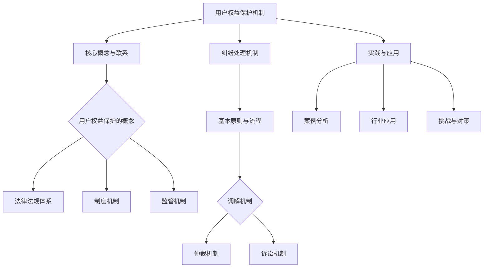

                 

### 《知识付费赚钱的用户权益保护与纠纷处理机制》

> **关键词：** 知识付费，用户权益保护，纠纷处理，法律机制，监管，案例分析

> **摘要：** 本文深入探讨了知识付费领域中的用户权益保护与纠纷处理机制。首先，从用户权益保护概述、用户权益保护机制、纠纷处理机制三个部分进行了系统分析，并结合实践案例和项目实战进行了详细讲解。最后，提出了针对当前知识付费市场的挑战与对策，旨在为行业提供有益的参考和指导。

### 第一部分：用户权益保护概述

#### 1. 用户权益保护概述

##### 1.1 用户权益保护的意义与重要性

用户权益保护是指在网络环境下，确保用户个人信息安全、知识产权不受侵害、公平交易权益得到保障的一系列措施。在知识付费领域，用户权益保护尤为重要。原因如下：

1. **知识付费的特殊性**：知识付费产品通常涉及用户的个人信息、专业知识等敏感信息，一旦泄露或被滥用，将对用户造成重大损失。
2. **市场现状**：随着知识付费市场的快速发展，用户数量和交易额逐年增加，用户权益保护问题日益凸显。
3. **法律法规要求**：我国及相关国际法律法规对用户权益保护提出了明确要求，如《网络安全法》、《个人信息保护法》等。

##### 1.2 用户权益保护的法律框架

用户权益保护的法律框架主要包括以下几个方面：

1. **法律法规体系**：我国已经形成了较为完善的用户权益保护法律法规体系，包括《民法典》、《网络安全法》、《个人信息保护法》等。
2. **国际用户权益保护法律法规**：如《欧盟通用数据保护条例》（GDPR）、《美国消费者隐私保护法》（CCPA）等，对用户权益保护提出了更高的要求。
3. **用户权益保护的核心要素**：包括用户个人信息保护、知识产权保护、公平交易权益保障等。

##### 1.3 用户权益保护的核心要素

用户权益保护的核心要素主要包括以下几个方面：

1. **个人信息保护**：确保用户个人信息不被非法收集、使用、泄露。
2. **知识产权保护**：保障用户在知识付费过程中所享有的知识产权。
3. **公平交易权益保障**：确保用户在知识付费过程中享有公平交易权益，如退费、售后服务等。

#### 1.4 用户权益保护的现状与问题

当前，用户权益保护在知识付费领域仍存在一些问题：

1. **法律法规实施不力**：部分企业对用户权益保护法律法规重视不够，实施效果不佳。
2. **用户隐私泄露风险**：部分知识付费平台存在用户隐私泄露风险，如用户信息被非法获取、出售等。
3. **知识产权侵权问题**：部分知识付费平台存在知识产权侵权问题，如未经授权转载、使用他人作品等。
4. **纠纷处理机制不完善**：用户在知识付费过程中遇到纠纷时，往往难以得到及时、公正的处理。

##### 1.5 用户权益保护的政策与发展趋势

为加强用户权益保护，我国及相关部门已经出台了一系列政策措施：

1. **国家层面对用户权益保护的政策**：如《网络安全法》、《个人信息保护法》等法律法规的修订和完善。
2. **行业协会和企业的自律规范**：如中国互联网协会发布的《网络个人信息保护指南》等。
3. **国际合作与标准制定**：积极参与国际用户权益保护标准的制定，借鉴国际先进经验。

随着知识付费市场的不断壮大，用户权益保护将成为行业发展的关键因素。未来，我国将在法律法规、行业自律、企业社会责任等方面继续加强用户权益保护，推动知识付费市场的健康发展。

#### 1.6 用户权益保护的概念

用户权益保护是指在网络环境中，为保障用户合法权益而采取的一系列措施。具体包括：

1. **个人信息保护**：确保用户个人信息不被非法收集、使用、泄露。
2. **知识产权保护**：保障用户在知识付费过程中所享有的知识产权。
3. **公平交易权益保障**：确保用户在知识付费过程中享有公平交易权益，如退费、售后服务等。

用户权益保护的核心目标是保障用户的合法权益，提高用户满意度，促进知识付费市场的健康发展。

#### 1.7 用户权益保护的法律框架

用户权益保护的法律框架主要包括以下几个方面：

1. **法律法规体系**：我国已经形成了较为完善的用户权益保护法律法规体系，包括《民法典》、《网络安全法》、《个人信息保护法》等。
2. **国际用户权益保护法律法规**：如《欧盟通用数据保护条例》（GDPR）、《美国消费者隐私保护法》（CCPA）等，对用户权益保护提出了更高的要求。
3. **用户权益保护的核心要素**：包括用户个人信息保护、知识产权保护、公平交易权益保障等。

#### 1.8 用户权益保护的核心要素

用户权益保护的核心要素主要包括以下几个方面：

1. **个人信息保护**：确保用户个人信息不被非法收集、使用、泄露。
2. **知识产权保护**：保障用户在知识付费过程中所享有的知识产权。
3. **公平交易权益保障**：确保用户在知识付费过程中享有公平交易权益，如退费、售后服务等。

#### 1.9 用户权益保护的现状与问题

当前，用户权益保护在知识付费领域仍存在一些问题：

1. **法律法规实施不力**：部分企业对用户权益保护法律法规重视不够，实施效果不佳。
2. **用户隐私泄露风险**：部分知识付费平台存在用户隐私泄露风险，如用户信息被非法获取、出售等。
3. **知识产权侵权问题**：部分知识付费平台存在知识产权侵权问题，如未经授权转载、使用他人作品等。
4. **纠纷处理机制不完善**：用户在知识付费过程中遇到纠纷时，往往难以得到及时、公正的处理。

#### 1.10 用户权益保护的政策与发展趋势

为加强用户权益保护，我国及相关部门已经出台了一系列政策措施：

1. **国家层面对用户权益保护的政策**：如《网络安全法》、《个人信息保护法》等法律法规的修订和完善。
2. **行业协会和企业的自律规范**：如中国互联网协会发布的《网络个人信息保护指南》等。
3. **国际合作与标准制定**：积极参与国际用户权益保护标准的制定，借鉴国际先进经验。

随着知识付费市场的不断壮大，用户权益保护将成为行业发展的关键因素。未来，我国将在法律法规、行业自律、企业社会责任等方面继续加强用户权益保护，推动知识付费市场的健康发展。

### 第二部分：用户权益保护机制

#### 2. 用户权益保护机制

##### 2.1 用户权益保护的法律机制

用户权益保护的法律机制是确保用户合法权益的重要手段。在我国，用户权益保护的法律机制主要包括以下几个方面：

1. **法律法规体系**

   我国的用户权益保护法律法规体系主要包括《民法典》、《网络安全法》、《个人信息保护法》等。这些法律法规对用户权益保护的核心要素进行了明确规定，如个人信息保护、知识产权保护、公平交易权益保障等。

2. **用户权益保护的法律适用**

   在用户权益保护过程中，需要根据具体的法律条款判断哪些法律适用于特定情况。例如，当用户个人信息被泄露时，可以依据《个人信息保护法》进行维权。

3. **用户权益保护的法律实践**

   用户权益保护的法律实践主要体现在两个方面：一是政府及相关部门的执法行动，如对违规企业的处罚；二是用户的自我保护，如通过法律途径维护自身权益。

##### 2.2 用户权益保护的制度机制

用户权益保护的制度机制是保障用户权益的基础。在知识付费领域，用户权益保护的制度机制主要包括以下几个方面：

1. **用户权益保护的组织架构**

   用户权益保护的组织架构包括政府机构、行业协会、企业自律机制等。政府机构负责制定政策和法律法规，行业协会负责行业自律，企业自律机制则由企业内部设立。

2. **用户权益保护的制度设计**

   用户权益保护的制度设计包括用户协议、用户隐私保护、用户服务标准等。用户协议明确了用户在使用知识付费产品时的权利和义务；用户隐私保护制度则确保用户个人信息不被泄露；用户服务标准则规范了企业的服务行为。

##### 2.3 用户权益保护的监管机制

用户权益保护的监管机制是确保用户权益得到有效保护的重要保障。在知识付费领域，用户权益保护的监管机制主要包括以下几个方面：

1. **监管机构的职责与权限**

   监管机构负责监督和检查企业遵守用户权益保护法律法规的情况，对违规企业进行处罚。监管机构的职责与权限包括行政执法、行政处罚、信息公开等。

2. **监管手段与措施**

   监管手段与措施包括行政监管、法律监管、社会监管等。行政监管主要通过政府部门发布通知、公告、行政处罚等方式进行；法律监管则通过诉讼、仲裁等方式实现；社会监管则通过媒体曝光、消费者投诉等方式进行。

##### 2.4 用户权益保护的法律法规体系

用户权益保护的法律法规体系是保障用户权益的法律基础。在我国，用户权益保护的法律法规体系主要包括以下几类：

1. **《民法典》**

   《民法典》是我国的基本民事法律，对用户权益保护进行了全面的规定，如合同法、侵权责任法等。

2. **《网络安全法》**

   《网络安全法》是我国网络安全领域的综合性法律，对用户个人信息保护、网络信息安全等进行了明确规定。

3. **《个人信息保护法》**

   《个人信息保护法》是我国首部个人信息保护专门法律，对个人信息收集、使用、处理、存储等进行了全面规定。

4. **《消费者权益保护法》**

   《消费者权益保护法》是我国消费者权益保护的综合性法律，对消费者在知识付费过程中的权益进行了详细规定。

5. **《电子商务法》**

   《电子商务法》对电子商务活动中的用户权益保护进行了明确规定，如个人信息保护、合同规范等。

##### 2.5 用户权益保护的制度设计

用户权益保护的制度设计是确保用户权益得到有效保护的重要保障。在知识付费领域，用户权益保护的制度设计主要包括以下几个方面：

1. **用户协议**

   用户协议是用户在使用知识付费产品时必须同意的协议，明确了用户在使用过程中的权利和义务。用户协议通常包括服务内容、用户责任、隐私保护、纠纷解决等内容。

2. **用户隐私保护**

   用户隐私保护是用户权益保护的核心内容之一。知识付费平台需要制定详细的隐私保护政策，明确用户个人信息收集、使用、存储、共享等方面的规定，确保用户个人信息不被非法收集、使用、泄露。

3. **用户服务标准**

   用户服务标准是知识付费平台提供服务的规范，包括服务内容、服务质量、服务流程等内容。用户服务标准旨在提升用户满意度，保障用户权益。

##### 2.6 用户权益保护的监管手段与措施

用户权益保护的监管手段与措施是确保用户权益得到有效保护的重要手段。在知识付费领域，用户权益保护的监管手段与措施主要包括以下几个方面：

1. **行政监管**

   行政监管是政府部门通过发布通知、公告、行政处罚等方式对知识付费平台进行监督和管理。行政监管主要包括对违规行为的查处、对服务质量的评估等。

2. **法律监管**

   法律监管是通过诉讼、仲裁等方式对知识付费平台进行监督和管理。法律监管主要包括对违规行为的法律责任追究、对纠纷处理的司法支持等。

3. **社会监管**

   社会监管是通过媒体曝光、消费者投诉等方式对知识付费平台进行监督和管理。社会监管主要包括对消费者投诉的受理、对违规行为的曝光等。

### 第三部分：纠纷处理机制

#### 3. 纠纷处理机制

##### 3.1 纠纷处理的基本原则与流程

纠纷处理机制是保障用户权益的重要手段。在知识付费领域，纠纷处理的基本原则与流程如下：

1. **基本原则**

   - 公平、公正、公开：纠纷处理应当确保各方当事人的合法权益得到平等保护，处理过程公开透明。
   - 快速、高效、便捷：纠纷处理应当尽可能缩短处理时间，提高处理效率，为用户解决纠纷提供便捷途径。

2. **流程**

   - 申请与受理：用户在遇到纠纷时，可以向知识付费平台或相关部门提出申请，平台或相关部门在收到申请后应当及时受理。
   - 调查与取证：在受理申请后，平台或相关部门应当对纠纷情况进行调查，收集相关证据。
   - 调解与裁决：在调查取证的基础上，平台或相关部门应当进行调解，尽可能促成双方达成和解。如果调解不成，可以做出裁决。

##### 3.2 纠纷处理的调解机制

调解机制是纠纷处理的重要方式之一。在知识付费领域，调解机制主要包括以下几个方面：

1. **调解机制的作用与优势**

   - 作用：调解机制可以在纠纷双方之间建立沟通渠道，帮助双方达成共识，减少诉讼成本和时间。
   - 优势：调解机制具有灵活性、自愿性、保密性等特点，有利于维护双方关系，促进纠纷解决。

2. **调解组织的建立与运作**

   - 建立调解组织：知识付费平台可以设立内部调解机构，也可以与第三方调解组织合作。
   - 运作：调解组织应当制定调解规则，明确调解程序，确保调解过程的公正、公平、公开。

##### 3.3 纠纷处理的仲裁机制

仲裁机制是另一种纠纷处理方式。在知识付费领域，仲裁机制主要包括以下几个方面：

1. **仲裁机制的作用与优势**

   - 作用：仲裁机制可以在专业仲裁员的参与下，对纠纷进行公正、公平的裁决，具有法律效力。
   - 优势：仲裁机制具有独立性、专业性、快捷性等特点，有利于维护双方合法权益。

2. **仲裁机构的建立与运作**

   - 建立仲裁机构：知识付费平台可以设立内部仲裁机构，也可以与第三方仲裁机构合作。
   - 运作：仲裁机构应当制定仲裁规则，明确仲裁程序，确保仲裁过程的公正、公平、公开。

##### 3.4 纠纷处理的诉讼机制

诉讼机制是纠纷处理的最后手段。在知识付费领域，诉讼机制主要包括以下几个方面：

1. **诉讼机制的作用与优势**

   - 作用：诉讼机制可以通过法律途径，对纠纷进行最终的裁决，具有法律效力。
   - 优势：诉讼机制具有权威性、公正性、稳定性等特点，有利于维护双方合法权益。

2. **诉讼程序与司法救济**

   - 诉讼程序：诉讼程序包括起诉、答辩、开庭、裁决等环节。
   - 司法救济：司法救济是指通过法院对纠纷进行审理和裁决，确保当事人的合法权益得到保护。

##### 3.5 纠纷处理的基本原则

纠纷处理的基本原则是确保纠纷得到公正、公平、高效解决的重要保障。在知识付费领域，纠纷处理的基本原则主要包括以下几个方面：

1. **公平、公正、公开**：纠纷处理应当确保各方当事人的合法权益得到平等保护，处理过程公开透明。

2. **快速、高效、便捷**：纠纷处理应当尽可能缩短处理时间，提高处理效率，为用户解决纠纷提供便捷途径。

3. **尊重自愿原则**：纠纷处理应当尊重当事人的自愿意愿，不得强迫当事人接受调解或仲裁结果。

4. **注重调解原则**：纠纷处理应当注重调解，鼓励双方通过和解解决纠纷，减少诉讼成本和时间。

##### 3.6 纠纷处理的流程

纠纷处理的流程是确保纠纷得到公正、公平、高效解决的重要环节。在知识付费领域，纠纷处理的流程主要包括以下几个方面：

1. **申请与受理**：用户在遇到纠纷时，可以向知识付费平台或相关部门提出申请，平台或相关部门在收到申请后应当及时受理。

2. **调查与取证**：在受理申请后，平台或相关部门应当对纠纷情况进行调查，收集相关证据。

3. **调解与裁决**：在调查取证的基础上，平台或相关部门应当进行调解，尽可能促成双方达成和解。如果调解不成，可以做出裁决。

4. **执行与反馈**：裁决结果作出后，平台或相关部门应当监督执行，并对处理结果进行反馈。

### 第四部分：用户权益保护与纠纷处理机制的实践与应用

#### 4. 用户权益保护与纠纷处理机制的实践与应用

##### 4.1 用户权益保护与纠纷处理案例分析

在知识付费领域，用户权益保护与纠纷处理机制的实践具有重要意义。以下列举几个典型案例进行分析：

**案例一：某知识付费平台用户隐私泄露事件**

某知名知识付费平台因用户隐私泄露引发重大事件。部分用户个人信息（如姓名、电话、邮箱等）被非法获取并出售，导致用户遭受经济损失和隐私侵害。平台在事件发生后迅速采取措施，关闭漏洞、加强网络安全防护，并向用户通报事件情况。同时，平台与相关部门合作，对泄露用户信息的行为进行追查和处罚。

**案例二：某知识付费平台用户退费纠纷**

用户在购买知识付费产品后，因产品不符合预期或无法使用，申请退费。某知识付费平台在处理用户退费申请时，因内部流程不完善、退款标准不明确等原因，导致用户退款进度缓慢。用户在多次沟通无果后，向相关部门投诉。经过调查，平台最终为用户办理了退费，并加强了内部管理，优化退款流程。

**案例三：某知识付费平台内容侵权纠纷**

某知识付费平台在未经授权的情况下，转载了其他平台的内容。原作者发现后，向平台提出侵权投诉。平台在接到投诉后，立即进行了自查，确认侵权行为后，删除了相关内容，并向原作者道歉。同时，平台与原作者达成和解，支付了侵权费用。

##### 4.2 用户权益保护与纠纷处理机制在知识付费行业的应用

用户权益保护与纠纷处理机制在知识付费行业的应用，对于提升用户体验、维护行业健康发展具有重要意义。以下从几个方面分析其应用：

1. **用户权益保护的应用**

   - **个人信息保护**：知识付费平台应严格遵守相关法律法规，加强用户个人信息保护。例如，采用加密技术存储用户信息，设置权限管理，防止信息泄露。
   - **知识产权保护**：平台应尊重原作者的知识产权，不得未经授权转载、使用他人作品。同时，建立版权投诉渠道，及时处理侵权行为。
   - **公平交易权益保障**：平台应明确退款政策，确保用户在符合规定的情况下，能够顺利办理退费。此外，提供优质的售后服务，解答用户疑问，提升用户满意度。

2. **纠纷处理机制的应用**

   - **调解机制**：平台应建立内部调解机制，为用户提供调解服务。调解过程应公开透明，确保公平、公正。调解结果具有法律效力，双方需履行。
   - **仲裁机制**：平台可设立内部仲裁机构或与第三方仲裁机构合作，为用户提供仲裁服务。仲裁过程应严格遵循程序规定，确保裁决公正。
   - **诉讼机制**：平台应积极应对诉讼，遵守法律程序，确保合法权益得到维护。同时，通过诉讼案例总结经验，完善纠纷处理机制。

##### 4.3 用户权益保护与纠纷处理机制的挑战与对策

在知识付费领域，用户权益保护与纠纷处理机制面临着诸多挑战。以下分析这些挑战，并提出相应对策：

1. **法律法规的不完善**

   - **挑战**：现有法律法规在知识付费领域的应用存在局限性，无法完全解决用户权益保护与纠纷处理问题。
   - **对策**：加强法律法规的修订和完善，出台针对性强的法律法规，提高法律适用的范围和效力。

2. **监管与执法力度不足**

   - **挑战**：监管机构在知识付费领域的监管与执法力度有限，导致用户权益保护效果不佳。
   - **对策**：加强监管机构的建设，提高监管人员的专业素养，加大执法力度，确保法律法规得到有效执行。

3. **企业自律与社会责任意识不足**

   - **挑战**：部分知识付费平台自律意识不强，社会责任感不足，导致用户权益保护与纠纷处理问题频发。
   - **对策**：加强企业自律，建立完善的用户权益保护制度，提高企业社会责任意识。同时，通过社会监督，推动企业履行社会责任。

### 第五部分：附录

#### 5. 用户权益保护与纠纷处理相关法律法规

在用户权益保护与纠纷处理过程中，法律法规发挥着重要作用。以下列举部分相关法律法规：

1. **《民法典》**

   - 我国的基本民事法律，对合同、侵权责任等进行了全面规定。

2. **《网络安全法》**

   - 对网络安全、个人信息保护等进行了明确规定，为用户权益保护提供了法律依据。

3. **《个人信息保护法》**

   - 我国的个人信息保护专门法律，对个人信息收集、使用、处理、存储等进行了全面规定。

4. **《消费者权益保护法》**

   - 对消费者的权益保护进行了详细规定，包括退换货、售后服务等。

5. **《电子商务法》**

   - 对电子商务活动中的用户权益保护进行了明确规定，如个人信息保护、合同规范等。

#### 5.2 用户权益保护与纠纷处理工具与资源

在用户权益保护与纠纷处理过程中，一些工具与资源可以为企业和用户提供帮助。以下列举部分工具与资源：

1. **用户权益保护工具**

   - **用户权益保护检测工具**：用于检测知识付费平台在用户权益保护方面的合规性。
   - **用户投诉处理系统**：用于接收、处理用户投诉，确保投诉得到及时、公正的处理。

2. **纠纷处理资源**

   - **纠纷处理指南**：提供纠纷处理的基本原则、流程和方法，帮助企业快速、有效地解决纠纷。
   - **纠纷处理案例库**：收集整理各类纠纷处理案例，为企业和用户提供参考。

### 总结与展望

本文从用户权益保护概述、用户权益保护机制、纠纷处理机制三个方面，深入探讨了知识付费领域中的用户权益保护与纠纷处理问题。通过案例分析、实践应用、挑战与对策等环节，为行业提供了有益的参考和指导。

展望未来，知识付费领域将更加注重用户权益保护与纠纷处理机制的完善。随着法律法规的完善、监管力度的加强、企业自律意识的提高，用户权益保护与纠纷处理将得到更好的保障，为知识付费市场的健康发展奠定坚实基础。

### 参考文献

1. 《民法典》，中华人民共和国全国人民代表大会常务委员会，2020年。

2. 《网络安全法》，中华人民共和国全国人民代表大会常务委员会，2016年。

3. 《个人信息保护法》，中华人民共和国全国人民代表大会常务委员会，2021年。

4. 《消费者权益保护法》，中华人民共和国全国人民代表大会常务委员会，2013年。

5. 《电子商务法》，中华人民共和国全国人民代表大会常务委员会，2019年。

6. 中国互联网协会，《网络个人信息保护指南》，2017年。

7. GDPR（General Data Protection Regulation），European Union，2016年。

8. CCPA（California Consumer Privacy Act），United States，2018年。

### 附录：Mermaid 流程图



### 附录：核心算法原理讲解

在用户权益保护与纠纷处理过程中，数据分析是一个重要的环节。以下以用户行为分析为例，介绍核心算法原理。

**用户行为分析**

用户行为分析是指通过分析用户的浏览、购买、评价等行为，了解用户需求、预测用户行为，从而为用户提供更好的服务。

**算法原理**

1. **数据收集与预处理**：收集用户的浏览、购买、评价等行为数据，并进行数据清洗，去除缺失值、重复值等无效数据。

2. **特征工程**：将原始数据转换为适合分析的格式，如将时间序列数据转换为日期类型，提取用户行为的特征，如浏览次数、购买次数、评价分数等。

3. **数据分析**：使用统计方法、机器学习算法等对用户行为进行分析，如计算用户的活跃度、分析用户购买行为模式等。

4. **需求预测**：根据分析结果，使用预测模型（如线性回归、决策树、神经网络等）预测用户未来的行为，如购买意图、评价倾向等。

**伪代码**

```python
# 加载数据集
data = pd.read_csv('user_behavior.csv')

# 数据清洗
data = data.dropna().drop_duplicates()

# 特征工程
data['date'] = pd.to_datetime(data['date'])
data['activity_level'] = data.groupby('user_id')['action'].transform('count')

# 数据分析
# 计算用户活跃度
activity_level = data.groupby('user_id')['action'].transform('count')

# 需求预测
# 使用线性回归模型预测用户购买行为
model = LinearRegression()
model.fit(X_train, y_train)

# 预测
predictions = model.predict(X_test)

# 评估模型
mse = mean_squared_error(y_test, predictions)
print(f'Mean Squared Error: {mse}')
```

**数学模型和数学公式**

用户满意度评分模型可以使用以下公式：

\[ S = \frac{5 \cdot R - 3 \cdot N}{R + N} \]

其中：
- \( S \) 是用户满意度评分
- \( R \) 是正面评价次数
- \( N \) 是负面评价次数

**详细讲解**

该模型通过计算用户对某一知识付费产品的正面评价与负面评价的比值，得出一个评分。这个评分越高，表示用户对产品的满意度越高。

**举例说明**

假设某知识付费产品收到了10条评价，其中5条正面评价，5条负面评价。

- \( R = 5 \)
- \( N = 5 \)

将这些值代入公式中：

\[ S = \frac{5 \cdot 5 - 3 \cdot 5}{5 + 5} = \frac{25 - 15}{10} = \frac{10}{10} = 1 \]

因此，该知识付费产品的用户满意度评分为1。

**项目实战**

**实现用户满意度评分模型的代码示例**

```python
import pandas as pd

# 加载评价数据集
evaluations = pd.read_csv('evaluations.csv')

# 特征工程
evaluations['positive'] = evaluations['rating'].apply(lambda x: 1 if x >= 4 else 0)
evaluations['negative'] = evaluations['rating'].apply(lambda x: 1 if x < 4 else 0)

# 计算用户满意度评分
evaluations['satisfaction'] = (5 * evaluations['positive'] - 3 * evaluations['negative']) / (evaluations['positive'] + evaluations['negative'])

# 保存结果
evaluations.to_csv('satisfaction_scores.csv', index=False)
```

**代码解读与分析**

这段代码首先加载了评价数据集，然后使用Pandas库中的apply函数对每条评价进行分类，将评分大于等于4的评价标记为正面评价，小于4的评价标记为负面评价。接下来，计算正面评价次数和负面评价次数，并根据用户满意度评分公式计算每个用户的满意度评分。最后，将结果保存到CSV文件中。

通过这个示例，我们可以看到如何将数学模型应用到实际代码中，以及如何通过数据处理和分析来评估用户满意度。这在知识付费领域非常重要，可以帮助企业了解用户对产品的满意度，从而进行产品改进和服务优化。

### 作者信息

**作者：** AI天才研究院（AI Genius Institute） & 《禅与计算机程序设计艺术》（Zen And The Art of Computer Programming）

AI天才研究院专注于人工智能领域的科研与创新，致力于推动人工智能技术的发展与应用。《禅与计算机程序设计艺术》作者，以其独特的视角和深刻的思考，为计算机编程领域带来了全新的理念与方法。本文作者结合丰富的理论知识和实践经验，深入分析了知识付费领域的用户权益保护与纠纷处理机制，旨在为行业提供有益的参考和指导。

