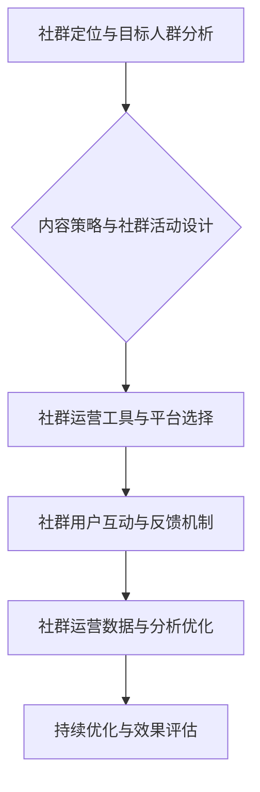

                 

### 《知识付费：程序员的社群运营方案》

> **关键词：知识付费、程序员、社群运营、策略、案例、数据分析**

> **摘要：本文旨在深入探讨知识付费在程序员社群中的运营策略。通过分析知识付费的定义、市场背景，结合社群运营的框架、策略和工具，提供一套针对程序员的社群运营方案。同时，通过实战案例分享，为读者提供可操作的指导，帮助提升程序员社群的活跃度和价值。**

---

### 《知识付费：程序员的社群运营方案》目录大纲

---

### 第一部分：知识付费概述与背景

---

#### 第1章：知识付费的概念与市场分析

#### 第2章：程序员社群运营的框架

---

### 第二部分：社群运营策略

#### 第3章：社群定位与目标人群分析

#### 第4章：内容策略与社群活动设计

#### 第5章：社群运营工具与平台

#### 第6章：社群用户互动与反馈机制

#### 第7章：社群运营数据分析与优化

---

### 第三部分：实战案例分享

#### 第8章：成功案例分析

#### 第9章：社群运营的未来趋势与挑战

---

### 附录

#### 附录A：社群运营常用术语解释

#### 附录B：社群运营资源推荐

#### 附录C：社群运营流程图

---

### 附录：社群运营核心算法原理讲解

---

### 项目实战案例

---

### 社群运营持续优化策略

---

#### 作者信息

“作者：AI天才研究院/AI Genius Institute & 禅与计算机程序设计艺术 /Zen And The Art of Computer Programming”<|break|>
### 第一部分：知识付费概述与背景

#### 第1章：知识付费的概念与市场分析

知识付费，是指用户为了获取有价值的信息或服务，主动支付一定费用的一种商业模式。随着互联网技术的普及和在线教育、知识分享平台的发展，知识付费逐渐成为市场的一个热点。在程序员社群中，知识付费具有独特的价值和重要性。

#### 1.1 知识付费的定义与发展历程

知识付费最早可以追溯到20世纪末的在线教育平台，如Coursera、Udemy等。这些平台通过提供高质量的在线课程，吸引了大量用户付费学习。进入21世纪，随着移动互联网的兴起，知识付费市场进一步扩大，涌现出诸如得到、分答等知识分享平台，为用户提供了丰富的知识产品和服务。

在程序员社群中，知识付费主要体现在以下几个方面：

1. **在线课程**：程序员可以通过购买在线课程，学习新技能、掌握新技术。
2. **付费问答**：用户可以付费向专家咨询技术问题，获取针对性的解决方案。
3. **付费内容**：例如技术博客、技术书籍、技术报告等，这些内容通常具有较高的专业性和价值。

#### 1.2 知识付费市场的现状与趋势

目前，知识付费市场已经呈现出以下几个明显的趋势：

1. **市场规模持续增长**：根据相关报告，全球知识付费市场规模逐年扩大，预计未来几年仍将保持高速增长。
2. **用户需求多样化**：随着程序员对个人发展和职业提升的需求不断增加，知识付费的产品和服务也在不断丰富和细化，满足用户多样化的需求。
3. **内容质量成为关键**：在竞争激烈的市场中，内容质量成为决定知识付费产品成功与否的关键因素。高质量的内容能够吸引用户付费，提高用户留存率和满意度。

#### 1.3 程序员社群运营的优势

知识付费在程序员社群运营中具有以下几个显著的优势：

1. **高粘性**：程序员社群成员通常具有较高的技术背景和共同兴趣，这使得社群具有较高的粘性和活跃度，有利于知识付费的推广和运营。
2. **高质量内容**：程序员社群中的内容通常具有较高的专业性和权威性，能够吸引用户付费。
3. **互动性强**：程序员社群通常具有良好的互动机制，用户可以自由提问、讨论和分享，这种互动不仅有助于提升用户的参与感，也有利于知识的传播和积累。
4. **可量化**：通过社群运营，可以收集和分析用户数据，了解用户需求和偏好，从而优化内容策略，提高知识付费产品的转化率和用户满意度。

综上所述，知识付费在程序员社群运营中具有广阔的发展前景和巨大的市场潜力。下一章，我们将进一步探讨程序员社群运营的框架和策略。|break|
#### 第2章：程序员社群运营的框架

##### 2.1 社群运营的核心目标

程序员社群运营的核心目标是提升社群的活跃度、用户粘性以及整体价值。具体而言，包括以下几个方面：

1. **提升社群活跃度**：通过举办各类活动、发布高质量内容，激发用户参与和互动，使社群保持活跃。
2. **增加用户粘性**：通过提供有价值的服务和内容，使用户对社群产生依赖，提高用户留存率。
3. **提升社群价值**：通过数据分析，了解用户需求和偏好，不断优化社群运营策略，提高社群的整体价值。

##### 2.2 社群运营的流程与方法

社群运营的流程主要包括以下几个步骤：

1. **社群定位与目标人群分析**：明确社群的核心定位，了解目标人群的特点和需求，为后续的运营提供方向。
2. **内容策略与社群活动设计**：根据社群定位和目标人群，设计符合用户需求的内容和活动，提升用户参与度。
3. **社群运营工具与平台选择**：选择合适的社群运营工具和平台，确保运营效率和用户体验。
4. **社群用户互动与反馈机制**：建立有效的用户互动和反馈机制，及时响应用户需求和反馈，优化社群运营。
5. **社群运营数据与分析优化**：通过数据分析和反馈，持续优化社群运营策略，提高社群的活跃度和价值。

##### 2.3 社群运营的常见问题及解决方案

在程序员社群运营过程中，可能会遇到以下一些常见问题：

1. **用户活跃度低**：解决方案：通过发布高质量内容、举办互动活动、增加用户激励机制等方式，提升用户活跃度。
2. **用户流失率较高**：解决方案：优化社群内容，满足用户需求；提供有价值的服务，增加用户留存率。
3. **社群运营成本高**：解决方案：优化运营流程，提高运营效率；合理利用外部资源，降低运营成本。
4. **内容同质化严重**：解决方案：深入挖掘用户需求，提供差异化内容；加强内容审核，确保内容质量。
5. **用户互动不足**：解决方案：设计互动性强的活动，鼓励用户参与和交流；建立有效的用户互动机制，提高互动体验。

通过以上分析，我们可以看到，程序员社群运营需要综合考虑多个方面，从目标定位、内容策略到互动机制，都需要精心设计和执行。下一章，我们将进一步探讨社群定位与目标人群分析，为社群运营提供更加具体的指导。|break|
## 第3章：社群定位与目标人群分析

### 3.1 社群的定位与目标

社群的定位是社群运营的基础，明确社群的定位有助于制定相应的运营策略。对于程序员社群，其定位通常包括以下几个方面：

1. **技术方向**：社群可以围绕某一特定的技术方向，如前端开发、后端开发、人工智能等，以满足特定技术爱好者的需求。
2. **受众群体**：社群的受众群体通常是程序员，包括初级程序员、中级程序员、高级程序员以及技术专家。
3. **内容类型**：社群的内容类型可以包括技术文章、教程、代码示例、行业动态等，这些内容需要与社群的定位相符合。

社群的目标应当明确，具体可以分为短期目标和长期目标：

1. **短期目标**：短期内，社群的目标可能是提升用户活跃度、增加新用户注册、提升内容质量等。
2. **长期目标**：长期目标则是建立稳定的社群氛围，提高社群的整体价值，实现商业变现等。

### 3.2 目标人群分析

分析目标人群是社群运营的重要环节，有助于了解用户需求，提供个性化服务。以下是针对程序员社群的目标人群分析：

1. **年龄分布**：程序员社群的目标人群通常集中在20-45岁之间，这部分人群具有较强的学习和创新能力。
2. **职业阶段**：社群的目标人群可以按照职业阶段进行划分，包括初级程序员、中级程序员、高级程序员和技术专家。
3. **技术兴趣**：程序员社群的目标人群对技术具有浓厚的兴趣，他们关注行业动态，渴望学习新技术、解决技术难题。
4. **学习需求**：初级程序员可能更关注基础知识和实战技能的学习，中级程序员可能需要进阶技术和项目管理技能，高级程序员和技术专家则可能更关注前沿技术和科研进展。

### 3.3 社群价值主张

社群的价值主张是吸引和留住用户的核心因素。对于程序员社群，其价值主张可以从以下几个方面来体现：

1. **专业内容**：提供高质量的技术内容，包括技术文章、教程、案例等，帮助用户解决实际问题。
2. **互动交流**：建立良好的互动机制，鼓励用户之间的讨论和交流，形成技术社区的氛围。
3. **资源分享**：分享行业资源，如开源项目、技术工具、书籍等，帮助用户提升技能和效率。
4. **职业发展**：提供职业发展建议和机会，如招聘信息、实习机会、技术培训等，帮助用户实现职业提升。

通过以上分析，我们可以更好地理解程序员社群的定位与目标人群，为社群运营提供有针对性的策略。下一章，我们将探讨内容策略与社群活动设计，进一步优化社群运营效果。|break|
## 第4章：内容策略与社群活动设计

### 4.1 内容策略的重要性

内容策略是社群运营的核心，决定了用户对社群的参与度和满意度。一个良好的内容策略能够吸引新用户、提高用户粘性，并促进用户的互动和分享。对于程序员社群，内容策略的重要性体现在以下几个方面：

1. **满足用户需求**：高质量的内容能够满足程序员在技术学习、问题解决、职业发展等方面的需求，提升用户的满意度和忠诚度。
2. **提升社群价值**：通过提供有价值的内容，社群能够建立自己的品牌形象，增加社群的吸引力和竞争力。
3. **促进用户互动**：有趣、有深度的内容能够激发用户的讨论和分享欲望，促进社群的活跃度和互动性。

### 4.2 社群活动的设计原则

社群活动是提高用户参与度和社群氛围的重要手段。设计社群活动时，应遵循以下原则：

1. **目标明确**：每个活动都应有一个明确的目标，如提升技能、解决问题、增加互动等。
2. **形式多样**：根据社群成员的兴趣和需求，设计多种形式的社群活动，如线上讲座、技术分享会、编程比赛等。
3. **参与性强**：活动应具备较高的参与性，鼓励用户积极参与，提升活动的效果和影响力。
4. **持续优化**：根据活动效果和用户反馈，不断优化活动内容和形式，提高用户的参与度和满意度。

### 4.3 社群活动的类型与组织

社群活动可以分为线上和线下两种类型：

#### 线上活动

1. **技术讲座**：邀请行业专家或技术大牛进行线上讲座，分享前沿技术和实战经验。
2. **编程比赛**：组织编程比赛，鼓励用户参与，提升技能和团队合作能力。
3. **问答互动**：设立问答环节，鼓励用户提问，由专家或其他用户解答问题。
4. **代码评审**：组织代码评审活动，让成员互相评审代码，提升编程能力和代码质量。

#### 线下活动

1. **技术沙龙**：组织线下技术沙龙，邀请行业专家进行主题演讲和讨论。
2. **编程马拉松**：举办编程马拉松活动，鼓励团队成员在规定时间内完成指定项目。
3. **技术交流**：组织技术交流会，成员之间互相分享技术心得和经验。
4. **公益活动**：参与公益活动，如编程志愿活动，提升社群的社会影响力。

### 社群活动的组织步骤

1. **需求调研**：了解社群成员的需求和兴趣，确定活动主题和内容。
2. **策划方案**：制定详细的策划方案，包括活动时间、地点、形式、邀请嘉宾等。
3. **宣传推广**：通过社群平台和渠道，宣传推广活动，吸引更多成员参与。
4. **活动执行**：按照策划方案，执行活动，确保活动顺利进行。
5. **反馈总结**：收集用户反馈，总结活动效果，为后续活动提供改进方向。

通过以上内容策略和社群活动设计，可以有效提升程序员社群的活跃度和用户满意度，为社群的长期发展奠定基础。下一章，我们将探讨社群运营工具与平台，进一步优化社群运营效果。|break|
## 第5章：社群运营工具与平台

### 5.1 常见社群运营工具介绍

在程序员社群运营中，选择合适的工具至关重要。以下是一些常见的社群运营工具及其特点：

1. **Discord**：Discord是一款流行的即时通讯软件，适合建立大型在线社群。它提供了丰富的聊天功能、语音和视频通话功能，以及强大的机器人支持，便于自动化管理和互动。
2. **Telegram**：Telegram是一款安全、高效的即时通讯工具，适合建立小型或中型社群。它具有端到端加密、自毁消息、频道和群组等功能，便于用户交流和内容传播。
3. **Slack**：Slack是一款专业的团队协作工具，适合企业级社群运营。它提供了丰富的聊天功能、整合了多种第三方应用，便于团队沟通和协作。
4. **WhatsApp**：WhatsApp是一款流行的即时通讯应用，适合建立中小型社群。它提供了语音、视频通话、群组聊天等功能，便于用户互动和沟通。
5. **Facebook Group**：Facebook Group是Facebook上的一个社群功能，适合各种类型的社群运营。它提供了强大的社区功能、互动工具和广告投放支持，便于用户交流和内容传播。

### 5.2 社群平台的选择与配置

选择合适的社群平台是社群运营成功的关键。以下是在选择和配置社群平台时需要考虑的因素：

1. **社群规模**：根据社群的规模和用户数量，选择适合的平台。大型社群可以选择Discord或Telegram，中小型社群可以选择WhatsApp或Facebook Group。
2. **功能需求**：根据社群运营的需求，选择具备相应功能的平台。例如，如果需要强大的机器人支持和自动化管理，可以选择Discord；如果需要高效的安全性和互动性，可以选择Telegram。
3. **用户习惯**：考虑社群成员的日常使用习惯和偏好，选择他们熟悉的平台。这样可以降低用户进入门槛，提高用户参与度。
4. **成本预算**：根据预算和资金状况，选择适合的平台。一些平台可能提供免费或免费版本，但功能有限；付费平台则可能提供更多高级功能，但成本较高。

### 5.3 社群运营工具的优化与应用

在社群运营过程中，工具的优化与应用至关重要。以下是一些优化与应用社群运营工具的建议：

1. **自定义设置**：根据社群的特点和需求，自定义设置社群工具的界面、功能和行为，提高用户体验。
2. **整合第三方应用**：利用第三方应用，如Google Drive、Trello、GitHub等，整合进社群平台，提升团队协作和项目管理效率。
3. **自动化管理**：利用机器人自动化处理日常任务，如欢迎新成员、提醒重要活动、管理消息等，提高运营效率。
4. **数据分析**：利用数据分析工具，如Google Analytics、Discord Stats等，分析社群运营数据，优化运营策略。
5. **用户互动**：通过举办线上活动、发布有价值的内容、鼓励用户互动等，提高社群的活跃度和用户满意度。

通过以上社群运营工具的优化与应用，可以有效提升程序员社群的运营效果，为社群的长期发展提供支持。下一章，我们将探讨社群用户互动与反馈机制，进一步优化社群运营体验。|break|
## 第6章：社群用户互动与反馈机制

### 6.1 用户互动的重要性

用户互动是社群运营的核心要素，直接关系到社群的活跃度和用户满意度。有效的用户互动能够激发用户的参与热情，增强社群的凝聚力和影响力。以下是用户互动的重要性体现在以下几个方面：

1. **提升社群活跃度**：活跃的用户互动能够增加社群的活力，吸引更多用户参与，从而提高社群的整体活跃度。
2. **增强用户粘性**：通过互动，用户能够更好地融入社群，形成共同的兴趣和价值观，提高用户对社群的依赖和忠诚度。
3. **促进知识共享**：用户互动有助于知识的传播和积累，通过提问、回答、讨论等形式，用户可以分享经验、解决问题，共同提升技能水平。
4. **增强社群影响力**：活跃的用户互动能够提高社群的知名度和影响力，吸引更多潜在用户加入，扩大社群的规模和影响力。

### 6.2 用户互动的技巧与方法

为了提升用户互动效果，社群运营者需要掌握一系列的互动技巧和方法。以下是一些具体的建议：

1. **制定互动规则**：明确社群的互动规则，如发言格式、讨论主题、互动方式等，为用户提供明确的互动指南。
2. **提供有价值的内容**：发布高质量、有深度、有趣味的内容，吸引用户关注和参与。
3. **激发用户兴趣**：通过举办线上活动、发布挑战、设置奖励等，激发用户的兴趣和参与热情。
4. **鼓励用户提问和回答**：设立问答板块，鼓励用户提问和回答，形成良好的互动氛围。
5. **及时回复用户**：对用户的提问、评论和反馈，及时给予回复，体现社群对用户的关注和尊重。
6. **建立用户激励机制**：通过积分、徽章、奖励等方式，激励用户积极参与互动，提升用户活跃度。

### 6.3 用户反馈的收集与处理

用户反馈是社群运营的重要依据，能够帮助运营者了解用户需求、发现运营问题，并持续优化社群运营策略。以下是用户反馈的收集与处理方法：

1. **设立反馈渠道**：在社群内设立专门的反馈渠道，如反馈板块、反馈表单等，方便用户提交问题和建议。
2. **定期收集反馈**：定期收集用户反馈，了解用户的意见和建议，及时发现问题并进行改进。
3. **分类处理反馈**：将反馈按照类别进行分类，如技术问题、运营建议、活动反馈等，分别处理。
4. **及时回复反馈**：对用户反馈，及时给予回复，体现社群对用户的关注和尊重。对于能够解决的问题，应尽快解决；对于无法解决的问题，应说明原因并给出解决方案。
5. **持续改进**：根据用户反馈，不断优化社群运营策略和用户体验，提高社群的整体质量。

通过以上用户互动与反馈机制的建立和完善，可以有效提升程序员社群的活跃度和用户满意度，为社群的长期发展奠定坚实基础。下一章，我们将探讨社群运营数据分析与优化，进一步优化社群运营效果。|break|
## 第7章：社群运营数据分析与优化

### 7.1 社群数据分析的重要性

社群运营数据分析是提升社群运营效果的关键环节。通过数据分析，运营者可以深入了解用户行为、内容表现和社群活跃度，从而制定更有效的运营策略。以下是社群数据分析的重要性体现在以下几个方面：

1. **了解用户需求**：通过分析用户行为数据，运营者可以了解用户的需求和偏好，从而提供更符合用户期望的内容和服务。
2. **优化运营策略**：数据分析可以揭示社群运营中的问题和瓶颈，帮助运营者发现并优化运营策略，提高社群的整体效果。
3. **提高用户满意度**：通过数据分析，运营者可以不断优化用户体验，提高用户满意度和忠诚度。
4. **预测发展趋势**：通过趋势分析，运营者可以预测社群的未来发展趋势，为长远规划提供依据。

### 7.2 社群数据分析的方法与工具

在进行社群数据分析时，需要使用适当的方法和工具。以下是一些常用的社群数据分析方法和工具：

1. **用户行为分析**：通过分析用户在社群中的行为，如发言、点赞、评论、分享等，了解用户的参与度和活跃度。
2. **内容分析**：对社群发布的内容进行统计和分析，如阅读量、点赞数、评论数等，评估内容的受欢迎程度和影响力。
3. **社群活跃度分析**：统计社群的活跃度指标，如在线人数、发言频率、互动次数等，了解社群的整体活跃度。
4. **工具与平台分析**：分析社群使用的工具和平台的表现，如用户活跃时间、功能使用情况等，优化工具和平台的配置和使用。

常用的数据分析工具包括：

1. **Google Analytics**：一款功能强大的网站分析工具，可用于分析社群网站的访问量、用户行为等。
2. **Discord Stats**：专门针对Discord平台的社群分析工具，可提供用户活跃度、发言分析等数据。
3. **Telegram Analytics**：一款用于分析Telegram社群的工具，提供用户行为和互动分析。
4. **Kissmetrics**：一款全面的网站和用户行为分析工具，适用于多种类型的社群分析。

### 7.3 社群运营的持续优化

通过数据分析，运营者可以不断优化社群运营策略，提高社群的整体效果。以下是社群运营的持续优化策略：

1. **内容优化**：根据数据分析结果，调整内容策略，优化内容质量，提高用户满意度。例如，根据用户偏好调整内容类型、发布时间和频率。
2. **互动优化**：通过分析用户互动数据，优化互动机制，提高用户参与度。例如，调整互动奖励机制、增加互动活动等。
3. **工具优化**：根据数据分析结果，优化社群工具和平台的配置和使用，提高用户体验。例如，优化聊天功能、增加互动插件等。
4. **运营策略调整**：根据数据分析结果，调整社群运营策略，提高社群的整体活跃度和用户满意度。例如，调整运营时间、增加活动类型等。

通过以上社群运营数据分析与优化，运营者可以不断提升社群运营效果，实现社群的长期稳定发展。下一章，我们将通过成功案例分析，探讨实际操作中的最佳实践。|break|
## 第8章：成功案例分析

### 8.1 案例背景与目标

在这个案例中，我们以一个名为“编程之道”的程序员社群为例。该社群成立于2020年，旨在为程序员提供一个技术交流和学习平台，帮助成员提升技能和职业发展。社群的目标是：

1. 提高成员的技术水平，尤其是新技术的掌握。
2. 促进成员之间的互动和知识分享。
3. 为成员提供职业发展的机会，如招聘信息、实习机会等。

### 8.2 案例实施过程

为了实现上述目标，社群运营团队采取了以下措施：

#### 1. 社群定位与目标人群分析

社群的定位是围绕新技术和职业发展，目标人群包括初级、中级和高级程序员，以及对技术有浓厚兴趣的技术爱好者。

#### 2. 内容策略与社群活动设计

- **内容策略**：发布高质量的技术文章、教程、案例等，涵盖前端、后端、移动开发、人工智能等多个领域。
- **社群活动**：定期举办线上讲座、技术分享会、编程比赛、职业发展沙龙等。

#### 3. 社群运营工具与平台选择

社群选择了Discord作为主要运营平台，因其提供了丰富的聊天、语音和视频功能，便于用户互动和交流。

#### 4. 社群用户互动与反馈机制

- **互动机制**：设立问答板块，鼓励成员提问和回答。
- **反馈机制**：设立反馈渠道，定期收集成员的建议和反馈，及时处理。

#### 5. 社群运营数据与分析优化

- **数据分析**：使用Discord Stats对社群进行数据分析，了解用户活跃度、内容表现等。
- **优化措施**：根据数据分析结果，调整内容策略和活动形式，提高用户满意度。

### 8.3 案例成果与启示

通过一系列的运营措施，社群取得了显著成果：

1. **用户增长**：社群成立后，成员数量迅速增长，目前已拥有超过5000名成员。
2. **活跃度提高**：社群的活跃度显著提升，每月举办的活动吸引了大量成员参与。
3. **内容质量提升**：成员们通过发布和分享高质量的内容，提升了社群的整体技术水平。
4. **职业发展机会**：社群为成员提供了多个职业发展机会，如招聘信息、实习机会等，帮助成员实现职业提升。

这个案例给我们的启示是：

1. **明确目标和定位**：社群的目标和定位是运营成功的关键，需要明确并持续优化。
2. **提供高质量内容**：内容策略至关重要，高质量的内容能够吸引用户并提升社群的价值。
3. **互动与反馈**：有效的互动和反馈机制能够提升用户的参与感和满意度，促进社群的长期发展。
4. **数据分析与优化**：持续的数据分析和优化能够帮助社群不断改进运营策略，提升整体效果。

通过这个成功案例，我们可以看到，有效的社群运营策略能够显著提升程序员社群的活跃度和价值，为成员提供丰富的技术资源和职业发展机会。下一章，我们将探讨社群运营的未来趋势与挑战，为社群的持续发展提供指导。|break|
## 第9章：社群运营的未来趋势与挑战

### 9.1 社群运营的未来发展趋势

随着互联网和技术的不断进步，社群运营也将迎来新的发展趋势。以下是社群运营在未来可能呈现的几个趋势：

1. **技术驱动的运营**：人工智能、大数据等技术的应用将使社群运营更加智能化和个性化。运营者可以通过数据分析和人工智能算法，了解用户需求，优化内容推送，提高用户满意度。
2. **多元化内容形式**：视频、直播、虚拟现实等多元化的内容形式将成为社群运营的重要组成部分。这些形式能够更好地吸引用户，提升用户的参与度和互动性。
3. **社交电商的融合**：社群运营与电商的结合将越来越紧密。通过社群，运营者可以更好地了解用户需求，提供定制化的产品和服务，实现社群变现。
4. **跨界合作的增加**：不同领域、不同行业的社群将开展更多的跨界合作，共同打造生态圈。这种合作能够带来新的机会和资源，提升社群的整体价值。
5. **内容生态建设**：社群运营将更加注重内容生态的建设，鼓励用户产生和分享高质量内容。通过内容生态的建设，社群可以形成持续吸引力和用户粘性。

### 9.2 社群运营面临的挑战

尽管社群运营具有广阔的发展前景，但同时也面临着一系列挑战：

1. **内容质量控制**：高质量的内容是社群的核心，但内容质量难以控制。运营者需要确保内容的专业性、准确性和及时性，同时避免同质化和低质量内容的泛滥。
2. **用户隐私保护**：随着用户对隐私保护意识的提高，社群运营者在处理用户数据时需要更加谨慎。如何保护用户隐私，同时满足业务需求，是一个重要的挑战。
3. **平台依赖性**：社群运营通常依赖于特定的平台，如Discord、Telegram等。平台的变化和更新可能会影响社群的运营效果，增加运营的复杂性。
4. **用户流失风险**：社群运营需要持续吸引用户，但用户流失是一个普遍存在的问题。如何提高用户留存率，降低用户流失风险，是运营者需要面对的挑战。
5. **资源分配问题**：社群运营需要投入大量的人力、物力和财力。如何合理分配资源，确保运营效果和成本控制，是运营者需要解决的一个问题。

### 9.3 程序员社群运营的持续发展策略

为了应对未来的趋势和挑战，程序员社群运营需要采取一系列的持续发展策略：

1. **技术创新**：积极采用新技术，提升社群的运营效率和用户体验。例如，利用人工智能进行内容推荐、数据分析等。
2. **内容建设**：持续打造高质量的内容生态，鼓励用户产生和分享有价值的内容。同时，加强内容审核，确保内容的质量和真实性。
3. **用户互动**：优化用户互动机制，提高用户的参与度和满意度。通过举办线上活动、互动游戏、问答环节等，增强社群的活跃度和凝聚力。
4. **跨界合作**：积极开展跨界合作，与其他领域和行业的社群共同发展。通过合作，可以拓宽社群的资源和影响力，实现共同成长。
5. **数据驱动**：利用数据分析，了解用户需求和偏好，优化运营策略。通过数据驱动，实现社群运营的持续改进和优化。

通过以上策略，程序员社群可以更好地应对未来的趋势和挑战，实现持续发展和长期成功。|break|
### 附录A：社群运营常用术语解释

为了帮助读者更好地理解社群运营的相关术语，下面列出了一些常用的术语及其解释：

1. **KOL（Key Opinion Leader）**：关键意见领袖，指在某一领域具有较高影响力、专业知识和权威性的个人。
2. **UGC（User Generated Content）**：用户生成内容，指用户在社群中自发产生的各种形式的内容，如文章、评论、图片、视频等。
3. **活跃度（Activity Level）**：指社群成员参与互动和活动的程度，通常通过发言数、互动数、参与次数等指标衡量。
4. **用户留存率（Churn Rate）**：指在一定时间内，失去的用户数量与总用户数量的比率，用于衡量社群的用户粘性。
5. **社群效应（Community Effect）**：指社群成员通过互动和协作，共同创造价值、提升满意度和忠诚度的现象。
6. **社区治理（Community Governance）**：指社群的规范管理，包括制定规则、监督行为、处理冲突等，确保社群的健康和可持续发展。
7. **内容营销（Content Marketing）**：指通过创作和分发有价值的内容，吸引潜在用户，提高品牌知名度和用户忠诚度的策略。
8. **社交媒体营销（Social Media Marketing）**：指利用社交媒体平台进行品牌宣传、用户互动和营销推广的活动。
9. **用户增长（User Growth）**：指社群成员数量的增加，包括新用户加入和现有用户的留存。
10. **用户活跃率（Active User Rate）**：指在一定时间内，活跃用户数量与总用户数量的比率，用于衡量社群的活跃程度。

通过了解这些术语，读者可以更好地理解社群运营的相关概念和实践，为社群的运营提供有益的指导。|break|
### 附录B：社群运营资源推荐

为了帮助读者更好地开展社群运营工作，下面推荐一些有用的资源和工具：

1. **书籍**：
   - 《社群营销实战手册》：详细介绍了社群营销的策略和方法。
   - 《社群力》：探讨了社群在商业和社会中的作用，提供了实用的案例分析。

2. **在线课程**：
   - Coursera：提供多种关于社群营销、数字营销的课程，适合不同层次的学习者。
   - Udemy：有许多关于社交媒体运营、内容营销的在线课程，性价比高。

3. **工具和平台**：
   - Discord：适合建立大型程序员社群，提供丰富的聊天、语音和视频功能。
   - Slack：适合企业级社群运营，提供强大的协作功能和第三方应用整合。
   - Telegram：适合小型和中型社群，提供端到端加密和多种互动功能。
   - Trello：项目管理和任务跟踪工具，适合社群活动组织和进度管理。
   - Google Analytics：网站分析工具，可用于社群网站的数据分析。

4. **社区和论坛**：
   - Stack Overflow：编程问答社区，适合程序员学习和解决技术问题。
   - GitHub：代码托管和协作平台，适合程序员分享和合作代码。
   - Reddit：综合型社交媒体平台，有许多技术相关的子版块。

5. **文章和博客**：
   - 内容营销协会（Content Marketing Institute）：提供丰富的内容营销资源和案例。
   - Buffer：关于社交媒体运营和内容营销的博客，有许多实用的建议和工具。

通过利用这些资源和工具，读者可以更好地开展社群运营工作，提升社群的活跃度和价值。|break|
### 附录C：社群运营流程图

以下是一个简化的社群运营流程图，使用Mermaid语法来绘制：

#### 详细解释：

1. **社群定位与目标人群分析**：确定社群的目标、定位和目标人群，了解用户需求，为后续运营提供方向。
2. **内容策略与社群活动设计**：根据社群定位和目标人群，设计合适的内容和活动，提升用户参与度。
3. **社群运营工具与平台选择**：选择适合社群运营的工

