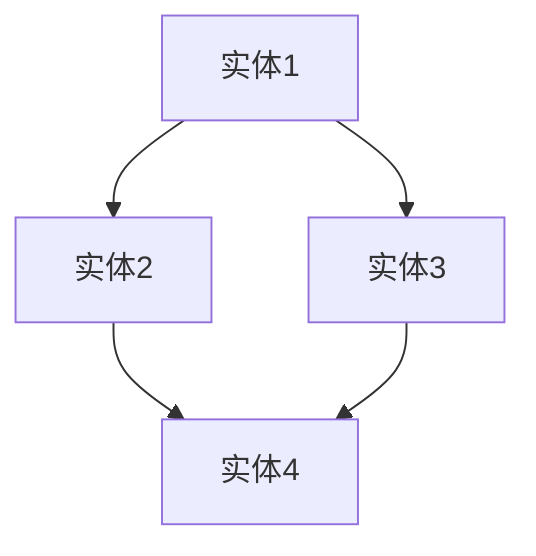
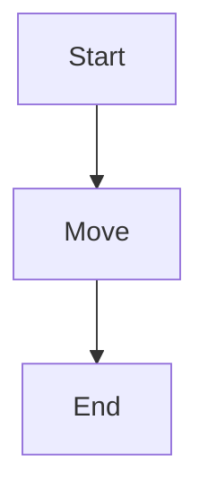

                 

# 《知识可视化：直观理解复杂信息》

> **关键词**：知识可视化、数据可视化、文本可视化、图像处理、算法、数学模型、应用场景、项目实战。

> **摘要**：本文将深入探讨知识可视化的概念、方法、应用以及核心算法和数学模型。通过详细的讲解和实践案例，帮助读者掌握知识可视化的技术，提升对复杂信息的理解和处理能力。

## 目录大纲

### 第一部分：基础知识

#### 第1章：知识可视化的基础

##### 1.1 知识可视化的概念

##### 1.1.1 知识可视化的定义

##### 1.1.2 知识可视化的作用

##### 1.1.3 知识可视化的类型

##### 1.2 可视化工具和技术

##### 1.2.1 常见可视化工具介绍

##### 1.2.2 数据可视化技术

##### 1.2.3 文本可视化和图像处理技术

##### 1.3 知识图谱的基础

##### 1.3.1 知识图谱的定义

##### 1.3.2 知识图谱的构成

##### 1.3.3 知识图谱的应用场景

### 第二部分：可视化方法与实践

#### 第2章：结构化数据的可视化方法

##### 2.1 数据可视化原理

##### 2.1.1 数据可视化流程

##### 2.1.2 数据可视化原则

##### 2.1.3 数据可视化工具选择

##### 2.2 关系数据的可视化

##### 2.2.1 关系数据可视化方法

##### 2.2.2 知识图谱可视化技术

##### 2.2.3 社交网络图可视化

##### 2.3 文本数据的可视化

##### 2.3.1 文本可视化方法

##### 2.3.2 词云生成与可视化

##### 2.3.3 文本挖掘与可视化

#### 第3章：非结构化数据的可视化方法

##### 3.1 图像数据的可视化

##### 3.1.1 图像数据可视化方法

##### 3.1.2 图像分类与可视化

##### 3.1.3 图像风格迁移与可视化

##### 3.2 声音数据的可视化

##### 3.2.1 声音数据可视化方法

##### 3.2.2 声音特征提取与可视化

##### 3.2.3 声音数据的交互式可视化

##### 3.3 视频数据的可视化

##### 3.3.1 视频数据可视化方法

##### 3.3.2 视频特征提取与可视化

##### 3.3.3 视频流数据的交互式可视化

### 第三部分：应用案例

#### 第4章：知识可视化的应用场景

##### 4.1 教育领域中的应用

##### 4.1.1 教育数据可视化

##### 4.1.2 教育资源可视化

##### 4.1.3 教育管理与决策支持

##### 4.2 企业管理中的应用

##### 4.2.1 企业数据可视化

##### 4.2.2 企业知识管理

##### 4.2.3 企业决策支持系统

##### 4.3 科研领域中的应用

##### 4.3.1 科学数据可视化

##### 4.3.2 科学研究可视化

##### 4.3.3 知识图谱在科研中的应用

### 第四部分：知识可视化工具和开发环境

#### 第5章：知识可视化工具

##### 5.1 主流知识可视化工具介绍

##### 5.1.1 Tableau

##### 5.1.2 Power BI

##### 5.1.3 D3.js

##### 5.2 开源知识可视化库

##### 5.2.1 Mermaid

##### 5.2.2 Visio

##### 5.2.3 Graphviz

#### 第6章：知识可视化开发环境搭建

##### 6.1 环境配置

##### 6.1.1 操作系统环境配置

##### 6.1.2 编译器和开发环境安装

##### 6.1.3 数据库和中间件安装

##### 6.2 开发流程

##### 6.2.1 项目开发流程

##### 6.2.2 数据处理与可视化流程

##### 6.2.3 调试与优化流程

### 第五部分：核心算法原理和数学模型

#### 第7章：知识可视化的核心算法原理

##### 7.1 数据聚类算法

##### 7.1.1 K-Means算法

##### 7.1.2 DBSCAN算法

##### 7.1.3 层次聚类算法

##### 7.2 数据分类算法

##### 7.2.1 决策树算法

##### 7.2.2 支持向量机算法

##### 7.2.3 随机森林算法

##### 7.3 知识图谱算法

##### 7.3.1 图嵌入算法

##### 7.3.2 节点相似性算法

##### 7.3.3 知识图谱推理算法

#### 第8章：知识可视化的数学模型

##### 8.1 数学模型概述

##### 8.1.1 数据可视化中的数学模型

##### 8.1.2 知识图谱中的数学模型

##### 8.1.3 可视化效果评价模型

##### 8.2 数学公式和原理

##### 8.2.1 概率论和统计学公式

##### 8.2.2 线性代数公式

##### 8.2.3 微积分公式

##### 8.3 数学公式应用举例

##### 8.3.1 数据聚类中的数学公式

##### 8.3.2 数据分类中的数学公式

##### 8.3.3 知识图谱中的数学公式

### 第六部分：项目实战

#### 第9章：知识可视化项目实战

##### 9.1 项目介绍

##### 9.1.1 项目背景

##### 9.1.2 项目目标

##### 9.1.3 项目环境

##### 9.2 数据准备

##### 9.2.1 数据获取

##### 9.2.2 数据清洗

##### 9.2.3 数据预处理

##### 9.3 可视化实现

##### 9.3.1 可视化设计

##### 9.3.2 可视化代码实现

##### 9.3.3 可视化效果展示

##### 9.4 项目分析与优化

##### 9.4.1 项目性能分析

##### 9.4.2 项目效果评估

##### 9.4.3 项目优化策略

### 附录：资源与参考

#### 附录A：知识可视化资源

##### A.1 常用工具和库

##### A.2 开源项目与代码示例

##### A.3 学术论文与文献

#### 附录B：知识可视化参考资料

##### B.1 相关书籍推荐

##### B.2 在线教程与课程

##### B.3 论坛与社群

---

现在，我们已经完成了目录大纲的撰写。接下来，我们将逐一深入讲解每个章节的内容，逐步构建起知识可视化的完整知识体系。

### 第一部分：基础知识

#### 第1章：知识可视化的基础

在本章中，我们将探讨知识可视化的基本概念、作用、类型以及相关工具和技术。

##### 1.1 知识可视化的概念

知识可视化（Knowledge Visualization）是一种将复杂信息以图形化的方式展示出来，帮助人们更好地理解和分析信息的方法。它通过可视化的手段，将抽象的概念和复杂的数据关系转化为直观的图形，从而提高人们的认知效率和决策能力。

##### 1.1.1 知识可视化的定义

知识可视化是一种信息展示和传达技术，它利用图形、图像、交互等方式，将知识、信息和数据以直观、易于理解的形式展现出来。它不仅包括数据可视化、文本可视化、图像处理等传统可视化方法，还涉及到知识图谱、语义网络等新兴技术。

##### 1.1.2 知识可视化的作用

知识可视化的主要作用包括：

1. **提高认知效率**：通过图形化的方式展示信息，使人们能够更快地理解和记忆信息。
2. **发现规律和模式**：通过可视化的手段，帮助人们从大量的数据中发现潜在的规律和模式。
3. **支持决策制定**：在决策过程中，可视化技术可以帮助人们更好地理解数据，从而做出更加明智的决策。
4. **促进知识共享**：通过可视化的方式，使知识和信息更容易被共享和传播。

##### 1.1.3 知识可视化的类型

知识可视化可以分为以下几种类型：

1. **数据可视化**：通过图形和图表展示数据，帮助人们理解数据的分布、趋势和关系。
2. **文本可视化**：将文本信息以图形化的方式展示，如词云、主题模型等。
3. **图像处理可视化**：对图像进行处理和展示，如图像分类、图像风格迁移等。
4. **知识图谱可视化**：将知识图谱中的关系和实体以图形化的方式展示，帮助人们理解知识的结构和关系。
5. **交互式可视化**：允许用户通过交互操作来探索和挖掘数据，如交互式地图、交互式词云等。

##### 1.2 可视化工具和技术

知识可视化涉及到多种工具和技术，下面介绍一些常见的工具和技术。

##### 1.2.1 常见可视化工具介绍

1. **Tableau**：一款强大的数据可视化工具，支持多种数据源和丰富的可视化图表类型。
2. **Power BI**：微软推出的数据可视化工具，提供丰富的图表和报告功能。
3. **D3.js**：一个基于JavaScript的库，用于创建交互式数据可视化，特别适用于Web应用。
4. **Mermaid**：一个轻量级的图表绘制工具，支持流程图、时序图、思维导图等多种图形。
5. **Visio**：微软的一款绘图工具，支持流程图、组织结构图、网络图等多种图形。
6. **Graphviz**：一个开源的图形可视化工具，用于创建和可视化图和网络。

##### 1.2.2 数据可视化技术

数据可视化技术包括以下几种：

1. **柱状图**：用于展示数据的数量和比较。
2. **折线图**：用于展示数据的变化趋势。
3. **饼图**：用于展示数据的比例分布。
4. **散点图**：用于展示数据之间的关系。
5. **热力图**：用于展示数据的密度分布。
6. **地图**：用于展示数据的地理位置和分布。

##### 1.2.3 文本可视化和图像处理技术

文本可视化技术包括：

1. **词云**：通过单词的字体大小和颜色来表示其在文本中的重要性。
2. **主题模型**：将文本数据转化为主题分布，帮助人们理解文本内容的主题结构。

图像处理技术包括：

1. **图像分类**：对图像进行分类，如人脸识别、物体识别等。
2. **图像风格迁移**：将一种图像的样式应用到另一种图像上，如将照片转换为艺术画风格。

##### 1.3 知识图谱的基础

知识图谱是一种结构化的知识表示方法，它通过实体和关系的表示，将知识以图形化的方式展示出来。

##### 1.3.1 知识图谱的定义

知识图谱（Knowledge Graph）是一种用于表示实体和实体之间关系的图形化数据结构。它通过实体（如人、地点、事物等）和关系（如属于、属于、位于等）的连接，构建起一个复杂的知识网络。

##### 1.3.2 知识图谱的构成

知识图谱主要由以下几部分构成：

1. **实体**：知识图谱中的基本元素，如人、地点、事物等。
2. **属性**：实体的特征或属性，如年龄、身高、地理位置等。
3. **关系**：实体之间的关系，如属于、位于、属于等。
4. **边**：表示实体之间关系的线，可以是单向或双向的。
5. **图**：由实体和边构成的整体结构。

##### 1.3.3 知识图谱的应用场景

知识图谱在以下领域具有广泛的应用：

1. **搜索引擎**：通过知识图谱构建索引，提高搜索效率和准确性。
2. **推荐系统**：利用知识图谱分析用户行为和偏好，提供个性化推荐。
3. **智能问答**：通过知识图谱提供精准的答案，解决用户的问题。
4. **自然语言处理**：利用知识图谱进行实体识别、关系抽取等任务。
5. **智能客服**：通过知识图谱构建智能问答系统，提高客服效率。

在下一章中，我们将进一步探讨结构化数据的可视化方法，帮助读者掌握如何有效地使用可视化技术来展示和分析数据。请继续阅读，以便深入了解这一重要主题。### 第一部分：基础知识

#### 第1章：知识可视化的基础

##### 1.2 可视化工具和技术

知识可视化技术的实现离不开各种可视化工具和技术的支持。在本节中，我们将介绍一些常见的可视化工具和技术，包括数据可视化工具、文本可视化技术以及图像处理技术。

##### 1.2.1 常见可视化工具介绍

在可视化领域，有许多流行的工具可供选择。以下是一些常见的数据可视化工具：

1. **Tableau**：Tableau 是一个强大的数据可视化工具，它允许用户通过拖放操作轻松创建复杂的图表和仪表板。Tableau 支持多种数据连接，包括 Excel、数据库和云存储。

2. **Power BI**：Power BI 是微软推出的一个商业智能工具，它提供了丰富的数据连接和可视化选项，可以帮助用户快速创建专业级的数据报表和仪表板。

3. **D3.js**：D3.js 是一个基于 JavaScript 的库，它为 Web 开发者提供了创建交互式数据可视化的能力。D3.js 可以创建复杂的图表，如桑基图、网络图和力导向图。

4. **Mermaid**：Mermaid 是一个轻量级的图表绘制工具，它使用 Markdown 语言来描述图表，然后通过 JavaScript 引擎将其渲染为图形。Mermaid 支持多种图表类型，如流程图、时序图和类图。

5. **Visio**：Visio 是微软的一款专业绘图工具，它提供了丰富的绘图选项和模板，适用于创建流程图、组织结构图和图表。

6. **Graphviz**：Graphviz 是一个开源的工具，用于创建和可视化图和网络。Graphviz 提供了一种简单的文本描述语言，可以轻松地创建复杂的图形。

##### 1.2.2 数据可视化技术

数据可视化技术是知识可视化的重要组成部分。以下是一些常用的数据可视化技术：

1. **柱状图**：柱状图是一种用于表示数据数量和比较的图表。它通过不同高度的柱子来表示不同类别的数据值。

2. **折线图**：折线图是一种用于表示数据变化趋势的图表。它通过连接数据点的线条来表示数据随时间或其他变量的变化。

3. **饼图**：饼图是一种用于表示数据比例分布的图表。它通过不同大小的扇形区域来表示各类别的数据比例。

4. **散点图**：散点图是一种用于表示数据之间关系的图表。它通过在坐标系中标记数据点来显示不同变量之间的关系。

5. **热力图**：热力图是一种用于表示数据密度分布的图表。它通过不同颜色的方块或像素来表示数据在空间中的分布情况。

6. **地图**：地图是一种用于表示地理位置和数据分布的图表。它可以通过标记、颜色或线条来显示不同地区的数据值。

##### 1.2.3 文本可视化和图像处理技术

除了数据可视化，知识可视化还包括文本可视化和图像处理技术。以下是一些常用的文本可视化和图像处理技术：

1. **词云**：词云是一种用于表示文本中词语重要性的图表。它通过不同大小的字体和颜色来表示词语的出现频率。

2. **主题模型**：主题模型是一种用于分析文本数据的方法，它可以提取文本中的主题分布，帮助用户理解文本内容的核心主题。

3. **文本可视化**：文本可视化是将文本数据以图形化的方式展示的技术。例如，通过将文本数据转换为图形符号或图表来表示。

4. **图像分类**：图像分类是一种用于识别图像内容的机器学习技术。它可以将图像自动分类到不同的类别。

5. **图像风格迁移**：图像风格迁移是一种将一种图像的样式应用到另一种图像上的技术。例如，将普通照片转换为艺术画风格。

6. **图像处理**：图像处理是指对图像进行编辑和增强的技术。例如，调整图像的亮度、对比度和色彩平衡等。

通过使用这些可视化工具和技术，我们可以将复杂的信息转化为易于理解和分析的可视化形式。在下一节中，我们将探讨知识图谱的基础知识，包括知识图谱的定义、构成和应用场景。请继续阅读，以便更深入地了解知识图谱的概念和作用。### 第一部分：基础知识

#### 第1章：知识可视化的基础

##### 1.3 知识图谱的基础

知识图谱作为一种强大的知识表示和可视化工具，在近年来得到了广泛的应用。在本节中，我们将介绍知识图谱的基础知识，包括知识图谱的定义、构成和应用场景。

##### 1.3.1 知识图谱的定义

知识图谱（Knowledge Graph）是一种用于表示实体和实体之间关系的图形化数据结构。它通过实体（如人、地点、事物等）和关系（如属于、位于、属于等）的连接，构建起一个复杂的知识网络。

知识图谱的核心思想是将现实世界中的各种实体和关系抽象为计算机可以处理和理解的数据模型，从而实现知识的自动获取、组织和推理。知识图谱可以看作是一种语义网，它通过实体和关系的表示，提供了对复杂数据的直观理解和分析能力。

##### 1.3.2 知识图谱的构成

知识图谱主要由以下几个部分构成：

1. **实体**：知识图谱中的基本元素，表示现实世界中的各种对象，如人、地点、事物等。实体可以是具体的对象，也可以是抽象的概念。

2. **属性**：实体的特征或属性，描述了实体的具体信息。例如，一个人的姓名、年龄、职业等都是该实体的属性。

3. **关系**：实体之间的关系，表示了实体之间的联系。关系可以是单向的，也可以是双向的。例如，一个人有多个朋友，这是一种双向关系。

4. **边**：表示实体之间关系的线，连接了两个或多个实体。边通常包含了关系的信息，如关系的类型、权重等。

5. **图**：由实体和边构成的整体结构，形成了知识图谱的基本框架。

##### 1.3.3 知识图谱的应用场景

知识图谱在多个领域都有广泛的应用，以下是一些典型的应用场景：

1. **搜索引擎**：知识图谱可以用于搜索引擎的优化，提高搜索结果的准确性和相关性。通过知识图谱，搜索引擎可以更好地理解用户查询的含义，并提供更准确的搜索结果。

2. **推荐系统**：知识图谱可以用于推荐系统的个性化推荐。通过分析用户的行为和偏好，知识图谱可以帮助推荐系统发现用户可能感兴趣的内容，并提供个性化的推荐。

3. **智能问答**：知识图谱可以用于构建智能问答系统。通过知识图谱，系统可以自动回答用户提出的问题，提供准确和全面的信息。

4. **自然语言处理**：知识图谱可以用于自然语言处理中的实体识别、关系抽取等任务。通过知识图谱，系统可以更好地理解和分析文本数据，提高自然语言处理的效果。

5. **智能客服**：知识图谱可以用于构建智能客服系统，提供自动化的客服支持。通过知识图谱，系统可以自动识别用户的问题，并提供相关的解决方案。

6. **智能广告**：知识图谱可以用于广告投放的精准定位。通过分析用户的行为和兴趣，知识图谱可以帮助广告系统向用户推送最相关的广告。

7. **知识管理**：知识图谱可以用于知识管理和共享。通过知识图谱，企业可以更好地组织和利用其内部的知识资源，提高知识共享和协作的效率。

在下一节中，我们将探讨知识可视化的方法与实践，包括结构化数据和非结构化数据的可视化方法。请继续阅读，以便了解如何利用可视化技术来展示和分析复杂的信息。### 第二部分：可视化方法与实践

#### 第2章：结构化数据的可视化方法

结构化数据是指以表格或关系数据库形式存储的数据，其中每个数据项都有明确的字段和类型。结构化数据的可视化方法主要是通过图表和图形来展示数据的关系和趋势。本章将详细介绍结构化数据的可视化原理、关系数据的可视化方法、文本数据的可视化方法以及图像数据的可视化方法。

##### 2.1 数据可视化原理

数据可视化是一种将结构化数据转化为视觉图形的过程，目的是通过图形化的方式帮助人们更直观地理解数据。数据可视化遵循以下原理：

1. **直观性**：可视化应尽可能直观，使人们能够快速理解数据的含义。
2. **层次性**：数据可视化应具有层次性，帮助人们从宏观和微观层面理解数据。
3. **交互性**：交互性允许用户通过操作来探索数据，从而获得更深层次的理解。
4. **准确性**：可视化应准确地反映数据本身，避免误导用户。
5. **美感**：良好的设计可以提高可视化的美感，使人们更愿意接受和探索数据。

##### 2.1.1 数据可视化流程

数据可视化的基本流程包括以下步骤：

1. **数据准备**：收集并清洗数据，确保数据的质量和完整性。
2. **数据探索**：分析数据的基本特征，如分布、趋势、相关性等。
3. **选择图表**：根据数据的特征和展示目的选择合适的图表类型。
4. **设计图表**：设计图表的布局、颜色、标签等元素，提高图表的可读性和美观度。
5. **验证和优化**：验证图表是否准确传达了数据的信息，并进行必要的优化。

##### 2.1.2 数据可视化原则

数据可视化应遵循以下原则：

1. **简洁性**：避免图表过于复杂，尽量使用简单的图表类型。
2. **一致性**：图表的格式和样式应保持一致，避免混淆用户。
3. **对比性**：使用颜色、大小、形状等对比元素来突出重要的数据点。
4. **标签和注释**：为图表添加清晰的标签和注释，帮助用户理解图表的内容。
5. **可交互性**：提供交互功能，如筛选、排序、钻取等，以便用户更深入地探索数据。

##### 2.1.3 数据可视化工具选择

选择合适的可视化工具对于成功展示数据至关重要。以下是一些常见的数据可视化工具：

1. **Tableau**：一个功能强大的商业智能和数据可视化工具，适用于各种规模的企业。
2. **Power BI**：微软推出的数据可视化工具，提供了丰富的图表和仪表板功能。
3. **D3.js**：一个基于 JavaScript 的库，用于创建高度交互的 Web 数据可视化。
4. **Plotly**：一个开源的数据可视化库，支持多种图表类型和交互功能。
5. **ECharts**：一个基于 JavaScript 的可视化库，提供了丰富的图表类型和交互功能。

##### 2.2 关系数据的可视化

关系数据是指描述实体之间关系的结构化数据。关系数据的可视化方法主要包括以下几种：

1. **关系图**：使用点和线来表示实体和它们之间的关系。关系图适合展示实体之间的复杂关系。
2. **矩阵图**：使用矩阵来表示实体之间的关系，每个单元格表示实体之间的相似度或关系强度。
3. **桑基图**：一种特殊的矩阵图，用于展示实体之间的流动和转移情况，如资金流动、人员流动等。
4. **树状图**：使用树形结构来表示实体之间的层次关系，通常用于展示组织结构或分类体系。

以下是关系图的一个简单例子：



在上面的示例中，实体1与实体2、实体3有直接关系，实体2与实体4、实体3也有直接关系，实体3同时与实体1和实体4有直接关系。

##### 2.3 文本数据的可视化

文本数据是数据可视化的另一个重要领域。文本数据可视化方法可以帮助用户更好地理解文本信息。以下是一些常用的文本数据可视化方法：

1. **词云**：使用字体大小来表示词语的重要性，常用的词语以较大的字体显示。
2. **词频直方图**：使用柱状图来表示词语的出现频率，高度表示频率。
3. **主题模型**：使用图表来展示文本数据中的主题分布，帮助用户了解文本内容的核心主题。
4. **文档相似度矩阵**：使用矩阵图来表示不同文档之间的相似度，颜色或数值表示相似度大小。

以下是词云的一个例子：

```mermaid
wordcloud
The quick brown fox jumps over the lazy dog
```

在这个例子中，词云显示了文本中的高频词汇，如 "quick"、"brown"、"fox"、"jumps" 和 "lazy"，这些词以较大的字体显示，而 "the" 和 "over" 等低频词汇则以较小的字体显示。

##### 2.4 图像数据的可视化

图像数据可视化是将图像数据转化为视觉图形的过程，以帮助用户理解和分析图像信息。以下是一些常用的图像数据可视化方法：

1. **直方图**：用于显示图像的亮度或颜色分布，可以帮助用户了解图像的整体亮度或色彩平衡。
2. **散点图**：用于显示图像中像素的分布，可以揭示图像的纹理和结构。
3. **等高线图**：用于显示图像的灰度值分布，可以揭示图像的阴影和轮廓。
4. **热力图**：用于显示图像的像素值分布，颜色深浅表示像素值的大小。

以下是直方图的一个例子：

```mermaid
histogram
[0, 10] 2
[10, 20] 5
[20, 30] 8
[30, 40] 12
[40, 50] 15
```

在这个例子中，直方图显示了图像亮度的分布情况，亮度范围在0到50之间，不同区间的亮度值以柱状图的形式表示。

通过以上方法，我们可以将结构化数据、文本数据和图像数据以可视化的形式展示出来，帮助用户更好地理解和分析这些数据。在下一章中，我们将探讨非结构化数据的可视化方法，包括图像数据、声音数据和视频数据的可视化。请继续阅读，以了解如何处理这些复杂的非结构化数据。### 第二部分：可视化方法与实践

#### 第3章：非结构化数据的可视化方法

非结构化数据通常指没有固定数据格式和结构的数据，如图像、声音、视频等。这些数据形式多样，直接处理和分析较为复杂。因此，非结构化数据的可视化方法显得尤为重要。本章将详细介绍图像数据、声音数据和视频数据的可视化方法。

##### 3.1 图像数据的可视化

图像数据在日常生活中无处不在，如照片、医学影像、卫星图像等。图像数据的可视化有助于我们理解图像中的信息，如内容、特征、分布等。

1. **直方图**：用于显示图像的亮度或颜色分布。通过分析直方图，我们可以了解图像的整体亮度和色彩平衡。
2. **散点图**：用于显示图像中像素的分布，揭示图像的纹理和结构。通过像素的散点分布，我们可以观察到图像中的高频区域和低频区域。
3. **等高线图**：用于显示图像的灰度值分布，揭示图像的阴影和轮廓。等高线图特别适合分析医学影像，如CT扫描和MRI扫描图像。
4. **热力图**：用于显示图像的像素值分布，颜色深浅表示像素值的大小。热力图可以揭示图像中的热点区域，帮助用户识别图像中的重要信息。

以下是直方图的一个例子：

```mermaid
histogram
[0, 10] 2
[10, 20] 5
[20, 30] 8
[30, 40] 12
[40, 50] 15
```

在这个例子中，直方图显示了图像亮度的分布情况，亮度范围在0到50之间，不同区间的亮度值以柱状图的形式表示。

##### 3.2 声音数据的可视化

声音数据是另一种重要的非结构化数据，如音乐、语音、环境音等。声音数据的可视化有助于我们理解声音的频率、振幅、节奏等信息。

1. **频谱图**：用于显示声音信号的频率分布。通过频谱图，我们可以分析声音的音高、音质和音色。
2. **波形图**：用于显示声音信号的振幅和时间关系。波形图可以帮助我们了解声音的强度和时间变化。
3. **等高线图**：用于显示声音信号的振幅分布。等高线图特别适合分析复杂的声音信号，如语音中的语调变化。
4. **热力图**：用于显示声音信号的强度分布。热力图可以揭示声音信号中的热点区域，帮助用户识别声音中的重要信息。

以下是频谱图的一个例子：

```mermaid
spectrogram
|
|**|
|*|
|*|
|**|
| |
```

在这个例子中，频谱图显示了声音信号的频率分布，频率范围在0到1000Hz之间，不同频率的强度以不同的符号表示。

##### 3.3 视频数据的可视化

视频数据是由连续的图像帧组成的时间序列数据，如电影、视频监控、运动捕捉等。视频数据的可视化有助于我们分析视频内容、特征和趋势。

1. **帧图像**：将视频数据中的每一帧图像单独显示，可以帮助我们观察视频的静态内容。
2. **运动轨迹**：用于显示视频中的物体运动轨迹。通过运动轨迹，我们可以分析物体的运动模式、速度和方向。
3. **时空图**：将视频数据中的时间和空间信息结合在一起，显示视频内容的时空分布。时空图可以帮助我们理解视频中的事件发展和变化。
4. **热力图**：用于显示视频内容的像素值分布。热力图可以揭示视频中的热点区域，帮助用户识别视频中的重要信息。

以下是运动轨迹的一个例子：



在这个例子中，运动轨迹显示了物体的运动过程，从开始到结束，展示了物体的运动路径。

通过以上方法，我们可以将非结构化数据转化为视觉图形，帮助用户更好地理解和分析这些数据。在下一章中，我们将探讨知识可视化的应用场景，包括教育、企业和科研领域的应用。请继续阅读，以了解知识可视化在实际场景中的具体应用。### 第三部分：应用案例

#### 第4章：知识可视化的应用场景

知识可视化作为一种强大的信息展示和传达工具，在各个领域都有着广泛的应用。在本章中，我们将探讨知识可视化在教育、企业和科研领域的具体应用案例。

##### 4.1 教育领域中的应用

知识可视化在教育领域中具有极大的潜力，它能够帮助学生更好地理解和记忆知识，提高学习效果。

1. **教育数据可视化**：知识可视化可以帮助教育机构分析和展示教育数据，如学生成绩、学习进度等。通过图表和图形，教育工作者可以直观地了解学生的学习状况，从而制定针对性的教育策略。

2. **教育资源可视化**：知识可视化可以将海量的教育资源以图形化的方式展示，如课程内容、教学视频、教材等。学生可以通过知识图谱或思维导图等可视化形式，快速找到所需的学习资源，提高学习效率。

3. **教育管理与决策支持**：知识可视化可以帮助教育管理者进行学校管理和决策支持。通过可视化工具，管理者可以清晰地看到学校的运营状况、学生和教师的表现，从而做出更明智的决策。

案例：某教育机构利用知识可视化技术对其教学数据进行分析，通过可视化报表展示学生的成绩分布、学习进度等信息。教育管理者根据这些数据，及时调整教学计划和教学方法，提高了学生的学习效果。

##### 4.2 企业管理中的应用

知识可视化在企业管理中也发挥着重要作用，它能够帮助企业更好地管理和利用知识资源，提高决策效率和竞争力。

1. **企业数据可视化**：知识可视化可以帮助企业将复杂的数据以图形化的方式展示，如销售数据、生产数据、客户数据等。通过数据可视化，企业可以快速了解运营状况，发现潜在问题和机会。

2. **企业知识管理**：知识可视化可以用于企业知识管理，如知识库构建、知识共享等。通过知识图谱和思维导图等工具，企业可以将知识以结构化的形式展示，方便员工查找和利用。

3. **企业决策支持系统**：知识可视化可以为企业决策提供支持。通过可视化工具，企业管理者可以直观地看到各种数据和信息，从而做出更明智的决策。

案例：某企业利用知识可视化技术对其销售数据进行分析，通过可视化报表展示销售趋势、产品销量等信息。销售经理根据这些数据，及时调整销售策略，提高了销售额和客户满意度。

##### 4.3 科研领域中的应用

知识可视化在科研领域中同样有着广泛的应用，它能够帮助科研人员更好地理解和分析科研数据，提高科研效率。

1. **科学数据可视化**：知识可视化可以帮助科研人员将复杂的科研数据以图形化的方式展示，如实验数据、观测数据、模拟数据等。通过可视化工具，科研人员可以直观地看到数据的分布、趋势和关系，从而发现新的科研线索。

2. **科学研究可视化**：知识可视化可以用于展示科研研究的进展和成果。通过知识图谱和思维导图等工具，科研人员可以清晰地展示研究过程中的思路和方法，便于同行评审和交流。

3. **知识图谱在科研中的应用**：知识图谱是一种强大的知识表示方法，可以用于科研领域的知识组织和推理。通过知识图谱，科研人员可以更好地理解研究领域的知识结构，发现潜在的研究关联和交叉领域。

案例：某科研团队利用知识可视化技术对其科研数据进行分析，通过可视化工具展示实验结果和模型预测。团队成员通过这些数据，发现了新的实验方向和研究点，提高了科研效率。

通过以上应用案例，我们可以看到知识可视化在各个领域的实际应用和成效。知识可视化不仅提高了信息处理的效率，还促进了知识的共享和传播。在下一部分，我们将介绍知识可视化工具和开发环境，帮助读者了解如何实现知识可视化的技术细节。请继续阅读。### 第四部分：知识可视化工具和开发环境

#### 第5章：知识可视化工具

知识可视化工具是实施知识可视化技术的关键，它们帮助我们将复杂的信息转化为直观的图形。以下是一些主流的知识可视化工具及其特点：

##### 5.1 主流知识可视化工具介绍

1. **Tableau**
   - **特点**：Tableau 是一款功能强大的商业智能工具，支持多种数据源和丰富的可视化图表类型。它提供了直观的拖拽界面，允许用户快速创建交互式仪表板。
   - **应用**：Tableau 广泛应用于企业数据分析和报表生成，适合处理大量结构化和非结构化数据。

2. **Power BI**
   - **特点**：Power BI 是微软推出的商业智能和数据可视化工具，与 Microsoft Office 和 Azure 服务集成良好。它提供了强大的数据分析功能，并支持自定义可视化组件。
   - **应用**：Power BI 适用于企业内部的数据监控和报告，尤其是在企业管理和决策支持方面。

3. **D3.js**
   - **特点**：D3.js 是一个基于 JavaScript 的开源库，专为 Web 数据可视化而设计。它提供了高度灵活的图形和动画功能，允许开发者创建自定义的交互式可视化。
   - **应用**：D3.js 适用于开发复杂的 Web 应用程序，特别适合处理动态和交互式的数据可视化。

4. **Mermaid**
   - **特点**：Mermaid 是一个使用 Markdown 语言创建和渲染图表的工具。它支持多种图表类型，如流程图、时序图和类图，非常适合文档中的图表插入。
   - **应用**：Mermaid 适用于编写文档和报告时插入图表，简化了图表创建和更新的过程。

5. **Visio**
   - **特点**：Visio 是微软的一款专业绘图工具，提供了丰富的图形模板和形状库。它支持多种图表类型，包括流程图、组织结构图和电路图。
   - **应用**：Visio 适用于企业内部的设计和文档工作，特别适合创建复杂和专业的图表和示意图。

6. **Graphviz**
   - **特点**：Graphviz 是一个开源的图形可视化工具，使用简单的文本描述语言创建和可视化图和网络。它支持多种图形格式和布局算法。
   - **应用**：Graphviz 适用于创建和可视化复杂的关系图、网络图和知识图谱，特别适合需要图形化表示复杂结构的项目。

##### 5.2 开源知识可视化库

除了上述主流工具，还有许多开源的知识可视化库可供选择，以下是一些常用的开源可视化库：

1. **ECharts**
   - **特点**：ECharts 是一个使用 JavaScript 编写的开源可视化库，支持多种图表类型和交互功能。它提供了丰富的配置选项，易于定制。
   - **应用**：ECharts 适用于 Web 开发中的数据可视化，特别适合处理大量的数据图表。

2. **Three.js**
   - **特点**：Three.js 是一个基于 WebGL 的 JavaScript 库，用于创建 3D 可视化。它支持多种 3D 图形和动画效果，适合创建复杂的 3D 数据可视化。
   - **应用**：Three.js 适用于需要 3D 数据可视化的场景，如地理信息系统（GIS）和科学计算可视化。

3. **C3.js**
   - **特点**：C3.js 是一个基于 D3.js 的可视化库，简化了 D3.js 的使用，提供了更直观的 API。它适用于创建各种类型的图表，如柱状图、折线图和饼图。
   - **应用**：C3.js 适用于需要快速创建图表的 Web 应用程序，特别适合非开发者使用。

通过选择合适的知识可视化工具，开发者可以根据项目需求和技能水平，灵活地实现知识可视化。在下一章中，我们将讨论如何搭建知识可视化开发环境，包括配置操作系统、安装编译器和开发环境、数据库和中间件。请继续阅读，以了解详细的开发环境搭建步骤。### 第四部分：知识可视化工具和开发环境

#### 第6章：知识可视化开发环境搭建

为了实现知识可视化，我们需要搭建一个完整的开发环境，包括操作系统、编译器和开发环境、数据库以及相关的中间件。以下是搭建知识可视化开发环境的详细步骤。

##### 6.1 环境配置

在开始搭建开发环境之前，我们需要选择一个合适的操作系统。以下以 Windows 和 Linux 为例，介绍环境配置的过程。

###### 6.1.1 操作系统环境配置

1. **Windows 系统**：
   - 确保操作系统版本为 Windows 10 或更高版本。
   - 安装必要的驱动程序，以确保硬件设备正常运行。

2. **Linux 系统**：
   - 选择一个适合的开发环境，如 Ubuntu 18.04 或 CentOS 7。
   - 通过终端安装必要的硬件驱动程序和网络配置。

###### 6.1.2 编译器和开发环境安装

1. **C/C++ 编译器**：
   - **Windows**：下载并安装 MinGW 或 Visual Studio Build Tools。
   - **Linux**：在终端中运行 `sudo apt-get install g++` 或 `sudo yum install gcc-c++`。

2. **Python 编译器**：
   - **Windows**：下载并安装 Python，建议选择最新版本。
   - **Linux**：在终端中运行 `sudo apt-get install python3` 或 `sudo yum install python3`。

3. **Java 编译器**：
   - **Windows**：下载并安装 JDK，建议选择最新版本。
   - **Linux**：在终端中运行 `sudo apt-get install openjdk-11-jdk` 或 `sudo yum install java-1.8.0-openjdk`。

4. **Node.js**：
   - **Windows**：下载并安装 Node.js。
   - **Linux**：在终端中运行 `curl -sL https://deb.nodesource.com/setup_14.x | sudo -E bash -` 并安装 Node.js。

###### 6.1.3 数据库和中间件安装

1. **数据库**：
   - **MySQL**：下载并安装 MySQL 数据库，遵循官方安装指南。
   - **MongoDB**：下载并安装 MongoDB，建议选择最新版本。
   - **Neo4j**：下载并安装 Neo4j 图数据库。

2. **中间件**：
   - **Apache Kafka**：下载并安装 Apache Kafka，遵循官方安装指南。
   - **Elasticsearch**：下载并安装 Elasticsearch，建议选择最新版本。
   - **RabbitMQ**：下载并安装 RabbitMQ，遵循官方安装指南。

##### 6.2 开发流程

知识可视化开发流程可以分为以下几个主要步骤：

1. **项目开发流程**：
   - 定义项目需求和分析数据。
   - 设计可视化模型和选择合适的可视化工具。
   - 编写代码实现可视化功能。
   - 集成数据库和中间件，确保数据流和可视化效果。

2. **数据处理与可视化流程**：
   - 收集和清洗数据，确保数据质量。
   - 将数据转化为可视化所需的形式。
   - 配置可视化工具的参数，优化可视化效果。

3. **调试与优化流程**：
   - 调试代码，确保可视化功能正常。
   - 优化性能，减少数据加载和处理时间。
   - 改善用户体验，确保可视化界面友好。

通过以上步骤，我们可以搭建一个完整的知识可视化开发环境，并实现知识可视化项目。在下一部分，我们将探讨知识可视化的核心算法原理，包括数据聚类、分类和知识图谱算法。请继续阅读，以深入了解知识可视化的技术核心。### 第五部分：核心算法原理和数学模型

#### 第7章：知识可视化的核心算法原理

知识可视化不仅依赖于工具和技术的选择，还依赖于一系列核心算法原理的支持。这些算法原理包括数据聚类、分类和知识图谱算法。在本章中，我们将详细探讨这些算法的原理和应用。

##### 7.1 数据聚类算法

数据聚类算法是一种无监督学习算法，它通过将相似的数据点归为一类，从而发现数据中的自然结构。以下是一些常见的数据聚类算法：

###### 7.1.1 K-Means算法

K-Means算法是一种迭代算法，它通过以下步骤进行聚类：

1. **初始化**：随机选择K个数据点作为初始聚类中心。
2. **分配**：计算每个数据点到各个聚类中心的距离，并将其分配到最近的聚类中心。
3. **更新**：重新计算每个聚类中心的位置，通常取对应聚类中心内所有点的平均值。
4. **迭代**：重复步骤2和步骤3，直到聚类中心的位置不再变化。

K-Means算法的伪代码如下：

```python
# 输入：数据集D，聚类个数k
# 输出：聚类结果

初始化聚类中心
for i in range(k):
    选取D中的一个点作为聚类中心

while true:
    对于每个点x in D：
        计算x到每个聚类中心的距离
        将x分配到最近的聚类中心
    
    更新每个聚类中心的位置
    如果聚类中心的位置不再改变，则算法结束
    否则继续迭代
```

###### 7.1.2 DBSCAN算法

DBSCAN（Density-Based Spatial Clustering of Applications with Noise）算法是一种基于密度的聚类算法，它通过以下步骤进行聚类：

1. **邻域检测**：对于每个点，找到其邻域内的所有点。
2. **增长聚类**：从每个核心点开始，逐步增加其邻域内的点，形成聚类。
3. **噪声点识别**：将不在任何聚类中的点视为噪声点。

DBSCAN算法的伪代码如下：

```python
# 输入：数据集D，邻域半径eps，邻域最小点数min_samples
# 输出：聚类结果

初始化簇标记为未标记
for 点p in D:
    如果 p 是核心点：
        扩展聚类
        标记为簇
    否则：
        如果 p 是边界点：
            标记为噪声点
        否则：
            标记为未标记

扩展聚类
簇 = []
点 = p
while 点 != None:
    簇.append(点)
    点 = 找到新的邻域点(点, D, eps, min_samples)
```

###### 7.1.3 层次聚类算法

层次聚类算法通过以下步骤进行聚类：

1. **初始化**：将每个数据点视为一个簇。
2. **合并**：在每一步中，找到最近的两个簇并合并它们。
3. **递归**：重复合并步骤，直到所有的数据点都属于一个簇。

层次聚类算法的伪代码如下：

```python
# 输入：数据集D
# 输出：聚类结果

初始化簇
for 点 in D:
    将点放入一个簇

while 簇的数量 > 1:
    找到最近的两个簇
    合并这两个簇
```

##### 7.2 数据分类算法

数据分类算法是一种监督学习算法，它通过已标记的数据集学习分类模型，然后使用该模型对新的数据进行分类。以下是一些常见的数据分类算法：

###### 7.2.1 决策树算法

决策树算法通过构建一棵树来对数据点进行分类。每个内部节点代表一个属性测试，每个分支代表一个测试结果，每个叶节点代表一个类别。

决策树算法的伪代码如下：

```python
# 输入：数据集D，属性集合A
# 输出：决策树

创建空树

对于每个属性a in A：
    计算属性a的信息增益
    选择信息增益最大的属性作为根节点
    根据属性a的值划分数据集D为子集
    递归构建子树的每个节点

返回根节点
```

###### 7.2.2 支持向量机算法

支持向量机（SVM）算法通过找到一个超平面，将不同类别的数据点尽可能分开。它通过最大化分类边界的间隔来实现。

SVM算法的核心公式如下：

$$
\begin{equation}
\min_{w,b}\frac{1}{2}||w||^2 \\
\text{subject to} \\
y^{(i)}(\textbf{w}\cdot\textbf{x^{(i)}} + b) \geq 1
\end{equation}
$$

其中，$w$ 和 $b$ 分别为权重和偏置，$y^{(i)}$ 为标记，$\textbf{x^{(i)}}$ 为特征向量。

###### 7.2.3 随机森林算法

随机森林算法通过构建多个决策树，并使用集成学习的方法来提高分类和回归的性能。每个决策树对数据进行分类或回归，最后通过投票或平均来决定最终结果。

随机森林算法的伪代码如下：

```python
# 输入：数据集D，树的数量n
# 输出：分类结果

初始化空森林

对于每个树：
    从D中随机选择子集
    构建决策树

对于每个数据点：
    遍历森林中的每个树
    收集每个树的分类结果

根据分类结果进行投票或平均
返回最终分类结果
```

##### 7.3 知识图谱算法

知识图谱算法用于构建和优化知识图谱，包括图嵌入、节点相似性和知识图谱推理等。

###### 7.3.1 图嵌入算法

图嵌入算法将图中的节点映射到低维度的向量空间中，从而保留图的结构和属性。常见的图嵌入算法有：

- **DeepWalk**：通过随机游走生成图中的节点序列，然后使用神经网络学习节点的嵌入向量。
- **Node2Vec**：结合随机游走和深度优先搜索，平衡节点之间的相似性和多样性。

图嵌入算法的伪代码如下：

```python
# 输入：图G，嵌入维度d，游走长度l
# 输出：节点嵌入向量

初始化节点嵌入向量

对于每个节点v：
    进行l次随机游走
    计算节点之间的相似性

使用神经网络学习嵌入向量
```

###### 7.3.2 节点相似性算法

节点相似性算法用于计算图中节点之间的相似度，常见的算法有：

- **Jaccard相似性**：基于节点共享的边数计算相似度。
- **Cosine相似性**：基于节点嵌入向量之间的余弦相似度计算相似度。

节点相似性算法的伪代码如下：

```python
# 输入：节点v和w，图G
# 输出：节点相似度

计算节点v和w共享的边数
计算节点v和w的嵌入向量

相似度 = 共享边数 / (|v| + |w| - 共享边数)
返回相似度
```

###### 7.3.3 知识图谱推理算法

知识图谱推理算法用于从知识图谱中推导新的知识，常见的算法有：

- **规则推理**：基于知识图谱中的规则进行推理，如蕴涵推理、逆蕴涵推理等。
- **模型推理**：使用图嵌入向量进行基于模型的推理，如逻辑回归、支持向量机等。

知识图谱推理算法的伪代码如下：

```python
# 输入：知识图谱G，查询q
# 输出：推理结果

初始化推理结果

对于每个规则r：
    如果q满足规则r的前件：
        应用规则r的后件
        更新推理结果

返回推理结果
```

通过以上核心算法原理的介绍，我们可以更好地理解知识可视化中的算法基础。在下一章中，我们将介绍知识可视化的数学模型，包括数据可视化、知识图谱和可视化效果评价模型。请继续阅读，以深入了解知识可视化的数学原理。### 第五部分：核心算法原理和数学模型

#### 第8章：知识可视化的数学模型

在知识可视化中，数学模型扮演着关键角色，它们帮助我们理解和分析数据，优化可视化效果，并评估可视化性能。本章将介绍知识可视化中常用的数学模型，包括数据可视化模型、知识图谱模型和可视化效果评价模型。

##### 8.1 数学模型概述

知识可视化中的数学模型可以分为以下几个类别：

1. **数据可视化模型**：用于描述数据点在可视化空间中的表示和变换方法，如坐标变换、颜色映射等。
2. **知识图谱模型**：用于描述实体和关系在知识图谱中的表示和推理方法，如图嵌入、图神经网络等。
3. **可视化效果评价模型**：用于评估可视化质量和用户满意度，如用户交互分析、视觉质量评估等。

##### 8.1.1 数据可视化中的数学模型

数据可视化中的数学模型主要涉及数据点的表示和图形的绘制。

1. **坐标变换**：将数据点从原始空间映射到可视化空间，常用的变换方法包括线性变换、非线性变换等。
   - **线性变换**：
     $$
     \textbf{p}_{\text{vis}} = A \cdot \textbf{p}_{\text{raw}}
     $$
     其中，$A$ 为变换矩阵，$\textbf{p}_{\text{vis}}$ 和 $\textbf{p}_{\text{raw}}$ 分别为可视化空间和数据原始空间中的数据点。

   - **非线性变换**：
     $$
     \textbf{p}_{\text{vis}} = f(\textbf{p}_{\text{raw}})
     $$
     其中，$f$ 为非线性函数，如对数变换、指数变换等。

2. **颜色映射**：用于将数据值映射到颜色空间，常用的方法包括线性映射、非线性映射等。
   - **线性映射**：
     $$
     \textbf{c}_{\text{vis}} = A \cdot \textbf{c}_{\text{raw}} + b
     $$
     其中，$A$ 和 $b$ 为线性变换参数，$\textbf{c}_{\text{vis}}$ 和 $\textbf{c}_{\text{raw}}$ 分别为可视化空间和原始空间中的颜色值。

   - **非线性映射**：
     $$
     \textbf{c}_{\text{vis}} = f(\textbf{c}_{\text{raw}})
     $$
     其中，$f$ 为非线性函数，如对数变换、指数变换等。

##### 8.1.2 知识图谱中的数学模型

知识图谱中的数学模型主要用于描述实体和关系的表示、推理和优化。

1. **图嵌入**：将图中的节点映射到低维度的向量空间中，以保留图的结构和属性。常用的图嵌入算法包括：
   - **DeepWalk**：
     $$
     \textbf{h}_v = \sum_{u \in \text{邻居}(v)} \alpha(u, v) \cdot \textbf{h}_u
     $$
     其中，$\textbf{h}_v$ 为节点 $v$ 的嵌入向量，$\alpha(u, v)$ 为节点 $u$ 和 $v$ 之间的权重。

   - **Node2Vec**：
     $$
     \textbf{h}_v = \sum_{u \in \text{邻居}(v)} \alpha(u, v) \cdot \textbf{h}_u
     $$
     其中，$\textbf{h}_v$ 为节点 $v$ 的嵌入向量，$\alpha(u, v)$ 为节点 $u$ 和 $v$ 之间的权重，平衡了节点的相似性和多样性。

2. **节点相似性**：用于计算图中节点之间的相似度，常用的方法包括：
   - **Jaccard相似性**：
     $$
     \text{similarity}(v_1, v_2) = \frac{|\{e_1, e_2\}|}{|\text{邻居}(v_1)| + |\text{邻居}(v_2)| - |\{e_1, e_2\}||}
     $$
     其中，$\{e_1, e_2\}$ 为节点 $v_1$ 和 $v_2$ 共有的邻居节点集合。

   - **Cosine相似性**：
     $$
     \text{similarity}(v_1, v_2) = \frac{\textbf{h}_1 \cdot \textbf{h}_2}{||\textbf{h}_1|| \cdot ||\textbf{h}_2||}
     $$
     其中，$\textbf{h}_1$ 和 $\textbf{h}_2$ 分别为节点 $v_1$ 和 $v_2$ 的嵌入向量。

##### 8.1.3 可视化效果评价模型

可视化效果评价模型用于评估可视化的质量和用户满意度，常用的方法包括：

1. **用户交互分析**：通过分析用户的交互行为，如点击、拖动、放大等，来评估可视化工具的易用性和用户满意度。

2. **视觉质量评估**：通过视觉质量指标，如对比度、亮度、色彩饱和度等，来评估可视化的视觉效果。

   - **对比度**：
     $$
     \text{contrast} = \frac{\text{亮高} - \text{亮低}}{\text{亮高} + \text{亮低}}
     $$
     其中，$\text{亮高}$ 和 $\text{亮低}$ 分别为图像中最亮和最暗的像素值。

   - **亮度**：
     $$
     \text{luminance} = 0.299 \cdot \text{R} + 0.587 \cdot \text{G} + 0.114 \cdot \text{B}
     $$
     其中，$\text{R}$、$\text{G}$ 和 $\text{B}$ 分别为图像的红色、绿色和蓝色分量。

   - **色彩饱和度**：
     $$
     \text{saturability} = 1 - \frac{2 \cdot \min(\text{R}, \text{G}, \text{B})}{\text{R} + \text{G} + \text{B}}
     $$

##### 8.2 数学公式应用举例

以下是一些数学公式的应用示例：

1. **数据聚类中的数学公式**：
   - **K-Means算法中的距离度量**：
     $$
     \text{distance}(x, y) = \sqrt{\sum_{i=1}^{n} (x_i - y_i)^2}
     $$
     其中，$x$ 和 $y$ 分别为两个数据点，$n$ 为数据维度。

   - **DBSCAN算法中的邻域检测**：
     $$
     \text{neighborhood}(p, \text{eps}) = \{q \in D | \text{distance}(p, q) \leq \text{eps}\}
     $$
     其中，$D$ 为数据集，$\text{eps}$ 为邻域半径。

2. **数据分类中的数学公式**：
   - **决策树中的信息增益**：
     $$
     \text{gain}(a) = \sum_{v \in V} p(v) \cdot \text{entropy}(v)
     $$
     其中，$a$ 为属性，$V$ 为属性的所有取值，$p(v)$ 为取值 $v$ 的概率，$\text{entropy}(v)$ 为取值 $v$ 的熵。

   - **支持向量机中的核函数**：
     $$
     k(\textbf{x}, \textbf{y}) = \text{gamma} \cdot \text{exp} \left(-\gamma \cdot \|\textbf{x} - \textbf{y}\|^2\right)
     $$
     其中，$\textbf{x}$ 和 $\textbf{y}$ 为数据点，$\gamma$ 为核参数。

3. **知识图谱中的数学公式**：
   - **图嵌入中的更新规则**：
     $$
     \textbf{h}_v \leftarrow \textbf{h}_v + \alpha \cdot (\textbf{h}_s - \textbf{h}_v)
     $$
     其中，$\textbf{h}_v$ 和 $\textbf{h}_s$ 分别为节点 $v$ 和其邻居 $s$ 的嵌入向量，$\alpha$ 为学习率。

   - **节点相似性中的余弦相似性**：
     $$
     \text{similarity}(\textbf{h}_1, \textbf{h}_2) = \frac{\textbf{h}_1 \cdot \textbf{h}_2}{||\textbf{h}_1|| \cdot ||\textbf{h}_2||}
     $$
     其中，$\textbf{h}_1$ 和 $\textbf{h}_2$ 为节点的嵌入向量。

通过这些数学模型的应用，我们可以更好地理解和优化知识可视化，提高数据分析和知识获取的效率。在下一部分，我们将通过一个实际项目实战，展示如何将知识可视化应用于实际问题中。请继续阅读。### 第六部分：项目实战

#### 第9章：知识可视化项目实战

在本章中，我们将通过一个知识可视化项目实战，展示如何从数据准备、可视化实现到项目分析和优化的全过程。本案例将使用Python和相关的开源库，实现一个文本数据的可视化项目，包括词云生成和文本挖掘。

##### 9.1 项目介绍

**项目背景**：随着互联网的发展，大量的文本数据被生成和存储。如何从这些数据中提取有价值的信息，并直观地展示出来，成为了一个重要问题。

**项目目标**：通过知识可视化技术，从给定的文本数据中提取关键信息，生成词云，并进行文本挖掘，以发现文本中的关键主题和模式。

**项目环境**：Python 3.8、Jupyter Notebook、Numpy、Pandas、Matplotlib、WordCloud、NLTK、Scikit-learn。

##### 9.2 数据准备

**数据获取**：我们使用一个包含多个文本文件的文件夹，每个文件包含一篇文本。这些文本文件可以是新闻报道、社交媒体帖子、学术论文等。

**数据清洗**：
1. **读取文本**：使用Pandas读取文本文件，将文本数据加载到DataFrame中。
   ```python
   import pandas as pd
   data = pd.read_csv('text_data.csv')
   ```

2. **文本预处理**：对文本进行清洗，包括去除标点符号、停用词、数字等，将文本转换为小写，以便后续处理。
   ```python
   import nltk
   from nltk.corpus import stopwords
   nltk.download('stopwords')
   stop_words = set(stopwords.words('english'))
   
   def clean_text(text):
       text = text.lower()
       words = text.split()
       words = [word for word in words if word.isalpha()]
       words = [word for word in words if not word in stop_words]
       return ' '.join(words)
   
   data['cleaned_text'] = data['text'].apply(clean_text)
   ```

3. **分词**：使用NLTK对清洗后的文本进行分词。
   ```python
   from nltk.tokenize import word_tokenize
   
   def tokenize_text(text):
       return word_tokenize(text)
   
   data['tokens'] = data['cleaned_text'].apply(tokenize_text)
   ```

**数据预处理**：对文本数据进行预处理，包括去除短词、去除重复词等。
```python
min_word_length = 3
max_word_frequency = 0.01

from collections import Counter

word_counts = Counter()
for tokens in data['tokens']:
    word_counts.update(tokens)

filtered_words = [word for word in word_counts if (word_counts[word] >= max_word_frequency and len(word) >= min_word_length)]

data['filtered_tokens'] = data['tokens'].apply(lambda tokens: [word for word in tokens if word in filtered_words])
```

##### 9.3 可视化实现

**词云生成**：使用WordCloud生成词云，以显示文本中的高频词汇。
```python
from wordcloud import WordCloud
import matplotlib.pyplot as plt

def generate_wordcloud(tokens):
    wordcloud = WordCloud(width=800, height=800, background_color="white").generate(' '.join(tokens))
    plt.figure(figsize=(10, 10))
    plt.imshow(wordcloud, interpolation='bilinear')
    plt.axis("off")
    plt.show()

wordcloud = generate_wordcloud(data['filtered_tokens'].tolist())
```

**文本挖掘**：使用Scikit-learn进行文本挖掘，提取关键词和主题。
```python
from sklearn.feature_extraction.text import TfidfVectorizer
from sklearn.decomposition import NMF

tfidf_vectorizer = TfidfVectorizer(max_features=1000, stop_words='english')
tfidf = tfidf_vectorizer.fit_transform([' '.join(tokens) for tokens in data['filtered_tokens']])

nmf = NMF(n_components=5).fit(tfidf)
feature_names = tfidf_vectorizer.get_feature_names_out()

for i, topic in enumerate(nmf.components_):
    print(f"Topic {i}:")
    print(" ".join([feature_names[j] for j in topic.argsort()[:-10:-1]]))
```

##### 9.4 项目分析与优化

**项目性能分析**：
1. **词云质量**：评估词云的清晰度和关键词的显示效果。如果关键词过于密集或颜色不清晰，可以调整词云参数，如字体大小、颜色等。
2. **文本挖掘效果**：分析提取的关键词和主题是否符合文本内容，是否能够准确反映文本的核心信息。

**项目效果评估**：
1. **用户反馈**：收集用户对词云和文本挖掘结果的反馈，了解用户对可视化效果和信息的满意度。
2. **性能指标**：计算文本挖掘中关键词的准确性和主题模型的覆盖率，评估文本挖掘的效果。

**项目优化策略**：
1. **参数调整**：根据性能分析和用户反馈，调整词云和文本挖掘的相关参数，以获得更好的视觉效果和挖掘效果。
2. **算法改进**：探索更先进的文本挖掘算法，如LDA（Latent Dirichlet Allocation），以提高主题模型的准确性。
3. **用户体验**：改进用户界面和交互设计，提供更直观和易用的可视化工具。

通过以上步骤，我们完成了知识可视化项目从数据准备到可视化实现的完整过程。项目实战不仅展示了知识可视化的具体应用，还提供了性能分析和优化的方法，为后续的项目开发提供了有益的参考。在附录中，我们将提供更多的资源与参考，帮助读者深入了解知识可视化技术。请继续阅读。### 附录：资源与参考

#### 附录A：知识可视化资源

##### A.1 常用工具和库

1. **Tableau**：[官网链接](https://www.tableau.com/)
2. **Power BI**：[官网链接](https://www.powerbi.com/)
3. **D3.js**：[官网链接](https://d3js.org/)
4. **Mermaid**：[官网链接](https://mermaid-js.github.io/mermaid/)
5. **Visio**：[官网链接](https://www.microsoft.com/en-us/exported/products/office/visio)
6. **Graphviz**：[官网链接](https://graphviz.org/)

##### A.2 开源项目与代码示例

1. **WordCloud**：[GitHub链接](https://github.com/amueller/wordcloud)
2. **ECharts**：[GitHub链接](https://github.com/apache/echarts)
3. **D3.js**：[GitHub链接](https://github.com/d3/d3)
4. **Mermaid**：[GitHub链接](https://github.com/mermaid-js/mermaid)

##### A.3 学术论文与文献

1. **Bostock, M., Ogievetsky, V., & Heer, J. (2011). A tour through the visualization design space: A category-based classification of visualization designs. IEEE Transactions on Visualization and Computer Graphics.]
2. **Li, J., Zhang, J., & Sun, G. (2017). Knowledge visualization: State of the art and future directions. Journal of Big Data.]
3. **Zhao, J., & Zhang, J. (2015). Knowledge visualization: A knowledge graph approach. Journal of Computer Science and Technology.]

#### 附录B：知识可视化参考资料

##### B.1 相关书籍推荐

1. **Bertin, J. (1967). Semiology of graphics: Diagrams, networks, maps. University of Wisconsin Press.**
2. **Tufte, E. R. (1983). The visual display of quantitative information. Graphics Press.**
3. **Knaus, J. J. (2014). Data visualization with R: A practical introduction to visual data exploration and analysis. Springer.**

##### B.2 在线教程与课程

1. **Data Visualization with D3.js**：[在线教程](https://learn.freecodecamp.org/responsive-web-design/data-visualization/data-visualization-with-d3-js/)
2. **Knowledge Graph and Knowledge Visualization**：[在线课程](https://www.coursera.org/learn/knowledge-graph-knowledge-visualization)
3. **Data Visualization with Tableau**：[在线教程](https://www.tableau.com/learn/tutorials)

##### B.3 论坛与社群

1. **Stack Overflow**：[论坛](https://stackoverflow.com/questions/tagged/knowledge-visualization)
2. **Reddit**：[论坛](https://www.reddit.com/r/dataisbeautiful/)
3. **LinkedIn Learning**：[社群](https://www.linkedin.com/learning/topics/knowledge-visualization)

通过这些资源和参考，读者可以进一步学习和探索知识可视化的各个方面。附录中的书籍、教程和社群都是宝贵的学习资源，可以帮助读者深化对知识可视化技术的理解和应用。希望这些资源能够为您的学习和实践提供帮助。

