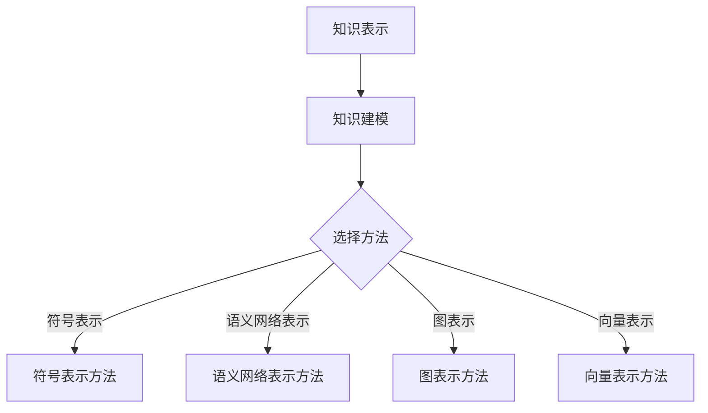

                 

# 知识挖掘：从海量数据中提炼价值洞察

## 关键词

- 知识挖掘
- 数据挖掘
- 数据预处理
- 知识表示
- 知识建模
- 关联规则挖掘
- 分类与聚类挖掘
- 高维数据挖掘
- 社交网络挖掘
- 文本挖掘
- 应用实例

## 摘要

本文将深入探讨知识挖掘这一关键领域，从基础理论到实际应用，逐步剖析知识挖掘的核心概念、技术方法和应用场景。我们将首先介绍知识挖掘的定义、重要性及其发展历程，然后详细讨论数据准备与预处理、知识表示与建模等基础理论。接着，我们将重点探讨多种知识挖掘技术，包括关联规则挖掘、分类与聚类挖掘、高维数据挖掘、社交网络挖掘和文本挖掘。最后，我们将通过实际案例展示知识挖掘在金融、电子商务和健康医疗等领域的应用，并附上相关工具和资源的附录。通过本文的阅读，您将全面了解知识挖掘的原理和实践，掌握从海量数据中提炼价值洞察的方法。

### 第一部分：知识挖掘基础理论

知识挖掘是数据挖掘的高级形式，它旨在从大规模数据集中发现具有实际应用价值的知识和信息。本部分将详细探讨知识挖掘的基础理论，包括知识挖掘的定义、重要性以及其应用领域，并回顾知识挖掘的发展历程。

#### 第1章：知识挖掘概述

##### 1.1 知识挖掘的定义与重要性

知识挖掘（Knowledge Discovery in Databases，KDD）是指从大量的数据中提取出隐含的、未知的、具有潜在价值的信息和知识的过程。它涉及到多个学科领域，包括数据库、人工智能、机器学习、统计学和领域知识等。

知识挖掘的重要性在于，它能够帮助组织和企业从海量数据中挖掘出有价值的洞见，从而指导决策和战略规划。以下是一些关键点：

1. **数据驱动决策**：知识挖掘能够支持数据驱动的决策，帮助企业更好地理解市场和客户需求。
2. **业务洞察**：通过挖掘业务数据，企业可以深入了解业务流程、客户行为和市场需求，从而优化运营策略。
3. **创新与研发**：知识挖掘在科学研究、技术创新和药物研发等领域也有重要应用，可以帮助研究人员发现新的模式和规律。
4. **风险管理**：知识挖掘有助于识别潜在风险，制定有效的风险管理策略。

##### 1.2 知识挖掘的应用领域

知识挖掘的应用领域非常广泛，几乎覆盖了所有行业。以下是几个主要的应用领域：

1. **金融**：通过分析金融数据，知识挖掘可以帮助银行和金融机构进行信用评分、欺诈检测、市场预测和投资策略制定。
2. **电子商务**：电子商务平台使用知识挖掘技术来个性化推荐商品、优化库存管理、分析客户行为和市场趋势。
3. **健康医疗**：在健康医疗领域，知识挖掘用于疾病预测、诊断辅助、药物研发和医疗资源优化等方面。
4. **零售**：零售行业利用知识挖掘分析销售数据，进行客户细分、商品定位和促销策略设计。
5. **制造业**：知识挖掘帮助制造业企业优化生产流程、预测设备故障和制定供应链策略。
6. **公共安全**：知识挖掘在公共安全领域用于犯罪预测、反恐和网络安全等方面。

##### 1.3 知识挖掘的发展历程

知识挖掘作为一个研究领域，其发展历程可以追溯到20世纪80年代。以下是几个关键的发展阶段：

1. **数据挖掘的诞生**（1980s-1990s）：随着数据库技术的成熟和计算能力的提升，数据挖掘作为一个独立的研究领域诞生，其主要目标是发现数据集中的模式和关联。
2. **知识发现**（1990s）：知识发现（KDD）这一术语被提出，强调从大量数据中提取知识的过程，KDD包括数据预处理、数据挖掘、知识表示和解释等多个阶段。
3. **数据挖掘与机器学习的融合**（2000s）：随着机器学习技术的发展，数据挖掘与机器学习开始深度融合，使得知识挖掘技术更加成熟和多样化。
4. **大数据与云计算**（2010s-现在）：随着大数据和云计算的兴起，知识挖掘技术面临新的挑战和机遇。大数据处理技术和分布式计算架构的应用，使得知识挖掘能够处理更大量的数据，提取更深入的洞见。

#### 第2章：数据准备与预处理

##### 2.1 数据来源与收集

数据是知识挖掘的基础，数据的质量和完整性直接影响到挖掘结果的有效性。以下是数据收集过程中需要考虑的关键因素：

1. **数据源类型**：数据源可以分为结构化数据、半结构化数据和非结构化数据。结构化数据通常来自数据库，半结构化数据如XML、JSON等，非结构化数据如文本、图像、音频等。
2. **数据收集方法**：常用的数据收集方法包括抽样、调查、日志记录、Web爬取等。抽样和调查适用于人口统计数据和社会科学研究，日志记录适用于网络和系统数据，Web爬取适用于互联网内容。
3. **数据质量**：数据质量是知识挖掘成功的关键。高质量的数据应具有准确性、完整性、一致性、时效性和可靠性等特点。

##### 2.2 数据质量评估与清洗

数据质量评估和清洗是数据预处理的重要环节，其主要目的是识别和修复数据中的错误、缺失和异常。以下是数据质量评估和清洗的关键步骤：

1. **数据质量检查**：检查数据的一致性、准确性、完整性和时效性，识别潜在的异常和错误。
2. **数据清洗**：包括修复缺失值、处理重复记录、删除异常值和纠正错误等。常见的处理方法有插补、替换、均值替换、中值替换等。
3. **数据验证**：通过样本验证、交叉验证和完整性检查等方法，确保数据清洗后的质量。

##### 2.3 数据集成与变换

数据集成是将来自多个数据源的数据合并成一个统一的数据集，以便进行进一步的分析和挖掘。以下是数据集成和变换的关键步骤：

1. **数据格式转换**：将不同格式（如文本、XML、JSON等）的数据转换为统一的格式（如CSV、数据库表等）。
2. **数据合并**：将来自多个数据源的数据表进行合并，通常涉及键的匹配和冗余数据的删除。
3. **数据变换**：包括数据类型转换、数据标准化、数据归一化等操作，以适应数据挖掘算法的要求。

##### 2.4 特征工程

特征工程是数据预处理中至关重要的一步，它涉及到从原始数据中提取出对知识挖掘有帮助的特征，并对其进行适当的变换和选择。以下是特征工程的关键步骤：

1. **特征提取**：通过统计分析、机器学习和深度学习等方法，从原始数据中提取出有意义的特征。
2. **特征变换**：包括特征标准化、归一化、缩放等操作，以消除不同特征之间的量纲影响。
3. **特征选择**：通过过滤、嵌入、降维等方法，选择出对知识挖掘最具影响力的特征，提高模型性能和可解释性。

#### 第3章：知识表示与建模

##### 3.1 知识表示方法

知识表示是知识挖掘中一个核心问题，其目的是将数据中的隐含知识以结构化的形式表示出来。以下是几种常见的知识表示方法：

1. **符号表示**：使用符号或变量来表示知识，如逻辑表达式、形式逻辑和谓词逻辑等。
2. **语义网络表示**：使用节点和边来表示实体及其关系，如OWL（Web本体语言）和RDF（资源描述框架）等。
3. **图表示**：使用图结构来表示实体及其关系，如图论模型和图神经网络等。
4. **向量表示**：使用向量来表示实体和关系，如Word2Vec、GloVe等词向量模型。

##### 3.2 知识建模技术

知识建模是将知识表示为模型的过程，有助于提高知识的可解释性和可操作性。以下是几种常见的知识建模技术：

1. **分类模型**：将数据分为不同的类别，如决策树、支持向量机等。
2. **聚类模型**：将数据划分为若干个聚类，如K-means、层次聚类等。
3. **关联规则模型**：发现数据之间的关联关系，如Apriori算法、FP-Growth算法等。
4. **预测模型**：对未来的数据进行预测，如时间序列分析、回归分析等。

##### 3.3 常见知识表示语言

知识表示语言是用于定义和表示知识的工具和语法规则。以下是几种常见的知识表示语言：

1. **OWL**：Web本体语言，用于定义语义网络和本体，支持复杂的语义描述。
2. **RDF**：资源描述框架，用于表示实体和关系，是语义网和本体建模的基础。
3. **Protege**：一款基于OWL的本体编辑器，支持创建、编辑和验证本体。
4. **RDF Triples**：三元组表示法，用于表示实体、属性和关系的组合。

### 第二部分：知识挖掘技术实践

#### 第4章：关联规则挖掘

关联规则挖掘是知识挖掘中的一种重要技术，它旨在发现数据集中不同变量之间的关联关系。在本节中，我们将详细介绍关联规则挖掘的基本概念、算法原理及其应用。

##### 4.1 关联规则挖掘算法

关联规则挖掘算法主要包括以下几种：

1. **Apriori算法**：Apriori算法是最经典的关联规则挖掘算法之一，其核心思想是通过迭代生成频繁项集，然后从频繁项集中生成关联规则。Apriori算法的主要步骤包括：

   - **频繁项集生成**：扫描数据集，计算每个项集的支持度，保留支持度大于最小支持度阈值的项集。
   - **关联规则生成**：对于每个频繁项集，生成所有可能的关联规则，并计算其置信度。置信度表示规则的后件在规则的前件发生时出现的概率，即$$\text{Confidence} = \frac{\text{Support}(A \cup B)}{\text{Support}(A)}$$。
   - **规则剪枝**：根据最小置信度阈值，剪枝掉置信度低于阈值的规则。

2. **FP-Growth算法**：FP-Growth算法是一种基于项频模式树（FP-Tree）的关联规则挖掘算法，其核心思想是通过压缩数据集，减少计算量。FP-Growth算法的主要步骤包括：

   - **创建FP-Tree**：扫描数据集，生成FP-Tree，其中每个节点表示一个项，节点的频率表示该项在数据集中出现的次数。
   - **递归挖掘频繁项集**：对FP-Tree进行递归遍历，挖掘出所有频繁项集。
   - **生成关联规则**：从频繁项集中生成关联规则，并计算其置信度。

3. **Eclat算法**：Eclat算法是一种基于频繁项集的生成和剪枝的关联规则挖掘算法，其核心思想是通过递归生成频繁项集，并使用支持度阈值进行剪枝。Eclat算法的主要步骤包括：

   - **递归生成频繁项集**：对于每个项，递归生成其所有可能的子项集，并计算其支持度。
   - **剪枝频繁项集**：根据最小支持度阈值，剪枝掉支持度低于阈值的项集。
   - **生成关联规则**：从频繁项集中生成关联规则，并计算其置信度。

##### 4.2 Apriori算法

Apriori算法是最常用的关联规则挖掘算法之一，其优点是简单易懂，易于实现。以下是Apriori算法的详细步骤：

1. **数据预处理**：将原始数据转换成事务格式，每个事务表示一个购买记录，每个记录包含多个项。
2. **设置最小支持度阈值**：根据业务需求和数据特点，设置一个最小支持度阈值，用于筛选频繁项集。
3. **生成频繁1-项集**：扫描数据集，计算每个项集的支持度，保留支持度大于最小支持度阈值的项集。
4. **生成频繁2-项集**：使用频繁1-项集生成频繁2-项集，计算其支持度，保留支持度大于最小支持度阈值的项集。
5. **递归生成更高阶频繁项集**：使用相同的方法，递归生成更高阶的频繁项集，直到无法生成新的频繁项集为止。
6. **生成关联规则**：从频繁项集中生成关联规则，计算其置信度，并根据最小置信度阈值剪枝掉不满足条件的规则。

##### 4.3 Eclat算法

Eclat算法是一种基于频繁项集的生成和剪枝的关联规则挖掘算法，其核心思想是通过递归生成频繁项集，并使用支持度阈值进行剪枝。以下是Eclat算法的详细步骤：

1. **数据预处理**：将原始数据转换成事务格式，每个事务表示一个购买记录，每个记录包含多个项。
2. **设置最小支持度阈值**：根据业务需求和数据特点，设置一个最小支持度阈值，用于筛选频繁项集。
3. **生成频繁1-项集**：扫描数据集，计算每个项集的支持度，保留支持度大于最小支持度阈值的项集。
4. **递归生成更高阶频繁项集**：对于每个频繁项集，递归生成其所有可能的子项集，并计算其支持度。
5. **剪枝频繁项集**：根据最小支持度阈值，剪枝掉支持度低于阈值的项集。
6. **生成关联规则**：从频繁项集中生成关联规则，计算其置信度，并根据最小置信度阈值剪枝掉不满足条件的规则。

##### 4.4 实际案例：超市购物篮分析

为了更好地理解关联规则挖掘的应用，我们将通过一个超市购物篮分析的案例来说明。

假设我们有一个超市的购物篮数据集，包含多个购买记录。每个记录由多个商品组成，如牛奶、面包、饼干等。我们的目标是发现不同商品之间的关联关系，以便优化促销策略。

1. **数据预处理**：将原始数据转换成事务格式，每个事务表示一个购买记录，每个记录包含多个项。
2. **设置最小支持度阈值**：根据业务需求和数据特点，设置一个最小支持度阈值，如20%。
3. **生成频繁1-项集**：扫描数据集，计算每个项集的支持度，保留支持度大于最小支持度阈值的项集。
4. **生成频繁2-项集**：使用频繁1-项集生成频繁2-项集，计算其支持度，保留支持度大于最小支持度阈值的项集。
5. **递归生成更高阶频繁项集**：使用相同的方法，递归生成更高阶的频繁项集，直到无法生成新的频繁项集为止。
6. **生成关联规则**：从频繁项集中生成关联规则，计算其置信度，并根据最小置信度阈值剪枝掉不满足条件的规则。

通过以上步骤，我们可以得到一系列的关联规则，如“购买牛奶的客户中有80%也购买了面包”。基于这些关联规则，超市可以制定相应的促销策略，如捆绑销售牛奶和面包，以提高销售额。

#### 第5章：分类与聚类挖掘

分类与聚类挖掘是知识挖掘中的两个重要分支，分别用于将数据分为不同的类别和将数据划分为不同的聚类。在本节中，我们将详细介绍分类与聚类挖掘的基本概念、算法原理及其应用。

##### 5.1 分类与聚类方法

分类与聚类方法主要包括以下几类：

1. **分类方法**：

   - **监督学习分类器**：包括决策树、支持向量机（SVM）、朴素贝叶斯分类器、K-近邻算法等。
   - **无监督学习分类器**：包括聚类算法（如K-means、层次聚类等）。

2. **聚类方法**：

   - **基于距离的聚类方法**：包括K-means、Fuzzy C-means等。
   - **基于密度的聚类方法**：包括DBSCAN算法等。
   - **基于模型的聚类方法**：包括高斯混合模型等。

##### 5.2 K-means聚类算法

K-means聚类算法是一种基于距离的聚类方法，其核心思想是将数据点划分为K个簇，使得每个簇内部的数据点之间的距离最小，而簇与簇之间的距离最大。以下是K-means算法的详细步骤：

1. **初始化聚类中心**：随机选择K个数据点作为初始聚类中心。
2. **分配数据点**：计算每个数据点到聚类中心的距离，将数据点分配到最近的聚类中心所在的簇。
3. **更新聚类中心**：计算每个簇的平均值，作为新的聚类中心。
4. **迭代计算**：重复步骤2和步骤3，直到聚类中心不再发生变化或达到预定的迭代次数。

K-means算法的优点是简单、易于实现，但缺点是敏感于初始聚类中心和聚类数量的选择，且在处理非球形簇时效果较差。

##### 5.3 决策树算法

决策树算法是一种监督学习分类器，其核心思想是根据特征值划分数据集，生成一棵树结构，树的每个节点表示一个特征，每个分支表示特征的不同取值，树的叶子节点表示分类结果。以下是决策树算法的详细步骤：

1. **特征选择**：选择一个最优特征，使得通过该特征划分数据集后的信息增益最大。
2. **划分数据集**：根据最优特征的不同取值，将数据集划分为若干个子集。
3. **生成决策树**：递归地对每个子集进行特征选择和划分，直到满足停止条件（如最大树深度、最小样本量等）。
4. **预测分类**：对于新的数据点，从根节点开始，根据特征值沿着树结构进行划分，直到达到叶子节点，输出对应的分类结果。

决策树算法的优点是易于理解和解释，但缺点是容易过拟合，且在处理不平衡数据集时效果较差。

##### 5.4 实际案例：客户群体细分

为了更好地理解分类与聚类挖掘的应用，我们将通过一个客户群体细分的案例来说明。

假设我们有一个客户数据集，包含多个特征（如年龄、收入、职业等）和对应的标签（如消费水平、购买偏好等）。我们的目标是根据这些特征将客户划分为不同的群体，以便进行有针对性的营销和推广。

1. **数据预处理**：将原始数据转换成适合分类和聚类算法的格式，如特征矩阵和标签向量。
2. **选择分类算法**：根据业务需求和数据特点，选择合适的分类算法，如K-means、决策树等。
3. **训练分类模型**：使用训练数据集，对分类模型进行训练，生成模型参数。
4. **预测客户群体**：使用训练好的分类模型，对测试数据集进行预测，输出每个客户的群体标签。
5. **评估模型性能**：使用评估指标（如准确率、召回率、F1值等），评估分类模型的性能。

通过以上步骤，我们可以将客户划分为不同的群体，如高消费群体、普通消费群体等。基于这些群体标签，我们可以制定相应的营销策略，如定向广告投放、定制化优惠等，以提高客户满意度和销售额。

#### 第6章：高维数据挖掘

随着数据规模的不断扩大和数据维度的不断增加，高维数据挖掘逐渐成为一个重要的研究领域。在本节中，我们将详细介绍高维数据挖掘的基本概念、算法原理及其应用。

##### 6.1 高维数据问题

高维数据挖掘面临的主要挑战包括：

1. **维度灾难**：在高维空间中，数据点的分布变得更加稀疏，导致传统算法（如K-means、线性回归等）的效果下降。
2. **计算复杂度**：高维数据挖掘算法通常涉及大量的计算操作，如矩阵运算、向量运算等，导致计算时间显著增加。
3. **数据稀疏性**：高维数据中存在大量的零值，导致数据稀疏，影响算法的性能和稳定性。
4. **解释性**：高维数据挖掘结果往往难以解释，难以理解数据点之间的关联关系和特征的重要性。

##### 6.2 主成分分析

主成分分析（Principal Component Analysis，PCA）是一种常见的高维数据降维方法，其核心思想是通过线性变换将高维数据投影到低维空间，同时保留数据的主要信息。以下是PCA算法的详细步骤：

1. **计算协方差矩阵**：计算数据集的协方差矩阵，表示数据点之间的相关性。
2. **计算特征值和特征向量**：计算协方差矩阵的特征值和特征向量，特征值表示特征的重要性，特征向量表示特征的方向。
3. **选择主成分**：选择前k个最大的特征值对应的特征向量，构成k个主成分。
4. **数据投影**：将原始数据投影到k维空间，得到新的数据表示。

PCA的优点是简单、易于实现，能够显著降低数据维度，提高计算效率。但缺点是可能丢失部分信息，且在处理非线性数据时效果较差。

##### 6.3 投影 Pursuit算法

投影 Pursuit算法是一种基于特征选择和降维的高维数据挖掘方法，其核心思想是通过迭代选择最有代表性的特征，将高维数据投影到低维空间。以下是投影 Pursuit算法的详细步骤：

1. **初始化**：选择一个初始特征，作为降维空间的基向量。
2. **迭代选择特征**：每次迭代选择一个与当前基向量相关性最大的特征，更新基向量。
3. **数据投影**：将原始数据投影到低维空间，得到新的数据表示。
4. **停止条件**：当迭代次数达到预定的阈值或特征选择质量不再提高时，停止迭代。

投影 Pursuit算法的优点是能够自动选择具有代表性的特征，提高降维效果。但缺点是计算复杂度较高，且在处理高维稀疏数据时效果较差。

##### 6.4 实际案例：社交媒体用户行为分析

为了更好地理解高维数据挖掘的应用，我们将通过一个社交媒体用户行为分析的案例来说明。

假设我们有一个社交媒体用户数据集，包含多个特征（如年龄、性别、地理位置、兴趣爱好等）和对应的用户行为数据（如点赞数、评论数、分享数等）。我们的目标是根据用户行为数据，对用户进行分类和细分。

1. **数据预处理**：将原始数据转换成适合高维数据挖掘算法的格式，如特征矩阵和标签向量。
2. **选择降维算法**：根据业务需求和数据特点，选择合适的降维算法，如PCA、投影 Pursuit等。
3. **降维处理**：使用降维算法，将高维数据降维到低维空间，得到新的数据表示。
4. **分类与聚类**：使用分类和聚类算法（如K-means、决策树等），对低维数据集进行分类和聚类，得到用户群体细分结果。
5. **评估模型性能**：使用评估指标（如准确率、召回率、F1值等），评估分类和聚类模型的性能。

通过以上步骤，我们可以将社交媒体用户划分为不同的群体，如高活跃用户、沉默用户等。基于这些用户群体，我们可以制定相应的营销策略，如推送个性化内容、推荐相关好友等，以提高用户满意度和活跃度。

#### 第7章：社交网络挖掘

社交网络挖掘是知识挖掘领域的一个重要分支，旨在从社交网络数据中提取有价值的信息和知识。在本节中，我们将详细介绍社交网络挖掘的基本概念、算法原理及其应用。

##### 7.1 社交网络基本概念

社交网络是指由人与人之间互动关系构成的网络结构，每个节点表示一个个体（如用户、物品、话题等），每条边表示个体之间的某种互动关系（如关注、点赞、评论等）。以下是社交网络挖掘的关键概念：

1. **社交网络拓扑结构**：社交网络的结构特性，包括节点度（degree）、聚类系数（clustering coefficient）、路径长度（path length）等。
2. **社交网络属性**：社交网络的属性包括节点属性（如年龄、性别、职业等）和边属性（如互动类型、时间戳等）。
3. **社交网络演化**：社交网络的动态变化过程，包括节点的加入与退出、边的建立与删除等。

##### 7.2 社交网络分析算法

社交网络挖掘算法主要包括以下几类：

1. **节点重要性分析**：用于评估节点在社交网络中的重要性，包括中心性指标（如度中心性、接近中心性、中间中心性等）和影响力指标（如PageRank、HITS算法等）。
2. **社区发现**：用于识别社交网络中的紧密联系群体，包括基于密度、基于模块度、基于标签等方法的社区发现算法。
3. **社交网络演化分析**：用于分析社交网络的演化过程，包括节点加入与退出、边建立与删除等过程的统计分析和模型构建。
4. **社交网络传播分析**：用于分析信息、疾病、谣言等在社交网络中的传播过程，包括传播模型、传播路径分析等。

##### 7.3 实际案例：社交网络影响力分析

为了更好地理解社交网络挖掘的应用，我们将通过一个社交网络影响力分析的案例来说明。

假设我们有一个社交媒体平台的数据集，包含用户间的互动关系（如关注、点赞、评论等）和用户的属性（如年龄、性别、地理位置等）。我们的目标是评估用户在社交网络中的影响力，以便识别关键用户和制定相应的营销策略。

1. **数据预处理**：将原始数据转换成适合社交网络挖掘算法的格式，如邻接矩阵、边的权重等。
2. **计算节点重要性**：使用中心性指标和影响力指标，计算每个用户在社交网络中的重要性得分。
3. **识别关键用户**：根据重要性得分，识别社交网络中的关键用户，如意见领袖、活跃用户等。
4. **分析社交网络结构**：使用社区发现算法，分析社交网络的结构特性，如社区规模、密度等。
5. **评估影响力效果**：使用评估指标（如传播范围、传播速度等），评估关键用户的影响力效果。

通过以上步骤，我们可以评估用户在社交网络中的影响力，识别关键用户，并制定相应的营销策略，如推送个性化内容、开展用户互动等，以提高用户满意度和活跃度。

#### 第8章：文本挖掘

文本挖掘是知识挖掘领域的一个重要分支，旨在从大量文本数据中提取有价值的信息和知识。在本节中，我们将详细介绍文本挖掘的基本概念、算法原理及其应用。

##### 8.1 文本挖掘概述

文本挖掘是指使用自然语言处理（NLP）、机器学习、深度学习等方法，从文本数据中提取有用信息的过程。文本挖掘的目标包括：

1. **文本分类**：将文本数据分为不同的类别，如新闻、广告、评论等。
2. **主题模型**：发现文本数据中的潜在主题和关键词，如文本聚类、文档生成等。
3. **情感分析**：分析文本数据中的情感倾向，如正面情感、负面情感等。
4. **实体识别**：识别文本数据中的实体，如人名、地名、组织名等。
5. **关系提取**：提取文本数据中的实体关系，如因果关系、所属关系等。

##### 8.2 词汇分析

词汇分析是文本挖掘的基础步骤，旨在分析文本数据中的词汇及其分布。以下是词汇分析的关键概念：

1. **词频统计**：计算文本数据中每个词汇的出现次数，用于分析词汇的重要性和频率。
2. **词性标注**：对文本数据中的词汇进行词性标注，如名词、动词、形容词等，用于理解词汇的功能和语义。
3. **词频-逆文档频率（TF-IDF）**：计算词汇的重要性，综合考虑词频和文档频率，用于文本分类和主题模型等。
4. **词汇聚类**：将相似的词汇聚为一类，用于词汇压缩和语义相似性分析。

##### 8.3 主题模型

主题模型是一种无监督学习方法，用于发现文本数据中的潜在主题和关键词。以下是几种常见的主题模型：

1. **LDA（Latent Dirichlet Allocation）**：LDA模型是一种基于概率生成模型的主题模型，通过狄利克雷分布（Dirichlet Distribution）生成文本数据的主题分布。
2. **Lemmatization**：将文本数据中的词汇转换为词干形式，用于消除词汇的词形变化，提高主题模型的性能。
3. **主题提取**：从LDA模型中提取主题，包括主题词和主题分布，用于文本分类、聚类和生成等。

##### 8.4 实际案例：社交媒体文本情感分析

为了更好地理解文本挖掘的应用，我们将通过一个社交媒体文本情感分析的案例来说明。

假设我们有一个社交媒体平台的数据集，包含用户的评论和帖子。我们的目标是分析用户对特定话题的情感倾向，如产品评价、政治观点等。

1. **数据预处理**：将原始文本数据清洗、分词、去除停用词，得到适合文本挖掘算法的文本表示。
2. **文本分类**：使用文本分类算法（如朴素贝叶斯、支持向量机等），对评论和帖子进行分类，识别不同的情感类别。
3. **主题模型**：使用LDA模型，对评论和帖子进行主题提取，识别文本数据中的潜在主题和关键词。
4. **情感分析**：结合文本分类和主题模型，分析用户对特定话题的情感倾向，如正面情感、负面情感等。
5. **可视化**：使用可视化工具（如图表、热图等），展示文本数据中的情感分布和主题分布。

通过以上步骤，我们可以分析社交媒体平台上的用户情感，识别热点话题和负面情绪，为企业制定相应的策略提供参考。

### 第三部分：知识挖掘应用

#### 第9章：金融行业知识挖掘应用

金融行业是一个高度数据密集型的行业，知识挖掘技术在金融数据分析、风险管理和投资策略制定等方面具有广泛的应用。在本节中，我们将详细探讨金融行业知识挖掘的应用实例，包括财务报表分析、风险评估和信用评分系统。

##### 9.1 金融数据挖掘概述

金融数据挖掘是指利用知识挖掘技术，从金融数据中提取有价值的信息和知识，以支持金融决策和风险管理的全过程。金融数据挖掘的主要目标包括：

1. **市场预测**：通过分析历史市场数据和宏观经济指标，预测未来市场走势，为投资决策提供参考。
2. **风险识别与管理**：通过分析客户交易数据、信用记录等，识别潜在风险，制定有效的风险管理策略。
3. **投资策略优化**：通过分析市场数据、公司财务报表等，发现投资机会，优化投资组合。
4. **客户细分**：通过分析客户交易数据、行为数据等，将客户划分为不同的细分群体，制定个性化的营销策略。

##### 9.2 财务报表分析

财务报表分析是金融数据挖掘的重要应用之一，旨在通过分析企业的财务报表数据，评估企业的财务状况和经营绩效。以下是财务报表分析的关键步骤：

1. **数据收集与预处理**：收集企业的财务报表数据，包括资产负债表、利润表和现金流量表等，对数据进行清洗和预处理，如缺失值填补、异常值处理等。
2. **指标计算**：计算一系列财务指标，如净利润率、资产负债率、流动比率等，用于评估企业的财务状况和经营绩效。
3. **异常检测**：通过分析财务指标的时间序列变化，检测异常值和异常现象，如财务报表异常、财务欺诈等。
4. **预测与预警**：基于历史数据和现有模型，预测企业的未来财务状况，并设置预警阈值，及时识别潜在风险。

##### 9.3 风险评估

风险评估是金融数据挖掘的重要应用，旨在通过分析客户交易数据、信用记录等，评估客户的信用风险和投资风险。以下是风险评估的关键步骤：

1. **数据收集与预处理**：收集客户的交易数据、信用记录、社会背景等，对数据进行清洗和预处理，如缺失值填补、异常值处理等。
2. **特征提取与选择**：从原始数据中提取对风险评估有意义的特征，如还款能力、信用历史、财务状况等，选择最有效的特征进行风险评估。
3. **风险评估模型**：建立风险评估模型，如逻辑回归、决策树、神经网络等，对客户进行信用评分。
4. **风险预警与监控**：对客户的风险评分进行实时监控，及时发现潜在风险，制定相应的风险管理策略。

##### 9.4 实际案例：信用评分系统

信用评分系统是金融数据挖掘在风险评估领域的典型应用。以下是信用评分系统的一个实际案例：

假设我们有一个银行客户数据集，包含客户的个人信息、交易记录、信用历史等。我们的目标是建立信用评分系统，对客户进行信用评分。

1. **数据收集与预处理**：收集客户的个人信息、交易记录、信用历史等，对数据进行清洗和预处理，如缺失值填补、异常值处理等。
2. **特征提取与选择**：从原始数据中提取对信用评分有意义的特征，如年龄、收入、信用额度、还款记录等，选择最有效的特征进行信用评分。
3. **模型建立与训练**：建立信用评分模型，如逻辑回归、决策树、神经网络等，使用训练数据集对模型进行训练。
4. **模型评估与优化**：使用测试数据集评估信用评分模型的性能，根据评估结果调整模型参数，优化模型性能。
5. **信用评分与决策**：对新的客户数据，使用训练好的信用评分模型进行评分，根据评分结果做出信用决策，如贷款审批、信用卡发放等。

通过以上步骤，银行可以建立有效的信用评分系统，提高贷款审批的准确性和效率，降低信用风险。

#### 第10章：电子商务知识挖掘应用

电子商务行业是一个数据驱动的行业，知识挖掘技术在个性化推荐、客户细分、库存管理和市场需求预测等方面具有广泛的应用。在本节中，我们将详细探讨电子商务知识挖掘的应用实例。

##### 10.1 电子商务数据挖掘概述

电子商务数据挖掘是指利用知识挖掘技术，从电子商务平台的数据中提取有价值的信息和知识，以支持业务决策和运营优化。电子商务数据挖掘的主要目标包括：

1. **个性化推荐**：通过分析用户行为数据，为用户提供个性化的商品推荐，提高用户体验和销售额。
2. **客户细分**：通过分析用户特征和行为数据，将客户划分为不同的细分群体，制定个性化的营销策略。
3. **库存管理**：通过分析销售数据、库存数据等，优化库存水平，降低库存成本，提高库存周转率。
4. **市场需求预测**：通过分析历史销售数据、市场趋势等，预测未来的市场需求，为采购、生产和销售计划提供参考。

##### 10.2 个性化推荐系统

个性化推荐系统是电子商务数据挖掘的一个重要应用，旨在根据用户的历史行为和偏好，为用户提供个性化的商品推荐。以下是个性化推荐系统的关键步骤：

1. **数据收集与预处理**：收集用户行为数据（如浏览历史、购买记录、收藏记录等），对数据进行清洗和预处理，如缺失值填补、异常值处理等。
2. **用户特征提取**：从原始数据中提取对推荐有意义的用户特征，如用户年龄、性别、地理位置、购买频率等。
3. **推荐算法选择**：选择合适的推荐算法，如基于协同过滤、基于内容的推荐、混合推荐等。
4. **推荐结果生成**：基于用户特征和推荐算法，生成个性化的商品推荐结果，如商品列表、推荐标签等。
5. **推荐效果评估**：使用评估指标（如点击率、转化率、推荐满意度等），评估个性化推荐系统的效果，并根据评估结果调整推荐策略。

##### 10.3 库存管理

库存管理是电子商务数据挖掘的另一个重要应用，旨在通过分析销售数据、库存数据等，优化库存水平，降低库存成本。以下是库存管理的关键步骤：

1. **数据收集与预处理**：收集销售数据、库存数据等，对数据进行清洗和预处理，如缺失值填补、异常值处理等。
2. **库存预测**：基于历史销售数据和趋势，使用预测算法（如时间序列分析、回归分析等），预测未来的销售量和库存需求。
3. **库存策略制定**：根据库存预测结果，制定合适的库存策略，如定期补货、动态补货、紧急补货等。
4. **库存监控与优化**：实时监控库存水平，根据库存变化和市场需求，调整库存策略，优化库存周转率和库存成本。

##### 10.4 实际案例：电商平台商品推荐

为了更好地理解电子商务知识挖掘的应用，我们将通过一个电商平台商品推荐的案例来说明。

假设我们有一个电商平台的数据集，包含用户的行为数据（如浏览历史、购买记录、收藏记录等）和商品信息（如商品ID、商品名称、价格等）。我们的目标是建立商品推荐系统，为用户提供个性化的商品推荐。

1. **数据收集与预处理**：收集用户行为数据和商品信息，对数据进行清洗和预处理，如缺失值填补、异常值处理等。
2. **用户特征提取**：从原始数据中提取对推荐有意义的用户特征，如用户年龄、性别、地理位置、购买频率等。
3. **推荐算法选择**：选择合适的推荐算法，如基于协同过滤、基于内容的推荐、混合推荐等。
4. **推荐结果生成**：基于用户特征和推荐算法，生成个性化的商品推荐结果，如商品列表、推荐标签等。
5. **推荐效果评估**：使用评估指标（如点击率、转化率、推荐满意度等），评估商品推荐系统的效果，并根据评估结果调整推荐策略。

通过以上步骤，电商平台可以为用户提供个性化的商品推荐，提高用户体验和销售额。

#### 第11章：健康医疗知识挖掘应用

健康医疗行业是一个数据密集型行业，知识挖掘技术在疾病预测与诊断、药物研发和智能健康管理等方面具有广泛的应用。在本节中，我们将详细探讨健康医疗知识挖掘的应用实例。

##### 11.1 健康医疗数据挖掘概述

健康医疗数据挖掘是指利用知识挖掘技术，从健康医疗数据中提取有价值的信息和知识，以支持疾病预测、诊断辅助、药物研发和智能健康管理。健康医疗数据挖掘的主要目标包括：

1. **疾病预测与诊断**：通过分析患者历史数据和生理指标，预测患者患病风险，辅助医生进行疾病诊断。
2. **药物研发**：通过分析生物医学数据和基因信息，发现新的药物靶点和治疗策略，加速药物研发进程。
3. **智能健康管理**：通过分析患者行为数据、健康监测数据等，提供个性化的健康管理方案，提高患者的生活质量。
4. **医疗资源优化**：通过分析医疗资源使用情况，优化医疗资源配置，提高医疗服务效率和质量。

##### 11.2 疾病预测与诊断

疾病预测与诊断是健康医疗数据挖掘的重要应用，旨在通过分析患者历史数据和生理指标，预测患者患病风险，辅助医生进行疾病诊断。以下是疾病预测与诊断的关键步骤：

1. **数据收集与预处理**：收集患者历史数据（如病例记录、生理指标等），对数据进行清洗和预处理，如缺失值填补、异常值处理等。
2. **特征提取与选择**：从原始数据中提取对疾病预测与诊断有意义的特征，如年龄、性别、病史、实验室检测结果等，选择最有效的特征进行预测与诊断。
3. **预测与诊断模型**：建立预测与诊断模型，如逻辑回归、支持向量机、神经网络等，对模型进行训练和验证。
4. **预测与诊断评估**：使用评估指标（如准确率、召回率、F1值等），评估预测与诊断模型的性能，并根据评估结果调整模型参数。
5. **预测结果应用**：将预测结果应用于实际医疗场景，如疾病风险评估报告、辅助诊断建议等。

##### 11.3 药物研发

药物研发是健康医疗数据挖掘的重要应用，旨在通过分析生物医学数据和基因信息，发现新的药物靶点和治疗策略，加速药物研发进程。以下是药物研发的关键步骤：

1. **数据收集与预处理**：收集生物医学数据和基因信息，对数据进行清洗和预处理，如缺失值填补、异常值处理等。
2. **特征提取与选择**：从原始数据中提取对药物研发有意义的特征，如蛋白质序列、基因表达水平、细胞信号通路等，选择最有效的特征进行药物研发。
3. **药物筛选与评估**：建立药物筛选与评估模型，如机器学习、深度学习等，对药物候选进行筛选和评估。
4. **实验验证与优化**：通过实验室和临床试验验证药物的有效性和安全性，根据验证结果对药物进行优化和改进。
5. **药物研发报告**：撰写药物研发报告，记录药物研发的整个过程，为后续研发提供参考。

##### 11.4 实际案例：智能健康管理系统

为了更好地理解健康医疗知识挖掘的应用，我们将通过一个智能健康管理的实际案例来说明。

假设我们有一个智能健康管理系统，旨在为用户提供个性化的健康管理方案。以下是智能健康管理系统的关键步骤：

1. **用户数据收集**：收集用户的健康数据（如体重、血压、血糖、运动习惯等），对数据进行清洗和预处理。
2. **用户特征提取**：从原始数据中提取对健康管理有意义的特征，如年龄、性别、病史、生活习惯等。
3. **疾病风险评估**：建立疾病风险评估模型，对用户进行疾病风险评估，如高血压、糖尿病等。
4. **个性化健康管理方案**：根据用户的风险评估结果和健康数据，制定个性化的健康管理方案，如饮食建议、运动计划、用药指导等。
5. **实时监控与反馈**：实时监控用户的健康状况，根据用户反馈和健康数据，调整健康管理方案。

通过以上步骤，智能健康管理系统可以为用户提供全面、个性化的健康管理服务，提高用户的生活质量和健康水平。

### 附录

#### 附录A：知识挖掘工具与资源

##### A.1 开源知识挖掘工具

开源知识挖掘工具是进行知识挖掘研究的重要资源，以下是一些常用的开源知识挖掘工具：

1. **WEKA**：Weka是一个开源的机器学习软件，提供各种数据预处理和机器学习算法，适用于数据挖掘和数据分析。
2. **Python Data Science Toolkit**：Python Data Science Toolkit是一个集成的数据科学平台，包含多种数据预处理、机器学习和可视化工具。
3. **Apache Mahout**：Apache Mahout是一个基于Hadoop的分布式机器学习库，提供多种协同过滤、分类和聚类算法。
4. **Apache Spark MLlib**：Apache Spark MLlib是一个分布式机器学习库，提供多种机器学习算法和数据处理功能，支持大规模数据集。
5. **RapidMiner**：RapidMiner是一个可视化的数据挖掘和机器学习平台，提供丰富的算法库和自定义插件。

##### A.2 知识挖掘数据库

知识挖掘数据库是进行知识挖掘研究的重要数据资源，以下是一些常用的知识挖掘数据库：

1. **UCI机器学习数据库**：UCI机器学习数据库提供各种领域的数据集，包括统计、医疗、金融、文本等，是进行知识挖掘研究的重要资源。
2. **Kaggle数据集**：Kaggle是一个在线数据科学竞赛平台，提供各种领域的数据集，可用于知识挖掘研究。
3. **KDD Cup数据集**：KDD Cup是一个数据挖掘竞赛，每年提供新的数据集，涵盖各种领域，是进行知识挖掘研究的重要资源。
4. **OpenML**：OpenML是一个开源的知识挖掘数据库，提供各种领域的数据集，支持数据挖掘算法的实验和评估。
5. **UML Data Repository**：UML Data Repository是一个提供多种领域数据集的数据库，适用于知识挖掘和机器学习研究。

##### A.3 知识挖掘相关会议和期刊

知识挖掘领域有许多重要的学术会议和期刊，以下是一些主要的会议和期刊：

1. **KDD（Knowledge Discovery and Data Mining）**：KDD是知识挖掘领域的顶级国际会议，每年发布最新研究成果。
2. **ICDM（International Conference on Data Mining）**：ICDM是数据挖掘领域的顶级国际会议，涵盖各种数据挖掘算法和应用。
3. **JCDL（Joint Conference on Digital Libraries）**：JCDL是一个数字图书馆和知识挖掘领域的国际会议，关注数字资源和知识挖掘技术。
4. **ACM SIGKDD**：ACM SIGKDD是一个知识挖掘领域的专业组织，举办各种学术会议和研讨会。
5. **IEEE Transactions on Knowledge and Data Engineering**：这是一本知识挖掘领域的顶级期刊，发表有关数据挖掘、知识管理和数据工程的研究论文。
6. **Journal of Data Mining**：Journal of Data Mining是一本专门发表数据挖掘领域研究成果的期刊，涵盖各种数据挖掘算法和应用。
7. **Knowledge and Information Systems**：Knowledge and Information Systems是一本综合性的知识挖掘和人工智能领域的期刊，发表关于知识表示、数据挖掘、机器学习等方面的论文。

### 附录B：Mermaid流程图与伪代码

##### B.1 知识表示与建模的Mermaid流程图



##### B.2 关联规则挖掘算法的伪代码

```python
# 输入：数据集D、最小支持度阈值min_support、最小置信度阈值min_confidence
# 输出：频繁项集L、关联规则R

# 步骤1：计算项集支持度
support_count = calculate_support(D, min_support)

# 步骤2：生成频繁项集
L = generate_frequent_itemsets(support_count, min_support)

# 步骤3：生成关联规则
R = generate_association_rules(L, D, min_confidence)

# 步骤4：剪枝规则
R = prune_rules(R, min_confidence)

return R
```

##### B.3 分类与聚类算法的伪代码

```python
# 输入：数据集D、分类器类型、参数
# 输出：分类模型、聚类结果

# 步骤1：数据预处理
D_preprocessed = preprocess_data(D)

# 步骤2：训练分类模型
classifier = train_classifier(D_preprocessed, classifier_type, parameters)

# 步骤3：预测分类结果
predictions = classifier.predict(D_preprocessed)

# 步骤4：聚类分析
cluster_result = cluster_data(D_preprocessed, clustering_algorithm, parameters)

# 步骤5：评估分类和聚类结果
evaluate_predictions(predictions, D)
evaluate_clusters(cluster_result, D)

return classifier, cluster_result
```

##### B.4 高维数据挖掘算法的伪代码

```python
# 输入：数据集D、降维方法、参数
# 输出：降维结果

# 步骤1：数据预处理
D_preprocessed = preprocess_data(D)

# 步骤2：降维处理
D_reduced = reduce_dimensionality(D_preprocessed, dimension_reduction_algorithm, parameters)

# 步骤3：评估降维结果
evaluate_dimensionality_reduction(D_reduced, D)

return D_reduced
```

### 附录C：代码实例与解析

##### C.1 关联规则挖掘代码实例

以下是一个基于Apriori算法的关联规则挖掘的Python代码实例，用于分析超市购物篮数据。

```python
import pandas as pd
from mlxtend.frequent_patterns import apriori
from mlxtend.frequent_patterns import association_rules

# 读取购物篮数据
data = pd.read_csv('supermarket_data.csv')

# 设置最小支持度和最小置信度
min_support = 0.02
min_confidence = 0.6

# 计算频繁项集
frequent_itemsets = apriori(data, min_support=min_support, use_colnames=True)

# 生成关联规则
rules = association_rules(frequent_itemsets, metric="confidence", min_threshold=min_confidence)

# 输出关联规则
print(rules)
```

解析：

- 我们首先使用Pandas库读取购物篮数据。
- 接下来，设置最小支持度和最小置信度阈值，这些阈值决定了哪些项集被视为频繁的，以及哪些规则被视为有意义的。
- 使用`apriori`函数计算频繁项集，该函数接受原始数据和最小支持度阈值作为输入，并返回一个数据框，其中包含频繁项集。
- 使用`association_rules`函数从频繁项集中生成关联规则，该函数接受频繁项集和数据框作为输入，并返回一个数据框，其中包含生成的规则。
- 最后，我们将生成的关联规则打印出来，以便进一步分析。

##### C.2 聚类分析代码实例

以下是一个基于K-means算法的聚类分析的Python代码实例，用于分析客户数据。

```python
import pandas as pd
from sklearn.cluster import KMeans
from sklearn.preprocessing import StandardScaler

# 读取客户数据
data = pd.read_csv('customer_data.csv')

# 数据预处理
scaler = StandardScaler()
data_scaled = scaler.fit_transform(data)

# 设置聚类数量
k = 3

# 训练K-means模型
kmeans = KMeans(n_clusters=k, random_state=42)
clusters = kmeans.fit_predict(data_scaled)

# 输出聚类结果
print(clusters)
```

解析：

- 我们首先使用Pandas库读取客户数据。
- 接下来，使用`StandardScaler`对数据进行标准化处理，以确保每个特征具有相同的尺度，这对于聚类算法的性能至关重要。
- 设置聚类数量`k`，这里我们设置为3。
- 使用`KMeans`类训练K-means模型，该模型接受特征矩阵和聚类数量作为输入，并返回聚类中心。
- 使用`fit_predict`方法对数据集进行聚类，该方法返回每个数据点的聚类标签。
- 最后，我们将聚类结果打印出来，以便进一步分析。

##### C.3 文本挖掘代码实例

以下是一个基于LDA主题模型的文本挖掘Python代码实例，用于分析社交媒体文本数据。

```python
import pandas as pd
from sklearn.feature_extraction.text import TfidfVectorizer
from sklearn.decomposition import LatentDirichletAllocation

# 读取社交媒体文本数据
data = pd.read_csv('social_media_text.csv')

# 设置停用词和词典
stop_words = set(['a', 'the', 'and', 'is', 'in', 'of', 'to'])
dictionary = corpora.Dictionary(data['text'])

# 构建文档矩阵
vectorizer = TfidfVectorizer(stop_words=stop_words, dictionary=dictionary, lowercase=True)
X = vectorizer.fit_transform(data['text'])

# 设置主题数量
n_topics = 5

# 训练LDA模型
lda = LatentDirichletAllocation(n_components=n_topics, random_state=42)
lda.fit(X)

# 输出主题分布
topic_distribution = lda.transform(X)
print(topic_distribution)
```

解析：

- 我们首先使用Pandas库读取社交媒体文本数据。
- 接下来，设置停用词和词典，以减少文本数据中的噪声。
- 使用`TfidfVectorizer`将文本数据转换为TF-IDF向量矩阵，该向量器接受文本数据、停用词和词典作为输入。
- 设置主题数量`n_topics`，这里我们设置为5。
- 使用`LatentDirichletAllocation`类训练LDA模型，该模型接受特征矩阵和主题数量作为输入，并返回主题分布。
- 使用`fit`方法训练LDA模型，该方法返回主题分布矩阵。
- 最后，我们将主题分布打印出来，以便进一步分析。

##### C.4 代码解读与分析

这些代码实例展示了知识挖掘中几种常见算法的应用，包括关联规则挖掘、聚类分析和文本挖掘。以下是每个实例的解读和分析：

1. **关联规则挖掘**：该实例使用Apriori算法从超市购物篮数据中提取频繁项集和关联规则。通过设置最小支持度和最小置信度阈值，我们可以过滤出有意义的规则。这些规则可以用于优化促销策略，如捆绑销售或推荐相关商品。

2. **聚类分析**：该实例使用K-means算法对客户数据进行分析，将客户划分为不同的聚类。通过标准化处理，我们确保了每个特征具有相同的尺度，这对于聚类结果的可解释性至关重要。聚类结果可以用于市场细分和个性化营销。

3. **文本挖掘**：该实例使用LDA主题模型对社交媒体文本数据进行分析，提取文本数据中的潜在主题。通过设置主题数量，我们可以识别文本数据中的主要话题。这些主题可以帮助理解用户兴趣和内容趋势。

每个实例都提供了一个简单的示例，展示了如何使用Python和常见的数据科学库（如Pandas、Scikit-learn和gensim）进行知识挖掘。通过这些实例，读者可以了解每种算法的基本原理和实现方法，并学会如何将这些算法应用于实际数据集。

### 作者信息

作者：AI天才研究院/AI Genius Institute & 禅与计算机程序设计艺术 /Zen And The Art of Computer Programming

通过本文的详细探讨，我们全面了解了知识挖掘的原理和实践。从数据准备与预处理，到知识表示与建模，再到关联规则挖掘、分类与聚类挖掘、高维数据挖掘、社交网络挖掘和文本挖掘，我们逐步深入分析了知识挖掘的核心技术和方法。同时，通过实际案例和代码实例，我们展示了如何将这些理论知识应用于实际场景，从而从海量数据中提炼出有价值的洞察。希望本文能为读者在知识挖掘领域的研究和应用提供有益的参考。感谢您的阅读！


