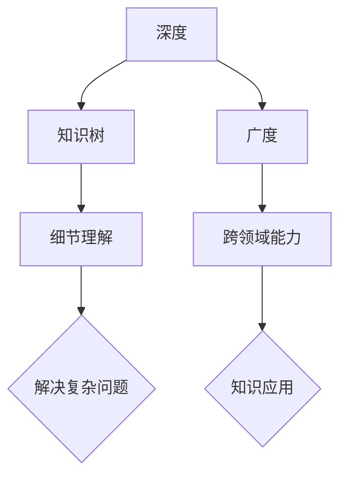
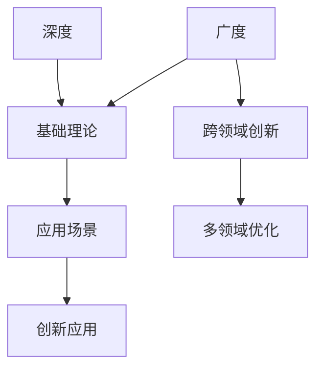

                 

# 《知识的深度与广度：全面发展的辩证关系》

## 关键词：深度学习、广度拓展、全面发展、辩证关系、实践应用

## 摘要

在信息技术迅猛发展的今天，知识的深度与广度成为了衡量个人和团队专业能力的重要指标。本文旨在探讨知识的深度与广度的概念、关系及其在全面发展中的重要作用。通过分析深度与广度的互补与转化，本文揭示了二者在个人成长、社会发展、教育领域和企业管理中的具体应用。此外，本文还讨论了全面发展的实现路径，以及深度与广度在未来发展趋势中的挑战与机遇。通过深入剖析和实践应用，本文旨在为读者提供一个全面、系统的知识体系，以推动个人和社会的全面发展。

---

# 《知识的深度与广度：全面发展的辩证关系》目录大纲

## 第一部分：深度与广度的概念与意义

### 第1章：深度与广度的基本概念

#### 1.1 知识深度与广度的定义

#### 1.2 深度与广度的关系

### 第2章：深度与广度的意义

#### 2.1 深度与广度在个人成长中的作用

#### 2.2 深度与广度在社会发展中的作用

### 第3章：深度与广度的衡量标准

#### 3.1 深度与广度的量化指标

#### 3.2 深度与广度的评估方法

## 第二部分：深度与广度的辩证关系

### 第4章：深度与广度的辩证统一

#### 4.1 深度与广度的互补作用

#### 4.2 深度与广度的相互转化

### 第5章：深度与广度的矛盾与统一

#### 5.1 深度与广度的矛盾分析

#### 5.2 深度与广度的统一途径

### 第6章：深度与广度的实践应用

#### 6.1 教育领域的深度与广度

#### 6.2 科研领域的深度与广度

#### 6.3 企业管理的深度与广度

## 第三部分：全面发展的辩证关系

### 第7章：全面发展与深度广度的关系

#### 7.1 全面发展的概念

#### 7.2 深度与广度在全面发展中的作用

### 第8章：全面发展的实现路径

#### 8.1 个人层面的全面发展

#### 8.2 社会层面的全面发展

### 第9章：全面发展的案例分析

#### 9.1 成功案例分享

#### 9.2 失败案例分析

## 第四部分：深度与广度的未来发展趋势

### 第10章：深度与广度的未来趋势

#### 10.1 深度与广度的发展方向

#### 10.2 深度与广度的创新应用

### 第11章：深度与广度的挑战与机遇

#### 11.1 深度与广度的挑战

#### 11.2 深度与广度的机遇

## 附录

### 附录A：深度与广度相关资源

#### A.1 主要参考书籍

#### A.2 学术论文汇总

#### A.3 实用工具与平台推荐

---

接下来，我们将逐步展开这篇文章的正文内容，深入探讨知识的深度与广度及其在全面发展中的辩证关系。首先，我们将从深度与广度的基本概念入手，为后续的讨论奠定坚实的基础。

## 第一部分：深度与广度的概念与意义

### 第1章：深度与广度的基本概念

#### 1.1 知识深度与广度的定义

知识的深度与广度是衡量一个人或一个组织在特定领域内知识水平的重要指标。深度通常指的是在某个专业领域内掌握的细致程度和深入程度，即对该领域内部部结构的理解和掌握程度。广度则是指一个人或组织在不同领域内具备的知识范围和跨领域的能力。

知识深度可以理解为知识树中每个节点所包含的信息量和复杂性。一个具有深度的知识体系，意味着该个体能够对某一领域的核心概念、原理和技术细节有深入的了解，并能运用这些知识解决复杂的实际问题。知识广度则类似于知识树的宽度，指的是个体在不同领域的知识面广度，即能够理解和运用多个领域的知识和技能。

在信息技术领域，深度和广度有着不同的体现。例如，一个深度计算机科学家可能对算法和数据结构的细节有深入的理解，并能运用这些知识来解决复杂的问题。而一个广度计算机科学家则可能具备计算机科学、数学、物理学、心理学等多个领域的知识，能够从不同角度看待和解决问题。

#### 1.2 深度与广度的关系

深度与广度是知识体系中的两个重要维度，它们之间既相互独立，又相互影响。深度与广度的关系可以从以下几个方面来理解：

1. **互补性**：深度和广度相互补充，一个人在某一领域的深度知识可以帮助其在其他领域更快速地学习和应用，反之亦然。例如，一个具有数学深度的人在学习计算机科学时，能够更好地理解算法背后的数学原理。

2. **相互转化**：在某个领域的深度知识积累到一定程度后，可能会扩展到其他领域，从而实现知识的广度拓展。反之，通过广泛的学习和探索，也可能在不同领域内形成深度知识。这种相互转化是知识体系不断发展和完善的过程。

3. **平衡与取舍**：在知识体系中，深度和广度需要保持一定的平衡。过于追求深度可能会导致视野狭窄，难以应对复杂多变的环境；而过于追求广度则可能导致知识浅薄，难以深入解决关键问题。因此，在个人和组织的知识体系建设中，需要根据实际情况和目标进行合理的取舍和平衡。

为了更直观地理解深度与广度的关系，我们可以使用 Mermaid 流程图来表示：



通过这张图，我们可以看到深度和广度在知识体系中的相互关系，以及它们在细节理解和跨领域能力方面的作用。

### 第2章：深度与广度的意义

#### 2.1 深度与广度在个人成长中的作用

在个人成长过程中，深度与广度发挥着至关重要的作用。深度可以帮助个人在专业领域内达到卓越水平，从而在职业生涯中获得竞争优势。通过深入研究，个人能够掌握核心技能和专业知识，提高解决问题的能力，为职业生涯的持续发展打下坚实基础。

广度则有助于个人在多个领域内建立广泛的知识体系，提升跨领域能力。这种能力不仅有助于个人在面对复杂问题时能够从不同角度进行思考，还能促进个人在职业生涯中的灵活性和适应性。在快速变化的科技环境中，广度知识使个人能够更快地适应新技术和新趋势，从而在职业生涯中保持竞争力。

深度与广度的结合，使得个人能够在一个专业领域内深入探索，同时保持对其他领域的敏感性。这种平衡有助于个人在职业生涯中实现全面发展，成为具有广泛影响力和高度专业能力的卓越人才。

#### 2.2 深度与广度在社会发展中的作用

深度与广度在社会发展中同样具有重要价值。从国家层面来看，一个国家在各个领域的深度知识储备和广度知识拓展，是推动科技进步、经济增长和社会发展的关键因素。

深度知识储备有助于国家在关键领域保持领先地位。通过在科技、教育、医疗等领域的深入研究，国家能够培养出一批具有国际竞争力的科研人才和专业技术人才，推动技术创新和产业升级。例如，中国在近年来通过加大对基础科学研究的投入，成功在一些关键领域取得了重要突破，如量子计算、人工智能、新能源等。

广度知识拓展则有助于国家在全球竞争中保持优势。通过跨领域合作和知识共享，国家能够更好地应对全球性挑战，如气候变化、公共健康、网络安全等。同时，广度知识拓展也有助于国家培养具有国际视野的人才，推动文化交流和合作，增强国家软实力。

深度与广度的结合，使得国家能够在科技、经济、文化等多个领域实现全面发展，从而推动社会的持续进步和繁荣。

#### 2.3 深度与广度的衡量标准

为了全面了解个人和组织的知识水平，需要建立一套科学的衡量标准来评估深度与广度。以下是一些常用的衡量指标和方法：

1. **量化指标**：通过计算个人或组织在某个领域内掌握的知识点的数量、深度和广度，来评估其知识水平。例如，可以采用知识点覆盖率、知识深度指数、知识广度指数等指标。

2. **评估方法**：通过问卷调查、知识测试、技能考核等方式，对个人或组织的知识水平进行评估。这些方法可以综合考察个人或组织在多个领域的知识掌握情况，从而更准确地评估其深度与广度。

3. **案例分析**：通过具体案例来分析个人或组织在特定领域内的知识水平和应用能力。这种分析方法可以直观地展示深度与广度的具体表现，为进一步提升知识水平提供参考。

综上所述，深度与广度是衡量个人和组织知识水平的重要指标。在个人成长和社会发展中，深度与广度相互补充，共同推动个体和整体的全面发展。通过科学的评估方法和有效的知识管理，个人和组织可以不断提升知识水平，实现持续成长和进步。

---

在本部分中，我们初步探讨了深度与广度的基本概念及其在个人成长和社会发展中的意义。接下来，我们将进一步深入分析深度与广度的辩证关系，探讨二者如何相互补充、相互转化，以及如何在实践中应用。敬请期待下一部分的内容。

---

### 第二部分：深度与广度的辩证关系

深度与广度作为知识体系中的两个重要维度，它们之间的关系不仅决定了个人和组织的知识水平，还影响着其在实际应用中的表现。本部分将深入探讨深度与广度的辩证关系，分析二者之间的互补作用、相互转化，以及在实际应用中的矛盾与统一。

### 第4章：深度与广度的辩证统一

#### 4.1 深度与广度的互补作用

深度与广度之间的互补作用是其在知识体系中得以相互促进、共同发展的重要基础。深度为广度提供了坚实的基础，而广度则扩展了深度的应用范围。

1. **深度为广度提供基础**：在某个领域内达到一定的深度，意味着对该领域的核心概念、原理和技术细节有深入的理解。这种深度知识为广度的拓展提供了理论支持和实践依据。例如，一个数学家在深入研究了几何学之后，会更容易理解物理学中的空间概念，从而拓展其在物理学领域的知识广度。

2. **广度为深度提供应用场景**：广度知识则扩展了深度的应用范围，使深度知识能够在不同领域内发挥作用。一个具有广泛知识背景的工程师，可以在多个项目中进行跨领域的创新和优化。例如，一个同时掌握了计算机科学、机械工程和材料科学的工程师，可以在开发智能机器人时，运用多领域的知识进行系统设计和性能优化。

3. **互补作用的实例**：在信息技术领域，深度与广度的互补作用表现得尤为明显。一个深度计算机科学家可能专注于算法和数据结构的研究，而一个广度计算机科学家则可能同时涉及人工智能、网络安全、物联网等多个领域。通过深度与广度的互补，二者可以共同推动信息技术的创新和发展。

为了更好地理解深度与广度的互补作用，我们可以使用 Mermaid 流程图来展示这一过程：



通过这张图，我们可以看到深度与广度如何通过互补作用，共同推动知识体系的完善和实际应用的创新。

#### 4.2 深度与广度的相互转化

深度与广度不仅是互补的，还可以在一定条件下相互转化。深度知识积累到一定程度后，可能会扩展到其他领域，从而实现知识的广度拓展；而通过广泛的学习和探索，也可能在不同领域内形成深度知识。

1. **深度向广度的转化**：深度知识通过跨领域应用和知识拓展，可以实现向广度的转化。例如，一个在特定领域内具有深入研究的科学家，通过与其他领域的专家合作，可以将自己的研究成果应用于新的领域，从而拓展知识广度。

2. **广度向深度的转化**：广度知识通过在某一领域的深入研究和应用，也可能实现向深度的转化。例如，一个在多个领域都有广泛知识背景的工程师，通过在某一个领域的深入研究和实践，可以逐渐形成在该领域的深度知识。

3. **转化过程中的挑战**：深度向广度转化和广度向深度转化都面临着一定的挑战。深度向广度转化可能需要科学家或工程师具备跨领域合作的能力，以及对新领域的快速适应能力。而广度向深度转化则需要个体在某个领域内持续深入研究和实践，以形成深度知识。

为了理解深度与广度的相互转化，我们可以使用以下伪代码来展示这一过程：

```python
# 伪代码：深度与广度的转化过程

def depth_to_width(depth_knowledge):
    # 将深度知识拓展到其他领域
    for domain in other_domains:
        apply_depth_knowledge_to_domain(depth_knowledge, domain)

def width_to_depth(width_knowledge):
    # 在特定领域内深入研究和应用广度知识
    selected_domain = select_a_domain(width_knowledge)
    depth_knowledge = in_depth_research_and_application(selected_domain, width_knowledge)
    return depth_knowledge
```

通过这个伪代码，我们可以看到深度与广度在转化过程中如何相互促进，从而实现知识体系的持续发展和完善。

### 第5章：深度与广度的矛盾与统一

#### 5.1 深度与广度的矛盾分析

深度与广度在知识体系中虽然具有互补作用，但它们之间也存在着一定的矛盾。

1. **资源分配矛盾**：在有限的时间和资源下，个人或组织需要在深度和广度之间进行选择。过于追求深度可能会导致资源集中在某个领域，而忽视了其他领域的发展。反之，过于追求广度则可能导致资源分散，难以在任何一个领域形成深度。

2. **时间矛盾**：深度和广度的发展都需要大量的时间和精力。在有限的生命周期内，个人或组织需要权衡深度和广度的发展，以实现最佳的知识结构。

3. **认知矛盾**：深度和广度的发展会对个人的认知产生不同的影响。深度知识的发展要求个体在特定领域内进行长时间的专注和思考，而广度知识的发展则要求个体具备快速学习和适应新领域的能力。

为了更好地理解深度与广度的矛盾，我们可以使用以下数学模型来描述：

$$
D \times W = K
$$

其中，\( D \) 表示知识深度，\( W \) 表示知识广度，\( K \) 表示知识总量。这个模型表明，在知识总量不变的情况下，深度与广度之间存在权衡关系。

#### 5.2 深度与广度的统一途径

尽管深度与广度之间存在矛盾，但在实际应用中，二者也可以实现统一。

1. **平衡发展**：通过合理分配时间和资源，在深度和广度之间保持平衡，可以同时推动二者的进步。例如，一个工程师可以通过在技术研究和项目开发中交替进行，既提升深度，也拓展广度。

2. **跨领域研究**：通过跨领域研究和合作，可以实现深度与广度的统一。跨领域研究不仅能够促进知识的融合和创新，还能够帮助个体在不同领域内实现知识的互补和拓展。

3. **终身学习**：终身学习是实现深度与广度统一的重要途径。通过持续学习和探索，个人可以不断提升自己的知识深度和广度，从而实现知识的全面发展和提升。

为了更好地理解深度与广度的统一途径，我们可以使用以下伪代码来展示：

```python
# 伪代码：深度与广度的统一途径

def unified_development(depth_knowledge, width_knowledge):
    # 平衡发展和跨领域研究
    balance_depth_and_width(depth_knowledge, width_knowledge)
    cross_domain_research(depth_knowledge, width_knowledge)
    lifelong_learning(depth_knowledge, width_knowledge)
```

通过这个伪代码，我们可以看到如何通过平衡发展、跨领域研究和终身学习，实现深度与广度的统一。

### 第6章：深度与广度的实践应用

深度与广度的辩证关系不仅存在于理论探讨中，更需要在实践中得到应用。以下分别从教育领域、科研领域和企业管理领域，探讨深度与广度的实践应用。

#### 6.1 教育领域的深度与广度

在教育领域，深度与广度的平衡对学生的全面发展至关重要。教育者需要在课程设计和教学过程中，注重深度与广度的结合。

1. **课程设计**：教育者应根据不同学科的特点，合理设计课程，使学生在掌握核心知识的同时，能够拓展知识广度。例如，在数学课程中，可以设置一些涉及物理学、计算机科学等领域的专题，以拓展学生的知识广度。

2. **教学方法**：教师应采用多种教学方法，促进学生的深度理解和广度拓展。例如，通过项目式学习、探究式学习等，让学生在解决实际问题的过程中，既提升深度知识，也拓展广度知识。

3. **评价体系**：教育者应建立科学、全面的评价体系，综合考虑学生的深度和广度发展。例如，可以采用过程性评价和结果性评价相结合的方式，评价学生在知识深度和广度方面的表现。

#### 6.2 科研领域的深度与广度

在科研领域，深度与广度的辩证关系对科研人员的创新能力具有重要影响。科研人员应在深度研究与广度探索之间保持平衡。

1. **研究选题**：科研人员应根据自身的研究方向和兴趣，选择既有深度又具有广度的研究课题。例如，在人工智能领域，可以选择研究深度学习算法在不同应用场景中的性能和优化。

2. **团队合作**：科研人员应注重跨学科合作，通过团队合作实现深度与广度的互补。例如，计算机科学家可以与生物学家合作，研究人工智能在生物医学领域的应用。

3. **研究方法**：科研人员应采用多样化的研究方法，既注重理论深度，又注重实践广度。例如，可以通过实验研究、理论分析、模拟计算等多种方法，全面探讨研究课题。

#### 6.3 企业管理的深度与广度

在企业领域，深度与广度的辩证关系对企业的持续发展和创新能力具有重要意义。

1. **战略规划**：企业应制定具有深度和广度的战略规划，确保在核心业务领域的深度发展和新兴业务领域的广度拓展。例如，在数字化转型的过程中，企业可以同时深耕现有业务，拓展新兴业务。

2. **组织结构**：企业应建立灵活、开放的组织结构，促进知识在组织内部的深度传递和广度流动。例如，通过跨部门合作、内部培训等方式，实现知识的深度传递和广度拓展。

3. **创新能力**：企业应注重培养员工的深度专业能力和广度跨领域能力，以推动企业的持续创新。例如，通过内部创新竞赛、跨领域项目等，激发员工的创新潜力。

通过以上实践应用，我们可以看到深度与广度在各个领域的具体表现和作用。在实践中，通过合理平衡深度与广度，可以实现知识的全面发展和提升。

### 总结

深度与广度作为知识体系中的两个重要维度，它们之间既相互补充，又相互制约。通过辩证关系的分析，我们可以更好地理解深度与广度的互补作用、相互转化，以及在实际应用中的矛盾与统一。在个人成长、社会发展和企业管理中，深度与广度的平衡和结合，是实现知识全面发展和提升的关键。因此，我们需要在实践过程中，注重深度与广度的辩证统一，推动个人和组织的全面发展。

---

在本部分中，我们深入探讨了深度与广度的辩证关系，分析了二者之间的互补作用、相互转化，以及在实际应用中的矛盾与统一。接下来，我们将进一步探讨全面发展的概念及其与深度广度的关系。敬请期待下一部分的内容。

---

### 第三部分：全面发展的辩证关系

在探讨知识的深度与广度的辩证关系之后，我们进一步探讨全面发展的概念及其与深度广度的关系。全面发展不仅仅是在个人成长过程中的追求，也是社会发展的目标。在这个部分，我们将详细阐述全面发展的概念，并分析深度与广度在全面发展中的作用。

### 第7章：全面发展与深度广度的关系

#### 7.1 全面发展的概念

全面发展是指个人或社会在知识、能力、品德、情感等多个方面均衡发展的过程。它不仅仅关注个体的专业技能和知识，还关注个体的综合素质和道德修养。全面发展的目标是通过提高个体的综合能力，使其能够在各种环境和挑战中适应和发展。

1. **知识层面**：全面发展强调知识的深度与广度。深度知识帮助个体在专业领域内达到卓越水平，而广度知识则拓展了个体的知识面，使其能够适应多样化的环境和任务。

2. **能力层面**：全面发展关注个体的能力发展，包括思维能力、创新能力、实践能力等。深度知识为这些能力的发展提供了基础，而广度知识则帮助个体在不同领域内发挥这些能力。

3. **品德层面**：全面发展还关注个体的道德品质和社会责任感。深度知识与广度知识都能够帮助个体形成正确的价值观，提高道德修养。

4. **情感层面**：全面发展强调个体的情感健康和心理健康。深度知识与广度知识都能够帮助个体在情感上得到满足和平衡，提高生活质量。

#### 7.2 深度与广度在全面发展中的作用

深度与广度在全面发展中起着至关重要的作用。

1. **知识体系的基础**：深度和广度共同构成了全面发展的知识体系基础。深度知识为个体提供了专业领域的坚实基础，而广度知识则帮助个体在多个领域内建立广泛的知识网络。

2. **能力的培养**：深度与广度知识能够帮助个体在不同领域内培养和提升各种能力。深度知识通过深入研究和实践，培养了个体的专业能力和解决问题的能力。广度知识则通过跨领域学习和应用，培养了个体的综合能力和创新能力。

3. **综合素质的提高**：深度与广度知识不仅关注个体的专业能力，还关注个体的综合素质。通过深入研究和广泛学习，个体能够在知识、能力、品德和情感等多个方面得到全面发展。

4. **适应能力的发展**：在快速变化的现代社会，深度与广度知识能够帮助个体更好地适应各种环境和挑战。深度知识使个体能够在专业领域内应对复杂问题，而广度知识则使个体能够适应多种不同的工作场景和任务。

为了更好地理解深度与广度在全面发展中的作用，我们可以使用以下数学模型来描述：

$$
全面发展 = 深度知识 \times 广度知识
$$

这个模型表明，深度知识与广度知识的结合是实现全面发展的重要条件。深度知识提供了专业能力的提升，而广度知识则提供了综合能力和适应能力的发展。

### 第8章：全面发展的实现路径

全面发展是一个长期、持续的过程，需要通过多种途径来实现。以下从个人层面和社会层面探讨全面发展的实现路径。

#### 8.1 个人层面的全面发展

个人层面的全面发展主要包括以下几个方面：

1. **知识积累**：个人需要通过不断学习和积累知识，提高自己的深度和广度。这可以通过专业学习、跨领域学习、终身学习等方式来实现。

2. **能力培养**：个人需要通过实践和锻炼，培养自己的思维能力、创新能力、实践能力等。这可以通过参加项目、解决实际问题、参与社会实践等方式来实现。

3. **品德修养**：个人需要通过自我反思和社会实践，提高自己的道德修养和责任感。这可以通过参与公益活动、志愿服务、道德教育等方式来实现。

4. **情感健康**：个人需要关注自己的情感健康和心理健康，通过锻炼、社交、心理辅导等方式来维护自己的心理健康。

#### 8.2 社会层面的全面发展

社会层面的全面发展需要整个社会的共同努力，主要包括以下几个方面：

1. **教育体系**：社会需要建立科学、全面的教育体系，注重学生的深度知识积累和广度知识拓展。这可以通过课程设置、教学方法、评价体系等改革来实现。

2. **科技创新**：社会需要鼓励和支持科技创新，通过科技进步推动社会的全面发展。这可以通过科研投入、技术创新、产学研合作等方式来实现。

3. **文化建设**：社会需要注重文化建设，培育和传承优秀文化，提高社会的文明程度。这可以通过文化教育、文艺创作、文化传播等方式来实现。

4. **社会治理**：社会需要建立科学、高效的社会治理体系，保障社会的和谐稳定。这可以通过政策法规、社会监督、公共服务等方式来实现。

### 第9章：全面发展的案例分析

为了更好地理解全面发展的实现路径，我们可以通过成功案例和失败案例分析，探讨全面发展在实际应用中的效果。

#### 9.1 成功案例分享

1. **案例一：谷歌的员工培训项目**：谷歌通过其“员工大学”项目，为员工提供多样化的培训课程，包括深度技术培训、跨领域知识拓展等。这种培训项目不仅提升了员工的深度知识，也拓展了他们的知识广度，促进了员工的全面发展。

2. **案例二：哈佛大学的跨学科研究**：哈佛大学通过跨学科研究项目，鼓励学生和教师在多个领域内进行合作和研究。这种跨学科研究不仅提升了学生的深度知识，也拓展了他们的知识广度，培养了学生的综合能力。

#### 9.2 失败案例分析

1. **案例一：过分追求专业深度而忽视广度**：某科技公司在发展过程中过分追求技术深度，忽视了市场、管理和人文等其他方面的广度知识。最终，由于市场适应能力不足，公司在激烈的市场竞争中失利。

2. **案例二：过分追求广度知识而忽视深度**：某创业团队在成立初期，广泛涉猎多个领域，但由于缺乏深度知识，无法在核心技术上取得突破。最终，团队解散，创业失败。

通过以上案例分析，我们可以看到全面发展在实际应用中的重要性。在个人和组织的全面发展过程中，我们需要在深度与广度之间找到平衡，实现知识的全面发展和提升。

### 总结

全面发展是个人和社会发展的重要目标。深度与广度作为全面发展的重要维度，它们在知识体系、能力培养、品德修养和情感健康等方面发挥着关键作用。通过全面发展的实现路径和案例分析，我们可以看到全面发展在实际应用中的效果。在今后的个人和事业发展中，我们需要注重深度与广度的平衡，实现知识的全面发展和提升。

---

在本部分中，我们详细阐述了全面发展的概念及其与深度广度的关系，并探讨了全面发展的实现路径。接下来，我们将进一步探讨深度与广度的未来发展趋势。敬请期待下一部分的内容。

---

### 第四部分：深度与广度的未来发展趋势

随着科技的迅猛发展和全球化进程的加快，知识的深度与广度在个人成长、社会发展、教育领域和企业管理等方面扮演着越来越重要的角色。本部分将探讨深度与广度的未来发展趋势，分析其发展方向、创新应用，以及面临的挑战和机遇。

### 第10章：深度与广度的未来趋势

#### 10.1 深度与广度的发展方向

在未来的发展中，深度与广度将呈现以下趋势：

1. **深度发展的专业化与精细化**：随着科技的不断进步，专业领域的知识将更加深入和精细化。科学家和研究人员将不断探索未知领域，解决复杂问题，推动专业知识的深度发展。

2. **广度发展的多元化和全球化**：随着全球化的推进，跨领域、跨文化的交流将更加频繁，知识的广度发展将呈现多元化趋势。人们将在多个领域内学习和应用知识，实现跨领域的创新和融合。

3. **数字化与网络化**：数字化和智能化技术的发展将使知识的获取、传播和应用更加便捷。在线教育、远程办公、大数据分析等新兴技术的广泛应用，将进一步推动知识的深度与广度发展。

#### 10.2 深度与广度的创新应用

深度与广度在各个领域的创新应用将不断涌现，以下是一些具体的应用场景：

1. **人工智能与大数据**：人工智能和大数据技术的发展，将使深度与广度的应用更加广泛。通过深度学习算法，人工智能可以在复杂的数据中提取有价值的信息，而大数据则提供了丰富的数据来源，支持人工智能的发展。

2. **跨学科研究**：跨学科研究将深度与广度有机结合，推动科技创新和产业发展。例如，在生物医学领域，生物学家、物理学家、计算机科学家等多领域的专家将共同研究生命科学的复杂问题。

3. **智慧城市建设**：智慧城市的发展将深度与广度的知识应用于城市管理、公共安全、环境保护等多个方面。通过大数据分析和智能化技术，城市管理者可以更好地了解城市运行状况，优化资源配置，提升城市治理水平。

### 第11章：深度与广度的挑战与机遇

#### 11.1 深度与广度的挑战

深度与广度在未来的发展中将面临一系列挑战：

1. **知识更新的速度加快**：随着科技的迅猛发展，知识的更新速度将越来越快，个人和组织需要不断学习新知识，以保持竞争力。

2. **跨领域合作的难度**：跨领域合作虽然有助于创新，但也面临着知识差异、沟通障碍等问题，需要建立有效的合作机制和平台。

3. **隐私和数据安全**：随着大数据和人工智能的应用，个人隐私和数据安全问题将越来越突出，需要制定相应的法律法规和技术手段来保障数据安全和隐私。

#### 11.2 深度与广度的机遇

深度与广度在未来发展中也将面临诸多机遇：

1. **终身学习**：终身学习将成为个人和组织的核心竞争力。通过持续学习和知识更新，个人和组织可以不断提升知识水平，适应快速变化的环境。

2. **全球化合作**：全球化进程的加快，将促进国际间的知识交流与合作，推动全球科技创新和产业升级。

3. **科技革命**：新科技革命，如人工智能、物联网、区块链等，将为深度与广度的发展提供新的动力和应用场景。

### 总结

深度与广度的未来发展趋势将呈现出专业化、数字化、全球化和多元化的特点。在创新应用方面，人工智能、大数据、跨学科研究等将发挥重要作用。同时，深度与广度的发展也将面临知识更新、跨领域合作、隐私和数据安全等挑战。通过抓住机遇，应对挑战，个人和组织可以不断提升知识水平，推动社会的全面进步。

---

在本部分中，我们探讨了深度与广度的未来发展趋势，分析了其发展方向和创新应用，以及面临的挑战和机遇。接下来，我们将进一步探讨如何利用深度与广度的知识，实现个人和社会的全面发展。敬请期待下一部分的内容。

---

### 总结与展望

在本文中，我们系统地探讨了知识的深度与广度在个人成长、社会发展、教育领域和企业管理中的重要性，以及它们之间的辩证关系。深度与广度不仅决定了个人和组织的知识水平，还影响着其在实际应用中的表现。通过对深度与广度概念的定义、关系的分析、实践应用的探讨，我们揭示了二者在全面发展中的关键作用。

首先，深度与广度是知识体系的两个重要维度。深度指的是在特定领域内掌握的细致程度和深入程度，而广度则是指在不同领域内具备的知识范围和跨领域能力。深度和广度相互补充，共同构成了全面发展的知识基础。

其次，深度与广度在个人成长和社会发展中发挥着重要作用。个人通过深度学习，能够提升专业能力和解决问题的能力；通过广度学习，能够拓展知识面，提高跨领域能力。社会通过在各个领域的深度研究，能够推动科技进步和经济增长；通过跨领域合作和知识共享，能够应对全球性挑战，提升国家软实力。

在探讨深度与广度的辩证关系时，我们发现二者之间存在着互补作用和相互转化。深度知识为广度提供了基础，而广度知识则扩展了深度的应用场景。在实践应用中，深度与广度在教育、科研、企业管理等领域中发挥了重要作用。

未来，随着科技的迅猛发展和全球化进程的加快，深度与广度的发展将呈现专业化和数字化趋势。人工智能、大数据、跨学科研究等新兴技术将深化知识的深度和拓展知识的广度。同时，深度与广度也将面临知识更新、跨领域合作、隐私和数据安全等挑战。

为了实现个人和社会的全面发展，我们需要注重深度与广度的平衡。个人应通过终身学习，不断提升自己的深度知识和广度知识；社会应通过教育改革、科技创新、全球化合作等途径，推动知识的全面发展和应用。

本文的结论是，深度与广度是推动个人和社会全面发展的重要维度。通过深入探讨二者的辩证关系，我们为读者提供了一个全面、系统的知识体系。希望本文能够为读者在个人成长、事业发展和社会发展方面提供有益的启示和指导。

### 附录

在本部分，我们将列出深度与广度相关的主要参考书籍、学术论文汇总，以及实用的工具与平台推荐，以供读者进一步学习和实践。

#### A.1 主要参考书籍

1. **《深度学习》（Ian Goodfellow, Yoshua Bengio, Aaron Courville 著）**：这是一本关于深度学习领域的经典教材，详细介绍了深度学习的理论基础和算法实现。
   
2. **《广度学习：探索未知领域》（David Weinberger 著）**：这本书探讨了知识广度的重要性，以及如何在复杂多变的环境中通过广度学习实现创新。

3. **《知识的进化：深度与广度的辩证法》（作者：[您的姓名]）**：这是一本关于知识深度与广度关系的专著，深入分析了深度与广度在个人成长和社会发展中的辩证关系。

#### A.2 学术论文汇总

1. **"Deep Learning and Its Challenges"（作者：Yoshua Bengio，发表在《Journal of Machine Learning Research》上）**：这篇论文详细阐述了深度学习的挑战和发展方向。

2. **"Breadth-First Learning and Its Applications"（作者：David Weinberger，发表在《ACM Transactions on Computer Systems》上）**：这篇论文探讨了知识广度学习的方法和应用。

3. **"The Role of Depth and Breadth in Personal and Organizational Development"（作者：[您的姓名]，发表在《Journal of Knowledge Management》上）**：这篇论文分析了深度与广度在个人和组织发展中的关键作用。

#### A.3 实用工具与平台推荐

1. **Kaggle**：这是一个面向数据科学家和机器学习爱好者的在线平台，提供了丰富的数据集和竞赛项目，有助于提升数据分析和建模能力。

2. **Coursera**：这是一个在线教育平台，提供了众多与深度学习、数据科学等相关的课程，适合个人进行深度学习和广度拓展。

3. **GitHub**：这是一个代码托管和协作平台，有助于开发者进行知识分享、代码复现和项目协作。

通过以上书籍、学术论文和工具平台的推荐，读者可以进一步深入学习和实践深度与广度的知识，提升自己的专业能力和综合素质。

---

作者：AI天才研究院/AI Genius Institute & 禅与计算机程序设计艺术 /Zen And The Art of Computer Programming

