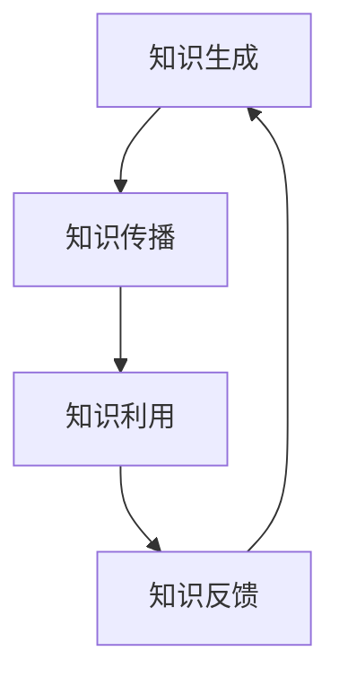

                 

# 《知识的系统动力学：反馈循环与平衡》

## 关键词
系统动力学，知识反馈循环，平衡态，非平衡态，实证研究，平衡管理

## 摘要
本文深入探讨了知识的系统动力学，从反馈循环与平衡的角度分析了知识系统的运行机制。首先，我们介绍了系统动力学的定义与重要性，随后探讨了知识反馈循环的基本原理、模型构建及其在教育和商业系统中的应用。接着，我们探讨了平衡态与非平衡态的概念、特征及其相互转化。文章还介绍了系统动力学模型的构建步骤及常见模型，并通过教育系统和商业系统的案例分析，展示了知识系统动力学在实际应用中的价值。最后，我们提出了知识系统动力学的平衡管理策略，并对未来研究进行了展望。

## 第1章 系统动力学的引论

### 1.1 系统动力学的定义与重要性

系统动力学（System Dynamics）是一种研究复杂系统动态行为的方法，它通过模拟系统内部的各种反馈机制和因果关系，来理解和预测系统的长期行为。系统动力学的核心在于揭示系统内部的结构和机制，从而更好地理解系统的复杂行为。

在信息技术领域，系统动力学的重要性日益凸显。随着信息技术的快速发展，复杂系统的规模和复杂性不断增加，传统的线性分析方法已难以应对这些复杂问题。系统动力学提供了一种全新的视角，通过模拟和预测系统的动态行为，帮助决策者更好地应对复杂系统的挑战。

### 1.2 系统动力学的基本概念

系统动力学的基本概念包括反馈循环、平衡态、非平衡态等。

**反馈循环**：反馈循环是系统动力学中最基本的概念之一，它描述了系统内部变量之间的因果关系和相互作用。根据反馈的性质，反馈循环可以分为正反馈和负反馈。

- **正反馈**：正反馈使得系统内部的某个变量增加时，导致其他变量也增加，从而加剧了系统的变化。
- **负反馈**：负反馈使得系统内部的某个变量增加时，导致其他变量减少，从而抑制了系统的变化。

**平衡态**：平衡态是系统在长时间运行过程中，内部变量稳定不变的状态。平衡态可以分为稳定平衡态和不稳定平衡态。

- **稳定平衡态**：稳定平衡态意味着当系统受到外部扰动后，系统能够恢复到原来的平衡状态。
- **不稳定平衡态**：不稳定平衡态意味着当系统受到外部扰动后，系统能够偏离原来的平衡状态。

**非平衡态**：非平衡态是系统在长时间运行过程中，内部变量不稳定的状态。非平衡态可以是暂时性的，也可以是持久性的。

### 1.3 系统动力学与复杂性科学

系统动力学是复杂性科学的一个重要分支。复杂性科学关注的是复杂系统的行为和性质，它旨在理解复杂系统中的非线性、不确定性和复杂性。

系统动力学与复杂性科学的关系可以从以下几个方面来理解：

- **非线性**：系统动力学强调系统内部变量之间的非线性关系，这是复杂性科学的核心特征之一。
- **动态行为**：系统动力学通过模拟复杂系统的动态行为，揭示系统的长期演化规律。
- **因果关系**：系统动力学关注系统内部变量之间的因果关系，这是复杂性科学研究的重点之一。

### 1.4 知识系统动力学的特征

知识系统动力学是系统动力学在知识领域的应用。与一般系统动力学相比，知识系统动力学具有以下特征：

- **知识反馈循环**：知识系统动力学强调知识反馈循环在知识系统中的作用，通过正反馈和负反馈机制，实现知识的积累和创新。
- **平衡态与非平衡态**：知识系统动力学关注知识系统在平衡态和非平衡态下的运行机制，探讨知识系统如何从非平衡态过渡到平衡态。
- **实证研究**：知识系统动力学强调通过实证研究来验证理论模型的正确性，从而指导实践。

## 第2章 知识反馈循环

### 2.1 反馈循环的基本原理

知识反馈循环是知识系统动力学中的核心概念之一。它描述了知识在系统内部传播、积累和创新的过程。反馈循环可以分为正反馈和负反馈。

#### 2.1.1 正反馈与负反馈

**正反馈**：正反馈是指系统内部的某个变量增加时，导致其他变量也增加，从而加剧了系统的变化。在知识系统中，正反馈通常表现为知识积累和创新的过程。

例如，在一个教育系统中，当学生掌握了更多的知识后，他们能够更高效地学习，从而获得更好的成绩。这种良好的成绩又会进一步激励学生努力学习，形成一个正反馈循环。

**负反馈**：负反馈是指系统内部的某个变量增加时，导致其他变量减少，从而抑制了系统的变化。在知识系统中，负反馈通常表现为知识的纠正和更新过程。

例如，在一个企业知识管理系统中，当员工分享的知识出现错误时，其他员工可以通过反馈机制指出错误，从而纠正和更新知识。这种负反馈机制有助于保持知识的准确性。

#### 2.1.2 反馈循环的动态行为

反馈循环的动态行为可以通过数学模型来描述。假设知识系统中有两个变量：知识量 \(X\) 和知识利用率 \(Y\)。

- \(X\) 表示知识系统的知识量，单位可以是知识点的数量。
- \(Y\) 表示知识系统的知识利用率，单位可以是知识点的使用频率。

根据反馈循环的定义，我们可以得到以下反馈循环的动态方程：

\[ \frac{dX}{dt} = f(X, Y) \]
\[ \frac{dY}{dt} = g(X, Y) \]

其中，\(f(X, Y)\) 和 \(g(X, Y)\) 分别表示知识量 \(X\) 和知识利用率 \(Y\) 的变化率。

#### 2.1.3 反馈循环在知识系统中的作用

反馈循环在知识系统中发挥着至关重要的作用。它不仅影响着知识的积累和创新，还影响着知识系统的稳定性和演化。

- **知识积累**：正反馈循环有助于知识的积累。在一个知识系统中，当知识量增加时，知识利用率也会增加，从而形成一个良性循环，促进知识的积累。
- **知识创新**：正反馈循环有助于知识的创新。在一个知识系统中，当知识量增加时，知识利用率也会增加，这会激发新的想法和创意，从而促进知识的创新。
- **知识更新**：负反馈循环有助于知识的更新。在一个知识系统中，当知识量或知识利用率出现错误时，负反馈机制会纠正和更新知识，从而保持知识的准确性。

### 2.2 知识反馈循环的模型构建

为了更好地理解和分析知识反馈循环，我们可以构建一个简单的知识反馈循环模型。该模型包含以下基本组件：

- **知识生成**：知识生成模块负责生成新的知识。
- **知识传播**：知识传播模块负责将知识传播到系统中的各个部分。
- **知识利用**：知识利用模块负责将知识应用到实际工作中。
- **知识反馈**：知识反馈模块负责收集和反馈知识的使用情况。

以下是知识反馈循环模型的基本框架：



#### 2.2.1 知识反馈循环的基本框架

在这个知识反馈循环模型中，知识生成模块负责生成新的知识。这些知识通过知识传播模块传播到系统中的各个部分。知识传播模块确保知识被广泛传播，以便更多的人能够了解和利用这些知识。

知识传播到各个部分后，知识利用模块负责将这些知识应用到实际工作中。通过知识利用，知识得以转化为实际的效益，从而推动系统的运行。

最后，知识反馈模块收集和反馈知识的使用情况。这些反馈信息被用于改进和更新知识，从而形成一个闭环，确保知识系统的持续优化。

#### 2.2.2 知识反馈循环的数学模型

为了更好地分析知识反馈循环，我们可以使用数学模型来描述其动态行为。假设知识系统中有三个变量：知识量 \(X\)、知识利用率 \(Y\) 和知识反馈率 \(Z\)。

- \(X\) 表示知识系统的知识量。
- \(Y\) 表示知识系统的知识利用率。
- \(Z\) 表示知识系统的知识反馈率。

根据反馈循环的定义，我们可以得到以下知识反馈循环的数学模型：

\[ \frac{dX}{dt} = f(X, Y) \]
\[ \frac{dY}{dt} = g(X, Y) \]
\[ \frac{dZ}{dt} = h(X, Y) \]

其中，\(f(X, Y)\)、\(g(X, Y)\) 和 \(h(X, Y)\) 分别表示知识量、知识利用率和知识反馈率的变化率。

### 2.3 知识反馈循环的案例分析

为了更好地理解知识反馈循环，我们可以通过以下两个案例来进行分析。

#### 2.3.1 教育系统中的知识反馈循环

在教育系统中，知识反馈循环发挥着重要作用。以下是一个简单的教育系统中的知识反馈循环案例：

- **知识生成**：教师通过授课、学术研究等活动生成新的知识。
- **知识传播**：教师通过授课将知识传播给学生，学生通过学习和实践将知识应用到实际工作中。
- **知识利用**：学生在实际工作中运用所学知识，提高自己的能力和技能。
- **知识反馈**：学生通过反馈机制向教师反馈知识的使用情况，教师根据反馈调整授课内容和方式。

在这个案例中，知识反馈循环有助于提高教育的质量和效率。教师根据学生的反馈调整授课内容，确保学生能够更好地掌握知识。同时，学生的反馈也有助于教师发现自己在教学中的不足，从而不断改进教学方法。

#### 2.3.2 商业系统中的知识反馈循环

在商业系统中，知识反馈循环同样具有重要意义。以下是一个简单的商业系统中的知识反馈循环案例：

- **知识生成**：企业通过研发、市场调研等活动生成新的知识。
- **知识传播**：企业通过内部培训和外部合作将知识传播到各个部门。
- **知识利用**：各个部门通过知识应用提高工作效率，实现业务目标。
- **知识反馈**：各个部门通过反馈机制向企业总部反馈知识的使用情况，企业总部根据反馈调整研发和培训计划。

在这个案例中，知识反馈循环有助于提高企业的创新能力和竞争力。企业通过反馈机制不断调整研发和培训计划，确保员工能够更好地掌握和应用知识，从而推动企业的持续发展。

## 第3章 平衡态与非平衡态

### 3.1 平衡态的概念与特征

在系统动力学中，平衡态是系统在长时间运行过程中，内部变量稳定不变的状态。平衡态可以分为稳定平衡态和不稳定平衡态。

#### 3.1.1 动力学系统中的平衡态

在动力学系统中，平衡态通常满足以下条件：

- **稳定性**：平衡态意味着系统在长时间运行过程中，内部变量不会发生大的波动，保持相对稳定。
- **不变性**：平衡态意味着系统内部变量在平衡状态下，其数值保持不变。

平衡态可以通过以下数学方程来描述：

\[ \frac{dx}{dt} = 0 \]
\[ \frac{dy}{dt} = 0 \]

其中，\(x\) 和 \(y\) 分别表示系统的两个内部变量。

#### 3.1.2 平衡态的数学描述

平衡态可以通过以下数学模型来描述：

\[ \frac{dx}{dt} = f(x, y) = 0 \]
\[ \frac{dy}{dt} = g(x, y) = 0 \]

其中，\(f(x, y)\) 和 \(g(x, y)\) 分别表示变量 \(x\) 和 \(y\) 的变化率。

#### 3.1.3 平衡态的稳定性分析

平衡态的稳定性可以通过以下方法进行分析：

- **线性稳定性分析**：通过求解系统线性化方程的稳定矩阵来判断平衡态的稳定性。
- **非线性稳定性分析**：通过求解系统的非线性方程来判断平衡态的稳定性。

### 3.2 非平衡态的概念与特征

非平衡态是系统在长时间运行过程中，内部变量不稳定的状态。非平衡态可以是暂时性的，也可以是持久性的。

#### 3.2.1 非平衡态动力学系统

非平衡态动力学系统具有以下特征：

- **非线性**：非平衡态动力学系统通常具有非线性特征，这意味着系统内部变量之间的因果关系不是线性的。
- **动态行为**：非平衡态动力学系统在长时间运行过程中，内部变量会发生变化，形成复杂的动态行为。

#### 3.2.2 非平衡态的数学描述

非平衡态可以通过以下数学模型来描述：

\[ \frac{dx}{dt} = f(x, y) \]
\[ \frac{dy}{dt} = g(x, y) \]

其中，\(f(x, y)\) 和 \(g(x, y)\) 分别表示变量 \(x\) 和 \(y\) 的变化率。

#### 3.2.3 非平衡态的稳定性分析

非平衡态的稳定性分析通常比较复杂，需要结合具体系统进行详细分析。以下是一些常见的分析方法：

- **相空间分析**：通过绘制系统的相空间图来判断系统的稳定性。
- **线性化分析**：通过求解系统线性化方程的稳定矩阵来判断非平衡态的稳定性。

### 3.3 平衡态与非平衡态的相互转化

在系统动力学中，平衡态与非平衡态之间存在相互转化的关系。以下是一些常见的相互转化方式：

- **相变**：系统从平衡态向非平衡态的转变称为相变。相变通常伴随着系统内部变量的突变。
- **波动**：系统在平衡态附近发生的波动称为波动。波动可以是暂时的，也可以是持续的。

平衡态与非平衡态的相互转化对于系统动力学的研究具有重要意义。通过分析平衡态与非平衡态的相互转化，可以更好地理解系统的复杂行为，从而为系统的优化和调控提供指导。

## 第4章 系统动力学模型构建

### 4.1 系统动力学模型的构建步骤

构建系统动力学模型是进行系统动力学研究的基础。以下是一个典型的系统动力学模型构建步骤：

#### 4.1.1 问题定义

在构建系统动力学模型之前，首先需要明确研究的问题。这包括确定系统的范围、目标和研究问题。

#### 4.1.2 建模假设

在构建模型时，需要对系统进行适当的假设，以简化问题的复杂性。这些假设包括变量之间的关系、初始条件等。

#### 4.1.3 系统结构分析

通过系统结构分析，可以确定系统中的关键变量和它们之间的关系。这一步骤通常使用流程图或框图来表示。

#### 4.1.4 动力学方程建立

基于系统结构分析，可以建立系统的动力学方程。这些方程描述了系统内部变量之间的因果关系。

#### 4.1.5 方程求解

在建立动力学方程后，需要求解这些方程，以获得系统的时间序列数据。

#### 4.1.6 模型验证

通过实际数据对模型进行验证，以确保模型的准确性和可靠性。

### 4.2 常见系统动力学模型

在系统动力学研究中，存在多种常见的模型。以下是一些典型的系统动力学模型：

#### 4.2.1 流程图模型

流程图模型是一种直观的表示方法，用于描述系统内部变量之间的因果关系。它通过节点和箭头来表示变量和关系。

#### 4.2.2 状态空间模型

状态空间模型是一种数学模型，用于描述系统内部变量的动态行为。它通过状态变量和输入输出变量来表示系统的状态和输入输出关系。

#### 4.2.3 多体系统模型

多体系统模型用于描述多个相互作用的系统。它通过描述各个系统之间的相互作用来分析整个系统的行为。

## 第5章 知识系统动力学案例分析

### 5.1 教育系统中的知识动力学

教育系统是一个典型的知识系统，它涉及知识的生成、传播、利用和反馈。以下是对教育系统中知识动力学的分析：

#### 5.1.1 教育系统的反馈循环分析

教育系统的反馈循环可以分为以下几个部分：

- **知识生成**：教师通过授课、科研等活动生成新的知识。
- **知识传播**：教师通过授课将知识传播给学生，学生通过自学和实践将知识应用到实际中。
- **知识利用**：学生在实际工作和生活中运用所学知识，提高自己的能力和素质。
- **知识反馈**：学生通过反馈机制向教师反馈知识的使用情况，教师根据反馈调整授课内容和方式。

#### 5.1.2 教育系统的平衡态与非平衡态

教育系统在平衡态下，教师和学生之间的知识传播和利用达到最佳状态，系统的整体运行效率较高。在非平衡态下，教师和学生之间的知识传播和利用可能存在不足，系统的运行效率较低。

#### 5.1.3 教育系统的动力学模型构建

为了分析教育系统的知识动力学，我们可以构建以下动力学模型：

\[ \frac{dX}{dt} = f(X, Y) \]
\[ \frac{dY}{dt} = g(X, Y) \]

其中，\(X\) 表示知识量，\(Y\) 表示知识利用率。\(f(X, Y)\) 和 \(g(X, Y)\) 分别表示知识量 \(X\) 和知识利用率 \(Y\) 的变化率。

### 5.2 商业系统中的知识动力学

商业系统中的知识动力学涉及企业内部的知识生成、传播、利用和反馈。以下是对商业系统中知识动力学的分析：

#### 5.2.1 商业系统的反馈循环分析

商业系统的反馈循环可以分为以下几个部分：

- **知识生成**：企业通过研发、市场调研等活动生成新的知识。
- **知识传播**：企业通过内部培训和外部合作将知识传播到各个部门。
- **知识利用**：各个部门通过知识应用提高工作效率，实现业务目标。
- **知识反馈**：各个部门通过反馈机制向企业总部反馈知识的使用情况，企业总部根据反馈调整研发和培训计划。

#### 5.2.2 商业系统的平衡态与非平衡态

商业系统在平衡态下，企业内部的知识传播和利用达到最佳状态，系统的整体运行效率较高。在非平衡态下，企业内部的知识传播和利用可能存在不足，系统的运行效率较低。

#### 5.2.3 商业系统的动力学模型构建

为了分析商业系统的知识动力学，我们可以构建以下动力学模型：

\[ \frac{dX}{dt} = f(X, Y) \]
\[ \frac{dY}{dt} = g(X, Y) \]

其中，\(X\) 表示知识量，\(Y\) 表示知识利用率。\(f(X, Y)\) 和 \(g(X, Y)\) 分别表示知识量 \(X\) 和知识利用率 \(Y\) 的变化率。

## 第6章 知识系统动力学的实证研究

### 6.1 实证研究的概念与方法

实证研究是系统动力学研究的重要环节，通过实际数据和案例，验证理论模型的正确性，并指导实践。以下是对实证研究的概念和方法的分析：

#### 6.1.1 实证研究的意义

实证研究在知识系统动力学研究中的意义主要体现在以下几个方面：

- **验证理论模型的准确性**：通过实证研究，可以验证理论模型在现实情况下的适用性，从而提高模型的可靠性和准确性。
- **指导实践**：实证研究可以为企业、教育机构等提供实际操作指南，帮助其优化知识管理。
- **发现新问题**：实证研究可以发现新的问题，为后续研究提供方向。

#### 6.1.2 实证研究的方法

实证研究的方法主要包括以下几种：

- **问卷调查**：通过问卷调查收集相关数据，了解系统内部各变量的关系和变化趋势。
- **案例分析**：通过对具体案例的深入分析，揭示知识系统动力学的运行机制和规律。
- **实验研究**：通过实验室模拟或实地实验，验证理论模型在实际中的应用效果。

#### 6.1.3 实证研究的步骤

实证研究的步骤主要包括以下几步：

- **确定研究问题**：明确研究目标和问题，为后续研究提供方向。
- **数据收集**：收集与问题相关的数据，包括问卷调查、案例分析、实验数据等。
- **数据整理**：对收集到的数据进行分析和整理，为后续分析提供基础。
- **模型构建**：基于收集到的数据，构建系统动力学模型，描述系统内部变量的关系。
- **模型验证**：通过实际数据对模型进行验证，确保模型的准确性和可靠性。
- **结果分析**：对模型的结果进行分析，总结系统的运行规律和问题，并提出改进建议。

### 6.2 知识系统动力学的实证案例

以下是对几个知识系统动力学实证案例的分析：

#### 6.2.1 案例一：科技创新系统的动力学分析

科技创新系统是一个典型的知识系统，涉及知识的生成、传播、利用和反馈。以下是对科技创新系统动力学分析的实证案例：

- **数据收集**：通过问卷调查和案例分析，收集科技创新系统中的知识量、知识利用率等数据。
- **模型构建**：基于收集到的数据，构建科技创新系统的动力学模型，描述知识量、知识利用率等变量之间的关系。
- **模型验证**：通过实际数据对模型进行验证，确保模型的准确性和可靠性。
- **结果分析**：分析模型结果，揭示科技创新系统的运行规律，为科技创新管理提供指导。

#### 6.2.2 案例二：知识管理系统的动力学分析

知识管理系统是企业内部知识管理的重要工具，涉及知识的生成、传播、利用和反馈。以下是对知识管理系统动力学分析的实证案例：

- **数据收集**：通过问卷调查和案例分析，收集知识管理系统中的知识量、知识利用率等数据。
- **模型构建**：基于收集到的数据，构建知识管理系统的动力学模型，描述知识量、知识利用率等变量之间的关系。
- **模型验证**：通过实际数据对模型进行验证，确保模型的准确性和可靠性。
- **结果分析**：分析模型结果，揭示知识管理系统的运行规律，为知识管理提供指导。

#### 6.2.3 案例三：企业知识共享机制的动力学分析

企业知识共享机制是企业内部知识传播和利用的重要途径，涉及知识的生成、传播、利用和反馈。以下是对企业知识共享机制动力学分析的实证案例：

- **数据收集**：通过问卷调查和案例分析，收集企业知识共享机制中的知识量、知识利用率等数据。
- **模型构建**：基于收集到的数据，构建企业知识共享机制的动力学模型，描述知识量、知识利用率等变量之间的关系。
- **模型验证**：通过实际数据对模型进行验证，确保模型的准确性和可靠性。
- **结果分析**：分析模型结果，揭示企业知识共享机制的运行规律，为知识共享管理提供指导。

## 第7章 知识系统动力学的平衡管理

### 7.1 平衡管理的概念与原则

平衡管理是指通过调整和优化系统内部变量之间的关系，使系统达到一种相对稳定的状态，从而实现系统的持续发展。在知识系统动力学中，平衡管理具有重要意义。

#### 7.1.1 平衡管理的定义

平衡管理是指通过分析系统的内部结构和变量之间的关系，调整和优化系统内部的反馈机制，使系统达到一种相对稳定的状态，从而实现系统的持续发展。

#### 7.1.2 平衡管理的原则

平衡管理遵循以下原则：

- **系统性**：平衡管理应从系统的整体角度出发，考虑各个部分之间的关系和相互作用。
- **动态性**：平衡管理应考虑系统的动态变化，根据实际情况进行调整和优化。
- **适应性**：平衡管理应适应系统的变化，及时调整和优化系统内部的反馈机制。
- **可持续性**：平衡管理应实现系统的可持续发展，确保系统在长期运行过程中保持稳定。

### 7.2 知识系统动力学的平衡管理策略

知识系统动力学的平衡管理策略主要包括以下几个方面：

#### 7.2.1 反馈循环的优化策略

反馈循环是知识系统动力学中的核心机制，通过优化反馈循环，可以实现知识的积累和创新。以下是一些优化反馈循环的策略：

- **加强知识生成**：通过增加知识生成的频率和质量，提高系统的知识量。
- **提高知识传播效率**：通过优化知识传播渠道和方式，提高知识的传播速度和范围。
- **增强知识利用率**：通过提高员工的知识素质和能力，提高知识的利用率。
- **完善知识反馈机制**：通过建立有效的知识反馈机制，确保知识的正确性和有效性。

#### 7.2.2 平衡态的维持与调整

平衡态是知识系统动力学中的理想状态，通过维持和调整平衡态，可以实现系统的稳定运行。以下是一些维持和调整平衡态的策略：

- **监测系统状态**：通过监测系统状态，及时发现系统偏离平衡态的迹象，采取相应的调整措施。
- **优化系统结构**：通过优化系统结构，提高系统的稳定性和适应性。
- **调整反馈强度**：通过调整反馈强度，使系统达到一种新的平衡态。
- **适应环境变化**：通过适应环境变化，调整系统的平衡态，确保系统的长期稳定。

#### 7.2.3 非平衡态的管理策略

非平衡态是知识系统动力学中的常态，通过管理非平衡态，可以实现系统的持续发展和创新。以下是一些管理非平衡态的策略：

- **激发创新活力**：通过激发创新活力，推动系统从非平衡态向平衡态过渡。
- **建立预警机制**：通过建立预警机制，及时发现系统中的潜在问题，采取预防措施。
- **优化资源配置**：通过优化资源配置，提高系统的适应性和灵活性。
- **强化协同合作**：通过强化协同合作，提高系统的协同效应，推动系统从非平衡态向平衡态过渡。

### 7.3 平衡管理的实际应用

平衡管理在知识系统动力学中具有广泛的应用。以下是对平衡管理在实际应用中的案例分析：

#### 7.3.1 教育平衡管理案例分析

在教育系统中，平衡管理可以应用于以下几个方面：

- **教学资源的分配**：通过平衡管理，优化教学资源的分配，提高教学效果。
- **学生学习成绩的管理**：通过平衡管理，优化学生学习成绩的管理，提高学生的学习兴趣和动力。
- **教师队伍建设**：通过平衡管理，优化教师队伍的建设，提高教师的教学能力和水平。

#### 7.3.2 商业平衡管理案例分析

在商业系统中，平衡管理可以应用于以下几个方面：

- **产品研发**：通过平衡管理，优化产品研发过程，提高产品的创新能力和市场竞争力。
- **人力资源管理**：通过平衡管理，优化人力资源管理，提高员工的积极性和工作效率。
- **企业文化建设**：通过平衡管理，优化企业文化，提高企业的凝聚力和竞争力。

## 第8章 知识系统动力学的未来展望

### 8.1 知识系统动力学的发展趋势

随着知识经济的不断发展和信息技术的飞速进步，知识系统动力学在未来的发展前景广阔。以下是一些主要的发展趋势：

#### 8.1.1 新技术对知识系统动力学的影响

- **人工智能**：人工智能技术在知识系统动力学中的应用将日益广泛，通过机器学习和数据挖掘等技术，可以更精确地模拟和分析知识系统的动态行为。
- **大数据**：大数据技术的应用将使知识系统动力学的研究更加深入和精确，通过大数据分析，可以揭示知识系统中的复杂关系和规律。
- **区块链**：区块链技术的应用将改变知识系统的运行机制，通过去中心化和不可篡改的特性，提高知识系统的透明度和可靠性。

#### 8.1.2 知识系统动力学在多领域中的应用前景

知识系统动力学在多个领域具有广泛的应用前景：

- **教育**：知识系统动力学可以应用于教育系统的优化和改进，提高教学质量和教育效率。
- **企业**：知识系统动力学可以应用于企业知识管理和创新，提高企业的核心竞争力。
- **社会**：知识系统动力学可以应用于社会管理和社会治理，提高社会的运行效率和治理能力。

#### 8.1.3 知识系统动力学研究的挑战与机遇

知识系统动力学研究面临着一系列的挑战和机遇：

- **复杂性**：随着知识系统规模的不断扩大和复杂性的增加，研究复杂系统的动态行为成为一大挑战。
- **数据质量**：数据质量对知识系统动力学的研究至关重要，提高数据质量和可靠性是研究的重要方向。
- **跨学科整合**：知识系统动力学涉及多个学科，跨学科整合将成为研究的重要趋势，通过整合不同学科的理论和方法，可以更好地揭示知识系统的运行机制。

### 8.2 知识系统动力学的创新与应用

知识系统动力学的创新与应用是未来研究的重要方向。以下是一些创新与应用的领域：

#### 8.2.1 知识系统动力学的创新方法

- **多尺度建模**：通过多尺度建模，可以更好地描述知识系统的复杂行为，揭示不同尺度下的运行规律。
- **多agent仿真**：通过多agent仿真，可以模拟知识系统中各个主体的行为和相互作用，分析系统的动态行为。
- **混合建模**：通过混合建模，结合定性分析和定量分析，可以更全面地描述知识系统的动态行为。

#### 8.2.2 知识系统动力学的应用领域

- **智能教育**：知识系统动力学可以应用于智能教育系统，优化教学过程，提高教育质量。
- **智能企业**：知识系统动力学可以应用于智能企业系统，优化知识管理，提高企业竞争力。
- **智能社会治理**：知识系统动力学可以应用于智能社会治理系统，优化社会治理，提高社会治理能力。

#### 8.2.3 知识系统动力学的跨学科整合

知识系统动力学的跨学科整合是未来研究的重要方向。以下是一些跨学科整合的领域：

- **计算机科学**：通过计算机科学的方法和技术，可以更好地模拟和分析知识系统的动态行为。
- **经济学**：通过经济学的理论和方法，可以更好地揭示知识系统的运行机制和规律。
- **社会学**：通过社会学的理论和方法，可以更好地理解知识系统在社会中的作用和影响。

### 附录

#### 附录 A 系统动力学软件工具介绍

系统动力学软件工具是进行系统动力学研究的重要工具。以下是一些常用的系统动力学软件工具：

- **Vensim**：Vensim 是一款功能强大的系统动力学建模软件，适用于各种规模的系统动力学建模和分析。
- **STELLA**：STELLA 是一款直观易用的系统动力学建模软件，适用于教育、企业和社会等领域的系统动力学研究。
- **AnyLogic**：AnyLogic 是一款功能强大的多领域仿真软件，适用于复杂系统动力学建模和分析。
- **Matlab/Simulink**：Matlab/Simulink 是一款广泛应用于系统动力学建模和仿真的软件工具，具有丰富的数学函数和工具箱。

#### 附录 B 系统动力学模型示例

以下是一个简单的系统动力学模型示例，用于描述一个教育系统的知识动力学。

```latex
\begin{equation}
\frac{dX}{dt} = f(X, Y)
\end{equation}

\begin{equation}
\frac{dY}{dt} = g(X, Y)
\end{equation}

其中，\(X\) 表示知识量，\(Y\) 表示知识利用率。\(f(X, Y)\) 和 \(g(X, Y)\) 分别表示知识量 \(X\) 和知识利用率 \(Y\) 的变化率。
```

#### 附录 C 系统动力学参考文献

- Forrester, J. W. (1961). Industrial Dynamics. MIT Press.
- Sterman, J. D. (2000). Business Dynamics: Systems Thinking and Modeling for a Complex World. McGraw-Hill.
- Beniger, J. R. (1986). The Control Revolution: Technological and Economic Origins of the Information Society. Cambridge University Press.
- Bar-Yam, Y. (2007). Dynamics of Complex Systems. Princeton University Press.
- Strogatz, S. H. (2003). Nonlinear Dynamics and Chaos: With Applications to Physics, Biology, Chemistry, and Engineering. Westview Press.

