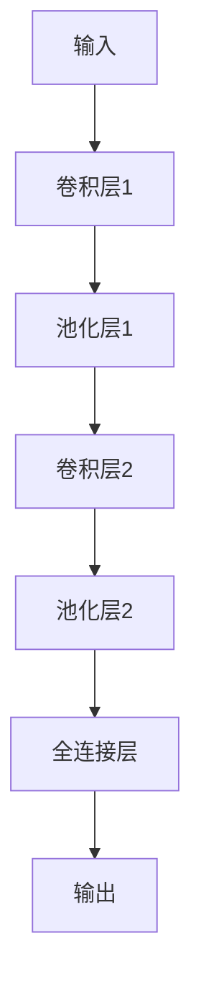
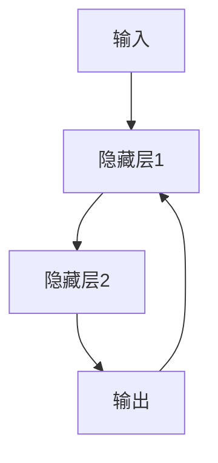
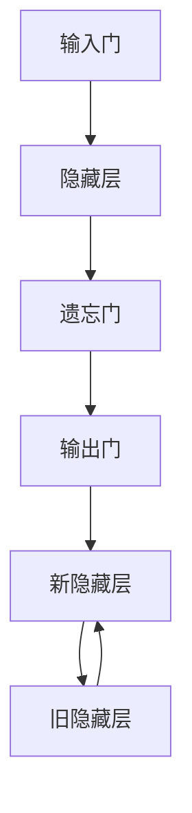
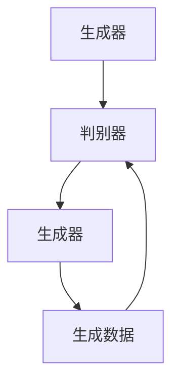
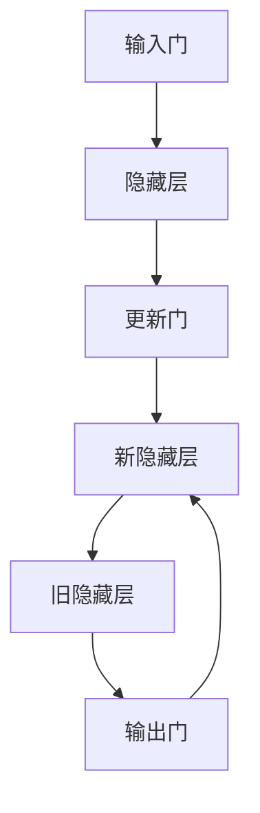
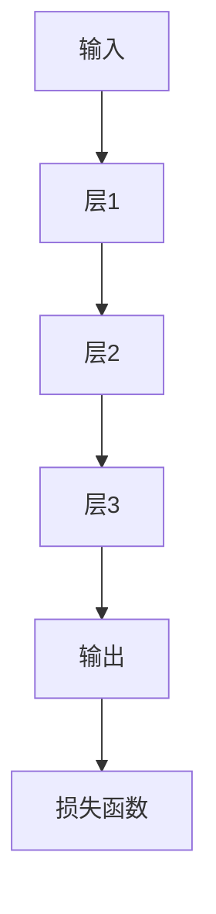
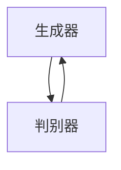

                 

### 文章标题：神经网络模型的架构设计模式

### 关键词：神经网络，架构设计，模型优化，应用实战

#### 摘要：
本文深入探讨了神经网络模型的架构设计模式，从基础知识到核心算法原理，再到架构设计模式和应用实战，全面解析了神经网络模型在计算机视觉、自然语言处理以及强化学习中的应用。通过详细的流程图、伪代码、数学模型和实际案例，本文旨在为读者提供一份全面而实用的技术指南。

----------------------------------------------------------------

## 第1章：神经网络模型概述

### 1.1 神经网络模型的基础知识

#### 1.1.1 神经网络的概念

神经网络是一种模仿人脑结构和工作方式的计算模型，由大量的神经元通过复杂的连接方式形成。神经网络的核心思想是通过学习输入和输出数据之间的关系，实现对未知数据的预测和分类。

#### 1.1.2 神经网络的组成元素

神经网络主要由以下几部分组成：

- **神经元**：神经网络的基本计算单元，负责接收输入、计算加权求和并输出。
- **输入层**：接收外部输入数据。
- **隐藏层**：用于进行复杂的非线性变换。
- **输出层**：产生最终输出结果。
- **权重和偏置**：连接各个神经元的参数，用于调整网络对输入数据的响应。

#### 1.1.3 神经网络的发展历程

神经网络的发展历程可以分为以下几个阶段：

- **人工神经网络**：最初的神经网络模型，主要包括感知机、BP网络等。
- **深度学习**：2006年，Hinton等人提出了深度信念网络（DBN），标志着深度学习时代的到来。
- **卷积神经网络（CNN）**：在图像处理领域取得了巨大成功，代表性的模型有LeNet、AlexNet等。
- **循环神经网络（RNN）**：在序列数据处理领域表现出色，代表性的模型有LSTM、GRU等。
- **生成对抗网络（GAN）**：一种能够生成高质量数据的模型，代表性模型有DCGAN、WGAN等。

### 1.2 神经网络在计算机视觉中的应用

#### 1.2.1 卷积神经网络（CNN）

卷积神经网络是一种专门用于处理图像数据的神经网络模型，其主要特点是通过卷积层对图像进行特征提取，并通过池化层降低数据的维度。

**CNN的基本结构**：

- **卷积层**：通过卷积操作提取图像的特征。
- **池化层**：对卷积层输出的特征进行降维处理，减少计算量。
- **全连接层**：对池化层输出的特征进行分类。

**CNN在图像识别中的应用**：

- **图像分类**：将图像分类到预定义的类别中，如ImageNet挑战。
- **目标检测**：定位图像中的目标并分类，如SSD、YOLO等。
- **图像分割**：将图像划分为不同的区域，如FCN、Mask R-CNN等。

#### 1.2.2 深层神经网络架构

深层神经网络是由多个隐藏层组成的神经网络，能够处理更复杂的特征表示。

- **多层感知机（MLP）**：最简单的深层神经网络结构，由多个全连接层组成。
- **卷积神经网络（CNN）**：通过卷积层和池化层实现特征提取，适用于图像处理。
- **循环神经网络（RNN）**：通过循环结构处理序列数据，适用于自然语言处理。

#### 1.2.3 计算机视觉中的实际应用案例

- **图像分类**：使用CNN对图像进行分类，如ImageNet挑战。
- **目标检测**：使用R-CNN、SSD、YOLO等模型对图像中的目标进行检测。
- **图像分割**：使用FCN、U-Net、Mask R-CNN等模型对图像进行区域划分。

### 1.3 神经网络在自然语言处理中的应用

#### 1.3.1 循环神经网络（RNN）

循环神经网络是一种能够处理序列数据的神经网络模型，其核心思想是通过循环结构将信息传递到下一个时间步。

- **RNN的基本结构**：由输入层、隐藏层和输出层组成，隐藏层中的信息会传递到下一个时间步。
- **RNN在序列数据处理中的应用**：包括语言模型、序列分类、语音识别等。

#### 1.3.2 长短时记忆（LSTM）

长短时记忆网络是一种改进的RNN结构，通过引入门控机制解决长序列依赖问题。

- **LSTM的数学模型**：包括输入门、遗忘门和输出门，用于控制信息的流动。
- **LSTM在自然语言处理中的应用**：包括文本分类、机器翻译、语音识别等。

#### 1.3.3 语言模型与序列标注

- **语言模型**：用于预测文本序列的概率，常用于搜索引擎和语音识别。
- **序列标注**：对文本序列进行分类标注，如词性标注、命名实体识别等。

### 1.4 神经网络在强化学习中的应用

#### 1.4.1 神经网络与Q-learning

Q-learning是一种基于值函数的强化学习算法，神经网络用于近似值函数。

- **神经网络与Q-learning的结合**：使用神经网络近似Q值函数，提高Q-learning的收敛速度。
- **神经Q网络（Neural Q-Network，DQN）**：使用神经网络表示Q值函数，解决连续动作空间的问题。

#### 1.4.2 神经网络与策略梯度算法

策略梯度算法是一种基于策略的强化学习算法，神经网络用于表示策略。

- **策略梯度算法**：使用神经网络表示策略，通过梯度上升方法优化策略。
- **Actor-Critic算法**：结合策略优化和价值估计，提高算法的性能。

## 第2章：神经网络核心算法原理

### 2.1 神经元与激活函数

#### 2.1.1 神经元的数学模型

神经元是一个接收输入并产生输出的计算单元，其数学模型可以表示为：

\[ z = \sum_{i=1}^{n} w_i x_i + b \]

其中，\( w_i \) 表示权重，\( x_i \) 表示输入，\( b \) 表示偏置，\( z \) 表示加权和。

#### 2.1.2 激活函数的作用与分类

激活函数用于引入非线性因素，使神经网络具有分类或回归能力。

- **线性激活函数**：如恒等函数\( f(x) = x \)，无法引入非线性。
- **非线性激活函数**：如ReLU函数\( f(x) = max(0, x) \)，Sigmoid函数\( f(x) = \frac{1}{1 + e^{-x}} \)，Tanh函数\( f(x) = \frac{e^x - e^{-x}}{e^x + e^{-x}} \)等。

### 2.2 反向传播算法

#### 2.2.1 反向传播算法的原理

反向传播算法是一种用于训练神经网络的优化算法，其核心思想是利用梯度下降法优化网络参数。

- **前向传播**：从输入层开始，逐层计算输出，直到输出层。
- **计算损失函数**：利用输出层的结果计算损失函数，如均方误差（MSE）。
- **后向传播**：从输出层开始，逐层计算梯度，并反向传播到输入层。

#### 2.2.2 反向传播算法的实现步骤

1. **前向传播**：
   - 输入 \( x \) 通过网络产生输出 \( y \)。
   - 计算损失函数 \( L \)。

2. **计算梯度**：
   - 计算输出层到隐藏层的梯度 \( \delta \)。
   - 计算隐藏层到输入层的梯度 \( \delta \)。

3. **更新参数**：
   - 更新权重 \( w \) 和偏置 \( b \)。

#### 2.2.3 反向传播算法的优化

- **梯度下降法**：最简单的优化方法，通过梯度方向更新参数。
- **动量法**：引入动量项，加速收敛。
- **学习率调整**：根据训练过程调整学习率，避免过拟合。

## 第3章：神经网络架构设计模式

### 3.1 卷积神经网络（CNN）

#### 3.1.1 CNN的基本结构

卷积神经网络由卷积层、池化层和全连接层组成，其基本结构如图所示。



#### 3.1.2 CNN在图像识别中的应用

卷积神经网络在图像识别中具有广泛的应用，如图像分类、目标检测和图像分割。

- **图像分类**：将图像分类到预定义的类别中，如ImageNet挑战。
- **目标检测**：定位图像中的目标并分类，如SSD、YOLO等。
- **图像分割**：将图像划分为不同的区域，如FCN、Mask R-CNN等。

#### 3.1.3 CNN的改进与变种

卷积神经网络在图像识别领域不断演变，出现了一些改进和变种。

- **残差网络（ResNet）**：引入残差块，解决深层网络训练困难问题。
- **Inception网络**：通过多尺度卷积层和池化层组合，提高特征提取能力。
- **MobileNet**：通过深度可分离卷积，降低计算量和参数数量。

### 3.2 循环神经网络（RNN）

#### 3.2.1 RNN的基本结构

循环神经网络是一种能够处理序列数据的神经网络模型，其基本结构如图所示。



#### 3.2.2 RNN在序列数据处理中的应用

循环神经网络在序列数据处理中具有广泛的应用，如语言模型、序列分类和语音识别。

- **语言模型**：用于预测文本序列的概率，如搜索引擎和语音识别。
- **序列分类**：对序列数据进行分类，如文本分类和语音分类。
- **语音识别**：将语音信号转换为文本序列。

#### 3.2.3 RNN的改进与变种

循环神经网络在处理长序列依赖问题时存在困难，因此出现了一些改进和变种。

- **长短时记忆网络（LSTM）**：通过门控机制，解决长序列依赖问题。
- **门控循环单元（GRU）**：简化LSTM结构，提高计算效率。
- **双向RNN**：同时处理正向和反向序列，提高序列建模能力。

### 3.3 长短时记忆网络（LSTM）

#### 3.3.1 LSTM的数学模型

长短时记忆网络是一种改进的循环神经网络，其数学模型如图所示。



#### 3.3.2 LSTM在自然语言处理中的应用

长短时记忆网络在自然语言处理中具有广泛的应用，如文本分类、机器翻译和语音识别。

- **文本分类**：对文本进行分类，如情感分析和社会舆情分析。
- **机器翻译**：将一种语言的文本翻译成另一种语言。
- **语音识别**：将语音信号转换为文本序列。

#### 3.3.3 LSTM的变体

长短时记忆网络存在一些变体，以提高计算效率和性能。

- **双向LSTM**：同时处理正向和反向序列，提高序列建模能力。
- **LSTMcell**：简化LSTM结构，提高计算效率。
- **LSTMLayer**：用于实现LSTM的层。

### 3.4 生成对抗网络（GAN）

#### 3.4.1 GAN的基本结构

生成对抗网络是一种由生成器和判别器组成的对抗性神经网络模型。



#### 3.4.2 GAN在图像生成中的应用

生成对抗网络在图像生成中具有广泛的应用，如图像修复、图像合成和超分辨率。

- **图像修复**：修复图像中的损坏区域。
- **图像合成**：生成全新的图像，如图像到图像翻译。
- **超分辨率**：提高图像的分辨率。

#### 3.4.3 GAN的变体与改进

生成对抗网络存在一些变体和改进，以提高生成质量和训练稳定性。

- **条件GAN（cGAN）**：引入条件信息，提高生成质量。
- **生成式模型（如StyleGAN）**：通过多层感知器和反卷积层，生成高质量图像。

## 第4章：神经网络模型优化技巧

### 4.1 梯度下降优化算法

#### 4.1.1 梯度下降算法的原理

梯度下降算法是一种用于优化神经网络参数的优化算法，其核心思想是沿着损失函数的梯度方向更新参数，以降低损失函数的值。

- **前向传播**：计算损失函数的梯度。
- **后向传播**：计算损失函数的梯度。
- **参数更新**：沿着梯度的反方向更新参数。

#### 4.1.2 梯度下降算法的改进

梯度下降算法存在一些改进，以提高收敛速度和稳定性。

- **动量法**：引入动量项，加速收敛。
- **学习率调整**：根据训练过程调整学习率，避免过拟合。
- **权重初始化**：选择合适的权重初始化方法，避免梯度消失和梯度爆炸。

#### 4.1.3 梯度下降算法的应用

梯度下降算法在神经网络训练中具有广泛的应用，如训练多层感知机、卷积神经网络和循环神经网络等。

- **多层感知机**：通过梯度下降算法训练多层感知机，实现分类和回归任务。
- **卷积神经网络**：通过梯度下降算法训练卷积神经网络，实现图像分类、目标检测和图像分割等任务。
- **循环神经网络**：通过梯度下降算法训练循环神经网络，实现文本分类、序列分类和语音识别等任务。

### 4.2 动量法

#### 4.2.1 动量法的原理

动量法是一种用于优化神经网络参数的优化算法，其核心思想是引入动量项，加速收敛。

- **动量项**：用于记录前一次更新的方向和大小，公式为 \( v_t = \beta v_{t-1} + (1-\beta) \nabla J(\theta) \)。
- **参数更新**：利用动量项更新参数，公式为 \( \theta_t = \theta_{t-1} - \alpha v_t \)。

#### 4.2.2 动量法的实现步骤

1. **初始化动量**：设置动量参数 \( \beta \)，通常取值范围为0.9~0.99。
2. **计算梯度**：计算损失函数的梯度 \( \nabla J(\theta) \)。
3. **更新动量**：利用公式 \( v_t = \beta v_{t-1} + (1-\beta) \nabla J(\theta) \) 更新动量。
4. **参数更新**：利用公式 \( \theta_t = \theta_{t-1} - \alpha v_t \) 更新参数。

#### 4.2.3 动量法对神经网络性能的提升

动量法可以提高神经网络的训练性能，主要体现在以下几个方面：

- **加速收敛**：动量法引入了前一次更新的方向和大小，可以加快收敛速度。
- **避免振荡**：动量法可以减少参数更新的振荡，提高训练稳定性。

### 4.3 学习率调整策略

#### 4.3.1 学习率的设定原则

学习率是梯度下降算法中一个重要的参数，其设定原则如下：

- **初始学习率**：设置较大的学习率，以便快速下降到梯度较小的区域。
- **递减学习率**：随着训练过程的进行，逐渐减小学习率，避免过拟合。

#### 4.3.2 学习率调整方法

学习率调整方法主要包括以下几种：

- **固定学习率**：在整个训练过程中保持学习率不变。
- **学习率衰减**：根据训练进度逐渐减小学习率。
- **学习率预热**：在训练初期设置较大的学习率，逐渐减小学习率。

#### 4.3.3 学习率对神经网络性能的影响

学习率对神经网络性能具有重要影响，主要体现在以下几个方面：

- **学习率过大**：可能导致梯度消失或梯度爆炸，影响训练效果。
- **学习率过小**：可能导致收敛缓慢，甚至无法收敛。

## 第5章：神经网络模型在计算机视觉中的应用

### 5.1 图像分类实战

#### 5.1.1 数据预处理

数据预处理是图像分类任务中至关重要的一步，其主要包括以下步骤：

1. **数据收集与清洗**：收集并清洗图像数据，去除噪声和异常值。
2. **数据归一化**：将图像数据缩放到相同的范围，如0~1。
3. **数据增强**：通过旋转、翻转、缩放等操作增加训练样本的多样性。

#### 5.1.2 模型选择

在图像分类任务中，可以选择以下几种模型：

1. **卷积神经网络（CNN）**：通过卷积层和池化层提取图像特征，适用于图像分类任务。
2. **残差网络（ResNet）**：通过引入残差块，解决深层网络训练困难问题，具有较好的性能。
3. **Inception网络**：通过多尺度卷积层和池化层组合，提高特征提取能力。

#### 5.1.3 模型训练与评估

1. **训练过程**：
   - 初始化模型参数。
   - 进行前向传播，计算输出和损失函数。
   - 计算梯度并更新模型参数。
   - 记录训练过程中的损失函数和准确率。

2. **模型评估**：
   - 使用验证集评估模型性能。
   - 计算模型的准确率、召回率和F1值等指标。

3. **实际应用案例分析**：
   - 使用CNN对图像进行分类，实现对象识别任务。
   - 使用ResNet实现图像分类，解决深层网络训练问题。
   - 使用Inception网络实现图像分类，提高特征提取能力。

### 5.2 目标检测实战

#### 5.2.1 数据预处理

目标检测任务中的数据预处理主要包括以下步骤：

1. **数据收集与清洗**：收集并清洗图像数据，去除噪声和异常值。
2. **数据增强**：通过旋转、翻转、缩放等操作增加训练样本的多样性。
3. **标注数据**：对图像中的目标进行标注，包括目标的类别和位置。

#### 5.2.2 模型选择

在目标检测任务中，可以选择以下几种模型：

1. **R-CNN**：通过区域提议方法提取候选区域，再进行分类和回归。
2. **Fast R-CNN**：改进R-CNN，提高处理速度。
3. **Faster R-CNN**：引入区域提议网络（RPN），进一步加速检测过程。
4. **SSD**：通过多尺度卷积层和池化层提取特征，实现多尺度目标检测。
5. **YOLO**：将目标检测任务转化为单步检测，实现实时目标检测。

#### 5.2.3 模型训练与评估

1. **训练过程**：
   - 初始化模型参数。
   - 进行前向传播，计算输出和损失函数。
   - 计算梯度并更新模型参数。
   - 记录训练过程中的损失函数和准确率。

2. **模型评估**：
   - 使用验证集评估模型性能。
   - 计算模型的准确率、召回率和F1值等指标。

3. **实际应用案例分析**：
   - 使用R-CNN实现目标检测，解决目标定位和分类问题。
   - 使用Faster R-CNN实现实时目标检测，提高检测速度。
   - 使用SSD实现多尺度目标检测，提高检测精度。
   - 使用YOLO实现实时目标检测，实现大规模目标检测任务。

## 第6章：神经网络模型在自然语言处理中的应用

### 6.1 语言模型实战

#### 6.1.1 数据预处理

语言模型的数据预处理主要包括以下步骤：

1. **语料库的选择与预处理**：选择合适的语料库，并进行清洗和预处理。
2. **词向量的表示**：将文本转换为词向量，常用方法包括Word2Vec、GloVe等。

#### 6.1.2 模型选择

在语言模型任务中，可以选择以下几种模型：

1. **循环神经网络（RNN）**：通过循环结构处理序列数据，适用于语言模型任务。
2. **长短时记忆网络（LSTM）**：通过门控机制，解决长序列依赖问题，适用于复杂语言模型。
3. **门控循环单元（GRU）**：简化LSTM结构，提高计算效率，适用于实时语言模型。

#### 6.1.3 模型训练与评估

1. **训练过程**：
   - 初始化模型参数。
   - 进行前向传播，计算输出和损失函数。
   - 计算梯度并更新模型参数。
   - 记录训练过程中的损失函数和准确率。

2. **模型评估**：
   - 使用验证集评估模型性能。
   - 计算模型的准确率、召回率和F1值等指标。

3. **实际应用案例分析**：
   - 使用RNN实现语言模型，用于文本生成和文本分类。
   - 使用LSTM实现复杂语言模型，用于机器翻译和语音识别。
   - 使用GRU实现实时语言模型，用于聊天机器人和语音助手。

### 6.2 机器翻译实战

#### 6.2.1 数据预处理

机器翻译的数据预处理主要包括以下步骤：

1. **双语语料库的选择与预处理**：选择合适的双语语料库，并进行清洗和预处理。
2. **词向量的表示**：将文本转换为词向量，常用方法包括Word2Vec、GloVe等。

#### 6.2.2 模型选择

在机器翻译任务中，可以选择以下几种模型：

1. **神经网络编码器-解码器（Encoder-Decoder）**：通过编码器处理输入序列，解码器生成输出序列，适用于机器翻译任务。
2. **序列到序列模型（Seq2Seq）**：基于神经网络编码器-解码器模型，通过序列处理实现机器翻译。
3. **转换器架构（Transformer）**：基于自注意力机制，实现高效的序列处理，适用于机器翻译和其他自然语言处理任务。

#### 6.2.3 模型训练与评估

1. **训练过程**：
   - 初始化模型参数。
   - 进行前向传播，计算输出和损失函数。
   - 计算梯度并更新模型参数。
   - 记录训练过程中的损失函数和准确率。

2. **模型评估**：
   - 使用验证集评估模型性能。
   - 计算模型的准确率、召回率和F1值等指标。

3. **实际应用案例分析**：
   - 使用神经网络编码器-解码器实现机器翻译，提高翻译质量。
   - 使用序列到序列模型实现机器翻译，提高翻译速度。
   - 使用转换器架构实现机器翻译，实现高效的序列处理。

## 第7章：神经网络模型在强化学习中的应用

### 7.1 Q-learning算法实战

#### 7.1.1 数据预处理

Q-learning算法的数据预处理主要包括以下步骤：

1. **环境设置**：定义环境状态和动作空间。
2. **状态和动作的定义**：将环境的状态和动作进行编码。

#### 7.1.2 模型选择

在Q-learning算法中，可以选择以下几种模型：

1. **Q-learning算法**：基于值函数的强化学习算法，通过迭代更新Q值。
2. **Deep Q-Network（DQN）**：使用神经网络近似Q值函数，解决连续动作空间的问题。

#### 7.1.3 模型训练与评估

1. **训练过程**：
   - 初始化模型参数。
   - 进行环境交互，更新Q值。
   - 记录训练过程中的奖励和Q值变化。

2. **模型评估**：
   - 使用测试集评估模型性能。
   - 计算模型的平均奖励和稳定度。

3. **实际应用案例分析**：
   - 使用Q-learning算法实现简单游戏的控制，如Flappy Bird。
   - 使用DQN算法实现复杂游戏的控制，如Atari游戏。

### 7.2 策略梯度算法实战

#### 7.2.1 数据预处理

策略梯度算法的数据预处理主要包括以下步骤：

1. **环境设置**：定义环境状态和动作空间。
2. **状态和动作的定义**：将环境的状态和动作进行编码。

#### 7.2.2 模型选择

在策略梯度算法中，可以选择以下几种模型：

1. **Policy Gradient算法**：基于策略优化的强化学习算法，通过梯度上升方法优化策略。
2. **Actor-Critic算法**：结合策略优化和价值估计，提高算法的性能。

#### 7.2.3 模型训练与评估

1. **训练过程**：
   - 初始化模型参数。
   - 进行环境交互，更新策略和价值估计。
   - 记录训练过程中的奖励和策略变化。

2. **模型评估**：
   - 使用测试集评估模型性能。
   - 计算模型的平均奖励和稳定度。

3. **实际应用案例分析**：
   - 使用Policy Gradient算法实现简单游戏的控制，如CartPole。
   - 使用Actor-Critic算法实现复杂游戏的控制，如Atari游戏。

## 附录：神经网络模型开发工具与资源

### 附录A：主流神经网络框架

1. **TensorFlow**：由Google开发的开源神经网络框架，支持Python和C++等语言。
2. **PyTorch**：由Facebook开发的开源神经网络框架，支持Python和CUDA等语言。
3. **Keras**：基于TensorFlow和Theano的开源神经网络框架，提供简洁的API。

### 附录B：神经网络模型开源代码

1. **卷积神经网络（CNN）开源代码示例**：提供图像分类和目标检测的示例代码。
2. **循环神经网络（RNN）开源代码示例**：提供文本分类和语音识别的示例代码。
3. **长短时记忆网络（LSTM）开源代码示例**：提供机器翻译和文本生成的示例代码。
4. **生成对抗网络（GAN）开源代码示例**：提供图像生成和超分辨率的示例代码。

### 附录C：神经网络模型学习资源

1. **网络课程推荐**：推荐一些优质的神经网络和深度学习在线课程。
2. **论文阅读推荐**：推荐一些经典的神经网络和深度学习论文。
3. **书籍推荐**：推荐一些优秀的神经网络和深度学习书籍。

## 作者

作者：AI天才研究院/AI Genius Institute & 禅与计算机程序设计艺术 /Zen And The Art of Computer Programming

---

**第1章：神经网络模型概述**

#### 1.1 神经网络模型的基础知识

**1.1.1 神经网络的概念**

神经网络（Neural Networks）是一种由大量神经元（Neurons）互联而成的计算模型，这些神经元模拟了人脑神经元的工作方式。神经网络通过学习输入和输出数据之间的映射关系，来执行各种任务，如分类、回归、模式识别等。

神经网络的概念最早可以追溯到1943年，由McCulloch和Pitts提出，他们提出了一种简单的数学模型来模拟神经元的工作。后来，随着计算机技术的发展，神经网络逐渐成为一种重要的机器学习工具。

**1.1.2 神经网络的组成元素**

神经网络主要由以下几个部分组成：

- **神经元（Neurons）**：是神经网络的基本计算单元，每个神经元接收多个输入，通过加权求和后加上偏置，通过激活函数产生输出。
- **输入层（Input Layer）**：接收外部输入数据，传递给下一层的神经元。
- **隐藏层（Hidden Layers）**：对输入数据进行加工和变换，可以有一个或多个隐藏层。
- **输出层（Output Layer）**：产生最终的输出结果，用于分类、预测等任务。
- **权重（Weights）**：连接各个神经元的参数，用于调整网络对输入数据的响应。
- **偏置（Bias）**：每个神经元的偏置项，用于调整神经元的输出。

**1.1.3 神经网络的发展历程**

神经网络的发展历程可以分为以下几个阶段：

- **人工神经网络（Artificial Neural Networks，ANN）**：是最早的神经网络模型，主要包括感知机（Perceptron）、BP（反向传播）网络等。
- **深度学习（Deep Learning）**：2006年，Hinton等人提出了深度信念网络（Deep Belief Network，DBN），标志着深度学习时代的到来。
- **卷积神经网络（Convolutional Neural Networks，CNN）**：在图像处理领域取得了巨大成功，代表性的模型有LeNet、AlexNet等。
- **循环神经网络（Recurrent Neural Networks，RNN）**：在序列数据处理领域表现出色，代表性的模型有LSTM、GRU等。
- **生成对抗网络（Generative Adversarial Networks，GAN）**：一种能够生成高质量数据的模型，代表性模型有DCGAN、WGAN等。

#### 1.2 神经网络在计算机视觉中的应用

**1.2.1 卷积神经网络（CNN）**

卷积神经网络是一种专门用于处理图像数据的神经网络模型，其主要特点是通过卷积层对图像进行特征提取，并通过池化层降低数据的维度。

**CNN的基本结构**：

CNN的基本结构包括以下几个部分：

1. **卷积层（Convolutional Layer）**：通过卷积操作提取图像的特征。卷积层中的每个神经元都与输入图像的一个局部区域相连接，通过滤波器（也称为卷积核）对局部区域进行加权求和，然后应用一个非线性激活函数。
2. **池化层（Pooling Layer）**：对卷积层输出的特征进行降维处理，减少计算量。常见的池化操作有最大池化和平均池化。
3. **全连接层（Fully Connected Layer）**：将卷积层输出的特征映射到预定义的类别中。全连接层中的每个神经元都与上一个层的所有神经元相连接。

**CNN在图像识别中的应用**：

CNN在图像识别中的应用非常广泛，主要包括以下几种：

1. **图像分类（Image Classification）**：将图像分类到预定义的类别中，如ImageNet挑战。代表性的模型有LeNet、AlexNet、VGG、ResNet等。
2. **目标检测（Object Detection）**：定位图像中的目标并分类，如R-CNN、Fast R-CNN、Faster R-CNN、SSD、YOLO等。
3. **图像分割（Image Segmentation）**：将图像划分为不同的区域，如FCN、U-Net、Mask R-CNN等。

**CNN的改进与变种**：

随着CNN的不断发展，出现了一些改进和变种，以提高性能和计算效率：

1. **残差网络（Residual Network，ResNet）**：通过引入残差块，解决深层网络训练困难问题，具有很好的性能。
2. **Inception网络**：通过多尺度卷积层和池化层组合，提高特征提取能力。
3. **MobileNet**：通过深度可分离卷积，降低计算量和参数数量，适用于移动设备。

#### 1.2.2 深层神经网络架构

深层神经网络是由多个隐藏层组成的神经网络，能够处理更复杂的特征表示。深层神经网络的架构设计对于模型的性能和训练稳定性至关重要。

**多层感知机（Multilayer Perceptron，MLP）**：

多层感知机是最简单的深层神经网络结构，由多个全连接层组成。每个全连接层都由多个神经元组成，前一层神经元的输出连接到下一层神经元的输入。多层感知机通常用于回归和分类任务。

**卷积神经网络（CNN）**：

卷积神经网络通过卷积层和池化层实现特征提取，适用于图像处理。卷积神经网络的结构如图所示：


**循环神经网络（RNN）**：

循环神经网络通过循环结构处理序列数据，适用于自然语言处理。循环神经网络的基本结构如图所示：


#### 1.2.3 计算机视觉中的实际应用案例

计算机视觉是神经网络应用的重要领域之一，下面列举一些实际应用案例：

1. **图像分类**：使用CNN对图像进行分类，如ImageNet挑战。代表性的模型有LeNet、AlexNet、VGG、ResNet等。
2. **目标检测**：使用R-CNN、Fast R-CNN、Faster R-CNN、SSD、YOLO等模型对图像中的目标进行检测。
3. **图像分割**：使用FCN、U-Net、Mask R-CNN等模型对图像进行区域划分。
4. **人脸识别**：使用卷积神经网络对人脸图像进行特征提取，并进行分类和识别。
5. **自动驾驶**：使用神经网络模型对道路标志、行人、车辆等进行检测和识别，以实现自动驾驶功能。

#### 1.3 神经网络在自然语言处理中的应用

**1.3.1 循环神经网络（RNN）**

循环神经网络是一种能够处理序列数据的神经网络模型，其核心思想是通过循环结构将信息传递到下一个时间步。RNN在自然语言处理中具有广泛的应用，如语言模型、序列分类和语音识别。

**RNN的基本结构**：

RNN的基本结构如图所示：


在RNN中，隐藏层中的信息会传递到下一个时间步，形成循环结构。

**RNN在序列数据处理中的应用**：

RNN在序列数据处理中的应用主要包括以下几个方面：

1. **语言模型（Language Model）**：用于预测文本序列的概率，常用于搜索引擎和语音识别。
2. **序列分类（Sequence Classification）**：对序列数据进行分类，如文本分类和语音分类。
3. **语音识别（Speech Recognition）**：将语音信号转换为文本序列。

**RNN的改进与变种**：

由于RNN在处理长序列依赖问题时存在困难，因此出现了一些改进和变种，如长短时记忆网络（LSTM）和门控循环单元（GRU）。

**长短时记忆网络（LSTM）**：

长短时记忆网络是一种改进的RNN结构，通过引入门控机制解决长序列依赖问题。LSTM的数学模型如图所示：


**门控循环单元（GRU）**：

门控循环单元是LSTM的简化版本，具有更高的计算效率。GRU的数学模型如图所示：



**1.3.2 长短时记忆（LSTM）**

长短时记忆网络是一种改进的RNN结构，通过引入门控机制解决长序列依赖问题。

**LSTM的数学模型**：

LSTM通过三个门控机制（输入门、遗忘门和输出门）来控制信息的流动，其数学模型可以表示为：

\[ \begin{align*}
i_t &= \sigma(W_{ix}x_t + W_{ih}h_{t-1} + b_i) \\
f_t &= \sigma(W_{fx}x_t + W_{fh}h_{t-1} + b_f) \\
\hat{C}_t &= \sigma(W_{cx}x_t + W_{ch}h_{t-1} + b_c) \\
C_t &= f_t \odot C_{t-1} + i_t \odot \hat{C}_t \\
o_t &= \sigma(W_{ox}x_t + W_{oh}h_{t-1} + b_o) \\
h_t &= o_t \odot \tanh(C_t)
\end{align*} \]

其中，\( i_t \)、\( f_t \)、\( \hat{C}_t \)、\( o_t \) 分别表示输入门、遗忘门、新细胞状态和输出门的激活值；\( \sigma \) 表示 sigmoid 函数；\( \odot \) 表示逐元素乘法；\( W \) 和 \( b \) 分别表示权重和偏置。

**LSTM在自然语言处理中的应用**：

LSTM在自然语言处理中具有广泛的应用，如文本分类、机器翻译和语音识别。

- **文本分类**：使用LSTM对文本序列进行特征提取，然后进行分类。
- **机器翻译**：使用LSTM将一种语言的文本序列翻译成另一种语言的文本序列。
- **语音识别**：使用LSTM将语音信号转换为文本序列。

**LSTM的变体**：

LSTM存在一些变体，以提高计算效率和性能：

- **双向LSTM（Bidirectional LSTM）**：同时处理正向和反向序列，提高序列建模能力。
- **LSTMcell**：简化LSTM结构，提高计算效率。
- **LSTMLayer**：用于实现LSTM的层。

**1.3.3 语言模型与序列标注**

**语言模型**：

语言模型（Language Model）是一种用于预测文本序列的概率的模型，常用于搜索引擎和语音识别。语言模型通过学习大量文本数据，来建模语言的统计特性。

**序列标注**：

序列标注（Sequence Labeling）是一种将文本序列中的每个单词或字符标注为预定义标签的文本分类任务，如词性标注、命名实体识别等。序列标注在自然语言处理中有广泛的应用，如信息抽取、情感分析等。

**1.4 神经网络在强化学习中的应用**

**1.4.1 神经网络与Q-learning**

Q-learning是一种基于值函数的强化学习算法，通过学习值函数来优化策略。神经网络可以用于近似值函数，提高Q-learning的收敛速度。

**神经网络与Q-learning的结合**：

神经网络与Q-learning的结合，可以通过以下步骤实现：

1. **定义状态和动作空间**：确定环境的状态和动作空间。
2. **初始化神经网络**：初始化神经网络的权重和偏置。
3. **训练神经网络**：使用Q-learning算法更新神经网络的权重，直到满足停止条件。
4. **预测值函数**：使用训练好的神经网络预测值函数，并更新策略。

**神经Q网络（Neural Q-Network，DQN）**：

神经Q网络（DQN）是一种基于神经网络的价值函数近似方法，它使用深度神经网络来近似Q值函数，解决了传统Q-learning在连续动作空间中的问题。

**DQN的基本结构**：

DQN的基本结构包括两个主要部分：DQN主体网络（Main Network）和DQN目标网络（Target Network）。

1. **DQN主体网络**：用于计算Q值，并在训练过程中不断更新。
2. **DQN目标网络**：用于提供稳定的Q值目标，以避免训练过程中的不稳定现象。

**DQN的训练过程**：

1. **初始化网络和经验回放**：初始化DQN主体网络和DQN目标网络，并创建经验回放缓冲区。
2. **选择动作**：在当前状态下，使用ε-贪婪策略选择动作。
3. **执行动作并获取反馈**：执行选定的动作，获取新的状态、奖励和是否终止的信息。
4. **更新主体网络**：使用样本更新DQN主体网络的权重。
5. **更新目标网络**：每隔一段时间，将DQN主体网络的权重复制到DQN目标网络，以保持目标网络的稳定性。

**1.4.2 神经网络与策略梯度算法**

策略梯度算法是一种基于策略优化的强化学习算法，通过直接优化策略来最大化期望回报。神经网络可以用于表示策略，提高策略优化的效率和性能。

**策略梯度算法**：

策略梯度算法的基本思想是通过计算策略的梯度，来更新策略参数，以最大化期望回报。策略梯度算法可以表示为：

\[ \theta_{t+1} = \theta_t + \alpha \nabla_{\theta} J(\theta) \]

其中，\( \theta \) 表示策略参数，\( \alpha \) 表示学习率，\( J(\theta) \) 表示策略的期望回报。

**策略梯度算法的实现步骤**：

1. **定义策略网络**：使用神经网络表示策略。
2. **初始化策略网络**：初始化策略网络的权重和偏置。
3. **选择动作**：在当前状态下，使用策略网络选择动作。
4. **执行动作并获取反馈**：执行选定的动作，获取新的状态、奖励和是否终止的信息。
5. **计算策略梯度**：计算策略的梯度，并更新策略网络。
6. **重复步骤3到5**：不断更新策略网络，直到满足停止条件。

**Actor-Critic算法**：

Actor-Critic算法是一种结合策略优化和价值估计的强化学习算法。其中，Actor网络负责执行动作，Critic网络负责评估策略的好坏。

**Actor-Critic算法的基本结构**：

1. **Actor网络**：使用神经网络表示策略，负责选择动作。
2. **Critic网络**：使用神经网络表示价值函数，负责评估策略的好坏。
3. **奖励信号**：奖励信号用于更新策略和价值函数。

**Actor-Critic算法的实现步骤**：

1. **初始化网络**：初始化Actor网络和Critic网络的权重和偏置。
2. **选择动作**：使用Actor网络选择动作。
3. **执行动作并获取反馈**：执行选定的动作，获取新的状态、奖励和是否终止的信息。
4. **更新Critic网络**：使用奖励信号更新Critic网络的权重。
5. **更新Actor网络**：使用Critic网络的评估结果更新Actor网络的权重。
6. **重复步骤2到5**：不断更新Actor网络和Critic网络，直到满足停止条件。

## 第2章：神经网络核心算法原理

### 2.1 神经元与激活函数

#### 2.1.1 神经元的数学模型

神经元是神经网络的基本计算单元，其数学模型可以表示为：

\[ a_i = \sum_{j=1}^{n} w_{ij} x_j + b_i \]

其中，\( a_i \) 表示第 \( i \) 个神经元的输出，\( w_{ij} \) 表示第 \( i \) 个神经元与第 \( j \) 个神经元之间的权重，\( x_j \) 表示第 \( j \) 个神经元的输入，\( b_i \) 表示第 \( i \) 个神经元的偏置。

在神经元的输出计算中，通常还会引入一个非线性激活函数，以引入非线性因素。常见的激活函数包括：

- **sigmoid函数**：\[ f(x) = \frac{1}{1 + e^{-x}} \]
- **ReLU函数**：\[ f(x) = \max(0, x) \]
- **Tanh函数**：\[ f(x) = \frac{e^x - e^{-x}}{e^x + e^{-x}} \]

#### 2.1.2 激活函数的作用与分类

激活函数在神经网络中起着至关重要的作用，其主要作用包括：

1. **引入非线性**：激活函数能够将线性变换转换为非线性变换，使神经网络具有更强的表示能力。
2. **分隔区域**：通过激活函数，可以将输入空间分隔成不同的区域，从而实现分类任务。

常见的激活函数可以分为以下几类：

1. **线性激活函数**：如恒等函数（Identity Function）\[ f(x) = x \]，线性函数（Linear Function）\[ f(x) = ax + b \]等。线性激活函数主要用于隐藏层之间的连接，因为它们不会引入非线性。
2. **非线性激活函数**：如sigmoid函数（Sigmoid Function）\[ f(x) = \frac{1}{1 + e^{-x}} \]，ReLU函数（ReLU Function）\[ f(x) = \max(0, x) \]，Tanh函数（Tanh Function）\[ f(x) = \frac{e^x - e^{-x}}{e^x + e^{-x}} \]等。非线性激活函数主要用于隐藏层和输出层，因为它们能够引入非线性特性。

#### 2.1.3 常见的激活函数

1. **sigmoid函数**：

\[ f(x) = \frac{1}{1 + e^{-x}} \]

sigmoid函数的输出值范围在0和1之间，常用于二分类问题。然而，sigmoid函数在训练过程中存在梯度消失的问题，即当输入值很大或很小时，梯度接近于0，导致训练困难。

2. **ReLU函数**：

\[ f(x) = \max(0, x) \]

ReLU函数是一种简单的非线性激活函数，具有很好的性能和训练速度。ReLU函数在输入为负值时输出为0，在输入为正值时输出为输入值本身。ReLU函数的一个主要优点是避免了梯度消失问题，因此在深度神经网络中得到广泛应用。

3. **Tanh函数**：

\[ f(x) = \frac{e^x - e^{-x}}{e^x + e^{-x}} \]

Tanh函数与sigmoid函数类似，但输出值范围在-1和1之间。Tanh函数在训练过程中也存在梯度消失问题，但其梯度比sigmoid函数更稳定。

#### 2.1.4 激活函数的选择原则

在选择激活函数时，需要考虑以下几个因素：

1. **任务类型**：对于二分类问题，sigmoid函数是一个很好的选择；对于多分类问题，可以使用softmax函数；对于回归问题，可以使用线性激活函数。
2. **梯度消失和梯度爆炸**：避免使用在训练过程中容易导致梯度消失或梯度爆炸的激活函数，如sigmoid函数。ReLU函数和Tanh函数是较好的选择。
3. **计算效率**：ReLU函数具有最快的计算速度，其次是Tanh函数和sigmoid函数。

### 2.2 反向传播算法

#### 2.2.1 反向传播算法的原理

反向传播算法（Backpropagation Algorithm）是一种用于训练神经网络的优化算法，其核心思想是利用梯度下降法优化网络参数，以最小化损失函数。反向传播算法的主要步骤包括：

1. **前向传播（Forward Propagation）**：
   - 将输入数据传递到网络中，通过逐层计算得到输出结果。
   - 计算输出层的损失函数，如均方误差（MSE）。

2. **计算梯度（Backward Propagation）**：
   - 从输出层开始，反向传播损失函数，计算每个神经元和权重的梯度。

3. **更新参数（Parameter Update）**：
   - 根据梯度更新网络中的权重和偏置，以最小化损失函数。

反向传播算法的关键在于如何计算损失函数关于每个参数的梯度。这涉及到链式法则（Chain Rule）的应用，如图所示：



假设我们有一个三层神经网络，输入为 \( x \)，输出为 \( y \)，损失函数为 \( L(y, \theta) \)，其中 \( \theta \) 是网络的参数。我们需要计算损失函数关于每个参数的梯度。

根据链式法则，有：

\[ \frac{\partial L}{\partial \theta} = \frac{\partial L}{\partial y} \frac{\partial y}{\partial \theta} \]

其中，\( \frac{\partial L}{\partial y} \) 是损失函数关于输出的梯度，\( \frac{\partial y}{\partial \theta} \) 是输出关于参数的梯度。

#### 2.2.2 反向传播算法的实现步骤

反向传播算法的实现步骤可以分为以下几个部分：

1. **前向传播**：
   - 初始化输入数据。
   - 计算网络的前向传播，得到输出结果。
   - 计算输出层的损失函数。

2. **计算梯度**：
   - 从输出层开始，反向传播损失函数，计算每个神经元和权重的梯度。
   - 使用链式法则计算梯度，如图所示：

   ```mermaid
   graph TB
   A[输出] --> B[层3]
   B --> C[层2]
   C --> D[层1]
   D --> E[输入]
   ```

   例如，对于输出层的神经元 \( y_3 \) 和权重 \( \theta_{32} \)，有：

   \[ \frac{\partial L}{\partial \theta_{32}} = \frac{\partial L}{\partial y_3} \frac{\partial y_3}{\partial \theta_{32}} \]

   \[ \frac{\partial y_3}{\partial \theta_{32}} = x_3 \]

   \[ \frac{\partial L}{\partial y_3} = \frac{\partial L}{\partial y_3} \]

   因此：

   \[ \frac{\partial L}{\partial \theta_{32}} = x_3 \frac{\partial L}{\partial y_3} \]

3. **更新参数**：
   - 根据梯度更新网络中的权重和偏置，以最小化损失函数。
   - 使用梯度下降法更新参数，如图所示：

   ```mermaid
   graph TB
   A[参数] --> B[梯度]
   B --> C[更新]
   ```

   例如，对于权重 \( \theta_{32} \) 和梯度 \( \frac{\partial L}{\partial \theta_{32}} \)，有：

   \[ \theta_{32}^{new} = \theta_{32}^{old} - \alpha \frac{\partial L}{\partial \theta_{32}} \]

   其中，\( \alpha \) 是学习率。

#### 2.2.3 反向传播算法的优化

反向传播算法是一种基本的优化算法，但存在一些局限性。以下是一些常见的优化方法：

1. **学习率调整**：
   - 学习率是梯度下降法中的一个关键参数，其选择对训练过程的影响很大。
   - 通常需要根据训练过程动态调整学习率，以避免过拟合或收敛缓慢。

2. **动量法**：
   - 动量法是一种常用的优化技术，用于加速收敛。
   - 动量法通过引入前一次更新方向的一部分，来加速参数更新。

3. **权重初始化**：
   - 权重初始化对训练过程的稳定性和性能有很大影响。
   - 常见的方法包括随机初始化、高斯分布初始化等。

4. **批量归一化**：
   - 批量归一化是一种常用的技术，用于提高训练过程的稳定性和收敛速度。
   - 批量归一化通过将每个批量的输入数据标准化到相同的范围，来减少内部协变量转移。

### 2.3 权重初始化策略

#### 2.3.1 权重初始化的重要性

权重初始化是神经网络训练过程中一个重要的环节，其选择对网络的训练过程和性能有很大影响。合适的权重初始化有助于：

1. **避免梯度消失和梯度爆炸**：适当的权重初始化可以避免在训练过程中出现梯度消失或梯度爆炸现象，从而提高训练过程的稳定性。
2. **加速收敛**：合理的权重初始化可以加快网络的收敛速度，提高训练效率。
3. **提高泛化能力**：合适的权重初始化可以提高网络的泛化能力，避免过拟合。

#### 2.3.2 常见的权重初始化方法

1. **随机初始化**：

随机初始化是最简单的一种权重初始化方法，通常使用高斯分布或均匀分布来生成随机权重。

- **高斯分布初始化**：

\[ \theta \sim \mathcal{N}(0, \frac{1}{\sqrt{n}}) \]

其中，\( n \) 是输入维度。

- **均匀分布初始化**：

\[ \theta \sim \mathcal{U}(-\frac{1}{\sqrt{n}}, \frac{1}{\sqrt{n}}) \]

2. **Xavier初始化**：

Xavier初始化是一种基于方差的方法，其权重初始化公式如下：

\[ \theta \sim \mathcal{N}(0, \frac{2}{n_{\text{in}} + n_{\text{out}}}) \]

其中，\( n_{\text{in}} \) 是输入维度，\( n_{\text{out}} \) 是输出维度。

3. **He初始化**：

He初始化是Xavier初始化的改进版本，其权重初始化公式如下：

\[ \theta \sim \mathcal{N}(0, \frac{2}{n_{\text{out}}}) \]

He初始化通常在深层神经网络中使用，有助于避免梯度消失问题。

4. **层次初始化**：

层次初始化是一种基于层次结构的方法，其权重初始化公式如下：

\[ \theta \sim \mathcal{N}(0, \frac{1}{\sqrt{k}}) \]

其中，\( k \) 是上一层的神经元数量。

#### 2.3.3 权重初始化对神经网络性能的影响

合适的权重初始化对神经网络性能有重要影响，以下是一些常见的影响：

1. **梯度消失和梯度爆炸**：不合适的权重初始化可能导致梯度消失或梯度爆炸，从而影响训练过程的稳定性。
2. **收敛速度**：合适的权重初始化可以加快网络的收敛速度，提高训练效率。
3. **泛化能力**：合适的权重初始化可以提高网络的泛化能力，避免过拟合。

总之，合适的权重初始化是神经网络训练过程中一个关键环节，需要根据具体问题和网络结构进行选择。

### 第3章：神经网络架构设计模式

#### 3.1 卷积神经网络（CNN）

卷积神经网络（Convolutional Neural Networks，CNN）是一种专门用于处理图像数据的神经网络模型。由于其在图像识别、目标检测和图像分割等任务中的卓越表现，CNN已经成为计算机视觉领域的主流方法。

**CNN的基本结构**：

CNN的基本结构通常包括以下几个部分：

1. **卷积层（Convolutional Layer）**：
   - 通过卷积操作提取图像的特征。
   - 卷积层中的每个神经元与输入图像的一个局部区域相连接，通过滤波器（也称为卷积核）对局部区域进行加权求和，然后应用一个非线性激活函数。

2. **池化层（Pooling Layer）**：
   - 对卷积层输出的特征进行降维处理，减少计算量。
   - 常见的池化操作包括最大池化（Max Pooling）和平均池化（Average Pooling）。

3. **全连接层（Fully Connected Layer）**：
   - 将卷积层输出的特征映射到预定义的类别中。
   - 全连接层中的每个神经元都与上一个层的所有神经元相连接。

**CNN在图像识别中的应用**：

CNN在图像识别中的应用非常广泛，下面列举一些常见的应用：

1. **图像分类（Image Classification）**：
   - 将图像分类到预定义的类别中，如ImageNet挑战。
   - 代表性模型有LeNet、AlexNet、VGG、ResNet等。

2. **目标检测（Object Detection）**：
   - 定位图像中的目标并分类，如R-CNN、Fast R-CNN、Faster R-CNN、SSD、YOLO等。

3. **图像分割（Image Segmentation）**：
   - 将图像划分为不同的区域，如FCN、U-Net、Mask R-CNN等。

**CNN的改进与变种**：

随着CNN的发展，出现了一些改进和变种，以提高性能和计算效率：

1. **残差网络（Residual Network，ResNet）**：
   - 引入残差块，解决深层网络训练困难问题。
   - 代表性模型有ResNet、ResNeXt等。

2. **Inception网络**：
   - 通过多尺度卷积层和池化层组合，提高特征提取能力。
   - 代表性模型有Inception V1、Inception V2等。

3. **MobileNet**：
   - 通过深度可分离卷积，降低计算量和参数数量。
   - 代表性模型有MobileNet V1、MobileNet V2等。

#### 3.2 循环神经网络（RNN）

循环神经网络（Recurrent Neural Networks，RNN）是一种能够处理序列数据的神经网络模型。RNN的核心思想是通过循环结构将信息传递到下一个时间步，从而实现对序列数据的建模。

**RNN的基本结构**：

RNN的基本结构通常包括以下几个部分：

1. **输入层（Input Layer）**：
   - 接收外部输入数据。

2. **隐藏层（Hidden Layer）**：
   - 用于处理序列数据。
   - 隐藏层中的信息会传递到下一个时间步。

3. **输出层（Output Layer）**：
   - 产生最终的输出结果。

**RNN在序列数据处理中的应用**：

RNN在序列数据处理中具有广泛的应用，下面列举一些常见的应用：

1. **语言模型（Language Model）**：
   - 用于预测文本序列的概率，常用于搜索引擎和语音识别。

2. **序列分类（Sequence Classification）**：
   - 对序列数据进行分类，如文本分类和语音分类。

3. **语音识别（Speech Recognition）**：
   - 将语音信号转换为文本序列。

**RNN的改进与变种**：

由于RNN在处理长序列依赖问题时存在困难，因此出现了一些改进和变种，以提高性能和计算效率：

1. **长短时记忆网络（Long Short-Term Memory，LSTM）**：
   - 通过门控机制，解决长序列依赖问题。
   - 代表性模型有LSTM、LSTMcell等。

2. **门控循环单元（Gated Recurrent Unit，GRU）**：
   - 是LSTM的简化版本，具有更高的计算效率。
   - 代表性模型有GRU、GRUcell等。

3. **双向RNN（Bidirectional RNN）**：
   - 同时处理正向和反向序列，提高序列建模能力。

#### 3.3 长短时记忆网络（LSTM）

长短时记忆网络（Long Short-Term Memory，LSTM）是一种改进的RNN结构，通过引入门控机制解决长序列依赖问题。LSTM在自然语言处理、语音识别和序列建模等任务中表现出色。

**LSTM的数学模型**：

LSTM通过三个门控机制（输入门、遗忘门和输出门）来控制信息的流动。其数学模型可以表示为：

\[ \begin{align*}
i_t &= \sigma(W_{ix}x_t + W_{ih}h_{t-1} + b_i) \\
f_t &= \sigma(W_{fx}x_t + W_{fh}h_{t-1} + b_f) \\
\hat{C}_t &= \sigma(W_{cx}x_t + W_{ch}h_{t-1} + b_c) \\
C_t &= f_t \odot C_{t-1} + i_t \odot \hat{C}_t \\
o_t &= \sigma(W_{ox}x_t + W_{oh}h_{t-1} + b_o) \\
h_t &= o_t \odot \tanh(C_t)
\end{align*} \]

其中，\( i_t \)、\( f_t \)、\( \hat{C}_t \)、\( o_t \) 分别表示输入门、遗忘门、新细胞状态和输出门的激活值；\( \sigma \) 表示 sigmoid 函数；\( \odot \) 表示逐元素乘法；\( W \) 和 \( b \) 分别表示权重和偏置。

**LSTM在自然语言处理中的应用**：

LSTM在自然语言处理中具有广泛的应用，下面列举一些常见的应用：

1. **文本分类（Text Classification）**：
   - 使用LSTM对文本序列进行特征提取，然后进行分类。

2. **机器翻译（Machine Translation）**：
   - 使用LSTM将一种语言的文本序列翻译成另一种语言的文本序列。

3. **语音识别（Speech Recognition）**：
   - 使用LSTM将语音信号转换为文本序列。

**LSTM的变体**：

LSTM存在一些变体，以提高计算效率和性能：

1. **双向LSTM（Bidirectional LSTM）**：
   - 同时处理正向和反向序列，提高序列建模能力。

2. **LSTMcell**：
   - 简化LSTM结构，提高计算效率。

3. **LSTMLayer**：
   - 用于实现LSTM的层。

#### 3.4 生成对抗网络（GAN）

生成对抗网络（Generative Adversarial Networks，GAN）是一种由生成器和判别器组成的对抗性神经网络模型。GAN的核心思想是通过两个神经网络的对抗性训练，生成高质量的数据。

**GAN的基本结构**：

GAN的基本结构通常包括以下两个部分：

1. **生成器（Generator）**：
   - 用于生成真实数据的高质量样本。

2. **判别器（Discriminator）**：
   - 用于区分真实数据和生成数据的模型。

GAN的训练过程可以看作是一个零和游戏，生成器和判别器的目标分别是：

- **生成器**：生成尽可能真实的数据，使判别器无法区分。
- **判别器**：正确区分真实数据和生成数据。

**GAN在图像生成中的应用**：

GAN在图像生成中具有广泛的应用，下面列举一些常见的应用：

1. **图像合成（Image Synthesis）**：
   - 通过生成器生成全新的图像。

2. **图像修复（Image Inpainting）**：
   - 修复图像中的损坏区域。

3. **超分辨率（Super-Resolution）**：
   - 提高图像的分辨率。

**GAN的变体与改进**：

随着GAN的发展，出现了一些改进和变体，以提高生成质量和训练稳定性：

1. **条件GAN（Conditional GAN，cGAN）**：
   - 引入条件信息，提高生成质量。

2. **生成式模型（Generative Model）**：
   - 如StyleGAN，通过多层感知器和反卷积层生成高质量图像。

#### 3.5 自注意力机制（Self-Attention）

自注意力机制（Self-Attention）是一种在序列数据处理中广泛应用的机制，它能够自动学习输入序列中各个位置的重要性，从而提高模型的表示能力。

**自注意力机制的原理**：

自注意力机制的核心思想是将序列中的每个元素与所有其他元素进行加权求和，从而实现对序列的全局建模。自注意力机制通常通过以下公式表示：

\[ \text{Attention}(Q, K, V) = \text{softmax}\left(\frac{QK^T}{\sqrt{d_k}}\right)V \]

其中，\( Q \)、\( K \) 和 \( V \) 分别表示查询向量、键向量和值向量，\( d_k \) 是键向量的维度。通过自注意力机制，模型能够自动学习到序列中各个元素的重要性，从而提高序列建模能力。

**自注意力机制在自然语言处理中的应用**：

自注意力机制在自然语言处理中具有广泛的应用，下面列举一些常见的应用：

1. **文本分类（Text Classification）**：
   - 使用自注意力机制对文本序列进行特征提取，然后进行分类。

2. **机器翻译（Machine Translation）**：
   - 使用自注意力机制提高编码器和解码器的表示能力。

3. **语音识别（Speech Recognition）**：
   - 使用自注意力机制提高语音信号的建模能力。

### 第4章：神经网络模型优化技巧

#### 4.1 梯度下降优化算法

梯度下降优化算法（Gradient Descent Algorithm）是一种用于优化神经网络参数的基本优化算法。其核心思想是通过计算损失函数关于参数的梯度，沿着梯度的反方向更新参数，以最小化损失函数。

**梯度下降算法的原理**：

梯度下降算法的基本步骤如下：

1. **前向传播**：
   - 计算输入数据通过网络的前向传播结果，并计算损失函数。

2. **计算梯度**：
   - 计算损失函数关于网络参数的梯度。

3. **参数更新**：
   - 根据梯度和学习率，更新网络参数。

4. **重复步骤1-3**，直到满足停止条件（如达到预设的迭代次数或损失函数收敛）。

**梯度下降算法的实现步骤**：

1. **初始化参数**：
   - 随机初始化网络的权重和偏置。

2. **前向传播**：
   - 计算输入数据通过网络的前向传播结果，并计算损失函数。

3. **计算梯度**：
   - 使用链式法则计算损失函数关于每个参数的梯度。

4. **参数更新**：
   - 使用梯度下降法更新网络参数。

5. **重复步骤2-4**，直到满足停止条件。

**梯度下降算法的优化**：

梯度下降算法存在一些局限性，可以通过以下方法进行优化：

1. **动量法**：
   - 引入动量项，加速收敛。

2. **学习率调整**：
   - 动态调整学习率，避免过拟合。

3. **权重初始化**：
   - 选择合适的权重初始化方法，避免梯度消失和梯度爆炸。

4. **批量归一化**：
   - 提高训练过程的稳定性和收敛速度。

#### 4.2 动量法

动量法（Momentum）是一种常用的优化技术，用于加速梯度下降算法的收敛速度。动量法通过引入前一次更新方向的一部分，来加速参数更新。

**动量法的原理**：

动量法的原理可以表示为：

\[ v_t = \beta v_{t-1} + (1 - \beta) \nabla J(\theta) \]

\[ \theta_t = \theta_{t-1} - \alpha v_t \]

其中，\( v_t \) 是动量项，\( \beta \) 是动量参数，\( \alpha \) 是学习率。

**动量法的实现步骤**：

1. **初始化动量项**：
   - 设置动量参数 \( \beta \)，通常取值范围为0.9~0.99。

2. **计算梯度**：
   - 计算损失函数关于网络参数的梯度。

3. **更新动量项**：
   - 利用公式 \( v_t = \beta v_{t-1} + (1 - \beta) \nabla J(\theta) \) 更新动量项。

4. **参数更新**：
   - 利用公式 \( \theta_t = \theta_{t-1} - \alpha v_t \) 更新参数。

**动量法对神经网络性能的提升**：

动量法可以显著提高神经网络的训练性能，主要体现在以下几个方面：

1. **加速收敛**：
   - 动量法引入了前一次更新的方向和大小，可以加快收敛速度。

2. **避免振荡**：
   - 动量法可以减少参数更新的振荡，提高训练稳定性。

#### 4.3 学习率调整策略

学习率调整策略是梯度下降算法中的一个重要环节，其选择对训练过程的稳定性和收敛速度有很大影响。

**学习率的设定原则**：

1. **初始学习率**：
   - 设置较大的学习率，以便快速下降到梯度较小的区域。

2. **递减学习率**：
   - 随着训练过程的进行，逐渐减小学习率，避免过拟合。

**学习率调整方法**：

1. **固定学习率**：
   - 在整个训练过程中保持学习率不变。

2. **学习率衰减**：
   - 根据训练进度逐渐减小学习率。

3. **学习率预热**：
   - 在训练初期设置较大的学习率，逐渐减小学习率。

**学习率对神经网络性能的影响**：

1. **学习率过大**：
   - 可能导致梯度消失或梯度爆炸，影响训练效果。

2. **学习率过小**：
   - 可能导致收敛缓慢，甚至无法收敛。

### 第5章：神经网络模型在计算机视觉中的应用

#### 5.1 图像分类实战

图像分类（Image Classification）是计算机视觉领域的基本任务之一，其目的是将图像分类到预定义的类别中。图像分类在许多实际应用中具有重要意义，如物体识别、医疗诊断等。

**5.1.1 数据预处理**

数据预处理是图像分类任务中至关重要的一步，其主要包括以下步骤：

1. **数据收集与清洗**：
   - 收集大量带有标签的图像数据。
   - 清洗数据，去除噪声和异常值。

2. **数据归一化**：
   - 将图像数据缩放到相同的范围，如0~1。

3. **数据增强**：
   - 通过旋转、翻转、缩放等操作增加训练样本的多样性。

**5.1.2 模型选择**

在图像分类任务中，可以选择以下几种模型：

1. **卷积神经网络（CNN）**：
   - 通过卷积层和池化层提取图像特征，适用于图像分类任务。

2. **残差网络（ResNet）**：
   - 通过引入残差块，解决深层网络训练困难问题，具有较好的性能。

3. **Inception网络**：
   - 通过多尺度卷积层和池化层组合，提高特征提取能力。

**5.1.3 模型训练与评估**

1. **训练过程**：

   - 初始化模型参数。

   - 进行前向传播，计算输出和损失函数。

   - 计算梯度并更新模型参数。

   - 记录训练过程中的损失函数和准确率。

2. **模型评估**：

   - 使用验证集评估模型性能。

   - 计算模型的准确率、召回率和F1值等指标。

3. **实际应用案例分析**：

   - 使用CNN对图像进行分类，实现对象识别任务。

   - 使用ResNet实现图像分类，解决深层网络训练问题。

   - 使用Inception网络实现图像分类，提高特征提取能力。

#### 5.2 目标检测实战

目标检测（Object Detection）是计算机视觉领域的另一个重要任务，其目的是在图像中定位并分类多个目标。目标检测广泛应用于自动驾驶、安防监控等场景。

**5.2.1 数据预处理**

目标检测任务中的数据预处理主要包括以下步骤：

1. **数据收集与清洗**：
   - 收集大量带有标签的图像数据。
   - 清洗数据，去除噪声和异常值。

2. **数据增强**：
   - 通过旋转、翻转、缩放等操作增加训练样本的多样性。

3. **标注数据**：
   - 对图像中的目标进行标注，包括目标的类别和位置。

**5.2.2 模型选择**

在目标检测任务中，可以选择以下几种模型：

1. **R-CNN**：
   - 通过区域提议方法提取候选区域，再进行分类和回归。

2. **Fast R-CNN**：
   - 改进R-CNN，提高处理速度。

3. **Faster R-CNN**：
   - 引入区域提议网络（RPN），进一步加速检测过程。

4. **SSD**：
   - 通过多尺度卷积层和池化层提取特征，实现多尺度目标检测。

5. **YOLO**：
   - 将目标检测任务转化为单步检测，实现实时目标检测。

**5.2.3 模型训练与评估**

1. **训练过程**：

   - 初始化模型参数。

   - 进行前向传播，计算输出和损失函数。

   - 计算梯度并更新模型参数。

   - 记录训练过程中的损失函数和准确率。

2. **模型评估**：

   - 使用验证集评估模型性能。

   - 计算模型的准确率、召回率和F1值等指标。

3. **实际应用案例分析**：

   - 使用R-CNN实现目标检测，解决目标定位和分类问题。

   - 使用Faster R-CNN实现实时目标检测，提高检测速度。

   - 使用SSD实现多尺度目标检测，提高检测精度。

   - 使用YOLO实现实时目标检测，实现大规模目标检测任务。

### 第6章：神经网络模型在自然语言处理中的应用

#### 6.1 语言模型实战

语言模型（Language Model）是一种用于预测文本序列的概率的模型，它在自然语言处理（NLP）领域具有广泛的应用，如文本生成、语音识别、机器翻译等。语言模型通过学习大量的文本数据，来建模语言的统计特性。

**6.1.1 数据预处理**

在构建语言模型之前，需要对数据进行预处理，以确保数据的质量和一致性。数据预处理的主要步骤包括：

1. **数据收集与清洗**：
   - 收集大量的文本数据，如新闻文章、社交媒体帖子、小说等。
   - 清洗数据，去除噪声和异常值。

2. **文本规范化**：
   - 将文本转换为统一的形式，如去除标点符号、转换为小写等。

3. **分词**：
   - 将文本分割成单词或子词。

4. **词向量表示**：
   - 将文本转换为词向量，常用的词向量表示方法包括Word2Vec、GloVe等。

**6.1.2 模型选择**

在构建语言模型时，可以选择以下几种模型：

1. **循环神经网络（RNN）**：
   - RNN通过循环结构处理序列数据，能够建模序列中的长距离依赖关系。

2. **长短时记忆网络（LSTM）**：
   - LSTM是RNN的一种改进，通过引入门控机制，解决了RNN在处理长序列依赖时的梯度消失问题。

3. **门控循环单元（GRU）**：
   - GRU是LSTM的简化版本，具有较高的计算效率。

4. **转换器架构（Transformer）**：
   - Transformer基于自注意力机制，能够建模序列之间的复杂关系。

**6.1.3 模型训练与评估**

1. **训练过程**：

   - 初始化模型参数。

   - 进行前向传播，计算输出和损失函数（如交叉熵损失）。

   - 计算梯度并更新模型参数。

   - 记录训练过程中的损失函数和准确率。

2. **模型评估**：

   - 使用验证集评估模型性能。

   - 计算模型的准确率、召回率和F1值等指标。

3. **实际应用案例分析**：

   - 使用RNN实现语言模型，用于文本生成和文本分类。

   - 使用LSTM实现复杂语言模型，用于机器翻译和语音识别。

   - 使用GRU实现实时语言模型，用于聊天机器人和语音助手。

#### 6.2 机器翻译实战

机器翻译（Machine Translation）是自然语言处理领域的一个重要应用，其目的是将一种语言的文本翻译成另一种语言的文本。机器翻译在跨语言交流、国际商务等领域具有重要意义。

**6.2.1 数据预处理**

在构建机器翻译模型之前，需要对数据进行预处理，以确保数据的质量和一致性。数据预处理的主要步骤包括：

1. **数据收集与清洗**：
   - 收集大量的双语平行文本数据，如新闻文章、对话等。
   - 清洗数据，去除噪声和异常值。

2. **文本规范化**：
   - 将文本转换为统一的形式，如去除标点符号、转换为小写等。

3. **分词**：
   - 将文本分割成单词或子词。

4. **词向量表示**：
   - 将文本转换为词向量，常用的词向量表示方法包括Word2Vec、GloVe等。

**6.2.2 模型选择**

在构建机器翻译模型时，可以选择以下几种模型：

1. **神经网络编码器-解码器（Encoder-Decoder）**：
   - Encoder-Decoder模型通过编码器处理输入序列，解码器生成输出序列。

2. **序列到序列模型（Seq2Seq）**：
   - Seq2Seq模型是基于Encoder-Decoder模型的改进，通过注意力机制提高翻译质量。

3. **转换器架构（Transformer）**：
   - Transformer模型基于自注意力机制，能够建模序列之间的复杂关系。

**6.2.3 模型训练与评估**

1. **训练过程**：

   - 初始化模型参数。

   - 进行前向传播，计算输出和损失函数（如交叉熵损失）。

   - 计算梯度并更新模型参数。

   - 记录训练过程中的损失函数和准确率。

2. **模型评估**：

   - 使用验证集评估模型性能。

   - 计算模型的准确率、召回率和F1值等指标。

3. **实际应用案例分析**：

   - 使用神经网络编码器-解码器实现机器翻译，提高翻译质量。

   - 使用序列到序列模型实现机器翻译，提高翻译速度。

   - 使用转换器架构实现机器翻译，实现高效的序列处理。

### 第7章：神经网络模型在强化学习中的应用

强化学习（Reinforcement Learning，RL）是一种通过与环境交互来学习最优策略的机器学习范式。在强化学习任务中，智能体通过采取行动来获取奖励，并不断优化其策略，以最大化长期回报。神经网络模型在强化学习中具有重要的应用，能够有效提高学习效率和性能。

#### 7.1 Q-learning算法实战

Q-learning算法是一种基于值函数的强化学习算法，通过学习值函数来优化策略。Q-learning算法的核心思想是更新每个状态-动作对的值函数，以最大化长期回报。神经网络可以用于近似值函数，提高Q-learning的收敛速度。

**7.1.1 数据预处理**

在Q-learning算法中，需要对环境进行预处理，以确保数据的输入格式和一致性。数据预处理的主要步骤包括：

1. **环境设置**：
   - 定义环境的状态和动作空间。
   - 初始化状态和动作的编码。

2. **状态和动作的定义**：
   - 将环境的状态和动作进行编码，以便输入到神经网络中。

3. **奖励设计**：
   - 设计合理的奖励函数，以激励智能体采取最优动作。

**7.1.2 模型选择**

在Q-learning算法中，可以选择以下几种模型：

1. **Q-learning算法**：
   - 基本的Q-learning算法，使用表格存储值函数。

2. **深度Q网络（Deep Q-Network，DQN）**：
   - 使用神经网络近似值函数，解决连续动作空间的问题。

**7.1.3 模型训练与评估**

1. **训练过程**：

   - 初始化模型参数。

   - 进行环境交互，根据奖励和值函数更新策略。

   - 计算梯度并更新神经网络权重。

   - 记录训练过程中的奖励和值函数变化。

2. **模型评估**：

   - 使用测试集评估模型性能。

   - 计算模型的平均奖励和稳定度。

3. **实际应用案例分析**：

   - 使用Q-learning算法实现简单游戏的控制，如Flappy Bird。

   - 使用DQN算法实现复杂游戏的控制，如Atari游戏。

#### 7.2 策略梯度算法实战

策略梯度算法是一种基于策略优化的强化学习算法，通过直接优化策略来最大化期望回报。策略梯度算法的核心思想是计算策略的梯度，并使用梯度上升法更新策略。神经网络可以用于表示策略，提高策略优化的效率和性能。

**7.2.1 数据预处理**

在策略梯度算法中，需要对环境进行预处理，以确保数据的输入格式和一致性。数据预处理的主要步骤包括：

1. **环境设置**：
   - 定义环境的状态和动作空间。
   - 初始化状态和动作的编码。

2. **状态和动作的定义**：
   - 将环境的状态和动作进行编码，以便输入到神经网络中。

3. **奖励设计**：
   - 设计合理的奖励函数，以激励智能体采取最优动作。

**7.2.2 模型选择**

在策略梯度算法中，可以选择以下几种模型：

1. **Policy Gradient算法**：
   - 基本的策略梯度算法，通过计算策略的梯度更新策略。

2. **Actor-Critic算法**：
   - 结合策略优化和价值估计，提高算法的性能。

**7.2.3 模型训练与评估**

1. **训练过程**：

   - 初始化模型参数。

   - 进行环境交互，根据奖励和策略更新策略和价值函数。

   - 计算梯度并更新神经网络权重。

   - 记录训练过程中的奖励和策略变化。

2. **模型评估**：

   - 使用测试集评估模型性能。

   - 计算模型的平均奖励和稳定度。

3. **实际应用案例分析**：

   - 使用Policy Gradient算法实现简单游戏的控制，如CartPole。

   - 使用Actor-Critic算法实现复杂游戏的控制，如Atari游戏。

### 附录：神经网络模型开发工具与资源

在神经网络模型的开发过程中，选择合适的工具和资源可以显著提高开发效率和学习成果。以下列出了一些常用的工具和资源：

#### 附录A：主流神经网络框架

1. **TensorFlow**：
   - 开源项目：[TensorFlow官方文档](https://www.tensorflow.org/)
   - 优点：支持多种编程语言（Python、C++等），具有良好的社区支持和丰富的文档。
   - 缺点：较复杂，需要一定的学习成本。

2. **PyTorch**：
   - 开源项目：[PyTorch官方文档](https://pytorch.org/docs/stable/)
   - 优点：易于上手，支持动态计算图，适合研究和原型开发。
   - 缺点：相较于TensorFlow，社区支持较少。

3. **Keras**：
   - 开源项目：[Keras官方文档](https://keras.io/)
   - 优点：简洁易用，支持多种后端（TensorFlow、Theano等），适合快速原型开发。
   - 缺点：不直接支持动态计算图。

#### 附录B：神经网络模型开源代码

1. **卷积神经网络（CNN）开源代码示例**：
   - GitHub项目：[卷积神经网络示例代码](https://github.com/ tensorflow/models/tree/master/research/slim/nets)

2. **循环神经网络（RNN）开源代码示例**：
   - GitHub项目：[循环神经网络示例代码](https://github.com/ tensorflow/models/tree/master/tutorials/rnn)

3. **长短时记忆网络（LSTM）开源代码示例**：
   - GitHub项目：[长短时记忆网络示例代码](https://github.com/ tensorflow/models/tree/master/tutorials/rnn/learn

#### 附录C：神经网络模型学习资源

1. **网络课程推荐**：
   - Coursera课程：[深度学习](https://www.coursera.org/learn/deep-learning)
   - edX课程：[神经网络与深度学习](https://www.edx.org/course/neural-networks-deep-learning)

2. **论文阅读推荐**：
   - “A Tutorial on Deep Learning” by Li Deng, Dong Yu, and Liang Huang
   - “Deep Learning” by Ian Goodfellow, Yoshua Bengio, and Aaron Courville

3. **书籍推荐**：
   - “Deep Learning” by Ian Goodfellow, Yoshua Bengio, and Aaron Courville
   - “Learning Deep Learning” by Adam Geitgey

### 作者

作者：AI天才研究院/AI Genius Institute & 禅与计算机程序设计艺术 /Zen And The Art of Computer Programming

---

**第1章：神经网络模型概述**

#### 1.1 神经网络模型的基础知识

**1.1.1 神经网络的概念**

神经网络（Neural Networks，简称NN）是一种模仿人脑神经网络结构和功能的计算模型。它由大量的神经元（artificial neurons）通过复杂的方式连接而成，每个神经元都能够接收输入、进行处理，并产生输出。神经网络通过学习输入和输出数据之间的映射关系，实现对未知数据的预测和分类。

**1.1.2 神经网络的组成元素**

神经网络主要由以下几个部分组成：

- **神经元**：是神经网络的基本计算单元，负责接收输入、计算加权求和并输出。每个神经元都可以视为一个简单的处理单元，其输入和输出之间的关系可以用以下公式表示：

\[ y = \sigma(\sum_{i=1}^{n} w_i x_i + b) \]

其中，\( y \) 是神经元的输出，\( \sigma \) 是激活函数，\( w_i \) 是连接第 \( i \) 个输入的权重，\( x_i \) 是输入值，\( b \) 是偏置项。

- **输入层**：接收外部输入数据，并将其传递给隐藏层。

- **隐藏层**：对输入数据进行加工和变换，可以有一个或多个隐藏层。每个隐藏层由多个神经元组成，每个神经元都与前一层的所有神经元相连接。

- **输出层**：产生最终的输出结果，用于分类、预测等任务。

- **权重**：连接各个神经元的参数，用于调整网络对输入数据的响应。权重是神经网络训练过程中的关键参数，通过反向传播算法进行更新。

- **偏置**：每个神经元的偏置项，用于调整神经元的输出。偏置可以看作是连接输入层到隐藏层的额外权重。

**1.1.3 神经网络的发展历程**

神经网络的发展历程可以分为以下几个阶段：

- **人工神经网络**：最早的人工神经网络模型包括感知机（Perceptron）和多层感知机（MLP）。感知机是一个二分类器，可以通过学习输入和输出之间的线性关系进行分类。多层感知机则通过多个隐藏层对输入数据进行复杂非线性变换，从而实现更复杂的任务。

- **反向传播算法**：1986年，Rumelhart、Hinton和Williams提出了反向传播算法（Backpropagation Algorithm），这是一种基于梯度下降法的训练算法，可以用来训练多层神经网络。反向传播算法的提出标志着神经网络进入了一个新的发展阶段。

- **深度学习**：2006年，Hinton等人提出了深度信念网络（Deep Belief Networks，DBN），这是一种基于多层神经网络的结构，可以通过无监督学习自动提取特征。深度学习的兴起使得神经网络在图像识别、语音识别和自然语言处理等任务中取得了显著成果。

- **卷积神经网络**：卷积神经网络（Convolutional Neural Networks，CNN）是一种专门用于处理图像数据的神经网络模型。它通过卷积操作和池化操作提取图像特征，并在多个隐藏层中进行特征组合。CNN在计算机视觉领域取得了巨大的成功，如ImageNet竞赛。

- **循环神经网络**：循环神经网络（Recurrent Neural Networks，RNN）是一种能够处理序列数据的神经网络模型。它通过循环结构将信息传递到下一个时间步，从而实现对序列数据的建模。RNN在自然语言处理、语音识别和时间序列分析等领域表现出色。

- **生成对抗网络**：生成对抗网络（Generative Adversarial Networks，GAN）是一种由生成器和判别器组成的对抗性神经网络模型。生成器尝试生成真实数据，而判别器尝试区分真实数据和生成数据。GAN在图像生成、图像修复和超分辨率等任务中表现出色。

#### 1.2 神经网络在计算机视觉中的应用

**1.2.1 卷积神经网络（CNN）**

卷积神经网络（Convolutional Neural Networks，CNN）是一种专门用于处理图像数据的神经网络模型。它通过卷积操作和池化操作提取图像特征，并在多个隐藏层中进行特征组合。CNN在图像识别、目标检测和图像分割等任务中取得了巨大的成功。

**CNN的基本结构**

CNN的基本结构通常包括以下几个部分：

1. **卷积层（Convolutional Layer）**：
   - 卷积层是CNN的核心组成部分，通过卷积操作提取图像的特征。卷积层中的每个神经元与输入图像的一个局部区域相连接，通过滤波器（也称为卷积核）对局部区域进行加权求和，然后应用一个非线性激活函数。卷积层的输出通常是一个特征图（feature map）。

2. **池化层（Pooling Layer）**：
   - 池化层用于降低数据的维度，减少计算量。常见的池化操作包括最大池化（Max Pooling）和平均池化（Average Pooling）。最大池化选择每个局部区域中的最大值作为输出，而平均池化则计算每个局部区域的平均值作为输出。

3. **全连接层（Fully Connected Layer）**：
   - 全连接层将卷积层输出的特征映射到预定义的类别中。全连接层中的每个神经元都与上一个层的所有神经元相连接，从而实现分类任务。

**CNN在图像识别中的应用**

CNN在图像识别中具有广泛的应用，下面列举一些常见的应用：

1. **图像分类（Image Classification）**：
   - 图像分类是将图像分类到预定义的类别中。常见的应用场景包括ImageNet竞赛、物体识别等。

2. **目标检测（Object Detection）**：
   - 目标检测是在图像中定位并分类多个目标。常见的方法包括R-CNN、Fast R-CNN、Faster R-CNN、SSD、YOLO等。

3. **图像分割（Image Segmentation）**：
   - 图像分割是将图像划分为不同的区域。常见的方法包括FCN、U-Net、Mask R-CNN等。

**CNN的改进与变种**

随着CNN的发展，出现了一些改进和变种，以提高性能和计算效率：

1. **残差网络（Residual Network，ResNet）**：
   - 残差网络通过引入残差块，解决了深层网络训练困难问题。残差块允许网络直接从输入跳跃连接到输出，从而减少了信息的损失。

2. **Inception网络**：
   - Inception网络通过多尺度卷积层和池化层组合，提高了特征提取能力。Inception模块可以在不同尺度上同时提取特征，从而提高了模型的泛化能力。

3. **MobileNet**：
   - MobileNet通过深度可分离卷积，降低了计算量和参数数量，适用于移动设备。深度可分离卷积将卷积操作分解为深度卷积和逐点卷积，从而减少了计算量和参数数量。

**1.2.2 深层神经网络架构**

深层神经网络是由多个隐藏层组成的神经网络，能够处理更复杂的特征表示。深层神经网络的架构设计对于模型的性能和训练稳定性至关重要。

**多层感知机（Multilayer Perceptron，MLP）**

多层感知机是最简单的深层神经网络结构，由多个全连接层组成。每个全连接层都由多个神经元组成，前一层神经元的输出连接到下一层神经元的输入。多层感知机通常用于回归和分类任务。

**卷积神经网络（CNN）**

卷积神经网络（Convolutional Neural Networks，CNN）通过卷积层和池化层实现特征提取，适用于图像处理。卷积神经网络的结构如图所示：


**循环神经网络（RNN）**

循环神经网络（Recurrent Neural Networks，RNN）通过循环结构处理序列数据，适用于自然语言处理。循环神经网络的基本结构如图所示：


**1.2.3 计算机视觉中的实际应用案例**

计算机视觉是神经网络应用的重要领域之一，下面列举一些实际应用案例：

1. **图像分类**：使用CNN对图像进行分类，如ImageNet挑战。代表性的模型有LeNet、AlexNet、VGG、ResNet等。

2. **目标检测**：使用R-CNN、Fast R-CNN、Faster R-CNN、SSD、YOLO等模型对图像中的目标进行检测。

3. **图像分割**：使用FCN、U-Net、Mask R-CNN等模型对图像进行区域划分。

4. **人脸识别**：使用卷积神经网络对人脸图像进行特征提取，并进行分类和识别。

5. **自动驾驶**：使用神经网络模型对道路标志、行人、车辆等进行检测和识别，以实现自动驾驶功能。

#### 1.3 神经网络在自然语言处理中的应用

**1.3.1 循环神经网络（RNN）**

循环神经网络（Recurrent Neural Networks，RNN）是一种能够处理序列数据的神经网络模型，其核心思想是通过循环结构将信息传递到下一个时间步。RNN在自然语言处理中具有广泛的应用，如语言模型、序列分类和语音识别。

**RNN的基本结构**

RNN的基本结构如图所示：


在RNN中，隐藏层中的信息会传递到下一个时间步，形成循环结构。

**RNN在序列数据处理中的应用**

RNN在序列数据处理中的应用主要包括以下几个方面：

1. **语言模型（Language Model）**：用于预测文本序列的概率，常用于搜索引擎和语音识别。

2. **序列分类（Sequence Classification）**：对序列数据进行分类，如文本分类和语音分类。

3. **语音识别（Speech Recognition）**：将语音信号转换为文本序列。

**RNN的改进与变种**

由于RNN在处理长序列依赖问题时存在困难，因此出现了一些改进和变种，以提高性能和计算效率：

1. **长短时记忆网络（LSTM）**：长短时记忆网络（Long Short-Term Memory，LSTM）是一种改进的RNN结构，通过引入门控机制解决长序列依赖问题。

2. **门控循环单元（GRU）**：门控循环单元（Gated Recurrent Unit，GRU）是LSTM的简化版本，具有更高的计算效率。

3. **双向RNN**：双向RNN同时处理正向和反向序列，提高序列建模能力。

**1.3.2 长短时记忆（LSTM）**

长短时记忆网络（Long Short-Term Memory，LSTM）是一种改进的RNN结构，通过引入门控机制解决长序列依赖问题。LSTM在自然语言处理、语音识别和序列建模等任务中表现出色。

**LSTM的数学模型**

LSTM通过三个门控机制（输入门、遗忘门和输出门）来控制信息的流动，其数学模型可以表示为：

\[ \begin{align*}
i_t &= \sigma(W_{ix}x_t + W_{ih}h_{t-1} + b_i) \\
f_t &= \sigma(W_{fx}x_t + W_{fh}h_{t-1} + b_f) \\
\hat{C}_t &= \sigma(W_{cx}x_t + W_{ch}h_{t-1} + b_c) \\
C_t &= f_t \odot C_{t-1} + i_t \odot \hat{C}_t \\
o_t &= \sigma(W_{ox}x_t + W_{oh}h_{t-1} + b_o) \\
h_t &= o_t \odot \tanh(C_t)
\end{align*} \]

其中，\( i_t \)、\( f_t \)、\( \hat{C}_t \)、\( o_t \) 分别表示输入门、遗忘门、新细胞状态和输出门的激活值；\( \sigma \) 表示 sigmoid 函数；\( \odot \) 表示逐元素乘法；\( W \) 和 \( b \) 分别表示权重和偏置。

**LSTM在自然语言处理中的应用**

LSTM在自然语言处理中具有广泛的应用，如文本分类、机器翻译和语音识别。

1. **文本分类**：使用LSTM对文本序列进行特征提取，然后进行分类。

2. **机器翻译**：使用LSTM将一种语言的文本序列翻译成另一种语言的文本序列。

3. **语音识别**：使用LSTM将语音信号转换为文本序列。

**LSTM的变体**

LSTM存在一些变体，以提高计算效率和性能：

1. **双向LSTM（Bidirectional LSTM）**：双向LSTM同时处理正向和反向序列，提高序列建模能力。

2. **LSTMcell**：LSTMcell是LSTM的简化版本，提高计算效率。

3. **LSTMLayer**：用于实现LSTM的层。

**1.3.3 语言模型与序列标注**

**语言模型**：

语言模型（Language Model）是一种用于预测文本序列的概率的模型，常用于搜索引擎和语音识别。语言模型通过学习大量文本数据，来建模语言的统计特性。

**序列标注**：

序列标注（Sequence Labeling）是一种将文本序列中的每个单词或字符标注为预定义标签的文本分类任务，如词性标注、命名实体识别等。序列标注在自然语言处理中有广泛的应用，如信息抽取、情感分析等。

**1.4 神经网络在强化学习中的应用**

**1.4.1 神经网络与Q-learning**

Q-learning算法是一种基于值函数的强化学习算法，它通过学习值函数来优化策略。神经网络可以用于近似值函数，提高Q-learning的收敛速度。

**神经网络与Q-learning的结合**：

神经网络与Q-learning的结合可以通过以下步骤实现：

1. **定义状态和动作空间**：确定环境的状态和动作空间。

2. **初始化神经网络**：初始化神经网络的权重和偏置。

3. **训练神经网络**：使用Q-learning算法更新神经网络的权重，直到满足停止条件。

4. **预测值函数**：使用训练好的神经网络预测值函数，并更新策略。

**神经Q网络（Neural Q-Network，DQN）**：

神经Q网络（DQN）是一种基于神经网络的价值函数近似方法，它使用深度神经网络来近似Q值函数，解决了传统Q-learning在连续动作空间中的问题。

**DQN的基本结构**：

DQN的基本结构包括两个主要部分：DQN主体网络（Main Network）和DQN目标网络（Target Network）。

1. **DQN主体网络**：用于计算Q值，并在训练过程中不断更新。

2. **DQN目标网络**：用于提供稳定的Q值目标，以避免训练过程中的不稳定现象。

**DQN的训练过程**：

1. **初始化网络和经验回放**：初始化DQN主体网络和DQN目标网络，并创建经验回放缓冲区。

2. **选择动作**：在当前状态下，使用ε-贪婪策略选择动作。

3. **执行动作并获取反馈**：执行选定的动作，获取新的状态、奖励和是否终止的信息。

4. **更新主体网络**：使用样本更新DQN主体网络的权重。

5. **更新目标网络**：每隔一段时间，将DQN主体网络的权重复制到DQN目标网络，以保持目标网络的稳定性。

**1.4.2 神经网络与策略梯度算法**

策略梯度算法是一种基于策略优化的强化学习算法，通过直接优化策略来最大化期望回报。神经网络可以用于表示策略，提高策略优化的效率和性能。

**策略梯度算法**：

策略梯度算法的基本思想是通过计算策略的梯度，来更新策略参数，以最大化期望回报。策略梯度算法可以表示为：

\[ \theta_{t+1} = \theta_t + \alpha \nabla_{\theta} J(\theta) \]

其中，\( \theta \) 表示策略参数，\( \alpha \) 表示学习率，\( J(\theta) \) 表示策略的期望回报。

**策略梯度算法的实现步骤**：

1. **定义策略网络**：使用神经网络表示策略。

2. **初始化策略网络**：初始化策略网络的权重和偏置。

3. **选择动作**：在当前状态下，使用策略网络选择动作。

4. **执行动作并获取反馈**：执行选定的动作，获取新的状态、奖励和是否终止的信息。

5. **计算策略梯度**：计算策略的梯度，并更新策略网络。

6. **重复步骤3到5**：不断更新策略网络，直到满足停止条件。

**Actor-Critic算法**：

Actor-Critic算法是一种结合策略优化和价值估计的强化学习算法。其中，Actor网络负责执行动作，Critic网络负责评估策略的好坏。

**Actor-Critic算法的基本结构**：

1. **Actor网络**：使用神经网络表示策略，负责选择动作。

2. **Critic网络**：使用神经网络表示价值函数，负责评估策略的好坏。

3. **奖励信号**：奖励信号用于更新策略和价值函数。

**Actor-Critic算法的实现步骤**：

1. **初始化网络**：初始化Actor网络和Critic网络的权重和偏置。

2. **选择动作**：使用Actor网络选择动作。

3. **执行动作并获取反馈**：执行选定的动作，获取新的状态、奖励和是否终止的信息。

4. **更新Critic网络**：使用奖励信号更新Critic网络的权重。

5. **更新Actor网络**：使用Critic网络的评估结果更新Actor网络的权重。

6. **重复步骤2到5**：不断更新Actor网络和Critic网络，直到满足停止条件。

## 第2章：神经网络核心算法原理

神经网络的核心算法原理主要包括神经元的数学模型、激活函数、反向传播算法和权重初始化策略。下面将详细阐述这些核心概念及其在神经网络训练中的应用。

### 2.1 神经元的数学模型

神经元是神经网络的基本单元，其工作原理类似于生物神经元。在数学上，一个简单的神经元可以表示为：

\[ z = \sum_{i=1}^{n} w_i x_i + b \]

其中，\( z \) 是神经元的输出，\( w_i \) 是第 \( i \) 个输入的权重，\( x_i \) 是输入值，\( b \) 是偏置。这一步称为加权求和。

接下来，通过激活函数 \( \sigma(z) \) 转换输出，使神经元具有非线性特性。常见的激活函数包括：

- **Sigmoid函数**：
  \[ \sigma(z) = \frac{1}{1 + e^{-z}} \]

- **ReLU函数**：
  \[ \sigma(z) = \max(0, z) \]

- **Tanh函数**：
  \[ \sigma(z) = \frac{e^z - e^{-z}}{e^z + e^{-z}} \]

激活函数的选择取决于具体的应用场景和任务需求。

### 2.2 激活函数的作用与分类

激活函数在神经网络中起着至关重要的作用，它引入了非线性特性，使得神经网络能够处理复杂的非线性问题。激活函数的作用包括：

- **引入非线性**：使得神经网络能够对非线性问题建模。
- **分隔区域**：通过激活函数，可以将输入空间分隔成不同的区域，从而实现分类任务。

常见的激活函数分为以下几类：

- **线性激活函数**：如恒等函数（Identity Function），线性函数（Linear Function）等。这类激活函数通常用于隐藏层之间的连接。
- **非线性激活函数**：如Sigmoid函数、ReLU函数、Tanh函数等。这类激活函数通常用于隐藏层和输出层。

### 2.3 常见的激活函数

以下是几种常见的激活函数及其数学公式：

- **Sigmoid函数**：
  \[ \sigma(z) = \frac{1}{1 + e^{-z}} \]

  Sigmoid函数的输出值范围在0和1之间，常用于二分类问题。然而，sigmoid函数在训练过程中存在梯度消失的问题，即当输入值很大或很小时，梯度接近于0，导致训练困难。

- **ReLU函数**：
  \[ \sigma(z) = \max(0, z) \]

  ReLU函数是一种简单的非线性激活函数，具有很好的性能和训练速度。ReLU函数在输入为负值时输出为0，在输入为正值时输出为输入值本身。ReLU函数的一个主要优点是避免了梯度消失问题，因此在深度神经网络中得到广泛应用。

- **Tanh函数**：
  \[ \sigma(z) = \frac{e^z - e^{-z}}{e^z + e^{-z}} \]

  Tanh函数与sigmoid函数类似，但输出值范围在-1和1之间。Tanh函数在训练过程中也存在梯度消失问题，但其梯度比sigmoid函数更稳定。

### 2.4 激活函数的选择原则

在选择激活函数时，需要考虑以下几个因素：

- **任务类型**：对于二分类问题，sigmoid函数是一个很好的选择；对于多分类问题，可以使用softmax函数；对于回归问题，可以使用线性激活函数。
- **梯度消失和梯度爆炸**：避免使用在训练过程中容易导致梯度消失或梯度爆炸的激活函数，如sigmoid函数。ReLU函数和Tanh函数是较好的选择。
- **计算效率**：ReLU函数具有最快的计算速度，其次是Tanh函数和sigmoid函数。

### 2.5 反向传播算法

反向传播算法（Backpropagation Algorithm）是一种用于训练神经网络的优化算法，其核心思想是利用梯度下降法优化网络参数，以最小化损失函数。反向传播算法的主要步骤包括：

1. **前向传播**：将输入数据传递到网络中，通过逐层计算得到输出结果。
2. **计算损失函数**：计算输出层的结果与实际输出之间的差距，得到损失函数。
3. **计算梯度**：从输出层开始，反向传播损失函数，计算每个神经元和权重的梯度。
4. **更新参数**：根据梯度和学习率，更新网络中的权重和偏置。

### 2.6 反向传播算法的实现步骤

以下是反向传播算法的实现步骤：

1. **前向传播**：
   - 初始化输入数据。
   - 计算网络的前向传播，得到输出结果。
   - 计算输出层的损失函数。

2. **计算梯度**：
   - 从输出层开始，反向传播损失函数，计算每个神经元和权重的梯度。
   - 使用链式法则计算梯度。

3. **参数更新**：
   - 根据梯度和学习率，更新网络参数。
   - 使用梯度下降法更新参数。

4. **重复步骤2-3**，直到满足停止条件（如达到预设的迭代次数或损失函数收敛）。

### 2.7 权重初始化策略

权重初始化是神经网络训练过程中一个重要的环节，其选择对网络的训练过程和性能有很大影响。合适的权重初始化有助于：

- **避免梯度消失和梯度爆炸**：适当的权重初始化可以避免在训练过程中出现梯度消失或梯度爆炸现象，从而提高训练过程的稳定性。
- **加速收敛**：合理的权重初始化可以加快网络的收敛速度，提高训练效率。
- **提高泛化能力**：合适的权重初始化可以提高网络的泛化能力，避免过拟合。

### 2.8 常见的权重初始化方法

以下是几种常见的权重初始化方法：

- **随机初始化**：
  - 随机初始化是最简单的一种权重初始化方法，通常使用高斯分布或均匀分布来生成随机权重。
    - 高斯分布初始化：
      \[ \theta \sim \mathcal{N}(0, \frac{1}{\sqrt{n}}) \]
    - 均匀分布初始化：
      \[ \theta \sim \mathcal{U}(-\frac{1}{\sqrt{n}}, \frac{1}{\sqrt{n}}) \]

- **Xavier初始化**：
  - Xavier初始化是一种基于方差的方法，其权重初始化公式如下：
    \[ \theta \sim \mathcal{N}(0, \frac{2}{n_{\text{in}} + n_{\text{out}}}) \]

- **He初始化**：
  - He初始化是Xavier初始化的改进版本，其权重初始化公式如下：
    \[ \theta \sim \mathcal{N}(0, \frac{2}{n_{\text{out}}}) \]

- **层次初始化**：
  - 层次初始化是一种基于层次结构的方法，其权重初始化公式如下：
    \[ \theta \sim \mathcal{N}(0, \frac{1}{\sqrt{k}}) \]

### 2.9 权重初始化对神经网络性能的影响

合适的权重初始化对神经网络性能有重要影响，以下是一些常见的影响：

- **梯度消失和梯度爆炸**：不合适的权重初始化可能导致梯度消失或梯度爆炸，从而影响训练过程的稳定性。
- **收敛速度**：合适的权重初始化可以加快网络的收敛速度，提高训练效率。
- **泛化能力**：合适的权重初始化可以提高网络的泛化能力，避免过拟合。

总之，合适的权重初始化是神经网络训练过程中一个关键环节，需要根据具体问题和网络结构进行选择。

### 第3章：神经网络架构设计模式

神经网络架构设计模式是指在设计神经网络时采用的一系列常见结构和方法，这些模式有助于提高神经网络的性能和训练效率。以下是一些常见的神经网络架构设计模式。

#### 3.1 卷积神经网络（CNN）

卷积神经网络（Convolutional Neural Networks，CNN）是一种专门用于处理图像数据的神经网络模型。CNN通过卷积层、池化层和全连接层等结构来提取图像特征，从而实现图像分类、目标检测和图像分割等任务。

**3.1.1 CNN的基本结构**

CNN的基本结构通常包括以下几个部分：

1. **卷积层（Convolutional Layer）**：
   - 卷积层是CNN的核心组成部分，通过卷积操作提取图像的特征。卷积层中的每个神经元与输入图像的一个局部区域相连接，通过滤波器（也称为卷积核）对局部区域进行加权求和，然后应用一个非线性激活函数。

2. **池化层（Pooling Layer）**：
   - 池化层用于降低数据的维度，减少计算量。常见的池化操作包括最大池化（Max Pooling）和平均池化（Average Pooling）。最大池化选择每个局部区域中的最大值作为输出，而平均池化则计算每个局部区域的平均值作为输出。

3. **全连接层（Fully Connected Layer）**：
   - 全连接层将卷积层输出的特征映射到预定义的类别中。全连接层中的每个神经元都与上一个层的所有神经元相连接。

**3.1.2 CNN在图像识别中的应用**

CNN在图像识别中具有广泛的应用，下面列举一些常见的应用：

1. **图像分类（Image Classification）**：
   - 图像分类是将图像分类到预定义的类别中。CNN通过卷积层提取图像特征，然后在全连接层中进行分类。

2. **目标检测（Object Detection）**：
   - 目标检测是在图像中定位并分类多个目标。CNN可以与区域提议网络（Region Proposal Network，RPN）等结构结合，实现高效的目标检测。

3. **图像分割（Image Segmentation）**：
   - 图像分割是将图像划分为不同的区域。CNN可以通过全连接层输出每个像素的类别，实现图像分割。

**3.1.3 CNN的改进与变种**

随着CNN的发展，出现了一些改进和变种，以提高性能和计算效率：

1. **残差网络（Residual Network，ResNet）**：
   - 残差网络通过引入残差块，解决深层网络训练困难问题。ResNet在ImageNet竞赛中取得了显著的性能提升。

2. **Inception网络**：
   - Inception网络通过多尺度卷积层和池化层组合，提高特征提取能力。Inception网络在ImageNet竞赛中也取得了很好的成绩。

3. **MobileNet**：
   - MobileNet通过深度可分离卷积，降低了计算量和参数数量，适用于移动设备。深度可分离卷积将卷积操作分解为深度卷积和逐点卷积，从而减少了计算量和参数数量。

#### 3.2 循环神经网络（RNN）

循环神经网络（Recurrent Neural Networks，RNN）是一种能够处理序列数据的神经网络模型。RNN通过循环结构将信息传递到下一个时间步，从而实现对序列数据的建模。

**3.2.1 RNN的基本结构**

RNN的基本结构如图所示：


在RNN中，隐藏层中的信息会传递到下一个时间步，形成循环结构。

**3.2.2 RNN在序列数据处理中的应用**

RNN在序列数据处理中具有广泛的应用，下面列举一些常见的应用：

1. **语言模型（Language Model）**：
   - 语言模型用于预测文本序列的概率，常用于搜索引擎和语音识别。

2. **序列分类（Sequence Classification）**：
   - 序列分类是对序列数据进行分类，如文本分类和语音分类。

3. **语音识别（Speech Recognition）**：
   - 语音识别是将语音信号转换为文本序列。

**3.2.3 RNN的改进与变种**

由于RNN在处理长序列依赖问题时存在困难，因此出现了一些改进和变种，以提高性能和计算效率：

1. **长短时记忆网络（Long Short-Term Memory，LSTM）**：
   - 长短时记忆网络（LSTM）是一种改进的RNN结构，通过引入门控机制解决长序列依赖问题。LSTM在自然语言处理、语音识别和序列建模等任务中表现出色。

2. **门控循环单元（Gated Recurrent Unit，GRU）**：
   - 门控循环单元（GRU）是LSTM的简化版本，具有更高的计算效率。

3. **双向RNN（Bidirectional RNN）**：
   - 双向RNN同时处理正向和反向序列，提高序列建模能力。

#### 3.3 长短时记忆网络（LSTM）

长短时记忆网络（Long Short-Term Memory，LSTM）是一种改进的RNN结构，通过引入门控机制解决长序列依赖问题。LSTM在自然语言处理、语音识别和序列建模等任务中表现出色。

**3.3.1 LSTM的数学模型**

LSTM通过三个门控机制（输入门、遗忘门和输出门）来控制信息的流动，其数学模型可以表示为：

\[ \begin{align*}
i_t &= \sigma(W_{ix}x_t + W_{ih}h_{t-1} + b_i) \\
f_t &= \sigma(W_{fx}x_t + W_{fh}h_{t-1} + b_f) \\
\hat{C}_t &= \sigma(W_{cx}x_t + W_{ch}h_{t-1} + b_c) \\
C_t &= f_t \odot C_{t-1} + i_t \odot \hat{C}_t \\
o_t &= \sigma(W_{ox}x_t + W_{oh}h_{t-1} + b_o) \\
h_t &= o_t \odot \tanh(C_t)
\end{align*} \]

其中，\( i_t \)、\( f_t \)、\( \hat{C}_t \)、\( o_t \) 分别表示输入门、遗忘门、新细胞状态和输出门的激活值；\( \sigma \) 表示 sigmoid 函数；\( \odot \) 表示逐元素乘法；\( W \) 和 \( b \) 分别表示权重和偏置。

**3.3.2 LSTM在自然语言处理中的应用**

LSTM在自然语言处理中具有广泛的应用，下面列举一些常见的应用：

1. **文本分类（Text Classification）**：
   - 使用LSTM对文本序列进行特征提取，然后进行分类。

2. **机器翻译（Machine Translation）**：
   - 使用LSTM将一种语言的文本序列翻译成另一种语言的文本序列。

3. **语音识别（Speech Recognition）**：
   - 使用LSTM将语音信号转换为文本序列。

**3.3.3 LSTM的变体**

LSTM存在一些变体，以提高计算效率和性能：

1. **双向LSTM（Bidirectional LSTM）**：
   - 双向LSTM同时处理正向和反向序列，提高序列建模能力。

2. **LSTMcell**：
   - LSTMcell是LSTM的简化版本，提高计算效率。

3. **LSTMLayer**：
   - LSTMLayer用于实现LSTM的层。

#### 3.4 生成对抗网络（GAN）

生成对抗网络（Generative Adversarial Networks，GAN）是一种由生成器和判别器组成的对抗性神经网络模型。GAN的核心思想是通过两个神经网络的对抗性训练，生成高质量的数据。

**3.4.1 GAN的基本结构**

GAN的基本结构如图所示：



生成器和判别器的目标分别是：

- **生成器**：生成真实数据的高质量样本。
- **判别器**：区分真实数据和生成数据。

**3.4.2 GAN在图像生成中的应用**

GAN在图像生成中具有广泛的应用，下面列举一些常见的应用：

1. **图像合成（Image Synthesis）**：
   - 通过生成器生成全新的图像。

2. **图像修复（Image Inpainting）**：
   - 修复图像中的损坏区域。

3. **超分辨率（Super-Resolution）**：
   - 提高图像的分辨率。

**3.4.3 GAN的变体与改进**

随着GAN的发展，出现了一些改进和变体，以提高生成质量和训练稳定性：

1. **条件GAN（Conditional GAN，cGAN）**：
   - 条件GAN引入条件信息，提高生成质量。

2. **生成式模型（Generative Model）**：
   - 如StyleGAN，通过多层感知器和反卷积层生成高质量图像。

### 第4章：神经网络模型优化技巧

神经网络模型的优化是训练过程中的关键步骤，它直接影响到模型的性能和收敛速度。以下是一些常用的神经网络模型优化技巧，包括梯度下降优化算法、动量法和学习率调整策略。

#### 4.1 梯度下降优化算法

梯度下降优化算法（Gradient Descent Algorithm）是一种基本的优化算法，用于训练神经网络模型。其核心思想是计算损失函数关于网络参数的梯度，并沿着梯度的反方向更新参数，以最小化损失函数。

**4.1.1 梯度下降算法的原理**

梯度下降算法的基本步骤如下：

1. **前向传播**：计算输入

