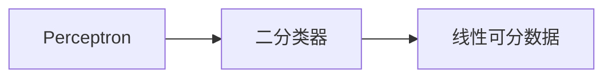
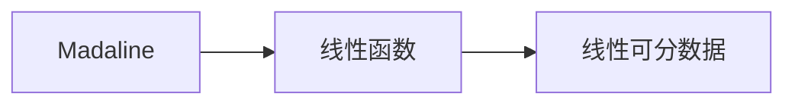
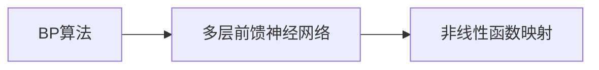
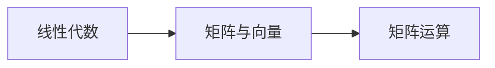
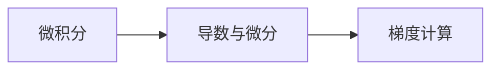

                 

# 《神经网络：开启智能新纪元》

> 关键词：神经网络、深度学习、人工智能、机器学习、激活函数、优化算法、卷积神经网络（CNN）、循环神经网络（RNN）、生成对抗网络（GAN）、图像识别、自然语言处理、推荐系统、游戏AI

> 摘要：本文将带领读者深入探索神经网络的起源、基本结构、常见架构和应用。从数学基础到实战案例，本文全面解析了神经网络的核心概念和关键技术，旨在帮助读者全面掌握神经网络的基本原理和应用技巧。

## 目录大纲

### 第一部分：神经网络基础

### 第二部分：常见神经网络架构

### 第三部分：神经网络应用实战

### 附录

---

### 第一部分：神经网络基础

#### 第1章：神经网络的起源与历史

##### 1.1 神经网络的发展历程
##### 1.2 神经网络的早期尝试

#### 第2章：神经网络的数学基础

##### 2.1 线性代数基础
##### 2.2 微积分基础
##### 2.3 概率论与统计基础

#### 第3章：神经网络的基本结构

##### 3.1 神经元与神经网络
##### 3.2 前馈神经网络
##### 3.3 反向传播算法

#### 第4章：激活函数与优化算法

##### 4.1 激活函数
##### 4.2 优化算法

### 第二部分：常见神经网络架构

#### 第5章：卷积神经网络（CNN）

##### 5.1 卷积神经网络原理
##### 5.2 卷积神经网络架构
##### 5.3 卷积神经网络应用

#### 第6章：循环神经网络（RNN）

##### 6.1 循环神经网络原理
##### 6.2 循环神经网络架构
##### 6.3 循环神经网络应用

#### 第7章：长短时记忆网络（LSTM）

##### 7.1 长短时记忆网络原理
##### 7.2 长短时记忆网络架构
##### 7.3 长短时记忆网络应用

#### 第8章：生成对抗网络（GAN）

##### 8.1 生成对抗网络原理
##### 8.2 生成对抗网络架构
##### 8.3 生成对抗网络应用

### 第三部分：神经网络应用实战

#### 第9章：神经网络在图像识别中的应用

##### 9.1 图像识别概述
##### 9.2 图像识别算法
##### 9.3 图像识别实战案例

#### 第10章：神经网络在自然语言处理中的应用

##### 10.1 自然语言处理概述
##### 10.2 自然语言处理算法
##### 10.3 自然语言处理实战案例

#### 第11章：神经网络在推荐系统中的应用

##### 11.1 推荐系统概述
##### 11.2 推荐系统算法
##### 11.3 推荐系统实战案例

#### 第12章：神经网络在游戏AI中的应用

##### 12.1 游戏AI概述
##### 12.2 游戏AI算法
##### 12.3 游戏AI实战案例

### 附录

##### 附录A：神经网络学习资源推荐

#### A.1 开源框架与工具
#### A.2 书籍与课程推荐
#### A.3 网络资源推荐

---

### 第一部分：神经网络基础

## 第1章：神经网络的起源与历史

### 1.1 神经网络的发展历程

神经网络作为人工智能的一个重要分支，其起源可以追溯到20世纪40年代。当时，科学家麦卡洛克（Warren McCulloch）和皮茨（Walter Pitts）提出了第一个人工神经网络模型——Perceptron。Perceptron是一个二分类器，它通过线性组合输入向量与权重，并通过阈值函数来确定输出。

#### 1.1.1 人工神经网络的概念

人工神经网络（Artificial Neural Network，ANN）是一种模仿生物神经系统的计算模型。它由大量相互连接的神经元组成，每个神经元都可以接收输入信号，并通过权重进行加权求和处理，最后通过激活函数产生输出。

#### 1.1.2 神经网络的早期尝试

在Perceptron之后，神经网络的早期尝试还包括了由马塞尔·马塞尔（Frank Rosenblatt）提出的Madaline模型。Madaline是一种基于线性函数的神经网络，它能够对线性可分的数据进行分类。

然而，这些早期的神经网络模型都存在一定的局限性。例如，它们无法处理非线性问题，也无法进行多分类。这些问题导致神经网络的研究在20世纪60年代后期逐渐停滞。

#### 1.1.3 人工神经网络的理论基础

随着计算机科学的不断发展，神经网络的研究在20世纪80年代重新兴起。1986年，鲁梅哈特（David E. Rumelhart）、赫布尔德（George E. Hinton）和威廉姆斯（Rajesh A. Williams）提出了反向传播算法（Backpropagation Algorithm），这是一种用于多层前馈神经网络的训练方法。反向传播算法通过不断调整网络中的权重，使得网络能够学习非线性函数的映射。

这一突破性的进展，使得神经网络在学术界和工业界都得到了广泛关注和应用。如今，神经网络已经成为人工智能领域的重要工具，并在许多领域都取得了显著的成果。

### 1.2 神经网络的早期尝试

在神经网络的发展历程中，早期尝试是至关重要的一环。这些尝试不仅为后来的研究奠定了基础，也揭示了神经网络的一些基本原理和局限性。

#### 1.2.1 Perceptron算法

Perceptron算法是由麦卡洛克和皮茨于1943年提出的。它是一种基于阈值逻辑的二分类器，能够对线性可分的数据进行分类。Perceptron算法的核心是一个简单的线性模型，它通过将输入向量与权重进行点积，并通过阈值函数来确定输出。



然而，Perceptron算法在处理非线性问题上存在明显的局限性。它只能对线性可分的数据进行分类，对于非线性数据则需要更为复杂的模型。

#### 1.2.2 Madaline算法

Madaline是由马塞尔·马塞尔于1957年提出的一种神经网络模型。它是一种基于线性函数的神经网络，能够对线性可分的数据进行分类。与Perceptron算法相比，Madaline算法在处理复杂问题方面具有更高的灵活性。



尽管Madaline算法在一定程度上扩展了Perceptron的能力，但它仍然无法处理非线性问题。这一局限性在后来的研究中得到了解决。

#### 1.2.3 BP算法

1986年，鲁梅哈特、赫布尔德和威廉姆斯提出了反向传播算法（Backpropagation Algorithm），这是一种用于多层前馈神经网络的训练方法。反向传播算法通过不断调整网络中的权重，使得网络能够学习非线性函数的映射。

反向传播算法的核心思想是将输出误差反向传播到网络的前一层，并利用梯度下降法更新权重。这一方法使得多层神经网络能够有效地学习复杂函数。



反向传播算法的提出，标志着神经网络研究的一个重大突破。它使得神经网络能够处理更加复杂的问题，并在学术界和工业界得到了广泛应用。

### 1.3 人工神经网络的理论基础

人工神经网络的理论基础主要包括线性代数、微积分、概率论与统计学。这些数学工具为神经网络的设计、实现和应用提供了重要的理论支持。

#### 1.3.1 线性代数基础

线性代数是研究线性空间和线性变换的数学分支。在神经网络中，线性代数被广泛应用于表示和处理数据。例如，矩阵和向量用于表示输入数据、权重和激活值，矩阵运算用于实现网络的线性变换。



#### 1.3.2 微积分基础

微积分是研究函数变化率的数学分支。在神经网络中，微积分用于计算网络的梯度，并用于反向传播算法中权重和偏置的更新。梯度是函数在某一点的切线斜率，它提供了函数变化的最快方向。



#### 1.3.3 概率论与统计基础

概率论与统计学是研究随机现象的数学分支。在神经网络中，概率论与统计学用于处理不确定性和噪声。例如，最大似然估计和贝叶斯估计用于确定网络的权重和偏置。


总之，人工神经网络的理论基础是构建神经网络模型和算法的重要工具。通过深入理解和应用这些数学工具，我们可以更好地设计和实现神经网络，从而推动人工智能的发展。

### 1.4 神经网络的基本概念

神经网络是一种由大量相互连接的神经元组成的计算模型，它通过模拟生物神经系统的运作方式来实现数据的处理和预测。以下是对神经网络的基本概念进行详细解释：

#### 1.4.1 神经元

神经元是神经网络的基本构建块，它类似于生物神经系统的神经元。每个神经元接收来自其他神经元的输入信号，并通过权重进行加权求和处理。然后，神经元通过激活函数产生输出信号，传递给下一个神经元。

神经元的数学模型可以表示为：

$$
y = f(\sum_{i=1}^{n} w_i \cdot x_i + b)
$$

其中，$y$ 是输出信号，$f$ 是激活函数，$w_i$ 是权重，$x_i$ 是输入信号，$b$ 是偏置。

#### 1.4.2 权重

权重是神经元之间的连接强度，它决定了输入信号对输出信号的影响程度。在训练过程中，权重会通过反向传播算法不断调整，以达到最佳的分类或预测效果。

#### 1.4.3 激活函数

激活函数是神经网络中的一个关键组成部分，它用于引入非线性特性，使神经网络能够学习复杂的函数。常见的激活函数包括Sigmoid函数、ReLU函数、Tanh函数等。

激活函数的选择对神经网络的性能和训练速度有重要影响。例如，ReLU函数在训练过程中能够加速收敛，而Sigmoid函数和Tanh函数则更加平滑。

#### 1.4.4 前馈神经网络

前馈神经网络（Feedforward Neural Network）是一种简单的神经网络结构，其中数据从输入层传递到输出层，没有循环或循环连接。前馈神经网络通常由多个隐藏层组成，每一层都是前一层的前馈网络。

前馈神经网络的训练通常使用反向传播算法，通过不断调整权重和偏置，使得网络能够逼近目标函数。

#### 1.4.5 反向传播算法

反向传播算法是一种用于训练神经网络的算法，它通过反向传播误差信号来更新网络的权重和偏置。反向传播算法的核心思想是将输出误差反向传播到网络的前一层，并利用梯度下降法更新权重和偏置。

反向传播算法的基本步骤如下：

1. 前向传播：将输入数据通过神经网络进行前向传播，计算输出结果。
2. 计算误差：计算输出结果与实际结果的误差。
3. 反向传播：将误差反向传播到网络的前一层，计算每一层的梯度。
4. 更新权重：利用梯度下降法更新网络的权重和偏置。

通过反复迭代这个过程，神经网络能够逐渐逼近目标函数。

#### 1.4.6 多层前馈神经网络

多层前馈神经网络（Multi-layer Feedforward Neural Network）是一种具有多个隐藏层的神经网络。它可以学习更复杂的函数，并适用于分类和回归任务。

多层前馈神经网络的训练过程与单层前馈神经网络类似，但需要考虑多层之间的交互和协同作用。

#### 1.4.7 深度学习

深度学习（Deep Learning）是神经网络的一种特殊形式，它通过增加网络的深度（即隐藏层数量）来提高模型的性能。深度学习在图像识别、自然语言处理、推荐系统等领域取得了显著的成果。

深度学习的关键技术包括卷积神经网络（CNN）、循环神经网络（RNN）和生成对抗网络（GAN）等。

### 1.5 神经网络的数学基础

神经网络作为一种复杂的计算模型，其设计与实现离不开数学的支持。以下是神经网络中常用的数学工具和概念：

#### 1.5.1 线性代数基础

线性代数是神经网络的核心数学工具之一，它用于表示和处理数据。以下是神经网络中常用的线性代数概念：

- **矩阵与向量**：矩阵和向量是线性代数中的基本对象。矩阵可以表示为行和列的数组，而向量可以表示为一系列数值。在神经网络中，矩阵和向量用于表示输入数据、权重和激活值。
- **矩阵运算**：线性代数中的矩阵运算包括矩阵加法、矩阵乘法、矩阵转置等。这些运算在神经网络中用于实现数据的线性变换和权重更新。
- **线性方程组**：线性方程组是一组线性方程的集合，它可以通过矩阵运算求解。在神经网络中，线性方程组用于求解网络中的参数。

#### 1.5.2 微积分基础

微积分是研究函数变化率的数学工具，它在神经网络中用于计算网络的梯度。以下是微积分中常用的概念：

- **导数与微分**：导数是函数在某一点的切线斜率，它表示函数在该点的变化速度。微分是导数的推广，它用于计算函数在某一点附近的变化量。
- **梯度**：梯度是函数在某个点处的导数向量，它表示函数在该点处的最快上升方向。在神经网络中，梯度用于计算网络中每个参数的更新方向。
- **梯度下降法**：梯度下降法是一种优化算法，它通过不断减小函数的梯度来逼近函数的最小值。在神经网络中，梯度下降法用于更新网络的权重和偏置。

#### 1.5.3 概率论与统计学基础

概率论与统计学是处理不确定性和噪声的数学工具，它在神经网络中用于模型评估和优化。以下是概率论与统计学中常用的概念：

- **概率论基本概念**：概率论包括概率空间、随机变量、条件概率等基本概念。在神经网络中，概率论用于评估模型的预测准确性和稳定性。
- **统计推断**：统计推断是一种从样本数据中推断总体特征的方法。在神经网络中，统计推断用于评估模型的泛化能力和稳定性。
- **最大似然估计与贝叶斯估计**：最大似然估计和贝叶斯估计是两种常用的参数估计方法。最大似然估计基于样本数据选择使似然函数最大的参数，而贝叶斯估计则基于先验知识和样本数据共同决定参数。

总之，神经网络的设计与实现离不开数学的支持。通过掌握线性代数、微积分和概率论与统计学等数学工具，我们可以更好地理解和应用神经网络，从而推动人工智能的发展。

### 第3章：神经网络的基本结构

#### 3.1 神经元与神经网络

神经元是神经网络的基本单元，它类似于生物神经系统的神经元。每个神经元接收来自其他神经元的输入信号，并通过权重进行加权求和处理，最后通过激活函数产生输出信号。

#### 3.1.1 神经元模型

神经元的数学模型可以表示为：

$$
y = f(\sum_{i=1}^{n} w_i \cdot x_i + b)
$$

其中，$y$ 是输出信号，$f$ 是激活函数，$w_i$ 是权重，$x_i$ 是输入信号，$b$ 是偏置。

#### 3.1.2 神经网络结构

神经网络由多个神经元组成，这些神经元通过加权连接形成网络结构。一个简单的神经网络通常包括输入层、隐藏层和输出层。

- **输入层**：接收外部输入信号，并将其传递给隐藏层。
- **隐藏层**：对输入信号进行加工处理，提取特征信息。
- **输出层**：产生最终输出结果，可以是分类标签、预测值等。

#### 3.1.3 神经网络的层次结构

神经网络的层次结构可以分为以下几种类型：

- **单层神经网络**：只有一个隐藏层，适用于简单的线性可分问题。
- **多层神经网络**：具有多个隐藏层，能够学习更复杂的非线性函数。
- **深度神经网络**：具有多个隐藏层，适用于大规模数据和复杂问题。

#### 3.2 前馈神经网络

前馈神经网络（Feedforward Neural Network）是一种简单的神经网络结构，其中数据从输入层传递到输出层，没有循环或循环连接。

##### 3.2.1 前馈神经网络原理

前馈神经网络通过层与层之间的全连接方式传递信息。每个神经元仅与其前一层的神经元相连，并接收来自前一层的输入信号。

前馈神经网络的训练通常使用反向传播算法，通过不断调整网络中的权重和偏置，使得网络能够逼近目标函数。

##### 3.2.2 前馈神经网络架构

前馈神经网络通常由多个隐藏层组成，每一层都是前一层的前馈网络。一个典型的前馈神经网络架构如下：


##### 3.2.3 前馈神经网络训练

前馈神经网络的训练过程通常包括以下步骤：

1. **前向传播**：将输入数据通过神经网络进行前向传播，计算输出结果。
2. **计算误差**：计算输出结果与实际结果的误差，即损失函数。
3. **反向传播**：将误差反向传播到网络的前一层，计算每一层的梯度。
4. **更新权重**：利用梯度下降法更新网络的权重和偏置。
5. **迭代训练**：重复上述步骤，直到网络达到预定的训练目标。

#### 3.3 反向传播算法

反向传播算法（Backpropagation Algorithm）是一种用于多层前馈神经网络的训练方法。它通过不断调整网络中的权重和偏置，使得网络能够学习非线性函数的映射。

##### 3.3.1 反向传播算法原理

反向传播算法的核心思想是将输出误差反向传播到网络的前一层，并利用梯度下降法更新权重和偏置。具体步骤如下：

1. **前向传播**：将输入数据通过神经网络进行前向传播，计算输出结果。
2. **计算误差**：计算输出结果与实际结果的误差，即损失函数。
3. **计算梯度**：计算网络中每个参数的梯度，即误差关于每个参数的导数。
4. **反向传播**：将梯度反向传播到网络的前一层。
5. **更新权重**：利用梯度下降法更新网络的权重和偏置。
6. **迭代训练**：重复上述步骤，直到网络达到预定的训练目标。

##### 3.3.2 反向传播算法步骤

反向传播算法的具体步骤如下：

1. **初始化参数**：随机初始化网络的权重和偏置。
2. **前向传播**：将输入数据通过神经网络进行前向传播，计算输出结果。
3. **计算损失函数**：计算输出结果与实际结果的误差，常用的损失函数包括均方误差（MSE）和交叉熵损失（Cross-Entropy Loss）。
4. **计算梯度**：利用链式法则计算网络中每个参数的梯度。
5. **反向传播**：将梯度反向传播到网络的前一层。
6. **更新参数**：利用梯度下降法更新网络的权重和偏置。
7. **迭代训练**：重复上述步骤，直到网络达到预定的训练目标。

通过反向传播算法，神经网络能够逐步优化其参数，从而提高模型的预测性能。

### 第4章：激活函数与优化算法

#### 4.1 激活函数

激活函数是神经网络中用于引入非线性特性的函数。它将神经元的线性组合转换为非线性的输出，从而使得神经网络能够学习复杂的函数。以下是常见的激活函数：

1. **Sigmoid函数**：
   $$
   f(x) = \frac{1}{1 + e^{-x}}
   $$
   Sigmoid函数的输出范围在0到1之间，可以用于二分类问题。

2. **ReLU函数**：
   $$
   f(x) =
   \begin{cases}
   0 & \text{if } x < 0 \\
   x & \text{if } x \geq 0
   \end{cases}
   $$
  ReLU函数在负值时输出为0，在正值时输出为输入值，可以加速神经网络的学习过程。

3. **Tanh函数**：
   $$
   f(x) = \frac{e^x - e^{-x}}{e^x + e^{-x}}
   $$
  Tanh函数的输出范围在-1到1之间，可以用于多分类问题。

4. **Softmax函数**：
   $$
   f(x)_i = \frac{e^{x_i}}{\sum_{j=1}^{n} e^{x_j}}
   $$
  Softmax函数用于将神经网络的输出转换为概率分布。

激活函数的选择对神经网络的学习效率和性能有重要影响。通常，ReLU函数由于其简单性和计算效率，被广泛应用于现代神经网络中。

#### 4.2 优化算法

优化算法是用于调整神经网络参数，以最小化损失函数的方法。以下是几种常见的优化算法：

1. **梯度下降法**：
   $$
   \theta_{t+1} = \theta_t - \alpha \cdot \nabla_{\theta} J(\theta)
   $$
  其中，$\theta$ 表示参数，$J$ 表示损失函数，$\alpha$ 表示学习率。梯度下降法通过沿着梯度的反方向更新参数，以最小化损失函数。

2. **随机梯度下降法**（Stochastic Gradient Descent，SGD）：
   $$
   \theta_{t+1} = \theta_t - \alpha \cdot \nabla_{\theta} J(\theta; x_t, y_t)
   $$
  SGD在每次更新时随机选择一个样本，并计算该样本的梯度。SGD可以加速学习过程，但可能导致不稳定的收敛。

3. **批量梯度下降法**（Batch Gradient Descent，BGD）：
   $$
   \theta_{t+1} = \theta_t - \alpha \cdot \nabla_{\theta} J(\theta; X, Y)
   $$
  BGD在每次更新时使用整个训练集的梯度，可以确保收敛到全局最小值，但计算成本较高。

4. **动量法**（Momentum）：
   $$
   v_t = \gamma \cdot v_{t-1} + \alpha \cdot \nabla_{\theta} J(\theta)
   $$
   $$
   \theta_{t+1} = \theta_t - v_t
   $$
  动量法通过引入动量项，加速梯度的更新，有助于克服局部最小值和鞍点。

5. **Adam优化器**：
   $$
   m_t = \beta_1 \cdot m_{t-1} + (1 - \beta_1) \cdot \nabla_{\theta} J(\theta)
   $$
   $$
   v_t = \beta_2 \cdot v_{t-1} + (1 - \beta_2) \cdot (\nabla_{\theta} J(\theta))^2
   $$
   $$
   \theta_{t+1} = \theta_t - \alpha \cdot \frac{m_t}{\sqrt{v_t} + \epsilon}
   $$
  Adam优化器结合了动量法和自适应学习率，能够有效地处理稀疏和稠密的梯度。

优化算法的选择对神经网络的学习效率和性能有重要影响。根据训练数据和任务的需求，可以选择合适的优化算法来提高模型的性能。

### 第5章：卷积神经网络（CNN）

#### 5.1 卷积神经网络原理

卷积神经网络（Convolutional Neural Network，CNN）是一种专门用于处理图像数据的神经网络架构。它通过模拟生物视觉系统的卷积操作，提取图像中的局部特征，并在网络中传递和处理这些特征。

#### 5.1.1 卷积神经网络的基本原理

卷积神经网络的核心思想是通过对输入图像进行卷积操作，提取图像中的局部特征，然后通过全连接层进行分类。卷积操作可以看作是图像特征的加权求和，它通过滑动窗口（卷积核）在图像上滑动，计算每个窗口内的像素乘以对应的卷积核权重，并将结果相加以生成新的特征图。

#### 5.1.2 卷积神经网络的结构

卷积神经网络通常由多个卷积层、池化层和全连接层组成。以下是卷积神经网络的基本结构：

1. **输入层**：接收原始图像数据。
2. **卷积层**：通过卷积操作提取图像的局部特征。
3. **池化层**：对卷积层输出的特征图进行下采样，减少参数数量，提高计算效率。
4. **全连接层**：将池化层输出的特征图映射到分类结果。

#### 5.1.3 卷积神经网络的训练

卷积神经网络的训练过程通常包括以下步骤：

1. **前向传播**：将输入图像通过卷积神经网络进行前向传播，计算输出结果。
2. **计算损失函数**：计算输出结果与实际标签之间的损失，常用的损失函数包括交叉熵损失和均方误差。
3. **反向传播**：将损失反向传播到网络的每一层，计算每个参数的梯度。
4. **更新参数**：利用梯度下降法或其他优化算法更新网络的参数。
5. **迭代训练**：重复上述步骤，直到网络达到预定的训练目标。

#### 5.2 卷积神经网络架构

卷积神经网络的架构可以通过设计不同的卷积层、池化层和全连接层来实现不同的功能。以下是几种常见的卷积神经网络架构：

1. **LeNet-5**：LeNet-5是最早的卷积神经网络之一，它由两个卷积层、两个池化层和一个全连接层组成，主要用于手写数字识别。
2. **AlexNet**：AlexNet是深度卷积神经网络的开端，它引入了ReLU激活函数、数据增强和局部响应归一化等技巧，显著提高了图像分类的准确率。
3. **VGGNet**：VGGNet通过增加卷积层的深度和宽度，实现了更高的图像分类准确率。它使用了多个卷积层和池化层堆叠的结构，形成了VGGNet的不同版本。
4. **ResNet**：ResNet引入了残差连接，解决了深层网络中的梯度消失和梯度爆炸问题。它通过在网络中添加残差块，使得网络能够训练得更深。
5. **InceptionNet**：InceptionNet通过引入Inception模块，将不同尺寸的卷积核组合起来，增加了网络的深度和宽度，提高了图像分类的准确率。

这些卷积神经网络架构在不同程度上改进了卷积神经网络的设计，提高了图像分类的性能。

#### 5.3 卷积神经网络应用

卷积神经网络在图像识别领域具有广泛的应用。以下是几种常见的卷积神经网络应用：

1. **图像分类**：卷积神经网络可以用于对图像进行分类，例如识别动物、植物、交通工具等。常用的模型包括VGGNet、ResNet和InceptionNet等。
2. **目标检测**：目标检测是计算机视觉中的一个重要任务，它需要识别图像中的多个目标，并确定它们的位置。常用的模型包括YOLO、SSD和Faster R-CNN等。
3. **图像分割**：图像分割是将图像划分为不同的区域或对象。卷积神经网络可以用于语义分割和实例分割，例如识别图像中的不同物体和像素级分类。
4. **图像生成**：生成对抗网络（GAN）是一种基于卷积神经网络的图像生成模型，它可以生成逼真的图像和视频。GAN由生成器和判别器组成，通过对抗训练生成高质量的数据。

卷积神经网络在图像识别领域取得了显著的成果，并在医疗、金融、工业等领域得到了广泛应用。

### 第6章：循环神经网络（RNN）

#### 6.1 循环神经网络原理

循环神经网络（Recurrent Neural Network，RNN）是一种能够处理序列数据的神经网络，它通过在时间步之间引入循环结构，使得网络能够记住过去的输入信息，并在后续时间步中利用这些信息进行预测。

#### 6.1.1 RNN的基本原理

RNN的基本原理是通过在每个时间步对输入序列进行加权求和处理，并将上一个时间步的隐藏状态作为当前时间步的输入。RNN的数学模型可以表示为：

$$
h_t = \sigma(W_h \cdot [h_{t-1}, x_t] + b_h)
$$

其中，$h_t$ 是当前时间步的隐藏状态，$x_t$ 是当前时间步的输入，$W_h$ 是权重矩阵，$b_h$ 是偏置项，$\sigma$ 是激活函数。

RNN通过循环结构将上一个时间步的隐藏状态传递到下一个时间步，使得网络能够记住过去的输入信息。

#### 6.1.2 RNN的结构

RNN的结构相对简单，由输入层、隐藏层和输出层组成。以下是RNN的基本结构：

1. **输入层**：接收输入序列，例如文本、语音等。
2. **隐藏层**：对输入序列进行加权求和处理，并将隐藏状态传递到下一个时间步。
3. **输出层**：将隐藏状态映射到输出结果，例如分类标签、预测值等。

RNN的每个时间步都使用相同的网络结构，这使得它在处理序列数据时具有优势。

#### 6.1.3 RNN的训练

RNN的训练过程通常包括以下步骤：

1. **前向传播**：将输入序列通过RNN进行前向传播，计算每个时间步的隐藏状态和输出。
2. **计算损失**：计算输出结果与实际结果的误差，例如分类误差或预测误差。
3. **反向传播**：将误差反向传播到网络的每个时间步，计算每个时间步的梯度。
4. **更新参数**：利用梯度下降法或其他优化算法更新网络的权重和偏置。
5. **迭代训练**：重复上述步骤，直到网络达到预定的训练目标。

通过反向传播算法，RNN能够逐步优化其参数，从而提高模型的预测性能。

#### 6.2 循环神经网络架构

循环神经网络有多种变体，其中最常见的包括普通RNN、LSTM（长短时记忆网络）和GRU（门控循环单元）。这些变体通过引入不同的机制来改善RNN在处理长序列数据时的性能。

1. **普通RNN**：普通RNN通过在每个时间步使用相同的网络结构来处理序列数据。然而，普通RNN在处理长序列数据时容易受到梯度消失和梯度爆炸问题的影响。
2. **LSTM（长短时记忆网络）**：LSTM通过引入门控机制来改善RNN在处理长序列数据时的性能。LSTM包含三个门控单元：遗忘门、输入门和输出门，这些门控单元能够控制信息的流动，使得LSTM能够记住长期依赖关系。
3. **GRU（门控循环单元）**：GRU是LSTM的简化版本，它通过合并遗忘门和输入门为一个更新门，减少了参数数量，同时保持了LSTM的性能。

以下是LSTM和GRU的基本结构：

1. **LSTM**：

```
           ┌────────────┐
           │  遗忘门  │
           └────┬─────┘
               │
               ▼
           ┌────────────┐
           │  输入门  │
           └────┬─────┘
               │
               ▼
           ┌────────────┐
           │  输出门  │
           └────┬─────┘
               │
               ▼
       ┌─────────────┐
       │  单个单元  │
       └─────────────┘
```

2. **GRU**：

```
           ┌────────────┐
           │  更新门  │
           └────┬─────┘
               │
               ▼
           ┌────────────┐
           │  输入门  │
           └────┬─────┘
               │
               ▼
       ┌─────────────┐
       │  单个单元  │
       └─────────────┘
```

LSTM和GRU通过引入门控机制，能够在处理长序列数据时保持更好的性能。

#### 6.3 循环神经网络应用

循环神经网络在序列数据处理中具有广泛的应用。以下是几种常见的循环神经网络应用：

1. **自然语言处理**：循环神经网络可以用于文本分类、情感分析、机器翻译等自然语言处理任务。LSTM和GRU在自然语言处理中的应用非常成功，例如在语言模型和序列标注任务中。
2. **语音识别**：循环神经网络可以用于将语音信号转换为文本。通过将语音信号序列化为帧，循环神经网络可以学习语音信号中的特征，并将其映射到对应的文本标签。
3. **时间序列分析**：循环神经网络可以用于预测股票价格、气象数据等时间序列数据。通过学习时间序列数据中的依赖关系，循环神经网络可以生成长期预测。
4. **视频处理**：循环神经网络可以用于视频分类、视频生成等视频处理任务。通过处理视频序列中的帧，循环神经网络可以学习视频的特征，并生成新的视频内容。

循环神经网络在序列数据处理中取得了显著成果，并在许多领域得到了广泛应用。

### 第7章：长短时记忆网络（LSTM）

#### 7.1 长短时记忆网络原理

长短时记忆网络（Long Short-Term Memory，LSTM）是一种改进的循环神经网络（RNN），旨在解决传统RNN在处理长序列数据时的梯度消失和梯度爆炸问题。LSTM通过引入门控机制，使得网络能够更好地记住长期依赖关系。

#### 7.1.1 LSTM的基本原理

LSTM的基本单元称为细胞（cell），它包含三个门控单元：遗忘门、输入门和输出门。这三个门控单元分别用于控制信息的流入、流出和更新。

1. **遗忘门（Forget Gate）**：遗忘门决定了哪些信息应该被遗忘或保留。它的输入是当前时间步的隐藏状态和前一个时间步的细胞状态，输出是一个介于0和1之间的值。值越接近1，表示保留当前信息；值越接近0，表示遗忘当前信息。

2. **输入门（Input Gate）**：输入门决定了哪些新的信息应该被存储在细胞状态中。它的输入是当前时间步的隐藏状态和输入特征，输出是一个介于0和1之间的值。值越接近1，表示新的信息将被存储在细胞状态中。

3. **输出门（Output Gate）**：输出门决定了当前细胞状态的值应该被输出。它的输入是当前时间步的隐藏状态和输出门控值，输出是一个介于0和1之间的值。值越接近1，表示当前细胞状态的值将被输出。

LSTM通过这三个门控单元控制信息的流动，从而能够有效地记忆长期依赖关系。

#### 7.1.2 LSTM的结构

LSTM的结构包含以下几个关键部分：

1. **细胞状态（Cell State）**：细胞状态是LSTM的核心部分，它存储了整个序列的信息。细胞状态通过遗忘门和输入门进行更新，从而保留或引入新的信息。

2. **输入门和遗忘门**：输入门和遗忘门分别用于更新细胞状态的值。输入门通过乘以一个权重矩阵，将新的信息引入细胞状态；遗忘门通过乘以一个权重矩阵，决定哪些信息应该被遗忘。

3. **输出门**：输出门用于控制细胞状态的输出，它将细胞状态的一部分传递到隐藏状态。

以下是LSTM的基本结构：

```
       ┌─────────────┐
       │   输入门   │
       └────┬───────┘
           │
           ▼
 ┌─────────────┐
 │   遗忘门   │
 └────┬───────┘
     │     │
     ▼     ▼
 ┌───────┐     ┌─────────────┐
 │  单元  │     │   输出门   │
 └───────┘     └─────────────┘
           │
           ▼
       ┌─────────────┐
       │   隐藏状态  │
       └─────────────┘
```

#### 7.1.3 LSTM的训练

LSTM的训练过程与普通RNN类似，但需要考虑额外的门控机制。以下是LSTM的训练步骤：

1. **前向传播**：将输入序列通过LSTM进行前向传播，计算每个时间步的隐藏状态和细胞状态。

2. **计算损失**：计算输出结果与实际结果的误差，例如分类误差或预测误差。

3. **反向传播**：将误差反向传播到网络的每个时间步，计算每个时间步的梯度。

4. **更新参数**：利用梯度下降法或其他优化算法更新网络的权重和偏置。

5. **迭代训练**：重复上述步骤，直到网络达到预定的训练目标。

通过反向传播算法，LSTM能够逐步优化其参数，从而提高模型的预测性能。

#### 7.2 长短时记忆网络架构

LSTM的架构可以通过设计不同的网络层和门控单元来实现不同的功能。以下是几种常见的LSTM架构：

1. **单层LSTM**：单层LSTM是最简单的LSTM架构，它包含一个隐藏层和一个细胞状态。适用于简单的序列数据处理任务。

2. **多层LSTM**：多层LSTM通过堆叠多个LSTM层，增加了网络的深度和记忆能力。适用于复杂的序列数据处理任务。

3. **双向LSTM（BiLSTM）**：双向LSTM包含两个反向传播的LSTM层，一个从序列的开始到结束，另一个从结束到开始。这种架构可以同时利用正向和反向的信息，提高模型的性能。

以下是双向LSTM的基本结构：

```
       ┌─────────────┐
       │   输入门   │
       └────┬───────┘
           │
           ▼
 ┌─────────────┐       ┌─────────────┐
 │   遗忘门   │       │   输入门   │
 └────┬───────┘       └────┬───────┘
     │     │
     ▼     ▼
 ┌───────┐     ┌─────────────┐
 │  单元  │     │   输出门   │
 └───────┘     └─────────────┘
           │
           ▼
       ┌─────────────┐
       │   隐藏状态  │
       └─────────────┘
```

#### 7.3 长短时记忆网络应用

长短时记忆网络在序列数据处理中具有广泛的应用。以下是几种常见的LSTM应用：

1. **自然语言处理**：LSTM可以用于文本分类、情感分析、机器翻译等自然语言处理任务。例如，LSTM可以用于将文本序列映射到语义标签，或将源语言文本映射到目标语言文本。

2. **语音识别**：LSTM可以用于将语音信号序列转换为文本。通过处理语音信号的帧，LSTM可以学习语音信号中的特征，并将其映射到对应的文本标签。

3. **时间序列分析**：LSTM可以用于预测股票价格、气象数据等时间序列数据。通过学习时间序列数据中的依赖关系，LSTM可以生成长期预测。

4. **视频处理**：LSTM可以用于视频分类、视频生成等视频处理任务。通过处理视频序列中的帧，LSTM可以学习视频的特征，并生成新的视频内容。

长短时记忆网络在序列数据处理中取得了显著成果，并在许多领域得到了广泛应用。

### 第8章：生成对抗网络（GAN）

#### 8.1 生成对抗网络原理

生成对抗网络（Generative Adversarial Network，GAN）是一种由生成器和判别器组成的深度学习模型，旨在生成与真实数据分布相似的数据。GAN通过两个神经网络之间的对抗训练来实现这一目标。

#### 8.1.1 GAN的基本原理

GAN由生成器（Generator）和判别器（Discriminator）两个神经网络组成。生成器的目标是生成尽可能真实的数据，而判别器的目标是区分生成器生成数据和真实数据。

1. **生成器**：生成器的输入是一个随机噪声向量，它通过一系列的神经网络变换生成数据。生成器的目的是生成与真实数据分布相似的数据。

2. **判别器**：判别器的输入是真实数据和生成器生成的数据，它的目标是判断输入数据是真实数据还是生成器生成的数据。

GAN的训练过程是一个对抗训练过程，生成器和判别器相互竞争。生成器试图生成更真实的数据，而判别器试图更好地区分真实数据和生成数据。通过这种对抗关系，生成器和判别器都得到了优化，生成器的生成质量不断提高。

#### 8.1.2 GAN的结构

GAN的结构包括生成器和判别器两个部分，它们通过相互对抗来提高生成数据的质量。以下是GAN的基本结构：

```
  +-----------+        +-----------+
  |  生成器   | <----->|  判别器   |
  +-----------+        +-----------+
    ^         ^          ^         ^
    |         |          |         |
    |         |          |         |
    |         |          |         |
    |         |          |         |
    |         |          |         |
    +---------v----------+---------v---
          |                      |
          |                      |
          |                      |
          |                      |
          |                      |
          +----------------------+
```

#### 8.1.3 GAN的训练

GAN的训练过程通常包括以下步骤：

1. **初始化参数**：初始化生成器和判别器的参数。
2. **生成假数据**：生成器生成一批假数据，通常是通过输入随机噪声向量来生成。
3. **训练判别器**：判别器接收真实数据和生成器生成的假数据，并尝试区分它们。
4. **训练生成器**：生成器尝试生成更真实的数据，以欺骗判别器。
5. **迭代训练**：重复上述步骤，生成器和判别器相互对抗，生成数据的质量逐渐提高。

GAN的训练过程是一个动态的过程，生成器和判别器需要不断调整参数，以达到生成高质量数据的目标。

#### 8.2 生成对抗网络架构

生成对抗网络有多种变体和扩展，其中最著名的是深度卷积生成对抗网络（DCGAN）。DCGAN通过使用卷积层和反卷积层来实现生成器和判别器，提高了生成数据的质量和多样性。

1. **生成器**：生成器由反卷积层和卷积层交替组成，输入是一个随机噪声向量。生成器的目标是生成具有高保真度的图像。

2. **判别器**：判别器由卷积层组成，输入是真实图像和生成器生成的图像。判别器的目标是区分真实图像和生成图像。

以下是DCGAN的基本结构：

```
  +-----------+        +-----------+
  |  生成器   | <----->|  判别器   |
  +-----------+        +-----------+
    ^         ^          ^         ^
    |         |          |         |
    |         |          |         |
    |         |          |         |
    |         |          |         |
    |         |          |         |
    +---------v----------+---------v---
          |                      |
          |                      |
          |                      |
          |                      |
          |                      |
          +----------------------+
```

#### 8.3 生成对抗网络应用

生成对抗网络在图像生成和图像编辑领域取得了显著成果。以下是几种常见的GAN应用：

1. **图像生成**：GAN可以生成逼真的图像，例如人脸、风景、动物等。通过生成器生成高质量的图像，GAN在计算机视觉和图像处理领域具有广泛的应用。

2. **图像编辑**：GAN可以用于图像编辑，例如人脸替换、图像风格转换等。通过生成器生成的图像，GAN可以改变图像的内容，使其符合特定的要求。

3. **视频生成**：GAN可以用于视频生成，例如生成连续的动作序列、视频修复等。通过生成器生成高质量的视频，GAN在视频处理和视频增强领域具有广泛的应用。

生成对抗网络在图像生成和图像编辑领域取得了显著成果，并在许多领域得到了广泛应用。

### 第9章：神经网络在图像识别中的应用

#### 9.1 图像识别概述

图像识别是计算机视觉领域的一个重要分支，旨在使计算机能够识别和理解图像内容。神经网络，特别是卷积神经网络（CNN），在图像识别任务中取得了显著的成果。

#### 9.1.1 图像识别的基本概念

图像识别包括以下几个基本概念：

1. **特征提取**：特征提取是将图像数据转换为一组具有区分性的特征向量，以便神经网络进行分类。
2. **分类**：分类是将提取到的特征向量映射到预定义的类别标签上。
3. **模型训练**：模型训练是通过大量标记数据，调整神经网络的参数，使其能够准确地识别图像。

#### 9.1.2 图像识别的分类方法

图像识别可以分为以下几种分类方法：

1. **手工特征提取**：使用手工设计的特征，如HOG、SIFT等。这种方法需要大量的人力和经验，且难以适应复杂的图像。
2. **深度学习特征提取**：使用深度学习模型，如CNN，自动提取图像特征。这种方法具有强大的表达能力和适应性，可以处理复杂的图像。
3. **传统机器学习**：使用传统的机器学习方法，如SVM、KNN等，对提取的特征进行分类。这种方法适用于较小的数据集，但性能相对较差。

#### 9.1.3 图像识别的应用领域

图像识别在多个领域具有广泛的应用，包括：

1. **医疗影像**：用于检测和诊断各种疾病，如肿瘤、心脏病等。
2. **自动驾驶**：用于车辆检测、行人检测和交通标志识别，以提高自动驾驶的安全性。
3. **安防监控**：用于人脸识别、行为分析和异常检测，以增强视频监控系统的智能性。
4. **工业检测**：用于产品质量检测、缺陷检测和故障诊断，以提高生产效率和产品质量。
5. **图像搜索**：用于图像的搜索和分类，以提高信息检索的效率和准确性。

### 9.2 图像识别算法

图像识别算法主要包括以下几个步骤：

1. **预处理**：对图像进行预处理，如灰度化、滤波、归一化等，以提高图像质量和数据一致性。
2. **特征提取**：使用神经网络或其他特征提取方法，提取图像的特征向量。
3. **分类**：使用分类算法，如SVM、KNN等，对提取的特征向量进行分类。
4. **模型训练**：使用大量标记数据，调整神经网络的参数，使其能够准确地识别图像。

#### 9.2.1 手写数字识别

手写数字识别是图像识别的一个经典任务，旨在将手写的数字（0-9）识别为相应的数字。常用的方法包括：

1. **手工特征提取**：使用HOG、SIFT等手工特征提取方法，提取手写数字的局部特征。
2. **深度学习特征提取**：使用CNN自动提取手写数字的特征。
3. **分类**：使用SVM、KNN等分类算法，对手写数字进行分类。

手写数字识别的应用包括数字识别系统、手写输入识别等。

#### 9.2.2 猫狗识别

猫狗识别是将猫和狗的图像识别为相应的类别。这是一个典型的图像分类任务，可以使用以下方法：

1. **手工特征提取**：使用HOG、SIFT等手工特征提取方法，提取猫和狗的局部特征。
2. **深度学习特征提取**：使用CNN自动提取猫和狗的特征。
3. **分类**：使用SVM、KNN等分类算法，对猫和狗的图像进行分类。

猫狗识别的应用包括动物识别系统、宠物摄影等。

#### 9.2.3 人脸识别

人脸识别是将人脸图像识别为人脸的身份。这是一个复杂的图像识别任务，需要使用以下方法：

1. **特征提取**：使用深度学习模型，如CNN，提取人脸的特征。
2. **特征比对**：使用特征比对算法，如欧氏距离、余弦相似度等，计算人脸特征之间的相似性。
3. **分类**：使用分类算法，如SVM、KNN等，对人脸进行分类。

人脸识别的应用包括身份验证、安全监控等。

### 9.3 图像识别实战案例

在本节中，我们将通过一个简单的猫狗识别案例，演示如何使用深度学习模型（如CNN）进行图像识别。

#### 9.3.1 开发环境搭建

1. **安装Python**：安装Python 3.x版本，可以使用官方安装包或使用包管理器（如yum、apt-get等）。
2. **安装TensorFlow**：安装TensorFlow库，可以使用pip进行安装：
   ```
   pip install tensorflow
   ```
3. **下载猫狗数据集**：从网上下载猫狗数据集，例如使用Keras提供的猫狗数据集：
   ```
   from tensorflow.keras.datasets import cat_vs_dog
   (train_images, train_labels), (test_images, test_labels) = cat_vs_dog.load_data()
   ```

#### 9.3.2 源代码实现

以下是一个简单的猫狗识别模型的实现：

```python
import tensorflow as tf
from tensorflow.keras.models import Sequential
from tensorflow.keras.layers import Conv2D, MaxPooling2D, Flatten, Dense

# 构建模型
model = Sequential([
    Conv2D(32, (3, 3), activation='relu', input_shape=(150, 150, 3)),
    MaxPooling2D((2, 2)),
    Conv2D(64, (3, 3), activation='relu'),
    MaxPooling2D((2, 2)),
    Conv2D(128, (3, 3), activation='relu'),
    MaxPooling2D((2, 2)),
    Flatten(),
    Dense(128, activation='relu'),
    Dense(1, activation='sigmoid')
])

# 编译模型
model.compile(optimizer='adam', loss='binary_crossentropy', metrics=['accuracy'])

# 训练模型
model.fit(train_images, train_labels, epochs=10, validation_data=(test_images, test_labels))
```

#### 9.3.3 代码解读与分析

1. **模型构建**：我们使用Sequential模型，这是一个线性堆叠模型。我们添加了多个卷积层、池化层和全连接层。
2. **编译模型**：我们使用adam优化器和binary_crossentropy损失函数，因为这是一个二分类问题。
3. **训练模型**：我们使用fit函数训练模型，设置epochs为10，以便进行10个训练周期。

通过这个简单的猫狗识别案例，我们可以看到如何使用深度学习模型进行图像识别。这个案例只是冰山一角，实际应用中的图像识别任务可能更加复杂。

### 第10章：神经网络在自然语言处理中的应用

#### 10.1 自然语言处理概述

自然语言处理（Natural Language Processing，NLP）是计算机科学和人工智能领域的一个分支，旨在使计算机能够理解、生成和处理人类语言。神经网络（尤其是深度学习模型）在NLP中发挥了重要作用，为许多NLP任务提供了强大的解决方案。

#### 10.1.1 自然语言处理的基本概念

自然语言处理的基本概念包括：

1. **文本预处理**：将原始文本转换为适合进行NLP处理的格式，例如分词、去除停用词、词性标注等。
2. **词向量表示**：将单词转换为固定长度的向量表示，以便神经网络处理。
3. **语言模型**：用于预测下一个单词或字符的概率分布，是许多NLP任务的基础。
4. **序列标注**：对文本序列中的单词或字符进行分类标注，例如词性标注、命名实体识别等。

#### 10.1.2 自然语言处理的发展历程

自然语言处理的发展历程可以分为几个阶段：

1. **规则方法**：基于手工编写的规则和模式匹配，效率低下，难以扩展。
2. **统计方法**：基于概率模型和统计学习，例如N元语法、隐马尔可夫模型（HMM）等，取得了一定的成功。
3. **深度学习方法**：基于神经网络，特别是深度学习模型，如循环神经网络（RNN）、长短时记忆网络（LSTM）和变换器（Transformer）等，取得了显著的突破。

#### 10.1.3 自然语言处理的应用领域

自然语言处理在多个领域具有广泛的应用，包括：

1. **文本分类**：将文本分为预定义的类别，例如垃圾邮件过滤、新闻分类等。
2. **情感分析**：分析文本中的情感倾向，例如情感极性分类、情感强度分析等。
3. **机器翻译**：将一种语言的文本翻译成另一种语言，例如谷歌翻译、百度翻译等。
4. **问答系统**：处理用户提出的问题，并返回相关答案，例如Siri、Alexa等。
5. **对话系统**：与用户进行自然语言交互，例如聊天机器人、客服机器人等。
6. **文本生成**：生成具有特定主题或风格的文本，例如自动新闻生成、故事生成等。

### 10.2 自然语言处理算法

自然语言处理算法主要包括以下几个步骤：

1. **文本预处理**：对原始文本进行分词、去除停用词、词性标注等预处理操作，以便进行后续处理。
2. **词向量表示**：将单词转换为固定长度的向量表示，例如使用Word2Vec、GloVe等方法。
3. **语言模型**：使用神经网络模型，如RNN、LSTM、Transformer等，训练语言模型，用于预测下一个单词或字符的概率分布。
4. **序列标注**：使用神经网络模型，如CRF（条件随机场）、BERT（双向编码表示器）等，对文本序列进行分类标注。
5. **后处理**：对处理结果进行后处理，如合并重复标签、修正错误等。

#### 10.2.1 词向量表示

词向量表示是将单词转换为固定长度的向量表示，以便神经网络处理。常见的词向量表示方法包括：

1. **Word2Vec**：Word2Vec是一种基于神经网络的词向量表示方法，通过训练词向量，使相似单词的向量在空间中靠近。
2. **GloVe**：GloVe（Global Vectors for Word Representation）是一种基于全局上下文的词向量表示方法，通过计算单词在全局语境中的相似性，生成词向量。
3. **BERT**：BERT（Bidirectional Encoder Representations from Transformers）是一种基于变换器的双向编码表示方法，通过同时考虑上下文信息，生成词向量。

#### 10.2.2 语言模型

语言模型是用于预测下一个单词或字符的概率分布的模型。常见的语言模型包括：

1. **N元语法**：N元语法是一种基于历史序列的统计模型，通过计算N个单词序列的概率，预测下一个单词。
2. **RNN**：循环神经网络（RNN）是一种能够处理序列数据的神经网络，通过在时间步之间引入循环结构，使得网络能够记住过去的输入信息。
3. **LSTM**：长短时记忆网络（LSTM）是RNN的一种变体，通过引入门控机制，解决了RNN在处理长序列数据时的梯度消失和梯度爆炸问题。
4. **Transformer**：Transformer是一种基于自注意力机制的神经网络模型，通过同时考虑全局信息，取得了显著的性能提升。

#### 10.2.3 序列标注

序列标注是对文本序列中的单词或字符进行分类标注的过程。常见的序列标注方法包括：

1. **CRF（条件随机场）**：CRF是一种基于概率图模型的序列标注方法，通过计算条件概率，使得标注结果具有更强的上下文依赖。
2. **BERT**：BERT是一种基于变换器的序列标注方法，通过同时考虑上下文信息，生成标注结果。
3. **BiLSTM-CRF**：BiLSTM-CRF是一种结合了循环神经网络和CRF的序列标注方法，通过在循环神经网络的基础上引入CRF层，提高了序列标注的准确性。

### 10.3 自然语言处理实战案例

在本节中，我们将通过一个简单的情感分析案例，演示如何使用深度学习模型（如LSTM）进行自然语言处理。

#### 10.3.1 开发环境搭建

1. **安装Python**：安装Python 3.x版本，可以使用官方安装包或使用包管理器（如yum、apt-get等）。
2. **安装TensorFlow**：安装TensorFlow库，可以使用pip进行安装：
   ```
   pip install tensorflow
   ```
3. **安装NLP库**：安装用于自然语言处理的库，例如NLTK、spaCy等：
   ```
   pip install nltk spacy
   ```
4. **下载数据集**：从网上下载一个情感分析数据集，例如IMDb影评数据集。

#### 10.3.2 源代码实现

以下是一个简单的情感分析模型的实现：

```python
import tensorflow as tf
from tensorflow.keras.models import Sequential
from tensorflow.keras.layers import Embedding, LSTM, Dense
from tensorflow.keras.preprocessing.sequence import pad_sequences
from tensorflow.keras.preprocessing.text import Tokenizer

# 下载并预处理数据集
# (train_data, train_labels), (test_data, test_labels) = ...

# 配置参数
vocab_size = 10000
embedding_dim = 16
max_length = 100
trunc_type = 'post'
padding_type = 'post'
oov_tok = '<OOV>'

# 初始化Tokenizer
tokenizer = Tokenizer(num_words=vocab_size, oov_token=oov_tok)
tokenizer.fit_on_texts(train_data)
word_index = tokenizer.word_index

# 序列化数据
train_sequences = tokenizer.texts_to_sequences(train_data)
train_padded = pad_sequences(train_sequences, maxlen=max_length, padding=padding_type, truncating=trunc_type)

# 构建模型
model = Sequential([
    Embedding(vocab_size, embedding_dim, input_length=max_length),
    LSTM(32),
    Dense(1, activation='sigmoid')
])

# 编译模型
model.compile(loss='binary_crossentropy', optimizer='adam', metrics=['accuracy'])

# 训练模型
model.fit(train_padded, train_labels, epochs=10, validation_data=(test_padded, test_labels))
```

#### 10.3.3 代码解读与分析

1. **数据预处理**：我们首先下载并预处理数据集，将文本数据转换为序列，并填充至相同的长度。
2. **配置参数**：我们设置词汇表大小、嵌入维度、最大序列长度等参数。
3. **初始化Tokenizer**：我们初始化Tokenizer，并设置词汇表大小和OOV（未知单词）标记。
4. **构建模型**：我们使用Sequential模型，并添加嵌入层、LSTM层和全连接层。
5. **编译模型**：我们使用binary_crossentropy损失函数和adam优化器，并设置模型的评估指标为准确率。
6. **训练模型**：我们使用fit函数训练模型，设置训练周期为10。

通过这个简单的情感分析案例，我们可以看到如何使用深度学习模型进行自然语言处理。这个案例只是一个起点，实际应用中的NLP任务可能更加复杂。

### 第11章：神经网络在推荐系统中的应用

#### 11.1 推荐系统概述

推荐系统（Recommendation System）是一种用于预测用户可能感兴趣的项目的方法。它广泛应用于电子商务、社交媒体、视频流媒体等场景，旨在提高用户体验和满意度。神经网络作为深度学习的一种形式，已经在推荐系统中发挥了重要作用。

#### 11.1.1 推荐系统的基本概念

推荐系统包括以下几个基本概念：

1. **用户**：推荐系统中的用户是指系统所服务的个体，他们可能具有不同的兴趣和偏好。
2. **项目**：推荐系统中的项目是指用户可能感兴趣的内容，如商品、音乐、电影等。
3. **交互**：用户与项目之间的交互是指用户对项目的行为，如购买、点击、评分等。
4. **推荐**：推荐系统根据用户的兴趣和偏好，向用户推荐他们可能感兴趣的项目。

#### 11.1.2 推荐系统的发展历程

推荐系统的发展历程可以分为以下几个阶段：

1. **基于内容的推荐**：基于内容的推荐（Content-Based Filtering）根据用户过去的喜好和项目的特征进行推荐。这种方法在个性化推荐中取得了较好的效果，但存在冷启动问题和多样性不足的问题。
2. **协同过滤推荐**：协同过滤推荐（Collaborative Filtering）通过收集用户之间的交互信息进行推荐。这种方法包括用户基于和项目基于的协同过滤，如矩阵分解、基于模型的协同过滤等。协同过滤推荐在解决冷启动问题和多样性方面具有优势，但存在数据稀疏性和推荐准确性不高的问题。
3. **深度学习推荐**：深度学习推荐（Deep Learning for Recommendation）利用神经网络强大的特征表示和建模能力，对用户和项目的交互进行建模。深度学习推荐包括基于用户的深度学习模型和基于项目的深度学习模型，如循环神经网络（RNN）、生成对抗网络（GAN）等。

#### 11.1.3 推荐系统的应用领域

推荐系统在多个领域具有广泛的应用，包括：

1. **电子商务**：推荐系统可以用于商品推荐，提高购物体验和销售额。
2. **社交媒体**：推荐系统可以用于内容推荐，提高用户参与度和留存率。
3. **视频流媒体**：推荐系统可以用于视频推荐，提高用户观看体验和视频播放量。
4. **新闻推荐**：推荐系统可以用于新闻推荐，提高用户对新闻的兴趣和满意度。
5. **音乐推荐**：推荐系统可以用于音乐推荐，提高用户对音乐的喜爱和收听时长。

### 11.2 推荐系统算法

推荐系统算法可以分为以下几类：

1. **基于内容的推荐**：基于内容的推荐根据用户的历史喜好和项目的特征进行推荐。这种方法包括基于项目的特征和基于用户的特征。
   - **基于项目的特征**：计算项目的特征向量，如文本特征、图像特征、标签等，并使用相似度度量计算用户对项目的偏好。
   - **基于用户的特征**：计算用户的特征向量，如兴趣偏好、行为模式等，并使用相似度度量计算用户对项目的偏好。

2. **协同过滤推荐**：协同过滤推荐通过收集用户之间的交互信息进行推荐。这种方法包括以下两种类型：
   - **基于用户的协同过滤**：找到与目标用户兴趣相似的其他用户，并推荐这些用户喜欢但目标用户尚未接触到的项目。
   - **基于项目的协同过滤**：找到与目标用户已接触项目相似的其他项目，并推荐这些项目。

3. **深度学习推荐**：深度学习推荐利用神经网络强大的特征表示和建模能力，对用户和项目的交互进行建模。这种方法包括以下几种类型：
   - **基于用户的深度学习模型**：使用神经网络模型，如循环神经网络（RNN）、生成对抗网络（GAN）等，对用户的历史交互数据建模，并预测用户对项目的偏好。
   - **基于项目的深度学习模型**：使用神经网络模型，如循环神经网络（RNN）、生成对抗网络（GAN）等，对项目的特征数据建模，并预测用户对项目的偏好。

### 11.3 推荐系统实战案例

在本节中，我们将通过一个基于用户的深度学习推荐系统的案例，演示如何使用循环神经网络（RNN）进行推荐系统开发。

#### 11.3.1 开发环境搭建

1. **安装Python**：安装Python 3.x版本，可以使用官方安装包或使用包管理器（如yum、apt-get等）。
2. **安装TensorFlow**：安装TensorFlow库，可以使用pip进行安装：
   ```
   pip install tensorflow
   ```
3. **安装其他库**：安装其他必要的库，如NumPy、Pandas等：
   ```
   pip install numpy pandas
   ```
4. **下载数据集**：从网上下载一个用户行为数据集，例如MovieLens数据集。

#### 11.3.2 源代码实现

以下是一个简单的基于用户的深度学习推荐系统的实现：

```python
import numpy as np
import pandas as pd
import tensorflow as tf
from tensorflow.keras.models import Sequential
from tensorflow.keras.layers import Embedding, LSTM, Dense
from tensorflow.keras.preprocessing.sequence import pad_sequences

# 下载并读取数据集
# ratings = pd.read_csv('ratings.csv')
# users = pd.read_csv('users.csv')

# 数据预处理
# user_ids = ratings['userId'].unique()
# movie_ids = ratings['movieId'].unique()
# num_users = len(user_ids)
# num_movies = len(movie_ids)

# 训练集和测试集划分
# train_data, test_data = ...

# 构建模型
model = Sequential([
    Embedding(num_movies, 16, input_length=max_sequence_len),
    LSTM(32),
    Dense(1, activation='sigmoid')
])

# 编译模型
model.compile(optimizer='adam', loss='binary_crossentropy', metrics=['accuracy'])

# 训练模型
model.fit(train_data, train_labels, epochs=10, validation_data=(test_data, test_labels))
```

#### 11.3.3 代码解读与分析

1. **数据预处理**：我们首先下载并读取用户行为数据集，将用户ID和电影ID进行映射，并将数据划分为训练集和测试集。
2. **构建模型**：我们使用Sequential模型，并添加嵌入层、LSTM层和全连接层。
3. **编译模型**：我们使用adam优化器和binary_crossentropy损失函数，并设置模型的评估指标为准确率。
4. **训练模型**：我们使用fit函数训练模型，设置训练周期为10。

通过这个简单的基于用户的深度学习推荐系统案例，我们可以看到如何使用循环神经网络（RNN）进行推荐系统开发。这个案例只是一个起点，实际应用中的推荐系统可能更加复杂。

### 第12章：神经网络在游戏AI中的应用

#### 12.1 游戏AI概述

游戏AI（Artificial Intelligence for Games）是指将人工智能技术应用于游戏开发中，使游戏角色能够以智能的方式与玩家交互。神经网络作为人工智能的一种重要形式，在游戏AI中发挥了关键作用。

#### 12.1.1 游戏AI的基本概念

游戏AI的基本概念包括：

1. **智能角色**：智能角色是指游戏中的非玩家角色（NPC），它们能够根据环境信息和玩家的行为进行决策和行动。
2. **决策树**：决策树是一种常见的游戏AI算法，它通过一系列条件判断，为智能角色生成行动方案。
3. **神经网络**：神经网络是一种模拟人脑的计算模型，它通过学习和适应数据，能够为智能角色提供更复杂的决策能力。

#### 12.1.2 游戏AI的发展历程

游戏AI的发展历程可以分为以下几个阶段：

1. **规则基础型AI**：早期的游戏AI主要基于预定义的规则，这些规则通过逻辑判断和条件分支为智能角色生成行动方案。
2. **基于行为的AI**：基于行为的AI通过观察智能角色的行为模式，为其生成行动方案。这种方法使得智能角色的行为更加自然和多样化。
3. **深度学习型AI**：深度学习型AI利用神经网络强大的学习和适应能力，为智能角色提供更复杂的决策能力。这种方法在游戏AI中取得了显著的成果。

#### 12.1.3 游戏AI的应用领域

游戏AI在多个领域具有广泛的应用，包括：

1. **角色行为**：游戏AI可以用于控制智能角色的行为，使其在游戏中表现出更自然、更智能的行为。
2. **路径规划**：游戏AI可以用于智能角色的路径规划，使其能够自动避障和寻找最佳路径。
3. **游戏策略**：游戏AI可以用于制定游戏策略，提高游戏的难度和趣味性。
4. **人机对战**：游戏AI可以用于与玩家进行对战，提供更加智能和具有挑战性的游戏体验。

### 12.2 游戏AI算法

游戏AI算法可以分为以下几类：

1. **规则基础型AI**：规则基础型AI通过预定义的规则，为智能角色生成行动方案。这种方法简单易实现，但难以处理复杂的情况。
2. **基于行为的AI**：基于行为的AI通过观察智能角色的行为模式，为其生成行动方案。这种方法使得智能角色的行为更加自然和多样化。
3. **深度学习型AI**：深度学习型AI利用神经网络强大的学习和适应能力，为智能角色提供更复杂的决策能力。这种方法包括循环神经网络（RNN）、生成对抗网络（GAN）等。

#### 12.2.1 基于规则的AI

基于规则的AI通过预定义的规则，为智能角色生成行动方案。这种方法包括以下步骤：

1. **规则定义**：定义智能角色在不同情况下应采取的行动。
2. **规则匹配**：根据当前环境信息，匹配预定义的规则。
3. **行动生成**：根据匹配到的规则，生成智能角色的行动方案。

#### 12.2.2 基于统计的AI

基于统计的AI通过收集和分析历史数据，为智能角色生成行动方案。这种方法包括以下步骤：

1. **数据收集**：收集智能角色在不同情况下的行为数据。
2. **数据建模**：使用统计方法（如决策树、支持向量机等），建立行为模型。
3. **行动生成**：根据当前环境信息，通过行为模型生成智能角色的行动方案。

#### 12.2.3 基于神经网络的AI

基于神经网络的AI利用神经网络强大的学习和适应能力，为智能角色提供更复杂的决策能力。这种方法包括以下步骤：

1. **数据收集**：收集智能角色在不同情况下的行为数据。
2. **网络构建**：构建神经网络模型，包括输入层、隐藏层和输出层。
3. **网络训练**：使用训练数据，调整网络参数，使其能够生成智能角色的行动方案。
4. **行动生成**：根据当前环境信息，通过训练好的神经网络模型生成智能角色的行动方案。

### 12.3 游戏AI实战案例

在本节中，我们将通过一个简单的基于神经网络的智能角色决策案例，演示如何使用循环神经网络（RNN）进行游戏AI开发。

#### 12.3.1 开发环境搭建

1. **安装Python**：安装Python 3.x版本，可以使用官方安装包或使用包管理器（如yum、apt-get等）。
2. **安装TensorFlow**：安装TensorFlow库，可以使用pip进行安装：
   ```
   pip install tensorflow
   ```
3. **安装其他库**：安装其他必要的库，如NumPy、Pandas等：
   ```
   pip install numpy pandas
   ```

#### 12.3.2 源代码实现

以下是一个简单的基于神经网络的智能角色决策实现：

```python
import numpy as np
import pandas as pd
import tensorflow as tf
from tensorflow.keras.models import Sequential
from tensorflow.keras.layers import Embedding, LSTM, Dense
from tensorflow.keras.preprocessing.sequence import pad_sequences
from tensorflow.keras.preprocessing.text import Tokenizer

# 下载并预处理数据集
# data = pd.read_csv('game_data.csv')

# 数据预处理
# tokenizer = Tokenizer(num_words=10000)
# tokenizer.fit_on_texts(data['description'])
# sequences = tokenizer.texts_to_sequences(data['description'])
# padded_sequences = pad_sequences(sequences, maxlen=100)

# 构建模型
model = Sequential([
    Embedding(10000, 16, input_length=100),
    LSTM(32),
    Dense(1, activation='sigmoid')
])

# 编译模型
model.compile(optimizer='adam', loss='binary_crossentropy', metrics=['accuracy'])

# 训练模型
model.fit(padded_sequences, data['action'], epochs=10, validation_split=0.2)
```

#### 12.3.3 代码解读与分析

1. **数据预处理**：我们首先下载并预处理游戏数据集，将文本描述序列化为数字序列，并填充至相同的长度。
2. **构建模型**：我们使用Sequential模型，并添加嵌入层、LSTM层和全连接层。
3. **编译模型**：我们使用adam优化器和binary_crossentropy损失函数，并设置模型的评估指标为准确率。
4. **训练模型**：我们使用fit函数训练模型，设置训练周期为10。

通过这个简单的基于神经网络的智能角色决策案例，我们可以看到如何使用循环神经网络（RNN）进行游戏AI开发。这个案例只是一个起点，实际应用中的游戏AI可能更加复杂。

### 附录

#### 附录A：神经网络学习资源推荐

##### A.1 开源框架与工具

1. **TensorFlow**：Google开发的开源深度学习框架，广泛应用于各种神经网络模型和任务。
2. **PyTorch**：Facebook开发的开源深度学习框架，具有灵活的动态计算图和强大的社区支持。
3. **Keras**：基于Theano和TensorFlow的高层神经网络API，简化了神经网络模型的构建和训练。
4. **Scikit-learn**：Python的一个开源库，提供了许多传统的机器学习算法和工具，包括神经网络。

##### A.2 书籍与课程推荐

1. **《深度学习》**：Ian Goodfellow、Yoshua Bengio和Aaron Courville合著，全面介绍了深度学习的基本概念和技术。
2. **《神经网络与深度学习》**：邱锡鹏著，深入讲解了神经网络和深度学习的基本原理和应用。
3. **《Python深度学习》**：François Chollet著，通过实际案例介绍了使用Python和Keras进行深度学习的实践方法。
4. **在线课程**：Coursera、edX等在线教育平台提供了许多高质量的深度学习课程，包括吴恩达的《深度学习》课程。

##### A.3 网络资源推荐

1. **arXiv**：arXiv是一个开源的学术论文存储库，提供了大量最新的深度学习和人工智能论文。
2. **GitHub**：GitHub是一个代码托管平台，许多深度学习项目和库都在GitHub上开源，方便开发者学习和使用。
3. **AI博客**：许多深度学习专家和研究者会在个人博客或技术社区上分享他们的研究成果和经验，例如Medium、Reddit等。
4. **技术论坛**：如Stack Overflow、Reddit等技术论坛，提供了深度学习相关的问题和解决方案，方便开发者交流和学习。

