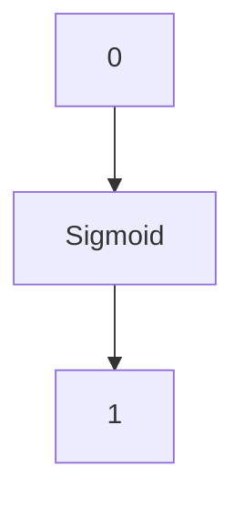
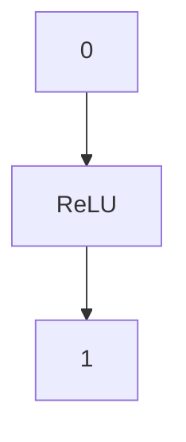

                 

# 神经网络：自然语言处理的新突破

> **关键词：** 神经网络、自然语言处理、深度学习、自然语言模型、词嵌入、语音识别、机器翻译、文本分类、情感分析、推荐系统。
>
> **摘要：** 本文将深入探讨神经网络在自然语言处理（NLP）领域的突破性进展。通过详细的分析和示例，我们将了解神经网络的基础、深度学习模型、语言模型、词嵌入方法、序列模型以及NLP中的多个应用场景，如语音识别、机器翻译、文本分类和情感分析。此外，还将探讨推荐系统和神经网络的发展趋势，展望未来NLP领域的创新方向。

### 第一部分: 理解神经网络与自然语言处理

在进入神经网络与自然语言处理的深层次探讨之前，首先需要建立一个坚实的理论基础，了解神经网络的基本概念、历史发展以及其与自然语言处理的密切联系。

#### 第1章: 神经网络入门

##### 1.1 神经网络基础

###### 1.1.1 什么是神经网络？

神经网络是一种模拟人脑神经元连接和信息传递方式的计算模型。它由多个简单的计算单元（即神经元）组成，这些神经元通过连接（即边）相互连接，形成一个复杂的网络结构。

- **输入层**：接收外部输入的数据。
- **隐藏层**：对输入数据进行处理，进行特征提取和组合。
- **输出层**：产生模型的输出，如分类结果或预测值。

神经网络中的神经元接收多个输入，通过权重和偏置进行加权求和，然后通过激活函数产生输出。这个输出可以传递给下一层神经元，或者作为最终的预测结果。

###### 1.1.2 神经元的工作原理

神经元是神经网络的基本计算单元。它通过以下步骤进行计算：

1. **加权求和**：将输入值乘以相应的权重，然后求和。
   \[ z = \sum_{i=1}^{n} x_i \cdot w_i + b \]
   其中，\( x_i \) 是第 \( i \) 个输入值，\( w_i \) 是第 \( i \) 个输入的权重，\( b \) 是偏置。

2. **激活函数**：将加权求和的结果通过激活函数进行处理，以产生输出。常见的激活函数包括Sigmoid、ReLU和Tanh。

   \[ a = \sigma(z) = \frac{1}{1 + e^{-z}} \]
   或者
   \[ a = \text{ReLU}(z) = \max(0, z) \]

3. **输出**：激活函数的输出即为神经元的输出，它可以传递给下一层的神经元或作为最终预测结果。

###### 1.1.3 神经网络的类型

神经网络可以根据层数和结构的不同分为多种类型：

- **单层感知器**：只有一个输入层和一个输出层的神经网络，主要用于线性可分问题。
- **多层感知器（MLP）**：具有多个隐藏层的神经网络，能够处理非线性问题。

MLP的结构如下：
```
输入层 -> 隐藏层 -> 输出层
```

- **卷积神经网络（CNN）**：主要用于图像处理，其核心思想是通过卷积操作提取图像特征。
- **循环神经网络（RNN）**：适用于序列数据，能够捕获时间序列中的依赖关系。
- **长短期记忆网络（LSTM）**：是RNN的一种改进，能够学习长期依赖关系。
- **门控循环单元（GRU）**：是LSTM的简化版，同样能够学习长期依赖关系。

##### 1.2 神经网络模型

###### 1.2.1 线性回归模型

线性回归是一种简单的神经网络模型，用于预测数值型数据。其模型公式为：
\[ y = \beta_0 + \beta_1x \]
其中，\( y \) 是预测值，\( x \) 是输入特征，\( \beta_0 \) 和 \( \beta_1 \) 是模型参数。

线性回归模型的伪代码实现如下：
```python
# 线性回归模型的伪代码实现

# 定义模型参数
beta_0 = ...
beta_1 = ...

# 输入特征
x = ...

# 预测
y = beta_0 + beta_1 * x
```

###### 1.2.2 多层感知器（MLP）

多层感知器是一种具有多个隐藏层的神经网络，用于解决非线性问题。其结构如下：
```
输入层 -> 隐藏层1 -> 隐藏层2 -> ... -> 输出层
```

MLP的模型公式为：
\[ a_{l+1} = \sigma(\beta^{(l)}a^l + b^{(l)}) \]
其中，\( a^l \) 是第 \( l \) 层的输入，\( \beta^{(l)} \) 是第 \( l \) 层的权重矩阵，\( b^{(l)} \) 是第 \( l \) 层的偏置向量，\( \sigma \) 是激活函数。

MLP的伪代码实现如下：
```python
# 多层感知器（MLP）的伪代码实现

# 定义模型参数
beta_0, beta_1, ..., beta_L = ...
b_0, b_1, ..., b_L = ...

# 输入特征
x = ...

# 前向传播
for l in range(L):
    z_l = beta^{(l)}x + b^{(l)}
    a_l = \sigma(z_l)

# 预测
y = a_L
```

##### 1.3 激活函数

激活函数是神经网络中的一个重要组成部分，用于引入非线性因素，使得神经网络能够解决非线性问题。常见的激活函数包括Sigmoid、ReLU和Tanh。

###### 1.3.1 Sigmoid函数

Sigmoid函数是一种常用的激活函数，其定义如下：
\[ \sigma(z) = \frac{1}{1 + e^{-z}} \]

Sigmoid函数的图像如下：


Sigmoid函数的性质：
1. 在 \( z = 0 \) 时，输出值为 0.5，具有对称性。
2. 随着输入值的增大，输出值逐渐逼近 1。
3. 随着输入值的减小，输出值逐渐逼近 0。

###### 1.3.2 ReLU函数

ReLU（Rectified Linear Unit）函数是一种简单的激活函数，其定义如下：
\[ \text{ReLU}(z) = \max(0, z) \]

ReLU函数的图像如下：


ReLU函数的性质：
1. 输入为非负值时，输出等于输入。
2. 输入为负值时，输出为 0。
3. ReLU函数没有梯度为零的问题，使得训练过程更加稳定。

#### 第2章: 深度学习基础

##### 2.1 深度学习简介

###### 2.1.1 深度学习的概念

深度学习是一种机器学习的方法，通过构建具有多个隐藏层的神经网络，自动学习数据中的特征和模式。与传统的机器学习方法相比，深度学习具有以下几个特点：

1. **层次化特征学习**：通过多层网络结构，自动学习从低级到高级的特征表示。
2. **端到端的模型训练**：不需要人工设计特征，可以直接从原始数据训练到预测结果。
3. **强大的表达能力和泛化能力**：多层神经网络可以学习复杂的非线性关系，并具有良好的泛化性能。

深度学习与机器学习的区别主要体现在模型结构、学习方式和应用场景上：

1. **模型结构**：深度学习模型通常具有多个隐藏层，而传统机器学习方法通常只有一个或几个隐藏层。
2. **学习方式**：深度学习模型通过端到端的方式训练，从原始数据直接学习特征表示；传统机器学习方法通常需要手动设计特征，然后训练分类器或回归模型。
3. **应用场景**：深度学习在图像识别、语音识别、自然语言处理等领域取得了显著的成果，而传统机器学习方法在回归分析、分类任务等方面应用广泛。

###### 2.1.2 深度学习的发展历程

深度学习的发展可以分为以下几个关键阶段：

1. **1990年代**：神经网络在图像识别和语音识别等领域取得了初步的成功，但由于计算能力和数据集的限制，深度学习未能得到广泛应用。
2. **2006年**：Hinton等人提出了深度置信网络（Deep Belief Network, DBN），为深度学习的发展奠定了基础。
3. **2012年**：AlexNet在ImageNet竞赛中取得突破性成绩，使深度学习成为计算机视觉领域的热门技术。
4. **2014年**：Google Brain团队训练了一个包含16000个处理器的深度神经网络，成功识别YouTube视频中的猫。
5. **2016年**：AlphaGo击败世界围棋冠军李世石，标志着深度学习在人工智能领域的重要突破。

这些关键事件推动了深度学习的快速发展，使其成为当前人工智能研究的热点方向。

##### 2.2 神经网络训练

神经网络训练是深度学习中的核心步骤，通过调整网络中的权重和偏置，使得模型能够对数据进行准确预测。训练过程主要包括以下几个阶段：

###### 2.2.1 前向传播

前向传播是神经网络训练过程中的第一步，用于计算网络的输出并计算损失函数。具体步骤如下：

1. **初始化模型参数**：随机初始化模型的权重和偏置。
2. **输入数据**：将训练数据输入到神经网络中。
3. **前向计算**：通过多层网络结构，逐层计算神经元的输出。
4. **计算损失**：将输出与真实值进行比较，计算损失函数值。

前向传播的伪代码实现如下：
```python
# 前向传播的伪代码实现

# 初始化模型参数
weights, biases = ...

# 输入数据
x = ...

# 前向计算
for layer in network.layers:
    z = ...
    a = ...

# 计算损失
loss = ...

return loss
```

###### 2.2.2 反向传播

反向传播是神经网络训练过程中的第二步，用于计算梯度并更新模型参数。具体步骤如下：

1. **计算损失函数的梯度**：对输出层开始，反向计算每个神经元的梯度。
2. **更新模型参数**：根据梯度值调整模型参数，使得损失函数减小。
3. **重复迭代**：重复前向传播和反向传播过程，直到模型收敛或达到预设的迭代次数。

反向传播的伪代码实现如下：
```python
# 反向传播的伪代码实现

# 初始化模型参数
weights, biases = ...

# 输入数据
x = ...

# 前向传播
loss = ...

# 反向传播
for layer in network.layers:
    # 计算梯度
    dZ = ...

    # 更新参数
    weights -= learning_rate * dW
    biases -= learning_rate * db

return weights, biases
```

##### 2.3 深度学习框架

深度学习框架是用于构建和训练深度学习模型的软件库。目前，常见的深度学习框架包括TensorFlow、PyTorch和Keras等。

###### 2.3.1 TensorFlow

TensorFlow是由Google开发的一款开源深度学习框架，具有丰富的功能和高性能计算能力。以下是如何在TensorFlow中安装和配置深度学习环境的步骤：

1. **安装TensorFlow**：使用pip命令安装TensorFlow：
   ```
   pip install tensorflow
   ```

2. **配置CUDA**：如果使用GPU加速，需要配置CUDA。在下载并安装CUDA之后，设置环境变量：
   ```
   export CUDA_HOME=/path/to/cuda
   export PATH=$PATH:$CUDA_HOME/bin
   ```

3. **安装GPU驱动**：根据您的GPU型号下载并安装相应的GPU驱动。

4. **测试TensorFlow**：在Python中导入TensorFlow并检查版本：
   ```python
   import tensorflow as tf
   print(tf.__version__)
   ```

###### 2.3.2 PyTorch

PyTorch是由Facebook开发的一款开源深度学习框架，以其灵活的动态计算图和易于使用的接口而受到广泛欢迎。以下是如何在PyTorch中安装和配置深度学习环境的步骤：

1. **安装PyTorch**：使用pip命令安装PyTorch：
   ```
   pip install torch torchvision
   ```

2. **安装CUDA**：如果使用GPU加速，需要安装CUDA。在下载并安装CUDA之后，设置环境变量：
   ```
   export CUDA_HOME=/path/to/cuda
   export PATH=$PATH:$CUDA_HOME/bin
   ```

3. **测试PyTorch**：在Python中导入PyTorch并检查版本：
   ```python
   import torch
   print(torch.__version__)
   ```

#### 第3章: 自然语言处理基础

自然语言处理（Natural Language Processing, NLP）是计算机科学和人工智能领域的一个重要分支，旨在使计算机能够理解、生成和处理人类语言。在本章中，我们将探讨NLP的基础概念、语言模型、词嵌入方法和序列模型。

##### 3.1 语言模型

语言模型（Language Model）是NLP的核心组成部分，用于预测文本中下一个单词或字符的概率。它为文本生成、机器翻译、语音识别和文本分类等任务提供了基础。

###### 3.1.1 语言模型的定义

语言模型是一种概率模型，用于表示自然语言的统计特征。它根据历史文本数据，计算给定上下文下某个词或字符的概率。语言模型的基本目标是提高文本生成和预测的准确率。

语言模型的类型可以分为以下几种：

1. **N元语言模型**：基于过去 \( n \) 个单词或字符来预测下一个单词或字符。常见的N元语言模型包括三元语言模型（3-gram）和四元语言模型（4-gram）。
2. **基于统计的模型**：如N元模型，通过计算单词或字符的联合概率来预测下一个单词或字符。这类模型的优点是简单且易于实现，缺点是效果有限。
3. **基于神经网络的模型**：如循环神经网络（RNN）、长短期记忆网络（LSTM）和变压器（Transformer）等，通过学习大量文本数据中的复杂依赖关系，生成高质量的预测结果。

###### 3.1.2 语言模型的训练

语言模型的训练过程主要包括数据预处理、模型构建和优化三个阶段。

1. **数据预处理**：首先，从大量文本数据中提取有效的单词或字符序列。然后，对文本数据进行分词、去停用词和词干提取等处理，以提高模型的效果。

2. **模型构建**：根据语言模型的要求，选择合适的模型架构。常见的模型包括N元模型、循环神经网络（RNN）、长短期记忆网络（LSTM）和变压器（Transformer）等。

3. **模型优化**：通过训练数据和验证数据，调整模型参数，使损失函数最小化。常用的优化算法包括随机梯度下降（SGD）、Adam优化器和RMSprop等。

语言模型训练的伪代码实现如下：
```python
# 语言模型训练的伪代码实现

# 数据预处理
# ...

# 模型构建
model = ...

# 损失函数
loss_function = ...

# 优化器
optimizer = ...

# 训练模型
for epoch in range(num_epochs):
    for sentence in training_data:
        # 前向传播
        # ...

        # 计算损失
        loss = ...

        # 反向传播
        # ...

        # 更新参数
        optimizer.step()

# 评估模型
# ...
```

##### 3.2 词嵌入

词嵌入（Word Embedding）是NLP领域中的一种重要技术，用于将单词映射为稠密向量表示。词嵌入方法能够捕捉单词之间的语义和语法关系，从而提高NLP任务的效果。

###### 3.2.1 词嵌入的概念

词嵌入是一种将单词表示为高维向量的方法，这些向量不仅保留了单词的语义信息，还能捕捉单词的语法关系。词嵌入向量通常具有以下几个特点：

1. **稠密表示**：词嵌入向量是高维稠密向量，而不是稀疏的二进制表示。
2. **相似性度量**：词嵌入向量之间的距离可以用来衡量单词之间的相似性。例如，具有相似语义的单词在向量空间中距离较近。
3. **可解释性**：词嵌入向量可以用于可视化单词的语义关系，从而帮助理解模型的工作原理。

###### 3.2.2 词嵌入的方法

常见的词嵌入方法可以分为以下几类：

1. **基于统计的方法**：如N元模型和上下文窗口方法，通过计算单词在上下文中的统计特征来生成词嵌入向量。
2. **基于神经网络的词嵌入方法**：如Word2Vec、GloVe和FastText等，通过训练神经网络模型来生成高质量的词嵌入向量。

- **Word2Vec**：是一种基于神经网络的词嵌入方法，通过优化损失函数来生成词嵌入向量。Word2Vec可以分为两种模型：连续词袋（CBOW）和Skip-Gram。
  - **CBOW模型**：使用一个单词的上下文（窗口中的其他单词）的平均向量表示该单词。
  - **Skip-Gram模型**：使用一个单词作为输入，预测其上下文单词的概率分布。

- **GloVe**：是一种基于全局上下文的词嵌入方法，通过计算词频和共现频次来生成词嵌入向量。GloVe模型的损失函数为负的余弦相似度。

- **FastText**：是一种基于字符级和词级的词嵌入方法，通过构建多维特征空间来生成词嵌入向量。FastText使用稀疏矩阵表示词嵌入，从而提高了模型的计算效率。

词嵌入的伪代码实现如下：
```python
# 词嵌入的伪代码实现

# 数据预处理
# ...

# 模型构建
model = ...

# 损失函数
loss_function = ...

# 优化器
optimizer = ...

# 训练模型
for epoch in range(num_epochs):
    for sentence in training_data:
        # 前向传播
        # ...

        # 计算损失
        loss = ...

        # 反向传播
        # ...

        # 更新参数
        optimizer.step()

# 获取词嵌入向量
word_embedding = model.word_embedding_weights
```

##### 3.3 序列模型

序列模型（Sequence Model）是NLP领域中用于处理序列数据的一类神经网络模型，如循环神经网络（RNN）、长短期记忆网络（LSTM）和门控循环单元（GRU）等。序列模型能够捕捉序列数据中的时间依赖关系，从而提高NLP任务的效果。

###### 3.3.1 RNN模型

循环神经网络（Recurrent Neural Network, RNN）是一种能够处理序列数据的神经网络模型。RNN的基本思想是利用前一个时间步的隐藏状态来更新当前时间步的隐藏状态，从而实现时间信息的传递。

RNN的模型结构如下：
```
输入序列：[x_1, x_2, ..., x_T]
隐藏状态序列：[h_1, h_2, ..., h_T]
输出序列：[y_1, y_2, ..., y_T]
```

RNN的伪代码实现如下：
```python
# RNN模型的伪代码实现

# 初始化模型参数
weights, biases = ...

# 输入序列
x = ...

# 隐藏状态序列
h = ...

# 输出序列
y = ...

# 前向传播
for t in range(T):
    # 计算隐藏状态
    h_t = ...

    # 计算输出
    y_t = ...

# 计算损失
loss = ...

# 反向传播
# ...

# 更新参数
optimizer.step()
```

RNN的优点是能够处理任意长度的序列，但存在梯度消失和梯度爆炸等问题。

###### 3.3.2 LSTM模型

长短期记忆网络（Long Short-Term Memory, LSTM）是RNN的一种改进模型，专门用于解决RNN中的梯度消失和梯度爆炸问题。LSTM通过引入记忆单元和门控机制，能够学习长期依赖关系。

LSTM的模型结构如下：
```
输入序列：[x_1, x_2, ..., x_T]
隐藏状态序列：[h_1, h_2, ..., h_T]
输出序列：[y_1, y_2, ..., y_T]
记忆单元序列：[c_1, c_2, ..., c_T]
```

LSTM的伪代码实现如下：
```python
# LSTM模型的伪代码实现

# 初始化模型参数
weights, biases = ...

# 输入序列
x = ...

# 隐藏状态序列
h = ...

# 输出序列
y = ...

# 记忆单元序列
c = ...

# 前向传播
for t in range(T):
    # 计算输入门
    i_t = ...

    # 计算遗忘门
    f_t = ...

    # 计算输出门
    o_t = ...

    # 更新记忆单元
    c_t = ...

    # 计算隐藏状态
    h_t = ...

    # 计算输出
    y_t = ...

# 计算损失
loss = ...

# 反向传播
# ...

# 更新参数
optimizer.step()
```

LSTM的优点是能够学习长期依赖关系，但计算复杂度较高。

###### 3.3.3 GRU模型

门控循环单元（Gated Recurrent Unit, GRU）是LSTM的简化版本，通过引入更新门和重置门，减少了模型参数，提高了计算效率。

GRU的模型结构如下：
```
输入序列：[x_1, x_2, ..., x_T]
隐藏状态序列：[h_1, h_2, ..., h_T]
输出序列：[y_1, y_2, ..., y_T]
```

GRU的伪代码实现如下：
```python
# GRU模型的伪代码实现

# 初始化模型参数
weights, biases = ...

# 输入序列
x = ...

# 隐藏状态序列
h = ...

# 输出序列
y = ...

# 前向传播
for t in range(T):
    # 计算更新门
    z_t = ...

    # 计算重置门
    r_t = ...

    # 更新隐藏状态
    h_t = ...

    # 计算输出
    y_t = ...

# 计算损失
loss = ...

# 反向传播
# ...

# 更新参数
optimizer.step()
```

GRU的优点是计算复杂度较低，同时能够学习长期依赖关系。

#### 第4章: 语音识别

语音识别（Speech Recognition）是自然语言处理（NLP）领域的一个重要分支，旨在将语音信号转换为文本。语音识别在智能助手、语音搜索、语音翻译和语音控制等领域具有广泛的应用。在本章中，我们将探讨语音识别的基础、声学模型与语言模型以及语音识别系统的开发与部署。

##### 4.1 语音识别基础

语音识别是指通过计算机程序将语音信号转换为相应的文本。这一过程涉及语音信号处理、声学模型和语言模型等多个方面。语音识别的基础包括以下几个方面：

###### 4.1.1 语音信号处理

语音信号处理是语音识别过程中的第一步，旨在将原始的语音信号转换为适合模型处理的特征表示。语音信号处理主要包括以下几个步骤：

1. **音频信号采集**：通过麦克风等设备采集语音信号。
2. **信号预处理**：包括静音检测、噪声抑制和信号归一化等操作，以提高语音信号的质量。
3. **分帧与加窗**：将连续的语音信号划分为短时段，如20ms帧，并对每个帧进行加窗处理，如汉明窗，以减少边缘效应。
4. **特征提取**：对加窗后的语音帧进行特征提取，常用的特征包括梅尔频率倒谱系数（MFCC）、谱图和频谱特征等。

梅尔频率倒谱系数（MFCC）是语音信号处理中最常用的特征之一。MFCC通过计算傅里叶变换的梅尔频率倒谱，能够有效地捕捉语音信号的频谱信息，从而提高语音识别的准确性。

MFCC的特征提取过程可以概括为以下几个步骤：

1. **预处理**：将音频信号转换为短时傅里叶变换（STFT）的谱图。
2. **傅里叶变换**：对音频信号进行离散傅里叶变换（DFT），得到频谱图。
3. **梅尔滤波器组**：使用梅尔滤波器组对频谱图进行加权，生成梅尔频谱。
4. **反余弦变换**：对梅尔频谱进行反余弦变换，得到MFCC特征。

MFCC的伪代码实现如下：
```python
# MFCC特征提取的伪代码实现

# 输入信号
x = ...

# 分帧与加窗
frames = ...

# 傅里叶变换
spectrogram = ...

# 梅尔滤波器组
mel_filters = ...

# 梅尔频谱
mel_spectrogram = ...

# 反余弦变换
mfcc = ...

return mfcc
```

###### 4.1.2 语音识别模型

语音识别模型是语音识别系统的核心部分，用于将特征向量映射为文本输出。语音识别模型可以分为声学模型和语言模型两部分。

1. **声学模型**：声学模型用于将语音特征映射为声学空间中的概率分布。声学模型通常采用深度神经网络（DNN）或循环神经网络（RNN）等结构，通过训练大量语音数据，学习语音特征与声学空间之间的映射关系。常见的声学模型包括：

   - **深度神经网络（DNN）**：DNN是一种多层感知器（MLP），通过多层非线性变换，将输入特征映射到高维空间，从而实现语音识别。
   - **循环神经网络（RNN）**：RNN是一种能够处理序列数据的神经网络，通过循环机制，将当前时间步的输出反馈到下一时间步，从而学习语音特征与时间序列的关系。

   DNN和RNN的伪代码实现如下：
   ```python
   # DNN模型的伪代码实现

   # 初始化模型参数
   weights, biases = ...

   # 输入特征
   x = ...

   # 前向传播
   for layer in network.layers:
       z = ...
       a = ...

   # 预测
   y = a[-1]

   return y

   # RNN模型的伪代码实现

   # 初始化模型参数
   weights, biases = ...

   # 输入特征
   x = ...

   # 隐藏状态序列
   h = ...

   # 输出序列
   y = ...

   # 前向传播
   for t in range(T):
       h_t = ...
       y_t = ...

   # 预测
   y = y[-1]

   return y
   ```

2. **语言模型**：语言模型用于对识别结果进行概率排序，提高识别的准确率。语言模型通常采用N元语言模型或基于神经网络的模型，如循环神经网络（RNN）和变压器（Transformer）等。

   N元语言模型的伪代码实现如下：
   ```python
   # N元语言模型的伪代码实现

   # 初始化模型参数
   weights, biases = ...

   # 输入序列
   x = ...

   # 前向传播
   for t in range(T):
       z = ...
       a = ...

   # 预测
   y = a[-1]

   return y
   ```

##### 4.2 声学模型与语言模型

声学模型和语言模型是语音识别系统中两个关键组成部分，它们分别负责处理语音信号和文本生成。声学模型将语音信号转换为声学特征，而语言模型则将声学特征映射为文本输出。

###### 4.2.1 声学模型

声学模型是语音识别系统的核心组件，用于将语音特征映射到声学空间，从而生成候选文本。声学模型通常采用深度神经网络（DNN）或循环神经网络（RNN）等结构，通过训练大量语音数据，学习语音特征与声学特征之间的映射关系。

DNN和RNN是两种常见的声学模型结构，它们的特点如下：

1. **深度神经网络（DNN）**：DNN是一种多层感知器（MLP），通过多层非线性变换，将输入特征映射到高维空间。DNN的优点是计算速度快，但训练过程需要大量数据。
2. **循环神经网络（RNN）**：RNN是一种能够处理序列数据的神经网络，通过循环机制，将当前时间步的输出反馈到下一时间步，从而学习语音特征与时间序列的关系。RNN的优点是能够处理长序列数据，但训练过程容易出现梯度消失和梯度爆炸问题。

DNN和RNN的伪代码实现如下：
```python
# DNN声学模型的伪代码实现

# 初始化模型参数
weights, biases = ...

# 输入特征
x = ...

# 前向传播
for layer in network.layers:
    z = ...
    a = ...

# 预测
y = a[-1]

return y

# RNN声学模型的伪代码实现

# 初始化模型参数
weights, biases = ...

# 输入特征
x = ...

# 隐藏状态序列
h = ...

# 输出序列
y = ...

# 前向传播
for t in range(T):
    h_t = ...
    y_t = ...

# 预测
y = y[-1]

return y
```

###### 4.2.2 语言模型

语言模型是语音识别系统中用于对识别结果进行概率排序的重要组件。语言模型通常采用N元语言模型或基于神经网络的模型，如循环神经网络（RNN）和变压器（Transformer）等。

1. **N元语言模型**：N元语言模型是一种基于统计的方法，通过计算单词的联合概率或条件概率，为语音识别提供概率排序。常见的N元语言模型包括三元模型（3-gram）和四元模型（4-gram）。

   N元语言模型的伪代码实现如下：
   ```python
   # N元语言模型的伪代码实现

   # 初始化模型参数
   weights, biases = ...

   # 输入序列
   x = ...

   # 前向传播
   for t in range(T):
       z = ...
       a = ...

   # 预测
   y = a[-1]

   return y
   ```

2. **循环神经网络（RNN）语言模型**：RNN语言模型是一种基于神经网络的模型，通过学习文本数据中的上下文关系，为语音识别提供概率排序。RNN语言模型可以捕获长距离依赖关系，从而提高识别的准确率。

   RNN语言模型的伪代码实现如下：
   ```python
   # RNN语言模型的伪代码实现

   # 初始化模型参数
   weights, biases = ...

   # 输入序列
   x = ...

   # 隐藏状态序列
   h = ...

   # 输出序列
   y = ...

   # 前向传播
   for t in range(T):
       h_t = ...
       y_t = ...

   # 预测
   y = y[-1]

   return y
   ```

3. **变压器（Transformer）语言模型**：变压器是一种基于自注意力机制的神经网络模型，广泛应用于自然语言处理任务，如机器翻译、文本分类和语音识别。变压器语言模型通过多头注意力机制，能够同时关注输入序列中的不同部分，从而提高识别的准确率。

   变压器语言模型的伪代码实现如下：
   ```python
   # Transformer语言模型的伪代码实现

   # 初始化模型参数
   weights, biases = ...

   # 输入序列
   x = ...

   # 隐藏状态序列
   h = ...

   # 输出序列
   y = ...

   # 前向传播
   for t in range(T):
       # 计算自注意力权重
       attn_weights = ...

       # 计算自注意力得分
       attn_scores = ...

       # 计算自注意力输出
       attn_output = ...

       # 加权求和
       h_t = ...

   # 预测
   y = h[-1]

   return y
   ```

##### 4.3 语音识别系统

语音识别系统是用于实现语音到文本转换的软件系统。语音识别系统通常包括声学模型、语言模型、解码器和用户界面等组成部分。以下是一个典型的语音识别系统结构：

```
输入：语音信号
输出：文本转换结果

声学模型：将语音信号转换为声学特征
语言模型：为识别结果提供概率排序
解码器：根据概率排序生成文本输出
用户界面：提供用户交互界面
```

###### 4.3.1 语音识别系统的基本结构

1. **声学模型**：声学模型负责将语音信号转换为声学特征。常见的声学模型包括DNN、RNN和Transformer等。声学模型通常采用深度学习框架（如TensorFlow、PyTorch）进行训练和部署。
2. **语言模型**：语言模型负责为识别结果提供概率排序。语言模型通常采用N元模型、RNN和Transformer等结构。语言模型也采用深度学习框架进行训练和部署。
3. **解码器**：解码器根据声学模型和语言模型生成的概率分布，生成文本输出。常见的解码器包括贪婪解码、Beam Search和CTC（Connectionist Temporal Classification）解码器等。
4. **用户界面**：用户界面提供用户与语音识别系统的交互接口，包括语音输入、文本显示和语音合成等。

###### 4.3.2 语音识别系统的开发与部署

1. **开发流程**：
   - **需求分析**：确定语音识别系统的功能需求和性能指标。
   - **数据收集**：收集语音数据集，包括训练数据和测试数据。
   - **数据预处理**：对语音数据进行分帧、加窗、特征提取等预处理操作。
   - **模型训练**：使用训练数据集训练声学模型和语言模型。
   - **模型评估**：使用测试数据集评估模型的性能，包括准确性、召回率和F1值等指标。
   - **模型优化**：根据评估结果调整模型参数，优化模型性能。
   - **模型部署**：将训练好的模型部署到服务器或移动设备上，实现语音识别功能。

2. **部署方法**：
   - **服务器部署**：将训练好的模型部署到服务器上，通过HTTP接口提供语音识别服务。
   - **移动设备部署**：将训练好的模型部署到移动设备上，实现离线语音识别功能。常见的移动设备部署方法包括静态部署（将模型文件嵌入到应用程序中）和动态部署（通过网络实时加载模型）。

#### 第5章: 机器翻译

机器翻译（Machine Translation, MT）是自然语言处理（NLP）领域的一个重要分支，旨在通过计算机程序将一种语言的文本自动翻译成另一种语言的文本。随着深度学习技术的发展，神经网络机器翻译（Neural Machine Translation, NMT）已成为当前机器翻译的主流方法。本章将介绍机器翻译的基础知识、神经网络机器翻译（NMT）模型及其优化方法，并探讨机器翻译系统的开发与部署。

##### 5.1 机器翻译基础

###### 5.1.1 机器翻译的定义

机器翻译是指利用计算机程序将一种语言的文本自动翻译成另一种语言的文本。机器翻译的目标是使计算机生成的翻译文本尽可能接近人类翻译的质量。机器翻译可以分为以下几种类型：

1. **规则翻译**：基于语法规则和词典的翻译方法，通过手工编写的规则和词典来实现翻译。
2. **统计机器翻译**：基于统计方法的翻译方法，通过训练大量双语语料库来学习翻译规则，并利用统计模型生成翻译结果。
3. **基于实例的翻译**：基于双语平行句对进行学习的翻译方法，通过检索与输入句子最相似的翻译实例来生成翻译结果。
4. **神经网络机器翻译**：基于深度学习的翻译方法，通过构建神经网络模型来学习翻译规律，并利用端到端的方式生成翻译结果。

###### 5.1.2 机器翻译的发展历程

机器翻译的发展历程可以分为以下几个阶段：

1. **早期方法**：20世纪50年代至60年代，机器翻译主要基于规则方法，通过手工编写的语法规则和词典来实现翻译。
2. **基于实例的方法**：20世纪70年代至80年代，基于实例的翻译方法开始流行，通过检索双语平行句对来生成翻译结果。
3. **统计机器翻译**：20世纪90年代，统计机器翻译成为主流方法，通过训练双语语料库来学习翻译模型，并利用统计方法生成翻译结果。
4. **神经网络机器翻译**：2014年，基于神经网络的机器翻译模型（NMT）在机器翻译领域中取得突破性进展，逐渐取代统计机器翻译成为主流方法。

###### 5.1.3 机器翻译的关键技术

机器翻译的关键技术包括：

1. **双语语料库**：机器翻译的基础是双语语料库，包含大量原始文本及其对应的翻译文本。
2. **翻译模型**：用于生成翻译结果的模型，包括规则翻译模型、统计机器翻译模型和神经网络机器翻译模型。
3. **翻译算法**：用于搜索和生成翻译结果的算法，如检索算法、动态规划算法和神经网络的解码算法。
4. **翻译评价**：用于评估翻译质量的方法，包括BLEU、NIST和METEOR等评价指标。

##### 5.2 神经网络机器翻译

神经网络机器翻译（Neural Machine Translation, NMT）是基于深度学习的方法，通过构建大规模神经网络模型来自动翻译文本。NMT的核心思想是端到端的映射，即将输入文本直接映射为输出文本，避免了传统方法中复杂的中间过程。本章将介绍NMT的基本原理、模型结构以及常见的优化方法。

###### 5.2.1 NMT模型

神经网络机器翻译模型通常包括编码器（Encoder）和解码器（Decoder）两部分。编码器负责将输入文本编码为连续的向量表示，解码器则将编码器的输出解码为翻译结果。

1. **编码器**：编码器将输入文本（通常为单词序列）编码为连续的向量表示，以捕捉文本中的语法和语义信息。编码器可以采用循环神经网络（RNN）或变压器（Transformer）等结构。以下是一个基于RNN的编码器的伪代码实现：
   ```python
   # RNN编码器的伪代码实现

   # 初始化模型参数
   weights, biases = ...

   # 输入文本
   x = ...

   # 隐藏状态序列
   h = ...

   # 前向传播
   for t in range(T):
       h_t = ...
       # 计算编码器的输出
       c_t = ...

   # 编码器的输出
   c = h[-1]

   return c
   ```

2. **解码器**：解码器将编码器的输出解码为翻译结果，通常采用循环神经网络（RNN）或变压器（Transformer）等结构。以下是一个基于RNN的解码器的伪代码实现：
   ```python
   # RNN解码器的伪代码实现

   # 初始化模型参数
   weights, biases = ...

   # 输入文本
   x = ...

   # 隐藏状态序列
   h = ...

   # 输出序列
   y = ...

   # 前向传播
   for t in range(T):
       h_t = ...
       # 计算解码器的输出
       y_t = ...

   # 解码器的输出
   y = y[-1]

   return y
   ```

NMT模型的整体结构如下：
```
输入文本 -> 编码器 -> 编码器输出 -> 解码器 -> 输出文本
```

###### 5.2.2 NMT模型的应用

神经网络机器翻译模型在多个翻译任务中取得了显著的成果。以下是一些典型的应用场景：

1. **英译中**：将英语文本翻译成中文文本。
2. **中译英**：将中文文本翻译成英语文本。
3. **多语言翻译**：将一种语言的文本翻译成多种语言的文本。

NMT模型的应用案例包括：

- **Google翻译**：基于NMT技术的在线翻译服务，支持多种语言之间的翻译。
- **百度翻译**：基于NMT技术的翻译服务，提供在线和移动端翻译功能。
- **微软翻译**：基于NMT技术的翻译服务，支持多种语言之间的翻译。

##### 5.3 NMT模型的优化方法

神经网络机器翻译模型的性能受到多种因素的影响，包括模型结构、训练数据、优化算法等。以下是一些常见的优化方法，用于提高NMT模型的翻译质量：

1. **数据增强**：通过增加训练数据量来提高模型的泛化能力。数据增强方法包括数据扩充、数据清洗和数据重排等。

2. **多任务学习**：通过同时训练多个任务来提高模型的效果。例如，在翻译任务中，可以同时训练机器翻译和语音识别任务。

3. **注意力机制**：引入注意力机制来提高编码器和解码器之间的信息交互。注意力机制可以捕捉输入文本中的关键信息，从而提高翻译的准确性。

4. **双向编码器**：使用双向编码器来捕捉输入文本中的双向依赖关系。双向编码器可以将输入文本的前后信息同时传递给解码器，从而提高翻译质量。

5. **长短期记忆网络（LSTM）**：使用LSTM来处理长序列数据，学习长期依赖关系。LSTM可以有效解决传统循环神经网络（RNN）中的梯度消失问题。

6. **预训练和微调**：首先使用大量未标注的文本数据对模型进行预训练，然后使用标注的数据集对模型进行微调。预训练和微调可以提高模型的翻译效果。

7. **对比学习**：通过对比学习来提高模型的翻译质量。对比学习方法包括预测源语言和目标语言之间的差异，以及预测源语言和生成文本之间的差异。

8. **模型压缩**：通过模型压缩方法来减小模型的参数规模，提高模型的计算效率。常见的模型压缩方法包括剪枝、量化、知识蒸馏等。

##### 5.4 机器翻译系统的开发与部署

机器翻译系统的开发与部署包括以下几个方面：

1. **数据收集与处理**：收集双语语料库，并进行数据预处理，包括分词、清洗、归一化等操作。

2. **模型训练与优化**：使用训练数据集对NMT模型进行训练，并通过优化方法提高模型的效果。

3. **模型评估与选择**：使用测试数据集对模型进行评估，选择性能最佳的模型。

4. **系统集成与部署**：将训练好的模型集成到机器翻译系统中，并在服务器或移动设备上进行部署。

5. **性能调优**：根据实际应用场景，对系统进行性能调优，包括参数调整、超参数优化等。

6. **用户界面设计**：设计直观易用的用户界面，提供输入文本、翻译结果和交互功能。

7. **部署策略**：根据应用场景选择合适的部署策略，包括在线部署、离线部署和移动部署等。

#### 第6章: 文本分类

文本分类（Text Classification）是自然语言处理（NLP）领域中的一项重要任务，旨在将文本数据根据其内容划分为不同的类别。文本分类在信息检索、情感分析、新闻推荐等领域具有广泛的应用。本章将介绍文本分类的基础知识、神经网络文本分类方法以及文本分类系统的开发与部署。

##### 6.1 文本分类基础

###### 6.1.1 文本分类的定义

文本分类是指使用算法和模型对文本数据按照预定的类别进行自动分类的过程。文本分类的主要目的是将大量的未标注文本数据快速、准确地分配到相应的类别中。常见的文本分类任务包括垃圾邮件检测、情感分析、主题分类等。

文本分类的过程通常包括以下几个步骤：

1. **数据预处理**：对文本数据进行清洗、分词、去停用词等处理，将原始文本转换为适合模型处理的特征表示。
2. **特征提取**：从预处理后的文本中提取特征，如词袋模型（Bag of Words, BOW）、TF-IDF（Term Frequency-Inverse Document Frequency）等。
3. **模型训练**：使用训练数据集对分类模型进行训练，模型可以是传统的机器学习算法，如朴素贝叶斯（Naive Bayes）、支持向量机（SVM）等，也可以是深度学习模型，如卷积神经网络（CNN）、循环神经网络（RNN）等。
4. **模型评估**：使用测试数据集对训练好的模型进行评估，评估指标包括准确率（Accuracy）、精确率（Precision）、召回率（Recall）和F1值（F1 Score）等。
5. **模型部署**：将训练好的模型部署到实际应用环境中，对新文本数据进行实时分类。

###### 6.1.2 文本分类的类型

文本分类可以分为以下几种类型：

1. **监督学习文本分类**：使用已标注的文本数据集进行训练，模型根据训练数据学习分类规则，并应用于未标注的文本数据。
2. **无监督学习文本分类**：在没有已标注文本数据的情况下，通过聚类方法对文本数据自动进行分类。
3. **半监督学习文本分类**：结合已标注和未标注的文本数据进行训练，利用未标注数据的潜在信息提高分类效果。

##### 6.2 神经网络文本分类

神经网络在文本分类任务中表现出色，通过学习文本中的深层特征，可以显著提高分类性能。本章将介绍两种常用的神经网络文本分类方法：基于卷积神经网络（CNN）的文本分类和基于循环神经网络（RNN）的文本分类。

###### 6.2.1 基于CNN的文本分类

卷积神经网络（Convolutional Neural Network, CNN）在图像处理领域取得了显著的成功，其通过卷积操作和池化操作能够提取文本中的局部特征。基于CNN的文本分类方法将文本视为序列图像，使用卷积层来提取特征，然后通过全连接层进行分类。

1. **模型结构**：基于CNN的文本分类模型通常包括以下几个部分：
   - **嵌入层**：将单词映射为向量表示。
   - **卷积层**：通过卷积操作提取文本特征。
   - **池化层**：对卷积特征进行降维处理。
   - **全连接层**：对池化后的特征进行分类。

   以下是一个基于CNN的文本分类模型的伪代码实现：
   ```python
   # CNN文本分类模型的伪代码实现

   # 初始化模型参数
   weights, biases = ...

   # 输入文本
   x = ...

   # 嵌入层
   embed = ...

   # 卷积层
   conv = ...

   # 池化层
   pool = ...

   # 全连接层
   logits = ...

   # 预测
   y_pred = ...

   return y_pred
   ```

2. **卷积操作**：卷积操作是CNN的核心组成部分，通过在文本序列上滑动卷积核，提取局部特征。卷积操作的伪代码实现如下：
   ```python
   # 卷积操作的伪代码实现

   # 输入特征
   X = ...

   # 卷积核
   W = ...

   # 偏置
   b = ...

   # 卷积操作
   conv_output = (X * W) + b

   return conv_output
   ```

3. **池化操作**：池化操作用于对卷积特征进行降维处理，减少模型参数的数量。常见的池化操作包括最大池化和平均池化。以下是一个最大池化操作的伪代码实现：
   ```python
   # 最大池化操作的伪代码实现

   # 输入特征
   X = ...

   # 池化窗口大小
   window_size = ...

   # 最大池化
   max_pool_output = ...

   return max_pool_output
   ```

基于CNN的文本分类方法在处理文本分类任务时，能够有效地提取文本的局部特征，提高分类性能。

###### 6.2.2 基于RNN的文本分类

循环神经网络（Recurrent Neural Network, RNN）是一种能够处理序列数据的神经网络，通过循环机制，能够学习序列中的时间依赖关系。基于RNN的文本分类方法将文本序列映射为固定长度的向量表示，然后通过全连接层进行分类。

1. **模型结构**：基于RNN的文本分类模型通常包括以下几个部分：
   - **嵌入层**：将单词映射为向量表示。
   - **RNN层**：通过循环机制，学习文本序列中的时间依赖关系。
   - **全连接层**：对RNN的输出进行分类。

   以下是一个基于RNN的文本分类模型的伪代码实现：
   ```python
   # RNN文本分类模型的伪代码实现

   # 初始化模型参数
   weights, biases = ...

   # 输入文本
   x = ...

   # 嵌入层
   embed = ...

   # RNN层
   rnn = ...

   # 全连接层
   logits = ...

   # 预测
   y_pred = ...

   return y_pred
   ```

2. **RNN层**：RNN层通过循环机制，对文本序列中的每个单词进行编码，生成序列的固定长度表示。以下是一个简单的RNN层的伪代码实现：
   ```python
   # RNN层的伪代码实现

   # 初始化模型参数
   weights, biases = ...

   # 输入文本
   x = ...

   # 隐藏状态序列
   h = ...

   # 前向传播
   for t in range(T):
       h_t = ...

   # RNN输出
   h_output = ...

   return h_output
   ```

基于RNN的文本分类方法能够有效地捕捉文本序列中的时间依赖关系，提高分类性能。

##### 6.3 文本分类系统

文本分类系统是将文本数据分类为预定义类别的一套工具和方法。一个完整的文本分类系统通常包括数据预处理、特征提取、模型训练、模型评估和模型部署等步骤。

###### 6.3.1 文本分类系统的基本结构

一个典型的文本分类系统通常包括以下几个组成部分：

1. **数据预处理模块**：负责对输入文本进行清洗、分词、去停用词等预处理操作，将原始文本转换为适合模型处理的特征表示。
2. **特征提取模块**：从预处理后的文本中提取特征，如词袋模型（BOW）、TF-IDF等。
3. **模型训练模块**：使用训练数据集对分类模型进行训练，模型可以是传统的机器学习算法，如朴素贝叶斯、支持向量机等，也可以是深度学习模型，如CNN、RNN等。
4. **模型评估模块**：使用测试数据集对训练好的模型进行评估，评估指标包括准确率、精确率、召回率和F1值等。
5. **模型部署模块**：将训练好的模型部署到实际应用环境中，对新文本数据进行实时分类。

以下是一个简单的文本分类系统结构图：

```
输入文本 -> 数据预处理模块 -> 特征提取模块 -> 模型训练模块 -> 模型评估模块 -> 模型部署模块 -> 输出分类结果
```

###### 6.3.2 文本分类系统的开发与部署

文本分类系统的开发与部署通常包括以下几个步骤：

1. **需求分析**：确定文本分类系统的功能需求和性能指标。
2. **数据收集与预处理**：收集文本数据集，并对数据集进行清洗、分词、去停用词等预处理操作。
3. **特征提取**：从预处理后的文本中提取特征，选择合适的特征提取方法。
4. **模型选择与训练**：选择合适的分类模型，如朴素贝叶斯、支持向量机、CNN、RNN等，使用训练数据集对模型进行训练。
5. **模型评估**：使用测试数据集对训练好的模型进行评估，选择性能最佳的模型。
6. **模型部署**：将训练好的模型部署到实际应用环境中，如Web服务、移动应用等。
7. **性能调优**：根据实际应用场景，对系统进行性能调优，包括参数调整、超参数优化等。

#### 第7章: 情感分析

情感分析（Sentiment Analysis）是自然语言处理（NLP）领域中的一项重要任务，旨在从文本数据中自动识别和提取情感信息。情感分析在舆情监测、客户反馈分析、情感推荐等领域具有广泛应用。本章将介绍情感分析的基础知识、神经网络情感分析方法以及情感分析系统的开发与部署。

##### 7.1 情感分析基础

###### 7.1.1 情感分析的定义

情感分析是指使用自然语言处理技术从文本数据中识别和提取情感信息的过程。情感分析的目标是判断文本数据是积极情感、消极情感还是中性情感。情感分析可以分为以下几种类型：

1. **文本情感极性分类**：将文本分类为积极情感、消极情感或中性情感。这种分类方法通常用于判断用户评论、新闻标题等的情感倾向。
2. **情感强度识别**：识别文本中情感的程度，如非常积极、中等积极、消极等。这种分类方法通常用于情感分析中的情感强度分析。
3. **多标签情感分析**：将文本分类为多个情感标签，如快乐、愤怒、悲伤等。这种分类方法通常用于复杂情感分析任务，能够更好地捕捉文本中的情感多样性。

情感分析的过程通常包括以下几个步骤：

1. **数据预处理**：对文本数据进行清洗、分词、去停用词等预处理操作，将原始文本转换为适合模型处理的特征表示。
2. **特征提取**：从预处理后的文本中提取特征，如词袋模型（BOW）、TF-IDF等。特征提取是情感分析中的重要环节，高质量的特征有助于提高分类性能。
3. **情感分类**：使用分类算法对情感进行分类，常见的分类算法包括朴素贝叶斯、支持向量机、随机森林、循环神经网络（RNN）等。
4. **模型评估**：使用测试数据集对训练好的模型进行评估，评估指标包括准确率、精确率、召回率和F1值等。

###### 7.1.2 情感分析的应用

情感分析在多个领域具有广泛的应用：

1. **舆情监测**：通过情感分析，可以实时监测社交媒体、新闻网站等平台上的用户情绪，了解公众对特定事件或产品的态度。
2. **客户反馈分析**：企业可以利用情感分析技术对客户评论、反馈进行分析，识别用户满意度、产品缺陷等信息，从而改进产品和服务。
3. **情感推荐**：基于用户的情感分析，可以为用户提供个性化的推荐服务，如推荐符合用户情感倾向的图书、电影等。
4. **社交媒体监控**：政府机构可以利用情感分析技术监控社交媒体上的言论，及时发现和处理负面舆论。
5. **金融分析**：通过情感分析，可以分析投资者情绪，预测股票市场走势，为投资决策提供参考。

##### 7.2 神经网络情感分析

神经网络情感分析是利用深度学习技术进行情感分析的一种方法，通过学习大量的文本数据，自动提取文本中的情感信息。神经网络情感分析在情感分类、情感强度识别等领域具有显著的优势。本章将介绍基于LSTM和BERT的神经网络情感分析方法。

###### 7.2.1 基于LSTM的情感分析

长短期记忆网络（Long Short-Term Memory, LSTM）是循环神经网络（Recurrent Neural Network, RNN）的一种改进模型，能够有效地解决传统RNN中的梯度消失和梯度爆炸问题。基于LSTM的情感分析模型能够捕捉文本中的时间依赖关系，从而提高情感分类的准确性。

1. **模型结构**：基于LSTM的情感分析模型通常包括以下几个部分：

   - **嵌入层**：将单词映射为向量表示。
   - **LSTM层**：通过LSTM层学习文本序列中的时间依赖关系。
   - **全连接层**：对LSTM的输出进行分类。

   以下是一个基于LSTM的情感分析模型的伪代码实现：

   ```python
   # LSTM情感分析模型的伪代码实现

   # 初始化模型参数
   weights, biases = ...

   # 输入文本
   x = ...

   # 嵌入层
   embed = ...

   # LSTM层
   lstm = ...

   # 全连接层
   logits = ...

   # 预测
   y_pred = ...

   return y_pred
   ```

2. **LSTM层**：LSTM层通过循环机制，对文本序列中的每个单词进行编码，生成序列的固定长度表示。以下是一个简单的LSTM层的伪代码实现：

   ```python
   # LSTM层的伪代码实现

   # 初始化模型参数
   weights, biases = ...

   # 输入文本
   x = ...

   # 隐藏状态序列
   h = ...

   # 前向传播
   for t in range(T):
       h_t = ...

   # LSTM输出
   h_output = ...

   return h_output
   ```

基于LSTM的情感分析模型能够有效地捕捉文本中的时间依赖关系，提高情感分类的准确性。

###### 7.2.2 基于BERT的情感分析

BERT（Bidirectional Encoder Representations from Transformers）是一种基于变压器（Transformer）的预训练模型，能够在各种自然语言处理任务中取得优秀的性能。基于BERT的情感分析模型通过预训练过程，学习大量的文本数据，自动提取文本中的情感信息。

1. **模型结构**：基于BERT的情感分析模型通常包括以下几个部分：

   - **BERT嵌入层**：将单词映射为向量表示。
   - **分类层**：对BERT的输出进行分类。

   以下是一个基于BERT的情感分析模型的伪代码实现：

   ```python
   # BERT情感分析模型的伪代码实现

   # 初始化模型参数
   model = ...

   # 输入文本
   x = ...

   # BERT嵌入层
   embed = ...

   # 分类层
   logits = ...

   # 预测
   y_pred = ...

   return y_pred
   ```

2. **预训练过程**：BERT模型通过预训练过程，学习大量的文本数据，包括语料库、问答数据集等。预训练过程主要包括两个任务：Masked Language Model（MLM）和Next Sentence Prediction（NSP）。

   - **Masked Language Model（MLM）**：在输入文本中随机遮盖部分单词，模型需要预测遮盖的单词。
   - **Next Sentence Prediction（NSP）**：给定两个连续的文本句子，模型需要预测第二个句子是否与第一个句子相关。

   预训练过程的伪代码实现如下：

   ```python
   # BERT预训练过程的伪代码实现

   # 初始化模型参数
   model = ...

   # 预训练数据集
   data = ...

   # 预训练任务
   tasks = ["MLM", "NSP"]

   # 预训练
   for task in tasks:
       for batch in data:
           # 前向传播
           logits = ...

           # 计算损失
           loss = ...

           # 反向传播
           loss.backward()

           # 更新参数
           optimizer.step()

           # 清除梯度
           optimizer.zero_grad()
   ```

基于BERT的情感分析模型能够自动提取文本中的情感信息，提高情感分类的准确性。

##### 7.3 情感分析系统

情感分析系统是将文本数据进行分析，识别和提取情感信息的一套工具和方法。一个完整的情感分析系统通常包括数据预处理、特征提取、模型训练、模型评估和模型部署等步骤。

###### 7.3.1 情感分析系统的基本结构

一个典型的情感分析系统通常包括以下几个组成部分：

1. **数据预处理模块**：负责对输入文本进行清洗、分词、去停用词等预处理操作，将原始文本转换为适合模型处理的特征表示。
2. **特征提取模块**：从预处理后的文本中提取特征，如词袋模型（BOW）、TF-IDF等。
3. **模型训练模块**：使用训练数据集对情感分析模型进行训练，模型可以是传统的机器学习算法，如朴素贝叶斯、支持向量机等，也可以是深度学习模型，如LSTM、BERT等。
4. **模型评估模块**：使用测试数据集对训练好的模型进行评估，评估指标包括准确率、精确率、召回率和F1值等。
5. **模型部署模块**：将训练好的模型部署到实际应用环境中，对新文本数据进行实时情感分析。

以下是一个简单的情感分析系统结构图：

```
输入文本 -> 数据预处理模块 -> 特征提取模块 -> 模型训练模块 -> 模型评估模块 -> 模型部署模块 -> 输出情感分析结果
```

###### 7.3.2 情感分析系统的开发与部署

情感分析系统的开发与部署通常包括以下几个步骤：

1. **需求分析**：确定情感分析系统的功能需求和性能指标。
2. **数据收集与预处理**：收集文本数据集，并对数据集进行清洗、分词、去停用词等预处理操作。
3. **特征提取**：从预处理后的文本中提取特征，选择合适的特征提取方法。
4. **模型选择与训练**：选择合适的情感分析模型，如朴素贝叶斯、支持向量机、LSTM、BERT等，使用训练数据集对模型进行训练。
5. **模型评估**：使用测试数据集对训练好的模型进行评估，选择性能最佳的模型。
6. **模型部署**：将训练好的模型部署到实际应用环境中，如Web服务、移动应用等。
7. **性能调优**：根据实际应用场景，对系统进行性能调优，包括参数调整、超参数优化等。

#### 第8章: 推荐系统

推荐系统（Recommender System）是一种根据用户的历史行为和偏好，为用户提供个性化推荐的一类系统。推荐系统在电子商务、社交媒体、在线视频、新闻推荐等领域具有广泛的应用。本章将介绍推荐系统的基础知识、协同过滤方法、基于内容的推荐和基于模型的推荐，以及推荐系统的开发与部署。

##### 8.1 推荐系统基础

###### 8.1.1 推荐系统的定义

推荐系统是一种通过分析用户的历史行为、偏好和相似用户的行为，为用户提供个性化推荐的服务系统。推荐系统的目标是为用户发现其可能感兴趣的项目，从而提高用户满意度和系统的价值。

推荐系统的基本组成部分包括：

1. **用户**：推荐系统的服务对象，具有特定的兴趣和偏好。
2. **项目**：推荐系统中的内容单位，如商品、视频、新闻等。
3. **评分**：用户对项目的评分或行为记录，如购买、观看、点赞等。
4. **推荐算法**：用于生成推荐结果的核心算法，根据用户历史行为和项目特征为用户生成推荐。
5. **推荐结果**：推荐系统为用户生成的个性化推荐列表。

推荐系统的核心任务是预测用户对项目的兴趣，并生成个性化的推荐列表。推荐系统可以分为以下几类：

1. **基于内容的推荐**：根据用户的历史行为和偏好，为用户推荐具有相似内容的物品。
2. **基于协同过滤的推荐**：通过分析用户之间的行为相似性，为用户推荐相似用户喜欢的物品。
3. **基于模型的推荐**：利用机器学习算法，通过学习用户行为数据，为用户生成个性化推荐。

###### 8.1.2 推荐系统的应用

推荐系统在多个领域具有广泛的应用：

1. **电子商务**：为用户推荐可能感兴趣的商品，提高购物体验和销售转化率。
2. **在线视频**：为用户推荐可能感兴趣的视频，增加用户观看时间和平台收益。
3. **社交媒体**：为用户推荐可能感兴趣的朋友、话题和内容，增强用户互动和平台活跃度。
4. **新闻推荐**：为用户推荐可能感兴趣的新闻，提高新闻阅读量和用户粘性。
5. **金融**：为用户提供个性化的金融产品推荐，提高客户满意度和金融机构的收益。

##### 8.2 Collaborative Filtering

协同过滤（Collaborative Filtering）是推荐系统中最常用的方法之一，通过分析用户之间的行为相似性，为用户生成推荐列表。协同过滤可以分为以下两类：

1. **基于用户的协同过滤（User-based Collaborative Filtering）**：通过分析用户之间的行为相似性，为用户推荐相似用户喜欢的项目。
2. **基于物品的协同过滤（Item-based Collaborative Filtering）**：通过分析项目之间的相似性，为用户推荐与其兴趣相似的项目。

###### 8.2.1 基于用户的协同过滤

基于用户的协同过滤通过分析用户之间的行为相似性，为用户推荐相似用户喜欢的项目。具体步骤如下：

1. **计算相似性**：计算用户之间的相似性，常用的相似性度量方法包括余弦相似性、皮尔逊相关系数等。
2. **生成推荐列表**：根据相似性度量，为用户生成个性化推荐列表。

基于用户的协同过滤的伪代码实现如下：

```python
# 基于用户的协同过滤的伪代码实现

# 输入用户行为矩阵
R = ...

# 相似性度量方法
similarity_function = ...

# 计算用户相似性
sim_matrix = ...

# 生成推荐列表
def generate_recommendations(user_id, sim_matrix, R, k):
    neighbors = ...
    scores = ...

    # 生成推荐列表
    recommendations = ...

    return recommendations

# 预测用户兴趣
user_id = ...
k = ...
recommendations = generate_recommendations(user_id, sim_matrix, R, k)
```

###### 8.2.2 基于物品的协同过滤

基于物品的协同过滤通过分析项目之间的相似性，为用户推荐与其兴趣相似的项目。具体步骤如下：

1. **计算项目相似性**：计算项目之间的相似性，常用的相似性度量方法包括余弦相似性、皮尔逊相关系数等。
2. **生成推荐列表**：根据项目相似性，为用户生成个性化推荐列表。

基于物品的协同过滤的伪代码实现如下：

```python
# 基于物品的协同过滤的伪代码实现

# 输入用户行为矩阵
R = ...

# 相似性度量方法
similarity_function = ...

# 计算项目相似性
item_sim_matrix = ...

# 生成推荐列表
def generate_recommendations(user_id, item_sim_matrix, R, k):
    rated_items = ...
    scores = ...

    # 生成推荐列表
    recommendations = ...

    return recommendations

# 预测用户兴趣
user_id = ...
k = ...
recommendations = generate_recommendations(user_id, item_sim_matrix, R, k)
```

##### 8.3 基于内容的推荐

基于内容的推荐（Content-based Recommendation）是一种通过分析项目的内容特征，为用户生成个性化推荐的方法。具体步骤如下：

1. **项目特征提取**：从项目的内容中提取特征，如文本、图片、音频等。
2. **计算项目相似性**：计算项目之间的相似性，常用的相似性度量方法包括余弦相似性、TF-IDF等。
3. **生成推荐列表**：根据项目相似性，为用户生成个性化推荐列表。

基于内容的推荐的伪代码实现如下：

```python
# 基于内容的推荐的伪代码实现

# 输入项目特征矩阵
X = ...

# 相似性度量方法
similarity_function = ...

# 计算项目相似性
item_sim_matrix = ...

# 生成推荐列表
def generate_recommendations(user_id, item_sim_matrix, X, k):
    rated_items = ...
    scores = ...

    # 生成推荐列表
    recommendations = ...

    return recommendations

# 预测用户兴趣
user_id = ...
k = ...
recommendations = generate_recommendations(user_id, item_sim_matrix, X, k)
```

##### 8.4 基于模型的推荐

基于模型的推荐（Model-based Recommendation）是一种通过训练机器学习模型，为用户生成个性化推荐的方法。常见的基于模型的推荐方法包括矩阵分解、深度学习等。

1. **矩阵分解**：矩阵分解是一种通过学习用户和项目的低维表示，预测用户对项目的评分或兴趣的方法。具体步骤如下：

   - **模型构建**：构建矩阵分解模型，如基于分解对角矩阵（SVD）的方法。
   - **模型训练**：使用用户-项目评分矩阵训练模型，学习用户和项目的低维表示。
   - **预测**：使用训练好的模型，预测用户对未知项目的评分或兴趣。
   - **生成推荐列表**：根据预测结果，为用户生成个性化推荐列表。

   矩阵分解的伪代码实现如下：

   ```python
   # 矩阵分解的伪代码实现

   # 输入用户-项目评分矩阵
   R = ...

   # 矩阵分解模型参数
   U, V = ...

   # 预测用户兴趣
   def predict(user_id, item_id, U, V):
       score = ...

       return score

   # 生成推荐列表
   def generate_recommendations(user_id, U, V, k):
       predictions = ...
       recommendations = ...

       return recommendations

   # 预测用户兴趣
   user_id = ...
   k = ...
   recommendations = generate_recommendations(user_id, U, V, k)
   ```

2. **深度学习**：深度学习是一种通过构建多层神经网络，自动学习数据中的特征和模式的方法。常见的深度学习方法包括卷积神经网络（CNN）、循环神经网络（RNN）和变压器（Transformer）等。

   - **模型构建**：构建深度学习模型，如基于CNN的图像推荐模型、基于RNN的序列推荐模型等。
   - **模型训练**：使用用户-项目数据训练模型，学习用户和项目的特征表示。
   - **预测**：使用训练好的模型，预测用户对未知项目的兴趣。
   - **生成推荐列表**：根据预测结果，为用户生成个性化推荐列表。

   深度学习的伪代码实现如下：

   ```python
   # 深度学习的伪代码实现

   # 输入用户-项目数据
   data = ...

   # 模型构建
   model = ...

   # 模型训练
   def train(model, data):
       for epoch in range(num_epochs):
           for batch in data:
               # 前向传播
               logits = ...

               # 计算损失
               loss = ...

               # 反向传播
               loss.backward()

               # 更新参数
               optimizer.step()

               # 清除梯度
               optimizer.zero_grad()

   # 生成推荐列表
   def generate_recommendations(user_id, model, k):
       predictions = ...

       # 生成推荐列表
       recommendations = ...

       return recommendations

   # 预测用户兴趣
   user_id = ...
   k = ...
   train(model, data)
   recommendations = generate_recommendations(user_id, model, k)
   ```

##### 8.5 推荐系统的开发与部署

推荐系统的开发与部署包括以下几个步骤：

1. **需求分析**：确定推荐系统的功能需求和性能指标。
2. **数据收集与预处理**：收集用户行为数据，对数据集进行清洗、预处理等操作。
3. **特征提取**：从预处理后的数据中提取特征，如用户特征、项目特征等。
4. **模型选择与训练**：选择合适的推荐算法，如协同过滤、基于内容、基于模型的方法，使用训练数据集训练模型。
5. **模型评估**：使用测试数据集对训练好的模型进行评估，评估指标包括准确率、召回率、F1值等。
6. **模型部署**：将训练好的模型部署到实际应用环境中，如Web服务、移动应用等。
7. **性能调优**：根据实际应用场景，对系统进行性能调优，包括参数调整、超参数优化等。

#### 第9章: 神经网络综述与展望

神经网络在自然语言处理、计算机视觉、语音识别、推荐系统等领域取得了显著的成果，推动了人工智能技术的发展。本章将总结神经网络在NLP领域的应用，探讨神经网络在其他领域的应用，并讨论神经网络的研究挑战和发展趋势。

##### 9.1 神经网络在自然语言处理领域的应用

神经网络在自然语言处理（NLP）领域取得了重大突破，显著提高了语言模型的性能。以下是一些神经网络在NLP领域的主要应用：

1. **文本分类**：神经网络模型（如CNN、RNN和BERT）在文本分类任务中表现出色，通过学习文本中的深层特征，实现了高精度的情感分析、主题分类和新闻分类等任务。
2. **机器翻译**：基于神经网络的机器翻译（NMT）模型（如序列到序列模型、Transformer）极大地提高了翻译质量，实现了更自然的翻译结果。
3. **情感分析**：神经网络模型能够有效地捕捉文本中的情感信息，实现了情感极性分类、情感强度识别等任务，为舆情监测、客户反馈分析等领域提供了有力支持。
4. **问答系统**：神经网络模型在问答系统中发挥了重要作用，通过学习大量的问答对，实现了基于内容的问答、对话生成等任务。
5. **信息检索**：神经网络模型能够根据用户查询和文档内容生成语义匹配度，提高了信息检索系统的准确性。

##### 9.2 神经网络在其他领域的应用

神经网络不仅在NLP领域取得了成功，还在其他领域展示了巨大的潜力：

1. **计算机视觉**：神经网络在计算机视觉领域得到了广泛应用，如目标检测、图像分类、人脸识别等。卷积神经网络（CNN）和深度残差网络（ResNet）等模型在图像处理任务中取得了突破性进展。
2. **语音识别**：神经网络模型（如循环神经网络、长短时记忆网络和变换器）在语音识别任务中取得了显著成果，提高了语音识别的准确率和实时性。
3. **推荐系统**：神经网络在推荐系统中的应用，如基于内容的推荐、协同过滤和基于模型的推荐，提高了推荐的准确率和个性化程度。
4. **强化学习**：神经网络在强化学习领域取得了成功，通过深度强化学习（如深度确定性策略梯度算法）实现了智能体的自主学习和决策。
5. **金融科技**：神经网络在金融科技领域得到了广泛应用，如风险评估、量化交易、智能投顾等，提高了金融服务的效率和准确性。

##### 9.3 神经网络的研究挑战

尽管神经网络在各个领域取得了显著成果，但仍面临一些挑战：

1. **计算资源消耗**：神经网络模型通常需要大量的计算资源和时间进行训练，特别是在处理大规模数据集和复杂任务时，计算资源消耗成为一个重要问题。
2. **模型可解释性**：神经网络模型在决策过程中的内部机制复杂，难以解释，这对于需要透明度和可解释性的应用场景（如医疗诊断、金融风险管理等）提出了挑战。
3. **数据隐私和安全性**：神经网络模型的训练通常需要大量的用户数据，如何保护用户隐私和数据安全成为一个重要问题。
4. **过拟合和泛化能力**：神经网络模型在训练过程中容易过拟合，如何提高模型的泛化能力，使其能够处理未见过的数据，是一个关键问题。

##### 9.4 神经网络的发展趋势

未来，神经网络的发展趋势将呈现以下几个方向：

1. **更高效的模型架构**：随着计算资源的不断升级，研究者将致力于开发更高效的神经网络模型架构，如可扩展的模型、混合模型和分布式训练等。
2. **更强的可解释性**：为了满足应用场景对模型透明度的需求，研究者将致力于提高神经网络模型的可解释性，通过可视化、解释算法和模型压缩等技术，使模型决策过程更加透明。
3. **更好的数据隐私保护**：随着数据隐私问题的日益突出，研究者将开发更加安全的数据隐私保护技术，如联邦学习、差分隐私等，以确保用户数据的安全。
4. **更广泛的应用领域**：神经网络将继续在各个领域得到应用，如医疗、教育、环境监测等，通过跨领域的融合，实现更加智能化和自动化的解决方案。

总之，神经网络的发展将继续推动人工智能技术的发展，为人类社会带来更多创新和变革。

#### 第10章: 总结与展望

通过本文的探讨，我们系统地介绍了神经网络在自然语言处理（NLP）领域的突破性进展，涵盖了神经网络的基础知识、深度学习模型、语言模型、词嵌入方法、序列模型以及NLP中的多个应用场景，如语音识别、机器翻译、文本分类和情感分析。此外，我们还探讨了推荐系统和神经网络的发展趋势，展望了未来NLP领域的创新方向。

首先，我们介绍了神经网络的基础知识，包括神经元的工作原理、神经网络的基础组成部分（输入层、隐藏层和输出层）以及神经网络模型的类型（单层感知器、多层感知器（MLP）、卷积神经网络（CNN）、循环神经网络（RNN）、长短期记忆网络（LSTM）和门控循环单元（GRU））。通过对激活函数（如Sigmoid、ReLU和Tanh）的介绍，我们进一步了解了神经网络如何引入非线性因素，以解决复杂的非线性问题。

接着，我们探讨了深度学习的基础，包括深度学习的概念、基本原理、发展历程以及训练过程中的前向传播和反向传播。同时，我们介绍了常见的深度学习框架，如TensorFlow和PyTorch，以及如何搭建和配置深度学习环境。

在自然语言处理基础部分，我们详细介绍了语言模型、词嵌入方法和序列模型。语言模型通过预测文本中下一个单词或字符的概率，为文本生成、机器翻译和语音识别等任务提供了基础。词嵌入方法将单词映射为稠密向量表示，捕捉单词之间的语义和语法关系。序列模型，如RNN、LSTM和GRU，能够处理序列数据，捕获时间依赖关系，从而提高NLP任务的效果。

随后，我们探讨了语音识别、机器翻译、文本分类和情感分析等NLP应用场景。语音识别通过将语音信号转换为文本，实现了语音搜索、语音翻译和语音控制等功能。机器翻译通过神经网络模型（如序列到序列模型和Transformer）实现了高质量的自然语言翻译。文本分类通过神经网络模型（如CNN和RNN）对文本进行分类，实现了情感分析、主题分类和新闻分类等任务。情感分析通过神经网络模型捕捉文本中的情感信息，实现了舆情监测、客户反馈分析和情感推荐等功能。

在推荐系统部分，我们介绍了推荐系统的定义、应用场景以及协同过滤、基于内容和基于模型等推荐方法。协同过滤通过分析用户之间的行为相似性，为用户推荐相似项目。基于内容的推荐通过分析项目的内容特征，为用户推荐相似项目。基于模型的推荐通过训练机器学习模型，预测用户对项目的兴趣。

最后，我们总结了神经网络的发展趋势，包括更高效的模型架构、更强的可解释性、更好的数据隐私保护和更广泛的应用领域。我们展望了未来NLP领域的创新方向，如跨模态学习、知识增强和生成对抗网络等。

总之，本文全面阐述了神经网络在自然语言处理领域的突破性进展，为读者提供了深入理解和应用神经网络的方法和工具。随着神经网络技术的不断发展和创新，NLP领域将继续迎来更多的突破和应用场景，为人类社会带来更多价值和变革。作者：AI天才研究院/AI Genius Institute & 禅与计算机程序设计艺术 /Zen And The Art of Computer Programming。

