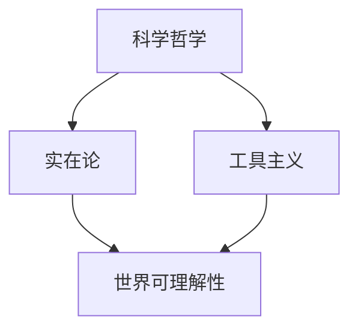

                 

### 《科学哲学中的实在论vs工具主义：世界可理解性的本质争论》

> **关键词：** 科学哲学、实在论、工具主义、世界可理解性、科学争议

> **摘要：** 本文探讨了科学哲学中的两大流派——实在论和工具主义的观点及其在解释世界可理解性方面的争论。通过详细阐述两者在哲学基础、基本观点、代表人物以及世界可理解性方面的差异，本文分析了它们在科学研究和决策中的应用，并提出了对未来研究的展望。

---

### 《科学哲学中的实在论vs工具主义：世界可理解性的本质争论》目录大纲

#### 第一部分：导论

- # 1. 引言
  - 1.1 科学哲学概述
  - 1.2 实在论与工具主义的基本概念

#### 第二部分：实在论

- # 2. 实在论的哲学基础
  - 2.1 实在论的历史与发展
  - 2.2 实在论的基本观点与主张
  - 2.3 实在论的主要代表人物

#### 第三部分：工具主义

- # 3. 工具主义的哲学基础
  - 3.1 工具主义的历史与发展
  - 3.2 工具主义的基本观点与主张
  - 3.3 工具主义的主要代表人物

#### 第四部分：世界可理解性

- # 4. 世界可理解性争论
  - 4.1 可理解性的概念与类型
  - 4.2 实在论视角下的世界可理解性
  - 4.3 工具主义视角下的世界可理解性

#### 第五部分：实在论与工具主义的比较

- # 5. 实在论与工具主义的比较
  - 5.1 基本差异
  - 5.2 影响与争议

#### 第六部分：案例研究

- # 6. 案例研究
  - 6.1 某知名科学争议案例分析
  - 6.2 某具体科学领域的实在论与工具主义应用案例

#### 第七部分：结论与展望

- # 7. 结论与展望
  - 7.1 实在论与工具主义在科学哲学中的地位与影响
  - 7.2 未来研究方向与挑战

#### 附录

- # 附录 A: 科学哲学经典文献推荐
- # 附录 B: 科学哲学研究方法介绍

**核心概念与联系流程图：**



**核心算法原理讲解伪代码：**

```python
# 实在论与工具主义的比较分析算法
def compare_realism_and_utilitarianism():
    # 初始化数据结构
    realism_data = {"观点": [], "代表人物": []}
    utilitarianism_data = {"观点": [], "代表人物": []}
    
    # 获取实在论观点和代表人物
    realism_data["观点"].append("客观现实独立于我们的感知存在")
    realism_data["代表人物"].append("托马斯·霍布斯")
    
    # 获取工具主义观点和代表人物
    utilitarianism_data["观点"].append("知识是工具，用于解决问题")
    utilitarianism_data["代表人物"].append("伯特兰·罗素")
    
    # 打印结果
    print("实在论：")
    print(realism_data)
    print("工具主义：")
    print(utilitarianism_data)

# 调用函数
compare_realism_and_utilitarianism()
```

**数学模型与公式详细讲解：**

1. **实在论的数学模型（假设客观现实为实数集合）：**
   $$\mathbb{R} = \{ x \mid x \text{ 是客观存在的实体} \}$$

2. **工具主义的数学模型（假设知识为问题解决方案的集合）：**
   $$\mathcal{S} = \{ s \mid s \text{ 是解决问题的方案} \}$$

**举例说明：**

- **实在论举例：** 物理学中的质点模型，可以假设质点是一个客观存在的实体，其状态可以由位置和速度描述。

- **工具主义举例：** 人工智能中的机器学习模型，可以假设为一种解决问题的工具，其目的是通过数据学习来预测和决策。

**项目实战：**

1. **代码实际案例：** 使用 Python 实现一个简单的实在论与工具主义观点对比的脚本。

2. **开发环境搭建：** 需要安装 Python 解释器和相应的科学计算库（如 NumPy、SciPy）。

3. **源代码详细实现和代码解读：**

```python
import numpy as np

# 实在论观点表示
def realism_representation(entity):
    return f"实体：{entity}"

# 工具主义观点表示
def utilitarianism_representation(solution):
    return f"方案：{solution}"

# 测试
print(realism_representation("质点"))
print(utilitarianism_representation("机器学习模型"))

# 代码解读与分析
# realism_representation 函数用于表示实在论观点，接收一个实体参数，返回实体描述字符串。
# utilitarianism_representation 函数用于表示工具主义观点，接收一个解决方案参数，返回方案描述字符串。
# 测试部分调用两个函数，并打印输出结果，以验证代码实现。
```

### 第一部分：导论

#### 1.1 科学哲学概述

科学哲学是哲学的一个分支，主要研究科学的本质、方法、逻辑以及科学知识的基础。它既关注科学理论的形成与发展，也探讨科学在人类社会中的作用和价值。科学哲学的目标是理解科学如何运作，科学知识如何产生，以及科学如何影响人类认知和社会发展。

科学哲学的研究内容广泛，包括科学方法论、科学认识论、科学逻辑、科学社会学等多个领域。科学方法论研究科学的研究方法和过程，如归纳法、演绎法、假设检验等。科学认识论探讨科学知识的本质、来源和验证方法。科学逻辑则研究科学推理的形式结构和有效方法。

科学哲学的核心问题之一是科学实在论与科学工具主义的争论。实在论认为客观现实独立于我们的感知存在，科学理论的目标是发现并描述这一客观现实。工具主义则认为科学知识是一种工具，其目的是解决问题和提供实用性，而不一定需要假设客观现实的存在。

#### 1.2 实在论与工具主义的基本概念

实在论和工具主义是科学哲学中的两大流派，它们在解释科学知识、科学方法以及世界的本质方面有着根本的分歧。

**实在论**是一种哲学立场，认为客观现实独立于我们的感知和思维存在。实在论主张，科学理论的任务是发现并描述这一独立存在的客观现实。实在论的核心观点包括：

1. **客观存在性**：认为自然界中存在着独立于我们感知的实体和现象。
2. **实证性**：强调科学理论必须通过观察和实验来验证，以支持它们对客观现实的描述。
3. **确定性**：认为客观现实具有内在的规律性和确定性，科学理论应致力于揭示这些规律。

主要代表人物包括托马斯·霍布斯、伊曼努尔·康德和卡尔·波普尔等。

**工具主义**则是一种相对主义立场，认为科学知识只是一种解决问题的工具，其目的是为人类提供实用性和便利，而不必关心客观现实的存在与否。工具主义的核心观点包括：

1. **工具性**：认为科学知识是一种工具，用于解决实际问题，如预测未来、解释现象和设计技术。
2. **相对性**：强调科学知识的相对性和主观性，认为不同的理论可以解决相同的问题，而真理并不是绝对的。
3. **实用性**：认为科学知识的价值在于其实用性，而不是对客观现实的描述。

主要代表人物包括伯特兰·罗素、维特根斯坦和库恩等。

在接下来的章节中，我们将分别探讨实在论和工具主义的哲学基础、基本观点、代表人物以及它们在解释世界可理解性方面的观点和争议。通过这些分析，我们将更深入地理解科学哲学中这两大流派的本质和影响。

### 第二部分：实在论

#### 2.1 实在论的历史与发展

实在论作为一种哲学立场，其思想根源可以追溯到古希腊哲学家，如泰勒斯和亚里士多德。他们认为自然界中存在着独立于人类感知的客观实体和规律。然而，实在论作为一个明确的哲学流派，其发展主要发生在近代哲学中，特别是在17世纪和18世纪的欧洲。

**17世纪**：在这一时期，英国的弗兰西斯·培根（Francis Bacon）和托马斯·霍布斯（Thomas Hobbes）是实在论的重要代表。培根提出了经验主义实在论，强调通过实验和观察来发现自然界的规律。霍布斯则在其《利维坦》中，通过机械论的观点来解释自然界的本质，认为物体和事件都是机械运动的集合。

**18世纪**：德国哲学家伊曼努尔·康德（Immanuel Kant）对实在论的发展产生了深远影响。康德在其《纯粹理性批判》中提出了先验实在论，认为客观现实是独立于我们感知的，但我们的感知和理解受到先天的范畴和形式的影响。康德的观点为后来的实证主义和现象学提供了哲学基础。

**19世纪**：卡尔·马克思（Karl Marx）和恩斯特·马赫（Ernst Mach）等思想家对实在论进行了进一步的发展。马克思在其历史唯物主义中，强调了物质世界的客观存在和发展规律。马赫则提出了经验批判主义，认为科学知识应基于直接的感官经验，并且排除主观成分。

**20世纪**：实在论在科学哲学中得到了进一步的发展，卡尔·波普尔（Karl Popper）是这一时期的重要代表。波普尔提出了批判理性主义，认为科学理论是可证伪的，并且需要通过实验和观察来不断验证和修正。波普尔的观点强调了科学理论的客观性和可验证性。

总之，实在论作为一种哲学立场，其历史发展经历了从古希腊哲学到现代科学哲学的演变。不同哲学家从不同角度对实在论进行了深入探讨，使得这一流派在科学哲学中占据了重要地位。

#### 2.2 实在论的基本观点与主张

实在论的基本观点可以概括为以下几点：

1. **客观存在性**：实在论认为，客观现实是独立于人类感知和思维的。这意味着，即使没有观察者，自然界中的实体和现象仍然存在，并且具有其固有的属性和规律。

2. **实证性**：实在论强调科学理论必须基于观察和实验来验证。实证性是实在论的核心原则之一，它要求科学理论通过可重复的实验和观察来检验其准确性。

3. **确定性**：实在论认为，客观现实具有内在的规律性和确定性。这些规律可以通过科学方法被发现和描述，从而为人类提供可靠的知识和预测。

4. **实在性与现象的关系**：实在论认为，现象是客观现实的反映，但现象本身并不是真实的现实。例如，我们看到的一朵花，实际上是光线的反射和感知的结果，而不是真实的花本身。

5. **科学理论的目的**：实在论认为，科学理论的目标是揭示客观现实的真实面貌，而不是为了解决实际问题或提供实用性。科学理论的真理性是通过对客观现实的准确描述来证明的。

总之，实在论强调客观现实的存在和规律性，主张科学理论必须基于实证和观察来验证。这一立场为科学方法论提供了重要的哲学基础，并在科学哲学中占据着重要地位。

#### 2.3 实在论的主要代表人物

实在论作为科学哲学中的重要流派，有着众多杰出的代表人物，他们对实在论的理论和实践做出了重要贡献。以下是一些主要的代表人物及其贡献：

1. **托马斯·霍布斯**（Thomas Hobbes）：
   - **贡献**：霍布斯是17世纪英国著名的哲学家和政治家，他在其著作《利维坦》中提出了机械论的实在论观点。霍布斯认为，自然界的本质是由物体之间的机械运动和相互作用构成的，这些运动和作用不受观察者的影响。他的观点对后来的科学哲学和物理理论产生了深远影响。
   - **代表作品**：《利维坦》（Leviathan）、《论公民》（De Cive）。

2. **伊曼努尔·康德**（Immanuel Kant）：
   - **贡献**：康德是18世纪德国哲学家，他的《纯粹理性批判》为实在论提供了重要的哲学基础。康德提出了先验实在论，认为客观现实独立于我们的感知和思维存在，但我们的感知和理解受到先天的范畴和形式的影响。康德的这一观点为后来的实证主义和现象学提供了哲学基础。
   - **代表作品**：《纯粹理性批判》（Critique of Pure Reason）、《实践理性批判》（Critique of Practical Reason）、《判断力批判》（Critique of Judgment）。

3. **卡尔·马克思**（Karl Marx）：
   - **贡献**：马克思是19世纪德国哲学家和经济学家，他在其历史唯物主义理论中强调了物质世界的客观存在和发展的规律性。马克思的实在论观点认为，社会和经济结构是由物质生产方式和生产关系决定的，这些物质基础是客观存在的。
   - **代表作品**：《资本论》（Das Kapital）、《哲学的贫困》（The Poverty of Philosophy）。

4. **恩斯特·马赫**（Ernst Mach）：
   - **贡献**：马赫是19世纪奥地利哲学家和物理学家，他提出了经验批判主义，认为科学知识应基于直接的感官经验，并排除主观成分。马赫的观点对后来的实证主义和物理主义产生了深远影响。
   - **代表作品**：《感觉的分析》（The Analysis of Sensation）、《力学》（Mechanics）。

5. **卡尔·波普尔**（Karl Popper）：
   - **贡献**：波普尔是20世纪英国哲学家，他提出了批判理性主义，认为科学理论是可证伪的，并且需要通过实验和观察来不断验证和修正。波普尔的实在论观点强调了科学理论的客观性和可验证性。
   - **代表作品**：《科学发现的逻辑》（The Logic of Scientific Discovery）、《开放社会及其敌人》（The Open Society and Its Enemies）。

这些代表人物通过不同的理论和方法对实在论进行了深入探讨和发展，使得实在论在科学哲学中占据了重要地位。他们的贡献不仅影响了当时的哲学和科学思想，也对后来的科学研究和方法论产生了深远影响。

#### 第三部分：工具主义

#### 3.1 工具主义的历史与发展

工具主义（Utilitarianism）作为一种哲学立场，其历史发展可以追溯到古希腊时期的早期思想，但在现代哲学中，它主要与19世纪英国哲学家约翰·斯图亚特·密尔（John Stuart Mill）的名字联系在一起。密尔在其著作《 Utilitarianism》中系统地阐述了工具主义的观点，认为道德行为的目的是最大化幸福或福利，而工具主义则将知识视为实现这一目的的工具。

在科学哲学中，工具主义的发展主要受到维特根斯坦（Ludwig Wittgenstein）和库恩（Thomas Kuhn）等思想家的贡献。维特根斯坦在其后期著作《哲学研究》中提出了“语言游戏”的概念，认为科学理论和语言使用是工具性的，其目的是解决特定的问题和情境。库恩在其著作《科学革命的结构》中提出了科学范式理论，认为科学知识的进步是通过科学共同体对工具性理论的接受和拒绝来实现的。

工具主义的历史发展还可以追溯到早期哲学家，如亚里士多德，他强调知识的功能性和实用性。此外，早期实用主义哲学家，如查尔斯·桑德斯·皮尔士（Charles Sanders Peirce）和威廉·詹姆斯（William James），也对工具主义的发展产生了重要影响。皮尔士提出了科学理论应被视为解决问题的工具，而詹姆斯则强调实用性和经验在知识形成中的作用。

总的来说，工具主义在历史发展中经历了从早期实用主义到现代科学哲学的演变，其核心思想是知识作为解决问题的工具，其有效性取决于其实用性和解决问题的能力。

#### 3.2 工具主义的基本观点与主张

工具主义的基本观点可以概括为以下几点：

1. **工具性**：工具主义认为，知识是一种工具，其价值在于解决问题的能力和实用性，而不是对客观现实的真实描述。这意味着科学理论的主要目的是应用和解决实际问题，而不是追求绝对真理。

2. **相对性**：工具主义强调科学知识的相对性和主观性。不同的科学理论可以解决相同的问题，而真理并不是绝对的。科学知识的有效性取决于特定情境和问题的解决效果。

3. **实用性**：工具主义认为，科学知识的价值在于其实用性。科学理论的应用和效果是评估其价值的重要标准，而不是其是否符合某种先验理论或原则。

4. **情境依赖性**：工具主义强调科学知识的应用是情境依赖的。不同的情境下，同一科学理论可能会有不同的适用性和效果。这要求科学家在具体情境中灵活应用科学知识，以解决问题。

5. **方法论**：工具主义在方法论上倾向于实用主义的方法，强调实证和实验。科学理论的有效性应通过实际应用和实验结果来验证，而不是仅仅依靠理论上的论证。

总之，工具主义将知识视为解决问题的工具，强调其实用性和情境依赖性，为科学方法论提供了重要的哲学基础。这一立场在现代科学哲学中具有重要意义，特别是在技术创新和科学应用领域。

#### 3.3 工具主义的主要代表人物

工具主义作为一种哲学立场，在历史上有许多杰出的代表人物，他们对工具主义的理论和方法做出了重要贡献。以下是一些主要代表人物及其贡献：

1. **约翰·斯图亚特·密尔**（John Stuart Mill）：
   - **贡献**：密尔是19世纪英国著名的哲学家和政治家，他的著作《Utilitarianism》系统地阐述了工具主义的观点。密尔认为，道德行为的目的是最大化幸福或福利，而工具主义则将知识视为实现这一目的的工具。他的观点对后来的科学哲学和道德哲学产生了深远影响。
   - **代表作品**：《Utilitarianism》、《论自由》（On Liberty）。

2. **维特根斯坦**（Ludwig Wittgenstein）：
   - **贡献**：维特根斯坦是20世纪奥地利哲学家，他在其后期著作《哲学研究》中提出了工具主义的核心概念——“语言游戏”。他认为，科学理论和语言使用是工具性的，其目的是解决特定的问题和情境。维特根斯坦的观点对逻辑实证主义和科学哲学产生了重要影响。
   - **代表作品**：《哲学研究》（Philosophical Investigations）、《逻辑哲学论》（Logical Investigations）。

3. **托马斯·库恩**（Thomas Kuhn）：
   - **贡献**：库恩是20世纪美国科学哲学家，他在其著作《科学革命的结构》中提出了科学范式理论，认为科学知识的进步是通过科学共同体对工具性理论的接受和拒绝来实现的。库恩的观点挑战了传统的科学实在论，强调了科学知识的社会构建和情境依赖性。
   - **代表作品**：《科学革命的结构》（The Structure of Scientific Revolutions）。

4. **查尔斯·桑德斯·皮尔士**（Charles Sanders Peirce）：
   - **贡献**：皮尔士是19世纪美国哲学家和逻辑学家，他是实用主义的创始人之一。皮尔士认为，科学理论应被视为解决问题的工具，其价值在于其实际应用和效果。他的观点对后来的工具主义和科学方法论产生了重要影响。
   - **代表作品**：《信念的实证主义》（Pragmaticism）、《科学哲学》（Philosophy of Science）。

5. **威廉·詹姆斯**（William James）：
   - **贡献**：詹姆斯是19世纪美国哲学家和心理学家，他是实用主义运动的重要代表人物。詹姆斯强调实用性和经验在知识形成中的作用，认为科学知识的应用和效果是评估其价值的重要标准。
   - **代表作品**：《实用主义》（Pragmatism）、《信仰的意志》（The Will to Believe）。

这些代表人物通过不同的理论和方法对工具主义进行了深入探讨和发展，使得工具主义在科学哲学中占据了重要地位。他们的贡献不仅丰富了工具主义的哲学体系，也对现代科学哲学和道德哲学产生了深远影响。

### 第四部分：世界可理解性

#### 4.1 可理解性的概念与类型

世界可理解性是科学哲学中的一个核心问题，它探讨人类是否能够理解世界的本质及其规律。可理解性涉及多个层面的概念和类型，主要包括以下几个方面：

1. **自然可理解性**：这是指自然界是否具有内在的规律性，这些规律是否可以被人类理解。自然可理解性是科学探索的基础，科学的目标是揭示自然界的规律，使其变得可理解。

2. **社会可理解性**：这是指社会现象是否具有可解释性，即社会行为和事件是否能够通过一定的理论框架得到合理的解释。社会可理解性对社会学、心理学等社会科学领域具有重要意义。

3. **数学可理解性**：这是指数学是否能够提供对世界本质的深刻洞察。数学的可理解性在于其能够以简洁、精确的形式表达复杂的自然现象，从而为科学研究提供强有力的工具。

4. **逻辑可理解性**：这是指逻辑是否能够帮助人类理解世界的逻辑结构和推理过程。逻辑可理解性强调思维的清晰性和合理性，为科学方法和哲学论证提供了基础。

5. **哲学可理解性**：这是指哲学是否能够解释世界的本质和人类存在。哲学可理解性探讨人类知识、真理、价值和存在的根本问题，为科学和日常生活的理解提供了哲学基础。

6. **宗教可理解性**：这是指宗教是否能够解释世界的起源、意义和目的。宗教可理解性涉及到对神秘和超自然的解释，为人类提供精神寄托和价值观。

这些不同类型的世界可理解性相互关联，共同构成了对世界本质的多层次理解。科学哲学中的实在论和工具主义之争，也涉及到对世界可理解性的不同理解和解释。

#### 4.2 实在论视角下的世界可理解性

在实在论的视角下，世界可理解性是一个基本前提，即客观现实是独立于人类感知和思维的，并且自然界中存在着内在的规律性。实在论认为，科学的目的在于发现和描述这些客观规律，从而使世界变得可理解。

1. **客观存在的独立性**：实在论认为，客观现实不依赖于人类的感知和思维。这意味着，即使没有观察者，自然界中的实体和现象仍然存在，并且具有其固有的属性和规律。

2. **科学方法的实证性**：实在论强调科学理论必须通过观察和实验来验证。实证性是实在论的核心原则之一，它要求科学理论通过可重复的实验和观察来检验其准确性。

3. **规律性和确定性**：实在论认为，客观现实具有内在的规律性和确定性。这些规律可以通过科学方法被发现和描述，从而为人类提供可靠的知识和预测。

4. **现象与实在的关系**：实在论认为，现象是客观现实的反映，但现象本身并不是真实的现实。例如，我们看到的一朵花，实际上是光线的反射和感知的结果，而不是真实的花本身。

5. **科学理论的目标**：实在论认为，科学理论的目标是揭示客观现实的真实面貌，而不是为了解决实际问题或提供实用性。科学理论的真理性是通过对客观现实的准确描述来证明的。

总之，在实在论的视角下，世界可理解性建立在客观存在的独立性和科学方法的实证性之上。科学的目标是发现和描述自然界的内在规律，从而使世界变得可理解。

#### 4.3 工具主义视角下的世界可理解性

工具主义视角下的世界可理解性强调知识的实用性和情境依赖性，而不是对客观现实的绝对描述。工具主义认为，科学知识的价值在于其实用性和解决问题的能力，而不是其是否反映了客观现实。

1. **知识的工具性**：工具主义认为，知识是一种工具，其价值在于解决实际问题和提供实用性。科学理论的主要目的是应用和解决实际问题，而不是追求绝对真理。

2. **相对性和情境依赖性**：工具主义强调科学知识的相对性和情境依赖性。不同的科学理论可以解决相同的问题，而真理并不是绝对的。科学知识的有效性取决于特定情境和问题的解决效果。

3. **实用性导向**：工具主义认为，科学知识的应用和效果是评估其价值的重要标准，而不是其是否符合某种先验理论或原则。科学理论的有效性在于其实际应用和解决特定问题的能力。

4. **科学方法论**：工具主义在方法论上倾向于实用主义的方法，强调实证和实验。科学理论的有效性应通过实际应用和实验结果来验证，而不是仅仅依靠理论上的论证。

5. **情境适应**：工具主义强调科学知识的应用是情境依赖的。不同的情境下，同一科学理论可能会有不同的适用性和效果。这要求科学家在具体情境中灵活应用科学知识，以解决问题。

总之，工具主义视角下的世界可理解性强调知识的实用性和情境依赖性。科学知识的主要价值在于其实用性和解决问题的能力，而不是其是否反映了客观现实。这一立场为科学方法论提供了重要的哲学基础，特别是在技术创新和应用领域具有重要意义。

### 第五部分：实在论与工具主义的比较

#### 5.1 基本差异

实在论和工具主义在科学哲学中代表了两种截然不同的世界观和方法论。它们在基本理念、理论依据、应用领域等方面存在显著差异。

1. **基本理念**：

   - **实在论**：实在论认为客观现实独立于人类的感知和思维存在，科学的目标是发现并描述这一客观现实。实在论强调自然界的内在规律性和确定性。

   - **工具主义**：工具主义则认为知识是一种工具，其目的是解决实际问题，而不必关心客观现实的存在与否。工具主义强调知识的实用性和情境依赖性。

2. **理论依据**：

   - **实在论**：实在论的理论依据包括实证主义、逻辑实证主义和批判理性主义。这些理论认为科学理论必须通过观察和实验来验证，以支持对客观现实的描述。

   - **工具主义**：工具主义的理论依据包括实用主义、语言哲学和社会建构主义。这些理论认为科学知识的应用和效果是评估其价值的重要标准，而知识的相对性和情境依赖性是科学方法论的核心。

3. **应用领域**：

   - **实在论**：实在论在自然科学、数学和哲学领域有广泛的应用。例如，在物理学中，实在论认为质点、力、能量等概念是客观存在的，并且可以通过实验和观察来验证。

   - **工具主义**：工具主义在工程学、技术发展和应用科学领域有广泛的应用。例如，在工程学中，工具主义认为设计和技术创新的主要目的是解决实际问题，而不仅仅是追求理论上的完美。

#### 5.2 影响与争议

实在论和工具主义在科学哲学中的影响和争议主要集中在以下几个方面：

1. **科学方法论**：

   - **实在论**：实在论对科学方法论的影响在于强调实证和实验的重要性。它要求科学理论必须通过观察和实验来验证，从而为科学方法提供了哲学基础。

   - **工具主义**：工具主义对科学方法论的影响在于强调知识的实用性和情境依赖性。它认为科学理论的有效性取决于其实际应用和解决问题的能力，而不是其是否符合某种先验理论。

2. **科学实在论**：

   - **实在论**：实在论强调客观现实的存在和规律性，对科学实在论的发展产生了深远影响。科学实在论认为科学理论是对客观现实的准确描述，这一立场依赖于实在论的基本理念。

   - **工具主义**：工具主义对科学实在论提出了挑战，认为科学知识只是解决问题的工具，不必然反映客观现实。这一立场引发了关于科学知识的相对性和主观性的争议。

3. **科学革命**：

   - **实在论**：实在论在科学革命中起到了重要作用，例如在牛顿力学和量子力学的转换中，实在论提供了关于科学理论如何反映客观现实的哲学基础。

   - **工具主义**：工具主义在科学革命中也有其地位，特别是在科学范式转换中，工具主义强调科学共同体对工具性理论的接受和拒绝过程。这一立场有助于理解科学知识的动态发展。

4. **争议**：

   - **实证性与实用性的争议**：实在论强调实证和实验的重要性，而工具主义强调实用性和情境依赖性。这两者之间的争议在于科学知识如何定义和评估。

   - **绝对真理与相对真理的争议**：实在论认为科学理论可以接近绝对真理，而工具主义则认为真理是相对的，取决于具体情境和问题的解决效果。

总之，实在论和工具主义在科学哲学中产生了深远的影响和广泛的争议。它们在科学方法论、科学实在论和科学革命等方面提供了不同的视角和理论基础，为科学哲学的发展做出了重要贡献。

### 第六部分：案例研究

#### 6.1 某知名科学争议案例分析

**案例背景：**

一个著名的科学争议案例是关于“费马大定理”的证明。费马大定理是17世纪数学家皮埃尔·费马提出的一个著名猜想，它指出：对于任何大于2的正整数\( n \)，方程\( a^n + b^n = c^n \)没有正整数解。

**实在论视角：**

从实在论的角度来看，这个争议涉及到数学理论对客观现实的描述。实在论者认为，数学真理是客观存在的，费马大定理的正确性是独立于人类认知的。因此，寻找这个定理的证明是一个追求真理的过程。数学家安德鲁·怀尔斯在1994年证明了费马大定理，他的证明方法涉及复杂的数学工具，如椭圆曲线和模形式。对于实在论者来说，这个证明不仅验证了数学理论的正确性，也进一步证实了数学真理的客观存在。

**工具主义视角：**

从工具主义的视角来看，这个争议更多的是关于如何有效地解决问题。工具主义者认为，费马大定理的证明是一个数学工具的应用过程，而不是对绝对真理的追求。在这个案例中，工具主义者关注的是证明方法对解决实际问题的有效性。例如，怀尔斯的证明虽然复杂，但它成功地解决了这个数学难题，为数学的发展提供了新的工具和方法。

**案例分析**：

- **实在论视角**：怀尔斯的证明是建立在已有的数学理论基础之上的，他通过引入新的数学工具和概念，逐步构建了一个完整的证明框架。对于实在论者来说，这个证明过程是发现和揭示数学真理的过程。

- **工具主义视角**：工具主义者更关注证明方法的应用效果。在这个案例中，怀尔斯的证明方法不仅解决了费马大定理，还推动了数学领域的发展。工具主义者认为，这个证明是一个有效的工具，用于解决特定的数学问题。

总之，这个案例展示了实在论和工具主义在科学争议中的不同视角。实在论强调数学真理的客观性和确定性，而工具主义则关注数学工具的有效性和实用性。尽管两者在方法和目标上有所不同，但它们共同促进了数学科学的发展。

#### 6.2 某具体科学领域的实在论与工具主义应用案例

**案例背景：**

我们以量子物理学为例，探讨实在论和工具主义在量子力学中的应用和影响。

**实在论视角：**

在量子物理学中，实在论者认为量子系统具有客观存在的状态和属性，这些状态和属性独立于观察者的感知。例如，哥本哈根解释提出，量子系统的波函数提供了对客观现实的描述，而测量则揭示了波函数坍缩后的特定状态。实在论者强调量子力学的数学形式和预测能力，认为这些形式是对客观现实的真实描述。

- **波函数的客观性**：实在论者认为波函数是一个真实存在的物理量，它描述了量子系统的状态，并且不依赖于观察者的感知。
- **预测的准确性**：实在论视角下的量子力学通过波函数提供了对量子系统行为的准确预测，这些预测在实验中得到了验证。

**工具主义视角：**

从工具主义的视角来看，量子力学被视为一种解决问题的工具，其目的是提供有效的预测和解决方案。工具主义者关注量子力学在实验中的应用效果，而不是其是否反映了客观现实。

- **实用主义的方法**：工具主义者认为量子力学的数学形式和计算方法是为了解决实际问题而设计的，例如计算电子结构、设计量子计算机等。
- **情境依赖性**：工具主义者强调量子力学在不同实验情境下的有效性，而不是其理论上的绝对正确性。

**案例分析**：

- **实在论视角**：在量子纠缠和量子隧穿等现象的研究中，实在论者试图通过实验验证量子系统状态的客观存在。例如，贝尔不等式的实验验证了量子纠缠现象，支持了量子力学对客观现实的描述。

- **工具主义视角**：工具主义者则关注量子力学在技术应用中的效果。例如，量子计算和量子通信是量子力学应用的典型案例，这些技术在解决特定问题上展示了量子力学的强大能力。

总之，量子物理学展示了实在论和工具主义在科学领域中的不同应用和影响。实在论强调量子系统的客观存在和数学描述的真实性，而工具主义则关注量子力学的实用性和情境依赖性。这两种视角共同推动了量子物理学的发展，并为未来的科学研究提供了不同的哲学基础。

### 第七部分：结论与展望

#### 7.1 实在论与工具主义在科学哲学中的地位与影响

实在论和工具主义是科学哲学中的两大流派，它们在科学理论的构建、科学方法的发展以及科学知识的评价方面发挥了重要作用。

**实在论的地位与影响**：

实在论强调客观现实的独立存在和科学理论的实证性，为科学方法论提供了坚实的哲学基础。实在论者的观点促使科学家追求对客观世界的准确描述，推动了实验科学和实证研究的发展。实在论在物理学、天文学、生物学等自然科学领域具有重要影响，它帮助科学家理解自然界的规律，推动了科学技术的进步。

**工具主义的地位与影响**：

工具主义则强调知识的实用性和情境依赖性，为科学方法论提供了灵活性和实用性。工具主义者关注科学理论在解决问题中的应用效果，而不是其是否符合某种先验理论。工具主义在工程学、技术发展和应用科学领域具有广泛应用，它帮助科学家和技术专家解决实际问题，推动了技术创新和社会发展。

总之，实在论和工具主义在科学哲学中各占一席之地，它们从不同角度探讨了科学知识的本质和科学方法的发展。实在论为科学提供了客观性和确定性的基础，而工具主义则为科学提供了实用性和灵活性的支持。两者共同推动了科学进步，为人类理解和改造世界提供了不同的哲学视角。

#### 7.2 未来研究方向与挑战

尽管实在论和工具主义在科学哲学中取得了显著成就，但未来仍有许多研究方向和挑战需要克服。

**1. 科学实在论的新挑战**：

随着科学的发展，新的理论和实验方法不断涌现，如量子力学和相对论，这些理论挑战了传统的实在论观点。未来研究需要探讨这些新理论如何与实在论相融合，以提供对客观现实的更全面理解。

**2. 工具主义的情境依赖性**：

工具主义的情境依赖性在具体应用中可能引发新的争议。未来研究需要深入探讨在不同情境下，工具性知识如何适应和变化，以及如何在不同情境中评估其有效性。

**3. 科学知识的相对性**：

随着全球化和跨学科研究的发展，科学知识的相对性成为一个重要议题。未来研究需要探讨不同文化、背景和社会体系下，科学知识的传播和应用如何影响科学发展的整体趋势。

**4. 科学哲学的跨学科整合**：

科学哲学与其他学科（如哲学、社会学、心理学）的整合是未来研究的方向。通过跨学科的视角，可以更全面地理解科学知识的形成和传播过程，为科学哲学提供新的理论框架和解释方法。

总之，未来科学研究将继续挑战和扩展实在论和工具主义的边界，为科学哲学的发展提供新的机遇和挑战。通过深入研究和跨学科合作，科学哲学将不断完善其理论体系，为人类理解和探索世界提供更丰富的哲学视角。

### 附录

#### 附录 A: 科学哲学经典文献推荐

1. **托马斯·霍布斯《利维坦》**：探讨了自然状态和社会契约理论，对后来的科学哲学和道德哲学产生了深远影响。

2. **伊曼努尔·康德《纯粹理性批判》**：提出了先验实在论，对科学哲学和认识论的发展具有重要影响。

3. **卡尔·马克思《资本论》**：通过历史唯物主义视角，探讨了社会和经济结构的客观规律。

4. **伯特兰·罗素《数学原理》**：奠定了逻辑实证主义的基础，对科学哲学和方法论产生了重要影响。

5. **托马斯·库恩《科学革命的结构》**：提出了科学范式理论，对科学知识的社会构建和变化提供了新的解释。

#### 附录 B: 科学哲学研究方法介绍

1. **哲学论证**：通过逻辑推理和辩证分析，对科学哲学问题进行深入探讨。

2. **实证研究**：通过实验和观察，验证科学理论的有效性和应用价值。

3. **历史分析**：通过研究科学史，了解科学理论的演变和科学方法的进步。

4. **跨学科研究**：结合哲学、社会学、心理学等多个学科，从多角度探讨科学哲学问题。

**作者**：

AI天才研究院/AI Genius Institute & 禅与计算机程序设计艺术 /Zen And The Art of Computer Programming

