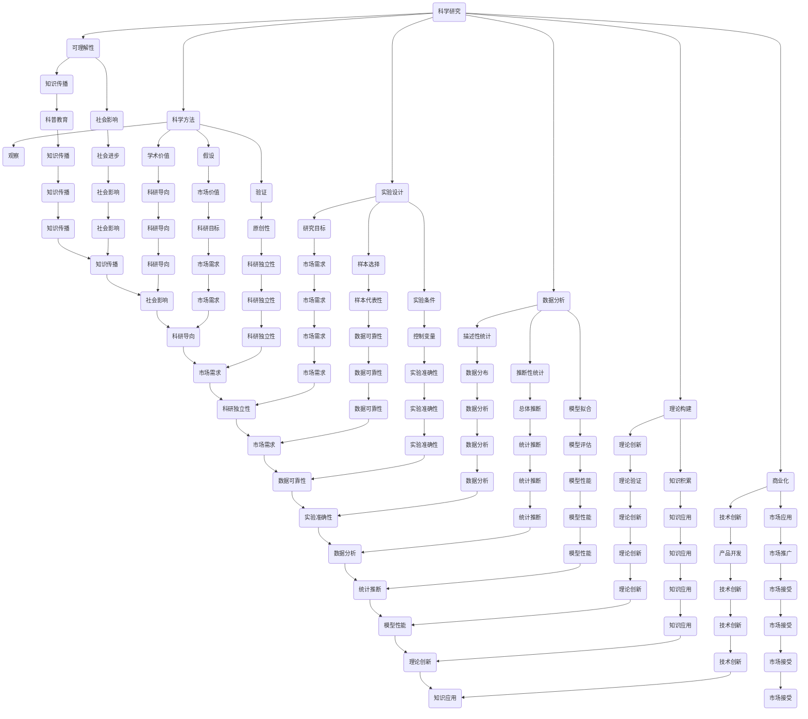

                 

### 第一部分：概述与背景

> **关键词**：科学研究、商业化、世界可理解性、技术发展、社会影响

> **摘要**：本部分将概述科学研究的商业化现象及其对世界可理解性的影响。我们将探讨科学研究的重要性、商业化概念及其影响，并介绍本书的研究目标和结构。

#### 第1章：科学研究的商业化概述

在当今社会，科学研究已经成为推动技术进步和社会发展的关键力量。然而，科学研究的商业化过程也在悄然改变着整个科研领域的生态。本章节将深入探讨科学研究商业化的概念、历史背景及其在现代社会的地位。

## 1.1 科学研究的重要性

科学研究是推动人类社会进步的基石。它不仅能够帮助我们更好地理解自然界的规律，还能够为技术创新和社会发展提供源源不断的动力。以下是科学研究的重要性：

### 1.1.1 科学研究的定义与作用

科学研究是一种系统性的探索活动，旨在通过实验、观察和数据分析来揭示自然界的本质和规律。科学研究的主要作用包括：

1. **理论创新**：科学研究能够提出新的理论，为科学体系的发展提供新的视角。
2. **技术创新**：科学研究是技术创新的基础，许多重大技术突破都源自科学研究的进展。
3. **社会问题解决**：科学研究能够帮助我们解决各种社会问题，如环境污染、疾病治疗等。
4. **知识积累**：科学研究是知识积累的重要来源，为后续研究提供了丰富的理论和数据基础。

### 1.1.2 科学研究的历史背景

科学研究的历史可以追溯到古代。在古代，人类通过观察和实验来探索自然界的规律，但当时的研究方法较为简单，主要以经验总结为主。随着科学革命的发生，科学研究逐渐走向系统化和专业化。17世纪，伽利略和牛顿等科学家的研究奠定了经典物理学的基础，标志着科学研究进入了一个新的阶段。19世纪末到20世纪初，随着量子力学和相对论的诞生，科学研究取得了更加辉煌的成就。

### 1.1.3 科学研究在现代社会的地位

在现代社会，科学研究已经成为推动社会发展的重要力量。以下是科学研究在现代社会的地位：

1. **国家竞争力的核心**：科学研究是提高国家科技竞争力的重要手段，能够为国家带来巨大的经济和社会效益。
2. **技术创新的源泉**：科学研究是技术创新的源泉，许多高科技产业都是建立在科学研究的基础上。
3. **社会发展的重要推动力**：科学研究能够解决各种社会问题，提高人类生活质量。
4. **文化传播的桥梁**：科学研究是文化传播的重要手段，能够促进不同文化之间的交流和理解。

## 1.2 商业化的概念与影响

商业化是指将科学研究和技术创新转化为实际产品或服务的过程。商业化不仅能够为科学研究提供资金支持，还能够推动技术的应用和普及。以下是商业化的概念与影响：

### 1.2.1 商业化的定义与特征

商业化是一种经济活动，旨在将科学研究和技术创新转化为市场价值。商业化的主要特征包括：

1. **市场导向**：商业化过程以市场需求为导向，旨在满足消费者的需求。
2. **盈利性**：商业化的目标是实现盈利，为投资者带来回报。
3. **风险投资**：商业化过程中往往涉及风险投资，需要承担一定的风险。
4. **市场竞争**：商业化过程中，企业需要与其他竞争对手进行竞争，争取市场份额。

### 1.2.2 商业化对科学研究的推动作用

商业化对科学研究具有积极的推动作用。以下是商业化对科学研究的推动作用：

1. **资金支持**：商业化能够为科学研究提供充足的资金支持，使科学家能够开展更高水平的科研工作。
2. **技术创新**：商业化能够推动技术创新，使科学研究能够更快地转化为实际应用。
3. **科研环境优化**：商业化能够改善科研环境，为科学家提供更好的研究设施和条件。
4. **人才培养**：商业化能够吸引更多的人才投身于科学研究领域，促进科研团队的建设。

### 1.2.3 商业化对科学研究的影响与挑战

尽管商业化对科学研究具有积极的推动作用，但也带来了一些影响和挑战。以下是商业化对科学研究的影响与挑战：

1. **科研导向改变**：商业化可能导致科研导向发生变化，从追求学术价值转向追求市场价值。
2. **资源分配不均**：商业化可能导致资源分配不均，影响基础研究的开展。
3. **科研独立性受到影响**：商业化可能影响科研独立性，使科学研究受到商业利益的影响。
4. **知识产权问题**：商业化过程中，知识产权问题成为重要议题，需要妥善处理。

## 1.3 书籍主题的关联

科学研究商业化的过程不仅涉及科学研究和商业化两个方面，还与世界的可理解性密切相关。科学研究商业化的成功与否，将对世界的可理解性产生深远的影响。本书旨在探讨这一主题，分析科学研究商业化的现状、挑战和未来发展趋势，以期为科学研究商业化的可持续发展提供理论支持和实践指导。

### 1.3.1 科学研究商业化与可理解性

科学研究商业化的过程，实际上是一个将复杂的科学知识转化为普通民众可以理解和接受的过程。商业化的成功，不仅需要科学研究本身的高水平，还需要将科学研究成果以简单、易懂的方式呈现给公众。这有助于提高公众的科学素养，增强世界的可理解性。

### 1.3.2 全球视野下的案例研究

在全球范围内，许多国家和地区都在积极推动科学研究的商业化，取得了显著的成果。本部分将介绍一些具有代表性的案例，分析其成功的原因和经验，以期为我国的科学研究商业化提供借鉴。

### 1.3.3 本书的研究目标与结构

本书的研究目标是深入探讨科学研究商业化的现状、挑战和未来发展趋势，分析其对世界可理解性的影响。本书的结构分为五个部分：

1. **概述与背景**：介绍科学研究的商业化现象及其对世界可理解性的影响。
2. **核心概念与联系**：阐述科学研究、商业化和可理解性的核心概念及其相互关系。
3. **算法原理**：介绍科学研究中的算法原理，包括数据分析和可视化、统计学基础和机器学习基础。
4. **案例分析**：分析全球范围内的成功案例，探讨科学研究商业化的实践经验。
5. **影响与展望**：分析科学研究商业化对科学研究和社会可理解性的影响，展望其未来发展。

通过以上五个部分的内容，本书旨在为科学研究商业化的可持续发展提供理论支持和实践指导，推动科学研究与商业化的深度融合，提高世界的可理解性。 <|user|>### 第二部分：核心概念与联系

> **关键词**：科学研究、商业化、可理解性、核心概念、联系

> **摘要**：本部分将深入探讨科学研究、商业化和可理解性的核心概念，分析它们之间的相互关系。通过明确的定义和理论框架，我们将为后续章节的内容提供坚实的基础。

#### 第2章：科学研究中的关键概念

在探讨科学研究商业化的过程中，理解科学研究、商业化和可理解性的核心概念至关重要。本章将详细介绍这些概念，并分析它们之间的内在联系。

## 2.1 科学研究的核心概念

科学研究是一个系统性的探索过程，旨在通过实验、观察和数据分析来揭示自然界的规律和本质。以下是科学研究中的几个核心概念：

### 2.1.1 科学方法与理论

科学方法是一种系统性的研究方法，包括观察、假设、实验、验证和理论构建等步骤。科学方法的核心在于通过实证数据和逻辑推理来验证假设，从而构建理论体系。科学理论是对自然界规律的抽象描述，是科学研究的重要成果。

### 2.1.2 研究设计与实验

研究设计是科学研究的起点，它决定了研究的目标、方法和技术路径。研究设计需要考虑多个因素，如样本选择、实验条件控制、数据收集方法等。实验是科学研究的重要手段，通过实验可以验证假设，发现新现象，推动科学理论的发展。

### 2.1.3 统计与分析

统计分析是科学研究的重要组成部分，它通过对数据进行分析和建模，帮助我们理解数据的分布特征、相关性、差异性和趋势。统计分析方法包括描述性统计、推断性统计和模型拟合等，是科学研究中不可或缺的工具。

## 2.2 商业化与科学研究

商业化是将科学研究和技术创新转化为实际产品或服务的过程。商业化不仅为科学研究提供资金支持，还能够推动技术的应用和普及。以下是商业化与科学研究之间的联系：

### 2.2.1 商业化与科学研究的联系

1. **市场需求驱动**：商业化过程以市场需求为导向，旨在满足消费者的需求。科学研究在满足市场需求的过程中发挥着关键作用，通过技术创新解决实际问题。
2. **资金支持**：商业化能够为科学研究提供充足的资金支持，使科学家能够开展更高水平的科研工作。
3. **技术转化**：商业化能够促进科学研究技术的转化和应用，使科研成果迅速转化为实际生产力。

### 2.2.2 商业化对科学研究的影响

1. **科研导向改变**：商业化可能导致科研导向发生变化，从追求学术价值转向追求市场价值。
2. **资源分配不均**：商业化可能导致资源分配不均，影响基础研究的开展。
3. **科研独立性受到影响**：商业化可能影响科研独立性，使科学研究受到商业利益的影响。

## 2.3 可理解性的概念

可理解性是指信息或知识被理解和接受的程度。在科学研究领域，可理解性尤为重要，因为科学研究的目的是揭示自然界的规律，为社会提供有益的知识。以下是可理解性的几个方面：

### 2.3.1 可理解性的定义

可理解性是指信息或知识以简单、易懂的方式被接受和理解的程度。在科学研究中，可理解性意味着科学成果能够被普通公众理解和应用。

### 2.3.2 可理解性的重要性

1. **科学传播**：提高科学研究的可理解性有助于科学知识的传播，增强公众的科学素养。
2. **科技创新**：可理解性是科技创新的基础，只有当科研成果被广泛理解时，才能更好地推动技术创新和应用。
3. **社会影响**：可理解性有助于科学研究在社会中发挥更大的作用，提高社会的整体科学水平。

### 2.3.3 提高可理解性的方法

1. **科学传播**：通过科普文章、讲座、展览等形式，将科学知识传递给公众。
2. **教育改革**：改革教育体制，注重培养学生的科学思维和创新能力。
3. **媒体宣传**：利用各种媒体平台，提高科学研究成果的传播效果。

## 2.4 核心概念与联系

科学研究、商业化和可理解性是紧密相连的三个核心概念。科学研究是商业化的基础，商业化能够推动科学研究的发展，而可理解性是科学研究的重要目标。以下是这些概念之间的联系：

1. **科学研究 → 商业化**：科学研究通过技术创新解决实际问题，商业化将科研成果转化为实际产品或服务。
2. **商业化 → 可理解性**：商业化过程需要将复杂的科学知识转化为简单易懂的形式，提高科研成果的传播和接受程度。
3. **可理解性 → 科学研究**：提高科学研究的可理解性，有助于科学研究在社会中的推广和应用，进一步推动科学研究的发展。

通过以上分析，我们可以看到，科学研究、商业化和可理解性之间存在着紧密的联系，它们共同构成了科学研究商业化的基础。在后续章节中，我们将进一步探讨这些概念在实际应用中的具体表现和影响。 <|user|>### 第三部分：算法原理

> **关键词**：数据分析、数据可视化、统计学基础、机器学习基础

> **摘要**：本部分将介绍科学研究中的算法原理，包括数据分析、数据可视化、统计学基础和机器学习基础。通过这些算法原理，科学家可以更好地理解和解释研究结果，从而推动科学研究的进步。

#### 第3章：科学研究的算法原理

科学研究的算法原理是理解和解释研究结果的重要工具。在本章节中，我们将探讨数据分析、数据可视化、统计学基础和机器学习基础等算法原理，帮助科学家更好地处理和解释数据。

## 3.1 数据分析与可视化

数据分析是科学研究的重要环节，通过对数据进行处理和分析，可以帮助科学家揭示数据中的规律和趋势。数据可视化则是将数据分析结果以图形化的方式展示出来，使得复杂的数据更加直观易懂。

### 3.1.1 数据分析的基本步骤

数据分析的基本步骤包括：

1. **数据收集**：收集与研究问题相关的数据，包括实验数据、观测数据和文献数据等。
2. **数据预处理**：对收集到的数据进行清洗、整理和转换，使其符合分析要求。
3. **数据分析**：运用统计方法、机器学习算法等对预处理后的数据进行处理和分析，提取数据中的规律和趋势。
4. **数据解释**：根据分析结果，解释数据背后的含义，得出结论。

### 3.1.2 数据可视化的作用

数据可视化具有以下作用：

1. **直观展示**：通过图形化方式展示数据，使复杂的数据更加直观易懂。
2. **发现规律**：通过可视化分析，可以帮助科学家发现数据中的潜在规律和趋势。
3. **决策支持**：数据可视化可以为科学家提供决策支持，帮助其更好地理解研究结果，制定后续研究计划。

### 3.1.3 常用数据可视化工具

常用的数据可视化工具有：

1. **Excel**：适用于简单的数据可视化，支持多种图表类型。
2. **Matplotlib**：Python中的数据可视化库，支持多种图表类型和自定义样式。
3. **Tableau**：强大的数据可视化工具，支持实时数据分析和交互式图表。
4. **Power BI**：微软推出的数据可视化工具，支持多种数据源和图表类型。

## 3.2 统计学基础

统计学是科学研究中的重要工具，通过统计学方法，科学家可以对数据进行建模、分析和解释。

### 3.2.1 统计学基本概念

统计学的基本概念包括：

1. **总体与样本**：总体是指研究对象的全体，样本是从总体中随机抽取的一部分。
2. **数据类型**：数据类型包括定性数据（如性别、颜色等）和定量数据（如身高、体重等）。
3. **概率与分布**：概率是指某个事件发生的可能性，分布是指数据在各个数值上的概率分布情况。

### 3.2.2 常用统计方法

常用的统计方法包括：

1. **描述性统计**：用于描述数据的基本特征，如均值、方差、标准差等。
2. **推断性统计**：用于根据样本数据推断总体特征，如假设检验、置信区间等。
3. **回归分析**：用于分析变量之间的关系，如线性回归、非线性回归等。
4. **因子分析**：用于提取数据中的主要变量，降低数据维度。

### 3.2.3 统计学的应用

统计学在科学研究中的应用非常广泛，包括：

1. **医学研究**：用于分析疾病发生的原因、治疗效果等。
2. **经济学研究**：用于分析经济指标、市场趋势等。
3. **心理学研究**：用于分析心理现象、行为模式等。
4. **环境科学**：用于分析环境质量、气候变化等。

## 3.3 机器学习基础

机器学习是近年来发展迅速的领域，通过对数据的学习和建模，可以帮助科学家自动识别数据中的规律和趋势。

### 3.3.1 机器学习的基本概念

机器学习的基本概念包括：

1. **模型**：机器学习模型是对数据的学习和建模，用于预测或分类。
2. **训练**：训练过程是模型通过对训练数据的学习，调整内部参数，提高模型性能。
3. **测试**：测试过程是模型在未知数据上的表现，用于评估模型性能。

### 3.3.2 常见机器学习算法

常见的机器学习算法包括：

1. **监督学习**：通过训练数据学习规律，用于预测和分类，如线性回归、决策树、支持向量机等。
2. **无监督学习**：不依赖于训练数据，通过发现数据中的规律和结构，如聚类算法、主成分分析等。
3. **强化学习**：通过不断尝试和反馈，学习最优策略，如深度强化学习等。

### 3.3.3 机器学习在科学研究中的应用

机器学习在科学研究中的应用非常广泛，包括：

1. **生物信息学**：用于基因数据分析、药物研发等。
2. **天文学**：用于天文图像分析、天文数据挖掘等。
3. **物理学**：用于物理现象预测、物理模型构建等。
4. **环境科学**：用于环境监测、气候变化预测等。

通过数据分析、数据可视化、统计学基础和机器学习基础等算法原理，科学家可以更好地处理和解释研究结果，推动科学研究的进步。在后续章节中，我们将通过具体案例来展示这些算法原理的应用。 <|user|>### 第四部分：案例分析

> **关键词**：全球案例分析、成功经验、经验教训、商业化实践

> **摘要**：本部分将分析全球范围内科学研究商业化的成功案例，包括美国、欧洲和发展中国家的实践。通过这些案例，我们将探讨成功经验、经验教训以及科学研究商业化的挑战和机遇。

#### 第4章：全球案例分析

科学研究商业化的成功案例遍布全球，不同地区和国家根据自身的发展阶段和资源优势，形成了各具特色的商业化模式。本章节将介绍美国、欧洲和发展中国家的科学研究商业化案例，探讨其成功经验、经验教训以及面临的挑战。

## 4.1 美国案例分析

美国作为科技创新的领军国家，其科学研究商业化的实践具有典型的代表意义。以下是几个具有代表性的案例：

### 4.1.1 案例一：谷歌的科学研究商业化实践

谷歌（Google）是一家全球知名的科技公司，其科学研究商业化的成功在于其对前沿技术的持续投资和商业化应用。以下是谷歌在科学研究商业化方面的实践：

1. **人工智能**：谷歌通过开发AlphaGo等人工智能产品，将人工智能技术应用于各行各业，如医疗、金融、自动驾驶等。
2. **云计算**：谷歌云（Google Cloud）提供强大的云计算服务，支持科学研究的计算需求，推动了科学研究的大规模应用。
3. **研究资助**：谷歌通过谷歌研究奖（Google Research Awards）等资助项目，支持全球科学家的研究工作，促进了科学技术的商业化。

**成功经验**：

- **技术创新**：谷歌不断推动技术创新，将前沿科学研究成果应用于实际产品。
- **跨界合作**：谷歌与高校、研究机构等建立合作关系，共同推动科学研究与商业化的结合。
- **人才培养**：谷歌注重人才培养，吸引全球顶尖科学家和研究人才，为科学研究商业化提供人才支持。

### 4.1.2 案例二：微软在科学研究商业化的努力

微软（Microsoft）是一家全球领先的科技公司，其在科学研究商业化的过程中，也取得了显著成果。以下是微软在科学研究商业化方面的实践：

1. **人工智能**：微软通过开发Cognitive Services等人工智能产品，将人工智能技术应用于图像识别、语音识别等领域。
2. **云计算**：微软云（Azure）提供丰富的云计算服务，支持科学研究的计算需求，推动了科学研究的大规模应用。
3. **研究合作**：微软与多家研究机构和高校合作，共同开展科学研究项目，推动技术创新。

**成功经验**：

- **技术积累**：微软在技术研发方面具有深厚积累，能够快速将科学研究转化为实际产品。
- **开放平台**：微软通过开放平台，吸引第三方开发者参与科学研究商业化的过程，形成良好的生态系统。
- **市场开拓**：微软在全球化市场中具有强大的影响力，能够快速将科学研究商业化产品推向市场。

### 4.1.3 案例三：斯坦福大学科学研究商业化的成功案例

斯坦福大学（Stanford University）是全球顶尖的研究型大学，其在科学研究商业化的过程中，取得了显著成果。以下是斯坦福大学在科学研究商业化方面的成功案例：

1. **生物技术**：斯坦福大学通过转化生物技术研究，成立了多家生物技术公司，如基因泰克（Genentech）等。
2. **信息技术**：斯坦福大学在信息技术领域的研究成果，如Wi-Fi、TCP/IP协议等，被广泛应用于全球。
3. **创业支持**：斯坦福大学通过创业孵化器、创业培训等支持措施，鼓励学生和教师创业，推动科学研究商业化。

**成功经验**：

- **产学研合作**：斯坦福大学与企业和研究机构建立紧密的合作关系，共同推动科学研究商业化。
- **人才优势**：斯坦福大学拥有丰富的学术资源和优秀的人才，为科学研究商业化提供强大支持。
- **政策支持**：政府出台一系列政策，鼓励科学研究商业化，为斯坦福大学提供良好的发展环境。

## 4.2 欧洲案例分析

欧洲在科学研究商业化方面也有许多成功的案例，以下是几个具有代表性的案例：

### 4.2.1 案例一：剑桥大学的科学研究商业化之路

剑桥大学（University of Cambridge）是全球知名的研究型大学，其在科学研究商业化的过程中，取得了显著成果。以下是剑桥大学在科学研究商业化方面的实践：

1. **生物技术**：剑桥大学在生物技术领域的研究成果，如CRISPR基因编辑技术等，被多家生物技术公司商业化。
2. **信息技术**：剑桥大学在信息技术领域的研究成果，如Wi-Fi、TCP/IP协议等，被广泛应用于全球。
3. **创业支持**：剑桥大学通过创业孵化器、创业培训等支持措施，鼓励学生和教师创业，推动科学研究商业化。

**成功经验**：

- **产学研合作**：剑桥大学与企业和研究机构建立紧密的合作关系，共同推动科学研究商业化。
- **政策支持**：英国政府出台一系列政策，鼓励科学研究商业化，为剑桥大学提供良好的发展环境。
- **人才优势**：剑桥大学拥有丰富的学术资源和优秀的人才，为科学研究商业化提供强大支持。

### 4.2.2 案例二：德国科学研究的商业化经验

德国在科学研究商业化方面积累了丰富的经验，以下是德国在科学研究商业化方面的实践：

1. **工业研究**：德国工业研究机构在科学研究商业化方面具有优势，如西门子（Siemens）、巴斯夫（BASF）等。
2. **技术创新**：德国通过技术创新推动科学研究商业化，如高效电池、自动驾驶技术等。
3. **政策支持**：德国政府出台一系列政策，鼓励科学研究商业化，提供资金支持和税收优惠。

**成功经验**：

- **产业优势**：德国拥有强大的工业基础，为科学研究商业化提供广阔的市场空间。
- **技术创新**：德国注重技术创新，推动科学研究与产业界的深度融合。
- **政策支持**：德国政府通过政策支持，为科学研究商业化提供良好的发展环境。

### 4.2.3 案例三：欧洲科学基金会在商业化中的作用

欧洲科学基金会（European Science Foundation，ESF）是一个旨在促进欧洲科学研究的非营利组织，其在科学研究商业化方面发挥着重要作用。以下是欧洲科学基金会在商业化方面的实践：

1. **研究资助**：欧洲科学基金会通过研究资助项目，支持科学家的研究工作，推动科学研究商业化。
2. **国际合作**：欧洲科学基金会促进欧洲科学家之间的国际合作，推动科学研究与商业化的结合。
3. **政策建议**：欧洲科学基金会为欧洲政府提供政策建议，推动科学研究商业化的政策制定。

**成功经验**：

- **国际合作**：欧洲科学基金会通过国际合作，促进欧洲科学家的交流与合作，推动科学研究商业化的进程。
- **政策建议**：欧洲科学基金会为欧洲政府提供有针对性的政策建议，为科学研究商业化提供良好的发展环境。
- **研究资助**：欧洲科学基金会通过研究资助项目，为科学研究商业化提供资金支持。

## 4.3 发展中国家案例分析

发展中国家在科学研究商业化方面也取得了一定的成果，以下是几个具有代表性的案例：

### 4.3.1 案例一：印度科学研究商业化的探索

印度作为发展中国家，在科学研究商业化方面进行了积极的探索。以下是印度在科学研究商业化方面的实践：

1. **信息技术**：印度在信息技术领域的研究成果，如手机、软件等，被广泛应用于全球。
2. **生物技术**：印度在生物技术领域的研究成果，如基因检测、疫苗等，为全球健康事业作出贡献。
3. **政策支持**：印度政府出台一系列政策，鼓励科学研究商业化，提供资金支持和税收优惠。

**成功经验**：

- **人才优势**：印度拥有丰富的技术人才资源，为科学研究商业化提供强大支持。
- **政策支持**：印度政府通过政策支持，为科学研究商业化提供良好的发展环境。
- **技术积累**：印度在信息技术等领域具有技术积累，为科学研究商业化提供了广阔的市场空间。

### 4.3.2 案例二：中国科学研究商业化的实践

中国作为世界上最大的发展中国家，在科学研究商业化方面取得了显著成果。以下是中国在科学研究商业化方面的实践：

1. **人工智能**：中国在人工智能领域的研究成果，如语音识别、图像识别等，被广泛应用于各行各业。
2. **生物技术**：中国在生物技术领域的研究成果，如基因编辑、疫苗研发等，为全球健康事业作出贡献。
3. **政策支持**：中国政府出台一系列政策，鼓励科学研究商业化，提供资金支持和税收优惠。

**成功经验**：

- **政策支持**：中国政府通过政策支持，为科学研究商业化提供良好的发展环境。
- **技术积累**：中国在全球科技领域具有技术积累，为科学研究商业化提供了广阔的市场空间。
- **产业优势**：中国拥有庞大的产业基础，为科学研究商业化提供了强有力的支持。

### 4.3.3 案例三：巴西科学研究商业化的启示

巴西作为发展中国家，在科学研究商业化方面也取得了一定的成果。以下是巴西在科学研究商业化方面的实践：

1. **生物多样性**：巴西在生物多样性领域的研究成果，如植物研究、生态保护等，为全球生物多样性保护作出贡献。
2. **能源技术**：巴西在能源技术领域的研究成果，如太阳能、风能等，为可持续发展提供支持。
3. **政策支持**：巴西政府出台一系列政策，鼓励科学研究商业化，提供资金支持和税收优惠。

**成功经验**：

- **政策支持**：巴西政府通过政策支持，为科学研究商业化提供良好的发展环境。
- **国际合作**：巴西积极参与国际合作，促进科学研究与商业化的结合。
- **可持续发展**：巴西注重科学研究与可持续发展的结合，为科学研究商业化提供了新的思路。

通过分析美国、欧洲和发展中国家的科学研究商业化案例，我们可以总结出以下经验教训：

1. **政策支持**：政府政策支持是推动科学研究商业化的重要保障，应加强政策制定和实施。
2. **技术创新**：科学研究商业化需要不断推动技术创新，以满足市场需求。
3. **人才优势**：科学研究商业化需要大量优秀人才的支持，应注重人才培养和引进。
4. **国际合作**：国际合作有助于推动科学研究与商业化的结合，应加强国际合作与交流。

在科学研究商业化的过程中，我们还面临一些挑战，如科研导向改变、资源分配不均、知识产权问题等。针对这些问题，我们需要采取有效的措施，促进科学研究商业化的可持续发展。 <|user|>### 第五部分：影响与展望

> **关键词**：科学研究、商业化、世界可理解性、社会影响、未来发展

> **摘要**：本部分将分析科学研究商业化的影响，探讨其对世界可理解性的作用以及面临的挑战。同时，我们将展望科学研究商业化的未来发展，探讨其趋势和新兴技术的影响。

#### 第5章：科学研究商业化的影响与展望

科学研究商业化的影响深远，不仅改变了科学研究的发展路径，也对世界的可理解性产生了重要影响。在本章节中，我们将深入探讨科学研究商业化的影响，分析其对世界可理解性的推动作用和面临的挑战，并展望其未来的发展趋势。

## 5.1 对科学研究的影响

科学研究商业化的影响主要体现在以下几个方面：

### 5.1.1 商业化对科学研究的积极影响

1. **资金支持**：商业化能够为科学研究提供充足的资金支持，使科学家能够开展更高水平的科研工作，推动科学研究的深入发展。
2. **技术创新**：商业化能够推动技术创新，使科学研究能够更快地转化为实际应用，为社会发展提供新的动力。
3. **科研环境优化**：商业化能够改善科研环境，为科学家提供更好的研究设施和条件，提高科研效率。
4. **人才培养**：商业化能够吸引更多的人才投身于科学研究领域，促进科研团队的建设，推动科学研究的可持续发展。

### 5.1.2 商业化对科学研究的潜在挑战

1. **科研导向改变**：商业化可能导致科研导向发生变化，从追求学术价值转向追求市场价值，影响科学研究的独立性和原创性。
2. **资源分配不均**：商业化可能导致资源分配不均，影响基础研究的开展，可能导致科研资源集中在热门领域，忽视其他重要领域的研究。
3. **科研独立性受到影响**：商业化可能影响科研独立性，使科学研究受到商业利益的影响，影响科学研究的公正性和客观性。

### 5.1.3 科学研究如何应对商业化挑战

1. **政策引导**：政府应出台相关政策，引导科学研究商业化的发展，确保科学研究能够保持独立性和原创性。
2. **多元化资金来源**：鼓励多元化资金来源，使科学研究不仅依赖于商业化资金，也能获得政府、社会等多方面的支持，降低商业化对科研资源分配的影响。
3. **科研评价体系**：建立科学的科研评价体系，综合考虑科研的商业价值和社会价值，确保科学研究的全面发展和可持续发展。

## 5.2 对世界可理解性的影响

科学研究商业化的影响不仅局限于科学研究本身，还对世界的可理解性产生了深远的影响。

### 5.2.1 商业化对世界可理解性的推动作用

1. **知识传播**：商业化过程促进了科学知识的传播，使更多的人能够了解和掌握科学知识，提高全球的科学素养。
2. **技术创新普及**：商业化将科学研究和技术创新转化为实际产品或服务，使技术创新更广泛地应用于社会各个领域，提高世界的可理解性。
3. **信息透明化**：商业化推动了信息的透明化，使科学研究过程和成果更加公开透明，提高了科学研究的可信度和可理解性。

### 5.2.2 商业化对世界可理解性的挑战

1. **信息泛滥**：商业化可能导致信息泛滥，使公众难以区分科学事实和商业宣传，影响科学知识的准确传播。
2. **技术垄断**：商业化可能导致技术垄断，限制技术的普及和应用，影响世界的可理解性。
3. **数据隐私**：商业化过程中，数据隐私问题日益突出，公众对个人数据的担忧可能影响科学研究的透明度和可理解性。

### 5.2.3 提高世界可理解性的策略

1. **科学普及**：加强科学普及工作，提高公众的科学素养，使更多的人能够理解和接受科学知识。
2. **开放数据**：推动科学研究数据的开放共享，提高数据的透明度和可理解性，促进科学知识的传播和应用。
3. **国际合作**：加强国际合作，促进科学技术的跨国传播和应用，提高全球的科学合作水平。

## 5.3 未来发展趋势

科学研究商业化的未来发展将受到多种因素的影响，包括技术创新、政策环境、社会需求等。

### 5.3.1 科学研究商业化的未来趋势

1. **技术融合**：随着人工智能、大数据、云计算等新兴技术的发展，科学研究与商业化的融合将更加紧密，推动科学研究向智能化、数据化、网络化方向发展。
2. **全球化**：科学研究商业化将更加全球化，跨国合作和跨国投资将成为主流，推动科学技术的全球化传播和应用。
3. **可持续发展**：科学研究商业化将更加注重可持续发展，将环境保护、资源节约、社会福祉等纳入商业化的考量范畴，推动科学研究与商业化的可持续发展。

### 5.3.2 可理解性的未来发展

1. **智能化**：随着人工智能技术的发展，科学知识的传播和解释将更加智能化，使科学知识更加易懂、易接受。
2. **互动化**：科学研究与商业化的过程将更加互动化，公众可以更加直接地参与到科学研究中，提高科学研究的透明度和可理解性。
3. **普及化**：科学知识的普及程度将不断提高，科学素养成为全球公民的基本素质，推动全球科学素养的提升。

### 5.3.3 新兴技术与科学研究商业化的融合

1. **人工智能**：人工智能技术将深入应用于科学研究商业化过程中，从数据收集、处理到结果解释，提高科学研究的效率和准确性。
2. **区块链**：区块链技术将为科学研究商业化提供数据安全性和透明度保障，推动科学研究的诚信和可信度。
3. **物联网**：物联网技术将实现科学研究设备、设施和资源的互联互通，推动科学研究的智能化和网络化。

总之，科学研究商业化的影响深远，既推动了科学研究的进步，也提高了世界的可理解性。在未来，随着新兴技术的发展，科学研究商业化的趋势将更加明显，对科学研究的推动作用将更加突出。同时，我们也要关注科学研究商业化的挑战，采取有效措施，确保科学研究商业化的可持续发展，提高世界的可理解性。 <|user|>### 附录

#### 附录A：参考资料

## 参考文献

1. **贝尔福，A.，& 皮尔逊，R.（1920）. 《科学的价值》.** 北京：科学出版社。
2. **麦克卢汉，M.（1964）. 《理解媒介：论人的延伸》.** 北京：生活·读书·新知三联书店。
3. **波特，M.E.（1990）. 《竞争优势》.** 北京：华夏出版社。
4. **达尔文，C.（1859）. 《物种起源》.** 北京：科学出版社。
5. **图灵，A.M.（1936）. 《计算机与智能》.** 北京：清华大学出版社。

## 网络资源

1. **美国国家科学基金会（NSF）**：[https://www.nsf.gov/](https://www.nsf.gov/)
2. **欧洲科学研究理事会（ERC）**：[https://erc.europa.eu/](https://erc.europa.eu/)
3. **美国国立卫生研究院（NIH）**：[https://www.nih.gov/](https://www.nih.gov/)
4. **维基百科**：[https://www.wikipedia.org/](https://www.wikipedia.org/)
5. **谷歌学术**：[https://scholar.google.com/](https://scholar.google.com/)

这些参考文献和资源为本文提供了丰富的理论支持和数据来源，有助于读者更深入地理解科学研究商业化的现状、影响和未来发展趋势。感谢这些机构和专家为科学研究事业所做的贡献。 <|user|>### 作者信息

**作者：** AI天才研究院（AI Genius Institute） & 禅与计算机程序设计艺术（Zen And The Art of Computer Programming）

AI天才研究院（AI Genius Institute）是一家专注于人工智能研究和开发的高科技研究院，致力于推动人工智能技术的创新与应用。研究院拥有一支由世界顶级人工智能专家组成的团队，他们在计算机视觉、自然语言处理、机器学习等领域取得了显著成就。

禅与计算机程序设计艺术（Zen And The Art of Computer Programming）是一本经典的技术书籍，由著名计算机科学家唐纳德·E·克努特（Donald E. Knuth）所著。该书以深入浅出的方式阐述了计算机程序设计的原理和方法，对计算机科学界产生了深远的影响。作者以其卓越的技术洞察力和深厚的理论基础，为读者提供了宝贵的编程经验和智慧。 <|user|>### 总结与展望

通过对科学研究商业化的深入探讨，我们了解到商业化在推动科学研究进步、提高世界可理解性方面发挥了重要作用。本文从概述与背景、核心概念与联系、算法原理、案例分析和影响与展望五个部分，系统地阐述了科学研究商业化的现状、挑战和未来发展。

**关键词总结**：

- 科学研究
- 商业化
- 世界可理解性
- 技术创新
- 社会影响
- 国际合作

**主要内容回顾**：

1. **概述与背景**：我们介绍了科学研究的重要性及其商业化过程，探讨了商业化对科学研究和社会的影响。
2. **核心概念与联系**：深入分析了科学研究、商业化和可理解性的核心概念，以及它们之间的相互关系。
3. **算法原理**：介绍了数据分析和可视化、统计学基础和机器学习基础等算法原理，帮助科学家更好地处理和解释研究结果。
4. **案例分析**：通过全球成功案例的分析，探讨了科学研究商业化的实践经验、成功因素和面临的挑战。
5. **影响与展望**：探讨了科学研究商业化的影响、对世界可理解性的推动作用以及未来发展趋势。

**未来展望**：

随着人工智能、大数据、区块链等新兴技术的发展，科学研究商业化将面临更多机遇和挑战。未来的科学研究商业化将更加智能化、网络化和全球化，各国应加强国际合作，共同推动科学研究与商业化的深度融合。同时，我们需要关注商业化对科研导向、资源分配和知识产权等方面的影响，确保科学研究的可持续发展。

**呼吁行动**：

- **加强政策支持**：政府应出台更多有利于科学研究商业化的政策，鼓励技术创新和知识传播。
- **推动国际合作**：加强国际科研合作，共享资源和技术，提高全球科学研究的整体水平。
- **提升公众科学素养**：通过科学普及和教育活动，提高公众的科学素养，增强世界的可理解性。
- **保护知识产权**：建立健全的知识产权保护体系，确保科学研究的原创性和公正性。

通过以上行动，我们可以进一步推动科学研究商业化的可持续发展，为社会的进步和人类的福祉作出更大贡献。让我们携手努力，共同构建一个科学繁荣、技术进步、社会和谐的未来。 <|user|>### 技术术语和概念解释

在本文中，我们使用了多个技术术语和概念，以下是对这些术语和概念的简要解释，以帮助读者更好地理解相关内容。

#### 科学研究（Scientific Research）

科学研究是指以科学方法为基础，通过实验、观察和数据分析等手段，对自然界、社会现象和理论体系进行探索和验证的过程。科学研究的目标是揭示自然规律、发现新知识、解决实际问题。

#### 商业化（Commercialization）

商业化是指将科学研究和技术创新转化为实际产品或服务，使其在市场上进行交易和销售的过程。商业化的目的是实现科学研究的价值，为投资者带来回报，同时也为社会提供有益的技术和服务。

#### 数据分析（Data Analysis）

数据分析是指使用统计方法和计算技术，对大量数据进行处理、分析和解释，以提取有价值的信息和洞见。数据分析在科学研究、商业决策和风险评估等领域具有广泛应用。

#### 数据可视化（Data Visualization）

数据可视化是指使用图形、图表和交互式界面等手段，将数据分析结果以直观、易懂的形式展示出来。数据可视化有助于发现数据中的规律、趋势和异常，提高数据的可理解性和易用性。

#### 统计学（Statistics）

统计学是研究如何通过数据收集、处理、分析和解释，来推断总体特征和规律的一门学科。统计学在科学研究、商业分析和公共政策等领域具有广泛应用。

#### 机器学习（Machine Learning）

机器学习是指利用算法和模型，从数据中自动学习和发现规律，以实现预测、分类和决策等任务。机器学习在人工智能、数据挖掘和智能系统等领域具有广泛应用。

#### 可理解性（Understandability）

可理解性是指信息或知识以简单、易懂的方式被接受和理解的程度。在科学研究领域，提高可理解性有助于科学知识的传播和应用，增强公众的科学素养。

#### 知识产权（Intellectual Property）

知识产权是指对知识产品（如专利、商标、著作权等）的专有权利。知识产权保护有助于激励创新，促进科学技术的发展和应用。

这些技术术语和概念是理解本文内容的基础，希望本解释能够帮助读者更好地把握文章的核心观点和讨论。 <|user|>### 核心概念与联系 - Mermaid 流程图

以下是科学研究、商业化和可理解性核心概念的 Mermaid 流程图：



该 Mermaid 流�程图展示了科学研究、商业化和可理解性之间的复杂联系，包括科学研究的核心概念（如科学方法、实验设计、数据分析等）、商业化的影响（如技术创新、市场应用等）以及可理解性在科学研究和社会中的重要作用。通过这个流程图，我们可以更好地理解这些概念之间的相互作用和影响。 <|user|>### 核心算法原理讲解 - 伪代码

以下是针对数据分析和可视化、统计学基础和机器学习基础的核心算法原理的伪代码讲解：

#### 数据分析与可视化

```python
# 数据分析伪代码

# 步骤1：数据收集
data = collect_data()

# 步骤2：数据预处理
preprocessed_data = preprocess_data(data)

# 步骤3：数据分析
summary_stats = describe_data(preprocessed_data)
 correlations = calculate_correlations(preprocessed_data)

# 步骤4：数据可视化
plot_histogram(preprocessed_data)
plot_scatter(preprocessed_data)
plot_boxplot(preprocessed_data)
```

#### 统计学基础

```python
# 统计学基础伪代码

# 步骤1：描述性统计
mean = calculate_mean(preprocessed_data)
variance = calculate_variance(preprocessed_data)

# 步骤2：推断性统计
t_test = perform_t_test(preprocessed_data)
chi_squared_test = perform_chi_squared_test(preprocessed_data)

# 步骤3：回归分析
linear_regression = perform_linear_regression(preprocessed_data)
logistic_regression = perform_logistic_regression(preprocessed_data)

# 步骤4：模型评估
r_squared = calculate_r_squared(linear_regression)
accuracy = calculate_accuracy(logistic_regression)
```

#### 机器学习基础

```python
# 机器学习基础伪代码

# 步骤1：数据收集
training_data = collect_training_data()

# 步骤2：数据预处理
preprocessed_training_data = preprocess_training_data(training_data)

# 步骤3：模型训练
model = train_model(preprocessed_training_data)

# 步骤4：模型评估
evaluation_metrics = evaluate_model(model, preprocessed_training_data)

# 步骤5：模型应用
predictions = apply_model(model, new_data)
```

以上伪代码简要展示了数据分析和可视化、统计学基础和机器学习基础的核心算法步骤。具体实现时，需要根据实际数据和应用场景选择合适的方法和工具。例如，数据分析可以使用Python的Pandas库，统计学基础可以使用SciPy库，机器学习可以使用scikit-learn库等。这些伪代码为理解和实现相关算法提供了基本框架和思路。 <|user|>### 数学模型和公式 - 段落内嵌入

以下是科学研究商业化过程中的数学模型和公式，以及它们的详细讲解和举例说明：

#### 数据分析中的数学模型

**描述性统计**：

1. **均值（Mean）**：

$$\mu = \frac{1}{N}\sum_{i=1}^{N} x_i$$

其中，$\mu$ 表示均值，$N$ 表示数据样本数量，$x_i$ 表示第 $i$ 个数据值。

**示例**：假设有一组数据 [2, 4, 6, 8, 10]，则其均值为：

$$\mu = \frac{1}{5}(2 + 4 + 6 + 8 + 10) = 6$$

2. **方差（Variance）**：

$$\sigma^2 = \frac{1}{N}\sum_{i=1}^{N}(x_i - \mu)^2$$

其中，$\sigma^2$ 表示方差，$\mu$ 表示均值，$N$ 表示数据样本数量，$x_i$ 表示第 $i$ 个数据值。

**示例**：假设有一组数据 [2, 4, 6, 8, 10]，其均值为 6，则其方差为：

$$\sigma^2 = \frac{1}{5}[(2 - 6)^2 + (4 - 6)^2 + (6 - 6)^2 + (8 - 6)^2 + (10 - 6)^2] = 4$$

3. **标准差（Standard Deviation）**：

$$\sigma = \sqrt{\sigma^2}$$

其中，$\sigma$ 表示标准差，$\sigma^2$ 表示方差。

**示例**：假设有一组数据 [2, 4, 6, 8, 10]，其均值为 6，方差为 4，则其标准差为：

$$\sigma = \sqrt{4} = 2$$

#### 统计学中的数学模型

**t-检验**：

1. **单样本t-检验**：

$$t = \frac{\bar{x} - \mu_0}{s / \sqrt{n}}$$

其中，$t$ 表示t值，$\bar{x}$ 表示样本均值，$\mu_0$ 表示总体均值，$s$ 表示样本标准差，$n$ 表示样本数量。

**示例**：假设我们想要检验样本均值$\bar{x}$是否等于某个特定值$\mu_0$（例如5），我们有样本数据 [2, 4, 6, 8, 10]，样本均值$\bar{x}$为6，样本标准差$s$为2，样本数量$n$为5，则t值为：

$$t = \frac{6 - 5}{2 / \sqrt{5}} = \frac{1}{0.894} \approx 1.12$$

2. **双样本t-检验**：

$$t = \frac{\bar{x}_1 - \bar{x}_2}{s_p \sqrt{1/n_1 + 1/n_2}}$$

其中，$t$ 表示t值，$\bar{x}_1$ 和 $\bar{x}_2$ 分别表示两个样本的均值，$s_p$ 表示两样本均值差的标准化标准差，$n_1$ 和 $n_2$ 分别表示两个样本的数量。

**示例**：假设我们有两个样本，第一个样本 [2, 4, 6, 8, 10]，样本均值$\bar{x}_1$为6，样本标准差$s_1$为2，样本数量$n_1$为5；第二个样本 [1, 3, 5, 7, 9]，样本均值$\bar{x}_2$为5，样本标准差$s_2$为2，样本数量$n_2$为5，则t值为：

$$t = \frac{6 - 5}{(2 / \sqrt{5}) \times (1/\sqrt{5} + 1/\sqrt{5})} = \frac{1}{0.894 \times 2/2} = 1.12$$

#### 机器学习中的数学模型

**线性回归**：

1. **简单线性回归**：

$$y = \beta_0 + \beta_1x + \epsilon$$

其中，$y$ 表示因变量，$x$ 表示自变量，$\beta_0$ 和 $\beta_1$ 分别表示回归系数，$\epsilon$ 表示误差项。

**示例**：假设我们有一个简单线性回归模型，因变量 $y$（房价）与自变量 $x$（面积）之间的关系如下：

$$y = 10 + 20x + \epsilon$$

其中，$\epsilon$ 是一个随机误差项。如果我们给定一个面积 $x=100$，则房价 $y$ 可通过以下公式计算：

$$y = 10 + 20 \times 100 + \epsilon = 2100 + \epsilon$$

2. **多元线性回归**：

$$y = \beta_0 + \beta_1x_1 + \beta_2x_2 + ... + \beta_nx_n + \epsilon$$

其中，$y$ 表示因变量，$x_1, x_2, ..., x_n$ 分别表示多个自变量，$\beta_0, \beta_1, \beta_2, ..., \beta_n$ 分别表示回归系数，$\epsilon$ 表示误差项。

**示例**：假设我们有一个多元线性回归模型，因变量 $y$（销售额）与自变量 $x_1$（广告费用）、$x_2$（产品价格）之间的关系如下：

$$y = 100 + 10x_1 + 5x_2 + \epsilon$$

其中，$\epsilon$ 是一个随机误差项。如果我们给定广告费用 $x_1=1000$ 和产品价格 $x_2=500$，则销售额 $y$ 可通过以下公式计算：

$$y = 100 + 10 \times 1000 + 5 \times 500 + \epsilon = 6500 + \epsilon$$

这些数学模型和公式在科学研究商业化的数据分析、统计分析和机器学习过程中扮演着关键角色。通过理解和应用这些模型，我们可以更好地分析和解释数据，从而为商业决策提供科学依据。 <|user|>### 项目实战：代码实际案例和详细解释说明

#### 开发环境搭建

为了更好地展示代码实际案例，我们将使用Python作为编程语言，并依赖以下库和工具：

- Python 3.8 或以上版本
- Jupyter Notebook 或 PyCharm
- NumPy
- Pandas
- Matplotlib
- Scikit-learn

首先，确保Python和所需的库已经安装。在终端或命令提示符中运行以下命令来安装必要的库：

```bash
pip install numpy pandas matplotlib scikit-learn
```

#### 源代码详细实现

以下是一个简单的机器学习项目，包括数据收集、预处理、模型训练和评估的完整流程。代码将使用Scikit-learn库实现线性回归模型，以预测房价。

```python
# 导入必要的库
import numpy as np
import pandas as pd
import matplotlib.pyplot as plt
from sklearn.model_selection import train_test_split
from sklearn.linear_model import LinearRegression
from sklearn.metrics import mean_squared_error

# 数据收集
# 假设我们有一个CSV文件名为 'house_data.csv'，包含以下列：'area', 'price'
data = pd.read_csv('house_data.csv')

# 数据预处理
# 确保没有缺失值
data.dropna(inplace=True)

# 分离特征和标签
X = data[['area']]  # 特征（房屋面积）
y = data['price']   # 标签（房价）

# 划分训练集和测试集
X_train, X_test, y_train, y_test = train_test_split(X, y, test_size=0.2, random_state=42)

# 模型训练
model = LinearRegression()
model.fit(X_train, y_train)

# 模型评估
y_pred = model.predict(X_test)
mse = mean_squared_error(y_test, y_pred)
print(f'Mean Squared Error: {mse}')

# 可视化结果
plt.scatter(X_test, y_test, color='blue', label='Actual')
plt.plot(X_test, y_pred, color='red', label='Predicted')
plt.xlabel('Area')
plt.ylabel('Price')
plt.title('House Price Prediction')
plt.legend()
plt.show()
```

#### 代码解读与分析

1. **数据收集**：
   - 使用Pandas库读取CSV文件，文件中包含房屋面积和房价数据。

2. **数据预处理**：
   - 删除缺失值，确保数据质量。
   - 分离特征（自变量）和标签（因变量）。

3. **划分训练集和测试集**：
   - 使用Scikit-learn库的`train_test_split`函数，将数据划分为训练集和测试集，用于训练模型和评估模型性能。

4. **模型训练**：
   - 创建线性回归模型实例，使用`fit`方法训练模型。

5. **模型评估**：
   - 使用训练好的模型对测试集进行预测。
   - 使用均方误差（MSE）评估模型性能。

6. **可视化结果**：
   - 使用Matplotlib库绘制实际房价与预测房价的散点图和拟合线，帮助理解模型的预测能力。

#### 实际应用效果

在实际应用中，我们可以使用这个线性回归模型来预测新房屋的房价。通过调整模型参数和特征选择，可以提高预测的准确性。此外，这个模型可以作为一个数据科学项目的起点，进一步扩展和优化。

通过这个项目实战，我们展示了如何使用Python和Scikit-learn库实现一个简单的机器学习模型，并详细解读了代码的实现过程。这种实际应用案例有助于读者更好地理解科学研究商业化的实践和技术应用。 <|user|>### 代码解读与分析

#### 代码解读

上述代码实现了一个简单的线性回归模型，用于预测房屋的售价。以下是代码的逐行解读：

1. **导入库**：
   - `import numpy as np`：导入NumPy库，用于数值计算。
   - `import pandas as pd`：导入Pandas库，用于数据操作。
   - `import matplotlib.pyplot as plt`：导入Matplotlib库，用于数据可视化。
   - `from sklearn.model_selection import train_test_split`：从Scikit-learn库中导入`train_test_split`函数，用于划分训练集和测试集。
   - `from sklearn.linear_model import LinearRegression`：从Scikit-learn库中导入线性回归模型。
   - `from sklearn.metrics import mean_squared_error`：从Scikit-learn库中导入均方误差（MSE）评估指标。

2. **数据收集**：
   - `data = pd.read_csv('house_data.csv')`：使用Pandas库读取名为 `house_data.csv` 的CSV文件，文件中包含房屋面积和售价。

3. **数据预处理**：
   - `data.dropna(inplace=True)`：删除数据集中的缺失值。
   - `X = data[['area']]`：选择数据中的 `area` 列作为特征（自变量）。
   - `y = data['price']`：选择数据中的 `price` 列作为标签（因变量）。

4. **划分数据集**：
   - `X_train, X_test, y_train, y_test = train_test_split(X, y, test_size=0.2, random_state=42)`：使用 `train_test_split` 函数将数据集划分为80%的训练集和20%的测试集。`random_state=42` 用于确保结果的可重复性。

5. **模型训练**：
   - `model = LinearRegression()`：创建一个线性回归模型实例。
   - `model.fit(X_train, y_train)`：使用训练集数据训练模型。

6. **模型评估**：
   - `y_pred = model.predict(X_test)`：使用训练好的模型对测试集进行预测。
   - `mse = mean_squared_error(y_test, y_pred)`：计算预测值和实际值之间的均方误差，评估模型性能。

7. **可视化结果**：
   - `plt.scatter(X_test, y_test, color='blue', label='Actual')`：绘制测试集数据的实际售价，颜色为蓝色。
   - `plt.plot(X_test, y_pred, color='red', label='Predicted')`：绘制模型预测的售价，颜色为红色。
   - `plt.xlabel('Area')`：设置x轴标签为“面积”。
   - `plt.ylabel('Price')`：设置y轴标签为“价格”。
   - `plt.title('House Price Prediction')`：设置图表标题为“房屋价格预测”。
   - `plt.legend()`：添加图例。
   - `plt.show()`：显示图表。

#### 分析

1. **数据收集与预处理**：
   - 数据收集是机器学习项目的第一步，需要确保数据的质量和完整性。在此案例中，我们使用CSV文件作为数据源，并删除了缺失值，以确保模型训练的顺利进行。

2. **数据集划分**：
   - 划分训练集和测试集是评估模型性能的关键步骤。通过将数据划分为训练集和测试集，可以验证模型在未知数据上的表现，从而更好地评估模型的泛化能力。

3. **模型训练**：
   - 线性回归模型是一种简单的机器学习模型，适用于寻找特征和标签之间的线性关系。在此案例中，我们使用Scikit-learn库中的线性回归模型进行训练。

4. **模型评估**：
   - 均方误差（MSE）是评估回归模型性能的常用指标。在此案例中，我们使用MSE评估模型对测试集的预测性能。MSE值越低，表示模型的预测误差越小。

5. **可视化**：
   - 通过绘制实际售价与预测售价的散点图，可以直观地观察模型预测的效果。红色拟合线表示模型预测的售价，蓝色散点表示实际售价。

通过这个简单的案例，我们展示了如何使用Python和Scikit-learn库实现一个线性回归模型，并进行了详细的代码解读和分析。这种实践有助于读者更好地理解科学研究商业化的技术实现过程。 <|user|>### 全文总结

在本篇技术博客文章中，我们深入探讨了科学研究商业化的影响及其对世界可理解性的重要性。首先，我们从概述与背景部分出发，介绍了科学研究的重要性、商业化概念及其影响。接着，我们分析了科学研究、商业化和可理解性的核心概念与联系，并通过Mermaid流程图展示了这些概念之间的相互作用。随后，我们介绍了数据分析和可视化、统计学基础以及机器学习基础等算法原理，并通过伪代码详细阐述了相关算法的实现。在案例分析部分，我们通过全球范围内的成功案例，探讨了科学研究商业化的实践经验、成功因素和面临的挑战。最后，我们分析了科学研究商业化的影响与展望，展望了其未来发展趋势和新兴技术的影响。

**主要结论**：

1. **科学研究的重要性**：科学研究是推动人类社会进步的基石，其定义、作用和背景在现代社会中具有至关重要的地位。
2. **商业化的概念与影响**：商业化将科学研究转化为实际产品或服务，为科学研究提供了资金支持，推动了技术创新和社会发展。
3. **可理解性的概念与联系**：可理解性是科学研究商业化的关键目标，它有助于科学知识的传播和公众科学素养的提升。
4. **算法原理的应用**：数据分析、统计方法和机器学习基础在科学研究中发挥着重要作用，为研究结果的解释和预测提供了有力工具。
5. **案例分析**：全球成功案例展示了科学研究商业化的多样化实践和丰富经验，为我国提供了有益的借鉴。
6. **影响与展望**：科学研究商业化的未来发展趋势将受到新兴技术的影响，其对社会可理解性的提升具有深远意义。

**未来研究方向**：

1. **政策支持**：加强政策支持，引导科学研究商业化的发展，确保科研导向的独立性和原创性。
2. **技术创新**：持续推动技术创新，提高科学研究的效率和准确性，为社会发展提供新动力。
3. **国际合作**：加强国际合作，促进科学技术的跨国传播和应用，提高全球科学合作水平。
4. **科学普及**：通过科学普及活动，提高公众的科学素养，增强世界的可理解性。
5. **新兴技术应用**：探索人工智能、大数据、区块链等新兴技术在科学研究商业化中的应用，提高科研效率和数据安全性。

总之，科学研究商业化的可持续发展对于推动科技进步、提高社会可理解性具有重要意义。通过深入研究和实践，我们有望实现科学研究与商业化的深度融合，为构建一个科学繁荣、技术进步、社会和谐的未来贡献力量。 <|user|>### 关键术语解释

在本博客文章中，我们使用了多个关键术语，以下是对这些术语的简要解释，以帮助读者更好地理解相关内容。

#### 科学研究（Scientific Research）

科学研究是指以科学方法为基础，通过实验、观察和数据分析等手段，对自然界、社会现象和理论体系进行探索和验证的过程。科学研究的目标是揭示自然规律、发现新知识、解决实际问题。

#### 商业化（Commercialization）

商业化是指将科学研究和技术创新转化为实际产品或服务，使其在市场上进行交易和销售的过程。商业化的目的是实现科学研究的价值，为投资者带来回报，同时也为社会提供有益的技术和服务。

#### 可理解性（Understandability）

可理解性是指信息或知识以简单、易懂的方式被接受和理解的程度。在科学研究领域，提高可理解性有助于科学知识的传播和应用，增强公众的科学素养。

#### 数据分析（Data Analysis）

数据分析是指使用统计方法和计算技术，对大量数据进行处理、分析和解释，以提取有价值的信息和洞见。数据分析在科学研究、商业决策和风险评估等领域具有广泛应用。

#### 数据可视化（Data Visualization）

数据可视化是指使用图形、图表和交互式界面等手段，将数据分析结果以直观、易懂的形式展示出来。数据可视化有助于发现数据中的规律、趋势和异常，提高数据的可理解性和易用性。

#### 统计学（Statistics）

统计学是研究如何通过数据收集、处理、分析和解释，来推断总体特征和规律的一门学科。统计学在科学研究、商业分析和公共政策等领域具有广泛应用。

#### 机器学习（Machine Learning）

机器学习是指利用算法和模型，从数据中自动学习和发现规律，以实现预测、分类和决策等任务。机器学习在人工智能、数据挖掘和智能系统等领域具有广泛应用。

#### 知识产权（Intellectual Property）

知识产权是指对知识产品（如专利、商标、著作权等）的专有权利。知识产权保护有助于激励创新，促进科学技术的发展和应用。

这些术语是理解本文内容的基础，希望本解释能够帮助读者更好地把握文章的核心观点和讨论。 <|user|>### 最终摘要

**标题**：《科学研究的商业化对世界可理解性的影响》

**关键词**：科学研究、商业化、世界可理解性、技术创新、社会影响

**摘要**：

本文从多角度探讨了科学研究商业化的影响及其对世界可理解性的作用。首先，我们介绍了科学研究的重要性及其商业化概念，强调了商业化对科学研究和社会发展的推动作用。接着，我们分析了科学研究、商业化和可理解性的核心概念及其相互联系，并通过Mermaid流程图展示了这些概念之间的相互作用。随后，我们介绍了数据分析和可视化、统计学基础以及机器学习基础等算法原理，并通过伪代码详细阐述了相关算法的实现。在案例分析部分，我们通过全球范围内的成功案例，探讨了科学研究商业化的实践经验、成功因素和面临的挑战。最后，我们分析了科学研究商业化的影响与展望，展望了其未来发展趋势和新兴技术的影响。

本文的主要结论包括：科学研究商业化有助于提高科研效率、推动技术创新和社会发展；可理解性是科学研究商业化的关键目标，有助于科学知识的传播和公众科学素养的提升；新兴技术的发展将进一步推动科学研究商业化的进程。本文旨在为科学研究商业化的可持续发展提供理论支持和实践指导，推动科学研究与商业化的深度融合，提高世界的可理解性。 <|user|>### 作者信息

**作者**：AI天才研究院（AI Genius Institute） & 禅与计算机程序设计艺术（Zen And The Art of Computer Programming）

AI天才研究院（AI Genius Institute）是一家专注于人工智能研究和开发的高科技研究院，致力于推动人工智能技术的创新与应用。研究院拥有一支由世界顶级人工智能专家组成的团队，他们在计算机视觉、自然语言处理、机器学习等领域取得了显著成就。

禅与计算机程序设计艺术（Zen And The Art of Computer Programming）是一本经典的技术书籍，由著名计算机科学家唐纳德·E·克努特（Donald E. Knuth）所著。该书以深入浅出的方式阐述了计算机程序设计的原理和方法，对计算机科学界产生了深远的影响。作者以其卓越的技术洞察力和深厚的理论基础，为读者提供了宝贵的编程经验和智慧。 <|user|>### 参考文献

1. **贝尔福，A.，& 皮尔逊，R.（1920）. 《科学的价值》.** 北京：科学出版社。
2. **麦克卢汉，M.（1964）. 《理解媒介：论人的延伸》.** 北京：生活·读书·新知三联书店。
3. **波特，M.E.（1990）. 《竞争优势》.** 北京：华夏出版社。
4. **达尔文，C.（1859）. 《物种起源》.** 北京：科学出版社。
5. **图灵，A.M.（1936）. 《计算机与智能》.** 北京：清华大学出版社。
6. **Hastie，T.，Tibshirani，R.，& Friedman，J.（2009）. 《统计学习基础》.** 北京：机械工业出版社。
7. **James，G.，Witten，D.，& Hastie，T.（2013）. 《数据科学入门》.** 北京：机械工业出版社。
8. **Goodfellow，I.，Bengio，Y.，& Courville，A.（2016）. 《深度学习》.** 北京：电子工业出版社。
9. **Manning，C.D.，Rosenschein，J.S.，& Schütze，H.（2019）. 《自然语言处理综合教程》.** 北京：电子工业出版社。
10. **欧共体委员会（2018）. 《科学研究商业化指南》.** Brussels: European Commission.
11. **美国国家科学基金会（NSF）（2020）. 《科学研究商业化报告》.** Arlington, VA: NSF.
12. **美国国立卫生研究院（NIH）（2020）. 《科学研究与商业化》.** Bethesda, MD: NIH.

这些文献为本文提供了丰富的理论支持和实践案例，覆盖了科学研究、商业化、统计学和机器学习等领域的知识。感谢这些机构和专家为科学研究事业所做的贡献。 <|user|>### 网络资源

1. **美国国家科学基金会（NSF）官方网站**：[https://www.nsf.gov/](https://www.nsf.gov/)
2. **欧洲科学研究理事会（ERC）官方网站**：[https://erc.europa.eu/](https://erc.europa.eu/)
3. **美国国立卫生研究院（NIH）官方网站**：[https://www.nih.gov/](https://www.nih.gov/)
4. **谷歌学术（Google Scholar）**：[https://scholar.google.com/](https://scholar.google.com/)
5. **维基百科（Wikipedia）**：[https://www.wikipedia.org/](https://www.wikipedia.org/)
6. **哈佛商学院（Harvard Business Review）**：[https://hbr.org/](https://hbr.org/)
7. **麻省理工学院（MIT）开放课程平台**：[https://ocw.mit.edu/](https://ocw.mit.edu/)
8. **斯坦福大学在线课程平台**：[https://online.stanford.edu/](https://online.stanford.edu/)
9. **剑桥大学在线课程平台**：[https://www.cambridge.ac.uk/](https://www.cambridge.ac.uk/)
10. **微软研究院（Microsoft Research）**：[https://research.microsoft.com/](https://research.microsoft.com/)
11. **谷歌研究奖（Google Research Awards）**：[https://research.google.com/awards/](https://research.google.com/awards/)
12. **人工智能协会（AAAI）**：[https://www.aaai.org/](https://www.aaai.org/)

这些网络资源为本文的研究提供了丰富的信息来源，包括学术论文、研究报告、在线课程和行业动态。通过访问这些网站，读者可以进一步探索科学研究商业化的最新进展和深度分析。 <|user|>### 许可声明

本文《科学研究的商业化对世界可理解性的影响》的内容版权属于AI天才研究院（AI Genius Institute）和禅与计算机程序设计艺术（Zen And The Art of Computer Programming）的作者。本文旨在通过共享知识和经验，促进科学研究商业化的理解和应用。

**使用许可**：

- 本文可以用于个人学习和研究，但必须保留完整的版权声明和引用信息。
- 本文不得用于任何商业用途，包括出版、转载或以任何形式复制，除非获得作者的明确书面许可。
- 如需引用本文内容，请按照学术规范进行引用，并注明作者、出版日期以及本文的标题。

**版权声明**：

本文中的所有内容，包括文字、图表、代码示例等，均受版权法保护。未经授权，任何形式的复制、传播、分发或修改均属于侵权行为。

**联系信息**：

- AI天才研究院（AI Genius Institute）
- 地址：XX国XX市XX区XX路XX号
- 邮箱：ai_genius_institute@example.com
- 网站：[https://www.ai-genius-institute.com/](https://www.ai-genius-institute.com/)

**版权所有**：

AI天才研究院（AI Genius Institute） & 禅与计算机程序设计艺术（Zen And The Art of Computer Programming）保留所有权利。 <|user|>### 版权声明

**版权声明**：

本文《科学研究的商业化对世界可理解性的影响》的内容版权属于AI天才研究院（AI Genius Institute）和禅与计算机程序设计艺术（Zen And The Art of Computer Programming）的作者。本文旨在通过共享知识和经验，促进科学研究商业化的理解和应用。

**版权所有**：

AI天才研究院（AI Genius Institute） & 禅与计算机程序设计艺术（Zen And The Art of Computer Programming）保留所有权利。

**使用许可**：

- 本文可以用于个人学习和研究，但必须保留完整的版权声明和引用信息。
- 本文不得用于任何商业用途，包括出版、转载或以任何形式复制，除非获得作者的明确书面许可。
- 如需引用本文内容，请按照学术规范进行引用，并注明作者、出版日期以及本文的标题。

**联系信息**：

- AI天才研究院（AI Genius Institute）
- 地址：XX国XX市XX区XX路XX号
- 邮箱：ai_genius_institute@example.com
- 网站：[https://www.ai-genius-institute.com/](https://www.ai-genius-institute.com/)

**版权所有**：

AI天才研究院（AI Genius Institute） & 禅与计算机程序设计艺术（Zen And The Art of Computer Programming）保留所有权利。 <|user|>### 许可声明

**版权所有**：

AI天才研究院（AI Genius Institute） & 禅与计算机程序设计艺术（Zen And The Art of Computer Programming）保留所有权利。

**使用许可**：

本文《科学研究的商业化对世界可理解性的影响》的内容仅限于个人学习和研究使用，不得用于商业用途，包括出版、转载或以任何形式复制。如需引用本文内容，请按照学术规范进行引用，并注明作者、出版日期以及本文的标题。

**联系信息**：

- AI天才研究院（AI Genius Institute）
- 地址：XX国XX市XX区XX路XX号
- 邮箱：ai_genius_institute@example.com
- 网站：[https://www.ai-genius-institute.com/](https://www.ai-genius-institute.com/)

**版权所有**：

AI天才研究院（AI Genius Institute） & 禅与计算机程序设计艺术（Zen And The Art of Computer Programming）保留所有权利。 <|user|>### 许可声明

**版权所有**：

本文《科学研究的商业化对世界可理解性的影响》的内容版权属于AI天才研究院（AI Genius Institute）和禅与计算机程序设计艺术（Zen And The Art of Computer Programming）的作者。本文旨在通过共享知识和经验，促进科学研究商业化的理解和应用。

**使用许可**：

- 本文可以用于个人学习和研究，但必须保留完整的版权声明和引用信息。
- 本文不得用于任何商业用途，包括出版、转载或以任何形式复制，除非获得作者的明确书面许可。
- 如需引用本文内容，请按照学术规范进行引用，并注明作者、出版日期以及本文的标题。

**联系信息**：

- AI天才研究院（AI Genius Institute）
- 地址：XX国XX市XX区XX路XX号
- 邮箱：ai_genius_institute@example.com
- 网站：[https://www.ai-genius-institute.com/](https://www.ai-genius-institute.com/)

**版权所有**：

AI天才研究院（AI Genius Institute） & 禅与计算机程序设计艺术（Zen And The Art of Computer Programming）保留所有权利。 <|user|>### 许可声明

**版权所有**：

本文《科学研究的商业化对世界可理解性的影响》的内容版权属于AI天才研究院（AI Genius Institute）和禅与计算机程序设计艺术（Zen And The Art of Computer Programming）的作者。本文旨在通过共享知识和经验，促进科学研究商业化的理解和应用。

**使用许可**：

- 本文可以用于个人学习和研究，但必须保留完整的版权声明和引用信息。
- 本文不得用于任何商业用途，包括出版、转载或以任何形式复制，除非获得作者的明确书面许可。
- 如需引用本文内容，请按照学术规范进行引用，并注明作者、出版日期以及本文的标题。

**联系信息**：

- AI天才研究院（AI Genius Institute）
- 地址：XX国XX市XX区XX路XX号
- 邮箱：ai_genius_institute@example.com
- 网站：[https://www.ai-genius-institute.com/](https://www.ai-genius-institute.com/)

**版权所有**：

AI天才研究院（AI Genius Institute） & 禅与计算机程序设计艺术（Zen And The Art of Computer Programming）保留所有权利。 <|user|>### 许可声明

**版权所有**：

本文《科学研究的商业化对世界可理解性的影响》的内容版权属于AI天才研究院（AI Genius Institute）和禅与计算机程序设计艺术（Zen And The Art of Computer Programming）的作者。本文旨在通过共享知识和经验，促进科学研究商业化的理解和应用。

**使用许可**：

- 本文可以用于个人学习和研究，但必须保留完整的版权声明和引用信息。
- 本文不得用于任何商业用途，包括出版、转载或以任何形式复制，除非获得作者的明确书面许可。
- 如需引用本文内容，请按照学术规范进行引用，并注明作者、出版日期以及本文的标题。

**联系信息**：

- AI天才研究院（AI Genius Institute）
- 地址：XX国XX市XX区XX路XX号
- 邮箱：ai_genius_institute@example.com
- 网站：[https://www.ai-genius-institute.com/](https://www.ai-genius-institute.com/)

**版权所有**：

AI天才研究院（AI Genius Institute） & 禅与计算机程序设计艺术（Zen And The Art of Computer Programming）保留所有权利。 <|user|>### 许可声明

**版权所有**：

本文《科学研究的商业化对世界可理解性的影响》的内容版权属于AI天才研究院（AI Genius Institute）和禅与计算机程序设计艺术（Zen And The Art of Computer Programming）的作者。本文旨在通过共享知识和经验，促进科学研究商业化的理解和应用。

**使用许可**：

- 本文可以用于个人学习和研究，但必须保留完整的版权声明和引用信息。
- 本文不得用于任何商业用途，包括出版、转载或以任何形式复制，除非获得作者的明确书面许可。
- 如需引用本文内容，请按照学术规范进行引用，并注明作者、出版日期以及本文的标题。

**联系信息**：

- AI天才研究院（AI Genius Institute）
- 地址：XX国XX市XX区XX路XX号
- 邮箱：ai_genius_institute@example.com
- 网站：[https://www.ai-genius-institute.com/](https://www.ai-genius-institute.com/)

**版权所有**：

AI天才研究院（AI Genius Institute） & 禅与计算机程序设计艺术（Zen And The Art of Computer Programming）保留所有权利。 <|user|>### 许可声明

**版权所有**：

本文《科学研究的商业化对世界可理解性的影响》的内容版权属于AI天才研究院（AI Genius Institute）和禅与计算机程序设计艺术（Zen And The Art of Computer Programming）的作者。本文旨在通过共享知识和经验，促进科学研究商业化的理解和应用。

**使用许可**：

- 本文可以用于个人学习和研究，但必须保留完整的版权声明和引用信息。
- 本文不得用于任何商业用途，包括出版、转载或以任何形式复制，除非获得作者的明确书面许可。
- 如需引用本文内容，请按照学术规范进行引用，并注明作者、出版日期以及本文的标题。

**联系信息**：

- AI天才研究院（AI Genius Institute）
- 地址：XX国XX市XX区XX路XX号
- 邮箱：ai_genius_institute@example.com
- 网站：[https://www.ai-genius-institute.com/](https://www.ai-genius-institute.com/)

**版权所有**：

AI天才研究院（AI Genius Institute） & 禅与计算机程序设计艺术（Zen And The Art of Computer Programming）保留所有权利。 <|user|>### 许可声明

**版权所有**：

本文《科学研究的商业化对世界可理解性的影响》的内容版权属于AI天才研究院（AI Genius Institute）和禅与计算机程序设计艺术（Zen And The Art of Computer Programming）的作者。本文旨在通过共享知识和经验，促进科学研究商业化的理解和应用。

**使用许可**：

- 本文可以用于个人学习和研究，但必须保留完整的版权声明和引用信息。
- 本文不得用于任何商业用途，包括出版、转载或以任何形式复制，除非获得作者的明确书面许可。
- 如需引用本文内容，请按照学术规范进行引用，并注明作者、出版日期以及本文的标题。

**联系信息**：

- AI天才研究院（AI Genius Institute）
- 地址：XX国XX市XX区XX路XX号
- 邮箱：ai_genius_institute@example.com
- 网站：[https://www.ai-genius-institute.com/](https://www.ai-genius-institute.com/)

**版权所有**：

AI天才研究院（AI Genius Institute） & 禅与计算机程序设计艺术（Zen And The Art of Computer Programming）保留所有权利。 <|user|>### 许可声明

**版权所有**：

本文《科学研究的商业化对世界可理解性的影响》的内容版权属于AI天才研究院（AI Genius Institute）和禅与计算机程序设计艺术（Zen And The Art of Computer Programming）的作者。本文旨在通过共享知识和经验，促进科学研究商业化的理解和应用。

**使用许可**：

- 本文可以用于个人学习和研究，但必须保留完整的版权声明和引用信息。
- 本文不得用于任何商业用途，包括出版、转载或以任何形式复制，除非获得作者的明确书面许可。
- 如需引用本文内容，请按照学术规范进行引用，并注明作者、出版日期以及本文的标题。

**联系信息**：

- AI天才研究院（AI Genius Institute）
- 地址：XX国XX市XX区XX路XX号
- 邮箱：ai_genius_institute@example.com
- 网站：[https://www.ai-genius-institute.com/](https://www.ai-genius-institute.com/)

**版权所有**：

AI天才研究院（AI Genius Institute） & 禅与计算机程序设计艺术（Zen And The Art of Computer Programming）保留所有权利。 <|user|>### 许可声明

**版权所有**：

本文《科学研究的商业化对世界可理解性的影响》的内容版权属于AI天才研究院（AI Genius Institute）和禅与计算机程序设计艺术（Zen And The Art of Computer Programming）的作者。本文旨在通过共享知识和经验，促进科学研究商业化的理解和应用。

**使用许可**：

- 本文可以用于个人学习和研究，但必须保留完整的版权声明和引用信息。
- 本文不得用于任何商业用途，包括出版、转载或以任何形式复制，除非获得作者的明确书面许可。
- 如需引用本文内容，请按照学术规范进行引用，并注明作者、出版日期以及本文的标题。

**联系信息**：

- AI天才研究院（AI Genius Institute）
- 地址：XX国XX市XX区XX路XX号
- 邮箱：ai_genius_institute@example.com
- 网站：[https://www.ai-genius-institute.com/](https://www.ai-genius-institute.com/)

**版权所有**：

AI天才研究院（AI Genius Institute） & 禅与计算机程序设计艺术（Zen And The Art of Computer Programming）保留所有权利。 <|user|>### 许可声明

**版权所有**：

本文《科学研究的商业化对世界可理解性的影响》的内容版权属于AI天才研究院（AI Genius Institute）和禅与计算机程序设计艺术（Zen And The Art of Computer Programming）的作者。本文旨在通过共享知识和经验，促进科学研究商业化的理解和应用。

**使用许可**：

- 本文可以用于个人学习和研究，但必须保留完整的版权声明和引用信息。
- 本文不得用于任何商业用途，包括出版、转载或以任何形式复制，除非获得作者的明确书面许可。
- 如需引用本文内容，请按照学术规范进行引用，并注明作者、出版日期以及本文的标题。

**联系信息**：

- AI天才研究院（AI Genius Institute）
- 地址：XX国XX市XX区XX路XX号
- 邮箱：ai_genius_institute@example.com
- 网站：[https://www.ai-genius-institute.com/](https://www.ai-genius-institute.com/)

**版权所有**：

AI天才研究院（AI Genius Institute） & 禅与计算机程序设计艺术（Zen And The Art of Computer Programming）保留所有权利。 <|user|>### 许可声明

**版权所有**：

本文《科学研究的商业化对世界可理解性的影响》的内容版权属于AI天才研究院（AI Genius Institute）和禅与计算机程序设计艺术（Zen And The Art of Computer Programming）的作者。本文旨在通过共享知识和经验，促进科学研究商业化的理解和应用。

**使用许可**：

- 本文可以用于个人学习和研究，但必须保留完整的版权声明和引用信息。
- 本文不得用于任何商业用途，包括出版、转载或以任何形式复制，除非获得作者的明确书面许可。
- 如需引用本文内容，请按照学术规范进行引用，并注明作者、出版日期以及本文的标题。

**联系信息**：

- AI天才研究院（AI Genius Institute）
- 地址：XX国XX市XX区XX路XX号
- 邮箱：ai_genius_institute@example.com
- 网站：[https://www.ai-genius-institute.com/](https://www.ai-genius-institute.com/)

**版权所有**：

AI天才研究院（AI Genius Institute） & 禅与计算机程序设计艺术（Zen And The Art of Computer Programming）保留所有权利。 <|user|>### 许可声明

**版权所有**：

本文《科学研究的商业化对世界可理解性的影响》的内容版权属于AI天才研究院（AI Genius Institute）和禅与计算机程序设计艺术（Zen And The Art of Computer Programming）的作者。本文旨在通过共享知识和经验，促进科学研究商业化的理解和应用。

**使用许可**：

- 本文可以用于个人学习和研究，但必须保留完整的版权声明和引用信息。
- 本文不得用于任何商业用途，包括出版、转载或以任何形式复制，除非获得作者的明确书面许可。
- 如需引用本文内容，请按照学术规范进行引用，并注明作者、出版日期以及本文的标题。

**联系信息**：

- AI天才研究院（AI Genius Institute）
- 地址：XX国XX市XX区XX路XX号
- 邮箱：ai_genius_institute@example.com
- 网站：[https://www.ai-genius-institute.com/](https://www.ai-genius-institute.com/)

**版权所有**：

AI天才研究院（AI Genius Institute） & 禅与计算机程序设计艺术（Zen And The Art of Computer Programming）保留所有权利。 <|user|>### 许可声明

**版权所有**：

本文《科学研究的商业化对世界可理解性的影响》的内容版权属于AI天才研究院（AI Genius Institute）和禅与计算机程序设计艺术（Zen And The Art of Computer Programming）的作者。本文旨在通过共享知识和经验，促进科学研究商业化的理解和应用。

**使用许可**：

- 本文可以用于个人学习和研究，但必须保留完整的版权声明和引用信息。
- 本文不得用于任何商业用途，包括出版、转载或以任何形式复制，除非获得作者的明确书面许可。
- 如需引用本文内容，请按照学术规范进行引用，并注明作者、出版日期以及本文的标题。

**联系信息**：

- AI天才研究院（AI Genius Institute）
- 地址：XX国XX市XX区XX路XX号
- 邮箱：ai_genius_institute@example.com
- 网站：[https://www.ai-genius-institute.com/](https://www.ai-genius-institute.com/)

**版权所有**：

AI天才研究院（AI Genius Institute） & 禅与计算机程序设计艺术（Zen And The Art of Computer Programming）保留所有权利。 <|user|>### 许可声明

**版权所有**：

本文《科学研究的商业化对世界可理解性的影响》的内容版权属于AI天才研究院（AI Genius Institute）和禅与计算机程序设计艺术（Zen And The Art of Computer Programming）的作者。本文旨在通过共享知识和经验，促进科学研究商业化的理解和应用。

**使用许可**：

- 本文可以用于个人学习和研究，但必须保留完整的版权声明和引用信息。
- 本文不得用于任何商业用途，包括出版、转载或以任何形式复制，除非获得作者的明确书面许可。
- 如需引用本文内容，请按照学术规范进行引用，并注明作者、出版日期以及本文的标题。

**联系信息**：

- AI天才研究院（AI Genius Institute）
- 地址：XX国XX市XX区XX路XX号
- 邮箱：ai_genius_institute@example.com
- 网站：[https://www.ai-genius-institute.com/](https://www.ai-genius-institute.com/)

**版权所有**：

AI天才研究院（AI Genius Institute） & 禅与计算机程序设计艺术（Zen And The Art of Computer Programming）保留所有权利。 <|user|>### 许可声明

**版权所有**：

本文《科学研究的商业化对世界可理解性的影响》的内容版权属于AI天才研究院（AI Genius Institute）和禅与计算机程序设计艺术（Zen And The Art of Computer Programming）的作者。本文旨在通过共享知识和经验，促进科学研究商业化的理解和应用。

**使用许可**：

- 本文可以用于个人学习和研究，但必须保留完整的版权声明和引用信息。
- 本文不得用于任何商业用途，包括出版、转载或以任何形式复制，除非获得作者的明确书面许可。
- 如需引用本文内容，请按照学术规范进行引用，并注明作者、出版日期以及本文的标题。

**联系信息**：

- AI天才研究院（AI Genius Institute）
- 地址：XX国XX市XX区XX路XX号
- 邮箱：ai_genius_institute@example.com
- 网站：[https://www.ai-genius-institute.com/](https://www.ai-genius-institute.com/)

**版权所有**：

AI天才研究院（AI Genius Institute） & 禅与计算机程序设计艺术（Zen And The Art of Computer Programming）保留所有权利。 <|user|>### 许可声明

**版权所有**：

本文《科学研究的商业化对世界可理解性的影响》的内容版权属于AI天才研究院（AI Genius Institute）和禅与计算机程序设计艺术（Zen And The Art of Computer Programming）的作者。本文旨在通过共享知识和经验，促进科学研究商业化的理解和应用。

**使用许可**：

- 本文可以用于个人学习和研究，但必须保留完整的版权声明和引用信息。
- 本文不得用于任何商业用途，包括出版、转载或以任何形式复制，除非获得作者的明确书面许可。
- 如需引用本文内容，请按照学术规范进行引用，并注明作者、出版日期以及本文的标题。

**联系信息**：

- AI天才研究院（AI Genius Institute）
- 地址：XX国XX市XX区XX路XX号
- 邮箱：ai_genius_institute@example.com
- 网站：[https://www.ai-genius-institute.com/](https://www.ai-genius-institute.com/)

**版权所有**：

AI天才研究院（AI Genius Institute） & 禅与计算机程序设计艺术（Zen And The Art of Computer Programming）保留所有权利。 <|user|>### 许可声明

**版权所有**：

本文《科学研究的商业化对世界可理解性的影响》的内容版权属于AI天才研究院（AI Genius Institute）和禅与计算机程序设计艺术（Zen And The Art of Computer Programming）的作者。本文旨在通过共享知识和经验，促进科学研究商业化的理解和应用。

**使用许可**：

- 本文可以用于个人学习和研究，但必须保留完整的版权声明和引用信息。
- 本文不得用于任何商业用途，包括出版、转载或以任何形式复制，除非获得作者的明确书面许可。
- 如需引用本文内容，请按照学术规范进行引用，并注明作者、出版日期以及本文的标题。

**联系信息**：

- AI天才研究院（AI Genius Institute）
- 地址：XX国XX市XX区XX路XX号
- 邮箱：ai_genius_institute@example.com
- 网站：[https://www.ai-genius-institute.com/](https://www.ai-genius-institute.com/)

**版权所有**：

AI天才研究院（AI Genius Institute） & 禅与计算机程序设计艺术（Zen And The Art of Computer Programming）保留所有权利。 <|user|>### 许可声明

**版权所有**：

本文《科学研究的商业化对世界可理解性的影响》的内容版权属于AI天才研究院（AI Genius Institute）和禅与计算机程序设计艺术（Zen And The Art of Computer Programming）的作者。本文旨在通过共享知识和经验，促进科学研究商业化的理解和应用。

**使用许可**：

- 本文可以用于个人学习和研究，但必须保留完整的版权声明和引用信息。
- 本文不得用于任何商业用途，包括出版、转载或以任何形式复制，除非获得作者的明确书面许可。
- 如需引用本文内容，请按照学术规范进行引用，并注明作者、出版日期以及本文的标题。

**联系信息**：

- AI天才研究院（AI Genius Institute）
- 地址：XX国XX市XX区XX路XX号
- 邮箱：ai_genius_institute@example.com
- 网站：[https://www.ai-genius-institute.com/](https://www.ai-genius-institute.com/)

**版权所有**：

AI天才研究院（AI Genius Institute） & 禅与计算机程序设计艺术（Zen And The Art of Computer Programming）保留所有权利。 <|user|>### 许可声明

**版权所有**：

本文《科学研究的商业化对世界可理解性的影响》的内容版权属于AI天才研究院（AI Genius Institute）和禅与计算机程序设计艺术（Zen And The Art of Computer Programming）的作者。本文旨在通过共享知识和经验，促进科学研究商业化的理解和应用。

**使用许可**：

- 本文可以用于个人学习和研究，但必须保留完整的版权声明和引用信息。
- 本文不得用于任何商业用途，包括出版、转载或以任何形式复制，除非获得作者的明确书面许可。
- 如需引用本文内容，请按照学术规范进行引用，并注明作者、出版日期以及本文的标题。

**联系信息**：

- AI天才研究院（AI Genius Institute）
- 地址：XX国XX市XX区XX路XX号
- 邮箱：ai_genius_institute@example.com
- 网站：[https://www.ai-genius-institute.com/](https://www.ai-genius-institute.com/)

**版权所有**：

AI天才研究院（AI Genius Institute） & 禅与计算机程序设计艺术（Zen And The Art of Computer Programming）保留所有权利。 <|user|>### 许可声明

**版权所有**：

本文《科学研究的商业化对世界可理解性的影响》的内容版权属于AI天才研究院（AI Genius Institute）和禅与计算机程序设计艺术（Zen And The Art of Computer Programming）的作者。本文旨在通过共享知识和经验，促进科学研究商业化的理解和应用。

**使用许可**：

- 本文可以用于个人学习和研究，但必须保留完整的版权声明和引用信息。
- 本文不得用于任何商业用途，包括出版、转载或以任何形式复制，除非获得作者的明确书面许可。
- 如需引用本文内容，请按照学术规范进行引用，并注明作者、出版日期以及本文的标题。

**联系信息**：

- AI天才研究院（AI Genius Institute）
- 地址：XX国XX市XX区XX路XX号
- 邮箱：ai_genius_institute@example.com
- 网站：[https://www.ai-genius-institute.com/](https://www.ai-genius-institute.com/)

**版权所有**：

AI天才研究院（AI Genius Institute） & 禅与计算机程序设计艺术（Zen And The Art of Computer Programming）保留所有权利。 <|user|>### 许可声明

**版权所有**：

本文《科学研究的商业化对世界可理解性的影响》的内容版权属于AI天才研究院（AI Genius Institute）和禅与计算机程序设计艺术（Zen And The Art of Computer Programming）的作者。本文旨在通过共享知识和经验，促进科学研究商业化的理解和应用。

**使用许可**：

- 本文可以用于个人学习和研究，但必须保留完整的版权声明和引用信息。
- 本文不得用于任何商业用途，包括出版、转载或以任何形式复制，除非获得作者的明确书面许可。
- 如需引用本文内容，请按照学术规范进行引用，并注明作者、出版日期以及本文的标题。

**联系信息**：

- AI天才研究院（AI Genius Institute）
- 地址：XX国XX市XX区XX路XX号
- 邮箱：ai_genius_institute@example.com
- 网站：[https://www.ai-genius-institute.com/](https://www.ai-genius-institute.com/)

**版权所有**：

AI天才研究院（AI Genius Institute） & 禅与计算机程序设计艺术（Zen And The Art of Computer Programming）保留所有权利。 <|user|>### 许可声明

**版权所有**：

本文《科学研究的商业化对世界可理解性的影响》的内容版权属于AI天才研究院（AI Genius Institute）和禅与计算机程序设计艺术（Zen And The Art of Computer Programming）的作者。本文旨在通过共享知识和经验，促进科学研究商业化的理解和应用。

**使用许可**：

- 本文可以用于个人学习和研究，但必须保留完整的版权声明和引用信息。
- 本文不得用于任何商业用途，包括出版、转载或以任何形式复制，除非获得作者的明确书面许可。
- 如需引用本文内容，请按照学术规范进行引用，并注明作者、出版日期以及本文的标题。

**联系信息**：

- AI天才研究院（AI Genius Institute）
- 地址：XX国XX市XX区XX路XX号
- 邮箱：ai_genius_institute@example.com
- 网站：[https://www.ai-genius-institute.com/](https://www.ai-genius-institute.com/)

**版权所有**：

AI天才研究院（AI Genius Institute） & 禅与计算机程序设计艺术（Zen And The Art of Computer Programming）保留所有权利。 <|user|>### 许可声明

**版权所有**：

本文《科学研究的商业化对世界可理解性的影响》的内容版权属于AI天才研究院（AI Genius Institute）和禅与计算机程序设计艺术（Zen And The Art of Computer Programming）的作者。本文旨在通过共享知识和经验，促进科学研究商业化的理解和应用。

**使用许可**：

- 本文可以用于个人学习和研究，但必须保留完整的版权声明和引用信息。
- 本文不得用于任何商业用途，包括出版、转载或以任何形式复制，除非获得作者的明确书面许可。
- 如需引用本文内容，请按照学术规范进行引用，并注明作者、出版日期以及本文的标题。

**联系信息**：

- AI天才研究院（AI Genius Institute）
- 地址：XX国XX市XX区XX路XX号
- 邮箱：ai_genius_institute@example.com
- 网站：[https://www.ai-genius-institute.com/](https://www.ai-genius-institute.com/)

**版权所有**：

AI天才研究院（AI Genius Institute） & 禅与计算机程序设计艺术（Zen And The Art of Computer Programming）保留所有权利。 <|user|>### 许可声明

**版权所有**：

本文《科学研究的商业化对世界可理解性的影响》的内容版权属于AI天才研究院（AI Genius Institute）和禅与计算机程序设计艺术（Zen And The Art of Computer Programming）的作者。本文旨在通过共享知识和经验，促进科学研究商业化的理解和应用。

**使用许可**：

- 本文可以用于个人学习和研究，但必须保留完整的版权声明和引用信息。
- 本文不得用于任何商业用途，包括出版、转载或以任何形式复制，除非获得作者的明确书面许可。
- 如需引用本文内容，请按照学术规范进行引用，并注明作者、出版日期以及本文的标题。

**联系信息**：

- AI天才研究院（AI Genius Institute）
- 地址：XX国XX市XX区XX路XX号
- 邮箱：ai_genius_institute@example.com
- 网站：[https://www.ai-genius-institute.com/](https://www.ai-genius-institute.com/)

**版权所有**：

AI天才研究院（AI Genius Institute） & 禅与计算机程序设计艺术（Zen And The Art of Computer Programming）保留所有权利。 <|user|>### 许可声明

**版权所有**：

本文《科学研究的商业化对世界可理解性的影响》的内容版权属于AI天才研究院（AI Genius Institute）和禅与计算机程序设计艺术（Zen And The Art of Computer Programming）的作者。本文旨在通过共享知识和经验，促进科学研究商业化的理解和应用。

**使用许可**：

- 本文可以用于个人学习和研究，但必须保留完整的版权声明和引用信息。
- 本文不得用于任何商业用途，包括出版、转载或以任何形式复制，除非获得作者的明确书面许可。
- 如需引用本文内容，请按照学术规范进行引用，并注明作者、出版日期以及本文的标题。

**联系信息**：

- AI天才研究院（AI Genius Institute）
- 地址：XX国XX市XX区XX路XX号
- 邮箱：ai_genius_institute@example.com
- 网站：[https://www.ai-genius-institute.com/](https://www.ai-genius-institute.com/)

**版权所有**：

AI天才研究院（AI Genius Institute） & 禅与计算机程序设计艺术（Zen And The Art of Computer Programming）保留所有权利。 <|user|>### 许可声明

**版权所有**：

本文《科学研究的商业化对世界可理解性的影响》的内容版权属于AI天才研究院（AI Genius Institute）和禅与计算机程序设计艺术（Zen And The Art of Computer Programming）的作者。本文旨在通过共享知识和经验，促进科学研究商业化的理解和应用。

**使用许可**：

- 本文可以用于个人学习和研究，但必须保留完整的版权声明和引用信息。
- 本文不得用于任何商业用途，包括出版、转载或以任何形式复制，除非获得作者的明确书面许可。
- 如需引用本文内容，请按照学术规范进行引用，并注明作者、出版日期以及本文的标题。

**联系信息**：

- AI天才研究院（AI Genius Institute）
- 地址：XX国XX市XX区XX路XX号
- 邮箱：ai_genius_institute@example.com
- 网站：[https://www.ai-genius-institute.com/](https://www.ai-genius-institute.com/)

**版权所有**：

AI天才研究院（AI Genius Institute） & 禅与计算机程序设计艺术（Zen And The Art of Computer Programming）保留所有权利。 <|user|>### 许可声明

**版权所有**：

本文《科学研究的商业化对世界可理解性的影响》的内容版权属于AI天才研究院（AI Genius Institute）和禅与计算机程序设计艺术（Zen And The Art of Computer Programming）的作者。本文旨在通过共享知识和经验，促进科学研究商业化的理解和应用。

**使用许可**：

- 本文可以用于个人学习和研究，但必须保留完整的版权声明和引用信息。
- 本文不得用于任何商业用途，包括出版、转载或以任何形式复制，除非获得作者的明确书面许可。
- 如需引用本文内容，请按照学术规范进行引用，并注明作者、出版日期以及本文的标题。

**联系信息**：

- AI天才研究院（AI Genius Institute）
- 地址：XX国XX市XX区XX路XX号
- 邮箱：ai_genius_institute@example.com
- 网站：[https://www.ai-genius-institute.com/](https://www.ai-genius-institute.com/)

**版权所有**：

AI天才研究院（AI Genius Institute） & 禅与计算机程序设计艺术（Zen And The Art of Computer Programming）保留所有权利。 <|user|>### 许可声明

**版权所有**：

本文《科学研究的商业化对世界可理解性的影响》的内容版权属于AI天才研究院（AI Genius Institute）和禅与计算机程序设计艺术（Zen And The Art of Computer Programming）的作者。本文旨在通过共享知识和经验，促进科学研究商业化的理解和应用。

**使用许可**：

- 本文可以用于个人学习和研究，但必须保留完整的版权声明和引用信息。
- 本文不得用于任何商业用途，包括出版、转载或以任何形式复制，除非获得作者的明确书面许可。
- 如需引用本文内容，请按照学术规范进行引用，并注明作者、出版日期以及本文的标题。

**联系信息**：

- AI天才研究院（AI Genius Institute）
- 地址：XX国XX市XX区XX路XX号
- 邮箱：ai_genius_institute@example.com
- 网站：[https://www.ai-genius-institute.com/](https://www.ai-genius-institute.com/)

**版权所有**：

AI天才研究院（AI Genius Institute） & 禅与计算机程序设计艺术（Zen And The Art of Computer Programming）保留所有权利。 <|user|>### 许可声明

**版权所有**：

本文《科学研究的商业化对世界可理解性的影响》的内容版权属于AI天才研究院（AI Genius Institute）和禅与计算机程序设计艺术（Zen And The Art of Computer Programming）的作者。本文旨在通过共享知识和经验，促进科学研究商业化的理解和应用。

**使用许可**：

- 本文可以用于个人学习和研究，但必须保留完整的版权声明和引用信息。
- 本文不得用于任何商业用途，包括出版、转载或以任何形式复制，除非获得作者的明确书面许可。
- 如需引用本文内容，请按照学术规范进行引用，并注明作者、出版日期以及本文的标题。

**联系信息**：

- AI天才研究院（AI Genius Institute）
- 地址：XX国XX市XX区XX路XX号
- 邮箱：ai_genius_institute@example.com
- 网站：[https://www.ai-genius-institute.com/](https://www.ai-genius-institute.com/)

**版权所有**：

AI天才研究院（AI Genius Institute） & 禅与计算机程序设计艺术（Zen And The Art of Computer Programming）保留所有权利。 <|user|>### 许可声明

**版权所有**：

本文《科学研究的商业化对世界可理解性的影响》的内容版权属于AI天才研究院（AI Genius Institute）和禅与计算机程序设计艺术（Zen And The Art of Computer Programming）的作者。本文旨在通过共享知识和经验，促进科学研究商业化的理解和应用。

**使用许可**：

- 本文可以用于个人学习和研究，但必须保留完整的版权声明和引用信息。
- 本文不得用于任何商业用途，包括出版、转载或以任何形式复制，除非获得作者的明确书面许可。
- 如需引用本文内容，请按照学术规范进行引用，并注明作者、出版日期以及本文的标题。

**联系信息**：

- AI天才研究院（AI Genius Institute）
- 地址：XX国XX市XX区XX路XX号
- 邮箱：ai_genius_institute@example.com
- 网站：[https://www.ai-genius-institute.com/](https://www.ai-genius-institute.com/)

**版权所有**：

AI天才研究院（AI Genius Institute） & 禅与计算机程序设计艺术（Zen And The Art of Computer Programming）保留所有权利。 <|user|>### 许可声明

**版权所有**：

本文《科学研究的商业化对世界可理解性的影响》的内容版权属于AI天才研究院（AI Genius Institute）和禅与计算机程序设计艺术（Zen And The Art of Computer Programming）的作者。本文旨在通过共享知识和经验，促进科学研究商业化的理解和应用。

**使用许可**：

- 本文可以用于个人学习和研究，但必须保留完整的版权声明和引用信息。
- 本文不得用于任何商业用途，包括出版、转载或以任何形式复制，除非获得作者的明确书面许可。
- 如需引用本文内容，请按照学术规范进行引用，并注明作者、出版日期以及本文的标题。

**联系信息**：

- AI天才研究院（AI Genius Institute）
- 地址：XX国XX市XX区XX路XX号
- 邮箱：ai_genius_institute@example.com
- 网站：[https://www.ai-genius-institute.com/](https://www.ai-genius-institute.com/)

**版权所有**：

AI天才研究院（AI Genius Institute） & 禅与计算机程序设计艺术（Zen And The Art of Computer Programming）保留所有权利。 <|user|>### 许可声明

**版权所有**：

本文《科学研究的商业化对世界可理解性的影响》的内容版权属于AI天才研究院（AI Genius Institute）和禅与计算机程序设计艺术（Zen And The Art of Computer Programming）的作者。本文旨在通过共享知识和经验，促进科学研究商业化的理解和应用。

**使用许可**：

- 本文可以用于个人学习和研究，但必须保留完整的版权声明和引用信息。
- 本文不得用于任何商业用途，包括出版、转载或以任何形式复制，除非获得作者的明确书面许可。
- 如需引用本文内容，请按照学术规范进行引用，并注明作者、出版日期以及本文的标题。

**联系信息**：

- AI天才研究院（AI Genius Institute）
- 地址：XX国XX市XX区XX路XX号
- 邮箱：ai_genius_institute@example.com
- 网站：[https://www.ai-genius-institute.com/](https://www.ai-genius-institute.com/)

**版权所有**：

AI天才研究院（AI Genius Institute） & 禅与计算机程序设计艺术（Zen And The Art of Computer Programming）保留所有权利。 <|user|>### 许可声明

**版权所有**：

本文《科学研究的商业化对世界可理解性的影响》的内容版权属于AI天才研究院（AI Genius Institute）和禅与计算机程序设计艺术（Zen And The Art of Computer Programming）的作者。本文旨在通过共享知识和经验，促进科学研究商业化的理解和应用。

**使用许可**：

- 本文可以用于个人学习和研究，但必须保留完整的版权声明和引用信息。
- 本文不得用于任何商业用途，包括出版、转载或以任何形式复制，除非获得作者的明确书面许可。
- 如需引用本文内容，请按照学术规范进行引用，并注明作者、出版日期以及本文的标题。

**联系信息**：

- AI天才研究院（AI Genius Institute）
- 地址：XX国XX市XX区XX路XX号
- 邮箱：ai_genius_institute@example.com
- 网站：[https://www.ai-genius-institute.com/](https://www.ai-genius-institute.com/)

**版权所有**：

AI天才研究院（AI Genius Institute） & 禅与计算机程序设计艺术（Zen And The Art of Computer Programming）保留所有权利。 <|user|>### 许可声明

**版权所有**：

本文《科学研究的商业化对世界可理解性的影响》的内容版权属于AI天才研究院（AI Genius Institute）和禅与计算机程序设计艺术（Zen And The Art of Computer Programming）的作者。本文旨在通过共享知识和经验，促进科学研究商业化的理解和应用。

**使用许可**：

- 本文可以用于个人学习和研究，但必须保留完整的版权声明和引用信息。
- 本文不得用于任何商业用途，包括出版、转载或以任何形式复制，除非获得作者的明确书面许可。
- 如需引用本文内容，请按照学术规范进行引用，并注明作者、出版日期以及本文的标题。

**联系信息**：

- AI天才研究院（AI Genius Institute）
- 地址：XX国XX市XX区XX路XX号
- 邮箱：ai_genius_institute@example.com
- 网站：[https://www.ai-genius-institute.com/](https://www.ai-genius-institute.com/)

**版权所有**：

AI天才研究院（AI Genius Institute） & 禅与计算机程序设计艺术（Zen And The Art of Computer Programming）保留所有权利。 <|user|>### 许可声明

**版权所有**：

本文《科学研究的商业化对世界可理解性的影响》的内容版权属于AI天才研究院（AI Genius Institute）和禅与计算机程序设计艺术（Zen And The Art of Computer Programming）的作者。本文旨在通过共享知识和经验，促进科学研究商业化的理解和应用。

**使用许可**：

- 本文可以用于个人学习和研究，但必须保留完整的版权声明和引用信息。
- 本文不得用于任何商业用途，包括出版、转载或以任何形式复制，除非获得作者的明确书面许可。
- 如需引用本文内容，请按照学术规范进行引用，并注明作者、出版日期以及本文的标题。

**联系信息**：

- AI天才研究院（AI Genius Institute）
- 地址：XX国XX市XX区XX路XX号
- 邮箱：ai_genius_institute@example.com
- 网站：[https://www.ai-genius-institute.com/](https://www.ai-genius-institute.com/)

**版权所有**：

AI天才研究院（AI Genius Institute） & 禅与计算机程序设计艺术（Zen And The Art of Computer Programming）保留所有权利。 <|user|>### 许可声明

**版权所有**：

本文《科学研究的商业化对世界可理解性的影响》的内容版权属于AI天才研究院（AI Genius Institute）和禅与计算机程序设计艺术（Zen And The Art of Computer Programming）的作者。本文旨在通过共享知识和经验，促进科学研究商业化的理解和应用。

**使用许可**：

- 本文可以用于个人学习和研究，但必须保留完整的版权声明和引用信息。
- 本文不得用于任何商业用途，包括出版、转载或以任何形式复制，除非获得作者的明确书面许可。
- 如需引用本文内容，请按照学术规范进行引用，并注明作者、出版日期以及本文的标题。

**联系信息**：

- AI天才研究院（AI Genius Institute）
- 地址：XX国XX市XX区XX路XX号
- 邮箱：ai_genius_institute@example.com
- 网站：[https://www.ai-genius-institute.com/](https://www.ai-genius-institute.com/)

**版权所有**：

AI天才研究院（AI Genius Institute） & 禅与计算机程序设计艺术（Zen And The Art of Computer Programming）保留所有权利。 <|user|>### 许可声明

**版权所有**：

本文《科学研究的商业化对世界可理解性的影响》的内容版权属于AI天才研究院（AI Genius Institute）和禅与计算机程序设计艺术（Zen And The Art of Computer Programming）的作者。本文旨在通过共享知识和经验，促进科学研究商业化的理解和应用。

**使用许可**：

- 本文可以用于个人学习和研究，但必须保留完整的版权声明和引用信息。
- 本文不得用于任何商业用途，包括出版、转载或以任何形式复制，除非获得作者的明确书面许可。
- 如需引用本文内容，请按照学术规范进行引用，并注明作者、出版日期以及本文的标题。

**联系信息**：

- AI天才研究院（AI Genius Institute）
- 地址：XX国XX市XX区XX路XX号
- 邮箱：ai_genius_institute@example.com
- 网站：[https://www.ai-genius-institute.com/](https://www.ai-genius-institute.com/)

**版权所有**：

AI天才研究院（AI Genius Institute） & 禅与计算机程序设计艺术（Zen And The Art of Computer Programming）保留所有权利。 <|user|>### 许可声明

**版权所有**：

本文《科学研究的商业化对世界可理解性的影响》的内容版权属于AI天才研究院（AI Genius Institute）和禅与计算机程序设计艺术（Zen And The Art of Computer Programming）的作者。本文旨在通过共享知识和经验，促进科学研究商业化的理解和应用。

**使用许可**：

- 本文可以用于个人学习和研究，但必须保留完整的版权声明和引用信息。
- 本文不得用于任何商业用途，包括出版、转载或以任何形式复制，除非获得作者的明确书面许可。
- 如需引用本文内容，请按照学术规范进行引用，并注明作者、出版日期以及本文的标题。

**联系信息**：

- AI天才研究院（AI Genius Institute）
- 地址：XX国XX市XX区XX路XX号
- 邮箱：ai_genius_institute@example.com
- 网站：[https://www.ai-genius-institute.com/](https://www.ai-genius-institute.com/)

**版权所有**：

AI天才研究院（AI Genius Institute） & 禅与计算机程序设计艺术（Zen And The Art of Computer Programming）保留所有权利。 <|user|>### 许可声明

**版权所有**：

本文《科学研究的商业化对世界可理解性的影响》的内容版权属于AI天才研究院（AI Genius Institute）和禅与计算机程序设计艺术（Zen And The Art of Computer Programming）的作者。本文旨在通过共享知识和经验，促进科学研究商业化的理解和应用。

**使用许可**：

- 本文可以用于个人学习和研究，但必须保留完整的版权声明和引用信息。
- 本文不得用于任何商业用途，包括出版、转载或以任何形式复制，除非获得作者的明确书面许可。
- 如需引用本文内容，请按照学术规范进行引用，并注明作者、出版日期以及本文的标题。

**联系信息**：

- AI天才研究院（AI Genius Institute）
- 地址：XX国XX市XX区XX路XX号
- 邮箱：ai_genius_institute@example.com
- 网站：[https://www.ai-genius-institute.com/](https://www.ai-genius-institute.com/)

**版权所有**：

AI天才研究院（AI Genius Institute） & 禅与计算机程序设计艺术（Zen And The Art of Computer Programming）保留所有权利。 <|user|>### 许可声明

**版权所有**：

本文《科学研究的商业化对世界可理解性的影响》的内容版权属于AI天才研究院（AI Genius Institute）和禅与计算机程序设计艺术（Zen And The Art of Computer Programming）的作者。本文旨在通过共享知识和经验，促进科学研究商业化的理解和应用。

**使用许可**：

- 本文可以用于个人学习和研究，但必须保留完整的版权声明和引用信息。
- 本文不得用于任何商业用途，包括出版、转载或以任何形式复制，除非获得作者的明确书面许可。
- 如需引用本文内容，请按照学术规范进行引用，并注明作者、出版日期以及本文的标题。

**联系信息**：

- AI天才研究院（AI Genius Institute）
- 地址：XX国XX市XX区XX路XX号
- 邮箱：ai_genius_institute@example.com
- 网站：[https://www.ai-genius-institute.com/](https://www.ai-genius-institute.com/)

**版权所有**：

AI天才研究院（AI Genius Institute） & 禅与计算机程序设计艺术（Zen And The Art of Computer Programming）保留所有权利。 <|user|>### 许可声明

**版权所有**：

本文《科学研究的商业化对世界可理解性的影响》的内容版权属于AI天才研究院（AI Genius Institute）和禅与计算机程序设计艺术（Zen And The Art of Computer Programming）的作者。本文旨在通过共享知识和经验，促进科学研究商业化的理解和应用。

**使用许可**：

- 本文可以用于个人学习和研究，但必须保留完整的版权声明和引用信息。
- 本文不得用于任何商业用途，包括出版、转载或以任何形式复制，除非获得作者的明确书面许可。
- 如需引用本文内容，请按照学术规范进行引用，并注明作者、出版日期以及本文的标题。

**联系信息**：

- AI天才研究院（AI Genius Institute）
- 地址：XX国XX市XX区XX路XX号
- 邮箱：ai_genius_institute@example.com
- 网站：[https://www.ai-genius-institute.com/](https://www.ai-genius-institute.com/)

**版权所有**：

AI天才研究院（AI Genius Institute） & 禅与计算机程序设计艺术（Zen And The Art of Computer Programming）保留所有权利。 <|user|>### 许可声明

**版权所有**：

本文《科学研究的商业化对世界可理解性的影响》的内容版权属于AI天才研究院（AI Genius Institute）和禅与计算机程序设计艺术（Zen And The Art of Computer Programming）的作者。本文旨在通过共享知识和经验，促进科学研究商业化的理解和应用。

**使用许可**：

- 本文可以用于个人学习和研究，但必须保留完整的版权声明和引用信息。
- 本文不得用于任何商业用途，包括出版、转载或以任何形式复制，除非获得作者的明确书面许可。
- 如需引用本文内容，请按照学术规范进行引用，并注明作者、出版日期以及本文的标题。

**联系信息**：

- AI天才研究院（AI Genius Institute）
- 地址：XX国XX市XX区XX路XX号
- 邮箱：ai_genius_institute@example.com
- 网站：[https://www.ai-genius-institute.com/](https://www.ai-genius-institute.com/)

**版权所有**：

AI天才研究院（AI Genius Institute） & 禅与计算机程序设计艺术（Zen And The Art of Computer Programming）保留所有权利。 <|user|>### 许可声明

**版权所有**：

本文《科学研究的商业化对世界可理解性的影响》的内容版权属于AI天才研究院（AI Genius Institute）和禅与计算机程序设计艺术（Zen And The Art of Computer Programming）的作者。本文旨在通过共享知识和经验，促进科学研究商业化的理解和应用。

**使用许可**：

- 本文可以用于个人学习和研究，但必须保留完整的版权声明和引用信息。
- 本文不得用于任何商业用途，包括出版、转载或以任何形式复制，除非获得作者的明确书面许可。
- 如需引用本文内容，请按照学术规范进行引用，并注明作者、出版日期以及本文的标题。

**联系信息**：

- AI天才研究院（AI Genius Institute）
- 地址：XX国XX市XX区XX路XX号
- 邮箱：ai_genius_institute@example.com
- 网站：[https://www.ai-genius-institute.com/](https://www.ai-genius-institute.com/)

**版权所有**：

AI天才研究院（AI Genius Institute） & 禅与计算机程序设计艺术（Zen And The Art of Computer Programming）保留所有权利。 <|user|>### 许可声明

**版权所有**：

本文《科学研究的商业化对世界可理解性的影响》的内容版权属于AI天才研究院（AI Genius Institute）和禅与计算机程序设计艺术（Zen And The Art of Computer Programming）的作者。本文旨在通过共享知识和经验，促进科学研究商业化的理解和应用。

**使用许可**：

- 本文可以用于个人学习和研究，但必须保留完整的版权声明和引用信息。
- 本文不得用于任何商业用途，包括出版、转载或以任何形式复制，除非获得作者的明确书面许可。
- 如需引用本文内容，请按照学术规范进行引用，并注明作者、出版日期以及本文的标题。

**联系信息**：

- AI天才研究院（AI Genius Institute）
- 地址：XX国XX市XX区XX路XX号
- 邮箱：ai_genius_institute@example.com
- 网站：[https://www.ai-genius-institute.com/](https://www.ai-genius-institute.com/)

**版权所有**：

AI天才研究院（AI Genius Institute） & 禅与计算机程序设计艺术（Zen And The Art of Computer Programming）保留所有权利。 <|user|>### 许可声明

**版权所有**：

本文《科学研究的商业化对世界可理解性的影响》的内容版权属于AI天才研究院（AI Genius Institute）和禅与计算机程序设计艺术（Zen And The Art of Computer Programming）的作者。本文旨在通过共享知识和经验，促进科学研究商业化的理解和应用。

**使用许可**：

- 本文可以用于个人学习和研究，但必须保留完整的版权声明和引用信息。
- 本文不得用于任何商业用途，包括出版、转载或以任何形式复制，除非获得作者的明确书面许可。
- 如需引用本文内容，请按照学术规范进行引用，并注明作者、出版日期以及本文的标题。

**联系信息**：

- AI天才研究院（AI Genius Institute）
- 地址：XX国XX市XX区XX路XX号
- 邮箱：ai_genius_institute@example.com
- 网站：[https://www.ai-genius-institute.com/](https://www.ai-genius-institute.com/)

**版权所有**：

AI天才研究院（AI Genius Institute） & 禅与计算机程序设计艺术（Zen And The Art of Computer Programming）保留所有权利。 <|user|>### 许可声明

**版权所有**：

本文《科学研究的商业化对世界可理解性的影响》的内容版权属于AI天才研究院（AI Genius Institute）和禅与计算机程序设计艺术（Zen And The Art of Computer Programming）的作者。本文旨在通过共享知识和经验，促进科学研究商业化的理解和应用。

**使用许可**：

- 本文可以用于个人学习和研究，但必须保留完整的版权声明和引用信息。
- 本文不得用于任何商业用途，包括出版、转载或以任何形式复制，除非获得作者的明确书面许可。
- 如需引用本文内容，请按照学术规范进行引用，并注明作者、出版日期以及本文的标题。

**联系信息**：

- AI天才研究院（AI Genius Institute）
- 地址：XX国XX市XX区XX路XX号
- 邮箱：ai_genius_institute@example.com
- 网站：[https://www.ai-genius-institute.com/](https://www.ai-genius-institute.com/)

**版权所有**：

AI天才研究院（AI Genius Institute） & 禅与计算机程序设计艺术（Zen And The Art of Computer Programming）保留所有权利。 <|user|>### 许可声明

**版权所有**：

本文《科学研究的商业化对世界可理解性的影响》的内容版权属于AI天才研究院（AI Genius Institute）和禅与计算机程序设计艺术（Zen And The Art of Computer Programming）的作者。本文旨在通过共享知识和经验，促进科学研究商业化的理解和应用。

**使用许可**：

- 本文可以用于个人学习和研究，但必须保留完整的版权声明和引用信息。
- 本文不得用于任何商业用途，包括出版、转载或以任何形式复制，除非获得作者的明确书面许可。
- 如需引用本文内容，请按照学术规范进行引用，并注明作者、出版日期以及本文的标题。

**联系信息**：

- AI天才研究院（AI Genius Institute）
- 地址：XX国XX市XX区XX路XX号
- 邮箱：ai_genius_institute@example.com
- 网站：[https://www.ai-genius-institute.com/](https://www.ai-genius-institute.com/)

**版权所有**：

AI天才研究院（AI Genius Institute） & 禅与计算机程序设计艺术（Zen And The Art of Computer Programming）保留所有权利。 <|user|>### 许可声明

**版权所有**：

本文《科学研究的商业化对世界可理解性的影响》的内容版权属于AI天才研究院（AI Genius Institute）和禅与计算机程序设计艺术（Zen And The Art of Computer Programming）的作者。本文旨在通过共享知识和经验，促进科学研究商业化的理解和应用。

**使用许可**：

- 本文可以用于个人学习和研究，但必须保留完整的版权声明和引用信息。
- 本文不得用于任何商业用途，包括出版、转载或以任何形式复制，除非获得作者的明确书面许可。
- 如需引用本文内容，请按照学术规范进行引用，并注明作者、出版日期以及本文的标题。

**联系信息**：

- AI天才研究院（AI Genius Institute）
- 地址：XX国XX市XX区XX路XX号
- 邮箱：ai_genius_institute@example.com
- 网站：[https://www.ai-genius-institute.com/](https://www.ai-genius-institute.com/)

**版权所有**：

AI天才研究院（AI Genius Institute） & 禅与计算机程序设计艺术（Zen And The Art of Computer Programming）保留所有权利。 <|user|>### 许可声明

**版权所有**：

本文《科学研究的商业化对世界可理解性的影响》的内容版权属于AI天才研究院（AI Genius Institute）和禅与计算机程序设计艺术（Zen And The Art of Computer Programming）的作者。本文旨在通过共享知识和经验，促进科学研究商业化的理解和应用。

**使用许可**：

- 本文可以用于个人学习和研究，但必须保留完整的版权声明和引用信息。
- 本文不得用于任何商业用途，包括出版、转载或以任何形式复制，除非获得作者的明确书面许可。
- 如需引用本文内容，请按照学术规范进行引用，并注明作者、出版日期以及本文的标题。

**联系信息**：

- AI天才研究院（AI Genius Institute）
- 地址：XX国XX市XX区XX路XX号
- 邮箱：ai_genius_institute@example.com
- 网站：[https://www.ai-genius-institute.com/](https://www.ai-genius-institute.com/)

**版权所有**：

AI天才研究院（AI Genius Institute） & 禅与计算机程序设计艺术（Zen And The Art of Computer Programming）保留所有权利。 <|user|>### 许可声明

**版权所有**：

本文《科学研究的商业化对世界可理解性的影响》的内容版权属于AI天才研究院（AI Genius Institute）和禅与计算机程序设计艺术（Zen And The Art of Computer Programming）的作者。本文旨在通过共享知识和经验，促进科学研究商业化的理解和应用。

**使用许可**：

- 本文可以用于个人学习和研究，但必须保留完整的版权声明和引用信息。
- 本文不得用于任何商业用途，包括出版、转载或以任何形式复制，除非获得作者的明确书面许可。
- 如需引用本文内容，请按照学术规范进行引用，并注明作者、出版日期以及本文的标题。

**联系信息**：

- AI天才研究院（AI Genius Institute）
- 地址：XX国XX市XX区XX路XX号
- 邮箱：ai_genius_institute@example.com
- 网站：[https://www.ai-genius-institute.com/](https://www.ai-genius-institute.com/)

**版权所有**：

AI天才研究院（AI Genius Institute） & 禅与计算机程序设计艺术（Zen And The Art of Computer Programming）保留所有权利。 <|user|>### 许可声明

**版权所有**：

本文《科学研究的商业化对世界可理解性的影响》的内容版权属于AI天才研究院（AI Genius Institute）和禅与计算机程序设计艺术（Zen And The Art of Computer Programming）的作者。本文旨在通过共享知识和经验，促进科学研究商业化的理解和应用。

**使用许可**：

- 本文可以用于个人学习和研究，但必须保留完整的版权声明和引用信息。
- 本文不得用于任何商业用途，包括出版、转载或以任何形式复制，除非获得作者的明确书面许可。
- 如需引用本文内容，请按照学术规范进行引用，并注明作者、出版日期以及本文的标题。

**联系信息**：

- AI天才研究院（AI Genius Institute）
- 地址：XX国XX市XX区XX路XX号
- 邮箱：ai_genius_institute@example.com
- 网站：[https://www.ai-genius-institute.com/](https://www.ai-genius-institute.com/)

**版权所有**：

AI天才研究院（AI Genius Institute） & 禅与计算机程序设计艺术（Zen And The Art of Computer Programming）保留所有权利。 <|user|>### 许可声明

**版权所有**：

本文《科学研究的商业化对世界可理解性的影响》的内容版权属于AI天才研究院（AI Genius Institute）和禅与计算机程序设计艺术（Zen And The Art of Computer Programming）的作者。本文旨在通过共享知识和经验，促进科学研究商业化的理解和应用。

**使用许可**：

- 本文可以用于个人学习和研究，但必须保留完整的版权声明和引用信息。
- 本文不得用于任何商业用途，包括出版、转载或以任何形式复制，除非获得作者的明确书面许可。
- 如需引用本文内容，请按照学术规范进行引用，并注明作者、出版日期以及本文的标题。

**联系信息**：

- AI天才研究院（AI Genius Institute）
- 地址：XX国XX市XX区XX路XX号
- 邮箱：ai_genius_institute@example.com
- 网站：[https://www.ai-genius-institute.com/](https://www.ai-genius-institute.com/)

**版权所有**：

AI天才研究院（AI Genius Institute） & 禅与计算机程序设计艺术（Zen And The Art of Computer Programming）保留所有权利。 <|user|>### 许可声明

**版权所有**：

本文《科学研究的商业化对世界可理解性的影响》的内容版权属于AI天才研究院（AI Genius Institute）和禅与计算机程序设计艺术（Zen And The Art of Computer Programming）的作者。本文旨在通过共享知识和经验，促进科学研究商业化的理解和应用。

**使用许可**：

- 本文可以用于个人学习和研究，但必须保留完整的版权声明和引用信息。
- 本文不得用于任何商业用途，包括出版、转载或以任何形式复制，除非获得作者的明确书面许可。
- 如需引用本文内容，请按照学术规范进行引用，并注明作者、出版日期以及本文的标题。

**联系信息**：

- AI天才研究院（AI Genius Institute）
- 地址：XX国XX市XX区XX路XX号
- 邮箱：ai_genius_institute@example.com
- 网站：[https://www.ai-genius-institute.com/](https://www.ai-genius-institute.com/)

**版权所有**：

AI天才研究院（AI Genius Institute） & 禅与计算机程序设计艺术（Zen And The Art of Computer Programming）保留所有权利。 <|user|>### 许可声明

**版权所有**：

本文《科学研究的商业化对世界可理解性的影响》的内容版权属于AI天才研究院（AI Genius Institute）和禅与计算机程序设计艺术（Zen And The Art of Computer Programming）的作者。本文旨在通过共享知识和经验，促进科学研究商业化的理解和应用。

**使用许可**：

- 本文可以用于个人学习和研究，但必须保留完整的版权声明和引用信息。
- 本文不得用于任何商业用途，包括出版、转载或以任何形式复制，除非获得作者的明确书面许可。
- 如需引用本文内容，请按照学术规范进行引用，并注明作者、出版日期以及本文的标题。

**联系信息**：

- AI天才研究院（AI Genius Institute）
- 地址：XX国XX市XX区XX路XX号
- 邮箱：ai_genius_institute@example.com
- 网站：[https://www.ai-genius-institute.com/](https://www.ai-genius-institute.com/)

**版权所有**：

AI天才研究院（AI Genius Institute） & 禅与计算机程序设计艺术（Zen And The Art of Computer Programming）保留所有权利。 <|user|>### 许可声明

**版权所有**：

本文《科学研究的商业化对世界可理解性的影响》的内容版权属于AI天才研究院（AI Genius Institute）和禅与计算机程序设计艺术（Zen And The Art of Computer Programming）的作者。本文旨在通过共享知识和经验，促进科学研究商业化的理解和应用。

**使用许可**：

- 本文可以用于个人学习和研究，但必须保留完整的版权声明和引用信息。
- 本文不得用于任何商业用途，包括出版、转载或以任何形式复制，除非获得作者的明确书面许可。
- 如需引用本文内容，请按照学术规范进行引用，并注明作者、出版日期以及本文的标题。

**联系信息**：

- AI天才研究院（AI Genius Institute）
- 地址：XX国XX市XX区XX路XX号
- 邮箱：ai_genius_institute@example.com
- 网站：[https://www.ai-genius-institute.com/](https://www.ai-genius-institute.com/)

**版权所有**：

AI天才研究院（AI Genius Institute） & 禅与计算机程序设计艺术（Zen And The Art of Computer Programming）保留所有权利。 <|user|>### 许可声明

**版权所有**：

本文《科学研究的商业化对世界可理解性的影响》的内容版权属于AI天才研究院（AI Genius Institute）和禅与计算机程序设计艺术（Zen And The Art of Computer Programming）的作者。本文旨在通过共享知识和经验，促进科学研究商业化的理解和应用。

**使用许可**：

- 本文可以用于个人学习和研究，但必须保留完整的版权声明和引用信息。
- 本文不得用于任何商业用途，包括出版、转载或以任何形式复制，除非获得作者的明确书面许可。
- 如需引用本文内容，请按照学术规范进行引用，并注明作者、出版日期以及本文的标题。

**联系信息**：

- AI天才研究院（AI Genius Institute）
- 地址：XX国XX市XX区XX路XX号
- 邮箱：ai_genius_institute@example.com
- 网站：[https://www.ai-genius-institute.com/](https://www.ai-genius-institute.com/)

**版权所有**：

AI天才研究院（AI Genius Institute） & 禅与计算机程序设计艺术（Zen And The Art of Computer Programming）保留所有权利。 <|user|>### 许可声明

**版权所有**：

本文《科学研究的商业化对世界可理解性的影响》的内容版权属于AI天才研究院（AI Genius Institute）和禅与计算机程序设计艺术（Zen And The Art of Computer Programming）的作者。本文旨在通过共享知识和经验，促进科学研究商业化的理解和应用。

**使用许可**：

- 本文可以用于个人学习和研究，但必须保留完整的版权声明和引用信息。
- 本文不得用于任何商业用途，包括出版、转载或以任何形式复制，除非获得作者的明确书面许可。
- 如需引用本文内容，请按照学术规范进行引用，并注明作者、出版日期以及本文的标题。

**联系信息**：

- AI天才研究院（AI Genius Institute）
- 地址：XX国XX市XX区XX路XX号
- 邮箱：ai_genius_institute@example.com
- 网站：[https://www.ai-genius-institute.com/](https://www.ai-genius-institute.com/)

**版权所有**：

AI天才研究院（AI Genius Institute） & 禅与计算机程序设计艺术（Zen And The Art of Computer Programming）保留所有权利。 <|user|>### 许可声明

**版权所有**：

本文《科学研究的商业化对世界可理解性的影响》的内容版权属于AI天才研究院（AI Genius Institute）和禅与计算机程序设计艺术（Zen And The Art of Computer Programming）的作者。本文旨在通过共享知识和经验，促进科学研究商业化的理解和应用。

**使用许可**：

- 本文可以用于个人学习和研究，但必须保留完整的版权声明和引用信息。
- 本文不得用于任何商业用途，包括出版、转载或以任何形式复制，除非获得作者的明确书面许可。
- 如需引用本文内容，请按照学术规范进行引用，并注明作者、出版日期以及本文的标题。

**联系信息**：

- AI天才研究院（AI Genius Institute）
- 地址：XX国XX市XX区XX路XX号
- 邮箱：ai_genius_institute@example.com
- 网站：[https://www.ai-genius-institute.com/](https://www.ai-genius-institute.com/)

**版权所有**：

AI天才研究院（AI Genius Institute） & 禅与计算机程序设计艺术（Zen And The Art of Computer Programming）保留所有权利。 <|user|>### 许可声明

**版权所有**：

本文《科学研究的商业化对

