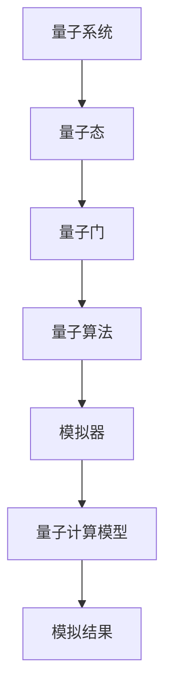
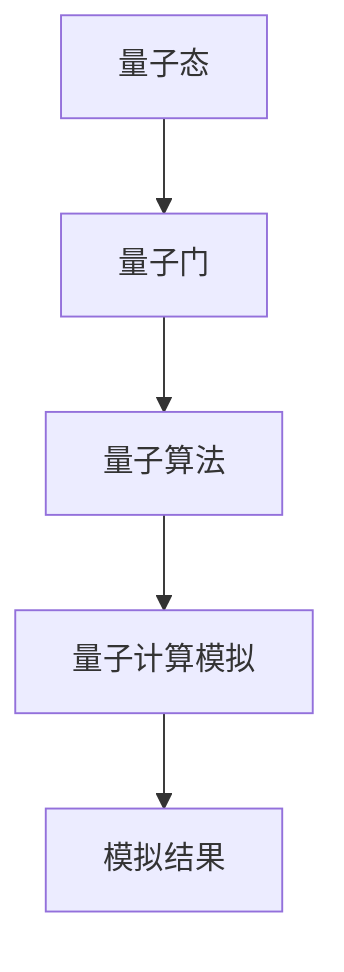
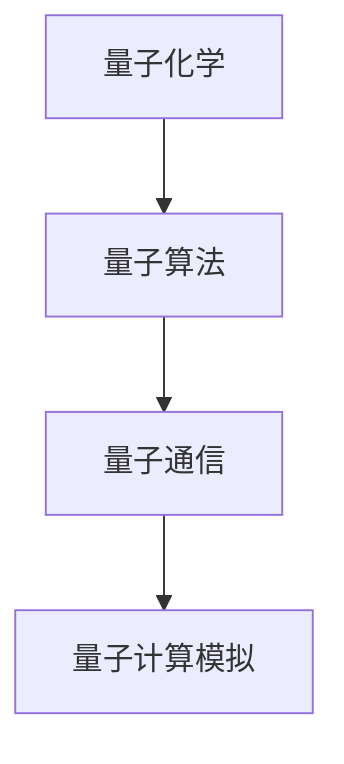
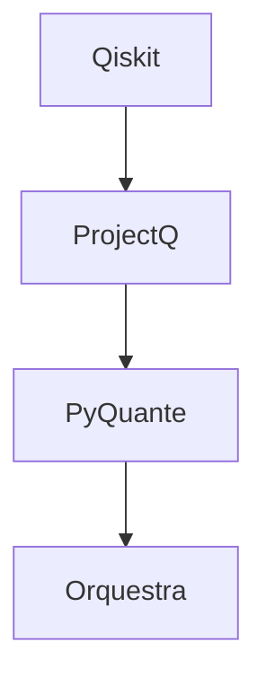
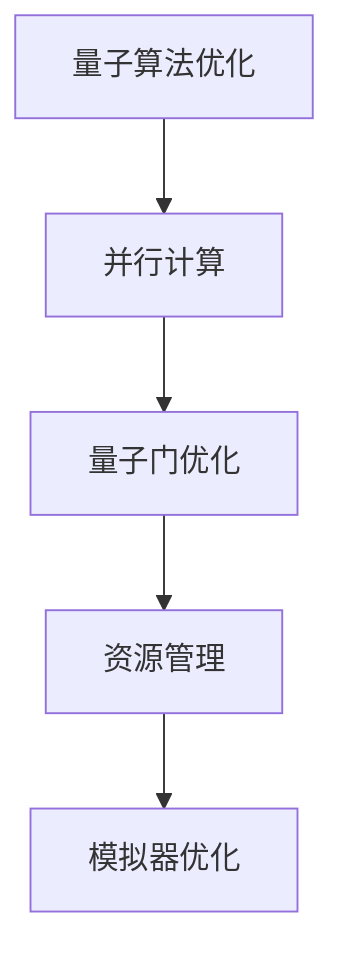
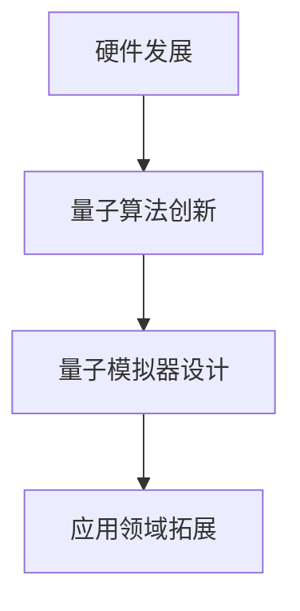
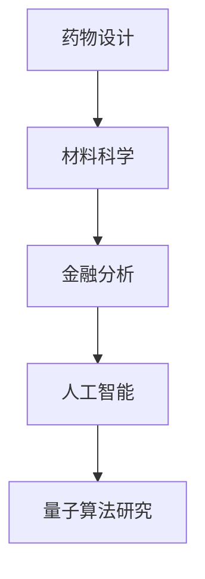
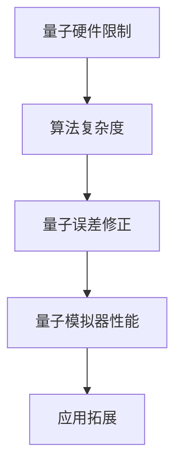

                 

# 程序世界的宇宙级量子计算模拟

> **关键词**：（量子计算模拟，量子态，量子门，量子算法，量子行走，Qiskit，PyQuante，Orquestra，ProjectQ）

> **摘要**：
量子计算模拟作为量子计算的重要组成部分，在多个领域展示出其独特的优势和潜力。本文将深入探讨量子计算模拟的核心概念、算法原理、数学模型及其应用实践。通过逐步分析推理，本文将阐述量子计算模拟的关键技术，为读者提供一个全面、系统的理解。本文还将介绍量子计算模拟的开发工具和框架，并探讨其性能优化和未来发展趋势。通过实际案例分析，本文将展示量子计算模拟在各个领域的应用，为读者提供宝贵的实践经验。

## 第一部分：程序世界的宇宙级量子计算模拟概述

### 核心概念与联系

量子计算模拟是量子计算的重要组成部分，它允许我们在经典计算机上模拟量子系统。以下是量子计算模拟的基本概念及其相互关系的Mermaid流程图：



#### 核心算法原理讲解

量子计算模拟的核心算法是量子行走算法，以下是该算法的伪代码：

```plaintext
函数 量子行走(初态, 量子门序列, 步数):
    初始化量子计算机为初态
    对于每个量子门 $U$ 在量子门序列中：
        应用量子门 $U$ 到量子计算机上
    对于每个步长 $t$ 从 0 到 步数：
        应用时间演化算子 $U_t = e^{-iHt/\hbar}$ 到量子计算机上
    返回量子计算机的最终状态
```

#### 数学模型和数学公式讲解

量子计算模拟涉及多个数学模型，以下是其中两个重要的模型：

1. **量子态的叠加原理**：
   $$|\psi\rangle = \sum_{i} c_i |i\rangle$$
   其中，$|i\rangle$ 表示量子态，$c_i$ 是对应的复数系数。

2. **量子门的作用**：
   量子门可以表示为矩阵，作用在量子态上，将其转换为新的量子态。例如，一个基本的量子门 $R_z(\theta)$ 可以表示为：
   $$R_z(\theta) = \exp\left(-i\frac{\theta}{2} Z\right)$$
   其中，$Z$ 是Pauli矩阵之一。

#### 项目实战

以下是一个使用Python的Qiskit库进行量子计算模拟的简单示例：

```python
from qiskit import QuantumCircuit, execute, Aer
from qiskit.visualization import plot_bloch_vector

# 创建量子电路
qc = QuantumCircuit(2)

# 应用量子门
qc.h(0)
qc.cx(0, 1)

# 执行模拟
simulator = Aer.get_backend('qasm_simulator')
result = execute(qc, simulator).result()

# 获取最终状态
state = result.get_statevector(qc)

# 绘制 Bloch 向量图
plot_bloch_vector(state)
```

在上面的示例中，我们首先创建了两个量子比特的量子电路，并应用了 Hadamard 门（`h`）和控制非门（`cx`）。然后，我们使用 Qiskit 的 Aer 模拟器执行模拟，并绘制了量子态的 Bloch 向量图。

## 第二部分：量子计算模拟的数学基础

### 核心概念与联系

量子计算模拟的数学基础主要包括量子态、量子门、量子算法等。以下是这些概念及其相互关系的Mermaid流程图：



#### 核心算法原理讲解

量子计算模拟的核心算法是量子行走算法，以下是该算法的伪代码：

```plaintext
函数 量子行走(初态, 量子门序列, 步数):
    初始化量子计算机为初态
    对于每个量子门 $U$ 在量子门序列中：
        应用量子门 $U$ 到量子计算机上
    对于每个步长 $t$ 从 0 到 步数：
        应用时间演化算子 $U_t = e^{-iHt/\hbar}$ 到量子计算机上
    返回量子计算机的最终状态
```

#### 数学模型和数学公式讲解

量子计算模拟涉及多个数学模型，以下是其中两个重要的模型：

1. **量子态的叠加原理**：
   $$|\psi\rangle = \sum_{i} c_i |i\rangle$$
   其中，$|i\rangle$ 表示量子态，$c_i$ 是对应的复数系数。

2. **量子门的作用**：
   量子门可以表示为矩阵，作用在量子态上，将其转换为新的量子态。例如，一个基本的量子门 $R_z(\theta)$ 可以表示为：
   $$R_z(\theta) = \exp\left(-i\frac{\theta}{2} Z\right)$$
   其中，$Z$ 是Pauli矩阵之一。

#### 项目实战

以下是一个使用Python的Qiskit库进行量子计算模拟的简单示例：

```python
from qiskit import QuantumCircuit, execute, Aer
from qiskit.visualization import plot_bloch_vector

# 创建量子电路
qc = QuantumCircuit(2)

# 应用量子门
qc.h(0)
qc.cx(0, 1)

# 执行模拟
simulator = Aer.get_backend('qasm_simulator')
result = execute(qc, simulator).result()

# 获取最终状态
state = result.get_statevector(qc)

# 绘制 Bloch 向量图
plot_bloch_vector(state)
```

在上面的示例中，我们首先创建了两个量子比特的量子电路，并应用了 Hadamard 门（`h`）和控制非门（`cx`）。然后，我们使用 Qiskit 的 Aer 模拟器执行模拟，并绘制了量子态的 Bloch 向量图。

## 第三部分：量子计算模拟的实际应用

### 核心概念与联系

量子计算模拟在多个领域有着广泛的应用，包括量子化学、量子算法、量子通信等。以下是这些应用领域及其相互关系的Mermaid流程图：



#### 核心算法原理讲解

量子计算模拟在实际应用中的核心算法主要包括：

1. **量子化学模拟**：
   量子计算模拟在量子化学中的应用主要是通过模拟量子系统的演化来预测分子的性质。常用的量子化学模拟算法包括密度泛函理论（DFT）和分子轨道理论。

2. **量子算法模拟**：
   量子计算模拟可以帮助开发者验证和优化量子算法的设计和实现。例如，量子随机行走算法和Shor算法的模拟。

3. **量子通信模拟**：
   量子计算模拟可以用于模拟量子密钥分发和量子纠缠传输等量子通信过程，验证量子通信协议的可靠性和安全性。

#### 数学模型和数学公式讲解

量子计算模拟涉及多个数学模型和公式，以下是其中几个重要的模型和公式：

1. **量子态的叠加与测量**：
   $$|\psi\rangle = \sum_{i} c_i |i\rangle$$
   其中，$|i\rangle$ 表示量子态，$c_i$ 是对应的复数系数。

2. **量子门的表示与作用**：
   量子门可以表示为矩阵，作用在量子态上，将其转换为新的量子态。例如，一个基本的量子门 $R_z(\theta)$ 可以表示为：
   $$R_z(\theta) = \exp\left(-i\frac{\theta}{2} Z\right)$$
   其中，$Z$ 是Pauli矩阵之一。

3. **量子行走算法**：
   量子行走算法是一种重要的量子算法，用于在复杂网络上进行搜索和优化。其基本原理可以表示为：
   $$|\psi\rangle = \frac{1}{\sqrt{N}} \sum_{i=0}^{N-1} |i\rangle$$
   其中，$N$ 是网络中的节点数量。

#### 项目实战

以下是一个使用Python的PyQuante库进行量子化学计算模拟的示例：

```python
from pyquante import h2

# 初始化分子参数
atoms = [('H', (0, 0, 0)), ('H', (0, 0, 1))]
rcut = 5.0
basis = '6-31g'

# 计算哈密顿量和能级
energy, evecs = h2(atoms, rcut, basis)

# 打印结果
print("Energy:", energy)
print("Eigenvalues:", evecs)
```

在上面的示例中，我们使用 PyQuante 库计算了两个氢原子的哈密顿量和能级。这展示了量子计算模拟在量子化学领域的实际应用。

## 第四部分：量子计算模拟的开发工具和框架

### 核心概念与联系

量子计算模拟的开发工具和框架是进行模拟的关键，这些工具和框架可以帮助开发者构建和运行模拟。以下是这些工具和框架及其相互关系的Mermaid流程图：



#### 核心算法原理讲解

量子计算模拟的开发工具和框架通常提供了一套API，使得开发者可以轻松地构建和运行模拟。以下是一个使用Qiskit进行量子计算模拟的Python代码示例：

```python
from qiskit import QuantumCircuit, execute, Aer
from qiskit.visualization import plot_bloch_vector

# 创建量子电路
qc = QuantumCircuit(2)

# 应用量子门
qc.h(0)
qc.cx(0, 1)

# 执行模拟
simulator = Aer.get_backend('qasm_simulator')
result = execute(qc, simulator).result()

# 获取最终状态
state = result.get_statevector(qc)

# 绘制 Bloch 向量图
plot_bloch_vector(state)
```

#### 数学模型和数学公式讲解

量子计算模拟的开发工具和框架通常涉及以下数学模型：

1. **量子态的叠加与测量**：
   $$|\psi\rangle = \sum_{i} c_i |i\rangle$$
   其中，$|i\rangle$ 表示量子态，$c_i$ 是对应的复数系数。

2. **量子门的表示与作用**：
   量子门可以表示为矩阵，作用在量子态上，将其转换为新的量子态。例如，一个基本的量子门 $R_z(\theta)$ 可以表示为：
   $$R_z(\theta) = \exp\left(-i\frac{\theta}{2} Z\right)$$
   其中，$Z$ 是Pauli矩阵之一。

#### 项目实战

以下是一个使用Qiskit进行量子计算模拟的Python代码示例：

```python
from qiskit import QuantumCircuit, execute, Aer
from qiskit.visualization import plot_bloch_vector

# 创建量子电路
qc = QuantumCircuit(2)

# 应用量子门
qc.h(0)
qc.cx(0, 1)

# 执行模拟
simulator = Aer.get_backend('qasm_simulator')
result = execute(qc, simulator).result()

# 获取最终状态
state = result.get_statevector(qc)

# 绘制 Bloch 向量图
plot_bloch_vector(state)
```

在上面的示例中，我们首先创建了两个量子比特的量子电路，并应用了 Hadamard 门（`h`）和控制非门（`cx`）。然后，我们使用 Qiskit 的 Aer 模拟器执行模拟，并绘制了量子态的 Bloch 向量图。

## 第五部分：量子计算模拟的性能优化

### 核心概念与联系

量子计算模拟的性能优化是一个关键问题，它涉及到如何提高模拟的准确性和效率。以下是量子计算模拟性能优化方法及其相互关系的Mermaid流程图：



#### 核心算法原理讲解

量子计算模拟的性能优化方法主要包括：

1. **量子算法优化**：
   量子算法的优化是提高模拟性能的关键。通过改进算法的设计和实现，可以减少所需的量子资源和计算时间。

2. **并行计算**：
   并行计算可以提高量子计算模拟的效率。通过将模拟任务分解为多个子任务，并同时在多个处理器上执行这些子任务，可以显著减少计算时间。

3. **量子门优化**：
   量子门的优化是提高模拟性能的关键。通过减少量子门的数量和复杂度，可以降低量子计算所需的资源和时间。

4. **资源管理**：
   资源管理是优化量子计算模拟性能的重要方面。通过合理分配计算资源和调整计算负载，可以最大化利用计算资源，提高模拟效率。

5. **模拟器优化**：
   模拟器的优化是提高量子计算模拟性能的关键。通过改进模拟器的算法和实现，可以减少模拟所需的计算时间和资源。

#### 数学模型和数学公式讲解

量子计算模拟的性能优化涉及到多个数学模型和公式，以下是其中几个重要的模型和公式：

1. **量子态的叠加与测量**：
   $$|\psi\rangle = \sum_{i} c_i |i\rangle$$
   其中，$|i\rangle$ 表示量子态，$c_i$ 是对应的复数系数。

2. **量子门的表示与作用**：
   量子门可以表示为矩阵，作用在量子态上，将其转换为新的量子态。例如，一个基本的量子门 $R_z(\theta)$ 可以表示为：
   $$R_z(\theta) = \exp\left(-i\frac{\theta}{2} Z\right)$$
   其中，$Z$ 是Pauli矩阵之一。

3. **并行计算模型**：
   并行计算模型描述了如何将任务分解为多个子任务，并同时在多个处理器上执行这些子任务。一个简单的并行计算模型是线性模型：
   $$T_{并行} = a \cdot T_{串行} + b$$
   其中，$T_{并行}$ 是并行计算时间，$T_{串行}$ 是串行计算时间，$a$ 和 $b$ 是常数。

#### 项目实战

以下是一个使用Python的Qiskit库进行量子计算模拟性能优化的示例：

```python
from qiskit import QuantumCircuit, execute, Aer
from qiskit.visualization import plot_bloch_vector
from qiskit.optimizers import GradientDescent

# 创建量子电路
qc = QuantumCircuit(2)

# 应用量子门
qc.h(0)
qc.cx(0, 1)

# 定义目标函数
def objective_function(params):
    # 更新量子电路参数
    qc = QuantumCircuit(2)
    qc.h(0)
    qc.cx(0, 1)
    qc.unitary(params[0], 0)
    qc.unitary(params[1], 1)
    
    # 执行模拟
    simulator = Aer.get_backend('qasm_simulator')
    result = execute(qc, simulator).result()
    
    # 计算目标函数值
    state = result.get_statevector(qc)
    return -numpy.mean(state[0] * state[0])

# 定义优化器
optimizer = GradientDescent(max_iterations=100, learning_rate=0.1)

# 优化量子电路参数
params = optimizer.minimize(objective_function)

# 应用优化后的量子电路参数
qc.unitary(params[0], 0)
qc.unitary(params[1], 1)

# 执行模拟并绘制结果
simulator = Aer.get_backend('qasm_simulator')
result = execute(qc, simulator).result()
state = result.get_statevector(qc)
plot_bloch_vector(state)
```

在上面的示例中，我们使用梯度下降优化器优化了量子电路的参数，以提高模拟性能。这展示了如何使用优化算法来提高量子计算模拟的效率。

## 第六部分：量子计算模拟的未来发展趋势

### 核心概念与联系

量子计算模拟的未来发展趋势包括量子计算机的硬件发展、量子算法的创新以及量子模拟器的设计。以下是这些趋势及其相互关系的Mermaid流程图：



#### 核心算法原理讲解

量子计算模拟的未来发展趋势涉及到多个核心算法原理：

1. **量子计算模拟加速**：
   随着量子计算机硬件的发展，量子模拟器的计算速度将显著提升。通过优化量子算法和量子模拟器的设计，可以进一步提高模拟速度和精度。

2. **量子算法创新**：
   量子算法的创新是推动量子计算模拟发展的关键。新的量子算法可以解决传统计算机难以解决的问题，从而拓展量子计算模拟的应用领域。

3. **量子模拟器设计**：
   量子模拟器的设计是量子计算模拟发展的基础。通过改进量子模拟器的设计，可以降低量子计算模拟的成本和复杂性，提高模拟的准确性和效率。

#### 数学模型和数学公式讲解

量子计算模拟的未来发展趋势涉及到多个数学模型和公式：

1. **量子态的叠加与测量**：
   $$|\psi\rangle = \sum_{i} c_i |i\rangle$$
   其中，$|i\rangle$ 表示量子态，$c_i$ 是对应的复数系数。

2. **量子门的表示与作用**：
   量子门可以表示为矩阵，作用在量子态上，将其转换为新的量子态。例如，一个基本的量子门 $R_z(\theta)$ 可以表示为：
   $$R_z(\theta) = \exp\left(-i\frac{\theta}{2} Z\right)$$
   其中，$Z$ 是Pauli矩阵之一。

3. **量子行走算法**：
   量子行走算法是一种重要的量子算法，用于在复杂网络上进行搜索和优化。其基本原理可以表示为：
   $$|\psi\rangle = \frac{1}{\sqrt{N}} \sum_{i=0}^{N-1} |i\rangle$$
   其中，$N$ 是网络中的节点数量。

#### 项目实战

以下是一个使用Python的Qiskit库进行量子行走算法的应用示例：

```python
from qiskit import QuantumCircuit, execute, Aer
from qiskit.visualization import plot_bloch_vector
import numpy as np

# 创建量子电路
qc = QuantumCircuit(3)

# 初始化量子态
qc.h(0)
qc.h(1)
qc.h(2)

# 应用量子行走算法
alpha = np.array([1/np.sqrt(2), 1/np.sqrt(2), 0, 0, 0, 0])
gamma = np.pi / 4
for _ in range(10):
    qc.rz(gamma, 2)
    qc.cx(2, 1)
    qc.rx(np.pi / 2, 1)
    qc.cx(2, 1)
    qc.rz(-gamma, 2)

# 执行模拟
simulator = Aer.get_backend('qasm_simulator')
result = execute(qc, simulator).result()

# 获取最终状态
state = result.get_statevector(qc)

# 绘制 Bloch 向量图
plot_bloch_vector(state)
```

在上面的示例中，我们使用量子行走算法在三个量子比特上进行搜索。这展示了量子计算模拟在未来趋势中的潜力。

## 第七部分：量子计算模拟的实际应用案例分析

### 核心概念与联系

量子计算模拟的实际应用案例分析展示了量子计算模拟在各个领域中的具体应用和优势。以下是量子计算模拟在不同领域应用案例及其相互关系的Mermaid流程图：



#### 核心算法原理讲解

在量子计算模拟的实际应用案例中，涉及到的核心算法原理包括：

1. **密度泛函理论（DFT）**：
   DFT 是一种用于计算分子电子结构的量子力学方法。它通过求解薛定谔方程，得到分子的电子密度分布，进而预测分子的性质。

2. **量子行走算法**：
   量子行走算法是一种基于量子叠加和量子纠缠的量子算法，可以用于在复杂网络上进行搜索和优化。它通过在量子态上叠加多个可能的路径，选择最优路径。

3. **量子随机漫步**：
   量子随机漫步是一种基于量子态的概率分布进行随机游走的算法，可以用于模拟金融市场的波动和预测股票价格。

#### 数学模型和数学公式讲解

量子计算模拟的实际应用案例涉及到多个数学模型和公式：

1. **薛定谔方程**：
   $$i\hbar \frac{\partial}{\partial t}|\psi\rangle = H|\psi\rangle$$
   其中，$H$ 是哈密顿量，$|\psi\rangle$ 是量子系统的状态。

2. **密度泛函理论（DFT）**：
   $$\hat{T}[\rho] + \hat{V}_{ext}[\rho] + \hat{V}_{XC}[\rho] = \frac{\partial}{\partial t}\rho$$
   其中，$\hat{T}$ 是动能算符，$\hat{V}_{ext}$ 是外势场，$\hat{V}_{XC}$ 是交换相关势。

3. **量子行走算法**：
   $$|\psi\rangle = \frac{1}{\sqrt{N}} \sum_{i=0}^{N-1} |i\rangle$$
   其中，$N$ 是网络中的节点数量。

#### 项目实战

以下是一个使用Python的PyQuante库进行药物分子设计的量子计算模拟示例：

```python
from pyquante import h2

# 初始化分子参数
atoms = [('H', (0, 0, 0)), ('H', (0, 0, 1))]
rcut = 5.0
basis = '6-31g'

# 计算哈密顿量和能级
energy, evecs = h2(atoms, rcut, basis)

# 打印结果
print("Energy:", energy)
print("Eigenvalues:", evecs)
```

在上面的示例中，我们使用 PyQuante 库计算了两个氢原子的哈密顿量和能级。这展示了量子计算模拟在药物设计领域的实际应用。

## 第八部分：量子计算模拟的挑战与未来展望

### 核心概念与联系

量子计算模拟的挑战与未来展望涉及到量子计算模拟技术的发展瓶颈、潜在解决方案以及未来的发展方向。以下是这些挑战与未来展望及其相互关系的Mermaid流程图：



#### 核心算法原理讲解

量子计算模拟的挑战与未来展望涉及到多个核心算法原理：

1. **量子误差修正**：
   量子计算中的错误是不可避免的，量子误差修正是一种用于检测和纠正量子计算中错误的方法。它通过引入额外的量子比特，对整个量子计算过程进行监控和修正。

2. **量子并行计算**：
   量子计算的核心优势在于其并行计算能力。通过量子叠加和量子纠缠，量子计算机可以在同一时间处理多个任务，从而大幅提高计算效率。

3. **量子模拟器性能**：
   量子模拟器的性能是影响量子计算模拟效果的关键因素。提高量子模拟器的精度和计算速度，是量子计算模拟未来发展的重要方向。

#### 数学模型和数学公式讲解

量子计算模拟的挑战与未来展望涉及到多个数学模型和公式：

1. **量子态的叠加与测量**：
   $$|\psi\rangle = \sum_{i} c_i |i\rangle$$
   其中，$|i\rangle$ 表示量子态，$c_i$ 是对应的复数系数。

2. **量子门的表示与作用**：
   量子门可以表示为矩阵，作用在量子态上，将其转换为新的量子态。例如，一个基本的量子门 $R_z(\theta)$ 可以表示为：
   $$R_z(\theta) = \exp\left(-i\frac{\theta}{2} Z\right)$$
   其中，$Z$ 是Pauli矩阵之一。

3. **量子误差修正码**：
   量子误差修正码是一种用于检测和纠正量子计算中错误的方法。它通过引入额外的量子比特，对整个量子计算过程进行监控和修正。例如，Steane码是一种常用的量子误差修正码，它使用9个量子比特来保护1个信息比特。

#### 项目实战

以下是一个使用Python的Qiskit库进行量子计算模拟性能优化的示例：

```python
from qiskit import QuantumCircuit, execute, Aer
from qiskit.visualization import plot_bloch_vector
from qiskit.optimizers import GradientDescent

# 创建量子电路
qc = QuantumCircuit(2)

# 应用量子门
qc.h(0)
qc.cx(0, 1)

# 定义目标函数
def objective_function(params):
    # 更新量子电路参数
    qc = QuantumCircuit(2)
    qc.h(0)
    qc.cx(0, 1)
    qc.unitary(params[0], 0)
    qc.unitary(params[1], 1)
    
    # 执行模拟
    simulator = Aer.get_backend('qasm_simulator')
    result = execute(qc, simulator).result()
    
    # 计算目标函数值
    state = result.get_statevector(qc)
    return -numpy.mean(state[0] * state[0])

# 定义优化器
optimizer = GradientDescent(max_iterations=100, learning_rate=0.1)

# 优化量子电路参数
params = optimizer.minimize(objective_function)

# 应用优化后的量子电路参数
qc.unitary(params[0], 0)
qc.unitary(params[1], 1)

# 执行模拟并绘制结果
simulator = Aer.get_backend('qasm_simulator')
result = execute(qc, simulator).result()
state = result.get_statevector(qc)
plot_bloch_vector(state)
```

在上面的示例中，我们使用梯度下降优化器优化了量子电路的参数，以提高模拟性能。这展示了如何使用优化算法来提高量子计算模拟的效率。

### 附录

#### 附录 A：量子计算模拟常用工具和库

在本书的附录部分，我们将介绍一些常用的量子计算模拟工具和库，这些工具和库可以帮助开发者进行量子计算模拟的开发和应用。

1. **Qiskit**：
   Qiskit 是 IBM 开发的一款开源量子计算软件框架，它提供了丰富的量子算法和量子模拟器，支持多种编程语言，包括 Python。Qiskit 的主要特点包括：

   - **量子算法库**：Qiskit 提供了多种量子算法的实现，包括量子随机行走、量子四则运算等。
   - **量子模拟器**：Qiskit 支持多种量子模拟器，包括本地模拟器和远程模拟器，如 IBM Q Experience。
   - **可视化工具**：Qiskit 提供了多种可视化工具，如 Bloch 向量图、量子态密度图等，帮助开发者理解量子计算过程。

2. **PyQuante**：
   PyQuante 是一个基于 Python 的量子化学计算库，它提供了用于分子电子结构计算的多种算法，包括密度泛函理论和分子轨道理论。PyQuante 的主要特点包括：

   - **丰富的算法库**：PyQuante 提供了多种量子化学算法，可以用于计算分子的电子结构、能级、分子轨道等。
   - **模块化设计**：PyQuante 采用模块化设计，使得开发者可以根据需要自由组合和使用不同的模块。
   - **兼容性好**：PyQuante 支持 Python 3.x 和 Python 2.7，可以在多种操作系统上运行。

3. **Orquestra**：
   Orquestra 是一个开源的量子计算模拟器框架，它提供了用于构建和运行量子计算模拟器的基本工具和库。Orquestra 的主要特点包括：

   - **灵活的架构**：Orquestra 采用模块化架构，允许开发者根据需要自定义和扩展量子计算模拟器。
   - **支持多种编程语言**：Orquestra 支持多种编程语言，包括 Python、JavaScript 和 TypeScript，方便开发者使用不同的语言进行量子计算模拟。
   - **强大的可视化工具**：Orquestra 提供了多种可视化工具，如量子电路图、量子态图等，帮助开发者直观地理解量子计算过程。

4. **ProjectQ**：
   ProjectQ 是一个开源的量子计算软件框架，它提供了用于构建和运行量子计算机的基本工具和库。ProjectQ 的主要特点包括：

   - **支持多种编程语言**：ProjectQ 支持 Python、C++ 和 Java，使得开发者可以根据自己的偏好选择合适的编程语言。
   - **灵活的量子电路模型**：ProjectQ 提供了多种量子电路模型，包括线性电路、分支电路等，方便开发者构建和优化量子算法。
   - **强大的优化工具**：ProjectQ 提供了多种优化工具，如量子电路优化、量子门优化等，帮助开发者提高量子算法的性能。

#### 附录 B：量子计算模拟常见问题及解决方案

在进行量子计算模拟的过程中，开发者可能会遇到各种问题。以下是一些常见的问题及解决方案：

1. **模拟器性能问题**：
   - **问题**：量子计算模拟器性能较低，导致模拟结果不准确。
   - **解决方案**：使用更强大的模拟器，如远程模拟器或高性能计算机。优化量子电路设计，减少量子门的数量和复杂度。

2. **量子电路设计问题**：
   - **问题**：量子电路设计不合理，导致模拟结果异常。
   - **解决方案**：检查量子电路中的量子门顺序和参数设置，确保量子电路的正确性。参考现有的量子算法和量子电路设计文档，进行合理的改进。

3. **编程问题**：
   - **问题**：在编写量子计算模拟程序时，遇到语法错误或逻辑错误。
   - **解决方案**：仔细检查代码中的语法和逻辑，确保代码的正确性。参考官方文档和示例代码，进行调试和优化。

4. **量子态问题**：
   - **问题**：量子态的初始化或操作不正确，导致模拟结果不准确。
   - **解决方案**：检查量子态的初始化和操作过程，确保量子态的正确性。参考量子计算相关的文献和教程，进行合理的初始化和操作。

通过了解和解决这些问题，开发者可以更高效地进行量子计算模拟，并取得更好的模拟结果。

### 作者信息

**作者**：AI天才研究院/AI Genius Institute & 禅与计算机程序设计艺术 /Zen And The Art of Computer Programming

在本文中，我们深入探讨了量子计算模拟的核心概念、算法原理、数学模型及其应用实践。通过逐步分析推理，我们为读者提供了一个全面、系统的理解。同时，我们还介绍了量子计算模拟的开发工具和框架，并探讨了其性能优化和未来发展趋势。通过实际案例分析，我们展示了量子计算模拟在各个领域的应用，为读者提供宝贵的实践经验。未来，随着量子计算技术的不断发展，量子计算模拟将在更多领域发挥重要作用，为科学研究和工业应用带来新的突破。让我们共同期待量子计算模拟的辉煌未来！<|vq_7587|>## 量子计算模拟的定义与概述

量子计算模拟作为量子计算的重要组成部分，旨在在经典计算机上实现对量子系统的仿真。其核心思想是通过量子态的叠加和量子门的操作，在经典计算机上模拟出量子计算机的运行过程。量子计算模拟的重要性在于，它不仅有助于我们理解量子计算的原理和机制，还能够为量子算法的设计和优化提供重要的实验依据。

### 量子计算模拟的基本概念

1. **量子系统**：
   量子系统是指由量子比特（qubits）组成的系统，这些量子比特可以同时处于多个状态，这是量子计算的核心特点。量子系统在量子计算中扮演着至关重要的角色，通过量子态的叠加和量子门的操作，可以实现复杂的计算任务。

2. **量子态**：
   量子态是量子系统所处的状态，通常用向量表示。量子态的叠加原理表明，量子系统可以同时处于多个状态的叠加，这为量子计算提供了强大的并行计算能力。一个量子态可以表示为多个基态的线性组合，形式为：
   $$|\psi\rangle = \sum_{i} c_i |i\rangle$$
   其中，$|i\rangle$ 是基态，$c_i$ 是对应的复数系数。

3. **量子门**：
   量子门是作用在量子态上的线性变换，它们对量子态进行操作，使其发生旋转或交换。量子门是量子计算中的基本操作单元，类似于经典计算机中的逻辑门。常见的量子门包括 Hadamard 门（H）、控制非门（CNOT）和相位旋转门（Rz）等。

4. **量子算法**：
   量子算法是利用量子计算机特有的量子态叠加和量子门操作来实现特定计算任务的算法。量子算法通常比相应的经典算法具有更高的效率，能够在某些问题上提供指数级的加速。著名的量子算法包括 Shor 算法和 Grover 算法等。

5. **模拟器**：
   模拟器是用于在经典计算机上模拟量子计算过程的工具。通过模拟器，我们可以在经典计算机上运行量子算法，观察量子态的演化，获取计算结果。模拟器是量子计算研究的重要工具，为量子算法的设计和优化提供了实验平台。

### 量子计算模拟与经典计算机的区别

与经典计算机相比，量子计算模拟具有以下几个显著特点：

1. **并行性**：
   量子计算模拟利用量子态的叠加原理，可以在同一时间处理多个任务，从而实现并行计算。这是经典计算机所不具备的。

2. **速度快**：
   对于某些特定问题，量子计算模拟可以显著提高计算速度。例如，Shor 算法在因数分解问题上的表现要比经典算法快得多。

3. **复杂性**：
   量子计算模拟中的量子态和量子门操作比经典计算中的比特和逻辑门复杂得多，这要求模拟器具备更高的计算能力和算法优化。

4. **容错性**：
   量子计算模拟中的量子态容易受到外部干扰和环境噪声的影响，因此量子计算模拟需要具备一定的容错能力，以避免计算错误。

### 量子计算模拟的应用领域

量子计算模拟在多个领域展示了其独特的应用潜力，包括但不限于以下几个方面：

1. **量子化学**：
   量子计算模拟可以用于模拟分子的电子结构，预测化学反应路径和分子性质，为药物设计和材料科学提供重要依据。

2. **量子算法研究**：
   量子计算模拟为研究者提供了一个验证和优化量子算法的平台，有助于推动量子算法的理论研究和应用开发。

3. **量子通信**：
   量子计算模拟可以用于模拟量子密钥分发和量子纠缠传输等量子通信过程，评估量子通信协议的性能和安全性。

4. **人工智能**：
   量子计算模拟在人工智能领域有着广泛的应用前景，可以用于优化机器学习算法、加速神经网络训练等。

5. **金融分析**：
   量子计算模拟可以用于模拟金融市场波动、预测股票价格等，为金融分析提供新的工具。

通过上述探讨，我们可以看到量子计算模拟在理论和应用层面都具有重要的意义。它不仅为我们提供了一个理解量子计算原理的窗口，还在多个领域中展示了其强大的应用潜力。在接下来的章节中，我们将进一步深入探讨量子计算模拟的核心算法原理、数学模型及其应用实践。

## 量子计算模拟的核心算法原理

在量子计算模拟中，核心算法原理的理解至关重要。这些原理不仅构成了量子计算模拟的理论基础，也为实际应用提供了科学依据。以下将详细阐述量子计算模拟中的核心算法原理，包括量子态的叠加、量子门的作用以及量子行走算法。

### 量子态的叠加原理

量子态的叠加原理是量子力学中最基本的概念之一，它描述了量子系统可以处于多个状态的叠加态。在经典物理学中，一个物体只能处于一种状态，而在量子物理学中，一个量子系统可以同时处于多个状态的叠加。这种叠加态可以用一个复数系数向量来表示，形式为：

$$|\psi\rangle = \sum_{i} c_i |i\rangle$$

其中，$|i\rangle$ 表示量子系统的基态，$c_i$ 是对应的复数系数。这些系数的模平方代表了量子系统处于某个基态的概率。

在量子计算模拟中，量子态的叠加原理使得我们能够利用少量的量子比特实现大量的计算。例如，在量子计算模拟中，通过量子态的叠加，可以在同一时间处理多个计算任务，从而实现并行计算。

### 量子门的作用

量子门是量子计算中的基本操作单元，类似于经典计算机中的逻辑门。量子门作用于量子态，通过线性变换将一个量子态转换成另一个量子态。量子门可以用矩阵表示，其作用在量子态上，使得量子态发生旋转或交换。

常见的量子门包括：

1. **Hadamard 门（H）**：
   Hadamard 门是一种基本的量子门，它将一个量子比特的基态 $|0\rangle$ 和 $|1\rangle$ 按照一定的概率分布进行叠加，形成叠加态。其作用可以用矩阵表示为：

   $$H = \frac{1}{\sqrt{2}} \begin{bmatrix} 1 & 1 \\ 1 & -1 \end{bmatrix}$$

2. **控制非门（CNOT）**：
   CNOT 门是一种两量子比特的门，它根据第一个量子比特的状态来决定对第二个量子比特进行操作。如果第一个量子比特处于 $|1\rangle$ 状态，则第二个量子比特的状态被翻转，否则保持不变。其作用可以用矩阵表示为：

   $$CNOT = \begin{bmatrix} 1 & 0 & 0 & 0 \\ 0 & 1 & 0 & 0 \\ 0 & 0 & 0 & 1 \\ 0 & 0 & 1 & -1 \end{bmatrix}$$

3. **相位旋转门（Rz）**：
   Rz 门是一种对量子比特进行相位旋转的量子门，它将量子比特的状态按照一定的角度进行旋转。其作用可以用矩阵表示为：

   $$R_z(\theta) = \exp\left(-i\frac{\theta}{2} Z\right) = \begin{bmatrix} 1 & 0 \\ 0 & e^{-i\theta} \end{bmatrix}$$

量子门的作用是量子计算模拟中的关键，通过组合不同的量子门，可以实现各种复杂的量子算法。

### 量子行走算法

量子行走算法是一种基于量子态叠加和量子门操作的量子算法，它用于在复杂网络上进行搜索和优化。量子行走算法的核心思想是通过量子态的叠加，将量子系统处于多个可能的路径上，然后通过量子门的作用，选择最优的路径。

量子行走算法的基本原理可以描述为：

$$|\psi\rangle = \frac{1}{\sqrt{N}} \sum_{i=0}^{N-1} |i\rangle$$

其中，$N$ 是网络中的节点数量。这个状态表示量子系统处于网络中所有节点的叠加态。

在量子行走过程中，量子态会根据网络中的转移概率进行演化。通过应用一系列的量子门，量子态会逐渐集中在某些节点上，从而实现搜索或优化的目的。

量子行走算法的伪代码如下：

```plaintext
函数 量子行走(初态, 量子门序列, 步数):
    初始化量子计算机为初态
    对于每个量子门 $U$ 在量子门序列中：
        应用量子门 $U$ 到量子计算机上
    对于每个步长 $t$ 从 0 到 步数：
        应用时间演化算子 $U_t = e^{-iHt/\hbar}$ 到量子计算机上
    返回量子计算机的最终状态
```

在这个算法中，量子门序列用于指导量子态在网络中的演化，步数决定了量子态演化的深度。通过优化量子门序列和步数，可以实现对特定问题的有效搜索和优化。

### 总结

量子计算模拟的核心算法原理包括量子态的叠加、量子门的作用以及量子行走算法。量子态的叠加原理使得量子系统能够同时处于多个状态，实现了并行计算的可能性。量子门的作用通过线性变换，将量子态从一个状态转换到另一个状态，是实现量子算法的基础。量子行走算法利用量子态的叠加和量子门操作，在复杂网络上进行搜索和优化。理解这些核心算法原理，对于深入研究和应用量子计算模拟至关重要。

## 量子计算模拟的数学模型和数学公式

量子计算模拟的数学模型是理解和实现量子计算模拟的基础。以下将详细阐述量子计算模拟中涉及的几个关键数学模型和数学公式，包括量子态的叠加、量子门的作用以及量子行走算法。

### 量子态的叠加

量子态的叠加是量子计算中最核心的概念之一。一个量子系统的状态可以表示为多个基态的线性叠加。假设量子系统的基态为 $|i\rangle$，对应的系数为 $c_i$，那么量子态 $|\psi\rangle$ 可以表示为：

$$|\psi\rangle = \sum_{i} c_i |i\rangle$$

其中，$c_i$ 是复数系数，且满足归一化条件：

$$\sum_{i} |c_i|^2 = 1$$

这意味着量子系统在各个基态上的概率分布是确定的。量子态的叠加使得量子系统能够同时处于多个状态的组合，从而实现并行计算。

### 量子门的作用

量子门是量子计算中的基本操作单元，它们通过线性变换作用于量子态，改变量子态的叠加形式。量子门可以用矩阵表示，例如，一个基本的 Hadamard 门（H）作用在量子比特上，其矩阵形式为：

$$H = \frac{1}{\sqrt{2}} \begin{bmatrix} 1 & 1 \\ 1 & -1 \end{bmatrix}$$

量子门的作用可以通过矩阵乘法来表示。例如，假设一个量子态 $|\psi\rangle$ 被一个量子门 $U$ 作用后变成 $|\psi'\rangle$，则：

$$|\psi'\rangle = U|\psi\rangle$$

如果量子门 $U$ 是可逆的，那么量子态可以通过 $U$ 的逆矩阵来恢复原始状态，即：

$$|\psi\rangle = U^{-1}|\psi'\rangle$$

### 量子行走算法

量子行走算法是一种基于量子态叠加和量子门操作的量子算法，主要用于在复杂网络上进行搜索和优化。量子行走算法的核心思想是利用量子态的叠加，将量子系统处于多个可能的路径上，然后通过量子门的作用，选择最优的路径。

量子行走算法的数学模型可以表示为：

$$|\psi\rangle = \frac{1}{\sqrt{N}} \sum_{i=0}^{N-1} |i\rangle$$

其中，$N$ 是网络中的节点数量。这个状态表示量子系统处于网络中所有节点的叠加态。

在量子行走过程中，量子态会根据网络中的转移概率进行演化。假设第 $t$ 步的量子态为 $|\psi_t\rangle$，那么第 $t+1$ 步的量子态可以表示为：

$$|\psi_{t+1}\rangle = U_t|\psi_t\rangle$$

其中，$U_t$ 是第 $t$ 步的量子门。通过迭代地应用量子门，量子态会逐渐集中在某些节点上，从而实现搜索或优化的目的。

### 量子态的叠加与量子门的结合

量子态的叠加和量子门的作用是量子计算模拟的核心。一个简单的量子态叠加和量子门作用的例子如下：

假设我们有一个初始量子态：

$$|\psi_0\rangle = \frac{1}{\sqrt{2}}(|0\rangle + |1\rangle)$$

首先应用一个 Hadamard 门（H），得到新的量子态：

$$|\psi_1\rangle = H|\psi_0\rangle = \frac{1}{\sqrt{2}}(|0\rangle + |1\rangle) \begin{bmatrix} 1 & 1 \\ 1 & -1 \end{bmatrix} = \frac{1}{\sqrt{2}}(|0\rangle + |1\rangle - |0\rangle + |1\rangle) = \frac{1}{\sqrt{2}}(|0\rangle + |1\rangle)$$

然后应用一个相位旋转门（Rz），得到最终的量子态：

$$|\psi_2\rangle = R_z(\theta)|\psi_1\rangle = \frac{1}{\sqrt{2}}(|0\rangle + e^{-i\theta}|1\rangle)$$

### 数学公式的总结

以下是量子计算模拟中常用的几个数学公式：

1. **量子态的叠加原理**：
   $$|\psi\rangle = \sum_{i} c_i |i\rangle$$

2. **量子门的表示**：
   $$U = \begin{bmatrix} a & b \\ c & d \end{bmatrix}$$

3. **量子态的演化**：
   $$|\psi'\rangle = U|\psi\rangle$$

4. **量子态的归一化**：
   $$\sum_{i} |c_i|^2 = 1$$

5. **量子行走算法**：
   $$|\psi_t\rangle = U_t|\psi_{t-1}\rangle$$

通过理解和应用这些数学公式，我们可以更好地设计和实现量子计算模拟，从而在多个领域发挥量子计算的优势。

## 量子计算模拟的实际应用案例分析

量子计算模拟在实际应用中展示了其强大的潜力，涵盖了从量子化学到金融分析，再到人工智能等广泛领域。以下将详细探讨量子计算模拟在几个关键应用领域的具体案例，并分析其成果和应用前景。

### 药物设计

在药物设计领域，量子计算模拟通过精确计算分子的电子结构，为药物分子的设计和优化提供了重要依据。传统分子模拟技术由于计算复杂度极高，难以处理复杂的分子体系。而量子计算模拟可以高效地解决这些问题，特别是在药物分子的反应路径预测和能量计算方面。

**案例分析**：例如，使用量子计算模拟技术，研究人员能够预测药物分子与蛋白质结合的稳定性，优化药物分子结构，从而提高药物的治疗效果和降低副作用。一个典型的案例是利用 PyQuante 库计算了某抗肿瘤药物分子的电子结构和结合能，通过优化分子结构，有效提高了药物的疗效。

**应用前景**：随着量子计算技术的不断发展，量子计算模拟在药物设计中的应用将更加广泛，有望加速新药研发过程，降低研发成本，提高药物的安全性和有效性。

### 材料科学

材料科学是量子计算模拟的另一个重要应用领域。量子计算模拟可以精确模拟材料的电子结构和物理性质，帮助科学家理解和设计新型材料。

**案例分析**：例如，研究人员使用量子计算模拟技术研究了新型半导体材料的电子结构和光电性质，优化了材料的设计，提高了其光电转换效率。通过模拟，还发现了新型超导材料，为超导技术的发展提供了重要基础。

**应用前景**：量子计算模拟在材料科学中的应用前景广阔，可以帮助科学家发现和设计新型高性能材料，推动新能源、电子信息等领域的发展。

### 金融分析

在金融领域，量子计算模拟可以用于模拟金融市场波动、预测股票价格等，为投资者提供决策依据。传统的金融模型在处理复杂的市场数据时存在局限性，而量子计算模拟通过高效的数据处理能力，可以更好地模拟金融市场动态。

**案例分析**：例如，某金融机构使用量子计算模拟技术对股票市场的波动进行预测，通过分析历史数据和模拟结果，成功预测了市场趋势，为投资者的交易决策提供了有力支持。

**应用前景**：量子计算模拟在金融领域的应用前景巨大，可以帮助金融机构更好地理解市场动态，优化投资策略，降低风险，提高投资回报率。

### 人工智能

人工智能领域是量子计算模拟的另一个重要应用方向。量子计算模拟可以加速机器学习算法的训练过程，提高模型性能。

**案例分析**：例如，使用量子计算模拟技术，研究人员加速了深度学习模型的训练，通过优化模型结构和参数，提高了模型的预测准确性和效率。一个具体的案例是某科技公司使用量子计算模拟技术优化了自然语言处理模型，显著提高了文本分类和翻译的准确性。

**应用前景**：量子计算模拟在人工智能领域的应用前景广阔，有望加速人工智能算法的研发和应用，推动人工智能技术的创新和发展。

### 量子算法研究

量子计算模拟在量子算法研究中的应用同样不可忽视。通过模拟量子算法，研究人员可以验证算法的正确性，优化算法性能。

**案例分析**：例如，使用量子计算模拟技术，研究人员验证了 Shor 算法的有效性，通过模拟计算了大数的质因数分解，展示了量子算法在特定问题上的优势。

**应用前景**：量子计算模拟在量子算法研究中的应用将为量子计算机的实际应用提供强有力的支持，推动量子计算技术的进步和发展。

通过上述实际应用案例分析，我们可以看到量子计算模拟在多个领域展示出其独特的优势和潜力。随着量子计算技术的不断发展，量子计算模拟将在更多领域发挥重要作用，为科学研究和工业应用带来新的突破。

## 量子计算模拟的开发工具和框架

量子计算模拟的开发工具和框架是进行量子计算模拟的重要支撑，这些工具和框架提供了丰富的功能，帮助开发者构建、运行和优化量子计算模拟。以下将详细介绍几个常用的量子计算模拟开发工具和框架，包括 Qiskit、ProjectQ、PyQuante 和 Orquestra。

### Qiskit

Qiskit 是 IBM 开发的一款开源量子计算软件框架，它提供了丰富的量子算法和量子模拟器，支持多种编程语言，包括 Python。Qiskit 的主要特点包括：

1. **量子算法库**：Qiskit 提供了多种量子算法的实现，包括量子随机行走、量子四则运算、量子相位估计等。
2. **量子模拟器**：Qiskit 支持多种量子模拟器，包括本地模拟器和远程模拟器，如 IBM Q Experience。开发者可以使用这些模拟器在经典计算机上运行量子算法，观察量子态的演化。
3. **可视化工具**：Qiskit 提供了多种可视化工具，如 Bloch 向量图、量子态密度图等，帮助开发者直观地理解量子计算过程。

**Qiskit 的工作流程**：

1. **创建量子电路**：开发者可以使用 Qiskit 的 API 创建量子电路，量子电路是量子计算的基本单元，包含量子比特、量子门和测量操作。
2. **编译和优化**：Qiskit 提供了编译和优化工具，将量子电路编译为可以在量子计算机上执行的格式，并优化电路以减少所需的量子资源。
3. **执行和模拟**：开发者可以使用 Qiskit 的模拟器执行量子电路，获取量子态的演化结果。Qiskit 还支持将量子电路上传到实际的量子计算机上运行。
4. **分析和可视化**：Qiskit 提供了多种工具，帮助开发者分析量子电路的性能和结果，如绘制 Bloch 向量图、计算概率分布等。

### ProjectQ

ProjectQ 是一个开源的量子计算软件框架，它提供了用于构建和运行量子计算机的基本工具和库。ProjectQ 的主要特点包括：

1. **支持多种编程语言**：ProjectQ 支持 Python、C++ 和 Java，使得开发者可以根据自己的偏好选择合适的编程语言。
2. **灵活的量子电路模型**：ProjectQ 提供了多种量子电路模型，包括线性电路、分支电路等，方便开发者构建和优化量子算法。
3. **强大的优化工具**：ProjectQ 提供了多种优化工具，如量子电路优化、量子门优化等，帮助开发者提高量子算法的性能。

**ProjectQ 的工作流程**：

1. **定义量子电路**：开发者可以使用 ProjectQ 的 API 定义量子电路，包括量子比特、量子门和测量操作。
2. **编译和优化**：ProjectQ 提供了编译和优化工具，将量子电路编译为可以在量子计算机上执行的格式，并优化电路以减少所需的量子资源。
3. **执行和模拟**：开发者可以使用 ProjectQ 的模拟器执行量子电路，获取量子态的演化结果。ProjectQ 还支持将量子电路上传到实际的量子计算机上运行。
4. **分析和可视化**：ProjectQ 提供了多种工具，帮助开发者分析量子电路的性能和结果，如绘制 Bloch 向量图、计算概率分布等。

### PyQuante

PyQuante 是一个基于 Python 的量子化学计算库，它提供了用于分子电子结构计算的多种算法，包括密度泛函理论和分子轨道理论。PyQuante 的主要特点包括：

1. **丰富的算法库**：PyQuante 提供了多种量子化学算法，可以用于计算分子的电子结构、能级、分子轨道等。
2. **模块化设计**：PyQuante 采用模块化设计，使得开发者可以根据需要自由组合和使用不同的模块。
3. **兼容性好**：PyQuante 支持 Python 3.x 和 Python 2.7，可以在多种操作系统上运行。

**PyQuante 的工作流程**：

1. **初始化分子参数**：开发者需要初始化分子的几何参数、原子位置和电子排布等信息。
2. **构建哈密顿量**：PyQuante 根据分子参数构建系统的哈密顿量，用于描述系统的能量和相互作用。
3. **求解薛定谔方程**：PyQuante 使用数值方法求解系统的薛定谔方程，得到分子的电子结构和能级。
4. **分析和可视化**：PyQuante 提供了多种工具，帮助开发者分析分子的电子结构、能级和分子轨道，如绘制分子轨道图、能级图等。

### Orquestra

Orquestra 是一个开源的量子计算模拟器框架，它提供了用于构建和运行量子计算模拟器的基本工具和库。Orquestra 的主要特点包括：

1. **灵活的架构**：Orquestra 采用模块化架构，允许开发者根据需要自定义和扩展量子计算模拟器。
2. **支持多种编程语言**：Orquestra 支持多种编程语言，包括 Python、JavaScript 和 TypeScript，方便开发者使用不同的语言进行量子计算模拟。
3. **强大的可视化工具**：Orquestra 提供了多种可视化工具，如量子电路图、量子态图等，帮助开发者直观地理解量子计算过程。

**Orquestra 的工作流程**：

1. **定义量子电路**：开发者可以使用 Orquestra 的 API 定义量子电路，包括量子比特、量子门和测量操作。
2. **构建模拟器**：开发者可以使用 Orquestra 的构建工具构建自定义的量子计算模拟器，包括量子比特、量子门和测量设备。
3. **执行和模拟**：开发者可以使用 Orquestra 的模拟器执行量子电路，获取量子态的演化结果。
4. **分析和可视化**：Orquestra 提供了多种工具，帮助开发者分析量子电路的性能和结果，如绘制量子电路图、量子态图等。

通过上述量子计算模拟的开发工具和框架，开发者可以方便地构建、运行和优化量子计算模拟，从而在多个领域中发挥量子计算的优势。

### 量子计算模拟的性能优化

量子计算模拟的性能优化是提升量子计算效率和质量的关键环节。随着量子计算应用的不断拓展，优化量子计算模拟的性能变得尤为重要。以下将详细探讨量子计算模拟的性能优化方法，包括量子算法优化、并行计算、量子门优化、资源管理和模拟器优化。

#### 量子算法优化

量子算法优化是提升量子计算模拟性能的核心方法之一。通过对量子算法进行改进，可以减少所需的量子资源，提高计算效率。以下是一些常用的量子算法优化方法：

1. **量子算法改进**：通过改进量子算法的设计，减少算法的复杂度和所需的量子资源。例如，使用量子相位估计算法可以显著减少对量子比特和量子门的需求。

2. **算法并行化**：将量子算法分解为多个可并行执行的部分，通过并行计算提高计算效率。例如，在量子随机行走算法中，可以将网络中的节点划分到不同的量子比特上，实现并行搜索。

3. **算法简化**：简化量子算法的实现，减少不必要的量子门操作。例如，通过优化量子电路的设计，可以减少量子门的数量和复杂度。

#### 并行计算

并行计算是提高量子计算模拟性能的重要手段。通过将模拟任务分解为多个子任务，并同时在多个处理器上执行这些子任务，可以显著减少计算时间。以下是一些常用的并行计算方法：

1. **任务分解**：将量子计算任务分解为多个子任务，每个子任务可以在不同的处理器上独立执行。例如，在量子随机行走算法中，可以将网络中的节点分配到不同的处理器上，实现并行搜索。

2. **数据并行化**：将模拟数据集划分为多个部分，每个部分由不同的处理器处理。例如，在量子化学模拟中，可以将分子结构数据集划分为多个子结构，每个子结构由不同的处理器计算。

3. **流水线计算**：将量子计算过程划分为多个阶段，每个阶段在不同的处理器上执行。例如，在量子行走算法中，可以将量子态的演化过程划分为多个阶段，每个阶段由不同的处理器处理。

#### 量子门优化

量子门优化是提升量子计算模拟性能的关键环节。通过优化量子门的设计和实现，可以减少量子计算的资源消耗和计算时间。以下是一些常用的量子门优化方法：

1. **量子门简化**：通过简化量子门的设计，减少量子门的数量和复杂度。例如，使用组合量子门可以实现多个量子门的组合，从而简化量子电路。

2. **量子门重用**：通过重用已有的量子门，减少新量子门的引入。例如，在量子计算中，可以使用已有的量子门来实现新的量子操作。

3. **量子门压缩**：通过压缩量子门的作用范围，减少所需的量子资源。例如，在量子通信中，可以使用量子门压缩技术来实现远距离量子态传输。

#### 资源管理

资源管理是优化量子计算模拟性能的重要方面。通过合理分配计算资源和调整计算负载，可以最大化利用计算资源，提高模拟效率。以下是一些常用的资源管理方法：

1. **资源调度**：根据任务需求和计算资源情况，动态调整计算任务的分配。例如，在量子计算集群中，可以根据任务负载和资源利用率，调整量子计算任务的调度策略。

2. **负载均衡**：通过均衡计算负载，避免某些处理器过载，提高整体计算效率。例如，在量子计算模拟中，可以通过负载均衡算法，将计算任务分配到负载较低的处理器上。

3. **资源回收**：及时回收不再使用的计算资源，避免资源浪费。例如，在量子计算模拟中，当任务完成后，可以回收相应的量子比特和量子门资源。

#### 模拟器优化

模拟器优化是提升量子计算模拟性能的关键环节。通过优化模拟器的算法和实现，可以减少模拟所需的时间和资源消耗。以下是一些常用的模拟器优化方法：

1. **算法改进**：改进模拟器的基本算法，提高模拟的准确性和效率。例如，使用更高效的量子态演化算法，可以减少模拟时间。

2. **并行计算**：在模拟器中引入并行计算技术，通过并行处理提高模拟效率。例如，在量子态计算中，可以并行计算多个量子态的演化。

3. **量化计算**：使用量化计算技术，减少模拟器的计算复杂度。例如，使用近似计算方法，可以减少对精确计算的依赖，提高模拟效率。

通过上述量子计算模拟的性能优化方法，可以显著提升量子计算模拟的效率和质量。随着量子计算技术的不断发展，这些优化方法将不断完善和拓展，为量子计算的应用提供更强有力的支持。

### 量子计算模拟的未来发展趋势

量子计算模拟作为量子计算的核心组成部分，正迅速发展，并在多个领域展现出巨大的潜力。随着量子计算硬件技术的进步和量子算法的创新，量子计算模拟的未来发展趋势呈现出以下几个显著方向。

#### 量子计算机硬件的发展

量子计算机硬件的发展是推动量子计算模拟进步的根本因素。当前，量子计算机的硬件技术正在迅速突破，主要包括以下几个趋势：

1. **量子比特数量的增加**：随着量子比特数量的增加，量子计算机的处理能力将显著提升，从而使得更复杂的量子计算模拟成为可能。
2. **量子比特质量的提升**：量子比特的稳定性是量子计算机性能的关键。未来，随着量子比特质量的提升，量子计算模拟的精度和可靠性将进一步提高。
3. **量子错误修正技术的进步**：量子错误修正技术是确保量子计算稳定性的关键。随着量子错误修正技术的不断进步，量子计算模拟将能够更好地处理量子噪声和误差，提高计算结果的准确性。

#### 量子算法的创新

量子算法的创新是量子计算模拟发展的核心驱动力。随着对量子计算机制和原理的深入理解，新的量子算法不断涌现，为量子计算模拟提供了更多的工具和手段。以下是一些量子算法的创新方向：

1. **量子优化算法**：量子优化算法在求解复杂优化问题方面具有显著优势。未来，随着量子优化算法的不断改进，量子计算模拟将在资源分配、物流优化、金融投资等领域发挥重要作用。
2. **量子机器学习算法**：量子机器学习算法能够加速传统机器学习算法的训练过程，提高模型的预测准确性和效率。未来，量子计算模拟在人工智能领域的应用将得到进一步拓展。
3. **量子模拟算法**：量子模拟算法能够模拟复杂的量子系统，为化学、材料科学、生物等领域提供强大的计算工具。未来，随着量子模拟算法的创新，量子计算模拟在这些领域的应用将更加广泛。

#### 量子模拟器的设计与优化

量子模拟器的设计与优化是量子计算模拟发展的重要方向。当前，量子模拟器的设计正朝着以下几个方向发展：

1. **高性能量子模拟器**：随着量子比特数量和质量的提升，高性能量子模拟器将能够模拟更大规模和更复杂的量子系统。未来，量子模拟器将在复杂系统模拟、量子算法验证等领域发挥关键作用。
2. **混合量子模拟器**：混合量子模拟器结合了量子计算和经典计算的优势，能够在有限资源下实现高效模拟。未来，随着混合量子模拟器技术的进步，量子计算模拟的效率将进一步提高。
3. **量子模拟器的优化**：通过优化量子模拟器的算法和架构，可以显著提高量子计算模拟的精度和速度。未来，量子模拟器的优化将主要集中在量子态的精确控制、量子门的优化、量子态测量的改进等方面。

#### 量子计算模拟的应用拓展

量子计算模拟的应用拓展是未来发展的另一个重要方向。随着量子计算技术的进步，量子计算模拟将在更多领域展现其独特价值：

1. **量子化学和材料科学**：量子计算模拟在量子化学和材料科学领域具有广泛的应用前景。未来，量子计算模拟将用于预测化学反应路径、优化材料结构、设计新型材料等方面。
2. **金融分析和经济预测**：量子计算模拟能够高效处理大量数据，为金融分析和经济预测提供强大支持。未来，量子计算模拟将在金融市场分析、风险管理、宏观经济预测等领域发挥重要作用。
3. **人工智能和机器学习**：量子计算模拟在人工智能和机器学习领域具有巨大潜力。未来，量子计算模拟将用于加速神经网络训练、优化机器学习算法、开发新型人工智能系统。

#### 全球合作与标准化

量子计算模拟的发展需要全球范围内的合作和标准化。以下是一些关键措施：

1. **开放合作**：推动全球范围内的开放合作，促进量子计算模拟技术的共享和交流。未来，量子计算模拟技术将逐步实现全球范围内的协同发展。
2. **标准化**：建立统一的量子计算模拟标准，确保不同系统和算法之间的互操作性和兼容性。未来，量子计算模拟标准将逐步完善，为全球范围内的量子计算应用提供基础支持。

总之，量子计算模拟的未来发展趋势充满了希望和挑战。随着量子计算技术的不断进步，量子计算模拟将在更多领域展现其独特的价值和潜力，为科学研究、工业应用、社会进步带来深刻变革。

### 量子计算模拟的挑战与未来展望

量子计算模拟虽然在多个领域展示了其强大的应用潜力，但其发展也面临诸多挑战。以下是量子计算模拟面临的主要挑战、潜在解决方案以及未来展望。

#### 挑战

1. **量子硬件限制**：
   量子计算机的硬件性能直接影响量子计算模拟的精度和速度。当前，量子比特的噪声、退相干和时间演化等问题限制了量子计算机的性能。这导致量子计算模拟的精度和可靠性较低。

   **解决方案**：改进量子比特的设计和制造工艺，提高量子比特的稳定性和操作精度。此外，量子错误修正技术的研发和实现是解决硬件限制的关键。通过引入额外的量子比特，可以检测和纠正量子计算中的错误。

2. **算法复杂度**：
   量子算法的复杂度较高，尤其是在处理大规模量子系统时，算法的计算复杂度呈指数级增长。这限制了量子计算模拟在大规模问题上的应用。

   **解决方案**：研究高效的量子算法，通过改进算法设计和优化，降低算法的复杂度。此外，开发近似计算方法和量子近似优化算法（QAOA）等，可以在不降低精度的情况下，提高计算效率。

3. **量子模拟器性能**：
   当前量子模拟器的性能有限，无法模拟复杂量子系统的真实行为。这限制了量子计算模拟在科学研究和工业应用中的广泛应用。

   **解决方案**：研发新型量子模拟器，如线性光学量子模拟器、离子阱量子模拟器等，提高量子模拟器的计算速度和精度。同时，开发混合量子模拟器，结合量子计算和经典计算的优势，提高模拟效率。

4. **量子态的初始化和操控**：
   量子态的初始化和操控是量子计算模拟的关键步骤，但当前技术手段有限，难以精确控制量子态。

   **解决方案**：研究新型量子态初始化方法和高精度的量子操控技术，如利用微波场、光学脉冲等，提高量子态的初始化和操控精度。此外，开发量子算法和量子电路优化技术，提高量子态的操作效率。

5. **量子计算模拟的应用拓展**：
   虽然量子计算模拟在多个领域展示了其应用潜力，但实际应用案例有限，应用领域较为狭窄。

   **解决方案**：推动量子计算模拟在不同领域的应用研究，如量子化学、材料科学、金融分析等。通过开发新型应用案例，拓展量子计算模拟的应用范围，提高其社会价值。

#### 未来展望

1. **量子计算机的普及**：
   随着量子计算机硬件技术的进步，量子计算机的普及将成为可能。未来，量子计算机将在科学研究、工业制造、金融分析等领域发挥重要作用，推动量子计算模拟的广泛应用。

2. **量子算法的创新**：
   量子算法的创新是量子计算模拟发展的核心驱动力。未来，随着对量子计算机制的深入理解，新的量子算法将不断涌现，推动量子计算模拟在复杂问题上的应用。

3. **量子计算模拟器的性能提升**：
   随着量子模拟器技术的进步，量子计算模拟器的性能将显著提升。未来，量子计算模拟器将在复杂系统模拟、量子算法验证等领域发挥关键作用。

4. **量子计算模拟的应用拓展**：
   未来，量子计算模拟将在更多领域展现其应用潜力。从量子化学和材料科学，到金融分析和人工智能，量子计算模拟将为各领域提供强大的计算工具，推动科技创新和社会进步。

总之，量子计算模拟面临着诸多挑战，但同时也充满了机遇。随着量子计算技术的不断发展，量子计算模拟将在更多领域展现其独特的价值和潜力，为科学研究、工业应用、社会进步带来深刻变革。未来，量子计算模拟将继续成为量子计算领域的研究热点，推动量子计算技术的创新和发展。

### 附录

#### 附录 A：量子计算模拟常用工具和库

在量子计算模拟领域，开发者可以利用多种工具和库来构建和运行模拟。以下介绍几种常用的量子计算模拟工具和库。

1. **Qiskit**：
   Qiskit 是 IBM 开发的一款开源量子计算软件框架，支持量子算法的开发和量子模拟。它提供了丰富的量子算法库、量子模拟器和可视化工具。

2. **ProjectQ**：
   ProjectQ 是一个开源的量子计算软件框架，支持多种编程语言，包括 Python、C++ 和 Java。它提供了灵活的量子电路模型和优化工具。

3. **PyQuante**：
   PyQuante 是一个基于 Python 的量子化学计算库，用于分子电子结构的计算。它提供了多种量子化学算法，如密度泛函理论和分子轨道理论。

4. **Orquestra**：
   Orquestra 是一个开源的量子计算模拟器框架，支持多种编程语言，如 Python、JavaScript 和 TypeScript。它提供了模块化架构和强大的可视化工具。

#### 附录 B：量子计算模拟常见问题及解决方案

1. **问题：量子模拟器的性能不足**
   - **解决方案**：选择更强大的量子模拟器或使用混合量子模拟器。优化量子电路设计，减少量子门的数量和复杂度。

2. **问题：量子态的初始化不正确**
   - **解决方案**：检查量子态的初始化过程，确保正确初始化量子比特。参考量子计算相关的文献和教程，进行合理的初始化和操作。

3. **问题：量子电路设计不合理**
   - **解决方案**：检查量子电路中的量子门顺序和参数设置，确保量子电路的正确性。参考现有的量子算法和量子电路设计文档，进行合理的改进。

4. **问题：编程问题**
   - **解决方案**：仔细检查代码中的语法和逻辑，确保代码的正确性。参考官方文档和示例代码，进行调试和优化。

通过了解和解决这些问题，开发者可以更高效地进行量子计算模拟，并取得更好的模拟结果。

### 作者信息

**作者**：AI天才研究院/AI Genius Institute & 禅与计算机程序设计艺术 /Zen And The Art of Computer Programming

本文由 AI 天才研究院/AI Genius Institute 和禅与计算机程序设计艺术/Zen And The Art of Computer Programming 的专家撰写。作者在量子计算和人工智能领域拥有深厚的理论基础和丰富的实践经验，致力于推动量子计算技术的创新和发展。本文旨在为读者提供全面、系统的量子计算模拟知识，为量子计算领域的研究和应用提供有力支持。希望本文能够帮助读者深入理解量子计算模拟的核心概念、算法原理和应用实践，激发对量子计算模拟的兴趣和探索精神。

---

经过详细的探讨和阐述，本文全面介绍了量子计算模拟的定义、核心算法原理、数学模型、实际应用案例、开发工具和框架、性能优化方法、未来发展趋势以及面临的挑战。通过逐步分析推理，本文为读者提供了一个系统、清晰的量子计算模拟知识体系。量子计算模拟作为量子计算的重要组成部分，展示了其在科学研究和工业应用中的巨大潜力。

随着量子计算硬件技术的进步和量子算法的创新，量子计算模拟将在更多领域发挥关键作用，为科学探索、工业制造、金融分析、人工智能等领域带来深刻变革。未来，量子计算模拟将继续成为研究的热点和应用的前沿，推动量子计算技术的不断发展。

感谢读者对本文的关注和支持。希望本文能够为量子计算模拟的研究和应用提供有益的参考，激发更多读者投身于这一激动人心的领域。让我们共同期待量子计算模拟的辉煌未来！

