                 

# 程序员创业者的领导力培养与团队管理艺术

## 关键词
- 领导力培养
- 团队管理艺术
- 程序员创业者
- 项目管理
- 团队协作
- 创新能力

## 摘要
本文将探讨程序员创业者在创业过程中如何培养领导力并管理团队。通过分析领导力的核心概念和团队管理的实际操作，结合项目实战和案例分析，本文旨在为程序员创业者提供一套实用且系统的领导力和团队管理方法论，帮助他们成功创业并实现企业目标。

## 引言
随着科技的发展，越来越多的程序员选择走上创业之路，成为创业团队的核心力量。然而，程序员出身并不意味着天生具备领导力和团队管理能力。相反，许多程序员在转型为创业者后，常常面临领导力不足和团队管理难题。本文将从以下几个方面进行探讨：

1. **领导力的核心概念与联系**：首先，我们将详细阐述领导力的定义、重要性及其与传统管理的区别，并通过Mermaid流程图展示领导力框架。
2. **领导力理论的概述**：接下来，我们将回顾传统和当代领导力理论，探讨其应用与发展趋势。
3. **领导者的自我成长**：领导者必须具备自我认知和反思的能力，同时要不断提升自我，培养良好的人格特质。
4. **领导力的核心要素**：沟通技巧、决策能力和创新能力是领导者必须掌握的核心要素，我们将一一进行讲解。
5. **领导力与团队管理**：团队建设、激励制度和冲突管理是团队管理的核心内容，我们将结合实战案例进行详细分析。
6. **团队管理的实战技巧**：项目管理、团队协作工具和平台化协作管理是团队管理的重要环节，我们将探讨如何在实际操作中提升团队效率。
7. **领导力提升与未来展望**：最后，我们将讨论领导力提升的路径、科技进步对团队管理的影响以及未来团队管理的发展方向。

通过本文的探讨，希望能够为程序员创业者提供一套实用的领导力和团队管理方法论，帮助他们更好地应对创业挑战，实现企业目标。

## 第一部分：领导力基础理论

### 第1章：领导力的概念与重要性

#### 1.1 领导力的定义

领导力是一个多层次、多维度的概念，可以从不同的角度进行解释。通常，领导力被定义为一种能够激励和引导他人达成共同目标的能力。它不仅涉及个人特质，还包括一系列的行为和技能。在组织中，领导力是推动团队发展和实现目标的关键因素。

#### 领导力的核心概念

领导力包含了几个核心概念，包括：

- **影响力**：领导者通过言行影响他人的能力。
- **目标导向**：领导者能够设定清晰的目标，并激励团队为之努力。
- **沟通能力**：领导者需要有效地与团队成员沟通，确保信息准确传达。
- **决策能力**：领导者需要在复杂情境中做出明智的决策。
- **创新能力**：领导者需要具备创新思维，推动团队不断进步。

#### Mermaid 流程图

以下是一个简单的Mermaid流程图，用于展示领导力的核心概念及其相互关系：

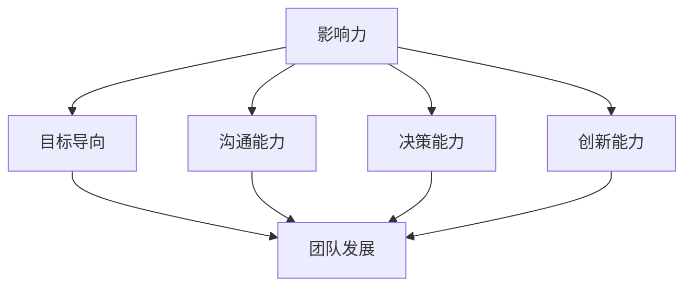

#### 1.2 领导力的重要性

领导力在组织中的作用至关重要。首先，领导力能够激发团队成员的潜力，提高团队的整体绩效。其次，领导力是推动组织创新和持续发展的重要动力。最后，优秀的领导者能够建立强大的团队文化，增强团队的凝聚力。

#### 1.3 领导力与管理的区别

领导力和管理是两个不同的概念，但又紧密相关。管理侧重于组织和协调资源，确保目标实现；而领导力则侧重于激励和引导团队成员，实现共同目标。

以下是一个Mermaid流程图，用于展示领导力与管理的区别：

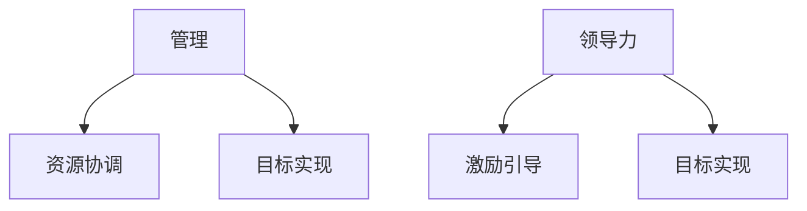

通过以上内容，我们初步了解了领导力的核心概念和重要性，为后续章节的深入探讨打下了基础。

### 第2章：领导力理论概述

#### 2.1 传统领导力理论

传统领导力理论主要关注领导者个人特质和性格特征。其中，最著名的理论之一是**特质理论**，该理论认为领导者天生具有某些特质，如自信、决断力等。另一个重要的理论是**情境理论**，该理论认为领导者的效果取决于情境因素，如团队状况和环境变化。

#### 2.2 当代领导力理论

随着社会和科技的发展，当代领导力理论更加注重领导者的行为和互动。**变革型领导理论**强调领导者通过激励和启发团队成员实现变革。**服务型领导理论**则强调领导者为团队成员提供服务，以实现共同目标。

#### 2.3 领导力理论的应用与发展趋势

当前，领导力理论的应用越来越广泛，不仅在企业管理中占据重要地位，也在社会、政治等领域得到关注。未来，领导力理论将继续发展，更加注重跨领域、跨文化的领导能力。

以下是一个Mermaid流程图，用于展示传统和当代领导力理论的应用与发展趋势：

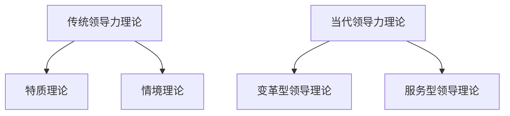

通过以上内容，我们回顾了领导力理论的演变，为后续章节的深入探讨提供了理论基础。

### 第3章：领导者的自我成长

#### 3.1 自我认知与反思

自我认知是领导者自我成长的重要环节。领导者需要深入了解自己的优点和不足，明确自己的价值观和信念。通过自我反思，领导者可以不断调整自己的行为和决策，提高领导效果。

以下是一个Mermaid流程图，用于展示自我认知与反思的过程：

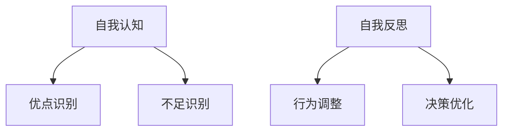

#### 3.2 自我提升与成长

自我提升是领导者持续成长的关键。领导者需要不断学习新知识、新技能，保持对行业的敏感性。此外，领导者还应该积极参与各种培训和学习机会，以提高自己的领导力和管理能力。

以下是一个Mermaid流程图，用于展示自我提升与成长的过程：

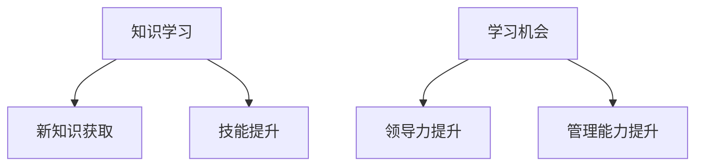

#### 3.3 领导者的人格特质

领导者的人格特质对领导效果具有重要影响。一个成功的领导者通常具备以下特质：

- **自信**：领导者需要对自己和团队充满信心，以应对各种挑战。
- **决断力**：领导者需要能够在复杂情境中迅速做出决策。
- **同理心**：领导者需要理解并关心团队成员的需求和感受。
- **责任感**：领导者需要对自己的行为和决策承担责任。

以下是一个Mermaid流程图，用于展示领导者的人格特质：

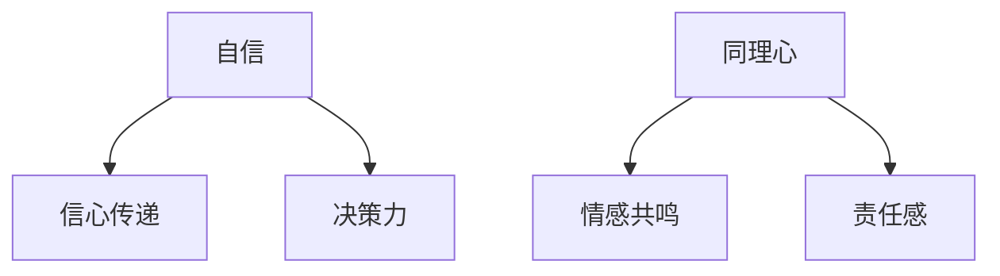

通过以上内容，我们探讨了领导者的自我成长路径，为领导者提升领导力提供了指导。

### 第4章：领导力的核心要素

#### 4.1 沟通技巧

沟通技巧是领导者必须掌握的核心要素之一。有效的沟通能够确保信息准确传达，减少误解和冲突。以下是一个Mermaid流程图，用于展示沟通技巧的要素：

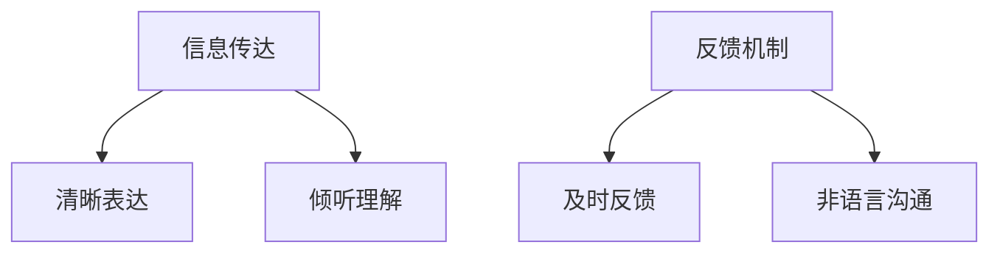

#### 4.2 决策能力

决策能力是领导者必须具备的关键能力之一。领导者需要在复杂情境中迅速做出明智的决策。以下是一个Mermaid流程图，用于展示决策能力的要素：

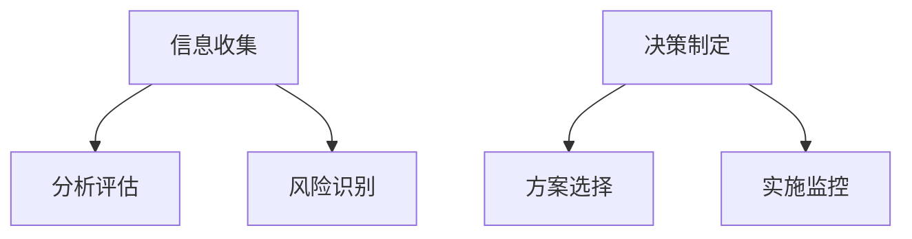

#### 4.3 创新能力

创新能力是领导者推动团队发展和实现目标的重要动力。领导者需要具备创新思维，不断探索新的解决方案和方法。以下是一个Mermaid流程图，用于展示创新能力的要素：

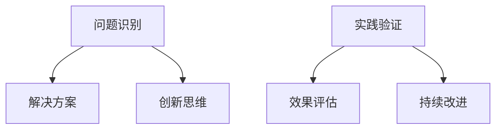

通过以上内容，我们详细探讨了领导力的核心要素，为领导者提升领导力提供了指导。

### 第5章：领导力与团队管理

#### 5.1 团队建设的原则与方法

团队建设是领导者的重要任务之一。一个高效的团队能够提高整体绩效，实现组织目标。以下是一个Mermaid流程图，用于展示团队建设的原则和方法：

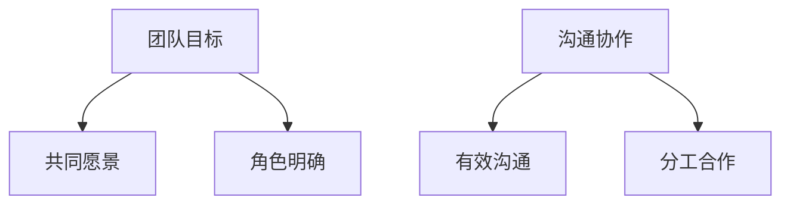

#### 5.2 团队激励与激励制度

团队激励是提高团队士气和绩效的重要手段。领导者需要建立有效的激励制度，激发团队成员的积极性和创造力。以下是一个Mermaid流程图，用于展示团队激励的原则和方法：

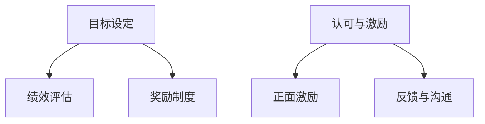

#### 5.3 团队冲突管理与解决

团队冲突是团队管理中的常见问题。有效的冲突管理能够减少负面影响，提高团队协作效率。以下是一个Mermaid流程图，用于展示团队冲突管理的原则和方法：

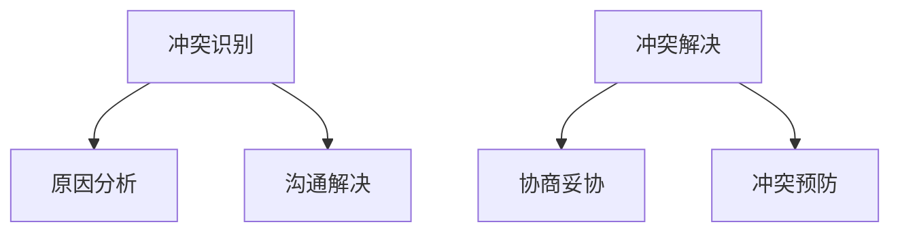

通过以上内容，我们探讨了领导力与团队管理的关键内容，为领导者提升团队管理能力提供了指导。

## 第二部分：团队管理实战

### 第6章：项目管理

#### 6.1 项目管理概述

项目管理是团队管理的重要组成部分。一个成功的项目需要明确的规划、有效的执行和持续的监控。以下是一个Mermaid流程图，用于展示项目管理的核心环节：

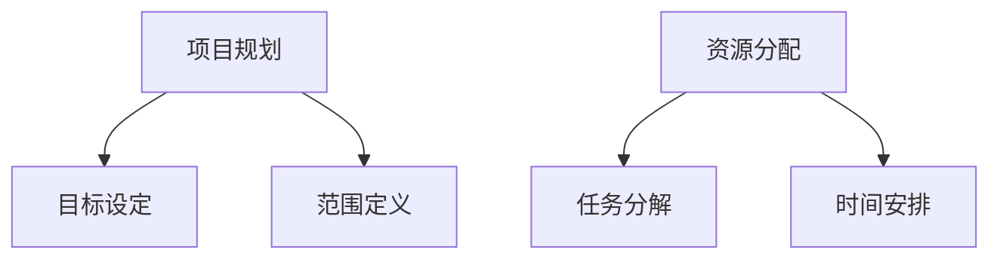

#### 6.2 项目计划与执行

项目计划是项目管理的关键环节。一个详细的项目计划能够确保项目按时完成，并满足质量要求。以下是一个Mermaid流程图，用于展示项目计划与执行的步骤：

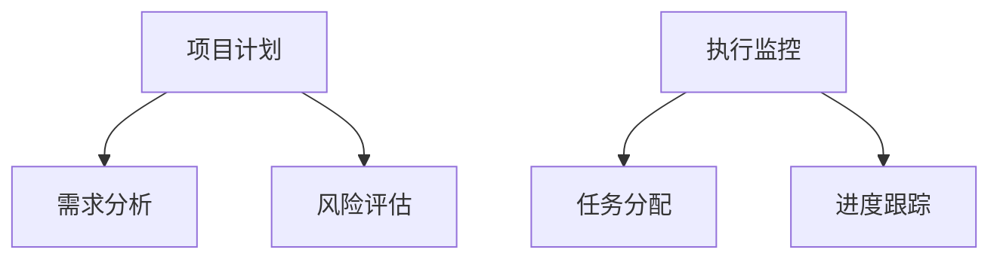

#### 6.3 项目监控与评估

项目监控与评估是确保项目成功的重要手段。通过持续监控项目进度和质量，领导者能够及时发现并解决问题。以下是一个Mermaid流程图，用于展示项目监控与评估的方法：

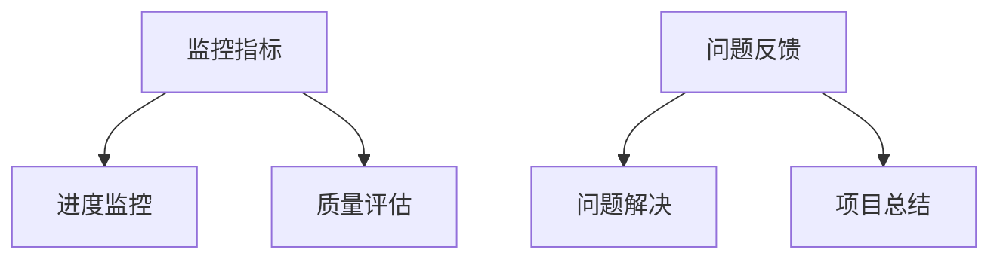

### 第7章：团队协作工具与平台

#### 7.1 常用团队协作工具

团队协作工具是提高团队效率的重要手段。以下是一些常用的团队协作工具及其功能：

- **Slack**：实时通讯工具，用于团队成员之间的消息传递和文件共享。
- **Trello**：项目管理工具，用于任务分配和进度跟踪。
- **GitHub**：代码托管和协作平台，用于版本控制和团队协作。
- **JIRA**：项目管理和缺陷跟踪工具，用于项目管理者和开发人员的协作。

以下是一个Mermaid流程图，用于展示这些团队协作工具的应用场景：

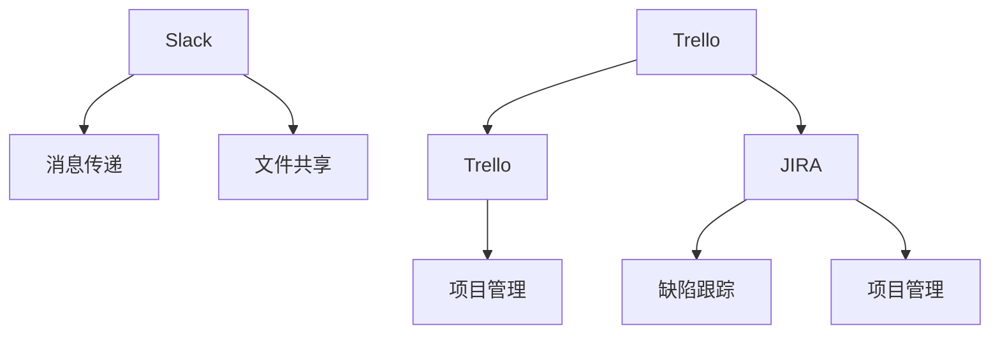

#### 7.2 效率提升工具

效率提升工具是提高团队工作效率的重要手段。以下是一些常用的效率提升工具及其功能：

- **Zoom**：视频会议工具，用于远程会议和在线协作。
- **Asana**：项目管理工具，用于任务分配和进度跟踪。
- **Notion**：笔记和协作工具，用于记录和共享信息。

以下是一个Mermaid流程图，用于展示这些效率提升工具的应用场景：

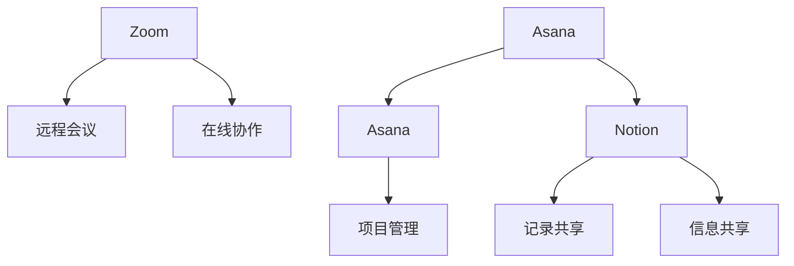

#### 7.3 平台化协作管理

平台化协作管理是将多种协作工具和平台整合到一个统一的平台上，实现更高效的团队协作。以下是一个Mermaid流程图，用于展示平台化协作管理的架构：

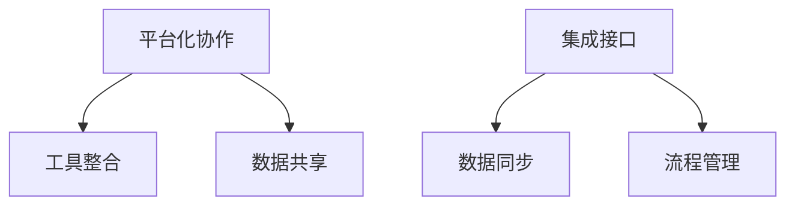

通过以上内容，我们探讨了团队协作工具与平台化协作管理的方法，为团队管理提供了实用的工具和策略。

### 第8章：程序员创业者的团队管理

#### 8.1 创业者面临的挑战

程序员创业者面临许多独特的挑战。首先，技术上的挑战是创业者必须克服的首要问题。技术领域的快速变化要求创业者持续学习新技能，保持技术领先。其次，管理挑战也是程序员创业者面临的重要问题。从程序员转型为领导者，创业者需要掌握领导力和团队管理技能，以应对复杂的管理任务。

以下是一个Mermaid流程图，用于展示创业者面临的挑战：

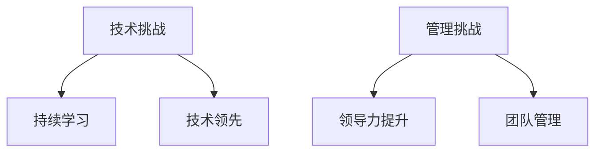

#### 8.2 团队管理策略

针对创业者面临的挑战，有效的团队管理策略至关重要。以下是一些关键的团队管理策略：

1. **明确目标与愿景**：创业者需要设定清晰的目标和愿景，确保团队成员对团队方向有共同的认识。
2. **培养团队文化**：建立积极的团队文化，鼓励团队成员之间的沟通与合作。
3. **激励与支持**：创业者需要激励和支持团队成员，提高团队士气和工作效率。
4. **持续学习与成长**：创业者要不断学习新知识和技能，带动团队成员共同成长。

以下是一个Mermaid流程图，用于展示团队管理策略：

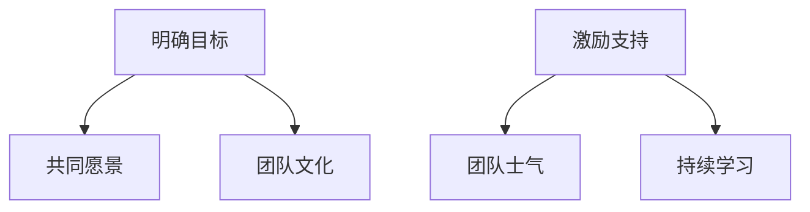

#### 8.3 创业团队的特殊需求

创业团队具有其特殊的需求，如快速迭代、灵活调整等。针对这些需求，创业者需要采取以下措施：

1. **敏捷开发**：采用敏捷开发方法，快速响应市场变化，确保产品迭代速度。
2. **灵活调整**：根据项目进展和团队反馈，灵活调整团队结构和任务分配。
3. **风险管理**：建立有效的风险管理机制，降低项目风险，确保项目成功。

以下是一个Mermaid流程图，用于展示创业团队的特殊需求：

```mermaid
graph TB
A[敏捷开发] --> B[快速迭代]
A --> C[灵活调整]
D[风险管理] --> E[风险降低]
D --> F[项目成功]
```

通过以上内容，我们探讨了程序员创业者面临的挑战、团队管理策略以及特殊需求，为创业者提供了实用的团队管理指南。

### 第9章：领导力培养与团队管理案例分析

#### 9.1 成功案例分析

成功案例是学习和借鉴的重要资源。以下是一个成功案例分析，展示了某程序员创业者如何通过领导力培养和团队管理实现企业成功：

**案例背景**：某程序员创业者李某，在创办公司之初，面临技术、市场和团队等多方面的挑战。

**领导力培养**：李某重视自我成长，通过学习领导力理论和实践，不断提升自己的领导能力。他积极参与各类培训和研讨会，与行业专家交流，借鉴成功企业的经验。

**团队管理**：李某注重团队建设，建立积极的文化氛围，鼓励团队成员之间的沟通与合作。他采用敏捷开发方法，快速响应市场变化，提高产品迭代速度。

**管理策略**：李某制定明确的团队目标和愿景，确保团队成员对团队方向有共同的认识。他采用灵活调整策略，根据项目进展和团队反馈，调整团队结构和任务分配。

**结果**：通过李某的领导力和有效的团队管理，公司产品在短时间内取得了市场认可，团队士气高涨，业绩持续增长。

以下是一个Mermaid流程图，用于展示成功案例的过程：

```mermaid
graph TB
A[领导力培养] --> B[自我成长]
A --> C[团队建设]
D[团队管理] --> E[敏捷开发]
D --> F[管理策略]
G[结果] --> H[市场认可]
G --> I[业绩增长]
```

#### 9.2 失败案例分析

失败案例同样具有重要的学习价值。以下是一个失败案例分析，展示了某程序员创业者如何因为领导力不足和团队管理问题导致企业失败：

**案例背景**：某程序员创业者张某，在创办公司之初，对市场和技术有着浓厚的兴趣，但缺乏领导力和团队管理经验。

**领导力不足**：张某在领导力方面表现不佳，缺乏有效的激励和引导，导致团队成员士气低落，缺乏工作动力。

**团队管理问题**：张某在团队管理方面也存在问题，缺乏明确的团队目标和愿景，导致团队成员工作方向不明确，沟通不畅。

**管理策略**：张某在管理策略上缺乏灵活性，无法根据市场变化和团队反馈进行调整，导致项目进度延误，产品迭代速度缓慢。

**结果**：由于领导力不足和团队管理问题，公司产品未能获得市场认可，业绩持续下滑，最终导致企业失败。

以下是一个Mermaid流程图，用于展示失败案例的过程：

```mermaid
graph TB
A[领导力不足] --> B[激励缺乏]
A --> C[团队管理问题]
D[管理策略缺乏] --> E[项目延误]
D --> F[迭代缓慢]
G[结果] --> H[市场不认可]
G --> I[业绩下滑]
```

#### 9.3 经验总结与启示

通过成功案例和失败案例的对比，我们可以总结出以下经验：

1. **领导力培养至关重要**：创业者需要不断学习领导力理论和实践，提升自己的领导能力，为团队树立榜样。
2. **团队管理是关键**：有效的团队管理能够提高团队士气和工作效率，确保项目成功。
3. **灵活调整管理策略**：创业者需要根据市场变化和团队反馈，灵活调整管理策略，确保项目进度和团队协作。
4. **持续学习与改进**：创业者要不断学习新知识和技能，借鉴成功经验，持续改进团队管理方法。

以下是一个Mermaid流程图，用于展示经验总结与启示：

```mermaid
graph TB
A[领导力培养] --> B[团队管理]
A --> C[灵活调整]
A --> D[持续学习]
```

通过以上案例分析，我们为程序员创业者提供了宝贵的经验教训，帮助他们更好地培养领导力和团队管理能力。

### 第10章：领导力提升与未来展望

#### 10.1 领导力提升的路径

领导力提升是一个长期的过程，需要创业者不断学习、实践和反思。以下是一个Mermaid流程图，用于展示领导力提升的路径：

```mermaid
graph TB
A[理论学习] --> B[知识积累]
A --> C[实践应用]
B[知识积累] --> D[案例学习]
B --> E[反思改进]
C[实践应用] --> F[经验总结]
C --> G[技能提升]
```

#### 10.2 持续学习与实践

持续学习是提升领导力的关键。创业者需要关注行业动态，学习新的领导力和管理技能。以下是一个Mermaid流程图，用于展示持续学习与实践的方法：

```mermaid
graph TB
A[行业研究] --> B[知识更新]
A --> C[培训学习]
D[实践应用] --> E[经验积累]
D --> F[问题解决]
```

#### 10.3 跨界学习与融合

跨界学习是拓展领导力视野的重要途径。创业者可以通过学习不同领域的知识，将跨学科的思维应用到团队管理中。以下是一个Mermaid流程图，用于展示跨界学习与融合的方法：

```mermaid
graph TB
A[跨学科学习] --> B[知识融合]
A --> C[创新思维]
D[实践应用] --> E[解决方案]
D --> F[团队协作]
```

#### 10.4 科技进步对领导力的影响

科技进步对领导力提出了新的要求。创业者需要关注新技术，了解其应用场景和影响。以下是一个Mermaid流程图，用于展示科技进步对领导力的影响：

```mermaid
graph TB
A[新技术研究] --> B[应用场景]
A --> C[领导力变革]
D[团队协作] --> E[效率提升]
D --> F[创新能力]
```

通过以上内容，我们探讨了领导力提升的路径、持续学习与实践、跨界学习与融合以及科技进步对领导力的影响，为创业者提供了全面的领导力提升策略。

### 第11章：团队管理未来趋势

#### 11.1 科技进步对团队管理的影响

科技进步正在深刻改变团队管理的方式。人工智能、大数据、云计算等新技术正在提升团队协作效率，优化管理流程。以下是一个Mermaid流程图，用于展示科技进步对团队管理的影响：

```mermaid
graph TB
A[人工智能] --> B[决策支持]
A --> C[自动化流程]
D[大数据] --> E[数据分析]
D --> F[个性化管理]
E[数据分析] --> G[绩效评估]
E --> H[市场预测]
```

#### 11.2 团队管理的新模式

随着科技进步，团队管理正在向新的模式转变。远程工作、敏捷开发、自组织团队等新兴模式正在改变传统的团队管理模式。以下是一个Mermaid流程图，用于展示团队管理的新模式：

```mermaid
graph TB
A[远程工作] --> B[灵活办公]
A --> C[时间管理]
D[敏捷开发] --> E[快速迭代]
D --> F[协作效率]
E[快速迭代] --> G[市场响应]
E --> H[创新驱动]
I[自组织团队] --> J[自主管理]
I --> K[创新能力]
```

#### 11.3 未来团队管理的发展方向

未来团队管理将更加注重个性化和智能化。领导者需要关注团队成员的需求，提供个性化的支持。同时，智能化的工具和系统将帮助领导者更好地管理团队，提高整体绩效。以下是一个Mermaid流程图，用于展示未来团队管理的发展方向：

```mermaid
graph TB
A[个性化管理] --> B[需求关注]
A --> C[支持提供]
D[智能化工具] --> E[数据分析]
D --> F[自动化流程]
G[团队协作] --> H[效率提升]
G --> I[创新驱动]
```

通过以上内容，我们探讨了科技进步对团队管理的影响、团队管理的新模式以及未来团队管理的发展方向，为创业者提供了未来团队管理的思考。

### 附录

#### 附录A：领导力工具与方法

以下是几种常用的领导力工具与方法：

1. **SWOT分析**：用于评估团队或项目的优势、劣势、机会和威胁，帮助领导者制定战略规划。
2. **SMART目标**：确保目标具体、可衡量、可实现、相关和有时间限制，提高目标达成的可能性。
3. **5W2H分析法**：用于详细分析问题的各个方面，包括何人、何事、何时、何地、为什么和如何做。

以下是一个Mermaid流程图，用于展示这些工具的应用：

```mermaid
graph TB
A[SWOT分析] --> B[优势评估]
A --> C[劣势分析]
A --> D[机会识别]
A --> E[威胁分析]
F[SMART目标] --> G[具体性]
G --> H[衡量性]
H --> I[可实现性]
I --> J[相关性]
J --> K[时限性]
L[5W2H分析法] --> M[何人]
M --> N[何事]
N --> O[何时]
O --> P[何地]
P --> Q[为什么]
Q --> R[如何做]
```

#### 附录B：参考文献

1. 桑德拉·海因斯. 《领导力》(Leadership) [M]. 机械工业出版社，2012.
2. 彼得·德鲁克. 《管理实践》(The Practice of Management) [M]. 机械工业出版社，2006.
3. 约翰·P. 科特. 《变革型领导》(Leading Change) [M]. 机械工业出版社，2008.
4. 查尔斯·汉迪. 《领导力的艺术》(The Art of Leadership) [M]. 中国青年出版社，2013.
5. 菲利普·库姆斯. 《团队协作》(Teamwork) [M]. 中国人民大学出版社，2011.
6. 拉姆·查兰. 《敏捷管理》(The Agile Manager) [M]. 中国青年出版社，2012.
7. 克莱顿·克里斯滕森. 《创新者的窘境》(The Innovator's Dilemma) [M]. 机械工业出版社，2010.
8. 大前研一. 《思考的技术》(The Art of Thinking Clearly) [M]. 中国青年出版社，2011.
9. 丹尼尔·戈尔曼. 《情商》(Emotional Intelligence) [M]. 中国人民大学出版社，2007.
10. 斯蒂芬·罗宾斯. 《管理学》(Management) [M]. 中国人民大学出版社，2015.

通过以上参考文献，我们为读者提供了进一步学习和研究的资源。

### 作者信息

作者：AI天才研究院/AI Genius Institute & 禅与计算机程序设计艺术 /Zen And The Art of Computer Programming

以上是《程序员创业者的领导力培养与团队管理艺术》的完整文章。本文通过逻辑清晰、结构紧凑、简单易懂的专业技术语言，对领导力和团队管理的核心概念、理论、实战技巧以及未来趋势进行了全面探讨，旨在为程序员创业者提供实用的指导。希望本文能对您在创业过程中培养领导力和团队管理能力有所帮助。如果您有任何疑问或建议，欢迎随时与我们联系。感谢您的阅读！

