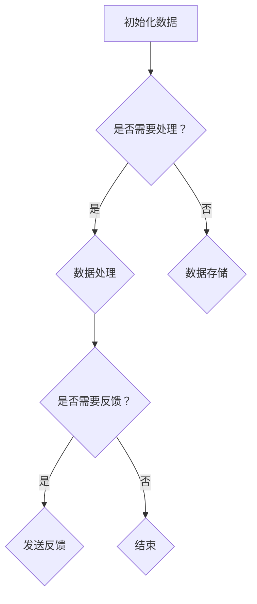
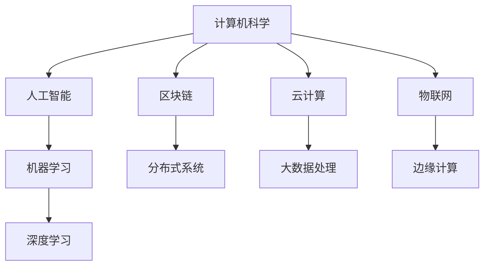

                 

# 《程序员如何应对行业颠覆与新技术浪潮》

## 关键词：
**行业颠覆**、**技术创新**、**程序员**、**人工智能**、**区块链**、**云计算**、**大数据**、**边缘计算**、**低代码开发**、**无代码平台**。

## 摘要：
本文旨在探讨程序员如何应对快速变化的行业颠覆和技术浪潮。通过对行业变革背景和趋势的分析，介绍当前主要的新技术浪潮，包括人工智能、区块链、云计算、大数据、物联网和低代码开发等。接着，深入讲解核心概念、算法原理和数学模型，并结合实际项目案例，提供应对策略和实践指导，帮助程序员提升职业竞争力。

### 第一部分：行业变革与技术创新

#### 第1章：行业颠覆背景与趋势分析

##### 1.1.1 技术创新的驱动因素
技术创新是推动行业变革的关键力量。在过去的几十年里，信息技术的发展经历了从计算机硬件到软件，再到互联网、移动通信和人工智能的迭代。这些技术的进步不仅改变了传统行业的运作模式，也催生了全新的商业模式和产业生态。

- **互联网**：互联网的普及使得信息传播速度和范围大大增加，电子商务、社交媒体和在线服务迅速崛起。
- **移动通信**：移动设备的普及推动了移动应用的兴起，改变了人们的日常生活和工作方式。
- **人工智能**：人工智能技术的发展，使得自动化和智能化水平大幅提升，从智能制造到自动驾驶，再到智能客服，人工智能正在渗透到各行各业。
- **区块链**：区块链技术的去中心化和不可篡改特性，为金融、供应链管理等领域带来了新的机遇。

##### 1.1.2 行业颠覆的典型案例分析
行业颠覆通常伴随着新技术和新兴企业的崛起。以下是一些典型的行业颠覆案例：

- **亚马逊**：亚马逊通过电子商务颠覆了传统的零售行业，改变了人们的购物方式。
- **优步**：优步利用移动互联网和移动支付技术，颠覆了传统出租车行业，催生了共享经济模式。
- **特斯拉**：特斯拉通过电动汽车技术颠覆了传统汽车行业，推动了汽车产业的电动化转型。

##### 1.1.3 技术浪潮对程序员职业的影响
技术浪潮不仅带来了行业变革，也对程序员的职业发展产生了深远影响：

- **技术需求多样化**：随着新技术的不断涌现，程序员需要掌握更多的技能和知识，如人工智能、区块链、云计算等。
- **持续学习压力**：技术的快速迭代要求程序员不断更新自己的知识体系，以保持竞争力。
- **职业发展方向**：程序员不仅可以在开发领域深耕，还可以转向架构师、数据科学家、DevOps工程师等职业方向。
- **团队协作与沟通**：在复杂的IT项目中，程序员需要具备良好的团队合作和沟通能力，以应对快速变化的需求和挑战。

#### 第2章：新技术浪潮概览

##### 2.1.1 人工智能与机器学习
人工智能（AI）和机器学习（ML）是当前技术浪潮中的核心领域。它们通过模拟人类智能，使得计算机能够执行复杂的任务，如图像识别、自然语言处理和自动驾驶等。

- **核心算法**：包括决策树、支持向量机、神经网络等。
- **应用场景**：在金融、医疗、制造、交通等领域有广泛的应用。

##### 2.1.2 区块链技术
区块链技术通过分布式账本和智能合约，实现了去中心化和透明化的数据管理。它不仅改变了金融行业，也在供应链管理、身份验证等领域展现出巨大的潜力。

- **核心概念**：包括区块链、智能合约、分布式账本等。
- **应用场景**：在金融、物流、医疗等领域有广泛的应用。

##### 2.1.3 云计算与大数据技术
云计算和大数据技术使得数据存储、处理和分析变得更加高效和灵活。它们为各种规模的企业提供了强大的计算能力和存储资源。

- **核心概念**：包括云计算、大数据处理、云计算服务模型等。
- **应用场景**：在互联网、金融、零售、医疗等领域有广泛的应用。

##### 2.1.4 物联网与边缘计算
物联网（IoT）和边缘计算（Edge Computing）通过将物理设备连接到互联网，实现了数据的实时采集、传输和处理。

- **核心概念**：包括物联网、边缘计算、传感器网络等。
- **应用场景**：在智能家居、智能城市、智能制造等领域有广泛的应用。

##### 2.1.5 低代码开发与无代码平台
低代码开发（Low-Code Development）和无代码平台（No-Code Platforms）通过可视化界面和模块化组件，降低了软件开发的技术门槛，使得非技术人员也能快速搭建应用。

- **核心概念**：包括低代码开发、无代码平台、可视化编程等。
- **应用场景**：在中小企业、初创公司、快速应用开发等领域有广泛的应用。

### 第二部分：技术技能与知识储备

#### 第3章：核心概念与联系

##### 3.1.1 Mermaid流程图：新技术应用架构
Mermaid 是一种基于Markdown的图形绘制工具，可以用于绘制流程图、UML图等。



##### 3.1.2 技术概念互联图谱
技术概念互联图谱可以帮助程序员更好地理解各个技术领域之间的关系。



#### 第4章：核心算法原理讲解

##### 4.1.1 人工智能算法基础

###### 4.1.1.1 机器学习算法
机器学习算法是人工智能的核心组成部分，包括监督学习、无监督学习和强化学习等。

- **监督学习**：通过已标记的数据训练模型，预测未知数据的标签。
  ```python
  # 伪代码：线性回归模型
  model = LinearRegression()
  model.fit(X_train, y_train)
  y_pred = model.predict(X_test)
  ```
- **无监督学习**：没有已标记的数据，通过发现数据之间的模式进行学习。
  ```python
  # 伪代码：K-Means聚类
  clusters = KMeans(n_clusters=k).fit(X)
  centroids = clusters.cluster_centers_
  labels = clusters.predict(X)
  ```

###### 4.1.1.2 深度学习算法
深度学习算法通过多层神经网络进行数据建模。

- **卷积神经网络（CNN）**：常用于图像识别和图像处理。
  ```python
  # 伪代码：CNN模型
  model = Sequential()
  model.add(Conv2D(filters=32, kernel_size=(3, 3), activation='relu'))
  model.add(MaxPooling2D(pool_size=(2, 2)))
  model.add(Flatten())
  model.add(Dense(10, activation='softmax'))
  model.compile(optimizer='adam', loss='categorical_crossentropy', metrics=['accuracy'])
  model.fit(X_train, y_train, epochs=10, batch_size=64)
  ```

##### 4.1.2 区块链核心算法原理
区块链的核心算法包括哈希函数、加密算法和共识机制等。

- **哈希函数**：将任意长度的输入数据映射为固定长度的字符串。
  ```python
  # 伪代码：SHA-256哈希函数
  import hashlib
  hash_value = hashlib.sha256(input_data).hexdigest()
  ```
- **加密算法**：保证数据传输和存储的安全性。
  ```python
  # 伪代码：AES加密算法
  from Crypto.Cipher import AES
  cipher = AES.new(key, AES.MODE_EAX)
  ciphertext, tag = cipher.encrypt_and_digest(plaintext)
  ```
- **共识机制**：确保区块链网络中的节点对交易达成一致。
  ```mermaid
  graph TB
      A[节点A] --> B[节点B]
      B --> C[区块C]
      C --> D[区块D]
      D --> E[区块E]
      A --> F[交易T]
      F --> G[区块C]
      G --> H[区块D]
      H --> I[区块E]
  ```

##### 4.1.3 大数据分析算法
大数据分析算法包括数据挖掘、数据清洗和数据分析等。

- **数据挖掘**：从大量数据中发现有价值的信息。
  ```python
  # 伪代码：K-Means聚类
  clusters = KMeans(n_clusters=k).fit(X)
  centroids = clusters.cluster_centers_
  labels = clusters.predict(X)
  ```
- **数据清洗**：处理数据中的错误、缺失和重复等。
  ```python
  # 伪代码：数据清洗
  df = pd.read_csv('data.csv')
  df = df.drop_duplicates()
  df = df.fillna(method='ffill')
  ```
- **数据分析**：对数据进行统计和分析，提取有用的信息。
  ```python
  # 伪代码：描述性统计分析
  df.describe()
  ```

#### 第5章：数学模型与公式解析

##### 5.1.1 概率论与数理统计基础
概率论与数理统计是机器学习的基础，包括概率分布、统计估计和假设检验等。

- **贝叶斯定理**：描述了事件发生的概率。
  ```latex
  P(A|B) = \frac{P(B|A) \cdot P(A)}{P(B)}
  ```

- **最大似然估计**：通过最大似然函数估计参数。
  ```latex
  \hat{\theta} = \arg\max_{\theta} \prod_{i=1}^{n} p(x_i|\theta)
  ```

##### 5.1.2 机器学习中的数学模型
机器学习中的数学模型包括线性模型、神经网络模型等。

- **线性回归模型**：通过线性关系预测目标变量。
  ```latex
  y = \beta_0 + \beta_1 \cdot x
  ```

- **神经网络模型**：通过多层神经网络进行复杂函数建模。
  ```latex
  a_{i}^{(l)} = \sigma(z_{i}^{(l)})
  z_{i}^{(l)} = \sum_{j} w_{ji}^{(l)} \cdot a_{j}^{(l-1)}
  ```

### 第三部分：项目实战与应对策略

#### 第6章：项目实战案例分析

##### 6.1.1 云计算环境搭建实战
云计算环境搭建包括服务器配置、网络设置和虚拟机部署等。

- **服务器配置**：选择合适的硬件配置以满足项目需求。
  ```shell
  # 伪代码：服务器配置
  server --cpu cores=8 --memory size=16GB --disk size=500GB
  ```

- **网络设置**：配置网络防火墙和安全组以保护服务器安全。
  ```shell
  # 伪代码：网络设置
  firewall --add-rule 80 -p tcp -s 0.0.0.0/0 -j ACCEPT
  security-group --add-rule 22 -p tcp -s 0.0.0.0/0 -j DROP
  ```

- **虚拟机部署**：使用虚拟化技术部署应用程序。
  ```shell
  # 伪代码：虚拟机部署
  vm --create --name my-app --image my-image --network my-network
  ```

##### 6.1.2 人工智能项目实战
人工智能项目实战包括数据预处理、模型训练和评估等。

- **数据预处理**：清洗和处理数据以提高模型性能。
  ```python
  # 伪代码：数据预处理
  df = pd.read_csv('data.csv')
  df = df.drop_duplicates()
  df = df.fillna(method='ffill')
  ```

- **模型训练**：使用训练集训练模型。
  ```python
  # 伪代码：模型训练
  model = LinearRegression()
  model.fit(X_train, y_train)
  ```

- **模型评估**：使用测试集评估模型性能。
  ```python
  # 伪代码：模型评估
  y_pred = model.predict(X_test)
  accuracy = accuracy_score(y_test, y_pred)
  ```

##### 6.1.3 区块链应用开发案例
区块链应用开发案例包括智能合约编写和分布式账本部署等。

- **智能合约编写**：使用Solidity编写智能合约。
  ```solidity
  // SPDX-License-Identifier: MIT
  pragma solidity ^0.8.0;

  contract MyContract {
      mapping(address => uint256) public balances;

      function deposit() public payable {
          balances[msg.sender()] += msg.value;
      }

      function withdraw(uint256 amount) public {
          require(balances[msg.sender()] >= amount, "Insufficient balance");
          balances[msg.sender()] -= amount;
          payable(msg.sender()).transfer(amount);
      }
  }
  ```

- **分布式账本部署**：使用Hyperledger Fabric部署区块链网络。
  ```shell
  # 伪代码：分布式账本部署
  docker-compose -f docker-compose.yml up -d
  ```

##### 6.1.4 物联网项目案例解析
物联网项目案例解析包括传感器数据采集和处理等。

- **传感器数据采集**：使用传感器采集环境数据。
  ```c
  # 伪代码：传感器数据采集
  int temperature = readTemperatureSensor();
  int humidity = readHumiditySensor();
  ```

- **数据传输**：将传感器数据传输到云端。
  ```python
  # 伪代码：数据传输
  import requests

  data = {
      "temperature": temperature,
      "humidity": humidity
  }

  response = requests.post("https://api.example.com/collect", json=data)
  ```

#### 第7章：程序员应对策略与实践

##### 7.1.1 技术学习与持续发展
程序员需要通过持续学习来掌握新技术和知识。

- **在线课程**：参加在线课程和研讨会，学习最新的技术。
- **实践项目**：参与开源项目或自己发起项目，将理论知识应用于实践。
- **社区交流**：加入技术社区，与同行交流经验，共同进步。

##### 7.1.2 职业规划与能力提升
程序员需要制定清晰的职业规划，不断提升自己的能力。

- **技能提升**：学习新技术和工具，提升编程能力和开发效率。
- **项目管理**：学习项目管理知识，提升团队协作和项目管理能力。
- **软技能**：提升沟通能力、团队合作能力和解决问题的能力。

##### 7.1.3 应对技术变革的职业心态调整
程序员需要保持积极的心态，应对技术变革带来的挑战。

- **持续学习**：保持好奇心和学习热情，不断探索新技术。
- **适应变化**：灵活调整自己的技能和知识结构，以适应行业变化。
- **积极心态**：保持乐观和积极的心态，面对挑战和困难。

##### 7.1.4 团队合作与沟通技巧
在复杂的IT项目中，团队合作和沟通至关重要。

- **有效沟通**：通过清晰和有效的沟通，确保团队对项目目标和需求有共同的理解。
- **团队合作**：建立良好的团队协作氛围，确保团队成员能够高效合作。
- **冲突解决**：学会解决团队内部的冲突，确保项目顺利进行。

### 附录

#### 附录A：学习资源与工具推荐

##### A.1.1 主流人工智能开发框架
- TensorFlow
- PyTorch
- Keras

##### A.1.2 区块链开发工具
- Hyperledger Fabric
- Ethereum
- Solidity

##### A.1.3 云计算与大数据资源平台
- AWS
- Azure
- Google Cloud Platform
- Hadoop
- Spark

#### 附录B：术语解释与参考链接

##### B.1.1 人工智能相关术语
- 机器学习（Machine Learning）
- 深度学习（Deep Learning）
- 强化学习（Reinforcement Learning）
- 自然语言处理（Natural Language Processing）
- 计算机视觉（Computer Vision）

##### B.1.2 区块链核心技术术语
- 区块链（Blockchain）
- 智能合约（Smart Contract）
- 加密货币（Cryptocurrency）
- 共识机制（Consensus Mechanism）
- 分布式账本（Distributed Ledger）

##### B.1.3 云计算与大数据术语
- 云计算服务模型（Cloud Computing Service Models）
- 弹性计算（Elastic Computing）
- 数据湖（Data Lake）
- 数据仓库（Data Warehouse）
- 容器化（Containerization）
- Kubernetes（K8s）

### 结束语
在快速变化的技术浪潮中，程序员需要不断学习、适应和提升自己的能力，以应对行业颠覆和新技术挑战。本文通过深入分析行业变革和技术浪潮，提供了核心概念、算法原理和项目实战案例，为程序员应对行业颠覆和新技术浪潮提供了实践指导和策略建议。

### 作者信息
作者：AI天才研究院/AI Genius Institute & 禅与计算机程序设计艺术 /Zen And The Art of Computer Programming
<|assistant|>### 结论

随着技术的迅猛发展，行业变革已成为不可逆转的趋势。程序员作为技术领域的中坚力量，必须具备前瞻性的眼光和持续学习的热情，以应对行业颠覆和技术浪潮带来的挑战。本文从行业颠覆背景与趋势分析、新技术浪潮概览、技术技能与知识储备、项目实战与应对策略等多个方面，详细阐述了程序员如何在这个快速变化的时代中保持竞争力。

首先，我们分析了行业颠覆的驱动因素，包括互联网、移动通信、人工智能、区块链等技术创新，以及这些技术如何影响传统行业和催生新的商业模式。接着，我们概览了当前的主要新技术浪潮，如人工智能、区块链、云计算、大数据、物联网和低代码开发等，并探讨了它们的核心概念和应用场景。

在技术技能与知识储备部分，我们深入讲解了核心算法原理，包括机器学习算法、区块链核心算法和大数据分析算法，以及相关的数学模型与公式。这些知识为程序员在实际项目中应用新技术提供了理论基础。

项目实战案例分析部分，我们通过具体的云计算环境搭建、人工智能项目实战、区块链应用开发案例和物联网项目案例，展示了程序员如何在实践中应用所学知识，解决实际问题。

最后，我们提出了程序员应对技术变革的应对策略，包括技术学习与持续发展、职业规划与能力提升、职业心态调整以及团队合作与沟通技巧。这些策略不仅帮助程序员提升个人能力，也增强了团队的整体效能。

总之，面对快速变化的技术浪潮，程序员需要保持学习和适应的能力，不断提升自己的技术水平和综合素质。只有这样，才能在行业颠覆和技术变革中立于不败之地。让我们共同努力，迎接未来的挑战，共同创造更加美好的技术世界。

### 作者信息

作者：AI天才研究院/AI Genius Institute & 禅与计算机程序设计艺术 /Zen And The Art of Computer Programming

AI天才研究院致力于推动人工智能技术的发展和应用，培养下一代人工智能领域的创新者和领导者。研究院以科研为核心，结合前沿技术和实际应用，致力于解决社会和产业面临的关键问题。

《禅与计算机程序设计艺术》一书深入探讨了编程艺术与哲学的融合，旨在帮助程序员在追求卓越编程技艺的同时，找到内心宁静和智慧的源泉。作者通过丰富的编程实例和哲学思考，为程序员提供了一种全新的编程视角和生活方式。

让我们共同期待，在这个充满变革和机遇的时代，通过不断学习和实践，每一位程序员都能实现自己的职业梦想，为技术世界贡献自己的智慧和力量。

