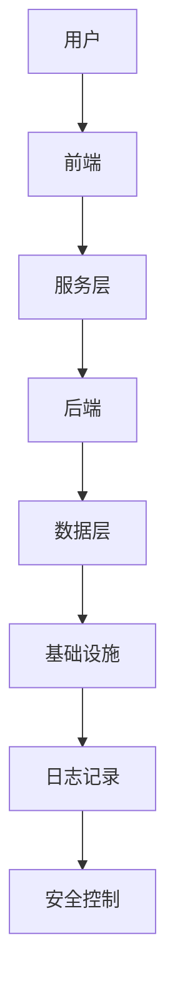
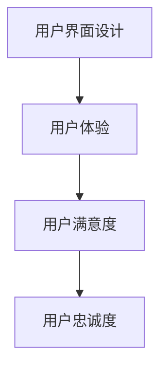

                 

# 《程序员如何打造千万美元估值的SaaS产品》

## 文章关键词
- SaaS产品
- 千万美元估值
- 产品开发
- 增长策略
- 安全性
- 用户界面设计

## 文章摘要
本文将深入探讨程序员如何打造具有千万美元估值的SaaS产品。从市场分析、产品架构设计、用户体验优化到营销与推广，再到商业模式的构建和持续迭代，我们将一步步解析成功的关键要素。通过分析成功案例和实战经验，本文旨在为程序员提供切实可行的指导，助力他们打造出高价值、用户喜爱的SaaS产品。

### 目录大纲

# 《程序员如何打造千万美元估值的SaaS产品》

## 第一部分：SaaS基础与市场分析

### 第1章：SaaS概述

#### 1.1 SaaS的定义与特点

#### 1.2 SaaS的发展历程

#### 1.3 SaaS市场现状及趋势

### 第2章：SaaS产品设计与开发

#### 2.1 SaaS产品架构设计

#### 2.2 前端技术栈

#### 2.3 后端技术栈

#### 2.4 数据库选择与应用

### 第3章：用户界面与用户体验

#### 3.1 设计原则

#### 3.2 响应式设计

#### 3.3 性能优化

#### 3.4 用户体验测试

### 第4章：安全性保障

#### 4.1 数据安全策略

#### 4.2 身份认证与授权

#### 4.3 API安全

#### 4.4 定制化安全方案

### 第5章：营销与推广

#### 5.1 市场定位

#### 5.2 营销渠道选择

#### 5.3 内容营销

#### 5.4 社交媒体营销

### 第6章：SaaS商业模式

#### 6.1 商业模式设计

#### 6.2 订阅模式

#### 6.3 免费试用模式

#### 6.4 扩张与变现策略

## 第二部分：千万美元SaaS产品实战

### 第7章：千万美元SaaS产品的成功案例

#### 7.1 案例一：Airtable

#### 7.2 案例二：Asana

#### 7.3 案例三：Slack

### 第8章：打造千万美元SaaS产品的关键要素

#### 8.1 产品创新

#### 8.2 团队建设

#### 8.3 用户反馈与迭代

#### 8.4 跨部门协作

### 第9章：增长策略与市场扩张

#### 9.1 增长黑客策略

#### 9.2 拓展海外市场

#### 9.3 品牌建设

#### 9.4 定价策略

### 第10章：持续优化与迭代

#### 10.1 产品迭代流程

#### 10.2 技术升级

#### 10.3 用户体验提升

#### 10.4 竞争分析

## 附录

### 附录A：SaaS开发工具与资源

#### A.1 开发工具概览

#### A.2 持续集成与部署

#### A.3 性能监控与日志分析

#### A.4 安全防护工具推荐

### 附录B：参考书籍与论文

#### B.1 推荐书籍

#### B.2 经典论文

#### B.3 学术资源与报告

### 附录C：常见问题与解答

#### C.1 SaaS产品开发常见问题

#### C.2 运营与管理问题

#### C.3 用户反馈与处理

#### C.4 安全与合规问题

---

## 第1章：SaaS概述

SaaS（Software as a Service，软件即服务）是一种基于云计算的软件应用交付模式。在这个模式下，软件服务提供商通过互联网向用户交付软件应用，用户无需购买和安装软件，只需通过互联网订阅并使用服务。SaaS模式为用户提供了便捷、灵活且成本效益高的软件使用方式，也成为了现代IT领域的重要趋势。

### 1.1 SaaS的定义与特点

#### 1.1.1 什么是SaaS

SaaS的基本概念可以概括为以下几点：

1. **云服务**：SaaS产品基于云计算技术，用户通过互联网访问服务。
2. **订阅模式**：用户按需订阅SaaS服务，根据使用量或订阅期限支付费用。
3. **无需安装**：用户无需购买和安装软件，只需通过浏览器或特定客户端访问。
4. **维护与更新**：SaaS提供商负责软件的维护和更新。

#### 1.1.2 SaaS的主要特点

- **便捷性**：用户无需购买和维护硬件，即可使用SaaS服务。
- **灵活性**：用户可以根据需求灵活调整订阅计划和服务内容。
- **成本效益**：用户只需支付订阅费用，避免了高昂的软件许可和硬件投资。
- **可扩展性**：SaaS服务可以根据用户需求进行扩展。
- **安全性**：SaaS提供商通常提供高等级的数据保护和备份服务。

#### 1.1.3 SaaS与传统软件的区别

- **交付方式**：传统软件需要用户自行安装和运行，而SaaS通过互联网提供。
- **成本**：传统软件通常涉及高额的许可费用，而SaaS采用按需订阅模式。
- **维护与更新**：传统软件需要用户自行维护和更新，SaaS提供商负责这些工作。
- **用户依赖**：传统软件用户通常对特定软件有较高依赖，而SaaS用户对软件的依赖性较低。

### 1.2 SaaS的发展历程

#### 1.2.1 SaaS的起源

SaaS的概念起源于20世纪90年代末和21世纪初。最早的SaaS产品之一是Salesforce.com，成立于1999年，它提供基于云计算的CRM（客户关系管理）服务。

#### 1.2.2 SaaS的兴起

随着互联网的普及和云计算技术的发展，SaaS模式在21世纪初迅速兴起。这一时期，许多公司开始采用SaaS服务，替代传统的软件安装模式。

#### 1.2.3 SaaS的成熟与发展趋势

近年来，SaaS市场持续增长，应用范围也从传统的CRM、ERP（企业资源规划）扩展到协作工具、项目管理、人力资源管理等领域。未来，随着人工智能、物联网等技术的发展，SaaS将继续发展，并呈现出以下趋势：

- **云原生SaaS**：云原生技术将推动SaaS产品的开发和部署更加高效。
- **定制化与个性化**：SaaS产品将更加注重用户的个性化需求，提供定制化的解决方案。
- **跨平台与集成**：SaaS产品将更加强调跨平台和与其他应用的集成。

### 1.3 SaaS市场现状及趋势

#### 1.3.1 全球SaaS市场概述

根据市场研究机构的数据，全球SaaS市场在过去几年中保持了高速增长。预计未来几年，这一增长趋势将持续，SaaS市场的规模将进一步扩大。

#### 1.3.2 主要市场参与者

全球SaaS市场中，有多个大型企业占据主导地位，包括Salesforce、Microsoft、Adobe等。同时，许多新兴的SaaS公司也在不断崛起。

#### 1.3.3 行业趋势与机遇

SaaS行业的趋势和机遇包括：

- **云计算的普及**：云计算技术的进一步普及将为SaaS市场提供更多机会。
- **移动化**：移动设备的普及使得SaaS产品更加便捷，用户可以随时随地访问服务。
- **人工智能与大数据**：人工智能和大数据技术将提高SaaS产品的智能程度和个性化水平。
- **行业垂直应用**：SaaS产品将更加注重行业垂直应用，提供针对性的解决方案。

综上所述，SaaS作为一种新兴的软件交付模式，具有巨大的市场潜力和发展空间。对于程序员来说，掌握SaaS产品的设计和开发技术，将有助于他们在竞争激烈的IT市场中脱颖而出。

### 1.4 SaaS产品架构设计

SaaS产品的架构设计是确保产品稳定、安全、可扩展的关键。一个良好的SaaS架构应该具备高可用性、高可扩展性和高性能，同时易于维护和升级。

#### 1.4.1 SaaS产品架构概述

SaaS产品架构通常包括以下几个关键部分：

1. **前端**：负责用户界面的交互和用户体验，通常使用HTML、CSS和JavaScript构建。
2. **后端**：处理业务逻辑和数据存储，通常使用应用服务器、数据库和中间件等组件。
3. **数据层**：负责数据的存储、管理和访问，通常包括关系型数据库和非关系型数据库。
4. **服务层**：提供公共服务，如身份认证、授权、日志记录等。
5. **基础设施**：包括服务器、网络、存储和安全等基础设施组件。

#### 1.4.2 SaaS架构的关键组成部分

- **前端架构**：前端架构决定了用户界面和交互体验的质量。常见的框架和库包括React、Vue.js、Angular等。
- **后端架构**：后端架构决定了业务逻辑的处理效率和稳定性。常见的框架和库包括Spring Boot、Django、Express等。
- **数据库架构**：数据库架构决定了数据存储和访问的性能。关系型数据库如MySQL、PostgreSQL，非关系型数据库如MongoDB、Cassandra等都有其适用的场景。
- **服务层架构**：服务层架构提供了通用的公共服务，如身份认证、授权、日志记录等，提高了系统的模块化和可维护性。
- **基础设施架构**：基础设施架构包括服务器、网络、存储和安全等组件，决定了系统的可扩展性和可靠性。

#### 1.4.3 SaaS架构的设计原则

- **模块化**：将系统划分为独立的模块，每个模块负责特定的功能，便于维护和扩展。
- **分布式**：采用分布式架构，提高系统的可靠性和扩展性。
- **高可用性**：确保系统在故障情况下能够快速恢复，提供连续的服务。
- **性能优化**：通过缓存、数据库优化、异步处理等技术，提高系统的性能。
- **安全性**：确保系统的安全性，包括数据加密、身份认证、访问控制等。

通过遵循上述设计原则，程序员可以设计出高效、可靠且易于维护的SaaS产品架构。

### 1.4.4 SaaS架构的 Mermaid 流程图

以下是一个简单的SaaS架构的Mermaid流程图示例：

### 1.4.5 前端技术栈

前端技术栈决定了SaaS产品的用户界面和用户体验。以下是一些常见的前端技术：

- **框架与库**：React、Vue.js、Angular等。
- **样式表**：CSS、Sass、Less等。
- **JavaScript库**：jQuery、Lodash等。
- **UI组件库**：Bootstrap、Ant Design等。

### 1.4.6 后端技术栈

后端技术栈决定了SaaS产品的业务逻辑处理和数据存储。以下是一些常见的后端技术：

- **框架**：Spring Boot、Django、Express等。
- **数据库**：MySQL、PostgreSQL、MongoDB等。
- **消息队列**：RabbitMQ、Kafka等。
- **缓存**：Redis、Memcached等。

### 1.4.7 数据库选择与应用

数据库的选择与应用对SaaS产品的性能和可扩展性至关重要。以下是一些常见的数据库类型和选择标准：

- **关系型数据库**：MySQL、PostgreSQL、SQLite等。
  - **优点**：数据一致性高，查询效率高。
  - **缺点**：扩展性较差，灵活性较低。
- **非关系型数据库**：MongoDB、Cassandra、Redis等。
  - **优点**：扩展性好，灵活性高。
  - **缺点**：数据一致性较低，查询效率较低。

选择数据库时，需要考虑以下因素：

- **数据一致性要求**：关系型数据库适合需要高度一致性的应用。
- **扩展性要求**：非关系型数据库适合需要高扩展性的应用。
- **查询复杂度**：关系型数据库适合复杂查询，非关系型数据库适合简单查询。
- **数据规模**：大规模应用需要高扩展性的数据库。

### 1.4.8 性能优化

性能优化是确保SaaS产品用户体验的关键。以下是一些常见的技术：

- **数据库优化**：通过索引、查询优化、数据分片等技术提高数据库性能。
- **缓存**：使用缓存减少数据库负载，提高响应速度。
- **异步处理**：通过异步处理提高系统并发能力。
- **负载均衡**：通过负载均衡器分配请求，提高系统性能。
- **代码优化**：通过代码优化减少响应时间和资源消耗。

### 1.4.9 安全性保障

安全性保障是SaaS产品的核心要求。以下是一些常见的安全性措施：

- **数据加密**：对数据进行加密存储和传输。
- **身份认证**：使用强密码和多因素认证。
- **访问控制**：通过权限控制限制对数据的访问。
- **安全审计**：定期进行安全审计，发现和修复安全漏洞。
- **API安全**：确保API的安全性，防止未授权访问。

通过以上分析，程序员可以更好地理解SaaS产品的架构设计和关键组件，从而设计出高效、可靠且易于维护的SaaS产品。

## 第2章：SaaS产品设计与开发

在SaaS产品开发过程中，架构设计是一个至关重要的环节。一个良好的架构设计能够确保产品的稳定性、扩展性和性能。本章将详细介绍SaaS产品架构的设计过程，包括前端、后端、数据库架构以及安全性等方面的设计原则和实际案例。

### 2.1 SaaS产品架构设计

SaaS产品架构设计需要考虑多个方面，包括系统的模块化、分布式架构、高可用性、性能优化和安全保障。以下是SaaS产品架构设计的核心原则：

#### 2.1.1 模块化

模块化设计是确保系统可维护性和可扩展性的关键。通过将系统划分为独立的模块，每个模块负责特定的功能，可以实现以下好处：

- **降低复杂性**：将复杂的系统分解为更小的模块，便于理解和维护。
- **提高可扩展性**：新的功能和需求可以独立于其他模块开发，降低对现有系统的依赖。
- **便于维护**：每个模块可以独立更新和优化，降低全局变更的风险。

#### 2.1.2 分布式架构

分布式架构可以提高系统的可靠性和可扩展性。通过将系统分解为多个节点，每个节点负责特定的功能，可以实现以下好处：

- **高可用性**：节点之间的冗余设计可以确保系统在节点故障时仍然可用。
- **可扩展性**：系统可以水平扩展，增加节点数量以满足增长的用户需求。
- **负载均衡**：通过负载均衡器分配请求，提高系统性能。

#### 2.1.3 高可用性

高可用性是SaaS产品的核心要求，确保系统在故障情况下能够快速恢复。以下是一些实现高可用性的方法：

- **冗余设计**：在关键组件（如数据库、应用服务器）中引入冗余，确保在故障时可以自动切换。
- **故障恢复**：设计自动故障恢复机制，确保在故障发生后系统能够迅速恢复。
- **监控与报警**：使用监控工具实时监控系统状态，及时发现问题并进行处理。

#### 2.1.4 性能优化

性能优化是确保SaaS产品用户体验的关键。以下是一些性能优化的方法：

- **数据库优化**：通过索引、查询优化、数据分片等技术提高数据库性能。
- **缓存**：使用缓存减少数据库和后端服务器的负载。
- **异步处理**：通过异步处理提高系统并发能力，减少响应时间。
- **负载均衡**：通过负载均衡器分配请求，提高系统性能。

#### 2.1.5 安全保障

安全性保障是SaaS产品的核心要求。以下是一些常见的安全性措施：

- **数据加密**：对数据进行加密存储和传输，确保数据安全性。
- **身份认证与授权**：使用强密码和多因素认证，确保只有授权用户可以访问系统。
- **访问控制**：通过权限控制限制对数据的访问。
- **安全审计**：定期进行安全审计，发现和修复安全漏洞。
- **API安全**：确保API的安全性，防止未授权访问。

#### 2.1.6 实际案例

以下是一个简单的SaaS产品架构设计案例：

1. **前端**：使用React框架构建用户界面，通过Webpack进行模块化和打包。
2. **后端**：使用Spring Boot框架处理业务逻辑，使用Spring Security进行身份认证和授权。
3. **数据库**：使用MySQL作为关系型数据库，使用Redis作为缓存。
4. **服务层**：使用RabbitMQ作为消息队列，实现异步处理。
5. **基础设施**：使用Kubernetes进行容器编排，实现分布式部署。

### 2.2 前端技术栈

前端技术栈决定了SaaS产品的用户界面和用户体验。以下是一些常见的前端技术：

- **框架与库**：React、Vue.js、Angular等。
- **样式表**：CSS、Sass、Less等。
- **JavaScript库**：jQuery、Lodash等。
- **UI组件库**：Bootstrap、Ant Design等。

#### 2.2.1 前端技术发展概述

前端技术的发展经历了从传统的HTML、CSS和JavaScript到现代框架和库的转变。现代前端框架和库提供了更高效、更灵活的开发方式，例如React、Vue.js和Angular等。这些框架和库支持组件化开发、响应式设计、状态管理等功能，大大提高了开发效率和用户体验。

#### 2.2.2 常用的前端框架与库

1. **React**：由Facebook开发的一个用于构建用户界面的JavaScript库。React采用虚拟DOM和组件化设计，提供了高效、灵活的界面开发方式。
2. **Vue.js**：一个渐进式JavaScript框架，易于上手且灵活。Vue.js提供了视图层、状态管理和组件化等功能，适用于各种规模的Web应用。
3. **Angular**：由Google开发的一个全面的前端框架，适用于大型复杂的应用。Angular提供了数据绑定、依赖注入、模块化等功能，提高了开发效率和代码可维护性。

#### 2.2.3 前端性能优化

前端性能优化是确保SaaS产品用户体验的关键。以下是一些前端性能优化的方法：

- **资源压缩**：使用Gzip压缩HTML、CSS和JavaScript文件，减少文件大小。
- **缓存**：使用浏览器缓存和CDN缓存，提高内容加载速度。
- **懒加载**：懒加载图片、脚本和样式，减少页面加载时间。
- **代码分割**：将代码分割为不同的包，按需加载，提高加载速度。
- **异步加载**：异步加载图片、脚本和样式，减少页面加载时间。

### 2.3 后端技术栈

后端技术栈决定了SaaS产品的业务逻辑处理和数据存储。以下是一些常见的后端技术：

- **框架**：Spring Boot、Django、Express等。
- **数据库**：MySQL、PostgreSQL、MongoDB等。
- **消息队列**：RabbitMQ、Kafka等。
- **缓存**：Redis、Memcached等。

#### 2.3.1 后端技术发展概述

后端技术的发展经历了从传统的服务器端脚本到现代的框架和微服务架构的转变。现代后端框架和微服务架构提供了更高效、更灵活的开发方式，例如Spring Boot、Django和Node.js等。这些框架和架构支持模块化开发、自动化部署、高并发处理等功能，大大提高了开发效率和系统性能。

#### 2.3.2 常用的后端框架与库

1. **Spring Boot**：由Spring框架团队开发的一个用于构建独立、生产级Spring应用的框架。Spring Boot提供了自动配置、依赖注入、事务管理等功能，大大简化了Spring应用的开发。
2. **Django**：是一个高级的Python Web框架，鼓励快速开发和干净、实用的设计。Django提供了ORM、视图层、模板层等功能，适用于快速开发Web应用。
3. **Express**：是一个用于Node.js的Web应用框架，提供了路由、中间件、错误处理等功能，适用于构建快速、灵活的Web应用。

#### 2.3.3 后端性能优化

后端性能优化是确保SaaS产品用户体验的关键。以下是一些后端性能优化的方法：

- **数据库优化**：通过索引、查询优化、分片等技术提高数据库性能。
- **缓存**：使用缓存减少数据库和后端服务器的负载。
- **异步处理**：通过异步处理提高系统并发能力，减少响应时间。
- **负载均衡**：通过负载均衡器分配请求，提高系统性能。
- **代码优化**：优化业务逻辑和数据库查询，减少响应时间和资源消耗。

### 2.4 数据库选择与应用

数据库的选择与应用对SaaS产品的性能和可扩展性至关重要。以下是一些常见的数据库类型和选择标准：

- **关系型数据库**：如MySQL、PostgreSQL、SQLite等。关系型数据库具有数据一致性高、查询效率高的优点，但扩展性较差。
- **非关系型数据库**：如MongoDB、Cassandra、Redis等。非关系型数据库具有扩展性好、灵活性高的优点，但查询效率较低。

选择数据库时，需要考虑以下因素：

- **数据一致性要求**：关系型数据库适合需要高度一致性的应用。
- **扩展性要求**：非关系型数据库适合需要高扩展性的应用。
- **查询复杂度**：关系型数据库适合复杂查询，非关系型数据库适合简单查询。
- **数据规模**：大规模应用需要高扩展性的数据库。

#### 2.4.1 关系型数据库

1. **MySQL**：是一个开源的关系型数据库管理系统，适用于中小型应用。MySQL具有高性能、高可靠性和良好的社区支持。
2. **PostgreSQL**：是一个开源的关系型数据库管理系统，适用于复杂的数据应用。PostgreSQL具有丰富的功能、强大的扩展性和良好的性能。

#### 2.4.2 非关系型数据库

1. **MongoDB**：是一个开源的非关系型数据库，适用于大规模数据存储和查询。MongoDB具有灵活的文档模型、高扩展性和良好的性能。
2. **Cassandra**：是一个开源的非关系型数据库，适用于分布式系统和高可用性。Cassandra具有分布式存储、容错性和良好的性能。

#### 2.4.3 数据库性能优化

数据库性能优化是确保SaaS产品用户体验的关键。以下是一些数据库性能优化的方法：

- **索引优化**：通过创建合适的索引，提高查询效率。
- **查询优化**：通过优化SQL查询，减少查询时间和资源消耗。
- **分片**：通过分片技术，将数据分散存储在多个节点上，提高查询和写入性能。
- **缓存**：使用缓存减少数据库访问，提高系统性能。

通过以上分析，程序员可以更好地理解SaaS产品架构设计和关键组件，从而设计出高效、可靠且易于维护的SaaS产品。

## 第3章：用户界面与用户体验

在SaaS产品的设计和开发过程中，用户界面（UI）和用户体验（UX）设计是至关重要的环节。一个优秀的UI和UX设计不仅能够提升产品的美观度，还能显著提高用户的使用效率和满意度。本章将详细探讨SaaS产品的UI和UX设计原则、方法以及具体实践。

### 3.1 设计原则

#### 3.1.1 用户体验设计概述

用户体验设计（UX Design）是确保用户在使用产品时获得愉悦和高效体验的过程。它涵盖了用户研究的各个方面，包括用户需求分析、交互设计、界面设计等。良好的用户体验设计可以提高用户满意度、忠诚度和产品口碑。

#### 3.1.2 用户体验设计原则

- **以用户为中心**：设计时始终以用户需求为核心，确保产品的功能、内容和交互方式能够满足用户的需求。
- **简洁性**：界面设计要简洁明了，避免过多的元素和功能，减少用户的认知负荷。
- **一致性**：界面风格和交互行为要保持一致性，使用户在使用过程中不会感到困惑。
- **易用性**：界面设计要易于使用，用户可以快速掌握和操作。
- **可访问性**：确保产品能够被所有用户使用，包括视觉障碍者和移动设备用户。

#### 3.1.3 设计工具与资源

- **Sketch**：一款流行的界面设计工具，适合创建高保真的设计原型。
- **Figma**：一款基于云的设计工具，支持实时协作和设计分享。
- **Adobe XD**：一款全面的用户体验设计工具，适用于从原型到设计的整个流程。

### 3.2 响应式设计

响应式设计（Responsive Design）是一种设计方法，旨在确保网页或应用在不同设备和屏幕尺寸上都能提供良好的用户体验。响应式设计通过使用弹性布局、媒体查询和可伸缩的UI元素实现。

#### 3.2.1 响应式设计概述

随着移动设备的普及，用户使用多种设备访问网页和应用的需求日益增长。响应式设计能够适应不同的屏幕尺寸和分辨率，提供一致的交互体验。

#### 3.2.2 常用响应式设计框架

- **Bootstrap**：一款流行的前端框架，提供了响应式设计的基础组件。
- **Foundation**：一款灵活的前端框架，适用于各种设备和屏幕尺寸。
- **Materialize**：一款基于Google Material Design的前端框架，提供了丰富的响应式组件。

#### 3.2.3 响应式设计的实施技巧

- **媒体查询**：使用媒体查询（Media Queries）根据不同的设备屏幕尺寸调整布局和样式。
- **弹性布局**：使用Flexbox和CSS Grid创建弹性布局，使内容在不同尺寸的屏幕上自动调整。
- **测试与优化**：使用浏览器开发工具和模拟器测试响应式设计，并不断优化以适应不同设备和屏幕。

### 3.3 性能优化

性能优化是提高SaaS产品用户体验的关键。以下是一些常见的前端性能优化方法：

#### 3.3.1 性能优化概述

性能优化涉及减少加载时间、提高响应速度和优化网络延迟等方面。良好的性能优化可以显著提高用户满意度。

#### 3.3.2 常见性能瓶颈分析

- **加载时间**：页面加载时间过长会导致用户流失。
- **响应速度**：应用响应速度慢会影响用户体验。
- **网络延迟**：网络延迟会导致数据加载缓慢。

#### 3.3.3 性能优化方法与实践

- **资源压缩**：使用Gzip压缩HTML、CSS和JavaScript文件，减少文件大小。
- **缓存策略**：使用浏览器缓存和CDN缓存，提高内容加载速度。
- **异步加载**：异步加载图片、脚本和样式，减少页面加载时间。
- **代码分割**：将代码分割为不同的包，按需加载，提高加载速度。

### 3.4 用户体验测试

用户体验测试是评估用户在使用产品时的感受和行为的测试方法。通过用户体验测试，可以发现设计中的问题和改进点。

#### 3.4.1 用户体验测试概述

用户体验测试（User Experience Testing）包括可用性测试、性能测试和问卷调查等方法，旨在了解用户在使用产品时的实际体验。

#### 3.4.2 用户体验测试方法

- **可用性测试**：通过模拟用户操作，评估产品的可用性和易用性。
- **性能测试**：通过模拟高负载场景，评估产品的性能和稳定性。
- **问卷调查**：通过问卷调查收集用户反馈，了解用户的需求和满意度。

#### 3.4.3 用户体验测试实践

- **制定测试计划**：明确测试目标、测试环境和测试人员。
- **设计测试用例**：制定详细的测试步骤和预期结果。
- **执行测试**：进行实际测试，记录测试结果和用户反馈。
- **分析报告**：分析测试结果，提出改进建议。

### 3.5 UI设计原则

#### 3.5.1 UI设计概述

用户界面设计（UI Design）是确保产品视觉吸引力和用户操作便捷性的过程。UI设计涵盖了色彩、字体、图标、按钮等视觉元素的设计。

#### 3.5.2 UI设计原则

- **简洁性**：界面设计要简洁明了，避免过多的装饰性元素。
- **一致性**：界面风格和元素要保持一致性，使用户能够快速理解和使用。
- **可识别性**：按钮、图标和其他交互元素要具有明显的视觉标识。
- **响应性**：界面设计要适应不同设备和屏幕尺寸。

#### 3.5.3 UI设计实践

- **色彩选择**：选择适当的颜色方案，以提升用户体验。
- **字体选择**：使用易读的字体，确保用户能够舒适阅读。
- **图标设计**：设计简洁、直观的图标，提高用户操作的便捷性。
- **交互设计**：确保交互元素易于点击和操作，减少用户错误率。

通过遵循上述设计原则和实践，程序员可以设计出既美观又实用的SaaS产品界面，提升用户体验，增加用户满意度和忠诚度。

### 3.6 用户体验案例

以下是一个SaaS产品的用户体验案例：

#### 3.6.1 案例背景

一个企业级项目管理工具，目标用户是项目经理和企业团队。

#### 3.6.2 用户体验设计过程

1. **用户研究**：通过访谈和问卷调查，了解目标用户的需求和痛点。
2. **原型设计**：使用Sketch和Figma创建高保真原型，展示产品的界面和交互设计。
3. **用户测试**：邀请目标用户进行可用性测试，收集反馈并进行迭代优化。
4. **最终设计**：根据用户反馈和测试结果，确定最终的用户界面设计。

#### 3.6.3 用户体验改进

- **导航优化**：简化导航结构，使用户能够快速找到所需功能。
- **响应式设计**：确保产品在不同设备上都能提供良好的用户体验。
- **交互反馈**：增加交互反馈，如加载动画和提示信息，提高用户信心。

通过上述设计和优化，产品获得了用户的高度评价，用户满意度显著提升。

### 3.7 用户界面与用户体验的关系

用户界面和用户体验是密不可分的。一个优秀的用户界面设计可以提升用户体验，而良好的用户体验则可以增强用户对产品的满意度和忠诚度。以下是一个简单的Mermaid流程图，展示了用户界面和用户体验之间的关系：

通过持续优化UI和UX设计，程序员可以打造出用户喜爱的SaaS产品，实现商业成功。

## 第4章：安全性保障

在SaaS产品的设计和开发过程中，安全性保障是一个至关重要的环节。随着云计算和互联网的普及，数据泄露和网络攻击的风险日益增加，确保用户数据和系统安全成为了企业的关键任务。本章将详细探讨SaaS产品的数据安全策略、身份认证与授权、API安全以及定制化安全方案。

### 4.1 数据安全策略

数据安全是SaaS产品的核心关注点之一。一个全面的数据安全策略包括数据加密、访问控制、数据备份与恢复等方面。

#### 4.1.1 数据安全概述

数据安全策略的目标是保护用户数据免受未经授权的访问、修改和泄露。这涉及到数据在传输和存储过程中的安全性。

#### 4.1.2 数据保护策略

1. **数据加密**：对数据进行加密存储和传输，确保数据在传输过程中不会被窃取或篡改。常用的加密算法包括AES（高级加密标准）和RSA（非对称加密算法）。

2. **访问控制**：通过身份认证和授权机制，确保只有授权用户可以访问特定的数据。常用的访问控制策略包括基于角色的访问控制（RBAC）和基于属性的访问控制（ABAC）。

3. **数据备份与恢复**：定期备份数据，确保在数据丢失或损坏时能够迅速恢复。备份策略应包括本地备份和远程备份，并确保备份的安全性。

#### 4.1.3 常见数据安全措施

1. **数据加密**：使用SSL/TLS加密传输数据，确保数据在传输过程中是加密的。

2. **访问控制**：实施严格的访问控制策略，确保用户只能访问他们被授权的数据。

3. **数据备份**：定期备份数据，并确保备份数据存储在安全的地方。

4. **安全审计**：定期进行安全审计，检查系统的安全漏洞和异常行为。

### 4.2 身份认证与授权

身份认证与授权是确保系统安全的关键机制。有效的身份认证与授权机制可以防止未经授权的用户访问系统。

#### 4.2.1 身份认证概述

身份认证是指验证用户身份的过程。常见的身份认证方法包括：

1. **密码认证**：用户通过输入密码验证身份。
2. **双因素认证**：用户在输入密码后，还需要提供第二因素（如手机验证码、生物识别等）验证身份。
3. **单点登录（SSO）**：用户通过一个账号和密码登录，即可访问多个系统。

#### 4.2.2 常见身份认证机制

1. **OAuth**：一种开放标准，允许第三方应用代表用户访问资源，而不需要共享用户密码。
2. **JSON Web Token（JWT）**：一种用于在网络中传递信息的开放标准，常用于身份认证。
3. **OpenID Connect**：一种身份验证和授权协议，基于OAuth 2.0。

#### 4.2.3 授权机制与安全策略

授权机制是指确定用户可以访问哪些资源的过程。常见的授权机制包括：

1. **基于角色的访问控制（RBAC）**：根据用户的角色分配访问权限。
2. **基于属性的访问控制（ABAC）**：根据用户的属性（如部门、职位等）分配访问权限。

#### 4.2.4 实践案例

一个SaaS产品可能采用以下身份认证与授权机制：

1. **单点登录（SSO）**：用户通过公司统一的身份认证系统登录，无需在各个应用中分别登录。
2. **OAuth 2.0**：第三方应用通过OAuth 2.0获取用户的授权访问系统资源。
3. **JWT**：系统使用JWT进行用户认证和授权，确保认证过程的安全性和有效性。

### 4.3 API安全

API是SaaS产品的核心组成部分，负责处理数据传输和业务逻辑。API安全是保护系统免受攻击的关键。

#### 4.3.1 API安全概述

API安全的目标是确保API不被未经授权的访问和恶意使用。常见的API安全问题包括：

1. **未授权访问**：未经授权的用户访问API，可能导致数据泄露或系统被攻击。
2. **数据泄露**：API处理不当可能导致敏感数据泄露。
3. **SQL注入**：通过在API参数中注入恶意SQL语句，可能导致数据库被攻击。

#### 4.3.2 常见API安全问题

1. **未授权访问**：通过设置API密钥或Token进行认证，确保只有授权用户可以访问API。
2. **SQL注入**：对API输入进行严格验证，防止SQL注入攻击。
3. **跨站请求伪造（CSRF）**：通过验证用户发起的请求，防止CSRF攻击。

#### 4.3.3 API安全措施与实践

1. **API认证**：使用OAuth、JWT等认证机制确保API调用者身份。
2. **参数验证**：对API参数进行严格验证，防止恶意输入。
3. **加密**：使用加密技术保护API传输的数据。
4. **监控与日志**：实时监控API调用，记录日志以便审计和应急响应。

### 4.4 定制化安全方案

定制化安全方案应根据业务需求和风险分析制定，确保系统的安全性和可扩展性。

#### 4.4.1 安全方案设计原则

1. **风险评估**：分析系统的风险点，确定安全需求。
2. **安全架构**：设计安全架构和实施细节。
3. **安全策略**：制定安全策略和操作规程。

#### 4.4.2 安全方案实施步骤

1. **风险评估**：进行风险评估，确定系统的潜在威胁和漏洞。
2. **方案设计**：根据风险评估结果，设计安全架构和方案。
3. **安全实施**：按照设计方案实施安全措施，如防火墙、入侵检测系统等。
4. **测试与审核**：测试安全措施的有效性，并进行安全审核。

#### 4.4.3 安全方案优化与调整

1. **定期审核**：定期审核安全方案，确保其适应业务变化和安全威胁。
2. **安全培训**：对员工进行安全培训，提高安全意识和技能。
3. **应急响应**：建立应急响应机制，快速应对安全事件。

通过以上安全措施和策略，程序员可以确保SaaS产品的安全性，保护用户数据和系统安全，增强用户信任，促进产品的长期成功。

### 4.5 实际案例

以下是一个SaaS产品的安全性保障案例：

#### 4.5.1 案例背景

一个在线协作工具，目标用户是团队和企业用户。

#### 4.5.2 安全性保障措施

1. **数据加密**：使用AES加密用户数据，确保数据在传输和存储过程中是加密的。
2. **身份认证与授权**：使用OAuth 2.0和JWT进行身份认证和授权，确保只有授权用户可以访问系统。
3. **API安全**：使用参数验证和加密技术保护API安全，防止SQL注入和未授权访问。
4. **监控与日志**：使用入侵检测系统和日志分析工具，实时监控系统和API调用，及时发现和响应安全事件。

#### 4.5.3 安全性保障效果

通过实施上述安全措施，该协作工具成功保护了用户数据，防止了多次潜在的网络攻击，用户对产品的信任度显著提高，产品的市场份额不断扩大。

### 4.6 结论

安全性保障是SaaS产品成功的关键因素之一。通过实施全面的数据安全策略、身份认证与授权机制、API安全措施和定制化安全方案，程序员可以确保SaaS产品的安全性，增强用户信任，促进产品的长期成功。

## 第5章：营销与推广

在打造千万美元估值的SaaS产品过程中，营销与推广是至关重要的环节。有效的营销策略不仅可以提高产品的知名度，还能吸引并留住大量用户，从而推动产品的成功。本章将详细探讨SaaS产品的市场定位、营销渠道选择、内容营销和社交媒体营销，并提供实用的策略和案例。

### 5.1 市场定位

市场定位是营销策略的基础，它决定了产品在市场中的位置和目标用户。良好的市场定位有助于产品在竞争激烈的市场中脱颖而出。

#### 5.1.1 市场定位概述

市场定位涉及了解目标用户的需求、分析竞争对手的优势和劣势，以及确定产品的独特卖点。以下是一些关键步骤：

1. **目标用户分析**：了解目标用户的特点、需求和痛点，包括行业、规模、使用习惯等。
2. **竞争分析**：分析竞争对手的产品、定价、市场策略等，找出自身的竞争优势。
3. **定位策略**：根据目标用户和竞争分析结果，确定产品的市场定位，如高端市场、中端市场或大众市场。

#### 5.1.2 市场细分策略

市场细分是根据用户的不同需求和行为特征，将市场划分为不同的子市场。以下是一些常见的市场细分方法：

1. **地理细分**：根据地理位置将市场划分为不同的区域。
2. **行为细分**：根据用户的行为特征，如使用频率、购买习惯等。
3. **人口细分**：根据人口统计特征，如年龄、性别、收入等。

通过市场细分，可以更精准地定位目标用户，制定有针对性的营销策略。

#### 5.1.3 市场定位实践

以下是一个市场定位的案例：

- **目标用户分析**：确定目标用户为中小企业，特别是那些需要高效协作和项目管理工具的团队。
- **竞争分析**：分析市场上已有的协作工具，如Trello、Asana等，找出自身的独特卖点，如更灵活的定制化选项和更好的用户体验。
- **定位策略**：将产品定位为针对中小企业的高效协作工具，提供灵活的定制化服务和友好的用户界面。

### 5.2 营销渠道选择

选择合适的营销渠道是推广SaaS产品的重要步骤。以下是一些常见的营销渠道：

1. **搜索引擎营销（SEM）**：通过付费广告（如Google Ads）提高产品在搜索引擎中的排名，吸引潜在用户。
2. **内容营销**：通过制作和分享有价值的内容（如博客文章、白皮书、案例研究等）吸引潜在用户。
3. **社交媒体营销**：利用社交媒体平台（如Facebook、LinkedIn、Twitter等）进行品牌推广和用户互动。
4. **电子邮件营销**：通过定期发送电子邮件，与现有用户和潜在用户保持联系。
5. **线下活动**：参加行业展会、举办讲座或研讨会，提高品牌知名度。

#### 5.2.1 常见营销渠道

1. **搜索引擎营销（SEM）**：通过Google Ads等平台，根据关键词投放广告，提高产品的可见性。

2. **内容营销**：制作和分享高质量的内容，如博客文章、视频、电子书等，提供价值，吸引潜在用户。

3. **社交媒体营销**：在社交媒体平台上发布内容，与用户互动，建立品牌影响力。

4. **电子邮件营销**：通过定期发送新闻简报、促销活动等，与用户保持联系，提高用户忠诚度。

5. **线下活动**：参加行业展会、举办讲座或研讨会，与潜在客户面对面交流，建立信任。

#### 5.2.2 营销渠道选择策略

选择营销渠道时，需要考虑以下因素：

1. **目标用户**：了解目标用户的特点，选择他们经常使用的渠道。
2. **成本效益**：评估不同渠道的成本和潜在收益，选择性价比高的渠道。
3. **竞争环境**：分析竞争对手的营销策略，选择差异化渠道。
4. **渠道协同**：整合不同渠道，形成协同效应，提高营销效果。

### 5.3 内容营销

内容营销是SaaS产品推广的一种有效方式，通过制作和分享有价值的内容，吸引潜在用户，建立品牌权威和信任。

#### 5.3.1 内容营销概述

内容营销涉及制作和分享多种形式的内容，如博客文章、电子书、视频、案例研究、白皮书等。内容营销的目标是提供价值，解决用户的问题，建立品牌权威。

#### 5.3.2 内容营销策略

1. **内容类型**：根据目标用户的需求，选择不同类型的内容，如教程、案例研究、行业报告等。

2. **内容发布**：选择合适的平台和频率发布内容，确保内容的传播效果。

3. **内容优化**：使用关键词优化（SEO）技术，提高内容在搜索引擎中的排名。

4. **内容推广**：通过社交媒体、电子邮件等渠道推广内容，提高内容曝光度。

#### 5.3.3 内容营销实践

以下是一个内容营销的案例：

- **内容类型**：制作了一系列关于项目管理最佳实践的博客文章和视频教程，提供了实际操作方法和技巧。
- **内容发布**：在公司的博客、YouTube频道和LinkedIn上定期发布内容。
- **内容优化**：使用关键词研究工具，确定了目标关键词，并在内容中合理使用。
- **内容推广**：通过社交媒体分享内容，并与行业专家合作，扩大内容的传播范围。

通过上述策略，内容营销成功地吸引了大量潜在用户，提高了品牌知名度和用户满意度。

### 5.4 社交媒体营销

社交媒体营销是通过社交媒体平台进行品牌推广和用户互动的一种策略。有效的社交媒体营销可以提高品牌知名度、增加用户参与度和用户忠诚度。

#### 5.4.1 社交媒体营销概述

社交媒体营销涉及在Facebook、LinkedIn、Twitter、Instagram等平台上发布内容、与用户互动和推广产品。以下是一些关键要素：

1. **内容策略**：发布有价值的内容，如文章、视频、图片等，吸引用户关注。
2. **互动策略**：与用户积极互动，回复评论、参与讨论，建立良好的用户关系。
3. **推广策略**：使用社交媒体广告、标签和推荐功能，扩大内容的传播范围。

#### 5.4.2 社交媒体营销策略

1. **平台选择**：根据目标用户的特点，选择适合的社交媒体平台。

2. **内容策略**：发布有吸引力的内容，如教程、行业动态、产品介绍等。

3. **互动策略**：定期与用户互动，回复评论、参与话题讨论。

4. **广告推广**：使用社交媒体广告，提高品牌知名度和用户参与度。

#### 5.4.3 社交媒体营销实践

以下是一个社交媒体营销的案例：

- **平台选择**：选择了LinkedIn和Twitter，因为这两个平台的目标用户更符合产品定位。
- **内容策略**：发布了关于项目管理最佳实践的文章和行业动态，提供了实际操作方法和趋势分析。
- **互动策略**：定期回复用户评论、参与话题讨论，建立了良好的用户关系。
- **广告推广**：在LinkedIn上投放了针对特定行业和职位的广告，提高了品牌知名度和用户参与度。

通过上述策略，社交媒体营销成功地提高了产品的知名度和用户参与度，促进了产品的增长。

### 5.5 营销自动化

营销自动化是利用软件工具自动化营销流程，提高效率和效果的一种策略。通过营销自动化，企业可以更精准地定位目标用户，提高转化率和用户忠诚度。

#### 5.5.1 营销自动化概述

营销自动化涉及使用软件工具自动化电子邮件营销、社交媒体推广、内容发布、用户跟踪和数据分析等营销活动。以下是一些关键要素：

1. **电子邮件营销自动化**：根据用户行为和偏好，自动化发送个性化的电子邮件。
2. **社交媒体自动化**：自动化发布和推广内容，提高曝光度。
3. **用户跟踪与数据分析**：自动化收集用户数据，进行数据分析，优化营销策略。

#### 5.5

