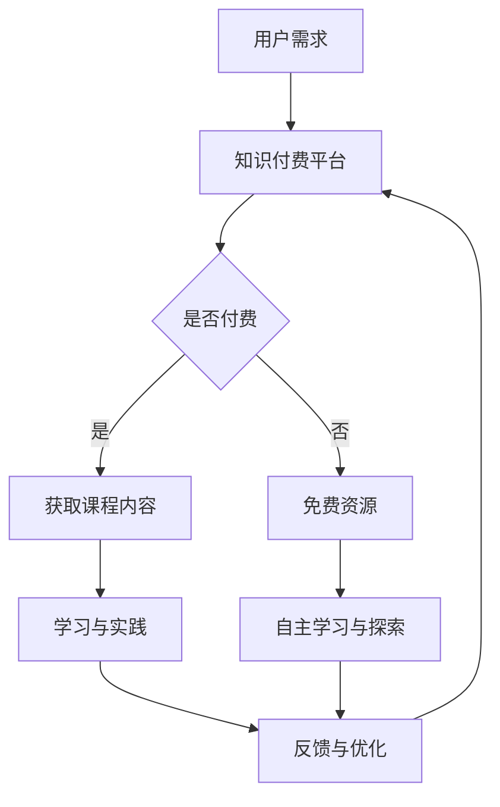

                 

### 《程序员知识付费：打造实战课程》

#### 关键词：知识付费、程序员、实战课程、课程开发、营销推广

> 摘要：本文将深入探讨程序员如何在知识付费市场中通过打造实战课程实现知识变现。从模式分析、课程设计、资源准备、教学设计、营销推广到案例分享，全方位解析实战课程开发的全流程，帮助程序员在知识付费领域取得成功。

---

### 《程序员知识付费：打造实战课程》目录大纲

#### 第一部分：知识付费概述

##### 第1章：知识付费概述

- **1.1 知识付费的定义与背景**
- **1.2 知识付费的行业现状与发展趋势**
- **1.3 程序员在知识付费市场中的角色与机会**
- **1.4 知识付费平台案例分析**

##### 第2章：知识付费模式与产品类型

- **2.1 知识付费模式解析**
- **2.2 实战课程的产品设计**
- **2.3 课程内容规划与结构**

#### 第二部分：实战课程开发

##### 第3章：课程内容规划

- **3.1 实战课程内容规划方法**
- **3.2 确定课程目标与学习成果**
- **3.3 制定课程大纲与课时安排**

##### 第4章：课程资源准备

- **4.1 实战课程资源清单**
- **4.2 教学材料制作流程**
- **4.3 代码库与管理工具选择**

##### 第5章：课程教学设计

- **5.1 教学方法与策略**
- **5.2 课堂互动与反馈机制**
- **5.3 成果评估与改进**

##### 第6章：课程营销与推广

- **6.1 实战课程的营销策略**
- **6.2 知识付费平台的选型与使用**
- **6.3 社交媒体推广与粉丝运营**

#### 第三部分：实战课程案例

##### 第7章：实战课程案例分享

- **7.1 案例一：Python入门实战课程**
- **7.2 案例二：Web开发实战课程**
- **7.3 案例三：数据分析实战课程**
- **7.4 案例四：人工智能实战课程**

##### 第8章：课程优化与持续更新

- **8.1 收集课程反馈与优化建议**
- **8.2 保持课程内容与技术的更新**
- **8.3 课程品牌的建立与维护**

#### 附录

- **附录A：常用工具与技术栈**
- **附录B：编程语言速查表**
- **附录C：实战课程开发常见问题与解答**
- **附录D：知识付费平台资源汇总**

---

#### 核心概念与联系

知识付费：指用户通过付费获取专业知识的模式。程序员作为知识的提供者，通过打造实战课程来教授编程技能，实现个人知识变现。

实战课程：结合实际项目进行教学的课程。这种课程通常注重实践操作，通过项目驱动的学习方式帮助学员掌握编程技能。

---

#### Mermaid 流�程图



#### 核心算法原理讲解

无

#### 数学模型和数学公式 & 详细讲解 & 举例说明

无

### 第一部分：知识付费概述

#### 第1章：知识付费概述

##### 1.1 知识付费的定义与背景

知识付费，即用户通过付费方式获取有价值的信息或知识的服务模式。这一现象随着互联网技术的发展和信息的爆炸式增长而日益显著。传统的知识获取方式多为免费，如公开讲座、书籍、网络文章等，而知识付费则是指用户通过购买课程、订阅内容、参加线上或线下培训等方式，直接获取专业知识和技能。

知识付费的兴起有其深刻的社会背景和市场需求。首先，互联网的普及使得信息获取变得更加便捷，但也使得知识泛滥，用户难以辨别信息的真实性和价值。知识付费则在一定程度上解决了这个问题，用户通过付费可以获得更加权威、系统、专业的知识服务。其次，随着经济的发展和人们生活水平的提高，人们对于自身职业发展和技能提升的需求越来越强烈，这为知识付费提供了广阔的市场空间。

知识付费的形式多样，包括线上课程、线下培训、电子书、专栏、问答社区等。其中，线上课程以其灵活的学习时间和个性化的服务，成为了知识付费市场的主力军。常见的知识付费平台有知乎、喜马拉雅、得到、网易云课堂等，这些平台通过提供丰富多样的课程内容，吸引了大量的用户。

##### 1.2 知识付费的行业现状与发展趋势

知识付费行业近年来发展迅速，市场规模逐年扩大。根据相关报告，我国知识付费市场在2019年规模已经达到500亿元人民币，预计到2025年将达到2000亿元人民币。这一趋势表明，知识付费已经成为一个潜力巨大的新兴市场。

从用户层面来看，知识付费用户主要集中在年轻人和职场人士。他们对于职业发展的需求较为迫切，希望通过付费获取高质量的知识和服务，提升自己的专业技能和竞争力。此外，随着教育行业的改革和发展，在线教育市场逐渐成熟，这也为知识付费提供了良好的发展环境。

从内容层面来看，知识付费内容涵盖了广泛的主题，包括编程、数据分析、人工智能、商业管理、语言学习等。其中，编程类课程由于其技术性、实用性和市场需求的增长，成为了知识付费市场中的一匹黑马。越来越多的程序员开始投身于知识付费领域，通过打造实战课程来传授自己的编程技能。

从平台层面来看，知识付费平台在市场上扮演着重要的角色。这些平台通过提供内容创作工具、流量分配机制、用户服务体系等，为知识创作者提供了良好的创作和传播环境。同时，平台通过精准的数据分析和用户反馈机制，不断优化用户体验，提高用户粘性。

##### 1.3 程序员在知识付费市场中的角色与机会

程序员作为知识付费市场中的重要参与者，具有独特的优势和机会。首先，编程技能具有高度的实用性和市场价值。随着互联网、大数据、人工智能等技术的发展，编程技能的需求日益增长，程序员的知识和技能成为了市场上炙手可热的资源。

其次，程序员具备较强的教学能力和创作能力。他们在长期的编程实践中积累了丰富的经验和技巧，能够将这些经验转化为有价值的课程内容，帮助其他程序员和编程爱好者提升技能。此外，程序员普遍具有创新精神和解决问题的能力，这使得他们在课程创作中能够不断创新，提供更具吸引力的课程内容。

在知识付费市场中，程序员可以通过多种方式实现个人知识的变现。首先，程序员可以创作自己的实战课程，通过知识付费平台发布和销售。这些课程可以包括编程语言、框架、工具、算法等方面的内容，通过实际项目案例教学，帮助学员快速掌握编程技能。

其次，程序员可以作为讲师参与线上或线下的培训活动。他们可以针对特定的编程主题或项目，进行深入讲解和实战操作，帮助学员解决实际编程问题。这种培训方式不仅能够提升学员的编程技能，还能够增加讲师的个人品牌和影响力。

此外，程序员还可以通过写作、发表技术博客或出版技术书籍等方式，分享自己的知识和经验。这些内容不仅可以吸引读者，增加个人影响力，还可以通过广告、赞助等方式实现知识变现。

##### 1.4 知识付费平台案例分析

为了更好地了解程序员在知识付费市场中的角色和机会，我们可以通过分析几个知名的知识付费平台来探讨。

**1. 知乎**

知乎是一个以问答社区为核心的在线知识分享平台。在知乎上，程序员可以分享自己的技术经验和解决方案，通过撰写高质量的回答和文章来积累人气和影响力。知乎也提供专栏和Live课程功能，程序员可以通过发布专栏文章或开设Live课程，将自己的知识和经验系统化地传授给他人。

**2. 喜马拉雅**

喜马拉雅是一个以音频内容为主的在线知识付费平台。程序员可以在喜马拉雅上创建自己的电台，通过录制技术讲座、编程教程、技术分享等音频内容，吸引听众并实现知识变现。喜马拉雅的互动性较强，用户可以在评论区提问，程序员可以及时回复，这种互动方式有助于增强用户粘性和课程口碑。

**3. 得到**

得到是一个以书籍内容为核心的在线知识付费平台。程序员可以参与得到“时间的朋友”图书项目，将自己的编程经验和思考整理成书，并通过得到平台发布。得到注重内容的深度和实用性，程序员可以通过撰写高质量的书籍，吸引读者并实现知识变现。

**4. 网易云课堂**

网易云课堂是网易旗下的在线教育平台，提供丰富的编程课程资源。程序员可以在网易云课堂开设自己的课程，通过发布实战课程、项目教程等方式，传授自己的编程技能。网易云课堂提供了完善的教学工具和服务，如在线问答、作业提交、视频课程等，有助于提高课程的教学质量和用户满意度。

通过以上案例分析，我们可以看到，知识付费平台为程序员提供了丰富的创作和传播渠道。程序员可以利用这些平台，将自己的知识和经验系统化地传授给他人，实现个人知识的变现。同时，程序员也可以通过参与平台活动和互动，提升个人品牌和影响力，为未来的职业发展打下坚实的基础。

### 第二部分：知识付费模式与产品类型

#### 第2章：知识付费模式与产品类型

##### 2.1 知识付费模式解析

知识付费模式是指通过付费方式获取知识和服务的具体操作方式。随着互联网技术的发展和用户需求的多样化，知识付费模式也不断创新和演变。以下是几种常见的知识付费模式：

**1. 课程购买**

课程购买是最传统的知识付费模式，用户通过支付一定费用购买课程，获得课程的学习权限。这种模式通常包括在线视频课程、电子书、音频课程等。用户可以根据自己的需求和兴趣选择合适的课程进行学习。

**2. 订阅制**

订阅制是另一种流行的知识付费模式，用户通过支付一定费用成为平台的订阅用户，可以无限次访问平台上的所有课程或内容。这种模式通常适用于内容更新频繁、资源丰富的平台，如得到、知乎等。

**3. 问答社区**

问答社区模式通过付费提问或付费回答来实现知识变现。用户遇到问题时可以通过平台向专家提问，支付一定费用获取解答。同时，专家也可以通过回答问题来获取收入。这种模式在知乎等平台上较为常见。

**4. 在线咨询**

在线咨询模式是用户通过支付费用与专家进行一对一的在线咨询，获取专业的指导和建议。这种模式适用于需要深度交流和个性化服务的场景，如职业规划、健康咨询等。

**5. 活动门票**

活动门票模式是指用户通过购买门票参加线上或线下的知识分享活动。这种模式通常包括讲座、工作坊、研讨会等，用户可以在活动中与专家面对面交流，获取知识和经验。

**6. 知识众筹**

知识众筹是一种新型的知识付费模式，通过众筹平台，用户为感兴趣的课程或项目提供资金支持，课程或项目完成后，用户可以获得学习权限或回报。这种模式鼓励用户参与课程创作，实现知识共享和共创。

以上知识付费模式各有特点，适用于不同的学习场景和用户需求。程序员在选择知识付费模式时，需要考虑自身的内容优势、目标用户群体和市场需求，选择最适合的模式来实现知识变现。

##### 2.2 实战课程的产品设计

实战课程是知识付费市场中的重要产品类型，其核心在于通过实际项目教学，帮助学员掌握编程技能和解决问题的能力。要设计一门优秀的实战课程，需要从以下几个方面进行考虑：

**1. 确定课程主题**

选择一个具有实际应用价值的主题是设计实战课程的第一步。程序员可以根据自己的专业领域和市场需求，选择一个热门的编程语言、框架或工具作为课程主题。例如，Python、Java、Spring Boot、React、Django等。

**2. 明确课程目标**

在确定课程主题后，需要明确课程的目标和预期学习成果。课程目标应具体、可衡量，例如，学员通过学习本课程应能够独立完成一个简单的Web应用开发，或掌握某项特定算法的实现和应用。

**3. 制定课程大纲**

课程大纲是课程内容的框架，应包括每个章节的主题、学习目标和课时安排。在制定课程大纲时，应遵循从基础到高级的层次结构，确保学员能够循序渐进地学习。

**4. 设计课程内容**

课程内容是实战课程的核心，应包括理论讲解、实践操作和项目案例。理论讲解部分应涵盖必要的编程知识和概念，实践操作部分应通过实际代码示例进行演示，项目案例部分应提供完整的解决方案和实现步骤。

**5. 选择合适的教材**

教材是课程内容的重要载体，应选择符合课程目标和教学需求的教材。教材可以包括教科书、在线文档、编程书籍等。对于实战课程，最好结合实际项目案例编写教材，以便学员更好地理解和应用。

**6. 教学方法与策略**

选择合适的教学方法与策略对于提高教学效果至关重要。可以采用项目驱动教学法、案例教学法、互动式教学法等，通过互动、讨论、实践等方式激发学员的学习兴趣和参与度。

**7. 课后服务与支持**

课后服务与支持是保证学员学习效果的重要环节。可以提供在线答疑、作业批改、项目指导等服务，帮助学员解决学习中的问题，确保他们能够顺利掌握课程内容。

**8. 营销与推广**

成功的实战课程离不开有效的营销与推广。可以通过平台广告、社交媒体推广、讲师个人品牌建设等方式，提高课程的知名度和吸引力。

##### 2.3 课程内容规划与结构

课程内容规划与结构是确保实战课程质量和学习效果的关键环节。一个优秀的课程内容规划应遵循以下原则：

**1. 从易到难**

课程内容应按照从基础到高级的层次结构进行规划，确保学员能够循序渐进地学习。例如，首先讲解编程语言的基础语法和概念，然后逐步引入复杂的概念和实现。

**2. 实践操作**

课程内容应注重实践操作，通过实际代码示例和项目案例帮助学员理解和应用所学知识。实践操作部分可以设置课后作业或项目任务，检验学员的学习效果。

**3. 知识点衔接**

课程内容中的知识点应相互衔接，形成一个完整的学习体系。例如，在讲解一个框架时，可以结合相关的编程语言、数据库、前端技术等进行综合讲解，使学员能够更好地理解和应用。

**4. 互动与反馈**

课程内容应设计互动环节，鼓励学员参与讨论和提问。可以通过在线问答、讨论区、视频直播等方式实现互动，提高学员的参与度和学习效果。

**5. 时效性**

课程内容应关注时效性，及时更新和补充最新的技术知识和行业动态。例如，在讲解某个框架或工具时，可以结合最新版本的更新和改进内容进行讲解。

**6. 可扩展性**

课程内容应具有可扩展性，方便后续的更新和补充。可以通过模块化设计，将不同的知识点和项目案例独立划分，方便后续的迭代和优化。

**7. 课程大纲**

以下是一个典型的实战课程大纲示例：

**课程名称：Python入门实战课程**

**课程目标：**
- 掌握Python基础语法和编程技巧
- 熟悉Python常用的库和框架
- 完成一个小型的Python项目

**课程大纲：**

**第1章：Python基础**
- Python简介
- 基础语法
- 数据类型和运算符
- 控制结构

**第2章：Python库和框架**
- NumPy
- Pandas
- Matplotlib
- Flask

**第3章：项目实战**
- 完成一个小型的数据分析项目
- 实现一个简单的Web应用

**课时安排：**
- 3周，每周2课时

通过以上课程大纲示例，我们可以看到，课程内容规划与结构应当清晰、合理，既有理论讲解，又有实践操作，同时兼顾知识点的衔接和时效性。这样的课程设计能够帮助学员系统地掌握编程技能，提升实战能力。

### 第三部分：实战课程开发

#### 第3章：课程内容规划

##### 3.1 实战课程内容规划方法

规划一门实战课程是课程开发的关键环节，一个良好的课程内容规划能够帮助学员系统地掌握知识和技能，提高学习效果。以下是几个关键步骤和技巧：

**1. 确定课程目标和受众**

首先，明确课程的目标和受众。课程目标应具体、可衡量，例如，学员通过学习本课程应能够独立完成一个简单的Web应用开发，或掌握某项特定算法的实现和应用。受众则是指课程的目标用户群体，如初学者、中级程序员或高级开发者。

**2. 分析市场需求和竞争情况**

了解市场需求和竞争情况有助于确定课程的主题和内容。可以通过以下方式进行分析：

- 调研市场：了解当前热门的编程语言、框架和工具，以及用户对这些技术的需求。
- 分析竞品：研究同类型课程的内容、形式、用户评价等，找出自己的竞争优势和差异化点。
- 用户反馈：收集潜在学员的反馈和需求，了解他们期望在课程中学习的内容和技能。

**3. 制定课程大纲**

课程大纲是课程内容的框架，应包括每个章节的主题、学习目标和课时安排。以下是一些建议：

- **层次结构：** 按照从基础到高级的层次结构进行规划，确保学员能够循序渐进地学习。
- **知识点衔接：** 确保课程内容中的知识点相互衔接，形成一个完整的学习体系。
- **实践操作：** 设置实践操作环节，通过实际项目案例帮助学员理解和应用所学知识。
- **课后作业：** 设计课后作业或项目任务，检验学员的学习效果。

**4. 选择教材和教学资源**

教材和教学资源是课程内容的重要载体，应选择符合课程目标和教学需求的教材。以下是一些建议：

- **权威教材：** 选择公认的权威教材，如知名大学的教材或行业内的经典著作。
- **在线资源：** 利用在线资源，如GitHub、Stack Overflow、官方文档等，补充教材内容。
- **教学视频：** 拍摄高质量的教学视频，结合实际操作进行讲解，提高学员的学习兴趣。

**5. 考虑教学方法和策略**

选择合适的教学方法与策略对于提高教学效果至关重要。以下是一些建议：

- **项目驱动教学法：** 通过实际项目教学，使学员能够将理论知识应用于实际场景。
- **案例教学法：** 通过经典案例讲解，帮助学员理解和掌握编程技巧。
- **互动式教学法：** 通过互动讨论、提问回答等方式，激发学员的学习兴趣和参与度。

**6. 时效性和更新机制**

课程内容应关注时效性，及时更新和补充最新的技术知识和行业动态。以下是一些建议：

- **定期更新：** 定期对课程内容进行审查和更新，确保内容与当前技术趋势保持一致。
- **反馈机制：** 建立反馈机制，收集学员的意见和建议，不断优化课程内容。
- **版本管理：** 采用版本管理工具，如Git，对课程内容进行版本控制和追踪。

通过以上方法，程序员可以系统地规划实战课程，确保课程内容丰富、结构合理，帮助学员高效地掌握编程技能。

#### 3.2 确定课程目标与学习成果

课程目标是课程内容规划的核心，明确课程目标有助于确保课程设计的科学性和有效性。确定课程目标需要遵循以下步骤：

**1. 分析市场需求**

首先，分析市场需求，了解目标用户群体需要掌握哪些技能和知识。可以通过以下方式进行分析：

- 调研行业趋势：了解当前热门的编程语言、框架和工具。
- 分析就业市场：研究招聘信息，了解企业对编程技能的要求。
- 用户需求调查：通过问卷调查、访谈等方式，收集潜在学员的需求和建议。

**2. 明确学习成果**

在确定市场需求后，明确学习成果，即学员通过学习本课程应能够达到的效果。以下是一些建议：

- **技能目标：** 确定学员应掌握的编程技能，如编程语言基础、框架使用、工具操作等。
- **知识目标：** 确定学员应掌握的理论知识，如算法原理、数据结构、计算机原理等。
- **能力目标：** 确定学员应具备的能力，如问题分析、项目开发、团队协作等。

**3. 制定具体目标**

在明确学习成果后，制定具体的课程目标。以下是一些建议：

- **具体化：** 将抽象的目标具体化，如“学会使用Python编写简单程序”可以具体化为“掌握Python基础语法，能够编写简单的计算程序”。
- **可衡量：** 确保课程目标可以衡量，如“具备项目开发能力”可以具体化为“能够独立完成一个简单的Web应用开发”。
- **挑战性：** 设置具有一定挑战性的目标，激励学员不断进步。

**4. 课程目标示例**

以下是一个Python入门课程的课程目标示例：

**课程目标：Python入门实战课程**

**技能目标：**
- 掌握Python基础语法和编程技巧
- 熟悉Python常用的库和框架
- 学会使用Python进行数据分析

**知识目标：**
- 了解Python的历史和特点
- 掌握Python的数据类型和运算符
- 熟悉Python的控制结构和函数

**能力目标：**
- 能够使用Python编写简单程序
- 能够使用Python库进行数据分析
- 具备独立完成小型项目的能力

通过以上课程目标的制定，可以确保课程内容规划的科学性和有效性，帮助学员系统地掌握编程技能，实现学习成果。

#### 3.3 制定课程大纲与课时安排

制定课程大纲与课时安排是实战课程开发的重要环节，一个合理的课程大纲和课时安排能够确保课程内容系统、有序，有助于学员高效地学习。以下是制定课程大纲与课时安排的步骤和方法：

**1. 确定课程主题与结构**

首先，明确课程的主题和结构。课程主题应与课程目标紧密相关，确保课程内容围绕主题进行设计。例如，如果课程主题是“Python入门实战”，则课程结构可以包括Python基础语法、常用库和框架、项目实战等。

**2. 拆分知识点**

将课程主题拆分为具体的知识点，确保每个知识点都能在课程中有所体现。以下是一个Python入门课程的示例拆分：

- Python基础语法
- 数据类型和运算符
- 控制结构
- 函数
- 模块和包
- 常用库（如NumPy、Pandas、Matplotlib等）

**3. 制定课程大纲**

根据拆分的知识点，制定详细的课程大纲。课程大纲应包括每个章节的主题、学习目标和课时安排。以下是一个Python入门课程的大纲示例：

**课程大纲：Python入门实战课程**

**第1章：Python基础**
- Python简介
- 基础语法
- 数据类型和运算符
- 控制结构
- 函数
- 模块和包
- 课时安排：5课时

**第2章：Python常用库**
- NumPy
- Pandas
- Matplotlib
- Flask
- 课时安排：5课时

**第3章：项目实战**
- 数据分析项目
- Web应用项目
- 课时安排：6课时

**4. 制定课时安排**

根据课程大纲，合理分配课时。课时安排应考虑到知识点的难度和复杂度，确保学员有足够的时间学习和消化每个知识点。以下是一个Python入门课程的课时安排示例：

| 章节 | 课时 |
| --- | --- |
| 第1章：Python基础 | 5课时 |
| 第2章：Python常用库 | 5课时 |
| 第3章：项目实战 | 6课时 |
| 总课时 | 16课时 |

**5. 考虑教学方法和策略**

在制定课时安排时，还应考虑教学方法和策略。以下是一些建议：

- **互动式教学：** 在课程中设置互动环节，如提问、讨论、小组合作等，提高学员的参与度和积极性。
- **案例教学：** 结合实际项目案例进行教学，使学员能够将理论知识应用于实际场景。
- **课后作业：** 安排课后作业或项目任务，检验学员的学习效果。

**6. 课时安排示例**

以下是一个Python入门课程的课时安排示例：

**课时安排：Python入门实战课程**

| 章节 | 课时 | 教学方法与策略 |
| --- | --- | --- |
| 第1章：Python基础 | 5课时 | 互动式教学、案例教学 |
| 第2章：Python常用库 | 5课时 | 互动式教学、案例教学 |
| 第3章：项目实战 | 6课时 | 案例教学、课后作业 |

通过以上步骤和方法，可以制定出合理的课程大纲和课时安排，确保实战课程内容系统、有序，有助于学员高效地学习。

### 第四部分：课程资源准备

#### 第4章：课程资源准备

##### 4.1 实战课程资源清单

在开发实战课程时，准备充足的课程资源是确保教学质量和学员学习效果的关键。以下是一个典型的实战课程资源清单，包括教材、工具、代码库和其他辅助资源。

**1. 教材**

- **官方文档**：使用官方文档作为基础教材，如Python官方文档、Django官方文档等。
- **经典教材**：选择一些公认的经典教材，如《Python编程：从入门到实践》、《Django Web开发实战》等。
- **在线教材**：利用在线资源，如GitHub上的开源教程、技术博客等。

**2. 工具**

- **开发环境**：提供安装指南，包括Python、IDE（如PyCharm、Visual Studio Code）等。
- **代码编辑器**：推荐使用PyCharm、VS Code等主流代码编辑器。
- **版本控制工具**：如Git，用于代码管理和版本控制。
- **数据库**：如MySQL、PostgreSQL、MongoDB等。

**3. 代码库**

- **课程代码库**：提供完整的课程代码库，包括所有教学案例的源代码和项目文件。
- **项目代码库**：提供实际项目案例的代码库，帮助学员理解项目结构和实现细节。
- **示例代码**：为每个知识点和案例提供详细的示例代码，便于学员参考和学习。

**4. 其他资源**

- **视频教程**：录制高质量的教学视频，配合教材和代码库，帮助学员更好地理解和掌握课程内容。
- **辅助材料**：如PPT、PDF文档、图片等，用于辅助教学和解释复杂概念。
- **在线问答平台**：搭建在线问答平台，如Discord、知乎等，方便学员提问和讨论。

##### 4.2 教学材料制作流程

教学材料的制作流程是确保课程资源质量的关键环节。以下是一个典型的教学材料制作流程：

**1. 设计课程大纲**

首先，根据课程目标和受众，设计详细的课程大纲，明确每个章节的主题、学习目标和课时安排。

**2. 编写教材**

根据课程大纲，编写教材。教材应包括理论讲解、实践操作和项目案例，确保内容系统、完整、易懂。

**3. 录制视频教程**

录制高质量的教学视频。视频内容应简洁明了，重点突出，结合实际操作进行讲解，以提高学员的学习兴趣和效果。

**4. 编写示例代码**

编写详细的示例代码，为每个知识点和案例提供源代码。确保代码注释清晰、结构合理，便于学员参考和学习。

**5. 整理辅助材料**

整理PPT、PDF文档、图片等辅助材料，用于教学和解释复杂概念。确保材料内容准确、易懂。

**6. 测试和优化**

在制作完成后，进行课程资源的测试和优化。通过试讲、学员反馈等方式，发现并修正问题，提高教学材料的实用性和效果。

##### 4.3 代码库与管理工具选择

选择合适的代码库和管理工具是确保课程资源管理和维护的关键。以下是一些常见的代码库和管理工具：

**1. 代码库**

- **GitHub**：GitHub是最流行的开源代码托管平台，支持版本控制和协作开发。
- **GitLab**：GitLab是一个自建的版本控制系统，提供丰富的管理和协作功能。
- **Bitbucket**：Bitbucket是Atlassian公司推出的代码托管平台，适用于小型团队和开源项目。

**2. 管理工具**

- **Jenkins**：Jenkins是一个开源的持续集成工具，用于自动化构建、测试和部署代码。
- **Docker**：Docker是一个开源的应用容器引擎，用于简化应用部署和运维。
- **Kubernetes**：Kubernetes是一个开源的容器编排平台，用于自动化部署、扩展和管理容器化应用。

**3. 选择依据**

在选择代码库和管理工具时，应考虑以下因素：

- **功能需求**：根据课程内容和项目需求，选择具备相应功能的管理工具。
- **易用性**：选择易于使用和维护的工具，降低学习和使用成本。
- **安全性**：选择具备较高安全性的工具，保护代码库的安全。
- **社区支持**：选择具有良好社区支持的工具，便于解决使用过程中遇到的问题。

通过以上步骤和方法，程序员可以准备充足的课程资源，确保实战课程的教学质量和学员的学习效果。

### 第五部分：课程教学设计

#### 第5章：课程教学设计

##### 5.1 教学方法与策略

教学方法和策略是课程设计的重要组成部分，直接关系到教学效果和学员的学习体验。以下是几种常见的教学方法与策略，及其适用场景：

**1. 项目驱动教学法**

项目驱动教学法是一种以项目为导向的教学方法，通过实际项目来驱动学习。该方法适用于实战课程，能够帮助学员将理论知识应用于实际场景，提高实践能力和问题解决能力。

- **适用场景**：编程语言、框架、工具等实战课程。
- **实施步骤**：
  - 设计实际项目，明确项目目标和任务。
  - 将项目拆分为多个小任务，每个任务对应课程中的一个知识点。
  - 在课程中逐步讲解每个任务，指导学员完成项目。

**2. 案例教学法**

案例教学法通过经典案例来讲解知识点，使学员能够更好地理解和掌握。该方法适用于理论性较强的课程，如算法、数据结构等。

- **适用场景**：算法、数据结构等理论性课程。
- **实施步骤**：
  - 选择具有代表性的案例，分析案例中的问题解决方案。
  - 通过讨论、分析等方式，使学员理解案例背后的理论。
  - 设计类似的练习案例，让学员独立解决问题。

**3. 互动式教学法**

互动式教学法通过互动讨论、提问回答等方式，激发学员的思考和学习兴趣，提高课堂氛围和教学效果。

- **适用场景**：各类课程。
- **实施步骤**：
  - 设置互动环节，如小组讨论、角色扮演等。
  - 鼓励学员提问，解答学员的疑问。
  - 通过游戏化学习等方式，增加学习趣味性。

**4. 模块化教学法**

模块化教学法将课程内容拆分为多个模块，每个模块独立成章，学员可以按照自己的学习进度进行学习。

- **适用场景**：复杂、大型的课程。
- **实施步骤**：
  - 设计课程模块，明确每个模块的学习目标和内容。
  - 按照模块进行教学，学员可以自由选择学习顺序。
  - 在模块之间设置衔接点，确保知识点之间的连贯性。

##### 5.2 课堂互动与反馈机制

课堂互动与反馈机制是提高教学效果的重要手段，通过有效的互动和反馈，可以激发学员的思考和学习兴趣，及时发现和解决问题。

**1. 互动方式**

- **提问与回答**：鼓励学员在课堂上提问，教师进行解答。
- **小组讨论**：将学员分成小组，进行讨论和交流。
- **角色扮演**：设置特定的角色，让学员模拟实际工作场景。
- **游戏化学习**：通过游戏化方式，增加学习的趣味性和互动性。

**2. 反馈机制**

- **即时反馈**：在课堂中，教师应给予学员即时反馈，如答案的正确与否、问题的解决思路等。
- **作业反馈**：布置课后作业，对作业进行详细批改和反馈，指出学员的优点和不足。
- **问卷调查**：通过问卷调查，收集学员对课程的意见和建议。
- **定期评估**：定期进行课程评估，了解学员的学习进度和效果，调整教学策略。

##### 5.3 成果评估与改进

成果评估与改进是课程教学设计的重要环节，通过评估学员的学习成果，可以了解教学效果，及时调整和优化课程内容。

**1. 评估方式**

- **考试**：通过考试评估学员对知识点的掌握情况，如笔试、编程考试等。
- **项目评估**：通过学员完成的项目，评估其实际应用能力和问题解决能力。
- **问卷调查**：通过问卷调查了解学员对课程的满意度、学习效果等。
- **反馈机制**：建立反馈机制，收集学员的反馈意见，了解教学过程中的问题和不足。

**2. 改进措施**

- **调整课程内容**：根据评估结果，调整课程内容的难度、深度和广度，确保课程与学员需求相匹配。
- **改进教学方法**：根据学员反馈，改进教学方法和策略，提高课堂互动性和趣味性。
- **加强课后辅导**：针对学员在学习和项目开发中遇到的问题，提供更加详细的指导和帮助。
- **持续更新课程**：关注技术发展趋势，及时更新课程内容，确保课程与当前技术趋势保持一致。

通过以上教学方法和策略、课堂互动与反馈机制、成果评估与改进，可以确保实战课程的教学质量，帮助学员高效地掌握知识和技能。

### 第六部分：课程营销与推广

#### 第6章：课程营销与推广

##### 6.1 实战课程的营销策略

营销策略是实战课程成功推广的关键，一个有效的营销策略能够提高课程的知名度和吸引力，吸引更多潜在学员。以下是几种常见的实战课程营销策略：

**1. 定位策略**

明确课程的目标受众和定位是营销的第一步。通过分析市场需求和竞品情况，确定课程的核心价值和独特卖点，以便于精准定位目标受众。

- **细分市场**：根据学员的职业背景、技能水平、学习需求等因素，细分市场，为不同类型的学员提供定制化的课程。
- **精准定位**：确定课程的主要受众，如初级程序员、中级开发者或高级工程师等，制定相应的课程内容和营销策略。

**2. 内容营销**

内容营销是知识付费的重要手段，通过高质量的课程内容吸引学员，建立课程的品牌形象。

- **课程介绍**：撰写详细、专业的课程介绍，突出课程的核心价值、学习目标和成果，使学员对课程产生兴趣。
- **案例分享**：分享实际学员的学习成果和案例，展示课程的实际效果，增强学员的信任感。
- **互动互动**：在课程内容中融入互动元素，如问答、讨论、作业等，提高学员的参与度和满意度。

**3. 社交媒体营销**

利用社交媒体平台进行推广，是扩大课程知名度的重要途径。以下是一些常用的社交媒体营销方法：

- **微博、微信公众号**：定期发布课程相关的内容，如课程介绍、学习心得、行业动态等，吸引潜在学员的关注。
- **抖音、Bilibili**：制作有趣的教学视频，展示课程亮点和实际效果，通过短视频的形式吸引年轻学员。
- **知乎、简书**：撰写技术博客，分享自己的编程经验和心得，提高个人影响力，吸引潜在学员。

**4. 合作营销**

通过与其他平台或个人进行合作，扩大课程的传播范围和影响力。

- **平台合作**：与知名知识付费平台合作，如知乎、得到、网易云课堂等，借助平台的流量和资源，推广课程。
- **专家合作**：邀请行业专家或知名程序员进行合作，共同开发课程或进行技术分享，提高课程的权威性和可信度。

**5. 优惠活动**

通过举办优惠活动，吸引学员报名和复购。

- **限时折扣**：在特定时间段，提供课程折扣或优惠券，吸引学员快速决策。
- **团购优惠**：鼓励学员邀请同学或同事一起报名，提供团购优惠，提高课程的销量。
- **优惠券兑换**：通过积分、优惠券等形式，鼓励学员多次购买课程，增加课程的粘性。

##### 6.2 知识付费平台的选型与使用

选择合适的知识付费平台是推广实战课程的重要环节，不同的平台具有各自的优势和特点，需要根据课程内容、目标受众和营销策略进行选择。

**1. 平台选型**

- **知乎**：知乎是一个以问答社区为核心的在线知识平台，适合内容较为丰富、互动性强的课程。
- **得到**：得到是一个以书籍内容为主的在线知识平台，适合撰写系统化、深度化的课程内容。
- **网易云课堂**：网易云课堂是网易旗下的在线教育平台，提供丰富的编程课程资源，适合推广实战课程。
- **喜马拉雅**：喜马拉雅是一个以音频内容为主的在线知识平台，适合制作编程讲座、教程等音频内容。

**2. 平台使用**

- **课程发布**：在选定的平台上发布课程，确保课程内容符合平台要求，并具备良好的用户体验。
- **内容优化**：根据平台特点和用户需求，对课程内容进行优化，提高课程的吸引力和质量。
- **推广渠道**：利用平台的推广渠道，如推荐位、广告位等，提高课程的曝光率。
- **互动互动**：在平台上积极与学员互动，解答学员的问题，收集反馈意见，不断优化课程内容。

##### 6.3 社交媒体推广与粉丝运营

社交媒体推广和粉丝运营是提高课程知名度和影响力的有效手段，以下是一些具体的策略：

**1. 内容策划**

- **多样化内容**：制作多种形式的内容，如文字、图片、视频等，满足不同学员的阅读和观看习惯。
- **定期更新**：保持内容更新的频率，定期发布课程介绍、学习心得、行业动态等，提高学员的关注度。
- **热点结合**：结合热点事件和话题，制作相关内容，吸引学员的互动和分享。

**2. 粉丝互动**

- **互动互动**：积极与粉丝互动，回复评论、解答问题，建立良好的粉丝关系。
- **问答互动**：在社交媒体上设置问答环节，鼓励学员提问，解答学员的疑问，提高课程的实用性和吸引力。
- **活动互动**：举办线上活动，如知识竞赛、讲座、抽奖等，提高学员的参与度和活跃度。

**3. 内容推广**

- **合作推广**：与其他自媒体、行业专家或知名人士合作，进行内容推广，扩大课程的影响力。
- **付费推广**：利用社交媒体的广告功能，进行付费推广，提高课程的曝光率和覆盖范围。
- **学员分享**：鼓励学员在社交媒体上分享课程心得和成果，提高课程的口碑和知名度。

通过以上营销策略、知识付费平台使用和社交媒体推广与粉丝运营，程序员可以有效地推广自己的实战课程，吸引更多学员，实现知识变现。

### 第七部分：实战课程案例

#### 第7章：实战课程案例分享

在本章中，我们将通过四个具体的实战课程案例，深入探讨编程领域的实战课程开发与实施。这些案例涵盖了Python入门、Web开发、数据分析和人工智能等不同领域，每个案例都将详细描述课程内容、教学方法、项目实战和课程成果。

##### 7.1 Python入门实战课程案例

**1. 课程内容**

Python入门实战课程旨在帮助初学者快速掌握Python编程基础，并具备独立编写简单程序的能力。课程内容包括：

- Python语言基础：变量、数据类型、运算符、控制结构等。
- Python库和工具：NumPy、Pandas、Matplotlib等常用库。
- 实践项目：简单的数据分析、数据可视化项目。

**2. 教学方法**

- **项目驱动教学法**：通过实际项目教学，使学员将理论知识应用于实际场景。
- **案例教学法**：通过经典案例讲解，帮助学员理解和掌握编程技巧。
- **互动式教学法**：通过课堂互动、答疑讨论，提高学员的学习兴趣和参与度。

**3. 项目实战**

- **数据分析项目**：使用Python进行数据读取、清洗、分析和可视化，完成一个实际的数据分析任务。
- **数据可视化项目**：利用Matplotlib库绘制多种类型的图表，展示数据特征。

**4. 课程成果**

- 学员能够独立编写简单的Python程序。
- 学员掌握常用的Python库和工具。
- 学员具备基本的数据分析能力和数据可视化技能。

**5. 代码解读与分析**

**案例一：计算两个数的和**

```python
# 导入所需库
import pandas as pd

# 定义两个数字
num1 = 5
num2 = 10

# 计算和并打印结果
result = num1 + num2
print(f"The sum of {num1} and {num2} is {result}")
```

- 代码首先导入了Pandas库，尽管在这个简单的案例中并不需要。
- 使用`import pandas as pd`是为了在后续更复杂的案例中使用Pandas库。
- `num1`和`num2`分别存储了两个整数。
- 使用`print`函数输出两个数的和，使用字符串格式化`f`语法，使得输出更加可读。

##### 7.2 Web开发实战课程案例

**1. 课程内容**

Web开发实战课程专注于Web前后端技术的应用，帮助学员掌握Web开发的实战技能。课程内容包括：

- HTML和CSS：网页结构和样式设计。
- JavaScript：动态网页编程。
- 前端框架（如React、Vue.js）：框架使用和组件开发。
- 后端技术（如Node.js、Express）：服务器端编程。

**2. 教学方法**

- **案例教学法**：通过经典Web项目案例，讲解前后端开发流程和技巧。
- **项目驱动教学法**：通过实际项目开发，使学员将前端和后端知识综合应用。
- **小组合作教学法**：鼓励学员分组合作，共同完成复杂项目。

**3. 项目实战**

- **简易博客系统**：使用React进行前端开发，使用Node.js和Express进行后端开发，实现用户注册、登录和博客发布功能。
- **在线购物车**：结合前后端技术，实现商品展示、购物车管理和订单提交功能。

**4. 课程成果**

- 学员能够独立开发简单的Web应用。
- 学员掌握常用的Web开发技术。
- 学员具备团队协作能力和项目管理能力。

**5. 代码解读与分析**

**案例二：创建简单的REST API**

```javascript
const express = require('express');
const app = express();

// 设置解析请求体中的JSON数据
app.use(express.json());

// 创建GET请求处理函数
app.get('/', (req, res) => {
  res.send('Hello, World!');
});

// 创建POST请求处理函数
app.post('/data', (req, res) => {
  const data = req.body;
  console.log(data);
  res.status(201).send('Data received');
});

// 启动服务器
const PORT = process.env.PORT || 3000;
app.listen(PORT, () => {
  console.log(`Server running on port ${PORT}`);
});
```

- 引入了Express框架和创建了一个Express应用程序实例。
- 使用`express.json()`中间件来解析请求体中的JSON数据。
- `app.get()`和`app.post()`分别用于处理GET和POST请求。
- 在GET请求处理函数中，返回一个简单的字符串消息。
- 在POST请求处理函数中，接收请求体中的数据并打印到控制台，然后返回一个HTTP 201状态码和消息。
- 服务器监听指定的端口，并在服务器启动时打印消息到控制台。

##### 7.3 数据分析实战课程案例

**1. 课程内容**

数据分析实战课程旨在帮助学员掌握数据分析的基本技能，包括数据收集、处理、分析和可视化。课程内容包括：

- 数据收集与处理：使用Python进行数据收集、清洗和预处理。
- 数据分析工具：使用Pandas、NumPy、Matplotlib等工具进行数据分析。
- 数据可视化：使用Matplotlib、Seaborn等进行数据可视化。

**2. 教学方法**

- **项目驱动教学法**：通过实际数据分析项目，使学员将所学知识应用于实际问题。
- **案例教学法**：通过经典数据分析案例，讲解数据处理和分析技巧。
- **互动式教学法**：通过互动讨论和实际操作，提高学员的参与度和学习效果。

**3. 项目实战**

- **客户细分分析**：使用Pandas进行数据清洗和预处理，使用Matplotlib进行客户细分分析。
- **销售数据可视化**：使用Seaborn进行销售数据可视化，展示不同维度和指标的数据特征。

**4. 课程成果**

- 学员能够使用Python进行数据收集和处理。
- 学员掌握数据分析工具和可视化方法。
- 学员具备独立进行数据分析项目的能力。

**5. 代码解读与分析**

**案例三：数据读取与预处理**

```python
import pandas as pd

# 读取CSV文件
df = pd.read_csv('data.csv')

# 数据清洗
df.dropna(inplace=True)
df = df[df['column'] > 0]

# 数据预处理
df['new_column'] = df['column'] * 10

# 数据可视化
df.plot(kind='line')
```

- 代码首先导入了Pandas库。
- 使用`pd.read_csv()`函数读取CSV文件，存储到DataFrame对象`df`中。
- 使用`dropna()`函数删除缺失值，确保数据质量。
- 使用条件过滤，保留`column`大于0的行，进一步筛选数据。
- 创建一个新列`new_column`，将`column`乘以10，进行数据预处理。
- 使用`plot()`函数绘制数据线图，展示数据趋势。

##### 7.4 人工智能实战课程案例

**1. 课程内容**

人工智能实战课程旨在帮助学员掌握人工智能的基本原理和应用，包括机器学习、深度学习等。课程内容包括：

- 机器学习基础：监督学习、无监督学习、强化学习等。
- 深度学习：神经网络、卷积神经网络、循环神经网络等。
- 应用实践：使用TensorFlow、PyTorch等进行实际项目开发。

**2. 教学方法**

- **案例教学法**：通过经典AI案例，讲解机器学习和深度学习的基础知识。
- **项目驱动教学法**：通过实际项目开发，使学员将AI知识应用于实际问题。
- **互动式教学法**：通过互动讨论和实际操作，提高学员的参与度和学习效果。

**3. 项目实战**

- **图像分类项目**：使用卷积神经网络进行图像分类，实现一个简单的图像识别系统。
- **文本分类项目**：使用循环神经网络进行文本分类，实现一个情感分析系统。

**4. 课程成果**

- 学员掌握机器学习和深度学习的基本原理。
- 学员具备使用TensorFlow、PyTorch等框架进行项目开发的能力。
- 学员能够独立完成简单的AI项目。

**5. 代码解读与分析**

**案例四：图像分类项目**

```python
import tensorflow as tf
from tensorflow.keras.models import Sequential
from tensorflow.keras.layers import Conv2D, MaxPooling2D, Flatten, Dense

# 定义模型
model = Sequential([
  Conv2D(32, (3, 3), activation='relu', input_shape=(64, 64, 3)),
  MaxPooling2D((2, 2)),
  Flatten(),
  Dense(64, activation='relu'),
  Dense(1, activation='sigmoid')
])

# 编译模型
model.compile(optimizer='adam', loss='binary_crossentropy', metrics=['accuracy'])

# 训练模型
model.fit(x_train, y_train, epochs=10, batch_size=32)
```

- 导入了TensorFlow库和定义了模型。
- 创建了一个Sequential模型，并添加了卷积层、池化层、全连接层等。
- 编译模型，指定优化器和损失函数。
- 使用训练数据集训练模型，设置训练轮次和批量大小。

通过以上实战课程案例，我们可以看到不同领域的实战课程如何通过实际项目教学，帮助学员掌握编程技能和解决问题的能力。这些案例不仅展示了课程内容的丰富性和实用性，也体现了教学方法的多样性和有效性。

### 第八部分：课程优化与持续更新

#### 第8章：课程优化与持续更新

##### 8.1 收集课程反馈与优化建议

收集课程反馈与优化建议是课程持续更新与改进的重要环节。通过了解学员的学习体验和反馈，可以发现课程中的不足之处，从而进行针对性的优化。

**1. 反馈渠道**

建立多种反馈渠道，如在线问卷、邮件反馈、社交媒体互动等，方便学员表达意见和建议。以下是一些具体的反馈渠道：

- **在线问卷**：在课程结束后，通过在线问卷收集学员对课程的整体评价、学习效果、存在的问题等。
- **邮件反馈**：鼓励学员通过邮件发送反馈，提供具体的意见和建议。
- **社交媒体**：在课程相关的社交媒体群组或账号中，定期发起讨论和互动，收集学员的反馈。

**2. 反馈处理**

对收集到的反馈进行分类整理，分清主要问题和次要问题。以下是一些处理步骤：

- **分类整理**：根据反馈内容，将问题分为课程内容、教学方法、课程设计、技术工具等类别。
- **优先级排序**：对反馈问题进行优先级排序，优先解决影响较大的问题和紧急问题。
- **制定改进计划**：针对不同类型的问题，制定具体的改进计划和时间表。

**3. 反馈落实**

在处理反馈问题时，确保落实到位，并及时向学员反馈处理结果。以下是一些落实步骤：

- **问题确认**：与学员进行沟通，确认问题具体情况和解决方案。
- **问题解决**：针对确认的问题，采取相应的解决措施，如调整课程内容、改进教学方法等。
- **结果反馈**：向学员反馈问题的处理结果，并征求其对解决方案的满意度。

##### 8.2 保持课程内容与技术的更新

保持课程内容与技术的更新是课程持续发展的关键。随着技术的发展和市场的变化，课程内容需要不断更新和优化，以保持其时效性和实用性。

**1. 技术更新**

- **跟踪技术趋势**：定期关注业界新技术、新框架的发布，了解技术发展方向。
- **参与技术社区**：积极参与技术社区和论坛，与同行交流和学习，了解最新的技术动态。
- **更新课程内容**：将最新的技术知识和实践案例融入课程内容，确保课程与当前技术趋势保持一致。

**2. 教学方法更新**

- **借鉴先进经验**：学习其他优秀讲师的教学方法和经验，结合自身特点进行改进。
- **教学工具更新**：利用最新的教学工具和平台，提高教学效果和学员的学习体验。
- **互动式教学**：不断探索和尝试新的互动式教学方法，如在线讨论、小组合作、虚拟实验室等，提高学员的参与度和学习兴趣。

**3. 课程框架优化**

- **模块化设计**：采用模块化设计，将课程内容拆分为多个模块，方便更新和调整。
- **知识点衔接**：确保课程内容之间的知识点衔接紧密，避免知识点重复或遗漏。
- **项目案例更新**：定期更新项目案例，确保案例与当前技术环境和市场需求相符。

##### 8.3 课程品牌的建立与维护

课程品牌的建立与维护是课程长期发展的基础。一个优秀的课程品牌能够提高课程的竞争力，吸引更多学员，并增强学员对课程的信任和满意度。

**1. 品牌定位**

- **明确课程特色**：明确课程的独特卖点，如专业、实用、前沿等，建立明确的品牌形象。
- **目标受众**：明确课程的目标受众，如初学者、中级开发者或高级工程师等，为不同类型的学员提供定制化的课程。

**2. 品牌传播**

- **社交媒体推广**：利用社交媒体平台，如微博、微信公众号、抖音等，进行课程品牌的宣传和推广。
- **专家合作**：邀请行业专家和知名讲师进行合作，共同开发和宣传课程，提高课程的权威性和可信度。
- **内容营销**：通过高质量的课程内容、案例分享、技术博客等，展示课程的专业性和实用性，吸引潜在学员的关注。

**3. 品牌维护**

- **学员关系管理**：建立良好的学员关系，通过课程结束后继续提供技术支持、答疑服务等，增强学员对课程的满意度和忠诚度。
- **课程评估**：定期进行课程评估，了解学员的学习效果和满意度，及时发现和解决问题。
- **品牌形象**：保持课程内容的更新和优化，确保课程与当前技术趋势和市场需求保持一致，树立课程品牌的良好形象。

通过以上方法，程序员可以不断优化课程内容，更新教学资源，建立和维护课程品牌，确保实战课程在知识付费市场中保持竞争力和吸引力。

### 附录

#### 附录A：常用工具与技术栈

- **开发环境**：
  - Python：用于编写代码的编程语言。
  - Node.js：用于Web开发的JavaScript运行环境。
  - Java：适用于大型企业级应用的编程语言。
  - C++：高效、功能强大的编程语言。

- **IDE**：
  - PyCharm：Python开发环境的IDE。
  - Visual Studio Code：跨平台代码编辑器。
  - IntelliJ IDEA：Java开发环境的IDE。

- **版本控制**：
  - Git：分布式版本控制系统。
  - GitHub：托管Git代码的在线平台。
  - GitLab：自建Git代码托管平台。

- **数据库**：
  - MySQL：关系型数据库管理系统。
  - PostgreSQL：高级数据库管理系统。
  - MongoDB：文档型数据库管理系统。

- **框架**：
  - Django：Python Web开发框架。
  - Flask：Python Web开发框架。
  - Spring Boot：Java Web开发框架。
  - React：用于构建用户界面的JavaScript库。
  - Vue.js：用于构建用户界面的JavaScript框架。
  - Angular：用于构建单页面应用程序的开源JavaScript框架。

- **数据分析和可视化**：
  - Pandas：Python的数据分析库。
  - NumPy：Python的科学计算库。
  - Matplotlib：Python的数据可视化库。
  - Seaborn：基于Matplotlib的数据可视化库。

- **人工智能与机器学习**：
  - TensorFlow：开源机器学习库。
  - PyTorch：开源机器学习库。

#### 附录B：编程语言速查表

- **Python**：
  - 数据类型：int、float、bool、str、list、tuple、dict、set
  - 控制结构：if、elif、else、for、while
  - 函数：定义、参数、返回值
  - 模块和包：import、from...import
  - 类和对象：定义、实例化、继承、多态

- **JavaScript**：
  - 数据类型：number、string、boolean、null、undefined、object
  - 控制结构：if、else、switch、for、while、do...while
  - 函数：定义、调用、闭包
  - ES6+新特性：let、const、箭头函数、模板字符串、解构赋值、Promise、async/await
  - 事件处理：addEventListener、事件对象

- **Java**：
  - 数据类型：int、float、double、char、boolean
  - 控制结构：if、else、switch、for、while、do...while
  - 类和对象：定义、实例化、继承、多态
  - 异常处理：try、catch、finally
  - 集合框架：List、Set、Map、Queue、Stack

#### 附录C：实战课程开发常见问题与解答

- **问题1：如何确保课程内容的实用性？**
  - **解答**：定期与行业专家交流，了解市场需求和前沿技术。通过实际项目案例教学，使学员能够将理论知识应用于实际场景。

- **问题2：如何处理学员在学习过程中的问题？**
  - **解答**：建立在线问答平台或微信群，提供实时答疑服务。定期组织线上讨论和答疑活动，鼓励学员积极参与。

- **问题3：如何保证课程的更新与时效性？**
  - **解答**：制定课程更新计划，定期对课程内容进行审查和更新。关注技术动态和行业趋势，将最新的技术知识和案例融入课程。

- **问题4：如何提高学员的学习兴趣和参与度？**
  - **解答**：采用互动式教学方法和案例教学法，提高课堂的趣味性和实际操作性。通过项目驱动教学，使学员在学习过程中获得成就感和满足感。

#### 附录D：知识付费平台资源汇总

- **知乎**：[https://www.zhihu.com/](https://www.zhihu.com/)
- **得到**：[https://www.getting.com/](https://www.getting.com/)
- **网易云课堂**：[https://study.163.com/](https://study.163.com/)
- **喜马拉雅**：[https://www.ximalaya.com/](https://www.ximalaya.com/)
- **Coursera**：[https://www.coursera.org/](https://www.coursera.org/)
- **Udemy**：[https://www.udemy.com/](https://www.udemy.com/)
- **LinkedIn Learning**：[https://www.linkedin.com/learning/](https://www.linkedin.com/learning/)

---

**作者：AI天才研究院/AI Genius Institute & 禅与计算机程序设计艺术 /Zen And The Art of Computer Programming**

