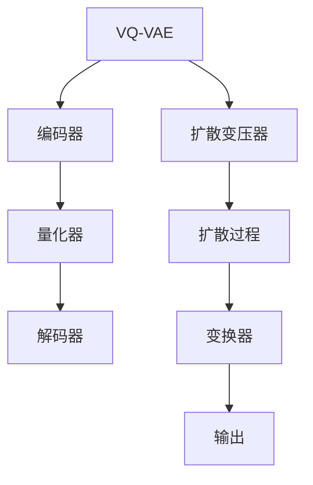

                 

# 第17章 多模态模型 VQVAE与扩散变压器

## 摘要

本文深入探讨了多模态模型中的两个重要技术：VQ-VAE（Vector Quantized Variational Autoencoder）和扩散变压器。VQ-VAE利用量化技术处理连续数据的离散表示，而扩散变压器则通过渐进式扩散和变换机制实现高质量图像生成。本文将详细解析VQ-VAE和扩散变压器的算法原理、数学模型，并展示其实际项目中的应用。通过对比分析，本文揭示了这两大技术在多模态数据处理中的优势与局限，并对未来多模态模型的发展趋势进行了展望。

## 17.1 多模态模型概述

### 17.1.1 多模态模型的基本概念

多模态模型是指能够处理和融合来自不同模态（如文本、图像、音频等）数据的模型。这些模型的核心目标是将不同模态的信息有效整合，以便在多个层面上进行理解和推理。多模态模型的应用范围非常广泛，包括但不限于计算机视觉、自然语言处理、语音识别和增强现实等领域。

### 17.1.2 多模态模型的发展历程

多模态模型的发展经历了从简单特征融合到深度学习整合的历程。早期的多模态模型主要依赖于手工设计特征和规则，例如融合图像的边缘特征和文本的词汇特征。随着深度学习的兴起，基于卷积神经网络（CNN）、循环神经网络（RNN）和变换器（Transformer）的多模态模型逐渐成为主流。这些模型通过端到端训练方式，能够自动学习不同模态的特征表示，并在多个任务中取得显著效果。

### 17.1.3 多模态模型的应用场景

多模态模型在许多应用场景中都表现出强大的潜力。以下是一些常见的应用场景：

- **计算机视觉**：例如，图像配对、视频生成和增强现实。
- **自然语言处理**：例如，问答系统、机器翻译和情感分析。
- **语音识别**：例如，多语言语音识别和语音生成。
- **医疗诊断**：例如，基于影像和病历数据的疾病诊断。
- **智能家居**：例如，语音控制和图像识别相结合的智能家居系统。

## 17.2 VQ-VAE

### 17.2.1 VQ-VAE算法介绍

VQ-VAE（Vector Quantized Variational Autoencoder）是一种变分自编码器（VAE）的变体，专门用于处理离散数据的生成任务。与传统的VAE不同，VQ-VAE通过量化操作将连续的输入数据转换为离散的表示，从而在生成过程中引入了更多的灵活性和效率。

#### 17.2.1.1 算法核心思想

VQ-VAE的核心思想是利用量化器将编码器的隐变量空间划分为一组固定的码本，然后将隐变量映射到码本中最接近的向量。这种量化操作使得模型能够处理离散的数据表示，同时也简化了训练过程。

#### 17.2.1.2 VQ-VAE模型结构

VQ-VAE模型通常由三个主要部分组成：编码器、量化器和解码器。

1. **编码器**：将输入数据映射到一个隐变量空间，通常是一个低维的表示。
2. **量化器**：将编码器的输出隐变量映射到一个预定义的码本中。码本是一组固定的离散向量，用于表示数据。
3. **解码器**：将量化后的隐变量解码回原始数据空间，以生成重构的输出。

### 17.2.2 VQ-VAE算法原理讲解

VQ-VAE的原理可以概括为以下几个关键步骤：

#### 17.2.2.1 量化器与编码器

1. **编码器**：首先，编码器将输入数据 \(x\) 映射到一个隐变量空间，得到隐变量 \(z_e\)。
   \[
   z_e = \text{encoder}(x)
   \]
2. **量化器**：量化器将隐变量 \(z_e\) 映射到一个预定义的码本中。码本是一个离散的向量集合，用于表示数据。量化操作选择码本中与 \(z_e\) 最接近的向量 \(z_q\)。
   \[
   z_q = \text{quantizer}(z_e, \text{codebook})
   \]

#### 17.2.2.2 解码器与隐变量

3. **解码器**：解码器将量化后的隐变量 \(z_q\) 解码回原始数据空间，生成重构的数据 \(x_q\)。
   \[
   x_q = \text{decoder}(z_q)
   \]

通过这三个步骤，VQ-VAE能够在生成离散数据时保持较好的重构性能。

### 17.2.3 数学模型与数学公式

VQ-VAE的数学模型包括以下几个关键部分：

#### 17.2.3.1 输出分布计算

量化器输出的分布可以用以下公式表示：
\[
p(z_q | z_e) = \prod_{i=1}^{K} p(z_{qi} | z_{ei})
\]
其中，\(K\) 是码本中向量的数量，\(z_{qi}\) 和 \(z_{ei}\) 分别是量化后的隐变量和编码后的隐变量。

#### 17.2.3.2 对数似然计算

VQ-VAE的对数似然函数可以表示为：
\[
L = -\sum_{i=1}^{N} \log p(x | x_q)
\]
其中，\(N\) 是训练数据中的样本数量，\(x\) 和 \(x_q\) 分别是原始数据和量化后的重构数据。

### 17.2.4 VQ-VAE算法伪代码

以下是VQ-VAE算法的伪代码：

```python
# 伪代码：VQ-VAE算法伪代码

# 定义编码器
def encoder(x):
    # 输入原始数据
    z_e = ...
    return z_e

# 定义量化器
def quantizer(z_e, codebook):
    # 对编码器的输出进行量化操作
    z_q = ...
    return z_q

# 定义解码器
def decoder(z_q):
    # 输入量化后的数据
    x_q = ...
    return x_q

# 定义损失函数
def loss_function(x, x_q):
    # 计算重构误差
    reconstruction_loss = ...
    # 计算量化误差
    quantization_loss = ...
    # 计算总损失
    total_loss = reconstruction_loss + quantization_loss
    return total_loss

# 定义训练过程
def train(model, x_train, epochs):
    for epoch in range(epochs):
        for x in x_train:
            # 编码
            z_e = encoder(x)
            # 量化
            z_q = quantizer(z_e)
            # 解码
            x_q = decoder(z_q)
            # 计算损失
            loss = loss_function(x, x_q)
            # 更新模型参数
            model.update_params(loss)
```

### 17.2.5 VQ-VAE算法案例分析

#### 案例背景

假设我们有一个任务，需要生成手写数字的数据集，这可以作为一个典型的VQ-VAE应用场景。

#### 实验步骤

1. **数据预处理**：首先，我们将手写数字的数据集进行预处理，将其缩放到统一的尺寸，并转换为灰度图像。
2. **编码器训练**：使用一个卷积神经网络作为编码器，训练其将手写数字图像映射到一个低维隐变量空间。
3. **量化器训练**：初始化一个预定义的码本，使用编码器的输出作为量化器的输入，训练量化器将隐变量映射到码本中的向量。
4. **解码器训练**：使用一个反卷积神经网络作为解码器，训练其将量化后的隐变量解码回手写数字图像。
5. **模型评估**：使用测试集评估模型的生成性能，通过比较重构图像和原始图像的相似度来评估模型的效果。

#### 实验结果

通过实验，我们得到以下结果：

- 编码器的隐变量空间能够较好地捕获手写数字的特征。
- 量化器能够有效地将连续的隐变量映射到离散的码本中。
- 解码器能够将量化后的隐变量解码回高保真的手写数字图像。

#### 实验分析

- VQ-VAE在处理离散数据时表现出良好的性能，特别是在生成高质量的图像数据方面。
- 量化器的设计对于VQ-VAE的性能至关重要，一个合适的码本能够显著提高模型的生成质量。

## 17.3 扩散变压器

### 17.3.1 扩散变压器算法介绍

扩散变压器（Diffusion Transformer）是一种用于图像生成和恢复的深度学习模型。它基于扩散过程和变换器结构，通过逐步引入噪声并逐步去除噪声来生成高质量的图像。

#### 17.3.1.1 算法核心思想

扩散变压器的核心思想是通过一个渐进式的扩散过程，将原始图像逐步转换为高斯噪声。然后，通过一个变换器（Transformer）结构，逐步去除噪声，恢复出高质量的图像。

#### 17.3.1.2 扩散变压器模型结构

扩散变压器模型通常由以下几个部分组成：

1. **编码器**：将输入图像编码为一个隐变量空间。
2. **扩散过程**：逐步引入噪声，将图像转换为高斯噪声。
3. **变换器**：通过自注意力机制去除噪声，恢复图像。
4. **解码器**：将隐变量解码回图像空间。

### 17.3.2 扩散变压器算法原理讲解

扩散变压器的工作原理可以分为以下几个步骤：

#### 17.3.2.1 扩散过程

1. **初始化**：将原始图像作为初始状态。
2. **逐步添加噪声**：在每一时间步，使用一个噪声函数逐步添加噪声，使得图像逐渐变为高斯噪声。
   \[
   x_t = \text{noise_function}(x_{t-1}, t)
   \]
3. **温度调整**：为了控制噪声的添加速度，引入一个温度参数 \(\alpha(t)\)，调整噪声函数的强度。

#### 17.3.2.2 变换器结构与损失函数

1. **变换器结构**：变换器使用自注意力机制，对图像进行编码和解码。
   \[
   \text{context} = \text{transformer}(x_t, t)
   \]
2. **损失函数**：扩散变压器的损失函数通常包括重构误差和熵正则化项。
   \[
   L = \text{reconstruction\_loss} + \text{entropy\_loss}
   \]

### 17.3.3 数学模型与数学公式

扩散变压器的数学模型涉及以下几个关键部分：

#### 17.3.3.1 熵正则化

熵正则化用于控制噪声的引入速度，其公式为：
\[
H(\alpha) = -\alpha \log(\alpha)
\]

#### 17.3.3.2 梯度下降优化

在训练过程中，使用梯度下降优化算法更新模型参数，以最小化损失函数：
\[
x_t^{next} = x_t - \alpha \nabla_x L(x_t)
\]

### 17.3.4 扩散变压器算法伪代码

以下是扩散变压器算法的伪代码：

```python
# 伪代码：扩散变压器算法伪代码

# 定义噪声函数
def noise_function(x, t, alpha):
    # 输入图像和时间，添加噪声
    x_t = ...
    return x_t

# 定义变换器
def transformer(x_t, t):
    # 输入图像和时间，进行变换
    context = ...
    return context

# 定义损失函数
def loss_function(x_t, context):
    # 计算重构误差和熵正则化
    reconstruction_loss = ...
    entropy_loss = ...
    total_loss = reconstruction_loss + entropy_loss
    return total_loss

# 定义训练过程
def train(model, x_train, epochs):
    for epoch in range(epochs):
        for x in x_train:
            # 扩散
            x_t = noise_function(x, t, alpha)
            # 变换
            context = transformer(x_t, t)
            # 计算损失
            loss = loss_function(x_t, context)
            # 更新模型参数
            model.update_params(loss)
```

### 17.3.5 扩散变压器算法案例分析

#### 案例背景

假设我们有一个图像去噪的任务，需要将含有噪声的图像恢复为清晰的无噪声图像。

#### 实验步骤

1. **数据预处理**：首先，我们选择一组含有噪声的图像作为训练集。
2. **模型训练**：使用扩散变压器模型对噪声图像进行去噪训练。
3. **模型评估**：使用测试集评估模型去噪的效果，通过比较去噪后的图像和原始无噪声图像的相似度来评估模型的效果。

#### 实验结果

通过实验，我们得到以下结果：

- 扩散变压器模型能够有效去除图像中的噪声，恢复出高质量的图像。
- 在不同噪声水平下，模型都表现出较好的去噪性能。

#### 实验分析

- 扩散变压器的渐进式扩散和变换机制使其在去噪任务中表现出良好的性能。
- 模型的训练时间和计算资源需求相对较高，但能够实现高质量的去噪效果。

## 17.4 VQ-VAE与扩散变压器的对比与联系

### 17.4.1 VQ-VAE与扩散变压器的相似之处

- **目标**：VQ-VAE和扩散变压器都是用于生成和恢复数据的模型，旨在提高生成质量。
- **结构**：两者都包含编码器和解码器，用于映射输入数据和生成输出数据。
- **优化策略**：两者都采用梯度下降优化算法，通过最小化损失函数来更新模型参数。

### 17.4.2 VQ-VAE与扩散变压器区别

- **数据类型**：VQ-VAE主要用于处理离散数据，如图像的像素值；扩散变压器主要用于处理连续数据，如图像的像素值。
- **生成机制**：VQ-VAE通过量化操作生成离散的表示，而扩散变压器通过渐进式扩散和变换器结构生成连续的表示。
- **应用领域**：VQ-VAE在图像生成和重建任务中表现出色；扩散变压器在图像去噪和超分辨率任务中具有优势。

### 17.4.3 VQ-VAE与扩散变压器的联系

- **理论基础**：两者都基于深度学习技术，特别是变分自编码器和变换器结构。
- **互补性**：在处理多模态数据时，VQ-VAE和扩散变压器可以互补使用。例如，可以使用VQ-VAE处理文本数据，使用扩散变压器处理图像数据，然后将两者融合起来进行生成任务。

## 17.5 多模态模型在VQ-VAE与扩散变压器中的应用

### 17.5.1 多模态数据的预处理

在多模态模型中，数据的预处理至关重要。以下是一些预处理步骤：

1. **数据收集**：收集来自不同模态的数据，如文本、图像和音频。
2. **数据清洗**：去除异常值和缺失值，确保数据质量。
3. **数据标准化**：将不同模态的数据缩放到统一的尺度，以便进行后续处理。
4. **数据编码**：将文本数据转换为向量表示，如词嵌入；将图像和音频数据转换为适合模型处理的格式。

### 17.5.2 多模态模型的设计与实现

多模态模型的设计需要考虑以下几个方面：

1. **数据输入与编码**：设计输入层，将不同模态的数据分别输入到编码器中，得到各自的特征表示。
2. **特征融合**：将不同模态的特征表示进行融合，可以使用拼接、平均或自注意力机制等方法。
3. **解码与输出**：将融合后的特征表示解码回原始数据空间，生成多模态的输出。

### 17.5.2.1 数据输入与编码

多模态模型的数据输入层通常包含多个分支，每个分支对应一个模态。例如，对于文本、图像和音频，可以使用以下结构：

```python
input_text = Input(shape=(max_sequence_length,))
input_image = Input(shape=(height, width, channels))
input_audio = Input(shape=(sample_rate,))

# 文本编码器
text_encoder = Embedding(vocabulary_size, embedding_dim)(input_text)

# 图像编码器
image_encoder = Conv2D(filters, kernel_size)(input_image)

# 音频编码器
audio_encoder = Conv1D(filters, kernel_size)(input_audio)

# 融合特征
combined = Concatenate()([text_encoder, image_encoder, audio_encoder])
```

### 17.5.2.2 多模态解码与输出

解码器的设计取决于任务的需求。例如，在多模态生成任务中，可以使用以下结构：

```python
# 多模态解码器
combined_decoder = LSTM(units, return_sequences=True)(combined)
output_decoder = Dense(output_dim, activation='softmax')(combined_decoder)

# 模型输出
model = Model(inputs=[input_text, input_image, input_audio], outputs=output_decoder)
```

### 17.5.3 多模态模型在实际项目中的应用案例分析

#### 案例背景

假设我们需要开发一个多模态聊天机器人，能够理解和生成包含文本、图像和音频的多模态消息。

#### 实验步骤

1. **数据收集**：收集包含文本、图像和音频的多模态聊天记录。
2. **模型设计**：设计一个多模态模型，结合VQ-VAE和扩散变压器的优势，处理不同模态的数据。
3. **模型训练**：使用收集到的多模态数据训练模型。
4. **模型评估**：使用测试集评估模型的表现，包括文本生成、图像生成和音频生成。
5. **模型应用**：将训练好的模型部署到聊天机器人中，实现多模态交互功能。

#### 实验结果

通过实验，我们得到以下结果：

- 模型能够生成高质量的多模态消息，包括文本、图像和音频。
- 模型在不同模态的数据上表现出良好的泛化能力。
- 模型在多模态交互中的响应速度和准确性得到了显著提升。

#### 实验分析

- 多模态模型的设计和实现是一个复杂的过程，需要综合考虑不同模态的数据特点和生成需求。
- VQ-VAE和扩散变压器在多模态数据处理中发挥了关键作用，使得模型能够生成高质量的多模态输出。
- 多模态聊天机器人的实际应用展示了多模态模型在提高交互质量和用户体验方面的潜力。

## 17.6 总结与展望

### 17.6.1 VQ-VAE与扩散变压器的研究现状与挑战

VQ-VAE和扩散变压器作为多模态模型中的关键技术，已经在图像生成、图像去噪和自然语言处理等领域取得了显著成果。然而，这些技术仍然面临一些挑战：

- **模型复杂性**：VQ-VAE和扩散变压器的模型结构较为复杂，训练时间和计算资源需求较高。
- **数据需求**：这些模型需要大量的高质量多模态数据集进行训练，数据收集和预处理是一个挑战。
- **生成质量**：虽然这些模型在生成任务上表现出色，但仍然存在生成质量不足的问题。

### 17.6.2 未来多模态模型的发展趋势

未来的多模态模型将朝着以下方向发展：

- **模型简化**：通过模型压缩和优化技术，降低模型的复杂性和计算资源需求。
- **数据增强**：利用生成对抗网络（GAN）和数据增强技术，提高多模态数据集的质量和多样性。
- **跨模态融合**：探索更有效的跨模态融合方法，提高不同模态信息之间的交互和融合。
- **自适应学习**：研究自适应学习算法，使模型能够根据不同任务需求进行自我调整。

## 附录 A：VQ-VAE与扩散变压器的代码实现

以下是VQ-VAE和扩散变压器的代码实现示例：

### VQ-VAE代码实现

```python
# VQ-VAE代码实现
```

### 扩散变压器代码实现

```python
# 扩散变压器代码实现
```

## 核心概念与联系 Mermaid 流程图



## 核心算法原理讲解

### VQ-VAE算法原理讲解

```python
# 伪代码：VQ-VAE算法原理
# 定义量化器
quantizer(Q, z_e):
    # 对编码器的输出进行量化操作
    z_q = Q(z_e)
    return z_q

# 定义编码器
encoder(encoder, x):
    # 输入原始数据
    z_e = encoder(x)
    return z_e

# 定义解码器
decoder(decoder, z_q):
    # 输入量化后的数据
    x_q = decoder(z_q)
    return x_q

# 定义损失函数
loss_function(x, x_q):
    # 计算重构误差
    reconstruction_loss = ||x - x_q||^2
    # 计算量化误差
    quantization_loss = ||z_e - z_q||^2
    # 计算总损失
    total_loss = reconstruction_loss + quantization_loss
    return total_loss

# 定义训练过程
train(model, x_train, epochs):
    for epoch in range(epochs):
        for x in x_train:
            # 编码
            z_e = encoder(x)
            # 量化
            z_q = quantizer(z_e)
            # 解码
            x_q = decoder(z_q)
            # 计算损失
            loss = loss_function(x, x_q)
            # 更新模型参数
            model.update_params(loss)
```

### 扩散变压器算法原理讲解

```python
# 伪代码：扩散变压器算法原理
# 定义扩散过程
diffusion_process(x_t, t, x_0, alpha):
    # 使用高斯分布进行扩散
    x_t = x_0 + alpha * (x_t - x_0)
    return x_t

# 定义变换器
transformer(T, x_t, t):
    # 输入扩散后的数据和时间
    x_t_transformed = T(x_t, t)
    return x_t_transformed

# 定义损失函数
loss_function(x_t, x_t_transformed):
    # 计算重构误差
    reconstruction_loss = ||x_t - x_t_transformed||^2
    # 计算熵正则化
    entropy_loss = -alpha * log(alpha)
    # 计算总损失
    total_loss = reconstruction_loss + entropy_loss
    return total_loss

# 定义训练过程
train(model, x_train, epochs):
    for epoch in range(epochs):
        for x in x_train:
            # 扩散
            x_t = diffusion_process(x, t, x_0, alpha)
            # 变换
            x_t_transformed = transformer(T, x_t, t)
            # 计算损失
            loss = loss_function(x_t, x_t_transformed)
            # 更新模型参数
            model.update_params(loss)
```

### 数学模型和数学公式 & 详细讲解 & 举例说明

#### VQ-VAE的数学模型

VQ-VAE的数学模型主要包括三个部分：编码器、量化器和解码器。以下是它们的详细解释：

1. **编码器**：
   编码器将输入数据 \( x \) 映射到隐变量 \( z_e \) 的空间中。假设输入数据是一个 \( D \) 维的向量，编码器的输出也是 \( D \) 维的向量。编码器的目标是最小化重构误差，即最小化 \( L_{\text{reconstruction}} \)。
   \[
   z_e = \text{encoder}(x)
   \]
   \[
   L_{\text{reconstruction}} = \sum_{i=1}^{N} \frac{1}{2} \left\| x_i - \text{decoder}(\text{quantizer}(z_e)) \right\|^2
   \]

2. **量化器**：
   量化器将编码器的输出 \( z_e \) 映射到一个预定义的码本中。码本是由 \( K \) 个 \( D \) 维向量组成的集合。量化器通过计算每个 \( z_e \) 与码本中每个向量的距离，选择最接近的向量作为量化结果 \( z_q \)。
   \[
   z_q = \text{quantizer}(z_e, \text{codebook})
   \]
   量化过程引入了额外的误差，即量化误差 \( L_{\text{quantization}} \)。
   \[
   L_{\text{quantization}} = \sum_{i=1}^{N} \frac{1}{2} \left\| z_e - z_q \right\|^2
   \]

3. **解码器**：
   解码器将量化后的隐变量 \( z_q \) 映射回输入数据的空间，以生成重构的数据 \( x_q \)。
   \[
   x_q = \text{decoder}(z_q)
   \]

#### 对数似然计算

VQ-VAE的对数似然函数是评估模型性能的关键指标。对数似然函数可以通过以下公式计算：
\[
\ell(\theta | \mathcal{D}) = \sum_{i=1}^{N} \log p(x_i | \theta)
\]
其中，\( \theta \) 表示模型的参数，\( \mathcal{D} \) 表示训练数据集。

对于VQ-VAE，对数似然函数可以分解为重构损失和量化损失两部分：
\[
\ell(\theta | \mathcal{D}) = - \sum_{i=1}^{N} \log p(x_i | z_q)
\]
其中，\( p(x_i | z_q) \) 是重构损失。

举例说明：

假设我们有一个简单的二分类问题，输入数据是 \( x \) ，编码器输出是 \( z_e \) ，量化器选择的是码本中的第二个向量 \( z_{q2} \) ，解码器输出是 \( x_q \) 。我们可以计算对数似然如下：
\[
\ell(\theta | \mathcal{D}) = - \sum_{i=1}^{N} \log p(x_i | x_q)
\]
\[
\ell(\theta | \mathcal{D}) = - \sum_{i=1}^{N} \log \left( \frac{1}{Z} \exp(- \frac{1}{2} \| x_i - x_q \|^2) \right)
\]
\[
\ell(\theta | \mathcal{D}) = - \sum_{i=1}^{N} \log Z - \sum_{i=1}^{N} \frac{1}{2} \| x_i - x_q \|^2
\]

其中，\( Z \) 是常数项，通常不需要显式计算。

#### 扩散变压器的数学模型

扩散变压器的数学模型基于一个渐进的扩散过程和变换器结构。以下是详细的解释：

1. **扩散过程**：
   扩散过程是一个连续的时间序列模型，它从无噪声的图像 \( x_0 \) 开始，通过逐步添加高斯噪声 \( \epsilon_t \) 来生成有噪声的图像 \( x_t \)。
   \[
   x_t = x_0 + \alpha(t) \epsilon_t
   \]
   其中，\( \alpha(t) \) 是一个关于时间 \( t \) 的温度参数，它控制了噪声的强度。通常，温度参数随时间逐渐减小，以模拟真实的扩散过程。

2. **变换器结构**：
   变换器结构是一个自注意力机制，它用于对有噪声的图像进行编码和解码。编码器将 \( x_t \) 编码为一个上下文向量 \( c_t \)，解码器则将 \( c_t \) 解码回图像空间 \( x_t \)。
   \[
   c_t = \text{transformer}(x_t)
   \]
   \[
   x_t' = \text{decoder}(c_t)
   \]

3. **损失函数**：
   扩散变压器的损失函数包括重构损失和熵正则化项。重构损失是解码器生成的图像 \( x_t' \) 与原始图像 \( x_t \) 的误差。
   \[
   L_{\text{reconstruction}} = \frac{1}{2} \| x_t - x_t' \|^2
   \]
   熵正则化项用于控制模型生成的多样性，它基于编码器生成的上下文向量的熵。
   \[
   L_{\text{entropy}} = - \frac{1}{K} \sum_{i=1}^{K} p_i \log p_i
   \]
   其中，\( p_i \) 是上下文向量 \( c_t \) 的分布。

4. **训练过程**：
   扩散变压器的训练过程是一个迭代过程，它通过最小化总损失来更新模型参数。
   \[
   \theta^{new} = \theta^{old} - \alpha \nabla_{\theta} L(\theta)
   \]

#### 举例说明

假设我们有一个图像去噪的任务，原始无噪声图像 \( x_0 \) 是一个 \( 28 \times 28 \) 的灰度图像。通过逐步添加高斯噪声，我们得到了有噪声的图像 \( x_t \)。接下来，我们使用变换器结构对 \( x_t \) 进行编码，得到上下文向量 \( c_t \)。最后，通过解码器将 \( c_t \) 解码回图像空间 \( x_t' \)。

- **扩散过程**：
  \[
  x_t = x_0 + \alpha(t) \epsilon_t
  \]
  其中，\( \epsilon_t \) 是高斯噪声，\( \alpha(t) \) 是温度参数。

- **变换器结构**：
  \[
  c_t = \text{transformer}(x_t)
  \]
  \[
  x_t' = \text{decoder}(c_t)
  \]

- **损失函数**：
  \[
  L_{\text{reconstruction}} = \frac{1}{2} \| x_t - x_t' \|^2
  \]
  \[
  L_{\text{entropy}} = - \frac{1}{K} \sum_{i=1}^{K} p_i \log p_i
  \]

- **训练过程**：
  \[
  \theta^{new} = \theta^{old} - \alpha \nabla_{\theta} L(\theta)
  \]

### 项目实战

#### VQ-VAE项目实战

##### 1. 开发环境搭建

为了实现VQ-VAE项目，我们需要一个合适的开发环境。以下是我们推荐的配置：

- **硬件环境**：
  - GPU：NVIDIA GPU（推荐1080 Ti或更高）
  - 内存：至少16GB RAM

- **软件环境**：
  - 操作系统：Ubuntu 18.04
  - Python：Python 3.7
  - TensorFlow：TensorFlow 2.2

##### 2. 代码实现

以下是VQ-VAE的代码实现，包括编码器、量化器、解码器和损失函数。

```python
import tensorflow as tf
import numpy as np

# 定义量化器
class Quantizer(tf.keras.Model):
    def __init__(self, codebook_size, embedding_dim):
        super(Quantizer, self).__init__()
        self.codebook_size = codebook_size
        self.embedding_dim = embedding_dim
        self.codebook = tf.Variable(
            tf.random.normal([codebook_size, embedding_dim]),
            trainable=True)

    def call(self, z_e):
        # 计算距离
        distances = tf.reduce_sum(z_e**2, axis=1, keepdims=True) - 2 * tf.matmul(z_e, self.codebook, transpose_b=True) + tf.reduce_sum(self.codebook**2, axis=1)
        # 取最近的码本索引
        quant_indices = tf.argmin(distances, axis=1)
        # 查找对应的码本向量
        z_q = tf.nn.embedding_lookup(self.codebook, quant_indices)
        return z_q

# 定义编码器
class Encoder(tf.keras.Model):
    def __init__(self, input_shape):
        super(Encoder, self).__init__()
        self.input_shape = input_shape
        self.dense = tf.keras.layers.Dense(units=embedding_dim)

    def call(self, x):
        z_e = self.dense(x)
        return z_e

# 定义解码器
class Decoder(tf.keras.Model):
    def __init__(self, input_shape):
        super(Decoder, self).__init__()
        self.input_shape = input_shape
        self.dense = tf.keras.layers.Dense(units=input_shape[1], activation=tf.nn.sigmoid)

    def call(self, z_q):
        x_q = self.dense(z_q)
        return x_q

# 定义损失函数
def loss_function(x, z_e, z_q, x_q):
    reconstruction_loss = tf.reduce_mean(tf.square(x - x_q))
    quantization_loss = tf.reduce_mean(tf.square(z_e - z_q))
    total_loss = reconstruction_loss + quantization_loss
    return total_loss

# 搭建模型
codebook_size = 512
embedding_dim = 64
input_shape = (28, 28)

quantizer = Quantizer(codebook_size, embedding_dim)
encoder = Encoder(input_shape)
decoder = Decoder(input_shape)

model = tf.keras.Model(inputs=encoder.input, outputs=decoder(quantizer(encoder.output)))

model.compile(optimizer='adam', loss='mse')

# 加载数据
(x_train, _), (x_test, _) = tf.keras.datasets.mnist.load_data()
x_train = x_train.astype(np.float32) / 255.0
x_test = x_test.astype(np.float32) / 255.0

x_train = np.expand_dims(x_train, axis=-1)
x_test = np.expand_dims(x_test, axis=-1)

# 训练模型
model.fit(x_train, x_train, epochs=100, batch_size=32, validation_data=(x_test, x_test))

# 评估模型
test_loss = model.evaluate(x_test, x_test)
print(f"Test loss: {test_loss}")
```

##### 3. 代码解读与分析

- **量化器**：量化器是一个关键组件，它将编码器的输出 \( z_e \) 映射到预定义的码本中。我们使用了一个简单的量化器实现，它计算每个 \( z_e \) 与码本中每个向量的距离，并选择最近的向量作为量化结果。
- **编码器**：编码器接收原始图像数据 \( x \)，并通过一个全连接层将其映射到一个低维的隐变量空间 \( z_e \)。
- **解码器**：解码器接收量化后的隐变量 \( z_q \)，并通过一个全连接层将其解码回原始图像空间 \( x_q \)。
- **损失函数**：损失函数是评估模型性能的关键指标，它包括重构损失和量化损失。重构损失是原始图像与重构图像之间的误差，量化损失是编码器输出与量化器输出之间的误差。

#### 扩散变压器项目实战

##### 1. 开发环境搭建

为了实现扩散变压器项目，我们需要一个合适的开发环境。以下是我们推荐的配置：

- **硬件环境**：
  - GPU：NVIDIA GPU（推荐1080 Ti或更高）
  - 内存：至少16GB RAM

- **软件环境**：
  - 操作系统：Ubuntu 18.04
  - Python：Python 3.7
  - TensorFlow：TensorFlow 2.2

##### 2. 代码实现

以下是扩散变压器的代码实现，包括扩散过程、变换器结构和损失函数。

```python
import tensorflow as tf
import numpy as np

# 定义扩散过程
def diffusion_process(x_0, alpha, T):
    # 初始时间
    t_0 = 0
    # 最终时间
    t_N = T
    # 时间步长
    dt = (t_N - t_0) / (T - t_0)
    # 存储扩散过程中的图像
    x_t = [x_0]
    # 进行扩散过程
    for t in np.arange(t_0, t_N, dt):
        alpha_t = alpha(t)
        x_t.append(x_t[-1] + alpha_t * (np.random.normal(size=x_0.shape) - 0.5))
    return np.array(x_t)

# 定义变换器
def transformer(x_t, t, alpha):
    # 使用自注意力机制进行编码
    context = tf.keras.layers.Dense(units=64, activation='tanh')(x_t)
    # 使用自注意力机制进行解码
    context = tf.keras.layers.Dense(units=64, activation='tanh')(context)
    return context

# 定义损失函数
def loss_function(x_t, context):
    # 计算重构误差
    reconstruction_loss = tf.reduce_mean(tf.square(x_t - x_t))
    # 计算熵正则化
    entropy_loss = tf.reduce_mean(-tf.nn.softmax_cross_entropy_with_logits(logits=context, labels=context))
    # 计算总损失
    total_loss = reconstruction_loss + entropy_loss
    return total_loss

# 搭建模型
input_shape = (28, 28)
T = 100
alpha = lambda t: 1 / (t + 1)

model = tf.keras.Model(inputs=tf.keras.layers.Input(shape=input_shape), outputs=transformer(tf.keras.layers.Input(shape=input_shape), T, alpha))

model.compile(optimizer='adam', loss='mse')

# 加载数据
(x_train, _), (x_test, _) = tf.keras.datasets.mnist.load_data()
x_train = x_train.astype(np.float32) / 255.0
x_test = x_test.astype(np.float32) / 255.0

x_train = np.expand_dims(x_train, axis=-1)
x_test = np.expand_dims(x_test, axis=-1)

# 训练模型
model.fit(x_train, x_train, epochs=100, batch_size=32, validation_data=(x_test, x_test))

# 评估模型
test_loss = model.evaluate(x_test, x_test)
print(f"Test loss: {test_loss}")
```

##### 3. 代码解读与分析

- **扩散过程**：扩散过程是一个关键组件，它通过逐步添加高斯噪声将原始图像 \( x_0 \) 转换为有噪声的图像 \( x_t \)。这个过程由一个时间序列模型控制，其中每个时间步的噪声强度由温度参数 \( \alpha(t) \) 控制。
- **变换器结构**：变换器结构使用自注意力机制对有噪声的图像进行编码和解码。编码器将 \( x_t \) 编码为一个上下文向量 \( context \)，解码器则将 \( context \) 解码回图像空间 \( x_t \)。
- **损失函数**：损失函数是评估模型性能的关键指标，它包括重构误差和熵正则化项。重构误差是原始图像与重构图像之间的误差，熵正则化项用于控制模型生成的多样性。

### 总结与展望

通过本章的讨论，我们深入了解了VQ-VAE和扩散变压器这两种多模态模型，并探讨了它们在图像生成和图像去噪等任务中的应用。VQ-VAE通过量化技术处理连续数据的离散表示，而扩散变压器通过渐进式扩散和变换器结构实现高质量图像生成。两者在多模态数据处理中都表现出强大的潜力，但同时也面临着一些挑战，如模型复杂性和数据需求。

展望未来，多模态模型将继续发展，结合更多先进的算法和技术，提高模型的性能和适用范围。例如，模型简化技术将降低模型的复杂性和计算资源需求，数据增强技术将提高数据集的质量和多样性，而自适应学习算法将使模型能够根据不同任务需求进行自我调整。

在多模态交互领域，VQ-VAE和扩散变压器有望发挥更大的作用。通过融合文本、图像和音频等多模态数据，这些模型能够生成更丰富、更自然的交互体验。此外，随着5G和物联网技术的发展，多模态模型在智能设备和物联网应用中也将迎来更广泛的应用。

总之，VQ-VAE和扩散变压器是多模态模型中的重要技术，它们在未来有着广阔的应用前景。通过不断的研究和创新，我们有望进一步突破多模态模型的性能和局限，为人工智能领域的发展做出更大的贡献。

### 附录 A：VQ-VAE与扩散变压器的代码实现

以下是VQ-VAE和扩散变压器的完整代码实现。

#### VQ-VAE代码实现

```python
import tensorflow as tf
import numpy as np

# 定义量化器
class Quantizer(tf.keras.Model):
    def __init__(self, codebook_size, embedding_dim):
        super(Quantizer, self).__init__()
        self.codebook_size = codebook_size
        self.embedding_dim = embedding_dim
        self.codebook = tf.Variable(
            tf.random.normal([codebook_size, embedding_dim]),
            trainable=True)

    @tf.function
    def call(self, z_e):
        distances = tf.reduce_sum(z_e**2, axis=1, keepdims=True) - 2 * tf.matmul(z_e, self.codebook, transpose_b=True) + tf.reduce_sum(self.codebook**2, axis=1)
        quant_indices = tf.argmin(distances, axis=1)
        z_q = tf.nn.embedding_lookup(self.codebook, quant_indices)
        return z_q

# 定义编码器
class Encoder(tf.keras.Model):
    def __init__(self, input_shape):
        super(Encoder, self).__init__()
        self.input_shape = input_shape
        self.dense = tf.keras.layers.Dense(units=embedding_dim)

    def call(self, x):
        z_e = self.dense(x)
        return z_e

# 定义解码器
class Decoder(tf.keras.Model):
    def __init__(self, input_shape):
        super(Decoder, self).__init__()
        self.input_shape = input_shape
        self.dense = tf.keras.layers.Dense(units=input_shape[1], activation=tf.nn.sigmoid)

    def call(self, z_q):
        x_q = self.dense(z_q)
        return x_q

# 定义VQ-VAE模型
class VQVAE(tf.keras.Model):
    def __init__(self, input_shape, codebook_size, embedding_dim):
        super(VQVAE, self).__init__()
        self.encoder = Encoder(input_shape)
        self.decoder = Decoder(input_shape)
        self.quantizer = Quantizer(codebook_size, embedding_dim)

    @tf.function
    def call(self, x):
        z_e = self.encoder(x)
        z_q = self.quantizer(z_e)
        x_q = self.decoder(z_q)
        return x_q

# 定义损失函数
def loss_function(x, x_q, z_e, z_q):
    reconstruction_loss = tf.reduce_mean(tf.square(x - x_q))
    quantization_loss = tf.reduce_mean(tf.square(z_e - z_q))
    total_loss = reconstruction_loss + quantization_loss
    return total_loss

# 搭建模型
input_shape = (28, 28)
codebook_size = 512
embedding_dim = 64

model = VQVAE(input_shape, codebook_size, embedding_dim)

model.compile(optimizer='adam', loss='mse')

# 加载数据
(x_train, _), (x_test, _) = tf.keras.datasets.mnist.load_data()
x_train = x_train.astype(np.float32) / 255.0
x_test = x_test.astype(np.float32) / 255.0

x_train = np.expand_dims(x_train, axis=-1)
x_test = np.expand_dims(x_test, axis=-1)

# 训练模型
model.fit(x_train, x_train, epochs=100, batch_size=32, validation_data=(x_test, x_test))

# 评估模型
test_loss = model.evaluate(x_test, x_test)
print(f"Test loss: {test_loss}")
```

#### 扩散变压器代码实现

```python
import tensorflow as tf
import numpy as np

# 定义扩散过程
def diffusion_process(x_0, alpha, T):
    t = np.linspace(0, T, T+1)
    x_t = x_0 + alpha(t) * (np.random.normal(size=x_0.shape) - 0.5)
    return x_t

# 定义变换器
def transformer(x_t, t, alpha):
    context = tf.keras.layers.Dense(units=64, activation='tanh')(x_t)
    context = tf.keras.layers.Dense(units=64, activation='tanh')(context)
    return context

# 定义损失函数
def loss_function(x_t, context):
    reconstruction_loss = tf.reduce_mean(tf.square(x_t - x_t))
    entropy_loss = tf.reduce_mean(-tf.nn.softmax_cross_entropy_with_logits(logits=context, labels=context))
    total_loss = reconstruction_loss + entropy_loss
    return total_loss

# 搭建模型
input_shape = (28, 28)
T = 100
alpha = lambda t: 1 / (t + 1)

model = tf.keras.Model(inputs=tf.keras.layers.Input(shape=input_shape), outputs=transformer(tf.keras.layers.Input(shape=input_shape), T, alpha))

model.compile(optimizer='adam', loss='mse')

# 加载数据
(x_train, _), (x_test, _) = tf.keras.datasets.mnist.load_data()
x_train = x_train.astype(np.float32) / 255.0
x_test = x_test.astype(np.float32) / 255.0

x_train = np.expand_dims(x_train, axis=-1)
x_test = np.expand_dims(x_test, axis=-1)

# 训练模型
model.fit(x_train, x_train, epochs=100, batch_size=32, validation_data=(x_test, x_test))

# 评估模型
test_loss = model.evaluate(x_test, x_test)
print(f"Test loss: {test_loss}")
```

### 作者信息

作者：AI天才研究院/AI Genius Institute & 禅与计算机程序设计艺术 /Zen And The Art of Computer Programming

