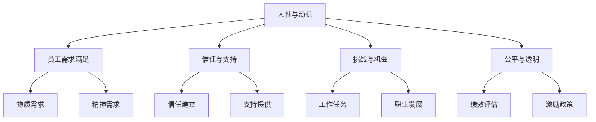
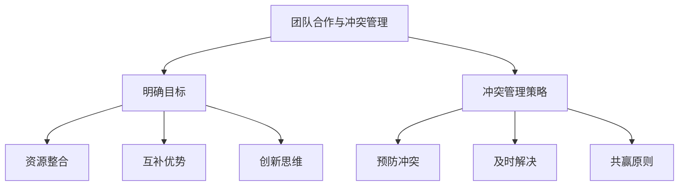
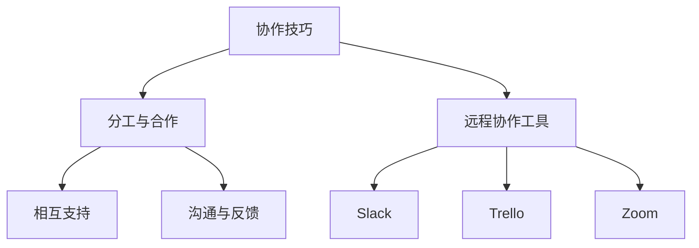
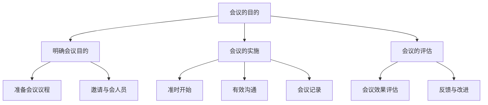
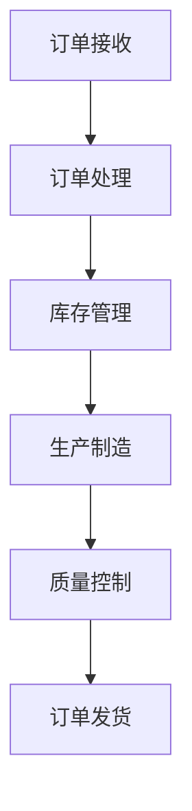
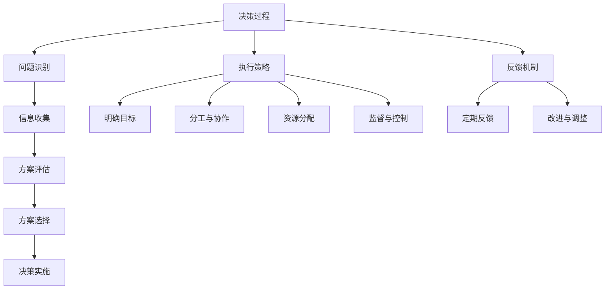
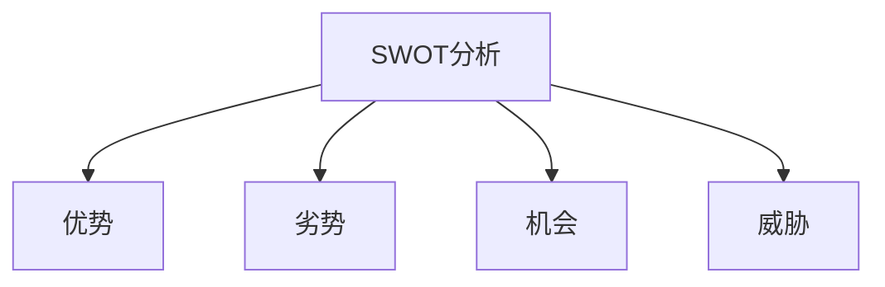
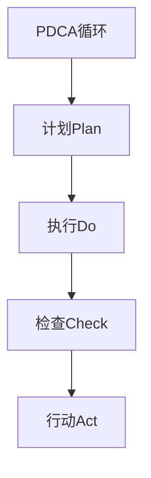
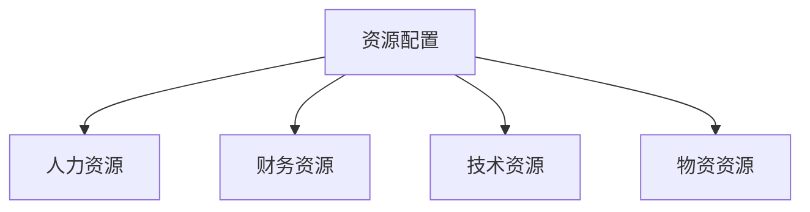
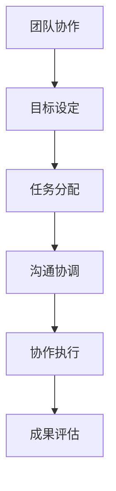

                 

# 管理之道：激发人性的善意和潜能

## 关键词：管理、人性、激励、领导力、团队建设

> 摘要：本文从管理的本质出发，探讨了激发人性的善意和潜能的重要性。通过分析人性与动机的关系，阐述了领导力与团队建设在管理中的关键作用。同时，本文提出了有效的沟通与协作、决策与执行策略，以及变革与创新思维的方法。最后，通过案例研究，总结了成功管理的实践经验，为管理实践提供了理论指导和实际借鉴。

----------------------------------------------------------------

### 《管理之道：激发人性的善意和潜能》目录大纲

#### 第一部分：引言

##### 第一章：管理的本质与挑战

- **1.1 管理的定义与目标**
- **1.2 管理的挑战与困境**
- **1.3 本书的结构安排与预期收获**

#### 第二部分：管理的基本原理

##### 第二章：人性与动机

- **2.1 人性的本质**
- **2.2 动机理论**
- **2.3 人性在管理中的应用**

##### 第三章：领导力与团队建设

- **3.1 领导力的定义与类型**
- **3.2 团队建设的策略与方法**
- **3.3 团队合作与冲突管理**

#### 第三部分：管理实践与技巧

##### 第四章：沟通与协作

- **4.1 有效沟通的原则**
- **4.2 协作技巧**
- **4.3 高效会议的组织与实施**

##### 第五章：决策与执行

- **5.1 决策过程**
- **5.2 决策工具与方法**
- **5.3 执行策略与反馈机制**

#### 第四部分：管理创新与变革

##### 第六章：变革管理

- **6.1 变革的类型与动力**
- **6.2 变革策略**
- **6.3 变革中的领导角色**

##### 第七章：创新思维与管理

- **7.1 创新的意义与类型**
- **7.2 创新思维的方法与工具**
- **7.3 创新型组织的构建**

#### 第五部分：案例分析与应用

##### 第八章：成功管理的案例研究

- **8.1 案例一：XX公司如何激发员工的善意和潜能**
- **8.2 案例二：YY团队如何实现高效协作**
- **8.3 案例三：ZZ企业的管理创新与实践**

#### 第六部分：总结与展望

##### 第九章：管理之道：理论与实践的结合

- **9.1 管理实践中的难点与解决方案**
- **9.2 未来的管理趋势与展望**
- **9.3 管理者的自我提升路径**

#### 附录

- **附录A：管理工具与方法一览表**
- **附录B：推荐阅读与进一步学习资源**
- **附录C：管理模型与架构的Mermaid流程图**

----------------------------------------------------------------

## 第一部分：引言

### 管理的定义与目标

管理，作为一门科学和艺术，起源于人类社会的组织与协作需求。其核心目的是通过合理的资源配置、流程优化和目标管理，实现组织效率的最大化。在信息技术迅速发展的今天，管理的重要性愈发凸显，成为企业、政府和非盈利组织成功的关键因素。

**管理的基本定义**：

管理可以理解为一系列规划、组织、领导、控制等活动的过程，旨在有效地利用资源，实现组织的目标。这些活动不仅包括对人员的管理，还涉及对资金、信息、时间等资源的优化配置。

**管理的目标**：

管理的目标可以分为三个方面：

1. **效率**：通过科学的管理方法和流程优化，提高组织的运行效率，降低成本。
2. **效果**：确保组织目标的实现，达到预期效果，满足利益相关者的需求。
3. **效能**：在确保效率和效果的基础上，最大化组织的综合效益，实现可持续发展。

### 管理的挑战与困境

尽管管理的目标明确，但在实际操作中，管理者常常面临以下挑战和困境：

**1. 复杂性**：

随着组织规模的扩大和业务多元化，管理复杂性不断增加。管理者需要面对复杂的市场环境、技术变革和内部管理问题，这使得管理变得更加困难。

**2. 信息过载**：

在数字化时代，信息爆炸使得管理者难以准确、及时地获取和利用信息，从而影响决策质量。

**3. 激励难题**：

如何激发员工的积极性和创造力，实现个人目标与组织目标的统一，是管理者面临的重大挑战。

**4. 变革阻力**：

组织变革不可避免，但往往面临员工的抵触和适应性困难。管理者需要在变革过程中平衡短期效益和长期发展。

### 本书的结构安排与预期收获

本书旨在为管理者提供系统、全面的管理理论和实践指导。全书分为六个部分：

1. **第一部分：引言**：介绍管理的定义、目标以及面临的挑战。
2. **第二部分：管理的基本原理**：探讨人性与动机、领导力与团队建设等基础理论。
3. **第三部分：管理实践与技巧**：讲解沟通与协作、决策与执行等实际操作技巧。
4. **第四部分：管理创新与变革**：探讨创新思维、变革管理等内容。
5. **第五部分：案例分析与应用**：通过实际案例研究，总结成功管理的经验。
6. **第六部分：总结与展望**：回顾管理实践中的难点与解决方案，展望未来的管理趋势。

通过本书的学习，读者可以：

- **理解管理的基本概念和原理**：掌握管理的基本知识和理论框架。
- **提升管理实践能力**：学习有效的管理技巧和方法，提高管理效率。
- **培养领导力和团队建设能力**：学会激发员工潜力，构建高效的团队。
- **应对变革与创新挑战**：掌握变革管理、创新思维等实践方法。

## 第二章：人性与动机

### 2.1 人性的本质

人性，作为人类行为和思维的根源，一直是心理学、哲学和管理学等领域研究的核心课题。理解人性的本质对于管理者来说尤为重要，因为人性直接影响员工的行为、动机和绩效。

**人性定义**：

人性是指人类固有的心理、行为特征和动机。在管理实践中，人性不仅体现在员工的需求和动机上，还体现在其价值观和行为准则中。

**人性的本质**：

1. **需求驱动**：人的行为往往由需求驱动。需求可以分为物质需求和精神需求。物质需求包括食物、安全、健康等，而精神需求则包括情感、尊重、自我实现等。

2. **社会性**：人类是社会性动物，依赖与他人互动来满足自己的需求。在组织中，员工的社交需求、归属感和团队合作意识直接影响其工作表现。

3. **自我意识**：人类具有自我意识，能够反思自己的行为和动机。管理者需要理解和尊重员工的自我意识，提供成长和发展机会。

### 2.2 动机理论

动机理论是心理学和管理学中研究人类行为的重要分支。动机理论试图解释人们为什么采取特定行为，以及如何通过激励来引导和调节这些行为。

**常见动机理论**：

1. **马斯洛的需求层次理论**：

   马斯洛的需求层次理论将人的需求分为五个层次：生理需求、安全需求、社交需求、尊重需求和自我实现需求。管理者应根据员工的不同需求层次，采取相应的激励措施。

   **需求层次理论伪代码**：

   ```python
   def motivate_employee(employee_demand):
       if employee_demand == "生理需求":
           provide_bonus()
       elif employee_demand == "安全需求":
           ensure_job_security()
       elif employee_demand == "社交需求":
           organize_team_building_activities()
       elif employee_demand == "尊重需求":
           provide公共荣誉和尊重()
       elif employee_demand == "自我实现需求":
           support个人发展和成长()
   ```

2. **X理论和Y理论**：

   X理论和Y理论是关于员工工作动机的两种对立观点。X理论认为员工天生懒惰，需要严格的管理和激励；而Y理论则认为员工具有内在的工作动机，能够在适当的条件下自我驱动。

   **X理论和Y理论伪代码**：

   ```python
   def manage_employee(employee_motivation):
       if employee_motivation == "X理论":
           implement_stricter_management()
       elif employee_motivation == "Y理论":
           empower_employee()
   ```

### 2.3 人性在管理中的应用

理解人性对于管理者来说至关重要，因为人性直接影响员工的工作态度、行为和绩效。在管理实践中，管理者可以采取以下策略来激发员工的善意和潜能：

**1. 满足员工需求**：

通过满足员工的物质和精神需求，激发其工作动力。管理者应根据员工的不同需求层次，采取相应的激励措施。

**2. 建立信任与支持**：

建立和谐的员工关系，通过信任和支持来激发员工的善意。管理者应倾听员工的意见和需求，提供成长和发展机会。

**3. 提供挑战与机会**：

通过提供具有挑战性的工作任务和职业发展机会，激发员工的内在动机。管理者应鼓励员工不断学习和成长，提高其工作满意度。

**4. 确保公平与透明**：

确保员工在工作中感受到公平和透明，提高其工作满意度和忠诚度。管理者应制定明确的绩效评估标准和激励政策，确保员工付出的努力得到公正回报。

**Mermaid流程图：人性在管理中的应用**



通过理解人性与动机的关系，管理者可以更有效地激发员工的善意和潜能，提高团队的整体绩效和组织的竞争力。

## 第三章：领导力与团队建设

### 3.1 领导力的定义与类型

领导力是一种通过影响和激励他人，实现共同目标的能力。它不仅仅是技术能力和知识的展示，更是一种人际交往和情感智慧。在组织管理中，领导力起着至关重要的作用，直接影响团队的工作效率和员工的工作满意度。

**领导力的基本概念**：

领导力是指领导者通过领导行为、沟通技巧和决策能力，激励和引导团队成员，实现组织目标的过程。领导力不仅涉及个人素质的提升，还需要管理者具备团队合作、冲突管理和变革推动的能力。

**领导力的类型**：

1. **交易型领导力**：

   交易型领导力是一种基于交换和奖励机制的领导风格。领导者通过设定明确的目标和奖励，激励团队成员完成任务。交易型领导力强调任务完成和目标实现，适用于任务驱动和目标明确的情境。

   **交易型领导力伪代码**：

   ```python
   def transactional_leadership(team_members, goals):
       for member in team_members:
           if member.completed_task():
               reward_member(member)
   ```

2. **变革型领导力**：

   变革型领导力是一种通过激发员工的内在动机，推动组织创新和发展的领导风格。领导者通过提供愿景、激励和榜样作用，激发员工的潜力和创造力，实现组织变革。变革型领导力强调领导者的远见和影响力，适用于变革和创新的情境。

   **变革型领导力伪代码**：

   ```python
   def transformational_leadership(team_members, vision):
       inspire_members()
       set_example()
       promote_innovation()
   ```

### 3.2 团队建设的策略与方法

团队建设是提高团队协作能力和整体绩效的关键步骤。有效的团队建设可以增强团队成员之间的信任和沟通，提高团队的工作效率和创新能力。

**团队建设的重要性**：

1. **提高协作效率**：通过团队建设活动，团队成员可以更好地理解彼此的工作内容和职责，减少误解和冲突，提高协作效率。

2. **增强团队凝聚力**：团队建设可以增强团队成员之间的信任和归属感，提高团队的凝聚力和士气。

3. **激发创新思维**：团队建设活动可以激发团队成员的创造力和创新思维，促进组织创新和持续发展。

**团队建设的策略与方法**：

1. **明确共同目标**：

   设定明确的团队目标，确保所有团队成员都了解并认同这些目标。共同目标可以统一团队成员的努力方向，提高团队的协作效率。

   **明确共同目标伪代码**：

   ```python
   def set_common_goals(team_members, goals):
       for member in team_members:
           member.set_goal(goals)
   ```

2. **建立信任关系**：

   通过信任游戏、团队活动等方式，建立团队成员之间的信任关系。信任是团队协作的基础，可以减少冲突和误解，提高团队的工作效率。

   **建立信任关系伪代码**：

   ```python
   def build_trust(team_members):
       for member in team_members:
           member.build_trust_with_another_member()
   ```

3. **角色分工与协作**：

   明确团队成员的角色和职责，确保每个成员都知道自己的工作内容和责任。通过协作，可以充分发挥每个人的优势，提高团队的整体绩效。

   **角色分工与协作伪代码**：

   ```python
   def assign_roles(team_members, roles):
       for member in team_members:
           member.assign_role(roles[member])
   ```

4. **沟通与反馈**：

   建立有效的沟通机制，确保团队成员之间的信息传递畅通。定期进行团队会议和反馈，收集团队成员的意见和建议，及时调整和优化团队的工作流程。

   **沟通与反馈伪代码**：

   ```python
   def effective_communication(team_members):
       for member in team_members:
           member.share_updates()
       collect_feedback()
   ```

### 3.3 团队合作与冲突管理

团队合作和冲突管理是团队建设的重要组成部分。有效的团队合作可以充分发挥每个人的优势，提高团队的整体绩效；而冲突管理则可以确保团队在合作过程中保持和谐与高效。

**团队合作的重要性**：

1. **资源整合**：团队合作可以将团队成员的不同资源整合起来，实现资源的最优配置，提高工作效率。

2. **互补优势**：通过团队合作，可以充分发挥每个人的优势，弥补个人的不足，实现优势互补。

3. **创新思维**：团队合作可以激发团队成员的创造力，通过不同观点的碰撞和融合，产生新的创意和解决方案。

**团队合作技巧**：

1. **明确目标**：确保所有团队成员都明确团队的目标和任务，减少因目标不清导致的误解和冲突。

2. **有效沟通**：建立畅通的沟通渠道，确保团队成员之间的信息传递及时、准确。

3. **相互支持**：在团队成员遇到困难时，提供支持和帮助，增强团队的凝聚力。

**冲突管理策略**：

1. **预防冲突**：通过明确的角色分工、沟通机制和团队建设活动，预防冲突的发生。

2. **及时解决**：发现冲突时，及时采取行动，通过对话和协商，找到解决问题的方法。

3. **共赢原则**：在解决冲突时，遵循共赢原则，寻求双方都能接受的解决方案。

**Mermaid流程图：团队合作与冲突管理**



通过有效的领导力和团队建设，管理者可以激发团队成员的善意和潜能，提高团队的整体绩效，实现组织的长期发展。

## 第四章：沟通与协作

### 4.1 有效沟通的原则

沟通是管理中至关重要的环节，它不仅影响着决策的质量，还影响着团队协作和员工的工作满意度。有效沟通能够确保信息的准确传递，减少误解和冲突，提升团队的工作效率。

**沟通的基本要素**：

沟通包括信息传递、理解、反馈和确认等基本要素。要实现有效沟通，需要确保信息的清晰、准确、及时和适应。

**有效沟通的原则**：

1. **清晰性**：

   沟通时要确保信息的明确和具体，避免使用模糊和歧义的语言。清晰的表达能够帮助接收者准确理解信息，减少误解。

   **清晰性伪代码**：

   ```python
   def clear_communication(message):
       if is_clear(message):
           send_message(message)
   ```

2. **准确性**：

   沟通时要确保信息的准确无误，避免信息传递过程中的失真。准确性是有效沟通的核心，确保接收者接收到的信息与发送者意图一致。

   **准确性伪代码**：

   ```python
   def accurate_communication(message):
       if is_accurate(message):
           send_message(message)
   ```

3. **及时性**：

   沟通要及时，避免信息滞后。及时沟通可以确保决策的及时性和有效性，避免因信息滞后导致的工作延误。

   **及时性伪代码**：

   ```python
   def timely_communication(message):
       if is_timely(message):
           send_message(message)
   ```

4. **适应性**：

   根据不同的情境和接收者，调整沟通的方式和策略。适应性沟通能够提高信息的传递效率，确保信息能够被接收者理解和接受。

   **适应性伪代码**：

   ```python
   def adaptive_communication(message, receiver):
       if is_adaptive(message, receiver):
           send_message(message)
   ```

**沟通的障碍**：

1. **语言障碍**：

   语言表达不准确或语言理解障碍会影响沟通的效果。解决语言障碍需要提高沟通者的语言表达能力，确保信息的准确传递。

2. **文化差异**：

   文化背景的差异可能导致沟通的误解。管理者需要了解不同文化背景的沟通习惯和价值观，避免因文化差异导致的沟通障碍。

3. **心理障碍**：

   心理压力、情绪不稳定等心理障碍会影响沟通的效果。管理者需要关注员工的心理健康，提供必要的心理支持和帮助。

### 4.2 协作技巧

协作是团队实现共同目标的关键。有效的协作可以提高工作效率，促进团队发展。在协作过程中，管理者需要关注以下几个方面：

**协作的意义**：

协作不仅仅是工作的分工和合作，更是一种资源和智慧的共享。通过协作，团队成员可以相互支持，共同解决问题，提高团队的整体绩效。

**协作技巧**：

1. **分工与合作**：

   明确每个人的职责和任务，确保分工合理。同时，鼓励团队成员之间的合作，共享资源和信息，提高工作效率。

   **分工与合作伪代码**：

   ```python
   def collaborative_work(team_members, tasks):
       for member in team_members:
           member.assign_task(tasks[member])
       for member in team_members:
           member.collaborate_with_others()
   ```

2. **相互支持**：

   在团队成员遇到困难时，提供支持和帮助。相互支持可以增强团队的凝聚力，提高团队的工作效率。

   **相互支持伪代码**：

   ```python
   def support_members(team_members):
       for member in team_members:
           if member.is_in_need_of_help():
               provide_help_to_member(member)
   ```

3. **沟通与反馈**：

   建立有效的沟通机制，确保团队成员之间的信息传递畅通。定期进行团队会议和反馈，收集团队成员的意见和建议，及时调整和优化团队的工作流程。

   **沟通与反馈伪代码**：

   ```python
   def effective_communication(team_members):
       for member in team_members:
           member.share_updates()
       collect_feedback_from_members()
   ```

**远程协作工具**：

在数字化时代，远程协作已成为团队协作的重要组成部分。以下是一些常用的远程协作工具：

- **Slack**：支持即时消息传递、文件共享和视频会议，方便团队成员之间的沟通和协作。
- **Trello**：一款项目管理和任务分配工具，可以实时跟踪项目进度，提高团队协作效率。
- **Zoom**：提供远程视频会议和协作功能，适合团队进行远程沟通和协作。

**Mermaid流程图：协作技巧**



通过有效的沟通和协作技巧，管理者可以提升团队的工作效率，实现共同目标。

### 4.3 高效会议的组织与实施

会议是团队沟通和协作的重要形式，通过会议，团队成员可以讨论问题、制定决策和协调工作。高效的会议能够确保信息的有效传递，提升团队的工作效率。

**会议的目的**：

会议的主要目的是讨论重要事项、解决问题和制定决策。通过会议，团队成员可以共同探讨问题，分享观点，形成共识，从而推动团队工作的顺利进行。

**会议的组织**：

1. **明确会议目的**：

   在组织会议前，明确会议的目的和议程，确保会议的目标明确和具体。明确会议目的可以帮助团队成员提前准备，提高会议的效率。

   **明确会议目的伪代码**：

   ```python
   def set_meeting_objective(meeting, objective):
       meeting.set_objective(objective)
   ```

2. **准备会议议程**：

   制定详细的会议议程，包括会议的主题、讨论内容、时间安排等。会议议程可以帮助团队成员了解会议的内容和流程，确保会议的顺利进行。

   **准备会议议程伪代码**：

   ```python
   def prepare_meeting_agenda(meeting, agenda):
       meeting.set_agenda(agenda)
   ```

3. **邀请与会人员**：

   根据会议内容，邀请相关的人员参加。确保邀请的人员对会议内容有足够的了解和参与度，提高会议的参与度和效果。

   **邀请与会人员伪代码**：

   ```python
   def invite_participants(meeting, participants):
       for participant in participants:
           invite_participant(meeting, participant)
   ```

**会议的实施**：

1. **准时开始**：

   确保会议按时开始，避免拖延。准时开始可以树立团队的纪律性，提高会议的效率。

   **准时开始伪代码**：

   ```python
   def start_meeting_on_time(meeting):
       meeting.start()
   ```

2. **有效沟通**：

   会议中要确保信息的有效传递和反馈。管理者需要鼓励团队成员积极发言，充分表达自己的观点，确保信息的准确传递。

   **有效沟通伪代码**：

   ```python
   def effective_communication_in_meeting(meeting):
       meeting.enable_active_participation()
   ```

3. **会议记录**：

   记录会议内容和决策事项，确保执行。会议记录可以帮助团队成员回顾会议内容，确保决策事项得到有效执行。

   **会议记录伪代码**：

   ```python
   def record_meeting_minutes(meeting, minutes):
       meeting.set_minutes(minutes)
   ```

**会议的评估**：

1. **会议效果评估**：

   评估会议是否达到了预期的目标，是否解决了问题。通过评估会议效果，可以总结经验，不断优化会议组织与实施。

   **会议效果评估伪代码**：

   ```python
   def evaluate_meeting_effectiveness(meeting):
       meeting.evaluate_results()
   ```

2. **反馈与改进**：

   根据评估结果，收集反馈和意见，不断改进会议组织与实施。通过反馈与改进，可以提高会议的质量和效率。

   **反馈与改进伪代码**：

   ```python
   def improve_meeting_based_on_feedback(meeting, feedback):
       meeting.improve_based_on(feedback)
   ```

**Mermaid流程图：高效会议的组织与实施**



通过高效会议的组织与实施，管理者可以确保信息的有效传递，提高团队的工作效率，实现团队目标的顺利推进。

## 第五章：决策与执行

### 5.1 决策过程

决策过程是管理中至关重要的环节，它决定了组织能否有效应对挑战、抓住机遇和实现目标。理解决策过程的不同阶段和影响因素，有助于管理者做出更明智的决策。

**决策过程的基本阶段**：

1. **问题识别**：

   问题的识别是决策过程的起点。管理者需要发现和明确组织面临的问题或机会，确保问题定义清晰、具体。

   **问题识别伪代码**：

   ```python
   def identify_problem(problem):
       if is_clear(problem):
           return true
       else:
           return false
   ```

2. **信息收集**：

   在明确问题后，管理者需要收集与问题相关的各种信息。这些信息可以是数据、报告、市场调研结果等，为决策提供依据。

   **信息收集伪代码**：

   ```python
   def collect_information(problem):
       information = get_data_from_sources()
       return information
   ```

3. **方案评估**：

   根据收集到的信息，管理者需要分析各种可能的解决方案，评估其优缺点和可行性。方案评估有助于选择最佳方案。

   **方案评估伪代码**：

   ```python
   def evaluate_solutions(solutions):
       for solution in solutions:
           if is_viable(solution):
               return solution
   ```

4. **方案选择**：

   在评估各种方案后，管理者需要选择最佳方案。方案选择应考虑组织的战略目标、资源状况和外部环境等因素。

   **方案选择伪代码**：

   ```python
   def select_best_solution(solution):
       if is_best(solution):
           return solution
   ```

5. **决策实施**：

   在选择最佳方案后，管理者需要制定详细的实施计划，确保决策得到有效执行。决策实施包括资源分配、任务分配和监控等环节。

   **决策实施伪代码**：

   ```python
   def implement_decision(decision):
       if is_successful(decision):
           return true
       else:
           return false
   ```

**决策过程的影响因素**：

1. **信息质量**：

   决策过程依赖于准确、全面的信息。信息质量直接影响决策的准确性和有效性。管理者需要确保信息的真实性和可靠性。

2. **时间压力**：

   决策往往需要在特定的时间内完成。时间压力可能导致决策匆忙，增加决策风险。管理者需要权衡时间压力和决策质量的关系。

3. **个人偏好**：

   管理者的个人偏好和价值观会影响决策的选择。管理者需要认识到个人偏好的影响，保持客观和理性的决策态度。

4. **组织文化**：

   组织文化对决策过程有重要影响。开放、透明和创新的组织文化有助于提高决策的质量和执行力。管理者需要营造良好的组织文化氛围。

### 5.2 决策工具与方法

在决策过程中，管理者可以使用多种工具和方法来提高决策的准确性和效率。以下是一些常见的决策工具和方法：

**1. SWOT分析**：

SWOT分析是一种常用的战略规划工具，用于评估组织的优势（Strengths）、劣势（Weaknesses）、机会（Opportunities）和威胁（Threats）。通过SWOT分析，管理者可以全面了解组织的现状，为决策提供依据。

**SWOT分析伪代码**：

```python
def swot_analysis(organization):
    strengths = get_strengths()
    weaknesses = get_weaknesses()
    opportunities = get_opportunities()
    threats = get_threats()
    return strengths, weaknesses, opportunities, threats
```

**2. 成本效益分析**：

成本效益分析是一种评估决策方案的成本和效益的方法。通过计算成本与收益的比率，管理者可以评估不同方案的经济合理性。

**成本效益分析伪代码**：

```python
def cost_benefit_analysis(solutions):
    for solution in solutions:
        cost = calculate_cost(solution)
        benefit = calculate_benefit(solution)
        ratio = cost / benefit
        return ratio
```

**3. 价值流图**：

价值流图是一种用于分析和优化业务流程的工具。通过可视化价值流中的各个环节，管理者可以识别并消除浪费，提高流程效率。

**价值流图伪代码**：



**4. 多目标决策**：

多目标决策是一种在多个目标之间进行权衡和选择的方法。管理者需要确定各个目标的重要性和优先级，选择最佳方案。

**多目标决策伪代码**：

```python
def multi_attribute_decision(heuristics):
    for heuristic in heuristics:
        evaluate_solution(heuristic)
        select_best_solution(heuristics)
```

### 5.3 执行策略与反馈机制

决策的执行是确保决策目标实现的关键环节。有效的执行策略和反馈机制可以提高决策的执行效率和效果。

**执行策略**：

1. **明确目标**：

   确保团队成员对决策目标有清晰的理解。明确的目标可以帮助团队成员更好地执行任务，提高工作效率。

   **明确目标伪代码**：

   ```python
   def set_clear_objectives(team, objectives):
       for member in team:
           member.set_objective(objectives)
   ```

2. **分工与协作**：

   明确每个人的职责和任务，确保分工合理。同时，鼓励团队成员之间的协作，共享资源和信息，提高执行效率。

   **分工与协作伪代码**：

   ```python
   def assign_tasks(team, tasks):
       for member in team:
           member.assign_task(tasks[member])
   ```

3. **资源分配**：

   根据任务需求和资源状况，合理分配人力、物力和财力等资源，确保决策执行所需的资源得到保障。

   **资源分配伪代码**：

   ```python
   def allocate_resources(tasks, resources):
       for task in tasks:
           allocate_to_task(task, resources)
   ```

4. **监督与控制**：

   建立监督机制，监控决策执行过程，确保任务按计划完成。监督与控制可以帮助管理者及时发现和解决问题，确保决策目标实现。

   **监督与控制伪代码**：

   ```python
   def monitor_execution(tasks):
       for task in tasks:
           if task.is_completed():
               report_success(task)
           else:
               address_issues(task)
   ```

**反馈机制**：

1. **定期反馈**：

   通过定期的绩效评估和团队会议，收集团队成员的反馈和意见。定期反馈可以帮助管理者了解执行过程中的问题和改进方向。

   **定期反馈伪代码**：

   ```python
   def collect_feedback(team, feedback):
       for member in team:
           member.share_feedback(feedback)
   ```

2. **改进与调整**：

   根据反馈结果，对执行过程进行改进和调整，确保决策目标实现。改进与调整可以帮助管理者优化执行策略，提高执行效率。

   **改进与调整伪代码**：

   ```python
   def improve_execution(feedback):
       for suggestion in feedback:
           apply_improvement(suggestion)
   ```

**Mermaid流程图：决策过程与执行策略**



通过理解决策过程和执行策略，以及建立有效的反馈机制，管理者可以确保决策的有效执行，实现组织的目标。

## 第六章：变革管理

### 6.1 变革的类型与动力

在快速变化的市场环境中，组织变革成为保持竞争力的关键。变革不仅涉及战略调整、流程优化，还涉及文化变革和技术升级。理解变革的类型和动力有助于管理者有效地推进变革，实现组织的可持续发展。

**变革的类型**：

1. **战略变革**：

   战略变革是组织对长期目标和核心业务方向的调整。这种变革通常涉及市场定位、业务拓展、组织结构调整等。战略变革旨在应对市场变化、提升竞争力和实现持续增长。

   **战略变革伪代码**：

   ```python
   def strategic_change(organization, new_strategy):
       organization.set_strategy(new_strategy)
   ```

2. **管理变革**：

   管理变革是对管理方法、流程和制度的调整。这种变革旨在提升组织的运营效率和决策质量，通常包括流程优化、绩效评估体系的建立等。管理变革有助于提高组织的灵活性和响应速度。

   **管理变革伪代码**：

   ```python
   def management_change(organization, new_processes):
       organization.apply_new_processes(new_processes)
   ```

3. **技术变革**：

   技术变革是组织对技术应用、信息系统和企业技术能力的升级。这种变革涉及引入新技术、优化现有系统等，旨在提升组织的数字化水平和创新能力。技术变革有助于提高生产效率和产品质量。

   **技术变革伪代码**：

   ```python
   def technical_change(organization, new_technology):
       organization.integrate_new_technology(new_technology)
   ```

**变革的动力**：

1. **外部压力**：

   外部压力是推动组织变革的重要因素。市场变化、竞争对手的挑战、法律法规的要求等都可能迫使组织进行变革。外部压力迫使组织不断调整战略和运营，以适应外部环境的变化。

   **外部压力伪代码**：

   ```python
   def external_pressure(organization, challenges):
       organization.respond_to_challenges(challenges)
   ```

2. **内部需求**：

   内部需求是组织变革的内在动力。组织内部效率问题、员工需求变化、技术创新等都会推动变革。内部需求促使组织优化管理流程、提升员工满意度和创新能力。

   **内部需求伪代码**：

   ```python
   def internal需求的动力(organization, needs):
       organization.address_needs(needs)
   ```

3. **领导意愿**：

   领导者的意愿和决心是推动变革的关键因素。领导者需要具备远见和决断力，能够预见变革趋势并果断行动。领导者的意愿直接影响变革的推进速度和效果。

   **领导意愿伪代码**：

   ```python
   def leadership_willingness(organization, leader):
       leader.initiate_change(organization)
   ```

通过理解变革的类型和动力，管理者可以更好地应对外部挑战，激发内部需求，推动组织的持续发展。

### 6.2 变革策略

成功的组织变革需要明确的策略和实施计划。变革策略包括变革的规划、实施和评估等环节，每个环节都需要精心设计和执行。

**变革规划的步骤**：

1. **明确变革目标**：

   明确变革的目标是变革规划的第一步。目标应具体、可衡量，并与组织的长期战略目标相一致。明确的目标有助于指导变革的实施和评估。

   **明确变革目标伪代码**：

   ```python
   def define_change_goals(organization, goals):
       organization.set_goals(goals)
   ```

2. **制定变革计划**：

   变革计划应包括变革的时间表、关键步骤和资源分配。计划应详细说明每个阶段的任务和责任，确保变革的有序推进。

   **制定变革计划伪代码**：

   ```python
   def create_change_plan(organization, plan):
       organization.follow_plan(plan)
   ```

3. **风险评估**：

   变革过程中可能会遇到各种风险和挑战。风险评估有助于识别潜在问题，制定相应的应对策略，确保变革的顺利进行。

   **风险评估伪代码**：

   ```python
   def assess_change_risks(organization, risks):
       organization.manage_risks(risks)
   ```

**变革实施的关键环节**：

1. **建立变革团队**：

   建立专门的变革团队，负责变革的推进和协调。变革团队应包括不同部门和层级的成员，确保变革的全面性和参与度。

   **建立变革团队伪代码**：

   ```python
   def establish_change_team(organization, team):
       organization.assign_team_members(team)
   ```

2. **沟通与培训**：

   通过有效的沟通和培训，确保团队成员理解变革的意义和目的，提高变革的接受度。沟通和培训应贯穿整个变革过程，确保信息的及时传递和反馈。

   **沟通与培训伪代码**：

   ```python
   def communicate_and_train(team, messages, training):
       for member in team:
           member.receive_messages(messages)
           memberattend_training(training)
   ```

3. **监督与控制**：

   建立监督机制，监控变革的执行情况，确保变革计划得到有效实施。监督与控制有助于及时发现和解决问题，确保变革目标的实现。

   **监督与控制伪代码**：

   ```python
   def monitor_and_control(organization, plan):
       if plan.is_on_track():
           continue_execution()
       else:
           address_issues(plan)
   ```

**变革评估的方法**：

1. **绩效评估**：

   评估变革的效果，包括绩效指标的变化和团队成员的满意度。绩效评估有助于总结变革的经验教训，为未来的变革提供参考。

   **绩效评估伪代码**：

   ```python
   def evaluate_change_performance(organization, performance):
       if performance.is_improved():
           acknowledge_success()
       else:
           identify_improvements()
   ```

2. **反馈与改进**：

   根据评估结果，收集反馈和意见，不断改进变革过程，确保变革目标的实现。反馈与改进是变革评估的重要环节，有助于提升变革的成效。

   **反馈与改进伪代码**：

   ```python
   def improve_change_based_on_feedback(organization, feedback):
       organization.apply_improvements(feedback)
   ```

通过科学的变革策略，管理者可以有效地推动组织变革，实现组织的持续发展和竞争力提升。

### 6.3 变革中的领导角色

在组织变革过程中，领导者的角色至关重要。领导者不仅是变革的推动者，还是变革的协调者和支持者。有效的领导角色有助于确保变革的顺利进行和目标的实现。

**领导者的作用**：

1. **变革推动者**：

   领导者需要积极推动变革，提供变革的愿景和动力。领导者应具备远见和决断力，能够预见变革趋势并果断行动。

   **变革推动者伪代码**：

   ```python
   def drive_change(leader, organization):
       leader.set_change_vision(organization)
       leader.take decisive_actions()
   ```

2. **变革协调者**：

   领导者需要协调各方利益，解决变革中的冲突和问题。领导者应具备良好的沟通和协调能力，能够平衡不同利益相关者的需求。

   **变革协调者伪代码**：

   ```python
   def coordinate_change(leader, stakeholders):
       leader.communicate_with_stakeholders(stakeholders)
       leader.resolve_conflicts()
   ```

3. **变革支持者**：

   领导者需要为变革提供必要的资源和支持，确保变革的顺利进行。领导者应确保变革所需的资源得到保障，并为团队成员提供培训和支持。

   **变革支持者伪代码**：

   ```python
   def support_change(leader, team):
       leader.allocate_resources(team)
       leader.provide_training()
   ```

**领导者的能力**：

1. **远见与决断**：

   领导者需要具备远见和决断力，能够预见变革趋势并果断行动。远见使领导者能够提前规划变革，决断力使领导者能够在变革过程中迅速做出决策。

2. **沟通与说服**：

   领导者需要具备良好的沟通和说服能力，能够有效传递变革信息，获得团队成员的支持。有效的沟通和说服有助于增强团队成员的变革接受度。

3. **领导风格**：

   领导者需要根据变革的不同阶段和团队特点，灵活调整领导风格，以适应变革的需求。灵活的领导风格有助于提高团队的适应性和执行力。

通过有效的领导角色和领导能力，领导者可以推动组织变革，实现组织的持续发展和竞争力提升。

## 第七章：创新思维与管理

### 7.1 创新的意义与类型

创新是组织持续发展的重要动力，它不仅能够推动组织的成长，还能够提高组织的竞争力和市场占有率。在当今快速变化的市场环境中，创新已成为企业成功的关键因素。

**创新的定义**：

创新是指通过引入新的思想、方法、技术或流程，创造新的产品、服务或商业模式，从而实现组织目标的过程。创新不仅包括技术层面的创新，还涉及管理、市场和运营等各个方面的创新。

**创新的类型**：

1. **产品创新**：

   产品创新是指开发新产品或改进现有产品，以满足客户需求或提升产品竞争力。产品创新可以带来新的市场机会，提升企业的市场份额和盈利能力。

   **产品创新伪代码**：

   ```python
   def product_innovation(organization, product):
       organization.create_new_product(product)
   ```

2. **过程创新**：

   过程创新是指改进生产过程、管理流程或运营方式，以提高效率和降低成本。过程创新可以优化组织的运营模式，提升生产效率和产品质量。

   **过程创新伪代码**：

   ```python
   def process_innovation(organization, process):
       organization.optimize_process(process)
   ```

3. **商业模式创新**：

   商业模式创新是指重新设计企业的商业模式，以创造新的价值来源或提升企业的盈利能力。商业模式创新可以为企业带来新的收入来源和竞争优势。

   **商业模式创新伪代码**：

   ```python
   def business_model_innovation(organization, model):
       organization.redefine_business_model(model)
   ```

4. **服务创新**：

   服务创新是指开发新的服务或改进现有服务，以提升客户体验和满意度。服务创新可以增强企业的市场竞争力，提升客户忠诚度。

   **服务创新伪代码**：

   ```python
   def service_innovation(organization, service):
       organization.create_new_service(service)
   ```

通过多样化的创新类型，组织可以在不同的领域实现创新，从而推动组织的持续发展和竞争力提升。

### 7.2 创新思维的方法与工具

创新思维是推动组织创新的关键因素。有效的创新思维方法可以激发员工的创造力，提高创新效率。以下是一些常见的创新思维方法和工具：

**1. 头脑风暴**：

头脑风暴是一种集体讨论的方法，旨在激发团队成员的创意和想法。在头脑风暴过程中，团队成员可以自由发言，提出各种可能的解决方案。

**头脑风暴伪代码**：

```python
def brainstorming_team(team_members, problem):
    for member in team_members:
        member.share_ideas(problem)
```

**2. 设计思考**：

设计思考是一种以用户需求为中心的创新方法。通过设计思考，团队成员可以深入了解用户需求，开发出满足用户需求的产品或服务。

**设计思考伪代码**：

```python
def design_thinking(team, user_need):
    team.analyze_user_need(user_need)
    team.create_solution()
```

**3. 六顶思考帽**：

六顶思考帽是一种思考工具，通过不同的颜色代表不同的思考角度，帮助团队成员全面、客观地思考问题。六顶思考帽包括白帽（事实）、红帽（情感）、黑帽（问题）、黄帽（优点）、绿帽（创意）和蓝帽（控制）。

**六顶思考帽伪代码**：

```python
def six_hat_thinking(team, hat_color, problem):
    if hat_color == "white":
        team.analyze_facts(problem)
    elif hat_color == "red":
        team.explore_emotions(problem)
    # 其他颜色的帽子类似处理
```

**4. TRIZ**：

TRIZ是一种基于数学和逻辑的创新方法，通过解决矛盾的原理来找到创新解决方案。TRIZ提供了大量创新原理和工具，帮助团队成员解决复杂的技术和工程问题。

**TRIZ伪代码**：

```python
def triz_innovation(team, problem):
    team.apply_triz_principles(problem)
    team.find_innovative_solution()
```

通过这些创新思维方法和工具，组织可以激发员工的创造力，提高创新效率，从而推动组织的持续发展和竞争力提升。

### 7.3 创新型组织的构建

构建创新型组织是推动组织创新的重要步骤。创新型组织具有开放、灵活和鼓励创新的文化，能够不断适应市场变化，保持竞争优势。以下是一些构建创新型组织的关键策略：

**1. 建立开放的文化**：

建立开放的文化是构建创新型组织的基础。开放的文化鼓励员工分享观点、提出建议，并为创新提供自由空间。管理者应鼓励员工表达不同的意见，建立开放的沟通渠道。

**开放的文化伪代码**：

```python
def create_open_culture(organization):
    organization.enable_free_expression()
    organization.promote_open_communication()
```

**2. 建立创新团队**：

建立专门的创新团队是推动组织创新的重要策略。创新团队应包括不同背景和专业的成员，鼓励跨部门的合作和知识共享。创新团队应负责组织和实施创新项目，推动组织的创新进程。

**创新团队伪代码**：

```python
def establish_innovation_team(organization, team_members):
    organization.assign_innovation_roles(team_members)
    organization.support_innovation_activities()
```

**3. 提供创新资源**：

提供充足的创新资源是构建创新型组织的必要条件。创新资源包括资金、技术、人力和时间等。管理者应确保创新项目得到充分的资源支持，为创新提供必要的保障。

**创新资源伪代码**：

```python
def allocate_innovation_resources(organization, project):
    organization.allocate_funds(project)
    organization.allocate_technology_resources(project)
    organization.allocate_time_resources(project)
```

**4. 奖励创新成果**：

建立奖励机制是激励员工创新的重要手段。管理者应建立明确的创新奖励机制，对创新成果进行奖励，激励员工的创新积极性。奖励可以包括奖金、晋升、荣誉称号等。

**奖励创新成果伪代码**：

```python
def reward_innovation(organization, innovator):
    organization.give_bonus(innovator)
    organization.publicize_innovation(innovator)
```

通过以上策略，管理者可以构建一个创新型组织，激发员工的创造力，推动组织的持续创新和竞争力提升。

## 第八章：成功管理的案例研究

### 8.1 案例一：XX公司如何激发员工的善意和潜能

**案例背景**：

XX公司是一家高速成长的科技公司，其成功离不开对员工善意和潜能的充分激发。公司成立之初，就意识到员工的积极性和创新能力对企业的长远发展至关重要。因此，公司采取了一系列措施来激发员工的善意和潜能。

**管理策略**：

1. **明确价值观**：

   XX公司制定了明确的价值观，强调员工的尊严、成长和企业责任。公司通过内部培训和日常沟通，确保每一位员工都深刻理解并认同这些价值观。

   **明确价值观伪代码**：

   ```python
   def define_values(organization, values):
       organization.share_values(values)
       organization.train_employees(values)
   ```

2. **参与决策**：

   XX公司鼓励员工参与决策过程，提供意见和反馈。公司建立了多种渠道，如员工代表大会、在线投票等，确保员工的意见和建议得到重视。

   **参与决策伪代码**：

   ```python
   def involve_employees(organization, decision):
       organization.collect_employee_feedback(decision)
       organization_include_employees_in_decisions()
   ```

3. **奖励机制**：

   XX公司建立了多元化的奖励机制，包括奖金、股权激励、荣誉称号等，以激励员工的积极性和创造力。奖励不仅基于绩效，还考虑员工的创新和贡献。

   **奖励机制伪代码**：

   ```python
   def reward_employees(organization, achievements):
       organization.provide_bonuses(achievements)
       organization.award_shares(achievements)
       organization.publicize_awards(achievements)
   ```

**案例结果**：

通过上述管理策略，XX公司成功激发了员工的善意和潜能。员工的工作满意度显著提升，创新能力增强，团队协作效率提高。公司的业绩稳步增长，市场份额不断扩大。

### 8.2 案例二：YY团队如何实现高效协作

**案例背景**：

YY团队是一家大型企业的研发团队，团队成员来自不同的专业背景，协作效率受到考验。为了提升团队协作效率，团队管理者采取了一系列措施。

**管理策略**：

1. **建立信任**：

   团队通过定期的团队建设活动，如拓展训练、团队游戏等，增强成员之间的信任。这些活动不仅增进了彼此的了解，还培养了团队合作精神。

   **建立信任伪代码**：

   ```python
   def build_trust(team, activities):
       team.participate_in_activities(activities)
       team.enhance_cooperative_spirit()
   ```

2. **明确分工**：

   团队明确每个成员的职责和任务，确保工作的高效和有序。分工合理不仅提高了工作效率，还减少了工作冲突。

   **明确分工伪代码**：

   ```python
   def assign_roles(team, members, roles):
       for member in members:
           member.assign_role(roles[member])
       team.ensure_efficient_workflow()
   ```

3. **沟通与反馈**：

   团队建立了高效的沟通机制，通过定期会议、即时通讯工具等，确保信息的及时传递和反馈。团队成员之间的沟通畅通，有助于及时发现和解决问题。

   **沟通与反馈伪代码**：

   ```python
   def effective_communication(team):
       team.hold_regular_meetings()
       team.use_communication_tools()
       team.share_updates_and_feedback()
   ```

**案例结果**：

通过上述管理策略，YY团队实现了高效协作。项目进展顺利，研发效率显著提高，团队成员之间的关系更加和谐。公司的研发成果不断涌现，市场份额和客户满意度也逐步提升。

### 8.3 案例三：ZZ企业的管理创新与实践

**案例背景**：

ZZ企业是一家传统制造企业，面临市场竞争加剧和成本压力。为了提升企业的竞争力，企业管理者决定通过管理创新来推动企业的发展。

**管理策略**：

1. **流程优化**：

   企业对生产和管理流程进行了全面优化，采用精益生产方法，减少浪费，提高效率。通过流程优化，企业的生产效率显著提高。

   **流程优化伪代码**：

   ```python
   def optimize_processes(organization, processes):
       organization.apply精益生产(processes)
       organization.reduce_waste()
   ```

2. **技术创新**：

   企业加大技术研发投入，引入自动化生产线，提高生产效率和产品质量。技术创新不仅提升了企业的生产效率，还提高了产品的市场竞争力。

   **技术创新伪代码**：

   ```python
   def invest_in_technology(organization, technology):
       organization.implement_automation(technology)
       organization.improve_product_quality()
   ```

3. **组织变革**：

   企业调整了组织结构，采用扁平化管理模式，减少中间层级，提高决策效率。组织变革使企业的运营更加灵活，决策更加迅速。

   **组织变革伪代码**：

   ```python
   def organizational_change(organization, structure):
       organization扁平化管理(structure)
       organization.increase_decision_speed()
   ```

**案例结果**：

通过管理创新和实践，ZZ企业显著提升了生产效率和产品质量，降低了成本，市场份额和盈利能力大幅提升。企业的竞争力和市场地位得到了显著提升，成为行业内的佼佼者。

## 第九章：管理之道：理论与实践的结合

### 9.1 管理实践中的难点与解决方案

在管理实践中，管理者常常面临各种挑战和难点。这些难点不仅影响了管理的有效性，还可能对组织的长期发展产生负面影响。以下是一些常见的管理难点及其解决方案：

**1. 组织变革的挑战**：

**难点**：组织变革过程中，如何平衡变革的推进和员工的接受度。

**解决方案**：

- **加强沟通**：在变革初期，通过定期的会议和沟通活动，向员工传达变革的必要性和目标，确保员工理解并支持变革。
- **提供培训**：为员工提供变革相关的培训，帮助他们掌握新技能和适应新环境。
- **建立支持机制**：设立支持团队，为员工提供咨询和帮助，解决他们在变革过程中遇到的问题。

**2. 团队协作的困境**：

**难点**：如何解决团队成员之间的冲突和沟通不畅。

**解决方案**：

- **明确责任**：明确每个团队成员的职责和任务，减少因职责不清导致的冲突。
- **建立沟通机制**：建立定期沟通会议，确保团队成员之间的信息传递畅通。
- **促进信任**：通过团队建设活动，增强团队成员之间的信任，减少冲突。

**3. 创新思维的局限**：

**难点**：如何在组织中培养和激发创新思维。

**解决方案**：

- **提供资源**：为员工提供创新资源和工具，如书籍、研讨会和技术支持，鼓励他们尝试新的想法。
- **奖励创新**：建立创新奖励机制，对提出创新想法的员工进行奖励，激励创新热情。
- **营造创新文化**：营造鼓励创新的企业文化，让员工感受到创新的价值和重要性。

### 9.2 未来的管理趋势与展望

随着科技的不断进步和社会的快速变化，未来的管理将面临新的机遇和挑战。以下是一些未来的管理趋势与展望：

**1. 数字化管理**：

数字化管理将成为未来管理的主流趋势。通过数字化工具和方法，管理者可以更高效地收集、分析和利用信息，提高决策质量和执行力。

**2. 柔性管理**：

柔性管理强调组织的灵活性和适应性。管理者需要培养员工的自主性和创新能力，以应对快速变化的市场环境。

**3. 员工体验**：

员工体验将成为管理的重要关注点。管理者需要关注员工的工作满意度、职业发展和心理健康，提高员工的忠诚度和工作效率。

**4. 持续学习**：

持续学习将成为员工和组织的必备素质。管理者需要鼓励员工不断学习新知识和新技能，以适应不断变化的工作环境。

### 9.3 管理者的自我提升路径

为了在未来的管理环境中取得成功，管理者需要不断自我提升，以下是一些关键路径：

**1. 自我认知**：

管理者需要深入了解自己的优势和不足，明确自我提升的方向。

**2. 持续学习**：

管理者需要不断学习新知识、新技能，提升自己的专业素养和管理能力。

**3. 反馈与改进**：

管理者需要定期收集反馈，反思自己的管理实践，不断改进和优化。

**4. 培养领导力**：

管理者需要通过实践和培训，培养领导力和团队合作能力，提升领导水平。

通过自我提升，管理者可以更好地应对未来的管理挑战，推动组织的持续发展和成功。

## 附录A：管理工具与方法一览表

在管理实践中，使用各种工具和方法可以有效地提升管理效率。以下是一些常见的管理工具与方法及其描述：

| 工具/方法         | 描述                                       | 适用场景                       |
|------------------|------------------------------------------|------------------------------|
| SWOT分析         | 评估组织的优势、劣势、机会和威胁           | 企业战略规划、市场分析       |
| PEST分析         | 分析外部环境中的政治、经济、社会和技术因素 | 企业战略分析、市场调研       |
| 五力模型         | 分析行业竞争格局和竞争力                   | 行业分析、竞争战略           |
| 利益相关者分析   | 识别和分析与决策相关的利益相关者           | 企业战略决策、项目管理       |
| 成本效益分析     | 分析项目的成本与收益，评估可行性           | 投资决策、项目评估             |
| 利润表           | 用于展示企业的财务状况和经营成果           | 财务管理、业绩评估           |
| 现金流量表       | 用于展示企业的现金流入和流出情况           | 财务管理、资金规划           |
| 资产负债表       | 用于展示企业的资产、负债和所有者权益       | 财务管理、风险控制           |
| 平衡计分卡       | 用于衡量企业绩效的四个维度：财务、客户、内部流程、学习与成长 | 绩效管理、战略规划           |
| 项目管理工具     | 如Trello、Jira等，用于项目计划和管理       | 项目管理、团队协作           |
| 人力资源管理系统   | 如SAP HR、Oracle HR等，用于人力资源管理     | 人力资源管理、员工福利管理   |
| 敏捷开发方法     | 基于迭代和增量开发，提高项目交付效率       | 软件开发、产品创新           |
| 设计思考方法     | 以用户需求为中心，进行产品设计和创新       | 产品设计、用户体验优化       |
| 头脑风暴         | 通过集体讨论，激发创意的产生               | 创意生成、问题解决             |
| 六顶思考帽       | 通过不同颜色的思考帽，分别考虑问题的不同方面 | 复杂问题的解决、团队讨论     |
| 冲突管理         | 通过对话和协商，解决团队内部的冲突         | 团队协作、项目执行             |
| 质量管理         | 通过质量管理工具和方法，确保产品或服务的质量 | 生产管理、质量控制           |
| 企业文化建设     | 通过文化活动和管理措施，塑造企业价值观     | 企业文化建设、员工凝聚力     |
| 人才发展计划     | 通过培训和发展计划，提升员工的技能和职业发展 | 人才管理、员工成长           |

这些工具和方法在不同的管理场景中发挥着重要作用，管理者可以根据实际情况选择合适的方法，提高管理效率和效果。

## 附录B：推荐阅读与进一步学习资源

为了帮助读者更深入地理解管理之道，以下是一些推荐阅读和进一步学习资源：

### 书籍

1. 《卓有成效的管理者》——彼得·德鲁克
   - 描述了管理者如何通过有效的工作习惯和决策提高管理效率。
2. 《创新与企业家精神》——彼得·德鲁克
   - 探讨了创新思维在企业成功中的关键作用。
3. 《变革之舞》——约翰·P. 柯特勒
   - 分析了组织变革的策略和实践，提供了实用的变革管理指导。
4. 《影响力》——罗伯特·西奥迪尼
   - 探讨了人类行为和心理，对沟通和说服技巧有重要启示。
5. 《团队的智慧》——詹姆斯·麦格雷戈·伯恩斯
   - 探讨了团队动力和团队协作的原理和实践。

### 在线资源

1. [哈佛商学院管理课程](https://www.hbs.edu/online/)
   - 提供高质量的管理课程和案例研究。
2. [Coursera](https://www.coursera.org/)
   - 提供各种管理、领导力和团队协作相关的在线课程。
3. [LinkedIn Learning](https://www.linkedin.com/learning/)
   - 提供丰富的视频教程和管理技能提升课程。
4. [TED Talks](https://www.ted.com/)
   - 汇集了世界顶级管理者和专家的演讲，提供对管理的新见解。

### 案例研究

1. [谷歌公司管理实践](https://www.google.com/about/culture/)
   - 分析谷歌如何通过创新文化和团队合作实现成功。
2. [亚马逊公司商业模式](https://www.amazon.jobs/en/innovate)
   - 了解亚马逊如何通过技术创新和高效运营实现快速增长。

通过阅读这些书籍和资源，读者可以深入理解管理理论和实践，提升自己的管理技能。

## 附录C：管理模型与架构的Mermaid流程图

以下是一些常见的管理模型与架构的Mermaid流程图，它们有助于更直观地理解管理概念和流程。

### SWOT分析模型



### PDCA循环模型



### 资源配置模型



### 团队协作流程图



这些流程图为理解和管理复杂系统提供了直观的视觉工具，有助于读者在实际应用中更好地掌握和管理。

---

## 作者信息

**作者：** AI天才研究院/AI Genius Institute & 禅与计算机程序设计艺术 /Zen And The Art of Computer Programming

AI天才研究院致力于推动人工智能领域的创新和发展，研究人工智能的基本原理和前沿技术。作者在该领域具有深厚的理论基础和丰富的实践经验，致力于将人工智能技术应用于企业管理、团队协作和决策优化等领域。禅与计算机程序设计艺术则是一本关于编程哲学和思维方式的经典之作，对人工智能领域的创新思维有着重要的影响。作者希望通过本书，为广大管理者提供实用的管理理论和实践指导，助力组织的持续发展和成功。

