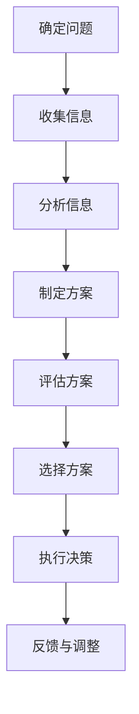
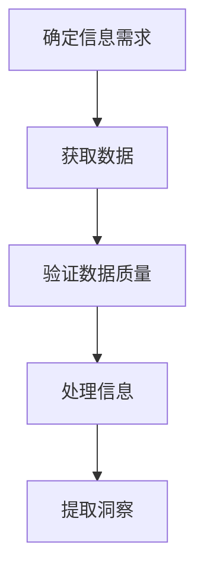
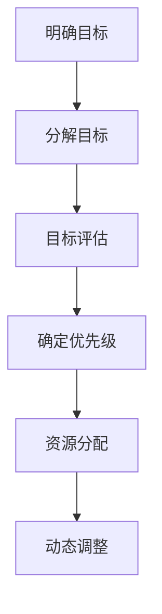
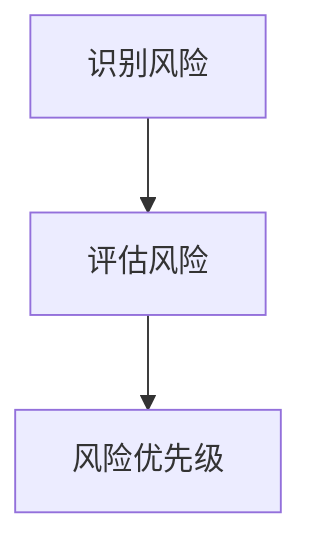
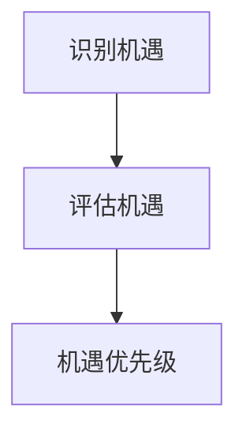
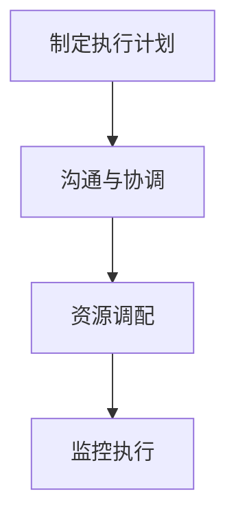
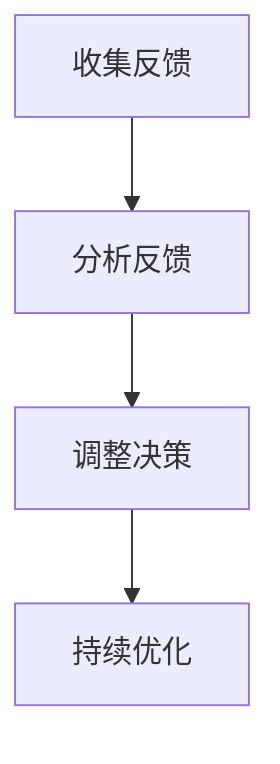
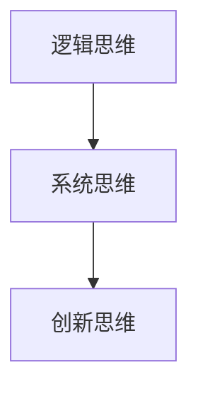

                 

# 管理者决断力：果断决策的重要性

> **关键词**：管理者决断力，果断决策，决策过程，决策质量，决策策略，决策工具，决策团队协作，危机管理，企业文化建设，自我提升，持续学习。

> **摘要**：本文深入探讨了管理者决断力的本质与重要性，分析了决策的类型、误区和挑战，提出了提高决策质量的策略。同时，文章还介绍了决策团队协作与沟通的重要性，以及如何通过企业文化建设来提升管理者的决断力。此外，本文还提出了管理者决断力的自我提升路径，并展望了其未来发展。通过一系列案例分析和实际应用，本文为管理者提供了实用的决策指导。

## 引言

在现代企业管理中，管理者决断力被认为是领导力的核心要素之一。决断力不仅关乎管理者个人的能力，更是企业成败的关键。本文将围绕管理者决断力这一主题，深入探讨其重要性、核心要素、提升策略和实践应用。

### 管理者决断力的定义与重要性

**决断力**是指管理者在面对不确定性和压力时，能够迅速做出明智决策的能力。决断力不仅体现为果断，还涉及到决策的准确性、灵活性和持续学习。管理者决断力的高低直接影响到企业的运营效率、市场竞争力以及员工的士气。

**重要性**：首先，决断力是管理者成功的关键因素。在竞争激烈的市场环境中，快速而准确的决策往往意味着抢占先机，赢得市场。其次，决断力能够提升团队凝聚力。一个能够果断决策的领导者能够激发团队成员的积极性，增强团队的执行力。最后，决断力有助于企业创新。在面临变革和挑战时，管理者需要勇于尝试新思路、新方法，以推动企业持续发展。

### 决策的类型与决策过程

决策是管理者的核心任务之一，不同类型的决策对企业的影响不同。根据决策的重要性和影响范围，决策可以分为战略决策、战术决策和运营决策。战略决策通常涉及企业长远规划和发展方向，战术决策关注短期目标和资源配置，运营决策则关注日常运营和执行。

决策过程通常包括以下步骤：

1. **确定目标**：明确决策的目标和预期结果。
2. **收集信息**：收集与决策相关的各种信息和数据。
3. **分析信息**：对收集到的信息进行分析和评估。
4. **制定方案**：根据分析结果，制定多个可行的方案。
5. **评估方案**：评估各个方案的优缺点，选择最佳方案。
6. **选择方案**：最终确定决策方案。
7. **执行决策**：将决策方案付诸实施。
8. **反馈调整**：根据执行结果，对决策进行调整和优化。

### 决策的误区与挑战

在决策过程中，管理者常常会遇到各种误区和挑战。以下是一些常见的决策误区和挑战：

- **信息不足**：缺乏关键信息，导致决策不准确。
- **心理偏见**：受到个人情绪、经验和偏见的影响，做出非理性决策。
- **过度分析**：陷入分析陷阱，过度依赖数据，忽视直觉和经验。
- **决策拖延**：在决策过程中犹豫不决，错失市场机会。
- **缺乏灵活性**：在决策后无法灵活调整，导致决策失败。

### 提高决策质量的策略

为了提高决策质量，管理者可以采取以下策略：

- **明确决策目标**：确保决策目标明确、具体、可衡量。
- **多角度分析**：从多个角度分析问题，避免片面决策。
- **使用决策工具**：利用SWOT分析、PESTEL分析、决策树等工具，提高决策的科学性。
- **团队协作**：与团队成员共同参与决策，集思广益。
- **不断学习**：通过学习和实践，提升自己的决策能力。

### 本文结构

本文将分为以下几个部分：

1. **决策的本质与类型**：介绍决策的定义、类型和决策过程。
2. **管理者决断力的核心要素**：分析信息收集、目标设定、风险评估等方面的要素。
3. **提高决策质量的策略**：探讨决策制定过程中的思考方式、使用决策工具、增强决策灵活性和适应性。
4. **管理者决断力的实践应用**：分析面对复杂决策、危机管理中的决断力、决策团队协作与沟通以及企业文化建设。
5. **管理者决断力的自我提升**：提出自我认知与能力评估、决策技能的提升路径、学习与反思的方法。
6. **管理者决断力的挑战与应对**：讨论决策压力与情绪管理、应对决策失误的策略以及持续学习与适应变化。
7. **管理者决断力的未来发展**：展望决策技术的进步对管理者决断力的影响、未来发展方向以及案例分析。
8. **附录**：提供决策工具与资源推荐。

通过以上结构，本文将系统地探讨管理者决断力的各个方面，为管理者提供实用的决策指导和思考方向。

### 第一部分：决策与管理者决断力

#### 第1章：决策的本质与类型

#### 1.1 决策的定义与过程

决策是管理过程中不可或缺的一部分，它涉及管理者在面对多种可能性时选择最佳方案的过程。决策不仅包括选择一个明确的行动路径，还涵盖了评估各种可能的结果以及应对不确定性的策略。

**决策的定义**：决策可以定义为在多个备选方案中，选择一个最优或最合适的方案的过程。这个定义强调了决策的多个方面：首先，它需要有一个或多个可供选择的方案；其次，决策者需要评估这些方案的可能结果；最后，决策者需要选择一个方案进行实施。

**决策的过程**：决策过程通常包括以下步骤：

1. **确定问题**：识别需要解决的问题或机会。
2. **收集信息**：收集与问题相关的数据和信息。
3. **分析信息**：对收集到的信息进行分析，以了解各种可能性和风险。
4. **制定方案**：基于分析结果，制定多个可能的解决方案。
5. **评估方案**：评估每个方案的优缺点，选择最佳方案。
6. **选择方案**：确定最终方案，并准备实施。
7. **执行决策**：将决策方案付诸实施。
8. **反馈与调整**：根据实施结果，对决策进行反馈和调整。

**Mermaid流程图：决策过程**



#### 1.2 决策的类型与特点

决策的类型多种多样，根据决策的重要性、影响范围和复杂程度，可以分为以下几种：

1. **战略决策**：涉及企业的长期目标和整体发展方向。战略决策通常需要综合考虑市场环境、竞争态势、资源分配等多个因素，并影响企业的未来方向。例如，企业是否进入新的市场、是否进行并购等。

2. **战术决策**：关注企业的短期目标和运营活动。战术决策通常是为了实现战略决策而进行的，如产品定价策略、库存管理策略、市场营销策略等。

3. **运营决策**：涉及日常运营活动的具体执行，如生产调度、人员安排、设备维护等。运营决策通常要求快速响应，以确保运营的顺利进行。

**决策的特点**：

- **不确定性**：决策过程中往往存在多种未知因素，这使得决策结果难以预测。
- **复杂性**：决策需要考虑多个变量和利益相关者，这可能使得决策过程变得复杂。
- **多目标性**：决策通常需要同时考虑多个目标，如利润最大化、客户满意度、成本控制等。
- **动态性**：决策过程不是静态的，需要根据实际情况不断调整。

#### 1.3 决策的误区与挑战

在决策过程中，管理者常常会遇到各种误区和挑战，以下是一些常见的误区和挑战：

1. **信息不足**：缺乏关键信息，导致决策不准确。管理者需要确保在决策前收集到充分和可靠的信息。

2. **心理偏见**：受到个人情绪、经验和偏见的影响，做出非理性决策。管理者需要意识到并尽量减少这些偏见的影响。

3. **过度分析**：陷入分析陷阱，过度依赖数据，忽视直觉和经验。管理者需要在分析数据的同时，结合实际情况进行判断。

4. **决策拖延**：在决策过程中犹豫不决，错失市场机会。管理者需要培养果断决策的能力，避免拖延。

5. **缺乏灵活性**：在决策后无法灵活调整，导致决策失败。管理者需要保持灵活性，根据实际情况进行调整。

#### 1.4 决策与管理者决断力的关系

**决策与管理者决断力的关系**：

1. **决断力是决策的基石**：管理者决断力是做出有效决策的基础。一个具有高决断力的管理者能够在复杂和不确定的环境中迅速做出正确的决策。

2. **决策能力是决断力的体现**：管理者的决策能力包括信息收集、分析、方案制定、评估和选择等多个方面。这些能力的提升有助于增强管理者的决断力。

3. **决断力影响决策质量**：高决断力的管理者能够做出更准确、更有效的决策，从而提高决策质量。

4. **决断力促进企业创新**：在快速变化的市场环境中，管理者需要具备决断力来推动企业创新，适应市场变化。

综上所述，决策与管理者决断力密切相关。管理者需要通过提升决断力，优化决策过程，从而在激烈的市场竞争中立于不败之地。

#### 1.5 决策的类型与特点

**战略决策**：

- **定义**：战略决策是关于企业长期目标和整体发展的重大决策。它通常涉及企业的整体资源分配、市场定位、产品开发、并购等。
- **特点**：
  - **长期性**：战略决策影响企业的长期发展，可能跨越几年甚至更长时间。
  - **全局性**：战略决策需要考虑企业的各个方面，包括市场、财务、人力资源等。
  - **风险性**：战略决策通常涉及较大的风险，一旦决策失败，可能会对整个企业产生重大影响。

**战术决策**：

- **定义**：战术决策是关于企业短期目标和具体运营活动的决策。它通常涉及日常运营管理，如生产计划、销售策略、库存管理等。
- **特点**：
  - **短期性**：战术决策通常关注短期目标，如一个季度或一年的运营计划。
  - **具体性**：战术决策更加具体，直接影响到日常运营的执行。
  - **灵活性**：战术决策需要根据实际情况进行灵活调整，以应对市场变化和内部问题。

**运营决策**：

- **定义**：运营决策是关于企业日常运营活动的具体决策，如生产调度、设备维护、人员安排等。
- **特点**：
  - **日常性**：运营决策是企业日常运营的重要组成部分，需要持续进行。
  - **效率性**：运营决策主要关注如何提高运营效率，降低成本。
  - **执行力**：运营决策的执行直接影响到企业的运营绩效。

**决策的类型与特点总结表**：

| 类型       | 定义                                                         | 特点                                           |
| ---------- | ------------------------------------------------------------ | ---------------------------------------------- |
| 战略决策   | 企业长期目标和整体发展的重大决策                             | 长期性、全局性、风险性                          |
| 战术决策   | 企业短期目标和具体运营活动的决策                             | 短期性、具体性、灵活性                          |
| 运营决策   | 企业日常运营活动的具体决策                                   | 日常性、效率性、执行力                          |

#### 1.6 决策的误区与挑战

在决策过程中，管理者常常会遇到各种误区和挑战，以下是一些常见的误区和挑战：

1. **信息不足**：

   - **误区**：在决策过程中，管理者可能由于时间紧迫或信息收集不足，导致对问题的全面了解不够。
   - **挑战**：缺乏关键信息会导致决策不准确，增加决策失败的风险。

   **解决方案**：管理者应确保在决策前进行充分的信息收集，包括市场数据、竞争对手分析、财务报表等。

2. **心理偏见**：

   - **误区**：管理者可能会受到个人情绪、经验、认知偏见的影响，导致做出非理性的决策。
   - **挑战**：心理偏见会影响决策的客观性和准确性。

   **解决方案**：管理者应提高自我意识，识别和克服自己的心理偏见，通过团队协作和多角度分析来减少偏见的影响。

3. **过度分析**：

   - **误区**：管理者可能会陷入过度分析的陷阱，过分依赖数据，忽视直觉和经验。
   - **挑战**：过度分析会拖延决策过程，可能导致错失市场机会。

   **解决方案**：管理者应在数据分析的基础上，结合实际经验和直觉进行综合判断，避免陷入过度分析。

4. **决策拖延**：

   - **误区**：管理者可能会在决策过程中犹豫不决，导致决策拖延。
   - **挑战**：拖延决策会错失市场机会，影响企业的竞争力。

   **解决方案**：管理者应培养果断决策的能力，制定明确的决策时间表，避免决策拖延。

5. **缺乏灵活性**：

   - **误区**：管理者在决策后可能无法灵活调整，导致决策失败。
   - **挑战**：市场环境不断变化，决策需要能够适应这些变化。

   **解决方案**：管理者应保持灵活性，在决策过程中考虑各种可能的变化，并在决策后建立反馈机制，及时调整决策。

通过识别和克服这些决策误区和挑战，管理者可以提升决策的质量，增强企业的竞争力。

### 第2章：管理者决断力的核心要素

#### 2.1 信息收集与处理

管理者决断力的第一个核心要素是信息收集与处理。在做出有效决策之前，管理者需要收集准确、全面、可靠的信息。信息收集的过程包括确定信息需求、获取数据、验证数据质量和处理信息。

**信息收集的步骤**：

1. **确定信息需求**：明确决策需要哪些信息，包括内部数据和外部数据。内部数据可能包括财务报表、市场调研报告、员工反馈等；外部数据可能包括行业报告、竞争对手分析、消费者行为等。

2. **获取数据**：通过多种渠道获取所需的数据，如调查问卷、在线工具、公开报告等。确保数据来源的可靠性和多样性，以减少偏见。

3. **验证数据质量**：确保数据是准确、完整、及时的。对数据进行清洗和校验，识别和纠正错误。

4. **处理信息**：将收集到的信息进行整理、分析和解释，提取出有价值的信息和洞察。

**Mermaid流程图：信息收集与处理**



**信息处理的方法**：

1. **数据分析**：利用统计方法和工具，对数据进行量化分析，识别数据中的模式和趋势。

2. **数据可视化**：通过图表和图形，将数据分析结果以直观的方式展示出来，帮助管理者更好地理解数据。

3. **专家咨询**：在处理复杂或不确定的信息时，可以咨询行业专家或顾问，获取他们的见解和建议。

#### 2.2 目标设定与优先级排序

管理者决断力的第二个核心要素是目标设定与优先级排序。明确的目标是决策的基础，而合理的优先级排序则有助于管理者集中资源和精力，确保决策的有效实施。

**目标设定的步骤**：

1. **明确目标**：根据企业的使命和愿景，设定具体、可衡量、可实现的目标。确保目标是SMART的，即具体（Specific）、可衡量（Measurable）、可实现（Achievable）、相关（Relevant）和时限性（Time-bound）。

2. **分解目标**：将总目标分解为子目标，形成目标层级结构。子目标应与总目标一致，且相互之间具有一定的独立性。

3. **目标评估**：对目标进行定期评估，确保目标的实现进度符合预期，并根据实际情况进行调整。

**优先级排序的步骤**：

1. **确定优先级**：根据目标的紧急程度、重要性以及资源限制，确定每个目标的优先级。可以使用优先级矩阵或关键路径法等工具。

2. **资源分配**：根据目标的优先级，合理分配资源，确保关键目标和紧急目标的资源得到充分保障。

3. **动态调整**：在执行过程中，根据实际情况和目标实现情况，动态调整优先级和资源分配。

**Mermaid流程图：目标设定与优先级排序**



**目标设定与优先级排序的关键要素**：

1. **明确性**：确保目标具体、可衡量，避免模糊不清。
2. **相关性**：目标应与企业的使命和愿景保持一致，确保目标的实现有助于企业的长期发展。
3. **动态性**：目标设定和优先级排序不是一成不变的，应根据实际情况进行调整。

通过科学的目标设定与优先级排序，管理者可以确保资源的合理利用，提高决策的有效性。

#### 2.3 评估风险与机遇

管理者决断力的第三个核心要素是评估风险与机遇。在做出决策时，管理者需要考虑可能的风险以及潜在的机会，以便制定出既稳健又具有前瞻性的决策方案。

**评估风险的步骤**：

1. **识别风险**：通过对内部和外部环境进行扫描，识别可能影响决策实施的风险因素。内部风险可能包括人员变动、供应链问题、资金短缺等；外部风险可能包括市场波动、政策变化、竞争对手行为等。

2. **评估风险**：对识别出的风险进行评估，包括风险的概率和影响程度。可以使用定量方法，如概率-影响矩阵，或定性方法，如专家评估法。

3. **风险优先级**：根据风险的概率和影响程度，确定风险的优先级。重点关注高概率、高影响的风险，确保资源能够优先应对这些风险。

**Mermaid流程图：评估风险**



**评估机遇的步骤**：

1. **识别机遇**：通过市场研究、行业趋势分析、消费者反馈等方式，识别可能对企业发展有利的机遇。

2. **评估机遇**：对识别出的机遇进行评估，包括机遇的潜在收益和实现难度。可以使用定量方法和定性方法进行评估。

3. **机遇优先级**：根据机遇的潜在收益和实现难度，确定机遇的优先级。重点关注高收益、低实现难度的机遇，确保资源能够优先抓住这些机遇。

**Mermaid流程图：评估机遇**



**评估风险与机遇的关键要素**：

1. **全面性**：确保评估过程中能够全面识别和评估所有潜在的风险和机遇。
2. **客观性**：避免主观偏见，确保评估过程的客观性和准确性。
3. **动态性**：风险和机遇是动态变化的，需要定期评估和调整。

通过科学评估风险与机遇，管理者可以更好地预测决策结果，制定出更加稳健和具有前瞻性的决策方案。

#### 2.4 执行决策与反馈调整

管理者决断力的第四个核心要素是执行决策与反馈调整。决策不仅仅是选择一个方案，更重要的是将其付诸实践并持续优化。执行决策和反馈调整是确保决策成功的关键步骤。

**执行决策的步骤**：

1. **制定执行计划**：在决策确定后，制定详细的执行计划，包括具体行动步骤、责任分配、时间表和资源配置。

2. **沟通与协调**：确保所有相关人员和部门了解决策内容和执行计划，通过有效的沟通和协调，确保执行过程的顺利进行。

3. **资源调配**：根据执行计划，合理调配资源，包括人力、资金、技术等，确保执行过程有足够的支持。

4. **监控执行**：在决策执行过程中，定期监控执行进度和效果，及时发现和解决问题。

**Mermaid流程图：执行决策**



**反馈调整的步骤**：

1. **收集反馈**：在决策执行过程中，定期收集来自内部和外部各方面的反馈，包括员工、客户、供应商等。

2. **分析反馈**：对收集到的反馈进行分析，识别决策执行中的优点和不足，确定需要改进的地方。

3. **调整决策**：根据反馈分析结果，对决策进行调整和优化，包括修改执行计划、调整资源配置、重新设定目标等。

4. **持续优化**：在调整决策后，继续监控执行过程，收集新的反馈，不断进行优化，确保决策的持续有效性。

**Mermaid流程图：反馈调整**



**执行决策与反馈调整的关键要素**：

1. **执行力**：确保执行计划能够得到有效执行，避免执行过程中出现偏差。
2. **反馈机制**：建立有效的反馈机制，确保能够及时收集和利用反馈信息。
3. **灵活性**：在执行过程中保持灵活性，根据实际情况进行调整和优化。

通过执行决策与反馈调整，管理者可以确保决策的有效实施，并在实践中不断优化决策方案，提高决策质量。

#### 2.5 决策制定过程中的思考方式

决策制定过程中的思考方式是管理者决断力的关键要素之一。有效的思考方式不仅能够提高决策质量，还能减少决策过程中的失误和风险。以下是几种常见的思考方式：

1. **逻辑思维**：

   - **定义**：逻辑思维是一种基于事实和证据的思考方式，强调逻辑推理和一致性。
   - **应用**：在决策过程中，逻辑思维可以帮助管理者清晰地分析问题，构建合理的论证框架，确保决策的合理性。

2. **系统思维**：

   - **定义**：系统思维是一种考虑整体和部分之间关系的思考方式，强调各要素之间的相互作用和反馈。
   - **应用**：在决策过程中，系统思维可以帮助管理者理解问题的复杂性，识别潜在的关联和影响，从而做出更加全面的决策。

3. **创新思维**：

   - **定义**：创新思维是一种寻找新思路和新方法的思考方式，强调跳出传统思维框架，寻求创新的解决方案。
   - **应用**：在决策过程中，创新思维可以帮助管理者面对复杂和不确定的情况，提出创造性的解决方案，推动企业的创新和发展。

**Mermaid流程图：决策思考方式**



**思考方式的应用实例**：

1. **案例一**：市场进入决策

   - **逻辑思维**：通过分析市场数据、竞争对手情况，构建市场进入的逻辑论证，确保决策的合理性。
   - **系统思维**：考虑市场进入的长期影响，包括供应链、销售渠道、品牌形象等，确保决策的全面性。
   - **创新思维**：探索新的市场进入策略，如线上销售、合作伙伴关系等，寻找创新的解决方案。

2. **案例二**：产品创新决策

   - **逻辑思维**：通过用户调研、市场分析，构建产品创新的需求论证，确保产品的市场竞争力。
   - **系统思维**：考虑产品创新对生产、供应链、市场推广等方面的影响，确保决策的协调性。
   - **创新思维**：探索新的产品功能、设计理念，推动产品的创新和升级。

通过多种思考方式的应用，管理者可以更全面、合理、创新地制定决策，提高决策的质量和效果。

#### 2.6 使用决策工具与方法

在决策过程中，使用适当的决策工具和方法可以显著提高决策的质量和效率。以下是一些常用的决策工具和方法：

1. **SWOT分析**：

   - **定义**：SWOT分析是一种用于评估企业优势、劣势、机会和威胁的工具。
   - **应用**：在决策过程中，SWOT分析可以帮助管理者明确企业的现状和潜在挑战，为制定战略提供依据。

   **Mermaid流程图：SWOT分析**

   ```mermaid
   graph TD
       A[优势] --> B[劣势]
       A --> C[机会]
       A --> D[威胁]
   ```

2. **PESTEL分析**：

   - **定义**：PESTEL分析是一种用于评估企业外部环境的工具，包括政治（Political）、经济（Economic）、社会（Social）、技术（Technological）、环境（Environmental）和法律（Legal）因素。
   - **应用**：在决策过程中，PESTEL分析可以帮助管理者了解外部环境的变化，为制定战略提供参考。

   **Mermaid流程图：PESTEL分析**

   ```mermaid
   graph TD
       A[政治] --> B[经济]
       A --> C[社会]
       A --> D[技术]
       A --> E[环境]
       A --> F[法律]
   ```

3. **决策树**：

   - **定义**：决策树是一种用于分析决策路径和结果的工具，通过图示展示不同决策分支的可能结果。
   - **应用**：在决策过程中，决策树可以帮助管理者清晰地理解不同决策路径的影响，为选择最佳方案提供支持。

   **Mermaid流程图：决策树**

   ```mermaid
   graph TD
       A[决策点]
       A --> B1[方案1]
       A --> B2[方案2]
       B1 --> C1[结果1]
       B1 --> C2[结果2]
       B2 --> C3[结果3]
       B2 --> C4[结果4]
   ```

4. **多目标决策分析**：

   - **定义**：多目标决策分析是一种考虑多个目标并权衡不同目标之间关系的决策方法。
   - **应用**：在决策过程中，多目标决策分析可以帮助管理者在多个目标之间找到平衡点，确保决策的综合性。

   **Mermaid流程图：多目标决策分析**

   ```mermaid
   graph TD
       A[目标1] --> B[目标2]
       A --> C[目标3]
       B --> D[权衡]
       C --> D
   ```

通过使用这些决策工具和方法，管理者可以更系统地分析和评估决策问题，提高决策的科学性和有效性。

### 第二部分：管理者决断力的实践应用

#### 第4章：面对复杂决策

在企业管理中，面对复杂决策是管理者常常会遇到的情况。复杂决策往往涉及多个变量、不确定因素和多种可能的解决方案，对管理者的决断力提出了更高的要求。本章将探讨复杂决策的特点与挑战，并提供相应的解决策略。

#### 4.1 复杂决策的特点与挑战

**复杂决策的特点**：

1. **多变量性**：复杂决策通常涉及多个变量，每个变量都可能对决策结果产生重大影响。这些变量可能包括市场条件、技术发展、政策变化等。

2. **不确定性**：复杂决策过程中往往存在高度不确定性，这使得预测决策结果变得困难。

3. **动态性**：复杂决策问题不是静态的，随着时间和环境的变化，决策的变量和条件也在不断变化。

4. **多目标性**：复杂决策通常需要同时考虑多个目标，如成本效益、风险控制、客户满意度等，这要求管理者在决策过程中找到平衡点。

**复杂决策的挑战**：

1. **信息不足**：由于复杂

