                 

### 《管理艺术：从策略到执行》

> **关键词：管理艺术、策略、执行、管理理论、绩效评估**

> **摘要：**本文深入探讨管理艺术的核心概念，从策略制定到执行的过程。通过分析管理理论基础，剖析企业战略、市场分析、人力资源、财务策略等方面的具体实践，本文旨在为IT专业人士提供一套全面的管理指南，帮助他们在复杂的环境中实现高效的管理与执行。本文还将探讨执行力建设、绩效管理和持续改进等关键领域，为IT领域的管理者提供实用的策略和工具。

### 管理艺术：从策略到执行

管理艺术是一种应用知识、技能和工具来有效协调组织资源和活动，以实现特定目标的过程。在IT行业，管理艺术尤为关键，因为该领域的技术快速发展和市场变化要求管理者不仅具备技术专长，还需要卓越的战略规划和执行力。本文将围绕管理艺术这一主题，分为三个主要部分进行讨论：管理艺术基础、策略制定与执行、执行与绩效评估。通过逐步分析这些部分，我们将探讨管理艺术在IT行业中的实践与应用。

#### 第一部分：管理艺术基础

**第1章：管理艺术概述**

在第一章中，我们将探讨管理的定义与重要性，以及管理艺术的内涵与特点。管理者不仅仅是命令者和协调者，更是变革推动者和决策者。我们还会讨论管理者角色的转变，从传统的指挥者向现代的变革推动者的演变。

**第2章：管理理论与发展**

在第二章，我们将回顾管理理论的历史，从古典管理理论到行为科学管理理论，再到系统管理理论和当代管理理论。每个理论都有其独特的贡献，为我们理解和管理组织提供了不同的视角。

**第3章：管理职能与原则**

在第三章，我们将详细讨论管理职能，包括计划、组织、领导、控制等。每个职能都是管理过程中不可或缺的一环，管理者需要熟练掌握这些职能，以实现高效管理。此外，我们还将探讨管理原则，如何在实践中应用这些原则，以确保管理的有效性。

#### 第二部分：策略制定与执行

**第4章：企业战略规划**

在第四章，我们将探讨企业战略规划的重要性，以及如何进行战略规划。我们将分析不同的战略类型，如成本领先、差异化和集中战略，并讨论如何选择和实施合适的战略。

**第5章：市场分析与竞争策略**

在第五章，我们将探讨市场分析的方法与工具，以及如何制定竞争策略。我们将讨论市场进入与扩张策略，以及如何在竞争中保持优势。

**第6章：人力资源策略**

在第六章，我们将探讨人力资源策略的各个方面，包括人力资源规划与配置、员工招聘与选拔、员工培训与发展、绩效考核与激励等。人力资源是组织的核心资源，有效的人力资源策略对于组织的成功至关重要。

**第7章：财务策略与管理**

在第七章，我们将探讨财务策略与管理，包括财务分析的方法与工具、财务预算与控制、投资策略与风险管理、成本控制与效益分析等。财务策略对于企业的长期成功和可持续发展至关重要。

#### 第三部分：执行与绩效评估

**第8章：执行力建设**

在第八章，我们将探讨执行力建设，包括执行力的定义与要素、建设高效执行团队的方法、提升个人执行力的策略等。执行力是管理艺术中至关重要的一部分，它决定了策略能否有效执行。

**第9章：绩效管理**

在第九章，我们将探讨绩效管理的概念与目的，包括绩效评估的方法与工具、绩效反馈与改进、绩效激励与员工发展等。绩效管理是确保组织目标实现的重要手段。

**第10章：持续改进与创新能力**

在第十章，我们将探讨持续改进与创新能力，包括持续改进的理念与方法、创新能力的培养与激发、创新项目管理与实施等。持续改进和创新能力是组织适应市场变化、保持竞争优势的关键。

### 附录

**附录A：管理工具与资源**

在附录部分，我们将提供一些常用的管理工具和资源，包括管理工具简介、管理资源的获取与应用、管理书籍与文章推荐、管理知识库与数据库等。这些工具和资源将为读者提供进一步学习和实践的机会。

通过以上三个部分的深入探讨，本文旨在为IT领域的管理者提供一套全面的管理指南，帮助他们在复杂的环境中实现高效的管理与执行。管理艺术并非一门简单的学问，而是一门需要不断学习和实践的艺术。希望本文能够为读者提供一些有价值的见解和启示，帮助他们在管理艺术的道路上走得更远。

### 第一部分：管理艺术基础

#### 第1章：管理艺术概述

管理艺术是一种复杂而多维度的活动，涉及多个方面的知识和技能。它不仅仅是对资源和活动的协调，更是一种对人的领导与激励。管理艺术的重要性在于它能够帮助组织在快速变化的环境中保持竞争力，实现长期成功。

**1.1 管理的定义与重要性**

管理可以定义为一系列规划、组织、领导、控制等活动的过程，旨在实现组织的目标。管理的重要性体现在以下几个方面：

1. **资源优化**：通过有效管理，组织能够合理配置和利用资源，最大化产出。
2. **目标实现**：管理帮助组织明确目标，并制定实现这些目标的计划。
3. **协调与协作**：管理确保组织内部各部门和个人之间的协调与协作，减少冲突和浪费。
4. **风险管理**：管理通过识别和应对潜在风险，降低不确定性，保障组织的安全。
5. **创新驱动**：管理激励创新，推动组织不断改进和进步。

**1.2 管理艺术的内涵与特点**

管理艺术的内涵包括以下几个方面：

1. **知识融合**：管理艺术结合了经济学、心理学、社会学等多学科知识，形成一套综合性管理体系。
2. **灵活性**：管理艺术强调适应性，管理者需要根据环境变化灵活调整管理策略。
3. **创造力**：管理艺术鼓励创新思维，通过创造性的方法解决问题和实现目标。
4. **情感智慧**：管理艺术重视人际关系和情感智慧，有效管理者需要具备良好的沟通和领导能力。

管理艺术的几个特点如下：

1. **非线性**：管理过程不是线性的，往往涉及多个变量和反馈循环。
2. **复杂性**：管理面临的问题复杂多变，需要多角度思考和分析。
3. **非标准化**：管理艺术没有固定模式，每个组织和管理情境都有其独特性。
4. **系统性**：管理艺术关注整体系统，考虑各个部分之间的相互关系。

**1.3 管理者角色的转变**

随着时代的发展，管理者的角色也在不断演变。传统的管理者更多是命令者和监督者，而现代管理者更倾向于变革推动者和领导者。

1. **从指挥者到变革推动者**：现代管理者不仅要确保日常工作顺利进行，还需要推动组织变革，适应市场和技术变化。
2. **从控制者到领导者**：现代管理者更加注重激发员工的潜力，通过领导力建立共同愿景，推动团队实现目标。
3. **从管理者到服务商**：现代管理者需要将员工视为服务的对象，关注员工的发展和满意度，以提升整体组织的效能。

**1.4 管理艺术的实践方法**

1. **目标导向**：明确组织目标，制定具体行动计划，确保所有活动都围绕目标进行。
2. **数据驱动**：利用数据分析和指标监控，实时了解组织运行状况，及时调整策略。
3. **持续学习**：鼓励管理者不断学习和提升自我，掌握最新管理理论和实践方法。
4. **团队协作**：建立高效的团队协作机制，确保团队成员之间信息畅通，共同推进项目。

#### 第2章：管理理论与发展

管理理论的发展历程经历了多个阶段，每个阶段都有其独特的贡献和影响。从古典管理理论到当代管理理论，这些理论为我们理解和管理组织提供了不同的视角和方法。

**2.1 古典管理理论**

古典管理理论主要强调效率和科学管理。以下是一些重要的古典管理理论：

1. **泰勒的科学管理理论**：泰勒提出了科学管理原理，主张通过科学的方法来优化工作流程，提高劳动生产率。他提出了时间与动作研究、差别计件工资制等方法。
2. **法约尔的一般管理理论**：法约尔认为管理包括计划、组织、指挥、协调和控制五大职能。他的贡献在于将管理视为一种系统化的活动。
3. **韦伯的官僚组织理论**：韦伯提出了官僚组织模型，强调制度化、规则化和层级结构在组织管理中的重要性。

**2.2 行为科学管理理论**

行为科学管理理论强调人本主义，关注个体和群体行为对管理的影响。以下是一些重要的行为科学管理理论：

1. **霍桑实验**：梅奥通过霍桑实验发现，员工的行为和生产力不仅受工作条件影响，还受人际关系和社会因素影响。
2. **马斯洛的需求层次理论**：马斯洛提出，人的需求从生理需求到自我实现需求可以分为五个层次，管理者需要了解员工的需求层次，以提供相应的激励。
3. **赫兹伯格的双因素理论**：赫兹伯格区分了激励因素和保健因素，认为激励因素能够提高员工的工作满意度，而保健因素只能防止不满。

**2.3 系统管理理论**

系统管理理论强调组织的整体性和系统性，将组织视为一个复杂的系统。以下是一些重要的系统管理理论：

1. **系统理论**：系统理论认为，组织是一个由相互关联的部分组成的系统，每个部分都影响其他部分，管理者需要从整体视角进行决策。
2. **信息反馈循环**：信息反馈循环理论强调组织内部的信息交流和反馈机制，管理者需要建立有效的沟通渠道，确保信息的及时传递和反馈。
3. **权变理论**：权变理论认为，没有一种普遍适用的管理方法，管理者需要根据不同情境和环境灵活调整管理策略。

**2.4 当代管理理论的发展趋势**

当代管理理论的发展呈现出多样化和综合化的趋势，以下是一些当代管理理论的发展趋势：

1. **创新管理**：随着技术的快速发展，创新管理成为当代管理的重要领域。管理者需要建立创新文化，鼓励员工创新思维，推动组织持续创新。
2. **领导力研究**：领导力研究不断深入，管理者需要具备卓越的领导能力，能够激发员工的潜力，推动组织发展。
3. **全球化管理**：全球化带来了新的挑战和机遇，管理者需要具备跨文化管理能力，适应全球化的复杂环境。
4. **社会责任与伦理**：当代管理者需要关注企业的社会责任和伦理问题，确保企业的可持续发展。

通过回顾管理理论的发展历程，我们可以看到，管理理论不断进化，从强调效率到关注人本主义，再到系统化和综合化。这些理论为我们提供了丰富的管理工具和方法，帮助我们在复杂的环境中实现高效的管理。在下一章中，我们将进一步探讨管理职能与原则，了解如何在实际中应用这些理论。

#### 第3章：管理职能与原则

管理职能是管理者在管理过程中需要执行的主要任务，这些职能相互关联，共同构成一个完整的管理体系。管理原则则是指导管理实践的基本准则，有助于管理者在复杂的环境中做出明智的决策。在本章中，我们将详细探讨管理职能与原则，并讨论如何在实际中应用这些原则。

**3.1 计划职能**

计划是管理的首要职能，它为组织的发展指明方向，并确定实现目标的步骤和方法。计划职能包括以下内容：

1. **目标设定**：明确组织的长期和短期目标，确保目标具有可操作性和可实现性。
2. **策略制定**：根据目标制定具体的策略，包括市场进入策略、产品开发策略、财务策略等。
3. **规划实施**：将策略分解为具体的行动计划，明确每个行动的负责人、时间表和资源需求。
4. **资源分配**：合理分配资源，确保计划能够按时、按质完成。

**计划职能的核心概念**：

- **目标与策略**：目标是计划的核心，策略是实现目标的路径。目标需要具体、明确，策略需要灵活、可调整。
- **资源优化**：在制定计划时，需要考虑资源的有效利用，避免资源浪费。

**计划职能的架构**（使用Mermaid流程图）：

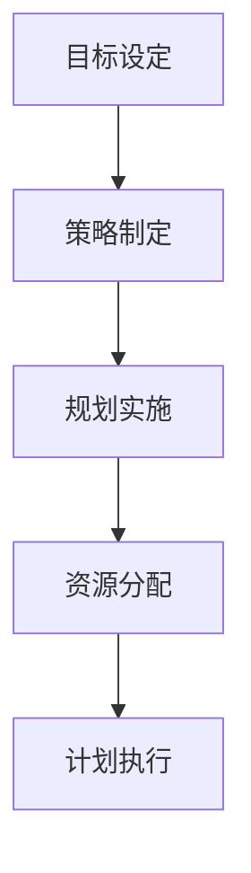

**3.2 组织职能**

组织职能是将计划转化为实际行动的过程，它包括人员安排、组织结构设计、职责分工等内容。组织职能的核心在于确保每个成员都能在适当的岗位上发挥最大的潜力。

1. **人员安排**：根据计划的需要，为每个岗位分配合适的人员，确保人力资源的有效利用。
2. **组织结构设计**：设计合适的组织结构，明确各部门和岗位的职责和关系，确保信息的流通和协作。
3. **职责分工**：明确每个岗位的职责，确保工作的有序进行，减少重复和冲突。
4. **沟通与协作**：建立有效的沟通机制，确保信息在组织内部畅通无阻，促进团队协作。

**组织职能的核心概念**：

- **组织结构**：组织结构是组织运行的基础，合理的组织结构可以提高工作效率。
- **职责分工**：明确的职责分工有助于提高工作质量和效率，减少责任不清和推诿。

**组织职能的架构**（使用Mermaid流程图）：

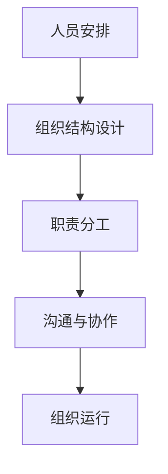

**3.3 领导职能**

领导职能是管理者在组织中发挥影响力的过程，它包括激励、指导、沟通等。有效的领导能够激发员工的潜力，提高组织的凝聚力。

1. **激励**：通过激励手段，如奖金、晋升、认可等，激发员工的工作动力和积极性。
2. **指导**：为员工提供明确的工作指导和支持，帮助他们提高工作效率和质量。
3. **沟通**：建立良好的沟通渠道，确保信息在组织内部畅通无阻，促进团队协作。
4. **决策**：在关键时刻做出明智的决策，为组织的发展提供方向。

**领导职能的核心概念**：

- **激励与指导**：有效的激励和指导能够提高员工的工作满意度和绩效。
- **沟通与决策**：良好的沟通和决策能力是领导者的关键能力。

**领导职能的架构**（使用Mermaid流程图）：

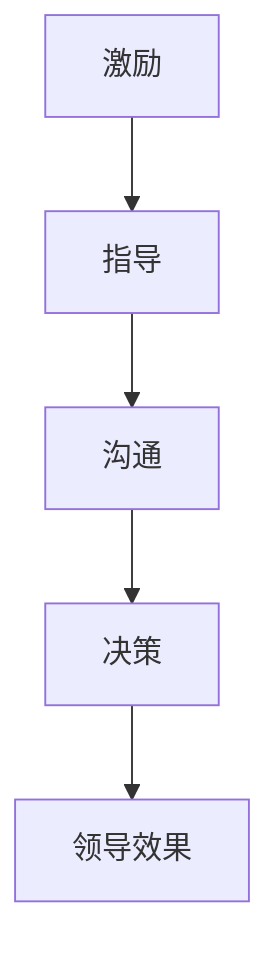

**3.4 控制职能**

控制职能是管理者在管理过程中对计划执行情况进行监控和调整的过程，它包括绩效评估、反馈、调整等。控制职能的目的是确保组织目标得以实现。

1. **绩效评估**：对员工的绩效进行评估，识别优秀和需要改进的方面。
2. **反馈**：及时给予员工反馈，鼓励优秀表现，指出改进方向。
3. **调整**：根据绩效评估和反馈结果，调整计划或管理策略，确保组织目标的实现。

**控制职能的核心概念**：

- **绩效评估**：准确的绩效评估能够帮助管理者了解组织运行状况，发现问题和不足。
- **反馈与调整**：及时的反馈和调整有助于及时纠正偏差，确保计划的有效执行。

**控制职能的架构**（使用Mermaid流程图）：

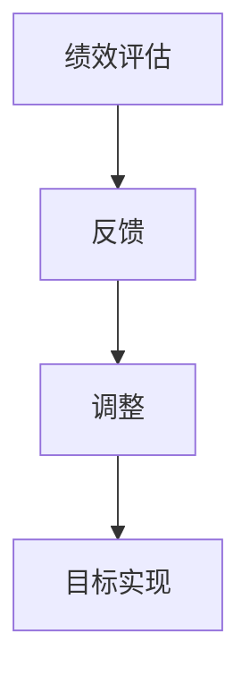

**3.5 管理原则与实践**

在管理实践中，管理者需要遵循一系列基本的管理原则，这些原则有助于提高管理效果。以下是一些常见的管理原则：

1. **目标明确**：明确的目标是管理的基础，管理者需要确保目标具体、明确、可实现。
2. **分工协作**：合理的分工和协作能够提高工作效率，减少重复劳动。
3. **激励与认可**：有效的激励和认可能够提高员工的工作积极性和满意度。
4. **持续改进**：管理者需要不断寻求改进机会，推动组织持续发展。
5. **透明沟通**：良好的沟通机制能够促进信息共享，提高组织的透明度和信任度。

**管理原则的实践方法**：

- **目标明确**：通过制定详细的计划书和目标清单，确保所有成员都了解组织的期望。
- **分工协作**：建立跨部门协作机制，促进不同部门之间的信息共享和资源整合。
- **激励与认可**：建立绩效考核体系，对优秀表现给予奖励，激发员工的积极性。
- **持续改进**：定期组织回顾会议，分析组织运行状况，寻找改进机会。
- **透明沟通**：定期召开团队会议，分享组织目标、进展和挑战，确保团队成员之间的信息畅通。

通过以上讨论，我们可以看到，管理职能与管理原则是管理过程中不可或缺的两个方面。管理者需要熟练掌握这些职能和原则，并灵活应用于实际管理中，以实现组织的长期成功。在下一章中，我们将探讨企业战略规划的重要性，以及如何制定和实施有效的企业战略。

### 第4章：企业战略规划

企业战略规划是企业为了实现长期目标而制定的行动计划和资源配置方案。战略规划的重要性在于它为企业提供了明确的方向和目标，确保企业在复杂多变的市场环境中保持竞争力。本章将探讨企业战略规划的重要性，以及如何进行战略规划的过程和方法。

**4.1 战略规划的重要性**

战略规划对企业的发展具有以下几个重要意义：

1. **明确方向**：战略规划帮助企业管理层明确企业的长远目标和愿景，确保所有决策和行动都围绕这些目标进行。
2. **资源优化**：战略规划有助于企业合理配置资源，确保资源利用的最大化，避免资源浪费。
3. **提高竞争力**：通过战略规划，企业可以识别市场机会和潜在风险，制定应对策略，提高市场竞争力。
4. **协调各部门**：战略规划能够协调企业各部门之间的工作，确保各部门的目标和行动一致，提高整体效率。
5. **可持续发展**：战略规划考虑了企业的长期发展，确保企业在追求短期利益的同时，也能实现可持续发展。

**4.2 战略规划的过程与方法**

战略规划是一个系统化的过程，通常包括以下步骤：

1. **确定企业愿景和目标**：首先，企业需要明确自身的愿景和目标。愿景是对企业未来的期望描述，而目标则是具体的、可量化的短期和长期目标。
   
   **核心概念与联系**（使用Mermaid流程图）：
   ```mermaid
   graph TD
       A[确定愿景] --> B[设定目标]
       B --> C[目标分解]
   ```

2. **外部环境分析**：企业需要对外部环境进行深入分析，了解市场趋势、竞争对手、客户需求等因素。这一步骤通常使用PESTEL分析（政治、经济、社会、技术、环境和法律）和SWOT分析（优势、劣势、机会和威胁）等方法。

   **核心概念与联系**（使用Mermaid流程图）：
   ```mermaid
   graph TD
       A[PESTEL分析] --> B[SWOT分析]
   ```

3. **内部能力分析**：企业需要评估自身的内部能力，包括资源、技术、人力资源等。这有助于企业了解自身的优势和劣势，为战略制定提供依据。

   **核心概念与联系**（使用Mermaid流程图）：
   ```mermaid
   graph TD
       A[资源分析] --> B[技术分析]
       B --> C[人力资源分析]
   ```

4. **战略选择**：基于外部环境分析和内部能力分析，企业需要选择最合适的战略。常见的战略类型包括成本领先、差异化、集中化等。

   **核心概念与联系**（使用Mermaid流程图）：
   ```mermaid
   graph TD
       A[成本领先战略] --> B[差异化战略]
       B --> C[集中化战略]
   ```

5. **制定实施计划**：在确定战略后，企业需要制定具体的实施计划，包括行动计划、责任分配、时间表和资源需求。

   **核心概念与联系**（使用Mermaid流程图）：
   ```mermaid
   graph TD
       A[行动计划] --> B[责任分配]
       B --> C[时间表]
       C --> D[资源需求]
   ```

6. **战略执行**：战略规划完成后，企业需要将计划付诸实施。在这一过程中，管理者需要确保计划的执行和监督，及时调整策略以应对变化。

   **核心概念与联系**（使用Mermaid流程图）：
   ```mermaid
   graph TD
       A[战略执行] --> B[执行监督]
       B --> C[调整策略]
   ```

7. **绩效评估**：战略实施后，企业需要定期进行绩效评估，检查战略目标的实现情况，并根据评估结果进行反馈和改进。

   **核心概念与联系**（使用Mermaid流程图）：
   ```mermaid
   graph TD
       A[绩效评估] --> B[反馈改进]
   ```

**4.3 企业战略类型的分析与选择**

企业在制定战略规划时，需要根据自身的资源和市场环境选择最合适的战略类型。以下是几种常见的战略类型及其特点：

1. **成本领先战略**：成本领先战略通过降低成本来获得竞争优势，适用于成本敏感的市场。实施成本领先战略的企业通常在规模经济和成本控制方面具有优势。

   **核心概念与联系**（使用伪代码）：
   ```python
   # 成本领先战略
   function cost_leadership_strategy():
       # 降低成本
       reduce_costs()
       # 扩大规模
       scale_up()
       # 提高效率
       improve_efficiency()
   ```

2. **差异化战略**：差异化战略通过提供独特的产品或服务来获得竞争优势，适用于竞争激烈的市场。差异化战略可以帮助企业建立品牌声誉和客户忠诚度。

   **核心概念与联系**（使用伪代码）：
   ```python
   # 差异化战略
   function differentiation_strategy():
       # 创新产品
       create_new_products()
       # 品牌建设
       build_brand()
       # 提高服务质量
       improve_service_quality()
   ```

3. **集中化战略**：集中化战略专注于特定的市场细分，通过专业化服务满足特定客户群体的需求。集中化战略适用于市场细分明显、客户需求多样化的市场。

   **核心概念与联系**（使用伪代码）：
   ```python
   # 集中化战略
   function concentration_strategy():
       # 精准定位
       precise_targeting()
       # 专业服务
       specialized_services()
       # 市场专注
       market_focusing()
   ```

在选择战略类型时，企业需要综合考虑自身资源、市场环境、竞争态势等因素。通过详细分析各种战略类型的优缺点，企业可以制定出最符合自身发展的战略规划。

通过本章的讨论，我们可以看到，企业战略规划是企业实现长期发展的重要手段。有效的战略规划不仅能够帮助企业在市场中找到自己的定位，还能优化资源配置，提高竞争力。在下一章中，我们将探讨市场分析与竞争策略，了解如何通过深入分析市场环境和竞争对手，制定出有效的市场策略。

### 第5章：市场分析与竞争策略

在竞争激烈的商业环境中，市场分析和竞争策略是企业成功的关键。市场分析帮助企业管理者了解市场需求、竞争态势和潜在机会，而竞争策略则指导企业如何利用这些分析结果来获取竞争优势。本章将详细探讨市场分析的方法与工具，以及如何制定和实施有效的竞争策略。

**5.1 市场分析的方法与工具**

市场分析是战略规划的重要组成部分，其目的是帮助企业识别市场机会和潜在风险。以下是几种常用的市场分析方法与工具：

1. **SWOT分析**：
   - **核心概念**：SWOT分析是一种常用的战略规划工具，用于评估企业的优势（Strengths）、劣势（Weaknesses）、机会（Opportunities）和威胁（Threats）。
   - **应用方法**：通过分析企业的内部资源和外部环境，识别企业在市场中的优势和劣势，以及市场环境中的机会和威胁。

2. **PESTEL分析**：
   - **核心概念**：PESTEL分析是一种宏观环境分析工具，用于评估政治（Political）、经济（Economic）、社会（Social）、技术（Technological）、环境（Environmental）和法律（Legal）等因素对企业的影响。
   - **应用方法**：通过分析这些宏观因素，识别可能影响企业发展的外部环境因素，帮助企业在制定战略时考虑全局。

3. **五力模型**：
   - **核心概念**：五力模型是由迈克尔·波特提出的，用于分析行业竞争强度和潜在利润。五力包括供应商的谈判能力、购买者的谈判能力、新进入者的威胁、替代品的威胁和行业内现有企业的竞争。
   - **应用方法**：通过分析五力模型，企业可以了解行业竞争状况，制定相应的竞争策略。

4. **市场细分**：
   - **核心概念**：市场细分是将整个市场划分为若干具有相似需求特征的小市场。通过市场细分，企业可以更精准地满足不同客户群体的需求。
   - **应用方法**：通过识别不同市场细分，企业可以开发定制化产品或服务，提高市场竞争力。

5. **消费者行为分析**：
   - **核心概念**：消费者行为分析是研究消费者购买行为和决策过程的工具。
   - **应用方法**：通过分析消费者行为，企业可以了解目标客户的需求和偏好，制定更有针对性的营销策略。

**5.2 竞争策略的选择与实施**

在了解了市场分析和竞争对手情况后，企业需要制定和实施有效的竞争策略，以获取竞争优势。以下是几种常见的竞争策略：

1. **成本领先战略**：
   - **核心概念**：成本领先战略是通过降低成本来获得竞争优势，从而实现价格优势。
   - **实施方法**：企业可以通过规模经济、技术改进、供应商谈判等方式降低成本。

2. **差异化战略**：
   - **核心概念**：差异化战略是通过提供独特的产品或服务来获得竞争优势，从而实现品牌和客户忠诚度。
   - **实施方法**：企业可以通过研发创新、品牌建设、客户服务等方式实现差异化。

3. **集中化战略**：
   - **核心概念**：集中化战略是专注于特定的市场细分，通过专业化服务满足特定客户群体的需求。
   - **实施方法**：企业可以通过精准市场定位、定制化产品或服务等方式实施集中化战略。

**5.3 市场进入与扩张策略**

市场进入与扩张是企业战略的重要组成部分。以下是几种常见的市场进入与扩张策略：

1. **市场渗透策略**：
   - **核心概念**：市场渗透策略是通过增加市场份额来提高销售额。
   - **实施方法**：企业可以通过价格优惠、促销活动、增加广告投放等方式增加市场份额。

2. **市场开发策略**：
   - **核心概念**：市场开发策略是通过开拓新市场来扩大销售范围。
   - **实施方法**：企业可以通过市场调研、新市场进入策略、合作伙伴关系等方式开发新市场。

3. **市场多元化策略**：
   - **核心概念**：市场多元化策略是通过进入多个市场来分散风险和扩大市场份额。
   - **实施方法**：企业可以通过多元化产品线、拓展新业务领域等方式实现市场多元化。

通过本章的讨论，我们可以看到，市场分析和竞争策略是企业成功的关键。有效的市场分析能够帮助企业识别市场机会和风险，而竞争策略则指导企业如何利用这些分析结果来获取竞争优势。在下一章中，我们将探讨人力资源策略，了解如何通过有效的人力资源管理来提升企业竞争力。

### 第6章：人力资源策略

人力资源是企业的核心资源，有效的人力资源策略对于企业的长期成功至关重要。本章将探讨人力资源策略的各个方面，包括人力资源规划与配置、员工招聘与选拔、员工培训与发展、绩效考核与激励等。

**6.1 人力资源规划与配置**

人力资源规划是确保企业能够在适当的时间、适当的岗位上拥有适当数量和质量的员工的过程。人力资源规划与配置的核心目标是实现人力资源的合理利用和最大化效益。

1. **需求预测**：企业需要根据业务发展计划和市场需求，预测未来的人力资源需求。这包括确定所需岗位的数量、技能要求和员工人数。

2. **供给分析**：企业需要分析现有的人力资源供给，包括员工的技能水平、工作经验和职业发展潜力。通过供需分析，企业可以了解是否存在人力资源缺口。

3. **规划调整**：基于需求预测和供给分析，企业需要制定相应的人力资源规划，包括招聘、培训、晋升、留任等策略。同时，企业需要根据市场环境和业务变化，定期调整人力资源规划。

**核心概念与联系**（使用Mermaid流程图）：
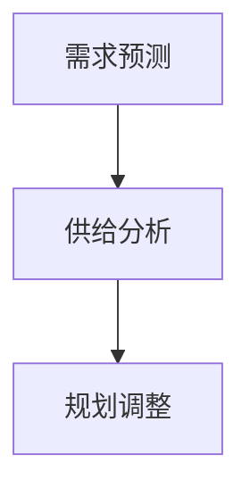

**6.2 员工招聘与选拔**

员工招聘与选拔是企业获取合适人才的过程。有效的招聘和选拔策略能够确保企业吸引和留住优秀人才。

1. **招聘渠道**：企业需要选择合适的招聘渠道，包括内部推荐、招聘网站、专业招聘公司、校园招聘等。不同渠道适用于不同类型的岗位和人才。

2. **选拔标准**：企业需要制定明确的选拔标准，包括教育背景、工作经验、技能要求、个人素质等。通过制定明确的选拔标准，企业可以确保招聘到符合岗位要求的人才。

3. **面试流程**：企业需要设计科学的面试流程，包括初试、复试、技术面试、行为面试等。面试流程应确保全面、客观地评估应聘者的能力。

**核心概念与联系**（使用Mermaid流程图）：
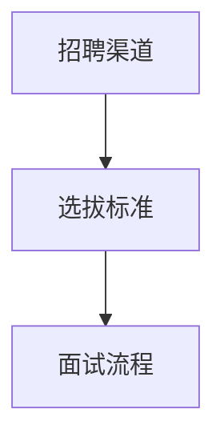

**6.3 员工培训与发展**

员工培训与发展是提高员工技能和素质的重要手段，有助于提升企业整体竞争力。有效的培训与发展策略包括以下内容：

1. **培训需求分析**：企业需要根据员工的岗位职责和工作需求，分析培训需求。通过培训需求分析，企业可以确定培训内容和培训重点。

2. **培训计划制定**：基于培训需求分析，企业需要制定详细的培训计划，包括培训内容、培训时间、培训方式等。培训计划应确保与业务目标和员工发展需求相匹配。

3. **培训实施与跟踪**：企业需要根据培训计划开展培训活动，并通过跟踪评估培训效果，确保培训目标的实现。跟踪评估可以包括培训反馈、绩效评估等。

**核心概念与联系**（使用Mermaid流程图）：
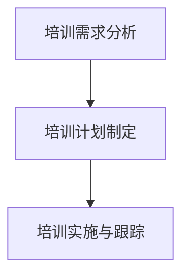

**6.4 绩效考核与激励**

绩效考核与激励是确保员工绩效和激励的有效手段。有效的绩效考核与激励策略能够提高员工的工作积极性和绩效水平。

1. **绩效考核指标**：企业需要制定明确的绩效考核指标，包括工作质量、工作效率、团队协作等。绩效考核指标应与业务目标和员工岗位职责相匹配。

2. **绩效考核流程**：企业需要设计科学的绩效考核流程，包括考核周期、考核方式、考核反馈等。绩效考核流程应确保公正、公平、透明。

3. **激励机制**：企业需要建立有效的激励机制，包括薪酬激励、职位晋升、培训发展等。激励机制应与绩效考核结果相挂钩，确保员工通过努力工作可以获得相应的回报。

**核心概念与联系**（使用Mermaid流程图）：
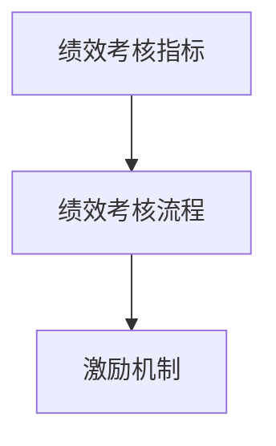

**6.5 人力资源策略的实施与优化**

人力资源策略的实施与优化是确保策略有效性的关键。以下是实施与优化的几个关键步骤：

1. **政策制定与宣传**：企业需要制定人力资源政策，明确员工权益、晋升机制、培训政策等，并通过宣传确保员工了解和遵守这些政策。

2. **制度落实与监督**：企业需要确保人力资源政策的落实，通过监督和检查确保制度的执行。

3. **反馈与改进**：企业需要建立反馈机制，定期收集员工意见和建议，及时调整人力资源策略，以适应企业发展和员工需求的变化。

**核心概念与联系**（使用Mermaid流程图）：
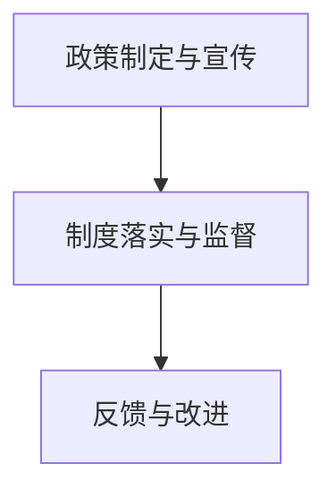

通过本章的讨论，我们可以看到，人力资源策略是企业成功的关键。有效的人力资源策略不仅能够吸引和留住优秀人才，还能提升员工的绩效和满意度，从而推动企业的发展。在下一章中，我们将探讨财务策略与管理，了解如何通过有效的财务管理实现企业的长期目标。

### 第7章：财务策略与管理

财务策略是企业管理的重要组成部分，它关系到企业的资金流动、投资决策和盈利能力。有效的财务策略能够帮助企业在复杂多变的经济环境中保持竞争力，实现长期目标。本章将探讨财务策略与管理的各个方面，包括财务分析的方法与工具、财务预算与控制、投资策略与风险管理、成本控制与效益分析等。

**7.1 财务分析的方法与工具**

财务分析是评估企业财务状况和经营绩效的过程，它帮助管理者做出明智的决策。以下是几种常用的财务分析方法与工具：

1. **比率分析**：比率分析是评估企业财务状况的重要工具，包括流动性比率、盈利能力比率、负债比率等。这些比率可以帮助管理者了解企业的财务健康状况和经营效率。

   **核心概念与联系**（使用Mermaid流程图）：
   ```mermaid
   graph TD
       A[流动性比率] --> B[盈利能力比率]
       B --> C[负债比率]
   ```

2. **现金流量分析**：现金流量分析是评估企业现金流入和流出的情况，了解企业的现金流状况。现金流量分析包括运营活动、投资活动和融资活动的现金流分析。

   **核心概念与联系**（使用Mermaid流程图）：
   ```mermaid
   graph TD
       A[运营活动现金流] --> B[投资活动现金流]
       B --> C[融资活动现金流]
   ```

3. **财务预测**：财务预测是预测企业未来财务状况的过程，包括收入预测、成本预测、利润预测等。财务预测可以帮助管理者制定合理的财务策略。

   **核心概念与联系**（使用Mermaid流程图）：
   ```mermaid
   graph TD
       A[收入预测] --> B[成本预测]
       B --> C[利润预测]
   ```

**7.2 财务预算与控制**

财务预算是企业对未来财务活动的预测和规划，它是实现财务目标的重要工具。有效的财务预算和控制能够帮助企业合理分配资源，降低风险，提高盈利能力。

1. **预算编制**：企业需要根据业务计划和财务目标，编制详细的预算。预算编制包括收入预算、支出预算、资本支出预算等。

   **核心概念与联系**（使用Mermaid流程图）：
   ```mermaid
   graph TD
       A[收入预算] --> B[支出预算]
       B --> C[资本支出预算]
   ```

2. **预算执行与监控**：企业需要根据预算执行情况进行监控，及时发现偏差并采取纠正措施。预算执行监控包括定期审查、绩效评估等。

   **核心概念与联系**（使用Mermaid流程图）：
   ```mermaid
   graph TD
       A[预算执行] --> B[监控与评估]
   ```

3. **预算调整**：在执行过程中，如果出现重大变化，企业需要根据实际情况调整预算。预算调整应确保财务目标的实现。

   **核心概念与联系**（使用Mermaid流程图）：
   ```mermaid
   graph TD
       A[预算调整]
   ```

**7.3 投资策略与风险管理**

投资策略是企业在投资活动中的规划和指导，它关系到企业的盈利能力和风险控制。有效的投资策略能够帮助企业实现资本增值和风险分散。

1. **投资评估**：企业需要对投资项目进行详细评估，包括投资成本、预期收益、风险分析等。投资评估应确保投资决策的合理性。

   **核心概念与联系**（使用Mermaid流程图）：
   ```mermaid
   graph TD
       A[投资成本] --> B[预期收益]
       B --> C[风险分析]
   ```

2. **风险管理**：企业需要建立有效的风险管理机制，包括风险识别、风险评估、风险控制等。风险管理应确保投资活动的安全和稳健。

   **核心概念与联系**（使用Mermaid流程图）：
   ```mermaid
   graph TD
       A[风险识别] --> B[风险评估]
       B --> C[风险控制]
   ```

3. **资本结构优化**：企业需要合理配置资本结构，包括债务和权益的比例。优化资本结构可以降低融资成本，提高资本利用效率。

   **核心概念与联系**（使用Mermaid流程图）：
   ```mermaid
   graph TD
       A[债务融资] --> B[权益融资]
   ```

**7.4 成本控制与效益分析**

成本控制是企业财务管理的重要环节，它关系到企业的盈利能力和竞争力。有效的成本控制能够帮助企业降低成本，提高效益。

1. **成本分类**：企业需要根据成本性质和用途，对成本进行分类，如直接成本、间接成本、固定成本、变动成本等。

   **核心概念与联系**（使用Mermaid流程图）：
   ```mermaid
   graph TD
       A[直接成本] --> B[间接成本]
       B --> C[固定成本]
       C --> D[变动成本]
   ```

2. **成本控制方法**：企业需要采用科学的成本控制方法，如标准成本控制、预算控制、作业成本控制等。成本控制方法应确保成本合理、有效。

   **核心概念与联系**（使用Mermaid流程图）：
   ```mermaid
   graph TD
       A[标准成本控制] --> B[预算控制]
       B --> C[作业成本控制]
   ```

3. **效益分析**：企业需要对成本控制和效益进行综合分析，确保成本控制措施的有效性。效益分析应包括成本效益分析、投入产出分析等。

   **核心概念与联系**（使用Mermaid流程图）：
   ```mermaid
   graph TD
       A[成本效益分析] --> B[投入产出分析]
   ```

**7.5 财务策略的实施与优化**

财务策略的实施与优化是确保财务目标实现的关键。以下是实施与优化的几个关键步骤：

1. **战略规划**：企业需要制定详细的财务战略规划，明确财务目标和实施路径。

   **核心概念与联系**（使用Mermaid流程图）：
   ```mermaid
   graph TD
       A[财务战略规划]
   ```

2. **制度落实**：企业需要确保财务策略的落实，通过建立完善的财务制度和流程，确保财务活动的合规性和有效性。

   **核心概念与联系**（使用Mermaid流程图）：
   ```mermaid
   graph TD
       A[制度落实]
   ```

3. **绩效评估**：企业需要定期对财务策略的执行情况进行评估，分析财务绩效，识别问题和改进机会。

   **核心概念与联系**（使用Mermaid流程图）：
   ```mermaid
   graph TD
       A[绩效评估]
   ```

4. **持续改进**：企业需要根据绩效评估结果，持续优化财务策略，确保财务目标实现。

   **核心概念与联系**（使用Mermaid流程图）：
   ```mermaid
   graph TD
       A[持续改进]
   ```

通过本章的讨论，我们可以看到，财务策略与管理对于企业的长期成功至关重要。有效的财务策略能够帮助企业优化资源配置，降低风险，提高盈利能力。在下一章中，我们将探讨执行力建设，了解如何通过提升执行力来确保企业战略的实现。

### 第8章：执行力建设

执行力是企业战略得以实现的基石。在快速变化的市场环境中，执行力建设成为企业成功的关键因素。本章将探讨执行力建设的核心概念，包括执行力的定义与要素，以及如何建设高效执行团队和提升个人执行力。

**8.1 执行力的定义与要素**

执行力是指企业或个人实现预定目标的能力，它不仅仅是行动力，更是一种系统化的过程。执行力包含以下几个关键要素：

1. **目标明确**：明确的目标是执行力建设的基础。目标需要具体、可衡量，并具有可实现性。目标明确可以帮助团队成员了解自己的职责和方向，提高执行力。

2. **计划与策略**：执行力的实现需要科学的计划和策略。企业需要制定详细的执行计划，明确每一步的行动路径和时间表。策略的制定则需要考虑资源分配、优先级设定和风险管理等因素。

3. **团队协作**：执行力建设离不开团队协作。高效的团队协作能够确保团队成员之间信息畅通，减少冲突，提高工作效率。团队协作还需要建立良好的沟通机制和协作工具。

4. **监督与反馈**：执行过程中需要有效的监督与反馈机制。监督可以确保执行计划的按时完成，反馈则可以帮助团队及时纠正偏差，优化执行效果。

**核心概念与联系**（使用Mermaid流程图）：
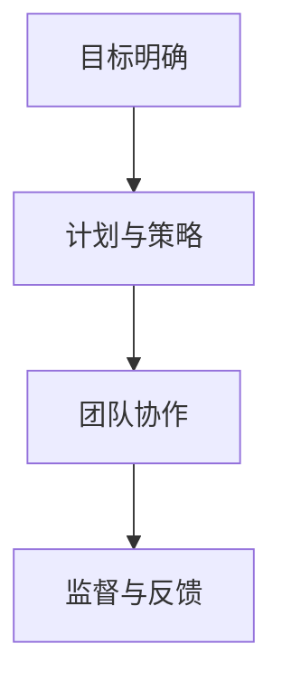

**8.2 建设高效执行团队的方法**

建设高效执行团队是提升企业整体执行力的重要手段。以下是建设高效执行团队的几个关键步骤：

1. **团队建设**：团队建设是构建高效执行团队的第一步。企业需要通过团队建设活动，增强团队成员之间的信任和协作，提高团队的凝聚力。

   **核心概念与联系**（使用Mermaid流程图）：
   ```mermaid
   graph TD
       A[团队建设]
   ```

2. **职责明确**：明确每个团队成员的职责和角色，确保每个人都知道自己的任务和目标。职责明确可以帮助团队成员集中精力，提高工作效率。

   **核心概念与联系**（使用Mermaid流程图）：
   ```mermaid
   graph TD
       A[职责明确]
   ```

3. **能力培养**：企业需要为团队成员提供培训和发展机会，提升他们的技能和知识，确保团队具备实现目标所需的能力。

   **核心概念与联系**（使用Mermaid流程图）：
   ```mermaid
   graph TD
       A[能力培养]
   ```

4. **激励与认可**：建立有效的激励机制，对团队成员的成果和贡献进行认可和奖励，激发团队成员的积极性和创造力。

   **核心概念与联系**（使用Mermaid流程图）：
   ```mermaid
   graph TD
       A[激励与认可]
   ```

5. **信息共享**：建立有效的信息共享机制，确保团队成员之间信息畅通，减少信息孤岛，提高决策效率。

   **核心概念与联系**（使用Mermaid流程图）：
   ```mermaid
   graph TD
       A[信息共享]
   ```

**8.3 提升个人执行力的策略**

提升个人执行力是每个团队成员的责任。以下是一些提升个人执行力的策略：

1. **目标设定**：个人需要明确自己的工作目标和期望，制定具体的行动计划，确保目标具体、可衡量。

   **核心概念与联系**（使用Mermaid流程图）：
   ```mermaid
   graph TD
       A[目标设定]
   ```

2. **时间管理**：合理安排时间，提高工作效率。通过制定日程表、设置优先级和避免拖延，确保任务按时完成。

   **核心概念与联系**（使用Mermaid流程图）：
   ```mermaid
   graph TD
       A[时间管理]
   ```

3. **持续学习**：不断学习新知识和技能，提升自己的专业能力和综合素质，以适应不断变化的工作需求。

   **核心概念与联系**（使用Mermaid流程图）：
   ```mermaid
   graph TD
       A[持续学习]
   ```

4. **积极沟通**：建立良好的沟通习惯，主动与团队成员和上级沟通，确保信息的及时传递和反馈。

   **核心概念与联系**（使用Mermaid流程图）：
   ```mermaid
   graph TD
       A[积极沟通]
   ```

5. **自我激励**：通过自我激励，保持积极的心态和动力，面对挑战和困难，坚持不懈地追求目标。

   **核心概念与联系**（使用Mermaid流程图）：
   ```mermaid
   graph TD
       A[自我激励]
   ```

通过本章的讨论，我们可以看到，执行力建设是企业成功的关键。通过明确目标、制定计划、建设高效团队和提升个人执行力，企业可以确保战略的有效执行。在下一章中，我们将探讨绩效管理，了解如何通过有效的绩效管理提升员工的绩效和满意度。

### 第9章：绩效管理

绩效管理是企业管理中的一项核心任务，它关系到企业的战略目标实现和员工的发展。有效的绩效管理不仅能够提升员工的工作效率和绩效，还能增强企业的竞争力。本章将探讨绩效管理的概念与目的，以及绩效评估的方法与工具、绩效反馈与改进、绩效激励与员工发展。

**9.1 绩效管理的概念与目的**

绩效管理是指企业通过系统的计划和过程，对员工的工作表现进行评估、反馈和改进，以达到组织目标和个人发展的过程。绩效管理的目的主要包括：

1. **确保组织目标的实现**：通过绩效管理，确保员工的工作行为和成果与组织的战略目标相一致，推动企业整体目标的实现。

2. **提高员工绩效**：通过绩效管理，识别员工的优势和不足，提供针对性的培训和指导，提升员工的工作能力和绩效。

3. **增强员工满意度**：通过公正、透明的绩效评估和反馈，增强员工对企业的认同感和归属感，提高员工的工作满意度和忠诚度。

4. **激励员工发展**：通过绩效管理，激发员工的积极性和潜力，促进员工的职业发展和个人成长。

**核心概念与联系**（使用Mermaid流程图）：
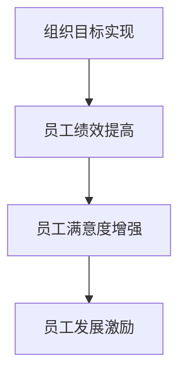

**9.2 绩效评估的方法与工具**

绩效评估是绩效管理的关键环节，它通过对员工工作表现进行客观、全面的评估，为绩效反馈和改进提供依据。以下是几种常见的绩效评估方法与工具：

1. **360度反馈**：360度反馈是一种全面的绩效评估方法，它收集员工来自上级、同事、下属和客户的反馈，从多个角度评估员工的工作表现。

   **核心概念与联系**（使用Mermaid流程图）：
   ```mermaid
   graph TD
       A[上级反馈] --> B[同事反馈]
       B --> C[下属反馈]
       C --> D[客户反馈]
   ```

2. **KPI（关键绩效指标）**：KPI是衡量员工工作绩效的具体指标，通常与企业的战略目标紧密相关。通过设定明确的KPI，可以客观评估员工的工作成果。

   **核心概念与联系**（使用Mermaid流程图）：
   ```mermaid
   graph TD
       A[目标设定] --> B[指标量化]
       B --> C[结果评估]
   ```

3. **PBC（个人绩效承诺书）**：PBC是一种个性化的绩效管理工具，员工与上级共同制定，明确员工的绩效目标和行动计划。PBC有助于员工明确工作重点和职责。

   **核心概念与联系**（使用Mermaid流程图）：
   ```mermaid
   graph TD
       A[员工目标] --> B[上级批准]
       B --> C[行动计划]
   ```

4. **绩效对话**：绩效对话是一种通过定期会议形式，员工与上级就工作表现进行沟通和评估的方法。绩效对话有助于建立双方信任，及时解决绩效问题。

   **核心概念与联系**（使用Mermaid流程图）：
   ```mermaid
   graph TD
       A[定期会议] --> B[反馈与建议]
       B --> C[绩效改进]
   ```

**9.3 绩效反馈与改进**

绩效反馈是绩效管理的重要组成部分，它通过及时的、具体的反馈，帮助员工了解自己的工作表现，找到改进的方向。以下是绩效反馈与改进的关键步骤：

1. **正面反馈**：正面反馈是鼓励员工保持良好工作表现的重要手段。通过表扬和肯定，增强员工的自信心和动力。

   **核心概念与联系**（使用Mermaid流程图）：
   ```mermaid
   graph TD
       A[表扬与肯定] --> B[增强信心]
   ```

2. **建设性反馈**：建设性反馈是指出员工工作表现中的不足，并提供改进建议。建设性反馈应具体、有针对性，避免批评和指责。

   **核心概念与联系**（使用Mermaid流程图）：
   ```mermaid
   graph TD
       A[具体反馈] --> B[改进建议]
   ```

3. **反馈沟通**：有效的反馈沟通是绩效反馈成功的关键。通过开放式沟通，确保员工理解和接受反馈，并积极采取措施进行改进。

   **核心概念与联系**（使用Mermaid流程图）：
   ```mermaid
   graph TD
       A[沟通渠道] --> B[理解与接受]
       B --> C[改进措施]
   ```

4. **持续改进**：绩效反馈后，企业需要持续关注员工的改进情况，提供必要的支持和资源，确保绩效改进的持续性和有效性。

   **核心概念与联系**（使用Mermaid流程图）：
   ```mermaid
   graph TD
       A[持续关注] --> B[资源支持]
       B --> C[绩效改进]
   ```

**9.4 绩效激励与员工发展**

绩效激励是激发员工工作积极性和创造力的有效手段。通过合理的绩效激励，企业可以吸引和留住优秀人才，推动组织的发展。以下是绩效激励与员工发展的几个关键方面：

1. **薪酬激励**：薪酬激励是最常见的绩效激励方式，通过设定具有竞争力的薪酬体系，激励员工努力工作。

   **核心概念与联系**（使用Mermaid流程图）：
   ```mermaid
   graph TD
       A[薪酬设定] --> B[竞争力评估]
       B --> C[薪酬调整]
   ```

2. **晋升机会**：为员工提供明确的晋升路径和发展机会，激励员工不断提升自己的能力和业绩。

   **核心概念与联系**（使用Mermaid流程图）：
   ```mermaid
   graph TD
       A[晋升标准] --> B[晋升机会]
       B --> C[职业发展]
   ```

3. **培训与发展**：提供多样化的培训和发展机会，提升员工的专业技能和综合素质，增强员工的职业竞争力。

   **核心概念与联系**（使用Mermaid流程图）：
   ```mermaid
   graph TD
       A[培训计划] --> B[技能提升]
       B --> C[职业发展]
   ```

4. **认可与奖励**：通过表彰和奖励优秀员工，提升员工的荣誉感和成就感，增强员工的归属感和忠诚度。

   **核心概念与联系**（使用Mermaid流程图）：
   ```mermaid
   graph TD
       A[表彰与奖励] --> B[荣誉感提升]
       B --> C[归属感增强]
   ```

通过本章的讨论，我们可以看到，绩效管理是企业管理中不可或缺的一部分。通过有效的绩效管理，企业可以确保战略目标的实现，提升员工的工作效率和满意度，推动组织的长期发展。在下一章中，我们将探讨持续改进与创新能力，了解如何通过持续改进和创新能力提升企业的竞争力。

### 第10章：持续改进与创新能力

持续改进与创新能力是企业在激烈的市场竞争中保持领先地位的关键因素。持续改进旨在通过不断的优化和改进，提高企业的运营效率和产品质量。而创新能力则通过引入新的思想和技术，推动企业的创新和发展。本章将探讨持续改进与创新能力的重要性，以及如何培养创新能力、实施创新项目管理与持续改进。

**10.1 持续改进的理念与方法**

持续改进是一种管理理念，它强调通过不断优化和改进，提高企业的整体绩效。持续改进的理念包括以下几个方面：

1. **全员参与**：持续改进不是某个部门或个人的任务，而是全员的共同责任。每个员工都应积极参与持续改进活动，提出改进建议和解决方案。

2. **数据驱动**：持续改进应基于数据和分析，通过收集和分析数据，识别问题根源，制定改进措施。

3. **持续迭代**：持续改进是一个持续的过程，企业应不断评估改进效果，并根据反馈进行调整和优化。

4. **重点突出**：在持续改进过程中，企业应确定关键问题和优先级，集中资源和精力解决重点问题。

**核心概念与联系**（使用Mermaid流程图）：
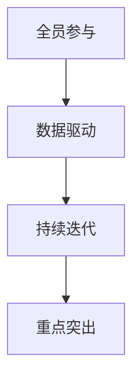

**持续改进的方法**：

1. **质量管理方法**：如六西格玛（Six Sigma）和ISO质量管理体系，通过系统化的方法和工具，提高产品质量和运营效率。

   **核心概念与联系**（使用Mermaid流程图）：
   ```mermaid
   graph TD
       A[六西格玛] --> B[ISO质量管理体系]
   ```

2. **精益管理方法**：如精益生产（Lean Production）和精益管理（Lean Management），通过减少浪费、优化流程，提高生产效率。

   **核心概念与联系**（使用Mermaid流程图）：
   ```mermaid
   graph TD
       A[精益生产] --> B[精益管理]
   ```

3. **创新方法**：如设计思维（Design Thinking）和快速迭代开发（Agile Development），通过创新的思维模式和开发流程，推动产品和服务创新。

   **核心概念与联系**（使用Mermaid流程图）：
   ```mermaid
   graph TD
       A[设计思维] --> B[快速迭代开发]
   ```

**10.2 创新能力的培养与激发**

创新能力是企业持续发展的重要驱动力。以下是一些培养和激发创新能力的策略：

1. **创新文化**：建立鼓励创新的企业文化，允许员工自由表达想法，并对创新行为给予认可和奖励。

2. **知识共享**：鼓励员工分享知识和经验，通过团队协作和跨部门合作，激发创新思维。

3. **培训与发展**：为员工提供创新培训和技能提升机会，增强员工的创新能力和解决问题的能力。

4. **激励机制**：建立创新激励机制，对成功创新的团队和个人给予奖励，激发创新热情。

5. **资源投入**：为创新项目提供必要的资金、技术和人力支持，确保创新活动的顺利进行。

**核心概念与联系**（使用Mermaid流程图）：
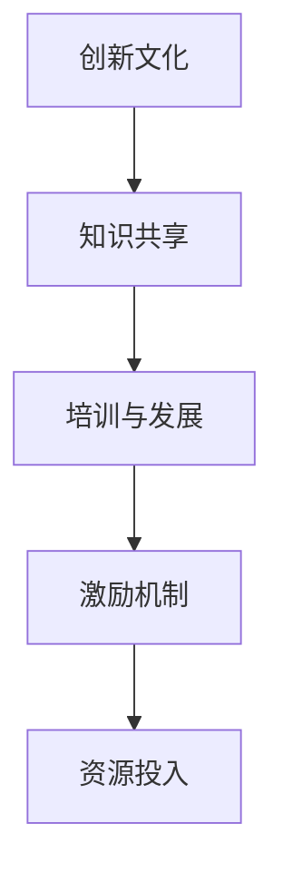

**10.3 创新项目管理与实施**

创新项目管理是确保创新项目顺利实施和成功的关键。以下是创新项目管理的几个关键步骤：

1. **项目立项**：明确创新项目的目标、范围、预期成果和资源需求，制定项目计划和预算。

   **核心概念与联系**（使用Mermaid流程图）：
   ```mermaid
   graph TD
       A[项目目标] --> B[项目范围]
       B --> C[项目计划]
       C --> D[项目预算]
   ```

2. **团队组建**：根据项目需求，组建跨部门、跨领域的创新团队，确保团队成员具备相关的技能和知识。

   **核心概念与联系**（使用Mermaid流程图）：
   ```mermaid
   graph TD
       A[团队组建] --> B[技能匹配]
   ```

3. **项目执行**：按照项目计划和预算，执行创新项目，通过定期检查和进度报告，确保项目按计划进行。

   **核心概念与联系**（使用Mermaid流程图）：
   ```mermaid
   graph TD
       A[项目执行] --> B[进度报告]
       B --> C[问题解决]
   ```

4. **项目评估**：项目完成后，进行项目评估，评估项目的成果、效益和不足，为后续创新项目提供参考。

   **核心概念与联系**（使用Mermaid流程图）：
   ```mermaid
   graph TD
       A[项目评估] --> B[成果评估]
       B --> C[效益评估]
       C --> D[改进建议]
   ```

**10.4 持续改进与创新能力的关系**

持续改进和创新能力是相辅相成的。持续改进通过不断优化和改进，提高企业的运营效率和产品质量，为创新提供坚实的基础。而创新能力则通过引入新的思想和技术，推动企业的创新和发展，持续改进和创新能力的结合，可以显著提升企业的竞争力和市场地位。

**核心概念与联系**（使用Mermaid流程图）：
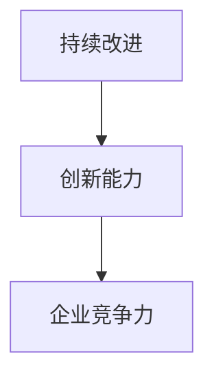

通过本章的讨论，我们可以看到，持续改进与创新能力对于企业的长期成功至关重要。通过不断优化和改进，企业可以提高运营效率和产品质量，而通过引入新的思想和技术，企业可以推动创新和发展。在下一章中，我们将提供一些管理工具与资源，帮助读者进一步学习和实践管理艺术。

### 附录A：管理工具与资源

在管理实践中，使用合适的工具和资源可以显著提升管理效率。以下是一些常用的管理工具、获取与应用资源，以及推荐的管理书籍与文章。

**A.1 常用管理工具简介**

1. **项目管理工具**：
   - **Trello**：一个简单直观的任务管理工具，适用于团队协作和项目管理。
   - **Asana**：功能强大的项目管理软件，支持任务分配、进度跟踪和协作。
   - **Jira**：适用于软件开发团队的项目管理工具，支持敏捷开发流程。

2. **时间管理工具**：
   - **Google Calendar**：强大的日历应用，支持事件提醒和团队协作。
   - **Evernote**：笔记和任务管理工具，可以帮助记录和管理日常工作。

3. **数据分析和报告工具**：
   - **Tableau**：数据可视化工具，用于生成直观的图表和报告。
   - **Power BI**：微软推出的商业智能工具，支持数据分析和报告生成。

4. **沟通和协作工具**：
   - **Slack**：团队沟通工具，支持即时消息、文件共享和协作。
   - **Zoom**：视频会议和远程协作工具，适用于在线会议和培训。

**A.2 管理资源的获取与应用**

1. **在线课程与认证**：
   - **Coursera**：提供各种管理课程，包括项目管理、领导力、数据分析等。
   - **edX**：与知名大学合作的在线学习平台，提供丰富的管理相关课程。

2. **专业书籍**：
   - **《管理实务》（Principles of Management）》**：由彼得·德鲁克（Peter Drucker）撰写，是管理领域的经典之作。
   - **《创新者的窘境》（The Innovator's Dilemma）》**：克莱顿·克里斯坦森（Clayton Christensen）的著作，探讨创新对企业发展的影响。

3. **管理杂志与期刊**：
   - **《哈佛商业评论》（Harvard Business Review）》**：全球知名的管理杂志，涵盖最新的管理趋势和案例研究。
   - **《管理学季刊》（Journal of Management Studies）》**：发布管理研究的最新成果，是管理学术界的权威期刊。

4. **专业社区与论坛**：
   - **LinkedIn**：职业社交平台，可以加入各种管理相关的群组和讨论。
   - **Quora**：问答社区，可以提问并获得专业人士的解答。

**A.3 管理书籍与文章推荐**

1. **《第五项修炼：学习型组织的艺术与实践》（The Fifth Discipline）》**：彼得·圣吉（Peter Senge）的著作，介绍了学习型组织的理念和实践。
2. **《精益思想》（Lean Thinking）》**：詹姆斯·W·沃麦克（James P. Womack）和丹尼尔·T·琼斯（Daniel T. Jones）合著，探讨了精益管理的核心原则。
3. **《创新者的基因》（The Innovator's Gene）》**：史蒂夫·布兰克（Steve Blank）的著作，分析了创新者的思维模式和行为特点。

**A.4 管理知识库与数据库**

1. **MBA Skool**：提供丰富的管理知识库，包括课程笔记、案例研究和思维导图。
2. **MindTools**：一个在线资源库，提供各种管理技能和职业发展的工具和资源。
3. **Harvard Business School Publishing**：哈佛商学院出版的各种管理案例和研究报告。

通过这些管理工具与资源的介绍，读者可以更好地理解管理艺术，并在实际工作中应用这些工具和资源，提升管理效率。附录部分为读者提供了进一步学习和实践的机会，希望对读者的职业发展有所帮助。

### 总结与展望

通过本文的深入探讨，我们系统地阐述了管理艺术的各个方面，从基础理论到策略制定与执行，再到绩效管理和持续改进与创新能力。管理艺术并非一门单一的学科，而是一个综合性的领域，它要求管理者具备多方面的知识和技能，能够在复杂多变的环境中做出明智的决策。

首先，我们探讨了管理艺术的基础，包括管理的定义、管理艺术的内涵与特点，以及管理者角色的转变。通过这些基础知识的理解，管理者可以更好地把握管理的本质和目标。

接着，我们回顾了管理理论的发展历程，从古典管理理论到行为科学管理理论，再到系统管理理论和当代管理理论。这些理论为我们提供了丰富的管理工具和方法，帮助我们在实际中应用。

在策略制定与执行部分，我们详细讨论了企业战略规划、市场分析与竞争策略、人力资源策略、财务策略等。有效的策略规划和管理能够帮助企业实现长期目标，提高竞争力。

绩效管理和执行力建设是管理艺术中至关重要的环节。通过有效的绩效管理和执行力建设，企业可以确保战略目标的实现，提升员工的绩效和满意度。

最后，我们探讨了持续改进与创新能力的重要性，以及如何通过这些方法提升企业的竞争力。持续改进和创新能力是企业适应市场变化、保持竞争优势的关键。

展望未来，管理艺术将继续发展，随着技术的进步和市场环境的变化，管理者需要不断学习和适应新的管理理论和实践方法。人工智能、大数据、云计算等新兴技术的应用，将为管理带来新的机遇和挑战。

我们鼓励读者在管理实践中不断探索和尝试，将本文中的理论和方法应用于实际工作。通过实践，读者可以更好地理解管理艺术的真谛，提升自己的管理能力，为企业的发展做出贡献。

作者：AI天才研究院/AI Genius Institute & 禅与计算机程序设计艺术 /Zen And The Art of Computer Programming

本文旨在为IT领域的管理者提供一套全面的管理指南，帮助他们在复杂的环境中实现高效的管理与执行。希望本文能够为读者提供有价值的见解和启示，推动读者在管理艺术的道路上不断前行。

