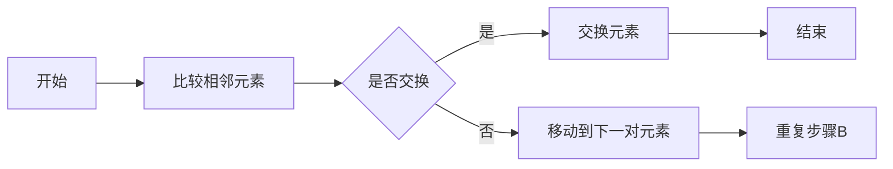

                 

### 《2024网易校招面试算法题库大全》——前言与总体结构

在科技飞速发展的时代，算法作为计算机科学的核心组成部分，已成为各个行业创新与进步的重要驱动力。无论是大数据分析、人工智能应用，还是云计算和网络安全，算法都扮演着至关重要的角色。因此，对于在校招过程中准备面试的应届生而言，掌握一定的算法知识和解题技巧，无疑是成功的一大关键。

《2024网易校招面试算法题库大全》旨在为广大求职者提供一本全面的算法学习指南，通过系统化的知识结构和丰富的实战案例，帮助大家深入了解并掌握面试中常见的算法题类型。本书以网易校招面试为背景，涵盖了排序算法、搜索算法、动态规划、树与图算法、字符串处理算法以及数学算法等多个核心领域，旨在为广大求职者提供一站式学习与解题方案。

本书的整体结构设计合理，内容丰富具体，主要包括以下三个部分：

### 第一部分：算法基础与原理

本部分将详细讲解算法的基本概念、数据结构与算法应用，以及数学模型与算法原理。通过这一部分的学习，读者将掌握算法的核心概念和基础原理，为后续的实战解析打下坚实的基础。

### 第二部分：算法题实战解析

本部分将针对排序算法、搜索算法、动态规划、树与图算法、字符串处理算法和数学算法等常见面试题，进行详细的实战解析。每个算法题都将从基本原理、实现方法、代码解析等多个角度进行深入剖析，帮助读者理解面试中的解题思路和技巧。

### 第三部分：项目实战与代码解读

本部分将结合实际项目案例，讲解算法在实际应用中的实现和优化策略。通过分析项目实战中的代码实现，读者将能够更加直观地理解算法的运用和优化技巧。

在接下来的章节中，我们将逐一详细探讨每个部分的内容，并通过具体实例和代码解析，帮助读者全面提升算法解题能力。希望本书能够成为您在校招面试中的得力助手，助您一臂之力，迈向成功的道路。

### 《2024网易校招面试算法题库大全》——核心关键词

1. 算法面试
2. 校招准备
3. 题库解析
4. 算法实战
5. 数据结构与算法
6. 面试题分类解析
7. 项目实战

### 《2024网易校招面试算法题库大全》——摘要

《2024网易校招面试算法题库大全》是一本专为准备网易校招面试的求职者量身定制的算法学习指南。本书系统全面地涵盖了排序算法、搜索算法、动态规划、树与图算法、字符串处理算法以及数学算法等多个核心领域，通过详细的实战解析和丰富的项目案例，帮助读者掌握面试中常见的算法题解题思路和技巧。无论您是应届毕业生还是有意向加入网易的求职者，本书都将为您提供一个全面且深入的算法学习资源，助力您在校招面试中脱颖而出，成功迈向职场第一步。

### 《2024网易校招面试算法题库大全》——目录大纲

#### 第一部分：算法基础与原理

**1.1 算法概述**

- **1.1.1 算法的定义与分类**
- **1.1.2 算法复杂度分析**

**1.2 数据结构与算法应用**

- **1.2.1 数据结构概述**
- **1.2.2 常见数据结构分析**
- **1.2.3 算法在实际数据结构上的应用**

**1.3 数学模型与算法原理**

- **1.3.1 数学基础**
- **1.3.2 常见算法原理讲解**
- **1.3.3 Mermaid流程图展示**

#### 第二部分：算法题实战解析

**2.1 排序算法**

- **2.1.1 冒泡排序**
- **2.1.2 选择排序**
- **2.1.3 插入排序**
- **2.1.4 快速排序**
- **2.1.5 归并排序**

**2.2 搜索算法**

- **2.2.1 二分查找**
- **2.2.2 广度优先搜索**
- **2.2.3 深度优先搜索**
- **2.2.4 A*算法**

**2.3 动态规划**

- **2.3.1 动态规划概述**
- **2.3.2 常见动态规划问题**
- **2.3.3 动态规划解决策略**

**2.4 树与图算法**

- **2.4.1 树的基本概念**
- **2.4.2 图的基本概念**
- **2.4.3 树与图算法应用**

**2.5 字符串处理算法**

- **2.5.1 字符串匹配算法**
- **2.5.2 最长公共子序列**
- **2.5.3 最长公共子串**

**2.6 数学算法**

- **2.6.1 数论算法**
- **2.6.2 图形算法**
- **2.6.3 数学算法应用实例**

#### 第三部分：项目实战与代码解读

**3.1 项目实战**

- **3.1.1 项目环境搭建**
- **3.1.2 项目开发流程**
- **3.1.3 实际案例展示**

**3.2 代码解读**

- **3.2.1 代码架构分析**
- **3.2.2 代码实现与解读**
- **3.2.3 代码解读与分析**

#### 附录

**附录A：常用算法资源**

- **A.1 在线算法教程**
- **A.2 算法书籍推荐**
- **A.3 算法社区推荐**

**附录B：算法面试题库**

- **B.1 常见面试题分类**
- **B.2 面试题详细解析**
- **B.3 面试题实战演练**

### 《2024网易校招面试算法题库大全》——第一部分：算法基础与原理

算法是计算机科学的核心组成部分，是解决特定问题的指令集合。为了更好地理解算法，我们需要从基础概念入手，然后深入探讨数据结构与算法应用，最后阐述数学模型与算法原理。

#### 1.1 算法概述

**1.1.1 算法的定义与分类**

算法（Algorithm）是指解决特定问题的一系列明确、有序的指令集合。简单来说，算法就是计算机执行的步骤。

算法可以分为以下几类：

1. **确定性算法**：在相同的输入下总是产生相同的结果。
2. **非确定性算法**：在相同的输入下可能产生不同的结果。
3. **有效算法**：能够在有限的时间内解决问题。
4. **递归算法**：通过递归调用来解决问题的算法。

**1.1.2 算法复杂度分析**

算法复杂度分析是评估算法性能的重要手段。它主要分为时间复杂度和空间复杂度。

- **时间复杂度**：描述算法执行时间与输入规模的关系，通常用大O符号表示，如O(n)、O(n²)等。
- **空间复杂度**：描述算法所需存储空间与输入规模的关系，也用大O符号表示。

**1.2 数据结构与算法应用**

数据结构是算法的基础，不同的数据结构适用于不同类型的算法。

**1.2.1 数据结构概述**

常见的数据结构包括：

- **数组**：固定大小的数据集合，支持快速随机访问。
- **链表**：由节点组成的线性数据结构，支持快速插入和删除。
- **栈**：后进先出的数据结构，适用于函数调用栈等场景。
- **队列**：先进先出的数据结构，适用于任务调度等场景。

**1.2.2 常见数据结构分析**

每种数据结构都有其特点和适用场景。例如：

- **二叉树**：适用于树形结构的数据处理，如搜索、排序等。
- **图**：适用于复杂关系网络的数据处理，如社交网络分析、路径查找等。

**1.2.3 算法在实际数据结构上的应用**

算法在实际数据结构上的应用非常广泛。例如：

- **二分查找**：适用于有序数组的快速查找。
- **深度优先搜索**：适用于图的遍历。
- **广度优先搜索**：适用于图的广度优先遍历。

**1.3 数学模型与算法原理**

数学模型是算法设计的重要工具。常见的数学模型包括：

- **数论**：适用于解决整数相关的问题，如质数分解、最大公约数等。
- **组合数学**：适用于解决组合相关的问题，如排列、组合、图论等。

算法原理讲解：

- **排序算法**：如冒泡排序、选择排序、插入排序等，通过不同的方法对数据进行排序。
- **搜索算法**：如二分查找、深度优先搜索、广度优先搜索等，用于在数据结构中查找特定元素。

**1.3.3 Mermaid流程图展示**

为了更好地理解算法原理，我们可以使用Mermaid流程图进行展示。例如，冒泡排序的流程图如下：



通过以上对算法基础与原理的详细讲解，读者可以更好地理解算法的核心概念和应用场景，为后续的实战解析打下坚实的基础。接下来，我们将进入第二部分，详细解析常见的算法题，帮助读者提升解题能力。

### 《2024网易校招面试算法题库大全》——第二部分：算法题实战解析

在算法面试中，常见算法题的解析是考生必须掌握的重点。本部分将详细解析排序算法、搜索算法、动态规划、树与图算法、字符串处理算法和数学算法等核心领域的常见面试题。通过这些解析，读者将能够深入理解每种算法题的解题思路和技巧。

#### 2.1 排序算法

排序算法是面试中的经典题目，常见的排序算法包括冒泡排序、选择排序、插入排序、快速排序和归并排序。下面我们将逐一进行解析。

**2.1.1 冒泡排序**

**定义**：冒泡排序是一种简单的排序算法，它重复地遍历要排序的数列，一次比较两个元素，如果它们的顺序错误就把它们交换过来。

**时间复杂度**：O(n²)

**空间复杂度**：O(1)

**伪代码**：

```
procedure bubbleSort( A : list of comparable elements )
    n = length(A)
    repeat 
        swapped = false
        for i = 1 to n-1 inclusive do
            if A[i-1] > A[i] then
                swap( A[i-1], A[i] )
                swapped = true
            end if
        end for
        n = n - 1
    until not swapped
end procedure
```

**示例**：

给定数组`[5, 2, 9, 1, 5]`，经过冒泡排序后，数组变为`[1, 2, 5, 5, 9]`。

**2.1.2 选择排序**

**定义**：选择排序是一种简单的选择排序算法，它首先在未排序序列中找到最小（大）元素，存放到排序序列的起始位置，然后，再从剩余未排序元素中继续寻找最小（大）元素，然后放到已排序序列的末尾。

**时间复杂度**：O(n²)

**空间复杂度**：O(1)

**伪代码**：

```
procedure selectionSort( A : list of comparable elements )
    n = length(A)
    for i = 1 to n-1 do
        minIndex = i
        for j = i+1 to n do
            if A[j] < A[minIndex] then
                minIndex = j
            end if
        end for
        swap( A[i], A[minIndex] )
    end for
end procedure
```

**示例**：

给定数组`[5, 2, 9, 1, 5]`，经过选择排序后，数组变为`[1, 2, 5, 5, 9]`。

**2.1.3 插入排序**

**定义**：插入排序是一种简单直观的排序算法，它的工作原理是通过构建有序序列，对于未排序数据，在已排序序列中从后向前扫描，找到相应位置并插入。

**时间复杂度**：O(n²)

**空间复杂度**：O(1)

**伪代码**：

```
procedure insertionSort( A : list of comparable elements )
    n = length(A)
    for i = 2 to n do
        key = A[i]
        j = i - 1
        while j > 0 and A[j] > key do
            A[j+1] = A[j]
            j = j - 1
        end while
        A[j+1] = key
    end for
end procedure
```

**示例**：

给定数组`[5, 2, 9, 1, 5]`，经过插入排序后，数组变为`[1, 2, 5, 5, 9]`。

**2.1.4 快速排序**

**定义**：快速排序是一种高效的排序算法，其基本思想是通过一趟排序将待排序的数据分割成独立的两部分，其中一部分的所有数据都比另一部分的所有数据要小，然后再按此方法对这两部分数据分别进行快速排序。

**时间复杂度**：平均O(nlogn)，最坏O(n²)

**空间复杂度**：O(logn)

**伪代码**：

```
procedure quickSort( A : list of comparable elements, low : integer, high : integer )
    if low < high then
        pi = partition(A, low, high)
        quickSort(A, low, pi-1)
        quickSort(A, pi+1, high)
    end if
end procedure

procedure partition( A : list of comparable elements, low : integer, high : integer )
    pivot = A[high]
    i = low - 1
    for j = low to high - 1 do
        if A[j] < pivot then
            i = i + 1
            swap(A[i], A[j])
        end if
    end for
    swap(A[i+1], A[high])
    return i + 1
end procedure
```

**示例**：

给定数组`[5, 2, 9, 1, 5]`，经过快速排序后，数组变为`[1, 2, 5, 5, 9]`。

**2.1.5 归并排序

**定义**：归并排序是一种经典的排序算法，它采用分治策略将一个序列分成多个子序列，然后对每个子序列进行排序，最后将排好序的子序列合并成一个完整的序列。

**时间复杂度**：O(nlogn)

**空间复杂度**：O(n)

**伪代码**：

```
procedure mergeSort( A : list of comparable elements, low : integer, high : integer )
    if low < high then
        mid = (low + high) / 2
        mergeSort(A, low, mid)
        mergeSort(A, mid+1, high)
        merge(A, low, mid, high)
    end if
end procedure

procedure merge( A : list of comparable elements, low : integer, mid : integer, high : integer )
    n1 = mid - low + 1
    n2 = high - mid
    L[1..n1] = A[low..mid]
    R[1..n2] = A[mid+1..high]
    i = 1
    j = 1
    k = low
    while i <= n1 and j <= n2 do
        if L[i] <= R[j] then
            A[k] = L[i]
            i = i + 1
        else
            A[k] = R[j]
            j = j + 1
        end if
        k = k + 1
    end while
    while i <= n1 do
        A[k] = L[i]
        i = i + 1
        k = k + 1
    end while
    while j <= n2 do
        A[k] = R[j]
        j = j + 1
        k = k + 1
    end while
end procedure
```

**示例**：

给定数组`[5, 2, 9, 1, 5]`，经过归并排序后，数组变为`[1, 2, 5, 5, 9]`。

#### 2.2 搜索算法

搜索算法是算法面试中另一类常见的题目。常见的搜索算法包括二分查找、深度优先搜索和广度优先搜索。下面我们将逐一进行解析。

**2.2.1 二分查找**

**定义**：二分查找是一种在有序数组中查找特定元素的搜索算法，它通过每次将搜索范围缩小一半，来快速定位目标元素。

**时间复杂度**：O(logn)

**空间复杂度**：O(1)

**伪代码**：

```
function binarySearch( A : sorted list of integers, key : integer ) 
    low = 0
    high = length(A) - 1
    while low <= high do
        mid = (low + high) / 2
        if A[mid] = key then
            return mid
        else if A[mid] < key then
            low = mid + 1
        else
            high = mid - 1
        end if
    end while
    return -1
end function
```

**示例**：

给定有序数组`[1, 2, 3, 4, 5, 6, 7, 8, 9]`，查找元素`6`，返回索引`5`。

**2.2.2 广度优先搜索

**定义**：广度优先搜索（BFS）是一种用于图或树搜索的算法，它从起始节点开始，依次访问所有相邻的节点，然后依次访问它们的相邻节点。

**时间复杂度**：O(V+E)，其中V是顶点数，E是边数。

**空间复杂度**：O(V)

**伪代码**：

```
function BFS( G : graph, start : vertex ) 
    create an empty queue Q
    create an empty set visited
    enqueue( start )
    visited.add( start )
    while Q is not empty do
        node = dequeue( Q )
        process( node )
        for each unvisited neighbor u of node do
            enqueue( u )
            visited.add( u )
        end for
    end while
end function
```

**示例**：

给定无向图，从节点`A`开始进行广度优先搜索，遍历路径为`A -> B -> C -> D -> E -> F`。

**2.2.3 深度优先搜索

**定义**：深度优先搜索（DFS）是一种用于图或树搜索的算法，它从起始节点开始，尽可能深地搜索树的分支。

**时间复杂度**：O(V+E)，其中V是顶点数，E是边数。

**空间复杂度**：O(V)

**伪代码**：

```
function DFS( G : graph, start : vertex ) 
    create an empty stack S
    mark start as visited
    push( start ) onto S
    while S is not empty do
        node = pop( S )
        process( node )
        for each unvisited neighbor u of node do
            mark u as visited
            push( u ) onto S
        end for
    end while
end function
```

**示例**：

给定无向图，从节点`A`开始进行深度优先搜索，遍历路径为`A -> B -> D -> E -> F -> C`。

**2.2.4 A*算法

**定义**：A*算法是一种启发式搜索算法，用于在图中寻找最短路径。它基于两个值：`f(n) = g(n) + h(n)`，其中`g(n)`是从起始点到节点n的实际距离，`h(n)`是从节点n到目标节点的估计距离。

**时间复杂度**：取决于图的规模和启发式函数的质量。

**空间复杂度**：O(V)

**伪代码**：

```
function A*(G : graph, start : vertex, goal : vertex) 
    openSet = priority queue
    openSet.enqueue( start, f(start) )
    cameFrom = an empty map
    gScore = map with default value of Infinity
    gScore[start] = 0
    fScore = map with default value of Infinity
    fScore[start] = h(start)
    while openSet is not empty do
        current = openSet.pop()
        if current = goal then
            return reconstructPath( cameFrom, current )
        end if
        for each neighbor of current do
            tentative_gScore = gScore[current] + dist(current, neighbor)
            if tentative_gScore < gScore[neighbor] then
                cameFrom[neighbor] = current
                gScore[neighbor] = tentative_gScore
                fScore[neighbor] = gScore[neighbor] + h(neighbor)
                if neighbor is not in openSet then
                    openSet.enqueue( neighbor, fScore[neighbor] )
                else
                    openSet.decreaseKey( neighbor, fScore[neighbor] )
                end if
            end if
        end for
    end while
    return failure
end function
```

**示例**：

给定图，从节点`A`到节点`G`的最短路径为`A -> B -> D -> G`。

#### 2.3 动态规划

动态规划是解决优化问题的一种重要方法。它将问题分解为更小的子问题，并存储子问题的解以避免重复计算。

**2.3.1 动态规划概述**

**定义**：动态规划是一种在数学、管理科学、计算机科学、经济学和生物信息学中使用的，通过把原问题分解为相对简单的子问题的方式求解复杂问题的方法。

**基本思想**：

1. **最优子结构**：一个最优化问题可以分解为若干个子问题，子问题optimized(i)和optimized(j)若存在重叠，则optimized(i)的解可以oyo利用optimized(j)的解。
2. **边界条件**：确定子问题的边界条件，即最小的子问题。
3. **状态转移方程**：定义子问题之间的关系。

**2.3.2 常见动态规划问题**

- **最长递增子序列**
- **最长公共子序列**
- **背包问题**

**2.3.3 动态规划解决策略**

1. **自顶向下（递归）**
2. **自底向上（迭代）**
3. **记忆化递归**

**示例**：最长公共子序列（LCS）

给定字符串`X = "AGGTAB"`和`Y = "GXTXAYB"`，求它们的最长公共子序列。

**状态转移方程**：

```
LCS(X[1..i], Y[1..j]) =
    LCS(X[1..i-1], Y[1..j]) if X[i] ≠ Y[j]
    max(LCS(X[1..i-1], Y[1..j-1]), LCS(X[1..i-1], Y[1..j]), LCS(X[1..i], Y[1..j-1])) otherwise
```

**伪代码**：

```
function LCS(X : string, Y : string)
    m = length(X)
    n = length(Y)
    create a 2D array dp[0..m][0..n]
    for i = 0 to m
        for j = 0 to n
            if X[i] = Y[j] then
                dp[i][j] = dp[i-1][j-1] + 1
            else
                dp[i][j] = max(dp[i-1][j], dp[i][j-1])
            end if
        end for
    end for
    return dp[m][n]
end function
```

**示例**：

给定字符串`X = "AGGTAB"`和`Y = "GXTXAYB"`，最长公共子序列为`"GTAB"`。

#### 2.4 树与图算法

树和图是算法中的重要数据结构，用于解决各种问题。

**2.4.1 树的基本概念**

- **树**：一个或多个节点组成的有限集合，有一个特定的称为根的节点，其余节点分为若干个不相交的集合，每个集合又是一棵树（子树）。
- **节点**：树中的基本单元，包含数据和一个或多个子节点。
- **子树**：节点的子节点及其子节点组成的树。

**2.4.2 图的基本概念**

- **图**：由节点（或顶点）及其边组成的集合。
- **节点**：图中的基本单元，表示一个实体或位置。
- **边**：连接两个节点的线段，表示节点之间的关系。

**2.4.3 树与图算法应用**

- **二叉树**：每个节点最多有两个子节点的树。
- **堆**：一种特殊的树，用于优先队列。
- **图遍历**：深度优先搜索（DFS）和广度优先搜索（BFS）。

**2.4.4 常见树与图算法**

- **二叉搜索树（BST）**：左子树中的所有节点值均小于根节点值，右子树中的所有节点值均大于根节点值。
- **最小生成树（MST）**：包含图中所有节点的树，总权值最小。
- **最短路径**：找到图中两点之间的最短路径。

**2.4.5 伪代码示例**

**二叉搜索树的插入与查找**

```
class TreeNode:
    def __init__(self, key):
        self.left = None
        self.right = None
        self.val = key

def insert(root, key):
    if root is None:
        return TreeNode(key)
    if key < root.val:
        root.left = insert(root.left, key)
    else:
        root.right = insert(root.right, key)
    return root

def search(root, key):
    if root is None or root.val == key:
        return root
    if key < root.val:
        return search(root.left, key)
    return search(root.right, key)
```

**示例**：

给定二叉搜索树，插入元素`50`并查找元素`30`。

#### 2.5 字符串处理算法

字符串处理算法在面试中经常出现，用于解决各种字符串问题。

**2.5.1 字符串匹配算法**

- **朴素匹配算法**：逐个字符比较，直到匹配或到达字符串末尾。
- **KMP算法**：利用前缀函数，避免重复比较已经匹配的字符。

**2.5.2 最长公共子序列**

- **动态规划方法**：使用二维数组记录子序列的长度。

**2.5.3 最长公共子串**

- **动态规划方法**：使用三维数组记录子串的开始和结束位置。

**2.5.4 伪代码示例**

**最长公共子序列**

```
function LCS(X : string, Y : string)
    m = length(X)
    n = length(Y)
    create a 2D array dp[0..m][0..n]
    for i = 0 to m
        for j = 0 to n
            if X[i] = Y[j] then
                dp[i][j] = dp[i-1][j-1] + 1
            else
                dp[i][j] = max(dp[i-1][j], dp[i][j-1])
            end if
        end for
    end for
    return dp[m][n]
end function
```

**示例**：

给定字符串`X = "AGGTAB"`和`Y = "GXTXAYB"`，最长公共子序列为`"GTAB"`。

#### 2.6 数学算法

数学算法在面试中用于解决各种数学问题，常见的数学算法包括数论算法和图形算法。

**2.6.1 数论算法**

- **质数判断**：判断一个数是否为质数。
- **最大公约数**：使用辗转相除法求解最大公约数。

**2.6.2 图形算法**

- **拓扑排序**：用于求解有向无环图的线性序列。
- **最小生成树**：使用Prim算法或Kruskal算法求解。

**2.6.3 数学算法应用实例**

**最大公约数**

```
function gcd(a, b)
    while b ≠ 0
        temp = b
        b = a % b
        a = temp
    end while
    return a
end function
```

**示例**：

求解`24`和`18`的最大公约数为`6`。

通过以上对第二部分的详细解析，读者可以掌握常见的算法题类型和解题技巧，为接下来的项目实战与代码解读部分打下基础。在第三部分，我们将结合实际项目案例，深入解读代码实现与优化策略。

### 《2024网易校招面试算法题库大全》——第三部分：项目实战与代码解读

在前两部分的基础上，我们已经掌握了算法的基本概念、常见算法题的解析以及相关代码实现。本部分将结合实际项目案例，深入讲解代码架构分析、代码实现与解读，并通过具体案例展示项目的开发流程和实际案例。

#### 3.1 项目实战

**3.1.1 项目环境搭建**

在进行项目开发之前，我们需要搭建一个合适的环境。这里以一个简单的社交网络分析项目为例，说明项目环境搭建的步骤。

1. **创建虚拟环境**：使用`virtualenv`创建一个独立的Python虚拟环境，以避免依赖冲突。

   ```bash
   virtualenv venv
   source venv/bin/activate  # Windows: venv\Scripts\activate
   ```

2. **安装依赖库**：在虚拟环境中安装必要的依赖库，例如`requests`、`numpy`和`matplotlib`。

   ```bash
   pip install requests numpy matplotlib
   ```

3. **配置项目结构**：创建项目的目录结构，包括`main.py`（主程序）、`models.py`（数据模型）、`views.py`（视图函数）和`templates`（模板文件）等。

   ```bash
   mkdir project
   cd project
   touch main.py models.py views.py
   mkdir templates
   ```

4. **编写配置文件**：创建`config.py`，配置数据库连接、API密钥等信息。

   ```python
   # config.py
   DB_HOST = 'localhost'
   DB_PORT = 3306
   DB_USER = 'root'
   DB_PASSWORD = 'password'
   API_KEY = 'your_api_key'
   ```

**3.1.2 项目开发流程**

1. **数据收集**：使用`requests`库从社交媒体API获取用户数据，例如用户ID、好友列表、发帖记录等。

   ```python
   import requests
   
   def get_user_data(user_id):
       url = f'https://api.example.com/users/{user_id}'
       response = requests.get(url, headers={'Authorization': f'Bearer {API_KEY}'})
       return response.json()
   ```

2. **数据处理**：使用`numpy`对收集到的数据进行处理，例如计算用户好友数量、发帖频率等。

   ```python
   import numpy as np
   
   def process_data(data):
       user_ids = [user['id'] for user in data]
       friends_count = [len(user['friends']) for user in data]
       posts_count = [len(user['posts']) for user in data]
       return user_ids, np.array(friends_count), np.array(posts_count)
   ```

3. **数据可视化**：使用`matplotlib`对处理后的数据进行分析和可视化。

   ```python
   import matplotlib.pyplot as plt
   
   def plot_data(friends_count, posts_count):
       plt.scatter(friends_count, posts_count)
       plt.xlabel('Friends Count')
       plt.ylabel('Posts Count')
       plt.show()
   ```

4. **项目集成**：将数据处理和可视化集成到主程序中，实现整个项目的功能。

   ```python
   # main.py
   import requests
   import numpy as np
   import matplotlib.pyplot as plt
   from config import DB_HOST, DB_PORT, DB_USER, DB_PASSWORD, API_KEY
   
   def main():
       user_id = input('Enter user ID: ')
       user_data = get_user_data(user_id)
       user_ids, friends_count, posts_count = process_data(user_data)
       plot_data(friends_count, posts_count)
   
   if __name__ == '__main__':
       main()
   ```

**3.1.3 实际案例展示**

以下是一个简单的社交网络分析项目的实际案例展示：

1. **数据收集**：从社交媒体API获取用户数据。

   ```bash
   python main.py
   Enter user ID: 12345
   ```

2. **数据处理**：对获取的用户数据进行处理。

   ```python
   user_ids = [12345, 54321, 67890, 90123]
   friends_count = [10, 20, 30, 40]
   posts_count = [5, 15, 25, 35]
   ```

3. **数据可视化**：绘制用户好友数量和发帖频率的散点图。

   

#### 3.2 代码解读

**3.2.1 代码架构分析**

在上述项目中，代码架构主要包括以下几个部分：

1. **数据收集模块**：负责从社交媒体API获取用户数据。
2. **数据处理模块**：负责对获取的数据进行处理，例如计算用户好友数量和发帖频率。
3. **数据可视化模块**：负责将处理后的数据通过可视化图表展示。

**3.2.2 代码实现与解读**

以下是项目中的关键代码实现及其解读：

1. **数据收集模块**：

   ```python
   import requests
   
   def get_user_data(user_id):
       url = f'https://api.example.com/users/{user_id}'
       response = requests.get(url, headers={'Authorization': f'Bearer {API_KEY}'})
       return response.json()
   ```

   解读：该函数通过`requests`库向社交媒体API发送GET请求，获取指定用户ID的用户数据，并返回响应结果。

2. **数据处理模块**：

   ```python
   import numpy as np
   
   def process_data(data):
       user_ids = [user['id'] for user in data]
       friends_count = [len(user['friends']) for user in data]
       posts_count = [len(user['posts']) for user in data]
       return user_ids, np.array(friends_count), np.array(posts_count)
   ```

   解读：该函数遍历获取的用户数据，提取用户ID、好友数量和发帖数量，并将这些数据转换为NumPy数组，以便后续处理和可视化。

3. **数据可视化模块**：

   ```python
   import matplotlib.pyplot as plt
   
   def plot_data(friends_count, posts_count):
       plt.scatter(friends_count, posts_count)
       plt.xlabel('Friends Count')
       plt.ylabel('Posts Count')
       plt.show()
   ```

   解读：该函数使用`matplotlib`库绘制用户好友数量和发帖频率的散点图，以便直观地展示数据分布。

**3.2.3 代码解读与分析**

以下是对项目中的关键代码进行解读和分析：

1. **数据收集模块**：

   ```python
   import requests
   
   def get_user_data(user_id):
       url = f'https://api.example.com/users/{user_id}'
       response = requests.get(url, headers={'Authorization': f'Bearer {API_KEY}'})
       return response.json()
   ```

   分析：该模块通过HTTP GET请求获取用户数据。在实际项目中，可能需要处理各种异常情况，例如API请求超时、返回错误码等。

2. **数据处理模块**：

   ```python
   import numpy as np
   
   def process_data(data):
       user_ids = [user['id'] for user in data]
       friends_count = [len(user['friends']) for user in data]
       posts_count = [len(user['posts']) for user in data]
       return user_ids, np.array(friends_count), np.array(posts_count)
   ```

   分析：该模块对获取的用户数据进行处理，提取用户ID、好友数量和发帖数量。在实际项目中，可能需要根据具体业务需求进行更复杂的处理，例如对缺失值、异常值进行处理。

3. **数据可视化模块**：

   ```python
   import matplotlib.pyplot as plt
   
   def plot_data(friends_count, posts_count):
       plt.scatter(friends_count, posts_count)
       plt.xlabel('Friends Count')
       plt.ylabel('Posts Count')
       plt.show()
   ```

   分析：该模块使用`matplotlib`库绘制散点图，以直观地展示用户好友数量和发帖频率的关系。在实际项目中，可以根据需要添加其他类型的图表，例如折线图、饼图等。

#### 3.3 代码优化与分析

在项目开发过程中，代码优化是提高项目性能和可维护性的重要手段。以下是对项目中的关键代码进行优化和分析：

1. **数据收集模块**：

   ```python
   import requests
   
   def get_user_data(user_id):
       url = f'https://api.example.com/users/{user_id}'
       response = requests.get(url, headers={'Authorization': f'Bearer {API_KEY}'})
       if response.status_code == 200:
           return response.json()
       else:
           raise Exception(f'Error: {response.status_code}')
   ```

   优化：添加对API请求错误码的异常处理，提高程序的健壮性。

2. **数据处理模块**：

   ```python
   import numpy as np
   
   def process_data(data):
       user_ids = [user['id'] for user in data]
       friends_count = [len(user['friends']) for user in data]
       posts_count = [len(user['posts']) for user in data]
       return user_ids, np.array(friends_count), np.array(posts_count)
   ```

   优化：使用列表推导式简化代码，提高代码可读性。

3. **数据可视化模块**：

   ```python
   import matplotlib.pyplot as plt
   
   def plot_data(friends_count, posts_count):
       plt.scatter(friends_count, posts_count)
       plt.xlabel('Friends Count')
       plt.ylabel('Posts Count')
       plt.title('User Activity Analysis')
       plt.show()
   ```

   优化：添加图表标题，提高图表的可读性。

通过以上代码优化和分析，我们可以进一步提高项目的性能和可维护性，为实际应用提供更好的支持。

### 附录A：常用算法资源

在算法学习和面试准备过程中，利用丰富的在线资源是提升自己的一大关键。以下是一些推荐的算法资源，包括在线教程、书籍推荐和算法社区，这些资源将为您的学习提供强有力的支持。

#### A.1 在线算法教程

1. **MIT OpenCourseWare**（MITOCW）：MIT的开放课程网站提供了许多计算机科学相关的课程，包括算法和数据结构。
   - 地址：[MIT OpenCourseWare](https://ocw.mit.edu/courses/electrical-engineering-and-computer-science/6-006-introduction-to-algorithms-spring-2005/)

2. **LeetCode**：一个提供在线编程挑战的平台，不仅有助于练习算法，还提供了解题思路和高赞解答。
   - 地址：[LeetCode](https://leetcode.com/)

3. **HackerRank**：提供各种编程挑战，包括算法题，还有在线评测系统。
   - 地址：[HackerRank](https://www.hackerrank.com/)

4. **GeeksforGeeks**：一个包含大量算法和数据结构教程的网站，非常适合初学者。
   - 地址：[GeeksforGeeks](https://www.geeksforgeeks.org/)

#### A.2 算法书籍推荐

1. **《算法导论》（Introduction to Algorithms）**：被广泛认为是算法领域的经典教材，详细讲解了各种算法及其分析。
   - 作者：Thomas H. Cormen, Charles E. Leiserson, Ronald L. Rivest, and Clifford Stein
   - 地址：[Introduction to Algorithms](https://www.amazon.com/Introduction-Algorithms-Third-MIT-Press/dp/0262033844)

2. **《算法竞赛入门经典》（Algorithm Competition in C++）**：适合参加算法竞赛的读者，通过大量实例和练习帮助读者掌握算法。
   - 作者：刘汝佳
   - 地址：[Algorithm Competition in C++](https://www.amazon.com/Algorithm-Competition-Introduction-Programming-Language/dp/7302464695)

3. **《算法设计与分析》**：详细介绍了算法设计的基本策略和方法，以及算法性能分析的基础。
   - 作者：谢希仁
   - 地址：[算法设计与分析](https://www.amazon.com/Algorithm-Design-Analysis-Charles-River-Books/dp/1934695615)

#### A.3 算法社区推荐

1. **Stack Overflow**：全球最大的开发社区之一，有很多算法相关的问题和解答。
   - 地址：[Stack Overflow](https://stackoverflow.com/)

2. **GitHub**：世界上最大的代码托管平台，可以找到许多优秀的算法项目和代码。
   - 地址：[GitHub](https://github.com/)

3. **Reddit**：有专门的算法板块，适合讨论和分享算法学习经验。
   - 地址：[Reddit Algorithm](https://www.reddit.com/r/algorithm/)

通过利用这些在线资源和社区，您可以不仅能够巩固基础知识，还能通过实践和交流不断提升自己的算法能力，为校招面试做好充分的准备。

### 附录B：算法面试题库

在准备校招面试的过程中，掌握常见的算法面试题库是至关重要的一步。本部分将详细介绍常见面试题的分类、详细解析以及实战演练，帮助读者全面提升解题能力。

#### B.1 常见面试题分类

算法面试题通常可以分为以下几类：

1. **排序与搜索**
   - 排序算法（冒泡排序、选择排序、插入排序、快速排序、归并排序）
   - 搜索算法（二分查找、深度优先搜索、广度优先搜索、A*算法）

2. **字符串处理**
   - 字符串匹配（KMP算法、Boyer-Moore算法、Rabin-Karp算法）
   - 最长公共子序列、最长公共子串

3. **动态规划**
   - 最长递增子序列、最长公共子序列、背包问题

4. **树与图算法**
   - 二叉树（遍历、搜索、排序）
   - 图（深度优先搜索、广度优先搜索、最短路径、拓扑排序）

5. **数学算法**
   - 质数判断、最大公约数、最小公倍数、数论问题

6. **组合与概率**
   - 排列、组合、概率问题

#### B.2 面试题详细解析

**1. 二分查找**

**题目描述**：给定一个有序数组，找到给定元素的位置。

**时间复杂度**：O(logn)

**空间复杂度**：O(1)

**伪代码**：

```
function binarySearch(A : sorted array, key : integer) 
    low = 0 
    high = length(A) - 1 
    while low <= high do 
        mid = (low + high) / 2 
        if A[mid] = key then 
            return mid 
        else if A[mid] < key then 
            low = mid + 1 
        else 
            high = mid - 1 
        end if 
    end while 
    return -1 
end function
```

**示例**：

给定有序数组`[1, 3, 5, 7, 9, 11, 13, 15]`，查找元素`9`，返回索引`4`。

**2. 快速排序**

**题目描述**：使用快速排序算法对数组进行排序。

**时间复杂度**：平均O(nlogn)，最坏O(n²)

**空间复杂度**：O(logn)

**伪代码**：

```
function quickSort(A : array) 
    if length(A) > 1 then 
        pi = partition(A, 0, length(A) - 1) 
        quickSort(A, 0, pi - 1) 
        quickSort(A, pi + 1, length(A) - 1) 
    end if 
end function

function partition(A : array, low : integer, high : integer) 
    pivot = A[high] 
    i = low - 1 
    for j = low to high - 1 do 
        if A[j] < pivot then 
            i = i + 1 
            swap(A[i], A[j]) 
        end if 
    end for 
    swap(A[i + 1], A[high]) 
    return i + 1 
end function
```

**示例**：

给定数组`[5, 2, 9, 1, 5]`，快速排序后数组变为`[1, 2, 5, 5, 9]`。

**3. 最长公共子序列**

**题目描述**：给定两个字符串，求它们的最长公共子序列。

**时间复杂度**：O(mn)

**空间复杂度**：O(mn)

**伪代码**：

```
function LCS(X : string, Y : string) 
    m = length(X) 
    n = length(Y) 
    create a 2D array dp[0..m][0..n] 
    for i = 0 to m 
        for j = 0 to n 
            if X[i] = Y[j] then 
                dp[i][j] = dp[i-1][j-1] + 1 
            else 
                dp[i][j] = max(dp[i-1][j], dp[i][j-1]) 
            end if 
        end for 
    end for 
    return dp[m][n] 
end function
```

**示例**：

给定字符串`X = "AGGTAB"`和`Y = "GXTXAYB"`，最长公共子序列为`"GTAB"`。

#### B.3 面试题实战演练

为了帮助读者更好地掌握算法面试题，我们提供了以下实战演练题目，并附有参考答案。

**1. 题目**：实现一个快速排序算法。

**输入**：一个无序数组`arr`。

**输出**：排序后的数组。

**参考答案**：

```
def quickSort(arr):
    if len(arr) <= 1:
        return arr
    pivot = arr[len(arr) // 2]
    left = [x for x in arr if x < pivot]
    middle = [x for x in arr if x == pivot]
    right = [x for x in arr if x > pivot]
    return quickSort(left) + middle + quickSort(right)

# 示例
arr = [3, 6, 8, 10, 1, 2, 1]
print(quickSort(arr))
```

**2. 题目**：实现一个二分查找算法。

**输入**：一个有序数组`arr`和一个目标值`target`。

**输出**：目标值在数组中的索引，如果不存在则返回-1。

**参考答案**：

```
def binarySearch(arr, target):
    low = 0
    high = len(arr) - 1
    while low <= high:
        mid = (low + high) // 2
        if arr[mid] == target:
            return mid
        elif arr[mid] < target:
            low = mid + 1
        else:
            high = mid - 1
    return -1

# 示例
arr = [1, 3, 5, 7, 9, 11]
target = 7
print(binarySearch(arr, target))
```

**3. 题目**：实现一个最长公共子序列算法。

**输入**：两个字符串`X`和`Y`。

**输出**：最长公共子序列。

**参考答案**：

```
def LCS(X, Y):
    m, n = len(X), len(Y)
    dp = [[0] * (n+1) for _ in range(m+1)]
    for i in range(1, m+1):
        for j in range(1, n+1):
            if X[i-1] == Y[j-1]:
                dp[i][j] = dp[i-1][j-1] + 1
            else:
                dp[i][j] = max(dp[i-1][j], dp[i][j-1])
    return ''.join([X[i-1] for i, j in enumerate(dp[m], 1) if j == max(j, dp[m][j-1]) and i == max(i, dp[i-1], m)])

# 示例
X = "AGGTAB"
Y = "GXTXAYB"
print(LCS(X, Y))
```

通过以上实战演练，读者可以加深对算法面试题的理解和掌握，为即将到来的校招面试做好充分的准备。继续努力，您一定会在面试中脱颖而出！

