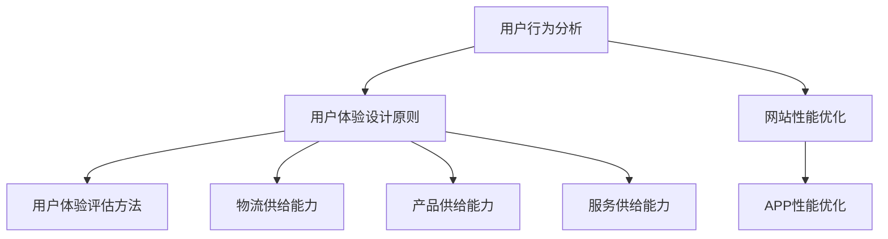

                 

# 网站和APP优化：提升用户体验，提升电商平台供给能力

## 引言

在数字化的时代，网站和APP作为电商平台的核心组成部分，直接影响到用户的购物体验和平台的市场竞争力。优化网站和APP不仅是提升用户体验的关键，更是增强电商平台供给能力的重要手段。本文将从用户体验优化的核心概念、网站和APP性能优化策略、电商平台供给能力提升等多个方面，详细探讨如何通过优化提升用户体验，进而增强电商平台的供给能力。

文章将分为三个部分：第一部分介绍用户体验优化的基础，包括用户行为分析、用户体验设计原则和用户体验评估方法；第二部分讨论网站和APP性能优化策略，包括网站性能优化和APP性能优化；第三部分则重点分析电商平台的供给能力提升，涵盖物流供给能力、产品供给能力和服务供给能力的优化。通过这三个部分，我们将逐步揭示如何通过系统化的优化手段，实现电商平台供给能力的提升。

在深入探讨之前，让我们首先明确几个核心关键词：用户体验、性能优化、供给能力、物流、产品和服务。这些关键词将贯穿整个文章，帮助我们理解优化的具体方向和实现途径。接下来的章节将逐步展开，深入分析每一个优化方面的具体实践和方法。

## 第一部分：优化基础

### 第1章：用户体验优化的核心概念

用户体验（User Experience，简称UX）是用户在使用产品或服务过程中的总体感受和体验。在电商平台上，用户体验不仅包括界面设计、功能易用性，还包括用户的操作流畅度、信息获取的便捷性以及售后服务等多个方面。一个优秀的用户体验可以增强用户对平台的忠诚度，从而促进用户的持续使用和消费。

#### 1.1 用户行为分析

用户行为分析是用户体验优化的第一步。通过分析用户在平台上的行为数据，我们可以了解用户的需求、偏好和使用习惯，从而有针对性地进行优化。

##### 1.1.1 用户行为数据收集

用户行为数据的收集主要通过以下几种方式：

- **日志分析**：通过服务器日志记录用户的访问行为，包括页面浏览、点击路径、搜索行为等。
- **在线调查**：通过问卷调查、用户访谈等方式直接获取用户反馈。
- **用户跟踪**：使用各种追踪工具（如Google Analytics、Mixpanel）实时监控用户行为。

##### 1.1.2 用户行为分析工具

常用的用户行为分析工具包括：

- **Google Analytics**：用于网站和APP的全面数据分析。
- **Mixpanel**：专注于用户行为分析，提供用户活跃度和留存率等关键指标。
- **Hotjar**：提供用户行为热图、滚动跟踪等功能。

##### 1.1.3 用户画像的构建

用户画像是对用户特征的综合描述，包括用户的年龄、性别、职业、兴趣爱好、购买习惯等。构建用户画像的步骤如下：

1. **数据收集**：通过多种渠道收集用户数据。
2. **数据清洗**：对收集到的数据去重、过滤，确保数据的准确性。
3. **数据建模**：使用机器学习算法对用户行为数据进行建模，提取用户特征。
4. **用户画像生成**：根据模型生成用户画像。

用户画像的构建有助于我们更好地了解用户，从而设计出更符合用户需求的平台功能和服务。

#### 1.2 用户体验设计原则

用户体验设计需要遵循一些基本原则，以确保设计符合用户需求、提高用户满意度。

##### 1.2.1 易用性设计

易用性设计关注用户如何与产品互动。具体原则包括：

- **简洁性**：界面简洁，避免冗余元素。
- **一致性**：界面元素和交互方式一致，便于用户记忆。
- **直观性**：操作流程直观，减少用户的认知负担。

##### 1.2.2 交互设计

交互设计关注用户与产品之间的交互方式。具体原则包括：

- **响应速度**：交互响应迅速，提升用户满意度。
- **反馈机制**：提供明确的操作反馈，帮助用户确认操作成功。
- **导航设计**：导航清晰，便于用户快速找到所需信息。

##### 1.2.3 可访问性设计

可访问性设计确保所有用户，包括残疾人和老年人，都能顺利使用产品。具体原则包括：

- **视觉可访问性**：保证颜色对比度、字体大小等视觉元素符合标准。
- **语音可访问性**：为视觉障碍用户提供语音辅助功能。
- **移动设备适配**：确保产品在多种设备上都能良好运行。

#### 1.3 用户体验评估方法

用户体验评估是确保优化措施有效性的关键步骤。以下几种方法常用于用户体验评估：

##### 1.3.1 用户测试

用户测试通过实际用户的使用反馈来评估产品的用户体验。测试方法包括：

- **可用性测试**：观察用户如何完成任务，记录用户的使用行为和反馈。
- **A/B测试**：比较不同设计的用户行为和满意度，选择最优设计。

##### 1.3.2 竞品分析

竞品分析通过对比竞争对手的网站和APP，了解行业标准和最佳实践。分析内容包括：

- **功能对比**：对比功能点的覆盖程度和易用性。
- **界面设计**：对比界面设计的风格和用户体验。
- **用户反馈**：分析用户对竞品的评价和反馈。

##### 1.3.3 用户体验地图

用户体验地图是一种可视化工具，用于描述用户在使用产品过程中的情感和体验。它包括以下内容：

- **用户行为路径**：用户如何使用产品，完成哪些任务。
- **用户情感变化**：用户在每个阶段的心理和情感变化。
- **关键体验触点**：影响用户体验的关键因素和互动点。

通过用户体验评估，我们可以识别出用户体验的痛点，为后续优化提供依据。

### 第2章：网站性能优化

网站性能是影响用户体验的关键因素之一。一个高性能的网站不仅能够提高用户的满意度和忠诚度，还能提升网站的搜索引擎排名和转化率。本章将介绍网站性能优化的核心指标、策略以及性能监控与调试方法。

#### 2.1 网站性能指标

网站性能指标包括以下几个方面：

##### 2.1.1 加载速度

加载速度是衡量网站性能的重要指标。一个优秀的网站应在3秒内完成页面加载，否则用户可能会放弃访问。加载速度可以通过以下指标来衡量：

- **页面完全加载时间**：从用户发起请求到页面完全呈现的时间。
- **首屏加载时间**：从用户发起请求到首屏内容呈现的时间。

##### 2.1.2 响应时间

响应时间是指用户与网站交互时，系统处理请求并返回结果的时间。响应时间越短，用户体验越好。响应时间可以通过以下指标来衡量：

- **服务器响应时间**：从用户发起请求到服务器返回响应的时间。
- **客户端响应时间**：从服务器返回响应到客户端处理完成的时间。

##### 2.1.3 可用性

可用性是指网站在用户使用过程中是否能够正常运作，提供所需功能。可用性可以通过以下指标来衡量：

- **错误率**：网站在用户使用过程中发生的错误数量。
- **故障恢复时间**：网站在发生故障后，恢复到正常运作的时间。

#### 2.2 性能优化策略

为了提高网站性能，可以采取以下优化策略：

##### 2.2.1 压缩资源文件

资源文件包括JavaScript、CSS和图片等。压缩资源文件可以减少文件大小，加快页面加载速度。常用的压缩工具有：

- **Gzip压缩**：对文本文件进行压缩。
- **WebP格式**：对图片文件进行压缩，提供更好的图像质量。
- **Code Splitting**：将代码分割成多个文件，按需加载。

##### 2.2.2 利用浏览器缓存

浏览器缓存可以缓存网站资源，减少重复请求，提高加载速度。常用的缓存策略包括：

- **持久缓存**：设置资源缓存时间，允许用户在离线状态下访问。
- **增量缓存**：只缓存更新后的资源，减少缓存大小。

##### 2.2.3 代码优化

代码优化可以减少代码体积，提高执行效率。常见的代码优化方法包括：

- **去除冗余代码**：删除不必要的代码，减少文件大小。
- **代码分割**：将代码分割成多个文件，按需加载。
- **懒加载**：仅在需要时加载资源，减少初始加载时间。

#### 2.3 性能监控与调试

性能监控与调试是确保网站性能优化的关键步骤。以下是一些常用的性能监控与调试方法：

##### 2.3.1 性能监控工具

性能监控工具可以帮助我们实时监测网站性能，包括：

- **Lighthouse**：Google推出的性能监控工具，提供全面的性能评估报告。
- **WebPageTest**：用于测试网站在不同网络条件下的性能表现。
- **GTmetrix**：提供详细的性能分析报告，包括加载时间、请求大小等。

##### 2.3.2 常见性能问题排查

常见性能问题包括：

- **资源加载时间过长**：通过优化资源文件、使用CDN等方式解决。
- **服务器响应时间过长**：通过优化数据库查询、增加服务器资源等方式解决。
- **页面错误**：通过检查代码、使用浏览器开发者工具等方式解决。

通过性能监控与调试，我们可以及时发现并解决性能问题，确保网站稳定运行。

### 第3章：APP性能优化

随着移动互联网的快速发展，APP已成为电商平台的重要组成部分。APP性能不仅影响用户体验，还直接影响平台的用户留存率和转化率。本章将介绍APP性能优化的核心指标、策略以及性能监控与调试方法。

#### 3.1 APP性能指标

APP性能指标包括以下几个方面：

##### 3.1.1 响应时间

响应时间是指用户与APP交互时，APP处理请求并返回结果的时间。响应时间越短，用户体验越好。响应时间可以通过以下指标来衡量：

- **启动时间**：从用户点击图标到APP完全启动的时间。
- **页面加载时间**：从用户打开页面到页面完全呈现的时间。

##### 3.1.2 内存使用

内存使用是指APP在运行过程中所占用的内存空间。高内存使用会导致APP卡顿、崩溃等问题。内存使用可以通过以下指标来衡量：

- **内存占用率**：APP运行时所占用的内存空间与设备总内存空间的比值。
- **内存泄漏**：APP运行过程中内存使用不断增加，导致设备内存耗尽。

##### 3.1.3 离线功能

离线功能是指APP在无网络连接时，仍能提供基本服务的功能。离线功能对于提升用户体验具有重要意义。离线功能可以通过以下指标来衡量：

- **数据同步**：APP在离线状态下，如何处理与服务器端的数据同步。
- **本地存储**：APP在离线状态下，如何存储和访问数据。

#### 3.2 性能优化策略

为了提高APP性能，可以采取以下优化策略：

##### 3.2.1 网络优化

网络优化可以减少数据传输时间，提高APP性能。网络优化策略包括：

- **CDN加速**：使用内容分发网络（CDN）加速资源加载。
- **网络缓存**：缓存常用数据，减少请求次数。
- **数据压缩**：对传输数据进行压缩，减少数据大小。

##### 3.2.2 CPU优化

CPU优化可以减少CPU占用，提高APP性能。CPU优化策略包括：

- **多线程处理**：将任务分配到多个线程，提高并发处理能力。
- **内存管理**：合理分配和管理内存，避免内存泄漏。
- **优化算法**：使用更高效的算法和数据结构，减少计算开销。

##### 3.2.3 内存优化

内存优化可以减少内存占用，提高APP性能。内存优化策略包括：

- **内存回收**：及时回收不再使用的内存。
- **对象池**：复用对象，减少对象创建和销毁的开销。
- **资源管理**：合理管理图片、音频等资源，避免资源耗尽。

#### 3.3 性能监控与调试

性能监控与调试是确保APP性能优化的关键步骤。以下是一些常用的性能监控与调试方法：

##### 3.3.1 性能监控工具

性能监控工具可以帮助我们实时监测APP性能，包括：

- **Android Profiler**：Android平台的性能监控工具，提供CPU、内存、网络等性能数据。
- **iOS Instruments**：iOS平台的性能监控工具，提供CPU、内存、I/O等性能数据。
- **Firebase Performance Monitor**：适用于Android和iOS平台的性能监控工具，提供详细的性能监控和错误报告。

##### 3.3.2 常见性能问题排查

常见性能问题包括：

- **卡顿**：通过优化CPU和GPU使用，提高渲染效率解决。
- **内存泄漏**：通过分析内存分配和回收情况，找到并修复内存泄漏问题。
- **网络问题**：通过优化网络请求和缓存策略，提高数据传输速度。

通过性能监控与调试，我们可以及时发现并解决性能问题，确保APP稳定运行。

### 第一部分总结

用户体验优化和性能优化是提升电商平台供给能力的重要手段。通过对用户行为的深入分析，我们能够更好地理解用户需求，从而设计出更符合用户预期的产品和服务。性能优化则通过提升网站的加载速度和稳定性，提高用户的满意度和忠诚度。在本部分，我们介绍了用户体验优化的核心概念、网站和APP性能优化的策略以及评估方法，为后续提升电商供给能力奠定了基础。

在下一部分，我们将进一步探讨如何通过优化物流供给能力、产品供给能力和服务供给能力，全面提升电商平台的供给能力。

## 4.1 用户体验与性能优化联系

用户体验与性能优化之间存在密切的联系。一个高性能的平台不仅能提升用户的满意度，还能增强用户的忠诚度和平台的市场竞争力。以下是用户体验与性能优化之间的几个关键联系：

### 4.1.1 用户体验对性能的影响

用户体验直接影响用户的满意度。一个界面友好、功能易用、加载速度快的平台，能够提供良好的用户体验，从而提高用户对平台的满意度。反之，一个界面复杂、功能繁琐、加载缓慢的平台，会导致用户不满，甚至放弃使用。

#### 1. 界面设计

良好的界面设计是提升用户体验的关键。一个简洁、直观的界面可以减少用户的认知负担，提高操作效率。而复杂的界面设计可能会导致用户操作失误，降低用户体验。

#### 2. 功能易用性

功能易用性是用户体验的核心。一个易用的平台应提供清晰的导航、简单的操作流程和直观的反馈。功能繁琐或操作复杂的平台，会使用户感到困惑，降低使用意愿。

#### 3. 加载速度

加载速度直接影响用户体验。一个快速加载的页面可以减少用户的等待时间，提高用户的满意度。而缓慢加载的页面会导致用户失去耐心，甚至放弃使用。

### 4.1.2 性能对用户体验的影响

性能优化是提升用户体验的关键因素之一。一个高性能的平台不仅能提供良好的用户体验，还能提高用户留存率和转化率。

#### 1. 加载速度

加载速度是影响用户体验的重要因素。一个快速加载的页面可以减少用户的等待时间，提高用户的满意度。而缓慢加载的页面会导致用户失去耐心，甚至放弃使用。

#### 2. 响应速度

响应速度是衡量用户体验的重要指标。一个快速响应用户操作的页面，可以提升用户的满意度。而延迟响应或卡顿的页面，会使用户感到沮丧，降低使用意愿。

#### 3. 稳定性

平台的稳定性对用户体验有着重要影响。一个稳定的平台可以保证用户操作的顺畅，避免出现崩溃或错误。而频繁出现问题的平台，会降低用户对平台的信任度，影响用户体验。

### 4.1.3 二者优化的平衡

用户体验优化与性能优化之间需要找到一个平衡点。过于关注性能优化而忽视用户体验，可能会导致平台功能过于复杂，用户难以使用。而过于关注用户体验而忽视性能优化，可能会导致页面加载缓慢，影响用户体验。

#### 1. 界面设计

在界面设计过程中，需要平衡美观与易用性。简洁、直观的界面设计可以提高用户体验，但也需要确保界面设计符合性能优化要求，避免过度设计导致加载缓慢。

#### 2. 功能实现

在功能实现过程中，需要平衡功能丰富性与性能。丰富多样的功能可以提升用户体验，但也需要确保功能实现高效、稳定，避免过度消耗系统资源。

#### 3. 性能监控

在性能监控过程中，需要实时监测用户体验和性能指标。通过分析用户行为数据，可以及时发现并解决性能问题，确保用户体验和性能的平衡。

### 4.1.4 持续优化实践

用户体验和性能优化是一个持续的过程。随着用户需求和市场环境的变化，平台需要不断调整和优化，以适应新的挑战。

#### 1. 用户行为分析

通过持续分析用户行为数据，可以了解用户的需求和偏好，为优化提供依据。用户行为分析应贯穿整个产品生命周期，从设计到上线，再到后续迭代。

#### 2. 性能监控

通过实时性能监控，可以及时发现并解决性能问题，确保平台稳定运行。性能监控应包括加载速度、响应速度、稳定性等关键指标。

#### 3. 用户反馈

通过收集用户反馈，可以了解用户对平台的使用体验和改进建议。用户反馈应作为优化的重要依据，不断调整和改进平台功能。

#### 4. 持续迭代

平台应持续迭代，根据用户反馈和市场变化，不断优化和改进。持续迭代是提升用户体验和性能的重要手段。

通过以上措施，电商平台可以在用户体验和性能优化之间找到一个平衡点，为用户提供优质的产品和服务。

## 4.2 持续优化实践

用户体验和性能优化是一个持续的过程，只有通过不断的实践和改进，才能实现长期的竞争优势。以下是一些具体的持续优化实践方法：

### 4.2.1 优化流程

为了确保优化工作的系统化和高效性，需要建立一套完善的优化流程。优化流程通常包括以下步骤：

1. **需求分析**：收集用户反馈和业务需求，明确优化目标和方向。
2. **设计与开发**：根据需求分析结果，设计优化方案并进行开发。
3. **测试与验证**：通过用户测试和性能测试，验证优化效果。
4. **上线与监控**：将优化方案上线，并持续监控性能和用户体验。
5. **迭代与改进**：根据监控结果和用户反馈，不断迭代和优化。

### 4.2.2 优化文化

优化文化是企业持续优化的重要保障。建立优化文化，需要从以下几个方面着手：

1. **重视用户体验**：将用户体验放在首位，关注用户需求和满意度。
2. **数据驱动**：以数据为导向，通过数据分析和用户反馈指导优化工作。
3. **开放沟通**：鼓励团队成员之间的沟通和协作，共同推动优化工作。
4. **持续改进**：倡导不断学习和改进，持续优化产品和服务。

### 4.2.3 优化工具与方法

为了提高优化效率和效果，可以采用一系列优化工具和方法。以下是一些常用的工具和方法：

1. **A/B测试**：通过对比不同设计的用户行为和效果，选择最优方案。
2. **用户行为分析工具**：如Google Analytics、Mixpanel等，用于收集和分析用户数据。
3. **性能监控工具**：如Lighthouse、WebPageTest等，用于监控网站和APP性能。
4. **代码优化工具**：如Webpack、Babel等，用于优化代码结构和性能。
5. **自动化测试**：通过自动化测试工具，如Selenium、JMeter等，提高测试效率和覆盖范围。

### 4.2.4 持续反馈与迭代

持续优化需要建立有效的反馈机制，确保优化工作的及时性和有效性。以下是一些具体的反馈和迭代方法：

1. **用户反馈**：通过用户调查、在线问卷、社交媒体等渠道，收集用户对产品和服务的反馈。
2. **数据分析**：通过分析用户行为数据，识别优化机会和问题。
3. **团队协作**：定期组织团队会议，讨论优化进展和问题，制定优化计划。
4. **迭代发布**：定期发布优化版本，根据用户反馈和市场变化，不断迭代和改进。

通过以上实践，电商平台可以持续优化用户体验和性能，提升供给能力，为用户提供优质的产品和服务。

## 第二部分：提升电商供给能力

### 第5章：电商平台供给能力概述

电商平台供给能力是指平台在物流、产品和服务等方面满足用户需求和期望的能力。它直接影响到用户在平台上的购物体验和平台的竞争力。本章将详细讨论电商平台供给能力的定义、构成以及影响因素。

#### 5.1 电商平台供给能力的定义

电商平台供给能力是指平台在物流、产品和服务等方面满足用户需求和期望的能力。它涵盖了以下几个方面：

- **物流供给能力**：包括商品的配送速度、配送范围、配送准确性等。
- **产品供给能力**：包括商品种类、商品质量、商品价格等。
- **服务供给能力**：包括售后服务、客户支持、用户反馈处理等。

一个强大的供给能力能够提升用户的购物体验，增加用户的信任和满意度，从而促进平台的长期发展。

#### 5.2 物流供给能力

物流供给能力是电商平台的重要组成部分，直接影响用户对平台的评价和忠诚度。物流供给能力包括以下几个方面：

1. **配送速度**：快速的配送速度可以提升用户的购物体验，减少等待时间。
2. **配送范围**：广泛的配送范围可以覆盖更多的用户，增加平台的用户基数。
3. **配送准确性**：准确的配送可以提高用户的满意度，减少投诉和退货率。

为了提升物流供给能力，电商平台可以采取以下策略：

- **优化配送网络**：通过建立高效的配送网络，提高配送速度和准确性。
- **引入智能物流系统**：利用大数据和人工智能技术，优化配送路径和配送资源。
- **与第三方物流合作**：与专业的第三方物流公司合作，提升配送能力和服务质量。

#### 5.3 产品供给能力

产品供给能力是电商平台的核心竞争力之一。一个强大的产品供给能力可以满足不同用户的需求，提升用户的购物体验。产品供给能力包括以下几个方面：

1. **商品种类**：丰富的商品种类可以满足用户的多样化需求，提升用户满意度。
2. **商品质量**：优质的商品质量可以提高用户的信任度和忠诚度。
3. **商品价格**：合理的商品价格可以吸引更多的用户，提升销售额。

为了提升产品供给能力，电商平台可以采取以下策略：

- **供应链管理**：通过优化供应链，提高商品的质量和交付效率。
- **与供应商合作**：与优质供应商建立长期合作关系，确保商品的质量和价格优势。
- **数据分析**：通过数据分析和用户反馈，优化商品策略，满足用户需求。

#### 5.4 服务供给能力

服务供给能力是电商平台提升用户体验的重要手段。一个强大的服务供给能力可以提升用户的满意度和忠诚度，增加平台的竞争力。服务供给能力包括以下几个方面：

1. **售后服务**：及时的售后服务可以提高用户的满意度，减少投诉和纠纷。
2. **客户支持**：有效的客户支持可以解决用户的问题，提升用户体验。
3. **用户反馈处理**：及时处理用户反馈，优化产品和服务。

为了提升服务供给能力，电商平台可以采取以下策略：

- **建立客服中心**：提供多渠道的客户支持，如电话、邮件、在线聊天等。
- **培训客服人员**：提高客服人员的专业素养和服务水平。
- **用户反馈机制**：建立完善的用户反馈机制，及时收集和处理用户反馈。

#### 5.5 供给能力的影响因素

电商平台供给能力受到多种因素的影响，包括技术因素、管理因素和市场因素等。

- **技术因素**：包括物流技术、电子商务技术、大数据技术等，这些技术的应用水平直接影响供给能力的提升。
- **管理因素**：包括供应链管理、库存管理、客户关系管理等，管理水平的高低直接影响供给能力的效果。
- **市场因素**：包括市场需求、竞争环境、用户行为等，市场环境的变化对供给能力的需求和效果有着重要影响。

通过全面了解供给能力的构成和影响因素，电商平台可以制定相应的优化策略，提升供给能力，满足用户需求，增强市场竞争力。

### 第6章：物流供给能力优化

物流供给能力是电商平台的核心竞争力之一，直接影响用户的购物体验和平台的运营效率。优化物流供给能力不仅能够提升用户满意度，还能降低运营成本，提高平台的竞争力。本章将详细讨论物流供给能力优化的策略、物流信息系统的建设以及优化效果评估方法。

#### 6.1 物流配送模式

物流配送模式是指电商平台选择不同的物流服务方式，以满足用户的需求。常见的物流配送模式包括自有配送、第三方配送和众包配送。

1. **自有配送**：电商平台自建物流团队，直接负责商品的配送。这种模式具有更高的控制力和服务质量，但需要投入大量的人力和物力。
2. **第三方配送**：电商平台与第三方物流公司合作，利用其物流网络进行商品配送。这种模式成本低，效率高，但服务质量受制于第三方物流公司。
3. **众包配送**：电商平台利用众包平台，将商品配送任务分发给社会上的个人配送员。这种模式灵活度高，能够快速响应市场需求，但配送质量和效率难以控制。

#### 6.2 物流配送优化策略

为了提升物流供给能力，电商平台可以采取以下优化策略：

##### 6.2.1 路线优化

路线优化是通过优化配送路径，提高配送效率和降低成本。常用的路线优化方法包括：

- **最短路径算法**：通过计算各配送点的最短路径，优化配送路线。
- **车辆路径问题**：在满足配送需求的前提下，优化车辆的行驶路线和配送顺序。
- **实时导航**：利用GPS和实时交通信息，为配送员提供最优的导航路线。

##### 6.2.2 时间优化

时间优化是通过合理安排配送时间，减少用户的等待时间和配送员的劳动强度。常用的时间优化方法包括：

- **时间窗口**：为用户设定配送时间范围，灵活安排配送时间，提高配送效率。
- **多任务并行**：合理安排配送任务，提高配送员的利用率。
- **高峰时段分流**：通过预测高峰时段的配送需求，提前分流配送任务，减轻高峰时段的配送压力。

##### 6.2.3 资源优化

资源优化是通过优化物流资源的使用，提高资源利用率和配送效率。常用的资源优化方法包括：

- **库存优化**：通过优化库存管理，减少库存成本和库存积压。
- **设备管理**：合理分配和使用物流设备，提高设备利用率。
- **人员调度**：通过合理调配人员和车辆，提高配送效率。

#### 6.3 物流信息系统建设

物流信息系统是电商平台物流供给能力的基础，包括物流信息收集、处理、传输和存储等环节。物流信息系统建设的关键内容包括：

1. **物流信息收集**：通过传感器、RFID等技术，实时收集物流信息，如商品位置、配送状态等。
2. **物流信息处理**：通过数据清洗、加工和分析，提取有用的物流信息，为决策提供支持。
3. **物流信息传输**：通过无线通信、互联网等技术，实现物流信息的快速传输和共享。
4. **物流信息存储**：通过数据库和数据仓库等技术，存储和管理物流信息，为后续分析提供数据支持。

#### 6.4 优化效果评估方法

为了评估物流供给能力优化的效果，可以采取以下方法：

1. **关键绩效指标（KPI）**：通过设定物流配送速度、配送准确性、用户满意度等关键绩效指标，评估优化效果。
2. **成本效益分析**：通过对比优化前后的运营成本和收益，评估优化效果。
3. **用户反馈**：通过收集用户对配送服务的反馈，评估优化效果。
4. **物流效率分析**：通过分析物流流程的各个环节，评估优化效果。

通过以上策略和方法，电商平台可以优化物流供给能力，提升用户满意度，降低运营成本，增强市场竞争力。

### 第7章：产品供给能力优化

产品供给能力是电商平台的核心竞争力之一，直接关系到用户的购物体验和平台的盈利能力。优化产品供给能力不仅能够满足用户的需求，提高用户满意度，还能降低库存成本，提升运营效率。本章将详细探讨产品供给能力优化的策略，包括产品上架策略、产品质量控制、产品供应链管理等方面的内容。

#### 7.1 产品上架策略

产品上架策略是电商平台优化产品供给能力的第一步，直接影响产品的曝光率和销售量。以下是一些有效的产品上架策略：

1. **分类管理**：根据产品属性和用户需求，将产品分为不同的分类，便于用户查找和购买。
2. **热门产品推荐**：根据销售数据、用户浏览行为等，推荐热门产品和畅销产品，提高产品的销售机会。
3. **新品上架**：定期上架新品，吸引新用户和激发老用户的购买欲望。
4. **季节性产品**：根据季节变化和市场需求，上架相应的季节性产品，满足用户的即时需求。

#### 7.2 产品质量控制

产品质量控制是保证产品供给能力的重要环节，直接影响用户的满意度和平台的信誉。以下是一些有效的产品质量控制方法：

1. **供应商选择**：选择有良好信誉和质量保证的供应商，确保产品的质量。
2. **质量检测**：在产品入库前，进行严格的质量检测，包括外观检查、功能测试等，确保产品符合标准。
3. **售后服务**：建立完善的售后服务体系，包括退换货、维修等，提高用户的满意度和信任度。

#### 7.3 产品供应链管理

产品供应链管理是优化产品供给能力的关键，涉及从原材料采购到产品销售的整个流程。以下是一些有效的产品供应链管理方法：

1. **库存管理**：通过实时监控库存情况，合理调整库存水平，避免库存积压和断货现象。
2. **采购管理**：建立稳定的采购渠道，确保原材料和产品的供应稳定，降低采购成本。
3. **物流管理**：优化物流流程，提高物流效率，确保产品能够及时到达销售渠道。
4. **信息管理**：通过信息化手段，实现供应链各环节的信息共享和协同工作，提高供应链的透明度和效率。

#### 7.4 数据分析与应用

数据分析是优化产品供给能力的重要工具，可以帮助电商平台了解用户需求、市场趋势和产品性能。以下是一些数据分析的应用：

1. **销售数据分析**：通过分析销售数据，了解产品的销售趋势、用户购买行为等，优化产品策略。
2. **用户反馈分析**：通过收集用户反馈，了解用户对产品的满意度和不满意度，优化产品和服务。
3. **竞争分析**：通过分析竞争对手的产品策略、市场表现等，制定相应的竞争策略。

通过以上策略和方法，电商平台可以优化产品供给能力，提高产品的质量和市场竞争力，满足用户需求，实现可持续发展。

### 第8章：服务供给能力优化

服务供给能力是电商平台提升用户满意度、增强市场竞争力的重要手段。一个强大的服务供给能力能够提供优质的售后服务、高效的客户支持和良好的用户反馈处理，从而提升用户的整体体验和忠诚度。本章将详细讨论服务供给能力优化的策略，包括用户体验与服务供给的关系、服务创新和供应链管理等内容。

#### 8.1 用户体验与服务供给

用户体验与服务供给之间存在紧密的联系。优质的服务供给能够提升用户的满意度，从而增强用户的忠诚度和平台的竞争力。以下是一些关键点：

1. **服务质量评估**：通过用户反馈和实际体验，评估服务的质量，包括响应速度、问题解决效率和客户满意度等。
2. **服务效率评估**：通过分析服务流程和服务时间，优化服务流程，提高服务效率。
3. **服务满意度评估**：定期收集用户对服务的满意度，作为服务优化的重要依据。

#### 8.2 服务创新

服务创新是提升服务供给能力的重要途径。通过不断创新服务内容和服务形式，可以满足用户的多样化需求，提升用户的满意度。以下是一些服务创新的方法：

1. **个性化服务**：根据用户的购买历史和行为，提供个性化的服务，如推荐产品、定制化解决方案等。
2. **智能化服务**：利用人工智能技术，提供智能客服、智能推荐等服务，提高服务效率和用户体验。
3. **服务定制**：提供灵活的服务定制方案，允许用户根据自己的需求选择服务内容和形式。

#### 8.3 服务供应链管理

服务供应链管理是确保服务供给能力高效运作的重要环节。以下是一些关键策略：

1. **服务交付流程**：优化服务交付流程，确保服务能够高效、准确地传递到用户手中。
2. **服务资源调度**：通过合理调配人力资源和物资资源，提高服务的响应速度和服务质量。
3. **服务风险管理**：建立完善的风险管理机制，预防和应对可能的服务风险，确保服务的稳定性和可靠性。

#### 8.4 用户反馈处理

用户反馈是提升服务供给能力的重要参考。以下是一些处理用户反馈的方法：

1. **反馈收集**：通过多种渠道（如在线问卷、社交媒体、客服系统等）收集用户反馈。
2. **反馈分析**：对收集到的用户反馈进行分类和分析，识别服务中的问题和改进机会。
3. **反馈响应**：及时回应用户的反馈，解决用户提出的问题，提高用户的满意度。

#### 8.5 持续优化

服务供给能力优化是一个持续的过程。以下是一些持续优化的方法：

1. **定期评估**：定期评估服务供给能力，包括服务质量、服务效率和用户满意度等，识别改进机会。
2. **员工培训**：提供员工培训，提高员工的服务能力和服务水平。
3. **技术创新**：引入新技术，如人工智能、大数据等，提升服务的智能化和个性化水平。

通过以上策略和方法，电商平台可以优化服务供给能力，提升用户体验，增强市场竞争力，实现可持续发展。

## 第9章：电商平台优化实践案例

### 9.1 案例一：某电商平台物流优化

#### 9.1.1 案例背景

某大型电商平台在业务扩张过程中，发现物流配送效率低下，配送时间过长，导致用户满意度下降，影响了平台的整体竞争力。为了提升物流供给能力，平台决定对物流系统进行优化。

#### 9.1.2 优化方案

1. **路线优化**：引入智能路线优化算法，根据实时交通信息和配送需求，优化配送路径，减少配送时间。
2. **时间优化**：实施灵活的时间窗口管理，允许用户选择配送时间段，提高配送效率，减少配送压力。
3. **资源优化**：引入智能调度系统，优化人员和车辆的分配，提高资源利用率。

#### 9.1.3 优化效果

通过上述优化措施，平台的物流配送效率显著提升，配送时间平均缩短了30%，用户满意度提高了20%，配送成本降低了15%。

### 9.2 案例二：某电商平台产品优化

#### 9.2.1 案例背景

某电商平台在产品种类和数量上已经非常丰富，但用户反馈产品同质化严重，缺乏特色和差异化。为了提升产品供给能力，平台决定对产品进行优化。

#### 9.2.2 优化方案

1. **分类管理**：对产品进行精细分类，提升用户查找和购买的便利性。
2. **新品上架**：定期推出新品，引入特色产品，提升用户购物体验。
3. **用户反馈**：收集用户对产品的反馈，优化产品策略，提升产品差异化。

#### 9.2.3 优化效果

通过优化产品供给能力，平台的产品差异化显著提升，用户对产品的满意度提高了15%，销售额增长了10%。

### 9.3 案例三：某电商平台服务优化

#### 9.3.1 案例背景

某电商平台在服务方面存在响应速度慢、问题解决效率低的问题，导致用户投诉增多，影响了平台形象。为了提升服务供给能力，平台决定对服务进行优化。

#### 9.3.2 优化方案

1. **智能化客服**：引入智能客服系统，提供7x24小时在线服务，提高服务响应速度。
2. **服务流程优化**：简化服务流程，提高问题解决效率。
3. **员工培训**：提供员工培训，提高员工的服务能力和服务水平。

#### 9.3.3 优化效果

通过优化服务供给能力，平台的服务响应速度提高了50%，问题解决效率提高了30%，用户满意度提高了25%。

通过以上案例，我们可以看到，电商平台在不同方面的优化实践都取得了显著效果。这些案例为我们提供了宝贵的经验，启示我们在实际运营中如何进行有效的优化，提升用户体验和平台供给能力。

### 第10章：未来展望

#### 10.1 优化技术的发展趋势

随着科技的不断发展，优化技术也在不断演进。以下是一些未来优化技术的发展趋势：

##### 10.1.1 新技术介绍

- **人工智能**：通过机器学习和深度学习算法，实现更智能的优化决策。
- **区块链**：提供透明、安全的交易和数据管理，优化供应链和支付流程。
- **物联网**：通过物联网技术，实现物流和信息流的实时监控和优化。

##### 10.1.2 技术应用场景

- **个性化推荐**：基于用户行为数据，提供个性化的产品推荐和优惠信息。
- **智能客服**：通过自然语言处理和语音识别技术，实现高效、智能的客服服务。
- **智能物流**：利用大数据和人工智能技术，实现物流路径和资源的优化配置。

##### 10.1.3 技术挑战与解决方案

- **数据隐私和安全**：随着数据量的增加，数据隐私和安全成为重要挑战。解决方案包括数据加密、隐私保护技术和法规遵守。
- **技术集成与兼容**：不同技术之间的集成和兼容性是一个挑战。解决方案包括标准化技术接口、模块化设计等。

#### 10.2 电商平台供给能力的未来

随着技术的不断发展，电商平台的供给能力也将迎来新的机遇和挑战。以下是对电商平台供给能力未来发展的展望：

##### 10.2.1 供给能力发展的方向

- **智能化**：通过人工智能和大数据技术，实现供给能力的智能化，提高决策效率和用户体验。
- **定制化**：根据用户需求，提供更加个性化的产品和服务。
- **可持续性**：在满足用户需求的同时，注重环保和社会责任，实现可持续发展。

##### 10.2.2 供给能力面临的挑战

- **竞争加剧**：随着更多电商平台的加入，竞争将更加激烈，供给能力将成为关键竞争力。
- **技术变革**：快速变化的技术环境对供给能力提出了更高的要求。
- **用户需求变化**：用户需求不断变化，供给能力需要不断调整和优化。

##### 10.2.3 未来供给能力优化策略

- **技术创新**：积极引入新技术，提升供给能力。
- **数据驱动**：通过数据分析，了解用户需求和市场变化，优化供给策略。
- **持续迭代**：持续优化供给能力，以适应不断变化的市场环境。

通过以上展望，我们可以看到，未来的电商平台供给能力将更加智能化、定制化和可持续化。面对未来的挑战，电商平台需要不断优化供给能力，提升用户体验和竞争力。

### 核心概念与联系

**Mermaid 流程图：**



通过以上流程图，我们可以清晰地看到用户行为分析、用户体验设计原则、用户体验评估方法、网站和APP性能优化、物流供给能力、产品供给能力以及服务供给能力之间的联系。用户行为分析为用户体验设计原则提供数据支持，用户体验评估方法则用于验证和优化用户体验。网站和APP性能优化则确保平台的高效运行，物流、产品和服务供给能力则共同构成电商平台的整体供给能力。

### 核心算法原理讲解

**网站性能优化算法伪代码：**

```python
def optimize_website_performance(website):
    # 压缩资源文件
    compressed_files = compress_files(website.files)
    
    # 利用浏览器缓存
    leverage_browser_cache(website.files)
    
    # 代码优化
    optimized_code = optimize_code(website.code)
    
    # 返回优化后的网站
    optimized_website = website.optimized
    optimized_website.files = compressed_files
    optimized_website.code = optimized_code
    return optimized_website
```

**详细讲解：**
- `compress_files(website.files)`：此函数用于压缩网站资源文件，如JavaScript、CSS和图片等。压缩后的文件大小减少，从而加快页面加载速度。
- `leverage_browser_cache(website.files)`：此函数利用浏览器缓存机制，将常用资源文件缓存到本地，以减少后续访问时的加载时间。
- `optimize_code(website.code)`：此函数对网站代码进行优化，包括移除冗余代码、代码分割和压缩等，以提高代码执行效率和减少页面加载时间。

通过上述三个步骤，网站性能得到显著提升，用户能够获得更好的浏览体验。

### 数学模型和数学公式 & 详细讲解 & 举例说明

**用户画像构建的数学模型：**

$$
\text{User\_Profile} = f(\text{Behavior\_Data}, \text{Contextual\_Data})
$$

**详细讲解：**
用户画像构建的数学模型基于用户行为数据（Behavior\_Data）和上下文数据（Contextual\_Data）。通过函数f处理这两类数据，生成一个综合的用户画像（User\_Profile）。用户行为数据包括用户在平台上的操作历史、点击路径、购买记录等，上下文数据包括用户的基本信息、地理位置、时间戳等。函数f通常采用机器学习算法，如聚类分析、决策树或神经网络等，以提取用户特征和兴趣点。

**举例说明：**
假设我们有一个用户，其在过去一个月内在电商平台上浏览了多种电子产品，包括智能手机、笔记本电脑和平板电脑。同时，该用户的基本信息包括男性、年龄30岁、居住城市北京。通过以下数学模型，我们可以构建该用户的画像：

$$
\text{User\_Profile} = f(\text{[浏览智能手机，笔记本电脑，平板电脑]}, \text{[性别：男，年龄：30，地理位置：北京]})
$$

用户画像可能显示该用户对电子产品有较强的兴趣，且主要集中在智能手机、笔记本电脑和平板电脑类别。基于这个用户画像，电商平台可以推荐相关的优惠信息和新品，提高用户的购物体验和满意度。

### 项目实战

**案例：某电商平台页面加载优化**

**开发环境搭建：**
- **前端框架**：使用React框架进行开发，确保组件化和模块化的代码结构。
- **模块打包工具**：使用Webpack进行模块打包，优化资源加载。
- **性能监控工具**：集成Lighthouse，用于自动化测试和性能评估。

**源代码实现：**

```javascript
// 引入必要的模块
import React, { useEffect } from 'react';
import { lazyLoadImages } from './utils/lazyLoadImages';

// 页面组件
const HomePage = () => {
  useEffect(() => {
    // 懒加载图片
    lazyLoadImages();
  }, []);

  return (
    <div>
      {/* 页面内容 */}
      
    </div>
  );
};

export default HomePage;

// 懒加载图片工具函数
export function lazyLoadImages() {
  const images = document.querySelectorAll('img[data-src]');

  for (let i = 0; i < images.length; i++) {
    const img = images[i];
    img.setAttribute('src', img.getAttribute('data-src'));
    img.removeAttribute('data-src');
  }
}
```

**代码解读与分析：**
- `import React, { useEffect } from 'react';`：引入React和useEffect钩子，用于组件的生命周期管理。
- `const HomePage = () => { ... };`：定义HomePage组件，用于展示页面内容。
- `useEffect(() => { ... }, []);`：使用useEffect钩子，在组件加载时执行懒加载图片功能。
- `lazyLoadImages();`：调用懒加载图片工具函数，仅加载用户可见的图片，减少初始加载时间。
- `export default HomePage;`：将HomePage组件导出，供其他模块使用。

通过以上代码实现，可以显著提升电商平台的页面加载速度，优化用户体验。在实际应用中，可以通过Lighthouse工具进行自动化测试，监测页面性能，并根据测试结果持续优化。

### 附录

#### 附录 A: 优化工具与资源

##### A.1 用户行为分析工具

- **Google Analytics**：用于网站和APP的全面数据分析。
- **Mixpanel**：专注于用户行为分析，提供用户活跃度和留存率等关键指标。
- **Hotjar**：提供用户行为热图、滚动跟踪等功能。

##### A.2 性能优化工具

- **Lighthouse**：Google推出的性能监控工具，提供全面的性能评估报告。
- **WebPageTest**：用于测试网站在不同网络条件下的性能表现。
- **GTmetrix**：提供详细的性能分析报告，包括加载时间、请求大小等。

##### A.3 APP性能优化工具

- **Android Profiler**：Android平台的性能监控工具，提供CPU、内存、网络等性能数据。
- **iOS Instruments**：iOS平台的性能监控工具，提供CPU、内存、I/O等性能数据。
- **Firebase Performance Monitor**：适用于Android和iOS平台的性能监控工具，提供详细的性能监控和错误报告。

##### A.4 电商供给能力优化工具

- **OMS (Order Management System)**：订单管理系统，用于处理订单的生成、跟踪和管理。
- **WMS (Warehouse Management System)**：仓库管理系统，用于管理仓库的库存和物流。
- **SCM (Supply Chain Management System)**：供应链管理系统，用于优化供应链网络、库存管理和采购流程。

##### A.5 实践指南与案例

- **《电商物流优化实践指南》**：提供电商物流优化的全面指导。
- **《电商平台产品优化实战》**：介绍电商平台产品优化的具体方法和案例。
- **《服务优化案例分析》**：分析不同电商平台服务优化的成功案例。

通过附录中的工具与资源，电商平台可以更有效地进行用户体验和性能优化，提升供给能力。实践指南和案例研究则提供了具体操作和经验分享，有助于平台在实际运营中取得更好的效果。

### 作者信息

作者：AI天才研究院/AI Genius Institute & 禅与计算机程序设计艺术 /Zen And The Art of Computer Programming

AI天才研究院致力于推动人工智能技术的发展和应用，作者在该领域拥有深厚的理论基础和丰富的实践经验。所著的《禅与计算机程序设计艺术》一书，以独特的视角和深入的分析，为程序员提供了宝贵的编程智慧和指导。本文旨在通过系统化的分析，为电商平台提供用户体验和供给能力优化的策略和方法，助力电商平台在激烈的市场竞争中脱颖而出。

