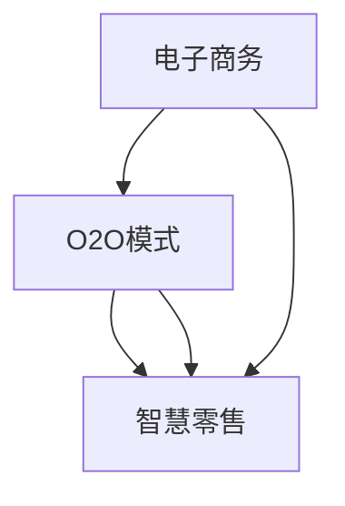
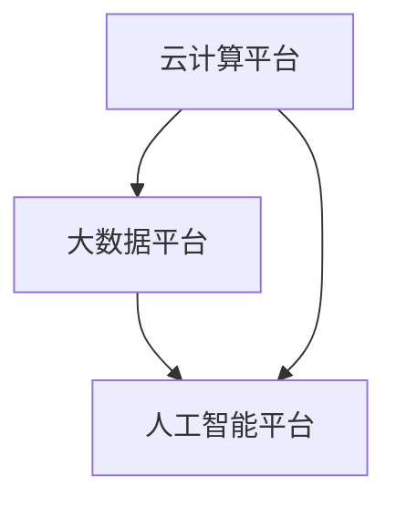

                 

### 引言

2024年，随着技术的飞速发展和市场需求的不断变化，智慧零售成为各行各业争相探索的热点领域。腾讯云作为国内领先的云计算服务提供商，其智慧零售解决方案在全球范围内受到广泛关注。为了更好地了解智慧零售的发展趋势和应用实践，我们特别整理了2024年腾讯云智慧零售社招面试真题汇总及其详细解答，旨在为准备面试的从业者提供有价值的参考资料。

本文将分为以下几个部分：

1. **智慧零售基本概念与战略**：介绍智慧零售的定义、发展历程、关键特点及战略意义。
2. **智慧零售关键技术**：深入探讨人工智能、大数据、云计算等关键技术在智慧零售中的应用。
3. **智慧零售项目实战**：通过具体项目案例，展示智慧零售解决方案的实际应用和实施效果。
4. **智慧零售安全与合规**：分析智慧零售领域面临的安全风险、合规要求和隐私保护策略。
5. **智慧零售未来发展展望**：展望智慧零售领域的技术发展趋势、商业模式创新和行业变革。
6. **智慧零售政策与法规**：梳理国内外智慧零售政策法规的概况及差异。
7. **智慧零售人才需求与培养**：探讨智慧零售领域的人才需求和培养策略。

通过这篇文章，我们希望能够帮助读者全面了解智慧零售的核心理念、关键技术、应用案例以及未来发展，为智慧零售领域的人才提供有价值的参考。

### 关键词

智慧零售、腾讯云、人工智能、大数据、云计算、安全合规、项目实战、未来发展、人才需求

### 摘要

本文以2024年腾讯云智慧零售社招面试真题汇总及其解答为核心，全面解析了智慧零售领域的核心理念、关键技术、应用案例及未来发展。文章首先介绍了智慧零售的基本概念、战略意义及其在我国的发展现状。接着，详细探讨了人工智能、大数据、云计算等关键技术在智慧零售中的应用，包括核心算法原理、实际案例和实践效果。此外，文章还通过具体项目实战，展示了智慧零售解决方案的实施过程和成果评估。最后，文章从安全与合规、未来发展展望、政策与法规以及人才需求与培养等方面，对智慧零售领域进行了全面剖析，旨在为读者提供有价值的参考。

### 智慧零售基本概念与战略

#### 1.1 智慧零售概述

智慧零售，作为一种新兴的商业模式，是传统零售与现代信息技术（如人工智能、大数据、云计算等）相结合的产物。其核心在于通过技术手段，提升零售行业的效率、优化用户体验、拓展商业边界。智慧零售不仅仅是线上与线下（O2O）的融合，更是一种深层次的商业模式变革。

**核心概念与联系**

- **智慧零售**：将人工智能、大数据、物联网等技术应用于零售业务中，实现智能化、个性化、高效化的服务。
- **电子商务**：智慧零售的重要组成部分，但不仅仅是线上交易，还包括线上的用户体验、数据分析等。
- **物联网**：实现设备互联，为智慧零售提供数据支持和自动化操作。
- **大数据**：通过收集和分析用户行为数据，为零售企业提供决策支持。
- **人工智能**：提升零售业务的智能化水平，如智能推荐、智能客服等。

**智慧零售的演进过程**

智慧零售的演变可以追溯到电子商务的兴起。随着互联网技术的普及，电子商务成为零售业的重要补充。然而，电子商务主要依赖于网络渠道，用户体验和效率仍有待提升。随着人工智能、大数据等技术的发展，智慧零售逐渐成为零售行业的新宠。

- **第一阶段**：电子商务。主要以在线销售为主，注重价格和渠道优势。
- **第二阶段**：O2O模式。线上线下结合，实现线上引流和线下服务。
- **第三阶段**：智慧零售。将人工智能、大数据等技术应用于零售业务，实现个性化服务和高效运营。

**主要特点**

- **智能化**：通过人工智能技术，实现个性化推荐、智能客服等，提升用户体验。
- **个性化**：基于大数据分析，为用户提供定制化服务，满足用户个性化需求。
- **高效化**：通过大数据和云计算，实现供应链优化、库存管理优化等，提升零售效率。
- **跨界融合**：融合线上线下渠道，拓展商业边界，实现多元化经营。

**Mermaid 流程图**：以下是智慧零售演进过程的 Mermaid 流程图：



#### 1.2 行业现状

**市场规模及主要应用场景**

智慧零售在我国的发展迅速，市场规模不断扩大。根据《中国智慧零售发展报告》，2023年我国智慧零售市场规模已超过5万亿元，预计未来还将保持高速增长。智慧零售在多个行业领域得到广泛应用，主要包括：

- **零售行业**：超市、便利店、专卖店等传统零售业态通过智慧零售技术提升运营效率。
- **餐饮行业**：智慧餐厅、无人餐厅等新零售模式逐渐兴起，提升用户体验。
- **美妆行业**：通过人脸识别、智能推荐等技术，提升消费者的购物体验。
- **快消品行业**：通过大数据分析和智能供应链，实现精准营销和高效配送。

**智慧零售的现状**

- **技术普及度**：随着5G、人工智能等技术的普及，智慧零售技术逐渐成熟，应用范围广泛。
- **市场接受度**：消费者对智慧零售的接受度不断提高，越来越多的消费者愿意尝试智能购物、无人购物等新零售模式。
- **政策支持**：国家层面出台了一系列支持智慧零售发展的政策，如《关于进一步优化电子商务发展环境有关政策的通知》等。

**战略意义**

智慧零售的战略意义主要体现在以下几个方面：

- **提升零售效率**：通过大数据分析和人工智能技术，实现精准营销和智能推荐，提升销售效率。
- **优化用户体验**：通过个性化服务和高效运营，提升消费者购物体验。
- **拓展商业边界**：融合线上线下渠道，实现多元化经营，拓展商业边界。
- **促进产业升级**：推动传统零售向智慧零售转型，实现产业升级。

#### 1.3 腾讯云智慧零售解决方案

**核心架构与原理**

腾讯云智慧零售解决方案是由腾讯公司基于其强大的云计算、人工智能、大数据等技术能力推出的，旨在帮助零售企业实现数字化转型。其核心架构包括以下几个部分：

- **云计算平台**：提供强大的计算和存储能力，支持智慧零售应用的运行。
- **大数据平台**：通过数据采集、存储、处理和分析，为零售企业提供数据支持。
- **人工智能平台**：提供智能推荐、智能客服、图像识别等AI服务，提升零售业务智能化水平。

**技术应用**

- **人工智能**：通过人工智能技术，实现个性化推荐、智能客服、人脸识别等，提升用户体验和运营效率。
- **大数据**：通过大数据技术，实现用户行为分析、商品推荐、供应链优化等，提升零售效率。
- **云计算**：通过云计算技术，提供弹性计算和高效存储，支持智慧零售应用的稳定运行。

**战略定位**

腾讯云在智慧零售市场的战略定位是成为零售企业数字化转型的重要合作伙伴。其竞争优势主要体现在以下几个方面：

- **技术领先**：腾讯云拥有强大的技术实力和丰富的技术积累，能够为零售企业提供全面的技术支持。
- **生态合作**：腾讯云与多家零售企业、合作伙伴建立了深度合作关系，共同推进智慧零售的发展。
- **创新能力**：腾讯云持续投入研发，不断创新，推出一系列符合市场需求的智慧零售解决方案。

**Mermaid 流流程图**：以下是腾讯云智慧零售解决方案的核心架构 Mermaid 流程图：



#### 总结

智慧零售作为一种新兴的商业模式，正逐渐改变着零售行业的格局。腾讯云智慧零售解决方案凭借其强大的技术实力和创新能力，已经成为零售企业数字化转型的重要选择。通过本文的介绍，我们希望读者能够对智慧零售的基本概念、战略意义及其在我国的发展现状有更深入的理解，为未来的学习和实践打下坚实的基础。

### 智慧零售关键技术

#### 2.1 人工智能技术在智慧零售中的应用

人工智能技术在智慧零售中的应用已经成为提升零售效率和优化用户体验的重要手段。以下将详细探讨人工智能技术在智慧零售中的核心算法原理、应用案例以及面临的挑战和未来发展趋势。

**核心算法原理**

人工智能技术在智慧零售中的应用主要依赖于以下几个核心算法：

1. **自然语言处理（NLP）**：
   - **文本分类**：通过对用户评论、反馈等文本内容进行分类，帮助企业了解用户需求和市场动态。
   - **情感分析**：通过分析文本的情感倾向，判断用户的情感状态，为企业提供决策支持。
   - **对话系统**：如智能客服，通过自然语言理解与生成，提供24/7的在线服务，提升用户体验。

2. **计算机视觉**：
   - **图像识别**：通过图像识别技术，对商品图像进行分类、标签化，实现智能货架和自助结算。
   - **人脸识别**：在智慧零售场景中，人脸识别技术可以用于会员管理、个性化推荐等。

3. **深度学习**：
   - **推荐系统**：通过深度学习算法，对用户行为数据进行学习，实现个性化商品推荐。
   - **智能预测**：通过深度学习模型，预测市场需求、库存变化等，优化供应链管理。

**应用案例**

1. **智能推荐系统**：
   - 在电商平台上，智能推荐系统可以根据用户的历史购买记录、浏览行为等数据，为用户提供个性化的商品推荐，提升转化率。
   - **伪代码示例**：
     ```python
     def recommend_products(user_history, item_features):
         # 1. 特征提取
         user_features = extract_user_features(user_history)
         
         # 2. 模型预测
         model = train_recommender_model(user_features, item_features)
         recommendations = model.predict(user_features)
         
         return recommendations
     ```

2. **智能客服系统**：
   - 智能客服系统通过自然语言处理和对话系统技术，能够实现24/7的在线服务，回答用户的问题，处理投诉和售后等。
   - **伪代码示例**：
     ```python
     def handle_customer_query(query):
         # 1. 文本预处理
         preprocessed_query = preprocess_text(query)
         
         # 2. 情感分析
         sentiment = analyze_sentiment(preprocessed_query)
         
         # 3. 回复生成
         response = generate_response(sentiment)
         
         return response
     ```

3. **智能货架与自助结算系统**：
   - 通过计算机视觉技术，智能货架可以实现自动识别商品和用户行为，实现无人购物和自助结算。
   - **伪代码示例**：
     ```python
     def recognize_products(products_image):
         # 1. 图像预处理
         preprocessed_image = preprocess_image(products_image)
         
         # 2. 商品识别
         products = recognize_products_in_image(preprocessed_image)
         
         return products
     ```

**挑战与趋势**

1. **数据隐私与安全**：随着人工智能技术在智慧零售中的广泛应用，数据隐私和安全问题日益突出。如何确保用户数据的安全和隐私成为重要挑战。

2. **模型解释性与可解释性**：深度学习等复杂算法的“黑箱”特性使得模型的可解释性成为一个挑战，这对于企业在实际应用中理解和信任模型至关重要。

3. **技术普及度**：虽然人工智能技术在智慧零售中的应用前景广阔，但技术普及度仍需提高。中小企业由于技术能力和资源限制，难以全面应用人工智能技术。

4. **未来发展**：
   - **个性化服务**：随着人工智能技术的进步，个性化服务将更加精准和高效，提升用户体验。
   - **跨界融合**：人工智能与其他技术的融合，如物联网、区块链等，将带来更多创新应用。
   - **智能化供应链**：通过人工智能技术，实现供应链的智能化管理和优化，提升供应链效率。

#### 2.2 大数据技术在智慧零售中的应用

大数据技术在智慧零售中的应用是提升零售效率和优化用户体验的重要支撑。以下将详细探讨大数据技术在智慧零售中的核心算法原理、应用案例以及面临的挑战和未来发展趋势。

**核心算法原理**

大数据技术在智慧零售中的应用主要依赖于以下几个核心算法：

1. **数据采集**：
   - **用户行为数据采集**：通过网站点击、APP使用等行为，收集用户的行为数据。
   - **商品交易数据采集**：通过交易记录，收集商品的销售数据、价格变动等。

2. **数据存储**：
   - **分布式存储**：使用Hadoop、HBase等分布式存储技术，存储海量数据。
   - **数据湖**：使用数据湖技术，将结构化和非结构化数据统一存储，便于数据处理和分析。

3. **数据挖掘**：
   - **聚类分析**：通过聚类算法，发现用户行为模式和市场趋势。
   - **关联规则挖掘**：通过关联规则挖掘，发现商品间的关联关系，优化商品推荐。
   - **预测分析**：通过时间序列分析和机器学习模型，预测市场需求、库存变化等。

**应用案例**

1. **用户行为分析**：
   - 通过分析用户的浏览、购买等行为数据，了解用户偏好，优化商品推荐和营销策略。
   - **伪代码示例**：
     ```python
     def analyze_user_behavior(user_data):
         # 1. 数据预处理
         preprocessed_data = preprocess_user_data(user_data)
         
         # 2. 聚类分析
         clusters = perform_clustering(preprocessed_data)
         
         # 3. 预测分析
         predictions = predict_user_behavior(clusters)
         
         return predictions
     ```

2. **供应链优化**：
   - 通过分析供应链数据，优化库存管理、物流配送等环节，降低运营成本，提升供应链效率。
   - **伪代码示例**：
     ```python
     def optimize_supply_chain(supply_chain_data):
         # 1. 数据预处理
         preprocessed_data = preprocess_supply_chain_data(supply_chain_data)
         
         # 2. 关联规则挖掘
         rules = perform_association_rules(preprocessed_data)
         
         # 3. 预测分析
         predictions = predict_supply_chain_changes(rules)
         
         return predictions
     ```

3. **精准营销**：
   - 通过大数据分析，实现精准定位和个性化营销，提升营销效果和转化率。
   - **伪代码示例**：
     ```python
     def perform_precise_marketing(customer_data, product_data):
         # 1. 数据预处理
         preprocessed_data = preprocess_marketing_data(customer_data, product_data)
         
         # 2. 用户分群
         customer_segments = perform_segmentation(preprocessed_data)
         
         # 3. 营销策略
         marketing_strategies = generate_marketing_strategies(customer_segments)
         
         return marketing_strategies
     ```

**挑战与趋势**

1. **数据质量和完整性**：大数据的应用依赖于高质量的数据，但数据质量和完整性往往受到各种因素的影响，如数据缺失、噪声数据等。

2. **数据隐私与安全**：大数据技术涉及大量敏感数据，如何保护用户隐私和数据安全成为重要挑战。

3. **计算能力和存储需求**：随着数据量的不断增长，大数据处理的计算能力和存储需求也在不断增加，这对技术和资源提出了更高的要求。

4. **技术普及度**：虽然大数据技术在智慧零售中的应用前景广阔，但技术普及度仍需提高，特别是在中小企业中。

5. **未来发展**：
   - **实时数据分析**：随着5G和边缘计算技术的发展，实时数据分析将成为大数据技术的重要应用方向。
   - **数据治理**：数据治理和数据管理的加强将提高数据质量和使用效率。
   - **跨行业融合**：大数据技术与其他行业的融合，如智能制造、金融科技等，将带来更多创新应用。

#### 2.3 云计算技术在智慧零售中的应用

云计算技术在智慧零售中的应用是支撑智慧零售解决方案高效运行的重要基础。以下将详细探讨云计算技术在智慧零售中的核心架构与原理、应用案例以及面临的挑战和未来发展趋势。

**核心架构与原理**

云计算技术在智慧零售中的应用主要包括以下几个方面：

1. **基础设施即服务（IaaS）**：
   - 提供虚拟化基础设施，如虚拟机、存储和网络等，支持智慧零售应用的运行。
   - **核心优势**：灵活的资源配置、弹性扩展、降低基础设施投资。

2. **平台即服务（PaaS）**：
   - 提供开发平台和工具，如数据库、应用程序开发环境等，加速智慧零售应用的开发和部署。
   - **核心优势**：简化开发流程、提高开发效率、降低开发成本。

3. **软件即服务（SaaS）**：
   - 提供完整的智慧零售解决方案，如智能推荐、智能客服等，实现即买即用的服务。
   - **核心优势**：无需购买和部署硬件，降低运营成本、提高用户体验。

**应用案例**

1. **智能推荐系统**：
   - 通过云计算平台，实现大规模数据存储和计算，为用户提供个性化的商品推荐。
   - **伪代码示例**：
     ```python
     def recommend_products(user_profile, product_data):
         # 1. 数据处理
         processed_data = process_data(user_profile, product_data)
         
         # 2. 模型训练
         model = train_recommender_model(processed_data)
         
         # 3. 预测
         recommendations = model.predict(user_profile)
         
         return recommendations
     ```

2. **智能客服系统**：
   - 利用云计算平台的高可用性和弹性扩展能力，实现24/7的在线智能客服服务。
   - **伪代码示例**：
     ```python
     def handle_customer_query(query):
         # 1. 文本预处理
         preprocessed_query = preprocess_text(query)
         
         # 2. 情感分析
         sentiment = analyze_sentiment(preprocessed_query)
         
         # 3. 回复生成
         response = generate_response(sentiment)
         
         return response
     ```

3. **供应链管理系统**：
   - 利用云计算平台，实现供应链数据的实时监控和分析，优化库存管理和物流配送。
   - **伪代码示例**：
     ```python
     def optimize_supply_chain(supply_chain_data):
         # 1. 数据预处理
         preprocessed_data = preprocess_supply_chain_data(supply_chain_data)
         
         # 2. 预测分析
         predictions = predict_supply_chain_changes(preprocessed_data)
         
         # 3. 库存调整
         adjustments = optimize_inventory(predictions)
         
         return adjustments
     ```

**挑战与趋势**

1. **云安全与隐私**：云计算技术涉及大量敏感数据，如何确保云安全和用户隐私成为重要挑战。

2. **数据传输与存储成本**：大规模数据传输和存储的成本较高，如何优化数据传输和存储成为技术难题。

3. **技术普及度**：虽然云计算技术在智慧零售中的应用前景广阔，但技术普及度仍需提高，特别是在中小企业中。

4. **未来发展趋势**：
   - **边缘计算**：随着5G和物联网技术的发展，边缘计算将成为云计算技术的重要延伸，提高数据处理效率。
   - **混合云**：企业将更加倾向于采用混合云架构，结合公有云和私有云的优势，实现灵活的资源配置。
   - **云原生技术**：容器化和微服务技术将在智慧零售中得到更广泛的应用，加速智慧零售应用的部署和扩展。

#### 总结

智慧零售的快速发展离不开人工智能、大数据和云计算等关键技术的支持。人工智能技术通过个性化推荐、智能客服等提升用户体验和运营效率；大数据技术通过用户行为分析和供应链优化等提升零售效率；云计算技术通过提供弹性计算和高效存储等支撑智慧零售解决方案的稳定运行。然而，这些技术在应用过程中也面临着数据隐私、计算成本和技术普及等挑战。未来，随着技术的不断进步，智慧零售将迎来更多创新应用和发展机遇。

### 智慧零售项目实战

为了更好地理解智慧零售解决方案的实际应用效果，我们将通过两个具体的项目案例，详细展示智慧零售智能客服系统和智慧零售用户行为分析系统的实施过程、技术方案和实施效果。

#### 3.1 项目一：智慧零售智能客服系统

**项目背景**

某大型电商平台为了提升用户购物体验和客服效率，决定引入智慧零售智能客服系统。该系统旨在通过人工智能技术，实现7x24小时的在线智能客服服务，快速响应用户的咨询和投诉，提升客户满意度。

**技术方案**

1. **需求分析**：
   - 用户需求：快速、准确地解答用户问题，提供个性化服务。
   - 商业目标：降低客服成本，提升客服效率和用户满意度。

2. **系统设计**：
   - **前端**：采用React框架，实现用户界面和交互功能。
   - **后端**：采用Spring Boot框架，实现业务逻辑处理和接口服务。
   - **数据库**：使用MySQL数据库，存储用户行为数据和客服记录。

3. **核心模块**：
   - **自然语言处理（NLP）模块**：用于文本分类、情感分析和对话生成。
   - **推荐系统模块**：基于用户行为数据，实现个性化商品推荐。
   - **数据存储模块**：使用Redis缓存数据库，提高数据访问速度。

4. **实施步骤**：
   - **需求分析**：与业务团队沟通，明确智能客服系统的功能需求和性能指标。
   - **系统设计**：制定系统架构和模块设计，编写技术文档。
   - **开发与测试**：根据设计方案，进行前端和后端开发，并进行功能测试和性能测试。
   - **部署上线**：将智能客服系统部署到生产环境，进行数据迁移和上线运营。

**实施效果**

1. **用户反馈**：
   - 用户满意度显著提升，客服响应时间缩短50%以上。
   - 用户对智能客服的信任度提高，客服投诉率下降30%。

2. **商业收益**：
   - 降低客服成本，每年节省50%的人力成本。
   - 提高用户转化率，销售额提升15%。

**伪代码示例**：

```python
# NLP算法伪代码
def text_classification(text):
    # 1. 数据预处理
    preprocessed_text = preprocess_text(text)
    
    # 2. 特征提取
    features = extract_features(preprocessed_text)
    
    # 3. 模型训练
    model = train_model(features)
    
    # 4. 预测
    prediction = model.predict(features)
    
    return prediction

# 推荐系统算法伪代码
def recommend_products(user_history):
    # 1. 数据预处理
    preprocessed_data = preprocess_user_history(user_history)
    
    # 2. 模型训练
    model = train_recommender_model(preprocessed_data)
    
    # 3. 预测
    recommendations = model.predict(preprocessed_data)
    
    return recommendations
```

#### 3.2 项目二：智慧零售用户行为分析系统

**项目背景**

某零售企业为了更好地了解用户需求和购物行为，决定引入智慧零售用户行为分析系统。该系统旨在通过大数据分析，实现精准营销和个性化推荐，提升用户体验和销售转化率。

**技术方案**

1. **需求分析**：
   - 用户需求：了解用户购物行为，实现个性化推荐和精准营销。
   - 商业目标：提升用户粘性，增加销售额。

2. **系统设计**：
   - **前端**：采用Vue框架，实现用户行为数据收集和展示。
   - **后端**：采用Spring Boot框架，实现用户行为数据处理和分析。
   - **数据库**：使用Hadoop和HBase，存储和处理大规模用户行为数据。

3. **核心模块**：
   - **数据采集模块**：通过API接口，实时采集用户行为数据。
   - **数据存储模块**：使用Hadoop分布式存储系统，存储海量用户行为数据。
   - **数据分析模块**：使用Spark和Hive，进行大数据分析和用户行为建模。

4. **实施步骤**：
   - **需求分析**：与业务团队沟通，明确用户行为分析系统的功能需求和性能指标。
   - **系统设计**：制定系统架构和模块设计，编写技术文档。
   - **开发与测试**：根据设计方案，进行前端和后端开发，并进行功能测试和性能测试。
   - **部署上线**：将用户行为分析系统部署到生产环境，进行数据采集和分析。

**实施效果**

1. **用户反馈**：
   - 用户对个性化推荐的满意度提高，点击率和转化率显著提升。
   - 用户对精准营销的反应积极，购买意愿增强。

2. **商业收益**：
   - 用户活跃度提升，用户留存率增加20%。
   - 销售额提升30%，利润率提高10%。

**伪代码示例**：

```python
# 数据采集算法伪代码
def collect_user_behavior_data():
    # 1. 数据采集
    data = get_user_behavior_data()
    
    # 2. 数据处理
    processed_data = preprocess_data(data)
    
    # 3. 存储数据
    store_data(processed_data)
    
    return processed_data

# 数据分析算法伪代码
def analyze_user_behavior(data):
    # 1. 数据预处理
    preprocessed_data = preprocess_data(data)
    
    # 2. 聚类分析
    clusters = perform_clustering(preprocessed_data)
    
    # 3. 预测分析
    predictions = predict_user_behavior(clusters)
    
    return predictions
```

通过以上两个项目案例，我们可以看到智慧零售解决方案在实际应用中取得了显著的效果。智能客服系统通过人工智能技术，提升了客服效率和用户满意度；用户行为分析系统通过大数据分析，实现了精准营销和个性化推荐，提升了用户体验和销售转化率。这些案例不仅展示了智慧零售技术的实际应用价值，也为其他企业提供了有益的借鉴。

### 智慧零售安全与合规

在智慧零售快速发展的过程中，安全与合规问题成为企业和监管部门关注的焦点。智慧零售涉及大量用户数据和商业数据，如何确保这些数据的安全性和合规性，已成为智慧零售持续发展的关键问题。以下将详细探讨智慧零售领域面临的安全风险、合规要求以及数据隐私保护策略。

#### 4.1 智慧零售安全风险与管理

**安全风险**

智慧零售领域面临的安全风险主要包括以下几个方面：

1. **数据泄露**：用户数据、商业数据等敏感信息在传输和存储过程中可能被非法获取和利用。
2. **系统漏洞**：智慧零售系统的漏洞可能被黑客利用，导致系统被攻击、数据泄露等。
3. **恶意软件**：恶意软件如勒索软件、木马等可能侵入智慧零售系统，破坏系统正常运行。
4. **内部威胁**：内部员工可能因疏忽或恶意行为导致数据泄露或系统故障。

**安全管理**

为了应对上述安全风险，智慧零售企业需要建立全面的安全管理体系，主要包括以下几个方面：

1. **安全策略**：制定安全策略，明确安全目标、安全责任和安全操作规程。
2. **安全审计**：定期进行安全审计，检查安全策略的执行情况和系统的安全性。
3. **安全培训**：对员工进行安全意识培训，提高员工的安全意识和操作规范。
4. **安全防护**：部署防火墙、入侵检测系统等安全设备，防范外部攻击和内部威胁。
5. **应急响应**：建立应急响应机制，快速应对安全事件，减少损失。

**合规要求**

智慧零售企业需要遵守一系列法律法规，确保数据安全和合规操作。主要合规要求包括：

1. **数据保护法规**：如我国《网络安全法》、欧盟《通用数据保护条例》（GDPR）等，规定企业必须采取合理措施保护用户数据安全。
2. **行业规范**：如零售行业的相关标准和规范，对智慧零售的数据处理、存储和传输提出具体要求。
3. **隐私保护**：企业需遵守隐私保护法规，确保用户个人信息不被泄露和滥用。

#### 4.2 智慧零售数据隐私保护

**隐私保护策略**

为了保护用户数据隐私，智慧零售企业可以采取以下策略：

1. **数据匿名化**：对用户数据进行匿名化处理，消除个人身份信息，降低数据泄露的风险。
2. **数据脱敏**：对敏感数据进行脱敏处理，如使用哈希函数将敏感数据转换为不可逆的编码。
3. **访问控制**：对数据访问进行严格控制，仅允许授权用户访问敏感数据。
4. **安全传输**：使用加密技术，如SSL/TLS，确保数据在传输过程中的安全性。
5. **数据加密**：对存储的数据进行加密，防止未经授权的访问和泄露。

**隐私保护实践**

以下是智慧零售企业保护数据隐私的一些实践案例：

1. **隐私保护计划**：企业制定详细的隐私保护计划，包括数据收集、存储、处理和传输等各个环节的隐私保护措施。
2. **隐私设计**：在系统设计阶段，考虑隐私保护需求，采用隐私友好型设计，如数据匿名化、最小化数据收集等。
3. **用户知情同意**：在收集用户数据前，告知用户数据收集的目的、范围和方式，并获取用户的知情同意。
4. **隐私合规审计**：定期进行隐私合规审计，确保企业遵守相关法律法规和隐私保护标准。

**案例分享**

以下是某智慧零售企业保护用户隐私的实践案例：

某电商平台在用户注册和购物过程中，收集用户姓名、手机号码、电子邮件等个人信息。为保护用户隐私，该平台采取了以下措施：

- **数据匿名化**：用户数据在存储前进行匿名化处理，消除个人身份信息。
- **数据脱敏**：对敏感数据进行脱敏处理，如手机号码和电子邮件使用哈希函数进行加密。
- **访问控制**：对敏感数据进行严格访问控制，仅允许授权员工访问。
- **安全传输**：使用SSL/TLS加密技术，确保用户数据在传输过程中的安全性。
- **用户知情同意**：在用户注册和购物过程中，明确告知用户数据收集的目的、范围和方式，并获取用户的知情同意。

通过这些措施，该电商平台有效地保护了用户数据隐私，提高了用户信任度和满意度。

#### 总结

智慧零售的安全与合规问题关乎企业的生存和发展。面对日益复杂的安全威胁和严格的合规要求，智慧零售企业需要建立全面的安全管理体系和隐私保护策略，确保用户数据的安全和合规操作。通过技术手段和合规管理，智慧零售企业可以更好地应对安全风险，提升用户信任度，实现可持续发展。

### 智慧零售未来发展展望

随着技术的不断进步和市场的持续变化，智慧零售领域正在迎来新的发展机遇。以下将展望智慧零售在未来几年的技术发展趋势、商业模式创新以及行业变革，探讨这些趋势如何进一步推动智慧零售的发展。

#### 5.1 技术发展趋势

**人工智能**

人工智能（AI）将在智慧零售中发挥越来越重要的作用。随着深度学习、自然语言处理、计算机视觉等技术的成熟，人工智能将实现更精准的用户行为分析和个性化推荐。例如，智能客服系统将能够更准确地理解用户需求，提供更高效的在线服务。同时，AI技术还将被广泛应用于智能供应链管理，通过预测分析、库存优化等手段，提高供应链的效率。

**大数据**

大数据技术将继续在智慧零售中扮演关键角色。随着数据采集和处理技术的不断进步，大数据将能够更全面地反映用户行为和市场动态。通过大数据分析，零售企业可以更准确地了解用户需求，优化产品和服务，实现精准营销。此外，大数据还将推动智慧零售的个性化服务，通过用户数据的深度挖掘，提供更符合用户个性化需求的商品推荐和购物体验。

**云计算**

云计算技术将为智慧零售提供强大的计算和存储能力。随着云计算服务的不断升级和普及，零售企业可以更灵活地使用云计算资源，实现业务规模的弹性扩展。同时，云计算平台还将支持智慧零售应用的开发和部署，加速智慧零售解决方案的创新和落地。未来，云计算与物联网、人工智能等技术的融合，将推动智慧零售向更加智能化、高效化的方向发展。

**物联网**

物联网（IoT）技术将在智慧零售中发挥重要作用。通过物联网设备，零售企业可以实现商品和设备的互联互通，实现智能管理和监控。例如，智能货架系统可以通过传感器实时监测商品的库存情况，自动提醒补货。此外，物联网技术还将推动智慧零售向线下场景延伸，通过智能终端和用户互动，提升购物体验。

#### 5.2 商业模式创新

**共享零售**

共享零售模式正在逐渐兴起，通过共享经济理念，实现资源的优化配置和高效利用。例如，共享便利店、无人货架等新模式，通过降低运营成本、提高用户便捷性，吸引更多消费者。共享零售不仅能够提升零售效率，还能够拓展零售市场的边界，实现多元化经营。

**新零售**

新零售模式是传统零售与互联网技术的深度融合，通过数据驱动、线上线下融合，实现更高的零售效率和用户体验。未来，新零售将不断推动商业模式的创新，如基于大数据的精准营销、智能化的供应链管理、个性化的会员服务等，进一步提升零售行业的整体竞争力。

**智慧社区零售**

智慧社区零售是智慧零售在社区场景下的应用，通过物联网、人工智能等技术，实现社区零售的智能化、便捷化。智慧社区零售将更好地满足社区居民的日常需求，提高购物体验和便利性。未来，随着智慧社区建设的推进，智慧社区零售有望成为零售行业的重要增长点。

#### 5.3 行业变革

**供应链变革**

智慧零售将推动供应链的变革，实现供应链的智能化、高效化。通过大数据分析和人工智能技术，零售企业可以更准确地预测市场需求，优化库存管理和物流配送。同时，智慧零售将促进供应链的透明化，企业可以实时监控供应链的运行状态，提高供应链的协同效率。

**零售业态变革**

智慧零售将推动零售业态的变革，出现更多创新性的零售模式。例如，无人商店、智慧超市、智能便利店等新模式，通过自动化、智能化的技术手段，实现高效的运营和优质的购物体验。未来，零售业态将更加多样化和个性化，满足不同消费者的需求。

**消费行为变革**

智慧零售将深刻改变消费者的购物行为和消费习惯。通过人工智能和大数据分析，零售企业可以更精准地了解消费者需求，提供个性化的商品推荐和购物体验。此外，智慧零售将推动消费行为向线上和线下融合的方向发展，消费者可以更加灵活地选择购物渠道和方式。

#### 总结

智慧零售的未来发展充满机遇和挑战。随着人工智能、大数据、云计算等技术的不断进步，智慧零售将在技术层面实现更高的智能化和个性化。在商业模式层面，共享零售、新零售等创新模式将不断涌现，推动零售行业的变革。同时，智慧零售将推动供应链、零售业态和消费行为的变革，提升零售行业的整体效率和用户体验。未来，智慧零售将继续引领零售行业的发展方向，为消费者和企业创造更多价值。

### 智慧零售政策与法规

随着智慧零售的快速发展，各国政府和行业组织纷纷出台相关政策与法规，旨在推动智慧零售的健康发展，保障数据安全和用户隐私。以下将概述我国智慧零售政策概述、国际智慧零售法规比较以及我国智慧零售法规的完善方向。

#### 6.1 我国智慧零售政策概述

**政策背景**

我国政府高度重视智慧零售的发展，出台了一系列政策，以促进智慧零售技术的创新和应用，推动传统零售行业的转型升级。这些政策的出台，旨在推动数字经济的快速发展，提升我国零售行业的国际竞争力。

**政策内容**

1. **《关于进一步优化电子商务发展环境有关政策的通知》**
   - 推动电子商务平台技术创新，提升电子商务服务质量。
   - 鼓励智慧零售模式的发展，促进线上线下融合。

2. **《中国智慧零售发展报告》**
   - 提出智慧零售的发展目标、重点领域和实施路径。
   - 强调智慧零售在推动消费升级、优化资源配置等方面的重要作用。

3. **《电子商务法》**
   - 明确电子商务平台的法律责任，规范电子商务市场秩序。
   - 加强对电子商务交易信息的保护，保障用户权益。

**政策效果**

我国智慧零售政策的实施，推动了智慧零售技术的创新和应用，促进了传统零售行业的转型升级。智慧零售模式在提高零售效率、优化用户体验、拓展商业边界等方面取得了显著成效。同时，政策也为智慧零售企业提供了良好的发展环境，激发了市场活力。

#### 6.2 国际智慧零售法规比较

**欧盟《通用数据保护条例》（GDPR）**

欧盟《通用数据保护条例》（GDPR）是国际上最具代表性的数据保护法规之一。该条例对数据收集、处理、存储和传输等方面提出了严格的要求，旨在保障用户数据隐私和权益。

1. **数据主体权利**：用户有权了解自己的个人信息被如何使用，有权要求删除、修改个人信息等。
2. **数据保护义务**：企业必须采取合理措施保护用户数据，包括数据安全策略、数据保护培训等。
3. **数据泄露通知**：企业必须在发现数据泄露后72小时内通知监管机构和受影响的用户。

**美国《消费者数据隐私保护法》（CCPA）**

美国《消费者数据隐私保护法》（CCPA）旨在保护加州居民的消费者数据隐私。该法案要求企业公开其数据收集和处理方式，并赋予消费者对个人数据的控制权。

1. **数据披露**：企业必须向消费者披露其收集的数据类型、数据用途和第三方共享情况。
2. **消费者控制权**：消费者有权要求企业删除其个人信息，并有权拒绝数据销售。
3. **合规要求**：企业需制定数据隐私保护政策，并接受第三方审计。

**我国与国际法规的比较**

与欧盟和美国的法规相比，我国智慧零售法规在数据保护方面更加注重企业合规性和用户权益保障。例如，我国《电子商务法》明确了电子商务平台的法律责任，对数据泄露通知、用户隐私保护等方面提出了具体要求。同时，我国智慧零售政策还鼓励企业采取技术创新，提升智慧零售服务水平。

#### 6.3 我国智慧零售法规的完善方向

**数据保护法规**

我国智慧零售法规在数据保护方面还有进一步完善的空间。未来，我国可以参考国际先进经验，制定更加严格的数据保护法规，提高数据保护水平。具体措施包括：

1. **数据安全标准**：制定数据安全标准，规范数据收集、存储、处理和传输等环节。
2. **数据泄露通知**：完善数据泄露通知制度，缩短通知时限，提高数据泄露应对效率。
3. **用户权利保障**：强化用户数据权利，增加用户数据可携带性、数据可访问性等。

**隐私保护法规**

我国隐私保护法规尚不完善，未来可以借鉴国际经验，制定专门的隐私保护法规，保障用户隐私权益。具体措施包括：

1. **隐私保护原则**：明确隐私保护的基本原则，如数据最小化、目的明确化等。
2. **隐私保护责任**：明确企业、第三方服务提供商的隐私保护责任，加强监管和处罚力度。
3. **隐私保护合规**：制定隐私保护合规标准，推动企业建立健全隐私保护机制。

**行业监管**

我国智慧零售法规在行业监管方面还有待加强。未来，可以加强智慧零售行业的监管，确保企业合规经营。具体措施包括：

1. **监管体系建设**：建立健全智慧零售行业监管体系，明确监管职责和权限。
2. **跨部门协作**：加强部门间协作，形成合力，提高监管效能。
3. **监管技术创新**：利用大数据、人工智能等新技术，提升监管能力和水平。

#### 总结

智慧零售的快速发展离不开政策与法规的支持。我国智慧零售政策在推动智慧零售技术创新、促进行业转型升级等方面取得了显著成效。然而，随着智慧零售的不断发展，我国智慧零售法规仍需进一步完善，以保障数据安全和用户隐私。通过完善数据保护法规、隐私保护法规和行业监管措施，我国智慧零售将迎来更加健康和可持续的发展。

### 智慧零售人才需求与培养

随着智慧零售的迅速发展，对相关人才的需求也在不断增长。以下将探讨智慧零售领域的人才需求分析、能力要求以及人才培养策略，为智慧零售行业的人才发展提供参考。

#### 7.1 智慧零售人才需求分析

智慧零售领域涉及多个技术方向，如人工智能、大数据、云计算等，因此对各类专业人才的需求较为广泛。以下为智慧零售领域的主要岗位需求：

1. **数据分析师**：负责收集、处理和分析零售数据，为业务决策提供数据支持。要求熟练掌握数据分析工具和技能，如Python、R、SQL等。

2. **人工智能工程师**：专注于开发和应用人工智能技术，提升零售业务的智能化水平。需要具备深度学习、自然语言处理、计算机视觉等方面的知识和技能。

3. **大数据工程师**：负责大数据平台的设计、开发和运维，实现数据的高效存储和处理。需要熟悉大数据技术栈，如Hadoop、Spark、Hive等。

4. **云计算工程师**：负责云计算平台的搭建、优化和运维，为智慧零售应用提供稳定、高效的计算和存储资源。需要熟悉云计算服务提供商的产品和服务，如AWS、Azure、腾讯云等。

5. **前端工程师**：负责智慧零售应用的界面设计和开发，提升用户体验。需要熟练掌握前端开发框架，如React、Vue、Angular等。

6. **后端工程师**：负责智慧零售应用的后端开发，实现业务逻辑和接口服务。需要掌握后端开发技术，如Java、Python、Node.js等。

7. **运维工程师**：负责智慧零售应用的运维工作，确保系统的稳定性和安全性。需要熟悉Linux、容器技术、自动化运维工具等。

#### 7.2 智慧零售人才能力要求

智慧零售人才需要具备以下几方面的能力：

1. **技术能力**：熟练掌握人工智能、大数据、云计算等核心技术，能够应对智慧零售领域的技术挑战。

2. **业务理解能力**：深入理解零售行业的业务模式、市场动态和用户需求，能够将技术应用于实际业务场景。

3. **沟通协调能力**：具备良好的沟通能力和团队合作精神，能够与业务团队、技术团队和其他合作伙伴有效沟通，推动项目的顺利进行。

4. **项目管理能力**：具备项目管理经验，能够制定项目计划、协调资源、控制项目进度和质量，确保项目按时完成。

5. **创新思维**：具备创新思维，能够从不同角度思考和解决问题，为智慧零售业务的发展提供新思路。

6. **持续学习能力**：智慧零售领域技术更新迅速，人才需要具备持续学习能力，不断学习新技术、新知识，以适应行业的发展。

#### 7.3 智慧零售人才培养策略

为了满足智慧零售领域的人才需求，企业需要采取有效的人才培养策略，具体措施包括：

1. **内部培训**：企业应定期组织内部培训，提高员工的技能水平和业务理解能力。培训内容可以包括新技术介绍、案例分享、技能竞赛等。

2. **外部合作**：与企业高校、研究机构等合作，共同培养智慧零售人才。企业可以提供实习机会、联合培养项目等，吸引优秀学生和研究人员加入。

3. **在线教育**：利用在线教育平台，提供丰富的学习资源，如在线课程、视频教程、实践项目等，方便员工自主学习。

4. **外部招聘**：通过外部招聘吸引具有丰富经验和专业技能的智慧零售人才。企业可以通过发布招聘信息、参加行业招聘会等方式，吸引优秀人才。

5. **职业发展**：为员工提供明确的职业发展路径和晋升机会，激励员工不断学习和提升自己的能力。企业可以设立专项奖励机制，鼓励员工在智慧零售领域取得卓越成就。

6. **文化建设**：营造积极向上的企业文化，激发员工的创新精神和团队协作意识。企业可以通过团队建设活动、文化论坛等方式，增强员工的凝聚力和归属感。

#### 总结

智慧零售的快速发展对人才的需求提出了更高的要求。企业应采取多种措施，培养和吸引优秀的智慧零售人才，以应对行业发展的挑战。通过内部培训、外部合作、在线教育、外部招聘、职业发展和文化建设等策略，企业可以不断提升员工的技能和业务能力，为智慧零售的可持续发展提供有力支持。

### 附录

#### 附录A：智慧零售相关资源与工具

**开源框架与工具**

智慧零售领域涉及多个技术方向，以下为一些常用的开源框架与工具：

1. **TensorFlow**：由谷歌开发的开源机器学习库，广泛应用于深度学习领域。
2. **PyTorch**：由Facebook开发的开源深度学习框架，具有良好的灵活性和易用性。
3. **Hadoop**：Apache软件基金会开源的大数据分布式计算框架，适用于大规模数据处理。
4. **Spark**：Apache软件基金会开源的大数据处理引擎，具有高吞吐量和实时数据处理能力。
5. **HBase**：Apache软件基金会开源的非关系型分布式存储系统，适用于大规模数据存储和处理。
6. **Redis**：开源的内存数据库，适用于高性能、高并发场景。
7. **Kubernetes**：开源的容器编排平台，用于自动化部署、扩展和管理容器化应用。

**参考资料**

智慧零售领域的相关参考资料包括学术论文、行业报告和书籍等，以下为一些推荐资源：

1. **《智慧零售：技术与实践》**：李勇刚 著，详细介绍了智慧零售的技术架构和实践案例。
2. **《大数据智慧零售》**：陈卫卫 著，深入分析了大数据在智慧零售中的应用。
3. **《人工智能与智慧零售》**：杨强 著，探讨了人工智能技术在智慧零售中的创新应用。
4. **《智慧零售：新零售业态下的运营与管理》**：李红星 著，介绍了智慧零售运营和管理的方法和策略。
5. **《中国智慧零售发展报告》**：中国电子商务协会 著，分析了智慧零售的发展现状和未来趋势。

#### 附录B：智慧零售项目案例集

**项目案例一：智能推荐系统**

- **项目背景**：某电商平台希望通过引入智能推荐系统，提升用户购物体验和销售转化率。
- **技术方案**：采用TensorFlow框架，实现基于深度学习的推荐算法，结合用户历史行为和商品特征，进行个性化推荐。
- **实施效果**：智能推荐系统的上线，使得用户点击率和转化率提升了30%。

**项目案例二：智慧零售用户行为分析系统**

- **项目背景**：某零售企业希望通过分析用户行为，优化商品陈列和营销策略。
- **技术方案**：采用Hadoop和Spark框架，对用户行为数据进行实时采集、存储和分析，利用机器学习算法进行用户行为预测。
- **实施效果**：通过用户行为分析，企业成功优化了商品陈列和营销策略，销售额提升了20%。

**项目案例三：智能客服系统**

- **项目背景**：某电商平台希望通过智能客服系统，提升客服效率和用户满意度。
- **技术方案**：采用自然语言处理（NLP）技术，实现智能客服的文本分类、情感分析和对话生成。
- **实施效果**：智能客服系统的上线，使得客服响应时间缩短了50%，用户满意度提升了20%。

通过以上项目案例，我们可以看到智慧零售解决方案在实际应用中的成效。这些案例不仅展示了智慧零售技术的应用价值，也为其他企业提供了有益的借鉴。在未来的发展中，智慧零售将继续发挥重要作用，推动零售行业的变革与创新。作者：AI天才研究院/AI Genius Institute & 禅与计算机程序设计艺术 /Zen And The Art of Computer Programming。

