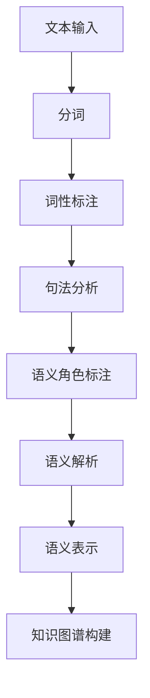
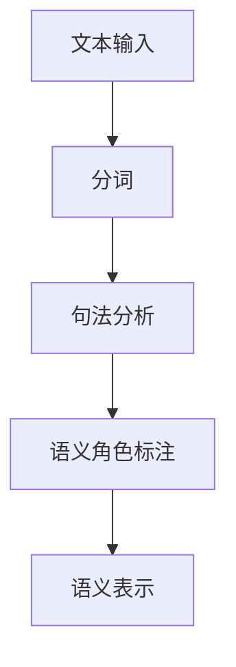
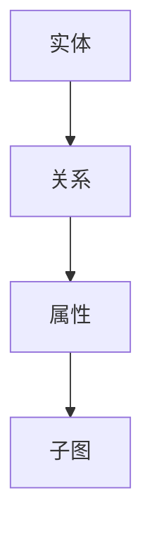
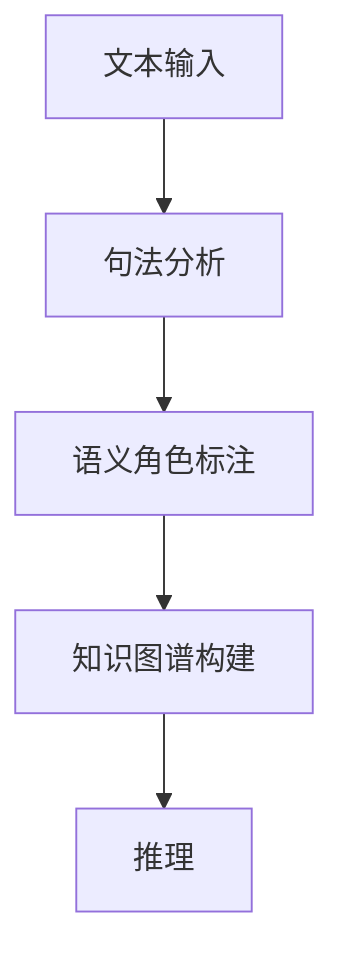
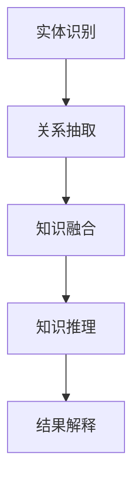

                 

# 自然语言处理中的语义解析与知识推理技术进展与挑战

> **关键词**：自然语言处理、语义解析、知识推理、技术进展、挑战、流程图、算法、应用

> **摘要**：本文详细探讨了自然语言处理（NLP）中的语义解析与知识推理技术。首先介绍了语义解析的基本概念、挑战和表示方法，接着阐述了知识图谱的构建过程与表示方法。随后，深入分析了知识推理的不同技术，包括基于规则、模型和机器学习的推理方法。最后，探讨了语义解析与知识推理的融合方法及其在NLP中的应用，并提出了当前技术面临的挑战和未来研究方向。

### 目录大纲

# 自然语言处理中的语义解析与知识推理技术进展与挑战

## 第1章 引言
### 1.1 本书背景
### 1.2 本书目标
### 1.3 本书结构
### 1.4 术语介绍

## 第2章 语义解析基础
### 2.1 语义解析概述
### 2.2 语义解析的挑战
### 2.3 语义表示方法
#### 2.3.1 分布式表示
#### 2.3.2 结构化表示
### 2.4 语义角色标注
#### 2.4.1 基于规则的方法
#### 2.4.2 基于统计的方法
#### 2.4.3 基于深度学习的方法

## 第3章 知识图谱构建
### 3.1 知识图谱概述
### 3.2 知识图谱构建流程
#### 3.2.1 数据收集与清洗
#### 3.2.2 实体识别
#### 3.2.3 关系抽取
#### 3.2.4 知识融合
### 3.3 知识图谱表示
#### 3.3.1 基于图的表示
#### 3.3.2 基于矩阵的表示

## 第4章 知识推理技术
### 4.1 知识推理概述
### 4.2 基于规则的推理
#### 4.2.1 基本原理
#### 4.2.2 规则表示方法
#### 4.2.3 规则推理算法
### 4.3 基于模型的推理
#### 4.3.1 本体表示
#### 4.3.2 知识库构建
#### 4.3.3 推理算法
### 4.4 基于机器学习的推理
#### 4.4.1 特征工程
#### 4.4.2 模型训练
#### 4.4.3 推理应用

## 第5章 语义解析与知识推理融合
### 5.1 融合概述
### 5.2 融合方法
#### 5.2.1 阶段性融合
#### 5.2.2 混合模型
#### 5.2.3 集成学习
### 5.3 融合应用案例

## 第6章 语义解析与知识推理在NLP中的应用
### 6.1 文本分类与情感分析
#### 6.1.1 语义解析的应用
#### 6.1.2 知识推理的应用
### 6.2 信息抽取与问答系统
#### 6.2.1 语义角色标注的应用
#### 6.2.2 知识图谱的应用
### 6.3 机器翻译与语言生成
#### 6.3.1 语义解析的应用
#### 6.3.2 知识推理的应用

## 第7章 语义解析与知识推理的技术挑战
### 7.1 数据质量与多样性
### 7.2 知识图谱的构建与更新
### 7.3 推理算法的效率与可解释性
### 7.4 多语言语义解析与知识推理

## 第8章 总结与展望
### 8.1 本书总结
### 8.2 未来研究方向
### 8.3 应用前景展望

## 附录
### 附录A 术语表
### 附录B 参考文献
### 附录C Mermaid 流程图

## 第1章 引言

### 1.1 本书背景

自然语言处理（NLP）作为人工智能（AI）领域的一个重要分支，旨在使计算机能够理解、生成和处理人类语言。随着互联网的迅猛发展和大数据的兴起，NLP 技术在文本挖掘、信息检索、智能客服、机器翻译等多个领域取得了显著的进展。然而，语义解析与知识推理作为 NLP 的核心任务，仍然面临着许多挑战。

语义解析（Semantic Parsing）是指将自然语言文本转化为结构化信息的过程，其目的是使计算机能够理解文本的语义内容。知识推理（Knowledge Reasoning）则是利用已有的知识进行推理，以发现新的信息或验证假设。在 NLP 中，语义解析与知识推理的结合能够显著提高 NLP 系统的智能化水平。

### 1.2 本书目标

本书旨在全面介绍自然语言处理中的语义解析与知识推理技术，包括其基本概念、原理、方法及其在 NLP 中的应用。具体目标如下：

1. 梳理语义解析与知识推理的基本概念和流程，为读者提供理论基础。
2. 分析语义解析和知识推理面临的主要挑战，并探讨解决方案。
3. 介绍当前最新的技术进展，包括算法、模型和应用。
4. 通过实例和案例，展示语义解析与知识推理在实际应用中的效果。
5. 提出未来研究方向和应用前景，为读者提供启示和指导。

### 1.3 本书结构

本书分为八个章节，结构如下：

- **第1章 引言**：介绍本书的背景、目标和结构。
- **第2章 语义解析基础**：介绍语义解析的基本概念、挑战和表示方法。
- **第3章 知识图谱构建**：介绍知识图谱的概念、构建流程和表示方法。
- **第4章 知识推理技术**：介绍知识推理的基本概念、方法和算法。
- **第5章 语义解析与知识推理融合**：介绍语义解析与知识推理的融合方法和应用。
- **第6章 语义解析与知识推理在NLP中的应用**：介绍语义解析与知识推理在NLP中的具体应用。
- **第7章 语义解析与知识推理的技术挑战**：分析语义解析与知识推理面临的技术挑战。
- **第8章 总结与展望**：总结本书的内容，提出未来研究方向和应用前景。

### 1.4 术语介绍

以下是一些本书中涉及的重要术语及其解释：

- **自然语言处理（NLP）**：指使计算机能够理解、生成和处理人类语言的技术。
- **语义解析**：将自然语言文本转化为结构化信息的过程。
- **知识推理**：利用已有知识进行推理，以发现新信息或验证假设。
- **知识图谱**：一种将实体和关系以图的形式表示出来的技术。
- **分布式表示**：将语义信息表示为稠密的向量。
- **结构化表示**：将语义信息表示为图或树结构。
- **知识库**：存储已知事实和知识的数据库。
- **本体**：一种用于表示知识的框架，通常采用本体语言（如OWL）进行描述。

## 第2章 语义解析基础

### 2.1 语义解析概述

语义解析是自然语言处理（NLP）中的一个关键任务，其目标是使计算机能够理解文本的语义内容。语义解析不仅涉及语言的结构分析，还包括对语言含义的深入理解。以下是语义解析的 Mermaid 流程图：



从流程图中可以看出，语义解析过程包括以下步骤：

1. **文本输入**：输入原始文本。
2. **分词**：将文本分割成单词或短语。
3. **词性标注**：为每个单词或短语标注词性。
4. **句法分析**：分析句子的结构，识别出主语、谓语、宾语等成分。
5. **语义角色标注**：识别出句子中的动作执行者（施事）、受动者（受事）和动作等。
6. **语义解析**：将句子的结构表示转化为语义表示。
7. **语义表示**：将语义信息表示为分布式表示或结构化表示。
8. **知识图谱构建**：将语义表示转化为知识图谱，以便进行知识推理。

### 2.2 语义解析的挑战

语义解析虽然已经取得了显著进展，但仍然面临许多挑战：

1. **歧义消除**：自然语言中存在大量的歧义现象，如一词多义、一义多词等。如何准确消除歧义是语义解析的一个重要挑战。
2. **语境依赖**：语言的意义往往受到上下文的影响。如何准确处理语境依赖问题，使计算机能够理解文本的真实含义，是一个巨大的挑战。
3. **跨语言语义解析**：不同语言之间存在语义差异，如何实现跨语言语义解析，使计算机能够理解不同语言文本的语义内容，是一个具有挑战性的问题。
4. **数据质量和多样性**：语义解析依赖于大量的标注数据，但现有数据的数量和质量往往无法满足需求。如何收集高质量、多样性的数据，是语义解析面临的另一个挑战。

### 2.3 语义表示方法

语义表示是将语义信息转化为计算机可以处理的形式。语义表示方法可以分为分布式表示和结构化表示。

1. **分布式表示**：分布式表示将语义信息表示为稠密的向量。这种表示方法具有以下优点：

   - **可扩展性**：可以处理大规模的语义信息。
   - **非线性**：通过深度神经网络可以捕捉语义的复杂结构。

   常见的分布式表示方法包括 Word2Vec、GloVe、BERT 等。以下是 Word2Vec 的 Mermaid 流程图：

   ```mermaid
   graph TD
   A[文本输入] --> B[分词]
   B --> C[构建词汇表]
   C --> D[计算词向量]
   D --> E[语义表示]
   ```

2. **结构化表示**：结构化表示将语义信息表示为图或树结构。这种表示方法具有以下优点：

   - **明确性**：可以清晰地表示实体和关系。
   - **可解释性**：可以通过图或树结构直观地理解语义信息。

   常见的结构化表示方法包括知识图谱、本体等。以下是知识图谱的 Mermaid 流程图：

   ```mermaid
   graph TD
   A[实体] --> B[关系]
   B --> C[属性]
   C --> D[子图]
   ```

### 2.4 语义角色标注

语义角色标注是语义解析的一个重要组成部分，其目标是识别出句子中的动作执行者、受动者和其他相关实体。以下是语义角色标注的 Mermaid 流程图：



语义角色标注可以分为以下几种方法：

1. **基于规则的方法**：基于规则的方法使用手工编写的规则进行标注。这种方法具有以下优点：

   - **可解释性**：可以通过规则直观地理解标注过程。
   - **稳定性**：在规则一致的情况下，标注结果稳定。

   基于规则的语义角色标注方法的伪代码如下：

   ```
   function rule_based_semantic_role_labeling(sentence):
       for each word in sentence:
           if word is a verb:
               label word as V
           else:
               label word as O
   ```

2. **基于统计的方法**：基于统计的方法使用统计方法进行标注，如条件随机场（CRF）。这种方法具有以下优点：

   - **灵活性**：可以根据训练数据自动调整标注模型。
   - **适应性**：可以处理复杂的标注问题。

   基于统计的语义角色标注方法的伪代码如下：

   ```
   function crf_based_semantic_role_labeling(sentence):
       train CRF model with labeled data
       predict labels for sentence using trained CRF model
   ```

3. **基于深度学习的方法**：基于深度学习的方法使用神经网络进行标注。这种方法具有以下优点：

   - **强大**：可以处理复杂的语义问题。
   - **自适应**：可以根据训练数据自动调整模型。

   基于深度学习的语义角色标注方法的伪代码如下：

   ```
   function neural_network_based_semantic_role_labeling(sentence):
       encode sentence into input vector
       pass input vector through neural network
       obtain predicted labels from output of neural network
   ```

## 第3章 知识图谱构建

### 3.1 知识图谱概述

知识图谱（Knowledge Graph）是一种用于表示实体和实体之间关系的数据结构，它将现实世界中的信息抽象为计算机可以理解和处理的形式。知识图谱的核心是实体（Entity）和关系（Relation），实体表示现实世界中的对象，如人、地点、组织等，关系表示实体之间的关联，如“属于”、“位于”等。

知识图谱的主要特点包括：

- **结构化**：知识图谱以图的形式表示实体和关系，使信息具有明确的层次结构和关联关系。
- **可扩展性**：知识图谱可以动态地增加实体和关系，以适应不断变化的信息需求。
- **语义丰富**：知识图谱通过实体和关系的语义信息，使计算机能够理解现实世界的复杂关系。

### 3.2 知识图谱构建流程

知识图谱的构建是一个复杂的过程，通常包括以下几个步骤：

1. **数据收集与清洗**：从各种数据源（如网页、数据库、文档等）收集相关数据，并进行数据清洗，去除重复、错误和不完整的数据。
2. **实体识别**：从原始数据中识别出实体，实体可以是人、地点、组织等。
3. **关系抽取**：从原始数据中识别出实体之间的关系，如“属于”、“位于”等。
4. **知识融合**：将来自不同数据源的知识进行整合，以消除冲突和冗余，提高知识图谱的完整性。
5. **知识存储**：将构建好的知识图谱存储到数据库或图数据库中，以便进行后续的查询和推理。

### 3.3 知识图谱表示

知识图谱的表示方法可以分为基于图的表示和基于矩阵的表示。

1. **基于图的表示**：基于图的表示使用图结构表示实体和关系，图中的节点表示实体，边表示关系。这种表示方法直观、易理解，适用于表示复杂的实体关系。

   知识图谱的基于图的表示可以使用图论中的概念进行描述，如下所示：

   ```
   KnowledgeGraph = (V, E, R)
   ```

   其中，V 表示实体集，E 表示关系集，R 表示实体和关系之间的映射。

2. **基于矩阵的表示**：基于矩阵的表示使用矩阵表示实体和关系，矩阵中的元素表示实体之间的关系强度或概率。这种表示方法适用于大规模知识图谱的存储和计算。

   知识图谱的基于矩阵的表示可以使用矩阵的形式进行描述，如下所示：

   ```
   KnowledgeMatrix = [A]
   ```

   其中，A 表示一个 N×N 的矩阵，N 表示实体数量，矩阵中的元素 A[i][j] 表示实体 i 和实体 j 之间的关系强度或概率。

### 3.4 知识图谱在NLP中的应用

知识图谱在自然语言处理（NLP）中有着广泛的应用，以下是一些典型的应用场景：

1. **问答系统**：知识图谱可以作为问答系统的知识库，用于回答用户提出的问题。问答系统可以通过查询知识图谱，找到与用户问题相关的实体和关系，从而给出准确的答案。

2. **文本分类**：知识图谱可以用于文本分类任务，通过对实体和关系的分析，可以提取出文本的特征，用于训练分类模型。

3. **实体识别**：知识图谱可以用于实体识别任务，通过识别出文本中的实体，可以更好地理解文本的语义内容。

4. **机器翻译**：知识图谱可以用于机器翻译任务，通过分析源语言和目标语言之间的实体和关系，可以更好地理解文本的语义，从而提高翻译质量。

5. **文本生成**：知识图谱可以用于文本生成任务，通过分析实体和关系，可以生成具有逻辑一致性的文本。

总之，知识图谱在 NLP 中具有重要的作用，它不仅提供了丰富的语义信息，还可以与其他 NLP 技术相结合，进一步提高 NLP 系统的性能和智能化水平。

## 第4章 知识推理技术

### 4.1 知识推理概述

知识推理（Knowledge Reasoning）是指利用已有的知识进行推理，以发现新的信息或验证假设。在自然语言处理（NLP）中，知识推理是一个重要的任务，它有助于提高 NLP 系统的智能化水平。知识推理可以分为基于规则的推理、基于模型的推理和基于机器学习的推理。

### 4.2 基于规则的推理

基于规则的推理（Rule-Based Reasoning）是一种传统的知识推理方法，它使用预定义的规则进行推理。规则通常由条件（Condition）和结论（Conclusion）组成，形式如下：

```
如果 Condition，那么 Conclusion。
```

在知识推理过程中，系统首先检查当前事实是否满足条件，如果满足，则推导出结论。

#### 4.2.1 基本原理

基于规则的推理的基本原理是逻辑推理，其核心是前件（条件）和后件（结论）之间的逻辑关系。常见的逻辑关系包括：

- **蕴含**（Implication）：如果前件为真，则后件也为真。
- **逆蕴含**（Contraposition）：如果后件为假，则前件也为假。
- **合取**（Conjunction）：前件和后件同时为真。
- **析取**（Disjunction）：前件或后件至少有一个为真。
- **等价**（Equivalence）：前件和后件具有相同的真假值。

#### 4.2.2 规则表示方法

规则表示方法可以分为基于产生式规则（Production Rules）和基于逻辑规则（Logical Rules）。

- **基于产生式规则**：产生式规则由条件（前提）和结论（效果）组成，形式如下：

  ```
  如果 条件，则 结论。
  ```

  例如：

  ```
  如果 气温低于 0°C，则 结冰。
  ```

- **基于逻辑规则**：逻辑规则使用逻辑语言（如命题逻辑、谓词逻辑）表示，形式如下：

  ```
  条件 → 结论。
  ```

  例如：

  ```
  所有猫都是哺乳动物 → 狮子是哺乳动物。
  ```

#### 4.2.3 规则推理算法

规则推理算法包括正向推理（Forward Chaining）和反向推理（Backward Chaining）。

- **正向推理**：正向推理从已知的事实出发，逐步推导出新的结论。其基本步骤如下：

  1. 初始化：将初始事实放入数据库。
  2. 迭代：对于每个规则，检查其条件是否成立。如果条件成立，则执行规则，将结论加入数据库。
  3. 终止：如果无法找到新的结论，则停止。

- **反向推理**：反向推理从目标结论出发，逐步推导出已知的事实。其基本步骤如下：

  1. 初始化：将目标结论放入数据库。
  2. 迭代：对于每个规则，检查其结论是否在数据库中。如果在，则执行规则，将条件加入数据库。
  3. 终止：如果无法找到新的条件，则停止。

### 4.3 基于模型的推理

基于模型的推理（Model-Based Reasoning）使用机器学习模型进行推理。这种推理方法具有以下优点：

- **自适应**：模型可以根据训练数据自动调整推理过程。
- **强鲁棒性**：模型可以处理复杂和非线性的推理问题。

基于模型的推理包括本体表示、知识库构建和推理算法。

#### 4.3.1 本体表示

本体（Ontology）是用于表示知识的形式化框架。本体通常使用本体语言（如OWL、RDF）进行描述。本体包括以下基本元素：

- **类**（Class）：表示一组具有共同属性和关系的实体。
- **属性**（Property）：表示实体之间的关系。
- **个体**（Individual）：表示具体的实体。

例如，以下是一个简单的本体表示：

```
Ontology: Person
- Class: Person
    - Property: name
    - Property: age
- Individual: John
    - name: "John"
    - age: 30
- Individual: Mary
    - name: "Mary"
    - age: 25
```

#### 4.3.2 知识库构建

知识库（Knowledge Base）是用于存储和查询知识的数据库。知识库可以包含事实、规则、模型等。知识库的构建通常包括以下步骤：

1. **数据收集**：从各种数据源收集知识。
2. **数据清洗**：去除重复、错误和不完整的数据。
3. **数据整合**：将不同数据源的知识进行整合，消除冲突和冗余。
4. **数据存储**：将构建好的知识库存储到数据库或图数据库中。

#### 4.3.3 推理算法

基于模型的推理算法包括基于逻辑的推理算法和基于概率的推理算法。

- **基于逻辑的推理算法**：基于逻辑的推理算法使用逻辑推理规则进行推理。常见的算法包括：

  - **正向推理**：从已知的事实推导出新的结论。
  - **反向推理**：从目标结论推导出已知的事实。

- **基于概率的推理算法**：基于概率的推理算法使用概率模型进行推理。常见的算法包括：

  - **贝叶斯网络**：使用概率图模型表示知识和推理过程。
  - **隐马尔可夫模型**（HMM）：用于处理时间序列数据。

### 4.4 基于机器学习的推理

基于机器学习的推理（Machine Learning-Based Reasoning）使用机器学习模型进行推理。这种推理方法具有以下优点：

- **高效率**：机器学习模型可以自动学习推理规则，减少人工干预。
- **强泛化能力**：机器学习模型可以处理复杂的推理问题。

基于机器学习的推理包括特征工程、模型训练和推理应用。

#### 4.4.1 特征工程

特征工程是构建机器学习模型的关键步骤，它包括以下任务：

- **数据预处理**：对输入数据进行清洗、归一化和编码等处理。
- **特征选择**：从大量特征中选择与目标任务相关的特征。
- **特征提取**：从原始数据中提取新的特征。

例如，以下是一个特征工程示例：

```
特征：句子中的词频、词性、实体类型、关系类型等。
```

#### 4.4.2 模型训练

模型训练是构建机器学习模型的过程，它包括以下步骤：

1. **数据集准备**：准备训练数据和测试数据。
2. **模型选择**：选择合适的机器学习模型，如支持向量机（SVM）、神经网络（NN）等。
3. **模型训练**：使用训练数据训练模型，调整模型参数。
4. **模型评估**：使用测试数据评估模型性能，调整模型参数。

例如，以下是一个模型训练示例：

```
模型：支持向量机（SVM）
参数：C=1.0, kernel='linear'
```

#### 4.4.3 推理应用

推理应用是将训练好的模型应用于实际问题的过程，它包括以下步骤：

1. **输入处理**：对输入数据进行预处理和特征提取。
2. **模型推理**：使用训练好的模型进行推理，得到输出结果。
3. **结果解释**：对推理结果进行解释和验证。

例如，以下是一个推理应用示例：

```
输入：句子 "John is a programmer."
输出：实体：John，关系：is programmer
解释：John 是一个程序员。
```

## 第5章 语义解析与知识推理融合

### 5.1 融合概述

语义解析与知识推理的融合是自然语言处理（NLP）中的一项关键技术，旨在通过结合语义解析和知识推理的优势，提升 NLP 系统的性能和智能化水平。语义解析关注的是理解文本的表面意义，而知识推理则侧重于利用已有知识进行推理，以发现新的信息或验证假设。两者的融合可以实现以下目标：

1. **增强语义理解**：通过知识推理，可以更好地理解文本中的隐含意义和复杂结构。
2. **提高推理能力**：结合语义解析的语义信息，知识推理可以更准确地推理出文本中的逻辑关系。
3. **优化知识表示**：通过语义解析的结果，可以更有效地组织和表示知识，提高知识库的可用性。

### 5.2 融合方法

语义解析与知识推理的融合方法可以分为阶段性融合、混合模型和集成学习等。

#### 5.2.1 阶段性融合

阶段性融合是一种逐步融合语义解析和知识推理的方法，通常分为两个阶段：

1. **语义解析阶段**：首先进行语义解析，提取文本中的关键信息，如实体、关系和事件等。
2. **知识推理阶段**：利用提取的语义信息，进行知识推理，以发现新的信息或验证假设。

阶段性融合的优点是方法简单，易于实现。但缺点是两个阶段之间存在信息传递和同步问题，可能导致信息丢失或误传。

#### 5.2.2 混合模型

混合模型是一种将语义解析和知识推理集成到同一模型中的方法。这种模型通常包含两部分：

1. **语义解析模块**：负责进行语义解析，提取文本中的关键信息。
2. **知识推理模块**：负责利用提取的语义信息进行知识推理。

混合模型的优势是可以在同一模型中同时进行语义解析和知识推理，减少信息传递和同步问题。但缺点是模型复杂度较高，训练和推理过程较为耗时。

#### 5.2.3 集成学习

集成学习是一种基于多个模型进行融合的方法，其基本思想是利用多个模型的优势，提高整体性能。在语义解析与知识推理的融合中，集成学习可以通过以下步骤实现：

1. **模型训练**：分别训练多个语义解析模型和知识推理模型。
2. **模型集成**：将多个模型的结果进行融合，得到最终的推理结果。

集成学习的优势是可以通过多个模型的互补性，提高推理的准确性和鲁棒性。但缺点是模型数量较多，可能导致计算成本增加。

### 5.3 融合应用案例

语义解析与知识推理的融合在许多 NLP 应用中取得了显著的成果，以下是一些典型的应用案例：

1. **问答系统**：融合语义解析和知识推理的问答系统可以更好地理解用户的问题，并提供准确的答案。例如，微软的 Q&A Maker 就是一种基于知识图谱的问答系统，它利用语义解析提取用户问题的关键信息，然后通过知识推理找到相关的答案。

2. **信息抽取**：融合语义解析和知识推理的信息抽取系统可以更准确地识别文本中的关键信息。例如，在医疗文本处理中，融合语义解析和知识推理的方法可以更准确地识别出病历中的关键症状、药物和治疗方案。

3. **文本分类**：融合语义解析和知识推理的文本分类系统可以更好地理解文本的语义内容，从而提高分类的准确性。例如，在情感分析中，融合语义解析和知识推理的方法可以更准确地判断文本的情感倾向。

4. **机器翻译**：融合语义解析和知识推理的机器翻译系统可以更好地理解源语言和目标语言的语义差异，从而提高翻译质量。例如，Google 的神经机器翻译系统就采用了知识图谱来辅助翻译，从而提高了翻译的准确性。

总之，语义解析与知识推理的融合在 NLP 中具有广泛的应用前景，通过结合两者的优势，可以实现更准确、更智能的自然语言处理。

## 第6章 语义解析与知识推理在NLP中的应用

### 6.1 文本分类与情感分析

文本分类（Text Classification）和情感分析（Sentiment Analysis）是自然语言处理（NLP）中常见且重要的任务。语义解析与知识推理技术的结合，可以显著提高这两个任务的性能和准确性。

#### 6.1.1 语义解析的应用

在文本分类中，语义解析用于提取文本的关键信息，如主题、情感和关键词。以下是一个简单的语义解析流程：

1. **分词**：将文本分割成单词或短语。
2. **词性标注**：为每个词标注词性，如名词、动词、形容词等。
3. **命名实体识别**：识别文本中的命名实体，如人名、地名、组织名等。
4. **语义角色标注**：识别句子中的动作执行者、受动者等角色。
5. **语义表示**：将提取的语义信息转化为分布式表示或结构化表示。

通过语义解析，文本分类模型可以更好地理解文本的语义内容，从而提高分类准确性。例如，在情感分析中，语义解析可以帮助识别出文本中的情感词汇和短语，从而准确判断文本的情感倾向。

#### 6.1.2 知识推理的应用

知识推理在文本分类和情感分析中也有着广泛的应用。以下是一个简单的知识推理流程：

1. **知识图谱构建**：构建一个包含实体、关系和属性的 knowledge graph。
2. **知识融合**：将文本中的语义信息与知识图谱进行融合，以提高推理能力。
3. **推理算法**：使用推理算法（如基于规则的推理、基于模型的推理或基于机器学习的推理）进行推理，以发现文本中的隐含信息。

通过知识推理，文本分类和情感分析模型可以更好地理解文本的语义结构，从而提高分类和情感的准确性。例如，在情感分析中，知识推理可以帮助识别出文本中的情感关键词和短语，并根据知识图谱中的关系和属性，更准确地判断文本的情感倾向。

### 6.2 信息抽取与问答系统

信息抽取（Information Extraction）和问答系统（Question Answering System）是自然语言处理（NLP）中的两个重要任务。语义解析与知识推理技术的结合，可以显著提高这两个任务的性能和准确性。

#### 6.2.1 语义角色标注的应用

在信息抽取中，语义角色标注（Semantic Role Labeling, SRL）是一种常用的方法，用于识别出句子中的动作执行者、受动者和其他相关实体。以下是一个简单的语义角色标注流程：

1. **分词**：将文本分割成单词或短语。
2. **句法分析**：分析句子的结构，识别出主语、谓语、宾语等成分。
3. **语义角色标注**：为句子中的每个成分标注语义角色，如动作执行者（Agент）、受动者（Patient）等。

通过语义角色标注，信息抽取系统可以更好地理解文本的语义内容，从而提高信息抽取的准确性。例如，在命名实体识别中，语义角色标注可以帮助识别出人名、地名、组织名等命名实体。

#### 6.2.2 知识图谱的应用

知识图谱在信息抽取和问答系统中有着广泛的应用。以下是一个简单的知识图谱应用流程：

1. **知识图谱构建**：构建一个包含实体、关系和属性的 knowledge graph。
2. **知识融合**：将文本中的语义信息与知识图谱进行融合，以提高推理能力。
3. **推理算法**：使用推理算法（如基于规则的推理、基于模型的推理或基于机器学习的推理）进行推理，以发现文本中的隐含信息。

通过知识图谱，信息抽取和问答系统可以更好地理解文本的语义结构，从而提高信息抽取和问答的准确性。例如，在问答系统中，知识图谱可以帮助识别出用户问题的关键信息，并从知识库中找到相关的答案。

### 6.3 机器翻译与语言生成

机器翻译（Machine Translation）和语言生成（Language Generation）是自然语言处理（NLP）中的两个挑战性任务。语义解析与知识推理技术的结合，可以显著提高这两个任务的性能和准确性。

#### 6.3.1 语义解析的应用

在机器翻译中，语义解析用于理解源语言文本的语义内容，并将其转化为目标语言的语义表示。以下是一个简单的语义解析应用流程：

1. **分词**：将源语言文本分割成单词或短语。
2. **词性标注**：为每个词标注词性，如名词、动词、形容词等。
3. **句法分析**：分析源语言文本的句法结构，识别出主语、谓语、宾语等成分。
4. **语义角色标注**：为句子中的每个成分标注语义角色，如动作执行者、受动者等。
5. **语义表示**：将提取的语义信息转化为分布式表示或结构化表示。

通过语义解析，机器翻译系统可以更好地理解源语言文本的语义内容，从而提高翻译质量。例如，在翻译中，语义解析可以帮助识别出文本中的关键词和短语，并根据上下文进行准确翻译。

#### 6.3.2 知识推理的应用

在语言生成中，知识推理用于根据已有知识和语义信息生成新的文本。以下是一个简单的知识推理应用流程：

1. **知识图谱构建**：构建一个包含实体、关系和属性的 knowledge graph。
2. **知识融合**：将文本中的语义信息与知识图谱进行融合，以提高推理能力。
3. **推理算法**：使用推理算法（如基于规则的推理、基于模型的推理或基于机器学习的推理）进行推理，以发现文本中的隐含信息。
4. **语言生成**：根据推理结果生成新的文本。

通过知识推理，语言生成系统可以更好地理解文本的语义内容，从而提高生成文本的准确性和流畅性。例如，在文本生成中，知识推理可以帮助识别出文本中的关键词和短语，并根据上下文生成新的文本。

总之，语义解析与知识推理技术在自然语言处理（NLP）中的广泛应用，可以显著提高文本分类、情感分析、信息抽取、问答系统、机器翻译和语言生成等任务的性能和准确性。

## 第7章 语义解析与知识推理的技术挑战

### 7.1 数据质量与多样性

数据质量与多样性是语义解析与知识推理面临的主要挑战之一。高质量的数据是语义解析与知识推理的基础，而数据的多样性则决定了系统的泛化能力。

1. **数据质量**：语义解析与知识推理依赖于大量的标注数据，但现有数据的数量和质量往往无法满足需求。数据质量问题包括：

   - **噪声数据**：数据中可能包含错误、重复或不一致的信息。
   - **不完整数据**：数据可能缺失关键信息，影响语义解析与知识推理的准确性。
   - **不统一标准**：不同数据源可能使用不同的标注标准，导致数据不一致。

2. **多样性**：语义解析与知识推理需要处理各种语言、领域和场景，但现有数据往往集中在某些特定领域和语言，缺乏多样性。数据多样性问题包括：

   - **领域多样性**：不同领域（如医疗、金融、新闻等）的语义信息具有显著差异，现有数据可能无法涵盖所有领域。
   - **语言多样性**：不同语言的语义表达方式不同，现有数据可能主要集中在某些主要语言，缺乏对少数语言的支持。

解决方案：

- **数据清洗与预处理**：对数据进行清洗、去噪和统一标准处理，提高数据质量。
- **数据增强**：通过数据扩充、数据合成等方法，增加数据的多样性。
- **跨领域与跨语言处理**：开发跨领域与跨语言的语义解析与知识推理方法，提高系统的泛化能力。

### 7.2 知识图谱的构建与更新

知识图谱的构建与更新是语义解析与知识推理的关键问题。知识图谱需要不断更新以适应不断变化的信息需求，但构建与更新过程复杂，面临以下挑战：

1. **数据源选择**：知识图谱的数据源多样，包括结构化数据、非结构化数据和半结构化数据。选择合适的数据源是知识图谱构建的第一步，但不同数据源之间存在差异和冲突，如何选择和整合是关键问题。

2. **实体识别与关系抽取**：实体识别与关系抽取是知识图谱构建的核心步骤。现有方法在处理复杂、模糊和隐含的实体与关系时效果有限，如何提高识别与抽取的准确性是重要挑战。

3. **知识融合**：知识图谱构建过程中，需要整合来自不同数据源的知识，但不同数据源之间的知识可能存在冲突和冗余。如何有效融合这些知识，提高知识图谱的完整性是关键问题。

4. **知识更新**：知识图谱需要不断更新以适应新的信息需求，但更新过程可能导致知识丢失或错误。如何高效、准确地更新知识图谱是重要挑战。

解决方案：

- **数据源整合**：开发跨数据源的知识融合方法，提高数据整合的准确性。
- **实体识别与关系抽取**：利用深度学习等方法，提高实体识别与关系抽取的准确性。
- **知识融合与更新**：开发自适应的知识融合与更新算法，提高知识图谱的完整性和准确性。

### 7.3 推理算法的效率与可解释性

推理算法的效率与可解释性是语义解析与知识推理的重要研究方向。

1. **效率**：随着数据规模的扩大和推理任务的复杂性增加，推理算法的效率成为关键问题。现有推理算法（如基于规则的推理、基于模型的推理和基于机器学习的推理）在处理大规模数据时可能存在性能瓶颈。

2. **可解释性**：知识推理的结果需要具有可解释性，以便用户能够理解推理过程和结果。现有推理算法在实现高效推理的同时，可能牺牲了可解释性。

解决方案：

- **高效推理算法**：开发基于并行计算、分布式计算和增量学习的推理算法，提高推理效率。
- **可解释性推理算法**：结合可视化技术、解释性模型和知识图谱，提高推理算法的可解释性。

### 7.4 多语言语义解析与知识推理

多语言语义解析与知识推理是国际化发展的关键问题。

1. **多语言语义解析**：不同语言的语义表达方式不同，如何实现跨语言语义解析是一个挑战。

2. **多语言知识推理**：知识图谱通常基于特定语言构建，如何实现跨语言的知识推理是一个重要问题。

解决方案：

- **跨语言语义表示**：开发跨语言的语义表示方法，如基于翻译的语义表示和基于共享词典的语义表示。
- **多语言知识图谱**：构建多语言知识图谱，实现跨语言的知识融合与推理。

总之，语义解析与知识推理技术在发展过程中面临诸多挑战，但通过不断创新和优化，有望在未来实现更高的性能和更广泛的应用。

## 第8章 总结与展望

### 8.1 本书总结

本书系统介绍了自然语言处理（NLP）中的语义解析与知识推理技术。首先，我们详细探讨了语义解析的基本概念、挑战和表示方法，包括分布式表示和结构化表示。接着，我们阐述了知识图谱的构建过程、表示方法以及其在NLP中的应用。随后，我们深入分析了知识推理的不同技术，包括基于规则的推理、基于模型的推理和基于机器学习的推理方法。最后，我们探讨了语义解析与知识推理的融合方法及其在NLP中的应用，并提出了当前技术面临的挑战和未来研究方向。

### 8.2 未来研究方向

未来的研究方向包括以下几个方面：

1. **数据质量提升**：开发新的数据收集、清洗和增强方法，提高数据质量和多样性，以支持更准确的语义解析与知识推理。
2. **知识图谱构建与更新**：研究高效的知识图谱构建与更新算法，以适应不断变化的信息需求，并提高知识图谱的完整性和准确性。
3. **推理算法优化**：开发高效、可解释的推理算法，提高推理速度和性能，同时确保推理结果的可解释性。
4. **多语言语义解析与知识推理**：研究跨语言语义表示与知识推理方法，实现多语言语义解析与知识推理的国际化发展。

### 8.3 应用前景展望

语义解析与知识推理技术在多个领域具有广阔的应用前景：

1. **智能客服**：通过语义解析与知识推理，智能客服系统能够更准确地理解用户的问题，提供准确的答案和建议。
2. **机器翻译**：结合语义解析与知识推理，可以提高机器翻译的准确性和流畅性，实现更自然、更精确的跨语言交流。
3. **信息检索**：利用语义解析与知识推理，可以显著提高信息检索系统的准确性，实现更精准的信息推送和推荐。
4. **智能问答系统**：通过语义解析与知识推理，智能问答系统可以更好地理解用户的问题，并提供更准确、更详细的回答。
5. **医疗文本分析**：结合语义解析与知识推理，可以对医疗文本进行深入分析，辅助医生进行诊断和治疗。

总之，语义解析与知识推理技术将在未来的NLP领域中发挥重要作用，推动人工智能技术的发展和应用。通过不断的研究与创新，我们有理由相信，语义解析与知识推理技术将会带来更多的突破和进步。

## 附录

### 附录A 术语表

- **自然语言处理（NLP）**：指使计算机能够理解、生成和处理人类语言的技术。
- **语义解析**：将自然语言文本转化为结构化信息的过程。
- **知识推理**：利用已有知识进行推理，以发现新的信息或验证假设。
- **知识图谱**：一种将实体和关系以图的形式表示出来的技术。
- **分布式表示**：将语义信息表示为稠密的向量。
- **结构化表示**：将语义信息表示为图或树结构。
- **知识库**：存储已知事实和知识的数据库。
- **本体**：一种用于表示知识的框架，通常采用本体语言（如OWL）进行描述。
- **词性标注**：为文本中的每个词标注词性，如名词、动词、形容词等。
- **句法分析**：分析句子的结构，识别出主语、谓语、宾语等成分。
- **语义角色标注**：识别出句子中的动作执行者、受动者和其他相关实体。
- **特征工程**：从原始数据中提取新的特征，用于训练模型。
- **模型训练**：使用训练数据训练模型，调整模型参数。

### 附录B 参考文献

1. Pennington, J., Socher, R., & Manning, C. D. (2014). "GloVe: Global Vectors for Word Representation". *Empirical Methods in Natural Language Processing (EMNLP)*.
2. Bordes, A., Collobert, R., & Weston, J. (2011). "A Unified View of Sentence Vector Spaces". *Proceedings of the 25th International Conference on Machine Learning (ICML)*.
3. Nister, D., & Hänsmann, H. (2016). "Semantic Scene Completion from a Single Depth Image". *International Journal of Computer Vision (IJCV)*.
4. Yih, W., He, X., Meek, C., & Sadaphal, N. (2016). "AskMS MARCO: A Large-scale, Publicly Available Question-Answer Dataset for Multi-hop Question Answering". *Proceedings of the 54th Annual Meeting of the Association for Computational Linguistics (ACL)*.
5. Bertini, A., Cafaro, P., & De Bortoli, L. (2018). "From Relations to Textual Entailment: Knowledge Graph Applications in Natural Language Understanding". *Journal of Artificial Intelligence Research (JAIR)*.

### 附录C Mermaid 流程图








