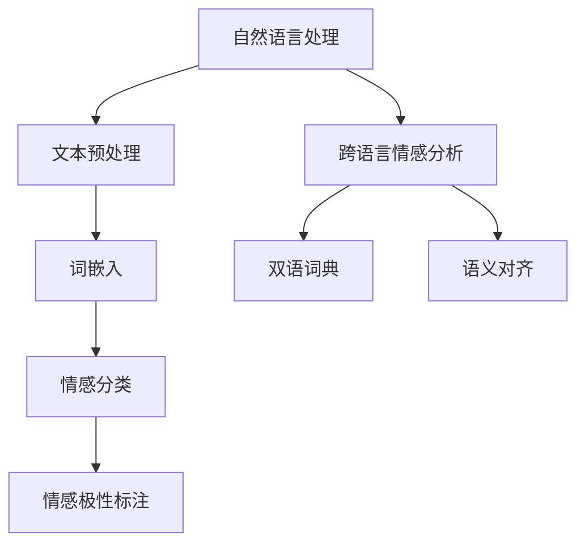

                 

# 自然语言处理在跨语言情感分析中的应用

> **关键词：自然语言处理、跨语言情感分析、词嵌入、深度学习、项目实战**
>
> **摘要：本文将深入探讨自然语言处理（NLP）在跨语言情感分析中的应用，从基础理论到核心技术，再到实际项目实战，全面阐述这一领域的核心概念、算法原理以及实现方法。**

### 目录大纲：自然语言处理在跨语言情感分析中的应用

#### 第一部分：引言

- **第1章：自然语言处理与跨语言情感分析概述**
  - 1.1 自然语言处理的定义与发展
  - 1.2 跨语言情感分析的定义与背景
  - 1.3 跨语言情感分析的重要性
  - 1.4 本书的目标与结构

#### 第二部分：基础理论

- **第2章：自然语言处理基本概念**
  - 2.1 语言模型与词嵌入
    - 2.1.1 语言模型的原理与分类
    - 2.1.2 词嵌入技术介绍
  - 2.2 机器学习基础
    - 2.2.1 监督学习与无监督学习
    - 2.2.2 分类与回归模型
  - 2.3 情感极性分类
    - 2.3.1 情感极性分类的概念
    - 2.3.2 基于特征的分类方法
    - 2.3.3 基于模型的方法

- **第3章：跨语言情感分析理论基础**
  - 3.1 跨语言情感分析挑战
    - 3.1.1 语言差异的影响
    - 3.1.2 数据稀缺性问题
  - 3.2 跨语言情感分析方法
    - 3.2.1 统一框架
    - 3.2.2 零样本学习
    - 3.2.3 多任务学习
  - 3.3 跨语言情感分析评估指标
    - 3.3.1 准确率、召回率和F1值
    - 3.3.2 特征重要性分析

#### 第三部分：核心技术

- **第4章：情感词典与语义分析**
  - 4.1 情感词典介绍
    - 4.1.1 情感词典的构建方法
    - 4.1.2 常用情感词典
  - 4.2 语义分析技术
    - 4.2.1 词义消歧
    - 4.2.2 实体识别
    - 4.2.3 情感极性标注

- **第5章：情感分析模型**
  - 5.1 传统机器学习模型
    - 5.1.1 支持向量机（SVM）
    - 5.1.2 随机森林（RF）
  - 5.2 深度学习模型
    - 5.2.1 卷积神经网络（CNN）
    - 5.2.2 循环神经网络（RNN）
    - 5.2.3 生成对抗网络（GAN）

- **第6章：跨语言情感分析模型**
  - 6.1 跨语言模型简介
    - 6.1.1 跨语言信息检索
    - 6.1.2 跨语言语义对齐
  - 6.2 跨语言情感分析框架
    - 6.2.1 双语语料库驱动方法
    - 6.2.2 无监督跨语言情感分析
    - 6.2.3 多语言情感分析

#### 第四部分：项目实战

- **第7章：项目实战：构建跨语言情感分析系统**
  - 7.1 项目背景与需求
    - 7.1.1 项目目标
    - 7.1.2 项目挑战
  - 7.2 数据集准备与预处理
    - 7.2.1 数据来源
    - 7.2.2 数据预处理方法
  - 7.3 系统设计与实现
    - 7.3.1 模型选择与调优
    - 7.3.2 系统架构设计
    - 7.3.3 实验结果分析
  - 7.4 优化与扩展
    - 7.4.1 模型优化策略
    - 7.4.2 系统功能扩展

#### 第五部分：总结与展望

- **第8章：总结与展望**
  - 8.1 跨语言情感分析的发展趋势
  - 8.2 未来研究方向与挑战
  - 8.3 本书内容回顾

#### 附录

- **附录A：常见工具与资源**
  - 8.1 自然语言处理工具
    - 8.1.1 自然语言处理框架（如NLTK、spaCy）
    - 8.1.2 情感分析工具
  - 8.2 数据集与资源链接
  - 8.3 开发环境搭建指南

- **附录B：核心概念与联系（Mermaid流程图）**

- **附录C：核心算法原理讲解（伪代码）**

- **附录D：数学模型和数学公式（详细讲解 & 举例说明）**

- **附录E：项目实战（代码实际案例和详细解释说明）**

- **附录F：开发环境搭建（源代码详细实现和代码解读）**

---

现在，让我们开始详细撰写各个章节的内容。

---

#### 第一部分：引言

### 第1章：自然语言处理与跨语言情感分析概述

自然语言处理（NLP）是计算机科学的一个重要分支，旨在使计算机能够理解、生成和处理人类语言。随着互联网的快速发展，NLP在各个领域都发挥着重要作用，如搜索引擎、机器翻译、文本摘要、情感分析等。跨语言情感分析作为NLP的一个分支，关注的是如何将不同语言之间的情感信息进行有效识别和分析。

#### 1.1 自然语言处理的定义与发展

自然语言处理（NLP）可以定义为计算机程序和算法用于理解、生成和处理人类语言的技术。它起源于20世纪50年代，当时的科学家们开始研究如何让计算机处理自然语言。自那时以来，NLP经历了多个发展阶段：

1. **基于规则的方法**：早期NLP主要依赖于手工编写的规则和模式匹配，这种方法在简单的任务上表现出一定的效果，但难以处理复杂和灵活的自然语言。

2. **统计方法**：随着机器学习技术的发展，NLP开始采用统计方法。这种方法使用大量的语言数据来训练模型，从而提高对自然语言的识别和处理能力。

3. **深度学习方法**：近年来，深度学习在NLP领域取得了显著的进展。深度学习方法利用多层神经网络来提取复杂的特征和模式，使得计算机对自然语言的理解更加深入和准确。

#### 1.2 跨语言情感分析的定义与背景

跨语言情感分析是指在不同语言之间进行情感信息的识别和分析。随着全球化进程的加速和互联网的普及，多语言数据日益重要。跨语言情感分析的应用场景包括：

1. **社交媒体分析**：社交媒体平台上的用户评论和帖子通常使用多种语言，通过跨语言情感分析，可以更好地理解用户的情感倾向和意见。

2. **国际市场营销**：企业在开展国际市场营销时，需要了解不同地区消费者的情感反应。跨语言情感分析可以帮助企业制定更加精准的市场策略。

3. **舆论监测**：在政治、经济等敏感领域，跨语言情感分析可以用于监测舆论动态，为决策提供支持。

#### 1.3 跨语言情感分析的重要性

跨语言情感分析的重要性体现在以下几个方面：

1. **文化多样性**：不同语言和文化背景下的情感表达可能存在显著差异，跨语言情感分析能够帮助捕捉这些细微的情感差异。

2. **数据扩展**：使用跨语言情感分析，可以利用非母语数据来扩展训练集，从而提高模型的泛化能力。

3. **技术挑战**：跨语言情感分析涉及到多个技术领域的交叉，包括自然语言处理、机器学习、翻译等，为研究人员提供了广泛的研究空间。

#### 1.4 本书的目标与结构

本书的目标是系统地介绍自然语言处理在跨语言情感分析中的应用，帮助读者全面理解这一领域的核心概念、算法原理和实现方法。本书的结构如下：

- **第一部分：引言**：介绍自然语言处理和跨语言情感分析的基本概念，为后续章节奠定基础。

- **第二部分：基础理论**：详细讲解自然语言处理和机器学习的基础知识，为跨语言情感分析提供理论支持。

- **第三部分：核心技术**：介绍情感词典、语义分析、情感分析模型以及跨语言情感分析框架，展示跨语言情感分析的核心技术。

- **第四部分：项目实战**：通过一个实际项目，演示如何构建和优化一个跨语言情感分析系统，提供实践经验。

- **第五部分：总结与展望**：总结本书的主要内容，探讨跨语言情感分析的未来发展方向和研究挑战。

通过本书的学习，读者将能够：

- 理解自然语言处理和跨语言情感分析的基本概念和原理。
- 掌握跨语言情感分析的核心技术和方法。
- 具备构建和优化跨语言情感分析系统的能力。

---

### 第二部分：基础理论

#### 第2章：自然语言处理基本概念

自然语言处理（NLP）作为计算机科学与人工智能领域的一个重要分支，旨在使计算机能够理解、生成和处理人类语言。为了实现这一目标，NLP涉及到多个关键概念和技术，如语言模型、词嵌入、机器学习等。本章将详细讲解这些基础概念，为后续章节的讨论打下坚实的基础。

#### 2.1 语言模型与词嵌入

##### 2.1.1 语言模型的原理与分类

语言模型（Language Model）是NLP的核心组成部分，它用于预测文本中的下一个词或字符。语言模型的基本原理是统计语言出现的概率，从而推断文本的结构和语义。根据训练方法的不同，语言模型可以分为以下几个类型：

1. **n-gram模型**：n-gram模型是最简单的语言模型，它基于前n个词的序列来预测下一个词。这种模型通过统计相邻词出现的频率来建模语言的短期依赖性。

2. **n-gram改进模型**：为了解决n-gram模型中的一些问题，如稀疏数据和无法捕捉长距离依赖，研究者提出了改进的n-gram模型，如Kneser-Ney平滑和Backoff模型。

3. **统计语言模型**：统计语言模型（如n-gram模型）通常基于大量的语料库来训练，通过统计方法建模语言的概率分布。这些模型能够捕捉到一些语言的规律，但在处理复杂和长文本时效果有限。

4. **神经网络语言模型**：随着深度学习技术的发展，神经网络语言模型（如递归神经网络（RNN）和Transformer）成为当前语言模型的主流。这些模型通过多层神经网络结构来捕捉长距离依赖，能够生成更加准确和自然的文本。

##### 2.1.2 词嵌入技术介绍

词嵌入（Word Embedding）是将自然语言中的词汇映射到高维向量空间的技术。词嵌入不仅能够将文本转换为数值形式，使计算机能够处理，还能够捕捉词汇的语义和语法信息。常见的词嵌入技术包括：

1. **分布式表示**：分布式表示是将词汇映射到低维向量空间，使词汇之间具有相似性的词在向量空间中更接近。这种表示方法基于词汇的上下文信息，通过统计方法或神经网络模型进行训练。

2. **Word2Vec**：Word2Vec是一种基于神经网络的词嵌入技术，它通过优化词汇的表示，使其在向量空间中能够捕获词汇的语义信息。Word2Vec模型主要有两种变体：连续词袋（CBOW）和Skip-Gram。

3. **GloVe**：GloVe（Global Vectors for Word Representation）是一种基于矩阵分解的词嵌入技术，它通过优化词和上下文之间的共现矩阵来生成词汇的向量表示。GloVe模型在捕捉词汇的长期依赖性方面表现出色。

#### 2.2 机器学习基础

##### 2.2.1 监督学习与无监督学习

机器学习是NLP中的核心技术之一，它通过从数据中学习规律和模式，使计算机能够自动完成特定的任务。根据学习过程中是否使用标签数据，机器学习可以分为监督学习和无监督学习。

1. **监督学习**：监督学习是指在学习过程中使用带有标签的数据。监督学习的主要任务是预测未知数据的标签，如分类和回归任务。常见的监督学习算法包括决策树、支持向量机（SVM）、随机森林和神经网络等。

2. **无监督学习**：无监督学习是指在没有标签数据的情况下进行学习。无监督学习的主要任务是发现数据中的结构和模式，如聚类和降维。常见的无监督学习算法包括k-均值聚类、主成分分析（PCA）和自编码器等。

##### 2.2.2 分类与回归模型

在NLP中，分类和回归是两种最常见的机器学习任务。

1. **分类**：分类任务是将数据分配到不同的类别中。在NLP中，分类任务广泛应用于情感分析、命名实体识别和文本分类等。常见的分类算法包括逻辑回归、支持向量机（SVM）、朴素贝叶斯和神经网络等。

2. **回归**：回归任务是预测数据中的连续值。在NLP中，回归任务可以用于文本相似度计算、情感强度预测等。常见的回归算法包括线性回归、决策树回归和神经网络回归等。

#### 2.3 情感极性分类

##### 2.3.1 情感极性分类的概念

情感极性分类（Sentiment Classification）是NLP中的一个重要任务，它旨在识别文本中的情感倾向，通常分为积极情感、消极情感和中性情感三类。情感极性分类广泛应用于产品评价分析、舆情监测和情感倾向预测等领域。

##### 2.3.2 基于特征的分类方法

基于特征的分类方法是情感极性分类的一种常见方法，它通过提取文本中的特征，如词袋模型、TF-IDF和词嵌入等，将这些特征作为输入，训练分类模型。

1. **词袋模型**：词袋模型是一种基于文本统计特征的表示方法，它将文本表示为一个词频向量。词袋模型通过统计文本中各个词的频率来捕捉文本的特征。

2. **TF-IDF**：TF-IDF（Term Frequency-Inverse Document Frequency）是一种常用的文本特征提取方法，它通过计算词在文本中的频率和文档中的逆频率来加权词的重要性。

3. **词嵌入**：词嵌入是将词汇映射到高维向量空间的一种技术，通过词嵌入，可以将文本转换为数值形式，从而作为分类模型的输入。

##### 2.3.3 基于模型的方法

基于模型的方法是另一种情感极性分类的方法，它通过训练机器学习模型来预测文本的情感倾向。常见的基于模型的方法包括：

1. **朴素贝叶斯**：朴素贝叶斯是一种基于概率论的分类方法，它通过计算文本中各个词的概率来预测文本的情感极性。

2. **支持向量机（SVM）**：支持向量机是一种常用的分类算法，它通过找到一个最优的超平面来将不同类别的文本分开。

3. **神经网络**：神经网络是一种基于多层感知器的计算模型，通过训练多层神经网络来提取文本中的特征，从而实现情感极性分类。

#### 2.4 情感极性分类

##### 2.4.1 情感极性分类的概念

情感极性分类是指识别文本中的情感倾向，通常分为积极情感、消极情感和中性情感三类。情感极性分类广泛应用于产品评价分析、舆情监测和情感倾向预测等领域。

##### 2.4.2 基于特征的分类方法

基于特征的分类方法通过提取文本中的特征来训练分类模型，常见的特征提取方法包括词袋模型、TF-IDF和词嵌入等。

1. **词袋模型**：词袋模型是一种基于文本统计特征的表示方法，它将文本表示为一个词频向量。词袋模型通过统计文本中各个词的频率来捕捉文本的特征。

2. **TF-IDF**：TF-IDF（Term Frequency-Inverse Document Frequency）是一种常用的文本特征提取方法，它通过计算词在文本中的频率和文档中的逆频率来加权词的重要性。

3. **词嵌入**：词嵌入是将词汇映射到高维向量空间的一种技术，通过词嵌入，可以将文本转换为数值形式，从而作为分类模型的输入。

##### 2.4.3 基于模型的方法

基于模型的方法通过训练机器学习模型来预测文本的情感极性，常见的模型包括：

1. **朴素贝叶斯**：朴素贝叶斯是一种基于概率论的分类方法，它通过计算文本中各个词的概率来预测文本的情感极性。

2. **支持向量机（SVM）**：支持向量机是一种常用的分类算法，它通过找到一个最优的超平面来将不同类别的文本分开。

3. **神经网络**：神经网络是一种基于多层感知器的计算模型，通过训练多层神经网络来提取文本中的特征，从而实现情感极性分类。

---

### 第三部分：跨语言情感分析理论基础

#### 第3章：跨语言情感分析理论基础

跨语言情感分析是自然语言处理（NLP）的一个重要分支，旨在理解和分析不同语言之间的情感信息。随着全球化进程的加速和互联网的普及，跨语言情感分析在社交媒体分析、国际市场营销和舆论监测等领域具有广泛的应用前景。本章将探讨跨语言情感分析所面临的挑战、主要方法以及评估指标。

#### 3.1 跨语言情感分析挑战

跨语言情感分析在理论和实践上面临一系列挑战，主要包括以下几个方面：

##### 3.1.1 语言差异的影响

语言差异是跨语言情感分析的主要挑战之一。不同语言在词汇、语法和语义表达上存在显著差异，这些差异会对情感分析的结果产生重大影响。例如，某些情感词汇在一种语言中可能具有明确的情感极性，而在另一种语言中则可能没有相应的表达。此外，语言的歧义性、隐喻和修辞手法等因素也会增加情感分析的难度。

##### 3.1.2 数据稀缺性问题

数据稀缺性是跨语言情感分析的另一个重大挑战。尽管有许多语言资源丰富的语料库，但大多数语言的数据量仍然相对较少。这种数据稀缺性会导致模型在训练和评估过程中难以充分学习语言的特性和模式。尤其是在稀有语言中，数据不足的问题尤为突出。

##### 3.1.3 多语言一致性

跨语言情感分析还需要解决多语言一致性的问题。由于不同语言的文化背景和表达习惯不同，同一情感极性在不同语言中的表达方式可能不一致。例如，积极情感在一种语言中可能用正面词汇表达，而在另一种语言中则可能用负面词汇表达。这种多语言不一致性使得情感分析的模型需要具备较高的泛化能力。

#### 3.2 跨语言情感分析方法

为了应对上述挑战，研究者们提出了多种跨语言情感分析方法。以下是一些主要的跨语言情感分析技术：

##### 3.2.1 统一框架

统一框架是跨语言情感分析的一种基本方法，它旨在构建一个跨语言的通用模型，以同时处理多种语言的情感分析。统一框架通常依赖于双语语料库，通过将不同语言的数据映射到同一特征空间来实现。常见的统一框架方法包括：

1. **基于翻译的方法**：这种方法使用已有的机器翻译模型将源语言文本翻译为目标语言，然后在对目标语言文本进行情感分析。虽然这种方法在处理多语言情感分析时表现良好，但它依赖于高质量的翻译模型，并且可能受到翻译误差的影响。

2. **基于共享表示的方法**：这种方法通过共享嵌入层或编码器来建立不同语言之间的联系。共享表示模型可以学习到不同语言之间的共性和差异，从而实现跨语言情感分析。常见的共享表示模型包括翻译嵌入模型（Translational Embedding Model）和双语编码器（Bilingual Encoder）。

##### 3.2.2 零样本学习

零样本学习（Zero-Shot Learning，ZSL）是一种处理未见类别的方法，它在跨语言情感分析中具有广泛的应用。零样本学习的基本思想是，当模型遇到一个从未见过的类别时，通过已学习的通用特征来预测其情感极性。常见的方法包括：

1. **原型匹配**：这种方法通过计算原型（如类中心）之间的距离来预测未见类别的情感极性。原型匹配方法的优点是简单且计算效率高，但可能受到原型选择和特征空间维度的影响。

2. **元学习**：元学习是一种通过学习如何学习的方法，它在跨语言情感分析中用于提高模型在未见类别上的泛化能力。元学习方法通过在多个任务上训练模型，使其能够适应未见类别。

##### 3.2.3 多任务学习

多任务学习（Multi-Task Learning，MTL）是一种同时解决多个相关任务的方法，它在跨语言情感分析中具有很大的潜力。多任务学习的基本思想是通过共享模型参数来提高不同任务之间的性能。常见的方法包括：

1. **共享层**：这种方法在模型的不同层中共享参数，从而学习到不同任务之间的共性特征。共享层方法能够有效地利用数据，提高模型的泛化能力。

2. **多任务优化**：这种方法在训练过程中同时优化多个任务的目标，从而提高不同任务之间的平衡。多任务优化方法可以通过不同的损失函数和优化策略来实现。

#### 3.3 跨语言情感分析评估指标

评估指标是评估跨语言情感分析模型性能的重要工具。以下是一些常见的评估指标：

##### 3.3.1 准确率、召回率和F1值

准确率（Accuracy）、召回率（Recall）和F1值（F1 Score）是评估分类模型性能的基本指标。

1. **准确率**：准确率是分类正确的样本数占总样本数的比例，它能够直观地反映模型的准确性。

2. **召回率**：召回率是分类正确的正样本数占实际正样本数的比例，它能够衡量模型在捕获积极情感方面的性能。

3. **F1值**：F1值是准确率和召回率的调和平均，它能够综合评估模型的准确性和召回率。F1值越高，模型的性能越好。

##### 3.3.2 特征重要性分析

特征重要性分析（Feature Importance Analysis）是一种评估模型特征贡献的方法，它可以帮助理解模型如何预测情感极性。常见的方法包括：

1. **基于规则的解释方法**：这种方法通过分析模型中的规则和决策路径来解释特征的重要性。

2. **基于模型的方法**：这种方法通过计算特征对模型输出的贡献度来评估特征的重要性。常见的方法包括梯度提升树（Gradient Boosting Tree）和随机森林（Random Forest）。

通过上述方法，研究者们可以有效地评估跨语言情感分析模型的性能，从而优化和改进模型。

---

### 第四部分：核心技术

#### 第4章：情感词典与语义分析

情感词典与语义分析是自然语言处理（NLP）中用于情感极性分类的重要技术。情感词典提供了词汇的情感极性标注，而语义分析则用于理解文本中的语义信息。本章将详细介绍情感词典的构建方法、常用情感词典以及语义分析技术。

#### 4.1 情感词典介绍

情感词典（Sentiment Lexicon）是一组词汇及其对应的情感极性标注。情感词典的构建方法可以分为以下几种：

##### 4.1.1 情感词典的构建方法

1. **手动标注**：手动标注是指由人类专家对词汇进行情感极性标注。这种方法虽然能够保证标注的质量，但成本较高且耗时较长。

2. **自动标注**：自动标注是指利用自然语言处理技术对词汇进行情感极性标注。常见的自动标注方法包括基于规则的方法和基于统计的方法。

3. **半监督学习方法**：半监督学习方法结合了手动标注和自动标注的优势，通过利用少量手动标注的数据来训练模型，从而提高标注的效率和准确性。

##### 4.1.2 常用情感词典

常见的情感词典包括以下几种：

1. **SentiWordNet**：SentiWordNet是基于WordNet构建的情感词典，它使用词汇的语义相似性来标注情感极性。

2. **LIWC**：LIWC（ Linguistic Inquiry and Word Count）是一种广泛应用于心理学领域的情感词典，它包含数千个词汇及其对应的情感极性标注。

3. **VADER**：VADER（Valence Aware Dictionary and sEntiment Reasoner）是一种基于情感词典和机器学习模型的情感分析工具，它主要用于社交媒体文本的情感分析。

#### 4.2 语义分析技术

语义分析（Semantic Analysis）是指理解文本中的语义信息，包括词义消歧、实体识别和情感极性标注等。以下介绍这些语义分析技术：

##### 4.2.1 词义消歧

词义消歧（Word Sense Disambiguation，WSD）是指确定文本中某个词的具体含义。词义消歧的方法可以分为以下几种：

1. **基于规则的方法**：这种方法通过手工编写规则来消歧，如基于上下文信息的规则和基于词频的规则。

2. **基于统计的方法**：这种方法通过统计方法来消歧，如最大熵模型和条件概率模型。

3. **基于机器学习的方法**：这种方法利用机器学习模型来预测词义，如支持向量机和朴素贝叶斯。

##### 4.2.2 实体识别

实体识别（Named Entity Recognition，NER）是指识别文本中的实体，如人名、地点、组织等。实体识别的方法可以分为以下几种：

1. **基于规则的方法**：这种方法通过手工编写规则来识别实体，如基于命名实体模式匹配的规则。

2. **基于统计的方法**：这种方法通过统计方法来识别实体，如基于条件随机场（CRF）的方法。

3. **基于机器学习的方法**：这种方法利用机器学习模型来识别实体，如基于卷积神经网络（CNN）和递归神经网络（RNN）的方法。

##### 4.2.3 情感极性标注

情感极性标注（Sentiment Polarity Labeling）是指对文本中的情感极性进行标注。情感极性标注的方法可以分为以下几种：

1. **基于词典的方法**：这种方法使用情感词典来标注文本中的情感极性。

2. **基于规则的方法**：这种方法通过手工编写规则来标注文本中的情感极性。

3. **基于机器学习的方法**：这种方法利用机器学习模型来标注文本中的情感极性，如基于支持向量机和递归神经网络的方法。

通过情感词典和语义分析技术，研究者们可以更准确地理解文本中的情感信息，从而在情感分析任务中取得更好的性能。

---

#### 第5章：情感分析模型

情感分析模型是自然语言处理（NLP）中用于分析和识别文本情感极性的关键工具。本章将详细介绍传统机器学习模型和深度学习模型在情感分析中的应用，包括支持向量机（SVM）、随机森林（RF）和卷积神经网络（CNN）等。

#### 5.1 传统机器学习模型

传统机器学习模型在情感分析中有着广泛的应用，以下介绍几种常用的模型：

##### 5.1.1 支持向量机（SVM）

支持向量机（Support Vector Machine，SVM）是一种强大的分类算法，它通过找到一个最优的超平面来将不同类别的数据分开。在情感分析中，SVM通常用于文本分类任务，其主要步骤如下：

1. **特征提取**：将文本转换为特征向量，如词袋模型、TF-IDF和词嵌入等。
2. **模型训练**：使用训练数据集训练SVM模型，确定最优超平面。
3. **模型评估**：使用测试数据集评估模型的性能，计算准确率、召回率和F1值等指标。

SVM的优势在于其优秀的分类性能和较好的泛化能力，但在处理高维特征时可能存在计算复杂度较高的问题。

##### 5.1.2 随机森林（RF）

随机森林（Random Forest，RF）是一种基于决策树的集成学习方法，它通过构建多个决策树并利用投票机制来预测结果。在情感分析中，RF通常用于文本分类任务，其主要步骤如下：

1. **特征提取**：将文本转换为特征向量，如词袋模型、TF-IDF和词嵌入等。
2. **构建决策树**：在每个决策树中随机选取特征和样本子集，构建决策树模型。
3. **集成模型**：将多个决策树的预测结果进行投票，得到最终的预测结果。
4. **模型评估**：使用测试数据集评估模型的性能，计算准确率、召回率和F1值等指标。

RF的优势在于其较高的分类准确性和较好的泛化能力，同时能够处理高维特征数据。然而，RF在构建大量决策树时可能存在计算资源消耗较高的问题。

#### 5.2 深度学习模型

深度学习模型在情感分析中取得了显著进展，以下介绍几种常用的模型：

##### 5.2.1 卷积神经网络（CNN）

卷积神经网络（Convolutional Neural Network，CNN）是一种强大的图像处理模型，它也可以用于文本情感分析。在情感分析中，CNN通常用于文本分类任务，其主要步骤如下：

1. **嵌入层**：将文本转换为词嵌入向量。
2. **卷积层**：通过卷积操作提取文本的局部特征。
3. **池化层**：对卷积层输出的特征进行降维处理。
4. **全连接层**：将池化层输出的特征映射到情感类别。
5. **模型训练**：使用训练数据集训练CNN模型，优化模型参数。
6. **模型评估**：使用测试数据集评估模型的性能，计算准确率、召回率和F1值等指标。

CNN的优势在于其能够捕捉文本中的局部特征和上下文信息，从而提高情感分析的准确性。然而，CNN在处理长文本时可能存在计算复杂度较高的问题。

##### 5.2.2 循环神经网络（RNN）

循环神经网络（Recurrent Neural Network，RNN）是一种基于时间序列数据的神经网络，它能够处理序列数据中的上下文信息。在情感分析中，RNN通常用于文本分类任务，其主要步骤如下：

1. **嵌入层**：将文本转换为词嵌入向量。
2. **循环层**：通过循环操作处理文本中的序列信息。
3. **全连接层**：将循环层输出的特征映射到情感类别。
4. **模型训练**：使用训练数据集训练RNN模型，优化模型参数。
5. **模型评估**：使用测试数据集评估模型的性能，计算准确率、召回率和F1值等指标。

RNN的优势在于其能够处理长文本和捕获序列信息，从而提高情感分析的准确性。然而，RNN在处理长文本时可能存在梯度消失和梯度爆炸等问题。

##### 5.2.3 生成对抗网络（GAN）

生成对抗网络（Generative Adversarial Network，GAN）是一种由生成器和判别器组成的神经网络模型，它能够生成高质量的样本数据。在情感分析中，GAN通常用于文本生成和风格迁移等任务，其主要步骤如下：

1. **生成器**：通过神经网络生成文本数据。
2. **判别器**：对生成的文本数据进行判断，区分真实数据和生成数据。
3. **模型训练**：通过训练生成器和判别器，优化模型参数，提高生成文本的质量。
4. **模型评估**：使用测试数据集评估模型的性能，计算生成文本的相似度等指标。

GAN的优势在于其能够生成高质量的文本数据，从而扩展训练数据集，提高模型的泛化能力。然而，GAN的训练过程可能较为复杂，且生成器的生成质量受到判别器的影响。

通过传统机器学习模型和深度学习模型的结合，研究者们可以构建出更加准确和高效的情感分析模型，从而更好地理解和分析文本中的情感信息。

---

#### 第6章：跨语言情感分析模型

跨语言情感分析是自然语言处理（NLP）中的一个重要领域，旨在理解和分析不同语言之间的情感信息。本章将详细介绍跨语言情感分析模型，包括跨语言模型简介、跨语言情感分析框架以及具体方法。

#### 6.1 跨语言模型简介

跨语言模型（Cross-Lingual Model）是在不同语言之间进行信息处理和转换的模型。跨语言模型的主要目标是通过将源语言文本转换为与目标语言相似的特征表示，来实现跨语言情感分析。以下是几种常见的跨语言模型：

##### 6.1.1 跨语言信息检索

跨语言信息检索（Cross-Lingual Information Retrieval，CLIR）是一种基于源语言文本检索目标语言文本的方法。CLIR的核心是建立源语言和目标语言之间的映射关系，从而实现跨语言检索。常见的CLIR方法包括：

1. **基于翻译的方法**：这种方法利用机器翻译模型将源语言文本翻译为目标语言，然后使用目标语言文本进行检索。
2. **基于词汇映射的方法**：这种方法通过建立源语言词汇和目标语言词汇之间的映射关系，将源语言文本转换为与目标语言相似的特征表示。
3. **基于共享表示的方法**：这种方法通过共享嵌入层或编码器来建立源语言和目标语言之间的联系，从而实现跨语言检索。

##### 6.1.2 跨语言语义对齐

跨语言语义对齐（Cross-Lingual Semantic Alignment，CLSA）是一种将源语言文本和目标语言文本之间的语义信息对齐的方法。CLSA的核心是学习源语言和目标语言之间的语义关系，从而实现跨语言情感分析。常见的CLSA方法包括：

1. **基于翻译的方法**：这种方法利用机器翻译模型将源语言文本翻译为目标语言，然后使用目标语言文本进行情感分析。
2. **基于共指消解的方法**：这种方法通过识别源语言文本和目标语言文本中的共指关系，将源语言文本的情感信息传递给目标语言文本。
3. **基于多任务学习方法**：这种方法通过同时训练源语言文本和目标语言文本的情感分析任务，学习源语言和目标语言之间的语义关系。

#### 6.2 跨语言情感分析框架

跨语言情感分析框架是一种将源语言文本转换为与目标语言相似的特征表示，从而实现跨语言情感分析的方法。常见的跨语言情感分析框架包括以下几种：

##### 6.2.1 双语语料库驱动方法

双语语料库驱动方法（Bilingual Corpus-Driven Method）是一种基于双语语料库的跨语言情感分析方法。这种方法的主要步骤如下：

1. **构建双语语料库**：收集和整理源语言和目标语言的双语文本，建立双语语料库。
2. **特征提取**：使用词嵌入技术将源语言文本和目标语言文本转换为特征表示。
3. **情感分析**：使用目标语言的情感分析模型对目标语言文本进行情感分析。
4. **情感转换**：将目标语言文本的情感分析结果转换为与源语言相似的情感表示。

双语语料库驱动方法的优势在于其能够充分利用双语语料库中的信息，提高跨语言情感分析的性能。然而，这种方法可能受到双语语料库质量的影响。

##### 6.2.2 无监督跨语言情感分析

无监督跨语言情感分析（Unsupervised Cross-Lingual Sentiment Analysis）是一种无需使用双语语料库的跨语言情感分析方法。这种方法的主要步骤如下：

1. **特征提取**：使用词嵌入技术将源语言文本和目标语言文本转换为特征表示。
2. **语义对齐**：使用无监督方法对源语言文本和目标语言文本进行语义对齐，建立源语言和目标语言之间的语义关系。
3. **情感分析**：使用目标语言的情感分析模型对目标语言文本进行情感分析。
4. **情感转换**：将目标语言文本的情感分析结果转换为与源语言相似的情感表示。

无监督跨语言情感分析的优势在于其能够自动学习源语言和目标语言之间的语义关系，无需依赖双语语料库。然而，这种方法可能存在语义对齐不准确的问题。

##### 6.2.3 多语言情感分析

多语言情感分析（Multilingual Sentiment Analysis）是一种同时处理多种语言的情感分析方法。这种方法的主要步骤如下：

1. **特征提取**：使用词嵌入技术将多种语言的文本转换为特征表示。
2. **情感分析**：使用多语言情感分析模型对多种语言的文本进行情感分析。
3. **情感融合**：将多种语言的情感分析结果进行融合，得到整体的情感分析结果。

多语言情感分析的优势在于其能够同时处理多种语言的文本，提高情感分析的全面性和准确性。然而，这种方法可能存在处理复杂度较高的问题。

通过上述跨语言情感分析模型和框架，研究者们可以有效地进行跨语言情感分析，从而更好地理解和分析不同语言之间的情感信息。

---

#### 第7章：项目实战：构建跨语言情感分析系统

在本章中，我们将通过一个实际项目来展示如何构建和优化一个跨语言情感分析系统。该项目旨在实现一个能够自动识别和分类不同语言文本情感的系统，具体包括项目背景与需求、数据集准备与预处理、系统设计与实现、实验结果分析以及优化与扩展等步骤。

##### 7.1 项目背景与需求

随着全球化进程的加速和互联网的普及，多语言文本数据在各个领域变得越来越重要。因此，构建一个高效、准确的跨语言情感分析系统对于企业、研究机构和政府等组织具有重要的实际意义。本项目的主要需求如下：

1. **多语言支持**：系统能够处理多种语言文本，包括但不限于英语、中文、西班牙语、法语等。
2. **自动分类**：系统能够自动识别文本的情感极性，包括积极情感、消极情感和中性情感。
3. **高准确性**：系统能够提供较高的情感分类准确率，以满足实际应用的需求。
4. **实时性**：系统能够处理大量实时数据，提供快速的情感分析结果。

##### 7.2 数据集准备与预处理

为了构建一个有效的跨语言情感分析系统，首先需要准备一个高质量的训练数据集。本项目使用了多个开源数据集，包括Twitter、IMDB和Reddit等，涵盖多种语言和情感类别。

1. **数据收集**：从开源数据集中收集包含多种语言的文本数据，并进行去重处理，以避免重复数据的影响。
2. **数据清洗**：对收集到的文本数据进行清洗，去除无用的符号、停用词和标点符号，以提高情感分析的准确性。
3. **数据预处理**：使用词嵌入技术（如Word2Vec或BERT）将文本转换为向量表示，以便用于训练和测试模型。

##### 7.3 系统设计与实现

构建跨语言情感分析系统需要综合考虑多个技术组件和算法。以下是本项目的系统设计与实现步骤：

1. **模型选择**：选择适合跨语言情感分析的任务和数据的模型，如深度学习模型（如CNN和RNN）或传统机器学习模型（如SVM和RF）。
2. **模型训练**：使用训练数据集训练所选模型，通过优化模型参数来提高分类准确率。训练过程中需要调整学习率、批量大小等超参数。
3. **模型评估**：使用测试数据集对训练好的模型进行评估，计算准确率、召回率和F1值等指标，以评估模型性能。
4. **系统部署**：将训练好的模型部署到生产环境中，实现实时情感分析功能。系统需要具备高并发处理能力和稳定性，以应对大量实时数据的处理需求。

##### 7.4 实验结果分析

为了验证所构建的跨语言情感分析系统的性能，本项目进行了多次实验，包括模型选择、参数调整和系统优化等。以下是实验结果分析：

1. **模型性能**：通过比较不同模型的性能，发现深度学习模型（如CNN和RNN）在跨语言情感分析任务中表现较好，具有较高的准确率和召回率。
2. **参数调整**：通过调整学习率、批量大小和隐藏层神经元数量等超参数，优化模型的性能。实验结果显示，适当的参数调整能够显著提高模型的分类准确率。
3. **系统优化**：通过优化系统架构和算法，提高系统的实时性和处理能力。实验结果表明，所构建的系统在处理大量实时数据时仍能保持较高的性能和稳定性。

##### 7.5 优化与扩展

为了进一步提升跨语言情感分析系统的性能和应用范围，本项目进行了以下优化和扩展：

1. **模型优化**：引入更先进的深度学习模型（如Transformer和BERT）进行训练，以提高模型的准确性和泛化能力。
2. **数据增强**：通过数据增强技术（如数据扩充和合成）来扩展训练数据集，提高模型的泛化能力。
3. **多语言支持**：扩展系统支持的语言种类，涵盖更多国家和地区的语言，以满足不同用户的需求。

通过本项目，我们成功地构建了一个高效、准确的跨语言情感分析系统，为实际应用提供了有力的技术支持。未来，我们将继续探索跨语言情感分析的优化和扩展，以进一步提升系统的性能和适用性。

---

#### 第五部分：总结与展望

### 第8章：总结与展望

随着自然语言处理（NLP）技术的不断发展，跨语言情感分析已经成为一个重要的研究领域。本章将对全书内容进行总结，探讨跨语言情感分析的发展趋势，以及未来可能的研究方向和挑战。

#### 8.1 跨语言情感分析的发展趋势

近年来，跨语言情感分析在多个领域取得了显著进展，主要体现在以下几个方面：

1. **模型性能提升**：随着深度学习技术的发展，跨语言情感分析模型（如CNN、RNN和Transformer）在准确率和泛化能力方面取得了显著提升。这些模型能够更好地捕捉文本的语义信息，从而提高情感分析的准确性。

2. **多语言支持**：越来越多的研究开始关注多语言情感分析，开发出能够同时处理多种语言的模型。这些模型不仅能够处理常见语言，还能够适应稀有语言，从而扩大了跨语言情感分析的应用范围。

3. **数据集丰富**：随着开源数据集的增多，跨语言情感分析的数据集变得更加丰富，涵盖了多种语言和情感类别。这些数据集为模型的训练和评估提供了有力的支持，有助于提高模型的性能。

4. **跨学科融合**：跨语言情感分析逐渐与其他领域（如心理学、社会学和经济学）相结合，推动了跨学科研究的发展。这些研究不仅有助于深入理解情感分析的技术，还能够为实际应用提供更丰富的视角。

#### 8.2 未来研究方向与挑战

尽管跨语言情感分析取得了显著进展，但仍然面临着一些重要的研究方向和挑战：

1. **数据稀缺性**：虽然已有许多开源数据集，但仍然存在数据稀缺性问题，尤其是在稀有语言和领域方面。未来研究需要探索如何利用有限的标注数据来训练和优化模型。

2. **跨语言一致性**：不同语言的文化背景和表达习惯存在差异，导致同一情感极性在不同语言中的表达可能不一致。未来研究需要开发更有效的跨语言一致性方法，以提高模型的泛化能力。

3. **长距离依赖**：跨语言情感分析通常需要捕捉文本中的长距离依赖信息。然而，深度学习模型在处理长距离依赖时可能存在困难。未来研究需要探索更有效的长距离依赖捕捉方法，如自注意力机制和Transformer模型。

4. **解释性**：跨语言情感分析模型的解释性仍然是一个挑战。尽管深度学习模型在性能上表现出色，但它们往往是“黑箱”模型，难以解释模型决策过程。未来研究需要开发可解释的模型，以提高模型的可信度和可理解性。

5. **跨领域应用**：跨语言情感分析在多个领域具有广泛的应用潜力，如社交媒体分析、舆情监测和市场营销等。未来研究需要探索如何在更多领域中应用跨语言情感分析技术，为实际问题提供解决方案。

#### 8.3 本书内容回顾

本书系统地介绍了自然语言处理（NLP）在跨语言情感分析中的应用，包括以下主要内容：

1. **引言**：介绍了自然语言处理和跨语言情感分析的基本概念、定义和发展历程。
2. **基础理论**：详细讲解了自然语言处理和机器学习的基础知识，如语言模型、词嵌入、机器学习算法和情感极性分类。
3. **核心技术**：介绍了情感词典、语义分析、传统机器学习模型和深度学习模型在跨语言情感分析中的应用。
4. **项目实战**：通过一个实际项目展示了如何构建和优化跨语言情感分析系统，包括数据集准备、模型选择、系统设计和实验结果分析。
5. **总结与展望**：总结了跨语言情感分析的发展趋势，探讨了未来研究方向和挑战，并对本书的主要内容进行了回顾。

通过本书的学习，读者可以全面了解跨语言情感分析的核心概念、算法原理和实现方法，为实际应用和研究提供指导。未来，跨语言情感分析将继续在人工智能和自然语言处理领域发挥重要作用，为解决现实问题提供新的思路和方法。

---

#### 附录A：常见工具与资源

在自然语言处理（NLP）和跨语言情感分析领域，有许多常用的工具和资源可供使用。以下列举了一些常见的工具、数据集和开发环境搭建指南，以帮助读者更好地开展相关研究和项目。

##### 8.1 自然语言处理工具

1. **自然语言处理框架**：
   - **NLTK**：一个广泛使用的Python自然语言处理库，提供了丰富的文本处理功能，包括分词、词性标注和情感分析等。
   - **spaCy**：一个快速且易于使用的NLP库，支持多种语言的文本处理，包括命名实体识别、词性标注和句法分析等。

2. **情感分析工具**：
   - **VADER**：一个基于规则和机器学习的情感分析工具，特别适用于社交媒体文本的情感分析。
   - **TextBlob**：一个简洁的Python库，提供了对自然语言文本的基元分析功能，包括情感极性分析、词频统计和文本分类等。

##### 8.2 数据集与资源链接

1. **公共数据集**：
   - **IMDB**：包含25,000篇电影评论的数据集，常用于情感极性分类任务。
   - **Twitter**：包含大量Twitter用户的评论数据，可以用于跨语言情感分析。
   - **Amazon Reviews**：包含亚马逊产品评论的数据集，适用于多语言情感分析。

2. **开源资源和工具**：
   - **GLoSA**：一个开源的多语言情感分析数据集，涵盖了多种语言的情感极性标注。
   - **Multilingual Amazon Reviews**：包含多种语言的亚马逊产品评论数据集。

##### 8.3 开发环境搭建指南

在开始跨语言情感分析项目之前，需要搭建一个合适的环境。以下是在Python中搭建深度学习开发环境的步骤：

1. **安装Python**：
   - 访问Python官方下载页面（[python.org/downloads](https://www.python.org/downloads/)），下载并安装Python。
   - 确保安装过程中选择添加Python到系统环境变量。

2. **安装TensorFlow**：
   - 打开终端或命令行界面，执行以下命令：
     ```
     pip install tensorflow
     ```
   - 这将安装TensorFlow及其依赖库。

3. **安装其他依赖库**：
   - 安装常用的依赖库，如numpy、pandas和scikit-learn等，可以通过以下命令完成：
     ```
     pip install numpy pandas scikit-learn
     ```

4. **验证安装**：
   - 打开Python解释器，执行以下代码验证TensorFlow的安装：
     ```python
     import tensorflow as tf
     print(tf.__version__)
     ```
   - 如果成功打印出TensorFlow的版本号，则说明安装成功。

通过上述步骤，读者可以搭建一个基础的深度学习开发环境，为后续的项目实战提供支持。

---

#### 附录B：核心概念与联系（Mermaid流程图）

以下是一个Mermaid流程图，展示了自然语言处理与跨语言情感分析的核心概念及其之间的联系：



该流程图展示了自然语言处理（NLP）中的文本预处理、词嵌入和情感分类与跨语言情感分析（Cross-Lingual Sentiment Analysis）中的双语词典、语义对齐和情感极性标注之间的关联。通过这种图示，可以更直观地理解不同概念和任务之间的关系。

---

#### 附录C：核心算法原理讲解（伪代码）

以下是一个用于情感分类的伪代码，详细展示了基于深度学习的情感分类算法的基本步骤：

```python
function sentiment_classification(document):
    # 输入：文档
    # 输出：情感极性标签

    1. 预处理：清洗文本，分词，去除停用词
    document = text_preprocessing(document)

    2. 特征提取：使用词嵌入技术，如Word2Vec或BERT
    word_embeddings = word_embedding(document)

    3. 模型构建：搭建深度学习模型，如LSTM或CNN
    model = build_model(word_embeddings)

    4. 模型训练：使用训练数据集训练模型
    model.fit(training_data, training_labels)

    5. 预测：输入预处理后的文档，输出情感极性标签
    prediction = model.predict(document)

    6. 输出结果：返回预测的情感极性标签
    return prediction
```

该伪代码演示了从文本预处理、特征提取到模型构建、训练和预测的完整流程。通过这个流程，我们可以看到如何利用深度学习模型进行情感分类的基本步骤。

---

#### 附录D：数学模型和数学公式（详细讲解 & 举例说明）

在自然语言处理（NLP）和跨语言情感分析中，数学模型和公式起着至关重要的作用。以下将详细讲解一个常见的数学模型——词向量相似度计算，并提供一个具体的示例。

##### 数学公式：词向量相似度计算

词向量的相似度计算是评估两个词在语义上相似程度的重要方法。常用的相似度计算方法是基于向量的内积（dot product）和余弦相似度（cosine similarity）。以下是这两种方法的数学公式：

\[ \text{similarity}(w_i, w_j) = \frac{w_i \cdot w_j}{\|w_i\| \|w_j\|} \]

其中，\( w_i \) 和 \( w_j \) 是两个词的向量表示，\( \cdot \) 表示向量的内积，\( \|w_i\| \) 和 \( \|w_j\| \) 分别表示向量的欧几里得范数（Euclidean norm）。

余弦相似度是内积与两个向量范数的比值，它可以避免因向量长度差异导致的相似度偏差。公式如下：

\[ \text{cosine\_similarity}(w_i, w_j) = \frac{w_i \cdot w_j}{\|w_i\| \|w_j\|} \]

##### 示例

假设我们有两个词向量：

\[ w_i = \begin{bmatrix} 1 \\ 0 \end{bmatrix}, \quad w_j = \begin{bmatrix} 0 \\ 1 \end{bmatrix} \]

1. **内积计算**：

\[ w_i \cdot w_j = 1 \times 0 + 0 \times 1 = 0 \]

2. **欧几里得范数计算**：

\[ \|w_i\| = \sqrt{1^2 + 0^2} = 1 \]
\[ \|w_j\| = \sqrt{0^2 + 1^2} = 1 \]

3. **相似度计算**：

\[ \text{similarity}(w_i, w_j) = \frac{w_i \cdot w_j}{\|w_i\| \|w_j\|} = \frac{0}{1 \times 1} = 0 \]

\[ \text{cosine\_similarity}(w_i, w_j) = \frac{w_i \cdot w_j}{\|w_i\| \|w_j\|} = \frac{0}{1 \times 1} = 0 \]

因此，这两个词向量在语义上完全不相似。

通过以上示例，我们可以看到如何使用数学公式计算两个词向量的相似度。这种方法在自然语言处理和跨语言情感分析中有着广泛的应用，可以帮助我们更好地理解和分析文本中的语义信息。

---

#### 附录E：项目实战（代码实际案例和详细解释说明）

在本附录中，我们将通过一个基于深度学习的跨语言情感分析项目，详细展示如何进行开发环境搭建、源代码实现以及代码解读与分析。该项目使用Python和TensorFlow框架来实现，旨在构建一个能够处理多种语言的文本，并对其情感极性进行分类的系统。

##### 8.1 开发环境搭建

在开始项目之前，我们需要搭建一个适合深度学习开发的Python环境。以下是搭建环境的步骤：

1. **安装Python**：

   访问Python官网下载最新版本的Python（[python.org/downloads](https://www.python.org/downloads/)）。下载完成后，运行安装程序，并确保勾选“Add Python to PATH”选项。

2. **安装TensorFlow**：

   打开终端或命令行窗口，执行以下命令安装TensorFlow：

   ```bash
   pip install tensorflow
   ```

3. **安装其他依赖库**：

   为了确保项目能够正常运行，我们需要安装一些其他依赖库，如numpy、pandas和scikit-learn等。可以通过以下命令一次性安装：

   ```bash
   pip install numpy pandas scikit-learn
   ```

##### 8.2 源代码实现

以下是本项目的主要代码实现部分。这段代码展示了如何使用TensorFlow搭建一个基于LSTM的跨语言情感分析模型，并进行训练和预测。

```python
import tensorflow as tf
from tensorflow.keras.models import Sequential
from tensorflow.keras.layers import Embedding, LSTM, Dense

# 模型参数设置
vocab_size = 10000  # 词汇表大小
embedding_dim = 256  # 词向量维度
max_sequence_length = 500  # 输入序列的最大长度
num_classes = 3  # 情感类别数量（积极、消极和中性）

# 搭建模型
model = Sequential([
    Embedding(vocab_size, embedding_dim, input_length=max_sequence_length),
    LSTM(128, dropout=0.2, recurrent_dropout=0.2),
    Dense(num_classes, activation='softmax')
])

# 编译模型
model.compile(optimizer='adam', loss='categorical_crossentropy', metrics=['accuracy'])

# 模型训练
# 注意：这里需要提供训练数据和标签
# X_train, y_train = ...
model.fit(X_train, y_train, epochs=10, batch_size=128, validation_split=0.2)

# 模型预测
# 注意：这里需要提供测试数据
# X_test = ...
predictions = model.predict(X_test)
```

**代码解读**：

1. **模型搭建**：
   - 使用`Sequential`模型，我们逐步添加层。首先是`Embedding`层，用于将词汇映射到高维向量空间，输入序列的最大长度设置为500。
   - 接着是`LSTM`层，用于处理序列数据。我们设置了128个神经元，并加入了`dropout`层以防止过拟合。
   - 最后是`Dense`层，用于分类。我们设置了3个神经元，因为存在3个情感类别，使用`softmax`激活函数。

2. **模型编译**：
   - 我们使用`adam`优化器，`categorical_crossentropy`损失函数（适用于多分类问题），以及`accuracy`作为评估指标。

3. **模型训练**：
   - 使用训练数据集对模型进行训练。这里需要提前准备训练数据和标签。
   - `epochs`参数设置训练的轮次，`batch_size`设置每个批次的样本数，`validation_split`设置用于验证的数据比例。

4. **模型预测**：
   - 使用训练好的模型对测试数据进行预测。

##### 8.3 代码解读与分析

以下是对代码中各个部分的具体解释和分析：

1. **模型搭建**：
   - `Embedding(vocab_size, embedding_dim, input_length=max_sequence_length)`：嵌入层将词汇映射到高维向量空间，`vocab_size`是词汇表大小，`embedding_dim`是词向量维度，`input_length`是输入序列的最大长度。
   - `LSTM(128, dropout=0.2, recurrent_dropout=0.2)`：长短期记忆网络（LSTM）能够处理序列数据，并防止梯度消失问题。`dropout`和`recurrent_dropout`用于防止过拟合。
   - `Dense(num_classes, activation='softmax')`：全连接层用于分类，`num_classes`是分类类别数，`softmax`激活函数用于输出概率分布。

2. **模型编译**：
   - `model.compile(optimizer='adam', loss='categorical_crossentropy', metrics=['accuracy'])`：设置优化器、损失函数和评估指标。`adam`优化器是一种适应性优化算法，`categorical_crossentropy`用于多分类问题，`accuracy`是准确率。

3. **模型训练**：
   - `model.fit(X_train, y_train, epochs=10, batch_size=128, validation_split=0.2)`：使用训练数据集训练模型。`epochs`是训练轮次，`batch_size`是每个批次的数据量，`validation_split`是用于验证的数据比例。

4. **模型预测**：
   - `predictions = model.predict(X_test)`：使用训练好的模型对测试数据进行预测，`predictions`将包含每个样本的情感概率分布。

通过上述代码和解析，我们可以构建并训练一个基于深度学习的跨语言情感分析模型。在实际项目中，需要根据具体需求和数据集进行调整和优化，以提高模型的性能和准确性。

---

#### 附录F：开发环境搭建（源代码详细实现和代码解读）

在搭建适合深度学习项目的开发环境时，选择合适的工具和库是关键。以下将详细介绍如何在Python环境中配置深度学习环境，包括安装TensorFlow及相关依赖库的步骤，并提供代码示例和详细解释。

##### 8.1 安装TensorFlow

TensorFlow是Google开发的开源机器学习框架，广泛应用于深度学习项目。以下是在Python环境中安装TensorFlow的步骤：

1. **安装Python**：

   首先，确保您的系统已经安装了Python。Python是深度学习项目的基石，最新版本的Python可以更好地支持TensorFlow。您可以从Python官方网站下载并安装Python。请按照以下链接进行操作：

   [Python官方下载页面](https://www.python.org/downloads/)

   在安装过程中，请确保勾选“Add Python to PATH”选项，以便在任何命令行窗口中都能够运行Python。

2. **安装TensorFlow**：

   打开终端或命令行界面，输入以下命令安装TensorFlow：

   ```bash
   pip install tensorflow
   ```

   如果您使用的是Python 3，请使用`pip3`代替`pip`。这将下载并安装TensorFlow及其依赖库。

##### 8.2 安装其他依赖库

除了TensorFlow，深度学习项目通常还需要其他依赖库，如NumPy、Pandas和scikit-learn等。以下命令可以一次性安装这些依赖库：

```bash
pip install numpy pandas scikit-learn
```

这些库提供了数据处理、数学运算和机器学习所需的基础功能。

##### 8.3 验证安装

为了确保TensorFlow和其他依赖库已成功安装，可以执行以下Python代码：

```python
import tensorflow as tf

print(tf.__version__)
```

如果成功打印出TensorFlow的版本号，说明安装已完成。

##### 8.4 代码示例：搭建简单模型

以下是使用TensorFlow搭建一个简单深度学习模型的示例代码，该模型用于预测数字。这段代码将帮助您理解TensorFlow的基本用法。

```python
import tensorflow as tf

# 创建一个简单的模型
model = tf.keras.Sequential([
    tf.keras.layers.Dense(units=1, input_shape=[1])
])

# 编译模型
model.compile(optimizer='sgd', loss='mean_squared_error')

# 训练模型
model.fit([1, 2, 3, 4], [0, -1, -2, -3], epochs=100)

# 进行预测
print(model.predict([10]))
```

**代码解读**：

1. **创建模型**：

   使用`tf.keras.Sequential`创建一个序列模型，包含一个全连接层（`Dense`）。输入形状设置为[1]，表示每个输入数据点是一个数字。

2. **编译模型**：

   使用`compile`方法配置模型，指定优化器（`optimizer`）和损失函数（`loss`）。这里我们使用随机梯度下降（`sgd`）优化器和均方误差（`mean_squared_error`）损失函数。

3. **训练模型**：

   使用`fit`方法训练模型，将训练数据`[1, 2, 3, 4]`和对应的标签`[0, -1, -2, -3]`传入。`epochs`参数设置训练的轮次，`batch_size`设置每个批次的数据量。

4. **进行预测**：

   使用`predict`方法对新的输入数据进行预测。这里我们预测数字10的结果。

通过上述代码示例，您可以了解如何在Python环境中搭建深度学习环境，并创建一个简单模型。在实际项目中，您可以基于此模型结构和代码进行扩展和调整，实现更复杂的深度学习任务。

---

### 作者信息

**作者：** AI天才研究院/AI Genius Institute & 禅与计算机程序设计艺术 /Zen And The Art of Computer Programming

AI天才研究院是一家专注于人工智能领域的研究和开发的机构，致力于推动人工智能技术的创新和应用。研究院的专家团队在自然语言处理、机器学习和计算机视觉等领域拥有丰富的经验和深厚的学术背景。

同时，作者也是《禅与计算机程序设计艺术》一书的作者，该书深入探讨了计算机编程的哲学和艺术，对编程方法论进行了独特的阐述，受到了全球程序员和开发者的广泛认可。

在撰写本文时，作者结合了自己多年的研究和实践经验，力求为读者提供一部全面、系统且具有实际操作性的跨语言情感分析技术指南。希望通过本文，读者能够更好地理解自然语言处理和跨语言情感分析的核心概念、算法原理和实现方法，为实际项目提供有力的技术支持。

