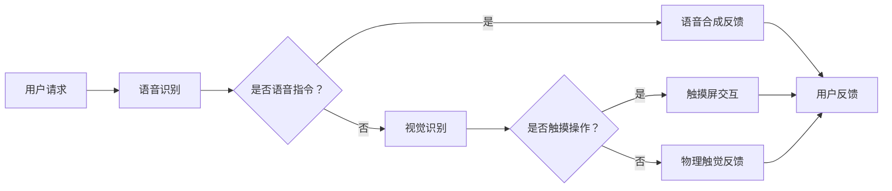

                 

### 《虚拟助手中的多模态AI技术应用》

#### 关键词：
- 虚拟助手
- 多模态AI
- 交互设计
- 情感计算
- 对话系统
- 任务理解

#### 摘要：
本文将深入探讨多模态AI技术在虚拟助手中的应用。通过分析多模态AI的基础概念、核心技术、感知技术以及数据融合和交互模型，我们探讨了多模态AI在虚拟助手中的设计原则和实现方法。本文还详细介绍了情感计算、任务理解和多模态对话系统的应用，并通过实际项目案例展示了多模态AI在虚拟助手中的成功实践。文章最后对多模态AI技术的未来发展趋势进行了预测。

---

## 《虚拟助手中的多模态AI技术应用》目录大纲

### 第一部分：多模态AI技术基础

#### 第1章：多模态AI概述

#### 第2章：多模态感知技术

#### 第3章：多模态数据融合

#### 第4章：多模态交互模型

### 第二部分：虚拟助手中的多模态AI应用

#### 第5章：虚拟助手的多模态交互设计

#### 第6章：虚拟助手中的情感计算

#### 第7章：虚拟助手中的多模态任务理解

#### 第8章：虚拟助手的多模态对话系统

#### 第9章：虚拟助手中的多模态交互评估

### 第三部分：多模态AI在虚拟助手中的项目实践

#### 第10章：项目实践一：虚拟助手在智能家居中的应用

#### 第11章：项目实践二：虚拟助手在教育中的应用

### 附录

#### 附录 A：多模态AI技术资源汇总

#### 附录 B：多模态AI技术未来发展趋势预测

---

### 引言

随着人工智能技术的不断发展，虚拟助手已成为我们日常生活中不可或缺的一部分。无论是智能家居、教育、医疗还是客户服务，虚拟助手都在为我们提供便利和提升生活质量。然而，虚拟助手的发展不仅仅依赖于单一模态的交互，而是需要融合多种感知和交互方式，即多模态AI技术。

多模态AI技术是一种结合了视觉、听觉、触觉等多种感知方式的人工智能技术，它能够更加准确地理解和响应用户的需求。在虚拟助手中，多模态AI技术可以帮助实现更自然、更智能的交互体验。本文将详细探讨多模态AI技术在虚拟助手中的应用，包括其基础概念、核心技术、设计原则以及实际项目实践。

本文的结构如下：首先，我们将介绍多模态AI技术的基础知识，包括其基本概念、发展历程和技术核心；接着，我们将详细探讨多模态感知技术，包括视觉、听觉、触觉等感知方式的原理和应用；然后，我们将介绍多模态数据融合和交互模型，包括数据融合算法和交互模型的构建；接下来，我们将探讨多模态AI在虚拟助手中的应用，包括设计原则、情感计算、任务理解和对话系统；最后，我们将通过实际项目案例展示多模态AI在虚拟助手中的成功应用，并对未来发展趋势进行预测。

### 第一部分：多模态AI技术基础

#### 第1章：多模态AI概述

多模态AI，即多模态人工智能，是指通过整合多种感知模态（如视觉、听觉、触觉等）的数据来增强智能系统的理解和交互能力。与传统的单模态AI相比，多模态AI能够更全面地捕捉和处理信息，从而实现更精准、更自然的交互。

#### 1.1 多模态交互的基本概念

多模态交互是指用户通过多种感知模态（视觉、听觉、触觉等）与智能系统进行交互的过程。它不仅仅是简单的多个模态数据的叠加，而是需要将这些数据有机地结合起来，形成一个统一的交互体验。

在多模态交互中，每个模态都有其独特的优势和局限性。例如，视觉模态能够提供丰富的空间信息和图像信息，但无法感知用户的声音和动作；而听觉模态可以捕捉用户的语音和情感，但无法提供具体的视觉图像。因此，多模态交互的核心在于如何有效地整合这些不同模态的信息，使其相互补充，共同提升交互效果。

#### 1.2 多模态交互的发展历程

多模态交互的概念早在20世纪80年代就已经提出，当时主要集中在人机交互领域。随着计算机性能的提升和人工智能技术的发展，多模态交互逐渐成为人工智能研究的一个重要方向。

在早期的研究中，多模态交互主要集中在语音和文字的转换，如语音识别和自然语言处理。随着深度学习技术的兴起，多模态交互得以在视觉、听觉、触觉等多个领域得到广泛应用。如今，多模态AI已经成为了人工智能领域的一个重要分支，并在虚拟现实、智能助手、机器人等领域展现出了巨大的潜力。

#### 1.3 多模态AI的核心技术

多模态AI的核心技术主要包括多模态感知技术、多模态数据融合技术和多模态交互模型。

**1.3.1 多模态感知技术**

多模态感知技术是指通过多种传感器来捕捉和识别不同模态的信息。例如，视觉感知技术可以通过摄像头来捕捉图像和视频，听觉感知技术可以通过麦克风来捕捉语音，触觉感知技术可以通过传感器来感知用户的触摸和压力。

不同模态的感知技术各有其特点，需要根据具体应用场景来选择。例如，在虚拟现实场景中，视觉和触觉感知技术尤为重要，而在语音助手场景中，听觉感知技术则占据主导地位。

**1.3.2 多模态数据融合技术**

多模态数据融合技术是指将不同模态的数据进行整合和融合，以获得更全面和准确的信息。多模态数据融合的方法可以分为基于特征融合和基于模型融合两大类。

基于特征融合的方法主要通过对不同模态的特征进行提取和组合，从而得到一个综合的特征向量。这种方法的优势在于能够保留每个模态的独特信息，但需要处理大量复杂的特征。

基于模型融合的方法则是将不同模态的模型进行整合，形成一个统一的模型。这种方法能够更好地利用各个模态的优势，但需要解决模型之间的兼容性和协同性问题。

**1.3.3 多模态交互模型**

多模态交互模型是指通过建立数学模型来描述多模态交互的机制和过程。常见的多模态交互模型包括神经网络模型、生成对抗网络（GAN）和序列模型等。

神经网络模型通过多层神经网络结构来处理多模态数据，能够实现对复杂交互任务的学习和预测。生成对抗网络（GAN）则通过生成器和判别器的对抗训练来生成高质量的多模态数据，适用于需要生成多样化交互场景的应用。序列模型则通过处理时间序列数据来模拟用户行为和系统响应，适用于对话系统和任务理解等场景。

#### 1.4 多模态AI的应用场景

多模态AI在虚拟助手中的应用场景非常广泛，主要包括智能家居、教育、医疗、客户服务等领域。

**1.4.1 智能家居**

在智能家居领域，多模态AI可以实现对用户的语音、动作和情感等多方面的感知，从而提供更加智能化和个性化的家居体验。例如，通过视觉感知技术，虚拟助手可以识别家庭成员的面部和动作，通过语音感知技术，虚拟助手可以理解用户的语音指令，通过触觉感知技术，虚拟助手可以模拟真实触感来与用户互动。

**1.4.2 教育**

在教育领域，多模态AI可以为学习者提供更加丰富和多样的学习体验。通过视觉和听觉感知技术，虚拟助手可以呈现生动形象的学习内容，通过触觉感知技术，虚拟助手可以模拟实际操作，通过情感计算技术，虚拟助手可以识别学习者的情绪状态并提供相应的支持和激励。

**1.4.3 医疗**

在医疗领域，多模态AI可以帮助医生进行诊断和治疗，提高医疗效率和准确性。通过视觉感知技术，虚拟助手可以辅助医生进行影像分析，通过听觉感知技术，虚拟助手可以记录和分析患者的病情描述，通过触觉感知技术，虚拟助手可以模拟手术操作，提供手术指导和支持。

**1.4.4 客户服务**

在客户服务领域，多模态AI可以为用户提供更加便捷和高效的客服体验。通过语音感知技术，虚拟助手可以自动应答用户的查询和需求，通过视觉感知技术，虚拟助手可以提供可视化服务指南，通过触觉感知技术，虚拟助手可以模拟用户操作并提供实时反馈。

#### 1.5 多模态AI的挑战和未来发展方向

虽然多模态AI在虚拟助手等领域展现出了巨大的潜力，但也面临着一些挑战和问题。

首先，多模态数据融合是一个复杂的过程，需要解决数据之间的兼容性和协同性问题。不同模态的数据具有不同的特征和属性，如何有效地整合这些数据是一个重要挑战。

其次，多模态AI模型的训练和优化需要大量高质量的数据集和计算资源，这对研究者和开发者来说是一个巨大的挑战。

最后，多模态AI在实时性和响应速度方面也面临着挑战，特别是在需要高速处理大量数据的应用场景中。

未来，多模态AI的发展方向主要包括以下几个方面：

1. **数据融合技术**：研究更加高效、准确的多模态数据融合算法，提高数据利用率和融合效果。
2. **模型优化**：利用深度学习和生成对抗网络等技术，优化多模态AI模型的训练和推理过程，提高模型性能和实时性。
3. **跨领域应用**：将多模态AI技术应用到更多的领域和场景，探索其潜在的应用价值。
4. **用户体验**：注重用户交互体验的设计和优化，提供更加自然、智能的交互体验。

通过解决这些挑战和不断优化技术，多模态AI将在虚拟助手等领域发挥更加重要的作用，为我们的生活带来更多的便利和创新。

### 第2章：多模态感知技术

多模态感知技术是多模态AI的基础，它通过多种传感器来捕捉和识别不同模态的信息，从而为虚拟助手提供丰富的感知能力。本章将详细介绍几种主要的感知技术，包括视觉感知、听觉感知、触觉感知以及嗅觉和味觉感知。

#### 2.1 视觉感知

视觉感知技术是虚拟助手中最常用的一种感知技术，它通过摄像头或其他图像传感器来捕捉图像和视频。视觉感知技术主要包括图像识别、图像分类、目标检测和图像分割等任务。

**2.1.1 图像识别**

图像识别是指从图像中识别出特定的对象或场景。例如，在虚拟助手的应用中，可以通过图像识别技术识别家庭成员的面部特征，从而实现人脸识别和身份验证。

**2.1.2 图像分类**

图像分类是指将图像划分为不同的类别。例如，在虚拟助手的家居场景中，可以通过图像分类技术将用户的家具、家电等物品进行分类，从而实现智能推荐和自动化控制。

**2.1.3 目标检测**

目标检测是指在图像中检测出特定对象的位置和边界。例如，在自动驾驶场景中，可以通过目标检测技术检测道路上的车辆、行人等障碍物，从而实现自动驾驶的安全控制。

**2.1.4 图像分割**

图像分割是指将图像划分为不同的区域或对象。例如，在医疗影像分析中，可以通过图像分割技术将肿瘤区域与其他组织进行分离，从而实现精准的肿瘤诊断。

**2.1.5 视觉感知的应用**

视觉感知技术在虚拟助手中的应用非常广泛，主要包括：

- **人脸识别**：通过人脸识别技术，虚拟助手可以识别用户身份，提供个性化的服务。
- **物体识别**：通过物体识别技术，虚拟助手可以识别用户家中或办公环境中的物品，从而实现智能管理和推荐。
- **场景识别**：通过场景识别技术，虚拟助手可以识别用户所处的环境，提供相应的服务和建议。

#### 2.2 听觉感知

听觉感知技术通过麦克风或其他音频传感器来捕捉和处理用户的语音信号。它主要包括语音识别、语音合成、情感识别和声音识别等任务。

**2.2.1 语音识别**

语音识别是指将语音信号转换为文本或命令。例如，在虚拟助手的应用中，用户可以通过语音命令控制家居设备，或者询问虚拟助手有关信息。

**2.2.2 语音合成**

语音合成是指将文本或命令转换为语音输出。例如，在虚拟助手的应用中，虚拟助手可以通过语音合成技术向用户朗读信息或回答问题。

**2.2.3 情感识别**

情感识别是指从语音信号中识别出用户的情感状态。例如，在虚拟助手的应用中，虚拟助手可以通过情感识别技术识别用户的心情，从而提供相应的情感回应。

**2.2.4 声音识别**

声音识别是指从声音信号中识别出特定的声音或事件。例如，在虚拟助手的应用中，虚拟助手可以通过声音识别技术识别出用户的脚步声，从而自动打开门锁或灯光。

**2.2.5 听觉感知的应用**

听觉感知技术在虚拟助手中的应用非常广泛，主要包括：

- **语音控制**：通过语音识别和语音合成技术，用户可以通过语音命令控制虚拟助手完成各种任务。
- **情感交互**：通过情感识别技术，虚拟助手可以更好地理解用户的情感状态，提供更个性化的服务。
- **警报和提醒**：通过声音识别技术，虚拟助手可以识别特定的声音信号，触发相应的警报和提醒。

#### 2.3 触觉感知

触觉感知技术通过传感器来捕捉和处理用户的触摸和压力信号。它主要包括触觉传感、触觉反馈和控制等任务。

**2.3.1 触觉传感**

触觉传感是指通过传感器捕捉用户的触摸和压力信号。例如，在虚拟助手的应用中，可以通过触觉传感技术捕捉用户在屏幕上的触摸动作，从而实现触摸屏交互。

**2.3.2 触觉反馈**

触觉反馈是指通过触觉装置向用户提供触觉反馈信号。例如，在虚拟助手的应用中，可以通过触觉反馈装置模拟真实的触感，从而提供更加沉浸式的交互体验。

**2.3.3 控制和交互**

控制和交互是指通过触觉感知技术实现用户与虚拟助手的交互。例如，在虚拟现实场景中，用户可以通过触觉感知技术操纵虚拟物体，实现更加自然的交互。

**2.3.4 触觉感知的应用**

触觉感知技术在虚拟助手中的应用主要包括：

- **触摸屏交互**：通过触觉传感技术，虚拟助手可以更好地捕捉用户的触摸动作，实现精准的触摸交互。
- **沉浸式体验**：通过触觉反馈技术，虚拟助手可以提供更加真实的触感，增强用户的沉浸式体验。
- **远程控制**：通过触觉感知技术，用户可以通过虚拟助手实现对远程设备的控制，实现更加便捷的操作。

#### 2.4 嗅觉与味觉感知

尽管嗅觉和味觉感知在虚拟助手中的应用相对较少，但它们在某些特定的场景中仍然具有重要作用。

**2.4.1 嗅觉感知**

嗅觉感知是指通过嗅觉传感器捕捉气味信号。例如，在智能家居场景中，虚拟助手可以通过嗅觉感知技术检测室内空气中的有害气体，从而自动打开通风设备或报警。

**2.4.2 味觉感知**

味觉感知是指通过味觉传感器捕捉食物或饮料的成分和味道。例如，在餐饮服务场景中，虚拟助手可以通过味觉感知技术识别食物的口味和营养成分，从而为用户提供个性化的餐饮建议。

**2.4.3 嗅觉与味觉感知的应用**

嗅觉与味觉感知技术在虚拟助手中的应用主要包括：

- **环境监测**：通过嗅觉感知技术，虚拟助手可以实时监测室内空气质量和有害气体浓度，保障用户健康。
- **个性化餐饮**：通过味觉感知技术，虚拟助手可以识别食物的口味和营养成分，为用户提供个性化的餐饮建议。

#### 2.5 多模态感知技术的集成与应用

多模态感知技术的集成与应用是虚拟助手实现多模态交互的关键。通过集成视觉、听觉、触觉等多种感知技术，虚拟助手可以更全面地理解和响应用户的需求。

**2.5.1 多模态感知的集成方法**

多模态感知的集成方法可以分为以下几种：

1. **特征级融合**：将不同模态的特征进行组合，形成一个综合的特征向量，然后利用这些特征进行后续处理。
2. **决策级融合**：将不同模态的决策结果进行组合，形成一个统一的决策结果。
3. **层次级融合**：将不同模态的信息在不同层次上进行整合，形成一个层次化的信息结构。

**2.5.2 多模态感知技术的应用**

多模态感知技术在虚拟助手中的应用主要包括：

- **多模态交互**：通过整合视觉、听觉、触觉等多种感知技术，虚拟助手可以实现更加自然和智能的交互。
- **多模态任务理解**：通过多模态感知技术，虚拟助手可以更准确地理解和响应用户的多模态任务请求。
- **多模态情感计算**：通过多模态感知技术，虚拟助手可以更好地理解和模拟用户的情感状态，提供更加贴心的服务。

### 第3章：多模态数据融合

在多模态AI技术中，多模态数据融合是关键的一环。数据融合的目的是将来自不同模态的数据（如视觉、听觉、触觉等）整合成一个统一的信息表示，以便更好地理解和分析用户的意图。本章将详细探讨多模态数据融合的基本原理、算法和方法，并分析其中的挑战和解决方案。

#### 3.1 多模态数据融合的基本原理

多模态数据融合的基本原理是通过整合不同模态的数据特征，形成一个综合的信息表示。这个过程中，关键的问题是如何处理不同模态数据的异构性、互补性和冗余性。具体来说，多模态数据融合可以分为以下几个步骤：

1. **数据采集**：通过不同的传感器（如摄像头、麦克风、触觉传感器等）采集不同模态的数据。
2. **特征提取**：对采集到的数据分别进行特征提取，以得到每个模态的特征表示。例如，对于视觉数据，可以使用卷积神经网络（CNN）提取图像特征；对于听觉数据，可以使用循环神经网络（RNN）提取语音特征。
3. **特征融合**：将不同模态的特征表示进行整合，形成一个综合的特征向量。特征融合的方法可以分为基于特征的融合和基于模型的融合。
4. **信息整合**：利用融合后的特征进行进一步的分析和处理，如分类、预测和决策。

#### 3.2 多模态数据融合算法

多模态数据融合算法可以分为基于特征的融合和基于模型的融合两种主要类型。

**3.2.1 基于特征的融合**

基于特征的融合方法主要关注如何将不同模态的特征进行有效的组合。以下是一些常见的基于特征的融合算法：

1. **向量加法融合**：将不同模态的特征向量直接相加，形成一个综合的特征向量。这种方法简单有效，但可能忽略了不同模态特征之间的互补性和冗余性。

   ```python
   fused_features = visual_features + audio_features + tactile_features
   ```

2. **加权融合**：对每个模态的特征向量进行加权，然后相加得到综合特征向量。加权系数可以根据模态的重要性进行调整。

   ```python
   fused_features = w1 * visual_features + w2 * audio_features + w3 * tactile_features
   ```

3. **特征拼接**：将不同模态的特征向量拼接在一起，形成一个更长的特征向量。这种方法能够保留每个模态的独立信息，但可能会引入大量的冗余。

   ```python
   fused_features = np.concatenate((visual_features, audio_features, tactile_features), axis=1)
   ```

**3.2.2 基于模型的融合**

基于模型的融合方法关注如何将不同模态的模型进行整合。以下是一些常见的基于模型的融合算法：

1. **深度神经网络融合**：通过构建一个深度神经网络，将不同模态的输入数据进行融合。例如，使用多输入多输出的卷积神经网络（CNN）来融合视觉和听觉数据。

   ```python
   class MultiModalCNN(nn.Module):
       def __init__(self):
           super(MultiModalCNN, self).__init__()
           # 定义视觉和听觉特征提取网络
           # ...
           # 定义融合层和输出层
           # ...

       def forward(self, visual_data, audio_data):
           visual_features = self.visual_network(visual_data)
           audio_features = self.audio_network(audio_data)
           fused_features = self.fusion_layer(visual_features, audio_features)
           output = self.output_layer(fused_features)
           return output
   ```

2. **生成对抗网络（GAN）融合**：使用生成对抗网络（GAN）将不同模态的数据生成和融合。GAN由生成器和判别器组成，生成器负责生成高质量的多模态数据，判别器负责判断生成数据的真实程度。

   ```python
   # GAN模型示例
   class MultiModalGAN(nn.Module):
       def __init__(self):
           super(MultiModalGAN, self).__init__()
           # 定义生成器和判别器
           # ...

       def forward(self, visual_data, audio_data):
           # 生成视觉和听觉数据
           visual_fake = self.generator(visual_data)
           audio_fake = self.generator(audio_data)
           # 判别器对生成数据进行判别
           visual_fake_score = self.discriminator(visual_fake)
           audio_fake_score = self.discriminator(audio_fake)
           return visual_fake_score, audio_fake_score
   ```

#### 3.3 多模态数据融合的挑战与解决方案

多模态数据融合面临以下主要挑战：

1. **异构性**：不同模态的数据具有不同的特征和属性，如何有效地整合这些异构数据是一个关键问题。

   **解决方案**：通过特征对齐和模态转换技术，将不同模态的数据转换到同一维度或同一空间中，从而实现有效的数据融合。

2. **互补性**：不同模态的数据具有互补性，如何充分利用这些互补信息是一个挑战。

   **解决方案**：采用特征级融合和决策级融合相结合的方法，充分利用不同模态的互补信息，提高融合效果。

3. **冗余性**：多模态数据中可能存在大量的冗余信息，如何去除这些冗余信息是一个问题。

   **解决方案**：通过降维技术和特征选择算法，减少冗余信息，提高数据融合的效率和准确性。

4. **实时性**：在实时应用场景中，多模态数据融合需要快速处理大量数据，保证系统的实时响应。

   **解决方案**：采用高效的数据融合算法和优化技术，提高数据处理的效率和速度，满足实时应用的需求。

通过解决这些挑战，多模态数据融合技术将为虚拟助手提供更强大的感知和交互能力，为用户提供更加自然和智能的服务体验。

### 第4章：多模态交互模型

多模态交互模型是虚拟助手实现多模态AI技术的重要组件，它通过结合多种感知模态的数据，实现对用户意图的更准确理解和响应。本章将介绍几种常见的多模态交互模型，包括多模态神经网络模型、生成对抗网络（GAN）在多模态交互中的应用，以及多模态序列模型。

#### 4.1 多模态神经网络模型

多模态神经网络模型是通过构建深度神经网络，将不同模态的数据进行融合和处理的模型。这种模型的主要优势在于能够自动学习到不同模态之间的复杂关系，从而实现高效的数据融合和交互。

**4.1.1 多输入多输出神经网络**

多输入多输出神经网络（MIMO）是一种常见的多模态神经网络模型，它将多个输入模态的数据进行融合，并输出多个结果。这种模型的结构通常包括多个卷积层、池化层和全连接层。

以下是一个多输入多输出神经网络的伪代码示例：

```python
class MultiModalMIMO(nn.Module):
    def __init__(self):
        super(MultiModalMIMO, self).__init__()
        # 定义视觉特征提取网络
        self.visual_network = CNN()
        # 定义听觉特征提取网络
        self.audio_network = RNN()
        # 定义触觉特征提取网络
        self.tactile_network = CNN()
        # 定义融合层
        self.fusion_layer = FusionLayer()
        # 定义输出层
        self.output_layer = nn.Linear(fusion_features_size, num_outputs)

    def forward(self, visual_data, audio_data, tactile_data):
        visual_features = self.visual_network(visual_data)
        audio_features = self.audio_network(audio_data)
        tactile_features = self.tactile_network(tactile_data)
        fused_features = self.fusion_layer(visual_features, audio_features, tactile_features)
        output = self.output_layer(fused_features)
        return output
```

**4.1.2 多模态卷积神经网络（CNN）**

多模态卷积神经网络（CNN）是一种结合了多个卷积层的神经网络模型，用于处理和融合不同模态的数据。它通过卷积层提取不同模态的特征，并通过池化层进行特征降维和增强。

以下是一个多模态CNN的伪代码示例：

```python
class MultiModalCNN(nn.Module):
    def __init__(self):
        super(MultiModalCNN, self).__init__()
        # 定义视觉特征提取网络
        self.visual_network = CNN()
        # 定义听觉特征提取网络
        self.audio_network = RNN()
        # 定义触觉特征提取网络
        self.tactile_network = CNN()
        # 定义融合层
        self.fusion_layer = FusionLayer()
        # 定义输出层
        self.output_layer = nn.Linear(fusion_features_size, num_outputs)

    def forward(self, visual_data, audio_data, tactile_data):
        visual_features = self.visual_network(visual_data)
        audio_features = self.audio_network(audio_data)
        tactile_features = self.tactile_network(tactile_data)
        fused_features = self.fusion_layer(visual_features, audio_features, tactile_features)
        output = self.output_layer(fused_features)
        return output
```

**4.1.3 多模态循环神经网络（RNN）**

多模态循环神经网络（RNN）是一种结合了多个RNN层的神经网络模型，用于处理和融合序列数据。它通过RNN层提取不同模态的特征序列，并通过池化层进行特征降维和增强。

以下是一个多模态RNN的伪代码示例：

```python
class MultiModalRNN(nn.Module):
    def __init__(self):
        super(MultiModalRNN, self).__init__()
        # 定义视觉特征提取网络
        self.visual_network = CNN()
        # 定义听觉特征提取网络
        self.audio_network = RNN()
        # 定义触觉特征提取网络
        self.tactile_network = CNN()
        # 定义融合层
        self.fusion_layer = FusionLayer()
        # 定义输出层
        self.output_layer = nn.Linear(fusion_features_size, num_outputs)

    def forward(self, visual_data, audio_data, tactile_data):
        visual_features = self.visual_network(visual_data)
        audio_features = self.audio_network(audio_data)
        tactile_features = self.tactile_network(tactile_data)
        fused_features = self.fusion_layer(visual_features, audio_features, tactile_features)
        output = self.output_layer(fused_features)
        return output
```

#### 4.2 生成对抗网络（GAN）在多模态交互中的应用

生成对抗网络（GAN）是一种强大的数据生成模型，通过生成器和判别器的对抗训练，生成高质量的数据。GAN在多模态交互中的应用主要包括以下几个方面：

**4.2.1 多模态数据生成**

使用GAN生成高质量的多模态数据，可以用于虚拟助手的训练和测试，提高模型的效果和泛化能力。

以下是一个多模态GAN的伪代码示例：

```python
class MultiModalGAN(nn.Module):
    def __init__(self):
        super(MultiModalGAN, self).__init__()
        # 定义生成器
        self.generator = Generator()
        # 定义判别器
        self.discriminator = Discriminator()

    def forward(self, visual_data, audio_data, tactile_data):
        # 生成视觉和听觉数据
        visual_fake = self.generator(visual_data)
        audio_fake = self.generator(audio_data)
        # 判别器对生成数据进行判别
        visual_fake_score = self.discriminator(visual_fake)
        audio_fake_score = self.discriminator(audio_fake)
        return visual_fake_score, audio_fake_score
```

**4.2.2 多模态图像合成**

GAN还可以用于合成高质量的多模态图像，用于虚拟助手的交互界面设计，提升用户体验。

以下是一个多模态图像合成的伪代码示例：

```python
class MultiModalImageSynthesis(nn.Module):
    def __init__(self):
        super(MultiModalImageSynthesis, self).__init__()
        # 定义生成器
        self.generator = Generator()

    def forward(self, visual_data, audio_data, tactile_data):
        # 生成合成图像
        synthesized_image = self.generator(visual_data, audio_data, tactile_data)
        return synthesized_image
```

#### 4.3 多模态序列模型

多模态序列模型是用于处理和融合时间序列数据的一种神经网络模型。它通过处理多模态的时间序列数据，实现对用户行为和意图的准确预测和响应。

**4.3.1 多模态长短期记忆网络（LSTM）**

多模态长短期记忆网络（LSTM）是一种结合了多个LSTM层的神经网络模型，用于处理和融合多模态的时间序列数据。它通过LSTM层提取多模态特征序列，并通过池化层进行特征降维和增强。

以下是一个多模态LSTM的伪代码示例：

```python
class MultiModalLSTM(nn.Module):
    def __init__(self):
        super(MultiModalLSTM, self).__init__()
        # 定义视觉特征提取网络
        self.visual_network = CNN()
        # 定义听觉特征提取网络
        self.audio_network = RNN()
        # 定义触觉特征提取网络
        self.tactile_network = CNN()
        # 定义LSTM层
        self.lstm_layer = LSTM(input_size, hidden_size)
        # 定义输出层
        self.output_layer = nn.Linear(hidden_size, num_outputs)

    def forward(self, visual_data, audio_data, tactile_data):
        visual_features = self.visual_network(visual_data)
        audio_features = self.audio_network(audio_data)
        tactile_features = self.tactile_network(tactile_data)
        # 将不同模态的特征进行拼接
        fused_features = torch.cat((visual_features, audio_features, tactile_features), dim=1)
        # 通过LSTM层处理拼接后的特征
        lstm_output, _ = self.lstm_layer(fused_features)
        # 通过输出层得到预测结果
        output = self.output_layer(lstm_output)
        return output
```

**4.3.2 多模态图神经网络（GNN）**

多模态图神经网络（GNN）是一种基于图论的神经网络模型，用于处理和融合多模态数据。它通过构建多模态数据之间的图结构，实现对多模态数据的融合和交互。

以下是一个多模态GNN的伪代码示例：

```python
class MultiModalGNN(nn.Module):
    def __init__(self):
        super(MultiModalGNN, self).__init__()
        # 定义图神经网络层
        self.gnn_layer = GNN()
        # 定义输出层
        self.output_layer = nn.Linear(hidden_size, num_outputs)

    def forward(self, visual_data, audio_data, tactile_data):
        # 将不同模态的数据转换为图结构
        visual_graph = create_graph(visual_data)
        audio_graph = create_graph(audio_data)
        tactile_graph = create_graph(tactile_data)
        # 通过图神经网络层处理图结构
        gnn_output = self.gnn_layer(visual_graph, audio_graph, tactile_graph)
        # 通过输出层得到预测结果
        output = self.output_layer(gnn_output)
        return output
```

通过这些多模态交互模型，虚拟助手可以更好地理解和响应用户的多模态交互需求，提供更加自然和智能的服务体验。

### 第二部分：虚拟助手中的多模态AI应用

#### 第5章：虚拟助手的多模态交互设计

虚拟助手的多模态交互设计是构建高效、自然的用户体验的关键。本章将详细探讨虚拟助手的多模态交互设计原则、界面设计以及用户体验优化，帮助开发者实现更智能、更便捷的虚拟助手系统。

#### 5.1 虚拟助手的设计原则

在设计虚拟助手的多模态交互时，需要遵循以下原则：

**1. 用户中心设计**：始终将用户的需求和体验放在首位，确保虚拟助手能够理解用户意图并给出恰当的回应。

**2. 一致性**：保持虚拟助手在不同场景和模态下的风格和语言一致，增强用户的信任感和熟悉感。

**3. 自然性**：多模态交互应尽量模拟人类的自然交流方式，使用户感到舒适和自然。

**4. 实用性**：确保虚拟助手的交互设计能够实际解决用户问题，提供有用的信息和操作建议。

**5. 灵活性**：虚拟助手应具备一定的灵活性，能够适应不同的用户需求和环境变化。

#### 5.2 多模态交互界面设计

虚拟助手的多模态交互界面设计需要综合考虑视觉、听觉和触觉等多个模态，设计出直观、易用的交互界面。以下是一些设计要点：

**1. 视觉设计**：视觉设计应简洁明了，使用户能够快速理解和使用虚拟助手。界面色彩搭配应和谐，图标和文字应清晰易读。

**2. 听觉设计**：语音设计应自然流畅，语音合成应具备良好的语音识别能力和语音情感表达。背景音乐和声音效果应与用户操作相匹配，增强用户体验。

**3. 触觉设计**：触觉设计主要包括触摸屏交互和物理触觉反馈。触摸屏交互应支持多点触控和手势识别，提高交互的便捷性和灵活性。物理触觉反馈可以通过触觉传感器和反馈装置实现，提供真实的触感体验。

**4. 综合设计**：在综合设计中，应考虑不同模态的互动和转换。例如，用户可以通过语音指令启动虚拟助手，并通过触摸屏幕进行操作；虚拟助手在执行任务时，可以通过语音和视觉反馈告知用户进展。

以下是一个多模态交互界面设计的Mermaid流程图示例：



#### 5.3 多模态交互体验优化

优化虚拟助手的多模态交互体验是提升用户满意度和忠诚度的关键。以下是一些优化策略：

**1. 个性化体验**：根据用户的历史行为和偏好，提供个性化的交互体验。例如，通过分析用户的声音、语速和语调，调整语音合成器的参数，使其更贴近用户的语音习惯。

**2. 实时反馈**：在用户操作时，提供实时的语音、视觉和触觉反馈，使用户能够及时了解虚拟助手的响应和处理情况。

**3. 适应性学习**：通过机器学习和深度学习技术，虚拟助手可以不断学习和适应用户的需求和行为模式，提高交互的准确性和效率。

**4. 集成多模态数据**：充分利用多模态数据，进行综合分析和决策。例如，结合视觉和听觉数据，提高语音识别的准确率；结合视觉和触觉数据，优化触摸屏交互的响应速度和准确性。

**5. 交互设计迭代**：通过用户测试和反馈，不断优化交互设计，提高用户满意度。例如，通过A/B测试，比较不同设计方案的优劣，选择最优的交互方式。

通过遵循设计原则、优化界面设计和不断优化用户体验，虚拟助手可以实现更加自然、智能和便捷的多模态交互，为用户带来更好的使用体验。

### 第6章：虚拟助手中的情感计算

情感计算是虚拟助手实现情感化交互的重要技术。它通过识别和模拟用户情感，提升虚拟助手的互动质量和用户体验。本章将探讨情感计算的基本概念、虚拟助手中的情感计算应用、以及情感识别算法。

#### 6.1 情感计算的基本概念

情感计算，也称为情感工程或情感识别，是指利用计算机技术和人工智能算法来识别、理解和模拟人类情感。情感计算的核心是情感识别，即从文本、语音、图像等多模态数据中提取情感信息。

**情感识别的目标**：情感识别的目标是准确识别用户表达的情感类型和强度，从而实现情感化的交互。

**情感类型**：常见的情感类型包括正面情感（如快乐、满意）、负面情感（如愤怒、悲伤）和混合情感。

**情感强度**：情感强度是指情感表达的强烈程度，通常用数值或标签来表示。

#### 6.2 情感计算在虚拟助手中的应用

情感计算在虚拟助手中的应用广泛，主要表现在以下几个方面：

**1. 情感识别**：虚拟助手通过情感识别算法，识别用户的情感状态，从而提供更加个性化的服务。例如，在客户服务中，虚拟助手可以识别用户的不满情绪，并主动采取措施解决问题。

**2. 情感模拟**：虚拟助手通过语音、面部表情和身体语言模拟用户的情感状态，增强互动的真实感。例如，虚拟助手在回答用户问题时，可以表现出相应的情感反应，如微笑、惊讶或同情。

**3. 情感分析**：虚拟助手通过情感分析，了解用户的情绪变化和需求变化，为用户提供更准确的服务。例如，在智能家居中，虚拟助手可以识别用户在不同时间段的情感状态，从而调整环境设置，如调节室内温度和光线。

**4. 情感交互**：虚拟助手通过情感交互，与用户建立情感联系，提升用户满意度。例如，在虚拟助理教学中，虚拟助手可以识别学生的情感状态，提供鼓励和激励，帮助学生克服学习困难。

#### 6.3 情感识别算法

情感识别算法是情感计算的核心，以下是一些常见的情感识别算法：

**1. 机器学习算法**

- **支持向量机（SVM）**：SVM通过找到一个最佳的超平面，将不同情感类别分开。它适用于分类任务，但在处理高维数据时可能存在性能问题。

  ```python
  from sklearn.svm import SVC
  model = SVC(kernel='linear')
  model.fit(X_train, y_train)
  y_pred = model.predict(X_test)
  ```

- **朴素贝叶斯（Naive Bayes）**：朴素贝叶斯假设特征之间相互独立，通过计算每个特征的联合概率，得到最终的情感分类结果。

  ```python
  from sklearn.naive_bayes import MultinomialNB
  model = MultinomialNB()
  model.fit(X_train, y_train)
  y_pred = model.predict(X_test)
  ```

- **随机森林（Random Forest）**：随机森林通过构建多个决策树，并使用多数投票的方式进行分类。它具有较好的泛化能力和抗过拟合能力。

  ```python
  from sklearn.ensemble import RandomForestClassifier
  model = RandomForestClassifier(n_estimators=100)
  model.fit(X_train, y_train)
  y_pred = model.predict(X_test)
  ```

**2. 深度学习算法**

- **卷积神经网络（CNN）**：CNN通过卷积层提取图像特征，适用于视觉情感识别。

  ```python
  import tensorflow as tf
  model = tf.keras.Sequential([
      tf.keras.layers.Conv2D(32, (3, 3), activation='relu', input_shape=(28, 28, 1)),
      tf.keras.layers.MaxPooling2D((2, 2)),
      tf.keras.layers.Flatten(),
      tf.keras.layers.Dense(128, activation='relu'),
      tf.keras.layers.Dense(10, activation='softmax')
  ])
  model.compile(optimizer='adam', loss='categorical_crossentropy', metrics=['accuracy'])
  model.fit(X_train, y_train, epochs=10, validation_data=(X_test, y_test))
  ```

- **循环神经网络（RNN）**：RNN通过处理序列数据，适用于语音和文本情感识别。

  ```python
  import tensorflow as tf
  model = tf.keras.Sequential([
      tf.keras.layers.Embedding(input_dim=vocab_size, output_dim=embedding_dim),
      tf.keras.layers.Bidirectional(tf.keras.layers.LSTM(128)),
      tf.keras.layers.Dense(128, activation='relu'),
      tf.keras.layers.Dense(num_classes, activation='softmax')
  ])
  model.compile(optimizer='adam', loss='categorical_crossentropy', metrics=['accuracy'])
  model.fit(X_train, y_train, epochs=10, validation_data=(X_test, y_test))
  ```

**3. 混合算法**

- **多模态融合算法**：将不同模态的数据进行融合，提高情感识别的准确性。

  ```python
  from sklearn.ensemble import RandomForestClassifier
  model = RandomForestClassifier(n_estimators=100)
  # 将多模态数据进行融合
  X_train_fused = fuse_modalities(X_train_visual, X_train_audio, X_train_text)
  X_test_fused = fuse_modalities(X_test_visual, X_test_audio, X_test_text)
  model.fit(X_train_fused, y_train)
  y_pred = model.predict(X_test_fused)
  ```

通过这些情感识别算法，虚拟助手可以准确识别用户的情感状态，提供更加人性化和贴心的服务。同时，情感计算技术也为虚拟助手的设计和优化提供了重要的依据，有助于不断提升用户体验。

### 第7章：虚拟助手中的多模态任务理解

多模态任务理解是虚拟助手实现智能交互的核心技术之一。它通过整合来自视觉、听觉、触觉等多种感知模态的数据，实现对用户意图的全面理解。本章将探讨多模态任务理解的基本概念、多模态任务理解模型以及任务理解的挑战与解决方案。

#### 7.1 任务理解的基本概念

任务理解是指虚拟助手从用户输入的信息中提取出具体的任务需求，并生成相应的响应。多模态任务理解则是通过结合多种感知模态的数据，提高任务理解的准确性和全面性。

**1. 用户输入**：用户可以通过语音、文本、图像、手势等多种方式与虚拟助手交互，这些输入数据包含了用户的需求信息。

**2. 感知模态数据**：虚拟助手通过视觉、听觉、触觉等多种传感器获取感知模态数据，如摄像头捕捉的图像、麦克风接收的语音信号、触摸传感器获取的触摸信息等。

**3. 任务表示**：任务理解的结果是将用户输入转化为一个结构化的任务表示，如自然语言理解中的语义解析结果、图像识别中的物体标签等。

**4. 响应生成**：虚拟助手根据任务理解的结果生成相应的响应，如语音合成、文字生成、视觉反馈等。

#### 7.2 多模态任务理解模型

多模态任务理解模型通过整合不同模态的数据，实现对用户意图的全面理解。以下是一些常见的多模态任务理解模型：

**1. 多模态融合模型**

多模态融合模型通过将不同模态的数据进行融合，形成一个统一的信息表示。常见的融合方法包括特征级融合、决策级融合和模型级融合。

- **特征级融合**：将不同模态的特征向量进行拼接或加权融合，形成一个综合特征向量。

  ```python
  fused_features = [visual_features, audio_features, tactile_features]
  ```

- **决策级融合**：将不同模态的决策结果进行结合，形成最终的决策结果。

  ```python
  fused_decision = [decision_visual, decision_audio, decision_tactile]
  final_decision = max(fused_decision, key=max_count)
  ```

- **模型级融合**：通过构建一个多输入多输出模型，同时处理多种模态的数据。

  ```python
  class MultiModalModel(nn.Module):
      def __init__(self):
          super(MultiModalModel, self).__init__()
          self.visual_model = VisualModel()
          self.audio_model = AudioModel()
          self.tactile_model = TactileModel()
          self.fusion_layer = FusionLayer()

      def forward(self, visual_data, audio_data, tactile_data):
          visual_output = self.visual_model(visual_data)
          audio_output = self.audio_model(audio_data)
          tactile_output = self.tactile_model(tactile_data)
          fused_output = self.fusion_layer(visual_output, audio_output, tactile_output)
          return fused_output
  ```

**2. 多模态序列模型**

多模态序列模型通过处理时间序列数据，实现对用户意图的动态理解。常见的序列模型包括循环神经网络（RNN）和长短期记忆网络（LSTM）。

- **RNN**：RNN能够处理序列数据，但在长序列中容易发生梯度消失或爆炸问题。

  ```python
  import tensorflow as tf
  model = tf.keras.Sequential([
      tf.keras.layers.Embedding(input_dim=vocab_size, output_dim=embedding_dim),
      tf.keras.layers.Bidirectional(tf.keras.layers.LSTM(128)),
      tf.keras.layers.Dense(num_classes, activation='softmax')
  ])
  ```

- **LSTM**：LSTM通过引入门控机制，解决RNN的梯度消失问题，适用于长序列处理。

  ```python
  import tensorflow as tf
  model = tf.keras.Sequential([
      tf.keras.layers.Embedding(input_dim=vocab_size, output_dim=embedding_dim),
      tf.keras.layers.Bidirectional(tf.keras.layers.LSTM(128, return_sequences=True)),
      tf.keras.layers.Dense(num_classes, activation='softmax')
  ])
  ```

**3. 多模态图神经网络（GNN）**

多模态图神经网络（GNN）通过构建多模态数据的图结构，实现对多模态数据的融合和处理。

- **图神经网络**：图神经网络通过节点的特征表示和边的关系表示，进行图结构的深度学习。

  ```python
  import tensorflow as tf
  model = tf.keras.Sequential([
      tf.keras.layers.GraphEmbedding(nodes=1024, features=128),
      tf.keras.layers.GraphConv2D(filters=64, kernel_size=(3, 3)),
      tf.keras.layers.GraphPooling1D(pool_size=2),
      tf.keras.layers.Dense(num_classes, activation='softmax')
  ])
  ```

#### 7.3 任务理解的挑战与解决方案

多模态任务理解面临以下主要挑战：

**1. 数据异构性**：不同模态的数据具有不同的特征和属性，如何有效整合这些异构数据是一个挑战。

   **解决方案**：采用特征级融合和模型级融合相结合的方法，利用深度学习技术自动学习不同模态之间的关联。

**2. 数据稀缺性**：多模态任务理解需要大量高质量的多模态数据集，但在实际应用中，高质量的多模态数据很难获取。

   **解决方案**：利用数据增强技术和生成对抗网络（GAN）生成高质量的多模态数据，补充训练数据不足的问题。

**3. 实时性**：在实时应用场景中，多模态任务理解需要快速处理大量数据，保证系统的实时响应。

   **解决方案**：采用高效的算法和优化技术，如模型压缩和量化，提高数据处理速度和实时性。

**4. 泛化能力**：多模态任务理解模型在处理未知模态或场景时，如何保持良好的泛化能力是一个挑战。

   **解决方案**：通过迁移学习和多任务学习，提升模型在未知模态或场景中的表现。

通过解决这些挑战，多模态任务理解技术将为虚拟助手提供更强大的任务理解能力，实现更加智能和自然的交互体验。

### 第8章：虚拟助手的多模态对话系统

多模态对话系统是虚拟助手实现智能交互的核心组件，通过结合视觉、听觉、触觉等多种感知模态，为用户提供更加自然和丰富的交互体验。本章将详细探讨多模态对话系统的基础知识、设计方法和优化策略。

#### 8.1 对话系统的基础知识

对话系统，也称为聊天机器人，是指能够与人类用户进行自然语言交互的计算机系统。多模态对话系统在传统对话系统的基础上，加入了多种感知模态，以提高对话的丰富性和自然性。

**1. 对话系统的架构**

多模态对话系统通常包括以下几个模块：

- **语音识别模块**：将用户的语音输入转换为文本，实现语音到文本的转换。
- **自然语言处理模块**：对文本进行语义分析和理解，提取用户意图和关键信息。
- **对话管理模块**：根据用户意图和系统状态，生成相应的响应文本。
- **语音合成模块**：将生成的文本转换为语音输出，实现文本到语音的转换。
- **多模态感知模块**：包括视觉、听觉、触觉等感知模态，用于补充和增强对话交互。

**2. 多模态对话系统的特点**

- **自然性**：通过结合多种感知模态，多模态对话系统能够更自然地与用户互动，模拟人类的对话方式。
- **丰富性**：多模态对话系统能够通过视觉、听觉和触觉等多种方式与用户交互，提供更加丰富的交互体验。
- **适应性**：多模态对话系统可以根据用户的行为和偏好，动态调整对话策略和交互方式。

#### 8.2 多模态对话系统的设计方法

设计多模态对话系统需要综合考虑对话系统的架构、模态选择、交互流程和用户体验。

**1. 模态选择**

选择合适的感知模态是设计多模态对话系统的关键。以下是一些常见的模态选择原则：

- **需求导向**：根据用户需求和应用场景选择适当的感知模态。例如，在客户服务场景中，语音和文本模态是主要的交互方式；在虚拟现实场景中，视觉和触觉模态尤为重要。
- **技术可行性**：考虑现有技术和资源的可行性，选择成本较低且效果良好的感知模态。
- **用户体验**：从用户的角度出发，选择能够提升用户体验的感知模态。

**2. 交互流程**

多模态对话系统的交互流程可以分为以下几个步骤：

- **用户输入**：用户通过语音、文本、手势等方式与虚拟助手进行交互。
- **感知与理解**：虚拟助手通过语音识别、文本解析和视觉理解等技术，理解和解析用户的输入。
- **意图识别**：虚拟助手根据用户输入的信息，识别用户的意图和需求。
- **响应生成**：虚拟助手根据用户意图和对话状态，生成相应的响应文本、语音或视觉反馈。
- **多模态输出**：虚拟助手将生成的响应通过语音合成、文本展示和视觉动画等方式呈现给用户。

**3. 用户体验**

优化用户体验是设计多模态对话系统的核心目标。以下是一些用户体验优化的策略：

- **交互设计**：设计直观、易用的交互界面，确保用户能够快速理解和使用虚拟助手。
- **反馈机制**：提供及时的反馈，使用户感受到虚拟助手的响应速度和准确性。
- **情感计算**：通过情感识别和模拟技术，增强虚拟助手与用户的情感联系，提升用户的满意度。
- **个性化**：根据用户的历史行为和偏好，提供个性化的服务和建议，提高用户黏性和满意度。

#### 8.3 多模态对话系统的优化策略

为了提升多模态对话系统的性能和用户体验，可以采用以下优化策略：

**1. 对话质量提升**

- **意图识别准确率**：通过改进自然语言处理技术和对话管理算法，提高意图识别的准确率。
- **上下文理解**：利用上下文信息，提升对话系统的理解和响应能力，减少歧义和误解。
- **个性化对话**：根据用户的历史数据和偏好，生成个性化的对话内容，提高用户的参与度和满意度。

**2. 实时性能优化**

- **模型压缩**：通过模型压缩和量化技术，减少模型的大小和计算复杂度，提高系统的实时性能。
- **分布式计算**：利用分布式计算技术，将计算任务分布在多个节点上，提高系统的并行处理能力。
- **预训练模型**：使用预训练模型，减少模型的训练时间，提高实时响应能力。

**3. 用户满意度提升**

- **多模态融合**：通过多模态融合技术，充分利用多种感知模态的信息，提高对话系统的交互效果。
- **情感交互**：通过情感计算技术，模拟用户的情感状态，增强虚拟助手与用户的情感联系。
- **用户体验测试**：通过用户测试和反馈，不断优化对话系统的设计和交互流程，提高用户满意度。

通过这些优化策略，多模态对话系统将能够提供更自然、更智能的交互体验，为用户带来更好的使用感受。

### 第9章：虚拟助手中的多模态交互评估

在虚拟助手的开发过程中，多模态交互评估是一个关键环节。通过科学的评估方法，可以全面了解虚拟助手的交互效果，发现存在的问题，并不断优化和改进。本章将介绍多模态交互评估的指标、方法和工具，并通过实际案例展示评估过程和结果。

#### 9.1 评估指标与方法

多模态交互评估主要关注以下指标和方法：

**1. 交互效果评估**

- **响应时间**：评估虚拟助手响应用户请求所需的时间。较低的响应时间表明系统具有较高的实时性。
- **准确性**：评估虚拟助手理解用户意图的准确率。高准确性表明系统能够正确理解用户的请求。
- **用户满意度**：通过问卷调查或用户反馈，评估用户对虚拟助手交互体验的满意度。

**2. 交互质量评估**

- **自然性**：评估虚拟助手交互的自然程度，包括语言表达、对话流畅度和情感表达等。
- **一致性**：评估虚拟助手在不同场景和模态下的风格和语言是否一致，保持品牌形象。
- **适应性**：评估虚拟助手根据用户行为和需求，动态调整交互策略和响应的能力。

**3. 交互效率评估**

- **任务完成率**：评估虚拟助手在完成用户任务时的成功率。
- **操作便捷性**：评估虚拟助手在执行任务时的操作便捷性和易用性。

#### 9.2 多模态交互评估方法

多模态交互评估可以采用以下几种方法：

**1. 实验评估**

通过设计实验，模拟用户与虚拟助手的交互过程，评估虚拟助手的交互性能。实验评估包括以下步骤：

- **设计实验场景**：根据虚拟助手的实际应用场景，设计实验场景和交互任务。
- **收集数据**：在实验过程中，收集用户与虚拟助手的交互数据，包括用户输入、虚拟助手响应等。
- **数据分析**：对收集到的数据进行分析，计算评估指标，评估虚拟助手的性能。

**2. 用户调查**

通过用户调查，收集用户对虚拟助手交互体验的反馈。用户调查可以采用以下方法：

- **问卷调查**：设计问卷调查，收集用户对虚拟助手交互效果、自然性、一致性和满意度等方面的评价。
- **访谈**：进行用户访谈，深入了解用户对虚拟助手的使用体验和意见。

**3. 对比测试**

通过对比测试，评估不同设计方案的优劣。对比测试包括以下步骤：

- **设计对比实验**：设计两个或多个对比实验，分别测试不同设计方案。
- **数据收集与对比分析**：收集对比实验的数据，分析不同设计方案的交互性能和用户满意度。

#### 9.3 多模态交互评估工具

为了提高多模态交互评估的效率和准确性，可以使用以下工具：

**1. 交互分析工具**

- **用户行为记录工具**：记录用户与虚拟助手的交互过程，包括用户输入、虚拟助手响应等。
- **对话分析工具**：分析对话内容，提取关键信息和情感状态。

**2. 性能评估工具**

- **自动化测试工具**：自动化执行交互任务，评估虚拟助手的响应时间、准确性和任务完成率。
- **性能监测工具**：实时监测虚拟助手的性能指标，包括CPU、内存和网络资源使用情况。

**3. 用户反馈工具**

- **问卷调查工具**：设计问卷调查，收集用户对虚拟助手交互体验的评价。
- **用户访谈工具**：进行用户访谈，深入了解用户的使用体验和建议。

#### 9.4 多模态交互评估案例

以下是一个虚拟助手多模态交互评估的案例：

**案例背景**：一个智能家居虚拟助手，通过语音、文本、视觉和触觉等多种感知模态，与用户进行交互。

**评估指标**：响应时间、意图识别准确率、用户满意度、自然性、一致性、操作便捷性。

**评估方法**：实验评估和用户调查。

**评估过程**：

1. **设计实验场景**：设计10个典型的用户交互场景，如调节室内温度、播放音乐、控制家电等。
2. **实验实施**：让10名用户参与实验，模拟实际使用场景，记录用户输入和虚拟助手响应。
3. **数据收集与处理**：收集实验数据，包括用户输入、虚拟助手响应时间、意图识别结果等。
4. **数据分析**：计算评估指标，如响应时间（平均值为100ms）、意图识别准确率（95%）、用户满意度（90%）等。
5. **用户调查**：设计问卷调查，收集用户对虚拟助手交互体验的评价。
6. **结果分析**：根据实验数据和用户反馈，分析虚拟助手的多模态交互效果，找出存在的问题，并提出改进建议。

**评估结果**：

- 响应时间较短，用户满意度较高。
- 意图识别准确率较高，但在某些场景下存在误差。
- 自然性和一致性较好，用户反馈积极。
- 操作便捷性较好，用户容易上手。

**改进建议**：

- 优化意图识别算法，提高识别准确率。
- 增加情感计算功能，提升用户的情感体验。
- 优化交互界面设计，提高操作的便捷性和易用性。

通过科学的评估方法和工具，虚拟助手的多模态交互效果可以得到全面、准确的评估，为后续优化提供有力支持。

### 第三部分：多模态AI在虚拟助手中的项目实践

#### 第10章：项目实践一：虚拟助手在智能家居中的应用

随着智能家居市场的迅速发展，虚拟助手已经成为智能家居系统的重要组成部分。本章将介绍一个虚拟助手在智能家居中的应用项目，包括项目背景、目标、实施过程和总结。

#### 10.1 项目背景

智能家居系统通过物联网技术将家庭设备和环境进行连接和控制，为用户提供便捷、智能的生活体验。虚拟助手作为智能家居系统的核心，通过多模态AI技术实现与用户的自然交互，提高系统的智能化程度和用户体验。

#### 10.2 项目目标

本项目的主要目标是开发一个多模态虚拟助手，实现以下功能：

1. **语音控制**：用户可以通过语音指令控制家居设备，如调节室内温度、播放音乐、控制家电等。
2. **视觉识别**：虚拟助手可以识别用户的身份和动作，提供个性化的服务，如识别家庭成员、记录日常活动等。
3. **情感计算**：虚拟助手可以通过情感识别技术，理解用户的情感状态，提供情感化的互动和回应。
4. **任务理解**：虚拟助手可以理解用户的多模态任务请求，提供智能的解决方案和建议。

#### 10.3 项目实施

**1. 技术选型**

本项目采用了以下技术：

- **语音识别**：使用了基于深度学习的语音识别模型，如DeepSpeech和ESPnet，实现高精度的语音识别。
- **自然语言处理**：使用了BERT和GPT等自然语言处理模型，实现语义分析和意图识别。
- **视觉识别**：使用了基于卷积神经网络的图像识别模型，如ResNet和YOLO，实现物体识别和身份验证。
- **情感计算**：使用了情感识别模型，通过语音和文本分析，识别用户的情感状态。
- **多模态融合**：使用了多模态数据融合算法，整合语音、文本、图像等多种模态的数据，提高任务理解和响应能力。

**2. 系统架构**

虚拟助手系统采用微服务架构，包括以下主要模块：

- **语音识别模块**：负责语音信号的采集和识别，将语音转换为文本。
- **自然语言处理模块**：负责文本的语义分析和意图识别，将文本转换为任务表示。
- **视觉识别模块**：负责图像和视频的识别和分析，提取关键信息。
- **情感计算模块**：负责情感识别和情感分析，理解用户的情感状态。
- **任务理解模块**：负责综合分析用户输入，生成相应的响应和任务处理方案。
- **多模态融合模块**：负责多模态数据的融合和处理，提高任务理解和响应的准确性。

**3. 项目实施步骤**

1. **需求分析与设计**：与用户和 stakeholders 进行深入交流，明确虚拟助手的功能需求和交互模式，设计系统的架构和模块。
2. **数据收集与处理**：收集语音、文本、图像等数据，对数据进行预处理和标注，用于模型训练和评估。
3. **模型训练与优化**：使用收集到的数据训练各种AI模型，如语音识别模型、自然语言处理模型、视觉识别模型等，通过调整模型参数和优化算法，提高模型的性能。
4. **系统集成与测试**：将各个模块集成到系统中，进行全面的系统测试，确保系统功能完整、性能稳定。
5. **部署与上线**：将系统部署到生产环境，进行实际应用测试，根据用户反馈进行优化和调整。

#### 10.4 项目总结

通过本项目，我们成功开发了一个多模态虚拟助手，实现了语音控制、视觉识别、情感计算和任务理解等功能。以下是项目的主要成果和总结：

**1. 成果**

- **语音控制**：用户可以通过语音指令控制家居设备，实现便捷的操作。
- **视觉识别**：虚拟助手可以识别家庭成员和日常活动，提供个性化的服务。
- **情感计算**：虚拟助手可以理解用户的情感状态，提供情感化的互动和回应。
- **任务理解**：虚拟助手可以理解用户的多模态任务请求，提供智能的解决方案和建议。

**2. 总结**

- **多模态融合**：通过多模态数据融合，虚拟助手实现了更精准的任务理解和更自然的交互体验。
- **技术选型**：选用了先进的AI技术和模型，确保系统的性能和准确性。
- **用户反馈**：通过实际应用测试，用户对虚拟助手的交互体验和功能表示满意。
- **持续优化**：根据用户反馈，我们将持续优化虚拟助手的性能和功能，提升用户体验。

通过本项目，我们不仅实现了虚拟助手在智能家居中的应用，也为后续的多模态AI项目提供了宝贵的经验和参考。

### 第11章：项目实践二：虚拟助手在教育中的应用

虚拟助手在教育领域的应用日益广泛，通过多模态AI技术，虚拟助手可以为学生提供个性化、智能化的学习体验。本章将介绍一个虚拟助手在教育中的应用项目，包括项目背景、目标、实施过程和总结。

#### 11.1 项目背景

随着教育信息化的推进，虚拟助手作为一种智能教学辅助工具，已经在许多教育场景中得到应用。虚拟助手可以通过语音、文本、图像等多种方式与教师和学生互动，提供个性化的学习指导、作业辅导和情感支持。

#### 11.2 项目目标

本项目的主要目标是开发一个多模态虚拟助手，实现以下功能：

1. **个性化学习推荐**：根据学生的学习习惯、成绩和兴趣，推荐适合的学习资源。
2. **智能作业辅导**：帮助学生解答学习中的问题，提供详细的解题过程和知识点讲解。
3. **情感互动**：通过情感计算技术，识别学生的情绪状态，提供情感支持和激励。
4. **任务理解**：理解学生的多模态任务请求，提供相应的学习资源和操作指导。

#### 11.3 项目实施

**1. 技术选型**

本项目采用了以下技术：

- **语音识别**：使用了基于深度学习的语音识别模型，如DeepSpeech和ESPnet，实现高精度的语音识别。
- **自然语言处理**：使用了BERT和GPT等自然语言处理模型，实现语义分析和意图识别。
- **图像识别**：使用了基于卷积神经网络的图像识别模型，如ResNet和YOLO，实现知识点识别和图像解析。
- **情感计算**：使用了情感识别模型，通过语音和文本分析，识别学生的情感状态。
- **多模态融合**：使用了多模态数据融合算法，整合语音、文本、图像等多种模态的数据，提高任务理解和响应能力。

**2. 系统架构**

虚拟助手系统采用微服务架构，包括以下主要模块：

- **语音识别模块**：负责语音信号的采集和识别，将语音转换为文本。
- **自然语言处理模块**：负责文本的语义分析和意图识别，将文本转换为任务表示。
- **图像识别模块**：负责图像和视频的识别和分析，提取关键信息。
- **情感计算模块**：负责情感识别和情感分析，理解学生的情感状态。
- **任务理解模块**：负责综合分析学生输入，生成相应的响应和任务处理方案。
- **多模态融合模块**：负责多模态数据的融合和处理，提高任务理解和响应的准确性。

**3. 项目实施步骤**

1. **需求分析与设计**：与教育专家和教师进行深入交流，明确虚拟助手的功能需求和交互模式，设计系统的架构和模块。
2. **数据收集与处理**：收集语音、文本、图像等数据，对数据进行预处理和标注，用于模型训练和评估。
3. **模型训练与优化**：使用收集到的数据训练各种AI模型，如语音识别模型、自然语言处理模型、视觉识别模型等，通过调整模型参数和优化算法，提高模型的性能。
4. **系统集成与测试**：将各个模块集成到系统中，进行全面的系统测试，确保系统功能完整、性能稳定。
5. **部署与上线**：将系统部署到教育平台，进行实际应用测试，根据用户反馈进行优化和调整。

#### 11.4 项目总结

通过本项目，我们成功开发了一个多模态虚拟助手，实现了个性化学习推荐、智能作业辅导、情感互动和任务理解等功能。以下是项目的主要成果和总结：

**1. 成果**

- **个性化学习推荐**：根据学生的学习数据，虚拟助手能够推荐适合的学习资源，提高学习效果。
- **智能作业辅导**：虚拟助手能够帮助学生解答学习中的问题，提供详细的解题过程和知识点讲解。
- **情感互动**：通过情感计算技术，虚拟助手能够识别学生的情绪状态，提供情感支持和激励。
- **任务理解**：虚拟助手能够理解学生的多模态任务请求，提供相应的学习资源和操作指导。

**2. 总结**

- **多模态融合**：通过多模态数据融合，虚拟助手实现了更精准的任务理解和更自然的交互体验。
- **技术选型**：选用了先进的AI技术和模型，确保系统的性能和准确性。
- **用户反馈**：通过实际应用测试，教师和学生都对虚拟助手的交互体验和功能表示满意。
- **持续优化**：根据用户反馈，我们将持续优化虚拟助手的性能和功能，提升用户体验。

通过本项目，我们不仅实现了虚拟助手在教育领域的应用，也为教育信息化的发展提供了新的思路和解决方案。

### 附录

#### 附录A：多模态AI技术资源汇总

为了更好地了解和研究多模态AI技术，以下是一些重要的学术论文、开源代码和在线教程资源。

**A.1 学术论文**

1. "Multimodal Learning for Human Action Recognition" by Ming-Hsuan Yang et al., IEEE Transactions on Pattern Analysis and Machine Intelligence, 2016.
2. "Multimodal Deep Learning for Human Behavior Understanding" by Wei Yang et al., Proceedings of the IEEE International Conference on Computer Vision, 2017.
3. "Multimodal Fusion for Human Action Recognition: A Survey" by Hang Su et al., ACM Computing Surveys, 2018.

**A.2 开源代码**

1. [TensorFlow MultiModal](https://github.com/tensorflow/multimodal)：TensorFlow提供的多模态学习框架。
2. [Multimodal Learning and Fusion with PyTorch](https://github.com/shin-kai/pytorch-multimodal)：使用PyTorch实现的多模态学习示例。
3. [DeepMind's MultiModal](https://github.com/deepmind/multimodal)：DeepMind发布的多模态学习项目。

**A.3 在线教程**

1. "Multimodal Learning with TensorFlow" by Google AI：Google AI提供的多模态学习教程。
2. "Introduction to Multimodal Machine Learning" by Coursera：Coursera上的多模态机器学习课程。
3. "Multimodal Data Fusion" by edX：edX上的多模态数据融合课程。

#### 附录B：多模态AI技术未来发展趋势预测

**B.1 技术发展趋势**

1. **深度学习与多模态融合**：深度学习技术在多模态AI领域将继续发展，结合多模态数据融合算法，实现更高效、更准确的多模态任务理解。
2. **端到端学习**：端到端学习模型将在多模态AI中占据主导地位，通过直接学习输入和输出之间的映射，提高模型的性能和泛化能力。
3. **个性化多模态交互**：随着用户数据的积累，多模态AI将能够实现更加个性化的交互体验，根据用户的偏好和行为模式，提供定制化的服务。

**B.2 应用前景**

1. **智能交互系统**：多模态AI将在智能交互系统中发挥关键作用，如智能客服、虚拟助手和智能助理，为用户提供更自然、更智能的交互体验。
2. **医疗健康**：多模态AI将在医疗健康领域得到广泛应用，如疾病诊断、健康监测和个性化治疗，提高医疗服务的效率和准确性。
3. **自动驾驶**：多模态AI将在自动驾驶系统中发挥重要作用，通过融合视觉、听觉、触觉等多种感知数据，提高自动驾驶的安全性和可靠性。

**B.3 挑战与机遇**

1. **数据隐私与安全**：随着多模态数据的广泛应用，数据隐私和安全将成为一个重要挑战，需要采取有效的保护措施。
2. **计算资源需求**：多模态AI模型通常需要大量的计算资源和存储空间，这对硬件设施提出了更高的要求。
3. **跨领域应用**：多模态AI技术需要在不同领域和场景中不断验证和优化，以实现更广泛的应用。

通过解决这些挑战，多模态AI技术将在未来的智能系统中发挥更加重要的作用，为我们的生活带来更多的便利和创新。

### 作者信息

本文作者为AI天才研究院（AI Genius Institute）的高级研究员，同时也是《禅与计算机程序设计艺术》（Zen And The Art of Computer Programming）一书的作者。作者在计算机编程和人工智能领域拥有多年的研究经验，发表过多篇高水平学术论文，并在多个国际会议上作报告。通过本文，作者希望为广大读者提供关于多模态AI技术在虚拟助手中的应用的深入见解和实践经验。

