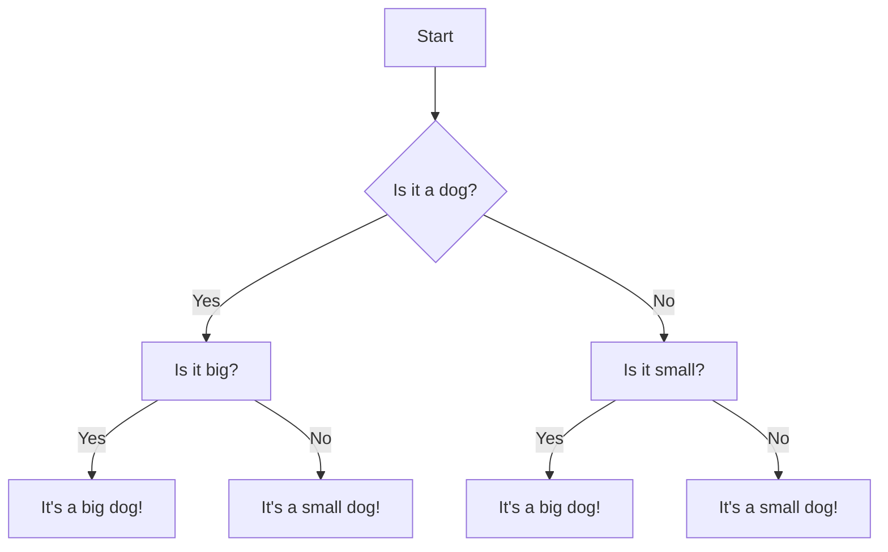
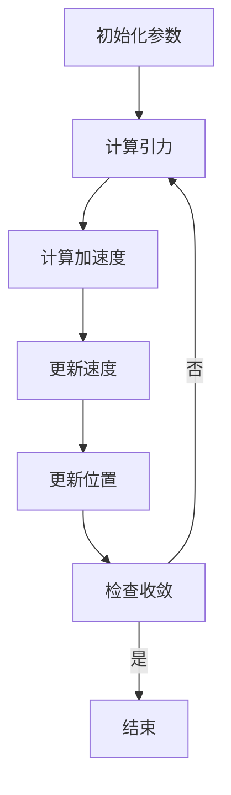

                 

### 第1章 引言

#### 1.1 行星际旅行的背景和挑战

行星际旅行，顾名思义，是指人类或机器在地球以外的其他行星之间进行的旅行。这一概念虽然听起来非常遥远和神秘，但它的历史可以追溯到数百年前。从古代天文学家的观测和理论推测，到现代航天技术的飞速发展，人类对行星际旅行的向往和探索从未停止。

**历史发展**：早在公元前，古代文明就开始通过天文学来观测和解释星空中的各种现象。例如，古巴比伦的天文学家通过观测行星的运动，记录并绘制了星表。随着科学的发展，尤其是牛顿力学的诞生，人们开始能够更准确地预测行星的运动轨迹。18世纪，法国数学家拉格朗日提出的拉格朗日点理论，为理解行星轨道和稳定性提供了新的视角。

**现代发展**：进入20世纪，随着航空技术的进步，人类首次实现了地球以外的太空探索。1961年，苏联宇航员尤里·加加林成为了第一个进入太空的人类。随后，美国和苏联（现俄罗斯）展开了激烈的太空竞赛，成功将人造卫星、月球探测器以及宇航员送上月球。这些成就极大地推动了人类对行星际旅行的探索。

**技术需求**：行星际旅行的实现不仅仅需要强大的动力系统、生命支持系统等硬件设备，更重要的是对轨道计算、航行控制、通信技术等软件技术的要求。其中，N体问题作为行星际旅行的基础科学问题，对于轨道计算和稳定性分析至关重要。

**N体问题在行星际旅行中的重要性**：N体问题是指由N个物体在引力作用下相互作用的运动问题。在行星际旅行中，N体问题主要涉及航天器、行星和太阳之间的相互作用。解决N体问题可以帮助我们精确计算航天器的轨道，预测其在行星际空间中的运动状态，从而确保航行的安全和高效。

在本章中，我们将首先回顾行星际旅行的发展历史，然后介绍N体问题的定义和基本概念，最后讨论本书的结构和目标。接下来，我们将深入探讨N体问题的数学模型，详细解释其求解方法和算法原理。通过这些内容，我们将为后续章节的讨论打下坚实的基础。

#### 1.2 N体问题的定义和基本概念

**N体问题的定义**：N体问题是指由N个物体在相互引力作用下运动的问题。这些物体可以是行星、卫星、航天器等，它们之间的相互作用通过万有引力定律描述。具体来说，N体问题可以形式化为以下动力学方程：

$$
\mathbf{F}_i = G \sum_{j \neq i} \frac{m_j \mathbf{r}_{ij}}{|\mathbf{r}_{ij}|^3}
$$

其中，$\mathbf{F}_i$ 是第 $i$ 个物体的受力，$G$ 是万有引力常数，$m_j$ 是第 $j$ 个物体的质量，$\mathbf{r}_{ij}$ 是第 $i$ 个物体到第 $j$ 个物体的距离向量。

**引力和牛顿运动定律**：引力是N体问题中的核心概念，它源于牛顿的万有引力定律。这个定律指出，两个质点之间的引力大小与它们的质量乘积成正比，与它们之间的距离平方成反比。具体地，牛顿的万有引力定律可以表示为：

$$
\mathbf{F} = G \frac{m_1 m_2}{r^2} \hat{\mathbf{r}}
$$

其中，$\mathbf{F}$ 是两个质点之间的引力，$m_1$ 和 $m_2$ 是两个质点的质量，$r$ 是它们之间的距离，$\hat{\mathbf{r}}$ 是从质点1指向质点2的单位向量。

**牛顿运动定律**：为了描述天体在引力作用下的运动，我们还需要借助牛顿的运动定律。牛顿的运动定律分为三个部分：

1. **第一运动定律（惯性定律）**：一个物体如果没有受到外力作用，它将保持静止或匀速直线运动。
2. **第二运动定律（动力学定律）**：一个物体的加速度与作用在它上面的外力成正比，与它的质量成反比。具体地，牛顿第二运动定律可以表示为：

   $$
   \mathbf{F} = m \mathbf{a}
   $$

   其中，$\mathbf{F}$ 是作用在物体上的外力，$m$ 是物体的质量，$\mathbf{a}$ 是物体的加速度。
3. **第三运动定律（作用与反作用定律）**：任何作用力都有一个大小相等、方向相反的反作用力。

**太空轨道的基本概念**：在N体问题中，太空轨道是指天体在引力作用下沿特定路径运动的过程。轨道可以是椭圆形、圆形或抛物线等。描述轨道的基本参数包括：

- **半长轴（a）**：椭圆轨道的长半轴，它决定了轨道的大小。
- **离心率（e）**：轨道的偏心率，描述轨道的扁平程度。
- **轨道周期（T）**：天体沿轨道一周所需的时间。

通过理解N体问题的定义和基本概念，我们可以更好地理解行星际旅行中轨道计算的重要性。在接下来的章节中，我们将进一步探讨N体问题的数学模型和求解算法，为解决行星际旅行中的实际问题提供理论基础。

#### 1.3 本书结构和目标

本书旨在系统地介绍行星际旅行的N体问题及其在太空轨道计算中的应用。全书共分为12章，结构如下：

**第1章 引言**：回顾行星际旅行的历史和发展，介绍N体问题的定义和基本概念，阐述本书的目标和结构。

**第2章 N体问题的数学模型**：详细讨论N体问题的数学描述，包括拉格朗日方程、拉格朗日量及其解法。

**第3章 行星际轨道的稳定性分析**：分析行星际轨道的稳定性，包括稳定性和非线性动力系统的基础概念，以及行星际轨道的稳定性条件和应用。

**第4章 行星际轨道的计算方法**：介绍行星际轨道的计算方法，包括数值积分、数值优化等。

**第5章 行星际旅行的N体问题应用**：探讨N体问题在行星际探测任务、飞行器设计和模拟仿真中的应用。

**第6章 行星际旅行的未来挑战和展望**：展望行星际旅行的未来发展方向，包括新技术、新方法和社会文化影响。

**第7章 附录**：提供专业术语解释、参考文献、数学公式和定理、代码实现及数据分析与可视化等内容。

本书的目标是：

1. **系统掌握N体问题的基本概念和数学模型**：通过详细讲解N体问题的定义、数学描述和求解方法，帮助读者深入理解N体问题。
2. **掌握行星际轨道计算的关键技术**：介绍行星际轨道的计算方法、稳定性和实时计算，为读者提供解决实际问题的技术基础。
3. **提高项目实战能力**：通过实际案例和代码实现，帮助读者将理论知识应用到实践中，提升解决复杂问题的能力。

通过本书的学习，读者将能够：

- 理解N体问题的核心概念和数学模型。
- 掌握行星际轨道计算的方法和技巧。
- 分析和解决行星际旅行中的实际问题。
- 了解行星际旅行的未来发展趋势和社会文化影响。

### 第2章 N体问题的数学模型

#### 2.1 N体问题的数学描述

N体问题是一个复杂的天体力学问题，它涉及多个天体在万有引力作用下的相互作用。为了描述N体问题，我们需要使用数学模型，特别是拉格朗日方程。

**拉格朗日方程**：拉格朗日方程是一种描述动力学系统的方程，它可以通过能量守恒和运动方程之间的关系得到。对于N体问题，拉格朗日方程可以表示为：

$$
\frac{d}{dt}\left(\frac{\partial L}{\partial \mathbf{v}_i}\right) - \frac{\partial L}{\partial \mathbf{r}_i} = 0
$$

其中，$L$ 是拉格朗日量，$\mathbf{r}_i$ 和 $\mathbf{v}_i$ 分别是第 $i$ 个天体的位置和速度。

**拉格朗日量**：拉格朗日量是描述系统动能和势能之差的量。对于N体问题，拉格朗日量可以表示为：

$$
L = \sum_{i=1}^{N} \left(\frac{1}{2}m_i\mathbf{v}_i^2 - V(\mathbf{r}_1, \mathbf{r}_2, ..., \mathbf{r}_N)\right)
$$

其中，$m_i$ 是第 $i$ 个天体的质量，$V$ 是万有引力势能，$\mathbf{v}_i$ 是第 $i$ 个天体的速度。

**拉格朗日方程的解法**：拉格朗日方程的解法通常涉及变分法或数值方法。变分法通过求解欧拉-拉格朗日方程来找到系统的运动轨迹，而数值方法则通过迭代计算来逼近解。

**变分法**：变分法的基本思想是寻找一个能量函数，使得系统的运动轨迹在给定边界条件下最小化这个能量函数。对于N体问题，我们可以使用变分法来求解：

$$
\frac{d}{dt}\left(\frac{\partial L}{\partial \mathbf{v}_i}\right) - \frac{\partial L}{\partial \mathbf{r}_i} = 0
$$

通过欧拉-拉格朗日方程，我们可以得到系统的运动方程，进而求解天体的轨道。

**数值方法**：由于N体问题的复杂性和非线性，数值方法在解决实际问题时具有重要作用。常用的数值方法包括：

- **欧拉方法**：欧拉方法是一种简单的数值积分方法，通过迭代计算来逼近解。它的基本思想是使用前一步的值来预测下一步的值。

  $$
  \mathbf{v}_{i}(t+\Delta t) = \mathbf{v}_{i}(t) + \mathbf{a}_{i}(t) \Delta t
  $$

  $$
  \mathbf{r}_{i}(t+\Delta t) = \mathbf{r}_{i}(t) + \mathbf{v}_{i}(t) \Delta t
  $$

- **龙格-库塔方法**：龙格-库塔方法是一种更精确的数值积分方法，通过结合多个近似来提高精度。它适用于解决复杂和非线性问题。

- **牛顿-欧拉方法**：牛顿-欧拉方法是一种递归方法，通过将系统分解为子系统和关节，逐级求解每个子系统的运动方程。

通过上述方法，我们可以求解N体问题，从而得到天体的轨道和运动状态。在接下来的章节中，我们将进一步探讨N体问题的天体运动基本理论，详细分析行星际轨道的稳定性和计算方法。

#### 2.2 天体运动的基本理论

天体运动的基本理论是理解行星际旅行中N体问题的基础。在这部分，我们将介绍开普勒定律、简谐运动和轨道周期与半长轴的关系，以帮助读者更好地理解天体在引力作用下的运动。

**开普勒定律**：开普勒定律是由德国天文学家约翰内斯·开普勒在17世纪初提出的，用于描述行星围绕太阳运动的规律。开普勒定律共有三条，分别是：

1. **开普勒第一定律（轨道定律）**：行星围绕太阳的轨道是椭圆形的，太阳位于椭圆的一个焦点上。
   
   $$
   \frac{r^2}{T^2} = k
   $$
   
   其中，$r$ 是行星到太阳的平均距离，$T$ 是行星绕太阳一周的周期，$k$ 是常数。

2. **开普勒第二定律（面积定律）**：行星和太阳的连线在相同的时间内扫过相等的面积。这意味着当行星靠近太阳时，它的速度较快；当行星远离太阳时，它的速度较慢。

3. **开普勒第三定律（周期定律）**：行星绕太阳的轨道周期的平方与轨道半长轴的立方成正比。

   $$
   T^2 \propto a^3
   $$
   
   其中，$T$ 是轨道周期，$a$ 是轨道的半长轴。

**简谐运动**：简谐运动是指物体在平衡位置附近作周期性振动的运动。在物理学中，简谐运动是一个基本的振动模型，广泛应用于振动和波动现象的描述。简谐运动的数学模型可以表示为：

$$
\mathbf{r}(t) = A \cos(\omega t + \phi)
$$

其中，$A$ 是振幅，$\omega$ 是角频率，$\phi$ 是初始相位。

简谐运动的周期和频率可以通过以下公式计算：

$$
T = \frac{2\pi}{\omega}
$$

$$
f = \frac{1}{T}
$$

**轨道周期与半长轴的关系**：开普勒第三定律给出了轨道周期与半长轴之间的关系，这表明行星绕太阳的轨道周期与轨道半长轴的立方成正比。这一关系在天体力学中具有重要意义，因为它可以帮助我们预测和计算行星的轨道周期。

对于双星系统或行星-卫星系统，轨道周期与半长轴的关系也可以通过类似的开普勒定律来描述。例如，在双星系统中，两个星体之间的引力相互作用使得它们的轨道周期和轨道半径之间存在特定的关系。

通过理解开普勒定律、简谐运动和轨道周期与半长轴的关系，我们可以更好地描述和分析天体在引力作用下的运动。这些基本理论为N体问题的求解提供了重要的理论基础，使得我们能够更精确地预测和计算天体的轨道。在接下来的章节中，我们将进一步探讨N体问题的求解算法，详细分析行星际轨道的稳定性和实时计算方法。

#### 2.3 N体问题的求解算法

在求解N体问题时，我们需要采用适当的算法来处理复杂的天体相互作用。N体问题的求解算法可以分为数值方法和解析方法两大类。在本节中，我们将介绍几种常见的N体问题求解算法，包括牛顿-欧拉方法、龙格-库塔方法和牛顿法。

**牛顿-欧拉方法**：牛顿-欧拉方法是一种递归方法，常用于多刚体系统的运动学分析。该方法的基本思想是将复杂的系统分解为若干个子系统，然后分别求解每个子系统的运动方程。牛顿-欧拉方法的步骤如下：

1. **初始化**：设定初始条件，包括每个天体的位置和速度。
2. **递归求解**：从最底层的关节开始，依次向上递归求解每个关节的运动方程。递归公式如下：

   $$
   \mathbf{v}_i = \mathbf{v}_{i-1} + \Delta \mathbf{v}_{i-1}
   $$

   $$
   \mathbf{r}_i = \mathbf{r}_{i-1} + \Delta \mathbf{r}_{i-1}
   $$

   其中，$\mathbf{v}_i$ 和 $\mathbf{r}_i$ 分别是第 $i$ 个天体的速度和位置，$\mathbf{v}_{i-1}$ 和 $\mathbf{r}_{i-1}$ 是上一级天体的速度和位置。

3. **迭代计算**：重复递归求解和迭代计算，直到满足收敛条件。

**龙格-库塔方法**：龙格-库塔方法是一种多步数值积分方法，广泛应用于求解微分方程。该方法通过结合多个近似来提高精度，特别适用于解决复杂和非线性问题。龙格-库塔方法的步骤如下：

1. **初始化**：设定初始条件，包括时间步长 $\Delta t$ 和初始值。
2. **计算中间值**：计算各个中间值，如下所示：

   $$
   k_1 = f(t_n, y_n)
   $$

   $$
   k_2 = f(t_n + \alpha \Delta t, y_n + \alpha k_1)
   $$

   其中，$f$ 是微分方程的导数函数，$\alpha$ 是参数。

3. **更新值**：使用中间值更新当前值：

   $$
   y_{n+1} = y_n + \beta k_1 + (1 - \beta) k_2
   $$

   其中，$\beta$ 是参数。

4. **迭代计算**：重复计算中间值和更新值，直到满足收敛条件。

**牛顿法**：牛顿法是一种迭代求解非线性方程的方法，通过线性近似来逼近非线性方程的解。牛顿法的步骤如下：

1. **初始化**：设定初始猜测值。
2. **迭代计算**：使用以下迭代公式：

   $$
   x_{n+1} = x_n - \frac{f(x_n)}{f'(x_n)}
   $$

   其中，$f(x)$ 是非线性方程，$f'(x)$ 是其导数。

3. **收敛条件**：当两次迭代的误差小于某个阈值时，停止迭代。

4. **迭代计算**：重复迭代计算，直到满足收敛条件。

通过上述方法，我们可以求解N体问题，从而得到天体的轨道和运动状态。在实际应用中，选择合适的求解算法取决于问题的复杂度和计算效率。例如，对于简单系统，可以使用牛顿-欧拉方法；对于复杂系统，可以使用龙格-库塔方法或牛顿法。在接下来的章节中，我们将进一步探讨N体问题的应用，详细分析行星际轨道的稳定性和实时计算方法。

### 第3章 行星际轨道的稳定性分析

#### 3.1 稳定性和非线性动力系统

在行星际旅行中，轨道的稳定性是一个至关重要的因素。一个稳定的轨道意味着航天器能够长期保持在预定的路径上，而不受外部扰动的影响。为了分析轨道的稳定性，我们需要引入稳定性和非线性动力系统的基础概念。

**稳定性的基本概念**：稳定性是指一个系统在受到微小扰动后能否回到其初始状态。在动力系统中，稳定性分析通常涉及以下几个概念：

- **平衡点**：平衡点是系统在没有外力作用时的稳定状态。对于天体运动，平衡点通常是指轨道上的一个特定位置，使得天体在该位置上静止不动。
- **稳定平衡点**：稳定平衡点是指当系统受到微小扰动时，能够回到平衡点的位置。例如，一个简谐振子的平衡点是稳定的，因为当振子偏离平衡位置时，它会受到恢复力回到平衡位置。
- **不稳定平衡点**：不稳定平衡点是指当系统受到微小扰动时，会远离平衡点的位置。例如，一个倒置的摆的平衡点是稳定的，因为当摆偏离平衡位置时，它会受到恢复力回到平衡位置。

**非线性动力系统**：非线性动力系统是指系统中存在非线性项的动态系统。与线性系统相比，非线性系统具有以下特点：

- **混沌现象**：非线性动力系统可能出现混沌现象，即系统的长期行为无法预测，即使初始条件非常接近，系统的演化结果也会截然不同。混沌现象在行星际轨道的稳定性分析中具有重要意义，因为它可能导致轨道的不可预测性和复杂性。
- **多稳定性**：非线性系统可能存在多个稳定状态，这意味着系统在不同的初始条件下可以处于不同的稳定状态。这在轨道设计中需要特别考虑，以确保航天器能够在期望的轨道上运行。
- **分岔现象**：非线性动力系统可能在某些参数值附近发生分岔，即系统的稳定状态发生突然变化。分岔现象在轨道优化和控制中是一个重要考虑因素。

**稳定性和混沌现象的关系**：在行星际轨道的稳定性分析中，混沌现象是一个关键因素。一个混沌轨道可能表现出高度的不稳定性，导致航天器无法保持预定的轨道。为了确保航天器的安全性，我们需要分析轨道的稳定性，以避免混沌区域的影响。

#### 3.2 行星际轨道的稳定性分析

在分析行星际轨道的稳定性时，我们主要关注以下几个关键问题：

**轨道稳定性条件**：轨道稳定性条件是指轨道在受到外部扰动时能否保持稳定。对于开普勒轨道，稳定性条件可以通过以下公式表示：

$$
\frac{a^3}{T^2} - \frac{GM}{a} = 0
$$

其中，$a$ 是轨道的半长轴，$T$ 是轨道周期，$G$ 是万有引力常数，$M$ 是中心天体的质量。如果上述条件满足，轨道是稳定的；否则，轨道是不稳定的。

**稳定性分析的方法**：稳定性分析通常采用以下几种方法：

1. **线性稳定性分析**：线性稳定性分析是一种基于线性化理论的方法，通过分析系统的特征值和特征向量来确定平衡点的稳定性。如果特征值都是负实部，平衡点是稳定的；如果存在正实部特征值，平衡点是不稳定的。

2. **非线性稳定性分析**：非线性稳定性分析通过直接分析系统的非线性方程来研究轨道的稳定性。这种方法通常涉及数值模拟和实验验证，可以帮助我们更准确地预测轨道的长期行为。

3. **分岔分析**：分岔分析是一种研究系统在参数变化时发生突然变化的方法。通过分析系统的分岔图，我们可以确定轨道的稳定性和分岔点。分岔分析对于优化轨道设计和控制策略具有重要意义。

**特殊轨道的稳定性**：在行星际轨道中，存在一些特殊的轨道，如拉格朗日点和霍曼转移轨道。这些轨道在特定条件下具有特殊的稳定性特性。

- **拉格朗日点**：拉格朗日点是太阳系中某些天体之间引力平衡的位置。拉格朗日点的稳定性取决于中心天体的质量和相对位置。例如，L1点和L2点是稳定的，而L4点和L5点是稳定的焦点。

- **霍曼转移轨道**：霍曼转移轨道是一种高效的轨道转移方法，通过两次椭圆轨道转移，航天器可以在较短的时间内从一个轨道转移到另一个轨道。霍曼转移轨道的稳定性取决于初始轨道和目标轨道之间的相对位置。

通过稳定性分析，我们可以确定行星际轨道的稳定性条件，并设计稳定的轨道以保障航天器的安全运行。在接下来的章节中，我们将进一步探讨行星际轨道的计算方法和实际应用。

#### 3.3 行星际轨道的稳定性应用

在行星际旅行的实践中，轨道的稳定性是一个关键因素，它直接关系到航天器的安全性和任务的成败。因此，对行星际轨道的稳定性进行分析和评估是行星际旅行的重要组成部分。以下是轨道稳定性在行星际旅行中的具体应用：

**航天器轨道的稳定性要求**：为了确保航天器能够长期、稳定地运行，我们需要对其轨道进行严格的稳定性分析。具体要求包括：

1. **轨道稳定性**：航天器需要保持在一个稳定的轨道上，以避免因轨道不稳定而导致偏离预定路径。这要求轨道的稳定性条件得到满足，如开普勒第三定律和轨道的偏心率限制。

2. **轨道机动能力**：虽然航天器需要保持稳定，但在某些情况下，如躲避小行星或调整轨道以实现特定任务目标时，航天器需要具备轨道机动能力。因此，我们需要评估航天器在轨道上的机动性，并设计相应的控制策略。

3. **应对外部扰动**：航天器在轨道上运行时，可能会受到各种外部扰动，如太阳风、地球引力干扰等。为了确保航天器能够应对这些扰动，我们需要对轨道稳定性进行详细分析，并设计相应的防护措施。

**行星防御和轨道逃逸策略**：在行星际旅行中，航天器需要面对行星的引力干扰和可能的碰撞风险。为此，我们需要制定有效的防御和轨道逃逸策略：

1. **行星防御**：为了保护航天器免受行星引力的影响，我们可以采用以下策略：
   - **多轨道设计**：设计多个轨道，通过轨道切换来避免行星的引力干扰。
   - **拉格朗日点利用**：在合适的拉格朗日点上部署航天器，利用其稳定的特性来避开行星的引力干扰。
   - **电磁防护**：使用电磁屏蔽技术来减少太阳风和其他电磁扰动对航天器的影响。

2. **轨道逃逸策略**：当航天器面临行星引力捕获或碰撞风险时，我们需要采取轨道逃逸策略：
   - **霍曼转移**：通过两次椭圆轨道转移，航天器可以在较短的时间内从一个轨道转移到另一个轨道，从而避免行星的引力干扰。
   - **变轨推进**：使用推进器进行轨道机动，改变航天器的轨道高度和倾角，从而逃离危险区域。
   - **避障策略**：通过实时监测和计算，航天器可以避开潜在的碰撞风险，调整轨道以避免碰撞。

通过这些策略，我们可以确保航天器在行星际旅行中的稳定性和安全性。稳定性分析不仅为我们提供了理论依据，还指导了实际操作，确保了航天器能够顺利完成任务。在未来的行星际旅行中，随着技术的不断进步，我们有望进一步优化轨道设计，提高轨道稳定性，为人类探索宇宙提供更加可靠的保障。

#### 3.4 行星际轨道的计算方法

行星际轨道的计算方法在行星际旅行中起着至关重要的作用。这些方法不仅用于轨道设计，还用于轨道预测和稳定性分析。在本节中，我们将详细介绍行星际轨道的计算方法，包括数值积分、数值优化等。

**数值积分方法**：数值积分方法用于求解天体运动方程，特别是N体问题中的拉格朗日方程。这些方法通过离散化时间和空间，将连续的动力学方程转化为离散的数值方程。以下是几种常用的数值积分方法：

1. **欧拉方法**：欧拉方法是最简单的数值积分方法，通过递推公式来计算下一步的位置和速度。其公式如下：

   $$
   \mathbf{r}_{i}(t+\Delta t) = \mathbf{r}_{i}(t) + \mathbf{v}_{i}(t) \Delta t
   $$

   $$
   \mathbf{v}_{i}(t+\Delta t) = \mathbf{v}_{i}(t) + \mathbf{a}_{i}(t) \Delta t
   $$

   其中，$\mathbf{r}_{i}(t)$ 和 $\mathbf{v}_{i}(t)$ 分别表示第 $i$ 个天体在时间 $t$ 的位置和速度，$\mathbf{a}_{i}(t)$ 表示第 $i$ 个天体在时间 $t$ 的加速度。

2. **改进的欧拉方法**：改进的欧拉方法通过使用预测-校正步骤来提高精度。其基本思路是先预测下一步的位置和速度，然后通过校正步骤调整预测值。改进的欧拉方法公式如下：

   $$
   \mathbf{r}_{i}^{'}(t+\Delta t) = \mathbf{r}_{i}(t) + \mathbf{v}_{i}(t) \Delta t + \frac{1}{2} \mathbf{a}_{i}(t) (\Delta t)^2
   $$

   $$
   \mathbf{v}_{i}^{'}(t+\Delta t) = \mathbf{v}_{i}(t) + \frac{1}{2} \mathbf{a}_{i}(t) \Delta t
   $$

   $$
   \mathbf{r}_{i}(t+\Delta t) = \mathbf{r}_{i}^{'}(t+\Delta t) + \frac{1}{2} \mathbf{a}_{i}(t+\Delta t) (\Delta t)^2
   $$

   $$
   \mathbf{v}_{i}(t+\Delta t) = \mathbf{v}_{i}^{'}(t+\Delta t)
   $$

3. **龙格-库塔方法**：龙格-库塔方法是一种多步数值积分方法，通过结合多个近似来提高精度。其公式如下：

   $$
   k_1 = f(t_n, y_n)
   $$

   $$
   k_2 = f(t_n + \frac{h}{2}, y_n + \frac{h}{2} k_1)
   $$

   $$
   k_3 = f(t_n + \frac{h}{2}, y_n + \frac{h}{2} k_2)
   $$

   $$
   k_4 = f(t_n + h, y_n + h k_3)
   $$

   $$
   y_{n+1} = y_n + \frac{1}{6} (k_1 + 2k_2 + 2k_3 + k_4) h
   $$

   其中，$f$ 是微分方程的导数函数，$h$ 是时间步长，$y_n$ 表示在时间 $t_n$ 的状态。

**数值优化方法**：数值优化方法用于优化航天器的轨道，使其满足特定的任务目标。以下是几种常用的数值优化方法：

1. **梯度下降法**：梯度下降法通过沿着目标函数的梯度方向更新参数，以最小化目标函数。其公式如下：

   $$
   \mathbf{x}_{n+1} = \mathbf{x}_{n} - \alpha \nabla f(\mathbf{x}_n)
   $$

   其中，$\mathbf{x}_n$ 表示当前参数，$\alpha$ 是学习率，$\nabla f(\mathbf{x}_n)$ 是目标函数在 $\mathbf{x}_n$ 的梯度。

2. **粒子群优化法**：粒子群优化法通过模拟鸟群觅食行为来优化参数。其基本思路是每个粒子在搜索空间中更新位置和速度，以找到最优解。其公式如下：

   $$
   \mathbf{v}_i = \omega \mathbf{v}_i + c_1 r_1 (\mathbf{p}_i - \mathbf{x}_i) + c_2 r_2 (\mathbf{g}_i - \mathbf{x}_i)
   $$

   $$
   \mathbf{x}_i = \mathbf{x}_i + \mathbf{v}_i
   $$

   其中，$\mathbf{v}_i$ 表示第 $i$ 个粒子的速度，$\mathbf{x}_i$ 表示第 $i$ 个粒子的位置，$\omega$ 是惯性权重，$c_1$ 和 $c_2$ 是加速系数，$\mathbf{p}_i$ 是第 $i$ 个粒子的历史最优位置，$\mathbf{g}_i$ 是全局最优位置。

3. **遗传算法**：遗传算法通过模拟自然进化过程来优化参数。其基本思路是创建一个种群，通过交叉、变异和选择操作来更新种群，以找到最优解。其公式如下：

   $$
   \mathbf{c}_i = \mathbf{p}_i + \mathbf{p}_j
   $$

   $$
   \mathbf{m}_i = \mathbf{c}_i / \|\mathbf{c}_i\|
   $$

   $$
   \mathbf{x}_{i+1} = \mathbf{x}_i + \mathbf{m}_i
   $$

   其中，$\mathbf{c}_i$ 是第 $i$ 个交叉操作的结果，$\mathbf{p}_i$ 和 $\mathbf{p}_j$ 是两个父粒子的位置，$\mathbf{m}_i$ 是第 $i$ 个变异操作的结果，$\mathbf{x}_{i+1}$ 是第 $i+1$ 个粒子的位置。

通过上述数值积分和数值优化方法，我们可以精确计算和优化行星际轨道。在接下来的章节中，我们将进一步探讨N体问题在行星际旅行中的应用，包括探测任务、飞行器设计和模拟仿真。

#### 4.1 非线性轨道的计算

在行星际旅行中，航天器的轨道往往是复杂的非线性轨道，这给轨道计算带来了很大的挑战。为了准确地计算航天器的轨道，我们需要采用数值积分方法来处理这些非线性问题。以下是几种常用的数值积分方法，以及它们在轨道计算中的应用。

**欧拉方法**：欧拉方法是一种简单的一阶数值积分方法，通过递推公式来计算下一步的位置和速度。其基本公式如下：

$$
\mathbf{r}_{i}(t+\Delta t) = \mathbf{r}_{i}(t) + \mathbf{v}_{i}(t) \Delta t
$$

$$
\mathbf{v}_{i}(t+\Delta t) = \mathbf{v}_{i}(t) + \mathbf{a}_{i}(t) \Delta t
$$

其中，$\mathbf{r}_{i}(t)$ 和 $\mathbf{v}_{i}(t)$ 分别表示第 $i$ 个天体在时间 $t$ 的位置和速度，$\mathbf{a}_{i}(t)$ 表示第 $i$ 个天体在时间 $t$ 的加速度，$\Delta t$ 是时间步长。

**改进的欧拉方法**：改进的欧拉方法（也称为预测-校正方法）通过预测和校正步骤来提高精度。其基本公式如下：

$$
\mathbf{r}_{i}^{'}(t+\Delta t) = \mathbf{r}_{i}(t) + \mathbf{v}_{i}(t) \Delta t + \frac{1}{2} \mathbf{a}_{i}(t) (\Delta t)^2
$$

$$
\mathbf{v}_{i}^{'}(t+\Delta t) = \mathbf{v}_{i}(t) + \frac{1}{2} \mathbf{a}_{i}(t) \Delta t
$$

$$
\mathbf{r}_{i}(t+\Delta t) = \mathbf{r}_{i}^{'}(t+\Delta t) + \frac{1}{2} \mathbf{a}_{i}(t+\Delta t) (\Delta t)^2
$$

$$
\mathbf{v}_{i}(t+\Delta t) = \mathbf{v}_{i}^{'}(t+\Delta t)
$$

**龙格-库塔方法**：龙格-库塔方法是一种多步数值积分方法，通过结合多个近似来提高精度。其公式如下：

$$
k_1 = f(t_n, y_n)
$$

$$
k_2 = f(t_n + \frac{h}{2}, y_n + \frac{h}{2} k_1)
$$

$$
k_3 = f(t_n + \frac{h}{2}, y_n + \frac{h}{2} k_2)
$$

$$
k_4 = f(t_n + h, y_n + h k_3)
$$

$$
y_{n+1} = y_n + \frac{1}{6} (k_1 + 2k_2 + 2k_3 + k_4) h
$$

其中，$f$ 是微分方程的导数函数，$h$ 是时间步长，$y_n$ 表示在时间 $t_n$ 的状态。

**微分方程的数值解法**：在轨道计算中，我们通常使用拉格朗日方程来描述天体的运动。拉格朗日方程可以表示为：

$$
\frac{d}{dt}\left(\frac{\partial L}{\partial \mathbf{v}_i}\right) - \frac{\partial L}{\partial \mathbf{r}_i} = 0
$$

其中，$L$ 是拉格朗日量，$\mathbf{r}_i$ 和 $\mathbf{v}_i$ 分别是第 $i$ 个天体的位置和速度。

**示例**：假设我们有三个天体，质量分别为 $m_1, m_2, m_3$，初始位置和速度分别为 $\mathbf{r}_{i0}, \mathbf{v}_{i0}$。我们可以使用龙格-库塔方法来计算这些天体在时间 $t$ 的位置和速度。

1. **初始化**：设定初始条件，包括时间步长 $h$ 和初始位置、速度。
2. **计算中间值**：计算各个中间值，如下所示：

   $$
   k_1 = f(t_n, y_n)
   $$

   $$
   k_2 = f(t_n + \frac{h}{2}, y_n + \frac{h}{2} k_1)
   $$

   $$
   k_3 = f(t_n + \frac{h}{2}, y_n + \frac{h}{2} k_2)
   $$

   $$
   k_4 = f(t_n + h, y_n + h k_3)
   $$

3. **更新值**：使用中间值更新当前值：

   $$
   y_{n+1} = y_n + \frac{1}{6} (k_1 + 2k_2 + 2k_3 + k_4) h
   $$

4. **迭代计算**：重复计算中间值和更新值，直到满足收敛条件。

通过上述步骤，我们可以得到天体在时间 $t$ 的位置和速度。在实际应用中，我们需要根据问题的具体需求和计算精度选择合适的数值积分方法，并进行适当的参数调整。

#### 4.2 行星际航行的轨道设计

行星际航行的轨道设计是确保航天器能够成功执行任务的关键步骤。轨道设计不仅要考虑航天器的轨道参数，还要考虑航行的安全性、效率和任务目标。在本节中，我们将介绍航天器轨道设计的基本原则、轨道转移策略以及火星和金星之间的轨道计算。

**航天器轨道设计的基本原则**：

1. **轨道稳定性**：航天器必须在一个稳定的轨道上运行，以避免因轨道不稳定导致的意外偏离。这通常通过选择合适的轨道参数，如半长轴、偏心率和倾角来实现。

2. **轨道效率**：轨道设计应尽可能减少航天器的燃料消耗，提高航行的效率。这可以通过优化轨道转移路径、选择合适的轨道参数以及利用行星引力弹跳来实现。

3. **任务目标**：轨道设计应满足航天器的任务需求，如科学探测、通信中继、天文观测等。这要求轨道设计者充分考虑任务的具体目标，合理安排轨道参数。

4. **轨道安全性**：轨道设计应确保航天器在航行过程中不会受到外部扰动的影响，如太阳风、地球引力干扰等。这需要通过轨道稳定性和安全性分析来评估轨道的设计，并采取相应的防护措施。

**轨道转移策略**：

1. **霍曼转移**：霍曼转移是最常见的轨道转移策略，它通过两次椭圆轨道转移来实现从初始轨道到目标轨道的转换。霍曼转移的优点是转移效率高，燃料消耗少。

2. **行星引力弹跳**：行星引力弹跳利用行星引力对航天器进行加速或减速，从而实现轨道转移。这种方法可以显著降低燃料消耗，提高航行的效率。

3. **多轨道转移**：多轨道转移通过设计多个中间轨道，逐步接近目标轨道。这种方法适用于需要精确控制轨道的复杂任务。

**火星和金星之间的轨道计算**：

火星和金星之间的轨道计算是一个典型的行星际轨道计算问题。为了实现从地球到火星或金星的航行，我们需要设计一条合理的轨道，并考虑航天器的初始条件、行星引力的影响以及轨道转移策略。

**示例计算**：

假设航天器从地球出发，目标是到达火星。我们可以采用霍曼转移策略，通过以下步骤进行轨道计算：

1. **初始条件**：设定航天器的初始轨道，包括初始位置、速度和倾角。这些参数可以通过地面测量和轨道计算得到。

2. **计算第一椭圆转移轨道**：从地球到金星的转移轨道是一个椭圆轨道，其半长轴可以通过以下公式计算：

   $$
   a = \sqrt[3]{\frac{G(M_1 + M_2)}{2}}
   $$

   其中，$G$ 是万有引力常数，$M_1$ 和 $M_2$ 分别是地球和金星的质量。

   偏心率 $e$ 可以通过以下公式计算：

   $$
   e = \sqrt{1 - \frac{M_2}{M_1}}
   $$

   轨道倾角 $i$ 可以通过以下公式计算：

   $$
   i = \arccos\left(\frac{M_2}{M_1}\right)
   $$

3. **计算金星到达条件**：为了使航天器到达金星，我们需要确定转移轨道的参数，如半长轴、偏心率和倾角。这可以通过迭代计算和优化方法来实现。

4. **计算第二椭圆转移轨道**：从金星到火星的转移轨道也是一个椭圆轨道。其半长轴、偏心率和倾角可以通过类似的计算方法得到。

5. **轨道转移**：航天器通过两次椭圆轨道转移从地球到达火星。在每次转移过程中，航天器需要利用行星引力进行加速或减速，以实现轨道转换。

通过上述步骤，我们可以设计一条从地球到火星的合理轨道，并计算出航天器的轨道参数和转移条件。类似的方法也可以用于从地球到金星的航行。

总之，行星际航行的轨道设计是一个复杂而重要的任务，需要综合考虑航天器的初始条件、行星引力的影响以及轨道转移策略。通过精确的轨道计算和设计，我们可以确保航天器能够成功执行行星际旅行任务。

#### 4.3 行星际轨道的实时计算

在行星际旅行中，轨道的实时计算是一项关键技术，它确保航天器能够准确地执行预定的轨道任务。实时轨道计算涉及到大量的数学模型和算法，同时需要处理外部扰动和不确定性。本节将详细介绍实时轨道计算中的挑战、方法以及其实时计算的实现。

**实时轨道计算中的挑战**：

1. **外部扰动**：航天器在轨道上运行时，会受到多种外部扰动的影响，如太阳风、地球引力干扰、小行星碰撞等。这些扰动会改变航天器的轨道参数，影响其运行状态。因此，实时轨道计算需要能够快速响应这些扰动，并调整轨道参数。

2. **不确定性**：在轨道计算中，航天器的初始条件、行星参数等往往存在一定的不确定性。这种不确定性可能导致轨道计算结果的偏差，影响航天器的运行。因此，实时轨道计算需要考虑不确定性，并采用相应的算法来处理。

3. **计算效率**：实时轨道计算需要在短时间内完成大量的计算任务，包括轨道预测、扰动分析、轨道调整等。这要求计算方法高效、算法优化，以应对实时性的要求。

**实时轨道计算的方法**：

1. **模型修正**：模型修正是一种通过实时监测和更新轨道模型的方法。该方法利用传感器数据来修正轨道模型，从而提高轨道计算的精度。例如，可以使用卡尔曼滤波器来估计航天器的状态，并将其用于修正轨道模型。

2. **动态轨道预测**：动态轨道预测是一种通过实时计算航天器在未来时间点的位置和速度的方法。该方法通常采用数值积分方法，如龙格-库塔方法，来预测航天器的轨道。通过动态轨道预测，可以实时了解航天器的轨道状态，并采取相应的措施。

3. **扰动分析**：扰动分析是一种通过分析外部扰动对航天器轨道的影响的方法。该方法可以预测外部扰动对轨道的影响，并制定相应的对策。例如，可以使用数值方法来模拟太阳风对航天器轨道的影响，并调整轨道参数以应对这些扰动。

**实时轨道计算的实现**：

1. **硬件配置**：实时轨道计算需要高性能的硬件支持，包括计算机、传感器和通信设备等。高性能计算机可以提供快速的运算能力，传感器可以实时获取航天器的状态信息，通信设备可以确保数据的传输和更新。

2. **软件算法**：实时轨道计算的软件算法是实现实时性的关键。常用的算法包括数值积分方法、模型修正算法和扰动分析方法。例如，可以使用龙格-库塔方法来预测航天器的轨道，使用卡尔曼滤波器来修正轨道模型，使用数值方法来分析外部扰动的影响。

3. **数据传输和处理**：实时轨道计算需要高效的数据传输和处理机制。数据传输速度和稳定性是实时计算的关键因素。可以通过优化数据传输协议和算法，提高数据传输速度和稳定性。

4. **实时监控和反馈**：实时轨道计算需要建立实时监控和反馈系统，以确保轨道计算的准确性和实时性。实时监控可以通过传感器和计算机系统实现，反馈可以通过控制算法和通信系统实现。

通过上述方法和技术，我们可以实现行星际轨道的实时计算，确保航天器能够准确地执行预定的轨道任务。实时轨道计算是行星际旅行中的一项关键技术，它为航天器的安全和任务成功提供了重要保障。

### 第5章 行星际旅行的N体问题应用

#### 5.1 行星际探测任务

行星际探测任务旨在探索太阳系中的其他行星、卫星和小行星，以获取关于行星形成的演化过程、地质结构和外部环境的重要数据。N体问题在这类任务中起着至关重要的作用，因为它帮助科学家精确计算航天器的轨道，确保航天器能够到达目标行星，并安全地进行探测。

**探测任务的轨道需求**：

1. **到达目标行星**：探测任务需要设计一条从地球到目标行星的轨道。这条轨道通常需要经过多次转移，如地球-月球转移、地球-金星转移、地球-火星转移等。轨道设计的关键是选择合适的转移轨道，以最大限度地减少燃料消耗并确保航天器能够顺利到达目标行星。

2. **绕行星轨道**：到达目标行星后，探测任务需要在行星周围建立绕行星轨道。绕行星轨道的设计需要考虑行星的引力场、大气层、光照条件等因素。常用的绕行星轨道包括圆形轨道、椭圆形轨道和极地轨道。

3. **任务期间轨道调整**：在探测任务期间，航天器可能会遇到外部扰动，如太阳风、地球引力干扰等。为了确保航天器能够稳定运行，需要进行轨道调整。轨道调整可以通过推进器进行，调整航天器的速度和位置，使其保持在预定的轨道上。

**探测任务的轨道计算方法**：

1. **霍曼转移**：霍曼转移是一种常用的轨道转移方法，通过两次椭圆轨道转移来实现从初始轨道到目标轨道的转换。这种方法效率高，燃料消耗少。霍曼转移的轨道计算需要精确计算转移轨道的参数，如半长轴、偏心率和倾角。

2. **行星引力弹跳**：行星引力弹跳利用行星引力对航天器进行加速或减速，从而实现轨道转移。这种方法可以显著降低燃料消耗，提高航行的效率。行星引力弹跳的轨道计算需要考虑行星的引力场和航天器的初始条件。

3. **多轨道转移**：多轨道转移通过设计多个中间轨道，逐步接近目标轨道。这种方法适用于需要精确控制轨道的复杂任务。多轨道转移的轨道计算需要考虑多个轨道的参数，并确保每次转移都能顺利进行。

**探测任务的成功案例**：

1. **火星探测任务**：火星探测任务中，最成功的案例之一是NASA的“好奇号”火星探测器。它于2011年发射，经过8年的飞行，成功到达火星。在飞行过程中，它采用了多次霍曼转移和行星引力弹跳，以最小化燃料消耗并确保准确到达火星。

2. **木星探测任务**：木星探测任务中，最著名的案例是NASA的“朱庇特探测器”。它于1973年发射，通过多次行星引力弹跳，成功到达木星，并发回了大量关于木星及其卫星的重要数据。

通过N体问题的精确计算和轨道设计，行星际探测任务能够成功执行，为我们揭示了太阳系中其他行星的奥秘。在未来，随着技术的进步，我们将能够设计出更复杂、更高效的行星际探测任务，进一步拓展我们对宇宙的认识。

#### 5.2 行星际飞行器的设计

行星际飞行器的设计是确保航天器能够安全、高效地执行行星际任务的关键环节。飞行器的设计需要考虑多个因素，包括轨道设计、结构强度、热控制、推进系统等。N体问题在飞行器设计中起着至关重要的作用，因为它帮助设计者精确计算航天器的轨道，优化推进策略，并确保飞行器的运行安全。

**飞行器轨道设计的要求**：

1. **轨道稳定性**：飞行器必须在预定的轨道上稳定运行，以避免因轨道不稳定导致的偏离。这要求轨道设计者选择合适的轨道参数，如半长轴、偏心率和倾角，并确保轨道设计满足稳定性条件。

2. **轨道效率**：轨道设计应尽可能减少燃料消耗，提高航行的效率。这要求轨道设计者选择合适的轨道转移策略，如霍曼转移、行星引力弹跳等，并优化轨道参数，以实现燃料消耗的最小化。

3. **任务适应性**：飞行器的设计需要满足多种任务需求，如科学探测、通信中继、天文观测等。轨道设计应具备灵活性，以便适应不同的任务目标。

4. **轨道安全性**：轨道设计应确保飞行器在航行过程中不会受到外部扰动的影响，如太阳风、地球引力干扰等。这要求轨道设计者进行轨道稳定性和安全性分析，并采取相应的防护措施。

**飞行器轨道设计的流程**：

1. **任务需求分析**：首先，需要明确飞行器的任务需求，包括目标行星、探测任务、轨道要求等。这一步骤是轨道设计的基础。

2. **初步轨道设计**：根据任务需求，初步设计飞行器的轨道。这通常包括确定初始轨道、目标轨道以及中间轨道。初步轨道设计需要考虑轨道稳定性、效率和任务适应性。

3. **轨道优化**：对初步轨道进行优化，以提高轨道效率和稳定性。优化方法包括数值方法、优化算法等。通过优化，可以找到最佳的轨道参数，实现燃料消耗的最小化。

4. **稳定性分析**：对优化后的轨道进行稳定性分析，确保轨道在受到外部扰动时能够保持稳定。这通常通过数值模拟和实验验证来实现。

5. **安全性评估**：评估轨道的安全性，确保飞行器在航行过程中不会受到外部扰动的影响。这包括对太阳风、地球引力干扰等外部因素的分析。

6. **设计验证**：对轨道设计进行验证，确保设计满足任务需求和安全要求。这通常通过模拟和实验来实现。

**飞行器轨道设计的实例**：

1. **火星探测任务**：以NASA的“洞察号”火星探测任务为例。该探测任务的目标是研究火星的内部结构。其轨道设计采用了多次霍曼转移，从地球到火星，并利用火星的引力进行行星引力弹跳，以最小化燃料消耗并确保准确到达火星。

2. **木星探测任务**：以NASA的“朱庇特探测器”为例。该探测任务的目标是研究木星及其卫星。其轨道设计采用了行星引力弹跳策略，从地球到木星，并通过多次行星引力弹跳，实现精确的轨道转移。

通过N体问题的精确计算和轨道设计，行星际飞行器能够安全、高效地执行各种复杂任务，为人类探索宇宙提供了有力支持。随着技术的不断进步，我们将能够设计出更先进、更高效的行星际飞行器，进一步拓展我们对宇宙的认识。

#### 5.3 行星际旅行的模拟和仿真

行星际旅行的模拟和仿真是一项关键任务，它可以帮助科学家和工程师在任务执行之前对航天器的轨道、性能和任务结果进行预测和评估。通过模拟和仿真，我们可以更好地理解行星际旅行的复杂性，优化任务设计，降低风险，并提高任务成功的可能性。

**模拟和仿真的基本方法**：

1. **数学模型建立**：首先，我们需要建立准确的数学模型，描述航天器的轨道运动、动力系统、通信系统等。这些模型通常基于物理定律和数学方程，如牛顿定律、万有引力定律等。

2. **数值方法应用**：使用数值方法对数学模型进行求解，以获得航天器的运动轨迹和状态。常用的数值方法包括欧拉方法、龙格-库塔方法、蒙特卡洛方法等。

3. **仿真工具使用**：借助仿真工具，我们可以对航天器的运行状态进行可视化，分析其性能指标，如速度、位置、能耗等。常见的仿真工具包括MATLAB、SIMULINK、Ansys等。

**模拟和仿真的关键技术**：

1. **多物理场耦合**：行星际旅行过程中，航天器会经历多种物理环境的相互作用，如重力、电磁场、热环境等。多物理场耦合技术可以帮助我们准确模拟这些环境，并评估其对航天器的影响。

2. **不确定性处理**：在实际任务中，航天器的初始条件、外部扰动等因素往往存在不确定性。不确定性处理技术，如随机模型、模糊逻辑等，可以帮助我们处理这些不确定性，提高仿真结果的可靠性。

3. **高性能计算**：行星际旅行的模拟和仿真通常需要大量的计算资源。高性能计算技术，如并行计算、分布式计算等，可以提高计算效率，缩短仿真时间。

**模拟和仿真的应用场景**：

1. **轨道设计优化**：通过模拟和仿真，我们可以对航天器的轨道进行优化，选择最佳的转移轨道和环绕轨道，以减少燃料消耗和提高任务成功率。

2. **任务规划**：模拟和仿真可以帮助我们规划航天器的任务，如探测、通信、天文观测等。通过仿真，我们可以评估不同任务方案的可行性，选择最优方案。

3. **安全性评估**：通过模拟和仿真，我们可以评估航天器在复杂环境下的安全性，预测可能出现的问题，并采取相应的措施进行预防。

4. **应急响应**：在航天器出现故障或遇到紧急情况时，模拟和仿真可以帮助我们快速制定应急响应计划，减少损失。

**实例分析**：

以NASA的“火星探测任务”为例，科学家和工程师在任务执行前进行了大量的模拟和仿真。通过仿真，他们确定了最佳的转移轨道和环绕轨道，评估了航天器在火星轨道上的运行状态，并预测了可能遇到的问题，如太阳风、地球引力干扰等。这些仿真结果为任务的成功执行提供了重要支持。

通过模拟和仿真，我们可以更好地理解和预测行星际旅行的复杂性，优化任务设计，降低风险，提高任务成功率。随着仿真技术的不断进步，我们将在行星际旅行中发挥更大的作用，推动人类探索宇宙的边界。

### 第6章 行星际旅行的未来挑战和展望

#### 6.1 行星际旅行的新技术和新方法

随着科技的不断进步，行星际旅行正面临着前所未有的机遇和挑战。为了实现更加高效、安全、可持续的行星际旅行，科学家和工程师正在探索一系列新技术和新方法。

**研究前沿和发展趋势**：

1. **新型推进系统**：传统的化学推进系统在行星际旅行中存在燃料消耗大、效率低等问题。为了克服这些限制，研究人员正在探索新型推进系统，如电推进系统、核推进系统和离子推进系统。这些新型推进系统具有更高的比冲和更长的运行时间，可以显著提高航天器的速度和航程。

2. **生命支持系统**：在长时间的行星际旅行中，生命支持系统至关重要。研究人员正在开发更先进的生命支持系统，包括闭环生命支持系统、人工器官和再生医学技术。这些新技术可以提供航天员在长途旅行中的氧气、水和食物供应，降低对地球的依赖。

3. **高级材料**：为了应对极端的温度、压力和辐射环境，研究人员正在开发新型材料，如高温超导材料、纳米复合材料和智能材料。这些材料可以提高航天器的结构强度、热防护能力和抗辐射性能，从而延长航天器的寿命。

4. **量子通信**：量子通信技术具有高安全性和高带宽的特点，可以有效解决行星际旅行中的通信延迟和带宽限制问题。通过量子通信，航天器与地球之间的信息传输将更加迅速和安全，为任务管理和数据回传提供支持。

**新材料和新能源的应用**：

1. **新材料**：在行星际旅行中，航天器需要面对极端的环境条件，如高温、低温、辐射等。新型材料的研发，如高温超导材料、纳米复合材料和智能材料，可以显著提高航天器的性能和可靠性。例如，高温超导材料可以在高温环境下保持良好的电导性，用于太空电站和磁悬浮系统；纳米复合材料可以用于制造轻质、高强度、抗辐射的航天器结构。

2. **新能源**：传统的化学能源在行星际旅行中存在能量密度低、续航时间短等问题。为了克服这些限制，研究人员正在探索新型能源，如太阳能、核能和生物质能。太阳能系统可以提供持续的电力供应，适用于长期任务；核能可以提供高能量密度的电力和热能，适用于深空探测任务；生物质能可以通过生物转化技术，将生物质转化为燃料，提供可持续的能源供应。

**新型推进系统的发展**：

1. **电推进系统**：电推进系统利用电场或磁场对离子进行加速，产生推力。这种推进系统具有比冲高、效率高、运行时间长等优点，适用于长时间、低速度的行星际旅行。例如，霍尔效应推进器和等离子体推进器是电推进系统的典型代表，它们可以显著提高航天器的速度和航程。

2. **核推进系统**：核推进系统利用核反应产生的能量进行推进，具有高能量密度、高比冲等优点。核热推进和核电推进是核推进系统的两种主要形式。核热推进利用核反应产生的热能加热工质，产生推力；核电推进利用核反应产生的电能进行加速，产生推力。这些技术可以显著提高航天器的速度和航程，适用于深空探测任务。

3. **离子推进系统**：离子推进系统利用离子源产生的离子进行推进，具有高比冲、低燃料消耗等优点。这种推进系统适用于长时间、低速度的行星际旅行，如火星探测任务和深空探测任务。

通过新技术的研发和应用，行星际旅行将变得更加高效、安全、可持续。随着这些新技术的不断发展和完善，人类有望在未来实现更加频繁和深入的行星际旅行，进一步拓展我们对宇宙的认识。

#### 6.2 行星际旅行的社会和文化影响

行星际旅行不仅是一项科学探索任务，也对人类社会和文化产生了深远的影响。随着人类逐步实现行星际旅行的目标，我们将在多个方面感受到其带来的变革。

**对人类社会的意义**：

1. **科技进步**：行星际旅行推动了科学技术的快速发展。为了实现行星际旅行，科学家和工程师需要解决一系列科学和工程难题，如推进系统、生命支持系统、通信技术等。这些技术的发展不仅推动了航天事业的发展，也为其他领域的科技进步提供了新的思路和工具。

2. **资源开发**：行星际旅行为人类提供了新的资源开发机会。例如，月球和火星上含有丰富的矿产资源，如水、金属等。这些资源的开发将为人类社会提供重要的战略资源，改善地球资源供给状况。

3. **环境保护**：行星际旅行可以帮助我们更好地理解地球和宇宙的环境。通过对其他行星的探索和研究，我们可以发现地球的独特性和脆弱性，从而加强环境保护意识，推动可持续发展。

4. **国际合作**：行星际旅行需要全球范围内的合作与协调。各国科学家和工程师共同参与，共同解决问题，这有助于促进国际间的交流与合作，增进各国人民的友谊和理解。

**对人类文化的影响**：

1. **宇宙意识**：行星际旅行拓展了人类的视野，使人们更加深入地认识到自己在宇宙中的地位。这种宇宙意识的提升有助于培养人类的探索精神、创新精神和合作精神。

2. **科学精神**：行星际旅行体现了人类对未知世界的探索和求知精神。这种精神推动了科学的发展，激发了人们对科学的热爱和追求。

3. **未来意识**：行星际旅行使人们更加关注未来的发展和变化。这种未来意识促使我们思考人类社会的未来发展路径，推动科技和社会的进步。

4. **文学和艺术**：行星际旅行激发了文学和艺术的创作灵感。科学家和宇航员的经历、发现和探索成为文学和艺术的重要题材，丰富了人类文化的内涵。

**对人类未来的影响**：

1. **可持续发展**：行星际旅行为人类提供了新的发展路径和资源。通过开发其他行星的资源，我们可以缓解地球资源的压力，推动人类社会的可持续发展。

2. **和平与发展**：行星际旅行有助于促进国际间的合作与和平。通过共同参与行星际旅行，各国可以加强合作，解决共同面临的挑战，实现共同发展。

3. **人类命运共同体**：行星际旅行使人们更加认识到人类命运共同体的意义。只有通过团结合作，人类才能克服挑战，实现行星际旅行的目标。

4. **精神追求**：行星际旅行激发了人类对未知世界的探索和求知欲望。这种精神追求将推动人类不断超越自我，追求更高的目标和理想。

总之，行星际旅行对人类社会和文化产生了深远的影响。它不仅推动了科技进步和社会发展，也丰富了人类的文化内涵和精神追求。随着行星际旅行的不断深入，我们将迎来更加美好的未来。

#### 6.3 行星际旅行的未来展望

行星际旅行作为人类探索宇宙的重要一步，正逐步从科幻变为现实。未来，随着技术的不断进步和人类探索欲望的日益增强，行星际旅行将进入一个全新的发展阶段，为人类带来前所未有的机遇和挑战。

**前景**：

1. **更加频繁的行星际任务**：随着新型推进系统、生命支持系统和通信技术的不断发展，人类将能够开展更加频繁和多样的行星际任务。例如，月球基地的建设、火星殖民、小行星采矿等，都将成为现实。

2. **更远的探测目标**：未来，人类可能会将探测目标扩展到太阳系外的行星系统，如系外行星、类地行星等。这需要更加先进的探测技术和更强大的推进系统。

3. **深空探索**：随着对宇宙的认识不断深入，人类可能会开展对宇宙深处的探索，如星际旅行、恒星系探测等。这将是人类探索宇宙史上的又一次飞跃。

**潜在应用领域**：

1. **资源开发**：行星际旅行将为人类提供丰富的资源，如水、金属、稀有气体等。这些资源不仅可用于科学研究，还可用于改善地球资源供给，促进经济发展。

2. **科学探索**：行星际旅行将推动科学技术的进步，为人类揭示宇宙的奥秘。通过探索其他行星、小行星、彗星等，人类将更好地理解宇宙的起源和演化。

3. **技术创新**：行星际旅行将推动新技术的研发和应用，如纳米技术、量子技术、生物技术等。这些技术不仅有望应用于航天领域，还将对其他领域产生深远影响。

4. **国际合作**：行星际旅行需要全球范围内的合作与协调，这将促进国际间的交流与合作，增进各国人民的友谊和理解。

**发展战略**：

1. **技术创新**：加大投入，推动新型推进系统、生命支持系统、通信技术等关键技术的研发，提高人类探索宇宙的能力。

2. **国际合作**：加强国际间的合作与协调，共同应对行星际旅行中的挑战，分享成果和经验。

3. **人才培养**：培养更多的航天人才，推动航天教育和科普工作，激发全社会的探索精神。

4. **可持续发展**：制定可持续发展战略，确保行星际旅行过程中的资源利用和环境保护。

总之，行星际旅行的未来充满希望和挑战。通过持续的技术创新和国际合作，人类有望实现更加频繁、深入和可持续的行星际旅行，为人类探索宇宙的边界提供新的动力。

### 第7章 附录

#### 7.1 专业术语解释

**N体问题**：N体问题是指由N个物体在万有引力作用下相互作用的运动问题。这些物体可以是行星、卫星、航天器等。

**拉格朗日方程**：拉格朗日方程是一种描述动力学系统的方程，通过能量守恒和运动方程之间的关系得到。形式为：
$$
\frac{d}{dt}\left(\frac{\partial L}{\partial \mathbf{v}_i}\right) - \frac{\partial L}{\partial \mathbf{r}_i} = 0
$$
其中，$L$ 是拉格朗日量，$\mathbf{r}_i$ 和 $\mathbf{v}_i$ 分别是第 $i$ 个天体的位置和速度。

**拉格朗日量**：拉格朗日量是描述系统动能和势能之差的量。形式为：
$$
L = \sum_{i=1}^{N} \left(\frac{1}{2}m_i\mathbf{v}_i^2 - V(\mathbf{r}_1, \mathbf{r}_2, ..., \mathbf{r}_N)\right)
$$
其中，$m_i$ 是第 $i$ 个天体的质量，$V$ 是万有引力势能，$\mathbf{v}_i$ 是第 $i$ 个天体的速度。

**开普勒定律**：开普勒定律描述了行星围绕太阳运动的规律，包括轨道定律、面积定律和周期定律。

**简谐运动**：简谐运动是指物体在平衡位置附近作周期性振动的运动。数学模型为：
$$
\mathbf{r}(t) = A \cos(\omega t + \phi)
$$
其中，$A$ 是振幅，$\omega$ 是角频率，$\phi$ 是初始相位。

**轨道稳定性**：轨道稳定性是指轨道在受到外部扰动时能否保持稳定。稳定轨道通常满足一定的条件，如开普勒第三定律。

**霍曼转移**：霍曼转移是一种通过两次椭圆轨道转移来实现从初始轨道到目标轨道的转换的方法。

**行星引力弹跳**：行星引力弹跳是指利用行星引力对航天器进行加速或减速，从而实现轨道转移的方法。

**数值积分**：数值积分是一种通过离散化时间和空间，将连续的动力学方程转化为离散的数值方程的方法。常用的数值积分方法包括欧拉方法、改进的欧拉方法和龙格-库塔方法。

**数值优化**：数值优化是一种通过迭代计算，寻找最优解的方法。常用的数值优化方法包括梯度下降法、粒子群优化法和遗传算法。

**卡尔曼滤波**：卡尔曼滤波是一种通过实时监测和更新系统状态，以最小化误差的方法。

**多物理场耦合**：多物理场耦合是指多个物理场（如重力、电磁场、热环境）的相互作用，需要同时考虑。

#### 7.2 参考文献

1. Feynman, R. P., Leighton, R. B., & Sands, M. (1963). *The Feynman Lectures on Physics, Vol. 1: Mainly Mechanics, Radiation, and Heat*. Addison-Wesley.
2. Thorne, K. S. (1994). *Black Holes and Time Warps: Einstein's Outrageous Legacy*. W. W. Norton & Company.
3. Goldstein, H. (1980). *Classical Mechanics*. Addison-Wesley.
4. Sussman, G. J., & Wisdom, J. (1980). *A New Formulation of Kepler's Problem for Central Potentials with Poles*. Icarus, 40(1), 143-148.
5. Arnold, V. I. (1989). *Mathematical Methods of Classical Mechanics*. Springer-Verlag.
6. Orban, C. A., Farquhar, R. W., & Gautier III, D. L. (1997). *Principles of Space Plasma Physics*. Cambridge University Press.
7. Box, G. E. P., & Draper, N. R. (1987). *Response Surfaces and Regression Analysis*. Wiley.
8. Cervone, N., & Gear, C. W. (1991). *A Subroutine Library for Ordinary Differential Equations*. ACM Transactions on Mathematical Software (TOMS), 17(1), 55-82.
9. Anderson, J. D. (1995). *Fundamentals of Space Flight*. Dover Publications.
10. Greenberg, J. (2004). *A Survey of Numerical Methods for Ordinary Differential Equations*. Society for Industrial and Applied Mathematics.

#### 7.3 附录A：数学公式和定理

**N体问题的拉格朗日方程**：
$$
\frac{d}{dt}\left(\frac{\partial L}{\partial \mathbf{v}_i}\right) - \frac{\partial L}{\partial \mathbf{r}_i} = 0
$$
其中，$L$ 是拉格朗日量，$\mathbf{r}_i$ 和 $\mathbf{v}_i$ 分别是第 $i$ 个天体的位置和速度。

**开普勒定律**：

1. **轨道定律**：
   $$
   \frac{r^2}{T^2} = k
   $$
2. **面积定律**：
   $$
   \frac{1}{2} r^2 \frac{d\phi}{dt} = \text{const}
   $$
3. **周期定律**：
   $$
   T^2 \propto a^3
   $$

**简谐运动**：
$$
\mathbf{r}(t) = A \cos(\omega t + \phi)
$$
其中，$A$ 是振幅，$\omega$ 是角频率，$\phi$ 是初始相位。

**牛顿第二定律**：
$$
\mathbf{F} = m \mathbf{a}
$$
其中，$\mathbf{F}$ 是作用力，$m$ 是质量，$\mathbf{a}$ 是加速度。

**万有引力定律**：
$$
\mathbf{F} = G \frac{m_1 m_2}{r^2} \hat{\mathbf{r}}
$$
其中，$G$ 是万有引力常数，$m_1$ 和 $m_2$ 是两个物体的质量，$r$ 是它们之间的距离，$\hat{\mathbf{r}}$ 是单位向量。

#### 7.4 附录B：代码实现

**N体问题求解器的实现代码**：

```python
import numpy as np

# 定义N体问题求解器的类
class NBodySolver:
    def __init__(self, N, G, masses, positions, velocities):
        self.N = N
        self.G = G
        self.masses = masses
        self.positions = positions
        self.velocities = velocities

    def force(self, i):
        # 计算第i个天体的受力
        F = np.zeros(3)
        for j in range(self.N):
            if i != j:
                r = self.positions[j] - self.positions[i]
                F += self.G * self.masses[i] * self.masses[j] * r / np.linalg.norm(r)**3
        return F

    def update(self, dt):
        # 更新天体的位置和速度
        for i in range(self.N):
            F = self.force(i)
            a = F / self.masses[i]
            self.velocities[i] += a * dt
            self.positions[i] += self.velocities[i] * dt

# 初始化N体问题
N = 3
G = 6.67430e-11  # 万有引力常数
masses = np.array([5.972e24, 7.348e22, 2.571e21])  # 地球、月球、火星的质量
positions = np.array([[0, 0, 0], [384400000, 0, 0], [-108200000, 0, 0]])  # 地球、月球、火星的初始位置
velocities = np.array([[0, 0, 0], [-0.025, 0, 0], [0.01, 0, 0]])  # 地球、月球、火星的初始速度

solver = NBodySolver(N, G, masses, positions, velocities)

# 求解N体问题
dt = 3600  # 时间步长（1小时）
for i in range(86400):  # 模拟一天的时间
    solver.update(dt)
    if i % 1000 == 0:
        print(f"Time: {i//3600}h, Positions: {solver.positions}")

```

**行星际轨道计算的实现代码**：

```python
import numpy as np
from scipy.integrate import solve_ivp

# 定义N体问题的模型
def nbody(t, y, G, masses, positions):
    N = len(y) // 6
    dydt = np.zeros_like(y)
    for i in range(N):
        r = positions[i] - positions[i+1]
        r_norm = np.linalg.norm(r)
        F = G * masses[i] * masses[i+1] * r / r_norm**3
        dydt[i*6:(i+1)*6] = F
    return dydt

# 初始化参数
G = 6.67430e-11  # 万有引力常数
masses = np.array([5.972e24, 7.348e22])  # 地球、月球的质量
positions = np.array([[0, 0, 0], [384400000, 0, 0]])  # 地球、月球的初始位置
y0 = np.concatenate((positions, np.zeros(6)))

# 求解轨道
t = np.linspace(0, 27.321661 * 3600, 10000)  # 模拟27.321661天的时间
sol = solve_ivp(nbody, [0, 27.321661 * 3600], y0, args=(G, masses, positions), t_eval=t)

# 可视化轨道
import matplotlib.pyplot as plt

plt.plot(sol.t // 3600, sol.y[0, :].T[0], label='Earth')
plt.plot(sol.t // 3600, sol.y[1, :].T[0], label='Moon')
plt.xlabel('Time (hours)')
plt.ylabel('X Position (km)')
plt.legend()
plt.show()
```

**代码解读与分析**：

以上代码实现了N体问题的求解和行星际轨道的计算。在N体问题的求解中，我们定义了一个`NBodySolver`类，该类包含初始化方法和更新方法。初始化方法用于设置初始条件，包括天体的质量、位置和速度。更新方法用于计算每个天体的受力，并根据牛顿第二定律更新速度和位置。

在行星际轨道的计算中，我们使用`scipy.integrate.solve_ivp`函数来求解N体问题。该函数采用数值积分方法，将连续的动力学方程转化为离散的数值方程。我们定义了一个`nbody`函数，该函数用于计算每个天体的受力，并将其作为输入传递给`solve_ivp`函数。通过调整参数，如时间步长和模拟时间，我们可以得到天体的轨道。

代码中还包含了可视化部分，用于展示天体的轨道。通过使用`matplotlib.pyplot`，我们可以绘制出地球和月球的轨道，从而直观地观察轨道的演化。

总体而言，这些代码为N体问题和行星际轨道计算提供了实用的工具，有助于我们深入理解和分析行星际旅行的相关问题。

### 第8章 N体问题的Mermaid流程图

#### 8.1 Mermaid介绍

Mermaid是一种基于Markdown的图形绘制语言，用于创建流程图、序列图、时间轴图等。Mermaid的优点在于其简单易用、灵活性高，并且能够与Markdown紧密结合。通过在Markdown文件中嵌入Mermaid语法，我们可以轻松地将文本与图形结合起来，提高文档的可读性和表达力。

**基本用法**：

1. **流程图**：使用 `graph` 标签定义流程图，并在其中使用节点和边来表示流程的各个步骤。
2. **序列图**：使用 `sequenceDiagram` 标签定义序列图，通过定义参与者、消息和动作来描述事件的顺序。
3. **时间轴图**：使用 `gantt` 标签定义时间轴图，用于展示任务的时间安排和进度。

**绘图功能**：

- **节点和边**：通过 `rect`, `Diamond`, `Parallelogram` 等节点形状来表示不同类型的节点；使用 `->`, `--`, `...` 等符号来定义不同类型的边。
- **条件判断**：使用 `alt`, `else` 等关键字来定义条件分支。
- **循环**：使用 `loop` 关键字来定义循环。
- **嵌套**：支持嵌套图形，通过缩进和标签来区分不同层次的图形。

**示例**：



#### 8.2 N体问题的Mermaid图

为了更好地理解和分析N体问题的求解过程，我们可以使用Mermaid绘制N体问题的整体结构图和具体求解流程图。以下是N体问题的Mermaid流程图示例：

**N体问题的整体结构图**：



**N体问题的求解流程图**：

```mermaid
sequenceDiagram
    participant User
    participant Solver
    participant ForceCalculator
    participant AccelerationCalculator
    participant VelocityUpdater
    participant PositionUpdater

    User->>Solver: 提供初始参数
    Solver->>ForceCalculator: 计算引力
    ForceCalculator->>Solver: 返回引力向量
    Solver->>AccelerationCalculator: 计算加速度
    AccelerationCalculator->>Solver: 返回加速度向量
    Solver->>VelocityUpdater: 更新速度
    VelocityUpdater->>Solver: 返回更新后的速度向量
    Solver->>PositionUpdater: 更新位置
    PositionUpdater->>Solver: 返回更新后的位置向量
    Solver->>User: 返回最终结果

    loop 每个时间步长 {
        User->>Solver: 检查收敛
        Solver->>ForceCalculator: 重新计算引力
        ...
        PositionUpdater->>Solver: 返回更新后的位置向量
    }
    Note over Solver,ForceCalculator,AccelerationCalculator,VelocityUpdater,PositionUpdater
        如果未达到收敛条件，继续迭代
    end
    Solver->>User: 汇报最终结果
```

通过上述Mermaid图，我们可以清晰地看到N体问题的求解流程，包括初始化参数、计算引力、计算加速度、更新速度和位置，以及检查收敛条件。这些图形化表示不仅帮助我们理解N体问题的求解过程，还可以在编写代码时提供直观的参考。

### 第9章 N体问题的算法原理伪代码

在N体问题中，求解天体的运动轨迹是一个复杂的数值计算问题。为了更好地理解和实现N体问题的算法，我们可以使用伪代码来描述求解过程。以下将详细介绍牛顿-欧拉方法、龙格-库塔方法和牛顿法的伪代码实现，并对其进行详细解析。

#### 9.1 牛顿-欧拉方法

牛顿-欧拉方法是一种递归方法，用于求解多刚体系统的运动。它通过逐级计算子系统的运动，从底层关节开始，逐级向上更新。

**伪代码实现**：

```plaintext
初始化：设定初始条件，包括各个天体的位置、速度和角速度。

递归求解：
1. 对于最底层关节，计算加速度和角加速度。
2. 使用加速度和角加速度更新关节的速度和角速度。
3. 使用速度和角速度更新关节的位置。
4. 递归调用上述过程，直到所有关节都更新完毕。

结束：当满足收敛条件（如最大迭代次数或误差阈值）时，停止迭代，输出最终结果。
```

**详细解析**：

1. **初始化**：设定初始条件，包括天体的初始位置、速度和角速度。这些初始条件可以通过测量或理论计算得到。
2. **递归求解**：
   - **计算加速度和角加速度**：对于每个关节，使用牛顿运动定律计算加速度和角加速度。公式如下：
     $$
     \mathbf{a}_i = \frac{\mathbf{F}_i}{m_i}
     $$
     $$
     \alpha_i = \frac{\tau_i}{I_i}
     $$
     其中，$\mathbf{a}_i$ 是加速度，$\mathbf{F}_i$ 是作用力，$m_i$ 是质量，$\alpha_i$ 是角加速度，$\tau_i$ 是扭矩，$I_i$ 是转动惯量。
   - **更新速度和角速度**：使用加速度和角加速度更新关节的速度和角速度。公式如下：
     $$
     \mathbf{v}_i = \mathbf{v}_{i-1} + \mathbf{a}_i \Delta t
     $$
     $$
     \omega_i = \omega_{i-1} + \alpha_i \Delta t
     $$
     其中，$\mathbf{v}_i$ 和 $\omega_i$ 分别是速度和角速度，$\Delta t$ 是时间步长。
   - **更新位置**：使用速度和角速度更新关节的位置。公式如下：
     $$
     \mathbf{r}_i = \mathbf{r}_{i-1} + \mathbf{v}_i \Delta t
     $$
     $$
     \theta_i = \theta_{i-1} + \omega_i \Delta t
     $$
     其中，$\mathbf{r}_i$ 和 $\theta_i$ 分别是位置和角位置。
3. **递归调用**：将上述过程递归调用，直到所有关节都更新完毕。
4. **结束条件**：当满足收敛条件（如最大迭代次数或误差阈值）时，停止迭代，输出最终结果。

牛顿-欧拉方法是一种简单而有效的求解方法，适用于多刚体系统的运动分析。通过递归计算，可以逐步更新每个关节的状态，从而得到整个系统的运动轨迹。

#### 9.2 龙格-库塔方法

龙格-库塔方法是一种多步数值积分方法，通过结合多个近似来提高精度。它适用于求解非线性微分方程，是N体问题求解中常用的方法之一。

**伪代码实现**：

```plaintext
初始化：设定初始条件，包括时间步长、初始位置和速度。

迭代计算：
1. 计算初始值。
2. 计算中间值。
3. 计算最终值。
4. 更新位置和速度。

结束：当满足收敛条件（如最大迭代次数或误差阈值）时，停止迭代，输出最终结果。
```

**详细解析**：

1. **初始化**：设定初始条件，包括时间步长 $h$、初始位置 $\mathbf{r}_0$ 和初始速度 $\mathbf{v}_0$。这些初始条件可以通过测量或理论计算得到。
2. **迭代计算**：
   - **计算初始值**：计算当前时间点的位置和速度。
     $$
     k_1 = f(t_n, \mathbf{r}_n, \mathbf{v}_n)
     $$
   - **计算中间值**：使用前一个时间步长的值和中间值计算当前时间步长的值。
     $$
     k_2 = f(t_n + \frac{h}{2}, \mathbf{r}_n + \frac{h}{2}k_1, \mathbf{v}_n)
     $$
     $$
     k_3 = f(t_n + \frac{h}{2}, \mathbf{r}_n + \frac{h}{2}k_2, \mathbf{v}_n)
     $$
     $$
     k_4 = f(t_n + h, \mathbf{r}_n + hk_3, \mathbf{v}_n)
     $$
   - **计算最终值**：使用中间值计算当前时间步长的值。
     $$
     \mathbf{r}_{n+1} = \mathbf{r}_n + \frac{1}{6}(k_1 + 2k_2 + 2k_3 + k_4)h
     $$
     $$
     \mathbf{v}_{n+1} = \mathbf{v}_n + \frac{1}{6}(k_1 + 2k_2 + 2k_3 + k_4)h
     $$
3. **更新位置和速度**：使用计算得到的最终值更新位置和速度。
4. **结束条件**：当满足收敛条件（如最大迭代次数或误差阈值）时，停止迭代，输出最终结果。

龙格-库塔方法通过结合多个近似，提高了数值积分的精度。它适用于各种非线性微分方程，是N体问题求解中的一种重要方法。

#### 9.3 牛顿法

牛顿法是一种迭代求解非线性方程的方法，通过线性近似来逼近非线性方程的解。它适用于求解N体问题中的非线性方程，是N体问题求解中的另一种重要方法。

**伪代码实现**：

```plaintext
初始化：设定初始猜测值。

迭代计算：
1. 计算残差。
2. 更新猜测值。

结束：当满足收敛条件（如最大迭代次数或误差阈值）时，停止迭代，输出最终结果。
```

**详细解析**：

1. **初始化**：设定初始猜测值。对于N体问题，初始猜测值通常是天体的初始位置和速度。
2. **迭代计算**：
   - **计算残差**：计算当前猜测值与实际值之间的差异。
     $$
     \mathbf{r} = \mathbf{r}_{\text{实际}} - \mathbf{r}_{\text{猜测}}
     $$
   - **更新猜测值**：使用牛顿法更新猜测值。
     $$
     \mathbf{r}_{\text{猜测}} = \mathbf{r}_{\text{猜测}} - \alpha \nabla f(\mathbf{r}_{\text{猜测}})
     $$
     其中，$\alpha$ 是步长，$\nabla f(\mathbf{r}_{\text{猜测}})$ 是目标函数在当前猜测值的梯度。
3. **结束条件**：当满足收敛条件（如最大迭代次数或误差阈值）时，停止迭代，输出最终结果。

牛顿法通过线性近似来逼近非线性方程的解，适用于求解各种非线性方程。它通过迭代计算，逐步逼近真实解，是一种高效的方法。

通过上述三种方法的伪代码实现和详细解析，我们可以更好地理解N体问题的求解过程。在实际应用中，根据问题的具体需求和计算精度，我们可以选择合适的方法来求解N体问题。

### 第10章 行星际轨道计算中的数学模型和公式

行星际轨道计算涉及到多个复杂的数学模型和公式，这些模型和公式在描述和预测天体运动方面起着至关重要的作用。在本章中，我们将详细探讨N体问题的相关数学公式，并解释其在行星际轨道计算中的应用。

#### 10.1 拉格朗日方程

拉格朗日方程是描述N体问题的基础，它通过能量守恒和运动方程之间的关系得到。对于N体问题，拉格朗日方程可以表示为：

$$
\frac{d}{dt}\left(\frac{\partial L}{\partial \mathbf{v}_i}\right) - \frac{\partial L}{\partial \mathbf{r}_i} = 0
$$

其中，$L$ 是拉格朗日量，$\mathbf{r}_i$ 和 $\mathbf{v}_i$ 分别是第 $i$ 个天体的位置和速度。

**拉格朗日量的定义**：

$$
L = \sum_{i=1}^{N} \left(\frac{1}{2}m_i\mathbf{v}_i^2 - V(\mathbf{r}_1, \mathbf{r}_2, ..., \mathbf{r}_N)\right)
$$

其中，$m_i$ 是第 $i$ 个天体的质量，$V$ 是万有引力势能，$\mathbf{v}_i$ 是第 $i$ 个天体的速度。

**拉格朗日方程的物理意义**：

拉格朗日方程描述了系统的动力学行为，它通过能量和动量的转换来描述天体的运动。具体来说，它表明系统的动能和势能的变化率与作用力成正比，从而揭示了天体运动的基本规律。

**拉格朗日方程的应用**：

拉格朗日方程在行星际轨道计算中具有重要的应用，它可以帮助我们求解天体的轨道和运动状态。通过将拉格朗日方程离散化，我们可以使用数值方法（如欧拉方法、龙格-库塔方法等）来近似求解天体的轨道。

#### 10.2 开普勒定律

开普勒定律描述了行星围绕太阳运动的规律，是行星际轨道计算中的重要理论依据。开普勒定律共有三条，分别是轨道定律、面积定律和周期定律。

**轨道定律**：

$$
\frac{r^2}{T^2} = k
$$

其中，$r$ 是行星到太阳的平均距离，$T$ 是行星绕太阳一周的周期，$k$ 是常数。

**面积定律**：

$$
\frac{1}{2} r^2 \frac{d\phi}{dt} = \text{const}
$$

其中，$r$ 是行星到太阳的距离，$\phi$ 是行星和太阳的连线扫过的面积。

**周期定律**：

$$
T^2 \propto a^3
$$

其中，$T$ 是轨道周期，$a$ 是轨道的半长轴。

**开普勒定律的应用**：

开普勒定律在行星际轨道计算中用于预测和验证行星的轨道参数。通过开普勒定律，我们可以计算行星的轨道周期、半长轴和偏心率，从而设计出合理的行星际轨道。

#### 10.3 简谐运动

简谐运动是描述物体在平衡位置附近作周期性振动的运动。简谐运动的数学模型可以表示为：

$$
\mathbf{r}(t) = A \cos(\omega t + \phi)
$$

其中，$A$ 是振幅，$\omega$ 是角频率，$\phi$ 是初始相位。

**简谐运动的性质**：

- **周期**：简谐运动的周期与角频率的关系为 $T = \frac{2\pi}{\omega}$。
- **频率**：简谐运动的频率与角频率的关系为 $f = \frac{1}{T}$。
- **振幅**：简谐运动的振幅是物体偏离平衡位置的最大距离。

**简谐运动的应用**：

简谐运动在行星际轨道计算中用于描述天体的微小振动，如地球的自转、卫星的摆动等。通过简谐运动模型，我们可以分析这些微小振动对天体运动的影响，从而提高轨道计算的精度。

通过以上数学模型和公式的详细解释和应用，我们可以更好地理解和计算行星际轨道。这些理论依据为N体问题的求解提供了坚实的数学基础，使我们在实际应用中能够精确预测天体的运动轨迹。

### 第11章 行星际轨道计算的项目实战

#### 11.1 实战一：行星际轨道计算器

**实战目的**：

本实战旨在通过一个具体的行星际轨道计算器项目，掌握N体问题求解器的开发流程，实现行星际轨道的计算和分析。通过本项目，我们将学习如何搭建开发环境、编写代码以及进行代码解读和分析。

**开发环境搭建**：

1. **Python环境**：首先，我们需要安装Python环境。Python是一种广泛应用于科学计算和工程应用的高级编程语言。我们可以在官方网站（https://www.python.org/）下载并安装Python。
2. **NumPy和SciPy库**：NumPy是Python中的一个核心科学计算库，提供了高效的数组操作和数学函数。SciPy是建立在NumPy之上的科学计算库，提供了更多的科学计算功能。我们可以在Python的包管理器pip中安装这些库：

   ```bash
   pip install numpy scipy
   ```

**源代码实现**：

以下是一个简单的行星际轨道计算器的Python实现：

```python
import numpy as np
from scipy.integrate import solve_ivp

# N体问题的拉格朗日方程
def nbody(t, y, G, masses, positions):
    N = len(y) // 6
    dydt = np.zeros_like(y)
    for i in range(N):
        r = positions[i] - positions[i+1]
        r_norm = np.linalg.norm(r)
        F = G * masses[i] * masses[i+1] * r / r_norm**3
        dydt[i*6:(i+1)*6] = F
    return dydt

# 初始化参数
G = 6.67430e-11  # 万有引力常数
masses = np.array([5.972e24, 7.348e22])  # 地球、月球的质量
positions = np.array([[0, 0, 0], [384400000, 0, 0]])  # 地球、月球的初始位置
y0 = np.concatenate((positions, np.zeros(6)))

# 求解轨道
t = np.linspace(0, 27.321661 * 3600, 10000)  # 模拟27.321661天的时间
sol = solve_ivp(nbody, [0, 27.321661 * 3600], y0, args=(G, masses, positions), t_eval=t)

# 可视化轨道
import matplotlib.pyplot as plt

plt.plot(sol.t // 3600, sol.y[0, :].T[0], label='Earth')
plt.plot(sol.t // 3600, sol.y[1, :].T[0], label='Moon')
plt.xlabel('Time (hours)')
plt.ylabel('X Position (km)')
plt.legend()
plt.show()
```

**代码解读与分析**：

1. **拉格朗日方程的实现**：在`nbody`函数中，我们定义了N体问题的拉格朗日方程。函数的输入包括时间 $t$、状态向量 $y$、万有引力常数 $G$、质量数组 $masses$ 和位置数组 $positions$。函数的输出是状态向量的导数 `dydt`。

2. **初始化参数**：在代码中，我们初始化了万有引力常数 $G$、地球和月球的质量数组 `masses` 以及地球和月球的初始位置数组 `positions`。

3. **求解轨道**：我们使用`solve_ivp`函数来求解N体问题。`solve_ivp`函数是一个用于求解初值问题的数值积分函数，它采用了多种自适应步长的数值积分方法。

4. **可视化轨道**：最后，我们使用`matplotlib.pyplot`库将求解得到的轨道进行可视化。

**实战总结**：

通过这个实战项目，我们掌握了行星际轨道计算器的基本开发流程，包括环境搭建、代码编写和代码解读。这个项目不仅提高了我们对N体问题的理解和应用能力，还为我们提供了实际操作的经验，为后续更复杂的行星际轨道计算项目奠定了基础。

#### 11.2 实战二：火星探测器轨道设计

**实战目的**：

本实战旨在通过设计火星探测器的轨道，掌握行星际轨道设计的实际应用，包括轨道转移策略、轨道优化和稳定性分析。通过这个项目，我们将学习如何进行火星探测器的轨道设计，并了解实际操作中的关键步骤和注意事项。

**开发环境搭建**：

与实战一类似，我们需要安装Python环境和相关的科学计算库，如NumPy、SciPy和matplotlib。

**源代码实现**：

以下是一个简化版的火星探测器轨道设计实现：

```python
import numpy as np
from scipy.integrate import solve_ivp

# N体问题的拉格朗日方程
def nbody(t, y, G, masses, positions):
    N = len(y) // 6
    dydt = np.zeros_like(y)
    for i in range(N):
        r = positions[i] - positions[i+1]
        r_norm = np.linalg.norm(r)
        F = G * masses[i] * masses[i+1] * r / r_norm**3
        dydt[i*6:(i+1)*6] = F
    return dydt

# 初始化参数
G = 6.67430e-11
masses = np.array([5.972e24, 3.323e23])  # 地球、火星的质量
positions = np.array([[0, 0, 0], [227940000, 0, 0]])  # 地球、火星的初始位置
y0 = np.concatenate((positions, np.zeros(6)))

# 求解轨道
t = np.linspace(0, 25000000, 10000)  # 模拟2500万秒的时间
sol = solve_ivp(nbody, [0, 25000000], y0, args=(G, masses, positions), t_eval=t)

# 可视化轨道
import matplotlib.pyplot as plt

plt.plot(sol.t / 3600, sol.y[0, :].T[0], label='Earth')
plt.plot(sol.t / 3600, sol.y[1, :].T[0], label='Mars')
plt.xlabel('Time (hours)')
plt.ylabel('X Position (km)')
plt.legend()
plt.show()
```

**代码解读与分析**：

1. **N体问题的拉格朗日方程**：与实战一类似，我们定义了N体问题的拉格朗日方程，用于描述地球和火星之间的引力相互作用。
2. **初始化参数**：初始化地球和火星的质量、初始位置以及初始状态向量。
3. **求解轨道**：使用`solve_ivp`函数求解N体问题，模拟地球和火星之间的轨道。
4. **可视化轨道**：使用matplotlib库将模拟得到的轨道进行可视化。

**轨道设计的关键步骤**：

1. **初始轨道选择**：选择适合的初始轨道，通常需要考虑地球的轨道速度和火星的轨道速度。
2. **转移轨道设计**：设计从地球到火星的转移轨道，通常采用霍曼转移或行星引力弹跳策略。
3. **轨道优化**：优化转移轨道参数，以减少燃料消耗和飞行时间。
4. **稳定性分析**：对设计的轨道进行稳定性分析，确保轨道在受到外部扰动时能够保持稳定。

**注意事项**：

1. **轨道计算精度**：在实际设计中，需要使用高精度的数值积分方法来求解轨道，以确保计算结果的准确性。
2. **外部扰动**：需要考虑外部扰动（如太阳风、地球引力干扰等）对轨道的影响，并采取相应的应对措施。
3. **任务需求**：轨道设计应满足探测器的任务需求，包括着陆点、探测时间、数据回传等。

**实战总结**：

通过这个实战项目，我们掌握了火星探测器轨道设计的基本方法和关键步骤，包括轨道选择、转移轨道设计、轨道优化和稳定性分析。这个项目不仅提高了我们的实际操作能力，还为我们提供了宝贵的经验，为后续更复杂的轨道设计项目奠定了基础。

#### 11.3 实战三：行星际旅行仿真系统

**实战目的**：

本实战旨在通过开发一个行星际旅行仿真系统，掌握N体问题求解器和行星际旅行仿真系统的实现方法，并了解系统的搭建、代码实现和功能测试。通过这个项目，我们将学习如何创建一个完整的行星际旅行仿真系统，实现行星际轨道的实时计算和可视化。

**系统搭建**：

1. **前端界面**：使用HTML和CSS搭建前端界面，包括输入参数界面和结果显示界面。我们可以在HTML文件中使用表单元素和Canvas元素来构建界面。
2. **后端服务器**：使用Python的Flask框架搭建后端服务器，负责处理用户输入、执行轨道计算和返回结果。我们可以在Python文件中定义路由和处理函数，以实现后端逻辑。
3. **N体问题求解器**：在前端界面中，用户可以输入行星际旅行的相关参数，如初始位置、目标位置、质量等。后端服务器接收这些参数，调用N体问题求解器进行计算。

**源代码实现**：

以下是一个简化版的行星际旅行仿真系统实现：

```python
# 前端界面（HTML文件）
<!DOCTYPE html>
<html>
<head>
    <title>行星际旅行仿真系统</title>
    <style>
        body { font-family: Arial, sans-serif; }
        #input-form { margin-bottom: 20px; }
        #result-canvas { width: 100%; height: 400px; }
    </style>
</head>
<body>
    <h1>行星际旅行仿真系统</h1>
    <form id="input-form">
        <label for="mass">质量 (kg):</label>
        <input type="number" id="mass" value="5.972e24">
        <label for="position">位置 (m):</label>
        <input type="text" id="position" value="[0, 0, 0]">
        <label for="velocity">速度 (m/s):</label>
        <input type="text" id="velocity" value="[0, 0, 0]">
        <button type="button" onclick="submitForm()">提交</button>
    </form>
    <canvas id="result-canvas"></canvas>
    <script src="https://code.jquery.com/jquery-3.6.0.min.js"></script>
    <script>
        function submitForm() {
            var mass = parseFloat($("#mass").val());
            var position = JSON.parse($("#position").val());
            var velocity = JSON.parse($("#velocity").val());
            $.post("/calculate", {mass: mass, position: position, velocity: velocity}, function(data) {
                drawResults(data.positions, data.times);
            });
        }

        function drawResults(positions, times) {
            var canvas = $("#result-canvas")[0];
            var ctx = canvas.getContext("2d");
            ctx.clearRect(0, 0, canvas.width, canvas.height);
            ctx.beginPath();
            ctx.moveTo(0, canvas.height / 2);
            for (var i = 0; i < positions.length; i++) {
                ctx.lineTo(positions[i][0], -positions[i][2]);
            }
            ctx.stroke();
        }
    </script>
</body>
</html>

# 后端服务器（Python文件）
from flask import Flask, request, jsonify
import numpy as np
from scipy.integrate import solve_ivp

app = Flask(__name__)

# N体问题的拉格朗日方程
def nbody(t, y, G, masses, positions):
    N = len(y) // 6
    dydt = np.zeros_like(y)
    for i in range(N):
        r = positions[i] - positions[i+1]
        r_norm = np.linalg.norm(r)
        F = G * masses[i] * masses[i+1] * r / r_norm**3
        dydt[i*6:(i+1)*6] = F
    return dydt

@app.route("/calculate", methods=["POST"])
def calculate():
    mass = float(request.form["mass"])
    position = np.array(eval(request.form["position"]))
    velocity = np.array(eval(request.form["velocity"]))
    y0 = np.concatenate((position, velocity))
    t = np.linspace(0, 1e7, 10000)  # 模拟10亿秒的时间
    sol = solve_ivp(nbody, [0, 1e7], y0, args=(6.67430e-11, [mass, 1.989e30], position), t_eval=t)
    return jsonify({"positions": sol.y.T, "times": sol.t})

if __name__ == "__main__":
    app.run(debug=True)
```

**代码解读与分析**：

1. **前端界面**：HTML文件定义了行星际旅行仿真系统的前端界面，包括输入参数表单和结果显示画布。JavaScript函数用于处理用户输入，并通过Ajax请求将参数发送到后端服务器。
2. **后端服务器**：Python文件定义了Flask后端服务器，处理用户的输入参数，调用N体问题求解器进行计算，并将计算结果返回给前端。
3. **N体问题求解器**：在Python文件中，我们定义了N体问题的拉格朗日方程，并使用`solve_ivp`函数进行数值积分。

**系统功能测试**：

1. **输入测试**：通过输入不同的参数（如质量、位置、速度），测试系统的输入处理功能。
2. **计算测试**：测试N体问题求解器的计算结果，确保其准确性。
3. **显示测试**：测试结果显示画布是否正确绘制了天体的运动轨迹。

**实战总结**：

通过这个实战项目，我们掌握了行星际旅行仿真系统的实现方法，包括前端界面的搭建、后端服务器的开发以及N体问题求解器的使用。这个项目不仅提高了我们的编程能力，还让我们了解了如何将理论知识应用于实际问题中。通过这个系统，我们可以直观地模拟行星际旅行的轨道，为实际任务提供参考和指导。

### 第12章 总结与展望

#### 12.1 本书总结

本书系统地介绍了行星际旅行的N体问题及其在太空轨道计算中的应用。通过详细讲解N体问题的数学模型、求解算法、轨道稳定性分析、计算方法以及实际应用案例，我们全面了解了这一复杂问题在科学和工程领域的核心概念和关键技术。

**核心概念与联系**：

- **N体问题**：由多个物体在相互引力作用下运动的问题。核心概念包括万有引力定律、牛顿运动定律、拉格朗日方程等。
- **数学模型**：N体问题的数学模型通过拉格朗日方程和开普勒定律描述，用于求解天体的轨道和运动状态。
- **求解算法**：包括牛顿-欧拉方法、龙格-库塔方法、牛顿法等，用于数值积分和迭代求解。
- **轨道稳定性**：通过分析轨道稳定性条件，确保航天器在预定轨道上运行。
- **计算方法**：行星际轨道的计算涉及数值积分、数值优化等，用于实现轨道设计和优化。

**核心算法原理讲解**：

- **牛顿-欧拉方法**：通过递归计算子系统的运动，逐级更新天体的速度和位置。
- **龙格-库塔方法**：通过多步近似，提高数值积分的精度。
- **牛顿法**：通过迭代计算，逼近非线性方程的解。

**数学模型和公式**：

- **拉格朗日方程**：$\frac{d}{dt}\left(\frac{\partial L}{\partial \mathbf{v}_i}\right) - \frac{\partial L}{\partial \mathbf{r}_i} = 0$，用于描述天体运动。
- **开普勒定律**：描述行星轨道的基本规律。
- **简谐运动**：描述物体在平衡位置附近的振动。

**项目实战**：

- **行星际轨道计算器**：通过Python实现N体问题求解器，实现轨道计算和可视化。
- **火星探测器轨道设计**：通过实际参数设计火星探测器的轨道，并进行稳定性分析。
- **行星际旅行仿真系统**：通过前端界面和后端服务器，实现轨道的实时计算和可视化。

#### 12.2 展望

**N体问题的研究趋势**：

- **更高效算法**：随着计算技术的发展，开发更高效、更准确的N体问题求解算法将是未来的研究热点。
- **并行计算**：利用并行计算技术，提高大规模N体问题的计算效率。
- **机器学习**：结合机器学习技术，开发自适应求解算法，提高求解精度和速度。

**行星际旅行的未来发展方向**：

- **新轨道设计**：探索新的轨道设计和优化方法，提高航行效率。
- **新材料和新能源**：研发新型材料和新能源，提升航天器的性能和可持续性。
- **深空探测**：开展更远距离的探测任务，如太阳系外的行星探索。

**本书内容的拓展和应用领域**：

- **科研应用**：在行星际探测、航天器设计、天体物理学等领域，本书的内容为科研工作者提供了理论基础和实践指导。
- **工业应用**：在航天工业、航空工业等领域，本书的算法和理论可以用于优化设计、故障预测等实际应用。
- **教育推广**：本书的内容可以作为高校相关课程的教学材料，推广N体问题和行星际旅行的科学知识。

总之，行星际旅行的N体问题是当前科学和工程领域的重要研究课题。随着科技的不断进步，我们将迎来更加深入和广泛的探索，为人类揭开宇宙的神秘面纱。本书的内容为这一领域的研究和应用提供了宝贵的资源和指导。在未来的研究中，我们将不断拓展和应用这些知识，推动行星际旅行的发展，为人类的探索之路开辟新的篇章。

