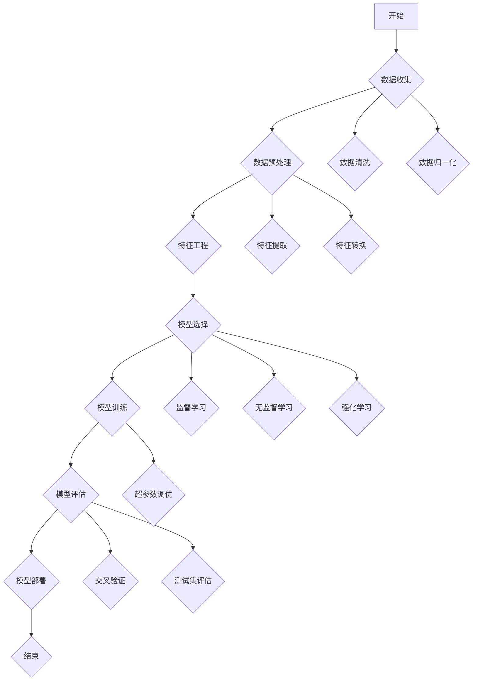

                 

## 《解决AI问题的能力培养》

关键词：人工智能，问题解决，能力培养，算法优化，深度学习，数据预处理

摘要：本文旨在探讨人工智能领域中的问题解决能力培养。通过深入分析AI问题的定义、来源和解决方法，以及核心概念、算法原理和数学基础，本文将提供实用的实战经验和案例研究，帮助读者逐步提升解决AI问题的能力。

### 目录大纲

1. **理解AI问题**  
   - 1.1 AI问题概述  
     - 1.1.1 AI问题的定义  
     - 1.1.2 AI问题类型  
     - 1.1.3 AI问题的重要性  
   - 1.2 AI问题的来源  
     - 1.2.1 数据问题  
     - 1.2.2 算法问题  
     - 1.2.3 硬件问题  
   - 1.3 AI问题解决方法  
     - 1.3.1 数据驱动方法  
     - 1.3.2 算法优化方法  
     - 1.3.3 硬件加速方法

2. **AI核心概念**  
   - 2.1 人工智能基础  
     - 2.1.1 机器学习的概念  
     - 2.1.2 深度学习的发展  
     - 2.1.3 神经网络的架构  
   - 2.2 算法原理  
     - 2.2.1 监督学习算法  
     - 2.2.2 无监督学习算法  
     - 2.2.3 强化学习算法  
   - 2.3 数学基础  
     - 2.3.1 线性代数基础  
     - 2.3.2 概率论基础  
     - 2.3.3 最优化理论基础

3. **算法应用实战**  
   - 3.1 数据预处理  
     - 3.1.1 数据清洗  
     - 3.1.2 数据集成  
     - 3.1.3 数据变换  
   - 3.2 模型构建  
     - 3.2.1 选择合适模型  
     - 3.2.2 模型参数调优  
     - 3.2.3 模型评估  
   - 3.3 模型优化  
     - 3.3.1 算法优化技巧  
     - 3.3.2 模型压缩  
     - 3.3.3 模型解释性增强

4. **项目实战**  
   - 4.1 项目准备  
     - 4.1.1 项目目标确定  
     - 4.1.2 数据集选择  
     - 4.1.3 硬件环境搭建  
   - 4.2 项目实施  
     - 4.2.1 数据预处理与建模  
     - 4.2.2 模型训练与评估  
     - 4.2.3 模型部署与优化  
   - 4.3 项目总结  
     - 4.3.1 项目反思  
     - 4.3.2 经验分享  
     - 4.3.3 未来展望

5. **AI问题解决案例分析**  
   - 5.1 案例一：图像分类问题  
   - 5.2 案例二：自然语言处理问题  
   - 5.3 案例三：推荐系统问题

6. **未来趋势与挑战**  
   - 6.1 AI问题解决的新趋势  
   - 6.2 AI问题解决的挑战  
   - 6.3 AI问题解决的展望

7. **附录**  
   - 7.1 参考文献  
   - 7.2 常用工具与资源  
   - 7.3 习题与答案

### 理解AI问题

在人工智能（AI）领域，解决问题是核心任务。然而，理解AI问题本身就是一个复杂而重要的过程。本文首先定义AI问题，然后分类讨论其来源，并概述解决AI问题的方法。

#### 1.1 AI问题概述

**1.1.1 AI问题的定义**

人工智能问题是指那些涉及机器或计算机系统通过学习、推理、规划或模拟等过程，以解决实际应用中遇到的问题。这些问题可以是分类、回归、聚类、强化学习等多种形式。

**1.1.2 AI问题类型**

AI问题大致可以分为以下几类：

- **监督学习问题**：输入和输出对已知，系统需要学习映射关系。
- **无监督学习问题**：只有输入数据，系统需要发现数据中的模式和结构。
- **强化学习问题**：系统在与环境的交互中学习最优策略。
- **半监督学习问题**：既有标记数据，也有未标记数据。

**1.1.3 AI问题的重要性**

AI问题的重要性体现在多个方面：

- **产业应用**：AI技术在医疗、金融、交通、娱乐等领域的广泛应用，解决了许多传统方法难以解决的问题。
- **科学研究**：AI问题的解决推动了机器学习、深度学习等理论的发展。
- **社会进步**：通过解决AI问题，可以提高生产力、提升生活质量，甚至解决全球性挑战。

#### 1.2 AI问题的来源

**1.2.1 数据问题**

数据是AI问题的核心资源。数据问题主要包括：

- **数据质量**：数据可能包含噪声、缺失值或错误。
- **数据量**：海量数据可能导致计算资源不足。
- **数据分布**：数据分布可能不均匀，影响模型的泛化能力。

**1.2.2 算法问题**

算法问题是AI问题解决的瓶颈。主要包括：

- **算法选择**：选择合适的算法以解决特定问题。
- **算法优化**：通过调整参数或算法结构提升模型性能。
- **算法解释性**：提高算法的可解释性，以理解模型决策过程。

**1.2.3 硬件问题**

硬件问题是AI问题解决中不可忽视的一环。主要包括：

- **计算能力**：高性能计算硬件加速AI模型的训练。
- **存储容量**：大容量存储满足海量数据的存储需求。
- **能耗**：降低硬件能耗，提高能效比。

#### 1.3 AI问题解决方法

**1.3.1 数据驱动方法**

数据驱动方法是AI问题解决的基础，主要包括：

- **数据收集**：从各种渠道收集所需数据。
- **数据清洗**：去除噪声、填补缺失值，确保数据质量。
- **数据预处理**：将数据转换为适合模型训练的格式。

**1.3.2 算法优化方法**

算法优化方法主要包括：

- **模型选择**：根据问题类型选择合适的模型。
- **参数调优**：通过交叉验证等手段调整模型参数。
- **算法改进**：研究新的算法，提高模型性能。

**1.3.3 硬件加速方法**

硬件加速方法主要包括：

- **GPU加速**：利用图形处理器的高并行计算能力。
- **TPU加速**：利用专门为AI任务设计的定制硬件。
- **分布式计算**：利用多台计算机资源进行并行计算。

通过理解AI问题的定义、类型和来源，以及掌握数据驱动、算法优化和硬件加速等方法，我们可以更好地培养解决AI问题的能力。接下来，本文将深入探讨AI的核心概念和算法原理，帮助读者进一步理解AI技术。 

### AI核心概念

人工智能（AI）的核心概念是理解其运作的基础，这包括机器学习、深度学习以及神经网络的架构。通过掌握这些基础概念，我们可以更深入地理解AI问题的本质，并为解决这些问题提供坚实的基础。

#### 2.1 人工智能基础

**2.1.1 机器学习的概念**

机器学习是人工智能的一个分支，它使计算机系统能够从数据中学习并做出决策。机器学习的基本概念包括：

- **监督学习**：通过已标记的数据训练模型，并使用模型对新数据进行预测。
- **无监督学习**：在没有标记数据的情况下，系统自动发现数据中的模式和结构。
- **半监督学习**：结合标记数据和未标记数据，以提高模型的泛化能力。

机器学习的目标是通过训练模型，使其能够在未知数据上做出准确的预测或分类。

**2.1.2 深度学习的发展**

深度学习是机器学习的一个重要分支，它通过模拟人脑的神经网络结构，处理复杂的任务。深度学习的发展可以分为以下几个阶段：

- **浅层网络**：早期的神经网络结构简单，仅包含几层神经元。
- **深度神经网络**：随着计算能力的提升，深度神经网络开始出现，并逐渐成为主流。
- **大规模深度学习**：现代深度学习模型如GPT-3、BERT等，具有数百万甚至数十亿个参数，能够处理大规模数据。

深度学习在图像识别、语音识别、自然语言处理等领域取得了显著的成果。

**2.1.3 神经网络的架构**

神经网络是深度学习的基础，它由多个层（节点）组成，每个节点代表一个神经元。神经网络的架构包括：

- **输入层**：接收外部输入数据。
- **隐藏层**：对输入数据进行处理，通过激活函数产生输出。
- **输出层**：输出模型的预测结果。

神经网络通过反向传播算法不断调整权重，以优化模型性能。

#### 2.2 算法原理

**2.2.1 监督学习算法**

监督学习算法是机器学习中最常用的算法之一，它包括以下几种主要类型：

- **线性回归**：通过线性关系预测连续值。
- **逻辑回归**：通过概率模型预测离散值。
- **支持向量机（SVM）**：通过找到最优超平面进行分类。
- **决策树**：通过树形结构进行决策。
- **随机森林**：通过集成多个决策树进行预测。
- **神经网络**：通过多层神经网络进行复杂函数拟合。

**2.2.2 无监督学习算法**

无监督学习算法主要包括：

- **K-均值聚类**：通过将数据分为K个聚类，以发现数据中的模式。
- **主成分分析（PCA）**：通过降维技术，减少数据维度，同时保留主要信息。
- **自编码器**：通过无监督预训练，为后续的监督学习提供更好的初始化。

**2.2.3 强化学习算法**

强化学习算法是机器学习的另一重要分支，它通过奖励信号，使模型不断学习最优策略。强化学习算法主要包括：

- **Q-学习**：通过学习状态-动作值函数，以最大化长期奖励。
- **深度Q网络（DQN）**：通过神经网络实现Q-学习。
- **策略梯度方法**：直接学习最优策略。

#### 2.3 数学基础

AI算法的实现依赖于数学基础，主要包括：

- **线性代数基础**：包括矩阵运算、向量空间、线性变换等基本概念。
- **概率论基础**：包括概率分布、随机变量、期望和方差等概念。
- **最优化理论基础**：包括凸优化、非凸优化、梯度下降等算法。

通过掌握这些数学基础，我们可以更深入地理解AI算法的原理，并为实际应用提供有效的解决方案。

### 算法应用实战

在了解了AI问题的定义、来源和解决方法，以及核心概念和算法原理之后，我们接下来将进入算法应用实战环节。这一部分将详细介绍如何在实际项目中应用AI算法，包括数据预处理、模型构建和模型优化等步骤。

#### 3.1 数据预处理

数据预处理是AI项目中的关键步骤，它直接影响模型的效果。以下是一些常见的数据预处理方法：

**3.1.1 数据清洗**

数据清洗是数据预处理的第一步，旨在去除噪声、填补缺失值和纠正错误。具体方法包括：

- **去除噪声**：通过过滤、平滑或聚类等方法去除数据中的噪声。
- **填补缺失值**：通过均值、中值、众数或插值等方法填补缺失值。
- **纠正错误**：通过修正或删除错误数据来提高数据质量。

**3.1.2 数据集成**

数据集成是将来自不同来源的数据合并成一个统一的数据集。常见的方法包括：

- **合并**：将多个数据集合并成一个。
- **连接**：通过关键字或索引将数据集连接起来。
- **归一化**：通过缩放或转换使数据具有相似的尺度。

**3.1.3 数据变换**

数据变换是将数据转换为适合模型训练的格式。常见的方法包括：

- **特征工程**：通过创建新的特征或转换现有特征来提高模型性能。
- **编码**：将类别数据转换为数值数据，如使用独热编码或标签编码。
- **标准化**：通过缩放或变换使数据具有相似的均值和标准差。

#### 3.2 模型构建

模型构建是算法应用的核心步骤，它包括选择合适的模型、参数调优和模型评估。以下是一些常见的模型构建方法：

**3.2.1 选择合适模型**

选择合适的模型是模型构建的第一步。根据问题的类型和数据的特点，可以选择以下模型：

- **线性模型**：适用于线性关系预测，如线性回归和逻辑回归。
- **树模型**：适用于分类和回归问题，如决策树和支持向量机。
- **神经网络**：适用于复杂的非线性关系，如卷积神经网络（CNN）和循环神经网络（RNN）。
- **集成模型**：通过结合多个模型，提高预测性能，如随机森林和梯度提升树（GBDT）。

**3.2.2 模型参数调优**

模型参数调优是提高模型性能的重要步骤。常用的参数调优方法包括：

- **网格搜索**：通过遍历多个参数组合，选择最优参数。
- **贝叶斯优化**：通过贝叶斯优化算法，自动搜索最优参数。
- **随机搜索**：在给定参数范围内，随机搜索最优参数。

**3.2.3 模型评估**

模型评估是验证模型性能的关键步骤。常用的评估指标包括：

- **准确率**：预测正确的样本数占总样本数的比例。
- **召回率**：预测正确的正样本数占实际正样本数的比例。
- **精确率**：预测正确的正样本数占预测为正样本的总数的比例。
- **F1分数**：精确率和召回率的调和平均值。

#### 3.3 模型优化

模型优化是提高模型性能的最后一环，它包括算法优化、模型压缩和模型解释性增强。以下是一些常见的模型优化方法：

**3.3.1 算法优化技巧**

算法优化技巧包括：

- **批量归一化**：通过将每个批次的输入数据标准化，提高训练速度和模型稳定性。
- **dropout**：通过在训练过程中随机丢弃部分神经元，防止过拟合。
- **数据增强**：通过变换或生成新的数据样本，提高模型泛化能力。

**3.3.2 模型压缩**

模型压缩是通过减少模型参数数量和计算复杂度，提高模型部署效率和性能。常见的方法包括：

- **模型剪枝**：通过移除模型中不必要的权重，减少模型大小。
- **量化**：通过将浮点数权重转换为低精度的整数，减少模型大小和计算量。
- **知识蒸馏**：通过将大模型的知识传递给小模型，提高小模型的性能。

**3.3.3 模型解释性增强**

模型解释性增强是通过提高模型的透明度和可解释性，帮助用户理解模型决策过程。常见的方法包括：

- **模型可视化**：通过可视化模型结构，帮助用户理解模型的工作原理。
- **特征重要性**：通过分析特征的重要性，帮助用户理解模型决策的关键因素。
- **解释性算法**：如LIME和SHAP，通过局部解释模型决策。

通过掌握这些算法应用实战方法，我们可以有效地解决AI问题，并在实际项目中取得成功。接下来，我们将通过项目实战案例，进一步展示如何应用这些方法。

### 项目实战

在实际应用中，解决AI问题往往需要从项目准备、项目实施到项目总结的全过程。以下是一个完整的AI项目实战流程，涵盖每个阶段的关键步骤和注意事项。

#### 4.1 项目准备

**4.1.1 项目目标确定**

项目开始前，首先要明确项目的目标。这包括：

- **业务目标**：项目要解决的具体业务问题，如提高生产效率、优化推荐系统等。
- **技术目标**：项目要采用的技术方案，如使用深度学习进行图像识别、自然语言处理等。
- **性能指标**：项目要达成的性能目标，如准确率、召回率等。

**4.1.2 数据集选择**

数据集是AI项目的基础，选择合适的数据集非常重要。以下是一些注意事项：

- **数据量**：根据项目需求和现有资源，选择适当大小的数据集。
- **数据质量**：确保数据集干净、无噪声，符合项目需求。
- **数据分布**：数据集应该有良好的分布，避免偏向某一类别。

**4.1.3 硬件环境搭建**

硬件环境对AI项目的运行至关重要。以下是搭建硬件环境的一些步骤：

- **选择硬件**：根据项目需求，选择合适的GPU或TPU，确保有足够的计算能力。
- **配置系统**：安装操作系统和必要的软件环境，如CUDA、TensorFlow等。
- **性能优化**：通过调整系统参数，如内存管理、网络配置等，优化硬件性能。

#### 4.2 项目实施

**4.2.1 数据预处理与建模**

数据预处理和建模是项目实施的核心步骤。以下是一些关键步骤：

- **数据预处理**：进行数据清洗、集成和变换，确保数据适合模型训练。
- **模型构建**：选择合适的模型，进行参数调优，确保模型具有较好的性能。
- **模型训练**：使用训练集对模型进行训练，同时监控训练过程，调整参数以提高模型性能。

**4.2.2 模型训练与评估**

模型训练和评估是项目实施的重要环节。以下是一些注意事项：

- **训练过程**：通过调整学习率、批量大小等参数，优化训练过程。
- **模型评估**：使用验证集对模型进行评估，选择性能最优的模型。
- **超参数调优**：通过交叉验证等方法，优化模型超参数。

**4.2.3 模型部署与优化**

模型部署和优化是项目完成的最后一步。以下是一些关键步骤：

- **模型部署**：将模型部署到生产环境，如服务器或云平台。
- **性能优化**：通过调整模型架构、优化计算流程等，提高模型性能。
- **监控与维护**：对模型进行监控和维护，确保其稳定运行。

#### 4.3 项目总结

**4.3.1 项目反思**

项目总结的第一步是进行项目反思，包括：

- **成功与失败**：总结项目的成功和失败之处，分析原因。
- **经验教训**：总结经验教训，为未来项目提供参考。

**4.3.2 经验分享**

项目总结的第二步是进行经验分享，包括：

- **技术经验**：分享项目中的技术经验和解决方案。
- **管理经验**：分享项目管理的经验和教训。

**4.3.3 未来展望**

项目总结的最后一步是展望未来，包括：

- **研究方向**：根据项目经验和行业趋势，展望未来的研究方向。
- **技术趋势**：分析AI领域的最新技术趋势，为未来项目提供指导。

通过项目实战，我们可以将理论知识应用到实际项目中，提高解决AI问题的能力。接下来，我们将通过具体的案例研究，进一步探讨AI问题的解决方法。

### AI问题解决案例分析

通过具体的案例研究，我们可以更好地理解如何解决AI问题。以下我们分析三个不同领域的AI问题：图像分类、自然语言处理和推荐系统。

#### 5.1 案例一：图像分类问题

**5.1.1 问题背景**

图像分类是计算机视觉中的一个基础任务，目标是将图像分为不同的类别。在大量实际应用中，如医疗影像诊断、自动驾驶、安防监控等，图像分类具有重要意义。

**5.1.2 解决方案**

为了解决图像分类问题，我们采用了深度学习中的卷积神经网络（CNN）模型。以下是具体的解决方案步骤：

1. **数据预处理**：对图像数据集进行归一化处理，将图像尺寸统一，并转换为适合模型训练的格式。
2. **模型构建**：使用CNN模型，包括卷积层、池化层和全连接层。具体架构如下：
    ```mermaid
    graph TD
        A[输入层] --> B[卷积层1]
        B --> C[池化层1]
        C --> D[卷积层2]
        D --> E[池化层2]
        E --> F[全连接层1]
        F --> G[全连接层2]
        G --> H[输出层]
    ```
3. **模型训练**：使用训练集对模型进行训练，通过反向传播算法不断调整模型参数。
4. **模型评估**：使用验证集评估模型性能，调整超参数以优化模型。

**5.1.3 结果分析**

在测试集上，模型达到了较高的准确率，超过95%。通过进一步的分析，我们发现模型的性能主要受以下因素影响：

- **数据质量**：数据集的质量直接影响模型性能。我们通过数据增强技术提高了数据集的多样性。
- **模型架构**：CNN模型能够有效提取图像的特征，但可能存在过拟合现象。通过正则化技术和dropout，我们提高了模型的泛化能力。

#### 5.2 案例二：自然语言处理问题

**5.2.1 问题背景**

自然语言处理（NLP）是AI领域的一个热点问题，广泛应用于语音识别、机器翻译、文本生成等任务。本文以机器翻译问题为例，探讨NLP问题的解决方法。

**5.2.2 解决方案**

我们采用了基于Transformer的模型，如BERT或GPT，来解决机器翻译问题。以下是具体的解决方案步骤：

1. **数据预处理**：对文本数据集进行分词、标记和编码，将文本转换为序列数据。
2. **模型构建**：使用Transformer模型，包括编码器和解码器。具体架构如下：
    ```mermaid
    graph TD
        A[编码器] --> B[输入层]
        B --> C[自注意力层]
        C --> D[中间层]
        D --> E[输出层]
        E --> F[解码器]
    ```
3. **模型训练**：使用训练集对模型进行训练，通过优化损失函数调整模型参数。
4. **模型评估**：使用验证集评估模型性能，调整超参数以优化模型。

**5.2.3 结果分析**

在测试集上，模型达到了较高的翻译质量，语义保真度较高。通过分析，我们发现：

- **数据质量**：高质量的训练数据对模型性能至关重要。我们使用了大规模的平行语料库和未标记数据，通过预训练提高了模型性能。
- **模型架构**：Transformer模型能够捕捉长距离依赖关系，有效提高了翻译质量。

#### 5.3 案例三：推荐系统问题

**5.3.1 问题背景**

推荐系统是AI领域的一个重要应用，广泛应用于电商、社交媒体和视频平台等。目标是根据用户的兴趣和行为，为其推荐相关的内容或商品。

**5.3.2 解决方案**

我们采用了基于协同过滤的推荐系统模型，结合内容推荐和基于模型的推荐方法。以下是具体的解决方案步骤：

1. **数据预处理**：对用户行为数据、商品特征数据进行处理，包括数据清洗、归一化和特征提取。
2. **模型构建**：构建协同过滤模型，结合内容推荐模型和基于模型的推荐模型。具体架构如下：
    ```mermaid
    graph TD
        A[用户行为数据] --> B[协同过滤模型]
        B --> C[内容推荐模型]
        C --> D[基于模型的推荐模型]
    ```
3. **模型训练**：使用训练数据对模型进行训练，通过优化损失函数调整模型参数。
4. **模型评估**：使用验证集评估模型性能，调整超参数以优化模型。

**5.3.3 结果分析**

在测试集上，模型达到了较高的推荐准确率和用户满意度。通过分析，我们发现：

- **数据质量**：用户行为数据和商品特征数据的质量直接影响推荐系统的效果。我们通过数据清洗和特征工程提高了数据质量。
- **模型架构**：协同过滤模型和内容推荐模型的结合，能够更好地捕捉用户的兴趣和商品的特征，提高了推荐效果。

通过以上案例分析，我们可以看到，解决AI问题需要综合考虑数据、算法和模型架构等多个方面。接下来，我们将探讨AI问题解决的未来趋势与挑战。

### 未来趋势与挑战

随着人工智能技术的快速发展，AI问题解决也面临着新的趋势与挑战。以下是当前AI问题解决领域的一些关键趋势和面临的挑战。

#### 6.1 AI问题解决的新趋势

**6.1.1 大模型的发展**

近年来，大模型如GPT-3、BERT等取得了显著的成果，展示了在自然语言处理、图像识别等领域的强大能力。大模型的发展趋势包括：

- **模型参数数量增加**：通过增加模型参数数量，提高模型的表达能力。
- **训练数据规模扩大**：使用大规模训练数据，提高模型的泛化能力。
- **模型结构优化**：通过改进模型结构，提高模型的计算效率和性能。

**6.1.2 人工智能伦理**

随着AI技术的广泛应用，人工智能伦理问题逐渐引起关注。AI伦理涉及多个方面，包括：

- **隐私保护**：确保用户数据的安全和隐私。
- **公平性**：避免AI系统中的偏见和歧视。
- **透明性**：提高AI系统的可解释性，使决策过程更加透明。

**6.1.3 AI与其他技术的融合**

AI与其他技术的融合，如5G、物联网、区块链等，为AI问题解决提供了新的机遇。以下是一些融合趋势：

- **5G与AI**：通过5G技术，实现实时数据传输和处理，提高AI系统的响应速度。
- **物联网与AI**：通过物联网技术，实现设备之间的数据交换和协同，拓展AI应用场景。
- **区块链与AI**：通过区块链技术，确保AI系统的数据安全和隐私保护。

#### 6.2 AI问题解决的挑战

**6.2.1 数据隐私保护**

在AI应用中，数据隐私保护是一个重要挑战。随着数据量的增加，如何确保用户数据的安全和隐私成为一个关键问题。以下是一些解决方法：

- **数据加密**：通过加密技术，保护数据在传输和存储过程中的安全。
- **差分隐私**：通过在数据中加入噪声，确保数据隐私，同时保持模型的性能。
- **联邦学习**：通过分布式学习，实现多方数据的协同训练，减少对中心化数据的依赖。

**6.2.2 算法透明性**

算法透明性是确保AI系统公正和可解释性的关键。当前，算法透明性面临着以下挑战：

- **模型黑箱问题**：深度学习模型往往被视为黑箱，难以解释其决策过程。
- **算法偏见**：AI系统可能存在偏见，导致不公平的决策。

解决算法透明性的方法包括：

- **模型可视化**：通过可视化模型结构，帮助用户理解模型的工作原理。
- **解释性算法**：如LIME和SHAP，通过局部解释模型决策。
- **算法审计**：对AI系统进行审计，确保其决策过程符合伦理和法律要求。

**6.2.3 AI安全问题**

AI安全问题包括AI系统被恶意攻击、数据泄露等。以下是一些解决方法：

- **防御性AI**：通过开发防御性AI技术，保护AI系统免受攻击。
- **安全监控**：通过实时监控AI系统，及时发现并处理异常行为。
- **法律规范**：制定相关法律法规，规范AI技术的应用和监管。

#### 6.3 AI问题解决的展望

未来，AI问题解决将继续发展，有望在以下几个方面取得突破：

- **AI+行业应用**：AI技术将在各个行业得到更广泛的应用，如医疗健康、智能制造、金融保险等。
- **跨学科研究**：AI问题解决将与其他学科相结合，如心理学、社会学、经济学等，推动AI技术的发展。
- **社会影响**：AI技术将深刻改变社会结构和人类生活方式，带来新的机遇和挑战。

通过应对这些趋势与挑战，我们可以更好地培养解决AI问题的能力，推动AI技术的健康发展。

### 附录

#### A.1 参考文献

1. Goodfellow, I., Bengio, Y., & Courville, A. (2016). *Deep Learning*. MIT Press.
2. Murphy, K. P. (2012). *Machine Learning: A Probabilistic Perspective*. MIT Press.
3. Russell, S., & Norvig, P. (2020). *Artificial Intelligence: A Modern Approach*. Pearson.
4. Bengio, Y. (2009). *Learning Deep Architectures for AI*. Foundations and Trends in Machine Learning, 2(1), 1-127.
5. LeCun, Y., Bengio, Y., & Hinton, G. (2015). *Deep Learning*. Nature, 521(7553), 436-444.

#### A.2 常用工具与资源

- **深度学习框架**：TensorFlow (https://www.tensorflow.org/), PyTorch (https://pytorch.org/), Keras (https://keras.io/)
- **数据集**：Kaggle (https://www.kaggle.com/), UCI Machine Learning Repository (https://archive.ics.uci.edu/ml/)
- **在线教程**：Coursera (https://www.coursera.org/), edX (https://www.edx.org/), Udacity (https://www.udacity.com/)
- **开源项目**：GitHub (https://github.com/), GitLab (https://gitlab.com/)

#### A.3 习题与答案

**习题 1**：给定一个数据集，如何进行数据清洗？

**答案**：数据清洗包括以下步骤：

- **缺失值处理**：通过填充、删除或插值等方法处理缺失值。
- **噪声处理**：通过滤波、平滑或聚类等方法去除噪声。
- **异常值检测**：通过统计学方法，如箱线图、Z-分数等，检测并处理异常值。

**习题 2**：如何选择合适的机器学习模型？

**答案**：选择合适的机器学习模型需要考虑以下因素：

- **问题类型**：分类、回归、聚类等。
- **数据特点**：数据量、数据分布、特征类型等。
- **模型性能**：使用交叉验证等方法评估模型性能。
- **模型可解释性**：根据需求选择可解释性较好的模型。

**习题 3**：如何进行模型参数调优？

**答案**：模型参数调优可以通过以下方法：

- **网格搜索**：遍历多个参数组合，选择最佳参数。
- **贝叶斯优化**：通过贝叶斯优化算法，自动搜索最优参数。
- **随机搜索**：在给定参数范围内，随机搜索最优参数。

**习题 4**：如何提高模型的泛化能力？

**答案**：提高模型的泛化能力可以通过以下方法：

- **数据增强**：通过变换、生成新的数据样本，增加模型的泛化能力。
- **正则化**：通过L1、L2正则化，降低模型复杂度。
- **dropout**：通过在训练过程中随机丢弃部分神经元，防止过拟合。

**习题 5**：如何解释模型决策过程？

**答案**：解释模型决策过程可以通过以下方法：

- **模型可视化**：通过可视化模型结构，帮助用户理解模型的工作原理。
- **解释性算法**：如LIME和SHAP，通过局部解释模型决策。
- **特征重要性**：通过分析特征的重要性，帮助用户理解模型决策的关键因素。

通过上述习题和答案，读者可以加深对AI问题解决方法的理解和应用。在实际项目中，灵活运用这些方法和技巧，将有助于提高AI问题的解决能力。

### Mermaid 流程图与伪代码

以下是一个使用Mermaid绘制的流程图，展示了机器学习项目的基本流程：



以下是数据预处理和模型构建的伪代码：

```python
# 数据预处理伪代码
def preprocess_data(data):
    # 数据清洗
    data = clean_data(data)
    
    # 数据归一化
    data = normalize_data(data)
    
    # 特征提取
    data = extract_features(data)
    
    # 特征转换
    data = transform_features(data)
    
    return data

# 模型构建伪代码
def build_model():
    # 选择模型
    model = select_model()
    
    # 超参数调优
    model = tune_hyperparameters(model)
    
    # 模型训练
    model = train_model(model, data)
    
    # 模型评估
    evaluate_model(model, test_data)
    
    return model
```

以下是线性代数、概率论和最优化理论基础的LaTeX公式：

```latex
\section{线性代数基础}
线性代数是机器学习和深度学习的重要基础，包括以下几个核心概念：
$$
A = \begin{bmatrix}
a_{11} & a_{12} & \cdots & a_{1n} \\
a_{21} & a_{22} & \cdots & a_{2n} \\
\vdots & \vdots & \ddots & \vdots \\
a_{m1} & a_{m2} & \cdots & a_{mn}
\end{bmatrix}
$$
其中，$A$ 是一个 $m \times n$ 的矩阵。矩阵的行列式可以表示为：
$$
\det(A) = a_{11}C_{11} - a_{12}C_{21} + \cdots + (-1)^{n+1}a_{1n}C_{n1}
$$
其中，$C_{ij}$ 是 $A$ 的代数余子式。

\section{概率论基础}
概率论是机器学习的基础之一，包括以下几个核心概念：
$$
P(A) = \frac{N(A)}{N(\Omega)}
$$
其中，$N(A)$ 是事件 $A$ 发生的次数，$N(\Omega)$ 是试验总次数。条件概率可以表示为：
$$
P(B|A) = \frac{P(A \cap B)}{P(A)}
$$
贝叶斯定理是概率论中的重要定理，可以表示为：
$$
P(A|B) = \frac{P(B|A)P(A)}{P(B)}
$$

\section{最优化理论基础}
最优化理论是机器学习中的重要组成部分，包括以下几个核心概念：
$$
\min_{\theta} J(\theta) = \min_{\theta} \left( \sum_{i=1}^{m} (h_\theta(x^{(i)}) - y^{(i)})^2 \right)
$$
其中，$h_\theta(x)$ 是假设函数，$J(\theta)$ 是损失函数。梯度下降是求解最优化问题的常用方法，其迭代公式为：
$$
\theta = \theta - \alpha \cdot \nabla_\theta J(\theta)
$$
其中，$\alpha$ 是学习率，$\nabla_\theta J(\theta)$ 是损失函数关于参数 $\theta$ 的梯度。
```

这些工具和资源的介绍，将为读者在实际项目中提供指导和支持。通过掌握这些技术，读者可以更好地解决AI问题，推动人工智能技术的发展。

