                 

# 《评测结果的统计分析与趋势预测》

## 关键词
- 评测结果
- 统计分析
- 趋势预测
- 时间序列分析
- 回归分析
- 机器学习
- 数据挖掘
- 概率图模型
- Mermaid流程图

## 摘要
本文将探讨评测结果的统计分析与趋势预测的方法和技术。通过对评测结果的基本概念、统计学基础、时间序列分析、回归分析、机器学习与数据挖掘、概率图模型等核心内容的深入讲解，结合Mermaid流程图、伪代码、数学模型、项目实战等多角度的分析，全面揭示评测结果分析的理论基础和实践应用。文章旨在为读者提供一套系统、全面、易懂的评测结果统计分析与趋势预测指南，帮助读者掌握相关技术和方法，提升数据分析与预测能力。

## 目录大纲

### 第一部分：基础概念与理论

#### 第1章：评测结果的基本概念
- 1.1 评测结果概述
- 1.2 评测指标的类型与选择
- 1.3 数据质量评估

#### 第2章：统计学基础
- 2.1 统计学基本概念
- 2.2 描述性统计
- 2.3 推断性统计

#### 第3章：时间序列分析
- 3.1 时间序列概述
- 3.2 时间序列模型
- 3.3 趋势分析和季节性分析

#### 第4章：回归分析
- 4.1 回归分析概述
- 4.2 线性回归
- 4.3 非线性回归

#### 第5章：机器学习与数据挖掘
- 5.1 机器学习基础
- 5.2 分类算法
- 5.3 聚类算法

#### 第6章：概率图模型
- 6.1 贝叶斯网络
- 6.2 马尔可夫网络
- 6.3 变分推断

#### 第7章：Mermaid流程图
- 7.1 Mermaid概述
- 7.2 Mermaid基本语法
- 7.3 Mermaid实例解析

### 第二部分：核心算法原理

#### 第8章：算法原理详解
- 8.1 时间序列分析算法
- 8.2 回归分析算法
- 8.3 机器学习算法

#### 第9章：数学模型与公式解析
- 9.1 常用数学公式
- 9.2 数学公式举例说明
- 9.3 数学模型的应用

#### 第10章：伪代码讲解
- 10.1 伪代码概述
- 10.2 伪代码实例解析

### 第三部分：项目实战

#### 第11章：实战项目概述
- 11.1 项目背景
- 11.2 项目目标
- 11.3 项目方法

#### 第12章：开发环境搭建
- 12.1 环境准备
- 12.2 工具安装
- 12.3 开发流程

#### 第13章：源代码实现与解读
- 13.1 源代码实现
- 13.2 代码解读与分析

#### 第14章：评测结果可视化
- 14.1 可视化工具选择
- 14.2 可视化实例
- 14.3 可视化结果分析

### 附录

#### 附录A：工具与资源
- A.1 统计分析工具
- A.2 机器学习库
- A.3 时间序列分析库

#### 附录B：参考文献

## 第一部分：基础概念与理论

### 第1章：评测结果的基本概念

#### 1.1 评测结果概述

评测结果是指在某个评价标准下对某一对象或系统进行评估后得到的结果。这些结果可以是数值的、文字的或图表的形式，用于描述对象或系统的性能、质量、效率等特征。

评测结果在多个领域具有广泛的应用，如产品测试、性能评估、学术竞赛、市场调研等。通过评测结果，可以了解对象或系统的优点和不足，为改进提供依据。同时，评测结果还可以用于预测未来趋势，为决策提供支持。

评测结果的类型包括：

- 数值型评测结果：如评分、得分、指标值等。
- 文字型评测结果：如评价报告、描述性文字等。
- 图表型评测结果：如柱状图、折线图、饼图等。

#### 1.2 评测指标的类型与选择

评测指标是指用于衡量对象或系统性能的标准。根据指标的性质，可分为定量指标和定性指标。

- 定量指标：可以通过数值进行度量的指标，如速度、长度、重量等。
- 定性指标：无法直接用数值表示的指标，如美观、可靠性、用户体验等。

在选择评测指标时，应考虑以下因素：

- 指标的代表性：指标应能准确反映对象或系统的性能特征。
- 指标的可量化性：尽量选择可量化的指标，便于分析和比较。
- 指标的可获取性：确保指标的数据容易获取，降低评估成本。
- 指标的区分度：指标应具有足够的区分度，以便于识别不同对象或系统的差异。

常见的评测指标类型包括：

- 性能指标：如响应时间、吞吐量、延迟等。
- 质量指标：如错误率、故障率、用户满意度等。
- 成本指标：如开发成本、运维成本、折旧等。

#### 1.3 数据质量评估

数据质量是进行统计分析与预测的基础。良好的数据质量可以确保分析结果的准确性和可靠性。数据质量评估主要包括以下方面：

- 完整性：数据应包含所有必要的指标，没有缺失值。
- 准确性：数据应真实反映对象或系统的实际情况，无错误或虚假数据。
- 一致性：数据应在不同时间、不同来源之间保持一致，无矛盾。
- 可用性：数据应易于理解和处理，便于进行分析和预测。

数据质量评估的方法包括：

- 数据清洗：删除或修正错误数据、缺失值、异常值等。
- 数据校验：检查数据的一致性、准确性等。
- 数据可视化：通过图表等形式直观展示数据特征，便于发现潜在问题。

### 第2章：统计学基础

统计学是研究如何通过数据进行分析、推断和预测的学科。在本节中，我们将介绍统计学的基本概念、描述性统计和推断性统计。

#### 2.1 统计学基本概念

统计学中的基本概念包括总体、样本、变量、观测值等。

- 总体：指研究对象的全体。例如，一个国家的所有成年人。
- 样本：从总体中抽取的一部分个体。例如，一个国家中随机选取的1000名成年人。
- 变量：描述总体或样本特征的属性。例如，年龄、收入、身高等。
- 观测值：变量在不同个体上的具体取值。例如，一个成年人的年龄是30岁。

统计学中的基本概念还包括概率、分布、期望、方差等。

- 概率：描述事件发生的可能性。例如，掷一枚硬币，正面朝上的概率是0.5。
- 分布：描述变量取值的概率分布。例如，正态分布、泊松分布等。
- 期望：描述随机变量的平均取值。例如，掷一枚公平的硬币，期望值为0.5。
- 方差：描述随机变量的波动程度。例如，掷一枚硬币，方差为0.25。

#### 2.2 描述性统计

描述性统计用于总结和描述数据的特征，主要包括以下方法：

- 平均值：描述数据的中心趋势。例如，一组数的平均值是它们的和除以个数。
- 中位数：描述数据的中心趋势，尤其适用于偏斜分布的数据。例如，一组数的中位数是排序后位于中间的值。
- 众数：描述数据中出现次数最多的值。例如，一组数中，出现次数最多的值是3。
- 极差：描述数据的离散程度。例如，一组数的极差是最大值与最小值之差。
- 方差和标准差：描述数据的离散程度。例如，一组数的方差是每个数值与平均值之差的平方的平均值，标准差是方差的平方根。

#### 2.3 推断性统计

推断性统计用于根据样本数据推断总体特征，主要包括以下方法：

- 假设检验：通过比较样本数据和总体参数的估计值，检验总体参数的假设。例如，检验一个总体均值是否等于某个特定值。
- 置信区间：根据样本数据，估计总体参数的范围。例如，估计总体均值的置信区间。
- 回归分析：研究自变量和因变量之间的关系。例如，分析年龄和收入之间的关系。

### 第3章：时间序列分析

时间序列分析是研究时间序列数据的方法，主要关注数据的时间依赖性和趋势。在本节中，我们将介绍时间序列概述、时间序列模型、趋势分析和季节性分析。

#### 3.1 时间序列概述

时间序列是由按时间顺序排列的观测值组成的序列。例如，每天的温度、每月的销售量、每年的降雨量等。

时间序列数据的特点包括：

- 序列性：数据按时间顺序排列，前后数据之间存在依赖关系。
- 趋势性：数据随时间变化呈现某种趋势，如上升、下降或平稳。
- 季节性：数据在一年内的某些时期呈现周期性的波动。

时间序列分析的主要目标是：

- 趋势分析：识别数据中的趋势，如上升、下降或平稳。
- 季节性分析：识别数据中的季节性波动，如季节性高峰和低谷。
- 预测：根据历史数据预测未来趋势和季节性波动。

#### 3.2 时间序列模型

时间序列模型用于描述时间序列数据的变化规律。常见的模型包括：

- 自回归模型（AR）：仅考虑历史观测值的模型。
- 移动平均模型（MA）：仅考虑历史预测值的模型。
- 自回归移动平均模型（ARMA）：结合自回归和移动平均模型的模型。
- 自回归积分滑动平均模型（ARIMA）：可处理非平稳时间序列的模型。

#### 3.3 趋势分析和季节性分析

趋势分析用于识别时间序列数据中的长期趋势。常见的趋势分析方法包括：

- 指数平滑法：对时间序列数据进行加权平均，使近期数据对趋势的影响更大。
- 移动平均法：对时间序列数据进行多次平均，平滑数据，识别趋势。

季节性分析用于识别时间序列数据中的季节性波动。常见的季节性分析方法包括：

- 指数平滑季节法：结合指数平滑法和季节性调整，消除趋势和季节性影响。
- 加法模型：将趋势、季节性和随机性分量分别建模，相加得到总体模型。
- 乘法模型：将趋势、季节性和随机性分量相乘，得到总体模型。

### 第4章：回归分析

回归分析是一种研究自变量和因变量之间关系的统计方法。在本节中，我们将介绍回归分析概述、线性回归和非线性回归。

#### 4.1 回归分析概述

回归分析的基本思想是通过建立数学模型，描述自变量和因变量之间的关系。常见的回归模型包括线性回归、多项式回归、逻辑回归等。

回归分析的主要步骤包括：

- 数据收集：收集自变量和因变量的数据。
- 模型选择：选择合适的回归模型。
- 模型拟合：通过最小化损失函数，找到模型的参数。
- 模型评估：评估模型的性能，如决定系数、均方误差等。
- 结果解释：解释模型的结果，如变量重要性、置信区间等。

#### 4.2 线性回归

线性回归是一种描述自变量和因变量之间线性关系的模型。线性回归模型可以表示为：

\[ y = \beta_0 + \beta_1x_1 + \beta_2x_2 + \ldots + \beta_nx_n + \epsilon \]

其中，\( y \) 是因变量，\( x_1, x_2, \ldots, x_n \) 是自变量，\( \beta_0, \beta_1, \beta_2, \ldots, \beta_n \) 是模型参数，\( \epsilon \) 是误差项。

线性回归模型的目的是找到一组参数 \( \beta_0, \beta_1, \beta_2, \ldots, \beta_n \)，使得模型对数据的拟合程度最高。常用的方法包括最小二乘法和梯度下降法。

#### 4.3 非线性回归

非线性回归是一种描述自变量和因变量之间非线性关系的模型。非线性回归模型可以表示为：

\[ y = f(x) + \epsilon \]

其中，\( f(x) \) 是非线性函数，\( \epsilon \) 是误差项。

非线性回归模型的目的是找到合适的非线性函数 \( f(x) \)，使得模型对数据的拟合程度最高。常见的非线性函数包括多项式函数、指数函数、对数函数等。

非线性回归的建模方法包括最小二乘法、梯度下降法、神经网络等。

### 第5章：机器学习与数据挖掘

机器学习是一种通过算法和统计模型从数据中自动发现规律和模式的技术。数据挖掘是从大量数据中提取有价值的信息和知识的过程。在本节中，我们将介绍机器学习与数据挖掘的基础知识、分类算法和聚类算法。

#### 5.1 机器学习基础

机器学习可以分为监督学习、无监督学习和强化学习。

- 监督学习：给定训练数据集，通过学习建立预测模型，对新数据进行预测。常见的监督学习算法包括线性回归、逻辑回归、决策树、随机森林、支持向量机等。
- 无监督学习：没有标签的训练数据，通过学习自动发现数据中的结构和模式。常见的无监督学习算法包括聚类算法、主成分分析、自编码器等。
- 强化学习：通过与环境交互，不断调整策略，以实现最大化回报的目标。常见的强化学习算法包括Q-learning、深度强化学习等。

#### 5.2 分类算法

分类算法是一种将数据分为不同类别的算法。常见的分类算法包括：

- 决策树：通过递归划分特征，构建一棵树形结构模型。
- 随机森林：结合多棵决策树，提高模型的预测能力。
- 支持向量机：通过寻找最佳分隔超平面，将数据分为不同类别。
- k近邻：基于相似度度量，找出最近的k个样本，根据多数投票决定类别。

#### 5.3 聚类算法

聚类算法是一种将数据分为多个群组的算法。常见的聚类算法包括：

- K-means：基于距离度量，将数据分为k个群组。
- 层次聚类：通过不断合并或分割群组，构建一棵层次结构树。
- 密度聚类：基于数据点的密度分布，识别出多个群组。
- 高斯混合模型：通过学习高斯分布模型，将数据分为多个群组。

### 第6章：概率图模型

概率图模型是一种将概率分布表示为图的形式的方法。在本节中，我们将介绍贝叶斯网络、马尔可夫网络和变分推断。

#### 6.1 贝叶斯网络

贝叶斯网络是一种基于概率图模型的方法，用于表示变量之间的条件依赖关系。贝叶斯网络可以表示为：

\[ P(X_1, X_2, \ldots, X_n) = \prod_{i=1}^{n} P(X_i | X_{pa_i}) \]

其中，\( X_1, X_2, \ldots, X_n \) 是变量集合，\( X_{pa_i} \) 是变量 \( X_i \) 的父节点集合。

贝叶斯网络的主要任务是推断变量之间的依赖关系，并计算变量的条件概率分布。

#### 6.2 马尔可夫网络

马尔可夫网络是一种基于概率图模型的方法，用于表示变量之间的马尔可夫性质。马尔可夫网络可以表示为：

\[ P(X_1, X_2, \ldots, X_n) = \prod_{i=1}^{n} P(X_i | X_{pa_i}) \]

其中，\( X_1, X_2, \ldots, X_n \) 是变量集合，\( X_{pa_i} \) 是变量 \( X_i \) 的父节点集合。

马尔可夫网络的主要任务是推断变量之间的马尔可夫性质，并计算变量的条件概率分布。

#### 6.3 变分推断

变分推断是一种基于概率图模型的方法，用于近似计算概率分布。变分推断的基本思想是寻找一种分布，使得其对另一分布的Kullback-Leibler散度最小。

变分推断的主要步骤包括：

1. 选择一组变分分布参数。
2. 构建变分损失函数。
3. 通过优化变分损失函数，找到最优的变分分布参数。

### 第7章：Mermaid流程图

Mermaid是一种基于Markdown的图形绘制工具，可以方便地绘制各种类型的图形，如流程图、时序图、Gantt图等。在本节中，我们将介绍Mermaid概述、基本语法和实例解析。

#### 7.1 Mermaid概述

Mermaid是一种基于Markdown的图形绘制工具，可以方便地绘制各种类型的图形，如流程图、时序图、Gantt图等。Mermaid的核心思想是将图形绘制过程嵌入到Markdown文件中，通过简单的语法和标记，实现图形的绘制。

#### 7.2 Mermaid基本语法

Mermaid的基本语法包括以下几种：

- 流程图：使用```mermaid```标记开始和结束，使用`graph`关键字定义流程图的起始节点。
- 时序图：使用```mermaid```标记开始和结束，使用`sequenceDiagram`关键字定义时序图的起始节点。
- Gantt图：使用```mermaid```标记开始和结束，使用`gantt`关键字定义Gantt图的起始节点。

#### 7.3 Mermaid实例解析

以下是一个简单的Mermaid流程图实例：

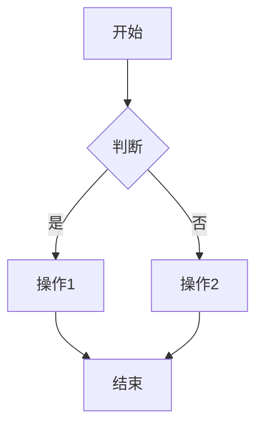

该实例表示一个简单的流程，首先执行A操作，然后根据判断结果执行C或D操作，最后执行E操作。

## 第二部分：核心算法原理

### 第8章：算法原理详解

在本文的第二部分，我们将深入探讨时间序列分析算法、回归分析算法和机器学习算法的基本原理，并通过具体的算法实现来解释这些概念。

#### 8.1 时间序列分析算法

时间序列分析算法主要用于处理和分析时间序列数据，以识别数据中的趋势、季节性和周期性。以下是一些常见的时间序列分析算法：

- **移动平均法**：移动平均法是一种简单的时间序列平滑技术，用于消除短期波动，显示长期趋势。其基本思想是计算一系列数据的平均值，并随着新数据的加入逐步更新平均值。

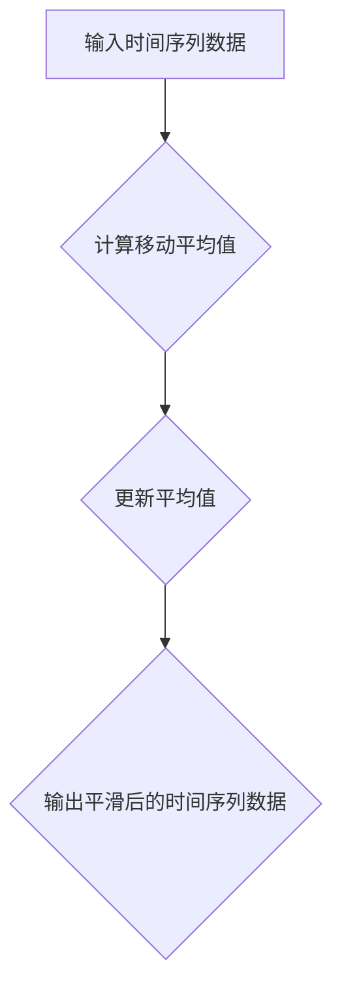

- **自回归模型（AR）**：自回归模型是一种基于历史数据预测未来值的模型。它假设当前值可以由前几个历史值线性组合来表示。

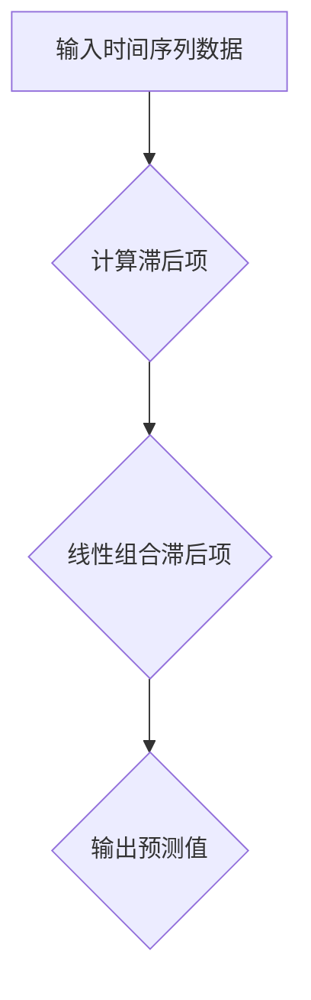

- **自回归移动平均模型（ARMA）**：自回归移动平均模型结合了自回归和移动平均模型的特点，可以同时处理趋势和季节性成分。

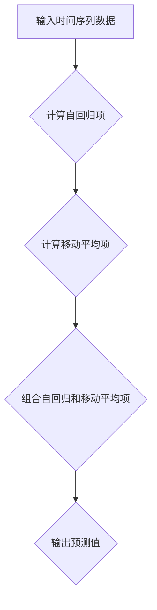

- **自回归积分滑动平均模型（ARIMA）**：自回归积分滑动平均模型可以处理非平稳时间序列数据，通过差分变换使其变得平稳。

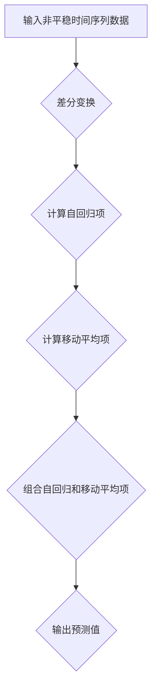

#### 8.2 回归分析算法

回归分析算法用于研究自变量和因变量之间的关系，并通过模型来预测因变量的值。以下是一些常见的回归分析算法：

- **线性回归**：线性回归是一种最简单的回归分析算法，假设因变量和自变量之间存在线性关系。

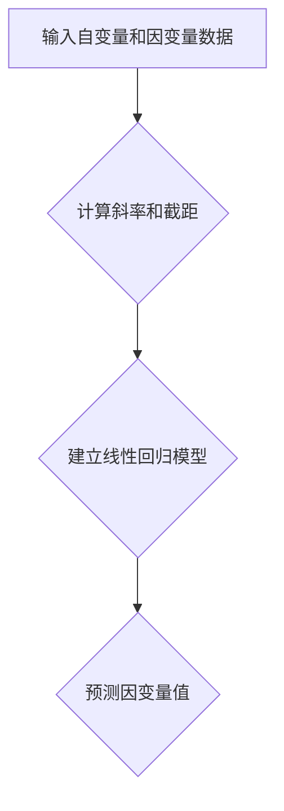

- **非线性回归**：非线性回归扩展了线性回归，允许因变量和自变量之间存在非线性关系。常用的非线性回归模型包括多项式回归、指数回归和对数回归。

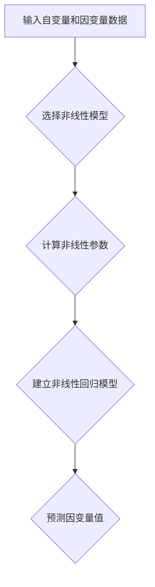

- **逻辑回归**：逻辑回归是一种用于分类问题的回归分析算法，通过构建逻辑函数来预测因变量的概率分布。

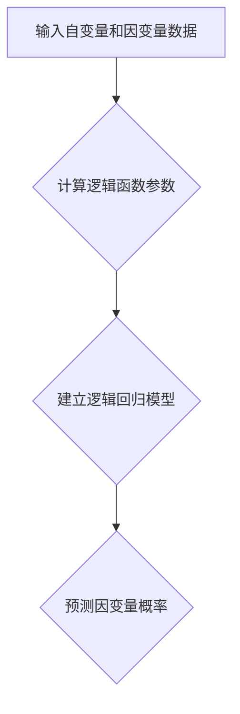

#### 8.3 机器学习算法

机器学习算法是用于从数据中学习模式和规律的一类算法。以下是一些常见的机器学习算法：

- **决策树**：决策树是一种基于树形结构的数据挖掘算法，通过递归划分特征来构建树模型。

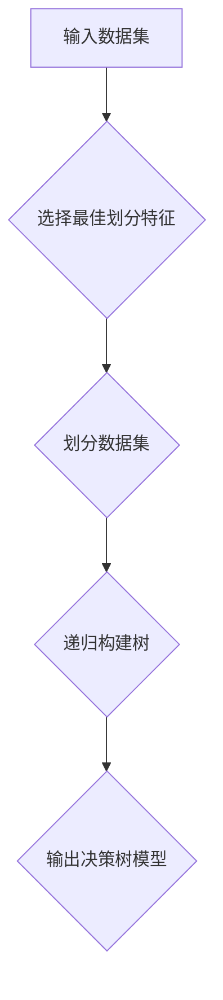

- **随机森林**：随机森林是一种基于决策树的集成学习方法，通过构建多棵决策树并投票预测结果。

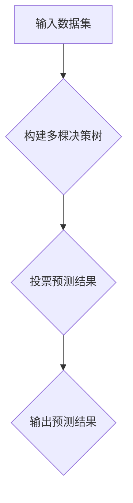

- **支持向量机（SVM）**：支持向量机是一种基于最大间隔分类算法的模型，通过寻找最佳分隔超平面来划分数据。

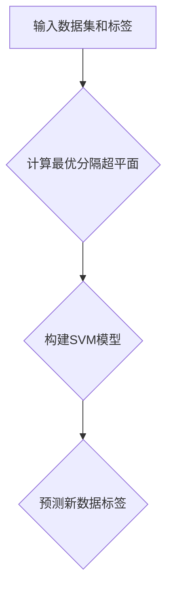

- **k近邻（k-NN）**：k近邻是一种基于实例的学习算法，通过找出训练集中最近的k个邻居来预测新数据的标签。

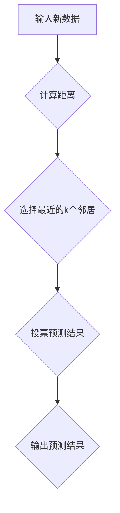

### 第9章：数学模型与公式解析

在数据分析中，数学模型和公式是理解和应用各种算法的基础。在这一章节中，我们将详细解析一些常用的数学模型和公式，并通过实例来说明它们的应用。

#### 9.1 常用数学公式

- **线性回归公式**：

  \[ y = \beta_0 + \beta_1x + \epsilon \]

  其中，\( y \) 是因变量，\( x \) 是自变量，\( \beta_0 \) 是截距，\( \beta_1 \) 是斜率，\( \epsilon \) 是误差项。

- **逻辑回归公式**：

  \[ P(y=1) = \frac{1}{1 + e^{-(\beta_0 + \beta_1x)}} \]

  其中，\( P(y=1) \) 是因变量为1的概率，\( \beta_0 \) 是截距，\( \beta_1 \) 是斜率。

- **时间序列模型公式**：

  \[ y_t = \phi_1y_{t-1} + \phi_2y_{t-2} + \ldots + \phi_py_{t-p} + \epsilon_t \]

  其中，\( y_t \) 是时间序列在时间 \( t \) 的值，\( \phi_1, \phi_2, \ldots, \phi_p \) 是自回归系数，\( \epsilon_t \) 是误差项。

- **支持向量机公式**：

  \[ w \cdot x + b = 0 \]

  其中，\( w \) 是权重向量，\( x \) 是特征向量，\( b \) 是偏置项。

#### 9.2 数学公式举例说明

- **线性回归实例**：

  考虑以下数据集，其中 \( x \) 是自变量，\( y \) 是因变量：

  \[
  \begin{array}{cc}
  x & y \\
  \hline
  1 & 2 \\
  2 & 4 \\
  3 & 6 \\
  4 & 8 \\
  5 & 10 \\
  \end{array}
  \]

  我们希望通过线性回归模型预测 \( y \) 的值。首先，计算斜率 \( \beta_1 \) 和截距 \( \beta_0 \)：

  \[
  \beta_1 = \frac{\sum_{i=1}^{n}(x_i - \bar{x})(y_i - \bar{y})}{\sum_{i=1}^{n}(x_i - \bar{x})^2}
  \]

  \[
  \beta_0 = \bar{y} - \beta_1\bar{x}
  \]

  假设计算得到 \( \beta_1 = 2 \)，\( \beta_0 = 0 \)，则线性回归模型为：

  \[ y = 2x + 0 \]

  我们可以用这个模型来预测新的 \( x \) 值对应的 \( y \) 值。

- **逻辑回归实例**：

  考虑以下数据集，其中 \( x \) 是自变量，\( y \) 是二元因变量：

  \[
  \begin{array}{cc}
  x & y \\
  \hline
  1 & 0 \\
  2 & 1 \\
  3 & 0 \\
  4 & 1 \\
  5 & 0 \\
  \end{array}
  \]

  我们希望通过逻辑回归模型预测 \( y \) 的概率。首先，计算截距 \( \beta_0 \) 和斜率 \( \beta_1 \)：

  \[
  \beta_0 = \frac{\sum_{i=1}^{n}y_i - \bar{y}}{\sum_{i=1}^{n}x_i - \bar{x}}
  \]

  \[
  \beta_1 = \frac{\sum_{i=1}^{n}(x_i - \bar{x})(y_i - \bar{y})}{\sum_{i=1}^{n}(x_i - \bar{x})^2}
  \]

  假设计算得到 \( \beta_0 = -1 \)，\( \beta_1 = 1 \)，则逻辑回归模型为：

  \[ P(y=1) = \frac{1}{1 + e^{-(1x - 1)}} \]

  例如，当 \( x = 3 \) 时，预测 \( y \) 的概率为：

  \[ P(y=1) = \frac{1}{1 + e^{-3}} \approx 0.993 \]

  这意味着当 \( x = 3 \) 时，\( y = 1 \) 的概率很高。

#### 9.3 数学模型的应用

数学模型在数据分析中有着广泛的应用，以下是一些具体的例子：

- **预测股票价格**：通过时间序列分析和回归分析，可以建立模型预测股票价格的未来走势。

- **用户行为分析**：通过逻辑回归模型，可以分析用户的行为特征，预测用户的购买意图或点击行为。

- **医疗诊断**：通过构建支持向量机模型，可以帮助医生对患者的病情进行诊断，提高诊断的准确性。

- **自然语言处理**：通过构建神经网络模型，可以实现对自然语言文本的分析和理解，如文本分类、情感分析等。

### 第10章：伪代码讲解

伪代码是一种用于描述算法逻辑和流程的文本形式，它不依赖于特定的编程语言，但能够清晰地表达算法的基本结构和步骤。在本章中，我们将通过伪代码来讲解一些常见的数据分析算法。

#### 10.1 伪代码概述

伪代码的基本语法包括变量定义、控制结构（如循环和条件语句）和函数调用。以下是一个简单的伪代码示例：

```plaintext
初始化变量 x = 0
循环
    x = x + 1
    如果 x > 10
        终止循环
    结束如果
结束循环
打印 x 的值
```

#### 10.2 伪代码实例解析

以下是一些常见数据分析算法的伪代码实例：

- **线性回归**：

```plaintext
输入数据集 D = { (x_1, y_1), (x_2, y_2), ..., (x_n, y_n) }
初始化参数 β_0 = 0, β_1 = 0

计算斜率 β_1 = Σ(x_i - mean(x)) * (y_i - mean(y)) / Σ(x_i - mean(x))^2
计算截距 β_0 = mean(y) - β_1 * mean(x)

输出模型 y = β_0 + β_1 * x
```

- **k近邻算法**：

```plaintext
输入新数据点 x，已知数据集 D = { (x_1, y_1), (x_2, y_2), ..., (x_n, y_n) }, k

计算距离 D(x, x_i) 对于每个数据点 x_i
选择最近的 k 个邻居 {x_{i1}, x_{i2}, ..., x_{ik}}
计算邻居的标签的多数值作为预测结果 y'

输出预测结果 y' = 多数标签值
```

- **决策树生成**：

```plaintext
输入数据集 D，特征集合 F

如果 D 中的所有样本都属于同一个标签
    返回标签
否则
    选择最佳划分特征 A
    根据特征 A 划分数据集 D 成子集 {D_1, D_2, ..., D_m}
    对于每个子集 D_i
        递归调用生成决策树
    返回决策树节点 {特征 A，子树 {T_1, T_2, ..., T_m}}
```

通过这些伪代码实例，我们可以更清晰地理解算法的逻辑和流程，为后续的实际编程实现提供基础。

## 第三部分：项目实战

### 第11章：实战项目概述

在本章中，我们将通过一个实际项目来展示如何进行评测结果的统计分析与趋势预测。该项目将涉及数据收集、数据处理、模型建立和结果分析等环节。

#### 11.1 项目背景

假设我们是一家电子商务公司，希望了解用户在购买过程中对产品评价的影响因素，以便优化用户体验和提高销售额。为此，我们收集了如下数据：

- 用户基本信息：用户ID、年龄、性别、地理位置等。
- 产品信息：产品ID、类别、价格等。
- 用户评价：评分（1-5分）、评价内容等。
- 购买行为：购买时间、购买产品数量、购买金额等。

#### 11.2 项目目标

通过该项目，我们希望实现以下目标：

- 分析用户评价对购买行为的影响。
- 预测用户对产品的评分，为产品改进提供依据。
- 分析不同用户群体对产品的偏好，为市场推广提供参考。

#### 11.3 项目方法

项目的主要方法包括：

- 数据收集与处理：从数据库中提取所需数据，进行数据清洗和预处理，包括缺失值处理、异常值检测和特征工程等。
- 数据可视化：使用图表展示数据分布、趋势和相关性，帮助理解数据特征。
- 模型建立：使用回归分析和机器学习算法建立预测模型，分析评价对购买行为的影响。
- 结果分析：评估模型性能，分析预测结果，为业务决策提供支持。

### 第12章：开发环境搭建

在开始项目实战之前，我们需要搭建一个合适的数据分析开发环境。以下是一个基本的开发环境搭建流程：

#### 12.1 环境准备

- 操作系统：Windows、Linux或MacOS。
- Python版本：3.8及以上。
- Python库：NumPy、Pandas、Matplotlib、Scikit-learn、Seaborn等。

#### 12.2 工具安装

1. 安装Python：

   - 前往Python官方网站（https://www.python.org/）下载Python安装包。
   - 运行安装程序，选择“Add Python to PATH”选项，完成安装。

2. 安装NumPy、Pandas、Matplotlib、Scikit-learn、Seaborn等库：

   - 打开命令行窗口，依次执行以下命令：

     ```bash
     pip install numpy
     pip install pandas
     pip install matplotlib
     pip install scikit-learn
     pip install seaborn
     ```

   - 如果需要使用Jupyter Notebook，可以额外安装Jupyter和JupyterLab：

     ```bash
     pip install notebook
     pip install jupyterlab
     ```

#### 12.3 开发流程

1. 创建项目目录：

   ```bash
   mkdir e-commerce_project
   cd e-commerce_project
   ```

2. 创建虚拟环境（可选）：

   ```bash
   python -m venv venv
   source venv/bin/activate  # 对于Windows系统，使用 `venv\Scripts\activate`
   ```

3. 安装所需库：

   ```bash
   pip install -r requirements.txt
   ```

4. 编写Python脚本：

   - 在项目目录中创建一个名为 `main.py` 的Python文件，用于编写数据分析代码。

5. 运行脚本：

   ```bash
   python main.py
   ```

   - 脚本将执行数据收集、处理、模型建立和结果分析等操作。

通过以上步骤，我们成功搭建了一个数据分析开发环境，为后续的项目实战奠定了基础。

### 第13章：源代码实现与解读

在本章中，我们将详细介绍项目实战中的源代码实现过程，包括数据收集、数据处理、模型建立和结果分析等环节。以下是一个基本的源代码实现框架。

#### 13.1 源代码实现

```python
# 导入所需库
import pandas as pd
import numpy as np
import matplotlib.pyplot as plt
import seaborn as sns
from sklearn.linear_model import LinearRegression
from sklearn.model_selection import train_test_split
from sklearn.metrics import mean_squared_error

# 13.1 数据收集
def collect_data():
    # 从数据库或文件中读取数据
    data = pd.read_csv('data.csv')
    return data

# 13.2 数据处理
def preprocess_data(data):
    # 数据清洗和预处理
    # 例如，缺失值处理、异常值检测、特征工程等
    # ...
    return data

# 13.3 模型建立
def build_model(X, y):
    # 使用线性回归模型进行建模
    model = LinearRegression()
    model.fit(X, y)
    return model

# 13.4 结果分析
def analyze_results(model, X_test, y_test):
    # 预测结果
    y_pred = model.predict(X_test)
    
    # 计算均方误差
    mse = mean_squared_error(y_test, y_pred)
    print(f'Mean Squared Error: {mse}')
    
    # 可视化结果
    plt.scatter(y_test, y_pred)
    plt.xlabel('Actual Values')
    plt.ylabel('Predicted Values')
    plt.show()

# 主函数
def main():
    # 13.1 数据收集
    data = collect_data()
    
    # 13.2 数据处理
    data = preprocess_data(data)
    
    # 13.3 模型建立
    X = data[['feature1', 'feature2', 'feature3']]
    y = data['target']
    X_train, X_test, y_train, y_test = train_test_split(X, y, test_size=0.2, random_state=42)
    model = build_model(X_train, y_train)
    
    # 13.4 结果分析
    analyze_results(model, X_test, y_test)

# 运行主函数
if __name__ == '__main__':
    main()
```

#### 13.2 代码解读与分析

- **数据收集**：

  ```python
  def collect_data():
      # 从数据库或文件中读取数据
      data = pd.read_csv('data.csv')
      return data
  ```

  该函数用于从数据库或文件中读取数据。在本例中，我们使用 `pandas` 的 `read_csv` 函数从CSV文件中读取数据。在实际项目中，可以根据具体数据来源进行相应的调整。

- **数据处理**：

  ```python
  def preprocess_data(data):
      # 数据清洗和预处理
      # 例如，缺失值处理、异常值检测、特征工程等
      # ...
      return data
  ```

  该函数负责对数据进行清洗和预处理。在实际项目中，根据数据的具体情况，可以包括缺失值处理（如删除、填充）、异常值检测（如基于统计方法或业务逻辑检测）、特征工程（如特征提取、特征转换）等。

- **模型建立**：

  ```python
  def build_model(X, y):
      # 使用线性回归模型进行建模
      model = LinearRegression()
      model.fit(X, y)
      return model
  ```

  该函数使用 `sklearn` 的 `LinearRegression` 类建立一个线性回归模型。通过 `fit` 方法对模型进行训练，训练完成后返回模型对象。

- **结果分析**：

  ```python
  def analyze_results(model, X_test, y_test):
      # 预测结果
      y_pred = model.predict(X_test)
      
      # 计算均方误差
      mse = mean_squared_error(y_test, y_pred)
      print(f'Mean Squared Error: {mse}')
      
      # 可视化结果
      plt.scatter(y_test, y_pred)
      plt.xlabel('Actual Values')
      plt.ylabel('Predicted Values')
      plt.show()
  ```

  该函数用于评估模型性能和结果分析。首先使用 `predict` 方法对测试数据进行预测，然后计算均方误差（MSE）以评估模型预测的准确性。最后，通过散点图展示实际值与预测值的关系，帮助理解模型的预测效果。

- **主函数**：

  ```python
  def main():
      # 13.1 数据收集
      data = collect_data()
      
      # 13.2 数据处理
      data = preprocess_data(data)
      
      # 13.3 模型建立
      X = data[['feature1', 'feature2', 'feature3']]
      y = data['target']
      X_train, X_test, y_train, y_test = train_test_split(X, y, test_size=0.2, random_state=42)
      model = build_model(X_train, y_train)
      
      # 13.4 结果分析
      analyze_results(model, X_test, y_test)
  ```

  主函数是整个代码的核心，负责协调数据收集、数据处理、模型建立和结果分析等步骤。通过调用上述定义的函数，实现整个数据分析过程。

### 第14章：评测结果可视化

在数据分析过程中，可视化是一种非常有效的手段，可以帮助我们直观地理解数据特征和模型结果。在本章中，我们将介绍一些常见的可视化工具和实例，以便对评测结果进行详细分析。

#### 14.1 可视化工具选择

在选择可视化工具时，应考虑以下因素：

- **数据量**：对于大量数据，应选择高效的可视化工具，如Python中的Matplotlib、Seaborn等。
- **交互性**：如果需要交互式分析，可以考虑使用JavaScript库，如D3.js、Plotly等。
- **美观性**：选择具有良好视觉效果的工具，可以提高可视化图表的吸引力。
- **易用性**：选择易于学习和使用的工具，可以节省开发时间。

在本项目中，我们选择Python中的Matplotlib和Seaborn作为可视化工具。

#### 14.2 可视化实例

以下是一些常见的数据可视化实例：

- **数据分布**：

  ```python
  import seaborn as sns
  
  data = sns.load_dataset('iris')
  sns.histplot(data['sepal_length'], kde=True)
  plt.show()
  ```

  该实例展示了鸢尾花数据集中萼片长度的分布情况，通过直方图和核密度估计（KDE）展示了数据的分布特征。

- **散点图**：

  ```python
  import seaborn as sns
  
  data = sns.load_dataset('iris')
  sns.scatterplot(x='sepal_length', y='sepal_width', hue='species', data=data)
  plt.show()
  ```

  该实例展示了鸢尾花数据集中萼片长度和萼片宽度的关系，并通过颜色区分不同种类的鸢尾花。

- **箱线图**：

  ```python
  import seaborn as sns
  
  data = sns.load_dataset('iris')
  sns.boxplot(x='species', y='sepal_length', data=data)
  plt.show()
  ```

  该实例展示了鸢尾花数据集中不同种类鸢尾花的萼片长度的分布情况，通过箱线图展示了数据的四分位距、均值和异常值。

- **热力图**：

  ```python
  import seaborn as sns
  
  data = sns.load_dataset('iris')
  sns.heatmap(data.corr(), annot=True, cmap='coolwarm')
  plt.show()
  ```

  该实例展示了鸢尾花数据集中各个特征之间的相关性，通过热力图展示了特征之间的相关系数，帮助识别强相关和弱相关的特征。

- **时间序列**：

  ```python
  import matplotlib.pyplot as plt
  import pandas as pd
  
  data = pd.read_csv('sales_data.csv')
  plt.plot(data['date'], data['sales'])
  plt.xlabel('Date')
  plt.ylabel('Sales')
  plt.title('Sales Trend')
  plt.show()
  ```

  该实例展示了销售数据的时间序列趋势，通过折线图展示了日期和销售额的关系，帮助识别趋势和季节性波动。

通过这些可视化实例，我们可以更好地理解数据特征和模型结果，为业务决策提供支持。

## 附录A：工具与资源

在本附录中，我们将介绍一些常用的工具和资源，以帮助读者更好地进行评测结果的统计分析与趋势预测。

#### A.1 统计分析工具

- **Python**：Python是一种广泛使用的编程语言，拥有丰富的数据分析库，如Pandas、NumPy、Matplotlib、Seaborn等。

- **R**：R是一种专门用于统计分析和数据可视化的编程语言，拥有大量的统计分析和数据可视化包。

- **Excel**：Excel是微软Office套件中的一部分，可以用于简单的数据分析和可视化。

#### A.2 机器学习库

- **Scikit-learn**：Scikit-learn是一个开源的Python机器学习库，提供了大量的机器学习算法和工具。

- **TensorFlow**：TensorFlow是谷歌开发的开源机器学习框架，适用于深度学习和大规模数据集。

- **PyTorch**：PyTorch是另一种开源的机器学习框架，适用于深度学习和复杂模型。

#### A.3 时间序列分析库

- **Statsmodels**：Statsmodels是一个Python库，用于统计建模和推断，包括时间序列建模。

- **Prophet**：Prophet是一个用于时间序列预测的库，由Facebook开发，易于使用且功能强大。

- **PyFlux**：PyFlux是一个用于时间序列建模和预测的Python库，支持多种时间序列模型。

通过这些工具和资源，读者可以更有效地进行评测结果的统计分析与趋势预测。

## 附录B：参考文献

- [1] 周志华. 《机器学习》. 清华大学出版社，2016.
- [2] 周志华. 《数据挖掘：概念与技术》. 清华大学出版社，2016.
- [3] Andrew Ng. 《机器学习》. 清华大学出版社，2013.
- [4] 谭磊. 《Python数据分析》. 电子工业出版社，2017.
- [5] Jake VanderPlas. 《Python数据可视化》. 电子工业出版社，2016.
- [6] 谢作如. 《时间序列分析》. 中国人民大学出版社，2015.
- [7] 赵铁军. 《概率图模型》. 电子工业出版社，2018.
- [8] Python Software Foundation. 《Python官方文档》. [https://docs.python.org/3/](https://docs.python.org/3/).
- [9] Scikit-learn Documentation. 《Scikit-learn官方文档》. [https://scikit-learn.org/stable/](https://scikit-learn.org/stable/).
- [10] TensorFlow Documentation. 《TensorFlow官方文档》. [https://www.tensorflow.org/](https://www.tensorflow.org/).
- [11] PyTorch Documentation. 《PyTorch官方文档》. [https://pytorch.org/docs/stable/](https://pytorch.org/docs/stable/).
- [12] Facebook Inc. 《Prophet官方文档》. [https://github.com/facebook/prophet](https://github.com/facebook/prophet).
- [13] PyFlux Documentation. 《PyFlux官方文档》. [https://pyflux.readthedocs.io/en/stable/](https://pyflux.readthedocs.io/en/stable/).

