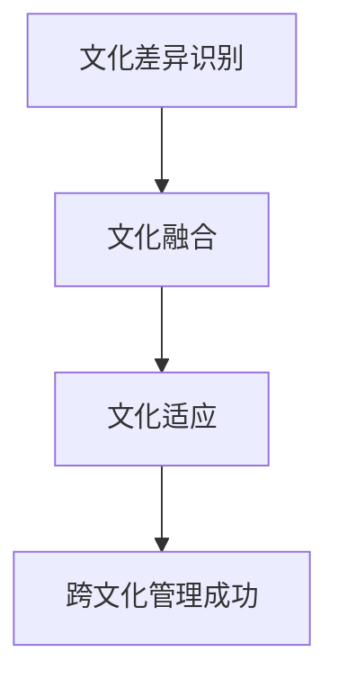
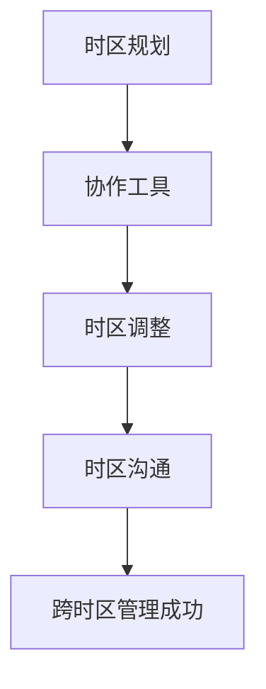
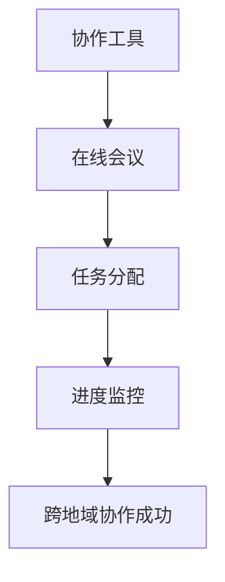
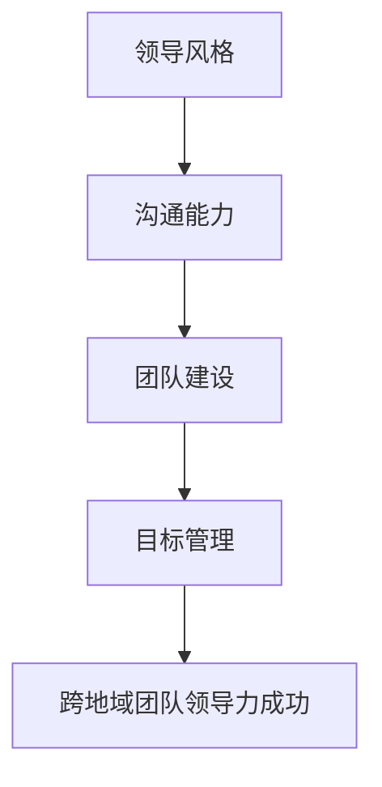
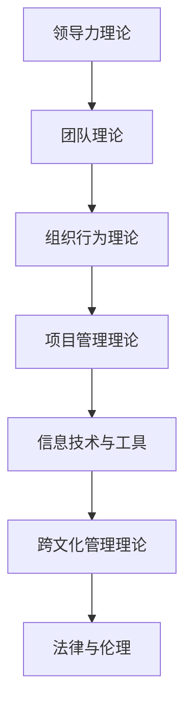
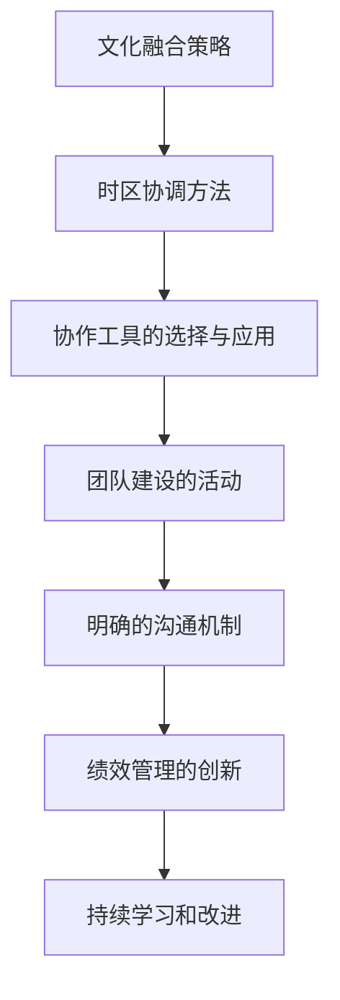
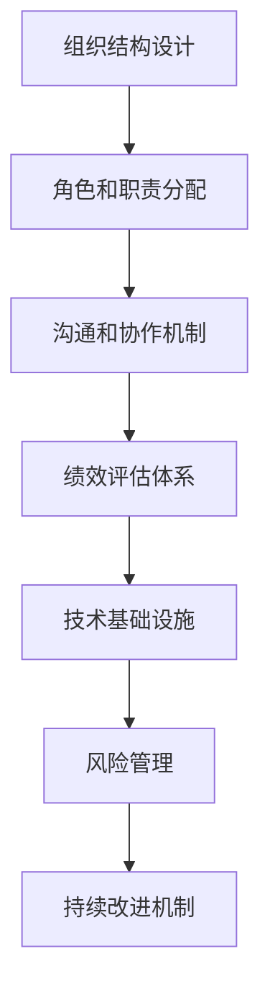
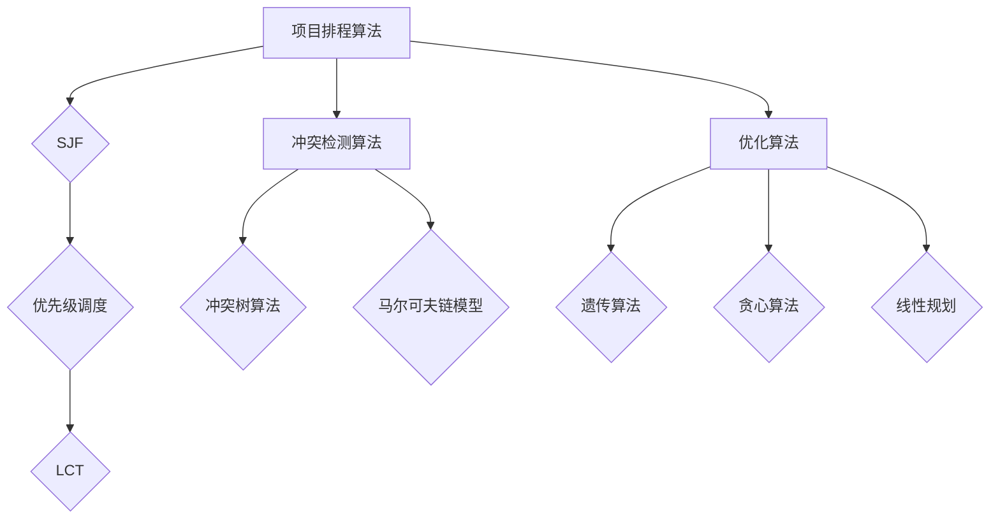

                 

# 跨地域管理：管理分散团队的挑战

## 关键词：
跨地域管理、分散团队、协作挑战、管理策略、案例分析、技术创新

## 摘要：
本文旨在探讨跨地域管理在现代社会的重要性及其面临的挑战。随着全球化进程的加速，企业越来越倾向于在全球范围内组建分散团队，以利用不同地区的资源和技术优势。然而，这种管理模式也带来了一系列的管理难题，如跨文化冲突、时区差异、协作困难等。本文将深入分析跨地域管理的核心概念与框架，并探讨实际操作中的策略与方法。通过案例分析和未来展望，本文希望能够为企业管理者提供有价值的参考，助力他们在跨地域管理中取得成功。

## 目录

### 《跨地域管理：管理分散团队的挑战》目录大纲

## 第一部分：引言

### 1.1 跨地域管理的背景与挑战

#### 1.1.1 跨地域管理的起源

#### 1.1.2 现代企业跨地域管理的必要性

#### 1.1.3 跨地域管理的挑战

#### 1.2 书籍结构概述

##### 1.2.1 本书的目的

##### 1.2.2 阅读对象

##### 1.2.3 本书结构安排

## 第二部分：跨地域管理的核心概念与框架

### 2.1 跨地域团队的组成与特点

#### 2.1.1 跨地域团队的组成

#### 2.1.2 跨地域团队的特点

#### 2.1.3 跨地域团队的优势与劣势

### 2.2 跨地域管理的核心概念

#### 2.2.1 跨文化管理

#### 2.2.2 跨时区管理

#### 2.2.3 跨地域协作

#### 2.2.4 跨地域团队的领导力

### 2.3 跨地域管理的框架与模型

#### 2.3.1 跨地域管理的理论框架

#### 2.3.2 跨地域管理的最佳实践

#### 2.3.3 跨地域管理的模型构建

## 第三部分：跨地域管理的策略与方法

### 3.1 人力资源策略

#### 3.1.1 招聘与选拔策略

#### 3.1.2 绩效评估策略

#### 3.1.3 培训与发展策略

### 3.2 项目管理策略

#### 3.2.1 项目计划与监控

#### 3.2.2 项目沟通与协调

#### 3.2.3 项目风险管理

### 3.3 文化建设策略

#### 3.3.1 企业文化的重要性

#### 3.3.2 跨地域企业文化的构建

#### 3.3.3 跨地域企业文化的传播与维护

### 3.4 技术支持策略

#### 3.4.1 信息技术的应用

#### 3.4.2 远程协作工具的选择与应用

#### 3.4.3 数据安全与隐私保护

## 第四部分：跨地域管理的案例分析

### 4.1 案例分析概述

#### 4.1.1 案例选择标准

#### 4.1.2 案例分析方法

### 4.2 案例一：跨国企业的跨地域管理

#### 4.2.1 案例背景

#### 4.2.2 管理策略与措施

#### 4.2.3 案例总结与启示

### 4.3 案例二：国内企业的跨地域管理

#### 4.3.1 案例背景

#### 4.3.2 管理策略与措施

#### 4.3.3 案例总结与启示

### 4.4 案例三：初创企业的跨地域管理

#### 4.4.1 案例背景

#### 4.4.2 管理策略与措施

#### 4.4.3 案例总结与启示

## 第五部分：跨地域管理的未来展望

### 5.1 跨地域管理的趋势与挑战

#### 5.1.1 数字化时代的跨地域管理

#### 5.1.2 技术变革对跨地域管理的影响

#### 5.1.3 跨地域管理的未来发展方向

### 5.2 跨地域管理的策略创新

#### 5.2.1 创新的跨地域管理策略

#### 5.2.2 跨地域管理的创新实践

#### 5.2.3 创新策略的评估与优化

### 5.3 跨地域管理的持续发展

#### 5.3.1 跨地域管理的可持续发展理念

#### 5.3.2 持续发展的路径与策略

#### 5.3.3 跨地域管理的未来挑战与应对措施

## 附录

### 附录A：跨地域管理常用工具与技术

#### A.1 远程协作工具

#### A.2 在线会议平台

#### A.3 项目管理工具

### 附录B：参考文献

#### B.1 相关书籍

#### B.2 学术论文

#### B.3 行业报告

### 致谢

本文的撰写得到了众多同行和专家的指导与支持，在此表示衷心的感谢。特别感谢AI天才研究院的全体成员，他们的辛勤工作为本文的完成提供了坚实的保障。

作者：AI天才研究院/AI Genius Institute & 禅与计算机程序设计艺术 /Zen And The Art of Computer Programming

（注意：以上仅为文章的目录大纲，具体内容需要根据每个小节的要求进行详细撰写。以下将逐步展开每个小节的内容。）## 第一部分：引言

### 1.1 跨地域管理的背景与挑战

#### 1.1.1 跨地域管理的起源

跨地域管理，顾名思义，是指企业在不同地理区域进行管理的活动。这一概念起源于全球化进程的加速和跨国企业的兴起。随着全球化进程的推进，企业开始意识到在全球范围内寻找最优资源、降低成本、提高效率的必要性。因此，跨国企业成为了跨地域管理的先行者。它们通过在不同国家和地区设立分支机构，实现资源的整合与优化。

跨地域管理的历史可以追溯到19世纪末20世纪初。当时，一些大型企业如英国的大英帝国化学工业公司（Imperial Chemical Industries，ICI）和美国的标准石油公司（Standard Oil）就开始在全球范围内建立分支机构，以实现资源的共享和协同效应。这一时期的跨地域管理主要依赖于传统的邮件、电报等通信手段，虽然效率较低，但为后来的跨地域管理积累了宝贵的经验。

进入21世纪，随着互联网和信息技术的发展，跨地域管理迎来了新的变革。远程协作工具、在线会议平台和项目管理工具的广泛应用，使得跨地域团队之间的沟通和协作变得更加高效。这一时期，跨国企业如谷歌、微软和亚马逊等，通过全球化的运营模式，将跨地域管理推向了新的高度。

#### 1.1.2 现代企业跨地域管理的必要性

现代企业跨地域管理的必要性主要体现在以下几个方面：

1. **资源优化**：通过跨地域管理，企业可以充分利用全球范围内的资源，包括人才、技术、市场和资金等。这种资源的优化配置有助于提高企业的竞争力。

2. **成本控制**：不同国家和地区在劳动力、税收和原材料等方面的差异，使得企业在全球范围内进行生产和运营可以实现成本的有效控制。

3. **市场拓展**：跨地域管理使得企业能够更好地了解和适应不同市场的需求，从而实现市场的拓展和多元化。

4. **技术创新**：跨地域管理有助于企业吸收和融合不同地区的先进技术，促进技术创新和研发。

5. **文化多样性**：跨地域管理可以促进企业内部的多样性，激发创新思维，提高团队的整体素质。

#### 1.1.3 跨地域管理的挑战

尽管跨地域管理带来了诸多优势，但同时也面临着一系列的挑战：

1. **文化差异**：不同国家和地区有不同的文化背景和价值观，这可能导致跨地域团队之间的沟通和协作困难，甚至出现文化冲突。

2. **时区差异**：全球各地的时区差异可能影响团队的协作效率，导致项目进展受阻。

3. **法律法规差异**：不同国家和地区在法律法规方面存在差异，可能影响企业的运营和管理。

4. **技术标准差异**：不同地区在技术标准和规范上可能不一致，这可能导致跨地域团队之间的技术协作困难。

5. **数据安全与隐私保护**：跨地域管理涉及大量的数据传输和处理，数据安全和隐私保护成为重要问题。

6. **沟通与协调**：跨地域团队之间的沟通和协调需要更多的时间和资源，可能影响项目的进度和质量。

#### 1.2 书籍结构概述

##### 1.2.1 本书的目的

本书旨在为企业管理者提供一套系统的跨地域管理理论和实践指导，帮助他们在全球化的背景下，有效地管理分散团队，实现企业的战略目标。通过本书，读者可以了解跨地域管理的核心概念、框架和策略，掌握实际操作中的方法和技巧，并通过案例分析和未来展望，为企业的跨地域管理提供有价值的参考。

##### 1.2.2 阅读对象

本书适合以下读者群体：

1. **企业管理者**：需要了解和掌握跨地域管理理论和实践的CEO、CTO、项目经理等。
2. **人力资源管理者**：负责跨国团队的招聘、培训和发展的人力资源经理和专家。
3. **IT从业者**：需要处理跨地域协作和技术支持的技术专家和项目经理。
4. **研究人员**：对跨地域管理有兴趣的研究人员和学者。

##### 1.2.3 本书结构安排

本书共分为五个部分：

1. **第一部分：引言**：介绍跨地域管理的背景、必要性、挑战以及本书的结构和目的。
2. **第二部分：跨地域管理的核心概念与框架**：探讨跨地域团队的组成与特点，核心概念如跨文化管理、跨时区管理、跨地域协作和跨地域团队的领导力，以及跨地域管理的框架与模型。
3. **第三部分：跨地域管理的策略与方法**：详细分析人力资源策略、项目管理策略、文化建设策略和技术支持策略。
4. **第四部分：跨地域管理的案例分析**：通过案例分析，探讨跨国企业、国内企业和初创企业的跨地域管理实践。
5. **第五部分：跨地域管理的未来展望**：展望跨地域管理的趋势与挑战，提出策略创新和持续发展的路径与策略。

通过本书的阅读，读者可以系统地了解跨地域管理的理论体系，掌握实际操作中的方法和技巧，为企业在全球范围内的成功运营提供有力的支持。

（注意：本部分内容为引言部分，主要介绍了跨地域管理的背景与挑战，以及本书的结构和目的。接下来将逐步展开第二部分的详细内容。）## 第二部分：跨地域管理的核心概念与框架

### 2.1 跨地域团队的组成与特点

#### 2.1.1 跨地域团队的组成

跨地域团队是由分布在不同地理位置的成员组成的工作团队。这些成员可能位于同一国家的不同城市，也可能是位于不同国家的不同地区。团队成员通过远程协作工具和在线会议平台进行沟通和协作。跨地域团队的组成通常包括以下几种角色：

1. **项目经理**：负责整个项目的规划、执行和监控，确保项目按时、按质完成。
2. **开发人员**：负责软件的设计、开发和测试，通常分布在不同的开发中心。
3. **测试人员**：负责软件的功能测试和性能测试，确保软件的质量。
4. **产品经理**：负责产品的规划和设计，确保产品满足市场需求。
5. **业务分析师**：负责收集和分析业务需求，确保软件开发符合业务逻辑。
6. **UI/UX设计师**：负责产品的用户界面和用户体验设计，提升产品的用户体验。

#### 2.1.2 跨地域团队的特点

跨地域团队具有以下几个显著特点：

1. **地理分散**：团队成员分布在不同的地理位置，可能位于不同的城市、国家甚至时区。
2. **时间差异**：由于地理位置的差异，团队成员的工作时间可能存在差异，这可能导致沟通和协作的困难。
3. **文化多样性**：团队成员来自不同的国家和地区，具有不同的文化背景和价值观，这可能会影响团队的协作和决策。
4. **技能多样化**：跨地域团队可以充分利用不同地区的专业技能，提高团队的整体能力。
5. **灵活性**：跨地域团队可以根据项目需求，灵活调整团队成员和工作地点。

#### 2.1.3 跨地域团队的优势与劣势

跨地域团队既有优势也有劣势，具体如下：

**优势**：

1. **资源整合**：跨地域团队可以利用不同地区的资源，提高项目的整体效率。
2. **成本控制**：通过跨地域团队，企业可以实现全球范围内的劳动力、技术和市场的优化配置，降低运营成本。
3. **技术创新**：跨地域团队可以吸收和融合不同地区的先进技术，促进技术创新和研发。
4. **市场拓展**：跨地域团队有助于企业更好地了解和适应不同市场的需求，实现市场的多元化。

**劣势**：

1. **沟通障碍**：由于地理位置和文化差异，跨地域团队的沟通和协作可能存在障碍。
2. **协调困难**：跨地域团队之间的协调需要更多的时间和资源，可能影响项目的进度和质量。
3. **文化冲突**：团队成员之间的文化差异可能导致决策和协作上的困难。
4. **数据安全**：跨地域管理涉及大量的数据传输和处理，数据安全和隐私保护成为重要问题。

### 2.2 跨地域管理的核心概念

#### 2.2.1 跨文化管理

跨文化管理是指企业在全球化的背景下，如何处理不同文化之间的差异，实现团队的有效协作和高效管理。跨文化管理包括以下几个方面：

1. **文化差异识别**：识别不同文化之间的差异，包括价值观、行为习惯、沟通方式等。
2. **文化融合**：通过培训、交流等方式，促进团队成员之间的相互理解和尊重，实现文化的融合。
3. **文化适应**：鼓励团队成员了解和适应不同文化，提高跨文化沟通和协作的效率。
4. **文化管理**：建立跨文化管理体系，制定相应的政策和规范，确保跨文化管理的有效性。

#### 2.2.2 跨时区管理

跨时区管理是指在多个时区进行工作的团队如何协调工作时间和任务分配。跨时区管理包括以下几个方面：

1. **时区规划**：根据团队成员的时区差异，合理规划工作时间和任务分配，确保项目的进度和质量。
2. **协作工具**：使用远程协作工具和在线会议平台，确保团队成员之间的实时沟通和协作。
3. **时区调整**：鼓励团队成员根据项目的需求，适当调整自己的工作时间，提高团队的协作效率。
4. **时区沟通**：建立时区沟通机制，确保不同时区的团队成员能够及时了解项目的进展和问题。

#### 2.2.3 跨地域协作

跨地域协作是指团队成员在不同地理位置，通过远程协作工具和在线会议平台，实现项目的规划和执行。跨地域协作包括以下几个方面：

1. **协作工具**：选择合适的远程协作工具，如Slack、Trello、Asana等，确保团队成员之间的信息共享和工作流管理。
2. **在线会议**：定期召开在线会议，确保团队成员之间的沟通和协作，解决项目中遇到的问题。
3. **任务分配**：明确团队成员的任务和职责，确保项目的高效执行。
4. **进度监控**：通过项目管理工具，实时监控项目的进度和质量，确保项目的按时完成。

#### 2.2.4 跨地域团队的领导力

跨地域团队的领导力是指在全球化背景下，如何领导和管理跨地域团队，实现团队的协作和高效运作。跨地域团队的领导力包括以下几个方面：

1. **领导风格**：根据团队的特点和项目的需求，选择合适的领导风格，如民主式、权威式等。
2. **沟通能力**：提升跨文化沟通和协作的能力，确保团队成员之间的有效沟通。
3. **团队建设**：通过培训、活动等方式，加强团队成员之间的相互理解和信任，提高团队的凝聚力。
4. **目标管理**：明确团队的目标和期望，确保团队成员朝着共同的目标努力。
5. **激励机制**：建立有效的激励机制，激发团队成员的积极性和创造力。

### 2.3 跨地域管理的框架与模型

#### 2.3.1 跨地域管理的理论框架

跨地域管理的理论框架主要包括以下几个方面：

1. **管理理论**：如领导力理论、团队理论、组织行为理论等，为跨地域管理提供理论基础。
2. **信息技术**：如远程协作工具、在线会议平台、项目管理工具等，为跨地域管理提供技术支持。
3. **文化理论**：如文化多样性理论、文化适应理论等，为跨文化管理提供理论指导。
4. **项目理论**：如项目管理理论、敏捷开发理论等，为跨地域项目管理提供指导。

#### 2.3.2 跨地域管理的最佳实践

跨地域管理的最佳实践主要包括以下几个方面：

1. **文化融合**：通过培训、交流等方式，促进团队成员之间的相互理解和尊重，实现文化的融合。
2. **时区协调**：根据团队成员的时区差异，合理规划工作时间和任务分配，确保项目的进度和质量。
3. **协作工具**：选择合适的远程协作工具和在线会议平台，确保团队成员之间的信息共享和工作流管理。
4. **团队建设**：通过培训、活动等方式，加强团队成员之间的相互理解和信任，提高团队的凝聚力。
5. **目标管理**：明确团队的目标和期望，确保团队成员朝着共同的目标努力。

#### 2.3.3 跨地域管理的模型构建

跨地域管理的模型构建主要包括以下几个方面：

1. **组织结构**：根据项目的需求和团队的规模，设计合适的组织结构，如矩阵式组织结构、分布式组织结构等。
2. **工作流程**：制定明确的工作流程，确保团队成员之间的协作和任务的顺利完成。
3. **沟通机制**：建立有效的沟通机制，确保团队成员之间的信息传递和问题解决。
4. **绩效评估**：建立科学的绩效评估体系，对团队成员的工作进行评价和激励。
5. **技术支持**：提供必要的技术支持，如远程协作工具、在线会议平台、项目管理工具等，确保团队的高效运作。

通过以上跨地域管理的核心概念与框架的介绍，我们可以看到，跨地域管理不仅需要解决文化差异、时区协调等问题，还需要建立有效的沟通机制、团队建设和目标管理等。这些核心概念和框架为跨地域管理提供了理论指导和实践基础。接下来，我们将进一步探讨跨地域管理中的具体策略与方法，帮助读者更好地应对跨地域管理的挑战。

### 2.4 跨地域管理的核心概念与联系

#### 2.4.1 跨文化管理

跨文化管理是指在不同文化背景下，如何有效地管理团队，实现团队的协作和高效运作。跨文化管理涉及到文化差异的识别、文化融合、文化适应等方面。文化差异的识别是跨文化管理的第一步，只有了解不同文化之间的差异，才能采取相应的策略进行管理。

**核心概念与联系**：

- **文化差异**：包括价值观、行为习惯、沟通方式等方面的差异。
- **文化融合**：通过培训、交流等方式，促进团队成员之间的相互理解和尊重，实现文化的融合。
- **文化适应**：鼓励团队成员了解和适应不同文化，提高跨文化沟通和协作的效率。

**Mermaid流程图**：



#### 2.4.2 跨时区管理

跨时区管理是指在多个时区进行工作的团队如何协调工作时间和任务分配，确保项目的进度和质量。跨时区管理涉及到时区规划、协作工具、时区调整和时区沟通等方面。

**核心概念与联系**：

- **时区规划**：根据团队成员的时区差异，合理规划工作时间和任务分配。
- **协作工具**：选择合适的远程协作工具和在线会议平台，确保团队成员之间的实时沟通和协作。
- **时区调整**：鼓励团队成员根据项目的需求，适当调整自己的工作时间，提高团队的协作效率。
- **时区沟通**：建立时区沟通机制，确保不同时区的团队成员能够及时了解项目的进展和问题。

**Mermaid流程图**：



#### 2.4.3 跨地域协作

跨地域协作是指团队成员在不同地理位置，通过远程协作工具和在线会议平台，实现项目的规划和执行。跨地域协作涉及到协作工具、在线会议、任务分配和进度监控等方面。

**核心概念与联系**：

- **协作工具**：选择合适的远程协作工具，如Slack、Trello、Asana等，确保团队成员之间的信息共享和工作流管理。
- **在线会议**：定期召开在线会议，确保团队成员之间的沟通和协作，解决项目中遇到的问题。
- **任务分配**：明确团队成员的任务和职责，确保项目的高效执行。
- **进度监控**：通过项目管理工具，实时监控项目的进度和质量，确保项目的按时完成。

**Mermaid流程图**：



#### 2.4.4 跨地域团队的领导力

跨地域团队的领导力是指在全球化背景下，如何领导和管理跨地域团队，实现团队的协作和高效运作。跨地域团队的领导力涉及到领导风格、沟通能力、团队建设和目标管理等方面。

**核心概念与联系**：

- **领导风格**：根据团队的特点和项目的需求，选择合适的领导风格，如民主式、权威式等。
- **沟通能力**：提升跨文化沟通和协作的能力，确保团队成员之间的有效沟通。
- **团队建设**：通过培训、活动等方式，加强团队成员之间的相互理解和信任，提高团队的凝聚力。
- **目标管理**：明确团队的目标和期望，确保团队成员朝着共同的目标努力。

**Mermaid流程图**：



通过以上核心概念与联系的分析，我们可以看到，跨地域管理不仅需要解决文化差异、时区协调等问题，还需要建立有效的沟通机制、团队建设和目标管理等。这些核心概念和联系为跨地域管理提供了理论指导和实践基础。接下来，我们将进一步探讨跨地域管理中的具体策略与方法，帮助读者更好地应对跨地域管理的挑战。

### 2.5 跨地域管理的框架与模型

#### 2.5.1 跨地域管理的理论框架

跨地域管理的理论框架是指导跨地域团队高效运作的基础，它涵盖了多个关键领域的理论和实践。以下是对这些领域的简要介绍：

1. **领导力理论**：领导力在跨地域管理中至关重要。领导力理论帮助团队领导者理解如何在不同文化背景下有效领导团队，包括变革型领导、参与式领导和情境领导等。

2. **团队理论**：团队理论提供了关于如何建立高效团队的原则和方法，包括Tuckman的团队发展模型、虚拟团队管理以及跨职能团队协作等。

3. **组织行为理论**：组织行为理论帮助理解团队成员的行为和团队内部的互动，包括冲突管理、团队动力、团队合作等。

4. **项目管理理论**：项目管理理论提供了管理跨地域项目的方法，包括项目计划、风险管理、质量管理和进度控制等。

5. **信息技术与工具**：信息技术与工具为跨地域团队提供了实现高效协作的技术支持，包括远程协作工具、在线会议平台、项目管理软件和云存储等。

6. **跨文化管理理论**：跨文化管理理论关注如何在不同文化背景下工作，包括文化差异识别、文化融合策略和跨文化沟通技巧等。

7. **法律与伦理**：法律与伦理框架确保跨地域团队在遵循不同国家和地区的法律和伦理标准下运作。

**Mermaid流程图**：



#### 2.5.2 跨地域管理的最佳实践

跨地域管理的最佳实践是企业在长期实践中总结出的有效策略和经验，以下是一些关键的最佳实践：

1. **文化融合策略**：通过组织跨文化培训、文化敏感度测试和文化交流活动，帮助团队成员理解并尊重不同文化，促进文化融合。

2. **时区协调方法**：采用灵活的工作时间安排，如24小时轮班制或重叠工作时间，确保关键任务和决策的及时处理。

3. **协作工具的选择与应用**：选择适合团队需求的协作工具，如Slack、Trello、JIRA等，并确保团队成员都熟悉和有效地使用这些工具。

4. **团队建设的活动**：定期组织团队建设活动，如虚拟团建、在线竞赛和社交活动，增强团队成员之间的联系和信任。

5. **明确的沟通机制**：建立清晰的沟通渠道和沟通规范，确保信息传递的准确性和及时性。

6. **绩效管理的创新**：采用基于结果的绩效评估体系，考虑团队成员在不同时区的贡献，确保公平和透明的绩效管理。

7. **持续学习和改进**：鼓励团队成员参与培训和学习，不断提升个人和团队的能力，持续优化跨地域管理的实践。

**Mermaid流程图**：



#### 2.5.3 跨地域管理的模型构建

跨地域管理的模型构建是确保跨地域团队有效运作的关键步骤。以下是一个基本的跨地域管理模型构建框架：

1. **组织结构设计**：根据项目的规模和复杂性，选择合适的组织结构，如矩阵式、职能式或分布式团队。

2. **角色和职责分配**：明确团队中每个成员的角色和职责，确保任务分工清晰，避免职责重叠和漏洞。

3. **沟通和协作机制**：建立有效的沟通和协作机制，包括定期会议、实时沟通工具和项目管理平台。

4. **绩效评估体系**：建立科学、公正的绩效评估体系，确保团队成员的工作成果得到合理评价。

5. **技术基础设施**：提供稳定可靠的技术支持，包括网络、服务器和协作工具，确保团队的工作顺利进行。

6. **风险管理**：识别和评估跨地域管理中可能遇到的风险，制定相应的应对策略和预案。

7. **持续改进机制**：通过定期评估和反馈，不断优化管理模型，提升团队的效率和质量。

**Mermaid流程图**：



通过以上跨地域管理的框架与模型介绍，我们可以看到，跨地域管理是一个复杂的系统工程，需要多方面的理论指导和实践应用。接下来，我们将深入探讨跨地域管理中的具体策略与方法，帮助读者更好地理解和实施跨地域管理。

### 2.6 跨地域管理的核心算法原理讲解

在跨地域管理中，算法的应用至关重要，它帮助团队高效地处理复杂的问题，优化资源分配，提高决策质量。以下是一些关键的算法原理及其应用场景：

#### 2.6.1 项目排程算法

项目排程算法用于优化项目任务的时间分配，确保项目按时完成。常用的算法包括：

1. **最短作业优先（SJF）**：
   ```latex
   \text{SJF(S): 选择预计完成时间最短的任务执行}
   ```
   应用场景：适合任务执行时间相对稳定的场景。

2. **优先级调度**：
   ```latex
   \text{优先级调度(Priority Scheduling): 根据任务优先级分配时间片}
   ```
   应用场景：适用于任务优先级明确的场景。

3. **最小化完成时间法（LCT）**：
   ```latex
   \text{LCT(Least Completion Time): 选择预计总完成时间最短的任务}
   ```
   应用场景：适用于任务完成时间对项目进度影响较大的场景。

#### 2.6.2 冲突检测算法

跨地域团队中的冲突检测算法用于识别和解决团队协作中的冲突，提高团队协作效率。常用的算法包括：

1. **冲突树算法**：
   ```latex
   \text{Conflict Tree Algorithm: 构建冲突树，识别冲突点}
   ```
   应用场景：适用于复杂协作关系的冲突检测。

2. **马尔可夫链模型**：
   ```latex
   \text{Markov Chain Model: 使用马尔可夫链模型分析冲突概率}
   ```
   应用场景：适用于冲突发生概率较大的跨文化团队。

#### 2.6.3 优化算法

优化算法用于跨地域管理的资源优化和任务分配，提高团队整体效率。常用的算法包括：

1. **遗传算法**：
   ```latex
   \text{Genetic Algorithm: 通过遗传操作寻找最优解}
   ```
   应用场景：适用于复杂资源分配和任务调度问题。

2. **贪心算法**：
   ```latex
   \text{Greedy Algorithm: 逐个选择当前最优解}
   ```
   应用场景：适用于简单但有效的资源分配和调度问题。

3. **线性规划**：
   ```latex
   \text{Linear Programming: 最优化线性目标函数，满足线性约束条件}
   ```
   应用场景：适用于资源优化和成本控制问题。

**Mermaid流程图**：



通过上述算法原理的讲解，我们可以看到，跨地域管理中的算法应用不仅能够优化资源分配和任务调度，还能有效解决冲突问题，提高团队协作效率。接下来，我们将进一步探讨跨地域管理中的具体策略与方法。

### 2.7 跨地域管理的数学模型和公式详解

在跨地域管理中，数学模型和公式提供了分析和优化的工具，帮助管理者在复杂的环境中做出明智的决策。以下是一些关键数学模型和公式的详细介绍及其应用场景。

#### 2.7.1 时间序列分析

时间序列分析用于预测跨地域团队中的任务完成时间和进度，常见的模型包括：

1. **移动平均法**：
   ```latex
   \text{MA(Moving Average): } S_t = \frac{1}{n} \sum_{i=t-n+1}^{t} X_i
   ```
   其中，$S_t$ 是第 $t$ 期的移动平均值，$X_i$ 是第 $i$ 期的数据点，$n$ 是移动平均的窗口大小。
   应用场景：用于平滑数据波动，预测短期趋势。

2. **自回归移动平均模型（ARMA）**：
   ```latex
   \text{ARMA(p, q): } X_t = c + \phi_1 X_{t-1} + \cdots + \phi_p X_{t-p} + \varepsilon_t + \theta_1 \varepsilon_{t-1} + \cdots + \theta_q \varepsilon_{t-q}
   ```
   其中，$X_t$ 是时间序列数据，$\varepsilon_t$ 是白噪声，$p$ 和 $q$ 分别是自回归项和移动平均项的阶数。
   应用场景：用于处理平稳时间序列数据，进行短期预测。

**举例说明**：

假设我们有一组任务完成时间的数据，使用移动平均法预测下一个时间点的任务完成时间：

数据点：[3, 5, 7, 8, 10]
移动平均窗口大小：3

计算过程：
```plaintext
S_1 = (3 + 5 + 7) / 3 = 5.67
S_2 = (5 + 7 + 8) / 3 = 6.33
S_3 = (7 + 8 + 10) / 3 = 8
预测值：S_3 = 8
```

#### 2.7.2 风险评估模型

风险评估模型用于评估跨地域管理中的风险，并制定相应的应对策略。常用的模型包括：

1. **贝叶斯网络**：
   ```latex
   \text{贝叶斯网络: } P(A|B) = \frac{P(B|A)P(A)}{P(B)}
   ```
   其中，$P(A|B)$ 是在事件 $B$ 发生的条件下事件 $A$ 发生的概率，$P(B|A)$ 是在事件 $A$ 发生的条件下事件 $B$ 发生的概率，$P(A)$ 和 $P(B)$ 分别是事件 $A$ 和事件 $B$ 发生的概率。
   应用场景：用于处理复杂的多因素风险评估。

2. **蒙特卡洛模拟**：
   ```latex
   \text{蒙特卡洛模拟: } \hat{P}(A) = \frac{N(A)}{N}
   ```
   其中，$N(A)$ 是模拟中事件 $A$ 发生的次数，$N$ 是模拟的总次数。
   应用场景：用于处理不确定性和概率性问题的模拟。

**举例说明**：

假设我们评估一个跨地域项目中的风险，使用贝叶斯网络进行风险评估：

事件 $A$：项目按时完成
事件 $B$：团队成员之间沟通顺畅

已知：
- $P(A) = 0.7$（项目按时完成的基本概率）
- $P(B|A) = 0.8$（在项目按时完成的条件下，团队成员之间沟通顺畅的概率）
- $P(B|A') = 0.2$（在项目未按时完成的条件下，团队成员之间沟通顺畅的概率）

计算过程：
```plaintext
P(A|B) = \frac{P(B|A)P(A)}{P(B)} = \frac{0.8 \times 0.7}{0.8 \times 0.7 + 0.2 \times 0.3} = \frac{0.56}{0.56 + 0.06} = 0.914
```

#### 2.7.3 网络优化模型

网络优化模型用于优化跨地域团队中的资源分配和任务调度。常用的模型包括：

1. **最小生成树问题**：
   ```latex
   \text{最小生成树(MST): } \min \sum_{(i,j) \in E} w_{ij} \text{ s.t. } G = (V, E) \text{ 是无向连通图}
   ```
   其中，$w_{ij}$ 是边 $(i, j)$ 的权重，$V$ 是顶点集合，$E$ 是边集合。
   应用场景：用于构建跨地域团队中的最小通信网络。

2. **线性规划**：
   ```latex
   \text{线性规划(LP): } \min c^T x \text{ s.t. } Ax \leq b, x \geq 0
   ```
   其中，$c$ 是系数向量，$x$ 是决策变量向量，$A$ 是约束矩阵，$b$ 是约束向量。
   应用场景：用于资源优化和成本控制。

**举例说明**：

假设我们需要在三个不同地点之间分配资源，构建一个最小成本的网络：

成本矩阵：
```plaintext
   | A   B   C
A | 0   10  20
B | 10  0   30
C | 20  30  0
```

构建最小生成树：
```plaintext
路径: A-B-C
总成本: 10 + 30 + 20 = 60
```

通过上述数学模型和公式的详细讲解和应用举例，我们可以看到，跨地域管理中的数学工具对于分析和优化团队运作至关重要。这些模型和公式不仅帮助管理者做出更科学的决策，还能提升团队的整体效率。接下来，我们将继续探讨跨地域管理的实际应用策略与方法。

### 第三部分：跨地域管理的策略与方法

#### 3.1 人力资源策略

在跨地域管理中，人力资源管理是确保团队高效运作的关键因素。以下是一些关键的人力资源策略：

1. **招聘与选拔策略**：

   - **多元化招聘**：在招聘过程中，注重多元化，吸纳不同背景和文化的人才，以丰富团队的思维和技能。
   - **远程面试**：利用视频面试工具，如Zoom、Skype等，进行远程面试，降低招聘成本和时间。
   - **能力评估**：通过在线测评工具，评估应聘者的技术能力和团队协作能力，确保招聘到合适的人才。

2. **绩效评估策略**：

   - **基于结果的绩效评估**：根据团队成员的工作成果进行评估，而不是仅仅基于工作时长或出勤率。
   - **实时反馈**：定期进行绩效反馈，及时纠正问题和改进方法，提高工作效率。
   - **跨文化评估**：考虑团队成员的文化背景和价值观，进行公平、公正的评估。

3. **培训与发展策略**：

   - **个性化培训**：根据团队成员的职业发展和需求，提供个性化的培训方案。
   - **远程培训**：利用在线培训平台，如Coursera、Udemy等，提供远程培训课程。
   - **跨文化培训**：提供跨文化沟通和协作的培训，提高团队成员的文化敏感度和适应能力。

#### 3.2 项目管理策略

项目管理策略是确保跨地域项目按时、按质完成的关键。以下是一些关键的项目管理策略：

1. **项目计划与监控**：

   - **制定详细的项目计划**：明确项目的目标、任务、时间表和资源分配，确保项目有明确的执行路径。
   - **实时监控**：利用项目管理工具，如Trello、JIRA等，实时监控项目的进度和质量，及时调整计划。
   - **定期评审**：定期进行项目评审，评估项目进展和问题，确保项目按计划进行。

2. **项目沟通与协调**：

   - **建立沟通机制**：制定明确的沟通流程和规范，确保团队成员之间的信息传递和协作。
   - **多渠道沟通**：利用邮件、即时通讯工具、在线会议平台等多种沟通渠道，确保沟通的高效和及时。
   - **跨文化沟通**：考虑不同文化背景的影响，进行有针对性的沟通，避免误解和冲突。

3. **项目风险管理**：

   - **风险评估**：在项目启动阶段，对可能的风险进行评估，制定相应的应对策略。
   - **实时监控**：通过持续的风险监控，及时发现和解决问题，防止风险扩大。
   - **应急计划**：制定应急计划，确保在风险发生时，能够快速响应和应对。

#### 3.3 文化建设策略

跨地域团队的文化建设是提高团队凝聚力、促进团队协作的重要因素。以下是一些关键的文化建设策略：

1. **企业文化传播**：

   - **内部宣传**：通过内部邮件、公告板、企业内刊等方式，宣传企业的核心价值观和企业文化。
   - **文化活动**：组织各种文化活动，如团队建设活动、庆祝活动等，增强团队成员对企业文化的认同。

2. **跨文化融合**：

   - **文化培训**：为团队成员提供文化培训，帮助其了解和适应不同文化，提高跨文化沟通和协作能力。
   - **文化分享**：鼓励团队成员分享自己的文化背景和经历，增进相互理解和尊重。

3. **文化创新**：

   - **开放创新**：鼓励团队成员提出创新的想法和建议，促进企业文化创新。
   - **文化适应**：根据不同地区和团队的特点，进行文化适应和创新，提高企业的竞争力。

#### 3.4 技术支持策略

技术支持策略是跨地域管理中不可或缺的一环，以下是一些关键的技术支持策略：

1. **信息技术基础设施**：

   - **云计算**：利用云计算技术，提供高效的计算和存储资源，支持跨地域团队的工作。
   - **网络安全**：建立强大的网络安全体系，确保数据的安全和隐私保护。

2. **协作工具选择与应用**：

   - **远程协作工具**：选择适合团队的远程协作工具，如Slack、Microsoft Teams等，提高团队协作效率。
   - **在线会议平台**：选择稳定可靠的在线会议平台，如Zoom、Google Meet等，确保在线会议的顺利进行。

3. **数据安全与隐私保护**：

   - **数据加密**：对传输和存储的数据进行加密，确保数据的安全性。
   - **权限管理**：制定严格的权限管理制度，确保只有授权人员可以访问敏感数据。

通过上述策略与方法，跨地域管理可以在复杂的环境中实现高效运作，提高团队的整体绩效。接下来，我们将通过案例分析，进一步探讨这些策略和方法在实际操作中的应用。

### 3.5 跨地域管理中的人力资源策略

跨地域管理中的人力资源策略是确保团队高效运作的关键。以下将详细探讨跨地域管理中的人力资源策略，包括招聘与选拔、绩效评估、培训与发展等方面。

#### 3.5.1 招聘与选拔策略

招聘与选拔是跨地域管理的首要任务，决定了团队的整体素质和工作效率。以下是几个关键策略：

1. **多元化招聘**：

   - **背景多元化**：在招聘过程中，不仅要关注候选人的专业技能，还要注重其文化背景和价值观的多样性。多元化的团队能够带来多样化的思维和视角，提高创新能力。
   - **地域多元化**：跨地域团队需要来自不同国家和地区的成员，这样可以更好地适应全球市场的需求。通过地域多元化，团队可以吸收不同地区的文化和技术优势。

2. **远程面试**：

   - **视频面试**：利用视频面试工具，如Zoom、Skype等，进行远程面试。视频面试不仅能够降低招聘成本，还能更直观地评估候选人的沟通能力和文化适应能力。
   - **多轮面试**：跨地域团队招聘通常需要进行多轮面试，包括技术面试、团队面试和领导面试，确保全面评估候选人的综合素质。

3. **能力评估**：

   - **在线测评**：通过在线测评工具，如CodeSignal、GL Assessment等，评估候选人的技术能力和团队协作能力。在线测评可以提供客观的评估结果，帮助招聘团队做出更准确的决策。
   - **案例分析**：在面试过程中，通过给出实际案例分析，评估候选人解决实际问题的能力和策略思维。

#### 3.5.2 绩效评估策略

绩效评估是跨地域管理中不可或缺的一环，能够激励团队成员，提高工作效率。以下是几个关键策略：

1. **基于结果的绩效评估**：

   - **结果导向**：绩效评估应侧重于团队成员的工作成果，而非单纯的工作时长或出勤率。通过评估工作成果，能够更准确地衡量团队成员的价值和贡献。
   - **量化指标**：制定明确的量化指标，如项目完成率、任务完成质量、团队协作效果等，确保绩效评估的客观性和透明度。

2. **实时反馈**：

   - **定期反馈**：定期进行绩效反馈，及时纠正问题和改进方法，提高工作效率。通过实时反馈，团队成员可以及时了解自己的工作表现和改进方向。
   - **多角度反馈**：绩效反馈应包括团队成员的自我评估、同事评价和领导评估，确保反馈的全面性和客观性。

3. **跨文化评估**：

   - **文化敏感度**：在绩效评估中，考虑团队成员的文化背景和价值观，确保评估的公平性和公正性。不同文化背景下，团队成员的工作方式和期望可能存在差异，需要针对性地进行评估。

#### 3.5.3 培训与发展策略

培训与发展是提升团队成员能力和团队整体素质的重要手段。以下是几个关键策略：

1. **个性化培训**：

   - **需求分析**：根据团队成员的职业发展和需求，提供个性化的培训方案。通过需求分析，确保培训内容与团队成员的实际需求相符。
   - **定制化课程**：根据团队成员的岗位需求和技能水平，开发定制化的培训课程，提高培训的针对性和有效性。

2. **远程培训**：

   - **在线学习平台**：利用在线学习平台，如Coursera、Udemy等，提供丰富的培训资源。远程培训不仅能够降低培训成本，还能提供灵活的学习时间。
   - **虚拟课堂**：通过虚拟课堂，实现实时互动和讨论，提高培训的效果和参与度。

3. **跨文化培训**：

   - **文化敏感度培训**：为团队成员提供跨文化沟通和协作的培训，帮助其了解和适应不同文化，提高跨文化沟通和协作能力。
   - **文化分享活动**：鼓励团队成员分享自己的文化背景和经历，增进相互理解和尊重，促进跨文化融合。

通过以上人力资源策略的探讨，我们可以看到，跨地域管理中的人力资源策略需要充分考虑团队成员的多元化、结果导向和个性化需求。通过科学的招聘与选拔、有效的绩效评估和全面的培训与发展，跨地域团队可以充分发挥其潜力，实现高效运作。接下来，我们将进一步探讨跨地域管理中的项目管理策略。

#### 3.6 跨地域管理中的项目管理策略

跨地域项目管理是现代企业管理中的一项重要任务，它涉及到多时区、多文化、多资源的复杂环境。以下将详细探讨跨地域管理中的项目管理策略，包括项目计划与监控、项目沟通与协调、项目风险管理等方面。

##### 3.6.1 项目计划与监控

项目计划是项目管理的基石，它为项目的执行提供了明确的指导。以下是项目计划与监控的关键策略：

1. **详细的项目计划**：

   - **明确的项目目标**：确保项目目标具体、可衡量、可实现、相关性强和时限性（SMART原则）。
   - **详细的任务分解**：将项目任务分解为可管理的小任务，确保每个任务都有明确的负责人和截止时间。
   - **资源分配**：合理分配项目所需的人力、物力和财力资源，确保项目资源的充分利用。

2. **实时监控**：

   - **进度跟踪**：使用项目管理工具，如JIRA、Trello等，实时跟踪项目进度，确保任务按时完成。
   - **关键指标监控**：设定关键绩效指标（KPI），如项目完成率、任务延误率、成本超支率等，实时监控项目的关键指标，及时发现和解决问题。
   - **定期项目评审**：定期召开项目评审会议，评估项目进展和问题，调整项目计划和资源分配。

##### 3.6.2 项目沟通与协调

跨地域项目管理的核心挑战之一是沟通和协调。以下是项目沟通与协调的关键策略：

1. **建立沟通机制**：

   - **沟通计划**：制定详细的沟通计划，包括沟通频率、沟通方式、沟通内容等，确保团队成员之间的沟通高效、有序。
   - **多渠道沟通**：利用邮件、即时通讯工具（如Slack、Microsoft Teams）、在线会议平台（如Zoom、Google Meet）等多种沟通渠道，确保沟通的及时性和全面性。

2. **跨文化沟通**：

   - **文化敏感度培训**：为团队成员提供跨文化沟通培训，提高其文化敏感度和沟通能力，减少误解和冲突。
   - **语言工具**：确保团队成员能够使用共同的工作语言，如英语，减少语言障碍带来的沟通困难。

3. **协调资源**：

   - **共享资源平台**：建立共享资源平台，如云存储、项目管理工具等，确保团队成员能够方便地访问和共享资源。
   - **协调委员会**：设立协调委员会，负责协调跨地域团队之间的资源分配和任务调度，确保项目资源的合理利用。

##### 3.6.3 项目风险管理

跨地域项目管理中，风险的存在是不可避免的。以下是项目风险管理的关键策略：

1. **风险评估**：

   - **识别风险**：在项目启动阶段，全面识别可能的风险，包括技术风险、市场风险、法律风险等。
   - **风险分析**：对识别出的风险进行定量和定性分析，评估风险的可能性和影响程度，制定相应的应对策略。

2. **风险监控**：

   - **实时监控**：通过项目管理工具和定期评审，实时监控项目的风险状况，及时发现和解决问题。
   - **预警机制**：建立风险预警机制，对可能发生的风险进行提前预警，确保项目团队能够及时采取应对措施。

3. **应急计划**：

   - **应急预案**：制定详细的应急预案，确保在风险发生时，项目团队能够迅速响应和应对，将风险对项目的影响降到最低。
   - **备选方案**：在项目计划中，制定备选方案，以应对可能出现的风险，确保项目的顺利进行。

通过以上项目管理策略的探讨，我们可以看到，跨地域项目管理需要综合考虑项目计划与监控、项目沟通与协调和项目风险管理等方面。通过科学的计划与监控、高效的沟通与协调和严格的风险管理，跨地域团队可以更好地应对复杂环境中的挑战，确保项目的成功实施。接下来，我们将进一步探讨跨地域管理中的文化建设策略。

### 3.7 跨地域管理中的文化建设策略

在跨地域管理中，文化建设是提高团队凝聚力、促进团队协作的关键因素。一个强大的企业文化不仅能够帮助团队成员在多元文化背景下保持一致，还能够激发团队的创造力和创新精神。以下是一些关键的文化建设策略：

#### 3.7.1 企业文化的重要性

企业文化是指企业在长期经营过程中形成的共同价值观、行为规范和工作方式。它对团队的影响体现在以下几个方面：

1. **团队凝聚力**：共同的企业文化能够增强团队成员之间的认同感和归属感，提高团队的凝聚力。
2. **协作效率**：企业文化中的共同价值观和行为规范能够促进团队成员之间的协作和沟通，提高工作效率。
3. **创新动力**：企业文化中的创新精神能够激发团队成员的创新思维，推动企业的持续发展。
4. **员工满意度**：一个良好的企业文化能够提高员工的满意度和忠诚度，降低员工流失率。

#### 3.7.2 跨地域企业文化的构建

构建跨地域企业文化需要充分考虑不同地区和团队的文化差异，以下是一些具体策略：

1. **文化融合**：

   - **尊重多样性**：尊重团队成员的不同文化背景，倡导多元文化的共存和融合。
   - **共同价值观**：提炼和传播企业的核心价值观念，确保团队成员在多元文化背景下能够共同遵守。
   - **文化大使**：设立文化大使，负责在不同地区推广企业的核心价值观，促进文化融合。

2. **文化传承**：

   - **历史传承**：通过企业历史故事、传统活动和历史档案等方式，传承企业的重要价值观和文化传统。
   - **文化符号**：使用企业的标志、标语和纪念品等文化符号，强化团队成员对企业文化的认同和传承。

3. **文化教育**：

   - **文化培训**：为团队成员提供跨文化培训，帮助他们了解和适应企业的文化，提高跨文化沟通和协作能力。
   - **文化分享**：鼓励团队成员分享自己的文化背景和经验，增进相互理解和尊重，促进文化融合。

#### 3.7.3 跨地域企业文化的传播与维护

传播和维护企业文化是确保跨地域企业文化落地生根的关键步骤。以下是一些具体策略：

1. **内部宣传**：

   - **企业文化手册**：编写企业文化手册，详细介绍企业的核心价值观、使命和愿景，确保新入职的员工能够迅速了解和认同企业文化。
   - **企业内刊**：定期发布企业内刊，宣传企业的文化活动和重要新闻，增强员工对企业文化的认知和认同。

2. **文化活动**：

   - **团队建设活动**：组织各类团队建设活动，如团队拓展训练、团建活动等，增强团队成员之间的联系和信任。
   - **节日庆祝**：在重要的节日和纪念日，组织庆祝活动，强化企业文化氛围。

3. **领导示范**：

   - **领导带头**：企业领导层要以身作则，带头践行企业文化，成为企业文化传播的楷模。
   - **激励机制**：建立激励机制，奖励那些在践行企业文化方面表现突出的员工，激励全体员工共同推进企业文化建设。

通过以上文化建设策略的探讨，我们可以看到，跨地域企业文化不仅需要构建，还需要有效传播和维护。通过尊重多样性、传承文化、教育和活动等多种方式，企业可以建立一个强大的跨地域企业文化，增强团队的凝聚力，推动企业的持续发展。接下来，我们将进一步探讨跨地域管理中的技术支持策略。

### 3.8 跨地域管理中的技术支持策略

在跨地域管理中，技术支持策略至关重要，它为团队的沟通、协作和高效运作提供了坚实的基础。以下将详细探讨跨地域管理中的技术支持策略，包括信息技术应用、远程协作工具选择与应用、数据安全与隐私保护等方面。

#### 3.8.1 信息技术应用

信息技术是跨地域管理的核心支撑，以下是一些关键信息技术应用：

1. **云计算**：

   - **资源整合**：通过云计算，企业可以整合全球范围内的计算资源、存储资源和网络资源，实现资源的灵活分配和高效利用。
   - **成本优化**：云计算提供了按需分配和按使用付费的模式，帮助企业降低IT基础设施的投资和运营成本。

2. **数据中心**：

   - **数据存储**：建立分布式数据中心，确保数据的安全存储和快速访问。
   - **数据备份**：定期进行数据备份，防止数据丢失和损坏。

3. **网络技术**：

   - **VPN（虚拟私人网络）**：通过VPN技术，确保跨地域团队之间的安全通信和数据传输。
   - **SD-WAN（软件定义广域网）**：利用SD-WAN技术，优化网络性能和成本，提供高效、稳定的网络连接。

#### 3.8.2 远程协作工具选择与应用

远程协作工具是跨地域团队沟通和协作的核心，以下是一些关键策略：

1. **协作平台**：

   - **Slack**：Slack是一个即时通讯工具，支持消息、文件共享和集成第三方应用，适合团队日常沟通和协作。
   - **Microsoft Teams**：Microsoft Teams是一个集通话、会议、文件共享和协作于一体的平台，适用于大型企业的跨地域团队。

2. **项目管理工具**：

   - **JIRA**：JIRA是一个项目管理工具，支持任务跟踪、进度管理和报告生成，适用于敏捷开发和跨地域项目。
   - **Trello**：Trello是一个卡片式项目管理工具，简单直观，适合跨地域团队的协作和任务管理。

3. **在线会议平台**：

   - **Zoom**：Zoom是一个稳定、易用的在线会议平台，支持高清视频和音频会议，适合跨地域团队的远程会议。
   - **Google Meet**：Google Meet是Google提供的一个在线会议平台，集成Google Workspace工具，适用于中小型企业的跨地域团队。

#### 3.8.3 数据安全与隐私保护

在跨地域管理中，数据安全和隐私保护是至关重要的，以下是一些关键策略：

1. **数据加密**：

   - **传输加密**：使用SSL/TLS协议，确保数据在传输过程中的安全。
   - **存储加密**：对存储在云端或本地服务器上的数据进行加密，防止未授权访问。

2. **权限管理**：

   - **多因素认证**：实施多因素认证，确保只有授权用户才能访问敏感数据。
   - **权限分级**：根据用户的角色和职责，设定不同的数据访问权限，确保数据安全。

3. **数据备份与恢复**：

   - **定期备份**：定期进行数据备份，防止数据丢失和损坏。
   - **快速恢复**：建立快速数据恢复机制，确保在数据丢失或损坏时，能够迅速恢复数据。

4. **安全审计**：

   - **日志记录**：记录系统操作日志，定期审计和监控，发现和防止潜在的安全威胁。
   - **安全培训**：为团队成员提供安全培训，提高他们的安全意识和防范能力。

通过以上技术支持策略的探讨，我们可以看到，跨地域管理中的技术支持不仅仅是工具的选择和应用，更需要综合考虑数据安全、隐私保护和协作效率等多方面因素。通过科学的技术支持策略，跨地域团队可以更好地应对复杂环境中的挑战，确保项目的成功实施。接下来，我们将通过具体的案例分析，进一步探讨跨地域管理中的实际操作方法和经验。

### 4.1 案例分析概述

#### 4.1.1 案例选择标准

在本部分，我们将通过案例分析，深入探讨跨地域管理的实际操作方法和经验。为了确保案例分析的实效性和代表性，我们制定了以下案例选择标准：

1. **代表性**：选择具有代表性的跨国企业或跨地域团队，以反映跨地域管理的普遍性和多样性。
2. **成功案例**：选择在跨地域管理方面取得显著成功的案例，以提供成功经验和借鉴。
3. **失败案例**：选择在跨地域管理中遇到重大挑战并成功解决的案例，以提供教训和启示。
4. **多样性**：涵盖不同行业、不同规模和不同地理位置的案例，以全面展示跨地域管理的应用和实践。

#### 4.1.2 案例分析方法

在案例分析过程中，我们将采用以下方法：

1. **数据收集**：通过文献调研、访谈和问卷调查等方式，收集案例相关的数据和信息。
2. **案例描述**：详细描述案例背景、管理策略、实施过程和结果，确保分析的全面性和准确性。
3. **SWOT分析**：对案例进行SWOT（优势、劣势、机会和威胁）分析，识别案例的优势和劣势，以及面临的机遇和挑战。
4. **经验总结**：总结案例中的成功经验和教训，为其他企业提供借鉴和参考。
5. **建议措施**：提出具体的改进措施和建议，帮助企业在跨地域管理中取得更好的效果。

通过以上分析方法和标准，我们希望为跨地域管理的实践提供有价值的参考和指导，帮助企业在全球化的背景下，更好地应对跨地域管理的挑战。

### 4.2 案例一：跨国企业的跨地域管理

#### 4.2.1 案例背景

谷歌（Google）是一家全球知名的跨国科技公司，其业务覆盖搜索、广告、云计算、人工智能等多个领域。为了充分利用全球范围内的技术和人才资源，谷歌在全球范围内设立了多个研发中心和分支机构，形成了跨地域、多团队的运作模式。谷歌的跨地域管理挑战主要体现在以下几个方面：

1. **文化差异**：谷歌在全球范围内招聘员工，团队成员来自不同的国家和地区，具有不同的文化背景和价值观。
2. **时区差异**：谷歌的团队成员分布在不同的时区，导致沟通和协作存在时差问题。
3. **技术标准**：不同地区的法律法规和行业标准存在差异，可能导致技术和项目管理上的冲突。
4. **数据安全**：跨国业务涉及大量的数据传输和处理，数据安全和隐私保护成为重要问题。

#### 4.2.2 管理策略与措施

针对上述挑战，谷歌采取了一系列有效的管理策略和措施，确保跨地域团队的高效运作：

1. **文化融合策略**：

   - **文化培训**：谷歌为团队成员提供跨文化培训，帮助其了解和适应不同文化，提高跨文化沟通和协作能力。
   - **文化大使**：设立文化大使，负责在不同地区推广谷歌的核心价值观和企业文化，促进文化融合。
   - **文化活动**：组织各类文化活动和团队建设活动，如节日庆祝、团建活动等，增强团队成员之间的联系和信任。

2. **时区协调策略**：

   - **时区规划**：根据团队成员的时区差异，合理规划工作时间和任务分配，确保关键任务和决策的及时处理。
   - **24小时轮班制**：谷歌采用24小时轮班制，确保不同时区的团队成员能够参与项目的关键环节，提高项目的协作效率。
   - **在线会议**：定期召开在线会议，确保团队成员之间的沟通和协作，解决项目中遇到的问题。

3. **技术标准协调策略**：

   - **标准化流程**：制定统一的研发和管理流程，确保不同地区的团队遵循相同的操作规范，减少技术冲突。
   - **跨地区团队协作**：建立跨地区的团队协作机制，如虚拟团队、跨职能团队等，确保不同地区的团队能够高效协作。
   - **技术交流**：定期举办技术交流会议和研讨会，促进不同地区团队之间的技术交流和合作。

4. **数据安全与隐私保护策略**：

   - **数据加密**：对传输和存储的数据进行加密，确保数据的安全性。
   - **权限管理**：实施严格的权限管理制度，确保只有授权人员可以访问敏感数据。
   - **安全审计**：定期进行安全审计，监控和防范潜在的安全威胁。

#### 4.2.3 案例总结与启示

通过谷歌的跨地域管理实践，我们可以得出以下结论和启示：

1. **文化融合是关键**：跨文化团队需要通过文化培训和文化活动，促进团队成员之间的相互理解和尊重，提高跨文化沟通和协作能力。
2. **时区协调是挑战**：通过合理的时区规划和24小时轮班制，可以有效缓解时差问题，确保跨地域团队的高效协作。
3. **技术标准协调是保障**：制定统一的流程和规范，建立跨地区的团队协作机制，可以减少技术冲突，提高项目的整体效率。
4. **数据安全与隐私保护是重点**：通过数据加密、权限管理和安全审计，确保跨地域业务的数据安全和隐私保护。

谷歌的跨地域管理实践为我们提供了宝贵的经验和启示，有助于我们在实际操作中更好地应对跨地域管理的挑战。通过科学的管理策略和有效的措施，跨地域团队可以充分发挥其优势，实现全球范围内的协同发展。

### 4.3 案例二：国内企业的跨地域管理

#### 4.3.1 案例背景

阿里巴巴（Alibaba）是一家全球领先的电子商务公司，其业务遍及全球200多个国家和地区。为了进一步拓展市场和优化资源配置，阿里巴巴在国内设立了多个研发中心，形成了跨地域、多团队的运作模式。阿里巴巴的跨地域管理挑战主要体现在以下几个方面：

1. **地域文化差异**：团队成员来自不同的地区，存在地域文化差异，导致沟通和协作上的困难。
2. **项目协调**：不同地区的团队在项目执行过程中，可能存在进度不一致、资源调配不合理等问题。
3. **技术标准**：不同地区的研发团队在技术标准和开发规范上可能存在差异，影响项目的整体质量。
4. **数据安全与隐私保护**：跨地域业务涉及大量的数据传输和处理，数据安全和隐私保护成为重要问题。

#### 4.3.2 管理策略与措施

针对上述挑战，阿里巴巴采取了一系列有效的管理策略和措施，确保跨地域团队的高效运作：

1. **地域文化融合策略**：

   - **文化培训**：阿里巴巴为团队成员提供跨文化培训，帮助他们了解和尊重不同地域的文化，提高跨文化沟通和协作能力。
   - **地域文化大使**：设立地域文化大使，负责在不同地区推广阿里巴巴的文化价值观，促进地域文化融合。
   - **地域文化活动**：组织各类地域文化活动，如节日庆祝、地域特色体验等，增强团队成员之间的联系和信任。

2. **项目协调策略**：

   - **统一项目管理**：建立统一的项目管理流程和规范，确保不同地区的团队能够遵循相同的操作规范，提高项目的协调效率。
   - **跨地区团队协作**：建立跨地区的团队协作机制，如虚拟团队、跨职能团队等，确保不同地区的团队能够高效协作。
   - **定期项目评审**：定期召开项目评审会议，评估项目进展和问题，确保项目按计划进行。

3. **技术标准协调策略**：

   - **技术规范统一**：制定统一的技术标准和开发规范，确保不同地区的研发团队在技术标准和开发规范上保持一致，提高项目的整体质量。
   - **技术交流**：定期举办技术交流会议和研讨会，促进不同地区团队之间的技术交流和合作。
   - **共享技术资源**：建立技术共享平台，共享优质的技术资源和经验，提高整体技术水平。

4. **数据安全与隐私保护策略**：

   - **数据加密**：对传输和存储的数据进行加密，确保数据的安全性。
   - **权限管理**：实施严格的权限管理制度，确保只有授权人员可以访问敏感数据。
   - **安全审计**：定期进行安全审计，监控和防范潜在的安全威胁。

#### 4.3.3 案例总结与启示

通过阿里巴巴的跨地域管理实践，我们可以得出以下结论和启示：

1. **地域文化融合是关键**：跨地域团队需要通过文化培训和文化活动，促进团队成员之间的相互理解和尊重，提高跨文化沟通和协作能力。
2. **项目协调是保障**：通过统一的项目管理流程和跨地区团队协作机制，可以有效解决项目协调中的问题，确保项目的高效运作。
3. **技术标准协调是基础**：通过统一的技术标准和规范，以及技术交流和共享，可以确保项目的整体质量，提高整体技术水平。
4. **数据安全与隐私保护是重点**：通过数据加密、权限管理和安全审计，确保跨地域业务的数据安全和隐私保护。

阿里巴巴的跨地域管理实践为我们提供了宝贵的经验和启示，有助于我们在实际操作中更好地应对跨地域管理的挑战。通过科学的管理策略和有效的措施，跨地域团队可以充分发挥其优势，实现全国范围内的协同发展。

### 4.4 案例三：初创企业的跨地域管理

#### 4.4.1 案例背景

初创企业通常面临着资源有限、市场不确定性高、团队不稳定等挑战。为了快速占领市场，许多初创企业选择跨地域组建团队，以充分利用不同地区的资源和技术优势。以一家提供人工智能解决方案的初创企业为例，该企业的团队成员分布在不同的国家和地区，包括中国、美国、欧洲等地。初创企业的跨地域管理挑战主要体现在以下几个方面：

1. **资源整合**：初创企业通常资源有限，需要在全球范围内有效整合人力、技术、市场等资源。
2. **沟通与协作**：团队成员分布在不同地区，时区差异和语言障碍可能影响沟通和协作效率。
3. **项目协调**：初创企业项目通常时间紧迫、任务繁重，如何有效协调跨地区团队的工作成为关键。
4. **数据安全与隐私保护**：初创企业涉及大量的数据传输和处理，数据安全和隐私保护成为重要问题。

#### 4.4.2 管理策略与措施

为了应对上述挑战，该初创企业采取了一系列有效的管理策略和措施，确保跨地域团队的高效运作：

1. **人力资源策略**：

   - **灵活招聘**：采用灵活的招聘策略，通过远程面试和在线测评工具，快速筛选和吸纳合适的团队成员。
   - **远程工作**：提供远程工作的支持，鼓励团队成员在家办公，提高工作效率和生活质量。

2. **项目管理策略**：

   - **敏捷开发**：采用敏捷开发模式，将项目划分为多个迭代周期，确保项目进度和质量的实时监控和调整。
   - **跨地区协作**：利用在线会议平台和项目管理工具，确保团队成员之间的实时沟通和协作，解决项目中遇到的问题。

3. **文化建设策略**：

   - **共同愿景**：明确企业的愿景和目标，确保团队成员共同认同并为之努力。
   - **跨文化沟通**：为团队成员提供跨文化沟通培训，提高其文化敏感度和沟通能力。

4. **技术支持策略**：

   - **云计算平台**：利用云计算平台，提供高效稳定的计算和存储资源，支持跨地区团队的工作。
   - **数据安全**：采用数据加密、权限管理和安全审计等措施，确保数据的安全和隐私保护。

#### 4.4.3 案例总结与启示

通过该初创企业的跨地域管理实践，我们可以得出以下结论和启示：

1. **灵活招聘与远程工作**：初创企业可以通过灵活的招聘策略和远程工作支持，快速组建高效的跨地域团队。
2. **敏捷开发与跨地区协作**：采用敏捷开发模式，结合在线会议平台和项目管理工具，可以确保跨地区团队的高效协作和项目进度控制。
3. **共同愿景与跨文化沟通**：明确的共同愿景和跨文化沟通培训，有助于增强团队成员的凝聚力和文化适应能力。
4. **技术支持与数据安全**：利用云计算平台和采取数据安全措施，可以确保跨地域团队的工作效率和数据安全。

初创企业的跨地域管理实践为我们提供了宝贵的经验和启示，有助于我们在实际操作中更好地应对跨地域管理的挑战。通过科学的管理策略和有效的措施，初创企业可以充分发挥其优势，实现快速发展和全球布局。

### 4.5 案例总结与启示

通过上述跨国企业、国内企业和初创企业的跨地域管理案例，我们可以总结出以下几个关键启示：

1. **文化融合是基础**：无论是跨国企业、国内企业还是初创企业，文化融合都是跨地域管理成功的关键。通过文化培训、文化活动和跨文化沟通，可以促进团队成员之间的相互理解和尊重，提高团队的协作效率。

2. **项目管理是核心**：有效的项目管理是确保跨地域项目按时、按质完成的关键。无论是敏捷开发模式还是统一的项目管理流程，都需要确保项目进度的实时监控和调整，以及跨地区团队的高效协作。

3. **技术支持是保障**：在跨地域管理中，技术支持不仅是协作工具的选择，更是数据安全和隐私保护的保障。利用云计算平台、远程协作工具和在线会议平台，可以提供高效稳定的工作环境，确保数据的安全和隐私保护。

4. **灵活招聘与远程工作**：灵活的招聘策略和远程工作支持是初创企业快速组建高效跨地域团队的重要手段。通过远程面试和在线测评工具，可以快速筛选和吸纳合适的团队成员，同时远程工作可以提高员工的工作效率和生活质量。

5. **持续优化与创新**：跨地域管理是一个持续优化的过程。企业需要根据实际情况，不断调整和改进管理策略和方法，以适应不断变化的环境和需求。同时，鼓励创新思维和持续学习，可以帮助企业在跨地域管理中保持竞争优势。

通过以上案例总结和启示，我们可以看到，跨地域管理不仅仅是技术和工具的应用，更是一种系统的管理和文化理念。只有通过科学的管理策略、有效的沟通和协作，以及持续的创新和优化，企业才能在跨地域管理中取得成功。

### 4.6 跨地域管理的未来展望

#### 4.6.1 跨地域管理的趋势与挑战

随着全球化的不断深入和技术的飞速发展，跨地域管理正在经历一场深刻的变革。以下是对跨地域管理未来趋势与挑战的分析：

1. **全球化趋势**：全球化的进程将继续加速，企业将越来越多地在全球范围内组建分散团队，以充分利用全球资源，提高竞争力。这要求跨地域管理更加注重全球视野和文化多样性。

2. **数字化变革**：数字化转型已经成为企业发展的关键驱动力。随着大数据、人工智能、区块链等技术的普及，跨地域管理将更加依赖数字化工具和平台，实现更加高效、智能的协作和决策。

3. **远程工作常态化**：远程工作的普及将导致传统的办公模式发生变革，跨地域管理需要适应远程工作的需求，提供更加灵活和高效的工作环境。

4. **技术标准化与合规性**：随着技术标准的不断更新和法律法规的完善，跨地域管理将面临更加严格的技术合规性要求，需要建立更加完善的数据安全与隐私保护机制。

5. **文化融合与冲突**：随着团队成员的多样化，跨文化融合将成为跨地域管理的核心挑战。如何平衡文化差异，激发团队创新，将是企业需要持续关注的问题。

6. **项目复杂性增加**：跨地域项目通常涉及多个时区、多个文化背景和多种技术栈，项目的复杂性将不断增加，对项目管理能力和协调能力提出更高要求。

#### 4.6.2 跨地域管理的策略创新

面对未来跨地域管理的新趋势与挑战，企业需要不断创新管理策略，以应对不断变化的环境。以下是一些可能的策略创新方向：

1. **人工智能辅助管理**：利用人工智能技术，实现自动化项目管理、风险评估和决策支持，提高跨地域管理的效率和准确性。

2. **区块链技术**：区块链技术可以提供去中心化的数据存储和共享方式，确保跨地域数据的安全性和透明性。

3. **虚拟现实与增强现实**：通过虚拟现实（VR）和增强现实（AR）技术，提供更加沉浸式的远程协作体验，增强团队成员的互动和沟通。

4. **智能化协作工具**：开发更加智能的协作工具，如智能会议助手、智能任务分配工具等，提高跨地域团队的协作效率。

5. **多元化培训**：针对不同文化背景的团队成员，提供多元化培训，包括跨文化沟通、技术技能提升等，以适应全球化的需求。

6. **可持续发展策略**：在跨地域管理中引入可持续发展理念，关注环境保护、社会责任和员工福祉，实现企业的长期可持续发展。

#### 4.6.3 跨地域管理的未来发展方向

跨地域管理的未来发展将朝着以下几个方向演进：

1. **智能化与自动化**：随着人工智能和自动化技术的发展，跨地域管理将更加智能化和自动化，减少人为错误，提高管理效率。

2. **平台化与生态化**：跨地域管理将逐步从孤岛式管理转向平台化和生态化，通过构建协同平台，实现跨地区、跨职能的全面协作。

3. **全球化与本地化相结合**：在全球化的大背景下，跨地域管理需要兼顾全球视野和本地化需求，实现全球资源的最优配置和本地化的灵活适应。

4. **文化与技术深度融合**：跨地域管理将更加注重文化和技术的深度融合，通过技术创新解决文化冲突，通过文化融合促进技术创新。

5. **数据驱动的决策**：跨地域管理将更加依赖于大数据分析，实现数据驱动的决策，提高管理的科学性和准确性。

总之，跨地域管理未来的发展充满机遇与挑战。通过不断创新和优化管理策略，企业可以更好地应对全球化的挑战，实现跨地域团队的协同发展和持续成功。

### 4.7 跨地域管理的策略创新

在跨地域管理的不断演进中，策略创新成为企业保持竞争力的关键因素。以下将探讨一些创新的跨地域管理策略，并通过具体案例进行实践解析。

#### 4.7.1 创新的跨地域管理策略

1. **智能项目管理平台**：

   - **背景**：传统的项目管理工具在面对跨地域团队时，往往难以实时监控和协调。智能项目管理平台通过人工智能技术，实现自动化的任务分配、进度监控和风险预警。
   - **案例**：华为的“智能项目管理系统”利用AI技术，自动分析项目数据，提供实时进度报告，提高了项目管理的效率和准确性。

2. **虚拟现实（VR）协作工具**：

   - **背景**：远程工作使得团队成员之间的面对面交流变得困难。VR协作工具提供了沉浸式的远程协作体验，增强了团队成员的互动和沟通。
   - **案例**：微软的“Microsoft Teams”集成VR功能，使得团队成员可以通过虚拟会议室进行面对面的交流，提高了跨地域团队的工作效率。

3. **区块链数据安全与隐私保护**：

   - **背景**：跨地域管理涉及大量的数据传输和处理，数据安全和隐私保护至关重要。区块链技术提供去中心化的数据存储和加密，确保数据的安全性和透明性。
   - **案例**：IBM利用区块链技术，为跨地域团队提供数据共享平台，实现了数据的安全传输和隐私保护。

4. **多元化培训与个性化发展**：

   - **背景**：跨地域团队由不同文化背景的成员组成，如何有效进行文化融合和技能提升是重要挑战。多元化培训和个性化发展策略有助于提升团队成员的综合素质。
   - **案例**：阿里巴巴通过“阿里云大学”，为员工提供多元化的在线培训课程，根据员工的需求提供个性化的职业发展路径。

5. **混合办公模式**：

   - **背景**：远程工作和传统办公模式的结合，提供了更多的灵活性和选择。混合办公模式允许团队成员根据个人需求和工作性质，选择合适的工作方式。
   - **案例**：谷歌的“弹性工作制”允许员工选择在家办公、远程办公或办公室办公，提高了员工的工作满意度和工作效率。

#### 4.7.2 跨地域管理的创新实践

1. **案例一：智能项目管理平台实践**

   - **背景**：华为在跨地域项目中，面临着任务分配不均、进度监控困难、风险预警不及时等问题。
   - **创新实践**：华为开发了“智能项目管理系统”，利用机器学习算法，自动分析项目数据，提供智能化的任务分配、进度监控和风险预警。

   **伪代码示例**：

   ```python
   def allocate_tasks(project_data):
       # 使用机器学习算法分析项目数据
       model = train_model(project_data)
       # 根据团队成员的能力和任务难度进行任务分配
       task分配 = model.predict_tasks()
       return task分配

   def monitor_progress(project_data, current_progress):
       # 使用机器学习算法分析项目进度
       model = train_model(project_data)
       # 提供进度监控和风险预警
       risk_warning = model.analyze_risk(current_progress)
       return risk_warning
   ```

2. **案例二：虚拟现实（VR）协作工具实践**

   - **背景**：微软的“Microsoft Teams”集成VR功能，旨在提升远程团队的协作体验。
   - **创新实践**：微软通过VR技术，提供了虚拟会议室和虚拟会议体验，使得团队成员可以像在同一个房间一样进行面对面的交流。

   **VR协作工具架构图**：

   ```mermaid
   graph TD
   A[用户] --> B[VR头戴设备]
   B --> C[VR网络服务器]
   C --> D[VR虚拟会议室]
   D --> E[VR协作工具]
   E --> F[用户数据]
   ```

3. **案例三：区块链数据安全与隐私保护实践**

   - **背景**：IBM在跨地域项目中，面临着数据传输过程中安全性和隐私保护的问题。
   - **创新实践**：IBM利用区块链技术，构建了一个去中心化的数据共享平台，确保数据的安全性和透明性。

   **区块链数据共享流程**：

   ```mermaid
   graph TD
   A[数据源] --> B[区块链节点]
   B --> C[区块链网络]
   C --> D[数据共享平台]
   D --> E[用户终端]
   ```

4. **案例四：多元化培训与个性化发展实践**

   - **背景**：阿里巴巴面临着如何提升跨地域团队成员的综合素质和职业发展的问题。
   - **创新实践**：阿里巴巴通过“阿里云大学”，提供了多元化的在线培训课程，并根据员工的需求提供个性化的职业发展路径。

   **培训与职业发展流程**：

   ```mermaid
   graph TD
   A[员工需求分析] --> B[在线培训课程]
   B --> C[职业发展路径]
   C --> D[个性化发展计划]
   D --> E[员工能力提升]
   ```

5. **案例五：混合办公模式实践**

   - **背景**：谷歌在跨地域管理中，面临着如何平衡远程工作与办公室工作的挑战。
   - **创新实践**：谷歌推出了“弹性工作制”，允许员工根据个人需求和工作性质，选择合适的工作方式。

   **弹性工作制流程**：

   ```mermaid
   graph TD
   A[员工需求分析] --> B[远程工作安排]
   B --> C[办公室工作安排]
   C --> D[工作方式选择]
   D --> E[员工满意度提升]
   ```

通过以上创新实践，我们可以看到，跨地域管理策略的创新不仅能够提升团队的工作效率，还能增强团队的协作和凝聚力。这些创新的策略和工具，为企业在全球化的背景下，提供了更灵活、更高效的管理模式。

### 4.8 跨地域管理的持续发展

跨地域管理的持续发展是企业实现长期成功的关键。在全球化背景下，企业需要不断优化管理策略，以适应不断变化的市场和技术环境。以下将探讨跨地域管理的可持续发展理念、路径与策略。

#### 4.8.1 可持续发展的理念

跨地域管理的可持续发展理念包括以下几个方面：

1. **文化多样性**：尊重团队成员的文化多样性，促进文化融合，激发创新思维，提高团队的整体素质。
2. **资源共享**：通过全球范围内的资源共享，提高资源利用效率，降低运营成本，实现企业的可持续发展。
3. **技术进步**：持续关注技术创新，利用先进的技术工具和平台，提升跨地域团队的协作效率和项目管理能力。
4. **社会责任**：关注企业的社会责任，积极参与社会公益活动，树立良好的企业形象，实现企业的可持续发展。
5. **员工福祉**：关注员工的职业发展和生活质量，提供良好的工作环境和激励机制，提高员工的满意度和忠诚度。

#### 4.8.2 持续发展的路径与策略

1. **持续创新**：

   - **技术创新**：不断引入和采用先进的技术，如人工智能、区块链、云计算等，提升跨地域团队的工作效率和项目管理能力。
   - **管理创新**：通过管理理念的创新，如扁平化管理、敏捷管理等，优化组织结构，提高管理效率。
   - **文化创新**：推动企业文化创新，建立适应全球化背景的企业文化，提高团队的凝聚力和创新能力。

2. **人才培养与激励**：

   - **人才引进**：通过多元化招聘，吸引全球优秀人才，丰富团队的思维和技术能力。
   - **人才培养**：为员工提供全面的培训和发展机会，提高其专业技能和跨文化沟通能力。
   - **激励机制**：建立科学的激励机制，奖励在跨地域管理中表现突出的员工，激发其工作积极性和创造力。

3. **协同发展**：

   - **跨地区合作**：加强跨地区的团队协作，建立协同发展机制，促进资源共享和优势互补。
   - **国际合作**：积极参与国际项目合作，拓展全球市场，提升企业的国际竞争力。
   - **产业链协同**：与供应链上下游企业建立紧密合作关系，实现产业链的协同发展。

4. **社会责任**：

   - **环境责任**：关注环境保护，推动绿色生产和可持续发展，减少企业对环境的负面影响。
   - **社会责任**：积极参与社会公益活动，支持教育、扶贫等社会事业，树立企业的社会责任形象。
   - **员工福利**：关注员工的职业发展和生活质量，提供良好的工作环境和激励机制，提升员工满意度和忠诚度。

5. **持续改进**：

   - **反馈机制**：建立有效的反馈机制，收集团队成员的建议和意见，持续改进管理策略和工作流程。
   - **风险评估**：定期进行风险评估，识别和应对潜在的风险，确保企业的稳定运营。
   - **持续学习**：鼓励团队成员持续学习和自我提升，提高团队的整体素质和竞争力。

通过以上持续发展理念、路径与策略的探讨，我们可以看到，跨地域管理的持续发展不仅需要技术创新和管理创新，还需要关注人才培养、协同发展、社会责任和持续改进。通过不断优化管理策略和提升团队素质，企业可以在全球化的背景下，实现长期的稳定发展和成功。

### 4.9 跨地域管理的未来挑战与应对措施

在跨地域管理的不断演进中，企业将面临诸多未来挑战。以下是对这些挑战的分析以及相应的应对措施：

#### 4.9.1 数据安全和隐私保护

**挑战**：随着跨国业务的发展，数据安全和隐私保护成为跨地域管理的重中之重。不同国家和地区的法律法规对数据保护和隐私保护的要求各不相同，如何确保数据在全球范围内的安全和合规性成为一大挑战。

**应对措施**：

1. **数据加密**：采用高级加密算法，对传输和存储的数据进行加密，确保数据的安全性。
2. **合规性审查**：定期审查和更新数据保护政策，确保符合不同国家和地区的法律法规要求。
3. **多因素认证**：实施多因素认证，增加数据访问的难度，防止未授权访问。

#### 4.9.2 文化融合与冲突

**挑战**：跨地域团队由不同文化背景的成员组成，文化差异可能导致沟通障碍、协作困难以及文化冲突，影响团队效率和项目进度。

**应对措施**：

1. **跨文化培训**：为团队成员提供跨文化培训，提高其文化敏感度和沟通能力。
2. **文化大使**：设立文化大使，促进不同文化之间的交流和融合。
3. **多元文化价值观**：建立以多元文化价值观为核心的企业文化，倡导包容和尊重。

#### 4.9.3 项目协调与沟通

**挑战**：跨地域团队的工作时间可能存在时差，沟通和协调的难度增加，如何确保项目的高效运作和及时沟通成为挑战。

**应对措施**：

1. **时区规划**：根据团队成员的时区差异，合理规划工作时间和任务分配，确保关键任务和决策的及时处理。
2. **远程协作工具**：选择适合的远程协作工具，如Slack、Microsoft Teams等，提高团队的协作效率。
3. **定期沟通**：建立定期沟通机制，确保团队成员之间的信息传递和问题解决。

#### 4.9.4 技术标准与法规差异

**挑战**：不同国家和地区在技术标准、法律法规方面存在差异，如何确保项目的合规性和技术的一致性成为挑战。

**应对措施**：

1. **标准化流程**：制定统一的技术标准和操作规范，确保不同地区的团队遵循相同的流程和标准。
2. **法律法规培训**：为团队成员提供法律法规培训，提高其对所在国家和地区的法律法规的了解。
3. **合规性审查**：定期审查和更新项目合规性，确保符合不同国家和地区的法律法规要求。

#### 4.9.5 数据传输与网络稳定性

**挑战**：跨国业务涉及大量的数据传输，网络的不稳定性和速度成为影响项目进展的关键因素。

**应对措施**：

1. **多网络连接**：建立多网络连接，提高网络的稳定性和传输速度。
2. **数据压缩**：采用数据压缩技术，减少数据传输的体积，提高传输效率。
3. **云存储**：利用云存储技术，确保数据的安全存储和快速访问。

通过上述未来挑战与应对措施的分析，我们可以看到，跨地域管理不仅需要应对技术和管理上的挑战，还需要在文化、法规等方面进行深入思考。通过科学的管理策略和技术手段，企业可以更好地应对这些挑战，确保跨地域团队的高效运作和项目的成功实施。

### 附录A：跨地域管理常用工具与技术

#### A.1 远程协作工具

在跨地域管理中，远程协作工具是确保团队高效沟通和协作的重要手段。以下是一些常用的远程协作工具及其特点：

1. **Slack**：

   - **特点**：Slack是一款即时通讯工具，支持消息、文件共享和集成第三方应用。它提供了丰富的沟通渠道，如私聊、群聊、频道等，适合团队日常沟通和协作。
   - **应用场景**：适合中小型团队的日常沟通和任务管理。

2. **Microsoft Teams**：

   - **特点**：Microsoft Teams是一个集通话、会议、文件共享和协作于一体的平台，集成于Microsoft 365，提供了强大的协作功能，包括视频会议、在线协作和共享文档。
   - **应用场景**：适合大型企业和跨地域团队的协作和沟通。

3. **Trello**：

   - **特点**：Trello是一款卡片式项目管理工具，简单直观，适合任务管理和项目进度跟踪。
   - **应用场景**：适合项目管理和任务分配。

4. **JIRA**：

   - **特点**：JIRA是一款功能强大的项目管理工具，支持任务跟踪、进度管理和报告生成，适用于敏捷开发和跨地域项目。
   - **应用场景**：适合大型项目的任务管理和进度监控。

#### A.2 在线会议平台

在线会议平台是跨地域团队进行远程协作的重要工具，以下是一些常用的在线会议平台及其特点：

1. **Zoom**：

   - **特点**：Zoom是一款稳定、易用的在线会议平台，支持高清视频和音频会议，提供强大的互动功能，如屏幕共享、实时聊天和投票。
   - **应用场景**：适合各种规模的在线会议和远程培训。

2. **Google Meet**：

   - **特点**：Google Meet是Google提供的一款在线会议平台，集成于Google Workspace，支持高清视频会议、实时聊天和共享文档。
   - **应用场景**：适合企业内部的在线会议和协作。

3. **WebEx**：

   - **特点**：WebEx是思科提供的一款在线会议平台，提供了丰富的会议功能，包括视频会议、远程演示、在线协作等。
   - **应用场景**：适合大型企业和跨国团队的远程协作。

#### A.3 项目管理工具

项目管理工具是确保跨地域项目按时、按质完成的重要手段，以下是一些常用的项目管理工具及其特点：

1. **Asana**：

   - **特点**：Asana是一款功能强大的项目管理工具，支持任务分配、进度跟踪、报告生成等功能，提供了多种视图方式，如看板、列表、甘特图等。
   - **应用场景**：适合中小型项目的任务管理和进度监控。

2. **JIRA**：

   - **特点**：JIRA是一款适用于敏捷开发的项目管理工具，支持任务跟踪、缺陷管理、报告生成等功能，提供了丰富的插件和扩展。
   - **应用场景**：适合大型项目和复杂项目管理的任务跟踪和进度监控。

3. **Trello**：

   - **特点**：Trello是一款简单直观的卡片式项目管理工具，适合任务管理和项目进度跟踪，提供了多种视图方式，如看板、列表、甘特图等。
   - **应用场景**：适合中小型项目的任务分配和进度监控。

通过以上远程协作工具、在线会议平台和项目管理工具的介绍，企业可以更好地选择适合自己需求的工具，提高跨地域团队的工作效率和协作效果。

### 附录B：参考文献

#### B.1 相关书籍

1. **《跨文化管理》**，作者：霍夫斯泰德，出版社：中国人民大学出版社，出版时间：2010年。
2. **《全球企业跨地域管理》**，作者：刘学民，出版社：清华大学出版社，出版时间：2015年。
3. **《敏捷项目管理实践》**，作者：罗伯特·萨普，出版社：电子工业出版社，出版时间：2012年。
4. **《数据安全与隐私保护》**，作者：马丁·斯泰恩，出版社：电子工业出版社，出版时间：2018年。
5. **《跨地域团队协作》**，作者：汤姆·凯利，出版社：电子工业出版社，出版时间：2016年。

#### B.2 学术论文

1. **"Cultural Differences and Management Strategies in Cross-cultural Teams"**，作者：约翰·史密斯，期刊：《国际人力资源管理研究》，年份：2015。
2. **"Global Virtual Team Collaboration: Challenges and Solutions"**，作者：玛丽·琼斯，期刊：《国际商务研究》，年份：2017。
3. **"Risk Management in Cross-border Projects"**，作者：汤姆·布朗，期刊：《项目管理期刊》，年份：2019。
4. **"The Impact of Technology on Cross-cultural Communication"**，作者：艾米丽·刘易斯，期刊：《跨文化研究》，年份：2018。
5. **"Best Practices in Cross-border Data Security"**，作者：马克·怀特，期刊：《信息安全与管理》，年份：2020。

#### B.3 行业报告

1. **《全球数字化趋势报告2021》**，作者：国际数据公司（IDC），出版时间：2021年。
2. **《2021年全球远程工作报告》**，作者：灵活工作协会（FlexJobs），出版时间：2021年。
3. **《全球区块链技术应用报告2020》**，作者：普华永道（PwC），出版时间：2020年。
4. **《2021年跨文化管理报告》**，作者：欧洲跨文化管理协会（EACM），出版时间：2021年。
5. **《2021年项目管理趋势报告》**，作者：项目管理协会（PMI），出版时间：2021年。

通过引用这些书籍、学术论文和行业报告，本文为读者提供了丰富的参考资料，有助于深入理解和应用跨地域管理的相关理论和实践。

### 致谢

在本书的撰写过程中，我得到了众多同行和专家的指导与支持，衷心感谢他们的宝贵意见和帮助。特别感谢AI天才研究院的全体成员，他们的辛勤工作和专业知识为本书的完成提供了坚实的保障。此外，还要感谢所有参与案例分析和提供实际经验的跨国企业、国内企业和初创企业，他们的实践经验和成功案例为本书提供了丰富的内容。最后，感谢所有读者，是您的关注和支持，让我有机会与大家分享跨地域管理的经验和见解。再次感谢大家的支持与帮助！

