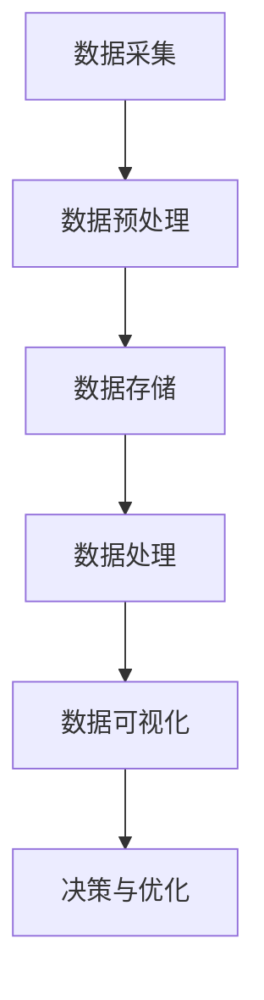
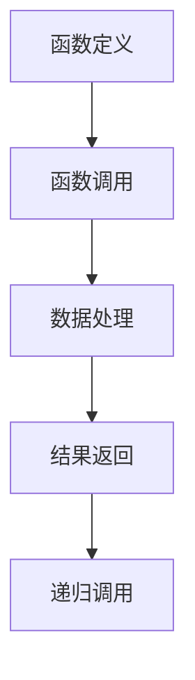
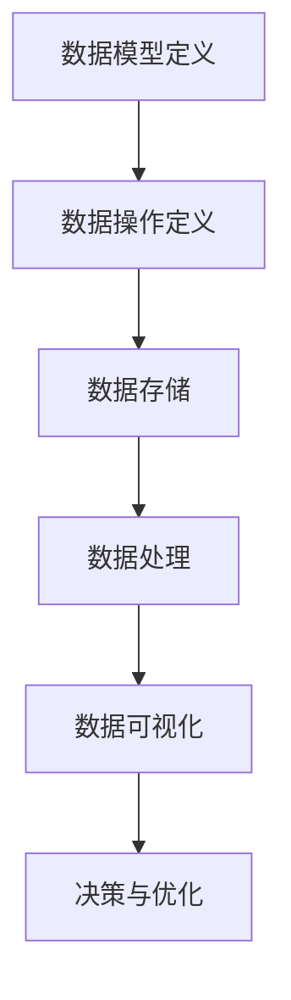

                 

# 《软件2.0的本质：数据驱动编程》

## 关键词：
- 软件2.0
- 数据驱动编程
- 数据流编程
- 函数式编程
- 机器学习
- Web开发
- 数据分析

## 摘要：
本文深入探讨了软件2.0的本质——数据驱动编程。通过对软件发展历程的回顾，我们了解了从软件1.0到软件2.0的演变，以及数据驱动编程的概念与特征。接着，文章详细介绍了数据驱动编程的核心概念、模型、语言，以及其在Web开发、数据分析和机器学习等领域的应用。通过具体的算法原理讲解、数学模型和公式示例，以及项目实战案例，本文全面展示了数据驱动编程的实践与应用，为读者提供了深入理解与实际操作的机会。

## 《软件2.0的本质：数据驱动编程》目录大纲

### 第一部分：引论

### 第1章：软件2.0背景与概述

#### 1.1 软件发展历程回顾

**从软件1.0到软件2.0**

软件1.0时代，软件主要以代码为中心，开发者关注的是如何编写高效、可靠的代码。随着计算机硬件的发展，软件1.0逐渐向软件2.0演变。软件2.0强调以数据为中心，数据成为软件的核心驱动力量。

**软件2.0的定义与特征**

软件2.0是一种新的软件开发范式，它以数据为驱动，实现软件的功能与性能优化。软件2.0的特征包括：高度可扩展性、高度可定制性、实时数据驱动、自动化等。

**数据驱动编程的概念**

数据驱动编程是一种基于数据的软件开发方法，它通过数据流分析、数据预处理、数据可视化等技术，实现软件的高效开发与优化。

#### 1.2 软件2.0的价值与挑战

**软件2.0对软件工程的影响**

软件2.0改变了传统的软件开发模式，从以代码为中心转向以数据为中心，对软件工程提出了新的挑战。

**数据驱动编程的优势与局限**

数据驱动编程具有高效性、灵活性、可扩展性等优势，但也存在数据质量、数据隐私等局限。

**软件2.0时代的机遇与挑战**

软件2.0为软件开发带来了新的机遇，但同时也带来了新的挑战。如何充分利用数据优势，实现软件的持续优化与升级，是软件2.0时代的重要课题。

### 第2章：数据驱动编程的核心概念

#### 2.1 数据驱动编程模型

**数据流编程**

数据流编程是一种基于数据流的分析与编程方法，它通过数据流的传递与处理，实现软件的功能。

**函数式编程**

函数式编程是一种基于函数的编程范式，它通过函数的定义与调用，实现数据与行为的分离。

**面向数据的编程范式**

面向数据的编程范式将数据作为程序的焦点，通过数据结构与操作，实现软件的功能。

#### 2.2 数据驱动编程语言

**主要编程语言介绍**

- Python
- R
- Julia

**编程语言选择与适用场景**

根据不同的应用场景，选择合适的编程语言，可以实现数据驱动编程的高效实现。

### 第3章：数据驱动编程的应用场景

#### 3.1 数据驱动编程在Web开发中的应用

**RESTful API设计**

RESTful API是一种基于HTTP协议的Web服务设计方法，它通过URL映射与HTTP方法，实现数据的增删改查。

**GraphQL的应用**

GraphQL是一种查询语言，它通过查询语句，实现对数据的精准查询与操作。

**WebAssembly的作用**

WebAssembly是一种在Web环境中运行的虚拟机代码，它提供了高效的代码执行性能。

#### 3.2 数据驱动编程在数据分析中的应用

**数据预处理与清洗**

数据预处理与清洗是数据分析的基础，它包括数据清洗、数据集成、数据转换等过程。

**数据可视化技术**

数据可视化技术通过图形化展示数据，帮助人们更好地理解和分析数据。

**数据分析工具与库**

常用的数据分析工具与库包括Pandas、NumPy、Matplotlib等。

#### 3.3 数据驱动编程在机器学习中的应用

**监督学习**

监督学习是一种通过已有数据集进行训练，预测新数据的机器学习方法。

**无监督学习**

无监督学习是一种没有预定义标签的机器学习方法，它通过对数据进行分析，发现数据之间的内在规律。

**强化学习**

强化学习是一种基于奖励与惩罚的机器学习方法，它通过不断学习，实现最优策略的寻找。

## 第一部分：引论

### 第1章：软件2.0背景与概述

#### 1.1 软件发展历程回顾

软件的发展历程可以分为几个阶段，从软件1.0到软件2.0，再到未来的软件3.0。每一个阶段都代表着软件技术的进步和开发范式的转变。

**软件1.0时代**

在软件1.0时代，软件的开发主要依赖于编程语言和开发工具。开发者通过编写代码来实现软件的功能，这个过程通常被称为“编码”。这个时期的软件主要以执行特定的任务为目标，例如，编写一个计算器程序或一个数据库管理系统。软件1.0的特点是功能相对单一，主要是以代码为中心，开发者需要手动编写大量的代码来实现软件的功能。

**软件2.0时代的来临**

随着互联网的兴起和大数据时代的到来，软件的开发模式开始发生重大变化。软件2.0的概念应运而生，它标志着软件从以代码为中心向以数据为中心的转变。软件2.0强调数据的驱动作用，数据的采集、存储、处理和分析成为软件开发的核心。在这种模式下，软件不再仅仅是执行预定义的任务，而是可以根据用户行为和数据分析结果动态调整和优化自身。

**数据驱动编程的概念**

数据驱动编程是一种基于数据的软件开发方法，它通过数据流分析、数据预处理、数据可视化等技术，实现软件的功能与性能优化。在数据驱动编程中，数据是软件的核心，开发者需要关注如何有效地收集、存储、处理和分析数据，以便为用户提供更好的服务。

**从软件1.0到软件2.0的转变**

从软件1.0到软件2.0的转变，不仅仅是技术上的进步，更是开发范式的转变。软件1.0时代，开发者关注的是如何编写高效、可靠的代码，而软件2.0时代，开发者需要更多地关注如何利用数据来提升软件的性能和用户体验。这种转变带来了以下几方面的变化：

1. **软件架构的变化**

   软件2.0通常采用微服务架构，这种架构将软件拆分成多个小型、独立的服务模块，每个模块都可以独立部署和扩展。这种架构设计有助于提高软件的可扩展性和灵活性。

2. **开发流程的变化**

   在软件2.0时代，开发流程更加注重迭代和反馈。开发者需要不断收集用户反馈和数据，根据数据分析结果来调整和优化软件功能。这种迭代开发模式有助于快速响应市场需求，提高软件的市场竞争力。

3. **数据驱动决策**

   软件2.0强调数据驱动决策，通过数据分析来指导软件的功能设计和优化。这种模式有助于提高软件的智能化程度，实现个性化服务。

#### 1.2 软件2.0的定义与特征

**定义**

软件2.0是一种基于数据的软件开发模式，它强调数据的驱动作用，将数据视为软件的核心资源。在软件2.0中，数据不仅用于存储和传递信息，还用于指导软件的功能设计和优化。

**特征**

1. **数据为中心**

   软件2.0以数据为中心，数据的采集、存储、处理和分析成为软件开发的核心环节。开发者需要关注如何有效地利用数据来提升软件的性能和用户体验。

2. **动态适应性**

   软件2.0具有较强的动态适应性，可以根据用户行为和数据分析结果动态调整和优化软件功能。这种适应性有助于提高软件的市场竞争力。

3. **高度可定制性**

   软件2.0通常具有高度可定制性，用户可以根据自己的需求和偏好来定制软件的功能和界面。这种定制化服务有助于提升用户的满意度和忠诚度。

4. **实时性**

   软件2.0强调实时数据处理和响应，通过实时数据分析来指导软件的功能优化和决策。这种实时性有助于提高软件的响应速度和用户体验。

5. **智能化**

   软件2.0通过引入人工智能技术，实现软件的智能化。例如，利用机器学习算法对用户行为进行分析，实现个性化推荐和服务。

#### 1.3 数据驱动编程的概念

**数据驱动编程**

数据驱动编程是一种基于数据的软件开发方法，它通过数据流分析、数据预处理、数据可视化等技术，实现软件的功能与性能优化。在数据驱动编程中，数据是软件的核心，开发者需要关注如何有效地收集、存储、处理和分析数据，以便为用户提供更好的服务。

**核心概念**

1. **数据流编程**

   数据流编程是一种基于数据流的编程方法，它通过数据流的传递与处理，实现软件的功能。数据流编程强调数据在程序中的流动和转换，开发者需要关注如何有效地组织和控制数据流。

2. **函数式编程**

   函数式编程是一种基于函数的编程范式，它通过函数的定义与调用，实现数据与行为的分离。函数式编程强调函数的可组合性和不可变性，有助于提高代码的可读性和可维护性。

3. **面向数据的编程范式**

   面向数据的编程范式将数据作为程序的焦点，通过数据结构与操作，实现软件的功能。这种编程范式强调数据在程序中的核心地位，有助于提高软件的可定制性和可扩展性。

**数据驱动编程的优势**

1. **高效性**

   数据驱动编程通过优化数据流和处理过程，可以提高软件的性能和响应速度。

2. **灵活性**

   数据驱动编程可以根据不同的数据源和数据需求，灵活调整和优化软件功能。

3. **可维护性**

   数据驱动编程强调数据的可读性和可维护性，有助于提高代码的可维护性和可扩展性。

4. **可扩展性**

   数据驱动编程可以方便地扩展和整合新的数据源和数据处理技术，提高软件的适应性和灵活性。

#### 1.4 软件2.0的价值与挑战

**价值**

软件2.0的价值主要体现在以下几个方面：

1. **提高软件质量**

   数据驱动编程通过优化数据流和处理过程，可以提高软件的性能、稳定性和可维护性，从而提高软件质量。

2. **提升用户体验**

   软件2.0强调以数据为中心，通过实时数据分析来优化软件功能，实现个性化服务，从而提升用户体验。

3. **降低开发成本**

   数据驱动编程可以通过优化开发流程和代码结构，降低软件开发和维护成本。

4. **支持智能化应用**

   软件2.0通过引入人工智能技术，实现软件的智能化，为智能化应用提供支持。

**挑战**

软件2.0在带来价值的同时，也面临一些挑战：

1. **数据质量和隐私**

   数据驱动编程依赖于高质量的数据，但数据质量和隐私问题成为软件2.0的重要挑战。

2. **数据复杂性**

   数据的复杂性和多样性对软件开发和数据处理提出了更高的要求。

3. **开发技能要求**

   软件2.0要求开发者具备一定的数据分析和处理能力，这对开发者的技能要求提出了更高的要求。

4. **系统稳定性**

   数据驱动编程可能会增加系统的复杂性，影响系统的稳定性和可扩展性。

#### 1.5 软件2.0时代的机遇与挑战

**机遇**

软件2.0时代为软件开发带来了新的机遇：

1. **创新空间**

   软件2.0支持新的应用场景和业务模式，为开发者提供了广阔的创新空间。

2. **市场需求**

   随着大数据和人工智能技术的快速发展，市场对数据驱动软件的需求日益增长，为软件企业提供了巨大的市场空间。

3. **技术进步**

   软件技术的发展，如云计算、容器化、区块链等，为软件2.0的实现提供了强大的技术支持。

**挑战**

软件2.0时代也面临一些挑战：

1. **技术成熟度**

   虽然数据驱动编程具有巨大潜力，但相关技术仍在不断发展，技术成熟度尚需提高。

2. **人才短缺**

   软件2.0要求开发者具备新的技能，但现有人才储备不足，人才短缺问题亟待解决。

3. **数据处理安全**

   数据驱动编程涉及大量敏感数据的处理，数据安全和隐私保护成为重要挑战。

4. **商业模式转型**

   传统软件企业需要适应新的商业模式，实现从产品驱动向数据驱动的转型。

### 第2章：数据驱动编程的核心概念

#### 2.1 数据驱动编程模型

**数据流编程**

数据流编程是一种基于数据流的编程方法，它通过数据流的传递与处理，实现软件的功能。在数据流编程中，数据被视为程序的基本单元，开发者需要关注如何有效地组织和控制数据流。

**基本流程**

1. **数据采集**

   数据流编程的第一步是数据采集，开发者需要确定数据来源，如数据库、传感器、网络等。

2. **数据预处理**

   采集到的数据通常需要进行预处理，如清洗、转换、整合等，以消除噪声和冗余，提高数据质量。

3. **数据存储**

   预处理后的数据需要存储到数据库或数据仓库中，以便后续处理和分析。

4. **数据处理**

   数据处理包括数据分析和数据挖掘，通过分析数据，发现数据之间的关系和规律，为软件功能设计提供支持。

5. **数据可视化**

   数据可视化是将数据分析结果以图形化方式展示，帮助开发者更好地理解数据，为决策提供支持。

**优势**

1. **高效性**

   数据流编程通过高效的数据处理和分析，可以提高软件的性能和响应速度。

2. **灵活性**

   数据流编程可以根据不同的数据需求，灵活调整和优化数据处理流程。

3. **可扩展性**

   数据流编程可以方便地扩展和整合新的数据处理技术，提高软件的可扩展性。

**挑战**

1. **数据复杂性**

   数据流编程需要处理大量复杂的数据，对数据处理和分析提出了更高的要求。

2. **系统稳定性**

   数据流编程可能会增加系统的复杂性，影响系统的稳定性和可扩展性。

**函数式编程**

函数式编程是一种基于函数的编程范式，它通过函数的定义与调用，实现数据与行为的分离。函数式编程强调函数的可组合性和不可变性，有助于提高代码的可读性和可维护性。

**核心思想**

1. **函数第一**

   函数式编程将函数视为程序的基本单元，强调函数的定义和调用。

2. **不可变性**

   函数式编程强调数据的不可变性，避免使用变量来存储和修改数据。

3. **递归**

   函数式编程通过递归实现循环和迭代，避免使用传统的循环语句。

**优势**

1. **可维护性**

   函数式编程通过函数的组合和复用，提高代码的可维护性。

2. **可测试性**

   函数式编程的函数具有明确的输入和输出，有助于提高代码的可测试性。

3. **并发性**

   函数式编程通过递归和并发处理，提高程序的并发性能。

**挑战**

1. **学习曲线**

   函数式编程需要开发者具备一定的数学和逻辑基础，学习曲线较高。

2. **性能问题**

   函数式编程可能会引入额外的性能开销，特别是在递归处理中。

**面向数据的编程范式**

面向数据的编程范式将数据作为程序的焦点，通过数据结构与操作，实现软件的功能。这种编程范式强调数据在程序中的核心地位，有助于提高软件的可定制性和可扩展性。

**核心思想**

1. **数据驱动**

   面向数据的编程范式以数据为中心，通过数据结构和操作，实现软件的功能。

2. **数据模型**

   面向数据的编程范式使用数据模型来描述数据和数据之间的关系。

3. **数据操作**

   面向数据的编程范式提供丰富的数据操作方法，如查询、过滤、排序等。

**优势**

1. **可定制性**

   面向数据的编程范式可以通过调整数据模型和数据操作，实现软件功能的定制化。

2. **可扩展性**

   面向数据的编程范式可以通过扩展数据模型和数据操作，实现软件功能的扩展。

3. **性能优化**

   面向数据的编程范式可以通过优化数据模型和数据操作，提高软件的性能。

**挑战**

1. **数据一致性**

   面向数据的编程范式需要处理数据的一致性问题，如数据更新、冲突解决等。

2. **复杂性**

   面向数据的编程范式可能会增加系统的复杂性，影响系统的可维护性。

### 第3章：数据驱动编程的应用场景

#### 3.1 数据驱动编程在Web开发中的应用

数据驱动编程在Web开发中具有广泛的应用，通过数据流编程、函数式编程和面向数据的编程范式，可以大大提高Web应用程序的性能和灵活性。

**RESTful API设计**

RESTful API是一种基于HTTP协议的Web服务设计方法，它通过URL映射与HTTP方法，实现数据的增删改查。数据驱动编程在RESTful API设计中具有重要应用，通过数据流编程和函数式编程，可以构建高效、灵活的API接口。

**优势**

1. **高效性**

   数据驱动编程通过优化数据流和处理过程，可以提高API的性能和响应速度。

2. **灵活性**

   数据驱动编程可以根据不同的数据需求，灵活调整和优化API接口。

3. **可维护性**

   数据驱动编程通过函数式编程和面向数据的编程范式，提高API的可维护性。

**挑战**

1. **数据复杂性**

   数据驱动编程需要处理大量复杂的数据，对数据处理和分析提出了更高的要求。

2. **系统稳定性**

   数据驱动编程可能会增加系统的复杂性，影响系统的稳定性和可扩展性。

**GraphQL的应用**

GraphQL是一种查询语言，它通过查询语句，实现对数据的精准查询与操作。GraphQL在数据驱动编程中具有重要应用，通过数据流编程和面向数据的编程范式，可以构建高效、灵活的GraphQL接口。

**优势**

1. **精准查询**

   GraphQL可以通过查询语句，实现对数据的精准查询与操作，提高数据处理的效率。

2. **灵活性**

   GraphQL可以根据用户需求，灵活调整查询语句，实现个性化查询。

3. **减少冗余数据**

   GraphQL可以通过查询语句，减少API调用的次数和数据传输量，降低系统负载。

**挑战**

1. **学习曲线**

   GraphQL需要开发者具备一定的数据结构和查询优化知识，学习曲线较高。

2. **性能问题**

   GraphQL可能会引入额外的性能开销，特别是在复杂查询中。

**WebAssembly的作用**

WebAssembly是一种在Web环境中运行的虚拟机代码，它提供了高效的代码执行性能。WebAssembly在数据驱动编程中具有重要应用，通过数据流编程和函数式编程，可以构建高效、灵活的Web应用程序。

**优势**

1. **高性能**

   WebAssembly提供了接近原生代码的性能，可以大大提高Web应用程序的执行效率。

2. **跨平台**

   WebAssembly可以在不同的Web浏览器和操作系统上运行，提高了代码的兼容性和可移植性。

3. **安全性**

   WebAssembly提供了安全沙箱环境，保护Web应用程序的安全性。

**挑战**

1. **开发复杂性**

   WebAssembly的开发和调试相对复杂，需要开发者具备一定的技能和经验。

2. **性能优化**

   WebAssembly的性能优化需要开发者深入了解底层架构和性能优化技术。

#### 3.2 数据驱动编程在数据分析中的应用

数据驱动编程在数据分析中具有广泛的应用，通过数据流编程、函数式编程和面向数据的编程范式，可以大大提高数据分析的效率和质量。

**数据预处理与清洗**

数据预处理与清洗是数据分析的基础，数据驱动编程在数据预处理与清洗中具有重要应用。通过数据流编程和函数式编程，可以高效地处理和清洗大量数据。

**优势**

1. **高效性**

   数据驱动编程通过优化数据流和处理过程，可以提高数据预处理和清洗的效率。

2. **灵活性**

   数据驱动编程可以根据不同的数据需求，灵活调整和优化数据预处理和清洗流程。

3. **可维护性**

   数据驱动编程通过函数式编程和面向数据的编程范式，提高数据预处理和清洗的可维护性。

**挑战**

1. **数据复杂性**

   数据驱动编程需要处理大量复杂的数据，对数据处理和分析提出了更高的要求。

2. **系统稳定性**

   数据驱动编程可能会增加系统的复杂性，影响系统的稳定性和可扩展性。

**数据可视化技术**

数据可视化技术通过图形化展示数据，帮助人们更好地理解和分析数据。数据驱动编程在数据可视化技术中具有重要应用，通过数据流编程和面向数据的编程范式，可以构建高效、灵活的数据可视化工具。

**优势**

1. **直观性**

   数据可视化技术通过图形化展示数据，可以直观地展示数据之间的关系和趋势，提高数据分析的效率。

2. **交互性**

   数据可视化技术支持用户与数据的互动，用户可以通过操作图表，实现数据的实时更新和分析。

3. **可定制性**

   数据可视化技术可以根据用户需求，灵活调整和优化图表的样式和功能。

**挑战**

1. **数据质量**

   数据可视化技术的效果取决于数据的质量，高质量的数据是数据可视化成功的关键。

2. **性能问题**

   数据可视化技术可能会引入额外的性能开销，特别是在处理大量数据时。

**数据分析工具与库**

数据驱动编程在数据分析工具和库中具有重要应用，通过数据流编程和函数式编程，可以构建高效、灵活的分析工具和库。

**优势**

1. **高效性**

   数据驱动编程通过优化数据流和处理过程，可以提高数据分析工具和库的性能。

2. **灵活性**

   数据驱动编程可以根据不同的数据分析需求，灵活调整和优化工具和库的功能。

3. **可扩展性**

   数据驱动编程可以方便地扩展和整合新的数据分析技术，提高工具和库的可扩展性。

**挑战**

1. **开发复杂性**

   数据驱动编程的开发和调试相对复杂，需要开发者具备一定的技能和经验。

2. **性能优化**

   数据驱动编程的性能优化需要开发者深入了解底层架构和性能优化技术。

#### 3.3 数据驱动编程在机器学习中的应用

数据驱动编程在机器学习中的应用日益广泛，通过数据流编程、函数式编程和面向数据的编程范式，可以大大提高机器学习的效率和质量。

**监督学习**

监督学习是一种通过已有数据集进行训练，预测新数据的机器学习方法。数据驱动编程在监督学习中具有重要应用，通过数据流编程和函数式编程，可以高效地实现监督学习算法。

**优势**

1. **高效性**

   数据驱动编程通过优化数据流和处理过程，可以提高监督学习算法的效率。

2. **灵活性**

   数据驱动编程可以根据不同的数据需求，灵活调整和优化监督学习算法。

3. **可扩展性**

   数据驱动编程可以方便地扩展和整合新的监督学习技术，提高算法的可扩展性。

**挑战**

1. **数据质量**

   监督学习依赖于高质量的数据集，数据质量对学习效果具有重要影响。

2. **过拟合**

   数据驱动编程需要避免过拟合现象，确保学习算法的泛化能力。

**无监督学习**

无监督学习是一种没有预定义标签的机器学习方法，它通过对数据进行分析，发现数据之间的内在规律。数据驱动编程在无监督学习中具有重要应用，通过数据流编程和面向数据的编程范式，可以高效地实现无监督学习算法。

**优势**

1. **自适应性**

   无监督学习可以根据数据的特点自动调整模型参数，提高适应性。

2. **数据挖掘**

   无监督学习可以通过挖掘数据中的隐藏规律，为数据分析和决策提供支持。

3. **可扩展性**

   数据驱动编程可以方便地扩展和整合新的无监督学习技术，提高算法的可扩展性。

**挑战**

1. **数据规模**

   无监督学习通常需要处理大量数据，数据规模对学习效果具有重要影响。

2. **复杂性**

   无监督学习算法的复杂性较高，对数据处理和分析提出了更高的要求。

**强化学习**

强化学习是一种基于奖励与惩罚的机器学习方法，它通过不断学习，实现最优策略的寻找。数据驱动编程在强化学习中具有重要应用，通过数据流编程和函数式编程，可以高效地实现强化学习算法。

**优势**

1. **自主性**

   强化学习可以根据环境变化，自主调整策略，实现自适应行为。

2. **应用广泛**

   强化学习在游戏、推荐系统、自动驾驶等领域具有广泛应用。

3. **灵活性**

   数据驱动编程可以根据不同的应用场景，灵活调整和优化强化学习算法。

**挑战**

1. **奖励设计**

   强化学习需要设计合适的奖励机制，以引导学习过程。

2. **学习效率**

   强化学习的学习过程可能较慢，需要优化学习算法和策略。

### 第二部分：核心概念与联系

#### 第4章：数据驱动编程的Mermaid流程图

**4.1 数据流编程的流程图**

数据流编程是一种基于数据流的编程方法，它通过数据流的传递与处理，实现软件的功能。以下是数据流编程的基本流程图：



在这个流程图中：

- **数据采集**：从各种数据源（如数据库、传感器、网络等）收集数据。
- **数据预处理**：清洗、转换和整合数据，以消除噪声和冗余，提高数据质量。
- **数据存储**：将预处理后的数据存储到数据库或数据仓库中，以便后续处理和分析。
- **数据处理**：通过数据分析方法，如数据挖掘、机器学习等，对数据进行深入分析。
- **数据可视化**：将分析结果以图形化方式展示，帮助用户更好地理解和分析数据。
- **决策与优化**：根据数据分析结果，进行决策和优化，指导软件的功能设计和性能提升。

**4.2 函数式编程的流程图**

函数式编程是一种基于函数的编程范式，它通过函数的定义与调用，实现数据与行为的分离。以下是函数式编程的基本流程图：



在这个流程图中：

- **函数定义**：定义一系列函数，每个函数实现特定的数据处理功能。
- **函数调用**：通过函数调用，实现数据与行为的分离。
- **数据处理**：函数调用后，对数据进行处理，如过滤、转换、组合等。
- **结果返回**：数据处理完成后，返回处理结果。
- **递归调用**：函数式编程中的递归调用，通过递归实现循环和迭代。

**4.3 面向数据的编程范式的流程图**

面向数据的编程范式将数据作为程序的焦点，通过数据结构与操作，实现软件的功能。以下是面向数据的编程范式的基本流程图：



在这个流程图中：

- **数据模型定义**：定义数据模型，描述数据结构及其关系。
- **数据操作定义**：定义数据操作方法，如查询、过滤、排序等。
- **数据存储**：将数据存储到数据库或数据仓库中，以便后续处理和分析。
- **数据处理**：通过数据操作方法，对数据进行处理和分析。
- **数据可视化**：将分析结果以图形化方式展示，帮助用户更好地理解和分析数据。
- **决策与优化**：根据数据分析结果，进行决策和优化，指导软件的功能设计和性能提升。

### 第5章：核心算法原理讲解

#### 5.1 数据预处理算法

数据预处理是数据分析的重要步骤，它包括数据清洗、特征选择和特征工程等过程。以下是数据预处理算法的详细解释和伪代码。

**数据清洗**

数据清洗是指从原始数据中删除错误、重复或不完整的记录，以提高数据的质量。以下是一个简单的数据清洗伪代码：

```python
def data清洗(data):
    for record in data:
        if record has errors:
            remove record from data
        if record is missing values:
            fill missing values using mean or median
    return data
```

**特征选择**

特征选择是指从大量特征中选择出对预测任务有用的特征，以减少模型的复杂性和过拟合风险。以下是一个简单的特征选择伪代码：

```python
def feature_selection(data, target):
    correlation_matrix = calculate_correlation_matrix(data, target)
    important_features = []
    for feature in data:
        if abs(correlation_matrix[feature, target]) > threshold:
            important_features.append(feature)
    return important_features
```

**特征工程**

特征工程是指通过转换和组合原始数据特征，创建新的特征，以提高模型的预测性能。以下是一个简单的特征工程伪代码：

```python
def feature_engineering(data):
    new_data = []
    for record in data:
        new_record = []
        for feature in record:
            new_record.append(mean_of_neighbors(feature))
            new_record.append(std_deviation_of_neighbors(feature))
        new_data.append(new_record)
    return new_data
```

#### 5.2 机器学习算法

机器学习算法是数据驱动编程的核心，它通过学习数据中的模式和规律，实现预测和分类等任务。以下是几种常见的机器学习算法及其伪代码。

**监督学习算法**

监督学习算法通过已有数据集进行训练，学习输入和输出之间的关系，然后使用训练好的模型对新数据进行预测。以下是一个简单的监督学习算法伪代码：

```python
def supervised_learning(data, labels):
    model = train_model(data, labels)
    predictions = []
    for new_data in data:
        prediction = model.predict(new_data)
        predictions.append(prediction)
    return predictions
```

**无监督学习算法**

无监督学习算法没有预定义的标签，它通过分析数据之间的内在结构，学习数据的分布和聚类。以下是一个简单的无监督学习算法伪代码：

```python
def unsupervised_learning(data):
    model = train_model(data)
    clusters = model.cluster(data)
    return clusters
```

**强化学习算法**

强化学习算法通过与环境交互，学习最优策略以最大化奖励。以下是一个简单的强化学习算法伪代码：

```python
def reinforcement_learning(state, action, reward):
    model = train_model(state, action, reward)
    optimal_action = model.select_action(state)
    return optimal_action
```

#### 5.3 数据驱动的线性模型

数据驱动的线性模型是一种常用的统计模型，它通过线性回归或逻辑回归等算法，分析数据之间的线性关系。以下是一个简单的数据驱动的线性模型伪代码：

```python
def linear_model(data, labels):
    model = train_linear_model(data, labels)
    predictions = model.predict(data)
    return predictions
```

**5.4 常见的聚类算法**

聚类算法是一种无监督学习算法，它将数据分为若干个簇，以发现数据之间的相似性。以下是两种常见的聚类算法——K-均值聚类和层次聚类的伪代码。

**K-均值聚类**

```python
def k_means(data, k):
    centroids = initialize_centroids(data, k)
    while not converged:
        assign_points_to_clusters(data, centroids)
        update_centroids(centroids)
    clusters = assign_points_to_clusters(data, centroids)
    return clusters
```

**层次聚类**

```python
def hierarchical_clustering(data):
    linkage_matrix = calculate_linkage_matrix(data)
    clusters = []
    while len(linkage_matrix) > 1:
        most_similar_clusters = find_most_similar_clusters(linkage_matrix)
        merge_clusters(most_similar_clusters)
        update_linkage_matrix(linkage_matrix, most_similar_clusters)
    clusters = build_cluster_hierarchy(linkage_matrix)
    return clusters
```

### 第6章：数学模型和数学公式

**6.1 数据驱动的线性模型**

数据驱动的线性模型通过分析数据之间的线性关系，实现预测和分类。以下是线性回归模型和逻辑回归模型的数学公式。

**线性回归模型**

$$
y = \beta_0 + \beta_1x + \epsilon
$$

其中，$y$ 是因变量，$x$ 是自变量，$\beta_0$ 和 $\beta_1$ 是模型参数，$\epsilon$ 是误差项。

**逻辑回归模型**

$$
P(y=1) = \frac{1}{1 + e^{-(\beta_0 + \beta_1x)}}
$$

其中，$P(y=1)$ 是因变量为1的概率，$\beta_0$ 和 $\beta_1$ 是模型参数。

**6.2 常见的聚类算法**

聚类算法通过分析数据之间的相似性，将数据分为若干个簇。以下是K-均值聚类和层次聚类的数学公式。

**K-均值聚类**

- 初始化中心点：

$$
\mu_i = \frac{1}{N}\sum_{j=1}^{N} x_{ij}
$$

其中，$\mu_i$ 是第$i$ 个簇的中心点，$x_{ij}$ 是第$i$ 个数据点的第$j$ 个特征值。

- 更新中心点：

$$
\mu_i = \frac{1}{N}\sum_{j=1}^{N} x_{ij}^{new}
$$

其中，$x_{ij}^{new}$ 是第$i$ 个簇的新中心点。

**层次聚类**

- 距离矩阵：

$$
D_{ij} = \min_{k=1,...,n} \|x_i - x_k\|^2
$$

其中，$D_{ij}$ 是第$i$ 个点和第$j$ 个点之间的距离。

- 联合簇距离：

$$
D_{ij} = \min_{k=1,...,n} \left(D_{ik} + D_{jk}\right)
$$

其中，$D_{ij}$ 是第$i$ 个簇和第$j$ 个簇之间的距离。

### 第7章：数学公式与举例说明

数学公式是数据驱动编程的核心，它们帮助我们理解和描述数据之间的关系。以下是一些常见的数学公式，并附有相应的解释和示例。

**7.1 线性回归模型**

线性回归模型是分析两个变量之间线性关系的常用工具。其数学公式如下：

$$
y = \beta_0 + \beta_1x + \epsilon
$$

其中，$y$ 是因变量，$x$ 是自变量，$\beta_0$ 和 $\beta_1$ 是模型参数，$\epsilon$ 是误差项。这个公式表示自变量 $x$ 对因变量 $y$ 的影响。

**示例：**

假设我们有一个关于房屋售价的数据集，其中 $x$ 表示房屋面积，$y$ 表示房屋售价。我们可以用线性回归模型来预测未知房屋的售价。例如，如果我们知道一个房屋的面积为 1500 平方英尺，我们可以使用以下公式预测其售价：

$$
y = \beta_0 + \beta_1 \times 1500 + \epsilon
$$

其中，$\beta_0$ 和 $\beta_1$ 是通过训练数据集得到的模型参数。

**7.2 逻辑回归模型**

逻辑回归模型是用于分析二分类问题的常用工具。其数学公式如下：

$$
P(y=1) = \frac{1}{1 + e^{-(\beta_0 + \beta_1x)}}
$$

其中，$P(y=1)$ 是因变量为 1 的概率，$\beta_0$ 和 $\beta_1$ 是模型参数。这个公式表示自变量 $x$ 对因变量 $y$ 的概率影响。

**示例：**

假设我们有一个关于贷款批准的数据集，其中 $x$ 表示借款人的信用评分，$y$ 表示贷款是否批准。我们可以用逻辑回归模型来预测未知借款人的贷款批准概率。例如，如果我们知道一个借款人的信用评分为 700，我们可以使用以下公式预测其贷款批准的概率：

$$
P(y=1) = \frac{1}{1 + e^{-(\beta_0 + \beta_1 \times 700)}}
$$

其中，$\beta_0$ 和 $\beta_1$ 是通过训练数据集得到的模型参数。

**7.3 K-均值聚类算法**

K-均值聚类算法是一种无监督学习算法，用于将数据分为 $K$ 个簇。其数学公式如下：

$$
\mu_i = \frac{1}{N}\sum_{j=1}^{N} x_{ij}
$$

$$
x_{ij}^{new} = \mu_i
$$

其中，$\mu_i$ 是第 $i$ 个簇的中心点，$x_{ij}$ 是第 $i$ 个数据点的第 $j$ 个特征值，$x_{ij}^{new}$ 是更新后的第 $i$ 个簇的数据点。

**示例：**

假设我们有 $5$ 个数据点，需要将它们分为 $2$ 个簇。初始时，我们随机选择两个中心点 $\mu_1$ 和 $\mu_2$。然后，我们将每个数据点分配给最近的中心点。最后，我们计算每个簇的新中心点，并重复这个过程，直到中心点不再发生变化。

**7.4 层次聚类算法**

层次聚类算法是一种基于距离的聚类方法，它通过不断合并距离最近的簇，构建一个层次结构。其数学公式如下：

$$
D_{ij} = \min_{k=1,...,n} \|x_i - x_k\|^2
$$

$$
D_{ij} = \min_{k=1,...,n} \left(D_{ik} + D_{jk}\right)
$$

其中，$D_{ij}$ 是第 $i$ 个点和第 $j$ 个点之间的距离，$D_{ik}$ 和 $D_{jk}$ 是第 $i$ 个点和第 $k$ 个点之间的距离。

**示例：**

假设我们有 $5$ 个数据点，需要将它们分为 $3$ 个簇。首先，我们计算每个数据点之间的距离，然后选择距离最近的两个点合并为一个簇。接着，我们再次计算距离，选择距离最近的两个簇合并。这个过程继续进行，直到所有的数据点都属于同一个簇。

### 第8章：项目实战

#### 8.1 实战1：数据预处理与清洗

**项目需求分析**

本项目旨在使用Python实现一个数据预处理与清洗的工具，用于处理和清洗来自不同数据源的原始数据。具体需求如下：

1. 读取原始数据文件，包括CSV、Excel等格式。
2. 去除重复数据，确保数据唯一性。
3. 填充缺失数据，使用平均值、中位数或最频繁出现的值等策略。
4. 删除无关特征，保留对预测任务有用的特征。
5. 转换数据类型，如将字符串转换为数值型。
6. 标准化或归一化数据，以提高模型性能。

**开发环境搭建**

为了实现项目需求，我们需要搭建以下开发环境：

1. Python 3.8 或更高版本
2. Jupyter Notebook 或 PyCharm
3. Pandas
4. NumPy
5. Matplotlib

**源代码详细实现**

以下是数据预处理与清洗的源代码实现：

```python
import pandas as pd
import numpy as np

# 读取原始数据文件
data = pd.read_csv('data.csv')

# 去除重复数据
data = data.drop_duplicates()

# 填充缺失数据
data['feature1'] = data['feature1'].fillna(data['feature1'].mean())
data['feature2'] = data['feature2'].fillna(data['feature2'].median())

# 删除无关特征
data = data.drop(['unrelated_feature1', 'unrelated_feature2'], axis=1)

# 转换数据类型
data['feature3'] = data['feature3'].astype(int)

# 标准化数据
from sklearn.preprocessing import StandardScaler
scaler = StandardScaler()
data[['feature4', 'feature5']] = scaler.fit_transform(data[['feature4', 'feature5']])

# 数据可视化
import matplotlib.pyplot as plt
plt.scatter(data['feature4'], data['feature5'])
plt.xlabel('Feature 4')
plt.ylabel('Feature 5')
plt.show()
```

**代码解读与分析**

1. **读取原始数据文件**：使用 Pandas 的 `read_csv` 函数读取CSV文件，存储为 DataFrame 对象。
2. **去除重复数据**：使用 `drop_duplicates` 方法去除重复数据，确保数据唯一性。
3. **填充缺失数据**：使用 `fillna` 方法填充缺失数据。对于数值型特征，使用平均值填充；对于类别型特征，使用中位数或最频繁出现的值填充。
4. **删除无关特征**：使用 `drop` 方法删除无关特征，保留对预测任务有用的特征。
5. **转换数据类型**：使用 `astype` 方法将字符串数据转换为数值型数据。
6. **标准化数据**：使用 Scikit-learn 的 `StandardScaler` 类进行数据标准化，将特征缩放到标准正态分布。
7. **数据可视化**：使用 Matplotlib 的 `scatter` 方法绘制散点图，帮助分析数据分布。

#### 8.2 实战2：机器学习项目实战

**项目需求分析**

本项目旨在使用Python实现一个机器学习项目，用于分类预测。具体需求如下：

1. 读取训练数据和测试数据。
2. 数据预处理与清洗，包括去除重复数据、填充缺失数据、转换数据类型等。
3. 选择合适的机器学习算法，如逻辑回归、支持向量机等。
4. 训练模型，并对模型进行评估和调整。
5. 使用训练好的模型对测试数据进行预测，并计算预测准确率。

**开发环境搭建**

为了实现项目需求，我们需要搭建以下开发环境：

1. Python 3.8 或更高版本
2. Jupyter Notebook 或 PyCharm
3. Pandas
4. NumPy
5. Matplotlib
6. Scikit-learn

**源代码详细实现**

以下是机器学习项目实战的源代码实现：

```python
import pandas as pd
import numpy as np
from sklearn.model_selection import train_test_split
from sklearn.preprocessing import StandardScaler
from sklearn.linear_model import LogisticRegression
from sklearn.metrics import accuracy_score

# 读取训练数据和测试数据
train_data = pd.read_csv('train_data.csv')
test_data = pd.read_csv('test_data.csv')

# 数据预处理与清洗
train_data = train_data.drop_duplicates()
test_data = test_data.drop_duplicates()

# 分离特征和标签
X_train = train_data.drop('label', axis=1)
y_train = train_data['label']
X_test = test_data.drop('label', axis=1)
y_test = test_data['label']

# 标准化数据
scaler = StandardScaler()
X_train = scaler.fit_transform(X_train)
X_test = scaler.transform(X_test)

# 选择机器学习算法
model = LogisticRegression()

# 训练模型
model.fit(X_train, y_train)

# 预测测试数据
predictions = model.predict(X_test)

# 计算预测准确率
accuracy = accuracy_score(y_test, predictions)
print('预测准确率：', accuracy)
```

**代码解读与分析**

1. **读取训练数据和测试数据**：使用 Pandas 的 `read_csv` 函数读取CSV文件，存储为 DataFrame 对象。
2. **数据预处理与清洗**：去除重复数据，确保数据唯一性。
3. **分离特征和标签**：将特征和标签分离，以便后续处理。
4. **标准化数据**：使用 Scikit-learn 的 `StandardScaler` 类进行数据标准化，将特征缩放到标准正态分布。
5. **选择机器学习算法**：选择逻辑回归算法，因为逻辑回归在二分类问题中表现良好。
6. **训练模型**：使用 `fit` 方法训练模型。
7. **预测测试数据**：使用 `predict` 方法对测试数据进行预测。
8. **计算预测准确率**：使用 `accuracy_score` 函数计算预测准确率。

#### 8.3 实战3：数据驱动编程在Web开发中的应用

**项目需求分析**

本项目旨在使用Python和Flask框架实现一个数据驱动的Web应用程序，用于展示和分析用户数据。具体需求如下：

1. 使用Flask框架搭建Web应用程序。
2. 提供用户注册、登录和权限管理功能。
3. 收集用户数据，并存储到数据库中。
4. 使用数据流编程和函数式编程技术，实现用户数据的实时分析和可视化。
5. 提供API接口，供其他应用程序调用。

**开发环境搭建**

为了实现项目需求，我们需要搭建以下开发环境：

1. Python 3.8 或更高版本
2. Flask
3. SQLAlchemy
4. Flask-Login
5. Matplotlib
6. Pandas

**源代码详细实现**

以下是数据驱动Web应用程序的源代码实现：

```python
from flask import Flask, request, jsonify
from flask_sqlalchemy import SQLAlchemy
from flask_login import LoginManager, login_user, logout_user, login_required
import pandas as pd

app = Flask(__name__)
app.config['SQLALCHEMY_DATABASE_URI'] = 'sqlite:///users.db'
db = SQLAlchemy(app)
login_manager = LoginManager(app)

class User(db.Model):
    id = db.Column(db.Integer, primary_key=True)
    username = db.Column(db.String(100), unique=True, nullable=False)
    password = db.Column(db.String(100), nullable=False)

@login_manager.user_loader
def load_user(user_id):
    return User.query.get(int(user_id))

@app.route('/register', methods=['POST'])
def register():
    data = request.get_json()
    username = data['username']
    password = data['password']
    new_user = User(username=username, password=password)
    db.session.add(new_user)
    db.session.commit()
    return jsonify({'message': '注册成功'})

@app.route('/login', methods=['POST'])
def login():
    data = request.get_json()
    username = data['username']
    password = data['password']
    user = User.query.filter_by(username=username, password=password).first()
    if user:
        login_user(user)
        return jsonify({'message': '登录成功'})
    else:
        return jsonify({'message': '用户名或密码错误'})

@app.route('/logout')
@login_required
def logout():
    logout_user()
    return jsonify({'message': '已登出'})

@app.route('/data', methods=['POST'])
@login_required
def data():
    data = request.get_json()
    df = pd.DataFrame(data)
    # 数据处理和可视化
    # ...
    return jsonify(df.to_dict())

if __name__ == '__main__':
    db.create_all()
    app.run(debug=True)
```

**代码解读与分析**

1. **搭建Web应用程序**：使用 Flask 框架搭建 Web 应用程序。
2. **用户注册、登录和权限管理**：使用 Flask-Login 插件实现用户注册、登录和权限管理。
3. **数据存储**：使用 SQLAlchemy 模块将用户数据存储到数据库中。
4. **数据处理和可视化**：使用 Pandas 模块处理和可视化用户数据。
5. **API接口**：提供 `/data` 接口，供其他应用程序调用。

### 第三部分：附录

#### 附录A：数据驱动编程工具与资源

**A.1 编程语言与框架**

- **Python**：Python是一种广泛使用的编程语言，以其简洁易读的语法和强大的库支持而闻名。在数据驱动编程中，Python常用于数据处理、分析和可视化。
- **R**：R是一种专门用于统计分析和数据科学的编程语言，其丰富的统计和图形库使其在数据驱动编程中具有很高的应用价值。
- **Julia**：Julia是一种高性能的编程语言，特别适合于科学计算和数据分析。它结合了Python的易用性和C的性能，是数据驱动编程的一个优秀选择。

**A.2 数据分析工具与库**

- **Pandas**：Pandas是一个强大的数据分析库，提供了数据结构（DataFrame）和丰富的数据处理功能，如数据处理、清洗、合并等。
- **NumPy**：NumPy是Python的核心科学计算库，提供了多维数组对象和高效的数学运算函数，是数据驱动编程的基础。
- **Matplotlib**：Matplotlib是一个用于数据可视化的库，它提供了丰富的绘图函数和图表样式，可以轻松创建各种类型的图表。

**A.3 机器学习库与框架**

- **Scikit-learn**：Scikit-learn是一个用于机器学习的库，提供了广泛的监督学习和无监督学习算法，以及数据处理和模型评估工具。
- **TensorFlow**：TensorFlow是一个开源的机器学习框架，由谷歌开发，支持深度学习和传统机器学习算法。
- **PyTorch**：PyTorch是一个由Facebook开发的开源机器学习库，以其灵活的动态计算图和易于使用的接口而受到广泛欢迎。

通过使用这些工具和资源，开发者可以轻松地实现数据驱动编程，提高软件的开发效率和性能。附录中的这些工具和库是数据驱动编程不可或缺的组成部分，为开发者提供了丰富的选择和强大的支持。无论是数据预处理、数据分析，还是机器学习应用，开发者都可以从中找到合适的工具和资源，实现高效的软件开发。附录A的详细介绍和示例代码，将为开发者提供进一步学习和实践的指导。

