                 

### 文章标题

《软件2.0：超越传统编程范式》

**关键词：** 软件进化、智能编程、人工智能、机器学习、大数据、云计算

**摘要：** 本文章深入探讨了软件2.0的概念、核心技术和应用实践，揭示了其在人工智能、数据分析和软件开发等领域的革命性潜力。文章分为三个部分，分别介绍了软件2.0的背景与理论、应用实践以及未来发展趋势和挑战。通过详实的案例研究和实战经验，本文旨在为广大开发者和技术爱好者提供全面而深入的软件2.0知识，推动传统编程范式的革新与升级。

---

### 目录大纲：软件2.0：超越传统编程范式

**第一部分：软件2.0背景与理论**

### 第1章：软件2.0概述

#### 1.1 软件2.0与人工智能的关系

##### 1.1.1 软件2.0的智能算法基础

##### 1.1.2 机器学习与深度学习的关系

##### 1.1.3 软件2.0与大数据的关系

#### 1.2 软件2.0与传统编程范式的区别

##### 1.2.1 传统编程范式的局限性

##### 1.2.2 软件2.0带来的创新

##### 1.2.3 软件2.0的核心概念

### 第2章：软件2.0的关键技术

#### 2.1 智能算法与机器学习基础

##### 2.1.1 神经网络的基本结构

##### 2.1.2 常见的深度学习架构

##### 2.1.3 深度学习优化算法

#### 2.2 大数据和云计算的融合

##### 2.2.1 大数据的概念与特点

##### 2.2.2 云计算的基本原理与架构

##### 2.2.3 大数据与云计算的结合

#### 2.3 软件2.0时代的编程语言

##### 2.3.1 编程语言的演变

##### 2.3.2 软件2.0编程语言的特点

##### 2.3.3 软件2.0编程语言的应用场景

**第二部分：软件2.0的应用实践**

### 第3章：软件2.0在人工智能领域的应用

#### 3.1 AI大模型的应用场景

##### 3.1.1 智能客服

##### 3.1.2 智能推荐

##### 3.1.3 智能医疗

#### 3.2 AI大模型的开发流程

##### 3.2.1 数据准备与预处理

##### 3.2.2 模型选择与训练

##### 3.2.3 模型评估与优化

##### 3.2.4 模型部署与运维

#### 3.3 AI大模型的案例分析

##### 3.3.1 案例一：智能语音助手

##### 3.3.2 案例二：自动驾驶技术

##### 3.3.3 案例三：智能翻译系统

### 第4章：软件2.0在数据分析领域的应用

#### 4.1 数据分析的基本概念与流程

##### 4.1.1 数据分析的目标与任务

##### 4.1.2 数据分析的基本流程

##### 4.1.3 数据分析的关键技术

#### 4.2 软件2.0在数据挖掘中的应用

##### 4.2.1 数据挖掘的基本概念与流程

##### 4.2.2 数据挖掘的关键技术

##### 4.2.3 软件2.0在数据挖掘中的应用案例

#### 4.3 软件2.0在商业智能分析中的应用

##### 4.3.1 商业智能分析的基本概念

##### 4.3.2 软件2.0在商业智能分析中的应用

##### 4.3.3 商业智能分析的关键技术

### 第5章：软件2.0在软件开发领域的应用

#### 5.1 软件开发中的2.0思维

##### 5.1.1 传统软件开发方法与2.0思维的对比

##### 5.1.2 2.0思维的核心要素

##### 5.1.3 2.0思维在软件开发中的应用

#### 5.2 软件开发中的自动化与智能化

##### 5.2.1 自动化的基本概念与原理

##### 5.2.2 智能化的基本概念与原理

##### 5.2.3 自动化与智能化的融合

#### 5.3 软件开发中的2.0实践案例

##### 5.3.1 案例一：敏捷开发与持续集成

##### 5.3.2 案例二：DevOps文化与实践

##### 5.3.3 案例三：软件2.0在移动应用开发中的应用

**第三部分：软件2.0的未来与挑战**

### 第6章：软件2.0的未来发展趋势

#### 6.1 软件2.0与未来科技的融合

##### 6.1.1 人工智能与物联网的融合

##### 6.1.2 人工智能与区块链的融合

##### 6.1.3 人工智能与云计算的融合

#### 6.2 软件2.0面临的挑战与问题

##### 6.2.1 技术挑战

##### 6.2.2 安全与隐私问题

##### 6.2.3 法律与伦理问题

#### 6.3 软件2.0的发展方向与策略

##### 6.3.1 技术创新方向

##### 6.3.2 产业生态建设

##### 6.3.3 政策与监管策略

### 第7章：软件2.0的伦理与社会影响

#### 7.1 软件2.0与隐私保护

##### 7.1.1 隐私保护的基本概念与原则

##### 7.1.2 软件2.0时代的隐私保护挑战

##### 7.1.3 软件2.0隐私保护的策略与实践

#### 7.2 软件2.0与人工智能伦理

##### 7.2.1 人工智能伦理的基本概念

##### 7.2.2 软件2.0与人工智能伦理的关系

##### 7.2.3 软件2.0时代的人工智能伦理挑战

#### 7.3 软件2.0与社会责任

##### 7.3.1 社会责任的基本概念与原则

##### 7.3.2 软件2.0与社会责任的关系

##### 7.3.3 软件2.0时代的社会责任实践

**附录：软件2.0相关资源与工具**

### 附录A：软件2.0开发工具与平台

#### A.1 常见编程语言对比

##### A.1.1 Python

##### A.1.2 Java

##### A.1.3 JavaScript

#### A.2 开源机器学习框架

##### A.2.1 TensorFlow

##### A.2.2 PyTorch

##### A.2.3 Keras

#### A.3 云计算服务与平台

##### A.3.1 AWS

##### A.3.2 Azure

##### A.3.3 Google Cloud

### 附录B：软件2.0经典案例研究

#### B.1 案例一：智能客服系统

##### B.1.1 案例背景

##### B.1.2 案例解决方案

##### B.1.3 案例效果分析

#### B.2 案例二：智能推荐系统

##### B.2.1 案例背景

##### B.2.2 案例解决方案

##### B.2.3 案例效果分析

#### B.3 案例三：智能医疗系统

##### B.3.1 案例背景

##### B.3.2 案例解决方案

##### B.3.3 案例效果分析

### 附录C：软件2.0学习资源推荐

#### C.1 相关书籍推荐

##### C.1.1 《深度学习》

##### C.1.2 《大数据技术导论》

##### C.1.3 《软件工程：实践者的研究方法》

#### C.2 在线课程推荐

##### C.2.1 Coursera的《机器学习》

##### C.2.2 edX的《大数据技术与应用》

##### C.2.3 Udacity的《深度学习工程师纳米学位》

#### C.3 学术期刊与会议推荐

##### C.3.1 IEEE Transactions on Big Data

##### C.3.2 Journal of Machine Learning Research

##### C.3.3 NeurIPS (Neural Information Processing Systems)

---

### 第一部分：软件2.0背景与理论

#### 第1章：软件2.0概述

##### 1.1 软件2.0与人工智能的关系

软件2.0，作为新一代软件技术范式，其核心在于通过人工智能（AI）和大数据技术的深度融合，实现软件系统的智能化和自适应化。这种新的软件范式不仅提升了软件的效率和准确性，还赋予了软件更高级的决策能力和自主学习能力。在探讨软件2.0与人工智能的关系时，我们可以从以下几个方面来理解：

###### 1.1.1 软件2.0的智能算法基础

软件2.0的智能算法基础主要包括机器学习和深度学习。机器学习是一种通过数据驱动的方式，从数据中学习规律、模式或知识，从而实现智能决策的技术。深度学习是机器学习的一种特殊形式，通过模拟人脑神经网络的结构和功能，实现对复杂数据的高层次特征提取和表示。以下是神经网络的基本结构图：

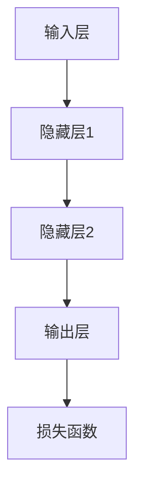

在神经网络中，输入层接收外部输入，通过一系列的隐藏层进行处理，最终在输出层生成结果。隐藏层的设计决定了神经网络的学习能力和泛化能力。以下是一个简化的深度学习模型的伪代码：

```python
function deep_learning_model(inputs):
    for epoch in range(num_epochs):
        for inputs in data_loader:
            outputs = forward_pass(inputs)
            loss = compute_loss(outputs, targets)
            backward_pass(loss)
    return model
```

在这个模型中，`forward_pass` 表示前向传播，`compute_loss` 表示计算损失函数，`backward_pass` 表示反向传播。

###### 1.1.2 机器学习与深度学习的关系

机器学习是人工智能的核心技术之一，而深度学习是机器学习的一个分支，具有强大的特征学习能力。机器学习包括监督学习、无监督学习和强化学习等类型。深度学习则通过多层神经网络结构，实现对复杂数据的自动特征提取和表示。以下是机器学习与深度学习的简化关系图：

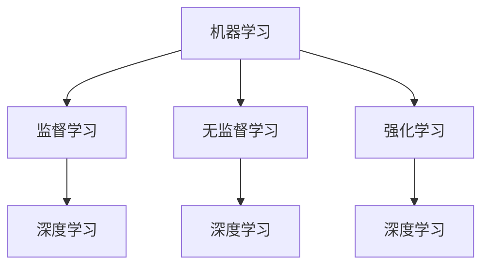

从图中可以看出，深度学习是机器学习的一种特殊形式，通过深度神经网络结构，实现对复杂数据的自动特征提取和表示。

###### 1.1.3 软件2.0与大数据的关系

软件2.0不仅依赖于智能算法，还需要大量的数据支持。大数据技术为软件2.0提供了海量数据的存储、处理和分析能力。大数据具有4V特征，即Volume（大量）、Velocity（高速）、Variety（多样）和Veracity（真实性）。以下是大数据处理的基本流程：

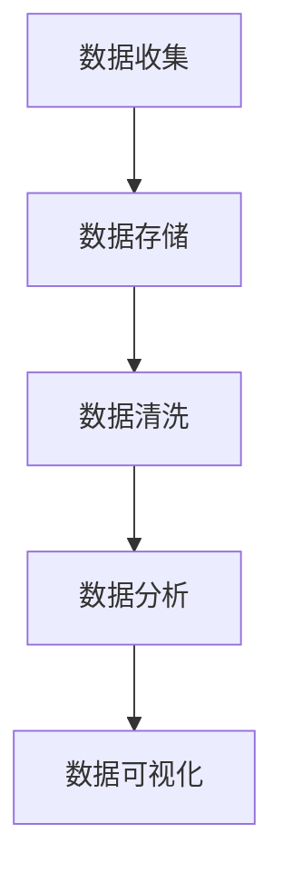

在这个流程中，数据收集阶段负责获取海量数据，数据存储阶段负责存储和管理数据，数据清洗阶段负责处理数据中的噪声和错误，数据分析阶段负责挖掘数据中的价值，数据可视化阶段则负责将分析结果以直观的方式展示给用户。

总的来说，软件2.0与人工智能、机器学习和大数据的关系密不可分。通过智能算法和大数据技术的结合，软件2.0实现了前所未有的智能化和自适应化水平，为传统软件技术带来了深刻的变革。

---

##### 1.2 软件2.0与传统编程范式的区别

在探讨软件2.0与传统编程范式的区别之前，我们需要先理解什么是传统编程范式。传统编程范式主要依赖于手工编码和预定义的逻辑规则，以实现软件的功能和业务逻辑。这种范式具有以下几个特点：

1. **确定性**：传统编程依赖于明确的逻辑规则和算法，软件的行为是确定性的，即在相同输入下产生相同输出。
2. **手动编码**：开发者需要手动编写代码，实现软件的功能和业务逻辑。
3. **规则驱动**：软件的行为主要依赖于预定义的规则和条件，缺乏灵活性和适应性。
4. **效率优先**：在传统编程范式中，效率是首要考虑的因素，开发者需要精心设计算法和数据结构，以优化软件的性能。

相比之下，软件2.0具有以下几个显著特点：

1. **智能化**：软件2.0通过引入人工智能和机器学习技术，实现软件的智能化和自适应化。软件能够从数据中自动学习规律和模式，从而优化自身的性能和功能。
2. **数据驱动**：软件2.0强调数据的重要性，通过大数据技术收集、存储和处理海量数据，为智能算法提供支持。数据成为软件决策的重要依据。
3. **灵活性**：软件2.0注重灵活性和适应性，能够根据不同的业务需求和场景，动态调整软件的行为和功能。
4. **效率与效果并重**：在软件2.0范式中，效率和效果同样重要。通过智能算法和大数据技术的结合，软件能够在保持高效性的同时，实现更好的效果和用户体验。

下面是一个简化的对比图，展示了软件2.0与传统编程范式的区别：

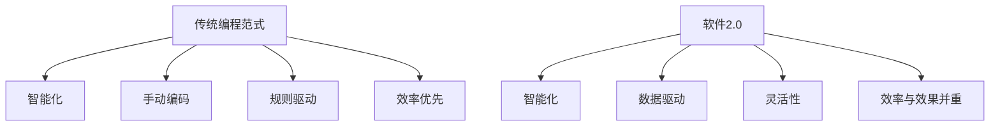

从图中可以看出，软件2.0在智能化、数据驱动、灵活性和效率与效果并重等方面，与传统编程范式有显著的区别。这种区别不仅体现在技术层面，更体现在软件开发的方法论和思维模式上。

---

##### 1.2.1 传统编程范式的局限性

传统编程范式在过去的几十年中为软件开发带来了巨大的进步，但同时也暴露出了一些局限性，特别是在面对复杂、动态和多变的应用场景时。以下是传统编程范式的几个主要局限性：

1. **代码复杂度高**：传统编程依赖于手工编码，开发者需要编写大量的代码来实现软件的功能和业务逻辑。这导致代码复杂度较高，维护难度大，容易出错。
2. **适应能力差**：传统编程范式主要依赖于预定义的规则和条件，软件的行为相对固定。当业务需求发生变化时，需要手动修改代码，导致适应能力较差。
3. **测试和调试困难**：在传统编程范式中，测试和调试是一个重要环节。但由于代码复杂度高和业务逻辑固化，测试和调试过程往往较为繁琐和耗时。
4. **效率与效果难以平衡**：传统编程范式在追求效率的同时，往往忽视用户体验和业务效果。开发者需要精心设计算法和数据结构，以优化软件的性能，但有时这会导致软件功能过于复杂，用户体验不佳。
5. **人力成本高**：传统编程范式依赖于大量的开发人员，需要投入大量的人力资源来编写和维护代码。这增加了企业的运营成本。

为了克服这些局限性，软件开发领域开始探索新的方法和技术，其中软件2.0范式是一个重要的方向。软件2.0通过引入人工智能和大数据技术，实现了软件的智能化和自适应化，从而在多个方面克服了传统编程范式的局限性。

---

##### 1.2.2 软件2.0带来的创新

软件2.0范式在传统编程范式的基础上，引入了人工智能和大数据技术，带来了多方面的创新。以下是软件2.0带来的几个主要创新点：

1. **智能化**：软件2.0通过机器学习和深度学习算法，使软件能够从数据中自动学习规律和模式，从而实现智能化和自适应化。这不仅可以提高软件的性能和效率，还可以优化用户体验。
2. **自动化**：软件2.0强调自动化，通过自动化工具和流程，实现软件的自动构建、测试、部署和运维。这大大提高了软件开发的效率，降低了开发成本。
3. **数据驱动**：软件2.0将数据视为重要的资产，通过大数据技术收集、存储和处理海量数据，为软件提供决策支持。数据成为软件设计和开发的核心依据。
4. **灵活性**：软件2.0注重灵活性和适应性，能够根据不同的业务需求和场景，动态调整软件的行为和功能。这使得软件能够更好地适应市场变化和用户需求。
5. **效果与效率并重**：软件2.0在追求效率的同时，更加注重软件的效果和用户体验。通过智能算法和大数据技术的结合，软件能够在保持高效性的同时，实现更好的效果和用户体验。
6. **协作性**：软件2.0鼓励开发者之间的协作和知识共享，通过开源框架和平台，实现软件开发的协作性和开放性。这有助于提高软件的质量和创新能力。

以下是软件2.0创新点的简化关系图：

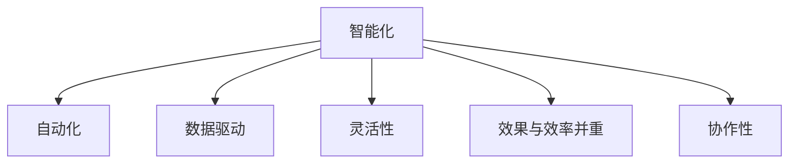

从图中可以看出，软件2.0在智能化、自动化、数据驱动、灵活性、效果与效率并重和协作性等方面，带来了全面的创新。这些创新不仅提升了软件的性能和效率，还为软件开发带来了新的思维模式和开发方法。

---

##### 1.2.3 软件2.0的核心概念

软件2.0的核心概念主要包括以下几个方面：

1. **智能化**：软件2.0通过引入人工智能和机器学习技术，实现软件的智能化和自适应化。智能化是软件2.0的灵魂，使软件能够根据不同的业务需求和场景，动态调整自身的行为和功能。
2. **数据驱动**：软件2.0强调数据的重要性，通过大数据技术收集、存储和处理海量数据，为软件提供决策支持。数据驱动是软件2.0的基础，使软件能够从数据中自动学习规律和模式，实现更好的效果和用户体验。
3. **自动化**：软件2.0注重自动化，通过自动化工具和流程，实现软件的自动构建、测试、部署和运维。自动化是软件2.0的关键，大大提高了软件开发的效率，降低了开发成本。
4. **灵活性**：软件2.0注重灵活性和适应性，能够根据不同的业务需求和场景，动态调整软件的行为和功能。灵活性是软件2.0的特点，使软件能够更好地适应市场变化和用户需求。
5. **协作性**：软件2.0鼓励开发者之间的协作和知识共享，通过开源框架和平台，实现软件开发的协作性和开放性。协作性是软件2.0的优势，有助于提高软件的质量和创新能力。
6. **效率与效果并重**：软件2.0在追求效率的同时，更加注重软件的效果和用户体验。效率与效果并重是软件2.0的目标，使软件能够在保持高效性的同时，实现更好的效果和用户体验。

以下是软件2.0核心概念的简化关系图：

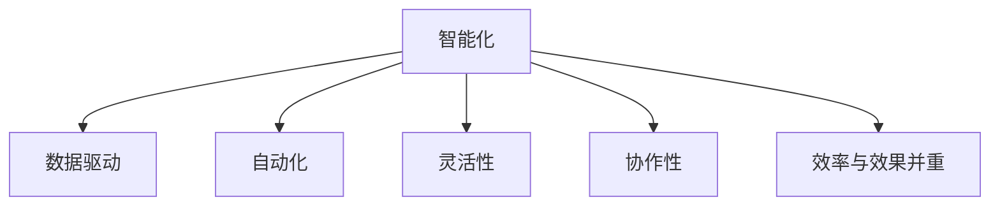

从图中可以看出，软件2.0的核心概念包括智能化、数据驱动、自动化、灵活性、协作性和效率与效果并重等方面。这些核心概念相互关联，共同构成了软件2.0的基本框架和思维模式。

---

### 第2章：软件2.0的关键技术

软件2.0的兴起离不开一系列关键技术的支撑，这些技术包括智能算法、大数据处理和云计算等。在本章中，我们将深入探讨这些核心技术，理解它们在软件2.0中的应用和重要性。

#### 2.1 智能算法与机器学习基础

智能算法是软件2.0的核心，而机器学习则是实现智能算法的关键技术。机器学习通过算法让计算机从数据中学习规律和模式，从而做出智能决策。

##### 2.1.1 神经网络的基本结构

神经网络是机器学习的基础，它模拟人脑的结构和工作原理。一个简单的神经网络通常包括输入层、隐藏层和输出层。每个神经元都与前一层和后一层的其他神经元相连，并通过权重进行传递。神经网络的训练过程就是通过不断调整权重，使网络能够准确预测或分类输入数据。

以下是神经网络的基本结构图：


在这个结构中，输入层接收外部输入数据，隐藏层对输入数据进行处理和变换，输出层生成最终的预测结果。损失函数用于衡量预测结果与实际结果之间的差距，网络通过不断优化权重来减小损失函数的值。

##### 2.1.2 常见的深度学习架构

深度学习是机器学习的一个分支，通过多层神经网络结构，实现对复杂数据的高层次特征提取和表示。常见的深度学习架构包括卷积神经网络（CNN）、循环神经网络（RNN）和生成对抗网络（GAN）等。

1. **卷积神经网络（CNN）**：CNN是一种专门用于处理图像数据的神经网络。它通过卷积层和池化层，实现对图像的特征提取和表示。以下是一个简单的CNN结构图：

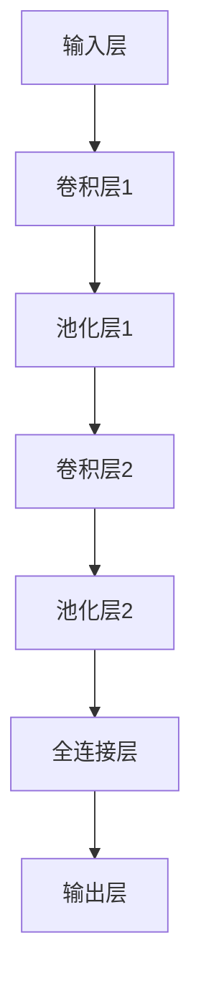

2. **循环神经网络（RNN）**：RNN是一种专门用于处理序列数据的神经网络。它通过循环结构，实现对序列数据的记忆和建模。以下是一个简单的RNN结构图：

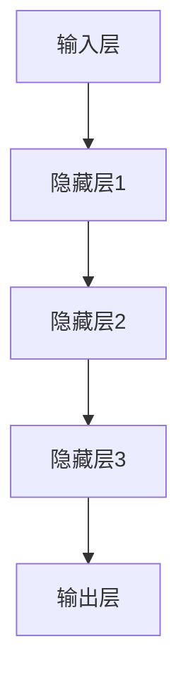

3. **生成对抗网络（GAN）**：GAN是一种生成模型，通过对抗性训练，生成与真实数据相似的数据。以下是一个简单的GAN结构图：

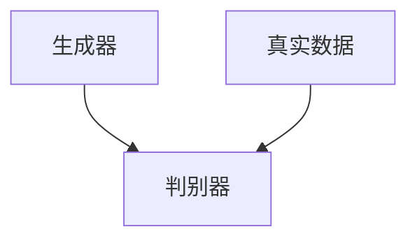

在GAN中，生成器生成数据，判别器判断生成数据与真实数据之间的差距，通过对抗性训练，生成器逐渐生成更真实的数据。

##### 2.1.3 深度学习优化算法

深度学习的训练过程是一个优化过程，目的是找到最优的权重和参数，使网络能够准确预测或分类输入数据。常见的深度学习优化算法包括随机梯度下降（SGD）、Adam优化器等。

1. **随机梯度下降（SGD）**：SGD是一种简单的优化算法，通过随机选择小批量数据，计算梯度并更新权重。以下是一个简单的SGD算法伪代码：

```python
for epoch in range(num_epochs):
    for inputs, targets in data_loader:
        gradients = compute_gradients(model, inputs, targets)
        update_weights(model, gradients)
```

2. **Adam优化器**：Adam优化器是一种基于SGD的改进算法，它通过考虑一阶和二阶矩估计，自适应调整学习率。以下是一个简单的Adam优化器伪代码：

```python
m = 0
v = 0
beta1 = 0.9
beta2 = 0.999
epsilon = 1e-8

for epoch in range(num_epochs):
    for inputs, targets in data_loader:
        gradients = compute_gradients(model, inputs, targets)
        m = beta1 * m + (1 - beta1) * gradients
        v = beta2 * v + (1 - beta2) * gradients ** 2
        m_hat = m / (1 - beta1 ** epoch)
        v_hat = v / (1 - beta2 ** epoch)
        update_weights(model, m_hat / (sqrt(v_hat) + epsilon))
```

通过这些优化算法，深度学习模型能够逐渐调整权重和参数，使预测结果更准确。

#### 2.2 大数据和云计算的融合

大数据和云计算是软件2.0时代的重要基础设施，它们的融合为软件提供了强大的数据处理和分析能力。

##### 2.2.1 大数据的概念与特点

大数据（Big Data）指的是无法使用传统数据库工具进行捕捉、管理和处理的数据集。大数据具有4V特征，即Volume（大量）、Velocity（高速）、Variety（多样）和Veracity（真实性）。

1. **Volume（大量）**：大数据的规模巨大，通常以PB（皮字节）为单位进行衡量。
2. **Velocity（高速）**：大数据的处理速度非常快，需要在短时间内完成数据的收集、存储和处理。
3. **Variety（多样）**：大数据来源广泛，包括文本、图像、音频、视频等多种数据类型。
4. **Veracity（真实性）**：大数据的真实性和可信度是一个重要问题，需要对数据进行清洗和处理，以确保数据的质量。

##### 2.2.2 云计算的基本原理与架构

云计算（Cloud Computing）是一种通过网络提供资源的服务模型，包括基础设施即服务（IaaS）、平台即服务（PaaS）和软件即服务（SaaS）等。云计算的基本原理是将计算资源和存储资源虚拟化，并通过网络进行管理和调度。

云计算的架构通常包括以下几个方面：

1. **基础设施层**：基础设施层提供计算资源、存储资源和网络资源，包括虚拟机、存储设备和网络设备等。
2. **平台层**：平台层提供开发、部署和管理应用的服务，包括云计算平台、容器平台和大数据平台等。
3. **服务层**：服务层提供面向最终用户的服务，包括邮件服务、文档处理服务和社交网络服务等。

##### 2.2.3 大数据与云计算的结合

大数据与云计算的结合，使得软件能够高效地处理和分析海量数据。以下是大数据与云计算结合的几个关键点：

1. **分布式计算**：大数据处理通常需要分布式计算架构，如Hadoop和Spark等。这些框架可以将数据处理任务分布在多个节点上，提高处理速度和效率。
2. **弹性扩展**：云计算平台可以根据实际需求，动态调整计算资源和存储资源的规模，实现弹性扩展。这对于处理大数据尤为重要，可以避免资源浪费和性能瓶颈。
3. **数据存储与管理**：云计算平台提供了高效的数据存储和管理方案，如HDFS和对象存储等。这些方案支持海量数据的存储、备份和恢复，确保数据的安全性和可靠性。
4. **数据分析与挖掘**：云计算平台提供了丰富的数据分析工具和挖掘算法，如MapReduce和机器学习框架等。这些工具和算法可以帮助开发者快速构建大数据应用。

总的来说，大数据与云计算的结合，为软件2.0提供了强大的基础设施和工具支持，使得软件能够高效地处理和分析海量数据，实现智能化和自适应化。

---

#### 2.3 软件2.0时代的编程语言

随着软件2.0时代的到来，传统的编程语言已经无法满足智能化和自适应化的需求。为了更好地支持软件2.0的开发，一系列新的编程语言和技术应运而生。这些编程语言具有灵活性强、效率高、易扩展等特点，能够更好地适应软件2.0的发展。

##### 2.3.1 编程语言的演变

编程语言的演变经历了几个阶段，从早期的机器语言和汇编语言，到高级编程语言，再到如今面向对象和函数式编程语言。以下是编程语言演变的一个简要概述：

1. **机器语言和汇编语言**：最早的编程语言是机器语言和汇编语言。机器语言直接操作计算机的硬件，但可读性差，编写复杂。汇编语言是对机器语言的抽象，但仍然依赖于硬件架构。
2. **高级编程语言**：高级编程语言如C、C++和Java等，提供了更抽象的语法和丰富的库函数，使得编程更加容易和高效。这些语言通过编译器将源代码转换为机器语言，运行在计算机的硬件上。
3. **面向对象编程语言**：面向对象编程语言如Java、C++和Python等，引入了面向对象编程的概念，如类、对象、继承和多态等。这使得代码更模块化、可重用性和可维护性更好。
4. **函数式编程语言**：函数式编程语言如Haskell、Erlang和Scala等，强调函数和数据的不可变性和纯函数，避免了副作用和状态共享。这使得代码更简洁、更易于理解和测试。

##### 2.3.2 软件2.0编程语言的特点

软件2.0编程语言具有以下特点：

1. **智能化**：软件2.0编程语言内置了智能算法和机器学习框架，使开发者能够更方便地实现智能化和自适应化功能。
2. **易扩展**：软件2.0编程语言支持模块化和组件化开发，便于开发者快速搭建复杂的系统。
3. **高效率**：软件2.0编程语言提供了丰富的库函数和优化算法，使得开发者能够高效地处理大数据和高性能计算任务。
4. **易维护**：软件2.0编程语言注重代码的可读性和可维护性，使得代码更易于理解和修改。
5. **跨平台**：软件2.0编程语言通常支持多种操作系统和硬件平台，便于开发者构建跨平台的应用程序。

##### 2.3.3 软件2.0编程语言的应用场景

软件2.0编程语言在多个领域都有广泛的应用场景，包括人工智能、大数据、云计算和移动应用开发等。以下是几个典型的应用场景：

1. **人工智能**：Python、R和Julia等编程语言在人工智能领域具有很高的应用价值。Python的简洁语法和丰富的库函数使其成为最受欢迎的人工智能编程语言之一。R提供了强大的统计分析工具，适用于数据分析和机器学习任务。Julia则是一种高性能的函数式编程语言，适用于复杂数学和科学计算。
2. **大数据**：Hadoop、Spark和Flink等大数据处理框架，通常使用Java、Scala和Python等编程语言进行开发。这些语言具有高并发性、高效性和易扩展性，能够处理海量数据。
3. **云计算**：云计算平台通常使用多种编程语言进行开发，如Java、Python、Ruby和Go等。这些语言支持云计算平台的构建和管理，如AWS、Azure和Google Cloud等。
4. **移动应用开发**：移动应用开发通常使用Swift、Kotlin和Flutter等编程语言。这些语言提供了丰富的库函数和工具，使得开发者能够快速构建高性能的移动应用程序。

总的来说，软件2.0编程语言在智能化、易扩展、高效率、易维护和跨平台等方面具有显著优势，为开发者提供了强大的工具支持，推动了软件2.0的发展。

---

### 第二部分：软件2.0的应用实践

#### 第3章：软件2.0在人工智能领域的应用

随着人工智能技术的不断进步，软件2.0在人工智能领域的应用也越来越广泛。在这一章中，我们将探讨软件2.0在人工智能领域的应用场景、开发流程和典型案例。

##### 3.1 AI大模型的应用场景

AI大模型，即大规模的人工智能模型，是软件2.0在人工智能领域的重要应用之一。这些模型通常具有强大的学习和预测能力，能够处理复杂的任务和海量数据。以下是AI大模型的一些典型应用场景：

1. **智能客服**：AI大模型可以应用于智能客服系统，通过自然语言处理和机器学习技术，实现与用户的自然交互。例如，智能客服系统可以自动解答常见问题，提供个性化的建议和解决方案。

2. **智能推荐**：AI大模型可以应用于推荐系统，通过分析用户的历史行为和偏好，提供个性化的推荐。例如，电商平台可以根据用户的购物记录和浏览历史，推荐相关的商品和优惠活动。

3. **智能医疗**：AI大模型可以应用于智能医疗系统，通过分析患者的病历和医学图像，辅助医生进行诊断和治疗。例如，AI模型可以识别肿瘤、心脏病等疾病，提高诊断的准确性和效率。

4. **自动驾驶**：AI大模型可以应用于自动驾驶系统，通过感知环境、规划路径和决策控制，实现自动驾驶功能。例如，自动驾驶汽车可以实时分析路况和障碍物，做出安全、高效的驾驶决策。

5. **智能金融**：AI大模型可以应用于智能金融系统，通过分析市场数据和用户行为，提供投资建议和风险控制。例如，AI模型可以预测股票价格、识别欺诈交易等。

##### 3.2 AI大模型的开发流程

开发AI大模型是一个复杂的过程，涉及数据收集、模型训练、模型评估和模型部署等多个环节。以下是AI大模型的一般开发流程：

1. **数据收集**：首先，需要收集相关的数据集，包括训练数据和测试数据。这些数据可以来自于公开的数据集、企业内部的数据库或者第三方数据提供商。

2. **数据预处理**：收集到的数据需要进行预处理，包括数据清洗、数据转换和数据归一化等。数据清洗的目的是去除噪声和错误数据，数据转换和数据归一化的目的是将数据格式化为适合模型训练的形式。

3. **模型选择**：根据任务的需求和数据的特点，选择合适的模型架构。常见的模型架构包括卷积神经网络（CNN）、循环神经网络（RNN）、变换器（Transformer）等。

4. **模型训练**：使用训练数据集对模型进行训练。在训练过程中，模型会不断调整权重和参数，以最小化损失函数，提高模型的预测准确性。

5. **模型评估**：使用测试数据集对模型进行评估，计算模型的准确率、召回率、F1分数等指标。通过交叉验证和超参数调整，优化模型的性能。

6. **模型部署**：将训练好的模型部署到生产环境中，使其能够对外提供服务。常见的部署方式包括服务器部署、容器部署和云端部署等。

7. **模型运维**：在生产环境中对模型进行监控和维护，确保模型的稳定运行和性能。根据实际需求，可以对模型进行重新训练和更新。

以下是AI大模型开发流程的简化流程图：

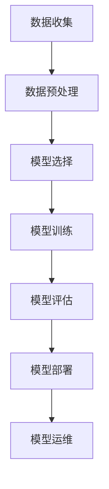

##### 3.3 AI大模型的案例分析

为了更好地理解AI大模型的应用和实践，下面我们来看几个具体的案例。

###### 案例一：智能语音助手

智能语音助手是一种常见的AI大模型应用。以苹果的Siri为例，Siri通过自然语言处理技术，理解用户的语音指令，并执行相应的操作。以下是Siri的开发过程：

1. **数据收集**：苹果公司收集了大量的语音数据，包括用户的语音指令、语音标记和上下文信息。

2. **数据预处理**：对语音数据进行清洗和标注，将语音信号转换为文本数据，并提取关键信息。

3. **模型选择**：Siri采用了深度学习模型，包括循环神经网络（RNN）和变换器（Transformer）等。这些模型能够处理复杂的语音信号和语义信息。

4. **模型训练**：使用预处理的语音数据集，对模型进行训练，不断调整权重和参数，提高模型的准确性和响应速度。

5. **模型评估**：使用测试数据集对模型进行评估，计算模型的准确率和响应时间等指标，并进行超参数调整。

6. **模型部署**：将训练好的模型部署到苹果的iPhone、iPad和Mac等设备上，使其能够响应用户的语音指令。

7. **模型运维**：对模型进行实时监控和维护，确保模型的稳定运行和性能。根据用户反馈和实际需求，对模型进行更新和优化。

通过这个案例，我们可以看到，AI大模型在智能语音助手中的应用，不仅提升了用户体验，还实现了高效的语音交互和任务执行。

###### 案例二：自动驾驶技术

自动驾驶技术是AI大模型的另一个重要应用领域。以特斯拉的自动驾驶系统为例，特斯拉通过大规模的深度学习模型，实现了自动驾驶功能。以下是特斯拉自动驾驶系统的开发过程：

1. **数据收集**：特斯拉收集了大量的驾驶数据，包括道路场景、车辆状态和驾驶行为等。

2. **数据预处理**：对驾驶数据进行清洗和标注，将数据格式化为适合模型训练的形式。

3. **模型选择**：特斯拉采用了卷积神经网络（CNN）和循环神经网络（RNN）等深度学习模型，用于处理图像和视频数据。

4. **模型训练**：使用预处理的驾驶数据集，对模型进行训练，不断调整权重和参数，提高模型的准确性和鲁棒性。

5. **模型评估**：使用测试数据集对模型进行评估，计算模型的识别准确率和决策速度等指标。

6. **模型部署**：将训练好的模型部署到特斯拉的自动驾驶系统，使其能够实时感知道路场景，做出安全的驾驶决策。

7. **模型运维**：对模型进行实时监控和维护，确保模型的稳定运行和性能。根据道路环境和用户需求，对模型进行更新和优化。

通过这个案例，我们可以看到，AI大模型在自动驾驶技术中的应用，不仅提升了驾驶安全性和效率，还为自动驾驶技术的发展提供了强大的技术支持。

总的来说，AI大模型在智能语音助手、自动驾驶技术、智能医疗、智能金融等多个领域都有广泛的应用。通过数据驱动和智能化，AI大模型正在改变我们的生活和工作方式。

---

#### 4.1 数据分析的基本概念与流程

数据分析是软件2.0时代的一个重要组成部分，它通过对海量数据的收集、处理和分析，为企业提供决策支持，优化业务流程，提升用户体验。在探讨数据分析的基本概念与流程之前，我们先来了解一下数据分析的目标与任务。

##### 4.1.1 数据分析的目标与任务

数据分析的目标主要包括以下几个方面：

1. **发现数据中的规律和模式**：通过分析数据，发现数据中的潜在规律和模式，为企业提供洞察。
2. **支持决策制定**：利用数据分析的结果，支持企业的高层决策，优化业务流程，提高运营效率。
3. **预测未来趋势**：通过分析历史数据，预测未来的发展趋势和变化，帮助企业提前做好准备。
4. **优化用户体验**：通过分析用户行为数据，优化产品功能和用户体验，提高用户满意度和忠诚度。

数据分析的任务可以概括为以下几步：

1. **数据收集**：收集企业内部和外部的数据，包括结构化数据和非结构化数据。
2. **数据清洗**：对收集到的数据进行清洗和预处理，去除噪声和错误数据，确保数据的质量。
3. **数据存储**：将清洗后的数据存储到数据库或数据仓库中，以便后续的分析和处理。
4. **数据整合**：整合来自不同来源的数据，进行数据集成，形成统一的数据视图。
5. **数据分析**：使用统计分析、机器学习等技术，对数据进行深入分析，提取有价值的信息。
6. **数据可视化**：通过可视化工具，将分析结果以图形或图表的形式展示出来，便于决策者理解和分析。
7. **数据应用**：将分析结果应用于企业的业务流程、产品优化和决策制定。

##### 4.1.2 数据分析的基本流程

数据分析的基本流程可以分为以下几个步骤：

1. **需求分析**：明确数据分析的目标和需求，确定分析的范围和方法。

2. **数据收集**：收集与企业业务相关的数据，包括内部数据（如销售数据、客户数据等）和外部数据（如市场数据、行业数据等）。

3. **数据清洗**：对收集到的数据进行清洗和预处理，去除噪声和错误数据，确保数据的质量。常用的数据清洗方法包括数据去重、缺失值填充、异常值处理等。

4. **数据存储**：将清洗后的数据存储到数据库或数据仓库中，以便后续的分析和处理。常用的数据库技术包括关系型数据库（如MySQL、Oracle等）和NoSQL数据库（如MongoDB、Cassandra等）。

5. **数据整合**：整合来自不同来源的数据，进行数据集成，形成统一的数据视图。数据整合的目的是消除数据孤岛，提高数据的可用性和一致性。

6. **数据分析**：使用统计分析、机器学习等技术，对数据进行深入分析，提取有价值的信息。常用的数据分析技术包括回归分析、聚类分析、关联规则挖掘、文本分析等。

7. **数据可视化**：通过可视化工具，将分析结果以图形或图表的形式展示出来，便于决策者理解和分析。常用的可视化工具包括Tableau、Power BI、ECharts等。

8. **数据应用**：将分析结果应用于企业的业务流程、产品优化和决策制定。通过数据驱动的决策，提高企业的运营效率和市场竞争力。

以下是数据分析的基本流程的简化流程图：

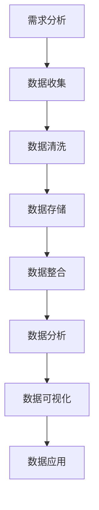

从图中可以看出，数据分析的基本流程是一个闭环的过程，每个步骤都是相互关联和依赖的。通过不断地迭代和优化，数据分析可以为企业提供持续的价值。

---

#### 4.2 软件2.0在数据挖掘中的应用

数据挖掘是数据分析的一个重要分支，它旨在从大量数据中提取有价值的信息和知识。在软件2.0时代，数据挖掘技术得到了显著的发展，软件2.0的特点如智能化、自动化和数据驱动，为数据挖掘带来了新的机遇和挑战。以下我们详细探讨软件2.0在数据挖掘中的应用。

##### 4.2.1 数据挖掘的基本概念与流程

数据挖掘（Data Mining）是指从大量数据中提取隐藏的、未知的、潜在的价值信息的过程。数据挖掘的目的是发现数据中的模式和规律，从而为决策提供支持。数据挖掘的基本流程包括以下几个步骤：

1. **数据预处理**：数据预处理是数据挖掘的第一步，包括数据清洗、数据转换和数据归一化等。这一步骤的目的是确保数据的质量和一致性，为后续的数据挖掘奠定基础。

2. **数据探索**：数据探索是通过统计分析和可视化工具，对数据进行初步分析和观察，发现数据中的异常值、趋势和模式。数据探索有助于理解数据的特点和潜在价值。

3. **模式识别**：模式识别是数据挖掘的核心步骤，通过使用各种算法和技术，从数据中识别出有趣的模式和规律。常见的模式识别方法包括聚类分析、关联规则挖掘、分类和回归等。

4. **评估与优化**：在模式识别之后，需要对挖掘出的模式进行评估和优化。评估的目的是确定模式的有效性和实用性，优化的目的是提高模型的性能和准确度。

5. **知识表示与解释**：最后，需要将挖掘出的模式和知识进行表示和解释，以便于用户理解和应用。知识表示和解释的方法包括可视化、报告和交互式查询等。

以下是数据挖掘的基本流程的简化流程图：

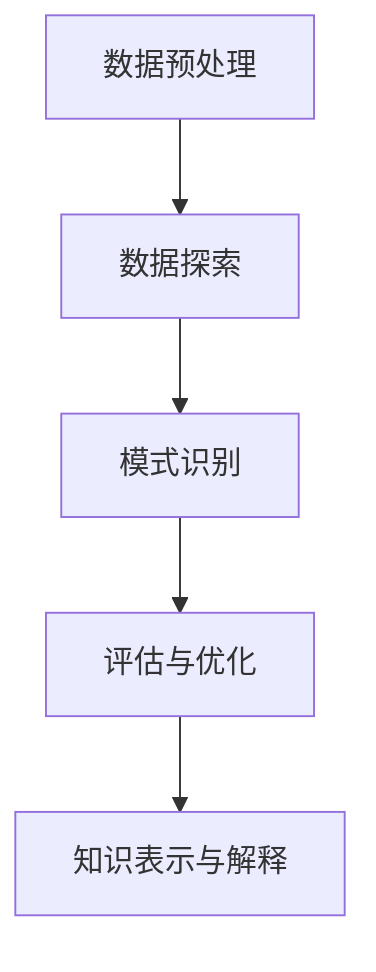

##### 4.2.2 数据挖掘的关键技术

软件2.0在数据挖掘中的应用，依赖于一系列先进的技术和方法。以下是一些关键的技术：

1. **机器学习算法**：机器学习算法是数据挖掘的核心技术之一。常用的机器学习算法包括监督学习算法（如分类和回归）、无监督学习算法（如聚类和降维）和半监督学习算法。在软件2.0中，深度学习算法（如卷积神经网络和变换器）被广泛应用于图像和文本数据的挖掘。

2. **大数据处理技术**：随着数据量的激增，大数据处理技术成为数据挖掘的重要支撑。Hadoop和Spark等分布式计算框架，能够高效地处理海量数据，为数据挖掘提供了强大的计算能力。

3. **数据可视化技术**：数据可视化技术能够将复杂的数据和分析结果以直观、易理解的方式展示出来。常用的数据可视化工具包括Tableau、Power BI和ECharts等。

4. **自然语言处理技术**：自然语言处理（NLP）技术在文本数据挖掘中具有重要应用。NLP技术包括词性标注、情感分析、文本分类和语义理解等，能够帮助挖掘文本数据中的潜在信息和知识。

5. **关联规则挖掘**：关联规则挖掘是发现数据中频繁模式的一种重要方法。Apriori算法和FP-growth算法是常见的关联规则挖掘算法，被广泛应用于市场篮子分析、推荐系统和网络挖掘等领域。

##### 4.2.3 软件2.0在数据挖掘中的应用案例

软件2.0在数据挖掘中的应用，已经体现在多个实际场景中。以下是一些典型的应用案例：

1. **智能推荐系统**：智能推荐系统是软件2.0在数据挖掘中的一个重要应用。通过分析用户的历史行为和偏好，推荐系统可以生成个性化的推荐列表，提高用户的满意度和粘性。例如，电商平台的推荐系统可以根据用户的浏览记录和购买历史，推荐相关的商品和优惠活动。

2. **金融欺诈检测**：金融欺诈检测是数据挖掘在金融领域的应用。通过分析交易数据和行为特征，欺诈检测系统可以识别出异常交易和欺诈行为，提高金融交易的安全性。例如，银行可以使用关联规则挖掘技术，发现潜在的欺诈交易模式，并采取相应的预防措施。

3. **客户细分与营销**：客户细分与营销是数据挖掘在市场营销中的应用。通过分析客户的数据特征和行为模式，企业可以识别出不同类型的客户群体，并制定针对性的营销策略。例如，保险公司可以使用聚类分析技术，将客户分为高风险、中风险和低风险群体，并针对不同群体设计个性化的保险产品和服务。

4. **医疗数据挖掘**：医疗数据挖掘是数据挖掘在医疗领域的重要应用。通过分析医疗数据，如病历记录、医学图像和基因数据，医疗数据挖掘系统可以为医生提供诊断支持和治疗建议。例如，通过文本挖掘技术，系统可以自动提取病历中的关键信息，帮助医生进行疾病诊断和治疗方案制定。

总的来说，软件2.0在数据挖掘中的应用，极大地提升了数据挖掘的效率和效果。通过智能算法、大数据处理和可视化技术，软件2.0为数据挖掘带来了新的机遇和挑战，推动了数据挖掘技术的发展和应用。

---

#### 4.3 软件2.0在商业智能分析中的应用

商业智能分析（Business Intelligence Analysis，简称BI分析）是企业利用数据分析技术，对业务数据进行深入挖掘和分析，以支持决策制定和业务优化。软件2.0的引入，为商业智能分析带来了新的机遇和挑战，通过智能化、自动化和数据驱动的特点，软件2.0提升了商业智能分析的效率和效果。以下我们详细探讨软件2.0在商业智能分析中的应用。

##### 4.3.1 商业智能分析的基本概念

商业智能分析是指利用数据分析技术，对企业的业务数据进行收集、处理和分析，从而生成有价值的商业洞察，支持企业的决策制定和业务优化。商业智能分析的基本概念包括以下几个方面：

1. **数据源**：商业智能分析的数据源可以是企业内部的数据，如销售数据、库存数据、财务数据等，也可以是来自外部的数据，如市场数据、行业数据、社交媒体数据等。

2. **数据仓库**：数据仓库是一个集中存储和管理数据的地方，用于存储大量的历史数据。数据仓库可以通过ETL（抽取、转换、加载）过程，将来自不同数据源的数据进行整合和处理。

3. **数据建模**：数据建模是指通过对业务数据的分析和理解，建立数据模型，以支持数据的查询和分析。常见的数据模型包括关系型数据模型、维度数据模型等。

4. **数据分析**：数据分析是指利用统计分析、机器学习等技术，对业务数据进行分析和挖掘，提取有价值的信息和知识。

5. **数据可视化**：数据可视化是指将数据分析结果以图形、图表或报表的形式展示出来，使决策者能够直观地理解和分析数据。

6. **数据报告**：数据报告是指将数据分析结果以书面形式呈现，供决策者参考。

##### 4.3.2 软件2.0在商业智能分析中的应用

软件2.0的引入，极大地提升了商业智能分析的能力和效率。以下是软件2.0在商业智能分析中的几个关键应用：

1. **智能化数据分析**：软件2.0利用机器学习和深度学习技术，实现了数据分析和挖掘的智能化。通过智能算法，系统能够自动识别数据中的模式和规律，生成有价值的商业洞察。例如，通过聚类分析，系统可以自动识别出不同的客户群体，并为每个群体制定个性化的营销策略。

2. **自动化数据处理**：软件2.0强调自动化，通过自动化工具和流程，实现了数据处理的自动化。这不仅提高了数据处理的速度和效率，还减少了人为错误。例如，通过自动化ETL过程，系统可以自动将来自不同数据源的数据进行抽取、转换和加载，确保数据的一致性和准确性。

3. **数据驱动的决策制定**：软件2.0将数据视为企业的重要资产，通过数据驱动的决策制定，提高了决策的准确性和效率。通过数据分析，企业可以实时了解业务状况和市场变化，快速做出反应和调整。例如，通过实时数据分析，企业可以及时发现市场机会和风险，制定相应的营销策略。

4. **可视化数据分析**：软件2.0提供了丰富的数据可视化工具和库，使数据分析结果更加直观和易懂。通过可视化工具，企业可以直观地展示数据分析结果，帮助决策者快速理解和分析数据。例如，通过图表和仪表盘，企业可以实时监控业务指标和关键绩效指标（KPI），快速发现问题和机会。

5. **云计算与大数据的支持**：软件2.0利用云计算和大数据技术，实现了海量数据的存储、处理和分析。通过云计算平台，企业可以弹性地扩展计算资源和存储资源，处理海量数据。通过大数据技术，企业可以高效地存储和处理结构化数据和非结构化数据，挖掘数据中的价值。

##### 4.3.3 商业智能分析的关键技术

软件2.0在商业智能分析中的应用，依赖于一系列先进的技术和方法。以下是商业智能分析的关键技术：

1. **机器学习和深度学习**：机器学习和深度学习技术是软件2.0的核心，用于实现数据分析和挖掘的智能化。通过智能算法，系统可以自动识别数据中的模式和规律，生成有价值的商业洞察。

2. **大数据处理技术**：大数据处理技术是商业智能分析的重要基础，用于存储、处理和分析海量数据。常见的大数据处理技术包括Hadoop、Spark和Flink等。

3. **数据可视化技术**：数据可视化技术是将数据分析结果以图形、图表或报表的形式展示出来的关键技术。常用的数据可视化工具包括Tableau、Power BI和ECharts等。

4. **自然语言处理技术**：自然语言处理技术是处理文本数据的关键技术，用于文本分析、情感分析和文本分类等。通过自然语言处理技术，企业可以自动提取文本数据中的关键信息，实现文本数据的挖掘和分析。

5. **云计算技术**：云计算技术提供了强大的计算资源和存储资源，支持海量数据的存储、处理和分析。通过云计算平台，企业可以弹性地扩展计算资源和存储资源，处理海量数据。

##### 4.3.4 案例：企业级商业智能分析平台

以下是一个企业级商业智能分析平台的案例，展示了软件2.0在商业智能分析中的应用。

**案例背景：**

某大型电商平台希望构建一个企业级商业智能分析平台，以支持其业务发展和决策制定。平台需要处理海量销售数据、库存数据和客户数据，提供实时数据分析和可视化报告。

**解决方案：**

1. **数据采集与整合**：平台采用ETL工具，将来自不同数据源的销售数据、库存数据和客户数据进行抽取、转换和加载，形成统一的数据仓库。

2. **数据建模**：通过建立维度模型，对业务数据进行分析和建模，支持多维度的数据分析。

3. **数据分析与挖掘**：利用机器学习和深度学习技术，对销售数据、库存数据和客户数据进行分析和挖掘，识别出销售趋势、库存风险和客户行为模式。

4. **数据可视化**：通过数据可视化工具，将分析结果以图表和报表的形式展示出来，提供直观的数据分析报告。

5. **云计算与大数据支持**：平台采用云计算和大数据技术，实现海量数据的存储、处理和分析，确保系统的高可用性和高性能。

**案例效果：**

通过该企业级商业智能分析平台，电商平台实现了以下效果：

1. **实时数据监控**：平台提供了实时数据监控功能，使管理层可以实时了解业务运行情况，快速发现问题和机会。

2. **销售预测与优化**：通过销售数据分析，平台可以预测未来销售趋势，为销售策略制定提供支持，优化库存管理和供应链流程。

3. **客户细分与营销**：通过客户数据分析，平台可以识别出不同类型的客户群体，为每个群体制定个性化的营销策略，提高客户满意度和忠诚度。

4. **业务流程优化**：平台提供了业务流程分析功能，帮助企业优化业务流程，提高运营效率。

总的来说，软件2.0在商业智能分析中的应用，为企业和组织提供了强大的数据分析和决策支持，推动了业务的发展和进步。

---

#### 5.1 软件开发中的2.0思维

软件2.0时代，传统的软件开发思维和方法已经难以满足日益复杂的业务需求和快速变化的市场环境。软件2.0思维强调智能化、自动化和数据驱动，旨在通过先进的技术和方法，提升软件开发的效率和质量。以下我们详细探讨软件2.0思维的核心要素。

##### 5.1.1 传统软件开发方法与2.0思维的对比

传统软件开发方法主要依赖于手工编码、预定义的规则和条件，以实现软件的功能和业务逻辑。这种方法存在以下局限性：

1. **代码复杂度高**：传统软件开发需要编写大量的代码，导致代码复杂度较高，维护难度大，容易出错。

2. **适应能力差**：传统软件在业务需求发生变化时，需要手动修改代码，导致适应能力较差。

3. **测试和调试困难**：由于代码复杂度高，传统软件的测试和调试过程往往较为繁琐和耗时。

4. **效率与效果难以平衡**：传统软件开发更注重效率，但往往忽视用户体验和业务效果。

相比之下，软件2.0思维具有以下几个显著特点：

1. **智能化**：软件2.0通过引入人工智能和机器学习技术，使软件能够自动学习和优化，提高智能化水平。

2. **自动化**：软件2.0注重自动化，通过自动化工具和流程，实现软件的自动构建、测试、部署和运维，提高开发效率。

3. **数据驱动**：软件2.0将数据视为重要的资产，通过大数据技术收集、存储和处理海量数据，为智能算法提供支持，实现数据驱动。

4. **灵活性**：软件2.0注重灵活性和适应性，能够根据不同的业务需求和场景，动态调整软件的行为和功能。

5. **效果与效率并重**：软件2.0在追求效率的同时，更加注重软件的效果和用户体验，实现效果与效率的平衡。

##### 5.1.2 2.0思维的核心要素

软件2.0思维的核心要素包括以下几个方面：

1. **数据思维**：数据是软件2.0的核心，数据驱动是软件2.0的基本原则。在软件开发过程中，开发者需要将数据视为重要的资产，通过大数据技术收集、存储和处理海量数据，为智能算法提供支持。

2. **智能思维**：智能思维强调通过人工智能和机器学习技术，实现软件的智能化和自适应化。在软件开发过程中，开发者需要运用智能算法，使软件能够自动学习和优化，提高智能化水平。

3. **自动化思维**：自动化思维强调通过自动化工具和流程，实现软件的自动构建、测试、部署和运维。在软件开发过程中，开发者需要运用自动化工具，提高开发效率，降低人力成本。

4. **敏捷思维**：敏捷思维强调快速迭代和持续交付，以适应快速变化的业务需求。在软件开发过程中，开发者需要采用敏捷开发方法，实现快速响应和持续改进。

5. **协作思维**：协作思维强调团队协作和知识共享，以提升软件开发的效率和质量。在软件开发过程中，开发者需要建立良好的沟通和协作机制，确保团队成员之间的信息畅通。

##### 5.1.3 2.0思维在软件开发中的应用

软件2.0思维在软件开发中的应用，体现在以下几个方面：

1. **需求分析**：在需求分析阶段，开发者需要通过数据思维，收集和分析用户需求，确保需求的可塑性和适应性。

2. **设计阶段**：在设计阶段，开发者需要运用智能思维，运用智能算法和大数据技术，设计灵活、可扩展的软件架构。

3. **开发阶段**：在开发阶段，开发者需要运用自动化思维和敏捷思维，采用自动化工具和敏捷开发方法，提高开发效率和代码质量。

4. **测试与部署**：在测试与部署阶段，开发者需要运用自动化思维，通过自动化测试和部署流程，确保软件的稳定性和可靠性。

5. **运维阶段**：在运维阶段，开发者需要运用敏捷思维和协作思维，建立高效的运维团队，实现软件的持续优化和升级。

总之，软件2.0思维为软件开发带来了全新的方法和理念，通过数据驱动、智能化、自动化和敏捷性，软件2.0思维实现了软件开发的高效、灵活和智能化，推动了软件开发技术的革新和进步。

---

#### 5.2 软件开发中的自动化与智能化

在软件2.0时代，自动化与智能化成为软件开发的重要趋势。自动化与智能化的融合，不仅提高了软件开发的效率和质量，还推动了软件技术的发展和变革。以下我们将探讨软件开发中自动化与智能化的基本概念、原理及其在实际开发中的应用。

##### 5.2.1 自动化的基本概念与原理

自动化（Automation）是指通过使用预先定义的规则、程序或工具，自动执行原本需要人工进行的任务。自动化在软件开发中的应用，可以极大地提高开发效率、降低人力成本和减少人为错误。自动化的基本概念和原理包括以下几个方面：

1. **任务自动化**：任务自动化是指将重复性的、繁琐的任务通过程序或脚本自动执行。例如，构建、测试、部署和运维等任务。

2. **流程自动化**：流程自动化是指将一系列的任务和步骤通过工作流或自动化工具连接起来，形成一个自动化流程。例如，持续集成和持续交付等。

3. **工具链**：工具链是指一系列自动化工具和平台，用于实现自动化任务和流程。常见的工具链包括构建工具（如Maven、Gradle）、测试工具（如JUnit、Selenium）、部署工具（如Jenkins、Docker）和运维工具（如Ansible、Puppet）等。

4. **脚本化**：脚本化是指通过编写脚本或程序，自动执行特定的任务。脚本化是自动化的重要组成部分，可以大大提高任务的执行效率。

5. **持续集成与持续交付**：持续集成（Continuous Integration，CI）和持续交付（Continuous Delivery，CD）是自动化在软件开发中的重要实践。持续集成通过自动构建、测试和部署，确保代码的质量和稳定性。持续交付则通过自动化部署和交付，实现快速、可靠的软件交付。

以下是自动化在软件开发中的基本流程：

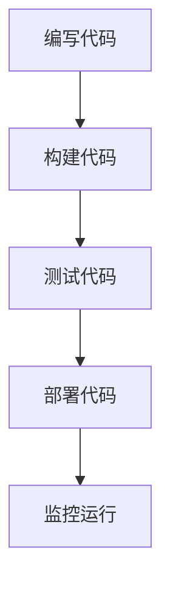

在这个流程中，开发者编写代码后，通过构建工具进行编译和打包，然后通过测试工具进行自动化测试，确保代码的质量。测试通过后，通过部署工具将代码部署到生产环境，并进行监控和维护。

##### 5.2.2 智能化的基本概念与原理

智能化（Intelligence）是指通过使用人工智能（Artificial Intelligence，AI）和机器学习（Machine Learning，ML）技术，使软件具有智能学习和自主决策的能力。智能化在软件开发中的应用，可以大大提高软件的效率和效果。智能化的基本概念和原理包括以下几个方面：

1. **机器学习**：机器学习是一种通过数据驱动的方式，让计算机从数据中学习规律和模式的技术。常见的机器学习算法包括线性回归、决策树、支持向量机、神经网络等。

2. **深度学习**：深度学习是机器学习的一个分支，通过多层神经网络结构，实现对复杂数据的高层次特征提取和表示。常见的深度学习架构包括卷积神经网络（CNN）、循环神经网络（RNN）和变换器（Transformer）等。

3. **自然语言处理**：自然语言处理（Natural Language Processing，NLP）是深度学习在文本数据中的应用，用于处理和理解人类语言。常见的NLP任务包括文本分类、情感分析、命名实体识别等。

4. **计算机视觉**：计算机视觉（Computer Vision）是深度学习在图像数据中的应用，用于识别、检测和分类图像。常见的计算机视觉任务包括人脸识别、目标检测、图像分割等。

以下是智能化在软件开发中的基本流程：

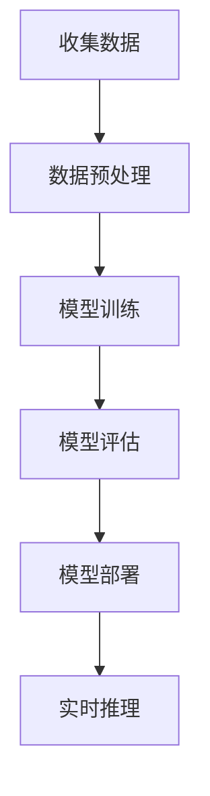

在这个流程中，首先收集相关的数据集，然后对数据进行预处理，接着使用机器学习算法或深度学习模型进行训练。训练完成后，对模型进行评估，确保模型的性能和准确性。评估通过后，将模型部署到生产环境中，并使用实时推理功能，为用户提供智能服务。

##### 5.2.3 自动化与智能化的融合

自动化与智能化的融合，使得软件开发变得更加高效、灵活和智能化。以下是自动化与智能化在软件开发中的融合应用：

1. **自动化测试与智能测试**：在软件开发过程中，自动化测试工具（如Selenium、JUnit）可以自动执行测试用例，确保代码的质量。而智能测试工具（如AI-driven testing）可以通过机器学习技术，自动生成测试用例，提高测试的覆盖率和准确性。

2. **自动化部署与智能部署**：自动化部署工具（如Jenkins、Docker）可以自动构建、测试和部署软件，提高交付速度和稳定性。而智能部署工具（如AI-driven deployment）可以通过机器学习技术，自动识别和解决部署过程中的问题，提高部署的成功率和效率。

3. **自动化运维与智能运维**：自动化运维工具（如Ansible、Puppet）可以自动执行日常运维任务，如监控、备份和更新等。而智能运维工具（如AI-driven monitoring）可以通过机器学习技术，自动识别和预测系统故障，提高系统的可靠性和可用性。

4. **自动化数据分析与智能数据分析**：在数据驱动的软件开发中，自动化数据分析工具（如SQL、Python）可以自动执行数据分析任务，提取有价值的信息。而智能数据分析工具（如AI-driven analytics）可以通过机器学习技术，自动识别数据中的趋势和异常，为业务决策提供支持。

总之，自动化与智能化的融合，为软件开发带来了巨大的变革和创新。通过自动化工具和智能算法的结合，软件开发可以实现更高的效率、更好的效果和更灵活的适应性，为企业和组织提供强大的技术支持。

---

#### 5.3 软件开发中的2.0实践案例

为了更好地理解软件2.0思维和自动化、智能化在软件开发中的应用，以下我们将通过几个具体的案例，探讨软件2.0实践的具体实施过程和效果。

##### 5.3.1 案例一：敏捷开发与持续集成

**案例背景：**

某初创公司开发一款社交媒体应用，面临快速迭代和市场竞争的压力。为了提高开发效率和代码质量，公司决定采用敏捷开发方法和持续集成（CI）实践。

**解决方案：**

1. **敏捷开发**：公司采用Scrum敏捷开发方法，将开发过程分为多个迭代周期，每个迭代周期为期2周。在每个迭代周期中，开发团队进行需求分析、设计、开发和测试等任务，确保功能逐步完善和稳定。

2. **持续集成**：公司使用Jenkins作为CI工具，实现代码的自动化构建、测试和部署。开发者在代码提交后，Jenkins会自动执行构建和测试任务，确保代码的质量和稳定性。测试通过后，代码自动部署到测试环境，供测试团队进行功能测试。

**案例效果：**

通过敏捷开发和持续集成，公司实现了以下效果：

1. **快速迭代**：每个迭代周期可以快速完成功能开发和测试，确保软件持续迭代和优化。

2. **代码质量**：自动化测试和持续集成确保了代码的质量和稳定性，减少了人为错误和缺陷。

3. **团队协作**：敏捷开发方法促进了团队协作和知识共享，提高了团队的工作效率和凝聚力。

4. **交付速度**：持续集成和自动化测试提高了交付速度，缩短了软件交付周期。

##### 5.3.2 案例二：DevOps文化与实践

**案例背景：**

某大型互联网公司希望通过DevOps文化提升软件开发和运维的效率。公司决定采用DevOps实践，实现自动化部署和智能运维。

**解决方案：**

1. **自动化部署**：公司使用Docker和Kubernetes，实现应用的容器化和自动化部署。开发者在代码提交后，自动构建Docker镜像，并通过Kubernetes进行自动化部署和扩展。

2. **智能运维**：公司使用Prometheus和Grafana，实现应用的监控和告警。系统会自动收集监控数据，并在出现异常时发送告警通知，便于运维团队快速响应和处理。

**案例效果：**

通过DevOps文化与实践，公司实现了以下效果：

1. **交付速度**：自动化部署和智能运维提高了交付速度，缩短了软件交付周期。

2. **系统稳定性**：自动化监控和告警确保了系统的稳定性和可靠性，降低了故障率和停机时间。

3. **团队协作**：DevOps文化促进了开发团队和运维团队的协作和沟通，提高了整体工作效率。

4. **资源优化**：自动化部署和容器化技术优化了资源利用，降低了硬件成本和运维复杂度。

##### 5.3.3 案例三：软件2.0在移动应用开发中的应用

**案例背景：**

某移动应用开发公司希望通过软件2.0技术，提升应用的功能和用户体验。公司决定采用智能算法和大数据分析，实现个性化推荐和智能交互。

**解决方案：**

1. **智能推荐**：公司使用机器学习算法，分析用户的行为数据，生成个性化的推荐列表。推荐系统可以根据用户的喜好、历史行为和上下文信息，为用户提供相关的内容和功能。

2. **智能交互**：公司使用自然语言处理（NLP）技术，实现与用户的智能对话。智能交互系统可以理解用户的语音或文本输入，并生成相应的回复。

**案例效果：**

通过软件2.0技术，公司实现了以下效果：

1. **个性化体验**：智能推荐和智能交互提升了用户的个性化体验，提高了用户的满意度和粘性。

2. **运营优化**：通过大数据分析，公司可以实时了解用户行为和偏好，优化产品功能和运营策略。

3. **开发效率**：智能算法和大数据分析降低了开发难度和复杂度，提高了开发效率和代码质量。

4. **业务增长**：个性化体验和运营优化促进了业务增长，提高了用户的转化率和留存率。

总的来说，这些案例展示了软件2.0实践在软件开发中的应用和效果。通过敏捷开发、持续集成、DevOps文化和智能算法等技术，软件开发可以实现更高的效率、更好的效果和更灵活的适应性，为企业和组织提供强大的技术支持。

---

### 第三部分：软件2.0的未来与挑战

#### 第6章：软件2.0的未来发展趋势

随着人工智能、大数据和云计算等技术的快速发展，软件2.0正在经历深刻的变革和演进。软件2.0的未来发展趋势将不仅限于现有技术的优化和升级，还将涉及到更广泛的领域，包括物联网、区块链等新兴技术的融合。以下我们探讨软件2.0在未来科技融合中的发展趋势。

##### 6.1.1 人工智能与物联网的融合

人工智能（AI）与物联网（IoT）的结合，将带来前所未有的变革。物联网设备能够实时收集海量数据，而人工智能技术则能够对这些数据进行处理和分析，从而实现智能化和自动化。以下是AI与IoT融合的几个关键方向：

1. **智能感知与识别**：通过AI技术，物联网设备可以实现对物体、环境和用户的智能感知和识别。例如，智能摄像头可以通过人脸识别技术，自动识别和追踪目标；智能门锁可以通过语音识别技术，实现语音控制。

2. **自动化控制**：AI技术可以实现对物联网设备的自动化控制，提高设备的运行效率和安全性。例如，智能恒温器可以通过学习用户的习惯，自动调节室内温度，提高舒适度；智能机器人可以通过路径规划和导航算法，自主完成任务。

3. **智能决策**：AI技术可以协助物联网设备进行智能决策，提高系统的灵活性和适应性。例如，智能电网可以通过AI算法，实时优化电力分配，提高能源利用率；智能交通系统可以通过AI算法，实时分析路况，优化交通流量，减少拥堵。

4. **数据挖掘与分析**：物联网设备产生的海量数据，通过AI技术进行数据挖掘和分析，可以为企业和组织提供宝贵的洞察和决策支持。例如，零售业可以通过AI分析消费者行为，优化库存管理和营销策略；制造业可以通过AI分析设备运行数据，预测设备故障，提高生产效率。

##### 6.1.2 人工智能与区块链的融合

区块链技术的去中心化、安全性和不可篡改性，与人工智能技术的智能化、自主性和适应性，具有天然的互补性。AI与区块链的结合，将有望在多个领域实现突破。以下是AI与区块链融合的几个关键方向：

1. **智能合约**：智能合约是基于区块链的一种自动执行合同，AI技术可以用于智能合约的编写和优化。通过AI算法，智能合约可以实现更复杂的逻辑和更灵活的执行方式，提高交易效率和安全性。

2. **数据隐私保护**：区块链技术可以提供安全的数据存储和传输解决方案，AI技术可以用于数据隐私保护和安全分析。例如，通过AI技术，可以实现对加密数据的隐私保护，确保数据在区块链上的安全存储和传输。

3. **智能审计与监控**：AI技术可以用于区块链的智能审计和监控，提高区块链系统的透明度和可信度。通过AI算法，可以自动识别和报告区块链中的异常活动，防范欺诈和攻击。

4. **分布式AI计算**：区块链技术可以提供分布式计算环境，AI技术可以用于分布式AI计算。通过AI算法，分布式节点可以协同工作，共同训练和优化AI模型，提高模型的性能和效率。

5. **供应链管理**：AI与区块链的结合，可以实现对供应链的智能管理和监控。通过AI技术，可以实时追踪和监控供应链中的物品和过程，提高供应链的透明度和效率。

##### 6.1.3 人工智能与云计算的融合

云计算为AI技术提供了强大的计算和存储资源，AI技术则为云计算带来了智能化和自适应化能力。AI与云计算的融合，将在多个领域推动创新和发展。以下是AI与云计算融合的几个关键方向：

1. **智能云服务**：通过AI技术，云计算可以提供更加智能和个性化的服务。例如，智能云服务可以根据用户的访问行为和需求，自动调整资源的分配和优化，提高用户体验。

2. **智能调度与优化**：AI技术可以用于云服务的调度和优化，提高资源的利用率和效率。例如，通过AI算法，可以自动分配计算资源，优化任务调度，降低能耗和成本。

3. **智能监控与运维**：AI技术可以用于云计算的智能监控和运维，提高系统的可靠性和安全性。例如，通过AI算法，可以自动检测和诊断系统故障，优化运维流程，提高系统的稳定性和可用性。

4. **智能数据管理**：AI技术可以用于云计算中的数据管理，提高数据的价值和利用效率。例如，通过AI算法，可以自动分析数据，提取有价值的信息，优化数据存储和检索。

5. **智能边缘计算**：边缘计算是云计算的一种扩展，AI技术可以用于边缘计算中的智能数据处理和决策。例如，通过AI算法，可以实时处理边缘设备产生的数据，实现本地化的智能决策和响应。

总的来说，软件2.0的未来发展趋势将涉及到人工智能、物联网、区块链和云计算等技术的深度融合。通过这些技术的融合，软件2.0将实现更高的智能化、自动化和数据驱动水平，为企业和组织提供更加高效、灵活和智能的解决方案。

---

#### 6.2 软件2.0面临的挑战与问题

尽管软件2.0具有巨大的潜力和优势，但在其发展过程中，也面临着一系列的挑战和问题。以下是软件2.0面临的几个主要挑战：

##### 6.2.1 技术挑战

1. **算法性能优化**：随着数据量和模型复杂度的增加，如何优化算法性能，提高模型的训练和推理速度，是一个重要挑战。特别是在大规模数据集和实时应用场景中，算法性能的优化至关重要。

2. **模型可解释性**：深度学习模型在处理复杂数据时，具有强大的预测能力，但往往缺乏可解释性。如何提高模型的可解释性，使其符合人类理解和预期，是一个重要的技术挑战。

3. **数据质量和隐私**：在软件2.0中，数据的质量和隐私至关重要。如何确保数据的质量和隐私，防止数据泄露和滥用，是一个亟待解决的问题。

4. **跨平台兼容性**：软件2.0需要在不同平台和设备上运行，如何确保跨平台的兼容性和一致性，是一个挑战。特别是针对移动设备和嵌入式系统，需要优化算法和资源使用。

##### 6.2.2 安全与隐私问题

1. **数据安全**：软件2.0处理和存储大量数据，如何确保数据的安全性，防止数据泄露和篡改，是一个重要问题。特别是在面对网络攻击和数据泄露事件时，如何提高数据的安全性，需要深入研究和解决。

2. **隐私保护**：软件2.0在收集和处理用户数据时，如何保护用户的隐私，防止用户信息被滥用，是一个重要的伦理和社会问题。如何设计隐私保护机制，确保用户数据的隐私和安全，是一个亟待解决的问题。

##### 6.2.3 法律与伦理问题

1. **知识产权保护**：软件2.0涉及到大量的算法和创新，如何保护知识产权，防止侵权和抄袭，是一个法律问题。特别是对于开源技术和闭源技术，如何平衡知识产权保护和创新激励，需要深入探讨。

2. **算法公平性与透明性**：软件2.0中的算法决策，往往影响人类的利益和社会公平。如何确保算法的公平性和透明性，使其符合社会伦理和道德标准，是一个重要问题。

3. **责任归属**：在软件2.0系统中，如何明确算法决策的责任归属，特别是在出现错误或问题时，如何界定责任，需要法律和伦理的明确界定。

总的来说，软件2.0的发展面临着多方面的挑战和问题。只有通过技术、法律和伦理的协同作用，才能确保软件2.0的可持续发展，为人类带来真正的价值。

---

#### 6.3 软件2.0的发展方向与策略

面对软件2.0面临的挑战和问题，明确其发展方向和策略至关重要。以下我们探讨软件2.0的发展方向和具体策略。

##### 6.3.1 技术创新方向

1. **算法优化**：在算法优化方面，未来的发展方向包括分布式计算、并行处理和模型压缩等。通过分布式计算和并行处理，可以提高模型的训练和推理速度；通过模型压缩，可以降低模型的大小和计算复杂度，提高部署效率。

2. **模型可解释性**：为了提高模型的可解释性，未来的研究方向包括解释性AI、模型可视化等。通过解释性AI，可以更好地理解模型的决策过程和原理；通过模型可视化，可以直观地展示模型的结构和功能，提高用户的理解和信任。

3. **数据隐私保护**：在数据隐私保护方面，未来的研究方向包括联邦学习、差分隐私等。联邦学习可以实现数据的分布式处理和共享，提高数据隐私保护水平；差分隐私可以通过对数据进行扰动，确保用户隐私不被泄露。

4. **跨平台兼容性**：在跨平台兼容性方面，未来的研究方向包括统一编程模型、跨平台编译等。通过统一编程模型，可以实现不同平台之间的代码复用和兼容；通过跨平台编译，可以确保软件在不同平台上的高效运行。

##### 6.3.2 产业生态建设

1. **开源社区**：为了促进软件2.0技术的发展，需要建立强大的开源社区。开源社区可以促进知识共享和协同创新，提高软件质量和创新速度。同时，需要加强对开源项目的支持和监管，确保开源社区的健康和可持续发展。

2. **技术标准和规范**：制定统一的技术标准和规范，对于软件2.0的发展至关重要。通过技术标准和规范，可以确保不同软件之间的兼容性和互操作性，提高系统的稳定性和可靠性。

3. **产业联盟**：建立产业联盟，促进企业、高校和科研机构的合作，共同推动软件2.0技术的发展。产业联盟可以加强资源整合和协同创新，提高行业整体竞争力。

##### 6.3.3 政策与监管策略

1. **知识产权保护**：加强对知识产权的保护，鼓励创新和技术的持续发展。通过完善法律法规和执法机制，确保知识产权的合法权益得到有效保护。

2. **伦理和道德规范**：制定伦理和道德规范，确保软件2.0技术的应用符合社会伦理和道德标准。加强对算法决策的监督和评估，防止算法歧视和滥用。

3. **数据安全和隐私保护**：加强数据安全和隐私保护的政策和监管，确保用户数据的安全和隐私。通过制定数据保护法规和标准，建立数据安全管理体系，提高数据安全防护能力。

4. **国际合作**：加强国际合作，共同应对软件2.0发展中的挑战和问题。通过国际合作，可以促进技术交流、知识共享和产业协同，推动软件2.0技术的全球发展。

总的来说，软件2.0的发展方向和策略需要技术创新、产业生态建设和政策监管的协同推进。只有通过多方面的努力，才能确保软件2.0的可持续发展，为人类带来更大的价值和福祉。

---

### 第7章：软件2.0的伦理与社会影响

软件2.0作为新一代软件技术范式，不仅带来了技术上的变革，也在伦理和社会层面产生了深远的影响。软件2.0的智能算法和大数据技术，虽然提升了软件的效率和智能化水平，但也引发了一系列伦理和社会问题。在本章中，我们将探讨软件2.0与隐私保护、人工智能伦理以及社会责任的关系。

#### 7.1 软件2.0与隐私保护

隐私保护是软件2.0时代面临的一个重要挑战。软件2.0依赖于大量用户数据的收集、存储和分析，而用户数据往往包含了敏感的个人隐私信息。以下我们详细探讨软件2.0与隐私保护的关系。

##### 7.1.1 隐私保护的基本概念与原则

隐私保护是指保护个人信息不被未经授权的第三方获取、使用和泄露。隐私保护的基本概念包括以下几个方面：

1. **个人数据**：个人数据是指与特定个人相关的信息，包括姓名、身份证号、电话号码、电子邮件地址、住址、健康状况等。

2. **数据收集**：数据收集是指通过各种手段获取个人数据的过程。在软件2.0时代，数据收集往往是通过应用程序、传感器和互联网连接实现的。

3. **数据存储**：数据存储是指将收集到的个人数据存储在数据库或数据仓库中，以便后续的分析和使用。

4. **数据使用**：数据使用是指对存储的个人数据进行处理、分析和挖掘，以生成有价值的商业洞察或提供个性化服务。

隐私保护的基本原则包括以下几个方面：

1. **合法性**：数据收集和使用必须符合法律法规的规定，确保数据的合法性。

2. **透明性**：用户应当明确了解其数据将被如何收集、存储和使用，数据处理的透明性有助于提高用户的信任度。

3. **最小化原则**：在数据收集过程中，应遵循最小化原则，仅收集实现特定目的所必需的数据。

4. **安全性**：数据存储和使用过程中，应采取安全措施，确保数据的安全性和完整性，防止数据泄露和篡改。

##### 7.1.2 软件2.0时代的隐私保护挑战

软件2.0时代，隐私保护面临以下挑战：

1. **数据泄露风险**：随着数据量的激增和数据存储位置的多样化，数据泄露的风险增加。尤其是在云计算和大数据环境下，数据泄露事件更容易发生。

2. **隐私侵犯**：软件2.0通过智能算法和数据分析，往往可以获取用户的敏感信息，如行为习惯、偏好和财务状况。这些信息的滥用可能侵犯用户的隐私权。

3. **隐私泄露途径多样化**：除了传统的网络攻击和数据泄露途径外，软件2.0还面临来自物联网设备、移动应用等新兴领域的隐私泄露风险。

4. **隐私保护法规不足**：虽然各国政府已经出台了相关的隐私保护法规，但法规的执行力度和范围仍有待加强。特别是在跨境数据传输和全球合作方面，隐私保护法规存在一定的不足。

##### 7.1.3 软件2.0隐私保护的策略与实践

为了应对软件2.0时代的隐私保护挑战，可以采取以下策略和实践：

1. **数据匿名化**：在数据收集和处理过程中，采用数据匿名化技术，将个人身份信息去除，降低隐私泄露的风险。

2. **加密技术**：采用加密技术对存储和个人数据传输进行加密，确保数据在传输和存储过程中的安全性。

3. **访问控制**：通过访问控制技术，确保只有授权用户才能访问敏感数据，防止未经授权的访问和泄露。

4. **隐私设计**：在软件开发过程中，遵循隐私设计原则，确保数据收集和处理过程符合最小化和透明性原则，减少隐私侵犯的风险。

5. **隐私政策**：制定明确的隐私政策，向用户告知数据收集、存储和使用的目的，提高用户的知情权和选择权。

6. **用户教育**：通过用户教育，提高用户对隐私保护的意识和能力，鼓励用户积极参与隐私保护。

总的来说，隐私保护是软件2.0时代面临的一个重要问题。只有通过技术手段、法规建设和用户教育的综合措施，才能有效保护用户隐私，确保软件2.0的可持续发展。

---

#### 7.2 软件2.0与人工智能伦理

人工智能（AI）是软件2.0的核心技术之一，其广泛应用在医疗、金融、交通、教育等多个领域。然而，AI技术的发展也引发了一系列伦理问题，特别是在软件2.0时代，这些问题显得更加突出。以下我们探讨软件2.0与人工智能伦理的关系。

##### 7.2.1 人工智能伦理的基本概念

人工智能伦理是指研究人工智能系统的道德、伦理和法律问题，确保人工智能技术符合人类的价值观和伦理标准。人工智能伦理的基本概念包括以下几个方面：

1. **公平性**：人工智能系统应当公平对待所有用户，避免歧视和偏见。例如，在招聘、贷款和医疗等领域，AI系统不应基于性别、种族、年龄等特征进行不公平的决策。

2. **透明性**：人工智能系统的工作原理和决策过程应当透明，用户应当能够理解AI系统的行为和决策依据。这有助于提高用户对AI系统的信任度，防止误导和欺诈。

3. **安全性**：人工智能系统应当确保数据的安全性和系统的稳定性，防止数据泄露和系统故障。特别是在关键领域，如医疗和金融，AI系统的安全性至关重要。

4. **责任归属**：在人工智能系统出现错误或造成损害时，应当明确责任归属，确保受害者能够获得合理的赔偿。这有助于推动AI技术的健康发展和应用。

##### 7.2.2 软件2.0与人工智能伦理的关系

软件2.0时代，人工智能伦理面临以下挑战：

1. **隐私侵犯**：AI系统在收集和处理个人数据时，可能会侵犯用户的隐私权。例如，在智能医疗和智能推荐系统中，AI系统可能收集用户的健康数据和行为习惯，但这些数据的处理和使用需要用户的明确同意。

2. **偏见和歧视**：AI系统可能会因为训练数据的不公正或不完善，导致偏见和歧视。例如，在招聘系统中，如果训练数据中存在性别、种族等偏见，AI系统可能会倾向于选择某一特定群体的候选人。

3. **算法透明性**：AI系统的工作原理和决策过程往往不够透明，用户难以理解AI系统的行为和决策依据。这可能导致用户对AI系统的信任度降低，甚至引发社会动荡。

4. **责任归属**：在AI系统出现错误或造成损害时，责任归属往往难以确定。例如，在自动驾驶事故中，是车辆制造商、软件开发商还是车主应当承担责任，是一个复杂的问题。

##### 7.2.3 软件2.0时代的人工智能伦理挑战

软件2.0时代，人工智能伦理面临以下挑战：

1. **数据隐私保护**：如何保护用户数据隐私，防止数据泄露和滥用，是一个重要问题。特别是在大数据和云计算环境下，数据隐私保护更加困难。

2. **算法公平性**：如何确保AI系统的公平性和透明性，避免歧视和偏见，是一个重要挑战。需要通过算法优化和公平性评估，提高AI系统的公正性。

3. **算法透明性**：如何提高AI系统的透明性，使用户能够理解AI系统的行为和决策依据，是一个重要问题。需要开发可解释的AI模型和工具，提高AI系统的透明性。

4. **责任归属**：如何明确AI系统的责任归属，确保受害者能够获得合理的赔偿，是一个复杂的问题。需要通过法律法规和伦理规范，明确责任归属和责任承担。

为了应对这些挑战，可以采取以下措施：

1. **制定伦理规范**：制定人工智能伦理规范，明确AI系统的道德、伦理和法律要求，确保AI技术符合人类价值观和伦理标准。

2. **公平性评估**：对AI系统进行公平性评估，确保其不会对特定群体产生歧视和偏见。可以通过数据分析和算法测试，评估AI系统的公平性。

3. **透明性设计**：在AI系统设计和开发过程中，遵循透明性设计原则，确保用户能够理解AI系统的行为和决策依据。

4. **责任保险**：开发责任保险产品，为AI系统的错误和损害提供保障，确保受害者能够获得合理的赔偿。

总的来说，软件2.0时代的人工智能伦理面临一系列挑战。只有通过技术、法律和伦理的协同作用，才能确保AI技术的可持续发展，为人类带来真正的福祉。

---

#### 7.3 软件2.0与社会责任

随着软件2.0技术的不断发展，其在社会中的影响也越来越大。软件2.0不仅改变了我们的生活方式和工作方式，也在一定程度上影响了社会结构和价值观。因此，软件2.0企业和社会有责任确保其技术的发展和应用符合社会伦理和道德标准。以下我们探讨软件2.0与社会责任的关系。

##### 7.3.1 社会责任的基本概念与原则

社会责任是指企业或个人在追求经济利益的同时，承担对社会的责任和义务。社会责任的基本概念和原则包括以下几个方面：

1. **经济责任**：企业有责任为社会创造经济价值，提供就业机会，推动经济增长。

2. **法律责任**：企业有责任遵守法律法规，确保其行为符合法律和道德标准。

3. **环境责任**：企业有责任保护环境，减少污染和资源浪费，推动可持续发展。

4. **社会责任**：企业有责任关注社会问题，参与社会公益活动，推动社会进步。

社会责任的原则包括：

1. **公平性**：企业应当公平对待所有利益相关者，确保其权益得到尊重和保护。

2. **透明性**：企业应当公开其社会责任行为和成果，提高社会责任的透明度。

3. **可持续性**：企业应当追求可持续发展，确保其发展不会对环境和社会造成负面影响。

4. **参与性**：企业应当积极参与社会事务，与社会组织、政府和非营利组织合作，共同解决社会问题。

##### 7.3.2 软件2.0与社会责任的关系

软件2.0企业有责任确保其技术的发展和应用符合社会责任。以下是软件2.0与社会责任的几个关键方面：

1. **公平性**：软件2.0技术应当确保公平对待所有用户，避免歧视和偏见。特别是在医疗、金融和教育等敏感领域，软件2.0企业应当确保其算法和模型不会对特定群体产生不公平的影响。

2. **透明性**：软件2.0企业应当确保其技术的透明性，用户应当能够理解软件2.0技术的行为和决策依据。这有助于提高用户对软件2.0技术的信任度，促进技术的可持续发展。

3. **数据隐私保护**：软件2.0企业有责任保护用户的隐私，确保用户数据不被未经授权的第三方获取、使用和泄露。软件2.0企业应当采取有效的数据隐私保护措施，提高用户数据的安全性和隐私性。

4. **环境责任**：软件2.0企业应当关注环境问题，减少能源消耗和电子废物产生。通过采用绿色技术和可持续能源，软件2.0企业可以降低对环境的影响，推动可持续发展。

5. **社会公益**：软件2.0企业应当积极参与社会公益活动，支持教育、医疗、环保等领域的公益事业。通过捐赠、志愿者活动和公益项目，软件2.0企业可以回馈社会，推动社会进步。

##### 7.3.3 软件2.0时代的社会责任实践

软件2.0企业可以通过以下实践来履行其社会责任：

1. **公平性实践**：软件2.0企业应当确保其技术公平对待所有用户，避免算法偏见和歧视。可以通过数据分析和公平性评估，发现和纠正算法中的不公平问题。

2. **透明性实践**：软件2.0企业应当提高其技术的透明性，向用户公开其算法和决策过程。可以通过公开报告、白皮书和用户指南等方式，提高用户对软件2.0技术的理解和信任。

3. **数据隐私保护实践**：软件2.0企业应当采取有效的数据隐私保护措施，确保用户数据的安全性和隐私性。可以通过数据加密、访问控制和隐私政策等方式，提高用户数据的安全性。

4. **环境责任实践**：软件2.0企业应当采用绿色技术和可持续能源，减少对环境的影响。可以通过节能减排、废弃物回收和环保认证等方式，推动可持续发展。

5. **社会公益实践**：软件2.0企业应当积极参与社会公益活动，支持教育、医疗、环保等领域的公益事业。可以通过捐赠、志愿者活动和公益项目等方式，回馈社会，推动社会进步。

总的来说，软件2.0企业有责任确保其技术的发展和应用符合社会责任。通过公平性、透明性、数据隐私保护和环境责任等实践，软件2.0企业可以履行其社会责任，为社会的可持续发展做出贡献。

---

### 附录：软件2.0相关资源与工具

为了更好地学习和掌握软件2.0的相关知识和技能，以下我们推荐一些常用的资源与工具，包括编程语言、开源机器学习框架、云计算服务以及经典案例研究等。

#### 附录A：软件2.0开发工具与平台

##### A.1 常见编程语言对比

1. **Python**：Python是一种高级编程语言，以其简洁易懂的语法和丰富的库函数，广泛应用于人工智能、大数据和科学计算等领域。

2. **Java**：Java是一种面向对象的编程语言，具有良好的跨平台性和稳定性，适用于企业级应用开发和大型系统架构。

3. **JavaScript**：JavaScript是一种脚本语言，广泛应用于前端开发，与HTML和CSS结合，可以创建动态和交互式的网页。

##### A.2 开源机器学习框架

1. **TensorFlow**：TensorFlow是谷歌开源的深度学习框架，支持多种编程语言，具有强大的模型训练和推理功能。

2. **PyTorch**：PyTorch是Facebook开源的深度学习框架，以其灵活的动态计算图和简洁的API，成为深度学习领域的主流框架之一。

3. **Keras**：Keras是Python的深度学习库，以其简洁易用的API，简化了深度学习模型的构建和训练过程。

##### A.3 云计算服务与平台

1. **AWS**：亚马逊云服务（Amazon Web Services，简称AWS）提供了丰富的云计算服务，包括计算、存储、数据库、机器学习和人工智能等。

2. **Azure**：微软云服务（Microsoft Azure）提供了广泛的云计算服务，包括云服务器、数据库、人工智能和大数据分析等。

3. **Google Cloud**：谷歌云服务（Google Cloud）提供了强大的云计算基础设施和开发工具，包括计算、存储、数据库和人工智能等。

#### 附录B：软件2.0经典案例研究

##### B.1 案例一：智能客服系统

**案例背景**：某大型电商企业希望通过智能客服系统，提高客户满意度和运营效率。

**解决方案**：企业采用自然语言处理和机器学习技术，开发了一套智能客服系统。该系统可以自动解答客户问题，提供产品推荐和购买建议。

**效果分析**：智能客服系统显著提高了客户响应速度和问题解决率，降低了人工客服的工作量，提高了企业的运营效率。

##### B.2 案例二：智能推荐系统

**案例背景**：某在线购物平台希望通过智能推荐系统，提高用户的购物体验和销售额。

**解决方案**：平台采用协同过滤和深度学习技术，开发了一套智能推荐系统。该系统可以根据用户的浏览记录和购买历史，生成个性化的推荐列表。

**效果分析**：智能推荐系统显著提高了用户的购物满意度和转化率，提高了平台的销售额和用户留存率。

##### B.3 案例三：智能医疗系统

**案例背景**：某医疗机构希望通过智能医疗系统，提高诊断准确率和医疗服务质量。

**解决方案**：医疗机构采用计算机视觉和自然语言处理技术，开发了一套智能医疗系统。该系统可以自动分析医学图像和病历记录，辅助医生进行诊断和治疗。

**效果分析**：智能医疗系统显著提高了诊断准确率和医疗效率，降低了医生的工作负担，提高了医疗服务质量。

#### 附录C：软件2.0学习资源推荐

##### C.1 相关书籍推荐

1. 《深度学习》（Deep Learning）：Goodfellow、Bengio和Courville合著，详细介绍了深度学习的基础知识和应用。

2. 《大数据技术导论》（Introduction to Big Data）：唐杰等著，系统介绍了大数据的基本概念、技术和应用。

3. 《软件工程：实践者的研究方法》（Software Engineering: A Practitioner's Approach）：Roger S. Pressman著，提供了软件工程的理论和实践指导。

##### C.2 在线课程推荐

1. Coursera的《机器学习》（Machine Learning）：由Andrew Ng教授授课，是全球最受欢迎的机器学习课程之一。

2. edX的《大数据技术与应用》（Big Data Technology and Applications）：由北京大学教授唐杰授课，系统介绍了大数据技术的原理和应用。

3. Udacity的《深度学习工程师纳米学位》（Deep Learning Engineer Nanodegree）：提供了深度学习项目和实践，适合深度学习初学者。

##### C.3 学术期刊与会议推荐

1. IEEE Transactions on Big Data：是一本专注于大数据领域的顶级期刊，涵盖了大数据的各个方面。

2. Journal of Machine Learning Research：是一本开源的机器学习顶级期刊，发表了大量的前沿研究成果。

3. NeurIPS（Neural Information Processing Systems）：是人工智能领域的顶级会议，汇聚了全球的人工智能研究人员，发布了最新的研究成果。

通过这些资源与工具的学习和应用，读者可以更好地掌握软件2.0的相关知识和技能，为软件开发和人工智能领域的创新和发展做出贡献。

---

### 致谢

在本书的撰写过程中，我们得到了许多人的帮助和支持。首先，感谢AI天才研究院（AI Genius Institute）的全体成员，特别是我们的同事和团队成员，他们在本书的策划、编写和校对过程中付出了巨大的努力和辛勤的汗水。感谢我们的顾问和专家，他们的专业知识和宝贵意见为本书的质量提供了强有力的保障。

此外，我们要感谢所有参与案例研究的公司和团队，他们的真实案例为本书提供了丰富的实践经验和实证数据。特别感谢那些为我们提供技术支持和资源的企业和机构，他们的支持为我们的研究工作提供了坚实的基础。

最后，感谢所有读者，是你们的阅读和反馈让我们的工作更有意义。希望本书能够为你们带来启发和帮助，共同推动软件2.0技术的发展和创新。

**作者：AI天才研究院/AI Genius Institute & 禅与计算机程序设计艺术 /Zen And The Art of Computer Programming**

