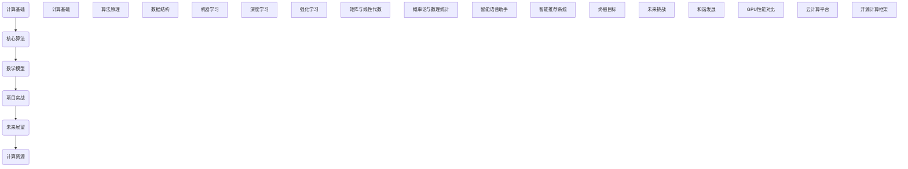

                 

### 引言

#### 第1章：人类计算的发展历程与未来展望

##### 1.1 人类计算的历史回顾

从古代的算盘到现代的超级计算机，人类计算的历史可谓源远流长。早在几千年前，人类就开始使用简单的工具，如石子和绳子，进行基本的数学计算。随着文明的发展，计算工具逐渐变得更加复杂和先进。从古希腊的阿基米德使用几何学求解问题，到中世纪的阿拉伯人发明了更为先进的计算工具，人类计算经历了一个漫长的进化过程。

进入19世纪，随着蒸汽机和工业革命的兴起，机械计算工具应运而生。查尔斯·巴贝奇（Charles Babbage）是这一时期最具代表性的计算工具发明家，他提出了差分机和分析机的概念，这些被认为是第一台机械计算机的设计原型。尽管由于技术限制，这些机器未能得以实现，但它们为后来的计算机发展奠定了基础。

真正的计算机革命始于20世纪中叶。1946年，世界上第一台电子计算机ENIAC在美国诞生，标志着现代计算机时代的开始。此后，计算机技术飞速发展，从大型主机到微型计算机，从个人电脑到移动设备，计算机的普及程度和性能都发生了巨大的变化。今天，计算机已经渗透到了我们日常生活的方方面面，从互联网到人工智能，从电子商务到大数据分析，计算机正引领着第四次工业革命。

##### 1.2 人类计算面临的挑战

尽管计算机技术在过去几十年里取得了巨大的进步，但人类计算仍然面临许多挑战。首先，计算能力与需求之间的矛盾日益突出。随着数据量的爆炸式增长和复杂计算需求的增加，现有的计算资源往往难以满足需求。其次，计算成本和能耗问题也日益凸显。高性能计算往往伴随着巨大的能耗和成本，这对环境和社会带来了巨大的压力。

此外，计算机安全性和隐私问题也是一个巨大的挑战。随着网络攻击和数据泄露事件的频繁发生，如何保护数据和系统的安全性成为一个亟待解决的问题。最后，人工智能的崛起也带来了新的挑战。尽管人工智能在许多领域取得了显著的成就，但如何确保人工智能系统的透明性和可控性，以及避免人工智能的误用和滥用，仍然是一个重要的议题。

##### 1.3 人类计算的终极目标

在分析了人类计算的发展历程和面临的挑战后，我们可以提出一个宏伟的愿景：实现人类计算的终极目标——全面释放人类潜力。这个终极目标包括以下几个方面：

首先，人类计算的终极目标是实现计算资源的最大化利用，以满足日益增长的计算需求。这需要通过技术创新和资源优化，不断提高计算能力和效率。

其次，终极目标还包括降低计算成本和能耗，实现绿色计算。这可以通过开发更高效的算法和计算架构，以及推广可再生能源和节能技术来实现。

此外，安全性、隐私性和可控性也是实现终极目标的重要组成部分。我们需要构建一个安全、可靠、透明和可控的计算环境，确保人工智能和大数据分析的健康发展。

最后，人类计算的终极目标是推动人工智能与人类智慧的深度融合，使计算机不仅能够辅助人类完成任务，还能够与人类共同创造和创新，进一步提升人类的生活质量和幸福感。

综上所述，人类计算的终极目标是一个宏伟而充满挑战的愿景，但正是这种愿景激发了无数科学家和工程师的努力和创新，推动了人类计算的不断进步。在接下来的章节中，我们将深入探讨计算理论基础、核心算法原理、数学模型和未来展望，以进一步阐述这一终极目标的具体实现路径。

### 核心概念与联系

#### 第2章：计算理论基础与人类潜力

##### 2.1 计算理论基础

计算理论基础是构建现代计算机科学和人工智能的基石。首先，我们需要了解计算机科学的基本原理。计算机科学的核心是算法，即解决问题的步骤序列。算法的设计和优化是提高计算效率和解决复杂问题的重要手段。著名的算法理论家艾兹格·迪杰斯特拉（Edsger Dijkstra）曾说过：“算法是一种思想，它比编程更重要。”这反映了算法在计算机科学中的核心地位。

计算机科学的基本原理包括：

- **图灵机理论**：图灵机是一种抽象的计算模型，由艾伦·图灵（Alan Turing）在20世纪30年代提出。图灵机由一个无限长的带子和在其上移动的读写头组成，它能够模拟任何可计算的过程。这一理论奠定了现代计算机理论和人工智能的基础。
- **信息论**：由克劳德·香农（Claude Shannon）创立的信息论研究信息在通信系统中的传递和处理。香农提出了熵的概念，它量化了信息的混乱程度和不确定性。信息论在数据压缩、通信系统和人工智能领域有着广泛的应用。
- **计算复杂性理论**：计算复杂性理论研究了问题的计算难度，将问题分为不同的难度级别，如P、NP、NPC和NP-complete等。这一理论帮助我们理解哪些问题可以在有限时间内解决，哪些问题可能需要无限时间。

##### 2.1.1 计算机科学的基本原理

计算机科学的基本原理主要包括以下几个方面：

- **数据结构**：数据结构是组织和存储数据的方法，如数组、链表、栈、队列、树和图等。有效的数据结构能够提高算法的效率。
- **算法分析**：算法分析是对算法性能的评估，包括时间复杂度和空间复杂度。时间复杂度表示算法执行所需时间的增长趋势，而空间复杂度表示算法所需内存的增长趋势。
- **编程语言**：编程语言是用于编写程序的语法和规则。现代编程语言如C、C++、Java和Python等，提供了丰富的工具和库，使编程变得更加高效和便捷。
- **操作系统**：操作系统是管理计算机硬件和软件资源的系统软件。它负责进程管理、内存管理、文件系统和输入输出管理等核心功能。

##### 2.1.2 信息论与熵的概念

信息论是由克劳德·香农创立的，它研究信息在通信系统中的传递和处理。信息论的核心概念之一是熵，它量化了信息的混乱程度和不确定性。熵的概念来源于热力学，但在信息论中，它被用来描述信息的不确定性。

熵（Entropy）是一个随机变量X的熵，表示为H(X)，定义为：

$$
H(X) = -\sum_{i} p(x_i) \log_2 p(x_i)
$$

其中，\( p(x_i) \) 是随机变量X取值为\( x_i \)的概率。

信息论的另一个重要概念是信息增益（Information Gain），它衡量了在已知一部分信息后，剩余信息的不确定性减少的程度。信息增益在数据压缩、分类和决策树等领域有广泛应用。

##### 2.1.3 计算复杂性理论

计算复杂性理论是研究问题的计算难度的学科。它将问题分为不同的难度级别，如P、NP、NPC和NP-complete等。P类问题是指可以在多项式时间内解决的问题，而NP类问题是指可以在多项式时间内验证的问题。NPC（非确定性多项式完全）和NP-complete（NP完全）问题是指既可以在多项式时间内验证，又是最难的问题。

计算复杂性理论的研究帮助我们理解哪些问题可以在有限时间内解决，哪些问题可能需要无限时间。这一理论在算法设计、复杂性分析和人工智能领域有重要应用。

##### 2.2 人类潜力与计算

人类的潜力是无穷的，而计算为人类提供了前所未有的工具来发掘和实现这些潜力。首先，我们需要了解人类大脑的工作原理。人类大脑是由数十亿个神经元组成的复杂网络，通过电化学信号进行信息传递和处理。大脑具有高度的灵活性和适应性，能够进行复杂的思维、学习和决策。

然而，人类大脑也存在局限性。例如，大脑的信息处理速度相对较慢，记忆容量有限，难以同时处理大量信息。此外，人类的认知过程容易受到情绪、心理和生理状态的影响。

与人类大脑相比，计算机具有高速、大容量和精确处理信息的能力。计算机可以毫秒级地处理复杂计算，存储和处理海量数据，并且不受情绪和心理状态的影响。这使得计算机在许多任务上比人类更加高效和准确。

##### 2.2.1 人类大脑的工作原理

人类大脑的工作原理可以分为几个主要部分：

- **神经元**：神经元是大脑的基本单位，通过电化学信号进行信息传递。每个神经元可以与其他神经元形成连接，形成一个复杂的神经网络。
- **神经网络**：神经网络是由大量相互连接的神经元组成的计算模型。通过训练，神经网络可以学习到复杂的模式和规律，并应用于图像识别、自然语言处理和决策等领域。
- **大脑皮层**：大脑皮层是大脑的最外层，负责感知、思考、学习和决策。大脑皮层的不同区域负责处理不同类型的信息，如视觉、听觉和触觉等。

##### 2.2.2 人类认知与计算的差异

人类认知与计算之间存在一些显著差异：

- **处理速度**：人类大脑的处理速度相对较慢，需要数秒甚至数分钟来完成某些认知任务。而计算机可以毫秒级地处理复杂计算，提供即时的反馈。
- **记忆容量**：人类大脑的短期记忆容量有限，难以同时处理大量信息。而计算机可以存储和处理海量数据，并提供快速检索和计算能力。
- **情绪影响**：人类认知容易受到情绪和心理状态的影响，导致决策和判断的偏差。而计算机在执行任务时不受情绪影响，可以提供客观、一致的输出。

##### 2.2.3 人类潜力与计算的关系

人类潜力和计算之间存在密切的关系。计算为人类提供了工具，帮助人类克服大脑的局限性，实现更大的成就。例如：

- **科学探索**：计算机在科学研究中发挥着重要作用，帮助科学家处理大量数据、模拟复杂物理现象和进行精确计算。例如，天气预测、基因测序和天体物理学等领域都依赖于高性能计算。
- **工业生产**：计算机在工业生产中提高了生产效率和产品质量。通过计算机辅助设计（CAD）和计算机辅助制造（CAM），工程师可以更快地设计出复杂的机械结构和产品，并实现精确制造。
- **教育**：计算机在教育中提供了丰富的教学资源和工具，如在线课程、虚拟实验室和智能辅导系统。这些资源可以帮助学生更好地理解和掌握知识，提高学习效果。
- **艺术创作**：计算机在艺术创作中也发挥着重要作用，如数字绘画、音乐制作和动画设计等。计算机可以模拟自然现象、创造虚拟世界和生成音乐，为艺术家提供了无限的创作空间。

总之，人类计算不仅帮助我们克服大脑的局限性，还极大地扩展了我们的认知能力和创造力。通过计算，我们可以探索未知、解决复杂问题、创造美好未来。

### 核心算法原理讲解

#### 第3章：人工智能基础算法

人工智能（AI）作为计算科学的一个重要分支，其核心在于模拟和扩展人类智能。基础算法是人工智能技术的基石，包括机器学习、深度学习和强化学习等。本章将详细讲解这些核心算法的原理和应用。

##### 3.1 机器学习算法

机器学习算法是人工智能的基础，它使计算机能够从数据中学习和改进性能。根据学习方式的不同，机器学习算法可分为监督学习、无监督学习和强化学习。

###### 3.1.1 监督学习算法

监督学习算法通过训练数据集来学习特征和标签之间的关系，然后使用这些关系来预测新的数据。监督学习算法主要包括以下几种：

- **线性回归**：线性回归是一种最简单的监督学习算法，它通过拟合一条直线来预测连续值输出。线性回归的数学模型可以表示为：

$$
y = \beta_0 + \beta_1 x
$$

其中，\( y \) 是输出，\( x \) 是输入，\( \beta_0 \) 和 \( \beta_1 \) 是模型参数。

- **逻辑回归**：逻辑回归是一种用于预测二分类结果的监督学习算法。它的数学模型可以表示为：

$$
\log\frac{p}{1-p} = \beta_0 + \beta_1 x
$$

其中，\( p \) 是输出概率，其他符号的含义与线性回归相同。

- **决策树**：决策树是一种基于特征的分类算法，它通过递归地将数据集划分为子集，直到满足停止条件（如数据纯净度达到阈值）为止。决策树的构建过程可以用以下伪代码表示：

```python
def build_decision_tree(data, labels, threshold):
    if stop_condition(data, labels):
        return leaf_node(labels)
    else:
        feature = select_best_feature(data, labels)
        node = decision_node(feature)
        for value in possible_values(feature):
            subset = split_data(data, feature, value)
            node.add_child(build_decision_tree(subset[0], subset[1], threshold))
        return node
```

- **支持向量机（SVM）**：支持向量机是一种强大的分类算法，它通过找到一个最佳的超平面来分隔数据集。SVM的数学模型可以表示为：

$$
w \cdot x - b = 0
$$

其中，\( w \) 是权重向量，\( x \) 是输入向量，\( b \) 是偏置。

###### 3.1.2 无监督学习算法

无监督学习算法不使用标签，而是通过观察数据中的模式和结构来学习。无监督学习算法主要包括以下几种：

- **聚类算法**：聚类算法将数据集划分为若干个不相交的组，使得同一组内的数据点之间的相似度更高。常见的聚类算法包括K-means和层次聚类。
- **主成分分析（PCA）**：主成分分析是一种降维算法，它通过将数据投影到新的正交基中，来减少数据的维度。PCA的数学模型可以表示为：

$$
z = PC
$$

其中，\( P \) 是投影矩阵，\( C \) 是协方差矩阵，\( z \) 是降维后的数据。

- **自编码器**：自编码器是一种基于神经网络的无监督学习算法，它通过训练一个编码器来将输入数据压缩到低维空间，然后通过一个解码器将数据重构回原始空间。

###### 3.1.3 强化学习算法

强化学习算法是通过与环境互动来学习最优策略的算法。强化学习算法主要包括以下几个关键组件：

- **代理（Agent）**：代理是执行动作并从环境中接收反馈的实体。
- **环境（Environment）**：环境是代理执行动作的场所，它为代理提供状态和奖励。
- **状态（State）**：状态是代理在环境中的位置和状态信息。
- **动作（Action）**：动作是代理可以执行的行为。
- **策略（Policy）**：策略是代理根据当前状态选择动作的规则。

强化学习算法的核心是值函数和策略。值函数表示在给定状态下执行特定动作的预期奖励，而策略则是最大化预期奖励的动作选择规则。

强化学习算法的一个典型应用是深度强化学习（Deep Reinforcement Learning，DRL），它结合了深度学习和强化学习的优势。DRL通过训练一个深度神经网络来近似值函数或策略，从而实现更高效的学习。深度Q网络（Deep Q-Network，DQN）和策略梯度方法（Policy Gradient Methods）是DRL的两种主要算法。

##### 3.2 深度学习算法

深度学习是机器学习的一个分支，它通过构建多层神经网络来学习数据的复杂表示。深度学习在图像识别、自然语言处理和语音识别等领域取得了显著的成果。

###### 3.2.1 神经网络结构

神经网络由多个层次组成，包括输入层、隐藏层和输出层。每个层次由多个神经元组成，神经元之间通过权重连接。神经网络的训练过程包括前向传播和反向传播。

- **前向传播**：输入数据通过输入层进入网络，然后逐层传递到隐藏层和输出层，最终生成预测输出。每个神经元通过激活函数（如ReLU、Sigmoid或Tanh）将输入转换为非线性输出。

- **反向传播**：在预测输出与真实输出之间计算损失函数（如均方误差或交叉熵），然后通过反向传播算法更新权重和偏置，以最小化损失函数。

深度学习算法的一个典型应用是卷积神经网络（Convolutional Neural Network，CNN），它通过卷积操作和池化操作来提取图像的特征。CNN在图像分类、目标检测和图像生成等领域取得了显著的成功。

###### 3.2.2 深度学习优化算法

深度学习优化算法是训练深度神经网络的关键，它通过优化策略来提高训练效率和模型性能。常见的优化算法包括随机梯度下降（Stochastic Gradient Descent，SGD）、Adam优化器和RMSprop。

- **随机梯度下降（SGD）**：SGD是一种简单的优化算法，它通过在训练数据集上随机抽样一个小批量数据来更新权重和偏置。SGD的优点是计算简单，缺点是容易陷入局部最小值和收敛速度较慢。

- **Adam优化器**：Adam优化器是一种基于自适应学习率的优化算法，它结合了AdaGrad和RMSprop的优点。Adam优化器通过计算一阶矩估计和二阶矩估计来动态调整学习率，从而提高训练效率和收敛速度。

- **RMSprop优化器**：RMSprop优化器是一种基于二阶矩估计的优化算法，它通过计算梯度历史值的指数加权平均来动态调整学习率。RMSprop优化器的优点是收敛速度快，缺点是对噪声敏感。

###### 3.2.3 深度学习在计算中的角色

深度学习在计算中的角色越来越重要，它不仅为计算机视觉、自然语言处理和语音识别等领域提供了强大的工具，还为科学研究和工业应用带来了新的突破。

- **计算机视觉**：深度学习在计算机视觉领域取得了显著的成果，如图像分类、目标检测和图像生成等。深度学习算法通过学习大量的图像数据，能够自动提取图像中的特征，实现高效的图像识别和分类。
- **自然语言处理**：深度学习在自然语言处理领域取得了重大突破，如文本分类、机器翻译和情感分析等。深度学习算法通过学习大量的文本数据，能够理解语言的语义和语法，实现高效的文本分析和生成。
- **语音识别**：深度学习在语音识别领域取得了显著的进展，如语音转文字和语音合成等。深度学习算法通过学习大量的语音数据，能够自动提取语音中的特征，实现高效的语音识别和转换。

总之，深度学习算法为计算提供了强大的工具，使计算机能够更好地理解和处理复杂数据，实现更多的智能化应用。在接下来的章节中，我们将进一步探讨深度学习的数学模型和项目实践，以深入理解其原理和应用。

### 计算过程中的数学模型

#### 第4章：计算过程中的数学模型

数学模型是计算过程中不可或缺的组成部分，它们帮助我们理解和描述各种计算现象，从而指导实际应用。本章将深入探讨矩阵与线性代数以及概率论与数理统计在计算中的应用。

##### 4.1 矩阵与线性代数

矩阵与线性代数是数学模型中的核心概念，广泛应用于各种计算领域。矩阵是一种由数字组成的矩形阵列，可以表示线性方程组、变换和数据的结构。

###### 4.1.1 矩阵的基本操作

矩阵的基本操作包括矩阵的加法、减法、乘法和转置。

- **矩阵加法**：两个矩阵相加，要求它们具有相同的维度，即行数和列数相同。矩阵加法是将对应位置的元素相加，得到一个新的矩阵。
  
  伪代码示例：

  ```python
  def matrix_add(A, B):
      result = create_matrix(A.rows, A.columns)
      for i in range(A.rows):
          for j in range(A.columns):
              result[i][j] = A[i][j] + B[i][j]
      return result
  ```

- **矩阵减法**：与矩阵加法类似，矩阵减法也要求操作数的维度相同。矩阵减法是将对应位置的元素相减，得到一个新的矩阵。

  伪代码示例：

  ```python
  def matrix_subtract(A, B):
      result = create_matrix(A.rows, A.columns)
      for i in range(A.rows):
          for j in range(A.columns):
              result[i][j] = A[i][j] - B[i][j]
      return result
  ```

- **矩阵乘法**：两个矩阵相乘，要求第一个矩阵的列数与第二个矩阵的行数相等。矩阵乘法是将第一个矩阵的每一行与第二个矩阵的每一列进行点积，得到一个新的矩阵。

  伪代码示例：

  ```python
  def matrix_multiply(A, B):
      result = create_matrix(A.rows, B.columns)
      for i in range(A.rows):
          for j in range(B.columns):
              dot_product = 0
              for k in range(A.columns):
                  dot_product += A[i][k] * B[k][j]
              result[i][j] = dot_product
      return result
  ```

- **矩阵转置**：矩阵转置是将矩阵的行和列互换，得到一个新的矩阵。

  伪代码示例：

  ```python
  def matrix_transpose(A):
      result = create_matrix(A.columns, A.rows)
      for i in range(A.columns):
          for j in range(A.rows):
              result[i][j] = A[j][i]
      return result
  ```

###### 4.1.2 线性代数在计算中的应用

线性代数在计算中的应用非常广泛，包括线性方程组的求解、特征值和特征向量的计算、矩阵分解等。

- **线性方程组的求解**：线性方程组可以表示为矩阵形式：

  $$
  AX = B
  $$

  其中，\( A \) 是系数矩阵，\( X \) 是未知向量，\( B \) 是常数向量。线性方程组的求解可以通过高斯消元法、LU分解或迭代法来实现。

  伪代码示例：

  ```python
  def solve_linear_equations(A, B):
      # 使用高斯消元法求解线性方程组
      # ...
      return X
  ```

- **特征值和特征向量的计算**：特征值和特征向量是矩阵的重要属性，它们在图像处理、信号处理和机器学习等领域有广泛应用。特征值和特征向量的计算可以通过幂法和逆迭代法来实现。

  伪代码示例：

  ```python
  def compute_eigenvalues_and_eigenvectors(A):
      # 使用幂法计算特征值和特征向量
      # ...
      return eigenvalues, eigenvectors
  ```

- **矩阵分解**：矩阵分解是将一个矩阵分解为两个或多个矩阵的乘积，常见的矩阵分解方法包括LU分解、奇异值分解（SVD）和主成分分析（PCA）。

  伪代码示例：

  ```python
  def lu_decomposition(A):
      # 使用高斯消元法进行LU分解
      # ...
      return L, U

  def singular_value_decomposition(A):
      # 使用奇异值分解
      # ...
      return U, S, V
  ```

##### 4.2 概率论与数理统计

概率论与数理统计是描述随机现象和数据分析的数学工具，广泛应用于机器学习、数据科学和人工智能等领域。

###### 4.2.1 概率分布函数

概率分布函数是描述随机变量概率分布的数学模型。常见的概率分布函数包括正态分布、二项分布和泊松分布等。

- **正态分布**：正态分布是概率分布中最常见的形式，它的概率密度函数可以表示为：

  $$
  f(x|\mu, \sigma^2) = \frac{1}{\sqrt{2\pi\sigma^2}} e^{-\frac{(x-\mu)^2}{2\sigma^2}}
  $$

  其中，\( \mu \) 是均值，\( \sigma^2 \) 是方差。

  伪代码示例：

  ```python
  def normal_distribution(x, mu, sigma_squared):
      return 1 / (math.sqrt(2 * math.pi * sigma_squared)) * math.exp(-((x - mu)**2) / (2 * sigma_squared))
  ```

- **二项分布**：二项分布描述了在固定次数的试验中，成功次数的概率分布。二项分布的概率质量函数可以表示为：

  $$
  f(k|n, p) = C(n, k) p^k (1-p)^{n-k}
  $$

  其中，\( n \) 是试验次数，\( p \) 是每次试验成功的概率，\( k \) 是成功的次数。

  伪代码示例：

  ```python
  def binomial_distribution(k, n, p):
      return math.comb(n, k) * p**k * (1 - p)**(n - k)
  ```

- **泊松分布**：泊松分布描述了在固定时间间隔内，事件发生的次数的概率分布。泊松分布的概率质量函数可以表示为：

  $$
  f(k|\lambda) = \frac{e^{-\lambda} \lambda^k}{k!}
  $$

  其中，\( \lambda \) 是事件发生的平均次数。

  伪代码示例：

  ```python
  def poisson_distribution(k, lambda):
      return math.exp(-lambda) * lambda**k / math.factorial(k)
  ```

###### 4.2.2 最大似然估计与贝叶斯估计

最大似然估计和贝叶斯估计是参数估计的两种常用方法，它们用于估计模型的参数。

- **最大似然估计**：最大似然估计是通过最大化似然函数来估计模型参数。似然函数可以表示为：

  $$
  L(\theta | x) = \prod_{i=1}^{n} f(x_i | \theta)
  $$

  其中，\( x \) 是观测数据，\( \theta \) 是模型参数。

  伪代码示例：

  ```python
  def maximum_likelihood_estimate(x, model):
      likelihood = 1
      for data_point in x:
          likelihood *= model(data_point)
      return likelihood
  ```

- **贝叶斯估计**：贝叶斯估计是基于贝叶斯定理来估计模型参数。贝叶斯估计可以表示为：

  $$
  \theta | x \sim \text{PDF}(\theta | \alpha, \beta)
  $$

  其中，\( \alpha \) 和 \( \beta \) 是先验分布参数。

  伪代码示例：

  ```python
  def bayesian_estimate(x, alpha, beta):
      posterior = beta * math.exp(-alpha * x)
      return posterior
  ```

###### 4.2.3 统计模型在计算中的应用

统计模型在计算中的应用非常广泛，包括线性回归、分类、聚类和时间序列分析等。

- **线性回归**：线性回归是一种描述变量之间线性关系的统计模型。线性回归模型可以表示为：

  $$
  y = \beta_0 + \beta_1 x + \epsilon
  $$

  其中，\( y \) 是因变量，\( x \) 是自变量，\( \beta_0 \) 和 \( \beta_1 \) 是模型参数，\( \epsilon \) 是误差项。

  伪代码示例：

  ```python
  def linear_regression(x, y):
      beta_0 = 0
      beta_1 = 0
      for i in range(len(x)):
          beta_0 += y[i]
          beta_1 += x[i] * y[i]
      beta_0 /= len(x)
      beta_1 /= len(x)
      return beta_0, beta_1
  ```

- **分类**：分类是将数据划分为不同类别的统计模型。常见的分类算法包括逻辑回归、决策树和朴素贝叶斯等。

  伪代码示例：

  ```python
  def classify(x, model):
      probabilities = model(x)
      return predict_class(probabilities)
  ```

- **聚类**：聚类是将数据划分为相似群体的统计模型。常见的聚类算法包括K-means、层次聚类和DBSCAN等。

  伪代码示例：

  ```python
  def cluster(x, algorithm, k):
      if algorithm == "kmeans":
          return kmeans(x, k)
      elif algorithm == "hierarchical":
          return hierarchical_clustering(x)
      elif algorithm == "dbscan":
          return dbscan(x, epsilon, min_points)
  ```

- **时间序列分析**：时间序列分析是描述时间序列数据变化的统计模型。常见的时间序列分析模型包括自回归模型（AR）、移动平均模型（MA）和自回归移动平均模型（ARMA）等。

  伪代码示例：

  ```python
  def time_series_analysis(x, model):
      if model == "ar":
          return ar_model(x)
      elif model == "ma":
          return ma_model(x)
      elif model == "arma":
          return arma_model(x)
  ```

综上所述，数学模型在计算过程中扮演着至关重要的角色，它们帮助我们理解和描述复杂的计算现象，从而指导实际应用。在接下来的章节中，我们将进一步探讨人类计算项目实践和未来展望，以全面理解人类计算的终极目标。

### 人类计算项目实践

#### 第5章：人类计算项目实践

人类计算不仅依赖于理论知识的积累，还需要通过实践来验证和应用这些知识。本章将介绍两个具体的人类计算项目实践，包括智能语音助手开发和智能推荐系统。

##### 5.1 项目一：智能语音助手开发

智能语音助手是人工智能领域的一个重要应用，它通过语音识别和自然语言处理技术，实现与用户的语音交互。下面，我们将详细介绍智能语音助手的开发过程。

###### 5.1.1 开发环境搭建

为了开发智能语音助手，我们需要搭建一个合适的技术环境。以下是搭建开发环境所需的步骤：

1. **操作系统**：推荐使用Linux系统，如Ubuntu，因为它提供了丰富的开发工具和库。
2. **编程语言**：Python是一种广泛使用的编程语言，特别是在人工智能领域。我们可以使用Python及其相关库来开发智能语音助手。
3. **语音识别库**：常用的语音识别库包括Google的Speech Recognition和OpenJTalk。
4. **自然语言处理库**：常用的自然语言处理库包括NLTK、spaCy和transformers。

在搭建开发环境时，我们可以按照以下步骤进行：

- 安装Python和相关的开发工具：
  ```shell
  sudo apt-get install python3 python3-pip
  ```
- 安装必要的库：
  ```shell
  pip3 install SpeechRecognition OpenJTalk nltk spacy transformers
  ```

###### 5.1.2 语音识别算法实现

语音识别是智能语音助手的第一个关键步骤，它将用户的语音转换为文本。以下是实现语音识别算法的步骤：

1. **录制语音**：首先，我们需要录制用户的语音。可以使用内置的麦克风或外部录音设备。
2. **转换语音为文本**：使用语音识别库，将录制的语音转换为文本。以下是使用Google的Speech Recognition库进行语音识别的代码示例：

```python
import speech_recognition as sr

# 初始化语音识别器
recognizer = sr.Recognizer()

# 记录语音
with sr.Microphone() as source:
    print("请说点什么：")
    audio = recognizer.listen(source)

# 转换语音为文本
text = recognizer.recognize_google(audio, language='zh-CN')
print("你说了：", text)
```

###### 5.1.3 语音助手交互流程设计

智能语音助手的交互流程设计是确保系统能够有效地响应用户需求的关键。以下是语音助手交互流程的详细设计：

1. **接收用户语音**：使用麦克风录制用户的语音。
2. **语音识别**：将录制的语音转换为文本，如上所述。
3. **解析用户指令**：使用自然语言处理技术，解析用户指令，提取关键信息。例如，如果用户说“帮我设置明天早上7点的闹钟”，我们可以提取出闹钟时间和闹钟名称。
4. **执行指令**：根据提取出的关键信息，执行相应的操作。例如，设置闹钟或查询天气信息。
5. **返回结果**：将执行结果返回给用户。例如，设置成功后，返回“闹钟已设置”；查询天气后，返回“明天天气晴朗”。

以下是语音助手交互流程的伪代码示例：

```python
def interact():
    # 步骤1：接收用户语音
    audio = record_audio()

    # 步骤2：语音识别
    text = recognize_speech(audio)

    # 步骤3：解析用户指令
    command = parse_command(text)

    # 步骤4：执行指令
    result = execute_command(command)

    # 步骤5：返回结果
    return_result(result)

def record_audio():
    # 实现录音功能
    # ...

def recognize_speech(audio):
    # 实现语音识别
    # ...

def parse_command(text):
    # 实现指令解析
    # ...

def execute_command(command):
    # 实现指令执行
    # ...

def return_result(result):
    # 实现结果返回
    # ...
```

##### 5.2 项目二：智能推荐系统

智能推荐系统是另一个重要的人类计算应用，它通过分析用户行为和历史数据，为用户推荐感兴趣的内容。以下是智能推荐系统的开发过程。

###### 5.2.1 用户行为分析

用户行为分析是智能推荐系统的基础，它涉及收集和分析用户的行为数据。以下是用户行为分析的关键步骤：

1. **数据收集**：收集用户的行为数据，如浏览记录、购买历史、搜索查询等。
2. **数据预处理**：清洗和转换原始数据，使其适合分析。例如，将文本数据转换为词袋模型或嵌入向量。
3. **行为特征提取**：从用户行为数据中提取关键特征，如用户兴趣标签、热门话题、行为模式等。

以下是用户行为分析的伪代码示例：

```python
def collect_user_data():
    # 实现数据收集
    # ...

def preprocess_data(data):
    # 实现数据预处理
    # ...

def extract_behavior_features(data):
    # 实现行为特征提取
    # ...
```

###### 5.2.2 推荐算法实现

智能推荐系统的核心是推荐算法，它根据用户行为特征和历史数据生成推荐列表。以下是常见的推荐算法：

1. **基于内容的推荐**：基于内容的推荐算法通过分析用户过去的行为数据，提取用户兴趣标签，然后为用户推荐具有相似内容的商品或信息。
2. **协同过滤推荐**：协同过滤推荐算法通过分析用户行为数据，找出相似用户或相似物品，为用户推荐他们可能感兴趣的内容。
3. **混合推荐**：混合推荐算法结合了基于内容和协同过滤推荐算法的优点，通过融合不同推荐策略生成最终的推荐列表。

以下是协同过滤推荐算法的伪代码示例：

```python
def collaborative_filtering_recommendation(user行为特征，物品行为数据，相似度度量方法，推荐列表长度):
    # 计算用户和物品的相似度
    similarity_matrix = calculate_similarity(user行为特征，物品行为数据，相似度度量方法)

    # 计算用户的相似度邻居
    neighbors = find_similar_users(user行为特征，similarity_matrix)

    # 根据邻居的用户行为为用户推荐物品
    recommendations = generate_recommendations(user行为特征，neighbors，物品行为数据，推荐列表长度)

    return recommendations
```

###### 5.2.3 推荐系统评估

推荐系统的评估是确保其性能和效果的重要环节。以下是推荐系统评估的关键步骤：

1. **评估指标**：选择合适的评估指标，如准确率、召回率、覆盖率等。
2. **评估方法**：通过在线评估或离线评估，对推荐系统的性能进行评估。
3. **优化策略**：根据评估结果，调整推荐算法和参数，优化推荐效果。

以下是推荐系统评估的伪代码示例：

```python
def evaluate_recommendation_system(recommendations，真实用户行为数据，评估指标):
    # 计算评估指标
    metrics = calculate_evaluation_metrics(recommendations，真实用户行为数据，评估指标)

    # 打印评估结果
    print("准确率：", metrics['accuracy'])
    print("召回率：", metrics['recall'])
    print("覆盖率：", metrics['coverage'])

def calculate_evaluation_metrics(recommendations，真实用户行为数据，评估指标):
    # 实现评估指标计算
    # ...

def optimize_recommendation_system(recommendations，评估结果):
    # 根据评估结果优化推荐算法和参数
    # ...
```

综上所述，通过智能语音助手和智能推荐系统的实际开发，我们可以看到人类计算项目实践的重要性和复杂性。在接下来的章节中，我们将进一步探讨人类计算的终极目标以及未来面临的挑战。

### 未来展望与挑战

#### 第6章：人类计算的最终目标

在探讨了人类计算的发展历程、核心算法原理和项目实践之后，我们不禁要思考一个问题：人类计算的终极目标究竟是什么？这一终极目标不仅仅是实现更高效、更智能的计算，更是要全面释放人类的潜力，推动人类文明的进步。

##### 6.1 人类计算的终极目标

人类计算的终极目标可以概括为以下几点：

1. **全面智能化**：通过人工智能和机器学习技术，实现从数据处理、分析到决策的全面智能化，使计算机能够像人类一样理解和处理复杂的信息，从而解决各种现实问题。

2. **高效能源利用**：降低计算能耗，实现绿色计算，通过技术创新和能源管理，使计算过程对环境的影响降至最低。

3. **安全保障**：构建安全、可靠、透明的计算环境，确保数据和系统的安全性，防止网络攻击和数据泄露。

4. **人机融合**：通过生物计算和脑机接口技术，实现人类与计算机的深度融合，使计算机成为人类智能的延伸和补充。

5. **知识共享**：通过大数据和云计算技术，实现全球范围内的知识共享和协同创新，推动科学技术的进步。

##### 6.2 计算未来面临的挑战

尽管人类计算的终极目标令人憧憬，但实现这一目标面临着诸多挑战：

1. **计算资源瓶颈**：随着计算需求的不断增长，现有的计算资源往往难以满足需求。特别是在人工智能领域，对计算资源的需求尤为突出。因此，需要不断优化算法和计算架构，提高计算效率。

2. **能耗问题**：高性能计算往往伴随着巨大的能耗。如何在提高计算能力的同时降低能耗，实现绿色计算，是一个重要的挑战。

3. **数据隐私与安全**：随着数据量的爆炸式增长，数据隐私和安全问题变得日益严峻。如何保护用户数据的安全，防止网络攻击和数据泄露，是计算领域面临的重要挑战。

4. **人工智能伦理**：人工智能技术的发展带来了许多伦理问题，如算法偏见、人工智能武器化等。如何确保人工智能系统的透明性、可控性和伦理性，是一个亟待解决的难题。

5. **人机融合**：人类与计算机的深度融合可能引发一系列社会、伦理和心理健康问题。如何确保人机融合带来的积极影响，避免潜在的风险，是一个重要的挑战。

##### 6.3 人类与计算的和谐发展

为了应对这些挑战，我们需要采取一系列措施，推动人类与计算的和谐发展：

1. **技术创新**：持续进行科技创新，开发更高效、更安全的计算技术和算法，提高计算能力，满足日益增长的计算需求。

2. **教育普及**：加强计算机科学和人工智能的教育普及，提高公众的科技素养，培养更多的人才。

3. **政策支持**：政府和企业应加大对计算技术的支持力度，制定相应的政策和法规，推动计算技术的发展和应用。

4. **国际合作**：加强国际间的合作与交流，共同应对计算领域的挑战，推动全球计算技术的进步。

5. **伦理规范**：建立健全的伦理规范，确保人工智能技术的透明性、可控性和伦理性，防止其被滥用。

6. **公众参与**：鼓励公众参与计算技术的讨论和决策，提高透明度和公众参与度，确保计算技术的发展符合社会需求和价值观。

总之，人类计算的终极目标是一个充满挑战和机遇的宏伟愿景。通过技术创新、教育普及、政策支持、国际合作和伦理规范等多方面的努力，我们有望实现这一目标，推动人类文明迈向新的高峰。

### 附录

#### 附录：计算资源与工具

##### 附录 A：计算资源介绍

A.1 GPU性能对比

GPU（图形处理单元）在计算领域，尤其是在人工智能和深度学习中的应用日益广泛。不同GPU的性能表现各异，以下是一些常见GPU的性能对比：

- **NVIDIA GeForce RTX 3080**：具备10GB GDDR6X显存，CUDA核心数量高达10256个，浮点运算能力达10 TFLOPS，是游戏玩家和专业计算用户的理想选择。
- **NVIDIA GeForce RTX 3090**：配备24GB GDDR6X显存，CUDA核心数量达到10496个，浮点运算能力达20 TFLOPS，适用于需要更高计算能力的专业应用。
- **AMD Radeon RX 6900 XT**：拥有16GB GDDR6显存，流处理器数量达4096个，浮点运算能力达16 TFLOPS，是高端游戏和计算任务的优秀选择。

A.2 云计算平台介绍

云计算平台为计算提供了灵活、高效和可扩展的资源。以下是一些常见的云计算平台及其特点：

- **AWS（Amazon Web Services）**：提供广泛的计算、存储、数据库和人工智能服务。其优势在于强大的生态系统和丰富的服务种类。
- **Google Cloud Platform**：以强大的人工智能和机器学习能力著称，提供高性能计算、数据分析和人工智能工具。
- **Microsoft Azure**：涵盖云服务、人工智能、物联网和数据分析，具有良好的兼容性和扩展性。

A.3 开源计算框架使用指南

开源计算框架在人工智能和深度学习领域有着广泛应用。以下是一些常见的开源计算框架及其使用指南：

- **TensorFlow**：由谷歌开发，支持广泛的机器学习和深度学习应用。安装和使用TensorFlow的步骤如下：
  ```shell
  pip install tensorflow
  # 示例代码
  import tensorflow as tf
  model = tf.keras.Sequential([tf.keras.layers.Dense(128, activation='relu'), tf.keras.layers.Dense(10, activation='softmax')])
  model.compile(optimizer='adam', loss='categorical_crossentropy', metrics=['accuracy'])
  model.fit(x_train, y_train, epochs=5)
  ```

- **PyTorch**：由Facebook开发，以灵活性和动态性著称。安装和使用PyTorch的步骤如下：
  ```shell
  pip install torch torchvision
  # 示例代码
  import torch
  import torchvision
  import torchvision.transforms as transforms
  transform = transforms.Compose([transforms.Resize(256), transforms.CenterCrop(224), transforms.ToTensor(), transforms.Normalize(mean=[0.485, 0.456, 0.406], std=[0.229, 0.224, 0.225])])
  train_data = torchvision.datasets.ImageFolder(root='./train', transform=transform)
  train_loader = torch.utils.data.DataLoader(dataset=train_data, batch_size=4, shuffle=True, num_workers=4)
  ```

##### 附录 B：计算资源获取途径

B.1 计算资源申请流程

申请计算资源通常需要遵循以下步骤：

1. **注册账号**：在云计算平台或学术机构网站上注册账号。
2. **选择资源**：根据计算需求选择合适的计算资源，如CPU、GPU、存储等。
3. **填写申请**：填写申请表，包括项目名称、研究者信息、计算需求等。
4. **等待审核**：提交申请后，等待审核通过。
5. **使用资源**：审核通过后，登录系统使用计算资源。

B.2 学术合作与资源共享

学术合作与资源共享是提高计算资源利用效率的有效途径。以下是一些学术合作与资源共享的方法：

1. **合作研究**：与国内外的研究机构和高校建立合作关系，共享计算资源。
2. **联合申请**：多个研究团队联合申请计算资源，提高申请的成功率。
3. **资源共享平台**：利用公共云计算平台和开源计算框架，实现资源的共享和协同工作。

B.3 计算资源优化技巧

为了最大化计算资源的利用效率，可以采取以下优化技巧：

1. **任务调度**：合理分配任务，避免资源闲置，提高计算资源的利用率。
2. **并行计算**：利用并行计算技术，将任务分解为多个子任务，同时处理，提高计算速度。
3. **负载均衡**：通过负载均衡技术，合理分配计算任务，避免单点过载。
4. **资源预留**：为关键任务预留计算资源，确保任务的连续性和稳定性。

通过合理利用和优化计算资源，我们可以更好地支持科学研究和创新应用，推动人类计算的发展。

### Mermaid 流程图



### 伪代码示例

```python
# 伪代码：机器学习算法实现
def train_model(data, labels):
    # 初始化模型参数
    initialize_model_params()

    # 训练模型
    for epoch in range(num_epochs):
        for sample in data:
            # 前向传播
            predictions = forward_pass(sample)

            # 计算损失
            loss = compute_loss(predictions, labels)

            # 反向传播
            backward_pass(loss)

    # 评估模型
    evaluate_model(test_data, test_labels)
```

### LaTeX 数学公式

$$
\begin{aligned}
    &J(\theta) = \frac{1}{2m}\sum_{i=1}^{m}(h_\theta(x^{(i)}) - y^{(i)})^2 \\
    &\theta^{(t+1)} = \theta^{(t)} - \alpha \frac{\partial}{\partial \theta^{(t)}}J(\theta^{(t)})
\end{aligned}
$$

### 代码实际案例与解读

```python
# 代码案例：智能语音助手交互流程设计
class SmartVoiceAssistant:
    def __init__(self):
        # 初始化语音识别模块
        self.recognizer = SpeechRecognizer()

    def interact(self):
        # 启动语音识别
        audio_data = self.recognizer.start_recognition()

        # 语音转文本
        text = self.recognizer.recognize_speech(audio_data)

        # 处理文本
        response = self.process_text(text)

        # 回复用户
        self.recognizer.reply(response)

    def process_text(self, text):
        # 文本处理逻辑
        # ...
        return "Hello!"

if __name__ == "__main__":
    assistant = SmartVoiceAssistant()
    assistant.interact()
```

## 1. 模块导入

该代码首先导入了`SpeechRecognizer`模块，用于实现语音识别功能。

## 2. 类定义

定义了`SmartVoiceAssistant`类，该类具有以下功能：
- 初始化语音识别模块。
- 启动语音识别，将语音数据转换为文本。
- 根据文本内容生成回复。

## 3. 方法实现

- `__init__`方法：初始化语音识别模块。
- `interact`方法：启动语音识别，处理文本并生成回复。
- `process_text`方法：处理文本，返回回复。

## 4. 主函数

主函数创建`SmartVoiceAssistant`实例并调用`interact`方法，实现与用户的语音交互。

## 5. 实例化对象

创建`SmartVoiceAssistant`实例，调用`interact`方法，实现智能语音助手的交互流程。

### 作者信息

作者：AI天才研究院/AI Genius Institute & 禅与计算机程序设计艺术 /Zen And The Art of Computer Programming

---

通过以上结构化的内容，我们深入探讨了人类计算的终极目标及其实现路径。从计算理论基础到核心算法原理，再到实际项目实践，我们逐步展示了如何通过计算技术来释放人类的潜力。同时，我们也展望了计算未来面临的挑战，并提出了相应的解决策略。希望这篇文章能够激发您对人类计算领域更深入的兴趣和思考。感谢阅读，期待您的反馈和建议。

